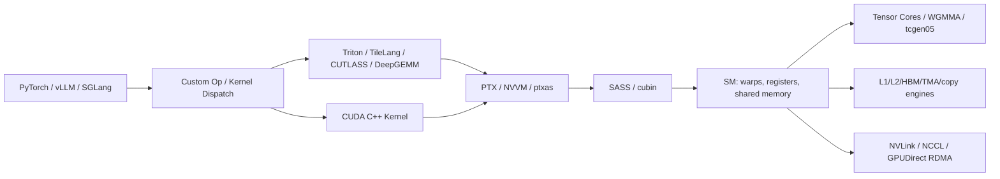

# GPU Architecture Map: Volta To Blackwell

*图 A：Volta 到 Blackwell 的代际特性矩阵。可编辑源图：[`module-12-gpu-architecture-matrix.excalidraw`](diagrams/module-12-gpu-architecture-matrix.excalidraw)。*

这份文件是高级篇的代际地图。具体数字和支持矩阵应以 NVIDIA 当前官方文档为准。

## 为什么要学 GPU 代际

CUDA 编程模型保持相对稳定，但高性能写法强烈依赖硬件代际。一个 kernel 在 Ampere 上的关键优化可能是 `cp.async`；在 Hopper 上可能要理解 TMA、WGMMA、thread block clusters；在 Blackwell 上还要面对多个编译目标。课程重点使用 SM100/SM120 做例子，但 NVIDIA 当前 compute capability 表和 `nvcc` 还会列出更多 Blackwell `sm_*` / `compute_*` 目标（例如 10.3、11.0、12.1 等产品线）；数据中心 SM100 的 tcgen05/TMEM/NVLink 5 不能无条件外推到其他 Blackwell 目标。

记忆句：**CUDA 语法相对稳定，性能路径随硬件换代。**

## 代际心智模型

| 架构 | Compute capability 线索 | 课程关注点 | 写 kernel 时的影响 |
|---|---|---|---|
| Volta | 7.0 | Tensor Core 进入主线、独立线程调度 | WMMA、warp 行为、shared memory |
| Turing | 7.5 | 推理和混合精度继续发展 | INT8/FP16、consumer/pro datacenter 差异 |
| Ampere | 8.x | `cp.async`、TF32/BF16、第三代 Tensor Core、更大 L2/shared | async copy pipeline、TF32 baseline、A100 vs 8.6 差异 |
| Hopper | 9.0 | TMA、WGMMA、thread block clusters、distributed shared memory | warpgroup GEMM、TMA pipeline、cluster-level thinking |
| Blackwell | 多个 10.x/11.x/12.x 编译目标；课程主线示例用 SM100/SM120 | 更强 Tensor Core、FP4/FP8、family/architecture-specific 目标；NVLink 5 与 tcgen05/TMEM 主要按数据中心 SM100 路径讲解 | DeepGEMM/vLLM 中的 SM100/SM120 分支、SM100 tcgen05、FP4 scaling、RTX fallback；完整支持矩阵查 NVIDIA compute capability 表、当前 `nvcc`、CUTLASS 和框架文档 |

## 软件到硬件的对应关系

## 学习路径

1. 先学稳定抽象：thread/block/grid、memory hierarchy、sync、profiling。
2. 再学 architecture-aware：occupancy、register、shared memory、coalescing、warp divergence。
3. 再学 Tensor Core stack：WMMA -> MMA -> WGMMA -> CUTLASS/DeepGEMM。
4. 再学 data movement stack：global/shared -> `cp.async` -> TMA -> distributed shared memory。
5. 再学 communication stack：PCIe/NVLink -> NCCL -> GPUDirect RDMA -> DeepEP。
6. 最后学 framework integration：PyTorch custom op -> vLLM/SGLang -> Triton/TileLang 对比。
