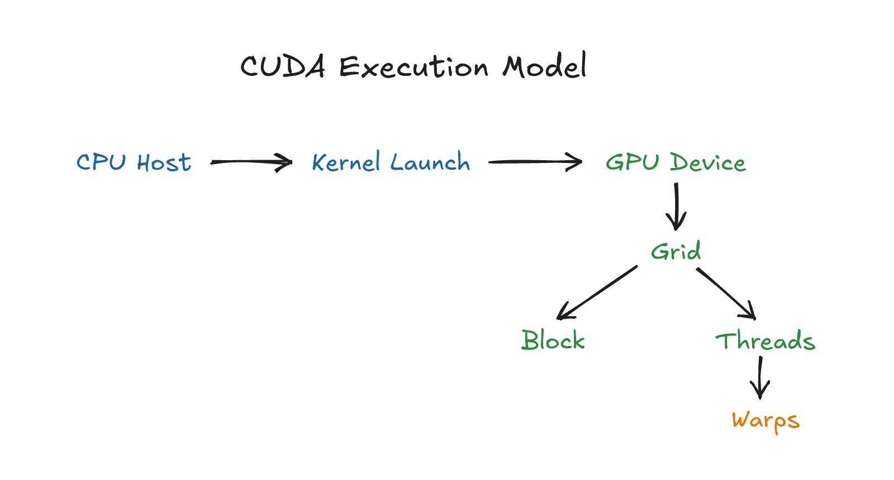

# CUDA Hardware Mental Models

*图 H：CPU host、GPU device、kernel launch、grid、block、thread、warp 与数据搬运的核心关系。可编辑源图：[`cuda-execution-model.excalidraw`](diagrams/cuda-execution-model.excalidraw)。*

这份文件是 20 周课程的硬件心智模型速查。它不是替代官方文档，而是帮助你在学习时快速定位“这个概念背后的硬件问题是什么”。

## 1. CPU 与 GPU

CPU 像少数强专家，擅长复杂控制流和低延迟响应。GPU 像大型流水线工厂，擅长大量相似任务的吞吐。

记忆句：**CPU 擅长少而精，GPU 擅长多而齐。**

## 2. SM

Streaming Multiprocessor 是 GPU 上执行 blocks 和 warps 的主要硬件单元。一个 GPU 有多个 SM。block 被分配到某个 SM，不能拆开跨 SM 执行。

记忆句：**grid 是任务总单，block 是团队，SM 是团队工作的车间。**

## 3. Warp

Warp 是常见 NVIDIA GPU 上的基本调度群体，通常包含 32 个 threads。你写 thread-level 代码，但硬件常以 warp 为单位推进。

记忆句：**你写 thread，硬件排 warp。**

## 4. Divergence

同一个 warp 内 threads 如果走不同分支，硬件可能分路径执行。分支不是原罪，warp 内严重分叉才是问题。

记忆句：**同路同行，分路排队。**

## 5. Memory Coalescing

同一个 warp 内相邻 threads 访问相邻地址时，内存系统更容易合并请求。分散访问会浪费带宽。

记忆句：**同 warp，邻地址，少跑腿。**

## 6. Shared Memory

Shared memory 是 block 内协作的手动中转仓。它低延迟、容量有限、需要同步，也可能有 bank conflict。

记忆句：**shared memory 是中转仓，不是无限缓存。**

## 7. Registers

Registers 是 thread 私有的最快存储。每个 thread 用太多 registers，会限制同一 SM 上能同时驻留的 warps 或 blocks。

记忆句：**寄存器越多，单人越舒服，团队可能越挤。**

## 8. Occupancy

Occupancy 描述 SM 上活跃 warps 的程度。它有助于隐藏延迟，但不是最终目标。

记忆句：**occupancy 是待命厨师数，不是出餐速度。**

## 9. Host/Device Transfer

Host 和 device 内存不是一回事。H2D/D2H copy 是跨城市物流，有固定开销。

记忆句：**地址有城市，搬家要物流。**

## 10. Streams

Stream 是 GPU 工作队列。同一 stream 内有序，不同 stream 可在依赖允许且硬件资源允许时重叠。

记忆句：**stream 是队列，event 是路标，sync 是红灯。**

## 11. Libraries

CUB、Thrust、cuBLAS 等库封装了大量硬件和算法优化。使用库是专业选择，不是逃避底层。

记忆句：**懂底层的人，更知道什么时候不要自己造轮子。**

## 12. Profiling

Profiler 把性能猜测变成证据。Nsight Systems 看全局时间线，Nsight Compute 看单个 kernel 内部。

记忆句：**Systems 看谁在等谁，Compute 看 kernel 为什么慢。**

## 13. Tensor Core

Tensor Core 是矩阵乘累加的专用硬件路径。它很快，但要求 dtype、layout、tile size、accumulation 和 memory movement 都配合。

记忆句：**Tensor Core 是专用高速灶，锅、菜、上菜节奏都要匹配。**

## 14. WMMA、MMA、WGMMA

WMMA 是较高层的 C++ 碎片接口，MMA/PTX 更接近指令，WGMMA 是 Hopper 之后面向 warpgroup 的矩阵乘路径。

记忆句：**WMMA 像说明书，MMA 像齿轮，WGMMA 像一组齿轮一起转。**

## 15. TMA

Tensor Memory Accelerator 可以把多维 tensor tile 在 global memory 和 shared memory 之间异步搬运，减少线程手工搬砖的压力。

记忆句：**TMA 是搬运吊车，线程负责指挥，吊车负责运货。**

## 16. PTX/SASS

PTX 是中间表示，SASS 更接近实际机器指令。它们适合验证编译路径，不适合替代 profiler。

记忆句：**看指令能查路线，判性能还要看路况。**

## 17. CUDA Graph

CUDA Graph 把一串固定执行路径捕获下来，减少反复 launch 的开销。它喜欢稳定 shape、稳定内存地址和稳定依赖。

记忆句：**Graph 是固定剧本，临场改戏会出问题。**

## 18. NVLink/NVSwitch

NVLink 是 GPU 间高速通道，NVSwitch 让多 GPU 间连接更均衡。拓扑会影响 tensor parallel、expert parallel 和通信策略。

记忆句：**多卡不只数卡，还要看路。**

## 19. GPUDirect RDMA

GPUDirect RDMA 让网卡等 PCIe peer device 在合适条件下直接访问 GPU memory，减少 CPU 中转，但引入 registration、NUMA、IOMMU、驱动和拓扑约束。

记忆句：**RDMA 少绕路，但通行证和路线图都要办好。**

## 20. NCCL

NCCL 把 GPU 间 collective 和 P2P 通信组织成高性能路径。它和 CUDA stream、拓扑、buffer 生命周期密切相关。

记忆句：**NCCL 是车队调度，不是瞬移魔法。**

## 21. KV Cache

KV cache 保存历史 token 的 key/value，让 decode 不必重算历史。它消耗 HBM，并让 attention kernel 受 layout、分页和调度影响。

记忆句：**KV cache 是图书馆，decode 每步都要查旧书。**

## 22. PagedAttention

PagedAttention 把逻辑连续的 sequence 映射到物理 KV cache blocks，减少碎片并支持动态请求，但带来 block table indirection。

记忆句：**逻辑上连续，物理上分页，目录表负责找书。**

## 23. Triton/TileLang

Triton 和 TileLang 用 tile/dataflow 抽象提高 kernel 开发效率，但抽象会改变你能直接控制的硬件细节。

记忆句：**DSL 省手工，也要付控制力的账。**

## 24. Framework Contract

现代 CUDA 算子要满足 PyTorch/vLLM/SGLang 的 schema、shape、dtype、stream、fake/meta、fallback、benchmark 和 packaging 约束。

记忆句：**kernel 是零件，框架契约让它成为产品。**
