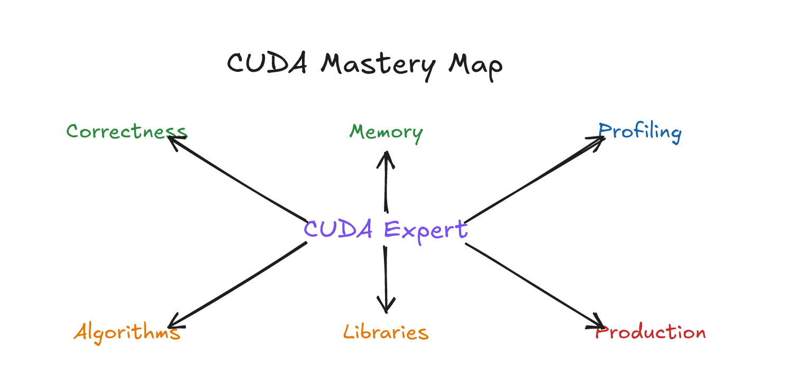

# CUDA 编程从小白到专家：现代 GPU Kernel 与 LLM 推理系统精品课

*图 0：课程知识图谱，从正确性、内存、profiling、并行算法、库、架构感知优化到生产工程。可编辑源图：[`course-knowledge-map.excalidraw`](diagrams/course-knowledge-map.excalidraw)。*

访问日期：2026-06-28  
默认语言：中文讲解，代码和 API 名称保留英文  
默认节奏：20 周，每周 8-16 小时  
默认工具链：以 NVIDIA CUDA Toolkit 13.3 官方文档为当前参考；实际学习时以本机 `nvcc --version`、驱动和 GPU 能力为准。

## 学员画像

本课程面向“知道 C/C++ 基础但还不会 CUDA”的学习者。如果 C/C++ 指针、数组、编译、命令行还不熟，先完成第 0 周的诊断和补课任务，再进入第 1 周。

## 最终能力

完成课程后，学习者应该能：

- 准确解释 CUDA host/device、grid/block/thread/warp、内存层级和同步模型。
- 写出正确的 CUDA C++ kernel，并用错误检查和 Compute Sanitizer 发现问题。
- 用 CUDA events、Nsight Systems、Nsight Compute 做可复现测量。
- 用 coalescing、shared-memory tiling、occupancy 推理、streams、libraries 改善性能。
- 判断什么时候应该使用 CUB、Thrust、cuBLAS、CUTLASS 或其他库，而不是手写 kernel。
- 解释 Volta/Ampere/Hopper/Blackwell 关键硬件能力如何影响 kernel 设计。
- 理解 Tensor Core、WMMA、MMA、WGMMA、TMA、PTX/SASS 在现代 GEMM 中的位置。
- 解释 NCCL、NVLink、GPUDirect RDMA、DeepEP 如何支撑多 GPU/MoE 推理。
- 把 CUDA 算子注册为 PyTorch custom op，并设计 vLLM/SGLang 接入、fallback、benchmark 和精度验证。
- 对比 CUDA/CUTLASS/Triton/TileLang/DeepGEMM 的抽象边界和工程取舍。
- 交付一个带测试、benchmark、profiling report、框架接口、文档和架构 caveat 的 CUDA capstone。

## 课程结构

每一课都按“故事线 -> 类比 -> 硬件视角 -> 实验 -> 深入追问 -> checkpoint”展开。不要把它当作 API 清单读。正确读法是：先抓住比喻和心智模型，再把它落到代码和 profiler 证据上。

| 周 | 模块 | 核心产物 | 现实落点 |
|---|---|---|---|
| 0 | 环境、C/C++ 预备、第一段 CUDA 程序 | 环境记录、CPU warmup | CUDA Samples |
| 1 | 执行模型与第一个 kernel | vector add、indexing 练习 | PyTorch extension 前置 |
| 2 | 内存管理、错误检查、正确性 | robust host wrapper、Compute Sanitizer 记录 | custom op correctness |
| 3 | 内存层级、coalescing、tiling | transpose baseline 与 tiled 版本 | memory-bound kernel |
| 4 | 同步、atomics、reduction | block reduction、histogram | CUB baseline |
| 5 | 性能测量与 profiling 基础 | profiling report v1 | Nsight Systems/Compute |
| 6 | 并行算法模式 | scan/stencil/convolution 小项目 | kernel pattern library |
| 7 | CUDA 库：Thrust、CUB、cuBLAS | custom vs library comparison | production baseline |
| 8 | streams、events、overlap、graphs | overlap pipeline | inference pipeline |
| 9 | 架构感知优化 | occupancy、PTX/SASS 观察 | architecture caveat |
| 10 | 生产工程：CMake、测试、benchmark、接口 | small CUDA library | maintainable extension |
| 11 | 专家 capstone studio | baseline、optimized、report、review | end-to-end evidence chain |
| 12 | GPU 架构演进：Volta 到 Blackwell | 架构对比图、feature matrix | soft-hardware mapping |
| 13 | Tensor Core、WMMA、MMA 与 GEMM 分层 | naive/tiled/wmma/cutlass 对照 | matmul kernel mental model |
| 14 | PTX、SASS、WGMMA、TMA 与异步流水线 | PTX reading notes、pipeline diagram | Hopper/Blackwell kernel |
| 15 | CUTLASS、CuTe、DeepGEMM 与现代 GEMM 工程 | FP8/FP4 GEMM study | DeepGEMM/vLLM |
| 16 | NCCL、NVLink、GPUDirect RDMA 与 DeepEP | all-to-all/MoE 通信图 | expert parallelism |
| 17 | PyTorch custom ops 到 vLLM/SGLang 注册路径 | torch op package + benchmark | inference framework integration |
| 18 | Attention、KV Cache、PagedAttention、MLA 与推理算子 | attention kernel case study | vLLM/SGLang |
| 19 | Triton、TileLang 与 CUDA/CUTLASS 对比 | same op in 3 programming models | modern kernel DSLs |

## 学习主线

这门课刻意安排成一条连续故事：

1. 先让实验可信，而不是先追求速度。
2. 再让 kernel 正确，而不是先写复杂优化。
3. 再理解数据怎么从 CPU 城市送到 GPU 城市。
4. 再理解为什么内存访问顺序决定性能上限。
5. 再学习 thread 之间如何安全协作。
6. 再用 profiler 把猜测变成证据。
7. 再把问题识别成并行算法模式。
8. 再学会使用库，而不是重复造轮子。
9. 再用 streams 做系统级并发。
10. 再进入 architecture-aware 优化。
11. 然后进入 Tensor Core、PTX、TMA、WGMMA 等硬件贴近层。
12. 再进入 NCCL/RDMA/DeepEP 这类多 GPU 通信路径。
13. 再把 CUDA 算子注册进 PyTorch、vLLM、SGLang。
14. 最后比较 CUDA/CUTLASS/Triton/TileLang 的抽象边界。

## 每课学习方法

- 第 1 遍：只读故事线、类比和本课要记住的一句话。
- 第 2 遍：读硬件视角，画出自己的图。
- 第 3 遍：跑 lab，记录失败和版本。
- 第 4 遍：写 checkpoint，不看讲义复述核心思想。
- 第 5 遍：做 extension 或项目，把本课知识和前面课程连接起来。

## 项目

- `projects/project-01-profiled-vector-pipeline.md`：从 vector add 到可测量 pipeline。
- `projects/project-02-memory-optimized-kernels.md`：transpose/reduction 的内存优化与 profiling。
- `projects/project-03-library-concurrency-pipeline.md`：CUB/cuBLAS 与 streams overlap。
- `projects/project-04-expert-capstone.md`：专家级最终项目。
- `projects/project-05-pytorch-custom-op-benchmark.md`：把 CUDA kernel 做成 PyTorch custom op。
- `projects/project-06-modern-gemm-fp8-deepgemm-study.md`：FP8/FP4 GEMM、CUTLASS/DeepGEMM 与 vLLM case study。
- `projects/project-07-moe-communication-deepep-rdma.md`：MoE dispatch/combine、NCCL、RDMA、DeepEP 通信设计。
- `projects/project-08-triton-tilelang-cuda-comparison.md`：同一算子在 CUDA/Triton/TileLang/CUTLASS 路线下的对比。

## 评估方式

- 第 0 周：`assessments/diagnostic.md`。
- 每周：`assessments/weekly-checkpoints.md` 中对应 checkpoint。
- 项目：使用 `assessments/rubric.md`。
- 结课：capstone 代码、测试、benchmark、profiling report 和口头/书面解释。

## 使用方式

1. 先读 `resources.md` 和 `WRITING_GUIDE.md`。
2. 按周完成 `modules/` 中的模块。
3. 每 3 周完成一个项目，最后完成 capstone。
4. 每次优化都必须留下 measurement note：硬件、输入规模、编译选项、测量方法、结果、结论。
5. 不复制课程里的性能数字。所有性能判断都要在自己的 GPU 上重新测量。
