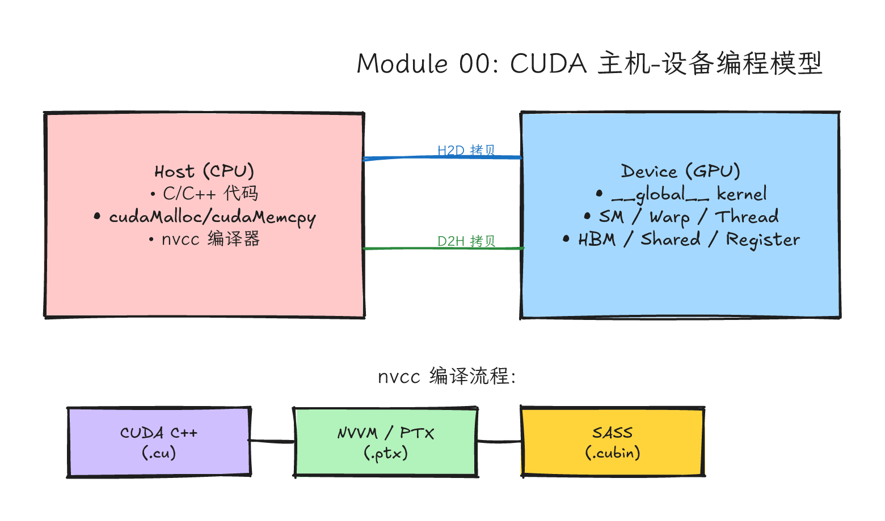
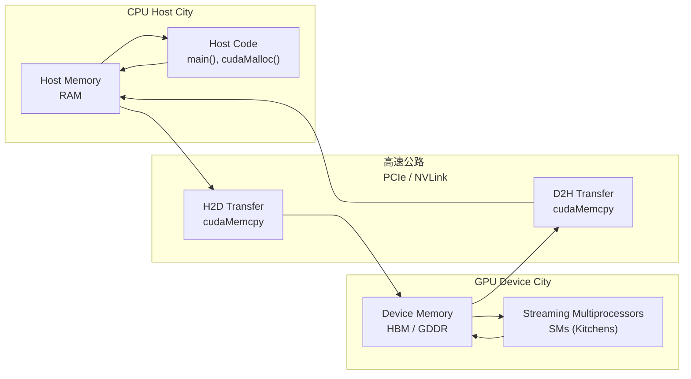
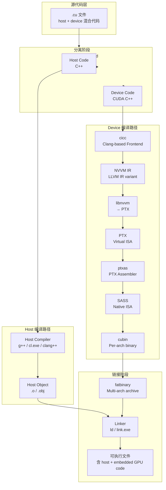
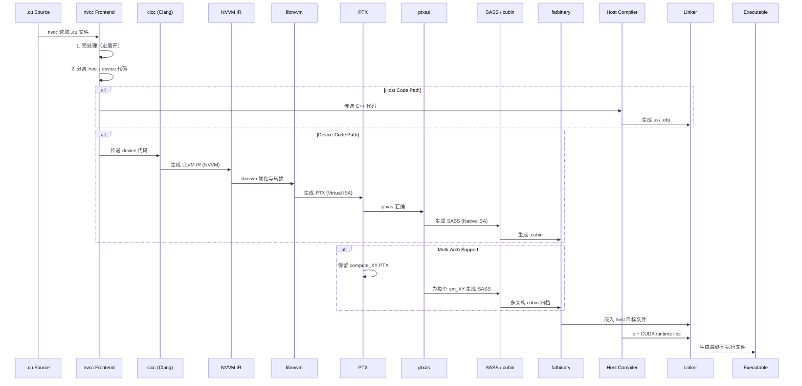

# Module 00: 从"会写程序"到"能和 GPU 对话"



*图 00-1：CUDA host/device 分工与最小运行链路。可编辑源图：[`module-00-cuda-host-device-model.excalidraw`](../diagrams/module-00-cuda-host-device-model.excalidraw)。*

Level: 入门前置
Estimated time: 8–12 小时
Prerequisites: 会写基本 C/C++，能使用命令行，理解指针与内存地址
Sources: CUDA Toolkit Release Notes, CUDA Installation Guides, CUDA Samples, NVIDIA CUDA Documentation
------------------------------------------------------------------------------------------------------

## 学习目标 (Learning Objectives)

完成本模块后，你将能够

1. **解释** 为什么 GPU 不是"更快的 CPU"，并画出 CPU-GPU 协作的抽象数据流图。
2. **描述** 从 Fermi 到 Blackwell 的 GPU 架构演进主线，以及 CUDA 编程模型如何保持向后兼容。
3. **执行** 完整环境诊断流程：解读 `nvidia-smi`、检查 driver-toolkit 版本兼容性、验证 CMake CUDA 语言支持。
4. **追踪** 一份 `.cu` 文件从源代码到 GPU 机器码的完整编译路径（host compiler → NVVM → PTX → SASS）。
5. **选择** 适合目标硬件的 `nvcc` 编译选项（`-arch`, `-code`, `-O3`, `--use_fast_math` 等），并解释其对性能与精度的影响。
6. **构建** 一个可跨平台复现的 CMake CUDA 项目骨架（CMake 3.24+），包含多 GPU 检测和运行时架构选择。
7. **写出** 一段自动化的环境诊断脚本（Bash + Python），能够生成结构化的环境报告。
8. **识别** 编译错误、运行时错误、kernel 异步错误之间的区别，并选择合适的调试工具。

---

## 这一课的故事线

很多 CUDA 初学者一上来就想写 `__global__ kernel`，但这像还没看地图就开车进一座陌生城市。GPU 编程的第一道门不是 `__global__`，而是搞清楚你手里到底有什么交通系统：CPU 是调度中心，GPU 是并行工厂，driver 是道路管制，CUDA Toolkit 是工具箱，Nsight 是监控室。
这一课的目标是让你先理解环境。 你不需要马上懂所有硬件细节，但必须能回答：我的程序跑在哪张 GPU 上？用哪个 driver？用哪个 CUDA Toolkit？编译器是谁？之后的每一次性能比较，都要能回到这张环境地图。
我们用一个贯穿全模块的比喻来建立 mental model

> 把 CUDA 程序运行想象成餐厅出餐。
>
> - CPU host：前台和调度员，接单、分配任务、检查结果。它处理复杂任务强，但一次只能处理几件事。
> - GPU device：后厨，数百上千名厨师同时处理大量相似订单。如果每个订单都很小、很杂、还频繁来回传菜，流水线优势会被传输和调度成本吃掉。
> - CUDA driver：餐厅运营许可证和后厨门禁。没有它，系统连 GPU 的门都进不去。
> - CUDA Runtime API：前台常用话术。比如"送食材到后厨"（`cudaMemcpy`）、"开始做菜"（`kernel<<<>>>` launch）、"把成品拿回来"（`cudaMemcpy` device-to-host）。
> - `nvcc` 编译器：会同时处理前台说明书和后厨菜谱的编译器。它把 CPU 代码交给 g++ 或 cl.exe，把 GPU 代码交给 NVIDIA 自己的编译链路。
> - Nsight Systems：看整家餐厅的时间线—谁在等谁，传菜员是否空转。
> - Nsight Compute：盯着某一道菜的制作细节—锅是否空转、厨师是否撞在同一条通道上、调料（shared memory）够不够用。

---

## 分层一：问题背景 → 了解环境的原因

### 从 CPU 到 GPU：为什么不是"更快"，而是"不同"

CPU 和 GPU 的设计目标从晶体管层面就不同。理解这一点是 CUDA 优化的基础。

| 维度                                                                                                             | CPU                                    | GPU                              |
| ---------------------------------------------------------------------------------------------------------------- | -------------------------------------- | -------------------------------- |
| 设计目标                                                                                                         | 低延迟（latency）                      | 高吞吐（throughput）             |
| 核心数量                                                                                                         | 少（8–128 个强核心）                  | 多（数千个轻量核心）             |
| 控制逻辑占比                                                                                                     | 大量晶体管用于分支预测、乱序执行、缓存 | 大量晶体管用于计算单元（ALU/FP） |
| 线程切换开销                                                                                                     | 高（上下文保存到内存）                 | 极低（硬件调度 resident warps 来隐藏延迟；不是软件线程那种重上下文切换） |
| 擅长场景                                                                                                         | 复杂控制流、不规则数据访问             | 数据并行、规则访问、计算密集     |
| CPU 像少数经验丰富的厨师，能处理复杂临场变化、临时改菜单、边做边尝。                                             |                                        |                                  |
| GPU 像大型流水线厨房，适合一大批相同形状的订单同时下锅。如果订单形状不同，流水线就要停下来换模具，优势瞬间消失。 |                                        |                                  |

### 问题背景：实验可能不可信的原因

当你在 Stack Overflow 上看到"这个 kernel 快了 10 倍"时，没有以下信息的"10 倍"几乎没有工程价值

1. GPU 硬件：A100 (SM80) vs RTX 4090 (SM89) vs H100 (SM90) — 它们的 SM 数量、memory bandwidth、cache 层次、Tensor Core 代数完全不同。
2. 输入规模：`N = 1024` 和 `N = 2^24` 的瓶颈完全不同。小数据量下，kernel launch 开销和 H2D/D2H 传输时间可能占主导。
3. 编译选项：`-O3` vs `-O0`、`-arch=sm_80` vs `-arch=sm_50`、`--use_fast_math` 是否开启—这些可能带来 40% 以上的性能差异。
4. 测量工具：`std::chrono` 测的是 wall-clock time，Nsight Compute 测的是 SM active cycles，两者数字含义不同。
   完整性能报告应包含："在 NVIDIA A100 (SM80, 80 GB HBM2e)、CUDA Toolkit 12.4、Driver 550.54、编译选项 `-arch=sm_80 -O3 --use_fast_math`、输入规模 `N = 2^24` float、使用 Nsight Compute 2024.1 测量的条件下，将 coalesced access 优化后的 `saxpy` kernel 相比 baseline 获得了 1.8x 的带宽提升。"

---

## 分层二：直觉类比 → 两个城市的交通系统

### 类比：CPU 城与 GPU 城

想象有两座城市

- CPU 城（Host City）：街道宽敞但少，每辆车都能走任意路线，交警（控制逻辑）非常发达。适合处理复杂任务，但单辆车速度快不代表整体吞吐高。
- GPU 城（Device City）：道路狭窄但数量惊人，所有车必须按同一方向、同一车道、同一批次行驶。没有红绿灯，但所有车必须同时启动、同时到达。适合大规模重复运输，但如果路线不同（分支发散），整个车队都要停下来等。
  数据流：食材（数据）必须从 CPU 城的仓库（host memory）通过专用高速公路（PCIe / NVLink）运到 GPU 城的仓库（device memory），才能在 GPU 城的厨房（SM）里加工。加工完后再运回来。



### 类比：编译器如同翻译局

`nvcc` 不是单一编译器，而是一个编译驱动系统（compiler driver），相当于一个"双语翻译局"。它把你写的一份混合语言文件（CUDA C++，同时包含 host 端的 C++ 和 device 端的 CUDA 代码）拆开

- Host 端：交给城市的官方翻译官（g++ on Linux, cl.exe on Windows, clang++ on macOS）处理。
- Device 端：交给 NVIDIA 自己的专有翻译团队，经过优化（NVVM IR）→ 中间表示（PTX）→ 机器码（SASS）→ 打包（cubin fatbinary）。



---

## 分层三：硬件机制 → GPU 架构演进与计算能力

### GPU 架构演进：从 Fermi 到 Blackwell

NVIDIA GPU 的架构以著名科学家命名，大约每两年迭代一次。CUDA 编程模型的设计（grid → block → thread 三级层次、SIMT 执行模型、shared memory 显式管理）从 2006 年 CUDA 诞生起就保持兼容，这是 CUDA 生态能够积累代码的关键原因。

| 架构代号               | 年份  | 代表性 GPU                                              | Compute Capability                                                                    | 创新                                                                                                                                                                                                                        |
| ---------------------- | ----- | ------------------------------------------------------- | ------------------------------------------------------------------------------------- | --------------------------------------------------------------------------------------------------------------------------------------------------------------------------------------------------------------------------- |
| **Fermi**        | 2010  | GTX 480, Tesla M2090                                    | 2.0                                                                                   | 首次引入 L1/L2 cache 层次；双精度支持；ECC memory（Tesla 版）                                                                                                                                                               |
| **Kepler**       | 2012  | GTX 680 (sm_30), Tesla K40 (sm_35)                      | 3.0–3.5                                                                               | Kepler 覆盖多个 CC；Hyper-Q 与 Dynamic Parallelism 主要看 3.5+ 数据中心/高端路径，不能把 GTX 680 与 K40 能力混为一谈                                                                                                        |
| **Maxwell**      | 2014  | GTX 750 Ti, GTX 980, Jetson Nano                        | 5.0–5.3                                                                               | 统一内存（Unified Memory）雏形；更高能效比；不同桌面/嵌入式 SKU 的 CC 和资源上限不同                                                                                                                                          |
| **Pascal**       | 2016  | GTX 1080 Ti (sm_61), P100 (sm_60)                       | 6.0–6.1                                                                              | GP100/P100 数据中心路径引入 NVLink、HBM2 和高吞吐 FP16；GTX 10 系列不能直接套用 P100 的互联和 FP16 吞吐能力                                                                                                                  |
| **Volta**        | 2017  | V100                                                    | 7.0                                                                                   | Tensor Core（第一代）；独立线程调度；统一的 Shared Memory/L1/Texture 数据缓存                                                                                                                                               |
| **Turing**       | 2018  | RTX 2080 Ti, T4                                         | 7.5                                                                                   | RT Core；第二代 Tensor Core；DLSS 雏形                                                                                                                                                                                      |
| **Ampere**       | 2020  | A100, RTX 3090, Jetson AGX Orin                         | 8.0–8.7                                                                              | 第三代 Tensor Core；稀疏加速；`cp.async`；MIG 与 HBM2e 是 A100 等数据中心路径特性，RTX/Jetson Ampere 需要按各自 CC 和产品规格确认                                                                                              |
| **Ada Lovelace** | 2022  | RTX 4090                                                | 8.9                                                                                   | 第四代 Tensor Core；DLSS 3；光流加速器；更高时钟频率                                                                                                                                                                        |
| **Hopper**       | 2022  | H100                                                    | 9.0                                                                                   | FP8 Transformer Engine；DPX 指令；更大 Shared Memory；NVLink 4                                                                                                                                                              |
| **Blackwell**    | 2024+ | B200/GB200/GB300, RTX 50 系列、GB10/Jetson Blackwell 等 | 课程示例：10.0（SM100 数据中心）/ 12.0（SM120 RTX）；官方表还列出 10.3、11.0、12.1 等 | 第五代 Tensor Core；FP4/FP6/FP8；tcgen05/TMEM 与 NVLink 5 主要属于数据中心 SM100/SM10x 路径，RTX/GB10/Jetson Blackwell 需按各自 CC 单独确认；完整目标列表以 NVIDIA compute capability 表和当前`nvcc --list-gpu-code` 为准 |

> PTX 是虚拟指令集。普通 `compute_70` PTX 通常可以在满足 compute capability ≥ 7.0、驱动支持该 PTX 版本、且不涉及 architecture-specific 目标的后续 GPU 上通过 driver JIT 编译运行。这是 CUDA 前向兼容的技术基础。但 SASS（原生机器码）是架构绑定的，为 `sm_80` 编译的 SASS 只能在兼容的 8.x GPU 上直接运行。

### Compute Capability（计算能力）表

Compute Capability（CC）是 CUDA 用来区分 GPU 代际能力的版本号，格式为 `X.Y`。`X` 是主要架构版本，`Y` 是同一架构内的 minor 版本。`nvcc` 的 `-arch` 和 `-code` 参数直接对应这个编号。

> Compute Capability 解决什么问题？不同代 GPU 的寄存器数量、shared memory 大小、warp size、Tensor Core 可用性、原子指令支持都不同。CUDA 需要一种标准化的"能力标识"，让编译器和 runtime 知道当前 GPU 支持哪些指令、多少资源。这就是 Compute Capability。
>
> | Compute Capability                                                                                                                                                                                          | 架构                  | 代表 GPU                | 关键能力                                                            |
> | ----------------------------------------------------------------------------------------------------------------------------------------------------------------------------------------------------------- | --------------------- | ----------------------- | ------------------------------------------------------------------- |
> | 5.0                                                                                                                                                                                                         | Maxwell               | GTX 750 Ti              | 基础 Unified Memory                                                 |
> | 5.2                                                                                                                                                                                                         | Maxwell               | GTX 980, GTX 970        | 更多 SMs，更高能效                                                  |
> | 6.0                                                                                                                                                                                                         | Pascal                | P100                    | FP16, NVLink, HBM2                                                  |
> | 6.1                                                                                                                                                                                                         | Pascal                | GTX 1080 Ti, TITAN Xp   | GP102 核心                                                          |
> | 7.0                                                                                                                                                                                                         | Volta                 | V100                    | 第一代 Tensor Core，独立线程调度，并发 FP32/INT32 路径               |
> | 7.5                                                                                                                                                                                                         | Turing                | RTX 2080 Ti, T4         | RT Core，第二代 Tensor Core                                         |
> | 8.0                                                                                                                                                                                                         | Ampere                | A100                    | MIG，第三代 Tensor Core，稀疏矩阵                                   |
> | 8.6                                                                                                                                                                                                         | Ampere                | RTX 3090, A40           | 更大 L2 cache，更多 SMs                                             |
> | 8.7                                                                                                                                                                                                         | Ampere                | Jetson AGX Orin         | 嵌入式优化                                                          |
> | 8.9                                                                                                                                                                                                         | Ada Lovelace          | RTX 4090, RTX 4080      | 第四代 Tensor Core，DLSS 3                                          |
> | 9.0                                                                                                                                                                                                         | Hopper                | H100, H200              | FP8 Transformer Engine，DPX                                         |
> | 10.0                                                                                                                                                                                                        | Blackwell DC 示例     | B200 / GB200            | 第五代 Tensor Core，FP4/FP6/FP8，tcgen05/TMEM，NVLink 5             |
> | 10.3                                                                                                                                                                                                        | Blackwell DC 示例     | B300 / GB300            | Blackwell 数据中心后续目标，资源和库路径按官方表与 Toolkit 文档确认 |
> | 11.0                                                                                                                                                                                                        | Blackwell Jetson 示例 | Jetson T4000/T5000 系列 | 嵌入式 Blackwell 目标，不能套用 B200 或 RTX 资源上限                |
> | 12.0                                                                                                                                                                                                        | Blackwell RTX 示例    | RTX 5090 等             | RTX Blackwell 路径，SMEM 上限和数据中心 Blackwell 不同              |
> | 12.1                                                                                                                                                                                                        | Blackwell GB10 示例   | GB10 / DGX Spark 类产品 | GB10 目标，需按官方表和目标软件栈确认                               |
> | Blackwell 的`nvcc` 编译目标不止 10.0/12.0。CUDA 工具链会随版本列出更多 `sm_10x`、`sm_11x`、`sm_12x` 目标，生产脚本应直接查 NVIDIA compute capability 表和本机 Toolkit。                             |                       |                         |                                                                     |
> | 运行`nvidia-smi` 查看 GPU 名称后，查上表找到对应 CC。这是选择 `nvcc -arch` 和 `CMAKE_CUDA_ARCHITECTURES` 的依据。如果你的项目要在多个 GPU 上运行，通常需要生成多个 SASS 版本并嵌入 PTX 以备未来兼容。 |                       |                         |                                                                     |

---

## 分层四：代码路径 → nvcc 编译流程说明

### 理解编译流程的原因

CUDA 程序跨越 host 和 device 两个世界。编译器需要把一份代码拆成两份，各自走不同的编译管道，最后再链接成一个可执行文件。不理解这个流程，遇到"undefined reference to `__cudaRegisterLinkedBinary`"或"no kernel image is available for execution on the device"等错误时，你不知道原因。

### 完整编译流程



### 各阶段说明

#### 阶段 1：预处理（Preprocessing）

`nvcc` 调用 C++ 预处理器处理宏定义、`#include`、`#ifdef` 等。这一步同时处理 host 和 device 代码。

#### 阶段 2：代码分离（Compilation Phase Separation）

`nvcc` 将 `.cu` 文件中的代码分为两类

- **Host code**：普通 C++ 函数、`main()`、host 端的 `cudaMalloc` 等调用。
- **Device code**：带有 `__global__`、`__device__`、`__host__` 等修饰符的函数。

> `__global__` 解决什么问题？它标记一个函数是 **kernel**，表示它可以从 host 端调用，但在 device 端执行。没有 `__global__`，`nvcc` 不会把它放入 device 编译路径。

#### 阶段 3：Device 编译（cicc → NVVM IR → PTX）

- **`cicc`**：NVIDIA 基于 Clang 的 CUDA C++ 前端。它把 device 端的 CUDA C++ 代码编译成 **NVVM IR**。
- **NVVM IR**：NVIDIA 对 LLVM IR 的扩展，是一种中间表示。它的存在让其他语言（如 Python 的 Triton、Rust 的 rust-gpu）可以更容易地生成 GPU 代码，只需生成 NVVM IR，而不需要直接处理 PTX。
- **libnvvm**：把 NVVM IR 转换为 **PTX**（Parallel Thread Execution）。PTX 是 NVIDIA GPU 的虚拟指令集，类似于 Java 字节码或 LLVM IR。

> PTX 是虚拟 ISA。为普通 `compute_80` 生成的 PTX，通常可以在 Compute Capability ≥ 8.0、驱动支持该 PTX 版本、且没有使用 `compute_90a` 这类 architecture-specific 目标限制的 GPU 上 JIT 运行。当程序在较新的 GPU 上运行时，如果可执行文件中没有该 GPU 的 SASS，driver 会尝试把 PTX 即时编译（JIT）成目标 GPU 的 SASS。这是 CUDA 的"前向兼容"能力。

#### 阶段 4：PTX 到 SASS（ptxas）

- **`ptxas`**：PTX 汇编器，把 PTX 转换为 **SASS**（Streaming Assembly）。SASS 是 GPU 的原生机器码，直接对应硬件指令。
- SASS 是架构绑定的，但普通 cubin 通常具有同一 major 内"低 minor → 高 minor"的二进制兼容性：例如 `sm_80` 的普通 SASS 可以在 `sm_86`/`sm_89` 这类 8.x 后续设备上直接运行；反过来不保证，跨 major（如 `sm_80` 到 `sm_90`）也不兼容。带 `a`/`f` 等 architecture-specific 或 family-specific 后缀的目标要按当前 `nvcc` 文档单独确认。

#### 阶段 5：Fatbinary 生成

如果你的 `nvcc` 命令为多个架构编译（通常用多组 `-gencode`），`nvcc` 会使用 **`fatbinary`** 工具把所有生成的 cubin（SASS 二进制）和 PTX 归档到一个"fat binary"中。运行时，CUDA driver 会选择最适合当前 GPU 的版本。

#### 阶段 6：Host 编译与链接

Host 端代码由系统的 C++ 编译器（g++、cl.exe 或 clang++）编译成目标文件。最后，链接器把 host 目标文件、fat binary、CUDA runtime 库（`libcudart.so` / `cudart.lib`）等链接成最终可执行文件。

### 关键编译选项说明

`nvcc` 的选项直接控制上述编译流程。以下是选项

#### `-arch=compute_XY`（虚拟架构）

- 指定虚拟架构（PTX 级别），决定编译时哪些 CUDA 特性可用。
- 例如 `-arch=compute_80` 表示 PTX 级别 8.0，可以使用 Ampere 引入的所有特性。
- 注意区分两种 shorthand：`-arch=compute_XY` 指定的是虚拟架构（PTX 能力级别）；`-arch=sm_XY` 是面向真实架构的常用简写，现代 `nvcc` 会把它映射到相应 virtual architecture 和 real code 组合。不要把二者混成一句“只指定 `-arch` 就一定同时生成 SASS 和 PTX”。生产构建应使用显式 `-gencode arch=compute_XY,code=...`，并用 `nvcc --dryrun` / `cuobjdump` 检查 fatbinary 中实际包含了哪些 cubin/PTX。

#### `-code=sm_XY`（真实架构）

- 指定真实架构，为特定 GPU 生成 SASS（原生机器码）。
- 例如 `-code=sm_80` 为 A100 生成机器码，`-code=sm_86` 为 RTX 3090 生成机器码。
- 可以指定多个 `-code` 值，生成多个版本的 SASS。

#### `-code=compute_XY`（PTX 嵌入）

- 在可执行文件中嵌入特定版本的 PTX，用于前向兼容。当程序运行在比编译目标更新的 GPU 上时，driver 会 JIT 编译这份 PTX。
- 通常同时嵌入目标架构的 SASS 和一份 PTX。例如

```bash
nvcc kernel.cu -o app \
  -gencode arch=compute_80,code=sm_80 \
  -gencode arch=compute_86,code=sm_86 \
  -gencode arch=compute_89,code=sm_89 \
  -gencode arch=compute_89,code=compute_89
```

这条命令生成：`sm_80` 的 SASS（A100）、`sm_86` 的 SASS（RTX 3090）、`sm_89` 的 SASS（RTX 4090）、以及 `compute_89` 的 PTX（用于更高架构的 JIT fallback）。每个 real architecture 应配套对应的 virtual architecture；不要把 `compute_80` 和 `sm_89` 混在同一组 `-gencode` 里。

#### `-O0`, `-O1`, `-O2`, `-O3`（优化级别）

- 与 g++/cl.exe 的优化级别含义相同，但作用于 device 代码的优化。
- `-O3` 开启激进优化，可能改变浮点运算顺序（影响精度）。`--use_fast_math` 是另一类数学函数近似优化，只适合能接受精度变化的 kernel，不能机械地和 `-O3` 绑定。
- 在计算密集的 kernel 上，`-O3` 相比 `-O0` 往往能显著减少指令数、改善调度和内联；具体收益取决于代码形态、编译器版本和瓶颈位置，不能写成固定倍数。在内存带宽受限的 kernel 上，优化级别影响通常较小，因为瓶颈在 memory，不在指令。
- 始终用 `-O3` 做性能基准，但 `-O0` 保留给调试（变量不会被优化掉，可以逐行断点）。

#### `--use_fast_math`

- 让编译器将标准数学函数（`sin`, `cos`, `exp`, `pow` 等）替换为硬件近似的快速版本。
- 好处：对 `sin`、`cos`、`exp`、除法/平方根等 math-heavy kernel，可能明显减少指令延迟。代价：精度下降、舍入语义改变，科学计算或需要精确收敛的迭代算法要慎用。
- 教学实验建议：在你的 GPU 上分别测标准 `sinf` 和 `--use_fast_math` 路径，记录输入范围、最大误差、平均误差、kernel 时间和 profiler 指标。不要把某台机器上的加速倍数当成通用事实。

#### `-g`, `-G`（调试信息）

- `-g`：为 host 代码生成调试信息。
- `-G`：为 device 代码生成调试信息（允许在 CUDA-GDB 或 Nsight 中设置 kernel 断点）。
- 注意：`-G` 会关闭大部分 device 端优化，可能让 kernel 性能大幅下降；具体幅度取决于 kernel、架构和编译器版本。不要用 `-G` 编译发布版本。

#### `--ptxas-options=-v`

- 让 `ptxas` 输出每个 kernel 的寄存器使用量和 shared memory 占用。这是优化 occupancy 的关键数据来源。
- 输出示例：`Used 32 registers, 0 bytes lmem, 8192 bytes smem, 368 bytes cmem[0]`。

#### `-Xptxas -warn-spills` / `-Xptxas -warn-double-usage`

- 让编译器警告寄存器溢出（spill to local memory）和双精度使用。寄存器溢出是性能杀手，因为 local memory 存储在 DRAM 中，延迟比寄存器高 100 倍。

---

## 分层五：真实系统落点 → 环境诊断、CMake、多 GPU 检测

### 环境诊断：nvidia-smi 输出解读

`nvidia-smi`（NVIDIA System Management Interface）是你诊断 GPU 环境的第一工具。它连接的是 **driver 层**，而不是 CUDA Toolkit 层。这表示：`nvidia-smi` 能看到 GPU，不代表 `nvcc` 或 CUDA Runtime 一定可用；但 `nvidia-smi` 看不到 GPU，说明 driver 有问题，CUDA 一定跑不了。

```bash
$ nvidia-smi
```

输出示例（NVIDIA A100）

```
Tue Jan 15 09:42:33 2025
+---------------------------------------------------------------------------------------+
| NVIDIA-SMI 535.104.05 Driver Version: 535.104.05 CUDA Version: 12.2 |
|-----------------------------------------+----------------------+----------------------+
| GPU Name Persistence-M | Bus-Id Disp.A | Volatile Uncorr. ECC |
| Fan Temp Perf Pwr:Usage/Cap | Memory-Usage | GPU-Util Compute M. |
| | | MIG M. |
|=========================================+======================+======================|
| 0 NVIDIA A100-SXM4-80GB On | 00000000:00:04.0 Off | 0 |
| N/A 35C P0 47W / 400W | 0MiB / 81920MiB | 0% Default |
| | | Enabled |
+-----------------------------------------+----------------------+----------------------+
| 1 NVIDIA A100-SXM4-80GB On | 00000000:00:05.0 Off | 0 |
| N/A 33C P0 45W / 400W | 0MiB / 81920MiB | 0% Default |
| | | Enabled |
+-----------------------------------------+----------------------+----------------------+
+---------------------------------------------------------------------------------------+
| Processes: |
| GPU GI CI PID Type Process name GPU Memory |
| ID ID Usage |
|=======================================================================================|
| No running processes found |
+---------------------------------------------------------------------------------------+
```

| 字段                 | 含义                               | 工程价值                                                          |
| -------------------- | ---------------------------------- | ----------------------------------------------------------------- |
| Driver Version       | 当前安装的 NVIDIA 驱动版本         | 决定能运行的最高 CUDA 版本                                        |
| CUDA Version         | 该驱动支持的最高 CUDA runtime 版本 | 注意：这不等于已安装的 Toolkit 版本                               |
| GPU Name             | GPU 型号                           | 查 Compute Capability 和硬件规格                                  |
| Persistence-M        | Persistence Mode                   | `On` 时 driver 保持加载，减少首次 launch 开销                   |
| Bus-Id               | PCIe 总线地址                      | 多 GPU 编程时区分设备的依据                                       |
| Pwr:Usage/Cap        | 当前功耗 / 最大功耗                | 功耗墙（power limit）是否成为瓶颈                                 |
| Memory-Usage         | 已用显存 / 总显存                  | 显存是否够用，是否有泄漏                                          |
| GPU-Util             | 计算单元利用率                     | 0% 表示 GPU 空闲；低利用率表示 launch 开销或同步瓶颈              |
| Compute M.           | 计算模式                           | `Default`（多进程共享）vs `Exclusive Process`（独占）         |
| MIG M.               | Multi-Instance GPU 模式            | A100/H100 等支持 MIG 的数据中心 GPU 可把一张物理 GPU 分成多个实例 |
| Volatile Uncorr. ECC | ECC 错误计数                       | 数据中心 GPU 关注，非零可能表示硬件问题                           |

> **多 GPU 环境检测**：如果你的系统有多张 GPU，`nvidia-smi` 会列出所有可见设备。在多 GPU 编程中，你需要用 `CUDA_VISIBLE_DEVICES` 环境变量控制程序看到哪些 GPU，或者用 `cudaSetDevice(int deviceId)` 选择当前线程操作的 GPU。

### CUDA Toolkit 与 Driver 的兼容性矩阵

这是 CUDA 环境中最容易出错的地方。三个关键规则：

1. **看 Toolkit 的最低 driver 要求，不要直接比较版本号大小**：新 driver 通常可以运行旧 CUDA 程序（向后兼容），但旧 driver 不能运行依赖新 CUDA runtime/driver API 的程序，除非使用 NVIDIA 提供的 compatibility package 且场景满足限制。
2. **`nvidia-smi` 的 "CUDA Version" 不是已安装 Toolkit 版本**：它表示当前 driver 最高支持到哪个 CUDA driver API 版本。真正的 Toolkit 版本要看 `nvcc --version`、容器镜像标签、Python wheel 的 CUDA 后缀，以及运行时加载的 `libcudart`/`libcuda`。
3. **Minor 版本兼容仍有边界**：CUDA 12.x 内部有 minor-version compatibility，但前提是 driver 满足该 Toolkit 的最低要求；跨 CUDA major、跨 GPU 架构新特性、以及 cuDNN/NCCL/PyTorch wheel 组合都要单独验证。

**CUDA Toolkit 与 Driver 对应关系（节选，写课程时必须以 NVIDIA Release Notes 为准）**

| 口径                                  | Linux driver 范围 / 示例 | 说明                                                                                                                          |
| ------------------------------------- | ------------------------ | ----------------------------------------------------------------------------------------------------------------------------- |
| CUDA 11.x minor-version compatibility | >= 450, < 525            | 这是 CUDA 11 家族 minor compatibility 的最低范围；CUDA 11.8 GA Toolkit 对应的 Linux driver 是 >= 520.61.05。                  |
| CUDA 12.x minor-version compatibility | >= 525, < 580            | CUDA 12.0 GA 对应 >= 525.60.13；CUDA 12.4 GA 对应 >= 550.54.14；CUDA 12.8 GA 对应 >= 570.26；CUDA 12.9 GA 对应 >= 575.51.03。 |
| CUDA 13.x minor-version compatibility | >= 580                   | CUDA 13.0 GA 对应 >= 580.65.06；CUDA 13.3 GA 对应 >= 610.43.02。CUDA 13.1 起 Windows display driver 不再随 Toolkit 打包。     |

> 来源：NVIDIA CUDA Compatibility Guide 与 CUDA Toolkit 13.3 Release Notes。不要把这张节选表当成完整安装矩阵；生产环境以目标 Toolkit、driver、GPU 和框架 wheel 的官方说明为准。

### 多 GPU 检测与选择

在多 GPU 服务器上，你的程序可能运行在错误的 GPU 上（比如被另一用户的进程占满显存）。以下代码检测系统 GPU 数量和基本属性

```cpp
// gpu_detect.cu — 多 GPU 环境检测与报告
// 编译：nvcc -arch=sm_80 -o gpu_detect gpu_detect.cu
// 运行：./gpu_detect
#include <cuda_runtime.h>
#include <cstdio>
#include <cstdlib>
// CUDA_CHECK 宏：捕获 Runtime API 错误，避免静默失败。
// 它检查 cudaError_t 返回值，如果非 cudaSuccess，则打印文件名、行号和错误信息，然后退出。
// 注意：这不检查 kernel 内部的越界等逻辑错误，只检查 API 调用本身的合法性。
#define CUDA_CHECK(call) \
do { \
cudaError_t status = (call); \
if (status != cudaSuccess) { \
std::fprintf(stderr, "CUDA error at %s:%d: %s\n", \
__FILE__, __LINE__, cudaGetErrorString(status)); \
std::exit(EXIT_FAILURE); \
} \
} while (0)
int main() {
int deviceCount = 0;
// cudaGetDeviceCount 查询系统可见的 CUDA 设备数量。
// 如果 driver 未安装、GPU 被占用、或 CUDA_VISIBLE_DEVICES 限制，结果可能为 0。
CUDA_CHECK(cudaGetDeviceCount(&deviceCount));
std::printf("========================================\n");
std::printf("CUDA Multi-GPU Environment Report\n");
std::printf("========================================\n");
std::printf("Visible GPU count: %d\n\n", deviceCount);
if (deviceCount == 0) {
std::printf("WARNING: No CUDA-capable device detected.\n");
std::printf("Possible causes:\n");
std::printf(" - NVIDIA driver not installed or not loaded\n");
std::printf(" - CUDA_VISIBLE_DEVICES excludes all GPUs\n");
std::printf(" - Running in a container without GPU passthrough\n");
return 1;
}
for (int i = 0; i < deviceCount; ++i) {
cudaDeviceProp prop;
// cudaGetDeviceProperties 获取指定设备的硬件属性。
// 包括 SM 数量、显存大小、warp 大小、shared memory 大小、Compute Capability 等。
CUDA_CHECK(cudaGetDeviceProperties(&prop, i));
std::printf("--- Device %d: %s ---\n", i, prop.name);
std::printf(" Compute Capability: %d.%d\n", prop.major, prop.minor);
std::printf(" Total Global Memory: %.2f GiB\n", prop.totalGlobalMem / (1024.0 * 1024.0 * 1024.0));
std::printf(" Multiprocessors (SMs): %d\n", prop.multiProcessorCount);
std::printf(" Max Threads per Block: %d\n", prop.maxThreadsPerBlock);
std::printf(" Max Threads per SM: %d\n", prop.maxThreadsPerMultiProcessor);
std::printf(" Shared Memory per Block: %zu bytes\n", prop.sharedMemPerBlock);
std::printf(" Warp Size: %d\n", prop.warpSize);
std::printf(" Memory Clock Rate: %.0f MHz\n", prop.memoryClockRate / 1000.0);
std::printf(" Memory Bus Width: %d bits\n", prop.memoryBusWidth);
// 计算理论峰值带宽（GB/s）
// 公式：带宽 = (MemoryClockRate Hz * BusWidth bits * 2 DDR) / 8 bits/byte / 10^9 GB
double bandwidth = (prop.memoryClockRate * 1000.0) * (prop.memoryBusWidth / 8.0) * 2 / 1e9;
std::printf(" Theoretical Memory Bandwidth: %.2f GB/s\n", bandwidth);
// 检查是否支持统一内存（Unified Memory）
// Unified Memory 让 host 和 device 共享同一虚拟地址空间，简化内存管理，但可能引入隐式传输。
int managedMemory = 0;
CUDA_CHECK(cudaDeviceGetAttribute(&managedMemory, cudaDevAttrManagedMemory, i));
std::printf(" Managed Memory (Unified Memory): %s\n", managedMemory ? "Yes" : "No");
// 检查是否支持并发访问（Concurrent Managed Access）
// 支持该特性时，CPU 和 GPU 可以并发访问 managed allocation；
// 但这不等于程序可以忽略同步。跨 CPU/GPU 的读写仍需要用 stream/event/synchronize
// 或更高层协议建立顺序，否则仍然可能产生数据竞争或读到旧值。
int concurrentManagedAccess = 0;
CUDA_CHECK(cudaDeviceGetAttribute(&concurrentManagedAccess, cudaDevAttrConcurrentManagedAccess, i));
std::printf(" Concurrent Managed Access: %s\n", concurrentManagedAccess ? "Yes" : "No");
std::printf("\n");
}
// 显示当前 CUDA Driver API / Runtime API 版本。
// 注意：cudaDriverGetVersion 返回的是驱动支持的 CUDA Driver API 版本编码，
// 不是 NVIDIA driver 软件包版本号（例如 550.xx、560.xx）。
int driverVersion = 0, runtimeVersion = 0;
CUDA_CHECK(cudaDriverGetVersion(&driverVersion));
CUDA_CHECK(cudaRuntimeGetVersion(&runtimeVersion));
std::printf("CUDA Driver API Version: %d.%d\n", driverVersion / 1000, (driverVersion % 1000) / 10);
std::printf("CUDA Runtime API Version: %d.%d\n", runtimeVersion / 1000, (runtimeVersion % 1000) / 10);
if (driverVersion < runtimeVersion) {
std::printf("\nWARNING: Driver API version (%d) < Runtime API version (%d).\n", driverVersion, runtimeVersion);
std::printf("The installed NVIDIA driver may be too old for this runtime.\n");
std::printf("Check the CUDA Toolkit Release Notes and install a driver that supports this CUDA runtime.\n");
}
return 0;
}
```

```bash
nvcc -arch=sm_80 -o gpu_detect gpu_detect.cu
./gpu_detect
```

如果看到 `Compute Capability: 8.0`、SM 数量 108、显存 80 GB、理论带宽约 2 TB/s，说明很可能是 A100 80GB 级别的设备。如果 Driver API 版本低于 Runtime API 版本，程序会明确提示驱动可能过旧；实际是否能运行还要结合 CUDA 兼容性规则、安装方式和官方 Release Notes 判断。这比运行一个复杂应用后看到模糊错误再猜测原因要高效得多。
----------------------------------------------------------------------------------------------------------------------------------------------------------------------------------------------------------------------------------------------------------------------------------------------------

## 完整环境诊断脚本（Bash + Python）

下面的脚本组合用于在 CI/CD、服务器部署、或课程环境初始化时快速生成结构化环境报告。

### Bash 部分：`check_cuda_env.sh`

```bash
#!/usr/bin/env bash
# check_cuda_env.sh — CUDA 环境诊断脚本
# 用法：chmod +x check_cuda_env.sh && ./check_cuda_env.sh
# 输出：生成 environment-report.json 和 environment-report.md
set -euo pipefail
REPORT_JSON="environment-report.json"
REPORT_MD="environment-report.md"
DATE=$(date -Iseconds)
OS=$(uname -s)
OS_RELEASE=""
if [ -f /etc/os-release ]; then
OS_RELEASE=$(source /etc/os-release && echo "$NAME $VERSION_ID")
fi
# 收集 nvidia-smi 信息
GPU_INFO=""
NVIDIA_SMI_OUTPUT=""
if command -v nvidia-smi &>/dev/null; then
NVIDIA_SMI_OUTPUT=$(nvidia-smi --query-gpu=name,driver_version,memory.total,power.limit,pci.bus_id --format=csv,noheader 2>/dev/null || true)
DRIVER_VERSION=$(nvidia-smi --query-gpu=driver_version --format=csv,noheader | head -n1 | tr -d ' ')
CUDA_VERSION_SMI=$(nvidia-smi | grep "CUDA Version" | sed 's/.*CUDA Version: \([0-9.]*\).*/\1/')
else
DRIVER_VERSION="N/A"
CUDA_VERSION_SMI="N/A"
fi
# 收集 nvcc 信息
NVCC_VERSION=""
NVCC_PATH=""
if command -v nvcc &>/dev/null; then
NVCC_VERSION=$(nvcc --version | grep "release" | sed 's/.*release \([0-9.]*\).*/\1/')
NVCC_PATH=$(command -v nvcc)
else
NVCC_VERSION="N/A"
NVCC_PATH="N/A"
fi
# 收集 CMake 信息
CMAKE_VERSION=""
if command -v cmake &>/dev/null; then
CMAKE_VERSION=$(cmake --version | head -n1 | sed 's/.*version \([0-9.]*\).*/\1/')
else
CMAKE_VERSION="N/A"
fi
# 收集 host 编译器信息
GCC_VERSION=""
if command -v gcc &>/dev/null; then
GCC_VERSION=$(gcc --version | head -n1)
fi
CLANG_VERSION=""
if command -v clang &>/dev/null; then
CLANG_VERSION=$(clang --version | head -n1)
fi
# 收集 Python 和 PyTorch 信息（如果可用）
PYTHON_VERSION=""
PYTORCH_CUDA=""
if command -v python3 &>/dev/null; then
PYTHON_VERSION=$(python3 --version 2>/dev/null || true)
PYTORCH_CUDA=$(python3 -c "import torch; print(torch.version.cuda)" 2>/dev/null || echo "N/A")
fi
# 检查 CUDA 环境变量
CUDA_PATH=${CUDA_PATH:-"N/A"}
CUDA_HOME=${CUDA_HOME:-"N/A"}
LD_LIBRARY_PATH=${LD_LIBRARY_PATH:-"N/A"}
# 生成 JSON 报告
cat > "$REPORT_JSON" <<EOF
{
  "timestamp": "$DATE",
  "os": "$OS",
  "os_release": "$OS_RELEASE",
  "driver_version": "$DRIVER_VERSION",
  "cuda_version_from_smi": "$CUDA_VERSION_SMI",
  "nvcc_version": "$NVCC_VERSION",
  "nvcc_path": "$NVCC_PATH",
  "cmake_version": "$CMAKE_VERSION",
  "gcc_version": "$GCC_VERSION",
  "clang_version": "$CLANG_VERSION",
  "python_version": "$PYTHON_VERSION",
  "pytorch_cuda_version": "$PYTORCH_CUDA",
  "env_cuda_path": "$CUDA_PATH",
  "env_cuda_home": "$CUDA_HOME",
  "gpu_detected": $( [ -n "$NVIDIA_SMI_OUTPUT" ] && echo "true" || echo "false" )
}
EOF
# 生成 Markdown 报告
cat > "$REPORT_MD" <<EOF
# CUDA Environment Report
Generated: $DATE

## System
- OS: $OS
- OS Release: $OS_RELEASE

## GPU / Driver
- Driver Version: $DRIVER_VERSION
- CUDA Version (from nvidia-smi): $CUDA_VERSION_SMI
- GPU Detected: $( [ -n "$NVIDIA_SMI_OUTPUT" ] && echo "Yes" || echo "No" )

## CUDA Toolkit
- NVCC Version: $NVCC_VERSION
- NVCC Path: $NVCC_PATH

## Build Tools
- CMake Version: $CMAKE_VERSION
- GCC: $GCC_VERSION
- Clang: $CLANG_VERSION

## Python Ecosystem
- Python Version: $PYTHON_VERSION
- PyTorch CUDA Version: $PYTORCH_CUDA

## Environment Variables
- CUDA_PATH: $CUDA_PATH
- CUDA_HOME: $CUDA_HOME

## Compatibility Check
EOF
# 兼容性检查逻辑
if [ "$NVCC_VERSION" != "N/A" ] && [ "$CUDA_VERSION_SMI" != "N/A" ]; then
  # 粗略检查：nvidia-smi 的 CUDA Version 是 driver 支持的最高 CUDA driver API，
  # 不是已安装 Toolkit 版本；正式部署仍应查 CUDA Release Notes 的最低 driver。
  NVCC_MAJOR=$(echo "$NVCC_VERSION" | cut -d. -f1)
  DRIVER_CUDA_MAJOR=$(echo "$CUDA_VERSION_SMI" | cut -d. -f1)
  if [ -n "$DRIVER_CUDA_MAJOR" ] && [ "$NVCC_MAJOR" -le "$DRIVER_CUDA_MAJOR" ]; then
    echo "- Status: PASS (coarse check: nvcc major <= driver-supported CUDA major)" >> "$REPORT_MD"
  else
    echo "- Status: WARNING (coarse check: nvcc major > driver-supported CUDA major; verify against CUDA Release Notes)" >> "$REPORT_MD"
  fi
else
  echo "- Status: UNKNOWN (missing nvcc or nvidia-smi CUDA Version)" >> "$REPORT_MD"
fi
echo "Reports generated: $REPORT_JSON, $REPORT_MD"
```

### Python 部分：`check_cuda_env.py`

```python
#!/usr/bin/env python3
# check_cuda_env.py — Python 版 CUDA 环境诊断
# 依赖：pycuda 或 ctypes 访问 CUDA runtime（可选，这里用 ctypes 直接调用 libcudart.so）
import json
import os
import subprocess
import sys
from datetime import datetime
from ctypes import CDLL, c_int, byref


def run_cmd(cmd: list[str]) -> str:
    """运行命令并返回 stdout，失败时返回空字符串。"""
    try:
        return subprocess.run(cmd, capture_output=True, text=True, check=False).stdout.strip()
    except FileNotFoundError:
        return ""


def extract_driver_cuda_version(nvidia_smi_output: str) -> str:
    """从 nvidia-smi 文本中提取 driver 支持的最高 CUDA Version。"""
    for line in nvidia_smi_output.splitlines():
        if "CUDA Version:" in line:
            return line.split("CUDA Version:")[1].strip().split()[0]
    return ""


def check_libcudart() -> dict:
    """尝试通过 ctypes 动态加载 libcudart.so 并查询 runtime 版本。"""
    result = {"libcudart_loaded": False, "runtime_version": "N/A", "device_count": 0}
    lib_paths = [
        "libcudart.so",
        "/usr/local/cuda/lib64/libcudart.so",
        "/usr/lib/x86_64-linux-gnu/libcudart.so",
    ]

    for path in lib_paths:
        try:
            lib = CDLL(path)
            result["libcudart_loaded"] = True

            version = c_int(0)
            if hasattr(lib, "cudaRuntimeGetVersion"):
                lib.cudaRuntimeGetVersion(byref(version))
                v = version.value
                result["runtime_version"] = f"{v // 1000}.{(v % 1000) // 10}"

            count = c_int(0)
            if hasattr(lib, "cudaGetDeviceCount"):
                lib.cudaGetDeviceCount(byref(count))
                result["device_count"] = count.value
            break
        except OSError:
            continue
    return result


def main() -> int:
    report = {
        "timestamp": datetime.now().isoformat(),
        "hostname": run_cmd(["hostname"]),
        "os": run_cmd(["uname", "-s"]),
        "os_release": "",
    }

    if os.path.exists("/etc/os-release"):
        report["os_release"] = run_cmd(
            ["bash", "-c", "source /etc/os-release && echo \"$NAME $VERSION_ID\""]
        )

    report["nvidia_smi"] = run_cmd(["nvidia-smi"])
    report["driver_version"] = run_cmd([
        "bash", "-c",
        "nvidia-smi --query-gpu=driver_version --format=csv,noheader | head -n1 | tr -d ' '",
    ])
    report["driver_supported_cuda"] = extract_driver_cuda_version(report["nvidia_smi"])

    report["nvcc_version"] = run_cmd([
        "bash", "-c",
        "nvcc --version | grep release | sed 's/.*release \\([0-9.]*\\).*/\\1/'",
    ])
    report["nvcc_path"] = run_cmd(["which", "nvcc"])
    report["cmake_version"] = run_cmd([
        "bash", "-c",
        "cmake --version | head -n1 | sed 's/.*version \\([0-9.]*\\).*/\\1/'",
    ])
    report["libcudart"] = check_libcudart()

    report["env"] = {
        "CUDA_PATH": os.environ.get("CUDA_PATH", "N/A"),
        "CUDA_HOME": os.environ.get("CUDA_HOME", "N/A"),
        "LD_LIBRARY_PATH": os.environ.get("LD_LIBRARY_PATH", "N/A"),
        "CUDA_VISIBLE_DEVICES": os.environ.get("CUDA_VISIBLE_DEVICES", "N/A"),
    }

    report["compatibility_check"] = "UNKNOWN"
    if report["nvcc_version"] and report["driver_supported_cuda"]:
        nvcc_major = int(report["nvcc_version"].split(".")[0])
        driver_cuda_major = int(report["driver_supported_cuda"].split(".")[0])
        if nvcc_major <= driver_cuda_major:
            report["compatibility_check"] = "PASS (coarse major-version check)"
        else:
            report["compatibility_check"] = (
                "WARNING: nvcc major is newer than the CUDA version reported by nvidia-smi; "
                "verify minimum driver against CUDA Release Notes"
            )

    output_file = "environment-report-python.json"
    with open(output_file, "w") as f:
        json.dump(report, f, indent=2)

    print(f"Python environment report saved to: {output_file}")
    print(f"Summary: CUDA devices detected = {report['libcudart']['device_count']}")
    print(f" NVCC version = {report['nvcc_version']}")
    print(f" Driver version = {report['driver_version']}")
    print(f" Driver-supported CUDA = {report['driver_supported_cuda']}")
    print(f" Compatibility = {report['compatibility_check']}")
    return 0


if __name__ == "__main__":
    sys.exit(main())
```

用法：

```bash
chmod +x check_cuda_env.sh && ./check_cuda_env.sh
python3 check_cuda_env.py
```

两份报告互相印证。如果 Bash 脚本看到 `nvcc` 而 Python 脚本无法加载 `libcudart.so`，说明 `LD_LIBRARY_PATH` 可能缺少 `/usr/local/cuda/lib64`。如果 `nvidia-smi` 有输出但 `nvcc` 不存在，说明 driver 已装但 Toolkit 未装。这些诊断信息比"我 CUDA 跑不了"有价值得多。

---

## C/C++ 预备知识检查清单（扩展版）

CUDA C++ 对指针和内存非常敏感。以下是你需要**不查资料**就能回答的问题。如果任何一条模糊，先完成 CPU warmup 再进入 CUDA。

### 指针与内存地址

- `float* p` 只是一个地址，不携带数组长度。`sizeof(p)` 在 64 位系统上恒为 8，不是数组字节数。
- `p + 1` 的地址偏移是 `sizeof(float)` 字节，不是 1 字节。指针算术自动按类型宽度缩放。
- `void*` 可以指向任何类型，但 `void*` 不能做指针算术（必须先 cast 到具体类型）。
- `const float* p` 和 `float* const p` 的区别：前者指向的值不可改，后者指针本身不可改。

### 数组与索引

- C/C++ 数组是**行优先（row-major）**存储的。二维数组 `A[row][col]` 的线性索引是 `row * width + col`。
- `int arr[5][3]` 在内存中连续存储为 `arr[0][0], arr[0][1], arr[0][2], arr[1][0], ...`。`arr[1]` 的类型是 `int*`（指向第 1 行的首元素）。
- 数组名 `arr` 在大多数表达式中会退化为 `int*` 指针，但 `sizeof(arr)` 仍返回整个数组的字节数（`5 * 3 * sizeof(int)`）。

### 结构体与内存布局

- 结构体有**对齐（alignment）**要求。`struct { char a; float b; }` 的大小通常不是 5，而是 8（或更大），因为 `float` 需要 4 字节对齐，编译器会在 `a` 后插入 padding。
- `offsetof` 宏可以查看每个字段的偏移量。CUDA 的 `cudaMalloc` 按字节分配，你需要手动计算结构体数组的总大小。
- `__attribute__((packed))` 或 `#pragma pack` 可以取消对齐，但可能降低内存访问效率。在 CUDA 中，未对齐的访问可能导致 coalesced memory access 失败，显著降低带宽。

### 动态内存管理

- `malloc` / `free` 管理 host 内存。`cudaMalloc` / `cudaFree` 管理 device 内存。两者的地址空间是隔离的—**host 指针不能传给 device 代码使用，反之亦然**（Unified Memory 除外）。
- `cudaMalloc` 返回的地址是 device 地址，在 host 端不能解引用（dereference）。试图 `*d_ptr = 1.0f` 会导致 segfault。
- `memcpy` 的方向必须正确：`cudaMemcpyHostToDevice`（H2D）、`cudaMemcpyDeviceToHost`（D2H）、`cudaMemcpyDeviceToDevice`（D2D）。

### 编译错误 vs 运行时错误 vs 异步错误

- **编译错误**：`nvcc` 在编译期报错，如 `error: identifier "threadIdx" is undefined`（在 host 函数中使用了 device-only 变量）。
- **运行时错误**：CUDA Runtime API 调用失败，如 `cudaMalloc` 返回 `cudaErrorOutOfMemory`（显存不足）。`CUDA_CHECK` 宏可以捕获这些。
- **Kernel 异步错误**：kernel launch 语法本身可能成功，但 kernel 内部越界或非法访问会在**异步执行后**才报错。launch 后立刻调用 `cudaGetLastError()` 可以捕获配置、参数等 launch-time 错误；kernel 执行期间产生的非法访问通常要到 `cudaDeviceSynchronize()`、事件同步或后续 CUDA Runtime API 调用时才报告。

---

## 现代 CMake CUDA 支持示例（CMake 3.24+）

CMake 3.8 开始原生支持 CUDA 是一等语言。CMake 3.24 引入了 `CUDA_ARCHITECTURES` 的 `native` 关键字，让 CMake/编译器尝试为本机 GPU 选择架构目标；该检测依赖当前机器、driver、编译器和 CMake 版本，CI/CD 或无 GPU 构建环境中更建议显式指定架构列表。CMake 3.25.2 增加了对 NVCC 12.0+ CUDA C++20 language level 的支持。

> `CUDA_ARCHITECTURES` 解决什么问题？CMake 需要知道为你的 GPU 生成哪些架构代码。如果不设置，CMake 可能生成默认架构（如 sm_52），而你的 GPU 是 sm_89，导致运行时报错 "no kernel image is available for execution on the device"。

### 项目结构

```
cuda_course/
├── CMakeLists.txt
├── cmake/
│ └── CUDAConfig.cmake
├── src/
│ ├── vector_add.cu
│ └── utils.cu
├── include/
│ └── cuda_check.cuh
└── tests/
└── test_vector_add.cpp
```

### 根 CMakeLists.txt

```cmake
# CMakeLists.txt — 现代 CMake 3.24+ CUDA 项目骨架
# 设计目标：跨平台、多架构、可复现、可教学
cmake_minimum_required(VERSION 3.24)
# ------------------------------------------------------------------------------
# 项目声明：同时启用 CXX 和 CUDA 语言
# CMake 3.24+ 会自动查找 nvcc（或 clang++ 是 CUDA 编译器）
# ------------------------------------------------------------------------------
project(cuda_course_module00
VERSION 1.0.0
LANGUAGES CXX CUDA
DESCRIPTION "CUDA Course: Module 00 Environment & Prerequisites"
)
# ------------------------------------------------------------------------------
# 语言标准：C++17 和 CUDA C++17
# CMAKE_CUDA_STANDARD 控制 nvcc 的 -std=c++17 选项
# 注意：CUDA C++20 需要 CMake 3.25.2+ 和 CUDA Toolkit 12.0+
# ------------------------------------------------------------------------------
set(CMAKE_CXX_STANDARD 17)
set(CMAKE_CUDA_STANDARD 17)
set(CMAKE_CXX_STANDARD_REQUIRED ON)
set(CMAKE_CUDA_STANDARD_REQUIRED ON)
set(CMAKE_CXX_EXTENSIONS OFF)
set(CMAKE_CUDA_EXTENSIONS OFF)
# ------------------------------------------------------------------------------
# CUDA 架构设置：生产项目应明确指定，而非长期依赖 native
# native 关键字（CMake 3.24+）让 CMake/编译器尝试检测本机 GPU 的 CC
# 但 CI/CD 环境或异构集群中，应显式列出目标架构
# ------------------------------------------------------------------------------
if(NOT DEFINED CMAKE_CUDA_ARCHITECTURES)
# 本地开发时自动检测
set(CMAKE_CUDA_ARCHITECTURES "native")
endif()
# 生产环境示例：为多个架构生成 fat binary
# set(CMAKE_CUDA_ARCHITECTURES 80 86 89 90)
# 80 = A100, 86 = RTX 3090/A40, 89 = RTX 4090, 90 = H100
message(STATUS "CUDA Compiler: ${CMAKE_CUDA_COMPILER}")
message(STATUS "CUDA Architectures: ${CMAKE_CUDA_ARCHITECTURES}")
message(STATUS "CUDA Standard: ${CMAKE_CUDA_STANDARD}")
# ------------------------------------------------------------------------------
# 编译选项：按语言和配置分别设置
# ------------------------------------------------------------------------------
add_library(cuda_course_options INTERFACE)
target_compile_options(cuda_course_options INTERFACE
  # Release CUDA：最大优化、可选快速数学、输出 ptxas 资源信息
  $<$<AND:$<COMPILE_LANGUAGE:CUDA>,$<CONFIG:Release>>:-O3>
  $<$<AND:$<COMPILE_LANGUAGE:CUDA>,$<CONFIG:Release>>:--use_fast_math>
  $<$<AND:$<COMPILE_LANGUAGE:CUDA>,$<CONFIG:Release>>:--ptxas-options=-v>

  # Debug CUDA：生成 device 调试信息；不要用于性能测试
  $<$<AND:$<COMPILE_LANGUAGE:CUDA>,$<CONFIG:Debug>>:-G>
  $<$<AND:$<COMPILE_LANGUAGE:CUDA>,$<CONFIG:Debug>>:-O0>

  # Host C++ 警告
  $<$<COMPILE_LANGUAGE:CXX>:-Wall>
  $<$<COMPILE_LANGUAGE:CXX>:-Wextra>
  $<$<COMPILE_LANGUAGE:CXX>:-Wpedantic>
)
# ------------------------------------------------------------------------------
# 显式启用可分离编译（Separable Compilation）
# 当项目有多个 .cu 文件互相调用 device 函数时，需要开启
# 否则所有 device 代码必须在一个编译单元内
# ------------------------------------------------------------------------------
set(CMAKE_CUDA_SEPARABLE_COMPILATION ON)
# ------------------------------------------------------------------------------
# 查找 CUDA Toolkit 组件（CMake 3.17+）
# ------------------------------------------------------------------------------
find_package(CUDAToolkit REQUIRED)
message(STATUS "CUDA Toolkit Version: ${CUDAToolkit_VERSION}")
message(STATUS "CUDA Toolkit Include: ${CUDAToolkit_INCLUDE_DIRS}")
# ------------------------------------------------------------------------------
# 子目录：源代码和测试
# ------------------------------------------------------------------------------
add_subdirectory(src)
# add_subdirectory(tests) # 测试目录留到后续模块
# ------------------------------------------------------------------------------
# 打印配置摘要（用于复现）
# ------------------------------------------------------------------------------
message(STATUS "")
message(STATUS "===================== CUDA Course Build Config =====================")
message(STATUS "Build type: ${CMAKE_BUILD_TYPE}")
message(STATUS "C++ compiler: ${CMAKE_CXX_COMPILER_ID} ${CMAKE_CXX_COMPILER_VERSION}")
message(STATUS "CUDA compiler: ${CMAKE_CUDA_COMPILER}")
message(STATUS "CUDA architectures: ${CMAKE_CUDA_ARCHITECTURES}")
message(STATUS "====================================================================")
```

### src/CMakeLists.txt

```cmake
# src/CMakeLists.txt
add_executable(vector_add
vector_add.cu
utils.cu
)
target_include_directories(vector_add PRIVATE
${CMAKE_SOURCE_DIR}/include
${CUDAToolkit_INCLUDE_DIRS}
)
target_link_libraries(vector_add PRIVATE
cuda_course_options
CUDA::cudart # CUDA Runtime 库
)
# 为特定目标设置额外的 CUDA 属性
set_target_properties(vector_add PROPERTIES
CUDA_ARCHITECTURES "${CMAKE_CUDA_ARCHITECTURES}"
CUDA_SEPARABLE_COMPILATION ON
)
```

### include/cuda_check.cuh（课程通用错误检查头文件）

```cpp
#pragma once
// cuda_check.cuh — 课程通用 CUDA 错误检查宏
// 作用：把 CUDA Runtime API 的隐式错误暴露为显式崩溃，避免静默失败。
// 注意：CUDA_CHECK 只检查 API 调用本身的合法性（如 cudaMalloc 是否成功）
// 不检查 kernel 内部的逻辑错误（如数组越界）。kernel 内部错误是异步的
// 必须用 check_kernel_sync() 在同步后捕获。
#include <cstdio>
#include <cstdlib>
#include <cuda_runtime.h>
// ------------------------------------------------------------------------------
// CUDA_CHECK: 检查 CUDA Runtime API 返回的 cudaError_t
// 使用 do-while(0) 包裹，确保在 if-else 中安全展开
// ------------------------------------------------------------------------------
#define CUDA_CHECK(call) \
do { \
cudaError_t status = (call); \
if (status != cudaSuccess) { \
std::fprintf(stderr, "CUDA error at %s:%d: %s\n", \
__FILE__, __LINE__, cudaGetErrorString(status)); \
std::exit(EXIT_FAILURE); \
} \
} while (0)
// ------------------------------------------------------------------------------
// check_kernel_sync: 检查 kernel 启动和异步执行错误
// 分两步
// 1. cudaGetLastError() — 检查 launch 配置错误（如非法 block size、无效参数）
// 2. cudaDeviceSynchronize() — 等待 GPU 完成，暴露 kernel 内部的越界、非法地址等错误
// 注意：cudaDeviceSynchronize() 会阻塞 host 线程，性能敏感代码中应尽量少用
// 但在调试和验收阶段，每次 kernel 后同步是良好的工程习惯。
// ------------------------------------------------------------------------------
inline void check_kernel_sync(const char* kernel_name) {
CUDA_CHECK(cudaGetLastError()); // 捕获 launch 阶段错误
CUDA_CHECK(cudaDeviceSynchronize()); // 捕获异步执行错误
std::printf("[OK] Kernel '%s' finished without CUDA runtime error\n", kernel_name);
}
// ------------------------------------------------------------------------------
// 性能计时器：使用 CUDA Event（GPU 时间戳）而非 CPU 时钟
// 原因：kernel 执行是异步的，CPU 时钟测到的只是 launch 时间。
// 典型现象：CPU 时钟如果不显式同步，常常只测到 launch 开销；
// CUDA Event 记录的是 GPU stream 上的 elapsed time，更适合 kernel 计时。
// 具体 ms 数必须在目标 GPU、输入规模和 clock 状态下实测。
// ------------------------------------------------------------------------------
class CudaTimer {
cudaEvent_t start_ = nullptr;
cudaEvent_t stop_ = nullptr;
public:
CudaTimer() {
CUDA_CHECK(cudaEventCreate(&start_));
CUDA_CHECK(cudaEventCreate(&stop_));
}
~CudaTimer() {
cudaEventDestroy(start_);
cudaEventDestroy(stop_);
}
void start() { CUDA_CHECK(cudaEventRecord(start_)); }
void stop() { CUDA_CHECK(cudaEventRecord(stop_)); }
float elapsed_ms() const {
CUDA_CHECK(cudaEventSynchronize(stop_));
float ms = 0.0f;
CUDA_CHECK(cudaEventElapsedTime(&ms, start_, stop_));
return ms;
}
};
```

### src/vector_add.cu（最小可运行 CUDA 程序）

```cpp
// vector_add.cu — 最小但可信的 CUDA vector addition
// 设计目标：验证环境、建立 baseline、演示完整 H2D → kernel → D2H 流程
// 编译（使用上方 CMake）
// cmake -S . -B build -DCMAKE_BUILD_TYPE=Release
// cmake --build build -j
// ./build/src/vector_add
#include <cuda_runtime.h>
#include <cstdio>
#include <cstdlib>
#include "cuda_check.cuh"
// ------------------------------------------------------------------------------
// __global__ kernel: 在 GPU 上执行的向量加法
// gridDim / blockDim / threadIdx: CUDA 内置变量，描述当前线程在网格中的位置
// 每个线程处理一个元素：global_idx = blockIdx.x * blockDim.x + threadIdx.x
// 通过条件判断 global_idx < n 避免越界（当 n 不是 blockDim.x 整数倍时必需）
// ------------------------------------------------------------------------------
__global__ void vector_add_kernel(const float* a, const float* b, float* c, size_t n) {
size_t idx = blockIdx.x * blockDim.x + threadIdx.x;
if (idx < n) {
c[idx] = a[idx] + b[idx];
}
}
int main() {
const size_t N = 1 << 24; // 16,777,216 个元素 ≈ 64 MB per array
const size_t bytes = N * sizeof(float);
std::printf("Vector Add Benchmark\n");
std::printf(" N = %zu elements (%zu MB per array)\n", N, bytes / (1024 * 1024));
std::printf(" Total HBM traffic: %.1f MB (read a + read b + write c)\n", 3.0f * bytes / (1024 * 1024));
// --------------------------------------------------------------------------
// 1. Host 内存分配（页锁定内存 pinned memory 用于加速 H2D/D2H 传输）
// cudaMallocHost 分配页锁定内存，相比 malloc 的 pageable memory，
// 通常能提高 H2D/D2H DMA 吞吐；实际倍数取决于 PCIe 代际、NUMA、芯片组和 buffer size。
// --------------------------------------------------------------------------
float *h_a = nullptr, *h_b = nullptr, *h_c = nullptr;
CUDA_CHECK(cudaMallocHost(&h_a, bytes));
CUDA_CHECK(cudaMallocHost(&h_b, bytes));
CUDA_CHECK(cudaMallocHost(&h_c, bytes));
// 初始化 host 数据
for (size_t i = 0; i < N; ++i) {
h_a[i] = static_cast<float>(i);
h_b[i] = static_cast<float>(N - i);
}
// --------------------------------------------------------------------------
// 2. Device 内存分配（GPU 显存）
// cudaMalloc 返回的指针是 device 地址，host 不能解引用
// --------------------------------------------------------------------------
float *d_a = nullptr, *d_b = nullptr, *d_c = nullptr;
CUDA_CHECK(cudaMalloc(&d_a, bytes));
CUDA_CHECK(cudaMalloc(&d_b, bytes));
CUDA_CHECK(cudaMalloc(&d_c, bytes));
// --------------------------------------------------------------------------
// 3. 数据传输：Host → Device (H2D)
// cudaMemcpy 默认是同步的（对于 host 端 pageable memory），会阻塞直到传输完成
// --------------------------------------------------------------------------
CudaTimer timer_h2d;
timer_h2d.start();
CUDA_CHECK(cudaMemcpy(d_a, h_a, bytes, cudaMemcpyHostToDevice));
CUDA_CHECK(cudaMemcpy(d_b, h_b, bytes, cudaMemcpyHostToDevice));
timer_h2d.stop();
float h2d_ms = timer_h2d.elapsed_ms();
std::printf(" H2D transfer time: %.3f ms (%.2f GB/s)\n",
h2d_ms, (2.0f * bytes) / (h2d_ms * 1e6));
// --------------------------------------------------------------------------
// 4. Kernel 启动
// block_size = 256 threads 是通用起点（occupancy 与 register 的平衡）
// grid_size = (N + block_size - 1) / block_size 确保所有元素被覆盖
// <<<>>> 语法是 CUDA 的 "execution configuration"，指定 grid 和 block 维度
// --------------------------------------------------------------------------
const int block_size = 256;
const int grid_size = static_cast<int>((N + block_size - 1) / block_size);
CudaTimer timer_kernel;
timer_kernel.start();
vector_add_kernel<<<grid_size, block_size>>>(d_a, d_b, d_c, N);
timer_kernel.stop();
float kernel_ms = timer_kernel.elapsed_ms();
std::printf(" Kernel time: %.3f ms\n", kernel_ms);
// 同步并检查 kernel 错误（调试阶段每次都要做）
check_kernel_sync("vector_add_kernel");
// --------------------------------------------------------------------------
// 5. 数据传输：Device → Host (D2H)
// --------------------------------------------------------------------------
CudaTimer timer_d2h;
timer_d2h.start();
CUDA_CHECK(cudaMemcpy(h_c, d_c, bytes, cudaMemcpyDeviceToHost));
timer_d2h.stop();
float d2h_ms = timer_d2h.elapsed_ms();
std::printf(" D2H transfer time: %.3f ms (%.2f GB/s)\n",
d2h_ms, bytes / (d2h_ms * 1e6));
// --------------------------------------------------------------------------
// 6. 结果验证（正确性检查）
// 对于每个元素，期望 c[i] = a[i] + b[i] = i + (N - i) = N
// 注意浮点精度：当 N 很大时，float 的整数精度可能丢失（float 只有 24 位有效位）
// 这里 N = 2^24 ≈ 16.7M，float 可以精确表示
// --------------------------------------------------------------------------
bool ok = true;
for (size_t i = 0; i < N; ++i) {
float expected = static_cast<float>(N); // i + (N - i) = N
if (h_c[i] != expected) {
std::printf("MISMATCH at index %zu: got %.1f, expected %.1f\n", i, h_c[i], expected);
ok = false;
break;
}
}
if (ok) {
std::printf(" [PASS] All %zu elements correct.\n", N);
}
// --------------------------------------------------------------------------
// 7. 性能总结
// 对于内存带宽受限的 kernel（如 vector_add），有效带宽 = 3 * N * sizeof(float) / kernel_time
// 3x 是因为读取 a、b，写入 c
// 对比对象：A100 理论显存带宽 ~2000 GB/s。若实测 kernel 带宽 < 1000 GB/s
// 说明有优化空间（如内存合并访问、bank conflict 等，后续模块讲解）。
// --------------------------------------------------------------------------
float effective_bandwidth_gb_s = (3.0f * bytes) / (kernel_ms * 1e6);
std::printf("\nPerformance Summary:\n");
std::printf(" Effective kernel bandwidth: %.2f GB/s\n", effective_bandwidth_gb_s);
std::printf(" H2D + Kernel + D2H total: %.3f ms\n", h2d_ms + kernel_ms + d2h_ms);
std::printf(" Note: For small N, transfer time dominates.\n");
std::printf(" For large N, kernel bandwidth should approach theoretical limit.\n");
// --------------------------------------------------------------------------
// 8. 资源释放（CUDA 资源释放顺序通常不严格，但显式释放是良好习惯）
// --------------------------------------------------------------------------
CUDA_CHECK(cudaFree(d_a));
CUDA_CHECK(cudaFree(d_b));
CUDA_CHECK(cudaFree(d_c));
CUDA_CHECK(cudaFreeHost(h_a));
CUDA_CHECK(cudaFreeHost(h_b));
CUDA_CHECK(cudaFreeHost(h_c));
return ok ? 0 : 1;
}
```

### 编译与运行（CMake 方式）

```bash
# 1. 配置（Release 模式，开启 -O3）
cmake -S . -B build \
-DCMAKE_BUILD_TYPE=Release \
-DCMAKE_CUDA_ARCHITECTURES=native
# 2. 构建（多核并行）
cmake --build build -j$(nproc)
# 3. 运行
./build/src/vector_add
# 4. 验证（可选：检查 fatbinary 中包含哪些架构）
cuobjdump -elf ./build/src/vector_add | head -n 20
```

---

## 为什么版本信息重要

CUDA 程序横跨 6 个层次

1. **源码**：你写的 `.cu` 文件。
2. **编译器**：`nvcc` 将 device 代码编译为 PTX/SASS，host 代码编译为 host object。
3. **架构**：编译结果面向某些 GPU Compute Capability（如 sm_80, sm_89）。
4. **Runtime API**：程序运行时通过 `libcudart.so` 与 driver 交互。
5. **Driver**：`nvidia.ko` 内核模块和 `libcuda.so` 用户态库，直接与 GPU 硬件通信。
6. **Profiler**：Nsight Systems / Compute 依赖工具版本和权限（如 `CAP_SYS_ADMIN` 或 `/dev/nvidia*` 权限）。
   当你说"这个 kernel 快了 2 倍"，没有版本和硬件信息，这句话几乎没有工程价值。不同 GPU 的 SM 数量、memory bandwidth、cache、tensor core、shared memory 限制都不同。专家的表达方式前面已经给出—这里再强调一次

### 常见编译选项与性能影响表

| 选项                       | 作用            | 典型性能影响                             | 适用场景          | 注意事项                    |
| -------------------------- | --------------- | ---------------------------------------- | ----------------- | --------------------------- |
| `-O3`                    | 激进优化        | 视 kernel 而定，计算密集代码常有明显收益 | Release 构建      | 可能改变浮点顺序            |
| `-O0`                    | 无优化          | 调试用                                   | 调试              | 设备变量不会被优化掉        |
| `-G`                     | Device 调试信息 | 可能造成数量级变慢                      | CUDA-GDB 调试     | **禁止** 用于 Release |
| `--use_fast_math`        | 快速数学近似    | 对 math-heavy kernel 可能显著加速       | NN 推理、图形渲染 | 精度下降，科学计算慎用      |
| `-arch=compute_80`       | PTX 级别        | 决定可用特性                             | 所有构建          | 影响前向兼容性              |
| `-code=sm_80`            | SASS 级别       | 原生机器码性能                           | 已知目标 GPU      | 可指定多个`-code`         |
| `-code=compute_80`       | 嵌入 PTX        | 未来 GPU JIT                             | 跨代部署          | 结合 SASS 使用              |
| `-Xptxas -v`             | 输出资源占用    | 诊断用                                   | 优化 occupancy    | 看 registers / shared mem   |
| `-maxrregcount=32`       | 限制寄存器      | 可能提升 occupancy，也可能因 spill 变慢 | 寄存器压力大      | 必须结合 ptxas/ncu 验证     |
| `--fmad` / `--no-fmad` | 浮点乘加        | 影响精度                                 | 数值敏感          | 默认开启，提升性能          |

> 报告格式示例：在 `<GPU 型号, SM, Toolkit, Driver>`、输入 `<N 和 dtype>`、编译选项 `<flags>`、warmup `<次数>`、repeat `<次数>` 的条件下，`-O3` 相比 `-O0` 的 kernel 时间从 `<baseline ms>` 降到 `<optimized ms>`；如果启用 `--use_fast_math`，同时报告最大误差、平均误差和是否影响最终结果。内存带宽受限 kernel 的收益通常小于 math-heavy kernel，因为瓶颈在 DRAM，不在数学指令。

---

## 练习阶梯

### Level 1: Recall（回忆）

1. `driver`、`toolkit`、`runtime`、`profiler` 各负责什么？画出它们之间的关系图。
2. `nvidia-smi` 显示的 "CUDA Version" 是 driver 版本还是 toolkit 版本？
3. 为什么 GPU 不是"更快的 CPU"？从设计目标、控制逻辑占比、线程切换开销三个角度解释。

### Level 2: Trace（追踪）

4. 从 `cmake --build` 到程序运行，哪些阶段发生在编译期，哪些发生在运行期？列出至少 6 个阶段。
5. 一份普通 `sm_80` SASS 通常能否在 RTX 4090 (SM89) 上直接运行？它为什么不能代表 Ada 的最优代码？如果目标换成 H100 (SM90)，又需要什么 fallback 或重新编译机制？
6. 解释 `-arch=compute_80` 和 `-code=sm_80` 的区别。什么时候需要同时指定两者？

### Level 3: Modify（修改）

7. 修改 `vector_add.cu` 的 `N` 为 `1 << 20`、`1 << 24`、`1 << 28`，观察 H2D 带宽、kernel 带宽、D2H 带宽的变化。哪个阶段成为瓶颈？
8. 尝试将 `block_size` 从 256 改为 128、512、1024，观察 kernel 时间变化。在哪种 GPU 上变化最大？
9. 关闭 `--use_fast_math` 重新编译，在 kernel 中加入 `c[idx] = expf(a[idx])`，对比性能差异。

### Level 4: Implement（实现）

10. 写 CPU-only vector add baseline（使用 `std::chrono` 计时），与 GPU 版本对比 `total_time`（H2D + kernel + D2H）。在多大的 `N` 时 GPU 版本开始胜出？
11. 扩展 `gpu_detect.cu`，输出每张 GPU 的 L2 cache 大小（查询 `cudaDeviceProp.l2CacheSize`）。
12. 编写一个 `multi_gpu_vector_add.cu`，把数据拆分到两张 GPU 上并行计算，最后合并结果。

### Level 5: Explain（解释）

13. 为什么一门 CUDA 课要从环境记录开始，而不是从 `shared_memory` 开始？
14. 如果你的程序在 A100 上编译后，在 H100 上运行，如果 fatbinary 中没有 sm_90 的 SASS，也没有 PTX，会发生什么？如果只有 PTX 没有 SASS，性能会怎样？
15. 解释 `cudaMallocHost`（pinned memory）为什么比 `malloc`（pageable memory）的 H2D 传输快 2x。涉及哪些硬件机制（DMA、页锁定、CPU 内存管理）？

---

## Checkpoint（验收检查点）

提交以下内容

1. `environment-note.md`（使用上方 Bash 或 Python 脚本生成的报告）。
2. `vector_add` 成功编译并运行的截图或终端输出（包含 `cmake --build` 输出）。
3. CPU vector add baseline 代码和与 GPU 版本的对比表（至少包含 N = 2^20, 2^24, 2^28 三个规模）。
4. 你当前最不确定的 3 个问题（用于后续课程针对性调整）。
   验收标准

- `nvidia-smi` 能识别 GPU，driver 版本 ≥ Toolkit 所需最低版本。
- `nvcc --version` 输出正常，`cmake --version` ≥ 3.24。
- `vector_add` 输出 `[PASS] All elements correct.`。
- 环境报告包含：GPU 型号、Compute Capability、driver 版本、NVCC 版本、CMake 版本、host 编译器版本。

---

## 常见误区与错误排查

### 误区 1：看到 `nvidia-smi` 就以为 CUDA 编译环境一定可用

**事实**：`nvidia-smi` 只证明 driver 层正常。`nvcc` 属于 CUDA Toolkit，需要单独安装。`nvidia-smi` 存在但 `nvcc` 不存在的情况非常常见（例如云服务器只装了 driver，没装开发工具）。

### 误区 2：看到 `nvcc` 就以为 profiler 一定可用

**事实**：Nsight Systems 和 Nsight Compute 是单独的安装包。某些 Linux 发行版或容器镜像可能只包含 `cuda-toolkit` 而不包含 `cuda-nsight-systems`。验证方式：`nsys --version` 和 `ncu --version`。

### 误区 3：没有记录环境就开始比较性能

**事实**：不同编译选项（`-O3` vs `-O0`）、不同架构（sm_80 vs sm_89）、不同输入规模下，同一 kernel 可能有 10x 性能差异。没有环境记录的性能比较无法验证。

### 误区 4：不会 C/C++ 指针，却试图理解 device memory

**事实**：CUDA 的 `cudaMalloc`、`cudaMemcpy`、`__global__` 参数传递全部基于指针。如果 `float*` 和 `sizeof(p)` 还让你困惑，device 内存管理会完全无法理解。

### 误区 5：Kernel 没有报错就说明正确

**事实**：CUDA kernel 启动是异步的。`kernel<<<>>>` 本身可能成功返回，但 kernel 内部的越界访问在同步之前不会报错。调试时的基本模式是：launch 后用 `cudaGetLastError()` 检查 launch-time 错误，再在关键点用 `cudaDeviceSynchronize()` 或事件同步暴露 execution-time 错误。

### 误区 6：`-G` 和 `-O3` 混用还不自知

**事实**：`-G` 为 device 代码生成调试信息，会关闭几乎所有编译器优化。在性能基准测试时使用 `-G` 会导致结果完全失真。Release 构建通常使用 `-O3` 或项目约定的优化级别，调试构建才使用 `-G -O0`；两者不能混淆。

### 常见错误排查表

| 错误信息                                                         | 可能原因                     | 解决方案                                                   |
| ---------------------------------------------------------------- | ---------------------------- | ---------------------------------------------------------- |
| `no kernel image is available for execution on the device`     | 编译架构与运行 GPU 不匹配    | 检查`-arch`/`-code` 或 `CMAKE_CUDA_ARCHITECTURES`    |
| `CUDA driver version is insufficient for CUDA runtime version` | Driver 版本 < Toolkit 版本   | 升级 driver 或降级 Toolkit                                 |
| `out of memory`                                                | 显存不足                     | 用`nvidia-smi` 检查显存占用，减少 batch size 或数据量    |
| `an illegal memory access was encountered`                     | Kernel 越界访问              | 检查索引计算，确保`idx < n`；优先用 `compute-sanitizer --tool memcheck` 定位，再用 `cuda-gdb` 单步排查        |
| `invalid configuration argument`                               | Block size 或 grid size 非法 | 检查`blockDim.x` ≤ 1024，shared memory 不超过 48KB/96KB |
| `nvcc: not found`                                              | Toolkit 未安装或未加入 PATH  | 检查`/usr/local/cuda/bin` 是否在 PATH 中                 |
| `undefined reference to __cudaRegisterLinkedBinary`            | 可分离编译链接错误           | 确保 CMake 的`CUDA_SEPARABLE_COMPILATION` 正确配置       |

---

> 在能回答"我的程序跑在什么硬件上、用什么编译器、什么编译选项、什么输入规模、什么测量工具"之前，任何"优化"没有意义。环境记录是工程实践的基本要求。

---

## 扩展阅读（Extensions）

1. **NVIDIA CUDA C++ Programming Guide**: https://docs.nvidia.com/cuda/cuda-c-programming-guide/ — 官方权威文档，所有术语的精确解释。
2. **CUDA Best Practices Guide**: https://docs.nvidia.com/cuda/cuda-c-best-practices-guide/ — 优化建议的系统性总结。
3. **Nsight Compute 文档**: https://docs.nvidia.com/nsight-compute/ — 性能分析器的深入使用。
4. **PTX ISA 文档**: https://docs.nvidia.com/cuda/parallel-thread-execution/ — 理解编译器输出的底层细节。
5. **CMake CUDA architectures property**: https://cmake.org/cmake/help/latest/prop_tgt/CUDA_ARCHITECTURES.html — 现代 CMake CUDA 架构目标设置参考。
6. **CUDA Compatibility Guide**: https://docs.nvidia.com/deploy/cuda-compatibility/ — 理解 driver/toolkit 的兼容性规则。
7. **GPU Gems 3 (Chapter 31, Fast N-Body Simulation with CUDA)**: https://developer.nvidia.com/gpugems/gpugems3/part-v-physics-simulation/chapter-31-fast-n-body-simulation-cuda — 经典 CUDA 优化案例（后续模块参考）。
8. **LLVM NVVM IR Specification**: https://docs.nvidia.com/cuda/nvvm-ir-spec/ — 如果你要写编译器或理解 Triton 后端。

---

## 本课资料来源

- NVIDIA CUDA Toolkit Release Notes: https://docs.nvidia.com/cuda/cuda-toolkit-release-notes/index.html
- NVIDIA CUDA Installation Guide: https://docs.nvidia.com/cuda/cuda-installation-guide-linux/
- NVIDIA CUDA Samples: https://github.com/NVIDIA/cuda-samples
- NVIDIA CUDA Compatibility Guide: https://docs.nvidia.com/deploy/cuda-compatibility/
- CMake CUDA architectures property: https://cmake.org/cmake/help/latest/prop_tgt/CUDA_ARCHITECTURES.html
- CMake `CMAKE_CUDA_ARCHITECTURES`: https://cmake.org/cmake/help/latest/variable/CMAKE_CUDA_ARCHITECTURES.html
- CMake CUDA_ARCHITECTURES: https://cmake.org/cmake/help/latest/prop_tgt/CUDA_ARCHITECTURES.html
- NVIDIA GPU Compute Capability List: https://developer.nvidia.com/cuda-gpus
- Lei Mao's GPU Compute Capability Blog: https://leimao.github.io/blog/NVIDIA-GPU-Compute-Capability/
- NVIDIA Data Center Driver Matrix: https://docs.nvidia.com/datacenter/tesla/drivers/supported-drivers-and-cuda-toolkit-versions.html
- CUDA PTX Introduction: https://philipfabianek.com/posts/cuda-ptx-introduction/
- NVCC Compilation Toolchain: https://hpcgpu.mini.pw.edu.pl/cuda-compilation-toolchain/
  这些资料的作用不同：Release Notes 用来确认 Toolkit 版本和兼容性；Installation Guide 用来定位 driver/toolkit 安装问题；CUDA Samples 用来确认官方样例能否构建；CMake 文档用来解释为什么课程使用 CMake 管理 CUDA target；Compatibility Guide 是排查 "driver too old" 等错误的权威来源；PTX 文档是理解编译器底层行为的窗口。环境课不能只写"装 CUDA"，因为真正的工程环境是 driver、runtime、compiler、build system、GPU architecture 和 profiler 共同组成的系统。
