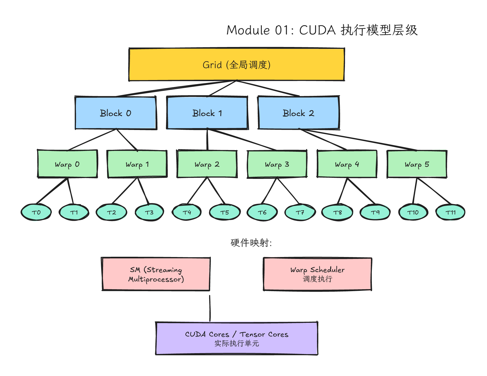
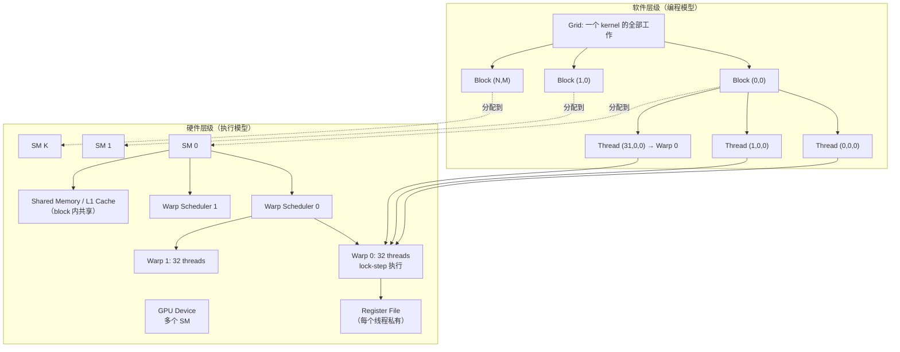
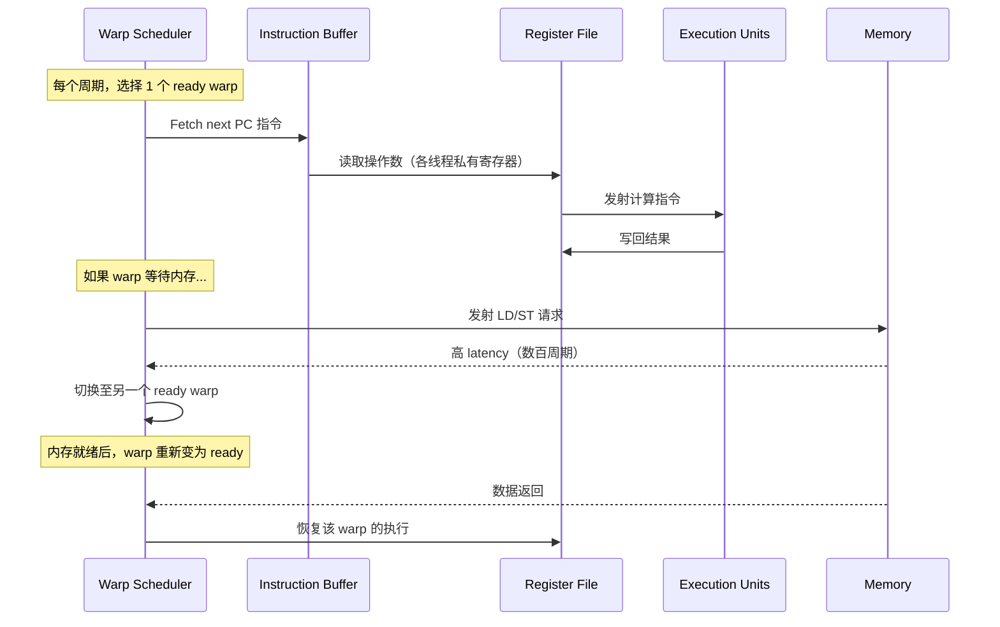
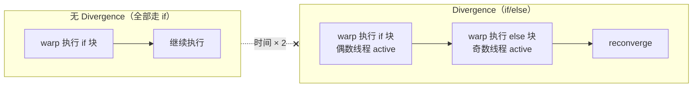
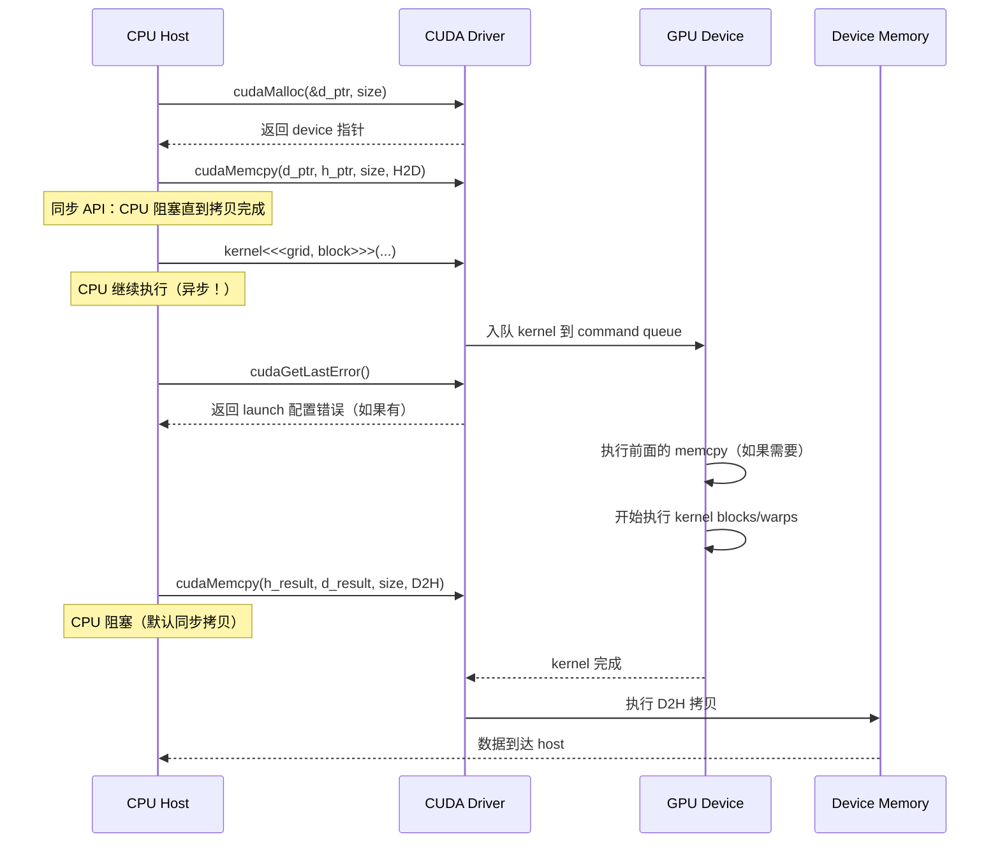

# Module 01: 执行模型与第一个 Kernel



*图 01-1：Grid、block、warp、thread 到 SM 执行单元的层级关系。可编辑源图：[`module-01-cuda-execution-hierarchy.excalidraw`](../diagrams/module-01-cuda-execution-hierarchy.excalidraw)。*

> **Level**: Beginner → Intermediate
> **Estimated time**: 12–16 小时（含阅读、实验、思考）
> **Prerequisites**: Module 00（环境搭建完成，能编译运行 `vector_add`）
> **Sources**: NVIDIA CUDA C++ Programming Guide, CUDA Runtime API, CUDA Samples, Nsight Systems 文档, PyTorch CUDA 后端源码

---

## 学习目标（Learning Objectives）

完成本模块后，你应当能够

1. **解释** CUDA 执行模型中 grid / block / thread / warp / SM 的层级关系，以及它们如何从软件映射到硬件。
2. **推导** 任意维度（1D/2D/3D）下从 `blockIdx`、`threadIdx`、`blockDim`、`gridDim` 到全局线性索引的完整公式。
3. **编写** 带边界保护的 1D vector kernel、2D image kernel 和 3D volume kernel，并解释每行代码的语义。
4. **分析** warp divergence 的成因、性能影响和缓解策略。
5. **计算** occupancy 并理解 block size 选择的 trade-off。
6. **描述** kernel launch 的异步时间线，解释空 kernel latency 的来源。
7. **定位** PyTorch 中 CUDA kernel 的 grid 配置方式，理解框架如何封装底层细节。

---

## 0. 问题背景：GPU 需要新执行模型的原因

CPU 编程的传统模型是：一个程序计数器（PC）顺序执行指令。即使有超线程，也是几个独立上下文在共享执行单元。这个模型在数据密集型并行任务面前遇到瓶颈

- 图像处理中每个像素需要相同的滤波器计算
- 神经网络中每个输出元素都是输入矩阵与权重矩阵的点积
- 物理模拟中成千上万个粒子需要同步更新状态。
  这些任务的特点是计算模式高度一致，但数据不同。如果用 CPU 线程模型处理，要么为每个数据元素创建一个线程（开销爆炸），要么用 SIMD 指令打包处理（灵活性受限）。
  CUDA 的诞生就是为了回答：如何让海量数据元素各自执行同一段代码，又能被硬件高效调度？
  这就是 CUDA 的 SPMD（Single Program, Multiple Data） 软件编程模型，底层由 SIMT（Single Instruction, Multiple Threads） 硬件执行模型支撑。理解这两者之间的映射，是 CUDA 编程的基础。

---

## 1. 直觉类比：电影院排座位

想象你要给电影院每个座位贴标签，标签的内容是"给这个座位对应的观众发一份爆米花"。

| 类比对象                                           | CUDA 概念        | 作用                                    |
| -------------------------------------------------- | ---------------- | --------------------------------------- |
| 整个影厅                                           | **Grid**   | 一次 kernel launch 要处理的全部数据     |
| 每一排座位                                         | **Block**  | 一个协作单元，内部 threads 可以共享资源 |
| 每个座位                                           | **Thread** | 最小执行单位，负责一个数据元素          |
| 排号                                               | `blockIdx`     | 当前 block 在 grid 中的编号             |
| 座位号                                             | `threadIdx`    | 当前 thread 在 block 内的编号           |
| 每排座位数                                         | `blockDim`     | 每个 block 的 thread 数量               |
| 排数                                               | `gridDim`      | grid 中 block 的数量                    |
| 所以，一个 thread 的全局座位号（即全局数据索引）是 |                  |                                         |

```cpp
int i = blockIdx.x * blockDim.x + threadIdx.x;
```

这个类比的关键不是背诵公式，而是理解背后的契约：host 端说"我会发 `gridDim` 个 blocks，每个 block `blockDim` 个 threads"；device 端每个 thread 根据这个契约找到自己的数据。
如果这个契约错了，会出现三类 bug

- 少发 blocks：尾部数据没人处理
- 多发 blocks 但没有 bounds check：越界访问
- index 公式和数据 layout 不匹配：结果不越界但语义错误。

---

## 2. 硬件机制：从 Thread 到 SM 的完整映射

### 2.1 层级全景图（Mermaid 图 1）



这张图有两个容易忽略的点

1. Grid 是软件概念，不是一个实体硬件。它被调度成很多 blocks，由 GPU 的 GigaThread Engine 分发到各个 SM。
2. Block 是协作和资源分配边界。block 内 threads 可以用 shared memory 和 `__syncthreads()` 协作；不同 block 不能直接这样协作（除非通过全局内存原子操作，代价很高）。

### 2.2 SM 内部架构说明

Streaming Multiprocessor（SM） 是 GPU 的计算引擎。一个 GPU 有数十到上百个 SM，每个 SM 可以同时驻留多个 blocks。理解 SM 内部资源，是后续优化内存和计算的基础。
以 Ampere 数据中心 GA100（Compute Capability 8.0）为例，一个 SM 的典型资源如下；同属 Ampere 的 GA10x（Compute Capability 8.6）在 shared memory/L1、resident warps/blocks 等上限上不同，生产代码必须查目标 GPU 的 device properties。

| 资源                     | 容量                            | 说明                                                          |
| ------------------------ | ------------------------------- | ------------------------------------------------------------- |
| 最大 resident threads    | 2048                            | 同时在线的 thread 数上限                                      |
| 最大 resident warps      | 64                              | 2048 / 32 = 64                                                |
| 最大 resident blocks     | 32                              | 同时在线的 block 数上限                                       |
| 32-bit registers         | 65536                           | 所有 resident threads 共享                                    |
| Shared Memory / L1 Cache | 合计最高约 192 KB（GA100 口径） | 可配置 carveout；每 block 可用 shared memory 上限低于合计容量 |
| Warp Scheduler           | 4 个                            | 每个周期选择 ready warp 发射指令                              |
| CUDA Cores               | 128 个                          | 执行整数和浮点运算                                            |
| Load/Store Units         | 32 个                           | 处理内存读写请求                                              |
| Tensor Cores             | 4 个                            | 专门加速矩阵乘运算                                            |
| **资源关系图解**   |                                 |                                                               |

```
┌─────────────────────────────────────────────┐
│ SM (Streaming Multiprocessor) │
│ ┌──────────────┐ ┌──────────────┐ │
│ │ Warp Scheduler│ │ Warp Scheduler│ × 4 │
│ │ + I-Cache │ │ + I-Cache │ │
│ └──────┬───────┘ └──────┬───────┘ │
│ │ │ │
│ ┌──────▼─────────────────▼──────┐ │
│ │ Dispatch Unit（指令分发） │ │
│ └──────┬─────────────────┬──────┘ │
│ │ │ │
│ ┌──────▼──────┐ ┌──────▼──────┐ │
│ │ CUDA Cores │ │ LD/ST Units│ │
│ │ (128 个) │ │ (32 个) │ │
│ └─────────────┘ └─────────────┘ │
│ ┌─────────────────────────────────┐ │
│ │ Register File (65536 个) │ │
│ │ → 每个线程分配私有寄存器 │ │
│ └─────────────────────────────────┘ │
│ ┌─────────────────────────────────┐ │
│ │ Shared Memory / L1 Cache │ │
│ │ (192 KB，可配置划分) │ │
│ │ → block 内 threads 共享访问 │ │
│ └─────────────────────────────────┘ │
└─────────────────────────────────────────────┘
```

- 寄存器是线程私有的，但总量有限。如果一个 kernel 每个线程用 64 个寄存器，那么 65536 / 64 = 1024，一个 SM 最多只能同时驻留 1024 个线程，occupancy 只有 50%。
- Shared Memory 是 block 共享的。如果一个 block 申请 48 KB shared memory，那么 192 / 48 = 4，一个 SM 最多同时运行 4 个这样的 block。
- Block 不能跨 SM 执行。一个 block 一旦被分配到某个 SM，就会一直在这个 SM 上执行直到完成。这是 block 内同步机制（如 `__syncthreads()`）能够工作的物理基础。

### 2.3 Warp 调度机制：SIMT 执行模型

Warp 是 GPU 调度的基本执行群体，一个 warp 固定包含 32 个 threads（`warpSize = 32`）。这 32 个 threads 执行相同的指令，但处理不同的数据—这就是 SIMT。

#### SIMT 与 SIMD 的区别

| 特性                        | SIMD（CPU SSE/AVX）             | SIMT（GPU CUDA）                  |
| --------------------------- | ------------------------------- | --------------------------------- |
| 编程单位                    | vector width（128/256/512 bit） | thread（标量）                    |
| 执行单位                    | 一个指令控制多个数据 lane       | warp 内线程共享指令，但各自有 PC  |
| 分支处理                    | 用 mask 指令手动处理            | 硬件自动处理 divergence（串行化） |
| 灵活性                      | 需要数据对齐，难以处理分支      | 以 warp 为单位自动处理分支        |
| **SIMT 执行的流水线** |                                 |                                   |



这就是 GPU latency hiding 的机制：一个 warp 在等待内存时，warp scheduler 会立即切换到另一个准备好的 warp，保持执行单元忙碌。SM 上同时驻留的 warp 越多，越能隐藏内存延迟。这也是为什么 occupancy 过低会导致性能下降—warp 不够。

#### Warp Divergence

Warp divergence 发生在同一个 warp 内的 32 个 threads 走不同的控制流路径时。例如

```cpp
if (threadIdx.x % 2 == 0) {
// path A: 偶数线程
do_something();
} else {
// path B: 奇数线程
do_something_else();
}
```

由于相邻线程的 `threadIdx.x` 是 0,1,2,3,...，一个 warp 内同时包含偶数和奇数线程，硬件无法让所有线程同时执行不同指令。解决方案是串行化

1. 先执行 path A，此时偶数线程活跃，奇数线程被 mask（空等）
2. 再执行 path B，此时奇数线程活跃，偶数线程被 mask
3. 在分支结束后 reconverge（重新汇合）。
   执行时间 = path A 时间 + path B 时间。理想情况下（无 divergence），整个 warp 只需执行一个分支的时间。



Volta 及之后的改进：从 Volta 架构开始，NVIDIA 引入了 Independent Thread Scheduling（ITS）。每个线程有独立的 PC，允许 warp 内线程更灵活地发散和汇合。但这并不表示 divergence 完全没有代价—它仍然需要额外的指令来管理分支，且某些情况下仍会导致串行化。
**避免 divergence 的策略**

- 让同一个 warp 的线程处理性质相同的数据
- 避免 `threadIdx.x % 2` 这类模式
- 如果 divergence 不可避免，尽量让不同 warp 走不同分支，而不是同一个 warp 内部分化。

### 2.4 Occupancy 初探：block size 选择

Occupancy（占用率）定义为

```
Occupancy = (实际活跃 warp 数) / (SM 支持的最大 warp 数)
```

例如，Ampere SM 支持 64 个 resident warps（2048 threads / 32）。如果实际只有 32 个活跃 warp，occupancy = 50%。
Occupancy 受三个资源限制（"木桶效应"）

1. 线程数限制：每个 SM 最多 2048 threads。
2. 寄存器限制：如 65536 个 32-bit registers。若 kernel 每线程用 32 个寄存器，block size = 256，则每 block 需要 8192 个寄存器。一个 SM 最多同时运行 65536 / 8192 = 8 个 blocks = 8 × 256 = 2048 threads，刚好达到线程上限。Occupancy = 100%。
3. Shared Memory 限制：如每 block 申请 24 KB，SM 有 192 KB，则最多 8 个 blocks。如果 block size = 512，8 个 blocks = 4096 threads，超过了 2048 的线程上限，所以实际限制是线程数。
   occupancy 高不一定性能好。研究表明，某些计算密集型 kernel 在 50% occupancy 时就能达到峰值性能，因为执行单元已经被计算饱和，不需要更多 warp 来隐藏延迟。然而，对于内存密集型 kernel（如 element-wise 操作），高 occupancy 通常有助于隐藏内存延迟。
   如何选择 block size

- 通常选 32 的倍数（warp size），否则最后一个 warp 可能只有部分 lanes 有效，造成一定浪费；这不是 CUDA 语法硬性要求。
- 通常选择 128、256 或 512，具体取决于寄存器和 shared memory 使用
- 使用 CUDA Occupancy API 自动搜索：`cudaOccupancyMaxPotentialBlockSize()`
- 最终选择需要通过实验验证（profile guided optimization）。

---

## 3. 代码路径：从 1D 到 3D 的完整索引数学

### 3.1 CUDA 内置变量说明

| 内置变量                                                                                                                                                                                                                 | 类型      | 取值范围                                                | 语义                                                              |
| ------------------------------------------------------------------------------------------------------------------------------------------------------------------------------------------------------------------------ | --------- | ------------------------------------------------------- | ----------------------------------------------------------------- |
| `gridDim`                                                                                                                                                                                                              | `dim3`  | `(1..2^31-1, 1..65535, 1..65535)`                     | Grid 在每个维度的 block 数量                                      |
| `blockDim`                                                                                                                                                                                                             | `dim3`  | 常见上限`(1024, 1024, 64)`，总量常见 ≤ 1024          | Block 在每个维度的 thread 数量；真实上限以`cudaDeviceProp` 为准 |
| `blockIdx`                                                                                                                                                                                                             | `uint3` | `(0..gridDim.x-1, 0..gridDim.y-1, 0..gridDim.z-1)`    | 当前 block 在 grid 中的索引                                       |
| `threadIdx`                                                                                                                                                                                                            | `uint3` | `(0..blockDim.x-1, 0..blockDim.y-1, 0..blockDim.z-1)` | 当前 thread 在 block 中的索引                                     |
| `warpSize`                                                                                                                                                                                                             | `int`   | 固定为 32                                               | 一个 warp 中的线程数（所有现代 NVIDIA GPU）                       |
| 注意：`blockDim.x * blockDim.y * blockDim.z` 不能超过设备的 `maxThreadsPerBlock`。现代 NVIDIA GPU 常见上限是 1024，但生产代码应查询 `cudaGetDeviceProperties()`，不要把 1024 写成所有设备/所有未来架构的绝对规则。 |           |                                                         |                                                                   |

### 3.2 Thread 索引的完整数学推导

#### 1D Grid + 1D Block（最常用）

```cpp
int global_idx = blockIdx.x * blockDim.x + threadIdx.x;
int total_threads = gridDim.x * blockDim.x;
```

- `blockIdx.x * blockDim.x`：跳过前面所有完整 block 的 threads
- `+ threadIdx.x`：加上当前 block 内的偏移。

#### 2D Grid + 2D Block（图像处理）

```cpp
int col = blockIdx.x * blockDim.x + threadIdx.x; // 列（x 方向）
int row = blockIdx.y * blockDim.y + threadIdx.y; // 行（y 方向）
int global_idx = row * width + col; // 线性化到 1D 内存
```

这里 `row * width + col` 是 row-major 布局。如果图像是按列优先存储，公式会不同。这是 CUDA 编程的核心：thread 索引是多维的，但内存是一维地址空间。

#### 3D Grid + 3D Block（体积数据、视频、3D 卷积）

```cpp
int x = blockIdx.x * blockDim.x + threadIdx.x;
int y = blockIdx.y * blockDim.y + threadIdx.y;
int z = blockIdx.z * blockDim.z + threadIdx.z;
// 线性化到 1D 内存（假设 depth-major / channel-major）
// 例如：数据形状 [depth][height][width]
int idx = z * height * width + y * width + x;
```

3D 索引的更多变体
对于 batch × depth × height × width 的 4D 数据（如 3D 医学影像 batch），grid 可以是 3D，batch 维度用 `blockIdx.z` 或拆分

```cpp
// 4D 数据：batch × depth × height × width
// grid 配置：(grid_x, grid_y, grid_z=depth)
// block 配置：(block_x, block_y, block_z=batch_per_block)
int x = blockIdx.x * blockDim.x + threadIdx.x;
int y = blockIdx.y * blockDim.y + threadIdx.y;
int z = blockIdx.z; // depth 维度，每个 block 处理一个 slice
int batch = threadIdx.z;
if (x < width && y < height && z < depth && batch < batch_size) {
int idx = ((batch * depth + z) * height + y) * width + x;
// process volume[batch][z][y][x]
}
```

### 3.3 Warp 内线程编号顺序

线程在 warp 中的分组顺序是：先按 `threadIdx.x` 递增，然后 `threadIdx.y`，然后 `threadIdx.z`。
例如，一个 16×16 的 2D block（共 256 threads）

- Warp 0：threads (0,0) 到 (15,0) 以及 (0,1) 到 (15,1) → 共 32 threads
- 即 `threadIdx.x` 先填满，然后 `threadIdx.y` 增加。
  这表示，在 2D 图像处理中，同一 warp 的相邻线程更可能改变 x（列）而不是 y（行）。这对内存 coalescing 重要—相邻线程访问相邻内存地址，才能合并成更少的内存事务。

---

## 4. 代码示例

以下三段代码均可直接编译运行。保存为 `.cu` 文件，用 `nvcc -o program program.cu` 编译。

### 4.1 1D Vector Add（SAXPY，扩展版）

```cpp
#include <cuda_runtime.h>
#include <cstdio>
#include <vector>
#include <cmath>
#include <cstdlib>
// 统一错误检查宏
#define CUDA_CHECK(ans) do { cudaError_t err = (ans); if (err != cudaSuccess) { std::fprintf(stderr, "CUDA error: %s at %s:%d\n", cudaGetErrorString(err), __FILE__, __LINE__); std::exit(EXIT_FAILURE); } } while (0)
// ─────────────────────────────────────────────
// Kernel 1: 1D SAXPY（Single-precision A*X Plus Y）
// ─────────────────────────────────────────────
// __global__ 表示：由 CPU (host) 发起调用，在 GPU (device) 上执行。
// 每个 thread 负责计算一个输出元素 out[i] = alpha * x[i] + y[i]。
//
// 参数说明
// x, y: 输入数组的 device 指针（由 cudaMalloc 分配）。
// out: 输出数组的 device 指针。
// alpha: 标量乘数，按值传递（寄存器）。
// n: 数组元素总数，用于边界检查。
// ─────────────────────────────────────────────
__global__ void saxpy_kernel(const float* x, const float* y,
float* out, float alpha, int n) {
// 计算当前 thread 的全局 1D 索引。
// blockIdx.x: 当前 block 在 grid 的 x 方向编号。
// blockDim.x: 每个 block 在 x 方向的 thread 数量。
// threadIdx.x: 当前 thread 在 block 内的 x 方向编号。
int i = blockIdx.x * blockDim.x + threadIdx.x;
// 边界检查（bounds check）：防止最后一个不完整 block 越界。
// 当 n 不是 blockDim.x 的整数倍时，grid 会多发射一个 block
// 其中只有前 (n % blockDim.x) 个 thread 有效。
if (i < n) {
out[i] = alpha * x[i] + y[i];
}
// 超出 n 的 threads 会执行到这里，然后退出，不做任何计算。
}
int main() {
const int n = 1 << 20; // 1,048,576 个元素（约 4MB）
const float alpha = 2.0f;
const size_t bytes = static_cast<size_t>(n) * sizeof(float);
// Host 端分配并初始化
std::vector<float> h_x(n, 1.0f), h_y(n, 2.0f), h_out(n, 0.0f);
// Device 端分配内存
float *d_x = nullptr, *d_y = nullptr, *d_out = nullptr;
CUDA_CHECK(cudaMalloc(&d_x, bytes));
CUDA_CHECK(cudaMalloc(&d_y, bytes));
CUDA_CHECK(cudaMalloc(&d_out, bytes));
// H2D 数据拷贝
CUDA_CHECK(cudaMemcpy(d_x, h_x.data(), bytes, cudaMemcpyHostToDevice));
CUDA_CHECK(cudaMemcpy(d_y, h_y.data(), bytes, cudaMemcpyHostToDevice));
// Launch 配置：block_size 通常选 32 的倍数（warp size），减少部分 warp 的浪费。
// 256 是一个常见的经验值，在大多数 GPU 上能达到较好的 occupancy。
const int block_size = 256;
// 整数上取整：确保即使 n 不能整除 block_size，尾部元素也能被覆盖。
// (n + block_size - 1) / block_size 等价于 ceil(n / block_size)。
const int grid_size = (n + block_size - 1) / block_size;
// 发起 kernel launch（异步！CPU 会继续执行后续代码）。
saxpy_kernel<<<grid_size, block_size>>>(d_x, d_y, d_out, alpha, n);
// 检查 kernel launch 是否成功（仅检查配置合法性，不等待执行完成）。
CUDA_CHECK(cudaGetLastError());
// 同步等待 GPU 完成（如果要立即测量时间或拷贝回数据，必须同步）。
CUDA_CHECK(cudaDeviceSynchronize());
// D2H 拷贝结果
CUDA_CHECK(cudaMemcpy(h_out.data(), d_out, bytes, cudaMemcpyDeviceToHost));
// 验证结果
bool ok = true;
for (int i = 0; i < n; ++i) {
float expected = alpha * 1.0f + 2.0f; // 4.0f
if (std::fabs(h_out[i] - expected) > 1e-5f) {
std::printf("Mismatch at %d: got %f, expected %f\n", i, h_out[i], expected);
ok = false;
break;
}
}
if (ok) std::printf("1D SAXPY: PASS (n=%d, grid=%d, block=%d)\n", n, grid_size, block_size);
CUDA_CHECK(cudaFree(d_x));
CUDA_CHECK(cudaFree(d_y));
CUDA_CHECK(cudaFree(d_out));
return 0;
}
```

- `if (i < n)` 是 CUDA 编程的防御性编程核心。没有它，n = 1025 时最后一个 block 的 255 个 threads 会越界。
- `(n + block_size - 1) / block_size` 是整数上取整的常用写法。
- `alpha` 是值传递（pass-by-value），会被编译器放入常量内存或通过寄存器直接传递。这是标量参数的标准做法。
- `x, y, out` 是指针传递（pass-by-pointer），指向 device 全局内存。

### 4.2 2D Image Brighten（图像增亮，带边界处理）

```cpp
#include <cuda_runtime.h>
#include <cstdio>
#include <vector>
#include <cmath>
#include <cstdlib>
#define CUDA_CHECK(ans) do { cudaError_t err = (ans); if (err != cudaSuccess) { std::fprintf(stderr, "CUDA error: %s at %s:%d\n", cudaGetErrorString(err), __FILE__, __LINE__); std::exit(EXIT_FAILURE); } } while (0)
// ─────────────────────────────────────────────
// Kernel 2: 2D Image Brighten
// ─────────────────────────────────────────────
// 每个 thread 处理一个像素 (col, row)。
// 图像数据按 row-major 存储为一维数组：idx = row * width + col。
// 注意：CUDA 的 blockIdx/threadIdx 是 (x, y) 顺序，但矩阵通常是 (row, col)。
// 这里我们让 x 对应列（col），y 对应行（row），这样在内存上相邻列的线程
// 也是相邻的，有利于内存合并访问（coalescing）。
// ─────────────────────────────────────────────
__global__ void brighten_kernel(const float* image, float* out,
int height, int width, float bias) {
// 计算当前 thread 负责的像素坐标。
// blockIdx.x / blockDim.x / threadIdx.x 对应 x 方向（列）。
// blockIdx.y / blockDim.y / threadIdx.y 对应 y 方向（行）。
int col = blockIdx.x * blockDim.x + threadIdx.x;
int row = blockIdx.y * blockDim.y + threadIdx.y;
// 2D 边界检查：防止图像边缘的 tile 越界。
// 当 width 不是 blockDim.x 的整数倍时，最后一列 blocks 会有无效 threads。
if (row < height && col < width) {
int idx = row * width + col; // 从 2D 坐标线性化到 1D 内存地址
out[idx] = image[idx] + bias; // 增亮操作
}
}
int main() {
const int height = 1080;
const int width = 1920;
const float bias = 10.0f;
const size_t bytes = static_cast<size_t>(height) * width * sizeof(float);
// 初始化 host 数据
std::vector<float> h_image(height * width, 50.0f), h_out(height * width, 0.0f);
float *d_image = nullptr, *d_out = nullptr;
CUDA_CHECK(cudaMalloc(&d_image, bytes));
CUDA_CHECK(cudaMalloc(&d_out, bytes));
CUDA_CHECK(cudaMemcpy(d_image, h_image.data(), bytes, cudaMemcpyHostToDevice));
// 2D launch 配置：每个 block 16×16 = 256 threads。
// 16×16 是图像处理 kernel 的经典选择，平衡了寄存器使用和 warp 效率。
dim3 block(16, 16);
// 2D grid：分别在 x 和 y 方向做整数上取整。
dim3 grid((width + block.x - 1) / block.x,
(height + block.y - 1) / block.y);
brighten_kernel<<<grid, block>>>(d_image, d_out, height, width, bias);
CUDA_CHECK(cudaGetLastError());
CUDA_CHECK(cudaDeviceSynchronize());
CUDA_CHECK(cudaMemcpy(h_out.data(), d_out, bytes, cudaMemcpyDeviceToHost));
// 验证：所有像素应从 50.0 变成 60.0
bool ok = true;
for (int i = 0; i < height * width; ++i) {
if (std::fabs(h_out[i] - 60.0f) > 1e-5f) {
std::printf("Mismatch at %d: %f\n", i, h_out[i]);
ok = false;
break;
}
}
if (ok) std::printf("2D Brighten: PASS (%dx%d, grid=%dx%d, block=%dx%d)\n",
width, height, grid.x, grid.y, block.x, block.y);
CUDA_CHECK(cudaFree(d_image));
CUDA_CHECK(cudaFree(d_out));
return 0;
}
```

- `dim3` 是 CUDA 的三维整数类型，用于配置 grid 和 block 的维度。如果只提供两个值，第三个维度（z）默认为 1。
- `col = blockIdx.x * blockDim.x + threadIdx.x` 中，x 方向对应内存中的**列**（连续地址）。这样同一个 warp 的线程访问相邻内存地址，实现 **coalesced access**。
- 如果交换 x 和 y（让 x 对应行），则相邻线程访问的内存间隔为 `width`，变成 **strided access**，性能会大幅下降。
- `if (row < height && col < width)` 是 2D 边界检查。二维图像通常不是 tile 大小的整数倍，边界处理必要。

### 4.3 3D Volume Processing（体积处理，展示三维索引）

```cpp
#include <cuda_runtime.h>
#include <cstdio>
#include <vector>
#include <cmath>
#include <cstdlib>
#define CUDA_CHECK(ans) do { cudaError_t err = (ans); if (err != cudaSuccess) { std::fprintf(stderr, "CUDA error: %s at %s:%d\n", cudaGetErrorString(err), __FILE__, __LINE__); std::exit(EXIT_FAILURE); } } while (0)
// ─────────────────────────────────────────────
// Kernel 3: 3D Volume Thresholding
// ─────────────────────────────────────────────
// 处理三维体积数据，如医学影像（CT/MRI）或科学模拟体数据。
// 数据形状：[depth][height][width]，按 depth-major 存储。
// 每个 thread 处理一个体素 (x, y, z)。
// 输出：大于 threshold 的保留原值，否则置为 0。
// ─────────────────────────────────────────────
__global__ void volume_threshold_kernel(const float* volume, float* out,
int depth, int height, int width,
float threshold) {
// 3D 坐标计算
int x = blockIdx.x * blockDim.x + threadIdx.x; // width 方向
int y = blockIdx.y * blockDim.y + threadIdx.y; // height 方向
int z = blockIdx.z * blockDim.z + threadIdx.z; // depth 方向
// 3D 边界检查
if (x < width && y < height && z < depth) {
// 线性化索引：depth-major，即 z 变化最慢，x 变化最快。
// 等价于 C/C++ 多维数组 layout：volume[z][y][x]
int idx = (z * height + y) * width + x;
float val = volume[idx];
out[idx] = (val > threshold) ? val : 0.0f;
}
}
int main() {
// 模拟一个 128×128×128 的 3D 体数据（医学影像常见尺寸）
const int depth = 128, height = 128, width = 128;
const float threshold = 0.5f;
const int total = depth * height * width;
const size_t bytes = static_cast<size_t>(total) * sizeof(float);
// 初始化：随机填充一些大于 threshold 的值
std::vector<float> h_vol(total);
for (int i = 0; i < total; ++i) h_vol[i] = (i % 7 == 0) ? 0.8f : 0.2f;
std::vector<float> h_out(total, 0.0f);
float *d_vol = nullptr, *d_out = nullptr;
CUDA_CHECK(cudaMalloc(&d_vol, bytes));
CUDA_CHECK(cudaMalloc(&d_out, bytes));
CUDA_CHECK(cudaMemcpy(d_vol, h_vol.data(), bytes, cudaMemcpyHostToDevice));
// 3D launch 配置：8×8×8 = 512 threads per block。
// 注意：block.x * block.y * block.z 不能超过设备 maxThreadsPerBlock（现代 GPU 常见 1024）。
dim3 block(8, 8, 8); // 512 threads，安全且 warp 友好
dim3 grid((width + block.x - 1) / block.x,
(height + block.y - 1) / block.y,
(depth + block.z - 1) / block.z);
volume_threshold_kernel<<<grid, block>>>(d_vol, d_out, depth, height, width, threshold);
CUDA_CHECK(cudaGetLastError());
CUDA_CHECK(cudaDeviceSynchronize());
CUDA_CHECK(cudaMemcpy(h_out.data(), d_out, bytes, cudaMemcpyDeviceToHost));
// 验证
bool ok = true;
for (int i = 0; i < total; ++i) {
float expected = (h_vol[i] > threshold) ? h_vol[i] : 0.0f;
if (std::fabs(h_out[i] - expected) > 1e-5f) {
std::printf("Mismatch at %d: got %f, expected %f\n", i, h_out[i], expected);
ok = false;
break;
}
}
if (ok) std::printf("3D Volume Threshold: PASS (%dx%dx%d, grid=%dx%dx%d, block=%dx%dx%d)\n",
width, height, depth, grid.x, grid.y, grid.z, block.x, block.y, block.z);
CUDA_CHECK(cudaFree(d_vol));
CUDA_CHECK(cudaFree(d_out));
return 0;
}
```

- 3D kernel 的 grid 和 block 都用 `dim3` 配置。注意 `block.x * block.y * block.z` 不能超过设备的 `maxThreadsPerBlock`；现代 GPU 常见为 1024。
- 3D 索引的线性化公式 `(z * height + y) * width + x` 对应 C 语言多维数组 `arr[z][y][x]` 的 row-major 内存布局。
- 如果数据是 `batch × channel × depth × height × width` 的 5D 张量（如 3D 卷积），通常把 batch 和 channel 拆出来，用一个 3D grid 处理 spatial 维度，或用 loop 在 kernel 内处理 channel。

---

## 5. Kernel 参数传递机制与函数签名限制

### 5.1 值传递 vs 指针传递

CUDA kernel 参数传递规则与普通 C++ 函数**几乎相同**，但有以下限制

| 参数类型                                                                                           | 传递方式                             | 例子                                 | 说明                                                         |
| -------------------------------------------------------------------------------------------------- | ------------------------------------ | ------------------------------------ | ------------------------------------------------------------ |
| 标量（int, float, char 等）                                                                        | 值传递（pass-by-value）              | `int n`, `float alpha`           | 按值拷贝到 device，线程私有                                  |
| 指针（device 内存）                                                                                | 指针传递（pass-by-pointer）          | `float* d_arr`                     | 指向 device 全局内存                                         |
| 结构体（POD）                                                                                      | 值传递                               | `struct Params { int w; int h; };` | 逐成员拷贝，如果含指针需确保指向 device 内存                 |
| 引用                                                                                               | 现代 CUDA C++ 可支持，但入门阶段避免 | `const Params& p`                  | 需要理解参数拷贝、地址空间和生命周期；教学代码优先用值或指针 |
| C 风格变长参数                                                                                     | **不支持**                     | `...`                              | kernel 不支持 C varargs；C++ variadic templates 是另一回事   |
| **重要**：`__global__` 函数的返回值必须是 `void`。不能像普通函数那样 `return` 一个值。 |                                      |                                      |                                                              |

### 5.2 `__global__` 函数签名的限制

- 必须返回 `void`
- 不能是类成员函数（除非用 `static` 或 friend，但通常写为自由函数）
- 参数总大小有限制；现代设备常见上限是 KB 级，但具体值取决于 compute capability 和 ABI，应避免把大对象按值传入 kernel
- 不支持 C++ 异常处理
- 入门阶段不要在 device 代码中依赖递归或动态并行。Compute Capability 3.5+ 支持 device 端 launch 子 kernel，但开销和同步语义复杂；普通算法优先改写为迭代、队列或多阶段 kernel。

---

## 6. Launch 开销分析：小 Kernel 的 Launch 瓶颈

### 6.1 Kernel Launch 的异步时间线（Mermaid 图 2）



这张图解释了为什么很多错误不是在 `kernel<<<...>>>` 那一行立刻爆出来：CPU 发起任务后继续走，真正需要结果或同步时才发现 GPU 端之前出错。因此，**debug 时务必在 launch 后加 `cudaGetLastError()`，在结果拷贝前加 `cudaDeviceSynchronize()`**。

### 6.2 空 Kernel 的 Launch 延迟

Kernel launch 不是免费的。即使是一个**什么都不做的空 kernel**，也有固定的 launch overhead。根据学术文献和 NVIDIA 官方资料

- **空 kernel launch latency**（warm-up 后）：约 **3–10 µs**（取决于驱动、操作系统、GPU 架构）。
- **CPU launch overhead**：`cudaLaunchKernel` API 调用本身需要把参数拷贝到驱动、校验配置、入队命令，耗时约 **5–20 µs**。
- **第一个 kernel 的额外开销**：context 初始化、JIT 编译（如果使用 NVRTC）等，可能达到 **毫秒级**。
  参考测量数据（来自 NVIDIA Developer Forums 和学术论文）| GPU / 平台      | 空 Kernel Latency   | 来源                                                                                                    |
  | --------------- | ------------------- | ------------------------------------------------------------------------------------------------------- |
  | GTX 580 (Fermi) | ~4.5 µs            | [NVIDIA Forum](https://forums.developer.nvidia.com/t/memory-copy-latency-and-kernel-launch-overhead/22463) |
  | Pascal P100     | ~3 µs (warm-up 后) | [ArXiv: 2004.05371](https://arxiv.org/pdf/2004.05371v1)                                                    |
  | Volta V100      | ~3 µs              | 同上                                                                                                    |
  | RTX 4090 (Ada)  | 单位数 µs 量级     | 需要在目标驱动、OS 和 Toolkit 下本地复测                                                                |

### 6.3 小 Kernel 的 Launch 瓶颈

假设一个 kernel 只做 1 个 float 的加法，计算本身是纳秒级量级，而 launch overhead 常见是微秒级量级。那么 launch 开销可以比实际算术工作大几个数量级。
这表示，如果 kernel 执行时间小于 10–20 µs，性能瓶颈通常不在 GPU 计算，而在 **kernel launch rate**。解决办法： - **Kernel fusion**：把多个小 kernel 合并成一个大 kernel，减少 launch 次数

- **增大 grid**：确保每个 thread 有足够工作量，或让 thread 用 `for` 循环处理多个元素
- **使用 CUDA Graphs**：把多个 kernel 打包成一个 graph，一次性提交，降低 launch overhead。

### 6.4 测量 Launch Overhead 的代码

```cpp
__global__ void null_kernel() {} // 空 kernel，无任何指令
int main() {
cudaEvent_t start, stop;
cudaEventCreate(&start);
cudaEventCreate(&stop);
// Warm-up：第一次 launch 有额外开销
null_kernel<<<1, 1>>>();
cudaDeviceSynchronize();
// 测量
cudaEventRecord(start);
for (int i = 0; i < 100; ++i) {
null_kernel<<<1, 1>>>();
}
cudaEventRecord(stop);
cudaEventSynchronize(stop);
float ms = 0;
cudaEventElapsedTime(&ms, start, stop);
std::printf("Avg null kernel launch latency: %.3f µs\n", ms * 10.0f); // 100 次平均
cudaEventDestroy(start);
cudaEventDestroy(stop);
return 0;
}
```

---

## 7. 实战 Lab 扩展

### Lab 1: 让 Index 变得可见（保留精华，扩展）

1. 把 `n` 改成 17，`block_size` 改成 8。
2. 临时写一个 debug kernel，把每个 `i`、`blockIdx.x`、`threadIdx.x` 写入数组。
3. 拷回 host 打印。
4. 画出三行：block 0、block 1、block 2。
   你应该看到第三个 block 只有 1 个 thread 有效（17 = 2×8 + 1）。这个图比背概念更重要。
   **扩展思考**

- 如果 `block_size = 32`（一个 warp），`n = 33`，会有多少个 warp 被 launch？其中有多少个是完整 warp？
- 画出 warp 编号和 thread 编号的对应表。

### Lab 2: 二维 Indexing 可视化（保留精华，扩展）

实现一个 `write_coordinates` kernel，输出两个数组

```cpp
__global__ void write_coordinates(int* row_out, int* col_out,
int height, int width) {
int col = blockIdx.x * blockDim.x + threadIdx.x;
int row = blockIdx.y * blockDim.y + threadIdx.y;
if (row < height && col < width) {
int idx = row * width + col;
row_out[idx] = row;
col_out[idx] = col;
}
}
```

测试 `height=5, width=7, block=(4, 3)`。打印输出矩阵，确认最后一个 block 的边界处理。然后回答

- 哪些 threads 被 launch 但没有有效像素？
- 同一个 warp 中相邻 thread 更可能改变 `col` 还是 `row`？（提示：warp 内 thread 编号按 x 优先递增。）
- 如果把 `idx` 写成 `col * height + row`，结果代表什么 layout？（提示：column-major 还是 row-major？）

### Lab 3: 3D 卷积索引（新增）

实现一个 3D 卷积的**索引计算** kernel（不需要真的做卷积，只需计算每个 thread 应该访问的输入体素索引）。
假设：输入形状 `(D, H, W)`，卷积核大小 `3×3×3`，输出形状 `(D, H, W)`（即 same padding）。

```cpp
__global__ void conv3d_index_kernel(int* out_idx, int D, int H, int W) {
int x = blockIdx.x * blockDim.x + threadIdx.x; // W 方向
int y = blockIdx.y * blockDim.y + threadIdx.y; // H 方向
int z = blockIdx.z * blockDim.z + threadIdx.z; // D 方向
if (x < W && y < H && z < D) {
int out_idx_linear = (z * H + y) * W + x;
// 计算卷积中心对应的输入索引
// 边界处理：如果 x < 1 或 x >= W-1，越界的部分忽略（或 pad）
// 本题只需输出中心点索引，以及判断是否需要边界处理
bool need_pad = (x < 1 || x >= W - 1 || y < 1 || y >= H - 1 || z < 1 || z >= D - 1);
out_idx[out_idx_linear] = need_pad ? -1 : (z * H + y) * W + x;
}
}
```

**思考**：如果要处理 batch 维度（如 batch=8），你应该让 `blockIdx.z` 负责 batch 还是 depth？各有什么优缺点？

### Lab 4: 非均匀数据分布（新增）

某些数据天然不均匀，如稀疏矩阵（CSR 格式）或图神经网络。在这种情况下，简单的 `grid = (n + block - 1) / block` 不适用，因为不同 row 的数据量差异巨大。
写一个 kernel 处理非均匀数据：输入是一个 `row_ptr` 数组（CSR 的 row pointer），每个 thread 处理一个 row，row 内的元素数由 `row_ptr[i+1] - row_ptr[i]` 决定。思考

- 如果每个 thread 处理一个 row，warp 内的 threads 可能工作量差异巨大（load imbalance），如何缓解？
- 如果改用每个 thread 处理一个元素，如何计算元素的全局索引？

---

## 8. 真实系统落点：PyTorch 的 CUDA 后端如何组织 Thread Grid

### 8.1 PyTorch 中的 Element-wise Kernel

PyTorch 的 CUDA 后端大量使用了 element-wise kernel（如 `torch.add`, `torch.mul`, `torch.relu`）。在 PyTorch 源码中（`aten/src/ATen/native/cuda/`），这些 kernel 通常

- 把多维张量**展平为一维**（通过 `TensorIterator`）
- 使用固定的 `block_size = 512` 或 `256`（早期版本用 512，新版本可能调整）
- 用 `grid = (N + block - 1) / block` 覆盖全部元素
- 每个 thread 处理一个元素，带边界检查 `if (idx < N)`。
  例如，PyTorch `add` 的 CUDA kernel 简化逻辑

```cpp
// 伪代码，基于 PyTorch 源码简化
// 实际在 ATen/native/cuda/BinaryAddSubKernel.cu
template <typename T>
__global__ void add_kernel(const T* a, const T* b, T* out, int64_t N) {
int64_t idx = blockIdx.x * blockDim.x + threadIdx.x;
if (idx < N) {
out[idx] = a[idx] + b[idx];
}
}
// C++ 封装层（通过 TensorIterator 展平输入）
torch::Tensor add_cuda(const torch::Tensor& a, const torch::Tensor& b) {
auto iter = torch::TensorIterator::binary_op(result, a, b);
int64_t N = iter.numel();
int block_size = 512; // 教学示例中的保守经验值；真实 PyTorch kernel 会按算子和版本选择
int grid_size = (N + block_size - 1) / block_size;
add_kernel<<<grid_size, block_size, 0, at::cuda::getCurrentCUDAStream()>>>(
a.data_ptr<float>(), b.data_ptr<float>(), result.data_ptr<float>(), N);
return result;
}
```

来源：[PyTorch Forums: How pytorch internally launches cuda kernels](https://discuss.pytorch.org/t/how-pytorch-internally-launches-cuda-kernels/98277)

### 8.2 PyTorch 的 Block Size 选择

早期 PyTorch 论坛和很多教学示例会用 256/512 threads 作为 element-wise kernel 的保守经验值，但真实 PyTorch 内部会按算子、dtype、vectorization、TensorIterator、backend 和版本选择 launcher 参数。对于矩阵乘法或卷积，PyTorch 通常会转到 cuBLAS/cuDNN/CUTLASS/ATen 等后端，由后端按 shape、dtype、layout、workspace 和配置选择实现。
PyTorch 的 `TensorIterator` 是一个非常强大的抽象，它自动处理

- 不同形状张量的广播（broadcasting）
- 类型转换（type promotion）
- 内存布局差异（contiguous vs. strided）
- 多维度展平为 1D，简化 kernel 编写。
  这表示，PyTorch 开发者通常不需要手动写 `blockIdx.x * blockDim.x + threadIdx.x`，而是依赖 `TensorIterator` 的 `offset` 计算。但理解底层索引机制，对于编写自定义 CUDA 扩展（Custom CUDA Extension）重要。

### 8.3 编写 PyTorch Custom CUDA Extension

如果你需要写一个 PyTorch 不支持的自定义操作，可以使用 `torch.utils.cpp_extension.load_inline` 或 `torch.utils.cpp_extension.CUDAExtension`。
示例（来自 GPU MODE Lecture 1）

```cpp
#include <torch/types.h>
#include <cuda.h>
#include <cuda_runtime.h>
__global__ void square_matrix_kernel(const float* matrix, float* result,
int width, int height) {
int row = blockIdx.y * blockDim.y + threadIdx.y;
int col = blockIdx.x * blockDim.x + threadIdx.x;
if (row < height && col < width) {
int idx = row * width + col;
result[idx] = matrix[idx] * matrix[idx];
}
}
torch::Tensor square_matrix(torch::Tensor matrix) {
const auto height = matrix.size(0);
const auto width = matrix.size(1);
auto result = torch::empty_like(matrix);
dim3 threads_per_block(16, 16); // 256 threads
dim3 number_of_blocks((width + threads_per_block.x - 1) / threads_per_block.x,
(height + threads_per_block.y - 1) / threads_per_block.y);
square_matrix_kernel<<<number_of_blocks, threads_per_block>>>(
matrix.data_ptr<float>(), result.data_ptr<float>(), width, height);
return result;
}
```

来源：[GPU MODE Lecture 1: How to profile CUDA kernels in PyTorch](https://christianjmills.com/posts/cuda-mode-notes/lecture-001/index.html)
----------------------------------------------------------------

## 9. 练习阶梯（Exercise Ladder）

### 9.1 Recall（回忆）

1. 解释 grid、block、thread、warp、SM 各自的层级和作用。
2. 为什么 block 不能跨 SM 执行？这对编程有什么限制？

### 9.2 Trace（追踪）

3. `n=1025, blockDim.x=256` 时，有多少个 blocks？最后一个 block 有多少有效 threads？
4. 一个 2D grid `(3, 2)`，2D block `(4, 3)`，总 threads 数是多少？Warp 数是多少？

### 9.3 Modify（修改）

5. 把 1D SAXPY 改成 `out[i] = a * x[i] + b * y[i] + c`（双线性组合），保持边界检查。
6. 把 2D brighten kernel 改成对 `height` 和 `width` 交换 x/y 方向，观察是否还能正确输出，并思考性能影响。

### 9.4 Implement（实现）

7. 实现一个 2D matrix transpose kernel：输入 `A[H][W]`，输出 `B[W][H]`。每个 thread 处理一个元素。思考：为什么 transpose 的内存访问模式天然不 coalesced？
8. 实现一个 3D volume 的 gradient magnitude kernel（简化版，只计算 x 方向的差分）。

### 9.5 Optimize（优化）

9. 用 `cudaEvent_t` 测量 1D SAXPY 在 `block_size=128, 256, 512` 下的 kernel time。只记录，不下绝对结论。注意：测量前必须 `cudaDeviceSynchronize()`，且要 warm-up。
10. 用 `cudaOccupancyMaxPotentialBlockSize` 查询你的 GPU 对 1D SAXPY kernel 的推荐 block size，与实验结果对比。

### 9.6 Explain（解释）

11. 为什么 CUDA 第一课就要强调 bounds check？结合 GPU 的内存保护机制解释。
12. 为什么 warp divergence 只发生在同一个 warp 内，不同 warp 之间不会互相影响？
13. 解释为什么 occupancy 100% 不一定代表性能最优。

---

## 10. Checkpoint（检查点）

你能**不查资料**写出以下代码，并解释每一项的含义吗？

```cpp
// 1D 索引
int i = blockIdx.x * blockDim.x + threadIdx.x;
int grid = (n + block - 1) / block;
if (i < n) { /* ... */ }
// 2D 索引
int col = blockIdx.x * blockDim.x + threadIdx.x;
int row = blockIdx.y * blockDim.y + threadIdx.y;
if (row < height && col < width) {
int idx = row * width + col;
/* ... */
}
// 3D 索引
int x = blockIdx.x * blockDim.x + threadIdx.x;
int y = blockIdx.y * blockDim.y + threadIdx.y;
int z = blockIdx.z * blockDim.z + threadIdx.z;
if (x < W && y < H && z < D) {
int idx = ((z * H) + y) * W + x;
/* ... */
}
```

如果能，说明 Module 01 的核心已经掌握。如果不能，回到对应 Lab 重新实验。
------------------------------------------------------------------------

## 11. 常见误区（Common Pitfalls）

| 误区                                       | 正确理解                                                                                  |
| ------------------------------------------ | ----------------------------------------------------------------------------------------- |
| 把 CUDA thread 当成 CPU thread             | CUDA thread 是超轻量的，没有独立上下文切换开销；CPU thread 是 OS 调度实体，切换代价高     |
| 忘记 kernel launch 是异步的                | CPU 在`<<<>>>` 之后继续执行，错误和结果可能在后续才暴露                                 |
| 只测`n` 正好整除 block size              | 边界条件是 CUDA bug 的主要来源，必须用`n=质数` 等刁钻数据测试                           |
| 用 block size 调参，但不记录硬件和输入规模 | 不同 GPU 的 SM 资源不同，最优 block size 可能不同；需要在 README 中记录实验环境           |
| 认为 warp divergence 是 bug                | divergence 是正确语义，只是性能问题；不要试图用`__syncthreads()` 在 warp 内同步分支     |
| 忽略 launch overhead                       | 小 kernel 频繁 launch 是性能瓶颈；考虑 kernel fusion 或 CUDA Graphs                       |
| 混淆`blockDim` 和 `gridDim`            | `blockDim` 是 block **内** threads 数，`gridDim` 是 grid **中** blocks 数 |
| 忘记`dim3` 的默认构造                    | `dim3 block(16)` 等价于 `(16, 1, 1)`，不是 `(16, 16, 1)`                            |

---

## 12. 深入扩展（Extensions）

### 12.1 独立线程调度

从 Volta 开始，NVIDIA 引入了独立线程调度（ITS）。在 Volta 之前，一个 warp 内的所有线程共享同一个 PC（程序计数器），发散时只能简单串行化。Volta 之后，每个线程有独立的 PC 和 call stack，允许更细粒度的发散和汇合。
但这**不表示 divergence 没有代价**。ITS 减少了某些情况下的串行化，但编译器仍可能生成 predicated 指令（谓词执行），且 warp 调度复杂度增加。理解 ITS 的最好方式是：对大多数应用，你仍然应该把避免 divergence 是优化目标，只是不必像早期架构那样极端恐惧。
参考：[NVIDIA Developer Blog: Inside Volta](https://developer.nvidia.com/blog/inside-volta/)

### 12.2 CUDA Graphs：减少 Launch 开销

如果 kernel 执行时间很短（< 10 µs），但 launch overhead 占主导，可以使用 CUDA Graphs 把多个 kernel 和内存操作预录成一个图，一次性提交。

```cpp
cudaGraph_t graph;
cudaGraphExec_t instance;
// 开始捕获
cudaStreamBeginCapture(stream, cudaStreamCaptureModeGlobal);
kernel1<<<grid1, block1, 0, stream>>>(...);
kernel2<<<grid2, block2, 0, stream>>>(...);
cudaStreamEndCapture(stream, &graph);
cudaGraphInstantiate(&instance, graph, 0);
// 后续只需一次提交
cudaGraphLaunch(instance, stream);
```

### 12.3 动态并行

从 Compute Capability 3.5 开始，device 端 kernel 可以 launch 新的 kernel。这允许递归算法（如自适应网格细化）在 GPU 上直接表达。但动态并行有额外的 overhead 和编程复杂度，初学者不建议使用。
-------------------------------------------------------------------------------------------------------------------------------------------------------------------------------------------

## 13. 本课资料来源

- NVIDIA CUDA C++ Programming Guide, Programming Model: https://docs.nvidia.com/cuda/cuda-c-programming-guide/index.html
- NVIDIA CUDA Runtime API, kernel launch and synchronization: https://docs.nvidia.com/cuda/cuda-runtime-api/index.html
- NVIDIA CUDA Samples: https://github.com/NVIDIA/cuda-samples
- NVIDIA Developer Blog: "Understanding the Visualization of Overhead and Latency in Nsight Systems": https://developer.nvidia.com/blog/understanding-the-visualization-of-overhead-and-latency-in-nsight-systems/
- NVIDIA Developer Forums: Memory copy latency and kernel launch overhead: https://forums.developer.nvidia.com/t/memory-copy-latency-and-kernel-launch-overhead/22463
- ArXiv: "A Study of Single and Multi-device Synchronization Methods in Nvidia GPUs": https://arxiv.org/pdf/2004.05371v1
- ArXiv: "Prediction of Performance and Power Consumption of GPGPU Applications": https://arxiv.org/pdf/2305.01886
- GPU MODE Lecture 1: How to profile CUDA kernels in PyTorch: https://christianjmills.com/posts/cuda-mode-notes/lecture-001/index.html
- PyTorch Forums: How pytorch internally launches cuda kernels: https://discuss.pytorch.org/t/how-pytorch-internally-launches-cuda-kernels/98277
- CUDA Occupancy Calculator 相关讨论
- https://forums.developer.nvidia.com/t/cuda-occupancy-calculator-helps-pick-optimal-thread-block-size/442
- https://hanhaowen.github.io/2023/12/16/block-size-2023/
- https://docs.nvidia.com/nsight-compute/NsightCompute/index.html#occupancy-calculator
- CUDA SIMT 执行模型说明
- https://www.youngju.dev/blog/culture/2026-03-18-nvidia-cuda-architecture-deep-dive.en
- https://uplatz.com/blog/the-parallel-paradigm-shift-a-comprehensive-analysis-of-gpu-architecture-programming-models-and-algorithmic-optimization/
- https://learnopencv.com/modern-gpu-architecture-explained/
- https://docs.nvidia.com/cuda/cuda-c-programming-guide/index.html#simt-architecture
- Warp Divergence 相关
- https://docs.nvidia.com/cuda/cuda-c-programming-guide/index.html#simt-architecture
- https://modal.com/gpu-glossary/perf/warp-divergence
- https://forums.developer.nvidia.com/t/warp-divergence-in-independent-thread-scheduling/188557
- https://forums.developer.nvidia.com/t/performance-penalty-due-to-warp-divergence/253670
- CUDA Thread Indexing
- https://docs.nvidia.com/cuda/cuda-c-programming-guide/index.html#thread-hierarchy
- https://vvnasantosh.net/posts/cuda/thread-indexing/
- https://stackoverflow.com/questions/9859456/cuda-thread-indexing
- https://docs.nvidia.com/cuda/cuda-c-programming-guide/index.html#thread-hierarchy

---

## 附录 A：SM 架构表（常见 GPU）

| GPU 架构 | Compute Capability | SM 数 (典型)                       | Threads/SM | Warps/SM | Max Blocks/SM | Registers/SM | Shared/L1 口径                                 |
| -------- | ------------------ | ---------------------------------- | ---------- | -------- | ------------- | ------------ | ---------------------------------------------- |
| Maxwell  | 5.2                | 16 (GTX 980)                       | 2048       | 64       | 32            | 65536        | 96 KB                                          |
| Pascal   | 6.1                | 20 (GTX 1080Ti)                    | 2048       | 64       | 32            | 65536        | 96 KB                                          |
| Volta    | 7.0                | 80 (V100)                          | 2048       | 64       | 32            | 65536        | 96 KB                                          |
| Turing   | 7.5                | 68 (RTX 2080Ti)                    | 1024       | 32       | 16            | 65536        | 96 KB                                          |
| Ampere   | 8.6                | 82 (RTX 3090) / 68 (RTX 3080 10GB) | 1536       | 48       | 16            | 65536        | 100 KB shared / 128 KB combined L1+shared 量级 |
| Ada      | 8.9                | 128 (RTX 4090)                     | 1536       | 48       | 16            | 65536        | 100 KB shared / 128 KB combined L1+shared 量级 |
| Hopper   | 9.0                | 132 (H100)                         | 2048       | 64       | 32            | 65536        | 228 KB                                         |

> 注：具体数值取决于具体 SKU，请以 `cudaGetDeviceProperties` 查询为准。

---

## 附录 B：CUDA Occupancy API 快速入门

```cpp
#include <cuda_runtime.h>
#include <iostream>
__global__ void my_kernel(float* data, int n) {
int idx = blockIdx.x * blockDim.x + threadIdx.x;
if (idx < n) data[idx] *= 2.0f;
}
int main() {
int minGridSize, blockSize;
// 自动推荐最佳 block size（基于当前 GPU 架构和 kernel 寄存器使用）
cudaOccupancyMaxPotentialBlockSize(&minGridSize, &blockSize, my_kernel, 0, 0);
std::cout << "Recommended block size: " << blockSize << std::endl;
// 查询给定 block size 下每 SM 最大活跃 blocks
int maxActiveBlocks;
cudaOccupancyMaxActiveBlocksPerMultiprocessor(&maxActiveBlocks, my_kernel, blockSize, 0);
std::cout << "Max active blocks per SM: " << maxActiveBlocks << std::endl;
return 0;
}
```

---

> 本课讲稳定概念，但仍需查官方资料确认术语。grid、block、thread、warp、host、device 这些词在 CUDA 里不是随意比喻，而是编程模型的正式抽象。示例代码基于 CUDA 文档编写，实际编译前请确认环境配置。
