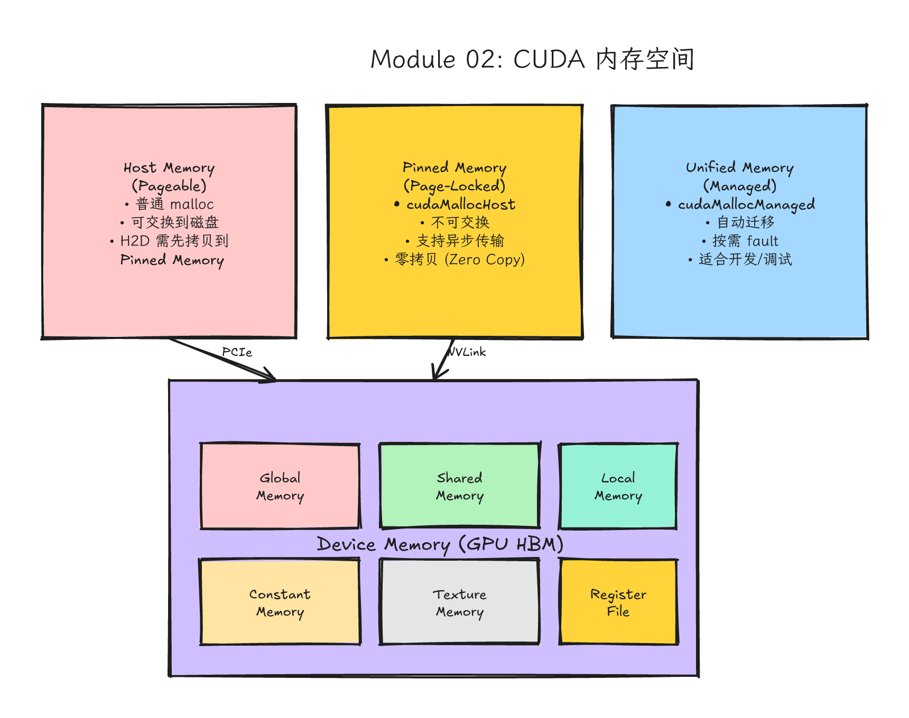
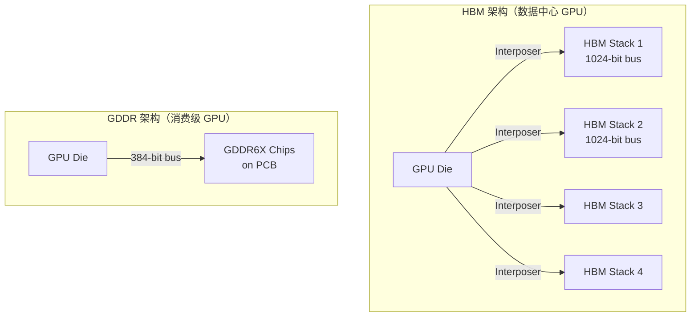
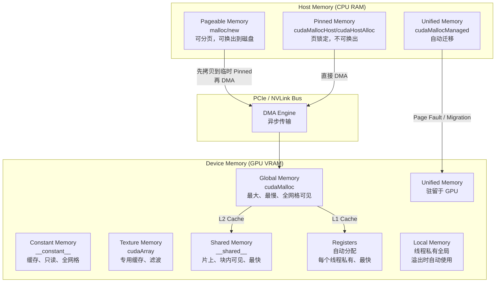

# Module 02: GPU 内存管理、数据搬运与程序正确性



*图 02-1：CUDA 程序中 host memory、device global memory、shared memory、register 与数据搬运的关系。可编辑源图：[`module-02-cuda-memory-spaces.excalidraw`](../diagrams/module-02-cuda-memory-spaces.excalidraw)。*
> **Memory Management, Data Movement & Correctness**
- **Level**: Beginner → Intermediate
- **Estimated time**: 12–16 小时
- **Prerequisites**: Modules 00-01, C++ 基础（类、模板、RAII）
- **Sources**: NVIDIA CUDA C++ Programming Guide, CUDA Runtime API, Compute Sanitizer User Guide, CUDA-GDB User Guide, PyTorch CUDA Caching Allocator Design Notes
---
## 学习目标（Learning Objectives）
完成本模块后，你将能够
1. **解释** GPU 内存架构（HBM/GDDR）与 CPU 内存架构的关键差异，并说明为什么 GPU 内存带宽高但延迟高。
2. **区分** Host 端 Pageable Memory 与 Pinned Memory，理解 DMA 传输原理，并权衡 Zero-Copy 的代价与收益。
3. **熟练运用** `cudaMalloc` / `cudaMemcpy` / `cudaFree` 的显式管理流程，构建完整错误检查链（同步错误 + 异步错误）。
4. **实现** 生产级 RAII 的 `DeviceBuffer<T>`，支持多种分配策略（Device、Pinned、Unified）。
5. **理解** Unified Memory 的 Page Migration、Fault Handling 机制，并正确使用 `cudaMemPrefetchAsync` 和 `cudaMemAdvise`。
6. **运用** CUDA 11.2+ 的 `cudaMallocAsync` / `cudaFreeAsync` 与 Memory Pool，实现 Stream-Ordered Allocation。
7. **诊断** 内存错误（越界、use-after-free、double-free、内存泄漏），并使用 Compute Sanitizer 和 CUDA-GDB 定位问题。
8. **理解** PyTorch CUDA Caching Allocator 的工作原理，解释 `nvidia-smi` 显存占用与 PyTorch 实际使用之间的差距。
9. **解释** 2D/3D 数组的内存对齐需求，并正确使用 `cudaMallocPitch` / `cudaMemcpy2D`。
---
## 0. 直觉模型：两座城市之间的物流系统
在深入硬件细节之前，建立一个直觉模型。这个模型会贯穿你整个 CUDA 学习生涯。
### 0.1 类比：北京与上海
把 CPU (Host) 和 GPU (Device) 想象成两座城市
| 概念 | 北京 (CPU) | 上海 (GPU) |
|------|-----------|-----------|
| 仓库 | Host Memory (RAM) | Device Memory (VRAM) |
| 租仓库 | `malloc` / `new` | `cudaMalloc` |
| 退仓库 | `free` / `delete` | `cudaFree` |
| 工厂 | CPU 核心 | CUDA Cores / SMs |
| 城际物流 | — | `cudaMemcpy` (H2D/D2H) |
| 市内物流 | CPU 缓存/内存总线 | GPU 全局内存总线 |
```
Host Pointer (h_*) ≠ Device Pointer (d_*)
```
就像北京的门牌号不能拿到上海直接用。Host pointer 是 CPU 虚拟地址空间的地址；Device pointer 是 GPU 地址空间的地址。两者在物理上指向不同的内存芯片，跨地址空间直接解引用会导致段错误（segfault）或未定义行为。
### 0.2 这个模型的作用
新手最常犯的错误：指针看起来都像地址，于是以为它们都能在任何地方使用。
实际情况
- `float* h_x = new float[N];` → 这是北京的仓库地址。
- `float* d_x; cudaMalloc(&d_x, N*sizeof(float));` → 这是上海的仓库地址。
- 把 `h_x` 传给 kernel → 上海工厂拿着北京门牌号找货，必然迷路。
- 在 Host 代码里解引用 `d_x` → CPU 试图访问 GPU 显存，除非使用 Unified Memory，否则崩溃。
---
## 1. 问题背景：GPU 内存模型与 CPU 的差异
### 1.1 分离式架构（Discrete Architecture）
绝大多数桌面/服务器 GPU（如 NVIDIA RTX 4090、A100、H100）采用分离式架构
- CPU 内存：DDR4/DDR5，容量大（512GB+），通过主板 DIMM 插槽扩展。
- GPU 内存：HBM2e/HBM3/GDDR6X，通常通过 PCIe 连接到 CPU；Grace Hopper/Grace Blackwell 这类 superchip 会使用 NVLink-C2C；多 GPU 之间可能通过 NVLink/NVSwitch 连接。容量相对 CPU 内存更小，但带宽更高。
- 两者物理分离，host-device 数据传输通常经过 PCIe（PCIe 4.0 x16 单向约 32 GB/s；PCIe 5.0 x16 单向约 64 GB/s）。GPU-GPU 的 NVLink 带宽要按具体代际和系统拓扑单独计算。
> 集成 GPU（如 Apple M 系列、部分 Intel 核显）采用统一内存架构（UMA），CPU/GPU 共享物理内存。但 NVIDIA CUDA 编程主要针对离散 GPU，因此必须显式管理数据搬运。
### 1.2 内存墙（Memory Wall）
现代 GPU 的算力增长远快于内存带宽增长。以 NVIDIA H100 为例：
- Tensor Core 峰值要按 TF32/FP16/BF16/FP8、dense/sparse、SXM/PCIe 等口径分别查表，通常是数百到数千 TFLOP/s 级别。
- HBM3 带宽约 3.35 TB/s（H100 SXM 80GB 口径）。
如果每个 FP16 操作需要读取两个操作数并写入一个结果（共 4 bytes），那么理论上的字节/操作比决定了算力能否被充分利用。内存带宽不足时，GPU 核心处于等待数据（starvation）状态，这就是内存墙。
---
## 2. 硬件机制：GPU 内存架构说明
### 2.1 HBM vs GDDR：物理结构与带宽差异
GPU 使用的内存技术主要有两种：HBM（High Bandwidth Memory）和 GDDR（Graphics DDR）。
#### HBM 架构
- 3D 堆叠：通过 TSV（Through-Silicon Via）在垂直方向堆叠 4–16 层 DRAM Die。
- 宽总线：典型 HBM2/HBM3 单个 stack 仍是 1024-bit 数据接口；GPU 封装上多个 HBM stack 并联后，芯片级总线宽度才可能达到数千 bit（例如 8 个 stack 合计 8192-bit）。
- 近封装：HBM 与 GPU Die 通过 **Interposer（硅中介层）** 紧密集成，距离极短。
- 低频率：不需要很高时钟频率即可达到极高带宽，功耗更低。
- 容量受限：单 Stack 容量通常为 16GB–24GB，受物理堆叠层数限制。
> NVIDIA A100 (HBM2e, 40/80GB, 2039 GB/s)、H100 (HBM3, 80GB, 3350 GB/s)、AMD MI300X (HBM3, 192GB)。
#### GDDR 架构
- 2D 平面：传统平面封装，颗粒分布在 GPU 周围 PCB 上。
- 窄总线：单个 GDDR6X 颗粒为 32-bit，通过多颗粒并联（如 12 颗 × 32-bit = 384-bit）。
- 高频率：依靠极高频率（GDDR6X 可达 19–21 Gbps）提升带宽。
- 高功耗：频率高导致单 bit 能耗高于 HBM。
- 容量灵活：可通过增减颗粒灵活调整容量（8GB–24GB）。
> NVIDIA RTX 4090 (GDDR6X, 24GB, 1008 GB/s)、RTX 3090 (GDDR6X, 24GB)。

### 2.2 GPU 内存带宽高、延迟高的原因
GPU 内存带宽高但延迟高
> GPU 内存带宽极高（TB/s 级），但单线程访问延迟也很高（数百个时钟周期）。
1. HBM 的宽总线设计：HBM 通过超宽总线（4096-bit+）并行传输大量数据，但这主要优化的是吞吐量（throughput），而非单个请求的延迟。
2. 物理距离：即使 HBM 通过 Interposer 靠近 GPU Die，DRAM 本身的电容充放电特性决定了访问延迟（~100 ns）。相比之下，CPU 的 L1 Cache 延迟仅 ~1–4 ns。
3. GPU 的延迟隐藏策略：GPU 不追求单个线程的低延迟，而是通过同时运行大量 Warp，在 A Warp 等待内存时切换去执行 B Warp。只要同时有足够多的 Warp 可以切换，高延迟就被隐藏了。
> GPU 不怕单个访问延迟高，怕没有足够工作可切换。因此，GPU 程序优化的首要目标不是降低延迟，而是确保内存访问模式能充分利用带宽（合并访问）。
### 2.3 CUDA 内存空间层级（Memory Spaces）
CUDA 设备上有多种内存空间，它们的位置、速度、可见性和生命周期各不相同。

| 内存空间 | 位置 | 速度 | 可见性 | 生命周期 | 分配方式 |
|---------|------|------|--------|--------|---------|
| **Register** | GPU 芯片内 | 极低延迟；具体取决于指令依赖和调度 | 线程私有 | 线程 | 编译器自动 |
| **Shared** | GPU 芯片内（SM） | 低延迟；bank conflict、访问模式和架构会改变实际周期 | Block 内共享 | Block | `__shared__` |
| **Global** | HBM/GDDR（VRAM） | 高延迟；缓存命中、合并访问和并发度会改变观测值 | 全网格可见 | 程序控制 | `cudaMalloc` |
| **Local** | HBM/GDDR（VRAM） | 慢 | 线程私有 | 线程 | 编译器溢出 |
| **Constant** | HBM + 缓存 | 缓存命中则快 | 全网格只读 | 程序控制 | `__constant__` |
| **Texture** | HBM + 专用缓存 | 缓存命中则快 | 全网格只读 | 程序控制 | `cudaArray` |
| **Pinned** | Host RAM | 中等（DMA 传输快） | Host + Device | 程序控制 | `cudaMallocHost` |
| **Pageable** | Host RAM | 慢（需 staging） | Host | 程序控制 | `malloc` |
| **Unified** | Host 或 Device | 取决于驻留位置 | Host + Device | 程序控制 | `cudaMallocManaged` |
---
## 3. 代码路径：显式内存管理（Explicit Memory Management）
### 3.1 完整 `cudaMalloc` / `cudaMemcpy` / `cudaFree` 流程
下面是一个生产级的向量加法示例，包含完整错误检查链、同步点管理和正确性验证。
```cpp
// file: vector_add_explicit.cu
// 显式内存管理：完整 cudaMalloc / cudaMemcpy / cudaFree 流程
#include <cuda_runtime.h>
#include <cstdio>
#include <cstdlib>
#include <cstdint>
#include <vector>
#include <cmath>
#include <algorithm>
// ============================================================
// 1. 错误检查宏（Error Checking Macro）
// ============================================================
// CUDA 错误分为两类
// - 同步错误：API 调用立即返回的错误（如 cudaMalloc 内存不足）
// - 异步错误：Kernel 执行期间才发生的错误（如越界访问）
// 需要同步后才能捕获。
//
// 策略
// - 所有同步 API 直接检查返回值。
// - Kernel 启动后立即 cudaGetLastError() 检查启动错误。
// - 关键同步点后 cudaDeviceSynchronize() 捕获异步错误。
// ============================================================
#define CUDA_CHECK_SYNC(call) \
do { \
cudaError_t err = (call); \
if (err != cudaSuccess) { \
std::fprintf(stderr, "[CUDA SYNC ERROR] %s:%d %s -> %s\n", \
__FILE__, __LINE__, #call, \
cudaGetErrorString(err)); \
std::exit(EXIT_FAILURE); \
} \
} while (0)
#define CUDA_CHECK_ASYNC(kernel_call) \
do { \
kernel_call; \
cudaError_t err = cudaGetLastError(); \
if (err != cudaSuccess) { \
std::fprintf(stderr, "[CUDA ASYNC ERROR] %s:%d %s -> %s\n", \
__FILE__, __LINE__, #kernel_call, \
cudaGetErrorString(err)); \
std::exit(EXIT_FAILURE); \
} \
} while (0)
#define CUDA_SYNC_DEVICE() \
do { \
cudaError_t err = cudaDeviceSynchronize(); \
if (err != cudaSuccess) { \
std::fprintf(stderr, "[CUDA SYNC DEVICE] %s:%d -> %s\n", \
__FILE__, __LINE__, cudaGetErrorString(err)); \
std::exit(EXIT_FAILURE); \
} \
} while (0)
// ============================================================
// 2. Kernel 定义
// ============================================================
__global__ void vector_add_kernel(const float* a, const float* b,
float* out, int n) {
// 全局线程索引计算
int idx = blockIdx.x * blockDim.x + threadIdx.x;
// 边界检查：防止越界访问（防御性编程）
if (idx < n) {
out[idx] = a[idx] + b[idx];
}
}
// ============================================================
// 3. 正确性验证
// ============================================================
bool check_result(const std::vector<float>& gpu_out,
const std::vector<float>& a,
const std::vector<float>& b,
float tolerance = 1e-5f) {
float max_err = 0.0f;
for (size_t i = 0; i < gpu_out.size(); ++i) {
float ref = a[i] + b[i];
float err = std::fabs(gpu_out[i] - ref);
max_err = std::max(max_err, err);
}
if (max_err > tolerance) {
std::printf("FAILED: max_abs_err = %e (tolerance = %e)\n", max_err, tolerance);
return false;
}
std::printf("PASSED: max_abs_err = %e\n", max_err);
return true;
}
// ============================================================
// 4. 主流程：显式内存管理六步法
// ============================================================
// Step 1: Host 端准备数据
// Step 2: Device 端分配内存（cudaMalloc）
// Step 3: Host -> Device 传输（H2D）
// Step 4: 启动 Kernel 计算
// Step 5: Device -> Host 传输（D2H）
// Step 6: 释放 Device 内存（cudaFree）
// ============================================================
int main(int argc, char** argv) {
// 支持多种输入规模（Edge Case Testing）
const int n = (argc > 1) ? std::atoi(argv[1]) : 1024 * 1024;
const size_t bytes = static_cast<size_t>(n) * sizeof(float);
std::printf("=== Vector Add (Explicit Memory Management) ===\n");
std::printf("Input size: %d elements (%zu MiB)\n", n, bytes / (1024 * 1024));
// ---------- Step 1: Host 端准备数据 ----------
std::vector<float> h_a(n), h_b(n), h_out(n);
for (int i = 0; i < n; ++i) {
h_a[i] = static_cast<float>(i) * 1.0f;
h_b[i] = static_cast<float>(n - i) * 0.5f;
}
// ---------- Step 2: Device 端分配内存 ----------
float *d_a = nullptr, *d_b = nullptr, *d_out = nullptr;
CUDA_CHECK_SYNC(cudaMalloc(&d_a, bytes)); // 为 d_a 分配 GPU 全局内存
CUDA_CHECK_SYNC(cudaMalloc(&d_b, bytes)); // 为 d_b 分配 GPU 全局内存
CUDA_CHECK_SYNC(cudaMalloc(&d_out, bytes)); // 为 d_out 分配 GPU 全局内存
// ---------- Step 3: H2D 数据传输 ----------
// cudaMemcpy 是同步操作：函数返回时，数据已拷贝完成。
// 方向：cudaMemcpyHostToDevice
CUDA_CHECK_SYNC(cudaMemcpy(d_a, h_a.data(), bytes, cudaMemcpyHostToDevice));
CUDA_CHECK_SYNC(cudaMemcpy(d_b, h_b.data(), bytes, cudaMemcpyHostToDevice));
// ---------- Step 4: 启动 Kernel ----------
const int block_size = 256;
const int grid_size = (n + block_size - 1) / block_size; // 向上取整
// 先清除之前的错误状态，确保后续错误只来自本次 kernel
cudaError_t pre_err = cudaGetLastError();
(void)pre_err; // 显式忽略，仅用于重置错误状态
// 启动 kernel，使用 CUDA_CHECK_ASYNC 检查启动错误
CUDA_CHECK_ASYNC((vector_add_kernel<<<grid_size, block_size>>>(d_a, d_b, d_out, n)));
// 同步设备，确保 kernel 完成并捕获异步错误（如越界访问）
CUDA_SYNC_DEVICE();
// ---------- Step 5: D2H 数据传输 ----------
// 方向：cudaMemcpyDeviceToHost
CUDA_CHECK_SYNC(cudaMemcpy(h_out.data(), d_out, bytes, cudaMemcpyDeviceToHost));
// ---------- Step 6: 释放 Device 内存 ----------
// 顺序不重要，但建议按分配逆序释放，便于阅读
CUDA_CHECK_SYNC(cudaFree(d_a));
CUDA_CHECK_SYNC(cudaFree(d_b));
CUDA_CHECK_SYNC(cudaFree(d_out));
// ---------- 正确性验证 ----------
bool pass = check_result(h_out, h_a, h_b);
return pass ? 0 : 1;
}
```
#### 讲解
1. **`CUDA_CHECK_SYNC`**：用于 `cudaMalloc`、`cudaMemcpy`、`cudaFree` 等**同步 API**。这些 API 在返回时已完成工作，错误可立即检测。
2. **`CUDA_CHECK_ASYNC`**：专用于 **kernel 启动**。kernel 启动是异步的（函数立即返回，GPU 稍后执行），因此 `cudaGetLastError()` 只能捕获**启动前错误**（如参数非法、配置错误）。真正的运行时错误（如越界）需要同步后才能捕获。
3. **`CUDA_SYNC_DEVICE`**：在关键计算后调用 `cudaDeviceSynchronize()`，强制等待 GPU 完成所有工作，并捕获**异步错误**。这是 Correctness Harness 的最后防线。
**`cudaGetLastError()` 在 kernel 前重置的原因**
CUDA 运行时为每个线程维护一个错误状态变量。如果之前的某个操作已报错，后续 `cudaGetLastError()` 仍会返回旧错误。因此，在 kernel 启动前调用一次 `cudaGetLastError()`（不检查返回值）来**重置错误状态**，确保后续检测只针对当前 kernel。
---
### 3.2 扩展版 RAII `DeviceBuffer<T>`：支持多种分配策略
原始的 `DeviceBuffer` 只支持 `cudaMalloc`。在真实工程中，你需要根据场景选择 **Device、Pinned、Unified** 三种分配策略。下面的模板类通过策略枚举（Strategy Enum）统一封装了这三种分配方式。
```cpp
// file: device_buffer.cuh
// 扩展版 RAII DeviceBuffer：支持 Device / Pinned / Unified 三种策略
#pragma once
#include <cuda_runtime.h>
#include <cstdio>
#include <cstdlib>
#include <cstring>
#include <stdexcept>
#include <vector>
// ============================================================
// 分配策略枚举
// ============================================================
enum class AllocStrategy {
Device, // cudaMalloc：标准的 GPU 全局内存
Pinned, // cudaMallocHost：页锁定的 Host 内存，支持 DMA 快速传输
Unified // cudaMallocManaged：统一内存，自动 page migration
};
// ============================================================
// 分配策略特征（Policy Traits）
// 使用模板特化将策略映射到具体的分配/释放函数。
// 这是 C++ 中典型的策略模式（Policy Pattern）实现。
// ============================================================
template <AllocStrategy S>
struct AllocTraits;
// Device 策略特化
template <>
struct AllocTraits<AllocStrategy::Device> {
static cudaError_t alloc(void** ptr, size_t bytes) {
return cudaMalloc(ptr, bytes);
}
static cudaError_t free(void* ptr) {
return cudaFree(ptr);
}
// Device 内存的数据传输方向：H2D
static cudaMemcpyKind h2d_kind() { return cudaMemcpyHostToDevice; }
static cudaMemcpyKind d2h_kind() { return cudaMemcpyDeviceToHost; }
};
// Pinned 策略特化
template <>
struct AllocTraits<AllocStrategy::Pinned> {
static cudaError_t alloc(void** ptr, size_t bytes) {
// cudaMallocHost 分配页锁定内存，支持 DMA 直接传输
return cudaMallocHost(ptr, bytes);
}
static cudaError_t free(void* ptr) {
return cudaFreeHost(ptr);
}
// Pinned 内存位于 Host；Host 侧拷贝应使用 std::memcpy。
// 若要把 pinned buffer 传到 device buffer，再显式调用 cudaMemcpyHostToDevice。
static cudaMemcpyKind h2d_kind() { return cudaMemcpyHostToHost; }
static cudaMemcpyKind d2h_kind() { return cudaMemcpyHostToHost; }
};
// Unified 策略特化
template <>
struct AllocTraits<AllocStrategy::Unified> {
static cudaError_t alloc(void** ptr, size_t bytes) {
// cudaMallocManaged 分配统一内存，CPU/GPU 均可访问
return cudaMallocManaged(ptr, bytes);
}
static cudaError_t free(void* ptr) {
return cudaFree(ptr); // Unified 内存也用 cudaFree 释放
}
// Unified 内存 CPU/GPU 均可访问；Host 侧初始化可直接 std::memcpy，
// 性能关键路径再用 prefetch_to_device / prefetch_to_host 控制迁移。
static cudaMemcpyKind h2d_kind() { return cudaMemcpyDefault; }
static cudaMemcpyKind d2h_kind() { return cudaMemcpyDefault; }
};
// ============================================================
// 通用错误检查包装
// ============================================================
inline void cuda_check(cudaError_t err, const char* file, int line) {
if (err != cudaSuccess) {
std::fprintf(stderr, "[CUDA ERROR] %s:%d -> %s\n",
file, line, cudaGetErrorString(err));
std::exit(EXIT_FAILURE);
}
}
#define CUDA_CHECK(call) cuda_check((call), __FILE__, __LINE__)
// ============================================================
// 扩展版 DeviceBuffer<T>
// ============================================================
template <typename T, AllocStrategy Strategy = AllocStrategy::Device>
class DeviceBuffer {
public:
// 构造函数：分配 count 个 T 类型的元素
explicit DeviceBuffer(size_t count)
: count_(count), bytes_(count * sizeof(T)), ptr_(nullptr) {
if (count_ > 0) {
CUDA_CHECK(AllocTraits<Strategy>::alloc(
reinterpret_cast<void**>(&ptr_), bytes_));
}
}
// 析构函数：RAII 自动释放
~DeviceBuffer() { release(); }
// 禁止拷贝：避免两段内存被双重释放（Double-Free）
DeviceBuffer(const DeviceBuffer&) = delete;
DeviceBuffer& operator=(const DeviceBuffer&) = delete;
// 允许移动：转移所有权（Move Semantics）
DeviceBuffer(DeviceBuffer&& other) noexcept
: count_(other.count_), bytes_(other.bytes_), ptr_(other.ptr_) {
other.count_ = 0;
other.bytes_ = 0;
other.ptr_ = nullptr;
}
DeviceBuffer& operator=(DeviceBuffer&& other) noexcept {
if (this != &other) {
release();
count_ = other.count_;
bytes_ = other.bytes_;
ptr_ = other.ptr_;
other.count_ = 0;
other.bytes_ = 0;
other.ptr_ = nullptr;
}
return *this;
}
// 数据访问
T* data() { return ptr_; }
const T* data() const { return ptr_; }
size_t size() const { return count_; }
size_t bytes() const { return bytes_; }
bool empty() const { return count_ == 0; }
// 显式拷贝：Host -> Device（或 Device -> Host 反向）
// 注意：对于 Unified 策略，此操作是可选的（系统会自动迁移）
// 但显式 Prefetch 仍然推荐用于性能优化。
void copy_from_host(const std::vector<T>& host) {
if (host.size() != count_) {
throw std::runtime_error("Host size mismatch in copy_from_host");
}
if (count_ > 0) {
if constexpr (Strategy == AllocStrategy::Device) {
CUDA_CHECK(cudaMemcpy(ptr_, host.data(), bytes_, cudaMemcpyHostToDevice));
} else {
std::memcpy(ptr_, host.data(), bytes_);
}
}
}
void copy_to_host(std::vector<T>& host) const {
host.resize(count_);
if (count_ > 0) {
if constexpr (Strategy == AllocStrategy::Device) {
CUDA_CHECK(cudaMemcpy(host.data(), ptr_, bytes_, cudaMemcpyDeviceToHost));
} else {
std::memcpy(host.data(), ptr_, bytes_);
}
}
}
// 对于 Unified Memory，提供显式 Prefetch 接口
// 只有在 Strategy == Unified 时才有意义，但编译时不会报错。
void prefetch_to_device(int device_id, cudaStream_t stream = 0) const {
if (Strategy != AllocStrategy::Unified) {
// 非 Unified 策略下 Prefetch 无意义，静默返回
return;
}
if (count_ > 0) {
CUDA_CHECK(cudaMemPrefetchAsync(ptr_, bytes_, device_id, stream));
}
}
void prefetch_to_host(cudaStream_t stream = 0) const {
if (Strategy != AllocStrategy::Unified) { return; }
if (count_ > 0) {
// cudaCpuDeviceId 是内置常量，表示 Prefetch 到 CPU
CUDA_CHECK(cudaMemPrefetchAsync(ptr_, bytes_, cudaCpuDeviceId, stream));
}
}
private:
void release() noexcept {
if (ptr_ != nullptr) {
// 析构函数不能抛异常。忽略返回值，避免异常逃离析构。
AllocTraits<Strategy>::free(ptr_);
ptr_ = nullptr;
count_ = 0;
bytes_ = 0;
}
}
size_t count_;
size_t bytes_;
T* ptr_;
};
// ============================================================
// 使用示例
// ============================================================
// DeviceBuffer<float, AllocStrategy::Device> d_buf(1024); // 标准 GPU 内存
// DeviceBuffer<float, AllocStrategy::Pinned> h_pinned(1024); // 页锁定 Host 内存
// DeviceBuffer<float, AllocStrategy::Unified> u_buf(1024); // 统一内存
```
#### 设计
这段代码使用 C++17 的 `if constexpr`，编译时请加 `-std=c++17` 或在 CMake 中设置 `CMAKE_CXX_STANDARD 17` / `CMAKE_CUDA_STANDARD 17`。

1. **策略模式（Policy Pattern）**：通过 `AllocTraits` 模板特化，将不同策略的分配/释放语义封装起来。注意 Pinned 和 Unified 都是 CPU 可直接访问的地址空间，Host 侧初始化应走 `std::memcpy`；只有 Device 策略需要显式 `cudaMemcpyHostToDevice` / `cudaMemcpyDeviceToHost`。
2. **禁止拷贝**：`delete` 拷贝构造和拷贝赋值，避免两段内存同时认为自己有同一段 GPU 内存，导致 **double-free**。
3. **移动语义**：支持 `std::move`，可将缓冲区所有权从一个对象转移到另一个，这在工厂函数和返回临时缓冲区时非常有用。
4. **析构不抛异常**：`release()` 标记为 `noexcept`，符合 C++ 核心指南（析构函数不应抛出异常）。
5. **Prefetch 接口**：为 Unified Memory 提供 `prefetch_to_device` 和 `prefetch_to_host`，让使用者显式控制数据迁移，避免依赖隐式的 page fault。
---
### 3.3 Pageable vs Pinned Memory：Zero-Copy 的代价与收益
#### 3.3.1 背景：Pageable Memory 的传输代价
Host 端默认通过 `malloc`/`new` 分配的内存是 Pageable（可分页）的。操作系统可以迁移或换出这些页。GPU DMA 传输需要稳定的、已锁定的物理页映射；普通 pageable memory 不能直接作为长期 DMA 目标/来源交给 GPU。因此，当调用 `cudaMemcpy(h_pageable, d_ptr, bytes, cudaMemcpyDeviceToHost)` 时，CUDA 驱动通常会通过临时 pinned staging buffer 中转：
```
DeviceToHost:
Step 1: Device Memory -> 临时 Pinned (Staging) Buffer（DMA）
Step 2: Staging Buffer -> Pageable Host Memory（CPU 拷贝）

HostToDevice:
Step 1: Pageable Host Memory -> 临时 Pinned (Staging) Buffer（CPU 拷贝）
Step 2: Staging Buffer -> Device Memory（DMA）
```
这表示 pageable 传输通常多了一次 host-side staging copy，并且可能引入额外同步和 CPU 开销。
#### 3.3.2 Pinned Memory（Page-Locked）
`cudaMallocHost` 分配的内存被操作系统**锁定在物理内存中**，不可被换出到磁盘。这带来两个直接好处
1. **物理地址固定**：GPU DMA 引擎可以直接访问，省去了 Staging 步骤。
2. **更高带宽**：实测 Pinned Memory 的 H2D/D2H 带宽通常是 Pageable 的 **2× 左右**（取决于 PCIe 版本和平台）。
**代价**
- **Host 内存占用**：Pinned 内存会挤占 OS 可用于分页的物理内存。过量分配 Pinned 内存会导致系统整体性能下降（甚至 OOM）。
- **分配开销**：`cudaMallocHost` 比 `malloc` 慢，因为它涉及 OS 内核的系统调用。
- **线程安全**：某些 OS 上，Pinned 内存的分配线程和访问线程最好一致。
#### 3.3.3 Zero-Copy（零拷贝）
如果 Host 内存是 Pinned 的，并且通过 `cudaHostAlloc` 时设置 `cudaHostAllocMapped` 标志，CUDA 会将其映射到 GPU 地址空间。此时
- GPU Kernel 可以直接读取/写入这块 Host 内存，**无需显式 `cudaMemcpy`**。
- 但注意：每次访问都会通过 PCIe 总线，延迟极高，不适合频繁随机访问。
- 适用场景：数据只读一次、数据量极小、或集成 GPU（共享物理内存）。
> Zero-Copy 不是免费的。它消除了显式拷贝代码，但并未消除数据传输。如果 Kernel 频繁访问 Zero-Copy 内存，PCIe 带宽和延迟会成为严重瓶颈。
---
### 3.4 内存分配策略对比代码（Pageable vs Pinned vs Unified）
下面的代码对比了三种策略的分配、传输和释放性能。你可以运行它来观察带宽差异。
```cpp
// file: memory_strategy_comparison.cu
// 对比 Pageable / Pinned / Unified 三种分配策略
#include <cuda_runtime.h>
#include <cstdio>
#include <cstdlib>
#include <vector>
#include <chrono>
#define CUDA_CHECK(call) \
do { \
cudaError_t err = (call); \
if (err != cudaSuccess) { \
std::fprintf(stderr, "CUDA ERROR %s:%d -> %s\n", \
__FILE__, __LINE__, cudaGetErrorString(err)); \
std::exit(EXIT_FAILURE); \
} \
} while (0)
// 简单的计时辅助类
class Timer {
using Clock = std::chrono::high_resolution_clock;
Clock::time_point start_;
public:
void tic() { start_ = Clock::now(); }
double toc_ms() const {
auto dur = std::chrono::duration_cast<std::chrono::microseconds>(
Clock::now() - start_);
return dur.count() / 1000.0;
}
};
// 向量加法 Kernel
__global__ void add_kernel(const float* a, const float* b, float* out, int n) {
int idx = blockIdx.x * blockDim.x + threadIdx.x;
if (idx < n) out[idx] = a[idx] + b[idx];
}
// 测试配置
struct TestConfig {
const char* name;
int n; // 元素个数
int iterations; // 迭代次数
};
void benchmark_pageable(const TestConfig& cfg) {
const size_t bytes = static_cast<size_t>(cfg.n) * sizeof(float);
Timer timer;
// Host 端分配 Pageable 内存
float* h_a = static_cast<float*>(std::malloc(bytes));
float* h_b = static_cast<float*>(std::malloc(bytes));
float* h_out = static_cast<float*>(std::malloc(bytes));
for (int i = 0; i < cfg.n; ++i) { h_a[i] = 1.0f; h_b[i] = 2.0f; }
// Device 端分配
float *d_a, *d_b, *d_out;
CUDA_CHECK(cudaMalloc(&d_a, bytes));
CUDA_CHECK(cudaMalloc(&d_b, bytes));
CUDA_CHECK(cudaMalloc(&d_out, bytes));
// 记录 H2D 传输时间
timer.tic();
for (int iter = 0; iter < cfg.iterations; ++iter) {
CUDA_CHECK(cudaMemcpy(d_a, h_a, bytes, cudaMemcpyHostToDevice));
CUDA_CHECK(cudaMemcpy(d_b, h_b, bytes, cudaMemcpyHostToDevice));
}
CUDA_CHECK(cudaDeviceSynchronize());
double h2d_ms = timer.toc_ms();
// 记录 Kernel 时间
int block = 256;
int grid = (cfg.n + block - 1) / block;
timer.tic();
for (int iter = 0; iter < cfg.iterations; ++iter) {
add_kernel<<<grid, block>>>(d_a, d_b, d_out, cfg.n);
}
CUDA_CHECK(cudaDeviceSynchronize());
double kernel_ms = timer.toc_ms();
// 记录 D2H 传输时间
timer.tic();
for (int iter = 0; iter < cfg.iterations; ++iter) {
CUDA_CHECK(cudaMemcpy(h_out, d_out, bytes, cudaMemcpyDeviceToHost));
}
CUDA_CHECK(cudaDeviceSynchronize());
double d2h_ms = timer.toc_ms();
double total_gb = (bytes * cfg.iterations) / (1024.0 * 1024.0 * 1024.0);
std::printf("[%s] Pageable\n", cfg.name);
std::printf(" H2D: %.2f ms Bandwidth: %.2f GB/s\n", h2d_ms, total_gb / (h2d_ms / 1000.0));
std::printf(" Kernel: %.2f ms\n", kernel_ms);
std::printf(" D2H: %.2f ms Bandwidth: %.2f GB/s\n", d2h_ms, total_gb / (d2h_ms / 1000.0));
// 清理
CUDA_CHECK(cudaFree(d_a)); CUDA_CHECK(cudaFree(d_b)); CUDA_CHECK(cudaFree(d_out));
std::free(h_a); std::free(h_b); std::free(h_out);
}
void benchmark_pinned(const TestConfig& cfg) {
const size_t bytes = static_cast<size_t>(cfg.n) * sizeof(float);
Timer timer;
// Host 端分配 Pinned 内存
float *h_a, *h_b, *h_out;
CUDA_CHECK(cudaMallocHost(&h_a, bytes));
CUDA_CHECK(cudaMallocHost(&h_b, bytes));
CUDA_CHECK(cudaMallocHost(&h_out, bytes));
for (int i = 0; i < cfg.n; ++i) { h_a[i] = 1.0f; h_b[i] = 2.0f; }
float *d_a, *d_b, *d_out;
CUDA_CHECK(cudaMalloc(&d_a, bytes));
CUDA_CHECK(cudaMalloc(&d_b, bytes));
CUDA_CHECK(cudaMalloc(&d_out, bytes));
timer.tic();
for (int iter = 0; iter < cfg.iterations; ++iter) {
CUDA_CHECK(cudaMemcpy(d_a, h_a, bytes, cudaMemcpyHostToDevice));
CUDA_CHECK(cudaMemcpy(d_b, h_b, bytes, cudaMemcpyHostToDevice));
}
CUDA_CHECK(cudaDeviceSynchronize());
double h2d_ms = timer.toc_ms();
int block = 256, grid = (cfg.n + block - 1) / block;
timer.tic();
for (int iter = 0; iter < cfg.iterations; ++iter) {
add_kernel<<<grid, block>>>(d_a, d_b, d_out, cfg.n);
}
CUDA_CHECK(cudaDeviceSynchronize());
double kernel_ms = timer.toc_ms();
timer.tic();
for (int iter = 0; iter < cfg.iterations; ++iter) {
CUDA_CHECK(cudaMemcpy(h_out, d_out, bytes, cudaMemcpyDeviceToHost));
}
CUDA_CHECK(cudaDeviceSynchronize());
double d2h_ms = timer.toc_ms();
double total_gb = (bytes * cfg.iterations) / (1024.0 * 1024.0 * 1024.0);
std::printf("[%s] Pinned\n", cfg.name);
std::printf(" H2D: %.2f ms Bandwidth: %.2f GB/s\n", h2d_ms, total_gb / (h2d_ms / 1000.0));
std::printf(" Kernel: %.2f ms\n", kernel_ms);
std::printf(" D2H: %.2f ms Bandwidth: %.2f GB/s\n", d2h_ms, total_gb / (d2h_ms / 1000.0));
CUDA_CHECK(cudaFree(d_a)); CUDA_CHECK(cudaFree(d_b)); CUDA_CHECK(cudaFree(d_out));
CUDA_CHECK(cudaFreeHost(h_a)); CUDA_CHECK(cudaFreeHost(h_b)); CUDA_CHECK(cudaFreeHost(h_out));
}
void benchmark_unified(const TestConfig& cfg) {
const size_t bytes = static_cast<size_t>(cfg.n) * sizeof(float);
Timer timer;
// Unified 内存：CPU/GPU 均可访问，系统自动迁移
float *u_a, *u_b, *u_out;
CUDA_CHECK(cudaMallocManaged(&u_a, bytes));
CUDA_CHECK(cudaMallocManaged(&u_b, bytes));
CUDA_CHECK(cudaMallocManaged(&u_out, bytes));
for (int i = 0; i < cfg.n; ++i) { u_a[i] = 1.0f; u_b[i] = 2.0f; }
int device_id = 0;
CUDA_CHECK(cudaGetDevice(&device_id));
// 显式 Prefetch 到 GPU（避免第一次 kernel 的 page fault 开销）
timer.tic();
for (int iter = 0; iter < cfg.iterations; ++iter) {
CUDA_CHECK(cudaMemPrefetchAsync(u_a, bytes, device_id, 0));
CUDA_CHECK(cudaMemPrefetchAsync(u_b, bytes, device_id, 0));
}
CUDA_CHECK(cudaDeviceSynchronize());
double prefetch_in_ms = timer.toc_ms();
int block = 256, grid = (cfg.n + block - 1) / block;
timer.tic();
for (int iter = 0; iter < cfg.iterations; ++iter) {
add_kernel<<<grid, block>>>(u_a, u_b, u_out, cfg.n);
}
CUDA_CHECK(cudaDeviceSynchronize());
double kernel_ms = timer.toc_ms();
// Prefetch 回 Host
timer.tic();
for (int iter = 0; iter < cfg.iterations; ++iter) {
CUDA_CHECK(cudaMemPrefetchAsync(u_out, bytes, cudaCpuDeviceId, 0));
}
CUDA_CHECK(cudaDeviceSynchronize());
double prefetch_out_ms = timer.toc_ms();
double total_gb = (bytes * cfg.iterations) / (1024.0 * 1024.0 * 1024.0);
std::printf("[%s] Unified (with Prefetch)\n", cfg.name);
std::printf(" Prefetch H2D: %.2f ms\n", prefetch_in_ms);
std::printf(" Kernel: %.2f ms\n", kernel_ms);
std::printf(" Prefetch D2H: %.2f ms\n", prefetch_out_ms);
CUDA_CHECK(cudaFree(u_a)); CUDA_CHECK(cudaFree(u_b)); CUDA_CHECK(cudaFree(u_out));
}
int main() {
TestConfig cfg = {"Large", 1024 * 1024 * 16, 10}; // 64M floats, 256 MB
std::printf("=== Memory Strategy Benchmark ===\n");
std::printf("Elements: %d, Iterations: %d\n\n", cfg.n, cfg.iterations);
benchmark_pageable(cfg);
std::printf("\n");
benchmark_pinned(cfg);
std::printf("\n");
benchmark_unified(cfg);
return 0;
}
```
#### 结果
| 策略 | H2D 带宽 | 特点 |
|------|---------|------|
| **Pageable** | 较低（~3–6 GB/s） | 驱动内部 staging 拷贝，占用 CPU |
| **Pinned** | 较高（~12–16 GB/s） | 直接 DMA，绕过 CPU staging |
| **Unified (no prefetch)** | 极低（首次） | 首次访问触发 page fault，按需迁移 |
| **Unified (with prefetch)** | 接近 Pinned | 显式预取，避免 fault |
> 建议：频繁传输的数据用 **Pinned**；小数据、快速原型用 **Unified**；**Pageable** 仅用于不追求性能的场景（如小数据初始化）。
---
### 3.5 内存对齐与 `cudaMallocPitch`：2D/3D 数组 Padding 的原因
GPU 的全局内存通过 **L2 Cache** 和 **Memory Controller** 访问。Memory Controller 以固定大小的**事务（transaction）**为单位读取数据，通常一个事务是 **32 字节或 128 字节**。
当线程访问 2D 数组的一行时，如果行首地址未对齐到事务边界，单个 warp 的访问可能被拆分成多个事务，造成**带宽浪费**。例如
- 一个 `float` 数组，每行 100 个元素（400 字节）。
- 400 不是 128 的倍数，下一行的起始地址 = 基地址 + 400，未对齐。
- Warp 读取跨行数据时，Memory Controller 需要发两次事务。
`cudaMallocPitch` 会自动在**每行末尾填充（padding）**，确保下一行起始地址对齐到指定边界（通常是 128 或 256 字节）。
```cpp
// file: pitch_example.cu
// 演示 cudaMallocPitch 和 cudaMemcpy2D 的正确用法
#include <cuda_runtime.h>
#include <cstdio>
#include <cstdlib>
#include <vector>
#define CUDA_CHECK(call) \
do { \
cudaError_t err = (call); \
if (err != cudaSuccess) { \
std::fprintf(stderr, "CUDA ERROR %s:%d -> %s\n", \
__FILE__, __LINE__, cudaGetErrorString(err)); \
std::exit(EXIT_FAILURE); \
} \
} while (0)
// 2D 矩阵 Kernel：每个线程处理一个元素
__global__ void matrix_scale_kernel(float* devPtr, size_t pitch,
int width, int height, float scale) {
int col = blockIdx.x * blockDim.x + threadIdx.x; // 列索引
int row = blockIdx.y * blockDim.y + threadIdx.y; // 行索引
if (col < width && row < height) {
// 计算第 row 行的起始地址
// (char*)devPtr + row * pitch 得到行首字节地址
// 再转换为 float*，然后通过 col 索引访问元素
float* row_ptr = reinterpret_cast<float*>(
reinterpret_cast<char*>(devPtr) + row * pitch);
row_ptr[col] *= scale;
}
}
int main() {
const int width = 640; // 每行 640 个 float
const int height = 480; // 共 480 行
const size_t host_pitch = width * sizeof(float); // Host 端无 padding
// Host 端分配并初始化
std::vector<float> h_matrix(height * width);
for (int r = 0; r < height; ++r) {
for (int c = 0; c < width; ++c) {
h_matrix[r * width + c] = static_cast<float>(r * width + c);
}
}
// ============================================================
// Device 端分配：使用 cudaMallocPitch 确保行对齐
// ============================================================
float* d_matrix = nullptr;
size_t dev_pitch = 0; // 返回的 pitch（每行实际字节数，含 padding）
// 参数说明
// &d_matrix : 输出指针
// &dev_pitch: 输出 pitch（每行字节数）
// width * sizeof(float) : 请求的行宽度（字节）
// height : 行数
CUDA_CHECK(cudaMallocPitch(&d_matrix, &dev_pitch,
width * sizeof(float), height));
std::printf("Requested row width: %zu bytes\n", width * sizeof(float));
std::printf("Allocated pitch: %zu bytes (padding: %zu bytes)\n",
dev_pitch, dev_pitch - width * sizeof(float));
// ============================================================
// 2D 数据传输：cudaMemcpy2D
// ============================================================
// 参数说明（Host -> Device）
// dst : 目标指针 (Device)
// dpitch : 目标 pitch (Device)
// src : 源指针 (Host)
// spitch : 源 pitch (Host)
// width : 每行实际拷贝的字节数（不含 padding）
// height : 行数
// kind : 拷贝方向
CUDA_CHECK(cudaMemcpy2D(d_matrix, dev_pitch,
h_matrix.data(), host_pitch,
width * sizeof(float), height,
cudaMemcpyHostToDevice));
// ============================================================
// 启动 Kernel
// ============================================================
dim3 block(16, 16); // 16x16 = 256 threads per block
dim3 grid((width + block.x - 1) / block.x,
(height + block.y - 1) / block.y);
matrix_scale_kernel<<<grid, block>>>(d_matrix, dev_pitch, width, height, 2.0f);
CUDA_CHECK(cudaDeviceSynchronize());
// ============================================================
// 2D 数据传回 Host
// ============================================================
CUDA_CHECK(cudaMemcpy2D(h_matrix.data(), host_pitch,
d_matrix, dev_pitch,
width * sizeof(float), height,
cudaMemcpyDeviceToHost));
// 验证：检查几个边界点
bool ok = true;
if (h_matrix[0] != 0.0f * 2.0f) ok = false;
if (h_matrix[width * height - 1] != static_cast<float>(width * height - 1) * 2.0f) ok = false;
std::printf("Verification: %s\n", ok ? "PASSED" : "FAILED");
// 释放：cudaMallocPitch 分配的内存用 cudaFree 释放
CUDA_CHECK(cudaFree(d_matrix));
return ok ? 0 : 1;
}
```
#### 要点
1. **Pitch 计算**：`dev_pitch` 可能大于 `width * sizeof(float)`，差值就是 padding。访问元素时必须用 `dev_pitch` 而非 `width * sizeof(float)`。
2. **地址计算**：`float* row = (float*)((char*)base + row * pitch) + col;` 是标准模式。注意先按 `char*` 做字节偏移，再转回 `float*`。
3. **释放方式**：`cudaMallocPitch` 分配的内存仍用 `cudaFree` 释放。
4. **3D 扩展**：3D 情况使用 `cudaMalloc3D` + `cudaMemcpy3D`，原理类似，增加 depth 维度。
---
## 4. Unified Memory 深入：不是魔法，是自动物流
### 4.1 基本原理
Unified Memory（统一内存，通过 `cudaMallocManaged` 分配）创建一个**单一的指针**，CPU 和 GPU 都可以访问。它给人一种"内存共享"的错觉，但底层仍然可能涉及不同物理内存之间的迁移、映射或远程访问，具体行为取决于 GPU 架构、驱动、操作系统和访问模式。
- 数据最初可能驻留在 **Host**（CPU 物理内存）。
- 当 GPU Kernel 访问时，触发 **Page Fault**。
- CUDA 驱动将对应页面或更大迁移粒度的数据从 Host 迁移到 Device（HBM/GDDR）。页大小和迁移粒度不是课程代码应硬编码的常量。
- 迁移完成后，Kernel 继续执行。
> Unified Memory 不消除数据移动，只是把迁移工作交给系统自动管理。它适合快速原型、多 GPU 共享数据、以及 Oversubscription（数据量大于显存）场景。
### 4.2 Page Migration 与 Fault Handling
CUDA 的 Unified Memory 基于 **Demand Paging（按需分页）**
1. **首次访问**：GPU 访问一个尚未在 Device 上的页，触发 **GPU Page Fault**。
2. **迁移**：CUDA 驱动暂停该 Warp，将页从 Host 复制到 Device（通过 DMA）。
3. **恢复**：迁移完成后，Warp 恢复执行。
4. **CPU 访问**：如果 CPU 随后访问该页，页可能被迁移回 Host（或建立双副本，取决于 Advise）。
**代价**：单次 fault / 迁移的开销取决于平台和迁移量；大量离散 fault 会累积成毫秒级甚至更高的延迟，并严重拖慢 kernel。因此，对规则连续访问的数据，**显式 Prefetching** 往往是性能关键。
### 4.3 Prefetching 与 Advise
#### `cudaMemPrefetchAsync`
在 Kernel 启动前，将数据**异步预取**到指定设备，避免运行时 fault
```cpp
cudaMemPrefetchAsync(ptr, bytes, device_id, stream); // 预取到 GPU
cudaMemPrefetchAsync(ptr, bytes, cudaCpuDeviceId, stream); // 预取回 CPU
```
- **异步**：不会阻塞 Host，可与数据准备重叠。
- **粒度**：通常按页（4KB）或更大块迁移。
- **最佳实践**：在数据初始化后、Kernel 前 Prefetch 到 Device；在结果处理前 Prefetch 回 Host。
#### `cudaMemAdvise`
提供**提示（Hint）**给 CUDA 驱动，优化迁移策略
| Advise 标志 | 含义 | 适用场景 |
|------------|------|---------|
| `cudaMemAdviseSetReadMostly` | 数据以读为主，可在多 GPU 建立只读副本 | 查找表、权重参数 |
| `cudaMemAdviseSetPreferredLocation` | 建议数据常驻某设备 | 数据主要在某设备访问 |
| `cudaMemAdviseSetAccessedBy` | 数据可能被某设备访问，建立映射以减少 fault | 多 GPU 协作 |
> **注意**：Advise 是**提示**，不是强制命令。驱动可能忽略它或根据运行时状态选择不同策略。在支持 managed memory / concurrent managed access 的平台上，合理的 Advise 与 Prefetch 通常能减少 fault 和迁移抖动；具体收益必须用目标系统验证。
### 4.4 Unified Memory 示例（含 Prefetch + Advise）
```cpp
// file: unified_memory_advanced.cu
// Unified Memory 进阶：结合 Prefetch 与 Advise 优化数据迁移
#include <cuda_runtime.h>
#include <cstdio>
#include <cstdlib>
#include <vector>
#define CUDA_CHECK(call) \
do { \
cudaError_t err = (call); \
if (err != cudaSuccess) { \
std::fprintf(stderr, "CUDA ERROR %s:%d -> %s\n", \
__FILE__, __LINE__, cudaGetErrorString(err)); \
std::exit(EXIT_FAILURE); \
} \
} while (0)
__global__ void saxpy_kernel(float* z, const float* x, const float* y,
float a, int n) {
int idx = blockIdx.x * blockDim.x + threadIdx.x;
if (idx < n) {
z[idx] = a * x[idx] + y[idx];
}
}
int main() {
const int n = 1024 * 1024;
const size_t bytes = static_cast<size_t>(n) * sizeof(float);
const float a = 2.0f;
int device_id = 0;
CUDA_CHECK(cudaGetDevice(&device_id));
// ============================================================
// 1. 分配 Unified Memory
// ============================================================
float *u_x, *u_y, *u_z;
CUDA_CHECK(cudaMallocManaged(&u_x, bytes));
CUDA_CHECK(cudaMallocManaged(&u_y, bytes));
CUDA_CHECK(cudaMallocManaged(&u_z, bytes));
// ============================================================
// 2. 在 CPU 上初始化数据
// ============================================================
// 此时数据页驻留在 Host（CPU）物理内存中。
for (int i = 0; i < n; ++i) {
u_x[i] = static_cast<float>(i);
u_y[i] = static_cast<float>(n - i);
}
// ============================================================
// 3. 设置 Advise：告诉驱动这些数据主要被 GPU 读取
// ============================================================
// 对于 Read-Mostly 数据（如 x, y），设置 ReadMostly 提示。
// 驱动可能会在 GPU 上建立只读副本，减少后续迁移。
CUDA_CHECK(cudaMemAdvise(u_x, bytes, cudaMemAdviseSetReadMostly, device_id));
CUDA_CHECK(cudaMemAdvise(u_y, bytes, cudaMemAdviseSetReadMostly, device_id));
// 对于输出 z，建议 Preferred Location 为 Device，避免反复迁移。
CUDA_CHECK(cudaMemAdvise(u_z, bytes,
cudaMemAdviseSetPreferredLocation, device_id));
// ============================================================
// 4. 显式 Prefetch 到 GPU（避免 Kernel 启动时的 Page Fault）
// ============================================================
// 使用默认流（stream 0）异步预取。
// 注意： Prefetch 的粒度较大，适合连续访问模式。
CUDA_CHECK(cudaMemPrefetchAsync(u_x, bytes, device_id, 0));
CUDA_CHECK(cudaMemPrefetchAsync(u_y, bytes, device_id, 0));
CUDA_CHECK(cudaMemPrefetchAsync(u_z, bytes, device_id, 0));
// 确保 Prefetch 完成（实际可与后续 Host 计算重叠）
CUDA_CHECK(cudaDeviceSynchronize());
// ============================================================
// 5. 启动 Kernel（此时数据已在 GPU，无 Fault）
// ============================================================
int block = 256;
int grid = (n + block - 1) / block;
saxpy_kernel<<<grid, block>>>(u_z, u_x, u_y, a, n);
CUDA_CHECK(cudaDeviceSynchronize());
// ============================================================
// 6. 将结果 Prefetch 回 CPU（如果需要 CPU 处理）
// ============================================================
// 验证代码还会读取 x/y；为了避免 CPU 读 x/y 时触发额外 page fault，
// 教学示例把三个数组都迁回 host。真实应用只迁移 CPU 真正需要的数据。
CUDA_CHECK(cudaMemPrefetchAsync(u_x, bytes, cudaCpuDeviceId, 0));
CUDA_CHECK(cudaMemPrefetchAsync(u_y, bytes, cudaCpuDeviceId, 0));
CUDA_CHECK(cudaMemPrefetchAsync(u_z, bytes, cudaCpuDeviceId, 0));
CUDA_CHECK(cudaDeviceSynchronize());
// ============================================================
// 7. CPU 验证（此时 u_z 页已在 Host）
// ============================================================
bool ok = true;
for (int i = 0; i < n; ++i) {
float ref = a * u_x[i] + u_y[i];
if (u_z[i] != ref) { // 简单浮点比较，此处数据为整数，可直接 ==
ok = false;
break;
}
}
std::printf("Verification: %s\n", ok ? "PASSED" : "FAILED");
// ============================================================
// 8. 释放 Unified Memory
// ============================================================
CUDA_CHECK(cudaFree(u_x));
CUDA_CHECK(cudaFree(u_y));
CUDA_CHECK(cudaFree(u_z));
return ok ? 0 : 1;
}
```
#### 限制与注意事项
1. **Oversubscription**：Unified Memory 支持超量订阅（分配超过 GPU 物理显存的内存），但超出部分留在 Host，通过分页换入换出。性能会急剧下降。
2. **Concurrent Access**：CPU 和 GPU 同时访问同一页可能导致**数据竞争**和额外迁移开销。建议通过同步点分离访问阶段。
3. **不支持所有平台能力**：某些旧平台或虚拟化环境不支持 GPU page faulting、concurrent managed access 或 pageable memory direct access 等高级能力。可通过 `cudaGetDeviceProperties` 查询 `managedMemory`、`concurrentManagedAccess`、`pageableMemoryAccess` 等属性，再决定是否使用 prefetch / advise / oversubscription 路径。
4. **Prefetch 非万能**：如果数据访问模式是稀疏/随机的，Prefetch 无法预测需要哪些页，此时显式 `cudaMemcpy` 可能更优。
---
## 5. CUDA 11.2+ 特性：Memory Pool 与 Stream-Ordered Allocation
### 5.1 `cudaMallocAsync` 的背景
在 CUDA 11.2 之前，设备内存分配主要通过 `cudaMalloc` / `cudaFree`。这类传统 allocator API 会走 runtime/driver 的全局分配路径，容易阻塞 CPU 线程、破坏 stream 并发，并且不适合 CUDA Graph 捕获：
- `cudaMalloc` 可能触发较重的 driver/OS 分配路径，延迟和抖动都不适合热循环。
- `cudaFree` 的同步风险更明显：为了确保没有 GPU 工作还在使用这块内存，它可能等待相关 GPU 工作完成。
- 在高并发场景（多 Stream、多线程、图神经网络训练），频繁的 `cudaMalloc` / `cudaFree` 往往成为**严重瓶颈**。
> PyTorch 训练循环中，每个 iteration 都可能创建临时 Tensor。如果每次都走裸 `cudaMalloc` / `cudaFree`，throughput 和 latency 都可能显著变差；实际幅度取决于 allocator、shape、框架版本和 GPU workload。
### 5.2 Stream-Ordered Allocation 与 Memory Pool
CUDA 11.2 引入了 **`cudaMallocAsync`** 和 **`cudaFreeAsync`**，关键是
> **分配和释放与 Stream 中的其他操作按顺序执行。**
- `cudaMallocAsync` 返回的指针可以在该 Stream 的后续 Kernel/Memcpy 中使用。
- `cudaFreeAsync` 不会立即释放物理内存，而是标记为"在 Stream 执行到该点时释放"。
- 底层由 **Memory Pool**（`cudaMemPool_t`）管理物理页复用，避免频繁向 OS 申请/释放。
每个设备有一个**默认 Memory Pool**。你也可以创建**自定义 Pool** 来隔离不同模块的内存。
### 5.3 代码示例：使用 `cudaMallocAsync` / `cudaFreeAsync`
```cpp
// file: stream_ordered_alloc.cu
// 演示 CUDA 11.2+ Stream-Ordered Memory Allocation
#include <cuda_runtime.h>
#include <cstdio>
#include <cstdlib>
#define CUDA_CHECK(call) \
do { \
cudaError_t err = (call); \
if (err != cudaSuccess) { \
std::fprintf(stderr, "CUDA ERROR %s:%d -> %s\n", \
__FILE__, __LINE__, cudaGetErrorString(err)); \
std::exit(EXIT_FAILURE); \
} \
} while (0)
__global__ void fill_kernel(float* data, float value, int n) {
int idx = blockIdx.x * blockDim.x + threadIdx.x;
if (idx < n) data[idx] = value;
}
int main() {
const int n = 1024 * 1024;
const size_t bytes = static_cast<size_t>(n) * sizeof(float);
int device_id = 0;
CUDA_CHECK(cudaGetDevice(&device_id));
// 创建 CUDA Stream
cudaStream_t stream;
CUDA_CHECK(cudaStreamCreate(&stream));
// ============================================================
// 1. 使用 cudaMallocAsync 分配（与 Stream 绑定）
// ============================================================
float* d_data = nullptr;
CUDA_CHECK(cudaMallocAsync(&d_data, bytes, stream));
// ============================================================
// 2. 在 Stream 中启动 Kernel 使用该内存
// ============================================================
int block = 256;
int grid = (n + block - 1) / block;
fill_kernel<<<grid, block, 0, stream>>>(d_data, 3.14f, n);
// ============================================================
// 3. 使用 cudaFreeAsync 释放（Stream-Ordered）
// ============================================================
// cudaFreeAsync 不会立即释放内存，而是安排在 Stream 执行到该点时释放。
// 这表示：如果 Kernel 还没执行完，内存不会被真正释放。
CUDA_CHECK(cudaFreeAsync(d_data, stream));
// ============================================================
// 4. 同步 Stream，确保所有工作完成（包括释放）
// ============================================================
CUDA_CHECK(cudaStreamSynchronize(stream));
std::printf("Stream-ordered allocation and free completed.\n");
// ============================================================
// 5. Memory Pool 高级：显式 Trim（可选）
// ============================================================
// cudaFreeAsync 将内存归还到 Memory Pool，而不是操作系统。
// 如果你需要将这些内存真正释放给 OS（例如让其他进程使用）
// 可以 trim Memory Pool。
cudaMemPool_t mem_pool;
CUDA_CHECK(cudaDeviceGetMemPool(&mem_pool, device_id));
// 将 Pool 中未使用的内存全部释放给 OS
// 注意：必须先同步 Stream，确保没有 pending 的分配还在使用。
CUDA_CHECK(cudaMemPoolTrimTo(mem_pool, 0));
std::printf("Memory pool trimmed to 0.\n");
// ============================================================
// 6. 查询 Memory Pool 属性（Release Threshold）
// ============================================================
// 默认情况下，Pool 会保留一些内存供后续复用，避免频繁向 OS 申请。
// 可以通过 cudaMemPoolAttrReleaseThreshold 设置保留阈值。
cuuint64_t release_threshold = 0;
CUDA_CHECK(cudaMemPoolGetAttribute(
mem_pool, cudaMemPoolAttrReleaseThreshold, &release_threshold));
std::printf("Current release threshold: %llu bytes\n",
static_cast<unsigned long long>(release_threshold));
// 销毁 Stream
CUDA_CHECK(cudaStreamDestroy(stream));
return 0;
}
```
#### PyTorch
PyTorch 的 CUDA 内存管理不能简单等同于裸 `cudaMalloc` / `cudaFree`。默认情况下，PyTorch 使用自己的 CUDA caching allocator 来复用显存块，减少频繁向 CUDA runtime 申请/释放内存的开销；同时，PyTorch 也支持通过配置选择 `cudaMallocAsync` allocator backend（需要 CUDA 11.4+）。因此在分析 PyTorch 显存行为时，要同时查看 `PYTORCH_CUDA_ALLOC_CONF`、PyTorch 版本、CUDA 版本和 `torch.cuda.memory_summary()`，不能假设所有 PyTorch 2.x 环境都“底层大量使用 cudaMallocAsync”。
---
## 6. 内存错误分类与检测方法
### 6.1 内存错误分类
| 错误类型 | 描述 | 检测难度 | 症状 |
|---------|------|---------|---------|
| **越界访问（Out-of-Bounds）** | 读写分配内存之外的地址 | 中 | 随机崩溃、数据损坏、静默错误 |
| **Use-After-Free** | 释放内存后继续使用 | 高 | 随机崩溃、数据被覆盖 |
| **Double-Free** | 同一块内存释放两次 | 低 | 通常立即崩溃（allocator 内部断言） |
| **内存泄漏（Memory Leak）** | 分配后未释放 | 中 | `nvidia-smi` 显存持续增长，最终 OOM |
| **未初始化访问（Uninitialized）** | 读取未写入的内存 | 高 | 结果随机、偶尔正确偶尔错误 |
| ** misaligned Access** | 未对齐的内存访问（如 float4 对齐） | 低 | 通常立即报错 |
> 越界访问或 Use-After-Free 可能恰好落在已分配但未使用的区域，程序表面上正常运行，但数据已损坏。这种 Bug 在并行执行、异步报告和内存布局变化时极难定位。
### 6.2 Compute Sanitizer 完整使用指南
Compute Sanitizer（前身 CUDA-MEMCHECK）是 CUDA 工具包中的**检查工具**，包含四个工具
#### 工具
| 工具 | 功能 | 检测范围 | 启动命令 |
|------|------|---------|---------|
| **memcheck** | 内存访问错误（越界、misaligned） | Global/Local/Shared/Atomic | `compute-sanitizer --tool memcheck ./app` |
| **racecheck** | 共享内存数据竞争 | Shared Memory | `compute-sanitizer --tool racecheck ./app` |
| **initcheck** | 未初始化全局内存读取 | Global Memory | `compute-sanitizer --tool initcheck ./app` |
| **synccheck** | 同步原语错误使用 | `__syncthreads` / `__syncwarp` | `compute-sanitizer --tool synccheck ./app` |
#### 编译
为了获得最佳的 Source-Level 错误定位，编译时需要包含行号信息
```bash
# 方式一：仅包含行号（推荐用于性能测试，不降低优化级别）
nvcc -lineinfo -o myapp myapp.cu
# 方式二：完整调试信息（用于 CUDA-GDB 联合调试）
nvcc -g -G -o myapp myapp.cu
# 方式三：保留符号的 Release 构建（推荐用于 Sanitizer）
nvcc -lineinfo -Xcompiler -rdynamic -o myapp myapp.cu
```
> **注意**：`-G`（device debug）会关闭大多数编译器优化，导致 Kernel 运行极慢。仅在调试时使用。
#### memcheck
```bash
# 基本用法：检测越界和 misaligned
compute-sanitizer --tool memcheck ./myapp
# 检测内存泄漏（需要显式开启）
compute-sanitizer --tool memcheck --leak-check full ./myapp
# 输出到文件（避免终端被刷屏）
compute-sanitizer --tool memcheck --log-file sanitizer.log ./myapp
# 只检查特定 kernel（加速）
compute-sanitizer --tool memcheck --kernel-regex "my_kernel" ./myapp
```
**输出解读**
```
========= Invalid __global__ read of size 4 bytes
========= at 0x00000780 in my_kernel(float*, int) /path/to/myapp.cu:42
========= by thread (64,0,0) in block (2,0,0)
========= Address 0x7f8a01200000 is out of bounds
========= Saved host backtrace up to driver entry point at kernel launch
```
- **Invalid read/write**：越界访问方向。
- **size 4 bytes**：访问大小（可推断类型，如 float）。
- **at ... cu:42**：出错的源文件和行号（需要 `-lineinfo`）。
- **by thread (64,0,0) in block (2,0,0)**：具体出错的线程坐标。
- **Address ... is out of bounds**：说明访问地址超出了最近分配的范围。
#### racecheck
`racecheck` 检测 **Shared Memory** 中的数据竞争（Data Race）。
```bash
compute-sanitizer --tool racecheck --racecheck-report analysis ./myapp
```
**输出**
```
========= Error: Race reported between Write access at 0x460 in myapp.cu:41
========= and Read access at 0x7a0 in myapp.cu:51 [508 hazards]
========= RACECHECK SUMMARY: 1 hazard displayed (1 error, 0 warnings)
```
- **Write vs Read**：两个线程未正确同步就访问同一地址。
- **修复**：在两次访问之间插入 `__syncthreads()` 或 `__syncwarp()`。
#### initcheck
检测读取未初始化的 Global Memory。这在随机结果 Bug 中极其有用。
```bash
compute-sanitizer --tool initcheck ./myapp
```
**输出**
```
========= Uninitialized __global__ memory read of size 4 bytes
========= at 0x250 in myapp.cu:41:vector_add(int*)
========= by thread (16,0,0) in block (0,0,0)
```
- **原因**：可能忘了 `cudaMemcpy` 初始化，或 Kernel 中有路径未写入就读取。
- **修复**：确保所有被读取的内存都通过 Memcpy 或 Kernel 初始化。
#### synccheck
检测 `__syncthreads()` 的错误使用，例如**分支分歧（divergent code）**中调用同步。
```bash
compute-sanitizer --tool synccheck ./myapp
```
**错误模式**
```cpp
__global__ void bad_kernel(float* data) {
if (threadIdx.x < 16) {
// ... 做一些工作
__syncthreads(); // 错误！只有部分线程到达这里
}
// 其他线程永远没到达 __syncthreads()，导致死锁
}
```
> **修复**：`__syncthreads()` 必须被 Block 中**所有线程**或**所有线程都可达的代码路径**执行。
---
## 7. CUDA-GDB 入门：交互式调试 CUDA 程序
### 7.1 编译要求
CUDA-GDB 需要设备端调试信息
```bash
nvcc -g -G -Xcompiler -rdynamic -o myapp myapp.cu
```
- `-g`：Host 端调试信息。
- `-G`：Device 端调试信息（关闭优化）。
- `-Xcompiler -rdynamic`：保留 Host 符号，用于 backtrace。
### 7.2 基本工作流
```console
# 启动 CUDA-GDB
cuda-gdb ./myapp
# 在 Host 函数 main 设置断点
(cuda-gdb) break main
# 在 Device kernel 设置断点（直接用 kernel 函数名）
(cuda-gdb) break my_kernel
# 在指定行设置断点
(cuda-gdb) break myapp.cu:42
# 运行程序
(cuda-gdb) run
# 程序会在断点处暂停。此时可以
# 查看 CUDA 线程信息
(cuda-gdb) info cuda threads
(cuda-gdb) info cuda kernels
(cuda-gdb) info cuda blocks
# 打印变量
(cuda-gdb) print threadIdx
(cuda-gdb) print blockIdx
(cuda-gdb) print data[0]@10 # 打印 data[0..9]
# 单步执行（注意：CUDA-GDB 单步执行的是当前 focus 的 warp）
(cuda-gdb) next
(cuda-gdb) step
# 切换 focus 到特定线程
(cuda-gdb) cuda thread 170
(cuda-gdb) cuda block (1,0,0) thread (0,0,0)
# 继续执行到下一个断点
(cuda-gdb) continue
# 退出
(cuda-gdb) quit
```
### 7.3 常用 CUDA-GDB 命令速查
| 命令 | 缩写 | 功能 |
|------|------|------|
| `break` | `b` | 设置断点 |
| `continue` | `c` | 继续执行 |
| `next` | `n` | 单步执行（不进入函数） |
| `step` | `s` | 单步执行（进入函数） |
| `print` | `p` | 打印变量/表达式 |
| `backtrace` | `bt` | 打印调用栈 |
| `info cuda threads` | — | 查看所有 CUDA 线程状态 |
| `info cuda kernels` | — | 查看所有活跃 Kernel |
| `cuda thread N` | — | 切换 focus 到线程 N |
| `cuda device N` | — | 切换 focus 到设备 N |
| `set cuda api_failures stop` | — | CUDA API 失败时自动断点 |
### 7.4 调试技巧
1. **设置 `CUDA_LAUNCH_BLOCKING=1`**：强制所有 kernel 同步启动，简化调试时序。
```bash
CUDA_LAUNCH_BLOCKING=1 cuda-gdb ./myapp
```
2. **Focus 切换**：CUDA-GDB 默认 focus 在第一个线程 `(0,0,0)`。如果 Bug 只出现在特定线程，用 `cuda thread` 切换。
3. **Watch 表达式**：在特定内存地址设置 watchpoint，检测谁修改了它。
```console
(cuda-gdb) watch *0x7f8a01200000
```
4. **与 Compute Sanitizer 分工使用**：当前主路径是先用独立的 `compute-sanitizer --tool memcheck ./myapp` 精确定位越界/非法访问，再用 `cuda-gdb` 下断点检查状态。旧资料中常见 CUDA-GDB integrated memcheck（如 `set cuda memcheck on`）属于 `cuda-memcheck` 时代的工作流；是否仍可用、行为是否完整，应以本机 CUDA-GDB 文档和版本为准。
---
## 8. 真实系统落点：PyTorch CUDA Caching Allocator
### 8.1 `nvidia-smi` 与 PyTorch 显存差异
PyTorch 的 CUDA Caching Allocator 是理解"显存去哪儿了"的关键。
**设计目标**
> **避免频繁的 `cudaMalloc` / `cudaFree`，通过缓存已分配内存块来加速重复分配。**
PyTorch 会预先向 CUDA 申请**大块内存（Segment）**，然后将其切分为**小块（Block）**供 Tensor 使用。当 Tensor 被释放时，Block 被标记为空闲，**但不会立即归还给 CUDA**，而是留在缓存池中等待复用。
```
PyTorch 请求分配 Tensor
-> 检查缓存池（Block Pool）中是否有足够大的空闲 Block
-> 有：直接复用，从缓存池移除该 Block
-> 无：向 CUDA 申请新的 Segment（cudaMalloc），拆分为 Block
PyTorch 释放 Tensor
-> 将 Block 标记为空闲，放回缓存池
-> 不调用 cudaFree（除非缓存池压力过大或调用 empty_cache()）
```
### 8.2 内存池结构（Small vs Large）
PyTorch 维护两个独立的 Block Pool
- **Small Pool**：用于分配 <= 1MB 的 Tensor。Segment 大小通常为 2MB。
- **Large Pool**：用于分配 > 1MB 的 Tensor。Segment 大小通常为 20MB（或 2MB 的倍数）。
> 两个 Pool 的 Segment 不能互相复用。如果一个 0.5MB 的 Tensor 被释放，它所在的 2MB Segment 只能服务于 Small Pool 的后续请求，无法用于分配 2MB 的 Large Tensor。这可能导致**显式碎片（External Fragmentation）**。
### 8.3 关键配置与环境变量

```python
# 1. 查看显存统计（Python 中）
import torch

torch.cuda.memory_summary()

# 2. 手动清空缓存池（释放未使用的 Segment 给 CUDA）
torch.cuda.empty_cache()
```

```bash
# 3. 通过环境变量配置 Allocator 行为，需要在启动 Python 进程前设置。
export PYTORCH_CUDA_ALLOC_CONF=max_split_size_mb:512
# 当请求超过 512MB 时，不拆分现有 Segment，而是申请新的 Segment。
# 这减少了大 Tensor 的碎片，但可能增加内存占用。
export PYTORCH_CUDA_ALLOC_CONF=expandable_segments:True
# 使用 CUDA 虚拟内存管理（cuMemMap），允许 Segment 在虚拟地址空间中连续扩展
# 显著减少跨 Segment 碎片问题。
```
### 8.4 为什么理解 Caching Allocator 重要？
1. **OOM 调试**：`nvidia-smi` 显示显存已满，但 PyTorch 报告的 `allocated` 却很小。这通常是缓存池保留了大量空闲 Segment。调用 `torch.cuda.empty_cache()` 可验证。
2. **Memory Pool 隔离**：PyTorch 2.5+ 引入了 `torch.cuda.MemPool`，允许将特定分配路由到独立 Pool，避免大 Tensor 分配被小 Tensor 碎片阻塞。
3. **与 CUDA 原生代码交互**：如果你在 PyTorch 中写 Custom CUDA Extension，需要注意 PyTorch 的分配器与 `cudaMalloc` 的 Segment 是独立的，两者不能互相复用。
---
## 9. Lab 实验与练习阶梯
### Lab 1：显式内存管理六步法
**目标**：从零手写一个完整 `cudaMalloc` / `cudaMemcpy` / `cudaFree` 向量加法程序，要求
- 所有 CUDA API 带错误检查宏。
- 支持至少 5 种输入规模：`0, 1, 1023, 1024, 1000003`。
- 每种规模都通过 CPU reference 验证正确性。
- 用 `compute-sanitizer --tool memcheck` 跑一遍，记录是否有错误。
### Lab 2：Pinned Memory 带宽测试
**目标**：修改 Lab 1，将 Host 内存改为 `cudaMallocHost` 分配，对比 `cudaMemcpy` 带宽差异。记录
- Pageable H2D 带宽 vs Pinned H2D 带宽。
- 你的 PCIe 版本（可用 `nvidia-smi topo -m` 查看）。
- 带宽是否接近 PCIe 理论值？
### Lab 3：Unified Memory 与 Prefetch
**目标**：使用 `cudaMallocManaged` 重写向量加法，并
- 第一轮不加 Prefetch，测量首次 kernel 执行时间（包含 page fault）。
- 第二轮加 `cudaMemPrefetchAsync`，对比时间差异。
- 使用 `cudaMemAdviseSetReadMostly` 和 `cudaMemAdviseSetPreferredLocation`，观察是否有性能提升。
### Lab 4：故意制造错误，用 Sanitizer 检测
**目标**：编写一个包含以下错误的程序，逐一用 Compute Sanitizer 检测
1. **越界访问**：将 `if (idx < n)` 改成 `if (idx <= n)`，用 `memcheck` 检测。
2. **未初始化访问**：注释掉 `cudaMemcpy` 初始化输入数据，用 `initcheck` 检测。
3. **Shared Memory Race**：在 Shared Memory 读写之间不加 `__syncthreads()`，用 `racecheck` 检测。
4. **同步错误**：在 `if (threadIdx.x < 16)` 分支内加 `__syncthreads()`，用 `synccheck` 检测。
### Lab 5：CUDA-GDB 调试
**目标**：编译一个带 `-g -G` 的向量加法程序，使用 CUDA-GDB
- 在 kernel 入口设置断点。
- 打印 `threadIdx` 和 `blockIdx`。
- 切换到线程 `(0,0,0)` 并单步执行。
- 观察 `d_out[0]` 的值如何变化。
### Lab 6：Memory Pool 与 Async Allocation（进阶）
**目标**：使用 `cudaMallocAsync` / `cudaFreeAsync` 重写一个简单的多 Stream 流水线，要求
- 至少 3 个 CUDA Stream。
- 每个 Stream 独立分配、使用、释放内存。
- 对比 `cudaMallocAsync` 与 `cudaMalloc` 的并发性能差异。
---
## 10. Checkpoint（检查点）
完成以下任务后，提交你的结果
- [ ] 一个完整显式内存管理向量加法程序（含错误检查、多规模测试、CPU reference）。
- [ ] Compute Sanitizer 在所有工具（memcheck、racecheck、initcheck、synccheck）下的运行日志，显示 **0 errors**。
- [ ] Pinned vs Pageable 带宽对比表（至少 3 个规模）。
- [ ] Unified Memory 有无 Prefetch 的时间对比表。
- [ ] CUDA-GDB 调试会话截图或日志（显示断点、单步、变量打印）。
- [ ] （可选）Memory Pool 实验的 `cudaMallocAsync` 性能对比。
---
## 11. 常见误区与避坑指南
| 误区 | 真相 | 后果 |
|------|------|------|
| **用 `sizeof(pointer)` 计算拷贝字节数** | 应该用 `N * sizeof(type)` | 只拷贝 4/8 字节，数据不完整 |
| **在 Host 代码解引用 Device pointer** | `d_ptr[i]` 在 CPU 上访问 GPU 地址会崩溃 | 段错误（除非用 Unified Memory） |
| **忘记 kernel 错误可能异步出现** | kernel 启动后必须用 `cudaDeviceSynchronize` 或事件同步才能捕获异步错误 | 错误被延迟报告，甚至静默 |
| **没有 CPU reference 就相信 GPU 输出** | GPU 结果可能因越界或 race 而"看起来正确" | 错误结果上优化，浪费大量时间 |
| **只测一个"舒服"的输入规模** | 边界规模（0, 1, 非 2 的幂）往往暴露 Bug | 上线后遇到特定输入崩溃 |
| **频繁 `cudaMalloc` / `cudaFree` 在热循环** | 传统 allocator 路径可能阻塞 CPU、引入同步和延迟抖动 | latency/throughput 明显变差，CUDA Graph 捕获也可能失败 |
| **Unified Memory 不加 Prefetch 就测性能** | 首次访问的 page fault 开销极高 | 误以为 Unified Memory 很慢 |
| **Pinned 内存分配过量** | 过量 Pinned 内存会拖慢 OS 整体性能 | 系统响应变慢，甚至 OOM |
| **2D 数组不用 `cudaMallocPitch`** | 非对齐的行可能导致 memory transaction 拆分 | 带宽利用率下降，幅度取决于行宽、访问模式和架构 |
| **Compute Sanitizer 通过就万事大吉** | Sanitizer 只能检测运行时执行到的路径 | 未执行的代码路径仍有 Bug |
---
## 12. Extension：进阶阅读与思考
1. **NUMA 与 GPU 内存**：在多路 CPU 服务器上，Pinned 内存的分配 NUMA 节点会影响 PCIe 带宽。尝试用 `numactl` 绑定程序到 GPU 所在 NUMA 节点，观察带宽变化。
2. **GPUDirect P2P 与 GPUDirect RDMA**：同节点 GPU-GPU 直接访问通常讨论 peer access / GPUDirect P2P，可能走 PCIe P2P、NVLink 或 NVSwitch；跨节点 NIC 直接访问 GPU memory 才是 GPUDirect RDMA，常见网络是 InfiniBand 或 RoCE。研究 `cuDeviceGetP2PAttribute`、`cudaEnablePeerAccess`，以及 GPUDirect RDMA 的 memory registration、IOMMU 和 `nvidia-peermem` 约束。
3. **CUDA Graphs 中的内存管理**：CUDA Graph 允许捕获一系列操作（包括分配、Kernel、释放）并重复执行。Graph 中的 `cudaMallocAsync`/`cudaFreeAsync` 可以进一步优化重复模式的内存分配。
4. **内存碎片整理**：PyTorch 的 `expandable_segments:True` 如何使用 `cuMemAddressReserve` + `cuMemCreate` + `cuMemMap` 实现虚拟内存管理，解决跨 Segment 碎片问题？
5. **H100 的 NVLink Switch**：H100 多 GPU 节点通过 NVLink Switch 实现 900 GB/s 的 GPU 间内存访问。这种架构下，Unified Memory 的 Page Migration 是否可以在 GPU 间直接完成，而不经过 CPU？
---
## 13. 本课资料来源
- NVIDIA CUDA C++ Programming Guide, Memory Spaces and Programming Model:
https://docs.nvidia.com/cuda/cuda-c-programming-guide/index.html
- NVIDIA CUDA Runtime API, Memory Management:
https://docs.nvidia.com/cuda/cuda-runtime-api/group__CUDART__MEMORY.html
- NVIDIA Compute Sanitizer User Guide:
https://docs.nvidia.com/compute-sanitizer/ComputeSanitizer/index.html
- NVIDIA CUDA-GDB User Guide:
https://docs.nvidia.com/cuda/cuda-gdb/index.html
- PyTorch CUDA Caching Allocator Deep Dive:
https://zdevito.github.io/2022/08/04/cuda-caching-allocator.html
- PyTorch Expandable Segments Devlog:
https://docs.pytorch.org/devlogs/eager/2026-06-01-cuda-caching-allocator/
- CUDA Stream-Ordered Memory Allocator:
https://docs.nvidia.com/cuda/cuda-runtime-api/group__CUDART__MEMORY__POOLS.html
- NVIDIA Developer Blog, How to Optimize Data Transfers in CUDA C/C++:
https://developer.nvidia.com/blog/how-optimize-data-transfers-cuda-cc/
- HBM vs GDDR Memory Architecture:
https://www.exxactcorp.com/blog/hpc/gddr6-vs-hbm-gpu-memory
- CUDA Unified Memory Debugging and Prefetching:
https://github.com/jkonvicka/Nvidia-CUDA-course/blob/main/Unified%20Memory.md
