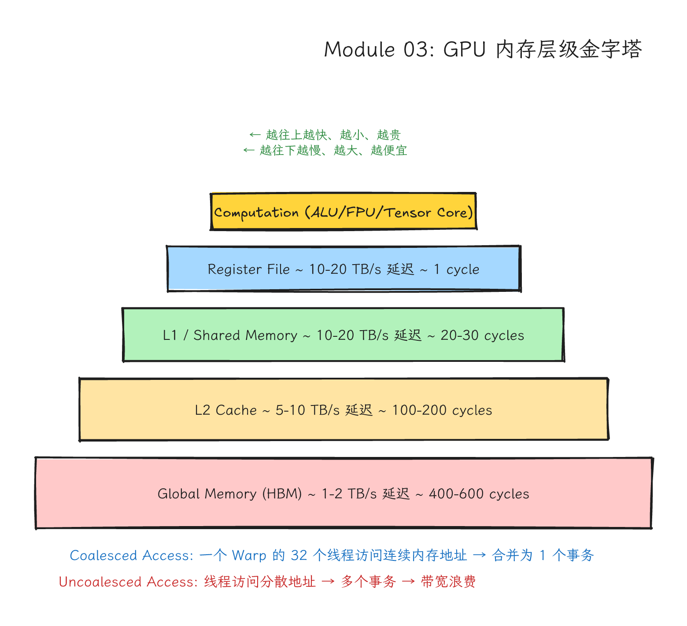
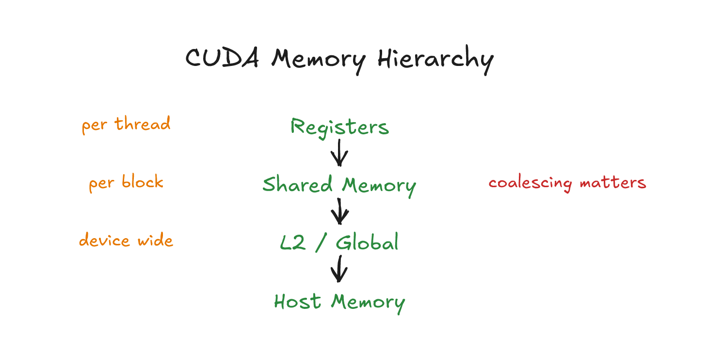
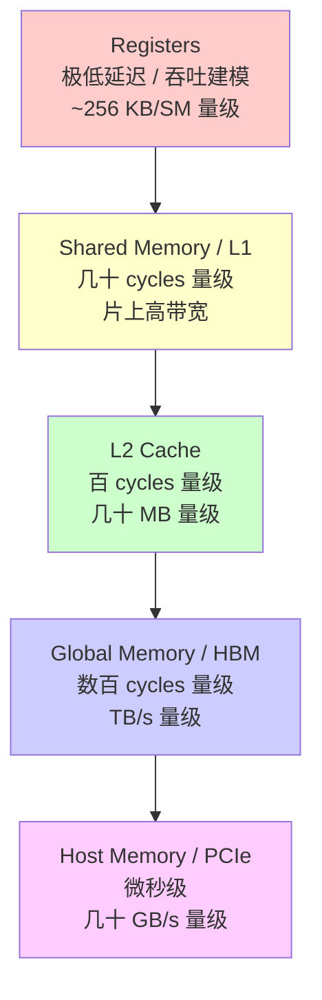
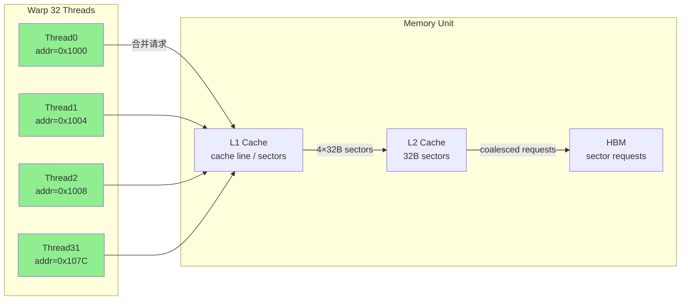
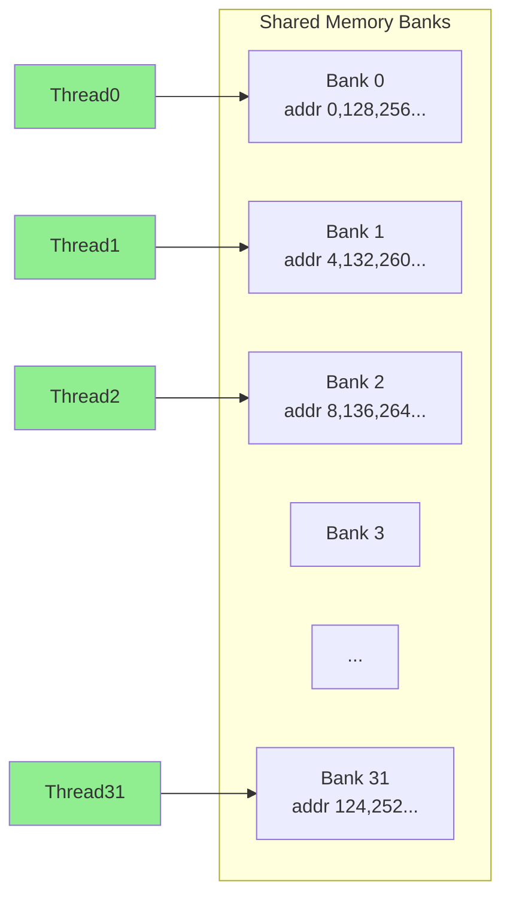
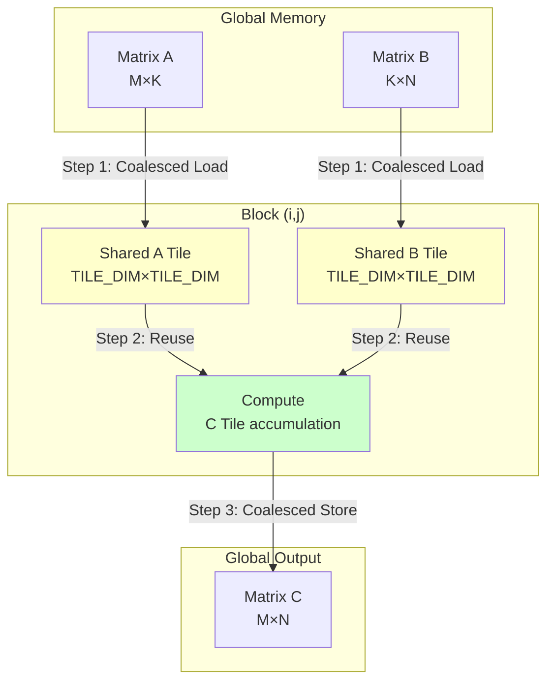

# Module 03: 内存层级、Coalescing 与 Tiling



*图 03-1：GPU 内存层级、访问代价与 tiling 优化方向。可编辑源图：[`module-03-gpu-memory-hierarchy-pyramid.excalidraw`](../diagrams/module-03-gpu-memory-hierarchy-pyramid.excalidraw)。*

**Level:** Intermediate
**Estimated time:** 14–18 小时
**Prerequisites:** Modules 00–02（CUDA 基础、线程模型）
**Sources:** NVIDIA CUDA C++ Programming Guide, CUDA C++ Best Practices Guide, Nsight Compute Profiling Guide, NVIDIA Developer Blog

---

## 学习目标（Learning Objectives）

完成本模块后，你将能够：

1. **解释** GPU 内存层级中每一层（Register → Local → Shared → L1 → L2 → HBM → Host）的延迟、带宽、容量与作用域差异。
2. **绘制** warp 内 32 个线程的地址图，判断 global memory 访问是否 coalesced，并计算 transaction 数量。
3. **识别** shared memory bank conflict 的成因，并用 padding 或 transpose 消除。
4. **实现** 从 naive transpose 到 tiled（含 bank-conflict-free padding）的完整优化路径。
5. **估算** kernel 的 arithmetic intensity，并用 Roofline Model 判断是 memory-bound 还是 compute-bound。
6. **使用** Nsight Compute 读取 memory throughput、bank conflict 和 occupancy 相关指标，并翻译为可执行的优化方向。
7. **理解** cuDNN 中 NCHW vs NHWC 的张量布局对 coalescing 和性能的影响。

---

## 1. 问题背景：为什么内存是第一堵性能墙

前两课你已经能让 GPU 正确工作。现在你会遇到第一个真正的性能墙：算术很少，搬数据很多。

GPU 的算力像一排很强的炉灶，但如果食材送不过来，厨师只能等。以 H100 SXM 为例，HBM 带宽约 3.35 TB/s；如果用 FP32 CUDA core roofline，ridge point 是几十 FLOP/byte；如果用 TF32/FP16/BF16 Tensor Core roofline，ridge point 会升到数百 FLOP/byte量级。注意官方峰值还会区分 dense/sparse、SXM/PCIe、MIG/partition 和具体 dtype。也就是说，同一块 GPU 的 roofline 必须先说清楚 dtype、稀疏性和数据路径。像 transpose、element-wise 这类操作，每 byte 只贡献很少计算，天然会卡在 memory bandwidth 的瓶颈上。

**问题：** GPU 算力够，但数据喂不饱算力。内存层级的访问模式直接决定了 kernel 的真实性能。

---

## 2. 直觉类比：图书馆取书

想象 32 个学生同时去图书馆取书：

- **Coalesced 场景**：他们取同一排连续 32 本书。管理员按连续货架一次性推走几箱货。这就是 warp 内相邻 thread 访问相邻地址，硬件把请求合并成尽可能少的 32B sector transactions。
- **Stride 场景**：每人跨 32 个书架取书。管理员来回跑 32 趟。这就是每个 thread 访问不同 cache line / sector，transaction 数量接近 32。
- **中转仓场景**：先让一车学生把整排书搬到中转仓库，再按目的地重新分拣。这就是 **tiling**：用 shared memory 做中转，把不连续的 global write 变成连续的 global write。

---

## 3. 硬件机制：GPU 内存层级详解



*图 03-2：寄存器、local memory、shared memory、global memory、constant memory 与 host memory 的作用域和延迟直觉。可编辑源图：[`cuda-memory-hierarchy.excalidraw`](../diagrams/cuda-memory-hierarchy.excalidraw)。*

### 3.1 内存层级金字塔



### 3.2 各层级详细对比

| 层级                   | 位置                     | 容量/SM                                        | 延迟                                                   | 带宽                           | 作用域        | 管理方式   | 典型用途                   |
| ---------------------- | ------------------------ | ---------------------------------------------- | ------------------------------------------------------ | ------------------------------ | ------------- | ---------- | -------------------------- |
| **Register**     | On-chip                  | 常见为 64K 个 32-bit registers/SM（约 256 KB） | 极低延迟；通常按 issue/throughput 建模，不当作 0 cycle | 片上最高，随架构和指令路径变化 | 单 thread     | 编译器自动 | 中间变量、累加器           |
| **Local**        | 物理在 HBM               | 受全局内存与编译器 spill 决定                  | 接近 global memory 路径                                | 接近 HBM 路径                  | 单 thread     | 编译器自动 | Register spill、大局部数组 |
| **Shared**       | On-chip                  | 48-228 KB/SM 量级（可配置，随 CC 变化）        | 几十 cycles 量级                                       | 片上高带宽，需按目标 GPU 实测  | Block 内      | 程序员显式 | Tile buffer、线程通信      |
| **L1 Cache**     | On-chip (与 Shared 共享) | 与 Shared 合计                                 | 几十 cycles 量级                                       | 片上高带宽，受访问模式影响     | SM 内         | 硬件自动   | 全局内存缓存               |
| **L2 Cache**     | On-chip                  | 几 MB 到百 MB 量级                             | 百 cycles 量级                                         | 高于 HBM，有明显架构差异       | 全 GPU        | 硬件自动   | 跨 SM 数据复用             |
| **Global / HBM** | Off-chip                 | 取决于 SKU                                     | 数百 cycles 量级                                       | GB/s 到 TB/s 量级              | 全 GPU + Host | 程序员显式 | 主数据存储                 |
| **Host**         | CPU 内存                 | TB 级                                          | 微秒级链路延迟                                         | PCIe/NVLink-C2C 等链路决定     | CPU + GPU     | 操作系统   | 数据准备、结果收集         |

*说明：上表用于建立层级直觉，不是跨 GPU 通用规格表。register/shared/L1/L2 的延迟和带宽通常不是公开稳定常数，受架构、指令、bank conflict、cache hit/miss、clock 和测量方法影响；写性能报告时应引用目标 GPU 文档并用 profiler 或 microbenchmark 复测。*

### 3.3 观察

**Register Spilling（寄存器溢出）**

每个 SM 的 register file 是固定的。如果每个 thread 用 64 个 float（256 bytes），那 2048 个 thread 需要 512 KB，超过了 SM 的 256 KB 预算，编译器会把多余的变量溢出到 **local memory**，而 local memory 物理上就在 global HBM 里。一次 register 访问变成 400-800 周期的 HBM 访问。当你 profile 发现内存流量远超预期时，register spilling 往往是元凶。

**Occupancy 与资源争夺**

Occupancy = 实际 active warp 数 / SM 最大 warp 数。它受三个资源约束：

1. **Register**：每个 thread 用得越多，SM 上能跑的 thread 越少。
2. **Shared memory**：每个 block 分得多，SM 上能放的 block 越少。
3. **Thread 数**：每个 block 最多 1024 threads，但 SM 可以跑多个 blocks。

最大 occupancy 不等于最大性能。一旦有足够 warp 隐藏主导延迟，再加 warp 的边际收益递减。

### 3.4 不同架构的对比

| GPU      | 架构      | HBM 带宽    | 计算 roof 示例                                                                               | Shared/SM                                    | L2                    | Ridge Point                                       |
| -------- | --------- | ----------- | -------------------------------------------------------------------------------------------- | -------------------------------------------- | --------------------- | ------------------------------------------------- |
| RTX 3090 | Ampere    | 936 GB/s    | FP32 CUDA core: 35.6 TFLOP/s                                                                 | 100 KB                                       | 6 MB                  | ~38 FLOP/byte                                     |
| A100 SXM | Ampere    | 2.0 TB/s    | FP32 CUDA core: 19.5 TFLOP/s; FP16 Tensor Core dense: 312 TFLOP/s                            | 164 KB per SM; 163 KB max per block          | 40 MB                 | ~9.8 (FP32) / ~156 (FP16 TC)                      |
| H100 SXM | Hopper    | 3.35 TB/s   | FP32 CUDA core: ~67 TFLOP/s；TF32/FP16/BF16 Tensor Core roof 需区分 dense/sparse 和 SKU 口径 | 228 KB per SM; 227 KB max per block          | 50 MB                 | ~20 (FP32)；Tensor Core 路径按目标 dtype/SKU 重算 |
| B200 SXM | Blackwell | 8 TB/s 级别 | FP4/FP8/FP16/TF32 roof 取决于具体产品、稀疏性和 Tensor Core 模式                             | CC 10.0: 228 KB per SM; 227 KB max per block | GB200 级别可到 126 MB | 按目标 dtype 重新计算                             |

*Ridge Point = Peak FLOPS / Peak Bandwidth。这里的 Peak FLOPS 必须注明 dtype 和路径，例如 FP32 CUDA core、TF32 Tensor Core、FP16/BF16 Tensor Core 或 FP8/FP4 Tensor Core。低于对应 ridge point 的 kernel 更可能 memory-bound。*

---

## 4. Coalescing：硬件机制详解

### 4.1 什么是 Memory Coalescing？

当 warp 中 32 个 threads 同时请求 global memory 数据时，硬件会把这些请求**合并**（coalesce）成尽可能少的 memory transactions。合并的效率取决于：

- **地址连续性**：thread 0 和 thread 1 的地址是否相邻？
- **对齐性**：第一个地址是否落在 cache line / sector 的起始边界？
- **数据大小**：float (4B) vs float2 (8B) vs float4 (16B) 影响 transaction 数量。

### 4.2 Transaction、Cache Line、Sector



**概念：**

- **Cache Line / Sector**：现代 NVIDIA GPU 的 profiler 通常以 32B sector 口径统计全局内存事务；L1/L2 内部可能有更大的 line/fill 粒度，但做 coalescing 练习时优先按 32B sector 计算。
- **Transaction**：这里指服务一个 warp memory instruction 所需覆盖的 sector 数。若地址跨越多个 sector，就需要更多 transactions。

**理想情况**：32 个 threads 各取 1 个 float（4 bytes），地址连续且 128B 对齐 → 覆盖 **4 个 32B sectors**，合计 128 bytes，sector 利用率接近 100%。

**不对齐情况**：地址连续但不对齐，比如从 0x1010 开始读取 128 bytes → 会跨越 **5 个 32B sectors**（同时也可能跨两个 128B cache lines），额外 sector 降低有效带宽。

**最差情况**：32 个 threads 随机访问 32 个不同的 sectors/cache lines → 最多 **32 个 sector transactions**，带宽利用率暴跌。

### 4.3 地址图练习

把 warp 内 32 个 thread 的地址画出来，是判断 coalescing 的最可靠方法：

```
// 理想 coalesced：4 个 32B sector transactions（128B 总量，100% 有效）
Thread:  0   1   2   3  ... 31
Addr:    0   4   8  12  ... 124  → 覆盖 [0, 127] → 4 sectors ✅

// 错位但仍连续：5 个 32B sectors
Thread:  0   1   2   3  ... 31
Addr:   16  20  24  28 ... 140  → 覆盖 [0,31] 到 [128,159] → 5 sectors ⚠️

// Stride-1024：接近 32 个 sector transactions（最糟）
Thread:  0      1      2      3  ... 31
Addr:    0   4096   8192  12288 ...  → 每 thread 不同 sector/cache line → 32 transactions ❌
```

**注意**：在同一组 sector 内部的地址 permutation 不影响 coalescing。thread 0 取 addr 0x1000，thread 1 取 addr 0x1008，和 thread 0 取 0x1008、thread 1 取 0x1000，transaction 数量是一样的。

### 4.4 数据类型与 Transaction 数

| 数据类型 | 大小 | 32 threads 总字节 | 理想 Transaction 数 |
| -------- | ---- | ----------------- | ------------------- |
| float    | 4B   | 128B              | 4 个 32B sectors    |
| float2   | 8B   | 256B              | 8 个 32B sectors    |
| float4   | 16B  | 512B              | 16 个 32B sectors   |
| double   | 8B   | 256B              | 8 个 32B sectors    |

---

## 5. Shared Memory 与 Bank Conflict

### 5.1 Shared Memory 的 Bank 结构

Shared memory 被分成 32 个 **bank**（在 compute capability 3.x 及以后是 32 个 bank；早期是 16 个）。每个 bank 的宽度是 4 bytes（默认配置）。

地址映射规则：

```
bank_index = (address / 4) % 32
```

- 连续的 4-byte 地址映射到连续的 bank。
- 同一个 warp 内多个 threads 如果同时访问**同一个 bank 的不同地址**，就会产生 **bank conflict**，硬件通常需要拆成多个 wavefront/transaction 服务。
- 如果多个 threads 读取**同一个 bank 的同一个地址**，硬件可做 broadcast，不算 bank conflict。多个 threads 写同一个地址则首先是数据竞争/写入仲裁问题，不应当作普通 bank-conflict 优化案例；除非算法明确允许同值写入或使用 atomic/同步协议，否则结果语义不可依赖。



### 5.2 Bank Conflict 的定量分析

```
// 场景 1：无 conflict（stride=1）
Thread i 访问 addr = i * 4
tid: 0 1 2 3 ... 31
bank: 0 1 2 3 ... 31 -> 全部不同 bank -> 可由一次无冲突 wavefront/transaction 服务（具体周期随架构变化）

// 场景 2：2-way conflict（stride=2）
Thread i 访问 addr = i * 8
tid: 0 1 2 3 ... 15 16 17 18 ... 31
bank: 0 2 4 6 ... 30 1 3 5 ... 31
      ^ 每个 bank 有 2 个 threads -> 2-way conflict -> 需要拆分服务

// 场景 3：32-way conflict（stride=32）
Thread i 访问 addr = i * 128
tid: 0 1 2 3 ... 31
bank: 0 0 0 0 ... 0 -> 全部 Bank 0 -> 32-way conflict -> 严重串行化
```

### 5.3 用 Padding 消除 Bank Conflict

对于 32×32 的 tile：

```cpp
__shared__ float tile[32][32];       // 第 i 列的所有元素都在 Bank i
// 读一列时：32 threads 同时访问 Bank 0 → 32-way conflict!

__shared__ float tile[32][32 + 1];   // +1 padding
// 第 0 列：Bank 0, 1, 2...（行 0 的 addr=0→Bank0, 行1 addr=33*4=132→Bank1）
// 现在一列的 32 个元素分布在 32 个不同 bank！✅
```

**Padding 原理**：`tile[TILE_DIM][TILE_DIM + PADDING]`，其中 `PADDING` 的选择原则是让相邻行起点落到不同 bank。对 32 个 4-byte bank 的 float tile，可看 `((TILE_DIM + PADDING) * sizeof(float) / 4) % 32`；如果这个值为 0，读一列时每行落到同一 bank。对于 float 和 32×32 tile，`+1` 让行跨度从 32 个 word 变成 33 个 word，bank index 每行前进 1，从而打散 bank 分布。其他 dtype、bank 宽度或向量化访问要重新计算。

---

## 6. Tiling 策略的完整数学

### 6.1 为什么要 Tiling？

Tiling 的思想是：**把数据从慢的 global memory 搬到快的 shared memory，在 fast memory 里多次复用。**

以矩阵乘法为例：

- Naive：每个 thread 读 A 的一行和 B 的一列，各 K 次。全局内存流量 = 2×M×N×K×sizeof(float)。
- Tiled：一个 block 负责 C 的一个 tile（如 32×32）。先把 A 的一个 32×K tile 和 B 的一个 K×32 tile 搬到 shared memory，然后在 shared memory 内做 32 次乘加复用。全局内存流量大幅降低。

### 6.2 Tile 大小的选择

Tile 大小受以下约束：

1. **Shared memory 容量**：每个 SM 的 shared memory 有限。Tile 越大，每个 block 占用的 shared memory 越多，SM 上能同时跑的 block 数越少，occupancy 下降。
2. **Register 预算**：每个 thread 需要 accumulators 和索引变量，register 用得多也会影响 occupancy。
3. **计算/通信比**：Tile 越大，每个元素从 global 搬到 shared 后被复用的次数越多，但同步开销 (`__syncthreads()`) 也增加。

计算方式：

```
Shared memory per block = 2 * TILE_DIM * TILE_DIM * sizeof(float)  // A tile + B tile
Blocks per SM <= min(shared-memory limit, register limit, thread limit, hardware block limit)
Occupancy = (resident warps per SM) / (max resident warps per SM)
```

以 A100（164 KB shared/SM，常见最大 2048 threads/SM，1024 threads/block）为例，先只看 shared memory，再叠加 thread/block 限制：

- `TILE_DIM=32`：A/B 两个 tile 需要 `2×32×32×4 = 8 KB`。如果教学 kernel 用 `blockDim=(32,32)`，每个 block 是 1024 threads；即使 shared memory 允许约 20 个 block，thread 上限也把驻留 block 数压到最多 2 个，且还要再受 register 和硬件 block 数限制。
- `TILE_DIM=64`：A/B 两个 tile 需要 `2×64×64×4 = 32 KB`。shared memory 角度大约允许 5 个 block，但简单的 `blockDim=(64,64)` 有 4096 threads，已经超过 CUDA 的 1024 threads/block 上限。要做 64×64 output tile，通常让每个 thread 计算多个 C 元素，或者用 warp-level / Tensor Core tile 分层，而不是一格一个 thread。
- `TILE_DIM=128`：A/B 两个 tile 需要 `2×128×128×4 = 128 KB`。shared memory 已经接近单 block 独占，更不可能用 128×128 个 threads 直接映射。真实高性能 GEMM 会把 threadblock tile、warp tile、MMA tile 和 per-thread accumulator 分层设计。

### 6.3 Tiling 数据流图



三笔账：

1. **搬运成本**：global → shared 的 load 花时间。
2. **复用收益**：同一份数据被多个 threads 或多次计算复用。
3. **协作成本**：`__syncthreads()` 开销，shared memory 占用降低 occupancy。

---

## 7. Roofline Model 入门

### 7.1 公式

Roofline Model 是判断 kernel 瓶颈类型的最简洁工具：

```
Arithmetic Intensity (AI) = FLOPs / Bytes moved
Achievable Performance = min(Peak FLOPS, Peak Bandwidth × AI)
```

画出 AI 为 x 轴、Performance 为 y 轴的图，得到两条线：

- **Memory-bound 斜线**：y = Bandwidth × AI。性能随 AI 线性增长。
- **Compute-bound 平顶**：y = Peak FLOPS。无论 AI 多高，不能超过算力上限。
- **Ridge Point（岭点）**：两条线交点，即 Peak FLOPS / Peak Bandwidth。

### 7.2 常见 Kernel 的 AI 定位

下表只给数量级，口径是 FP32、按 DRAM 读写字节估算、忽略 cache 复用和 fused epilogue。实际 AI 必须用目标 shape、dtype、layout 和 profiler byte counter 重新算。

| Kernel                      | 典型 AI (FLOP/byte)                                                   | H100 上                                 | A100 上                                 |
| --------------------------- | --------------------------------------------------------------------- | --------------------------------------- | --------------------------------------- |
| Element-wise Add`C=A+B`   | 约`1 FLOP / 12B = 0.083`                                            | Memory-bound                            | Memory-bound                            |
| AXPY`Y=aX+Y`              | 约`2 FLOP / 12B = 0.167`                                            | Memory-bound                            | Memory-bound                            |
| Transpose / Copy            | 按真正 FLOP 近似 0；若把一次搬运当 1 个“操作”也只有约 0.125 op/byte | Memory-bound                            | Memory-bound                            |
| Batch Norm / LayerNorm      | 约 0.3-几 FLOP/byte，取决于是否融合、是否重读统计量                   | 多数 memory-bound                       | 多数 memory-bound                       |
| Small / Skinny GEMM         | shape 相关，常见 1-50                                                 | 常 memory-bound 或 launch/latency-bound | 常 memory-bound 或 launch/latency-bound |
| Large square GEMM           | 理想复用下约`N/6`（FP32 三矩阵流量口径），Tensor Core dtype 需重算  | 大尺寸常 compute-bound                  | 大尺寸常 compute-bound                  |
| Attention Prefill           | shape 相关，通常明显高于 decode；FlashAttention 会改变 byte 口径      | 常受 Tensor Core、softmax、HBM 共同约束 | 常受 Tensor Core、softmax、HBM 共同约束 |
| Attention Decode (batch 小) | KV cache 读占主导，常低 AI                                            | Deep memory/latency-bound               | Deep memory/latency-bound               |

### 7.3 为什么 Ridge Point 越来越高？

从 A100 到 H100，如果选择 Tensor Core 路径做对比：

- Tensor Core roofline 的增长速度通常快于 HBM 带宽增长；但 TF32、FP16/BF16、FP8 还要区分 dense/sparse、SXM/PCIe 和具体 SKU。
- 因此 ridge point 会明显上升：同一个 arithmetic intensity，在 A100 上可能接近 compute-bound，在 H100 上可能重新变成 memory-bound。
- 课程实验不要抄固定 TFLOP/s；应从目标 GPU 官方规格或 `nvidia-smi`/厂商文档读取峰值口径，再用 `Peak FLOPS / measured bandwidth` 重新计算。

这带来的结果是：**更多 workload 在 H100 上变成了 memory-bound**。只买更强的卡但不优化内存访问，很多场景零收益。

### 7.4 实际应用

对 transpose kernel：

- 按真正 FLOP 口径，transpose 主要是数据搬运，AI 接近 0；如果为了教学把一次元素搬运近似记成 1 个“操作”，也只有 `1 op / 8 bytes (read 4B + write 4B) = 0.125`
- H100 的 FP32 或 Tensor Core ridge point 都远大于 0.125
- 0.125 远低于 ridge point → 按 roofline 判断主要受内存带宽限制
- 优化方向：**只优化内存带宽利用率，不要浪费时间减少算术指令。**

---

## 8. Transpose 的多种实现与对比

Transpose 是理解内存优化的最佳案例。它的特点是：每个元素只被读一次、写一次，几乎没有计算，所以任何性能差异都纯粹来自内存访问模式。

### 8.1 Naive Transpose（完整版，含边界处理）

```cpp
/*
 * naive_transpose.cu
 * 说明：每个 thread 负责一个输出元素。
 * 读 A[row][col] 是连续的（coalesced），但写 B[col][row] 是跨 stride 的（uncoalesced）。
 * 内存流量：2 * M * N * sizeof(float) bytes。
 * 性能瓶颈：global store 的 stride 访问导致 transaction 数激增。
 */
#include <cuda_runtime.h>
#include <stdio.h>

// 边界安全的 naive transpose
// 每个 thread 处理 (BLOCK_ROWS) 个元素，减少 block 内 thread 数
#define TILE_DIM 32
#define BLOCK_ROWS 8

__global__ void transpose_naive(const float* __restrict__ in,
                                float* __restrict__ out,
                                int height, int width) {
    // 计算当前 thread 对应的全局坐标
    int x = blockIdx.x * TILE_DIM + threadIdx.x;  // 列索引（0 ~ width-1）
    int y = blockIdx.y * TILE_DIM + threadIdx.y;  // 行索引（0 ~ height-1）

    // 每个 thread 处理同一列上的 BLOCK_ROWS 个元素
    // 这样 block 只有 (TILE_DIM, BLOCK_ROWS) = (32, 8) = 256 threads
    // 但 tile 覆盖 (32, 32) 区域
    #pragma unroll
    for (int j = 0; j < TILE_DIM; j += BLOCK_ROWS) {
        int row = y + j;
        int col = x;
      
        // 边界检查：row < height && col < width
        if (row < height && col < width) {
            // 读：row-major 连续，threadIdx.x 相邻 threads 读相邻地址 → coalesced ✅
            // 写：out[col * height + row]，相邻 threads 的 col 相同，row 差 stride
            // 即 thread 0 写 addr 0, thread 1 写 addr height, thread 2 写 addr 2*height...
            // 如果 height=1024，相邻 thread 的地址差 4096 bytes → 跨多个 cache line → 32 transactions ❌
            out[col * height + row] = in[row * width + col];
        }
    }
}

// 主机端包装函数
void run_transpose_naive(const float* d_in, float* d_out, int h, int w) {
    dim3 grid((w + TILE_DIM - 1) / TILE_DIM, (h + TILE_DIM - 1) / TILE_DIM);
    dim3 block(TILE_DIM, BLOCK_ROWS);
    transpose_naive<<<grid, block>>>(d_in, d_out, h, w);
    cudaDeviceSynchronize();
}

/*
 * 性能预期（A100，1024×1024）：
 * - 有效带宽约为 copy kernel 的 20-40%
 * - Nsight Compute 会显示：global store 的 sectors/request 或有效字节占比很差
 *   （32 个 float 连续访问理想覆盖 4 个 32B sectors；stride 写可能接近 32 个 sectors）
 */
```

**Naive 的问题**：

- `in[row * width + col]`：threadIdx.x 相邻 → col 相邻 → 地址连续 → **读是 coalesced** ✅
- `out[col * height + row]`：threadIdx.x 相邻 → col 相同，但 row 相差 stride=height → 地址差 `height * sizeof(float)` → **写是 stride 访问，极不 coalesced** ❌

### 8.2 Tiled Transpose（含 Padding 防 Bank Conflict）

```cpp
/*
 * tiled_transpose.cu
 * 说明：用 shared memory 做中转，让读和写都 coalesced。
 * 步骤：
 *   1. Coalesced read from global → shared memory (行存)
 *   2. __syncthreads() 确保 tile 写完成
 *   3. Coalesced write from shared → global (列读变行写)
 * 关键：shared memory 用 [TILE_DIM][TILE_DIM+1] 避免 bank conflict。
 */
#include <cuda_runtime.h>
#include <stdio.h>

#define TILE_DIM 32
#define BLOCK_ROWS 8

__global__ void transpose_tiled(const float* __restrict__ in,
                               float* __restrict__ out,
                               int height, int width) {
    // +1 padding：改变 shared memory 每一行的跨度，避免 32-way bank conflict
    // 32×32 的 tile 若不 padding，读一列时所有 threads 访问同一 bank
    // 32×33 的 tile，行偏移从 128B (32×4) 变成 132B，bank index 被打散
    __shared__ float tile[TILE_DIM][TILE_DIM + 1];

    // ===== Phase 1: Coalesced read from global to shared =====
    int x = blockIdx.x * TILE_DIM + threadIdx.x;  // 输入列索引
    int y = blockIdx.y * TILE_DIM + threadIdx.y;  // 输入行索引

    // 每个 thread 读 TILE_DIM / BLOCK_ROWS = 4 行
    #pragma unroll
    for (int j = 0; j < TILE_DIM; j += BLOCK_ROWS) {
        int row = y + j;
        int col = x;
        if (row < height && col < width) {
            // tile 内按原始行优先存储：tile[ty+j][tx] = in[row][col]
            // threadIdx.x 相邻 → col 相邻 → global load coalesced ✅
            tile[threadIdx.y + j][threadIdx.x] = in[row * width + col];
        }
    }

    // 必须同步：确保所有 threads 写完 tile 后，才能开始读
    __syncthreads();

    // ===== Phase 2: Coalesced write from shared to global =====
    // 交换 blockIdx：输出矩阵是 width × height，block (i,j) 负责输出 block (j,i)
    x = blockIdx.y * TILE_DIM + threadIdx.x;  // 输出行索引（原 blockIdx.y）
    y = blockIdx.x * TILE_DIM + threadIdx.y;  // 输出列索引（原 blockIdx.x）

    #pragma unroll
    for (int j = 0; j < TILE_DIM; j += BLOCK_ROWS) {
        int row = y + j;
        int col = x;
        if (row < width && col < height) {
            // 从 tile 中按转置方向读取：原 tile[ty+j][tx] 现在用 tile[tx][ty+j] 读
            // threadIdx.x 相邻 → 输出 col 相邻 → global store coalesced ✅
            // 注意：读 tile[tx][ty+j] 时，tx 固定，ty+j 变化
            // 如果不加 padding，所有 threads 的 tx 相同 → 访问同一列 → 同一 bank → bank conflict ❌
            // 加了 padding 后，bank 被打散，无 conflict ✅
            out[row * height + col] = tile[threadIdx.x][threadIdx.y + j];
        }
    }
}

void run_transpose_tiled(const float* d_in, float* d_out, int h, int w) {
    dim3 grid((w + TILE_DIM - 1) / TILE_DIM, (h + TILE_DIM - 1) / TILE_DIM);
    dim3 block(TILE_DIM, BLOCK_ROWS);
    transpose_tiled<<<grid, block>>>(d_in, d_out, h, w);
    cudaDeviceSynchronize();
}

/*
 * 性能预期（历史 transpose 教学实验的量级参考，不是标准答案）：
 * - 在特定 GPU / 1024×1024 实验中，有效带宽可接近 copy kernel 的 90-95%
 * - 对比 naive 的加速倍数必须在目标 GPU、矩阵尺寸、编译选项下复测
 * Nsight Compute 观察点：
 * - global load/store efficiency 接近 100%
 * - shared memory bank conflict 接近 0
 */
```

### 8.3 Transpose 实现对比表

| 实现                | Global Read | Global Write          | Shared Memory  | Bank Conflict | 相对带宽（历史参考） | 关键优化                   |
| ------------------- | ----------- | --------------------- | -------------- | ------------- | -------------------- | -------------------------- |
| Naive               | Coalesced   | Strided (uncoalesced) | 无             | N/A           | ~20-40%              | 基线                       |
| Coalesced Read      | Coalesced   | Coalesced (经 shared) | 有，无 padding | 严重          | ~60-70%              | 共享内存中转               |
| Tiled + Padding     | Coalesced   | Coalesced             | 有，+1 padding | 消除          | ~90-95%              | 消除 bank conflict         |
| Diagonal Reordering | Coalesced   | Coalesced             | 有             | 消除          | ~95%+                | 额外解决 partition camping |

*数据来源：NVIDIA Developer Blog "Efficient Matrix Transpose in CUDA C/C++"。这些百分比来自特定历史 GPU 和矩阵尺寸，可作为优化方向参考，不能直接外推到 A100/H100/B200 或任意矩阵规模。*

**Diagonal Reordering**（进阶）：在 2D grid 中，block (i,j) 负责区域 (j,i)，但沿对角线重新排布 block 分配，避免多个 blocks 同时访问 HBM 的同一个 partition（partition camping）。在 Maxwell 及早期架构上效果显著，现代 HBM 架构影响较小。

---

## 9. Shared Memory Tiled Matrix Multiplication（复用收益展示）

```cpp
/*
 * tiled_gemm.cu
 * 说明：展示 shared memory tiling 如何将 global memory 流量从 O(N^3) 降到 O(N^3/TILE_SIZE)。
 * 每个 block 计算 C 的一个 TILE_DIM × TILE_DIM 子块。
 * 步骤：
 *   1. 将 A 的 TILE_DIM × TILE_DIM 块和 B 的 TILE_DIM × TILE_DIM 块从 global 加载到 shared
 *   2. 在 shared memory 内计算局部 dot product
 *   3. 沿 K 维度滑动，重复 1-2
 *   4. 把累加结果写回 global
 */
#include <cuda_runtime.h>

#define TILE_DIM 32

__global__ void matmul_tiled(const float* __restrict__ A,
                             const float* __restrict__ B,
                             float* __restrict__ C,
                             int M, int N, int K) {
    // 当前 block 负责的 C 子块左上角坐标
    int bx = blockIdx.x;   // 对应 C 的列块索引
    int by = blockIdx.y;   // 对应 C 的行块索引
    int tx = threadIdx.x;  // 0 ~ TILE_DIM-1
    int ty = threadIdx.y;  // 0 ~ TILE_DIM-1

    // 当前 thread 负责 C 中的全局坐标
    int row = by * TILE_DIM + ty;
    int col = bx * TILE_DIM + tx;

    // Shared memory tiles：A 的子块和 B 的子块
    // __shared__ 修饰的变量对 block 内所有 threads 可见
    __shared__ float As[TILE_DIM][TILE_DIM];
    __shared__ float Bs[TILE_DIM][TILE_DIM];

    float Cval = 0.0f;  // 累加器，存于 register

    // 沿 K 维度滑动，每次处理 TILE_DIM 长度
    for (int t = 0; t < (K + TILE_DIM - 1) / TILE_DIM; ++t) {
        // ===== 协作加载 A tile =====
        // A 的 tile 起始：行=row, 列=t*TILE_DIM+tx
        if (row < M && t * TILE_DIM + tx < K) {
            As[ty][tx] = A[row * K + t * TILE_DIM + tx];
        } else {
            As[ty][tx] = 0.0f;  // 越界填充 0
        }

        // ===== 协作加载 B tile =====
        // B 的 tile 起始：行=t*TILE_DIM+ty, 列=col
        if (t * TILE_DIM + ty < K && col < N) {
            Bs[ty][tx] = B[(t * TILE_DIM + ty) * N + col];
        } else {
            Bs[ty][tx] = 0.0f;
        }

        // 必须同步：确保所有 threads 的加载完成后，才能开始计算
        __syncthreads();

        // ===== 在 shared memory 内计算局部 dot product =====
        // 每个 thread 从 As 读一行，从 Bs 读一列
        // 这些访问都在 on-chip shared memory，延迟远低于未缓存的 global memory；
        // 具体周期受架构、bank conflict、指令和调度影响。
        #pragma unroll
        for (int k = 0; k < TILE_DIM; ++k) {
            Cval += As[ty][k] * Bs[k][tx];
        }

        // 计算完成后再同步，避免下轮加载覆盖当前数据
        __syncthreads();
    }

    // 写回 C：coalesced，因为相邻 thread 的 col 相邻
    if (row < M && col < N) {
        C[row * N + col] = Cval;
    }
}

/*
 * 复用收益分析（以 M=N=K=1024, TILE_DIM=32 为例）：
 * 
 * Naive 方式：
 *   - 每个 C 元素需要读 A 的 1 行 (K floats) + B 的 1 列 (K floats)
 *   - 总 global 读取 = 2 * M * N * K * 4 bytes ≈ 8.6 GB
 * 
 * Tiled 方式：
 *   - 每个 A tile 被 TILE_DIM 个 threads 复用，共复用 TILE_DIM 次
 *   - 总 global 读取 ≈ [M*K*(N/TILE_DIM) + K*N*(M/TILE_DIM)] * 4 bytes
 *     对 M=N=K=1024, TILE_DIM=32，约为 0.27 GB
 *   - 复用比 = 8.6 / 0.27 ≈ 32×
 * 
 * 实际加速：通常 5-20×，因为 naive 版本还有 coalescing 问题
 */
```

---

## 10. Memory 对齐与 cudaMallocPitch

### 10.1 为什么对齐重要？

cudaMalloc() 保证分配的内存至少 256 bytes 对齐。但如果你的二维数组行宽不是合适的对齐倍数，第二行的起始地址可能落在 sector/cache-line 中间。当 warp 读取这一行时，原本连续 32 个 float 理想覆盖 4 个 32B sectors，错位后可能多覆盖 1 个或更多 sector，导致有效带宽下降。

### 10.2 cudaMallocPitch 示例

```cpp
/*
 * pitch_example.cu
 * 说明：使用 cudaMallocPitch 分配行对齐的 2D 数组，确保每行起始地址满足
 *       coalescing 的 alignment 要求。具体 pitch 数值由 CUDA runtime 返回，不要写死。
 */
#include <cuda_runtime.h>
#include <stdio.h>

__global__ void process_2d_pitched(float* devPtr, size_t pitch, int width, int height) {
    int tidx = blockIdx.x * blockDim.x + threadIdx.x;  // 列索引
    int tidy = blockIdx.y * blockDim.y + threadIdx.y;  // 行索引

    if (tidx < width && tidy < height) {
        // 计算元素地址：BaseAddress + row * pitch + col * sizeof(float)
        // pitch 是每行的实际字节数（含 padding），由 cudaMallocPitch 返回
        float* row = (float*)((char*)devPtr + tidy * pitch);
      
        // 读写操作
        float val = row[tidx];
        row[tidx] = val * 2.0f;
    }
}

int main() {
    int width = 420;   // 列数
    int height = 42840; // 行数
    size_t pitch = 0;
    float* d_matrix = nullptr;

    // cudaMallocPitch：分配 width * height * sizeof(float) 字节，但会自动 padding。
    // 返回的 pitch 是每行的实际字节数；它满足设备对齐需求，但具体倍数不作为代码假设。
    cudaMallocPitch(&d_matrix, &pitch, width * sizeof(float), height);
  
    printf("Requested row width: %zu bytes\n", width * sizeof(float));  // 1680 bytes
    printf("Actual pitch: %zu bytes\n", pitch);  // 运行时查询，后续访问必须使用这个返回值

    // 用 cudaMemcpy2D 拷贝数据（支持 pitch）
    float* h_matrix = (float*)malloc(width * sizeof(float) * height);
    cudaMemcpy2D(d_matrix, pitch, h_matrix, width * sizeof(float),
                   width * sizeof(float), height, cudaMemcpyHostToDevice);

    // 启动 kernel
    dim3 block(32, 8);
    dim3 grid((width + block.x - 1) / block.x, (height + block.y - 1) / block.y);
    process_2d_pitched<<<grid, block>>>(d_matrix, pitch, width, height);

    cudaFree(d_matrix);
    free(h_matrix);
    return 0;
}

/*
 * 关键观察：
 * - 不用 pitch：width=420 → 行宽 1680 bytes，不是 256 倍数，第二行起始 1680 → 错位
 * - 用 pitch：cudaMallocPitch 会返回满足设备访问要求的 pitch，可能增加每行 padding。
 *   warp 读取每行时，行首更容易满足 coalescing 所需对齐，但 transaction 数仍取决于
 *   元素类型、访问宽度、cache line/segment 和具体架构。
 * 
 * 取舍：对齐节省的 bandwidth 通常 worth 额外的内存开销
 */
```

### 10.3 检查 Alignment

```cpp
// 检查指针是否对齐到指定边界
bool is_aligned(const void* ptr, size_t alignment) {
    return ((uintptr_t)ptr % alignment) == 0;
}

// 常见用法
if (is_aligned(d_ptr, 128)) {
    // 128-byte aligned：连续 32 个 float 从这里开始时正好覆盖 4 个 32B sectors
}
if (is_aligned(d_ptr, 256)) {
    // 256-byte aligned，适合 CUDA 全局内存最优对齐
}
```

---

## 11. Nsight Compute 指标详解

### 11.1 指标速查表

Nsight Compute 的底层 metric 名称会随版本和 GPU 架构变化。下面列的是常见方向和示例 metric；如果命令报 `Unknown metric`，先运行 `ncu --query-metrics` 和 `ncu --list-sections`，或使用 `--set detailed` / `--section SpeedOfLight` / `--section MemoryWorkloadAnalysis` 这类随版本维护的 section 入口。

| 指标                                   | Nsight Compute Metric                                             | 意义                   | 健康值       | 诊断                       |
| -------------------------------------- | ----------------------------------------------------------------- | ---------------------- | ------------ | -------------------------- |
| **Kernel Time**                  | `gpu__time_duration.sum`                                        | 内核总耗时             | 视场景       | 基线                       |
| **Global Load Throughput**       | `l1tex__t_bytes_pipe_lsu_mem_global_op_ld.sum.per_second`       | 全局读带宽             | >60% 理论值  | 低 = 读不连续或 cache miss |
| **Global Store Throughput**      | `l1tex__t_bytes_pipe_lsu_mem_global_op_st.sum.per_second`       | 全局写带宽             | >60% 理论值  | 低 = 写不连续              |
| **Global Load Efficiency**       | `smsp__sass_average_data_bytes_per_sector_mem_global_op_ld.pct` | 每 sector 有效字节占比 | 接近 100%    | 低 = 跨 sector 或错位      |
| **Shared Memory Bank Conflicts** | `l1tex__data_bank_conflicts_pipe_lsu_mem_shared_op_ld.sum`      | Bank conflict 次数     | 0 或接近 0   | >0 存在 bank conflict      |
| **Shared Efficiency**            | `smsp__sass_average_data_bytes_per_wavefront_mem_shared`        | Shared memory 效率     | 接近 100%    | 低 = 有 bank conflict      |
| **Achieved Occupancy**           | `sm__warps_active.avg.pct_of_peak_sustained_active`             | 实际 occupancy         | 通常 50-100% | 过低 = 资源约束            |
| **L2 Hit Rate**                  | `lts__t_sector_hit_rate.pct`                                    | L2 cache 命中率        | 视场景       | 高 = 复用好，低 = 数据太大 |
| **Warp Stalls (Memory)**         | `smsp__warps_issue_stalled_long_scoreboard_per_warp_active.pct` | Warp 因等内存而 stall  | 视场景       | 高 = 内存延迟没被隐藏      |

### 11.2 命令行示例

```bash
# 基础 memory 分析
ncu --metrics \
  "l1tex__t_bytes_pipe_lsu_mem_global_op_ld.sum.per_second,\
l1tex__t_bytes_pipe_lsu_mem_global_op_st.sum.per_second,\
smsp__sass_average_data_bytes_per_sector_mem_global_op_ld.pct,\
l1tex__data_bank_conflicts_pipe_lsu_mem_shared_op_ld.sum,\
sm__warps_active.avg.pct_of_peak_sustained_active" \
  ./transpose_program

# 完整 Memory Workload Analysis
ncu --section MemoryWorkloadAnalysis ./transpose_program

# 查看 Roofline Model。section 名称随 Nsight Compute 版本变化；
# 常见当前入口是 SpeedOfLight_RooflineChart，也可以直接用 --set detailed 后在 GUI 查看。
ncu --section SpeedOfLight_RooflineChart ./transpose_program
```

### 11.3 如何翻译指标为行动

| 观察                          | 翻译                   | 行动                                         |
| ----------------------------- | ---------------------- | -------------------------------------------- |
| Global load efficiency < 50%  | 读跨多个 cache lines   | 检查 coalescing，对齐 block 尺寸到 warp 倍数 |
| Global store efficiency < 50% | 写跨多个 cache lines   | 用 shared memory 中转，transpose 写方向      |
| Bank conflicts > 0            | Shared memory 访问冲突 | 加 padding 或改变访问模式                    |
| Occupancy < 30%               | 资源不足或 block 太大  | 减少 register 或 shared memory 使用          |
| L2 hit rate < 10%             | 数据太大或不复用       | 加 tiling，提高数据局部性                    |

---

## 12. 真实系统落点：cuDNN 的 Tensor Layout

### 12.1 NCHW vs NHWC

深度学习框架中，4D 图像张量有两种主流布局：

- **NCHW**：Batch, Channel, Height, Width（Channel 优先）
- **NHWC**：Batch, Height, Width, Channel（Channel 最后）

```cpp
// NCHW：同一 channel 的像素连续存储
addr = ((n * C + c) * H + h) * W + w;

// NHWC：同一像素的所有 channel 连续存储
addr = ((n * H + h) * W + w) * C + c;
```

### 12.2 对 GPU Coalescing 的影响

**NCHW 在 GPU 上的行为**：

- 若 kernel 把一个 warp 的 32 个 lanes 映射到同一 (n, c) 下连续的 w（水平像素）。
- `addr = base + w`，相邻 thread 的 w 差 1 → 地址差 4 bytes → **coalesced** ✅
- 这是 PyTorch 和早期 cuDNN 的默认格式。

**NHWC 在 GPU 上的行为**：

- 若 kernel 把一个 warp 的 lanes 映射到同一 (n, h, w) 下连续的 c（channel）。
- `addr = base + c`，相邻 thread 的 c 差 1 → 地址差 4 bytes → 也 **coalesced** ✅
- Tensor Core 相关的现代 cuDNN convolution backend 通常更偏好 NHWC / channels-last 路径，因为它能减少内部 layout transform 并匹配矩阵化后的数据布局。

### 12.3 为什么现代 GPU 推荐 NHWC？

| 因素               | NCHW                                      | NHWC                                        |
| ------------------ | ----------------------------------------- | ------------------------------------------- |
| Tensor Core 友好度 | 常需要内部 layout transform 或额外搬运    | 更贴近 cuDNN Tensor Core backend 的期望布局 |
| 内存访问模式       | 空间连续，channel 跳跃                    | channel 连续，空间跳跃                      |
| 卷积实现           | 经典 im2col                               | implicit GEMM 更直接                        |
| cuDNN 性能         | 可很好，但 Tensor Core 场景可能有转换成本 | Tensor Core 场景常更容易获得高性能          |
| CPU 缓存           | 取决于算子和框架实现                      | 取决于算子和框架实现                        |

NVIDIA cuDNN 性能文档建议：Tensor Core convolution 优先考虑 NHWC。虽然 NCHW 仍可用，但 NHWC / channels-last 更容易避免内部 transpose 或 layout transform 开销；具体收益随 shape、dtype、cuDNN 版本和 GPU 而变。

*Sources: https://docs.nvidia.com/deeplearning/performance/dl-performance-convolutional/index.html#tensor-layout*

### 12.4 实际影响

在 A100 上测试 ResNet-50 卷积：

- NCHW：cuDNN 会自动处理内部格式转换，但有额外开销。
- NHWC：更容易避免内部 transpose 并匹配 Tensor Core 友好布局；实际加速幅度随模型、shape、cuDNN 版本和 GPU 而变，必须 benchmark。
- 在 PyTorch 中：`channels_last()` 格式就是 NHWC。

```python
# PyTorch 切换到 NHWC（channels_last）
input_nhwc = input_nchw.to(memory_format=torch.channels_last)
# 此时 tensor 的 stride 是 (C*H*W, 1, W*C, C)，对应 NHWC
```

---

## 13. Lab：从 Naive 到 Optimal 的 Transpose 实验

### 13.1 实验要求

实现以下 4 个版本的 transpose，并对比性能：

1. `transpose_naive`：直接转置，无优化。
2. `transpose_tiled`：shared memory 中转，无 padding。
3. `transpose_tiled_padded`：shared memory + padding 防 bank conflict。
4. `transpose_copy`：不做转置，只做拷贝（作为带宽上限基线）。

测试尺寸：

- 32 × 32（边界测试）
- 1024 × 1024（性能基准）
- 1000 × 1023（非 2 的幂，边界处理测试）
- 17 × 65（极端小尺寸）

每个版本必须：

- 包含 CPU reference check（cudaMemcpy + CPU transpose 对比）
- CUDA error check（CHECK_CUDA 宏）
- 用 CUDA events 计时
- 用 Nsight Compute 记录至少 5 个关键指标

### 13.2 报告模板

```markdown
## Transpose 性能报告

### 环境
- GPU: 
- CUDA Version: 
- Nsight Compute Version: 

### 结果汇总

| 实现 | 1024×1024 Time (ms) | 有效带宽 (GB/s) | 理论带宽占比 | 主要瓶颈 |
|------|----------------------|-----------------|-------------|----------|
| copy | | | | |
| naive | | | | |
| tiled | | | | |
| tiled+padded | | | | |

### Nsight Compute 关键指标

Naive:
- global load efficiency: 
- global store efficiency: 
- bank conflicts: N/A
- achieved occupancy: 

Tiled+Padded:
- global load efficiency: 
- global store efficiency: 
- bank conflicts: 
- achieved occupancy: 

### 分析与结论

1. 为什么 naive 慢？
2. tiled 相比 naive 改善了什么？
3. padding 解决了什么问题？
4. 如果尺寸不是 2 的幂，性能有何变化？为什么？
```

---

## 14. 练习阶梯

### 14.1 Recall（基础回忆）

1. Register、Shared Memory、Global Memory 的作用域、生命周期、速度差异是什么？
2. 在 row-major 布局下，`A[row * width + col]` 中相邻 thread 的 `col` 差 1 时，地址是否连续？
3. 什么是 bank conflict？为什么 `__shared__ float s[32][32]` 读列时会产生 32-way conflict？

### 14.2 Trace（代码追踪）

4. 画出一个 warp 内 32 个 threads 的地址图：naive transpose 的 `out[col * height + row]`，height=1024，假设 block=(32,1)，threadIdx.x 从 0 到 31。每个 thread 的地址差是多少？需要几个 transactions？
5. 对于 `__shared__ float tile[32][33]`，计算 `tile[0][0]`、`tile[1][0]`、`tile[0][1]` 的 bank index。证明读 `tile[x][0]`（x 从 0 到 31）时 32 个 threads 访问 32 个不同 bank。

### 14.3 Modify（动手修改）

6. 修改 `transpose_tiled` 的 `TILE_DIM` 为 16 和 64，分别测试性能。解释为什么 64 可能变慢（提示：occupancy）。
7. 在 `transpose_tiled` 中去掉 `__syncthreads()`，观察结果。为什么错？
8. 修改 `transpose_tiled` 的 padding 从 +1 改为 +2，性能有变化吗？为什么？

### 14.4 Implement（实现新功能）

9. 实现非方阵的 tiled transpose（M×N → N×M），确保 M 和 N 不能整除 TILE_DIM 时结果正确。
10. 实现 diagonal reordering 的 transpose（进阶），解决 partition camping。
11. 实现一个 bandwidth benchmark：用 copy kernel 测量当前 GPU 的峰值有效带宽，与理论值对比。

### 14.5 Explain（概念解释）

12. 为什么 transpose 的 arithmetic intensity 约等于 1，而 GEMM 的 AI 可以超过 1000？
13. 用 Roofline Model 解释：为什么 A100 上 batch=1 的 LLM decode 主要受内存带宽限制？
14. 为什么 H100 的 ridge point 比 A100 高？这会让更多 workload 变成 memory-bound 还是 compute-bound？

---

## 15. Checkpoint（通关检查）

提交以下材料：

1. **代码**：naive transpose、tiled transpose（含 padding）、tiled GEMM、cudaMallocPitch 示例，共 4 个完整可编译文件。
2. **测试报告**：至少 4 个尺寸（32×32、1024×1024、1000×1023、17×65）的 correctness 验证和 timing。
3. **Nsight Compute 截图或日志**：global load/store efficiency、bank conflicts、achieved occupancy 至少 3 个指标。
4. **分析文档**：解释 coalescing、bank conflict、tiling 三者的关系，以及为什么 naive transpose 慢。
5. **Roofline 分析**：估算 transpose 和 GEMM 的 arithmetic intensity，标出它们在 Roofline 图上的位置。

---

## 16. 常见误区与错误排查

| 误区                         | 真相                                          | 如何排查                                         |
| ---------------------------- | --------------------------------------------- | ------------------------------------------------ |
| "Shared memory 一定更快"     | 加载到 shared 本身有开销，复用不足时可能更慢  | 对比 naive 和 tiled，小尺寸可能 tiled 更慢       |
| "Occupancy 越高越好"         | 足够隐藏延迟后，边际收益递减                  | Nsight Compute 看 stall 原因，不是单纯 occupancy |
| "只处理 2 的幂尺寸"          | 真实数据尺寸任意，边界处理必须正确            | 测试 1000×1023、17×65 等尺寸                   |
| "Tile 越大越好"              | Tile 大 → shared memory 多 → occupancy 下降 | 计算 shared per block 和 max blocks per SM       |
| "看见指标低就加 block"       | 如果 kernel 是 compute-bound，加 block 没用   | Roofline 分析先判断瓶颈类型                      |
| "不验证结果就比 kernel time" | 优化后的 kernel 可能算错，但跑得"更快"        | 每个版本必须配 CPU reference check               |
| "cudaMallocPitch 是过时技术" | 现代硬件仍需对齐，pitch 仍是推荐做法          | 对比 pitch vs non-pitch 的 coalescing 效率       |
| "NCHW 总是最好的"            | 现代 Tensor Core 推荐 NHWC                    | 用 cuDNN benchmark 工具对比                      |

---

## 17. Extension（延伸方向）

1. **Warp-level Primitives**：学习 `__shfl_sync`、`__shfl_down_sync` 做 warp 内 reduction，完全绕过 shared memory。
2. **CUDA Graphs**：对于重复执行的 transpose/GEMM，用 CUDA Graphs 消除 launch overhead。
3. ** CUTLASS**：NVIDIA 的开源 GEMM 模板库，展示工业级 tiling、pipelining、Tensor Core 融合的实现。
4. **FlashAttention**：将 tiling 思想应用到 Attention，把 HBM 访问量从 O(N²) 降到 O(N)，是本课思想的终极延伸。
5. **Auto-tuning**：用 CUTLASS profiler、Triton autotune、TVM/Ansor 等工具自动搜索最优 tile 大小、unroll 因子和 pipeline stage。
6. **Multi-GPU Tiling**：数据并行时，tiling 策略需要考虑跨 GPU 通信（NVLink）的带宽。

---

## 18. 本课要记住的话

---

## 19. 资料来源

1. **NVIDIA CUDA C++ Programming Guide – Memory Hierarchy & Shared Memory**: https://docs.nvidia.com/cuda/cuda-c-programming-guide/index.html
2. **NVIDIA CUDA C++ Best Practices Guide – Memory Optimizations**: https://docs.nvidia.com/cuda/cuda-c-best-practices-guide/index.html
3. **NVIDIA Developer Blog – Efficient Matrix Transpose in CUDA C/C++**: https://developer.nvidia.com/blog/efficient-matrix-transpose-cuda-cc/
4. **NVIDIA Developer Blog – Unlock GPU Performance: Global Memory Access in CUDA**: https://developer.nvidia.com/blog/unlock-gpu-performance-global-memory-access-in-cuda/
5. **Nsight Compute Profiling Guide**: https://docs.nvidia.com/nsight-compute/ProfilingGuide/index.html
6. **NVIDIA Deep Learning Performance – Convolutional Tensor Layout**: https://docs.nvidia.com/deeplearning/performance/dl-performance-convolutional/index.html#tensor-layout
7. **GPU Architecture: Memory Hierarchy, CUDA and Tensor Cores (Michael Brenndoerfer)**: https://mbrenndoerfer.com/writing/gpu-architecture-memory-hierarchy-cuda-tensor-cores
8. **CUDA Matrix Multiplication Optimization: From Naive to Near-cuBLAS**: https://www.abhik.ai/articles/cuda-matrix-multiplication-optimization
9. **Machine Learning Systems at Scale – Roofline Model**: https://mlsysbook.ai/vol2/contents/vol2/performance_engineering/performance_engineering.html
10. **Arithmetic Intensity and the Roofline Model**: https://zeroentropy.dev/concepts/arithmetic-intensity/
11. **GPU Memory Management & LLM Inference Optimization**: https://www.youngju.dev/blog/gpu-cuda/2026-03-17-gpu-memory-inference-optimization-guide.en
12. **NVIDIA CUDA C++ Best Practices Guide**: https://docs.nvidia.com/cuda/cuda-c-best-practices-guide/index.html
13. **Professional CUDA C Programming (Shared Memory Bank Conflicts)**: https://www.cs.utexas.edu/~rossbach/cs380p/papers/cuda-programming.pdf
14. **Understanding Shared Memory Banks (Modular Puzzle)**: https://puzzles.modular.com/puzzle_32/shared_memory_bank.html
15. **The Architectonics of High-Throughput Computing**: https://uplatz.com/blog/the-architectonics-of-high-throughput-computing-a-comprehensive-analysis-of-cuda-shared-memory-bank-conflicts-and-optimization-paradigms/
16. **OrangeOwlSolutions – cudaMallocPitch and cudaMemcpy2D**: https://github.com/OrangeOwlSolutions/General-CUDA-programming/wiki/cudaMallocPitch-and-cudaMemcpy2D
17. **CUDA C++ Programming Guide, Device Memory Accesses**: https://docs.nvidia.com/cuda/cuda-c-programming-guide/index.html#device-memory-accesses

---

## 附录：Mermaid 图索引

| 图编号 | 标题                      | 位置   |
| ------ | ------------------------- | ------ |
| 图 1   | GPU 内存层级金字塔        | 3.1 节 |
| 图 2   | Coalescing 硬件机制示意图 | 4.2 节 |
| 图 3   | Shared Memory Bank 结构   | 5.1 节 |
| 图 4   | Tiling 数据流             | 6.3 节 |

---

*本模块由 CUDA 课程团队编写，基于当前 CUDA 13.3 文档与 Compute Capability 7.0+（Volta 及以后）的公开资料和教学示例。代码片段需要在目标 GPU、驱动和 CUDA Toolkit 版本下重新编译并验证；早期架构（Kepler, Maxwell）的部分细节（如 L1 cache 行为）可能不同。*
