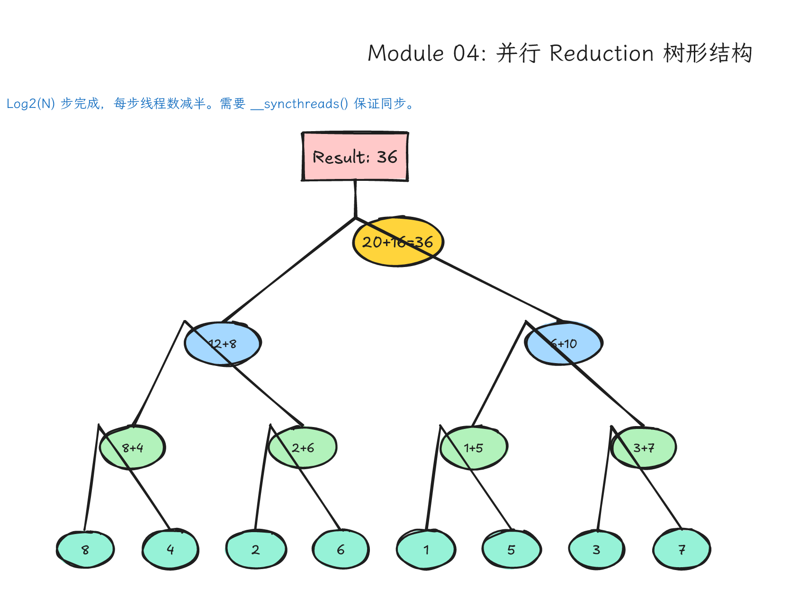
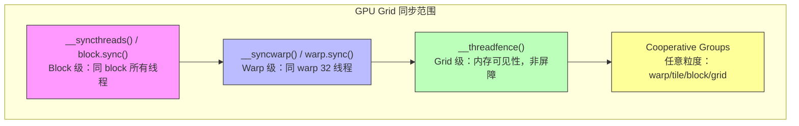
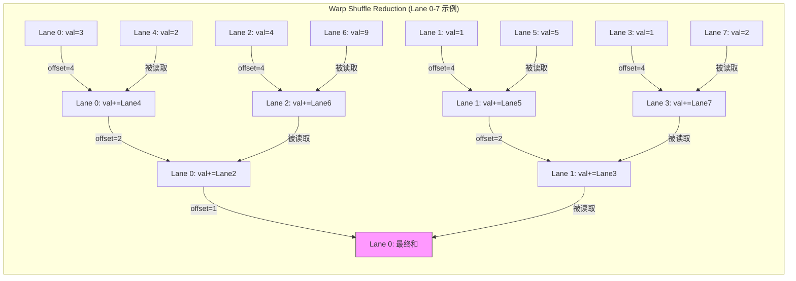
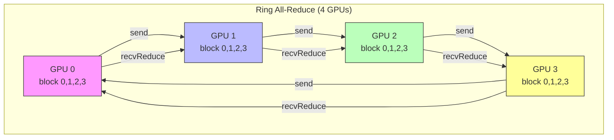
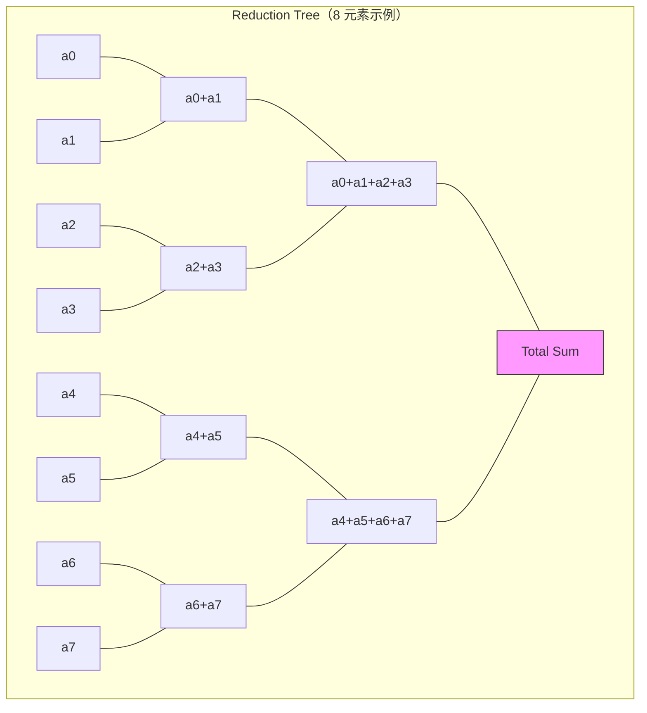

# Module 04: 同步、Atomics 与 Reduction — 从单兵作战到协同汇总



*图 04-1：Reduction 从线程局部值到 block 汇总再到全局结果的树形收敛过程。可编辑源图：[`module-04-reduction-tree.excalidraw`](../diagrams/module-04-reduction-tree.excalidraw)。*

Level: Intermediate → Advanced  
Estimated time: 14–18 小时  
Prerequisites: Modules 00–03（线程模型、内存层次、kernel 启动）  
Sources: NVIDIA CUDA C++ Programming Guide, CUDA Runtime API, CCCL/CUB docs, NCCL docs, GPU Gems 3, NVIDIA Technical Blog, Mark Harris CUDA reduction series, arXiv NCCL deep dive

---

## 学习目标（Learning Objectives）

完成本模块后，你将能够：

1. **解释** `__syncthreads()`、`__syncwarp()`、`__threadfence()` 和 Cooperative Groups 的语义差异与使用场景。
2. **描述** Warp Divergence 的硬件执行模型，并写出减少 divergence 的代码策略。
3. **使用** Warp-level Primitives（`__shfl_down_sync`、`__ballot_sync`、`__all_sync`、`__any_sync`）完成寄存器级数据交换与规约。
4. **实现** 至少三种 reduction 变体：shared-memory 树形、warp-shuffle、multi-stage grid-stride，并分析其性能差异。
5. **选择** 合适的 atomic 操作层级（global → L2 → shared memory）并解释其性能 trade-off。
6. **编写** Blelloch scan 的 block-level kernel，理解 inclusive/exclusive scan 的区别。
7. **优化** histogram 的 shared memory 局部累积 + atomic 合并策略。
8. **分析** 并行 reduction 的浮点舍入误差，并应用 Kahan summation 提升精度。
9. **调用** CUB `DeviceReduce`/`DeviceScan` 作为强基线，并理解其为何不是"作弊"。
10. **概述** NCCL `all-reduce` 的 Ring 与 Tree 算法，理解多 GPU 扩展的通信复杂度。

---

## 这一课的故事线

到目前为止，很多 kernel 都是"每个 thread 管一个元素"，这是一种** embarrassingly parallel** 模式。但真实世界的计算问题几乎都需要**协作**：求和、求最大值、统计直方图、排序、前缀和、聚合梯度。这些问题的共同难点是：**多个 thread 想读写同一个结果**。

并行世界里，如果所有人同时伸手拿同一支笔，就会乱。本模块教你如何让大量线程协同汇总信息。

我们把解决方案分为三个层次：

- **同步（Synchronization）**：让线程在时间上对齐，知道"你写完了我再读"。
- **原子操作（Atomic）**：让"读-改-写"成为不可打断的原子单元，保证正确性。
- **规约（Reduction）**：通过分层协作，把竞争集中点分散到树形结构的各个节点，最终化整为零。

这三个层次是同一问题的不同抽象层级。本模块从简单到复杂，逐步深入。

---

## 五层学习框架

本模块按五个层次递进组织，每一层回答不同的问题：

| 层次 | 问题 | 内容 |
|------|---------|------|
| **Layer 1: 问题背景** | 为什么需要同步和规约？ | Race condition、数据依赖、并行汇总的本质困难 |
| **Layer 2: 直觉类比** | 用人类协作如何理解？ | 班级统计分数的完整类比 |
| **Layer 3: 硬件机制** | GPU 硬件提供了什么能力？ | SIMT 执行模型、Warp Divergence、同步原语、Atomic 层级、Warp Shuffle、Cooperative Groups |
| **Layer 4: 代码路径** | 如何写代码实现？ | 完整代码：atomic baseline、shared-memory reduction、warp shuffle、multi-stage、scan、histogram、Kahan、CUB 对比 |
| **Layer 5: 真实系统落点** | 工业界怎么做？ | CUB/Thrust、NCCL all-reduce、Profiler 诊断 |

---

## Layer 1: 问题背景 — 为什么并行汇总这么难？

### 1.1 从独立并行到协作并行

在 Module 03 中，我们学习了每个线程独立读写 global memory 的模式。但以下问题无法通过独立并行解决：

- **求和/求积**：$N$ 个数的总和
- **求最大/最小**：$N$ 个数的极值
- **计数/直方图**：统计像素值分布
- **前缀和**：每个位置得到之前所有元素的累积
- **聚合梯度**：深度学习训练中所有样本的梯度求平均

这些操作都需要一个跨线程的累积状态。

### 1.2 Race Condition 的本质

下面的代码看起来像加法：

```cpp
sum += x[i];
```

但硬件执行至少是三步：

1. **读** `sum` 到寄存器
2. **加** `x[i]` 到寄存器
3. **写回** `sum` 到内存

如果两个 thread 同时执行步骤 1，读到的都是同一个旧值（比如 10），然后各自加 5 后都写回 15，结果就丢了一个 5。这就是 **race condition**。

Race 的可怕之处：
- **结果不稳定**：相同输入可能输出不同
- **不可复现**：因为线程调度是随机的，debug 时可能"碰巧正确"
- **静默失败**：程序不会崩溃，只是结果悄悄错了

### 1.3 解决 Race 的三条路径

| 路径 | 机制 | 比喻 | 适用场景 |
|------|------|------|----------|
| **Atomic** | 硬件保证读-改-写原子性 | 所有人排队使用同一个黑板 | 冲突少、数据量小、简单 baseline |
| **Synchronization + Shared Memory** | 先分区计算，再对齐后交换 | 各小组先在纸上算，再统一交 | block 内协作、高带宽、可扩展 |
| **Reduction 算法** | 树形结构分层汇总 | 班级→小组→大组→班长 | 大规模并行、追求最高吞吐 |

---

## Layer 2: 直觉类比 — 班级统计分数

想象一个班有 **1024 名学生**要算总分，黑板上有一个"总分"字段。

### 2.1 最笨办法：直接竞争（Race Condition）

所有人同时冲到黑板前写总分。张三读到了 1000，加上自己的 90，写回 1090；同时李四也读到了 1000，加上自己的 85，写回 1085。张三的更新被覆盖了，90 分丢了。这就是 race condition。

### 2.2 Atomic 办法：排队加锁

黑板前放一把锁，每个人必须排队。每个人拿到锁后，读总分、加分、写回，再释放锁。结果正确，但如果 1024 人都抢这一把锁，速度极慢。这就是 `atomicAdd` 的硬件实现原理。

Atomic 保证正确，但高竞争时很慢。

### 2.3 Reduction 办法：分组汇总

把 1024 人分成 32 个小组，每组 32 人：

1. **组内汇总**：每组在一张小纸上算组内总分，不需要锁，因为每组只有自己的纸。
2. **组长汇总**：32 个组长把 32 个组总分再汇总到一张中等纸上。
3. **最终汇总**：最后把结果写到黑板。

这样，真正需要写黑板的只有最后一次，竞争被大大分散了。这就是 **reduction** 的思想。

Reduction 分组计算，减少竞争。

### 2.4 更精细的协作：Warp 内部耳语

进一步观察：每个小组的 32 人其实是同桌，可以直接耳语交流（不需要纸）。这就是 **warp shuffle** — 同一 warp 内的线程直接在寄存器间交换数据，无需 shared memory，无需 atomic。

---

## Layer 3: 硬件机制 — GPU 如何执行协作？

### 3.1 SIMT 执行模型与 Warp Divergence

NVIDIA GPU 使用 **SIMT（Single Instruction, Multiple Thread）** 执行模型。32 个线程组成一个 **warp**。在 Pre-Volta 架构中，同一个 warp 内线程共享一个 program counter；从 Volta（SM70）开始，Independent Thread Scheduling 让每个线程拥有自己的 PC 和调用栈，但调度器仍会把同一 warp 内可共同执行的线程聚合成 SIMT 指令发射。每个线程有自己的寄存器，可以因为 predicate 和分支暂时处在不同执行路径上。

#### Warp Divergence 详解

当 warp 内不同线程遇到不同的条件分支时，就会发生 **warp divergence**。

```cpp
if (threadIdx.x % 2 == 0) {
    // 偶数线程执行 A 路径
    do_A();
} else {
    // 奇数线程执行 B 路径
    do_B();
}
```

硬件执行方式（Pre-Volta）：
1. 先执行 A 路径的线程，B 路径的线程被**屏蔽（mask off）**
2. 再执行 B 路径的线程，A 路径的线程被屏蔽
3. 两条路径串行执行，总时间 = A 时间 + B 时间

从 **Volta（Compute Capability 7.0+）** 开始，引入了 **Independent Thread Scheduling**，线程可以在更细粒度上独立调度。但 divergence 的代价依然存在：活跃线程少于 32 时，SIMT 效率下降，计算资源被浪费。

**减少 Warp Divergence**：

| 策略 | 做法 | 示例 |
|------|------|------|
| 重新排列数据 | 让同 warp 内线程处理同类数据 | 排序后按 warp 分组处理 |
| 使用 warp ballot | 先投票看哪些线程走哪条分支 | `__ballot_sync(mask, predicate)` |
| 剥离边界条件 | 把边界处理放到单独 kernel 或 warp | 主循环处理整 warp 数据，尾端单独处理 |
| 避免模运算条件 | 用连续范围判断替代取模 | `if (tid < n)` 优于 `if (tid % 2)` |

### 3.2 同步机制详解

CUDA 提供多层次的同步原语，理解它们的语义范围很重要。

#### `__syncthreads()` — Block 级屏障

```cpp
__syncthreads();
```

- **范围**：同一个 block 内的所有线程
- **语义**：所有线程必须到达此点，才能继续执行
- **使用场景**：shared memory 的生产者-消费者模式、reduction 的每轮结束后
- **致命限制**：不能放在 divergent branch 内部（否则可能死锁）

```cpp
// ❌ 错误：divergent branch 中调用 __syncthreads()
if (threadIdx.x < 128) {
    __syncthreads();  // 可能导致死锁！
}
```

#### `__syncwarp(mask)` — Warp 级屏障

```cpp
__syncwarp(0xFFFFFFFF);  // 同步 warp 内所有 32 线程
```

- **范围**：`mask` 指定的 warp 内线程（32 位掩码，每位对应一个 lane）
- **引入原因**：Volta 之后 warp 内线程可以独立调度，隐含同步不再可靠
- **使用场景**：warp 内使用 shared memory 交换数据、shuffle 前确保数据可见
- **与 `__syncthreads()` 的区别**：粒度更细，只同步同 warp 内的线程，不需要整个 block 都到达

#### `__threadfence()` — 内存 fence

```cpp
__threadfence();        // 全局内存 fence
__threadfence_block();  // block 级内存 fence
__threadfence_system(); // system 级 fence（设备、host、peer 设备）
```

- **语义**：确保调用线程在 fence 之前的内存写入，在对应作用域内不会被观察为晚于 fence 之后的写入。
- **注意**：它不是同步屏障！它不会让其它线程停下来等待，也不会单独告诉其它线程“数据已经准备好”。通常还需要 atomic flag、协议或 kernel 边界配合。
- **使用场景**：一个线程先写 payload，再写 ready flag；读者先看 flag，再读 payload。这类 publish/consume 协议需要 fence 或 acquire/release 语义。
- **区别**：
  - `__threadfence_block()`：block scope。
  - `__threadfence()`：device scope，对同一 GPU 上的线程建立可见顺序。
  - `__threadfence_system()`：system scope，覆盖 host 和 peer device 等更大范围；host 侧最终观察仍通常依赖 CUDA 同步或外部协议。

#### Cooperative Groups — 可组合同步

Cooperative Groups 是 CUDA 9 引入的现代抽象，让同步变成"一等对象"。

```cpp
#include <cooperative_groups.h>
namespace cg = cooperative_groups;

cg::thread_block block = cg::this_thread_block();        // 整个 block
cg::thread_block_tile<32> warp = cg::tiled_partition<32>(block); // 一个 warp
cg::thread_block_tile<4> tile = cg::tiled_partition<4>(warp);     // 4 线程 tile

block.sync();   // 等价于 __syncthreads()
warp.sync();    // 等价于 __syncwarp()
tile.sync();    // 同步 4 线程 tile
```

**Cooperative Groups 的优势**：
- **可组合**：函数可以接受 `thread_group` 参数，内部调用 `g.sync()`，不需要知道调用者是 block 还是 warp
- **类型安全**：编译器能检查同步范围
- **Collective 操作**：内置 `reduce()`、`scan()`、`shfl()` 等

```cpp
// 使用 Cooperative Groups 做 warp-level reduction
float sum = cg::reduce(warp, val, cg::plus<float>());
// 所有线程都得到 warp 内 32 个 val 的总和
```

**同步范围对比 Mermaid 图**：



### 3.3 Warp-level Primitives 详解

Warp shuffle 允许同一 warp 内的线程直接交换寄存器数据，无需 shared memory 或 global memory。

#### 函数家族

```cpp
// 从指定 lane 读取数据
T __shfl_sync(unsigned mask, T var, int srcLane, int width=warpSize);

// 从相对上方 lane 读取数据（tid - delta）
T __shfl_up_sync(unsigned mask, T var, unsigned int delta, int width=warpSize);

// 从相对下方 lane 读取数据（tid + delta）
T __shfl_down_sync(unsigned mask, T var, unsigned int delta, int width=warpSize);

// 与 laneMask 异或后的 lane 读取数据（蝴蝶交换）
T __shfl_xor_sync(unsigned mask, T var, int laneMask, int width=warpSize);
```

**参数说明**：
- `mask`：32 位掩码，标记哪些 lane 参与这一次 warp 级同步操作。`mask` 中所有尚未退出的线程必须执行同一条 `_sync` intrinsic，并传入同一个 mask。整 warp 已收敛时可用 `0xFFFFFFFF`；条件分支中更安全的做法通常是在分支前用 `__ballot_sync` 计算参与集合，而不是在分支内部随手用 `__activemask()` 伪造一个集合。
- `var`：要交换的寄存器变量
- `width`：可选，将 warp 分成更小的组（必须是 2 的幂，≤ 32）

#### 投票函数（Vote）

```cpp
// warp 内所有线程的 predicate 是否都为 true？
int __all_sync(unsigned mask, int predicate);

// warp 内是否有线程的 predicate 为 true？
int __any_sync(unsigned mask, int predicate);

// 返回 predicate 为 true 的 lane 的位掩码
unsigned __ballot_sync(unsigned mask, int predicate);
```

**使用场景**：
- `__all_sync`：检查 warp 内所有线程是否都满足某条件（如地址是否对齐）
- `__ballot_sync`：快速找活跃线程、压缩稀疏数据

#### Warp Shuffle 的限制

1. **只能在 warp 内通信**：跨 warp 必须使用 shared memory 或 global memory
2. **mask 指定的线程必须参与**：如果 source lane 在当前 `width` 子组内、但不在 mask 中或 inactive，读取结果未定义；如果 source lane 超出 `width` 子组范围，`__shfl_down_sync` / `__shfl_up_sync` 不跨组绕回，相关 lane 的值保持为自己的 `var`
3. **需要 Volta+ 的 sync 版本**：`__shfl`（无 sync）已在 CC 7.0+ 被移除

### 3.4 Atomic 操作详解与硬件层级

#### Atomic 操作家族

```cpp
// 算术原子操作
int atomicAdd(int* address, int val);        // *address += val
int atomicSub(int* address, int val);        // *address -= val
int atomicExch(int* address, int val);       // *address = val（交换）
int atomicMin(int* address, int val);          // *address = min(*address, val)
int atomicMax(int* address, int val);          // *address = max(*address, val)
int atomicInc(int* address, int val);        // 递增（带模）
int atomicDec(int* address, int val);          // 递减（带模）
int atomicCAS(int* address, int compare, int val);  // Compare-And-Swap
```

`atomicCAS` 是"元原子操作"：比较 `*address` 和 `compare`，如果相等则写入 `val`，返回旧值。所有其它 atomic 操作都可以用 CAS 实现，但硬件提供了更高效的专用指令。

#### Atomic 的硬件层级与性能

Atomic 操作在不同内存层级上的性能差异巨大。下面是教学用数量级，不是跨架构固定周期；真实延迟和吞吐取决于 GPU、数据类型、作用域、cache 命中、冲突模式和编译出的指令。

| 内存层级 | 延迟 | 吞吐量 | 说明 |
|----------|------|--------|------|
| **Global Memory** | 高，数量级可到数百周期 | 最低 | 需要全局可见的 read-modify-write 路径，竞争时串行化 |
| **L2 Cache / Global atomic pipeline** | 低于未缓存全局路径，但仍受冲突影响 | 中等 | 现代 GPU 的 global atomic 主要经由 L2/原子单元；吞吐随架构演进明显变化 |
| **Shared Memory** | 低于 global，常见为几十周期量级 | 通常较高 | 片上访问，同 block 线程竞争；具体 atomic 吞吐随架构、数据类型和 bank/冲突模式变化 |

**观察**：
- **Global atomic 到 L2/原子单元的演进**：早期 GPU 的 global atomic 代价很高；Fermi 之后全局原子路径与 L2/cache hierarchy 更紧密，Kepler 及后续架构继续提高吞吐。不要把某一代的 atomic 结论直接外推到所有 GPU。
- **Shared memory atomic 通常更适合 block 内聚合**：它把竞争限制在一个 SM / 一个 block 内，常用于 histogram、block-level reduction 等分层聚合。但它不必然比所有 global atomic 都快；性能取决于架构、数据类型、冲突集中程度、bank conflict 和后续合并成本。
- **Contention 是关键**：无论哪一层，大量线程同时 atomic 到同一个地址都会串行化。解决方法是**分层减少竞争**：thread 先 warp 内累加 -> warp 0 用 atomic 写到 block 级 -> 最后再用一次 atomic。

---

## Layer 4: 代码路径 — 从 Baseline 到最优实现

### 4.1 Race Condition 的验证实验

以下代码在去掉 `atomicAdd` 后会暴露 race condition：

```cpp
// 故意不用 atomic，用于验证 race condition
__global__ void race_demo(const float* x, float* sum, int n) {
    int i = blockIdx.x * blockDim.x + threadIdx.x;
    if (i < n) {
        // 先读 sum 到寄存器，加 x[i]，再写回
        // 三步操作之间可被其它线程打断！
        *sum += x[i];  // 非原子，存在 race
    }
}
```

运行多次，观察结果是否稳定。然后解释：
- 为什么某些输入可能"碰巧正确"？（如果线程调度恰好串行化）
- 为什么 race 不一定每次复现？（取决于 warp 调度时机）
- 使用 `compute-sanitizer --tool racecheck` 是否能帮助定位？（对这个 `*sum += x[i]` 的 global memory race 不可靠；`racecheck` 主要检测 shared memory access hazard。这里更可靠的办法是多次运行、与 CPU reference 对比、改用 `atomicAdd` 或分阶段 reduction，并用 `memcheck` 排除越界。）

### 4.2 代码一：Atomic Baseline（全局 Atomic 求和）

这是最简单的正确实现，也是最慢的正确实现。它作为所有优化的**基线（baseline）**。

```cpp
// ============================================================
// 代码 1：Atomic Baseline — 全局 atomicAdd 求和
// 用途： correctness 验证，性能下限基线
// 限制：所有 thread 争用同一个 global address，高 contention 时极慢
// ============================================================
__global__ void reduce_atomic_baseline(const float* __restrict__ x,
                                       float* __restrict__ sum,
                                       int n) {
    // 1. 计算全局索引
    int i = blockIdx.x * blockDim.x + threadIdx.x;
    
    // 2. 每个 thread 只处理一个元素，用 atomicAdd 直接累加到全局 sum
    //    注意：即使 x 被 __restrict__ 修饰，sum 仍被所有线程共享
    if (i < n) {
        atomicAdd(sum, x[i]);  // 硬件保证读-加-写是原子的
    }
    // 3. 对 sum 这个地址不需要额外锁：atomicAdd 保证该地址的读-改-写原子性。
    //    注意：这不等价于对其它内存位置建立通用 release/acquire 顺序；
    //    若要发布/消费其它数据，需要使用合适的同步或 fence。
}
```

**分析**：
- `__restrict__`：告诉编译器指针不重叠，允许更激进的优化。但 `sum` 被所有线程共享，编译器仍知道需要走 atomic 路径。
- `atomicAdd(sum, x[i])`：编译器会生成对应架构的 atomic 指令（如 `RED.E.ADD.SYS`）。单精度 `float` 的 global `atomicAdd` 在很早的 CUDA GPU 上就已支持；`double atomicAdd` 才是常见的 CC 6.0+ 门槛。half、bfloat16、vector atomic 的支持还要按 CUDA Programming Guide 的 atomic functions 表逐项确认。
- **性能瓶颈**：如果 `n = 1,000,000` 且 `blockDim = 256`，则约 3906 个线程同时争用 `sum`。大部分时间在排队。

### 4.3 代码二：两阶段 Block Reduction（Shared Memory 树形）

这是经典的教学版本，展示了 shared memory + `__syncthreads()` 的协作模式。我们扩展为更完整的 grid-stride 版本，支持任意长度输入。

```cpp
// ============================================================
// 代码 2：两阶段 Block Reduction（Shared Memory 树形）
// 阶段 1：每个 block 计算 partial sum，写入 partial[]
// 阶段 2：再调用一次 kernel（或 CPU/CUB）汇总 partial[]
// 扩展：支持 grid-stride loop，处理任意长度
// ============================================================

template <int BLOCK_SIZE>
__global__ void reduce_sum_stage1(const float* __restrict__ x,
                                    float* __restrict__ partial,
                                    int n) {
    // 1. 声明 shared memory：每个 block 独占一块，大小由模板参数决定
    __shared__ float sdata[BLOCK_SIZE];
    
    // 2. 获取线程和 block 索引
    int tid = threadIdx.x;           // block 内线程编号 [0, BLOCK_SIZE)
    int bid = blockIdx.x;            // block 编号
    int block_offset = bid * BLOCK_SIZE;  // 本 block 负责的数据起点
    
    // 3. Grid-stride loop：每个线程处理多个元素，支持任意长度 n
    //    步长 = gridDim.x * BLOCK_SIZE（所有 block 的线程总数）
    float local_sum = 0.0f;          // 寄存器变量，每个线程私有
    int idx = block_offset + tid;    // 第一个要处理的元素
    
    while (idx < n) {
        local_sum += x[idx];        // 累加到寄存器（无竞争，极快）
        idx += gridDim.x * BLOCK_SIZE;  // 跳到下一个属于本线程的元素
    }
    
    // 4. 把每个线程的 local sum 写入 shared memory
    sdata[tid] = local_sum;
    
    // 5. 必须同步：确保所有线程都写完 shared memory，才能开始读
    __syncthreads();
    
    // 6. 树形 reduction（sequential addressing）
    //    stride 从 BLOCK_SIZE/2 开始，每轮减半
    //    ⚠️ 注意：这个版本在 stride 变小时会有 warp divergence！
    for (int stride = BLOCK_SIZE / 2; stride > 0; stride >>= 1) {
        if (tid < stride) {
            sdata[tid] += sdata[tid + stride];
        }
        // 7. 每轮必须同步：否则下一轮可能读到还没写完的数据
        __syncthreads();
    }
    
    // 8. 每个 block 的 thread 0 持有最终 partial sum，写入 global memory
    if (tid == 0) {
        partial[bid] = sdata[0];
    }
}
```

**分析**：
- `local_sum` 在寄存器中累加：这是对 atomic baseline 的第一个优化 — 先让每个线程在寄存器中累加多个元素，大大减少 global memory 访问和竞争。
- `__syncthreads()` 的位置：在写入 shared memory 后、每轮 reduction 后都必须同步。缺少任何一次都会导致 race。
- **Warp divergence 问题**：当 `stride = 16` 时，`tid < 16` 的线程执行加法，`tid >= 16` 的线程空闲。由于 warp 是 32 线程为单位调度，`stride = 16` 时刚好半 warp 活跃，不算太糟。但当 `stride = 1` 时，只有 `tid = 0` 活跃，31 个线程空转，这是主要的效率损失点。
- **为什么叫 sequential addressing**：活跃线程总是连续的 `tid = 0..stride-1`，读取 `sdata[tid + stride]`。这比经典 naive 教程里 `tid % (2 * stride) == 0` 的 interleaved addressing 更少产生非连续活跃线程和 shared-memory bank conflict。

#### 对比：Interleaved Addressing 为什么差

```cpp
// 早期 naive 版本常见写法：interleaved addressing
// stride 从 1 开始翻倍，只有 tid 是 2*stride 倍数的线程活跃。
// 活跃线程分散在 warp 内，容易造成 divergence 和低效的 shared memory 访问。
for (int stride = 1; stride < BLOCK_SIZE; stride *= 2) {
    int index = 2 * stride * tid;
    if (index < BLOCK_SIZE) {
        sdata[index] += sdata[index + stride];
    }
    __syncthreads();
}

// 本课上面的主代码已经使用 sequential addressing：
// stride 从 BLOCK_SIZE/2 开始减半，活跃线程连续，访问也更规整。
```

> 注：bank conflict 与具体 bank 数、访问宽度、数据类型和线程映射有关，不要把某个历史 GPU 上的结论外推为绝对规则。经典优化路径是：先从 interleaved 改成 sequential addressing，再对最后一个 warp 使用 shuffle 替代 shared memory。

### 4.4 代码三：Warp-level Shuffle Reduction

这是现代 GPU 优化的关键一步：当 `stride ≤ 16` 时，不再用 shared memory，而是直接在 warp 内通过寄存器 shuffle 完成。这样可以减少 shared memory 访问和同步。

```cpp
// ============================================================
// 代码 3：Warp-level Shuffle Reduction
// 核心：当 stride ≤ warpSize/2 时，用 __shfl_down_sync 替代 shared memory
// 优势：寄存器级通信，无 shared memory 访问，无 bank conflict，更少的 sync
// 要求：Compute Capability 3.0+，CUDA 9.0+（使用 sync 版本）
// ============================================================

#define WARP_SIZE 32
#define FULL_MASK 0xFFFFFFFF

// 辅助函数：warp 内求和，每个线程返回 warp 总和（实际上只有 lane 0 需要）
__inline__ __device__ float warpReduceSum(float val) {
    // 1. 从 offset=16 开始，逐次减半
    //    线程 tid 从 tid+offset 读取值，加到自身 val
    //    每轮后，val 持有更大范围的累加和
    for (int offset = WARP_SIZE / 2; offset > 0; offset >>= 1) {
        val += __shfl_down_sync(FULL_MASK, val, offset);
    }
    return val;  // 最终 lane 0 持有 warp 总和
}

// 扩展版本：支持任意 warp 宽度（如 16 线程组）
__inline__ __device__ float warpReduceSum(float val, int width) {
    for (int offset = width / 2; offset > 0; offset >>= 1) {
        val += __shfl_down_sync(FULL_MASK, val, offset, width);
    }
    return val;
}

// 使用 warp shuffle 的 block reduction kernel
template <int BLOCK_SIZE>
__global__ void reduce_sum_shuffle(const float* __restrict__ x,
                                     float* __restrict__ partial,
                                     int n) {
    static_assert(BLOCK_SIZE % WARP_SIZE == 0,
                  "teaching kernel assumes full warps; use a ballot mask for partial warps");
    // 1. 计算 warp 数量和本线程位置
    int tid = threadIdx.x;
    int lane = tid % WARP_SIZE;       // 在 warp 内的位置 [0, 31]
    int warpid = tid / WARP_SIZE;     // 本 block 内的 warp 编号
    int numWarps = BLOCK_SIZE / WARP_SIZE;
    
    // 2. 每个线程先通过 grid-stride 累加多个元素到寄存器
    float val = 0.0f;
    int idx = blockIdx.x * BLOCK_SIZE + tid;
    while (idx < n) {
        val += x[idx];
        idx += gridDim.x * BLOCK_SIZE;
    }
    
    // 3. Step 1: Warp 内 reduction（使用 shuffle，无需 shared memory）
    val = warpReduceSum(val);
    
    // 4. Step 2: 每个 warp 的 lane 0 把 warp sum 写入 shared memory
    __shared__ float sdata[32];  // 最多 32 个 warps per block (1024/32)
    if (lane == 0) {
        sdata[warpid] = val;     // 只有每 warp 的 leader 写
    }
    
    // 5. 同步：所有 warp 的 lane 0 都写完了
    __syncthreads();
    
    // 6. Step 3: 只有 warp 0 参与最终的 inter-warp reduction
    //    读取所有 warp 的 partial sum，再做一次 warp reduction
    if (warpid == 0) {
        // 如果 warp 数量不足 32，超出部分读 0
        val = (tid < numWarps) ? sdata[tid] : 0.0f;
        val = warpReduceSum(val);
        
        // 7. 最终 block sum 由 thread 0 写入 global
        if (tid == 0) {
            partial[blockIdx.x] = val;
        }
    }
}
```

**分析**：
- `warpReduceSum`：这是 warp shuffle 的核心。`__shfl_down_sync(FULL_MASK, val, offset)` 让当前 lane 从 `lane + offset` 读取值。对 `width=32` 的整 warp 规约，`lane + offset` 超出 31 的 lane 会保持自己的 `val`，最终只有 lane 0 的结果被使用；如果 source lane 在 mask 外或 inactive，结果未定义。
- **为什么不需要 `__syncthreads()` 在 warp 内？** `__shfl_down_sync` 会同步 mask 中的参与线程并完成寄存器交换，所以不需要 block-wide barrier。但这并不等于可以依赖旧式 lock-step：有 divergence 时应使用预先计算的一致 mask，或确保参与线程已经收敛。
- **shared memory 用量大减**：从 `BLOCK_SIZE`（如 1024 个 float = 4KB）降到 `32`（最多 128 字节）。
- **性能提升**：共享内存访问减少、bank conflict 消失、同步次数减少。

**Warp Shuffle Reduction 示意 Mermaid 图**：



### 4.5 代码四：完整多 Stage Reduction（处理任意长度，含 Block 合并）

前面的 kernel 只完成阶段 1（block → partial）。要得到最终的一个标量，需要阶段 2。如果 partial 数组仍很大，可能还需要阶段 3。

```cpp
// ============================================================
// 代码 4：完整多 Stage Reduction（支持任意长度）
// 阶段 1：N 元素 → M partials（M = gridDim.x）
// 阶段 2：M partials → 1 标量（可用同一个 kernel 或 CUB/CPU）
// 如果 M 仍很大，可以递归调用阶段 1，直到 partials ≤ 每个 block 的线程数
// ============================================================

// 先定义一个可复用的 blockReduceSum 设备函数
template <int BLOCK_SIZE>
__device__ float blockReduceSum(float val) {
    static_assert(BLOCK_SIZE % WARP_SIZE == 0,
                  "BLOCK_SIZE must be a multiple of warp size");
    static_assert(((BLOCK_SIZE / WARP_SIZE) & ((BLOCK_SIZE / WARP_SIZE) - 1)) == 0,
                  "teaching reduction assumes a power-of-two warp count");
    // 共享内存只需存 warp 级 partial
    __shared__ float sdata[BLOCK_SIZE / WARP_SIZE];
    
    int tid = threadIdx.x;
    int lane = tid % WARP_SIZE;
    int warpid = tid / WARP_SIZE;
    
    // Warp 内 shuffle reduction
    for (int offset = WARP_SIZE / 2; offset > 0; offset >>= 1) {
        val += __shfl_down_sync(FULL_MASK, val, offset);
    }
    
    // Warp leader 写 shared memory
    if (lane == 0) {
        sdata[warpid] = val;
    }
    __syncthreads();
    
    // Warp 0 做最终 reduction
    if (warpid == 0) {
        val = (tid < BLOCK_SIZE / WARP_SIZE) ? sdata[tid] : 0.0f;
        for (int offset = (BLOCK_SIZE / WARP_SIZE) / 2; offset > 0; offset >>= 1) {
            val += __shfl_down_sync(FULL_MASK, val, offset);
        }
    }
    return val;  // 只有 thread 0 的结果有意义
}

// 阶段 1 kernel：任意长度输入 → partial sums
template <int BLOCK_SIZE>
__global__ void reduce_multi_stage(const float* __restrict__ x,
                                   float* __restrict__ output,
                                   int n) {
    // 1. Grid-stride 累加
    float val = 0.0f;
    int idx = blockIdx.x * BLOCK_SIZE + threadIdx.x;
    while (idx < n) {
        val += x[idx];
        idx += gridDim.x * BLOCK_SIZE;
    }
    
    // 2. Block 内 reduction
    val = blockReduceSum<BLOCK_SIZE>(val);
    
    // 3. 每个 block 的 thread 0 写结果
    if (threadIdx.x == 0) {
        output[blockIdx.x] = val;
    }
}

// CPU 端的递归调用包装。
// 调用者提供的 d_temp 至少要能容纳第一轮 numBlocks 个 partial sums。
// 后续轮次使用新分配的临时 buffer，避免 input/output 同地址导致跨 block
// 读写覆盖。普通 CUDA kernel 内 block 之间没有全局顺序，不能安全原地规约。
float reduce_cpu_host(const float* d_input, float* d_temp, int n) {
    if (n <= 0) return 0.0f;

    const int BLOCK_SIZE = 256;
    int numBlocks = (n + BLOCK_SIZE - 1) / BLOCK_SIZE;
    
    // 第一次：N → numBlocks partials
    reduce_multi_stage<BLOCK_SIZE><<<numBlocks, BLOCK_SIZE>>>(d_input, d_temp, n);
    cudaGetLastError();
    
    // 如果 partials 还很多，继续 reduction
    const float* d_src = d_temp;
    while (numBlocks > 1) {
        int newBlocks = (numBlocks + BLOCK_SIZE - 1) / BLOCK_SIZE;
        float* d_next = nullptr;
        cudaMalloc(&d_next, newBlocks * sizeof(float));
        reduce_multi_stage<BLOCK_SIZE><<<newBlocks, BLOCK_SIZE>>>(d_src, d_next, numBlocks);
        cudaGetLastError();
        if (d_src != d_temp) {
            cudaFree(const_cast<float*>(d_src));
        }
        d_src = d_next;
        numBlocks = newBlocks;
    }
    
    float result;
    cudaMemcpy(&result, d_src, sizeof(float), cudaMemcpyDeviceToHost);
    if (d_src != d_temp) {
        cudaFree(const_cast<float*>(d_src));
    }
    return result;
}
```

**要点**：
- `blockReduceSum` 是可复用的设备函数，任何 kernel 都可以调用它做 block 级 reduction。
- 递归调用 `reduce_multi_stage` 直到只剩 1 个标量。这是 tree reduction 在 CPU 调度层面的实现。
- 也可以直接用 CUB 做阶段 2，这是更工业化的做法。

### 4.6 代码五：Atomic Histogram + Shared Memory 优化

Histogram 是 atomic 的经典应用：大量线程要把数据归类到不同的 bin 中计数。

```cpp
// ============================================================
// 代码 5：Atomic Histogram（Baseline + 优化版）
// Baseline：所有线程直接 atomicAdd 到 global histogram
// 优化版：每个 block 先在 shared memory 做局部 histogram，再一次性合并到 global
// ============================================================

#define NUM_BINS 256
#define BLOCK_SIZE 256

// Baseline：直接 global atomic
__global__ void histogram_global(const unsigned char* __restrict__ data,
                                  int* __restrict__ global_hist,
                                  int n) {
    int idx = blockIdx.x * blockDim.x + threadIdx.x;
    if (idx < n) {
        unsigned char bin = data[idx];  // 像素值 0-255
        atomicAdd(&global_hist[bin], 1);  // 高 contention！
    }
}

// 优化版：shared memory 局部 histogram + 合并
__global__ void histogram_shared(const unsigned char* __restrict__ data,
                                  int* __restrict__ global_hist,
                                  int n) {
    // 1. 每个 block 分配 NUM_BINS 个 int 的 shared memory
    __shared__ int s_hist[NUM_BINS];
    
    // 2. 初始化 shared memory（每个线程负责一部分 bins）
    for (int i = threadIdx.x; i < NUM_BINS; i += blockDim.x) {
        s_hist[i] = 0;
    }
    __syncthreads();  // 必须等所有 bins 清零
    
    // 3. 每个线程处理多个像素，累加到 shared memory
    int idx = blockIdx.x * blockDim.x + threadIdx.x;
    while (idx < n) {
        unsigned char bin = data[idx];
        atomicAdd(&s_hist[bin], 1);  // 只和同 block 线程竞争，快得多！
        idx += gridDim.x * blockDim.x;
    }
    __syncthreads();  // 等所有 shared memory 累加完成
    
    // 4. 把 shared memory 合并到 global memory（每个线程负责一部分 bins）
    for (int i = threadIdx.x; i < NUM_BINS; i += blockDim.x) {
        int local_val = s_hist[i];
        if (local_val > 0) {
            atomicAdd(&global_hist[i], local_val);  // 每个 bin 只需一次 atomic（或几次）
        }
    }
}
```

**分析**：
- **Baseline**：假设图像 1M 像素，所有像素值都在 bin 128。100 万个线程同时 `atomicAdd(&global_hist[128], 1)`，串行化到同一地址，性能极差。
- **优化版**：每个 block 的 `s_hist[128]` 只被 256 个线程竞争，竞争度降低 3906 倍。最后合并时每个 bin 的 atomic 次数 = block 数量（如 3906 次），而不是 1M 次。

### 4.7 Scan（前缀和）入门：Blelloch Scan

**Scan（Prefix Sum）** 不是 reduction，而是 reduction 的扩展：每个元素输出之前所有元素的和。

- **Inclusive Scan**：`output[i] = sum(input[0..i])`
- **Exclusive Scan**：`output[i] = sum(input[0..i-1])`，`output[0] = 0`

Scan 的应用：stream compaction（压缩稀疏数组）、排序（radix sort）、直方图均衡化、负载均衡。

**Blelloch Scan 算法**是 work-efficient 的 scan 实现，分为两个阶段：

1. **Up-sweep（Reduce Phase）**：自底向上构建树，计算每个区间的总和。
2. **Down-sweep（Distribution Phase）**：自顶向下传播前缀和，生成 exclusive scan。

```cpp
// ============================================================
// 代码 6：Block-level Blelloch Exclusive Scan
// 输入：sdata[BLOCK_SIZE]（shared memory，已加载数据）
// 输出：sdata[] 被原地替换为 exclusive scan 结果
// 注意：BLOCK_SIZE 必须是 2 的幂
// ============================================================
template <int BLOCK_SIZE>
__device__ void blelloch_scan(float* sdata) {
    int tid = threadIdx.x;
    
    // 1. Up-sweep（Reduction Phase）
    //    从 stride=1 开始，逐次倍增
    //    sdata[2*idx+1] += sdata[2*idx]
    //    最终 sdata[BLOCK_SIZE-1] 持有整个 block 的总和
    for (int stride = 1; stride < BLOCK_SIZE; stride <<= 1) {
        int index = (tid + 1) * stride * 2 - 1;
        if (index < BLOCK_SIZE) {
            sdata[index] += sdata[index - stride];
        }
        __syncthreads();
    }
    
    // 2. 将最后一个元素清零（exclusive scan 的根节点为 0）
    if (tid == BLOCK_SIZE - 1) {
        sdata[BLOCK_SIZE - 1] = 0;
    }
    __syncthreads();
    
    // 3. Down-sweep（Distribution Phase）
    //    从最大 stride 开始，逐次减半
    for (int stride = BLOCK_SIZE / 2; stride > 0; stride >>= 1) {
        int index = (tid + 1) * stride * 2 - 1;
        if (index < BLOCK_SIZE) {
            float t = sdata[index - stride];   // 保存左子树值
            sdata[index - stride] = sdata[index];  // 父节点值传到左子
            sdata[index] += t;                      // 左子值加到右子
        }
        __syncthreads();
    }
    // 最终 sdata[tid] = exclusive scan of input[tid]
}
```

**多 Stage Scan**：和 reduction 类似，block-level scan 后需要处理跨 block 的累积值。每个 block 输出总和到一个 `block_sums[]` 数组，对 `block_sums[]` 做 scan，再把结果加回每个 block 的 scan 输出。

### 4.8 浮点精度问题：Kahan Summation on GPU

并行 reduction 改变加法顺序，导致浮点结果与串行不同。这不是 bug，而是 IEEE 754 的非结合性。但在某些场景（科学计算、金融），精度损失不可接受。

**Kahan Summation** 通过维护一个补偿项（compensation）来捕获每步丢失的低位。

```cpp
// ============================================================
// 代码 7：Kahan Summation in CUDA（概念片段）
// 每个线程先用 Kahan 累加自己的数据，再做 reduction。
// 这段代码展示如何合并 Kahan pair，不是完整 block/grid reduction kernel。
// ============================================================
struct KahanFloat {
    float sum;    // 累加和
    float c;      // 补偿项（丢失的低位）
    
    __device__ KahanFloat() : sum(0.0f), c(0.0f) {}
    
    __device__ void add(float x) {
        float y = x - c;      // 从新值中减去上次丢失的补偿
        float t = sum + y;    // 累加
        c = (t - sum) - y;    // 计算新的丢失量（代数 trick）
        sum = t;
    }
};

// Warp 内 Kahan reduction（需要合并补偿项）
__inline__ __device__ KahanFloat warpKahanReduce(KahanFloat k) {
    // 先 shuffle sum，再 shuffle c，合并后再 Kahan add
    for (int offset = WARP_SIZE / 2; offset > 0; offset >>= 1) {
        float other_sum = __shfl_down_sync(FULL_MASK, k.sum, offset);
        float other_c   = __shfl_down_sync(FULL_MASK, k.c, offset);
        // other 的近似累计值可理解为 other_sum - other_c。
        // 直接丢掉 other_c 会损失 Kahan 的一部分意义。
        k.add(other_sum);
        k.add(-other_c);
    }
    return k;
}

// 使用方式：在 grid-stride loop 中
__global__ void reduce_kahan(const float* x, float* result, int n) {
    KahanFloat k;
    int idx = blockIdx.x * blockDim.x + threadIdx.x;
    while (idx < n) {
        k.add(x[idx]);
        idx += gridDim.x * blockDim.x;
    }
    // 接下来应先做 warpKahanReduce，再把每个 warp 的结果写入 shared memory，
    // 由第一个 warp 做第二级规约，最后再写 result。不要直接让 thread 0
    // 写自己的 k.sum；那只包含 thread 0 负责的 grid-stride 子序列。
}
```

> **实际建议**：对于大部分深度学习应用，Kahan 的额外开销不值得。但对于科学计算中的长序列累加（如 $10^8$ 个数的求和），Kahan 可以恢复多位精度。也可以考虑用 `double` 做累加器（如果精度要求极高）。

### 4.9 CUB 库版本对比：DeviceReduce 与 DeviceScan

CUB（CUDA UnBound）是 NVIDIA 提供的高性能 CUDA 原语库。它针对每代 GPU 架构做了深度优化，使用 warp shuffle、vectorized memory access、occupancy tuning 等技巧。

```cpp
// ============================================================
// 代码 8：CUB DeviceReduce（强基线）
// CUB 自动处理：kernel 分阶段、tile 大小、occupancy、线程分配
// 这不是"作弊"，而是判断你自己实现质量的黄金标准
// ============================================================
#include <cub/cub.cuh>

float reduce_cub(const float* d_input, int n) {
    // 1. 分配临时存储
    void* d_temp_storage = nullptr;
    size_t temp_storage_bytes = 0;
    float* d_output;  // 设备端标量
    cudaMalloc(&d_output, sizeof(float));
    
    // 2. 第一次调用：获取需要的临时存储大小（dry run）
    cub::DeviceReduce::Sum(d_temp_storage, temp_storage_bytes, d_input, d_output, n);
    
    // 3. 分配临时存储
    cudaMalloc(&d_temp_storage, temp_storage_bytes);
    
    // 4. 第二次调用：实际执行 reduction
    cub::DeviceReduce::Sum(d_temp_storage, temp_storage_bytes, d_input, d_output, n);
    
    // 5. 取回结果
    float result;
    cudaMemcpy(&result, d_output, sizeof(float), cudaMemcpyDeviceToHost);
    
    // 6. 清理
    cudaFree(d_temp_storage);
    cudaFree(d_output);
    return result;
}

// CUB DeviceScan（Exclusive Prefix Sum）
void scan_cub(const float* d_input, float* d_output, int n) {
    void* d_temp_storage = nullptr;
    size_t temp_storage_bytes = 0;
    
    // 获取临时存储大小
    cub::DeviceScan::ExclusiveSum(d_temp_storage, temp_storage_bytes, d_input, d_output, n);
    cudaMalloc(&d_temp_storage, temp_storage_bytes);
    
    // 执行 exclusive scan
    cub::DeviceScan::ExclusiveSum(d_temp_storage, temp_storage_bytes, d_input, d_output, n);
    
    cudaFree(d_temp_storage);
}
```

**为什么 CUB 不是作弊？**
- CUB 只是**高度优化的开源库**，它用的技术和你学的完全一样：warp shuffle、shared memory、grid-stride、multi-pass
- 它的价值是**省时间**（不用重复造轮子）和**更高性能**（专家针对每代架构微调）
- 你的学习目标是：理解 CUB 在做什么，然后能判断自己写的代码和 CUB 的差距在哪里

---

## Layer 5: 真实系统落点 — 工业级实现

### 5.1 CUB/Thrust 在工业中的应用

| 场景 | 使用 CUB/Thrust | 原因 |
|------|----------------|------|
| 深度学习框架（PyTorch/TensorFlow） | `cub::DeviceReduce::Sum` | 梯度累加、loss 汇总 |
| 图像处理 | `cub::DeviceScan::ExclusiveSum` | 积分图、直方图均衡化 |
| 数据库/数据分析 | `cub::DeviceRadixSort` | 排序后做分组 aggregation |
| 光线追踪 | `cub::DeviceReduce::Max` | 找最近交点、最大权重 |

**何时不用 CUB**：
- 需要**融合（fusion）**：比如先 reduction 再做 element-wise 操作，分开调用有 kernel launch overhead
- 需要**自定义数据类型和运算符**：CUB 支持，但可能需要额外的模板实例化
- 在**内存极度受限**的环境：CUB 需要临时存储空间

### 5.2 NCCL All-Reduce：多 GPU 扩展

当数据分布在多个 GPU 上时（如分布式训练），需要在 GPU 之间做 reduction。NCCL（NVIDIA Collective Communications Library）是标准解决方案。

**Ring All-Reduce 算法**：

将 $N$ 个 GPU 连成环。每个 GPU 有数据 $X$，目标是所有 GPU 都得到 $\sum_{i=0}^{N-1} X_i$。

分为两个阶段：

1. **Reduce-Scatter（$N-1$ 步）**：每步每个 GPU 发送一块数据给下一个邻居，同时接收上一个邻居的数据并累加。$N-1$ 步后，每个 GPU 持有一块的完整累加和。
2. **AllGather（$N-1$ 步）**：每步每个 GPU 把自己持有的完整块发送给下一个邻居，同时接收并转发上一个邻居的块。$N-1$ 步后，所有 GPU 拥有完整的累加结果。

总步数：$2(N-1)$，所以小消息 latency 会随 rank 数增长。大消息时，每个 rank 发送/接收的数据量约为 $2(N-1)S/N$，当 $N$ 较大时接近 $2S$，因此带宽项更接近由数据总量和链路带宽决定。

**Tree All-Reduce**：

对于小数据量，Tree 算法（二叉树 reduce + broadcast）通常比 Ring 更快，因为延迟更低。NCCL 会根据 message size、rank 数、拓扑、协议、环境变量和版本策略选择 ring/tree/CollNet/NVLS 等路径；不要只用“数据大小”一个条件解释所有选择。

**NCCL 使用示例**：

```cpp
#include <nccl.h>

ncclComm_t comm;
ncclUniqueId id;
// 初始化 comm（每个 rank 一个）...

float* sendbuff;  // 本 GPU 的数据
float* recvbuff;  // 接收结果
ncclAllReduce(sendbuff, recvbuff, count, ncclFloat, ncclSum, comm, stream);
// 所有 GPU 的 recvbuff 现在持有全局总和
```

**Mermaid 图：NCCL Ring All-Reduce 示意（4 GPUs）**：



### 5.3 Reduction 的完整优化阶梯

| 级别 | 技术 | 相对性能 | 教学价值 |
|------|------|----------|----------|
| 1 | CPU 串行 | 1x | 正确性基线 |
| 2 | Global atomic | ~0.1x | Race condition 演示 |
| 3 | Interleaved shared memory | ~10x | 基本并行思维 |
| 4 | Sequential shared memory | ~20x | 地址连续性 |
| 5 | First add during global load | ~30x | 减少内存遍历 |
| 6 | Warp shuffle + unroll | ~40x | 寄存器级优化 |
| 7 | CUB `DeviceReduce` | ~50x | 工业基线 |
| 8 | Multi-GPU NCCL | 线性扩展 | 分布式训练必备 |

> 性能数字仅为教学示意，不是跨 GPU 的承诺。实际取决于 GPU 架构、数据类型、数据量、内存带宽、编译器和是否把临时空间复用好。更可靠的结论是：减少全局访问、减少分支/同步、减少 atomic 竞争，并用 CUB/cuBLAS/NCCL 作为生产 baseline。

---

## Reduction 树形结构 Mermaid 图



---

## Lab: 任意长度 Sum Reduction 实验

### 实验要求

输入长度必须覆盖以下边界：

| 长度 | 测试目的 |
|------|----------|
| `n = 0` | 空输入安全 |
| `n = 1` | 退化情况 |
| `n = 17` | 非整除 block size |
| `n = 1024` | 规则长度 |
| `n = 1000003` | 大且非整除 |
| `n = 1 << 24` | 压力测试 |

每个版本必须：
- 与 CPU reference 比较（使用 `double` 做精确累加）
- 报告 absolute error 和 relative error
- 用 CUDA events 测 kernel time（ warmed up，取中位数）
- 和 CUB 版本做对比

### 实验版本清单

1. `reduce_atomic_baseline` — 全局 atomicAdd（ correctness 验证）
2. `reduce_shared_interleaved` — 基础 shared memory reduction
3. `reduce_shared_sequential` — 顺序配对优化版
4. `reduce_shuffle` — warp shuffle 优化版
5. `reduce_multi_stage` — 完整多阶段递归版
6. `reduce_cub` — CUB `DeviceReduce::Sum`（黄金基线）
7. `reduce_kahan` — 可选，带精度补偿版

### 验收标准

- 所有版本通过 `n = 0` 和 `n = 1` 测试
- `float` 版本的 relative error < 1e-5（相对于 CPU `double` 结果）
- 提供 timing table（GB/s 带宽、relative speedup vs CUB）
- `compute-sanitizer --tool racecheck` 对删除 `__syncthreads()` 后的 shared-memory race 有报告；同时理解：`racecheck` 不报错不等于证明所有 global-memory race 都不存在
- 所有代码可编译（`nvcc -O3 -arch=sm_70` 或更高）

---

## 本课练习（Exercise Ladder）

### 基础（Recall & Trace）

1. **Recall**：`__syncthreads()` 的同步范围是什么？`__syncwarp()` 呢？`__threadfence()` 是同步还是 fence？
2. **Trace**：`blockDim.x = 256` 时，reduction 的 stride 序列是什么？每轮有多少活跃线程？
3. **Explain**：为什么 `__syncthreads()` 不能放在 `if (threadIdx.x < 128)` 分支内部？

### 进阶（Modify & Implement）

4. **Modify**：把代码 2 的 `for` 循环改为支持非 2 的幂 block size（提示：把最后的 `if (tid < stride)` 改为 `if (tid + stride < BLOCK_SIZE)`）。
5. **Implement**：实现 `reduce_max` 版本（把 `+` 改为 `fmaxf`），并比较 sum 和 max 在 warp shuffle 上的差异。
6. **Implement**：基于代码 5 的 histogram_shared，实现支持 16-bin 的 histogram（注意 shared memory 用量变化）。
7. **Optimize**：在 histogram 中，如果一个 warp 内的多个线程要累加到同一个 bin，先用 warp shuffle 在 warp 内合并，再 atomic 到 shared memory，减少 shared atomic 次数。

### 深入（Explain & Analyze）

8. **Explain**：为什么 CUB 是强基线，而不是"作弊"？列举 CUB 内部可能使用的优化技巧。
9. **Analyze**：如果你的 reduction kernel 的带宽只有 CUB 的 30%，列出至少 3 个可能原因和检查方法（用 Nsight Compute 哪些 metrics？）。
10. **Design**：假设你有 8 个 GPU，每个 GPU 上有 1M 个 float 要 all-reduce。估算 Ring 算法和 Tree 算法各自的通信量（数据移动 bytes），并判断哪种更优。

---

## Checkpoint

提交物清单：

- [ ] `reduce_atomic_baseline`（ correctness 验证）
- [ ] `reduce_shared` + `reduce_shuffle` + `reduce_multi_stage`
- [ ] `histogram_shared`（优化版）
- [ ] `blelloch_scan`（block-level）
- [ ] `reduce_cub` 对比实验
- [ ] 所有测试通过（包括 n=0,1,17,1000003）
- [ ] Timing table（GB/s，relative to CUB）
- [ ] 对 race、atomic、synchronization 的文本解释
- [ ] Nsight Compute 截图或 metrics（至少 3 个）

---

## Debugging Task

### 任务 A：删除 `__syncthreads()` 观察 Race

在代码 2 中，删除 loop 内的 `__syncthreads()`，运行多次。观察：
- 结果是否稳定？
- 为什么某些输入可能"碰巧正确"？（比如 block size 很小，或者 warp 调度恰好串行化）
- 为什么 race 不一定每次复现？（warp 调度的不确定性）

### 任务 B：`compute-sanitizer racecheck`

运行：
```bash
compute-sanitizer --tool racecheck ./reduce_program
```
- 报告哪些 shared memory 地址存在 race？
- 为什么 `__syncthreads()` 能消除这些 race？

### 任务 C：Warp Divergence 可视化

用 Nsight Compute 打开你的 reduction kernel，查看：
- `smsp__thread_inst_executed` vs `smsp__warp_inst_executed`（比值越大 divergence 越严重）
- 比较 interleaved addressing 和 shuffle 版本的 divergence 差异

---

## 常见误区（Common Pitfalls）

| 误区 | 真相 |
|------|------|
| "atomic 就是高性能" | Global atomic 在高 contention 下是性能毒药。正确的做法是分层减少竞争。 |
| "`__syncthreads()` 可以同步所有 blocks" | 不能。普通 kernel 没有全局同步。需要多阶段 kernel 或 cooperative groups grid sync。 |
| "在 divergent branch 里放 `__syncthreads()` 没问题" | 会导致死锁。`__syncthreads()` 要求 block 内所有线程都到达。 |
| "只支持 2 的幂长度" | 通过边界判断（`if (i < n)`）和 padding 可以支持任意长度。 |
| "对 float reduction 要求 bitwise identical" | 并行加法顺序不同导致舍入不同，这是 IEEE 754 特性。要求 `double` reference 的 relative error 在合理范围即可。 |
| "shuffle 可以跨 warp" | `__shfl_*` 只能在 warp 内。跨 warp 需要 shared memory 或 global memory。 |
| "Cooperative Groups 一定更快" | CG 的 `cg::reduce` 在 warp 级和 CUB 差不多，但 `thread_block` 级同步在 Volta 前是 `__syncthreads()` 的包装，性能相同。CG 的优势是代码可组合性。 |
| "Kahan summation 可以消除所有浮点误差" | 不能。它只减少误差，不是精确算术。对于极端情况仍需更高精度（如 `double`）或排序后累加。 |

---

## Extension：进一步探索

### 方向 1：Reduction 的更多变体

- **Segmented Reduction**：对不规则分段的数据分别做 reduction（如 PyTorch 的 `segment_csr`）
- **Argmax/Argmin Reduction**：求最大值及其位置。需要自定义比较和数据结构。
- **Warp-level Matrix Reduction**：Tensor Core 的 warp-group matrix multiply 后的累加模式。

### 方向 2：Scan 的进阶

- **Segmented Scan**：对分段数组做 scan（如 NLP 中变长序列的 padding mask 处理）
- **Multi-dimensional Scan**：2D/3D 积分图（SAT, Summed Area Table）
- **Stream Compaction**：结合 scan 和 scatter，过滤稀疏数据

### 方向 3：多 GPU 通信

- 实现一个简化的 Ring All-Reduce（不依赖 NCCL），用 CUDA IPC 或 P2P 通信理解原理
- 研究 NVIDIA SHARP 和 NVLink Switch 如何硬件加速 all-reduce
- 了解 Megatron-LM 和 DeepSpeed 中的并行策略（TP/PP/DP）如何映射到 NCCL 集合操作

### 方向 4：数值精度

- 实现 GPU 上的 `float` → `double` 混合精度 reduction（大部分用 float，关键用 double）
- 研究 `bfloat16` 在 reduction 中的精度损失和补偿策略
- 实现 pairwise summation 的 GPU 版本（与 Kahan 对比）

---

## 本课要记住的三句话

1. 并行汇总的核心是分层协作，减少竞争。
2. Atomic 保证正确，reduction 提高性能，shuffle 降低延迟。
3. CUB 是工业基线，用于衡量自己的代码质量。

---

## 本课资料来源与延伸阅读

### 官方文档

- NVIDIA CUDA C++ Programming Guide, Synchronization and Atomics: https://docs.nvidia.com/cuda/cuda-c-programming-guide/index.html
- NVIDIA CUDA Runtime API: https://docs.nvidia.com/cuda/cuda-runtime-api/index.html
- CUB API Documentation: https://nvidia.github.io/cccl/unstable/cub/api/
- NVIDIA Compute Sanitizer racecheck: https://docs.nvidia.com/compute-sanitizer/ComputeSanitizer/index.html
- NCCL Documentation: https://docs.nvidia.com/deeplearning/nccl/

### 经典教程与论文

- Mark Harris, "Optimizing Parallel Reduction in CUDA" (NVIDIA CUDA Samples): https://developer.download.nvidia.com/assets/cuda/files/reduction.pdf
- NVIDIA Technical Blog, "Using CUDA Warp-Level Primitives": https://developer.nvidia.com/blog/using-cuda-warp-level-primitives/
- GPU Gems 3, Chapter 39: "Parallel Prefix Sum (Scan) with CUDA": https://developer.nvidia.com/gpugems/gpugems3/part-vi-gpu-computing/chapter-39-parallel-prefix-sum-scan-cuda
- NVIDIA ORNL Training, "Atomics, Reductions, Warp Shuffle": https://www.olcf.ornl.gov/wp-content/uploads/2019/12/05_Atomics_Reductions_Warp_Shuffle.pdf
- Cooperative Groups Cheatsheet: https://cppcheatsheet.com/notes/cuda/cuda_coop_groups.html

### 深入阅读

- NCCL 算法深度解析 (arXiv): https://arxiv.org/html/2507.04786v1
- CUDA Shuffle 详解 (CSDN): https://www.cnblogs.com/bandaoyu/p/19216933
- CUDA 优化指南 (GitHub): https://github.com/XiaoSong9905/CUDA-Optimization-Guide
- Kahan Summation 原理: https://codemia.io/knowledge-hub/path/kahan_summation
- Kahan summation background: https://en.wikipedia.org/wiki/Kahan_summation_algorithm
- CUDA C++ Programming Guide, Warp Shuffle Functions: https://docs.nvidia.com/cuda/cuda-c-programming-guide/index.html#warp-shuffle-functions
- Atomic Operations L2 Cache (StackOverflow): https://stackoverflow.com/questions/23744985/can-consecutive-cuda-atomic-operations-on-global-memory-benefit-from-l2-cache
- CUB vs Cooperative Groups Performance (NVIDIA Forums): https://forums.developer.nvidia.com/t/re-cooperative-groups-are-much-slower-than-cub/316928

---

## 附：完整 Reduction 优化版本对比表

| 版本 | Shared Memory | Warp Shuffle | 循环展开 | Grid-Stride | 支持任意长度 | 相对带宽 | 代码复杂度 |
|------|---------------|--------------|--------|-------------|--------------|----------|------------|
| Atomic Baseline | ❌ | ❌ | ❌ | ❌ | ✅ | 1% | ⭐ |
| Shared Interleaved | ✅ | ❌ | ❌ | ❌ | ✅ | 10% | ⭐⭐ |
| Shared Sequential | ✅ | ❌ | ❌ | ❌ | ✅ | 20% | ⭐⭐ |
| Shuffle + Shared | ✅ | ✅ | ❌ | ❌ | ✅ | 35% | ⭐⭐⭐ |
| Multi-Stage | ✅ | ✅ | ✅ | ✅ | ✅ | 50% | ⭐⭐⭐⭐ |
| CUB DeviceReduce | ✅ | ✅ | ✅ | ✅ | ✅ | 100% | ⭐ |

> **使用建议**：教学用前三个版本理解原理；生产环境用 CUB；自定义 kernel 时从 multi-stage 版本开始，用 Nsight Compute 找瓶颈。

---

*本模块为 CUDA 编程课程内容，建议在理解每个代码版本后，用实际 GPU 运行并对比性能。*
