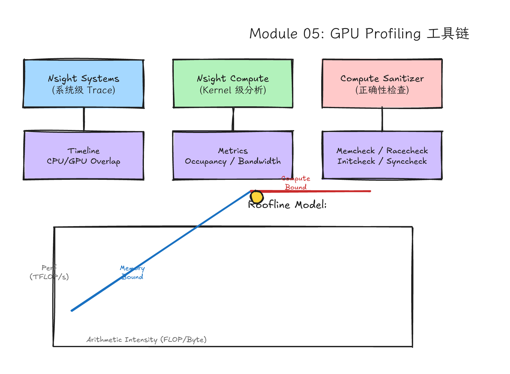
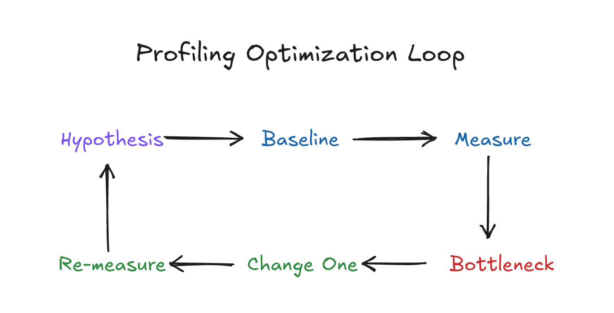
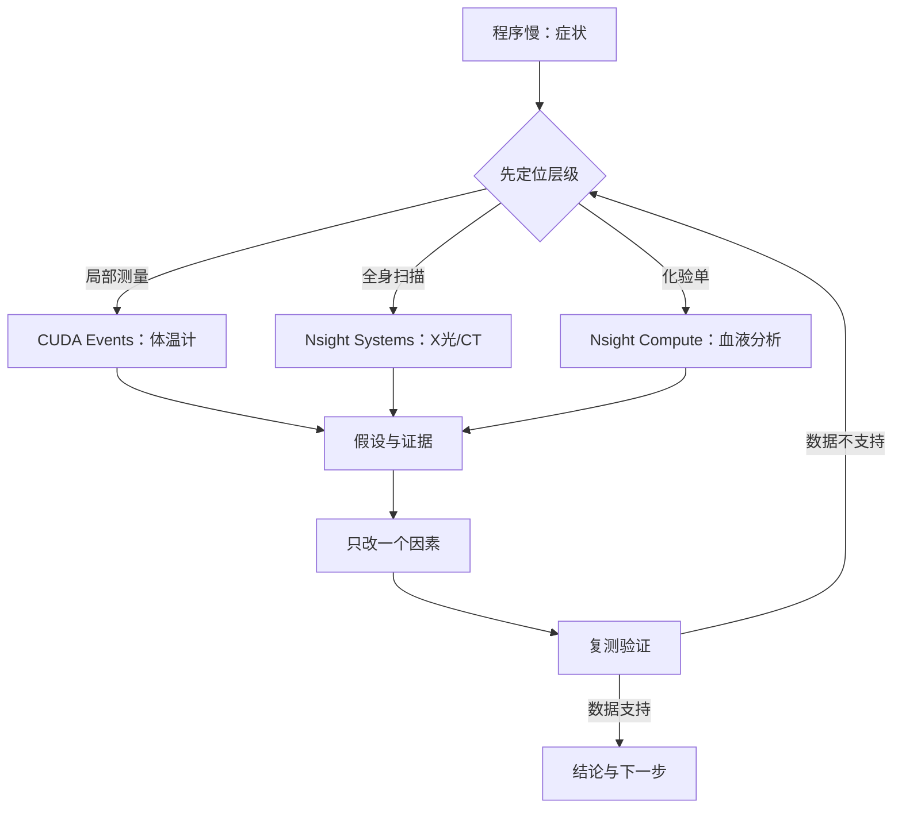
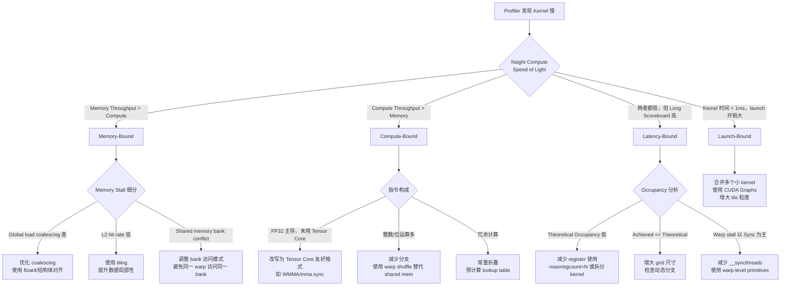

# Module 05: Profiling 与性能基础 — 从直觉到证据的 GPU 性能调优



*图 05-1：从 CUDA Events 到 Nsight Systems、Nsight Compute 的性能证据链。可编辑源图：[`module-05-gpu-profiling-tools.excalidraw`](../diagrams/module-05-gpu-profiling-tools.excalidraw)。*

Level: Intermediate  
Estimated time: 12-18 小时  
Prerequisites: Modules 00-04  
Sources: Nsight Systems, Nsight Compute, CUDA C++ Best Practices Guide, CUDA Occupancy Calculator, vLLM Benchmark

---

## 学习目标

完成本模块后，你将能够：

1. 区分 wall time、GPU time、CPU time 的语义差异，并正确选择测量工具；
2. 使用 CUDA events 精确测量 GPU 上的 kernel 时间、copy 时间，理解 stream 语义与同步机制；
3. 使用 Nsight Systems 收集系统级 trace，识别 CPU/GPU 重叠、kernel 串行、launch 延迟等瓶颈；
4. 使用 Nsight Compute 深入单个 kernel，解读 occupancy、memory throughput、warp stall reasons 等关键指标；
5. 绘制并解读 Roofline Model，定位 kernel 是 memory-bound、compute-bound 还是 latency-bound；
6. 设计一个科学的 benchmark harness，避免 warmup 不足、单样本测量、同时改变多变量等常见错误；
7. 在真实系统（如 vLLM）中测量 prefill/decode throughput 和 latency，理解 phase-level 性能分析。

---

## 5.1 问题背景：为什么"感觉优化"是危险的

前几课你已经能写出正确的 kernel，也见过一些优化技巧。但从这一课开始，你要停止"凭感觉优化"。专家和新手的区别不在于知道多少技巧，而在于专家先测量，再下判断。

### 一个真实的教训

假设你写了一个矩阵乘 kernel，发现它比 cuBLAS 慢 10 倍。你的第一反应可能是："一定是我没有用 shared memory tiling。"于是你花了两天时间实现了 tiling，结果发现只快了 5%，因为真正的瓶颈是寄存器压力（register pressure）导致 occupancy 太低，SM 根本没有足够多的 warps 来隐藏内存延迟。

没有 profiler，你就像给感冒病人做心脏手术。profiler 是 CUDA 性能调优的**必须**。

### 性能测量的三个层次

一个 CUDA 程序的性能问题可能出现在三个层次：

| 层次 | 典型问题 | 适合工具 |
|------|--------|---------|
| **系统层** | CPU/GPU 串行、copy 与 compute 未重叠、launch 延迟 | Nsight Systems |
| **Kernel 层** | Occupancy 低、内存带宽利用率低、指令 mix 不合理 | Nsight Compute |
| **程序层** | 端到端延迟、throughput 波动、warmup 效应 | CUDA Events + 自定义 benchmark |

**原则：先用 Systems 定位"时间花在哪一层"，再用 Compute 深挖"为什么这个 kernel 慢"。**

---

## 5.2 直觉类比：医院诊断



*图 05-2：从假设、baseline、测量、定位瓶颈、单点修改到重新测量的 profiling 优化闭环。可编辑源图：[`profiling-optimization-loop.excalidraw`](../diagrams/profiling-optimization-loop.excalidraw)。*

病人说"我不舒服"，医生不会立刻开药。医生会测体温、验血、看片子。CUDA 性能调优也是一样的诊断流程：



- **CUDA events**：局部体温计，适合测某个 kernel 或 copy 的精确时间。
- **Nsight Systems**：全身时间线，告诉你在整个程序生命周期中，CPU 什么时候 enqueue，GPU 什么时候执行，copy 和 kernel 是否重叠，哪里有空白。
- **Nsight Compute**：单个 kernel 的化验单，告诉你 occupancy、memory throughput、warp state、instruction mix 等微观指标。
- **Profiling report**：病历，记录你的假设、证据、治疗和复查。

---

## 5.3 硬件机制：GPU 为什么"慢"

要理解 profiler 的指标，必须先理解 GPU 的执行模型。一个 GPU kernel 慢，是以下几种情况之一：

### 5.3.1 六大瓶颈类型

| 瓶颈类型 | 本质 | 典型症状 | 常见对策 |
|---------|------|---------|---------|
| **Memory-bound** | SM 在等数据，算术单元没吃饱 | 内存带宽利用率 > 70%，算力利用率低 | Coalescing、tiling、shared memory、prefetch |
| **Compute-bound** | 算术密度高，执行单元忙 | 算力利用率 > 80%，内存带宽利用率低 | 指令优化、Tensor Core、减少冗余计算 |
| **Latency-bound** | 可调度 warps 不够，隐藏不了延迟 | occupancy 低，warp stall 以 long scoreboard 为主 | 减少 register pressure、增加 block/thread 数 |
| **Divergence-heavy** | 同一 warp 内 threads 走不同路径 | branch efficiency 低，warp 被串行化 | 重构分支逻辑、避免 warp 内发散 |
| **Sync-heavy** | `__syncthreads()` 或同步 API 太多 | 时间线中出现大量同步空白 | 减少同步点、合并 kernel、使用 warp-level primitives |
| **Launch/transfer dominated** | kernel 本身很小，启动和传输成本占主导 | kernel 时间 < 1ms，copy 时间占主导 | 合并 kernel、使用 streams 重叠、减少 launch 次数 |

这些情况的修法**完全不同**。没有 profiler，你很容易给感冒病人做手术。

### 5.3.2 三种时间的本质差异

在深入工具之前，必须厘清三个概念：

- **Wall time（墙钟时间）**：从 CPU 上发出第一个 API 调用到 CPU 上收到最后一个结果的总时间。这是用户感受到的延迟。
- **CPU time**：CPU 线程在程序上消耗的时间（user + system time）。它不等于 wall time，因为 CPU 可能在等待 GPU 完成。
- **GPU time**：GPU 实际执行工作的时间。kernel 的 GPU time 通常远小于 wall time，因为还有 H2D/D2H 传输、launch overhead 等。

**为什么不能直接用 CPU 计时器（如 `std::chrono`）测 GPU kernel？**

因为 CUDA kernel launch 是**异步**的。当你调用 `kernel<<<...>>>(...)` 时，CPU 线程只是把 launch 请求放入队列，然后立刻返回。如果你用 `std::chrono` 在 kernel launch 前后计时，你测到的是**CPU 排队时间**，而不是 GPU 实际执行时间。除非你在 launch 后立刻调用 `cudaDeviceSynchronize()`，但这会破坏 pipelining，而且仍然包含同步开销。

```cpp
// ❌ 错误：CPU 计时器测的是排队时间，不是 GPU 执行时间
auto start = std::chrono::high_resolution_clock::now();
my_kernel<<<grid, block>>>(d_data);
// 注意：kernel 还没开始在 GPU 上执行！
auto end = std::chrono::high_resolution_clock::now();
// 除非这里 cudaDeviceSynchronize()，但那样测的是排队+执行+同步开销
```

**正确做法：使用 CUDA events。** CUDA events 是在 GPU timeline 上标记的时间戳，它们记录的是 GPU 执行流中的实际时刻，不受 CPU 异步性的影响。

---

## 5.4 代码路径：从测量到优化的完整工具链

### 5.4.1 CUDA Events 详解

CUDA events 是 GPU 上的同步原语，本质是插入在 GPU 命令队列中的时间戳。它们用于计时，也用于跨 stream 同步。

#### Event 的生命周期

```cpp
// 1. 创建
cudaEvent_t start, stop;
cudaEventCreate(&start);     // 默认：带计时功能
cudaEventCreate(&stop);

// 2. 记录（插入到 stream 的命令队列中）
cudaEventRecord(start, stream);  // 在 stream 中标记"起点"
// ... GPU 工作 ...
cudaEventRecord(stop, stream);     // 在 stream 中标记"终点"

// 3. 同步（等待 event 完成）
cudaEventSynchronize(stop);        // 阻塞 CPU，直到 stop event 之前的所有 GPU 工作完成

// 4. 计算时间差（单位：毫秒）
float ms;
cudaEventElapsedTime(&ms, start, stop);

// 5. 销毁
cudaEventDestroy(start);
cudaEventDestroy(stop);
```

#### 理解：Stream 语义

- **同一个 stream 内**：命令按 FIFO 顺序执行，`cudaEventRecord` 记录的时间点保证该 stream 中之前所有命令已完成。
- **不同 stream 之间**：默认无序，可以通过 `cudaStreamWaitEvent` 实现跨 stream 同步：

```cpp
cudaEvent_t event;
cudaEventCreate(&event);

// Stream A 记录 event
cudaEventRecord(event, streamA);

// Stream B 等待 event
cudaStreamWaitEvent(streamB, event, 0);  // 0 = 不额外设置 flags
// 此后 streamB 中该命令之后的所有操作，会等 streamA 中 event 之前的操作完成
```

#### 为什么不能用 default stream 做精确计时？

Legacy default stream（stream 0）有一个特殊行为：它会与普通 blocking stream 发生隐式同步；用 `cudaStreamNonBlocking` 创建的 stream 才能避开这类 legacy default stream 同步。如果你在 default stream 中记录 event，可能会隐式同步其他工作，破坏并发性。对于精确计时和多 stream 场景，优先显式创建 non-blocking stream。

```cpp
// 推荐：显式创建非 blocking stream
cudaStream_t stream;
cudaStreamCreateWithFlags(&stream, cudaStreamNonBlocking);
```

---

### 5.4.2 精品代码 1：完整的 Benchmark Harness（含 warmup、多次测量、统计指标）

下面的 harness 是一个**可直接编译运行**的完整示例，包含：
- 错误检查宏（`CUDA_CHECK`）
- Warmup（避开第一次运行的 cache、clock、lazy initialization）
- 多次测量，计算 mean / median / stdev
- 支持任意 stream
- 与 H2D/D2H 测量解耦

```cpp
// benchmark_harness.cu
// 编译: nvcc -O3 -o benchmark_harness benchmark_harness.cu

#include <cuda_runtime.h>
#include <cstdio>
#include <vector>
#include <algorithm>
#include <cmath>
#include <cstdlib>

// ---------- 错误检查宏 ----------
#define CUDA_CHECK(call)                                                       \
    do {                                                                       \
        cudaError_t err = call;                                                \
        if (err != cudaSuccess) {                                              \
            fprintf(stderr, "CUDA error at %s:%d: %s\n", __FILE__, __LINE__,   \
                    cudaGetErrorString(err));                                  \
            exit(EXIT_FAILURE);                                                \
        }                                                                      \
    } while (0)

// ---------- 统计工具 ----------
struct TimingStats {
    float mean_ms;      // 平均时间
    float median_ms;    // 中位数时间
    float stdev_ms;     // 标准差
    float min_ms;       // 最小时间
    float max_ms;       // 最大时间
};

static TimingStats compute_stats(const std::vector<float>& times) {
    size_t n = times.size();
    if (n == 0) return {0, 0, 0, 0, 0};

    float sum = 0.0f, min_t = times[0], max_t = times[0];
    for (float t : times) {
        sum += t;
        min_t = std::min(min_t, t);
        max_t = std::max(max_t, t);
    }
    float mean = sum / n;

    float sq_diff_sum = 0.0f;
    for (float t : times) {
        float d = t - mean;
        sq_diff_sum += d * d;
    }
    float stdev = std::sqrt(sq_diff_sum / n);

    std::vector<float> sorted = times;
    std::sort(sorted.begin(), sorted.end());
    float median = (n % 2 == 0) ? (sorted[n/2 - 1] + sorted[n/2]) / 2.0f
                                : sorted[n/2];

    return {mean, median, stdev, min_t, max_t};
}

// ---------- 打印 Markdown 表格 ----------
static void print_markdown_table(const TimingStats& s) {
    printf("| Metric | Value (ms) |\n");
    printf("|--------|-----------|\n");
    printf("| mean   | %.4f |\n", s.mean_ms);
    printf("| median | %.4f |\n", s.median_ms);
    printf("| stdev  | %.4f |\n", s.stdev_ms);
    printf("| min    | %.4f |\n", s.min_ms);
    printf("| max    | %.4f |\n", s.max_ms);
}

// ---------- 通用 Benchmark Harness ----------
// LaunchFn: 签名为 void(cudaStream_t) 的可调用对象
// warmup_iters: 热身次数（不计入统计）
// measured_iters: 实际测量次数
template <typename LaunchFn>
TimingStats benchmark_kernel(LaunchFn launch,
                              cudaStream_t stream,
                              int warmup_iters,
                              int measured_iters) {
    cudaEvent_t start, stop;
    CUDA_CHECK(cudaEventCreate(&start));
    CUDA_CHECK(cudaEventCreate(&stop));

    // ---- Warmup：排除第一次的 cache、lazy initialization、clock 稳定化等影响 ----
    for (int i = 0; i < warmup_iters; ++i) {
        launch(stream);
    }
    CUDA_CHECK(cudaGetLastError());          // 检查 kernel 是否报错
    CUDA_CHECK(cudaStreamSynchronize(stream)); // 确保 warmup 完成

    // ---- 测量：每轮都记录独立的时间，而不是只记录总时间 ----
    std::vector<float> samples;
    samples.reserve(measured_iters);

    for (int i = 0; i < measured_iters; ++i) {
        CUDA_CHECK(cudaEventRecord(start, stream));
        launch(stream);
        CUDA_CHECK(cudaEventRecord(stop, stream));
        CUDA_CHECK(cudaEventSynchronize(stop));  // 阻塞 CPU，直到本轮 GPU 工作完成
        float ms;
        CUDA_CHECK(cudaEventElapsedTime(&ms, start, stop));
        samples.push_back(ms);
    }

    CUDA_CHECK(cudaEventDestroy(start));
    CUDA_CHECK(cudaEventDestroy(stop));
    return compute_stats(samples);
}

// ---------- 示例 Kernel：Vector Add ----------
__global__ void vector_add(const float* a, const float* b, float* c, int n) {
    int idx = blockIdx.x * blockDim.x + threadIdx.x;
    if (idx < n) {
        c[idx] = a[idx] + b[idx];
    }
}

int main() {
    const int n = 1 << 24;  // 16M elements
    size_t bytes = n * sizeof(float);

    // 分配 host 内存（pinned，异步传输需要）
    float *h_a, *h_b, *h_c;
    CUDA_CHECK(cudaMallocHost(&h_a, bytes));
    CUDA_CHECK(cudaMallocHost(&h_b, bytes));
    CUDA_CHECK(cudaMallocHost(&h_c, bytes));
    for (int i = 0; i < n; ++i) {
        h_a[i] = 1.0f;
        h_b[i] = 2.0f;
    }

    // 分配 device 内存
    float *d_a, *d_b, *d_c;
    CUDA_CHECK(cudaMalloc(&d_a, bytes));
    CUDA_CHECK(cudaMalloc(&d_b, bytes));
    CUDA_CHECK(cudaMalloc(&d_c, bytes));

    // 创建非 blocking stream（避免 default stream 隐式同步）
    cudaStream_t stream;
    CUDA_CHECK(cudaStreamCreateWithFlags(&stream, cudaStreamNonBlocking));

    // ---------- 测量 H2D 传输时间 ----------
    auto h2d_stats = benchmark_kernel(
        [&](cudaStream_t s) {
            // 把 host 数据拷贝到 device
            CUDA_CHECK(cudaMemcpyAsync(d_a, h_a, bytes, cudaMemcpyHostToDevice, s));
            CUDA_CHECK(cudaMemcpyAsync(d_b, h_b, bytes, cudaMemcpyHostToDevice, s));
        },
        stream, 10, 50);

    printf("## H2D Transfer Time\n");
    print_markdown_table(h2d_stats);

    // ---------- 测量 Kernel 时间 ----------
    int threads = 256;
    int blocks = (n + threads - 1) / threads;
    auto kernel_stats = benchmark_kernel(
        [&](cudaStream_t s) {
            vector_add<<<blocks, threads, 0, s>>>(d_a, d_b, d_c, n);
        },
        stream, 10, 50);

    printf("\n## Kernel Execution Time\n");
    print_markdown_table(kernel_stats);

    // ---------- 测量 D2H 传输时间 ----------
    auto d2h_stats = benchmark_kernel(
        [&](cudaStream_t s) {
            CUDA_CHECK(cudaMemcpyAsync(h_c, d_c, bytes, cudaMemcpyDeviceToHost, s));
        },
        stream, 10, 50);

    printf("\n## D2H Transfer Time\n");
    print_markdown_table(d2h_stats);

    // ---------- 端到端 wall time（用 CPU 计时器，包含所有同步开销） ----------
    auto wall_start = std::chrono::high_resolution_clock::now();
    CUDA_CHECK(cudaMemcpyAsync(d_a, h_a, bytes, cudaMemcpyHostToDevice, stream));
    CUDA_CHECK(cudaMemcpyAsync(d_b, h_b, bytes, cudaMemcpyHostToDevice, stream));
    vector_add<<<blocks, threads, 0, stream>>>(d_a, d_b, d_c, n);
    CUDA_CHECK(cudaMemcpyAsync(h_c, d_c, bytes, cudaMemcpyDeviceToHost, stream));
    CUDA_CHECK(cudaStreamSynchronize(stream));
    auto wall_end = std::chrono::high_resolution_clock::now();
    float wall_ms = std::chrono::duration<float, std::milli>(wall_end - wall_start).count();
    printf("\n## End-to-End Wall Time (single run)\n");
    printf("| Metric | Value (ms) |\n|--------|-----------|\n| wall   | %.4f |\n", wall_ms);

    // 清理
    CUDA_CHECK(cudaFree(d_a));
    CUDA_CHECK(cudaFree(d_b));
    CUDA_CHECK(cudaFree(d_c));
    CUDA_CHECK(cudaFreeHost(h_a));
    CUDA_CHECK(cudaFreeHost(h_b));
    CUDA_CHECK(cudaFreeHost(h_c));
    CUDA_CHECK(cudaStreamDestroy(stream));
    return 0;
}
```

**设计决策：**

1. **Warmup 必须单独做**：第一次 kernel 运行可能触发 driver 的 JIT compilation、context 建立、clock 升压等，时间常常明显慢于稳定状态；具体倍数取决于硬件、driver、是否含 PTX JIT 和应用初始化路径。
2. **每轮测量独立 event 对**：如果把 100 次 kernel 包在一个 event 对里，测到的是总时间/100，这会掩盖轮与轮之间的方差。独立 event 对可以捕捉 jitter。
3. **统计 median 而非只取 min**：只取最小值是常见的错误（认为最小值代表"最理想情况"），但实际上 median 更能代表系统的典型性能。stdev 则帮助你判断系统是否有噪声。
4. **使用 pinned memory**：`cudaMallocHost` 分配的内存支持异步传输，且 H2D/D2H 带宽更高。

---

### 5.4.3 精品代码 2：CUDA Event 完整测量（H2D + Kernel + D2H 拆分 + 多 Stream）

这个示例展示如何在**多 stream 场景**中精确测量每个阶段的时间，并展示如何用 event 做**跨 stream 同步**。

```cpp
// multi_stream_timing.cu
// 编译: nvcc -O3 -o multi_stream_timing multi_stream_timing.cu

#include <cuda_runtime.h>
#include <cstdio>
#include <vector>
#include <cstdlib>

#define CUDA_CHECK(call)                                                       \
    do {                                                                       \
        cudaError_t err = call;                                                \
        if (err != cudaSuccess) {                                              \
            fprintf(stderr, "CUDA error at %s:%d: %s\n", __FILE__, __LINE__,   \
                    cudaGetErrorString(err));                                  \
            exit(EXIT_FAILURE);                                                \
        }                                                                      \
    } while (0)

__global__ void scale_kernel(float* data, float scale, int n) {
    int idx = blockIdx.x * blockDim.x + threadIdx.x;
    if (idx < n) data[idx] *= scale;
}

int main() {
    const int n = 1 << 22;  // 4M elements per stream
    size_t bytes = n * sizeof(float);
    const int num_streams = 3;

    // 创建多个非 blocking stream
    std::vector<cudaStream_t> streams(num_streams);
    for (int i = 0; i < num_streams; ++i) {
        CUDA_CHECK(cudaStreamCreateWithFlags(&streams[i], cudaStreamNonBlocking));
    }

    // 分配 host pinned 内存和 device 内存
    std::vector<float*> h_data(num_streams), d_data(num_streams);
    for (int i = 0; i < num_streams; ++i) {
        CUDA_CHECK(cudaMallocHost(&h_data[i], bytes));
        CUDA_CHECK(cudaMalloc(&d_data[i], bytes));
        for (int j = 0; j < n; ++j) h_data[i][j] = 1.0f + i;
    }

    // 为每个 stream 创建 event 对
    std::vector<cudaEvent_t> h2d_events(num_streams);
    std::vector<cudaEvent_t> kernel_events(num_streams);
    std::vector<cudaEvent_t> d2h_events(num_streams);
    std::vector<cudaEvent_t> d2h_end_events(num_streams);
    for (int i = 0; i < num_streams; ++i) {
        CUDA_CHECK(cudaEventCreate(&h2d_events[i]));
        CUDA_CHECK(cudaEventCreate(&kernel_events[i]));
        CUDA_CHECK(cudaEventCreate(&d2h_events[i]));
        CUDA_CHECK(cudaEventCreate(&d2h_end_events[i]));
    }

    // ========== 阶段 1：H2D（所有 stream 并发拷贝）==========
    for (int i = 0; i < num_streams; ++i) {
        CUDA_CHECK(cudaEventRecord(h2d_events[i], streams[i]));
        CUDA_CHECK(cudaMemcpyAsync(d_data[i], h_data[i], bytes,
                                    cudaMemcpyHostToDevice, streams[i]));
    }

    // ========== 阶段 2：Kernel（所有 stream 并发执行）==========
    int threads = 256;
    int blocks = (n + threads - 1) / threads;
    for (int i = 0; i < num_streams; ++i) {
        // 确保 H2D 完成后才开始 kernel（虽然在同一个 stream 中是自动的，
        // 但显式同步可以增加代码可读性）
        CUDA_CHECK(cudaStreamWaitEvent(streams[i], h2d_events[i], 0));
        CUDA_CHECK(cudaEventRecord(kernel_events[i], streams[i]));
        scale_kernel<<<blocks, threads, 0, streams[i]>>>(d_data[i], 2.0f, n);
    }

    // ========== 阶段 3：D2H（所有 stream 并发拷贝）==========
    for (int i = 0; i < num_streams; ++i) {
        CUDA_CHECK(cudaStreamWaitEvent(streams[i], kernel_events[i], 0));
        CUDA_CHECK(cudaEventRecord(d2h_events[i], streams[i]));
        CUDA_CHECK(cudaMemcpyAsync(h_data[i], d_data[i], bytes,
                                    cudaMemcpyDeviceToHost, streams[i]));
        // end event 必须在 D2H 之后立刻排入同一个 stream。
        // 如果等所有 stream 同步后再补记，会把 GPU idle gap 算进 D2H 时间。
        CUDA_CHECK(cudaEventRecord(d2h_end_events[i], streams[i]));
    }

    // ========== 阶段 4：同步与计时 ==========
    // 注意：我们要等所有 stream 的 D2H 完成
    for (int i = 0; i < num_streams; ++i) {
        CUDA_CHECK(cudaStreamSynchronize(streams[i]));
    }

    // 计算每个阶段的时间
    printf("| Stream | H2D (ms) | Kernel (ms) | D2H (ms) | Total (ms) |\n");
    printf("|--------|----------|-------------|----------|------------|\n");
    for (int i = 0; i < num_streams; ++i) {
        float h2d_ms, kernel_ms, d2h_ms, total_ms;
        CUDA_CHECK(cudaEventElapsedTime(&h2d_ms, h2d_events[i],
                                        // 找到下一个阶段的 event 作为 end
                                        // 这里用 kernel event 作为 H2D 的 end
                                        kernel_events[i]));
        CUDA_CHECK(cudaEventElapsedTime(&kernel_ms, kernel_events[i], d2h_events[i]));
        CUDA_CHECK(cudaEventElapsedTime(&d2h_ms, d2h_events[i], d2h_end_events[i]));

        total_ms = h2d_ms + kernel_ms + d2h_ms;
        printf("| %d      | %.4f    | %.4f       | %.4f   | %.4f      |\n",
               i, h2d_ms, kernel_ms, d2h_ms, total_ms);
    }

    // 清理
    for (int i = 0; i < num_streams; ++i) {
        CUDA_CHECK(cudaFreeHost(h_data[i]));
        CUDA_CHECK(cudaFree(d_data[i]));
        CUDA_CHECK(cudaStreamDestroy(streams[i]));
        CUDA_CHECK(cudaEventDestroy(h2d_events[i]));
        CUDA_CHECK(cudaEventDestroy(kernel_events[i]));
        CUDA_CHECK(cudaEventDestroy(d2h_events[i]));
        CUDA_CHECK(cudaEventDestroy(d2h_end_events[i]));
    }
    return 0;
}
```

---

### 5.4.4 精品代码 3：ncu / nsys 命令行 Profiling 示例

`nvprof` 和 Visual Profiler 已被 NVIDIA 弃用，并且不支持 Compute Capability 8.0 及以上设备；现代 CUDA 课程应使用 Nsight Systems (`nsys`) 和 Nsight Compute (`ncu`)。旧系统里仍可能见到 `nvprof` 命令，但本课只把它当 legacy 背景，不作为新实验工具。

```bash
#!/bin/bash
# profile.sh - 一键 profiling 脚本
# 用法: ./profile.sh ./your_cuda_program

APP=$1
if [ -z "$APP" ]; then
    echo "Usage: $0 <cuda_executable>"
    exit 1
fi

# 获取当前时间戳用于文件名
TIMESTAMP=$(date +%Y%m%d_%H%M%S)

echo "========== Nsight Systems（系统级 trace）=========="
# --trace=cuda: 追踪 CUDA API 和 kernel
# --trace=nvtx: 追踪 NVTX 标注（如果代码中用了 nvtx）
# --trace=osrt: 追踪 OS runtime 调用
# -o: 输出报告文件名
nsys profile --trace=cuda,nvtx,osrt \
             --sample=none \
             --cpuctxsw=none \
             -o "report_systems_${TIMESTAMP}" \
             "$APP"

echo ""
echo "========== Nsight Compute（单个 kernel 深度分析）=========="
# --set detailed: 包含 SpeedOfLight, MemoryWorkloadAnalysis, InstructionMix 等
# -o: 输出报告文件名
# --target-processes all: 如果有子进程也一起分析
ncu --set detailed \
    -o "report_compute_${TIMESTAMP}" \
    --target-processes all \
    "$APP"

echo ""
echo "========== Nsight Compute（仅分析特定 kernel）=========="
# -k: 按名字匹配 kernel（支持正则）
# -c: 只收集前 5 次 launch
# --section: 只收集特定 section，减少开销
ncu -k "vector_add" \
    -c 5 \
    --section SpeedOfLight \
    --section MemoryWorkloadAnalysis \
    -o "report_compute_kernel_${TIMESTAMP}" \
    "$APP"

echo ""
echo "========== Nsight Compute（自定义 metrics）=========="
# 收集特定的硬件计数器。metric 名称随 Nsight Compute 版本和 GPU 架构变化；
# 如果报 Unknown metric，先运行：
#   ncu --query-metrics | rg -i 'memory_throughput|dram__bytes|long_scoreboard|warps_active'
# 再用本机存在的名称替换下面的示例。
ncu --metrics \
    "sm__warps_active.avg.pct_of_peak_sustained_active,\
     sm__memory_throughput.avg.pct_of_peak_sustained_elapsed,\
     l1tex__t_bytes.sum.per_second,\
     smsp__warp_issue_stalled_long_scoreboard_per_warp_active.pct" \
    -o "report_compute_custom_${TIMESTAMP}" \
    "$APP"

echo ""
echo "========== 报告文件 =========="
ls -lh report_*.nsys-rep report_*.ncu-rep 2>/dev/null

echo ""
echo "查看 Nsight Systems 报告: nsys-ui report_systems_${TIMESTAMP}.nsys-rep"
echo "查看 Nsight Compute 报告: ncu-ui report_compute_${TIMESTAMP}.ncu-rep"
```

#### 关键参数解释

| 参数 | 含义 | 使用场景 |
|------|------|---------|
| `nsys profile --trace=cuda,nvtx` | 追踪 CUDA API 和 NVTX 标注 | 想看时间线、stream 重叠、kernel 启动序列 |
| `nsys profile --sample=none` | 关闭 CPU sampling | 减少 profiling 开销，只关心 GPU 时序 |
| `ncu --set detailed` | 使用 detailed section set | 需要 Roofline、Memory Workload、Instruction Mix |
| `ncu -k "kernel_name"` | 只匹配特定 kernel | 程序中有很多 kernel，只关心一个 |
| `ncu -c 5` | 只收集前 5 次 launch | 排除 warmup，只看稳定状态 |
| `ncu --section SpeedOfLight` | 只收集 SpeedOfLight section | 快速判断 memory-bound 还是 compute-bound |

---

### 5.4.5 精品代码 4：Nsight Systems Report 解析脚本（Python）

Nsight Systems 生成的 `.nsys-rep` 是二进制格式，但可以用 `nsys stats` 命令导出为文本或 SQLite，再用 Python 解析。

```python
#!/usr/bin/env python3
# parse_nsys_report.py
# 用法: python3 parse_nsys_report.py report.nsys-rep

import subprocess
import sys
import json
import os

def export_nsys_report(nsys_rep_path):
    """
    用 nsys stats 导出 CUDA API 和 kernel 统计信息
    """
    if not os.path.exists(nsys_rep_path):
        print(f"Error: {nsys_rep_path} not found")
        sys.exit(1)

    # 导出 CUDA API 统计
    cmd_api = ["nsys", "stats", "--report", "cuda_api_sum", nsys_rep_path]
    result_api = subprocess.run(cmd_api, capture_output=True, text=True)
    print("=== CUDA API Summary ===")
    print(result_api.stdout)

    # 导出 Kernel 统计
    # 当前 Nsight Systems 常用的 CUDA kernel 汇总报告名是 cuda_gpu_kern_sum。
    # 具体可用报告名可用 `nsys stats --help` 或 Nsight Systems User Guide 在本机确认。
    cmd_kernel = ["nsys", "stats", "--report", "cuda_gpu_kern_sum", nsys_rep_path]
    result_kernel = subprocess.run(cmd_kernel, capture_output=True, text=True)
    print("=== CUDA Kernel Summary ===")
    print(result_kernel.stdout)

    # 导出 NVTX 统计（如果代码中用了 nvtxRangePush/Pop）
    cmd_nvtx = ["nsys", "stats", "--report", "nvtx_sum", nsys_rep_path]
    result_nvtx = subprocess.run(cmd_nvtx, capture_output=True, text=True)
    print("=== NVTX Summary ===")
    print(result_nvtx.stdout)

def check_bottleneck_patterns(nsys_rep_path):
    """
    自动识别常见瓶颈模式
    """
    # 导出时间线数据为 SQLite（需要 Nsight Systems 2022.1+）
    sqlite_path = nsys_rep_path.replace(".nsys-rep", ".sqlite")
    if not os.path.exists(sqlite_path):
        cmd_export = ["nsys", "export", "--type", "sqlite", "-o", sqlite_path, nsys_rep_path]
        subprocess.run(cmd_export, capture_output=True)

    import sqlite3
    conn = sqlite3.connect(sqlite_path)
    cursor = conn.cursor()

    # 检查 GPU 利用率（通过 kernel 总时间 / trace 总时间）
    cursor.execute("""
        SELECT SUM(duration) FROM CUPTI_ACTIVITY_KIND_KERNEL
    """)
    kernel_time = cursor.fetchone()[0] or 0

    cursor.execute("""
        SELECT MIN(start), MAX(end) FROM CUPTI_ACTIVITY_KIND_KERNEL
    """)
    row = cursor.fetchone()
    if row and row[0] and row[1]:
        total_time = row[1] - row[0]
        gpu_util = (kernel_time / total_time * 100) if total_time > 0 else 0
        print(f"\n=== 自动瓶颈分析 ===")
        print(f"GPU Kernel Time: {kernel_time / 1e9:.2f} s")
        print(f"Trace Duration: {total_time / 1e9:.2f} s")
        print(f"GPU Utilization: {gpu_util:.1f}%")

        if gpu_util < 50:
            print("⚠️  GPU 利用率低于 50%，可能存在：")
            print("   - CPU 端 launch 延迟或串行化")
            print("   - H2D/D2H 传输阻塞了 GPU")
            print("   - Kernel 太小，launch overhead 占主导")
        else:
            print("✅ GPU 利用率较高，瓶颈可能在 kernel 内部或内存带宽")

    # 检查 H2D 和 D2H 时间占比
    cursor.execute("""
        SELECT SUM(duration) FROM CUPTI_ACTIVITY_KIND_MEMCPY
        WHERE copyKind IN (1, 2)  -- 1=H2D, 2=D2H
    """)
    memcpy_time = cursor.fetchone()[0] or 0
    if total_time > 0:
        memcpy_ratio = memcpy_time / total_time * 100
        print(f"Memcpy Time Ratio: {memcpy_ratio:.1f}%")
        if memcpy_ratio > 30:
            print("⚠️  传输时间占比 > 30%，考虑使用 streams 重叠或 pinned memory")

    conn.close()

if __name__ == "__main__":
    if len(sys.argv) < 2:
        print(f"Usage: {sys.argv[0]} <report.nsys-rep>")
        sys.exit(1)

    report_path = sys.argv[1]
    export_nsys_report(report_path)
    check_bottleneck_patterns(report_path)
```

---

## 5.5 Nsight Systems 完整指南

Nsight Systems 是一个**系统级 profiler**，它回答的问题是："在整个程序运行期间，时间花在哪儿？"它的视图是**时间线（timeline）**。

### 5.5.1 如何收集 Trace

```bash
# 基本用法：追踪所有默认内容（CUDA、NVTX、OSRT）
nsys profile ./my_app

# 减少开销，只追踪 CUDA 和 NVTX（推荐用于 GPU 性能分析）
nsys profile --trace=cuda,nvtx --sample=none --cpuctxsw=none ./my_app

# 只追踪特定时间段（用 NVTX range 控制）
nsys profile --trace=cuda,nvtx -c nvtx --profile-from-start off ./my_app

# 在 Python 程序中使用（如 PyTorch 训练脚本）
nsys profile --trace=cuda,nvtx,osrt -o pytorch_trace python train.py
```

### 5.5.2 时间线解读：Nsight Systems 的五大视图

打开 `.nsys-rep` 文件后，你会看到多行 timeline：

```mermaid
---
title: Nsight Systems 时间线典型结构
---
gantt
    title CPU/GPU Timeline 示例
    dateFormat X
    axisFormat %s

    section CPU Thread
    CPU prep work       : 0, 2
    cudaLaunchKernel    : 2, 3
    CPU idle waiting    : 3, 10
    D2H copy launch     : 10, 11

    section CUDA API
    cuLaunchKernel      : 2, 4
    cuMemcpyAsync H2D   : 4, 5
    cuStreamSync        : 10, 12

    section GPU HW
    Kernel A execution  : 4, 7
    H2D Memcpy          : 4, 6
    Kernel B execution  : 7, 10
    D2H Memcpy          : 11, 13
```



**关键行解读：**

| 行 | 显示内容 | 诊断价值 |
|----|---------|---------|
| **CPU Threads** | CPU 线程的 API 调用、用户代码、系统调用 | 识别 CPU 瓶颈、launch 延迟 |
| **CUDA API** | CUDA Runtime/Driver API 调用时间 | 看 `cudaLaunchKernel` 持续时间，判断 launch overhead |
| **GPU HW → Kernels** | 每个 SM 上执行的 kernel 时间块 | 识别 kernel 串行、负载不均衡 |
| **GPU HW → Memory** | H2D/D2H/D2D memcpy 时间块 | 识别传输瓶颈、是否 overlap |
| **NVTX** | 用户自定义的标注范围（如 `nvtxRangePush("forward")`） | 将代码逻辑与时间线关联 |

### 5.5.3 常见瓶颈模式识别

#### 模式 1：H2D 瓶颈（传输主导）

```mermaid
---
title: H2D 瓶颈模式
---
gantt
    title H2D Bottleneck Pattern
    dateFormat X
    axisFormat %s

    section GPU
    H2D copy 1    : 0, 8
    Kernel 1      : 8, 10
    H2D copy 2    : 10, 18
    Kernel 2      : 18, 20
    D2H copy      : 20, 25
```



**特征**：GPU 时间线中大片红色（memcpy），kernel 执行时间很短，且 kernel 总是等 memcpy 结束后才开始。
**对策**：使用 pinned memory + `cudaMemcpyAsync` + 多 stream 重叠传输和计算。

#### 模式 2：Kernel 串行（顺序执行）

**特征**：GPU HW 行中 kernel 一个接一个，没有重叠。即使它们在同一个 stream 中，如果它们之间没有显式依赖，则可能是 launch 速率不够快。
**对策**：检查是否错误地使用了 `cudaDeviceSynchronize()` 或 `cudaStreamSynchronize()`；或者使用 CUDA Graphs 批量提交。

#### 模式 3：Launch 延迟（Launch-bound）

**特征**：CPU 时间线中 `cudaLaunchKernel` 持续时间很短，但 GPU 上 kernel 开始前有空白。CPU 在等待什么（可能是驱动开销、或前一个同步点）。
**对策**：使用 CUDA Graphs 减少 launch overhead；或者合并多个小 kernel 为一个大 kernel。

#### 模式 4：Copy 与 Kernel 重叠理想

```mermaid
---
title: 理想重叠模式
---
gantt
    title Ideal Overlap Pattern
    dateFormat X
    axisFormat %s

    section GPU Stream 1
    H2D copy      : 0, 5
    Kernel 1      : 5, 10
    D2H copy      : 10, 15

    section GPU Stream 2
    H2D copy      : 3, 8
    Kernel 2      : 8, 13
    D2H copy      : 13, 18
```



**特征**：不同 stream 的 memcpy 和 kernel 在 GPU 上交错执行，没有大片空白。
这是系统运行良好的标志。

---

## 5.6 Nsight Compute 完整指南

Nsight Compute 是一个**kernel 级 profiler**，它回答的问题是："这个 kernel 内部发生了什么？"它通过硬件计数器（hardware counters）收集精确指标。

### 5.6.1 如何选择 Kernel 进行详细分析

```bash
# Nsight Compute 没有稳定的 “--list-kernels” 发现命令。
# 先做一次低成本采集或用 Nsight Systems timeline 找 kernel 名，再用 -k 过滤。
ncu --launch-count 5 -o kernel_scout ./my_app
ncu-ui kernel_scout.ncu-rep

# 只分析第 3 个 kernel（跳过前 2 个，可能是 warmup）
ncu -s 2 -c 1 ./my_app

# 按名字匹配（支持正则）
ncu -k "regex:.*conv.*" -c 3 ./my_app
```

### 5.6.2 关键指标解读

Nsight Compute 的指标非常多，但指标可以归纳为"四看"：

#### 一看：Speed of Light（算力与内存利用率）

这是最重要的"第一屏"指标：

| 指标 | 含义 | 健康值 | 解读 |
|------|------|--------|------|
| `Memory Throughput` | 内存带宽利用率（占峰值比例） | > 60% 可能 memory-bound | 如果内存利用率高但算力低，说明 SM 在等数据 |
| `Compute Throughput` | 计算利用率（占峰值比例） | > 60% 可能 compute-bound | 如果算力利用率高且内存低，说明计算密集 |
| `L2 Cache Hit Rate` | L2 缓存命中率 | > 80% 较好 | 低命中率意味着大量数据从 HBM 读取 |
| `Shared Memory Throughput` | Shared memory 利用率 | 视算法而定 | tiling 算法通常 shared memory 利用率高 |

**注意**：如果 `Memory Throughput` > `Compute Throughput`，瓶颈在内存；反之在计算。

#### 二看：Occupancy（占用率）

| 指标 | 含义 | 诊断 |
|------|------|------|
| `Theoretical Occupancy` | 根据 kernel 资源需求（register、shared memory、block size）计算出的理论最大占用率 | 如果理论值低，通常因为 register pressure 或 shared memory 太大 |
| `Achieved Occupancy` | 实际执行时的平均占用率 | 如果实际 << 理论，可能是因为 grid 不够大、动态分支、或 warp 频繁 idle |
| `Registers Per Thread` | 每个线程使用的寄存器数 | 高 register 会减少可同时驻留的 warps |

**Occupancy ≠ 性能**：occupancy 是厨房里待命厨师数量，不是出餐速度本身。高 occupancy 只是让 GPU 有更多 warps 可以调度来隐藏延迟。如果 kernel 本身已经是 compute-bound（厨师一直在忙），再增加厨师（occupancy）也不会加速。

#### 三看：Warp Stall Reasons（Warp 停顿原因）

这是定位 latency-bound 的**指标**：

| Stall Reason | 含义 | 常见原因 |
|-------------|------|---------|
| `Long Scoreboard` | 等待全局内存读取完成 | 内存访问延迟、未 coalesced |
| `Short Scoreboard` | 等待寄存器依赖或 shared memory | 指令 RAW 依赖、bank conflict |
| `Math Pipe Throttle` | 数学指令队列满 | 大量 FMA/FP 指令，compute-bound |
| `Not Selected` | Warp 有资格发射但未被选中 | 可能是因为其他 warp 占用了资源，或 SM 忙于其他指令类型 |
| `Barrier` | 等待 `__syncthreads()` | 同步点等待其他 warp |
| `Drain` | 等待内存写入排空 | 内存写入背压 |

**原则**：如果 `Long Scoreboard` 占 stall 的主要比例，说明 kernel 是 memory-latency-bound；如果 `Math Pipe Throttle` 占主导，说明是 compute-bound。

#### 四看：Instruction Mix（指令构成）

| 指标 | 含义 | 诊断 |
|------|------|------|
| `FP32/FP64/FP16 Instructions` | 浮点指令比例 | 确认是否有效利用了 Tensor Core |
| `Integer Instructions` | 整数指令比例 | 某些 kernel 整数运算过多 |
| `Memory Instructions` | 内存读写指令比例 | 对比 FLOPs，估算 arithmetic intensity |

### 5.6.3 Section 系统

Nsight Compute 将指标组织为**sections**。预定义 section sets：

| Set | 包含 Sections | 用途 |
|-----|--------------|------|
| `basic` | LaunchStats, Occupancy, SpeedOfLight, WorkloadDistribution | 快速概览 |
| `detailed` | basic + MemoryWorkloadAnalysis, ComputeWorkloadAnalysis, InstructionMix, SpeedOfLight_RooflineChart | 深度分析 |
| `full` | detailed + 所有其他 sections | 最完整，但开销最大 |
| `roofline` | SpeedOfLight_RooflineChart + 相关指标 | 只用于 Roofline 分析 |

```bash
# 查看所有可用 sections
ncu --list-sections

# 只收集特定 sections（减少开销）
ncu --section SpeedOfLight \
    --section MemoryWorkloadAnalysis \
    --section Occupancy \
    ./my_app
```

### 5.6.4 编写自定义 Section / Metric 配置

Nsight Compute 的 section 文件是 `.section` 格式的文本文件，位于安装目录的 `sections/` 下。你可以创建自定义 section：

```json
// my_custom.section
// 放在 Nsight Compute 的 sections 目录下，或用 --section 指定完整路径

Section {
  Name: "MyCustomAnalysis"
  Description: "自定义指标：关注内存延迟和 occupancy"
  Header {
    Metric {
      Name: "sm__warps_active.avg.pct_of_peak_sustained_active"
      Label: "Achieved Occupancy"
    }
    Metric {
      Name: "smsp__warp_issue_stalled_long_scoreboard_per_warp_active.pct"
      Label: "Long Scoreboard Stall %"
    }
    Metric {
      Name: "dram__bytes.sum.per_second"
      Label: "DRAM Bandwidth (GB/s)"
    }
  }
}
```

```bash
ncu --section /path/to/my_custom.section ./my_app
```

---

## 5.7 Roofline Model 深入

Roofline Model 是理解性能瓶颈的**理论框架**。它将 kernel 的 arithmetic intensity（计算强度）与硬件峰值进行对比。

### 5.7.1 概念

- **Arithmetic Intensity（AI）**：每移动 1 byte 内存，执行多少 FLOP。
  $$
  AI = \frac{\text{Total FLOPs}}{\text{Total Bytes Moved}}
  $$
- **Ridge Point**：内存带宽 roofline 与算力 roofline 的交点。AI 低于 ridge point → memory-bound；高于 → compute-bound。

```mermaid
---
title: Roofline Model 示意图
---
xychart-beta
    title "Roofline Model"
    x-axis "Arithmetic Intensity (FLOP/Byte)" [1, 2, 4, 8, 16, 32, 64, 128]
    y-axis "Performance (GFLOP/s)"
    line "Memory Bandwidth Roof" [100, 200, 400, 800, 800, 800, 800, 800]
    line "Compute Roof" [100, 200, 400, 800, 1600, 3200, 6400, 12800]
    scatter "Your Kernel (Baseline)" [5, 350]
    scatter "Your Kernel (Optimized)" [20, 700]
```

### 5.7.2 用 Nsight Compute 数据绘制 Roofline

Nsight Compute 2020.1+ 已经内置了 Roofline chart（`--set detailed` 或 `--section SpeedOfLight_RooflineChart`）。但如果你想手动绘制或做批量分析，需要提取以下指标：

```bash
# 提取 Roofline 所需指标
ncu --metrics \
    "sm__sass_thread_inst_executed_op_ffma_pred_on.sum,\
     sm__sass_thread_inst_executed_op_fmul_pred_on.sum,\
     sm__sass_thread_inst_executed_op_fadd_pred_on.sum,\
     dram__bytes_read.sum,\
     dram__bytes_write.sum,\
     sm__cycles_elapsed.avg,\
     sm__cycles_elapsed.avg.per_second" \
    -o roofline_data \
    ./my_app

# 然后用 ncu --page raw 或 ncu-ui 导出为 CSV 进行可视化
```

**手动计算**：

```python
# roofline_calc.py - 从 Nsight Compute 指标计算 Roofline 坐标
# 这里使用的 sm__sass_thread_inst_executed_* 是 thread-level 指令计数：
# FFMA 每条算 2 FLOP，FMUL/FADD 每条算 1 FLOP，不要再乘 warp size 或 thread 数。
# Tensor Core、FP16 vector 指令、SFU、integer op 需要按对应 metric 另算。
# FLOPs = FFMA * 2 + FMUL + FADD
# Bytes = dram__bytes_read + dram__bytes_write
# Time = sm__cycles_elapsed.avg / sm__cycles_elapsed.avg.per_second
# AI = FLOPs / Bytes
# Performance = FLOPs / Time
```

### 5.7.3 定位瓶颈的策略

1. **先确定 AI**：用 Nsight Compute 的 `InstructionMix` / SASS 指令计数估算 FLOPs，用 DRAM/L2 相关 byte metric 估算数据移动量；如果 kernel 使用 Tensor Core，需要改用对应 tensor/mma 指标，不能只看 FP32 FFMA/FADD/FMUL。
2. **在 Roofline 上画点**：如果点在 memory roof 下方 → memory-bound；在 compute roof 下方 → compute-bound。
3. **优化方向**：
   - Memory-bound → 提高数据复用（tiling）、改善 coalescing、使用 shared memory。
   - Compute-bound → 减少指令数、使用 Tensor Core、提高指令级并行。

---

## 5.8 常见瓶颈模式及对策（决策树）



### 5.8.1 Memory-Bound 深度对策

1. **Coalescing**：确保同一 warp 的线程访问连续的内存地址。可以评估 vectorized load/store（如对齐满足时的 `float4`）；只读数据是否需要 `__ldg` 要按架构和编译器判断，现代 GPU/编译器常已能为 `const __restrict__` 等路径选择合适缓存策略。
2. **Tiling**：将数据分块加载到 shared memory，复用数据以提高 arithmetic intensity。
3. **Shared Memory**：对于反复访问的数据，显式管理 shared memory 通常比依赖 L1/L2 cache 更高效。
4. **避免 Bank Conflict**：shared memory 按 bank 组织，同一 warp 访问同一 bank 会串行化。

### 5.8.2 Compute-Bound 深度对策

1. **指令 Mix 优化**：检查是否有大量 `__sin`、`__pow` 等高延迟指令。对于简单的数学函数，考虑使用近似或 lookup table。
2. **Tensor Core**：对于矩阵乘、卷积等密集计算，使用 Tensor Core（WMMA、CUTLASS 或库路径）可以显著提高理论峰值吞吐；具体提升取决于 dtype、tile shape、数据布局、架构和 kernel 是否真正进入 Tensor Core 指令路径。
3. **ILP（Instruction-Level Parallelism）**：在一个 thread 中交错执行独立的指令，让指令流水线更饱满。

### 5.8.3 Latency-Bound 深度对策

1. **Occupancy 优化**：
   - 用 `nvcc --ptxas-options=-v` 查看寄存器使用量。
   - 如果 register > 64/thread，考虑用 `-maxrregcount=64` 强制减少，但要注意 spilling 到 local memory 可能更慢。
   - 减少 shared memory 使用量，让更多 block 能同时驻留。
2. **Register Pressure**：如果编译器报告 spilling（`lmem`），说明 register 压力过高，需要重构代码减少 live variable 数量。

### 5.8.4 Launch-Bound 深度对策

1. **Kernel 合并**：如果多个小 kernel 之间存在数据依赖但在同一个 stream 中执行，考虑合并为一个 kernel（kernel fusion）。
2. **CUDA Graphs**：对于重复执行的固定模式，预先把 launch 序列录制为 graph，然后 replay，常能明显降低 CPU launch overhead；收益要用 Nsight Systems 观察 kernel 间空白和 CPU API 时间来确认。
3. **增大 tile**：让每个 kernel 处理更多的数据，摊薄 launch overhead。

---

## 5.9 Benchmark 设计原则：避免常见陷阱

### 5.9.1 科学 Benchmark 的黄金法则

1. **总是 warmup**：至少 5-10 轮 warmup，排除 JIT compilation、clock 升压、cache 冷启动的影响。
2. **不要只测一次**：多次测量，报告 mean / median / stdev。GPU 性能有 jitter，单样本不可信。
3. **不要只报告最快值**：最小值是"最幸运的一次"，不代表系统典型性能。Median 更稳健。
4. **一次只改一个变量**：如果你想优化 block size，不要同时改 shared memory 布局。否则无法归因。
5. **控制变量**：保持 GPU 频率、环境温度、后台进程一致。多次运行之间最好有冷却时间。
6. **测量端到端，不只测 kernel**：如果 H2D 占 80% 时间，优化 kernel 只影响 20%，收益有限。
7. **使用 pinned memory**：Pageable memory 的异步传输实际上可能是同步的，因为 driver 需要临时 pinned buffer。
8. **检查错误**：每次 launch 后用 `cudaGetLastError()` 捕获 launch-time 错误；在计时边界用事件同步、`cudaStreamSynchronize()` 或 `cudaDeviceSynchronize()` 暴露 execution-time 错误，避免“测了一个已经报错的 kernel”。

### 5.9.2 常见误区与纠正

| 误区 | 为什么错 | 正确做法 |
|------|---------|---------|
| 没有同步就停止计时 | CPU 计时器在 GPU 完成前就已经 stop | 用 `cudaEventSynchronize` 或 `cudaStreamSynchronize` |
| 同时改多个因素 | 无法知道哪个因素导致了性能变化 | 控制变量法，一次只改一个 |
| 只保留成功实验 | 失败实验排除了错误假设，同样有科学价值 | 记录所有实验，包括负面结果 |
| 拿不同输入规模比较 speedup | 大 N 的 speedup 可能来自 amortized overhead | 固定 N，比较同规模下的绝对时间 |
| 看一个指标就下结论 | Occupancy 高不代表快，带宽利用率高也不代表无优化空间 | 综合多个指标，配合 Roofline 分析 |
| 在 legacy 默认 stream 做并发 benchmark | legacy default stream 会和普通 blocking stream 发生隐式同步，容易把本该并发的工作串行化 | 显式创建 `cudaStreamNonBlocking` stream，并用事件表达依赖 |

---

## 5.10 真实系统落点：vLLM 的 Benchmark 设计

vLLM 是一个高性能 LLM 推理引擎。理解它的 benchmark 设计，是将本课理论应用到真实系统的最佳案例。

### 5.10.1 LLM 推理的两阶段本质

LLM 推理有两个截然不同的阶段，它们的瓶颈完全不同：

| 阶段 | 行为 | 瓶颈类型 | 优化方向 |
|------|------|---------|---------|
| **Prefill** | 处理所有输入 token，计算 full attention | **Compute-bound**（矩阵乘） | Tensor Core、FlashAttention、大 batch |
| **Decode** | 逐个生成 token，读取 KV cache | **Memory-bound**（带宽受限） | 量化、KV cache paging、batching、speculative decoding |

> **观察**：Prefill 是 compute-bound（Tensor Core 忙），Decode 是 memory-bound（内存带宽饱和）。不要拿 aggregate metrics 来优化，必须**分阶段测量**。

来源：基于本节 Roofline 推导，并可对照 LLM inference bottleneck 论文与目标框架 benchmark。

### 5.10.2 vLLM Benchmark 脚本设计要点

vLLM 官方 benchmark 脚本（`benchmarks/` 目录）的设计体现了本课的所有原则：

```python
# 简化版 vLLM benchmark 逻辑（概念演示）
# 来源: https://github.com/vllm-project/vllm/tree/main/benchmarks

import time
from vllm import LLM, SamplingParams

def benchmark_throughput_latency(model, dataset, max_tokens):
    llm = LLM(model=model, tensor_parallel_size=1)
    
    # 1. Warmup：发送少量请求排除初始化开销
    warmup_prompts = ["Hello world"] * 5
    for p in warmup_prompts:
        llm.generate(p, SamplingParams(max_tokens=10))
    
    # 2. 分阶段计时：分别测量 prefill 和 decode
    prefill_times = []
    decode_times = []
    total_tokens = 0
    
    bench_start = time.perf_counter()
    for prompt in dataset:
        start = time.perf_counter()
        outputs = llm.generate(prompt, SamplingParams(max_tokens=max_tokens))
        end = time.perf_counter()
        
        # vLLM 内部提供 per-request metrics
        # vllm:request_prefill_time_seconds
        # vllm:request_decode_time_seconds
        # vllm:request_decode_time_seconds / max_tokens = TPOT
        
        total_tokens += len(outputs[0].outputs[0].token_ids)
    
    # 3. 报告吞吐量 + 延迟分布
    bench_end = time.perf_counter()
    throughput = total_tokens / (bench_end - bench_start)
    print(f"Throughput: {throughput:.2f} tokens/s")
    # 还应报告 TTFT (Time To First Token)、TPOT (Time Per Output Token)
```

### 5.10.3 关键 Metrics：TTFT 与 TPOT

在 LLM  serving 中，有两个端到端指标比"吞吐量"更能反映用户体验：

- **TTFT (Time To First Token)**：从请求发起到第一个 token 生成的时间。主要受 prefill 阶段影响。
- **TPOT (Time Per Output Token)**：生成每个后续 token 的平均时间。主要受 decode 阶段影响。

**测量方法**：

```python
# 使用 vLLM 的 internal metrics（通过 Prometheus /metrics 端点）
# 或者手动测量：

import requests
import time

# 启动 vLLM OpenAI-compatible server: vllm serve your-model

prompt = "Your long prompt here..."
max_tokens = 100

start = time.perf_counter()
response = requests.post("http://localhost:8000/v1/completions", json={
    "model": "your-model",
    "prompt": prompt,
    "max_tokens": max_tokens,
    "stream": True  # 流式输出，才能逐 token 计时
})

first_token_time = None
token_times = []
for chunk in response.iter_lines():
    if chunk:
        if first_token_time is None:
            first_token_time = time.perf_counter()
            ttft = first_token_time - start
        token_times.append(time.perf_counter())

end = time.perf_counter()
# TPOT/ITL 通常统计第一个 token 之后的 token 间隔；生产监控优先读 vLLM /metrics。
num_intervals = max(1, len(token_times) - 1)
tpot = (end - first_token_time) / num_intervals

print(f"TTFT: {ttft*1000:.2f} ms")
print(f"TPOT: {tpot*1000:.2f} ms/token")
```

来源：[vLLM Performance Benchmarks](https://vllm.ai/blog/2024-09-05-perf-update)

### 5.10.4 使用 Nsight 分析 vLLM

```bash
# 1. 系统级 trace：看 prefill 和 decode 在时间线上的交替
nsys profile --trace=cuda,nvtx -o vllm_trace vllm serve your-model ...

# 2. Kernel 级分析：选一个 attention kernel 深入
ncu --set detailed -k "attention_kernel" -c 3 -o vllm_attention python -m vllm ...

# 3. 在 vLLM 代码中添加 NVTX 标注，区分 prefill 和 decode
# 具体入口随 vLLM 版本变化；在当前版本的 model runner / executor 路径附近加入：
# import nvtx
# nvtx.push_range("prefill" if is_prefill else "decode")
# ... execute ...
# nvtx.pop_range()
```

---

## 5.11 Lab: 三个 Kernel 的证据链

### 实验目标

选择三个经典程序，对每一个建立完整的 profiling 证据链：

1. **vector add**：最基础的 memory-bound kernel，展示 coalescing 和 bandwidth 瓶颈。
2. **matrix transpose**：展示 strided memory access 如何导致性能暴跌，以及 shared memory tiling 的修复效果。
3. **reduction**：展示 warp divergence 和 shared memory 同步的复杂交互，以及 warp shuffle 优化。

### 实验模板

对每个程序，必须填写以下报告：

```markdown
## Profiling Report: [Program Name]

### 环境
- GPU: [型号，如 NVIDIA A100 40GB]
- CUDA Toolkit: [版本，如 12.2]
- Driver: [版本]
- Build flags: [如 -O3 -arch=sm_80]

### 输入规模
- 数据类型: [float32 / float16]
- 元素数量: [N]
- 数据大小: [MB]

### Baseline 测量（CUDA Events）
| Stage | Mean (ms) | Median (ms) | Stdev (ms) |
|-------|-----------|-------------|------------|
| H2D   |           |             |            |
| Kernel|           |             |            |
| D2H   |           |             |            |
| Wall  |           |             |            |

### Nsight Systems 观察
- GPU 利用率: [%]
- H2D/D2H 与 kernel 是否重叠: [是/否]
- 主要瓶颈模式: [H2D 瓶颈 / kernel 串行 / launch 延迟]

### Nsight Compute 观察
- Theoretical Occupancy: [%]
- Achieved Occupancy: [%]
- Memory Throughput: [% of peak]
- Compute Throughput: [% of peak]
- 主要 Warp Stall Reason: [Long Scoreboard / Math Pipe / ...]
- Roofline 位置: [Memory-bound / Compute-bound / Latency-bound]

### 假设
[基于上述观察，你对瓶颈的假设]

### 改动
[只改一个因素]

### 复测结果
[用相同的测量方法再次测量，对比 baseline]

### 结论
[数据是否支持你的假设？如果否，新假设是什么？]

### 下一步实验
[接下来要验证什么？]
```

---

## 5.12 练习阶梯

### Level 1: Recall（回忆）
1. CUDA events、Nsight Systems、Nsight Compute 分别适合回答什么问题？
2. 为什么 CPU 计时器不能直接测 GPU kernel 时间？
3. Wall time、GPU time、CPU time 的区别是什么？

### Level 2: Trace（追踪）
4. 用 Nsight Systems 给你的 vector add 程序收集 trace，描述时间线的五大行分别显示了什么。
5. 找到 `cudaLaunchKernel` 的 CPU 时间，与 GPU 上实际 kernel 执行时间对比。launch overhead 占多少比例？

### Level 3: Modify（修改）
6. 给 `benchmark_harness.cu` 增加 `p50`、`p95`、`p99` 百分位统计。
7. 修改 `multi_stream_timing.cu`，使用 4 个 stream 并发处理一个大数组的 4 个 chunk，观察 H2D / Kernel / D2H 的重叠情况。

### Level 4: Implement（实现）
8. 实现一个 `transpose` kernel（naive 版本），用 Nsight Compute 分析。记录 Roofline 位置，确定是 memory-bound 还是 latency-bound。
9. 实现 shared-memory tiled transpose，对比 naive 版本的性能，写完整的 profiling report。

### Level 5: Optimize（优化）
10. 选择 `reduction` kernel，用 Nsight Compute 的 `InstructionMix` 和 `Warp Stall` 分析瓶颈。尝试用 warp shuffle 优化，验证性能提升并写 report。

### Level 6: Explain（解释）
11. 为什么只报告 benchmark 的"最快一次"是不可信的？从统计学和 GPU 调度原理两方面解释。
12. 在 vLLM 中，为什么 prefill 是 compute-bound 而 decode 是 memory-bound？用 Roofline 的语言解释。

---

## 5.13 Checkpoint

提交一份**完整的 profiling report**，必须包含：

- [ ] 硬件和软件版本（GPU、CUDA Toolkit、Driver、编译器 flags）
- [ ] 输入规模和数据类型
- [ ] Baseline 测量（H2D / Kernel / D2H / Wall time，含 mean / median / stdev）
- [ ] Nsight Systems 时间线截图或文字描述（GPU 利用率、重叠情况、瓶颈模式）
- [ ] Nsight Compute 关键指标（Occupancy、Memory/Compute Throughput、主要 Warp Stall）
- [ ] Roofline 位置判断（Memory-bound / Compute-bound / Latency-bound）
- [ ] 一个明确的假设（如"kernel 是 memory-bound，因为 strided access 导致 coalescing 失败"）
- [ ] 一次只改一个因素的改动（如"将 naive transpose 改为 tiled transpose"）
- [ ] 复测结果（与 baseline 对比的 absolute time 和 speedup）
- [ ] 结论（数据是否支持假设）和下一步实验计划

---

## 5.14 常见错误与陷阱

### 测量错误
- **没有同步就停止计时**：CPU 计时器在 GPU 完成前就已经 stop，结果偏小且不稳定。
- **使用 pageable memory 做 async copy**：要让 host-device copy 稳定地与 kernel/其他 copy 重叠，应使用 pinned memory。Pageable memory 下 `cudaMemcpyAsync` 可能触发临时 pinned staging、阻塞 host 线程或失去可重叠性；具体行为取决于方向、大小、driver 和平台，不能把它当成真正异步传输来设计 pipeline。
- **Warmup 不足**：第一次运行可能包含 context 初始化、JIT、cache 冷启动或 GPU 升频，直接测第一次会严重污染性能结论。
- **后台进程干扰**：GPU 上如果有其他程序（如桌面渲染、另一个训练任务），性能数据会严重抖动。

### 分析错误
- **同时改多个因素**：改 block size 的同时改 shared memory 布局，无法归因哪个因素导致了变化。
- **只保留成功实验**：失败实验排除了错误假设，同样有科学价值。不报负面结果是学术不端。
- **拿不同输入规模比较 speedup**：大 N 的 speedup 可能只是因为 overhead 被摊薄，不代表算法改进。
- **看一个指标就下结论**：Occupancy 高不代表快（可能是更多 warps 一起等内存）。
- **把不同 GPU 的数据混为一谈**：A100 和 RTX 4090 的 memory bandwidth、SM 数量完全不同，不能直接比较绝对时间。

### 优化错误
- **盲目追求 100% occupancy**：某些 compute-heavy kernel 不需要最高 occupancy，因为 SM 的计算单元已经是瓶颈。
- **过度优化 kernel 而忽略了传输**：如果 H2D 占 80%，优化 kernel 只能影响 20% 的 wall time。
- **在没有 profiler 的情况下做 micro-optimization**：先测量，再优化。没有证据的优化是猜测。

---

## 5.15 Extension：进阶话题

### 5.15.1 CUDA Graphs 与 Launch Overhead

对于需要重复执行相同 launch 序列的场景（如 LLM decode 的每一步），CUDA Graphs 可以显著降低 CPU launch overhead。Nsight Systems 中可以通过查看连续 kernel 之间的空白和 CUDA API 调用时间来判断 graph 是否值得引入。

### 5.15.2 Multi-GPU Profiling（NCCL + MPI）

在多 GPU 场景中，Nsight Systems 可以追踪 NCCL 通信：

```bash
# 方案 A：从 MPI launcher 外层采集一份报告。适合先看整体时间线。
nsys profile --trace=cuda,nvtx,mpi,nccl -o multi_gpu mpirun -np 4 ./my_app

# 方案 B：每个 rank 各写一份报告，避免多个进程抢同一个输出文件。
mpirun -np 4 nsys profile --trace=cuda,nvtx,mpi,nccl \
  -o 'multi_gpu_rank_%q{OMPI_COMM_WORLD_RANK}' ./my_app
```

关注时间线中的 `NCCL` 行，检查 `allReduce` 或 `allGather` 是否与 compute 重叠。

### 5.15.3 自定义 NVTX 标注

在复杂应用中（如 PyTorch 训练），用 NVTX 标注你的代码逻辑：

```cpp
#include <nvtx3/nvtx3.hpp>

void forward() {
    nvtx3::scoped_range range{"forward"};
    // ... 你的代码 ...
}
```

```python
# PyTorch 中使用 torch.profiler
from torch.profiler import profile, ProfilerActivity
with profile(activities=[ProfilerActivity.CPU, ProfilerActivity.CUDA]) as prof:
    model(inputs)
print(prof.key_averages().table(sort_by="cuda_time_total"))
```

### 5.15.4 持续 Profiling（Production Profiling）

在生产环境中，不能一直开着 profiler（开销太大）。可以采用**采样式 profiling**：

- 每 1000 个请求中随机选 1 个进行 Nsight Systems trace。
- 使用 vLLM / Triton 的内置 metrics endpoint（Prometheus）持续监控 TTFT、TPOT、KV cache hit rate。
- 当 TPOT 超过阈值时，触发一次 Nsight Compute kernel 级分析。

---

## 5.16 本课要记住的三句话

1. CUDA 优化需要证据，不是猜测。
2. 先用 Systems 定位层级，再用 Compute 定位瓶颈，最后只改一个因素。
3. Occupancy 是待命 warp 的数量，不是实际性能。

---

## 5.17 本课资料来源

- NVIDIA Nsight Systems documentation: https://docs.nvidia.com/nsight-systems/
- NVIDIA Nsight Systems User Guide: https://docs.nvidia.com/nsight-systems/UserGuide/index.html
- NVIDIA Nsight Compute documentation: https://docs.nvidia.com/nsight-compute/
- Nsight Compute CLI Performance Analysis: https://www.nas.nasa.gov/hecc/support/kb/performance-analysis-of-your-gpu-cuda-kernels-with-nsight-compute-cli_706.html
- NVIDIA CUDA C++ Best Practices Guide: https://docs.nvidia.com/cuda/cuda-c-best-practices-guide/index.html
- CUDA Runtime API Events: https://docs.nvidia.com/cuda/cuda-runtime-api/group__CUDART__EVENT.html
- Nsight Compute Occupancy Calculator: https://docs.nvidia.com/nsight-compute/NsightCompute/index.html#occupancy-calculator
- Nsight Compute Roofline Charts: https://docs.nvidia.com/nsight-compute/ProfilingGuide/index.html#roofline-charts
- CUDA Optimization Strategies (PMC/NIH): https://pmc.ncbi.nlm.nih.gov/articles/PMC3262956/
- Memory-bound vs Compute-bound GPU Glossary: https://modal.com/gpu-glossary/perf/memory-bound
- Unveiling GPU Bottlenecks in LLM Inference: https://arxiv.org/html/2503.08311v2
- vLLM Performance Benchmarks: https://vllm.ai/blog/2024-09-05-perf-update
- vLLM Optimization and Tuning: https://docs.vllm.ai/en/stable/configuration/optimization/
- vLLM Metrics: https://docs.vllm.ai/en/stable/design/metrics/
- Nsight Systems Practical Tutorial: https://henryhmko.github.io/posts/profiling/profiling.html
- NVIDIA Nsight Systems User Guide: https://docs.nvidia.com/nsight-systems/UserGuide/index.html
- CPU and GPU Profiling Boundaries: https://eunomia.dev/others/cuda-tutorial/10-cpu-gpu-profiling-boundaries/
- Unveiling GPU Bottlenecks in LLM Inference: https://arxiv.org/html/2503.08311v2
- CUDA Streams and Synchronization: https://huangxt.com/wiki/cuda/cuda-api-sync
- PyTorch `torch.cuda.Event` API: https://docs.pytorch.org/docs/stable/generated/torch.cuda.Event.html
- CUDA Occupancy Calculator 实战: https://www.taki.com.tw/blog/cuda-occupancy-calculator-%E5%AF%A6%E6%88%B0%E6%95%99%E5%AD%B8%EF%BC%9A%E5%A6%82%E4%BD%95%E7%B2%BE%E6%BA%96%E8%AA%BF%E6%95%B4-threads-%E8%88%87-blocks-%E9%85%8D%E7%BD%AE/
- CUDA Developer Guide (TensorRT): https://docs.nvidia.com/deeplearning/tensorrt/archives/tensorrt-1000-ea/pdf/TensorRT-Developer-Guide.pdf

---

## 附录 A：Mermaid 图完整汇总

本模块包含以下 Mermaid 图：

1. **Profiler 工作流程图**（5.2 节）：从"症状"到"诊断"到"治疗"的完整流程。
2. **Nsight Systems 时间线结构图**（5.5.2 节）：CPU/GPU 时间线的典型布局。
3. **Roofline Model 示意图**（5.7.1 节）：性能上限与 kernel 定位。
4. **瓶颈决策树**（5.8 节）：从 profiler 观察到优化策略的完整决策流程。
5. **H2D 瓶颈与理想重叠模式**（5.5.3 节）：对比两种 GPU 时间线模式。

---

## 附录 B：快速参考卡

### CUDA Event 快速参考

```cpp
cudaEvent_t e;
cudaEventCreate(&e);           // 创建
cudaEventRecord(e, stream);    // 记录到 stream
cudaEventSynchronize(e);       // CPU 阻塞等待
cudaStreamWaitEvent(s, e, 0);  // stream 等待 event
cudaEventElapsedTime(&ms, a, b); // 计算时间差
cudaEventDestroy(e);           // 销毁
```

### Nsight Systems 快速参考

```bash
nsys profile --trace=cuda,nvtx --sample=none --cpuctxsw=none -o out ./app
nsys stats --report cuda_api_sum out.nsys-rep
nsys stats --report cuda_gpu_kern_sum out.nsys-rep
nsys-ui out.nsys-rep
```

### Nsight Compute 快速参考

```bash
# 先用低成本采集或 Nsight Systems timeline 找 kernel 名
ncu --launch-count 5 -o kernel_scout ./app
ncu --set detailed -o out ./app
ncu -k "kernel_name" -c 5 -o out ./app
ncu --section SpeedOfLight --section Occupancy ./app
ncu-ui out.ncu-rep
```

### 关键 Metrics 快速参考

> 这些是常见示例名，不是跨 Nsight Compute 版本的稳定 API。实验前用 `ncu --query-metrics` 和 `ncu --list-sections` 查本机可用名称；优先使用 `--set detailed`、`SpeedOfLight`、`Occupancy`、`MemoryWorkloadAnalysis` 等 section 入口。

| 目的 | Metrics |
|------|---------|
| 判断 memory-bound | `sm__memory_throughput.avg.pct_of_peak_sustained_elapsed` |
| 判断 compute-bound | `sm__compute_throughput.avg.pct_of_peak_sustained_elapsed` |
| Occupancy | `sm__warps_active.avg.pct_of_peak_sustained_active` |
| L2 Hit Rate | `lts__t_sector_hit_rate.pct` |
| Warp Stall（内存延迟） | `smsp__warp_issue_stalled_long_scoreboard_per_warp_active.pct` |
| Warp Stall（计算管线） | `smsp__warp_issue_stalled_math_pipe_throttle_per_warp_active.pct` |
| DRAM 带宽 | `dram__bytes.sum.per_second` |
| Tensor Core 利用率 | `sm__pipe_tensor_op_hmma_cycles_active.avg.pct_of_peak_sustained_active` |

---

*本模块结束。记住：没有 profiler 的优化是猜测，有 profiler 的优化是科学。*
