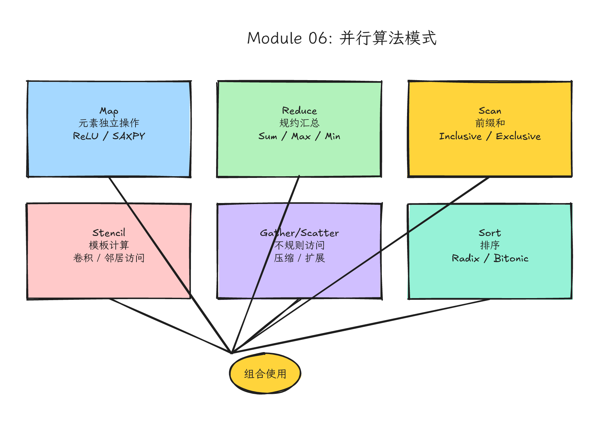
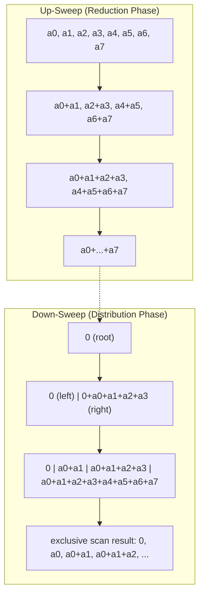
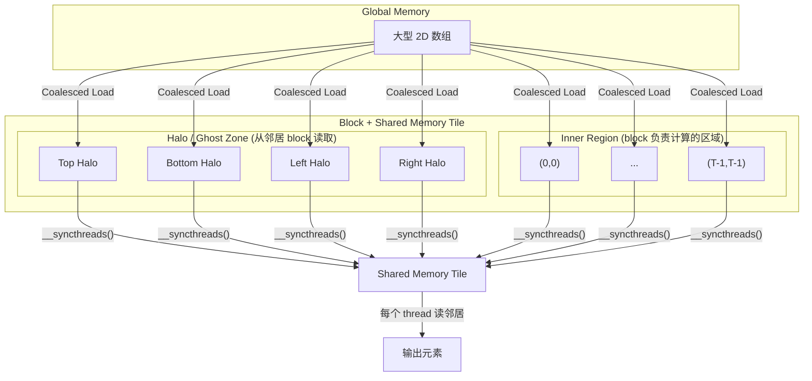
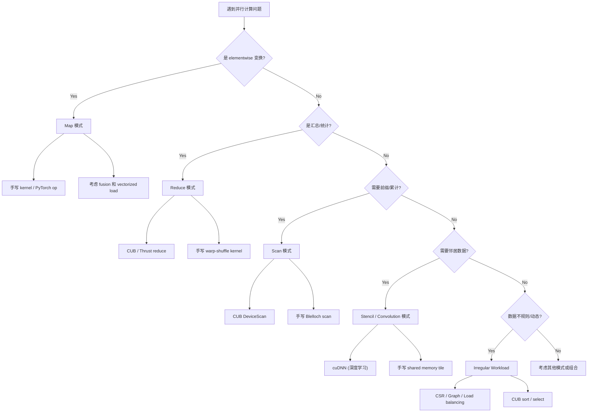

# Module 06: 并行算法模式（Parallel Algorithm Patterns）



*图 06-1：Map、stencil、scan、reduction、histogram 等并行算法模式的结构关系。可编辑源图：[`module-06-parallel-algorithm-patterns.excalidraw`](../diagrams/module-06-parallel-algorithm-patterns.excalidraw)。*

> **Level**: Intermediate to Advanced
> **Estimated time**: 12–18 小时
> **Prerequisites**: Modules 00–05
> **Sources**: NVIDIA CUDA C++ Programming Guide, CCCL/CUB docs, CUDA Samples, GPU Gems, PyTorch ATen, cuDNN docs

---

## 学习目标（Learning Objectives）

完成本模块后，你将能够：

1. **识别模式**：看到并行计算问题时，能将其归类为 map、reduce、scan、stencil、convolution、scatter/gather、sort 或 irregular workload 中的一种或组合。
2. **分析复杂度**：使用 work-depth model 和 Brent's theorem 评估并行算法的理论效率，区分 work-efficient 与 work-inefficient 实现。
3. **手写核心 kernel**：实现包含 ReLU/SAXPY/Clamp 的 Map、tree/sequential/warp-shuffle 版本的 Reduce、Blelloch up-sweep/down-sweep 的 Scan、带 halo 和 shared memory tile 的 2D Stencil、以及展示 weight sharing 和 input tiling 的 1D/2D Convolution。
4. **判断实现层级**：基于问题特征、数据规模、精度要求和维护成本，在「手写 CUDA kernel」「CUB/Thrust 原语」「cuBLAS/cuDNN」「PyTorch/TensorFlow 高层 API」之间做出合理选择。
5. **连接真实系统**：理解 cuDNN 的 convolution 算法选择（implicit GEMM、Winograd、FFT）、PyTorch ATen 中 elementwise kernel 的 dispatch 机制，以及这些底层模式如何在现代深度学习框架中被组织。

---

## 这一课的故事线

你已经能写 kernel、管内存、做 reduction、用 profiler。现在要从「能写代码」升级到「看到问题就识别模式」。专家的习惯是遇到问题先归类，而不是从零开始想。

这节课从理论根基（Brent's theorem、work-depth model）出发，逐个拆解七大并行算法模式，每部分都遵循「问题背景 → 直觉类比 → 硬件机制 → 代码路径 → 真实系统落点」的五层结构。

---

## 类比：工厂流水线的工序卡

想象一个智能工厂，每种并行算法模式就是一张工序卡：

- **Map**：每件产品独立加工，彼此不干扰。1000 件产品需要 1000 个工人同时作业。
- **Reduce**：很多产品汇总成一个或少量结果。1000 件产品的重量需要逐步合并到最终的总重量。
- **Scan**：每个产品需要知道它前面所有产品的累计结果。第 100 个产品要知道前 99 个的累计值。
- **Stencil**：每个产品要看邻居的状态。加工第 100 个产品需要知道第 99 和 101 的状态。
- **Scatter/Gather**：数据位置重排。Gather 是从多个位置收集到一个位置；Scatter 是从一个位置分发到多个位置。
- **Convolution**：滑动窗口做局部加权计算。像质检员拿着一个带权重的模板在传送带上滑动检查。

一句话总结：能独立就 map，要汇总就 reduce，要前缀就 scan，要邻居就 stencil。

---

## 从硬件视角看模式

不同算法模式对硬件的压力不同：

- **Map**：通常容易并行，瓶颈常在 **memory bandwidth**。每个 thread 的 arithmetic intensity 低，如果元素太小（如 int8），kernel launch overhead 可能占主导。
- **Reduce**：需要同步和层级汇总。 intra-block 用 shared memory 和 `__syncthreads()`；inter-block 需要多轮 kernel launch 或 atomic 操作。
- **Scan**：需要更复杂的数据依赖管理。每个位置都需要一个前缀结果，而不只是最后一个总和。Work-efficient 实现需要两趟遍历（up-sweep + down-sweep）。
- **Stencil/Convolution**：有数据重用，shared memory tile 可能减少 global memory 访问。但 halo 区域处理、边界条件、tile 形状会让实现变复杂。
- **Scatter**：可能产生非合并写入（non-coalesced write），对内存子系统压力大。
- **Gather**：可能产生非合并读取（non-coalesced read）。
- **Irregular workload**：造成 warp divergence 和 load imbalance，是 GPU 上最难处理的模式之一。

$O(n)$ 的复杂度在 GPU 上也可能完全不同。

---

## 第一部分：并行算法模式的理论基础

### 1.1 Work-Depth Model（工作量-深度模型）

在并行算法分析中，我们关注两个核心指标：

- **Work ($W$)**：算法执行的总操作数，等价于串行时间复杂度。如果 $W$ 与最优串行算法相同，则称该算法是 **work-efficient**（工作量最优）。
- **Depth ($D$)**：计算依赖链的最长长度，也叫 **span** 或 **critical path**。它决定了在无限多处理器时的理论最短执行时间。

算法的最大并行度（parallelism）为 $W / D$。例如，一个 $W = O(n)$、$D = O(log n)$ 的算法，其并行度为 $O(n / log n)$。

### 1.2 Brent's Theorem

Brent's theorem 回答了「如果有有限个处理器，算法能跑多快」这个问题：

> 给定一个并行算法，其 work 为 $W(n)$，depth 为 $D(n)$。则在 $p$ 个处理器的 PRAM 模型上，运行时间 $T_p$ 满足：
>
> $$T_p(n) \leq \left\lfloor \frac{W(n)}{p} \right\rfloor + D(n)$$
>
> 或等价地：
>
> $$T_p(n) = \frac{T_1(n)}{p} + T_\infty(n)$$
>
> 其中 $T_1$ 是串行时间，$T_\infty$ 是无限处理器时间。

如果每个 thread 只处理一个元素（$p = n$），那么 $W/p = O(1)$，但 depth $D = O(log n)$ 成为瓶颈。Brent's theorem 建议减少线程数到 $O(n / log n)$，让每个线程先做 $O(log n)$ 的串行工作，再参与并行步骤。这被称为 **algorithm cascading**（算法级联），是 CUDA 中 reduction 和 scan 优化的理论依据。

Brent's theorem 基于 PRAM 模型，假设零延迟内存访问、无限带宽、无需显式同步。真实 GPU 上，内存带宽、bank conflict、warp divergence 等都会让实际表现偏离理论。但它仍然为线程粒度和 work 分配提供了重要的设计指导。

### 1.3 常见模式的 Work 与 Depth 对比

| 模式 | 串行 Work | 并行 Work | Depth (Span) | Work-Efficient? |
|------|----------|----------|--------------|-----------------|
| Map | $O(n)$ | $O(n)$ | $O(1)$ | 是 |
| Reduce (tree) | $O(n)$ | $O(n)$ | $O(log n)$ | 是 |
| Scan (Hillis-Steele) | $O(n)$ | $O(n log n)$ | $O(log n)$ | **否** |
| Scan (Blelloch) | $O(n)$ | $O(n)$ | $O(log n)$ | **是** |
| Stencil 1D | $O(n)$ | $O(n)$ | $O(1)$ | 是 |

Hillis-Steele 的 naive scan 之所以 work-inefficient，是因为每一轮都要更新所有 $n$ 个位置，总共 $O(n log n)$ 次操作。而 Blelloch scan 通过两趟遍历（up-sweep 做 reduction，down-sweep 分发前缀和），将总操作数控制在 $O(n)$。

---

## 第二部分：Map 模式 — Elementwise 变换

### 2.1 问题背景

Map 是最简单的并行模式：对每个输入元素独立应用一个函数，产生一个输出元素。

$$y_i = f(x_i)$$

在 CUDA 中，这通常对应一个 thread 处理一个或多个元素。Map 的并行度是完美的：没有数据依赖，没有同步需求。

### 2.2 直觉类比

想象一个印刷厂，1000 页文档需要每页盖一个邮戳。每页的处理完全独立，1000 个工人各拿一页同时盖戳是最优方案。

### 2.3 硬件机制与带宽瓶颈

Map kernel 的典型瓶颈是 **memory bandwidth**（内存带宽）。假设我们做一次简单的 elementwise 加法（如 SAXPY），每个 thread 需要读两个 float、写一个 float，共 12 bytes 的内存访问。如果算术操作只有 1 次乘加（2 FLOPs），那么 arithmetic intensity（每个 byte 的浮点运算数）只有 $2 / 12 \approx 0.17$ FLOPs/byte。

以 NVIDIA A100 的 2039 GB/s 内存带宽为例，理论峰值吞吐为 $2039 \times 0.17 \approx 340$ GFLOPS。这远低于 A100 的 19.5 TFLOPS FP32 算力。因此，**简单 elementwise/map** kernel 通常是 **memory-bound**。如果 map 函数包含大量 transcendental math、复杂分支、查表或多步迭代，则需要重新做 Roofline 分析，不能只按 SAXPY 口径判断。

**优化方向**：
- **Kernel Fusion（算子融合）**：把多个 map 操作合成一个 kernel。例如 `y = alpha * x + y` 的 SAXPY 就是一个融合操作。如果先算 `t = alpha * x` 再算 `y = t + y`，需要两次 global memory 往返。融合后只需一次读 `x`、一次读 `y`、一次写 `y`。
- **Vectorized Load/Store**：使用 `float4` 或 `float2` 让每次内存事务传输更多数据，提高带宽利用率。
- **Avoid Branch Divergence**：如果 map 函数中有分支（如 ReLU 的 `max(0, x)`），所有 thread 走相同路径，不会 divergence。但如果条件是数据相关的（如 `if (x[i] > threshold)` 做不同操作），就会造成 warp divergence。

### 2.4 代码路径：Map 完整实现（含 ReLU、SAXPY、Clamp）

```cpp
// map_patterns.cu
// 编译: nvcc -O3 -o map_patterns map_patterns.cu

#include <cuda_runtime.h>
#include <cuda_runtime_api.h>
#include <iostream>
#include <vector>
#include <cmath>
#include <cstdlib>

// ========== 辅助函数 ==========
#define CHECK_CUDA(call)   do {     cudaError_t err = call;     if (err != cudaSuccess) {       std::cerr << "CUDA error at " << __FILE__ << ":" << __LINE__                 << " " << cudaGetErrorString(err) << "\n";       exit(1);     }   } while(0)

// ========== Kernel 1: ReLU (Rectified Linear Unit) ==========
// 问题背景: 深度学习中最常用的激活函数，负值截断为0
// 硬件机制: 无分支，可用 fmaxf 避免 warp divergence
// 真实落点: PyTorch at::native::relu_kernel_cuda 本质上就是此模式
__global__ void relu_kernel(const float* __restrict__ x,
                             float* __restrict__ y,
                             int n) {
  // 计算全局索引：每个线程处理一个元素
  int i = blockIdx.x * blockDim.x + threadIdx.x;
  
  // 边界检查：超出范围的线程不工作
  if (i < n) {
    // fmaxf 是 intrinsic 函数，通常编译为单条指令，避免显式分支
    y[i] = fmaxf(0.0f, x[i]);
  }
}

// ========== Kernel 2: SAXPY (Single-precision A*X Plus Y) ==========
// 问题背景: BLAS Level 1 基本操作，y = alpha * x + y
// 硬件机制: 两次读取，一次乘加，一次写回。内存带宽是瓶颈。
// 真实落点: cuBLAS cublasSaxpy，但手写允许融合更多操作
__global__ void saxpy_kernel(const float* __restrict__ x,
                              float* __restrict__ y,
                              int n,
                              float alpha) {
  int i = blockIdx.x * blockDim.x + threadIdx.x;
  
  if (i < n) {
    // FMA (Fused Multiply-Add) 指令: y[i] = alpha * x[i] + y[i]
    // 编译器通常能自动将 a*b+c 转换为单条 FMA 指令
    y[i] = fmaf(alpha, x[i], y[i]);
  }
}

// ========== Kernel 3: Clamp (限制值在 [min_val, max_val] 范围) ==========
// 问题背景: 图像处理、量化中常见操作，裁剪异常值
// 硬件机制: 两个 fmaxf/fminf，无分支，完全 SIMD 友好
__global__ void clamp_kernel(const float* __restrict__ x,
                              float* __restrict__ y,
                              int n,
                              float min_val,
                              float max_val) {
  int i = blockIdx.x * blockDim.x + threadIdx.x;
  
  if (i < n) {
    // 先与 max_val 取最小，再与 min_val 取最大
    // 等价于: y[i] = min(max(x[i], min_val), max_val)
    float v = x[i];
    v = fmaxf(v, min_val);  // 不低于 min_val
    v = fminf(v, max_val);  // 不高于 max_val
    y[i] = v;
  }
}

// ========== Kernel 4: 向量化的 Map (float4) ==========
// 问题背景: 对对齐的数组使用 SIMD 宽加载，减少内存事务数
// 硬件机制: 一次 float4 加载读取 16 字节，4 倍于 float 的带宽效率
__global__ void relu_float4_kernel(const float4* __restrict__ x,
                                    float4* __restrict__ y,
                                    int n4) {
  int i = blockIdx.x * blockDim.x + threadIdx.x;
  
  if (i < n4) {
    float4 v = x[i];  // 宽加载: 16 字节一次事务
    v.x = fmaxf(0.0f, v.x);
    v.y = fmaxf(0.0f, v.y);
    v.z = fmaxf(0.0f, v.z);
    v.w = fmaxf(0.0f, v.w);
    y[i] = v;  // 宽存储: 16 字节一次事务
  }
}

// ========== Host 调用包装器 ==========
void run_map_examples(int n) {
  std::vector<float> h_x(n), h_y(n);
  for (int i = 0; i < n; ++i) h_x[i] = (float)(i - n/2) * 0.01f;
  
  float *d_x, *d_y;
  CHECK_CUDA(cudaMalloc(&d_x, n * sizeof(float)));
  CHECK_CUDA(cudaMalloc(&d_y, n * sizeof(float)));
  CHECK_CUDA(cudaMemcpy(d_x, h_x.data(), n * sizeof(float), cudaMemcpyHostToDevice));
  
  int block = 256;
  int grid = (n + block - 1) / block;
  
  // ReLU
  relu_kernel<<<grid, block>>>(d_x, d_y, n);
  CHECK_CUDA(cudaMemcpy(h_y.data(), d_y, n * sizeof(float), cudaMemcpyDeviceToHost));
  std::cout << "ReLU example: x[0]=" << h_x[0] << " -> y[0]=" << h_y[0] << "\n";
  
  // SAXPY
  CHECK_CUDA(cudaMemcpy(d_y, h_x.data(), n * sizeof(float), cudaMemcpyHostToDevice));
  saxpy_kernel<<<grid, block>>>(d_x, d_y, n, 2.0f);
  CHECK_CUDA(cudaMemcpy(h_y.data(), d_y, n * sizeof(float), cudaMemcpyDeviceToHost));
  std::cout << "SAXPY example: 2*x[1]+x[1]=" << h_y[1] << "\n";
  
  // Clamp
  clamp_kernel<<<grid, block>>>(d_x, d_y, n, -1.0f, 1.0f);
  CHECK_CUDA(cudaMemcpy(h_y.data(), d_y, n * sizeof(float), cudaMemcpyDeviceToHost));
  std::cout << "Clamp example: x[100]=" << h_x[100] << " -> y[100]=" << h_y[100] << "\n";
  
  // float4 ReLU (要求 n 是 4 的倍数)
  if (n % 4 == 0) {
    int n4 = n / 4;
    int grid4 = (n4 + block - 1) / block;
    relu_float4_kernel<<<grid4, block>>>((float4*)d_x, (float4*)d_y, n4);
    CHECK_CUDA(cudaDeviceSynchronize());
    std::cout << "float4 ReLU completed\n";
  }
  
  cudaFree(d_x);
  cudaFree(d_y);
}

int main() {
  run_map_examples(1 << 20);  // 1M 元素
  return 0;
}
```

### 2.5 真实系统落点：PyTorch ATen 的 Elementwise Kernel

PyTorch 的 ATen 库中，所有 elementwise 操作（如 `torch.relu`、`torch.add`）都通过统一的 `gpu_kernel` 机制派发。核心代码在 `aten/src/ATen/native/cuda/Loops.cuh` 中：

```cpp
template<int nt, int vt, typename func_t>
__global__ void elementwise_kernel(int N, func_t f) {
  int tid = threadIdx.x;
  int nv = nt * vt;
  int idx = nv * blockIdx.x + tid;
  #pragma unroll
  for (int i = 0; i < vt; i++) {
    if (idx < N) {
      f(idx);  // 调用 lambda，里面是具体的 elementwise 操作
      idx += nt;
    }
  }
}
```

PyTorch 的很多 elementwise kernel 使用 `TensorIterator` 处理广播（broadcasting）和类型提升（type promotion），并在满足对齐、连续性和 dtype 条件时选择 vectorized（向量化）路径。对于 contiguous 的张量，底层可能用 `vectorized_elementwise_kernel` 或类似的 aligned vector load/store，一次处理多个标量元素；实际 vector width 取决于 dtype、对齐、张量布局和当前 PyTorch/CUDA 后端实现，不应把它写成固定 `float4` 或某个具体宽度。这是工业界 Map 模式的实际实现方式：一个通用 dispatch 框架，自动处理类型、广播和向量化。

---

## 第三部分：Reduce 模式 — 归约与汇总

### 3.1 问题背景

Reduce 把 $n$ 个输入通过二元结合操作汇总为一个或少量结果。

$$result = x_0 \oplus x_1 \oplus x_2 \oplus ... \oplus x_{n-1}$$

其中 $\oplus$ 必须是 **associative**（结合律）操作。常见的有：
- Sum: $a + b$
- Max: $max(a, b)$
- Min: $min(a, b)$
- Bitwise AND/OR/XOR
- Product: $a \times b$（注意浮点 product 的精度问题）

Reduce 的 operator 必须在你关心的语义下尽量满足 **associative**：$(a \oplus b) \oplus c = a \oplus (b \oplus c)$。GPU 的并行树形归约会改变运算顺序；整数加法、max/min、bitwise 运算通常更容易获得确定语义。实数加法在数学上满足结合律，但 IEEE 浮点加法因为舍入误差并不满足严格结合律，$(a+b)+c$ 可能不等于 $a+(b+c)$。这是 GPU 并行 reduce 与 CPU 串行 reduce 结果略有差异的原因。

### 3.2 直觉类比

想象 1024 个人围成一圈，每人手持一个数字。通过两两配对、每轮人数减半，最终剩下一个拿着总和的人。这就是树形归约。

### 3.3 硬件机制：从 Naive 到 Optimized

Reduce 在 GPU 上的优化是经典案例。以 Mark Harris 的 CUDA reduction 优化系列为例：

| 版本 | 策略 | 4M 元素带宽 | 加速比 |
|------|------|------------|--------|
| Kernel 1 | Interleaved addressing + divergent branching | 2.08 GB/s | 1x |
| Kernel 2 | Interleaved addressing + bank conflicts | 4.85 GB/s | 2.33x |
| Kernel 3 | Sequential addressing | 9.74 GB/s | 4.68x |
| Kernel 4 | First add during global load | 17.38 GB/s | 8.34x |
| Kernel 5 | Unroll last warp | 31.29 GB/s | 15.0x |
| Kernel 6 | Completely unrolled + warp shuffle | 43.99 GB/s | 21.1x |

> 这组数字来自早期 CUDA reduction 教学材料的实验口径，用来说明优化方向，不代表现代 GPU 的绝对带宽或固定加速比。课程实验必须在自己的 GPU、Toolkit 和输入规模上重测。

**优化要点**：
1. **Sequential addressing**：避免 bank conflict，使用相邻线程访问相邻地址。
2. **Multiple elements per thread**：根据 Brent's theorem，让每个 thread 先串行处理多个元素，减少总线程数，降低调度开销。
3. **Warp shuffle (Kepler+)**：使用 `__shfl_down_sync` 在 warp 内交换数据，不需要 shared memory 和 `__syncthreads()`，大幅降低延迟。
4. **Template unrolling**：通过模板参数编译期展开循环，消除分支。

### 3.4 代码路径：Reduce 多版本实现

```cpp
// reduce_patterns.cu
// 编译: nvcc -O3 -arch=sm_70 -o reduce_patterns reduce_patterns.cu

#include <cuda_runtime.h>
#include <iostream>
#include <vector>
#include <cmath>
#include <cstdlib>

#define CHECK_CUDA(call)   do {     cudaError_t err = call;     if (err != cudaSuccess) {       std::cerr << "CUDA error: " << cudaGetErrorString(err) << "\n";       exit(1);     }   } while(0)

// ========== Kernel 1: Tree-based Shared Memory Reduce (Sum) ==========
// 使用 shared memory 做树形归约
// 每个 block 产生一个 partial sum
__global__ void reduce_tree_sum(const float* __restrict__ input,
                                  float* __restrict__ output,
                                  int n) {
  // 动态分配 shared memory，大小由 launch 参数决定
  extern __shared__ float sdata[];
  
  int tid = threadIdx.x;
  int i = blockIdx.x * blockDim.x * 2 + threadIdx.x;
  
  // 每个 thread 加载一个元素（如果数据够），否则置 0
  float val = 0.0f;
  if (i < n) val = input[i];
  // 让线程多做一个加法，减少一半 block 数（Brent's theorem）
  if (i + blockDim.x < n) val += input[i + blockDim.x];
  
  sdata[tid] = val;
  __syncthreads();
  
  // 树形归约：从 stride = blockDim.x/2 开始，每次减半
  for (int s = blockDim.x / 2; s > 0; s >>= 1) {
    if (tid < s) {
      sdata[tid] += sdata[tid + s];
    }
    __syncthreads();  // 每轮必须同步，确保所有写完成
  }
  
  // block 的 thread 0 把结果写入全局内存
  if (tid == 0) output[blockIdx.x] = sdata[0];
}

// ========== Kernel 2: Warp Shuffle Reduce (Kepler+，推荐) ==========
// 使用 __shfl_down_sync 在 warp 内直接交换数据，无需 shared memory
// 这是现代 GPU 上最高效的 reduce 方式之一
__inline__ __device__ float warp_reduce_sum(float val) {
  // 在 warp 内做树形归约，mask = 0xFFFFFFFF 表示所有 32 线程参与
  for (int offset = 16; offset > 0; offset /= 2) {
    val += __shfl_down_sync(0xFFFFFFFF, val, offset);
  }
  return val;
}

__global__ void reduce_shuffle_sum(const float* __restrict__ input,
                                    float* __restrict__ output,
                                    int n) {
  int tid = threadIdx.x;
  int gid = blockIdx.x * blockDim.x + threadIdx.x;
  int gridSize = blockDim.x * gridDim.x * 2;
  
  // 每个 thread 串行处理多个元素（Brent's theorem / algorithm cascading）
  float sum = 0.0f;
  int i = gid;
  while (i < n) {
    sum += input[i];
    if (i + gridSize / 2 < n) sum += input[i + gridSize / 2];
    i += gridSize;  // stride 到下一个要处理的元素
  }
  
  // 教学版假设 blockDim.x 是 32 的整数倍；否则需要用 ballot mask
  // 处理最后一个 partial warp，不能直接用 0xFFFFFFFF。
  int lane = tid % 32;
  int warp_id = tid / 32;
  int num_warps = blockDim.x / 32;

  // Step 1: 每个 warp 先在寄存器内完成局部规约
  sum = warp_reduce_sum(sum);

  // Step 2: 每个 warp 的 lane 0 写出该 warp 的 partial sum
  extern __shared__ float shared[];
  if (lane == 0) {
    shared[warp_id] = sum;
  }
  __syncthreads();

  // Step 3: 第一个 warp 合并所有 warp 的 partial sum
  if (warp_id == 0) {
    float val = (lane < num_warps) ? shared[lane] : 0.0f;
    val = warp_reduce_sum(val);
    if (lane == 0) output[blockIdx.x] = val;
  }
}

// ========== Kernel 3: 多轮 Reduce (处理任意大数组) ==========
// 真实场景：数组可能比单 block 能处理的大得多
// 策略：每轮把 current_n 个输入压缩成 numBlocks 个 partial sums，
//      直到只剩 1 个结果。不能只做固定两轮，否则大输入会漏掉 partial sums。
float reduce_full(const float* d_input, int n) {
  if (n <= 0) return 0.0f;
  if (n == 1) {
    float only = 0.0f;
    CHECK_CUDA(cudaMemcpy(&only, d_input, sizeof(float), cudaMemcpyDeviceToHost));
    return only;
  }

  const int blockSize = 256;
  const size_t smem = (blockSize / 32) * sizeof(float);
  int current_n = n;
  float* d_current = nullptr;  // 上一轮 partial sums；第一轮直接读 d_input

  while (current_n > 1) {
    int numBlocks = (current_n + blockSize * 2 - 1) / (blockSize * 2);
    float* d_next = nullptr;
    CHECK_CUDA(cudaMalloc(&d_next, numBlocks * sizeof(float)));

    const float* d_src = d_current ? d_current : d_input;
    reduce_shuffle_sum<<<numBlocks, blockSize, smem>>>(d_src, d_next, current_n);
    CHECK_CUDA(cudaGetLastError());

    if (d_current) CHECK_CUDA(cudaFree(d_current));
    d_current = d_next;
    current_n = numBlocks;
  }

  float result = 0.0f;
  CHECK_CUDA(cudaMemcpy(&result, d_current, sizeof(float), cudaMemcpyDeviceToHost));
  CHECK_CUDA(cudaFree(d_current));
  return result;
}

// ========== Max Reduce 示例 (展示不同结合律操作) ==========
__inline__ __device__ float warp_reduce_max(float val) {
  for (int offset = 16; offset > 0; offset /= 2) {
    val = fmaxf(val, __shfl_down_sync(0xFFFFFFFF, val, offset));
  }
  return val;
}

__global__ void reduce_max_kernel(const float* __restrict__ input,
                                   float* __restrict__ output,
                                   int n) {
  int tid = threadIdx.x;
  int gid = blockIdx.x * blockDim.x + threadIdx.x;
  
  float mx = -INFINITY;
  int i = gid;
  while (i < n) {
    mx = fmaxf(mx, input[i]);
    i += blockDim.x * gridDim.x;
  }
  
  int lane = tid % 32;
  int warp_id = tid / 32;
  int num_warps = blockDim.x / 32;

  mx = warp_reduce_max(mx);

  extern __shared__ float shared[];
  if (lane == 0) {
    shared[warp_id] = mx;
  }
  __syncthreads();
  
  if (warp_id == 0) {
    float val = (lane < num_warps) ? shared[lane] : -INFINITY;
    val = warp_reduce_max(val);
    if (lane == 0) output[blockIdx.x] = val;
  }
}

float reduce_max_full(const float* d_input, int n) {
  if (n <= 0) return -INFINITY;
  if (n == 1) {
    float only = -INFINITY;
    CHECK_CUDA(cudaMemcpy(&only, d_input, sizeof(float), cudaMemcpyDeviceToHost));
    return only;
  }

  const int blockSize = 256;
  const size_t smem = (blockSize / 32) * sizeof(float);
  int current_n = n;
  float* d_current = nullptr;

  while (current_n > 1) {
    int numBlocks = (current_n + blockSize - 1) / blockSize;
    float* d_next = nullptr;
    CHECK_CUDA(cudaMalloc(&d_next, numBlocks * sizeof(float)));

    const float* d_src = d_current ? d_current : d_input;
    reduce_max_kernel<<<numBlocks, blockSize, smem>>>(d_src, d_next, current_n);
    CHECK_CUDA(cudaGetLastError());

    if (d_current) CHECK_CUDA(cudaFree(d_current));
    d_current = d_next;
    current_n = numBlocks;
  }

  float result = -INFINITY;
  CHECK_CUDA(cudaMemcpy(&result, d_current, sizeof(float), cudaMemcpyDeviceToHost));
  CHECK_CUDA(cudaFree(d_current));
  return result;
}

// ========== Host 测试 ==========
int main() {
  int n = 1 << 24;  // 16M 元素
  std::vector<float> h_input(n);
  for (int i = 0; i < n; ++i) h_input[i] = 1.0f;  // 期望 sum = n
  
  float *d_input;
  CHECK_CUDA(cudaMalloc(&d_input, n * sizeof(float)));
  CHECK_CUDA(cudaMemcpy(d_input, h_input.data(), n * sizeof(float), cudaMemcpyHostToDevice));
  
  float result = reduce_full(d_input, n);
  std::cout << "Reduce sum of " << n << " ones = " << result << " (expected " << n << ")\n";
  
  // Max reduce 测试：同样必须多轮规约，不能让多个 block 写入单个 float。
  float h_max = reduce_max_full(d_input, n);
  std::cout << "Max value = " << h_max << " (expected 1)\n";
  
  cudaFree(d_input);
  return 0;
}
```

### 3.5 浮点精度问题

GPU 并行 reduce 的加法顺序与 CPU 串行不同。CPU 从左到右加，GPU 按树形结构加。由于浮点加法的非结合性，最终结果可能有微小差异（通常在 $10^{-6}$ 相对误差范围内）。对于需要 bit-exact reproducibility 的场景（如科学计算验证），应使用：
- **Kahan summation** 在 CUDA 中的实现（更高精度但更高开销）
- 固定顺序的 reduce（如 sequential block-level + single-block tree）
- 使用 double 精度

---

## 第四部分：Scan 模式 — 前缀和

### 4.1 问题背景

Scan（Prefix Sum）是并行计算的基础原语。给定输入 $[x_0, x_1, ..., x_{n-1}]$，输出 $[y_0, y_1, ..., y_{n-1}]$，其中：

- **Inclusive scan**：$y_i = x_0 + x_1 + ... + x_i$
- **Exclusive scan**：$y_i = x_0 + x_1 + ... + x_{i-1}$（定义 $y_0 = 0$）

Scan 的应用包括：stream compaction、radix sort、segmented operations、range queries、load balancing 等。

### 4.2 直觉类比

想象一排人，每人手里有一笔钱。每个人都要报出「从第一个人到自己为止的累计金额」。直接用树形结构：先算出某些区间的总和，再分发下去，就能并行化。

### 4.3 硬件机制：Hillis-Steele vs Blelloch

| 算法 | Work | Depth | 特点 |
|------|------|-------|------|
| Hillis-Steele | $O(n log n)$ | $O(log n)$ | 简单直观，但 work-inefficient |
| Blelloch (Tree) | $O(n)$ | $O(log n)$ | 两阶段，work-efficient，推荐 |
| Ladner-Fischer | $O(n)$ | $O(log n)$ | 步骤更少，in-place |

Hillis-Steele 的 naive 实现每轮更新所有 $n$ 个位置，总共 $O(n log n)$ 操作。对于 $n=10^6$ 的数组，它比串行版本多做约 20 倍的工作，在 GPU 上效率很低。

**Blelloch Scan 的两阶段思想**：

1. **Up-sweep (Reduction Phase)**：从叶子到根，构建一棵求和树。每一层将相邻元素两两相加，最终根节点保存总和。这类似于 reduce，但保留了中间节点的部分和。
2. **Down-sweep (Distribution Phase)**：从根到叶子，分发前缀和。根节点初始化为 0（exclusive scan），然后每个节点把自己的值传给左孩子，把自己的值加上左孩子的原值传给右孩子。这样左孩子得到的是「左子树之前所有元素的和」，右孩子得到的是「当前节点值 + 左子树总和 = 左子树之前所有元素的和」。

Blelloch scan 的总操作数是 $2(n-1)$ 次 add 和 $n-1$ 次 swap，即 $O(n)$ work，$O(log n)$ depth，是 work-efficient 的。

### 4.4 Mermaid 图：Scan 树形结构（Blelloch Algorithm）



### 4.5 代码路径：Blelloch Scan 完整实现

```cpp
// scan_blelloch.cu
// 编译: nvcc -O3 -arch=sm_70 -o scan_blelloch scan_blelloch.cu

#include <cuda_runtime.h>
#include <iostream>
#include <vector>
#include <cmath>
#include <cstdlib>

#define CHECK_CUDA(call)   do {     cudaError_t err = call;     if (err != cudaSuccess) {       std::cerr << "CUDA error: " << cudaGetErrorString(err) << "\n";       exit(1);     }   } while(0)

// 必须处理到 2 的幂次，非 2 幂次需要 padding
#define SECTION_SIZE 1024  // 每个 block 处理的元素数

// ========== Kernel: Blelloch Exclusive Scan (Single Block) ==========
// 输入: n <= SECTION_SIZE；SECTION_SIZE 是 2 的幂
// 输出: 该段的 exclusive scan 结果
// 限制: 此实现只处理单 block，大数组需要 multi-block 策略
__global__ void blelloch_scan_kernel(float* d_out, const float* d_in, int n) {
  // 使用共享内存作为临时工作区，in-place 构建扫描树
  __shared__ float temp[SECTION_SIZE];
  
  int tid = threadIdx.x;
  
  // Phase 1: 加载数据，不足 SECTION_SIZE 的位置 padding 为 0
  temp[tid] = (tid < n) ? d_in[tid] : 0.0f;
  
  // 等待所有数据加载完成
  __syncthreads();
  
  // Phase 2: Up-Sweep (Reduction Phase)
  // 从叶子到根，构建部分和树。index 是当前子树的右端点。
  for (int offset = 1; offset < SECTION_SIZE; offset <<= 1) {
    int index = (tid + 1) * offset * 2 - 1;
    if (index < SECTION_SIZE) {
      temp[index] += temp[index - offset];
    }
    __syncthreads();
  }
  
  // 根节点（最后一个元素）在 exclusive scan 中应设为 0
  if (tid == 0) {
    temp[SECTION_SIZE - 1] = 0.0f;
  }
  
  __syncthreads();
  
  // Phase 3: Down-Sweep (Distribution Phase)
  // 从根到叶子，分发前缀和
  // 交换父子值，然后右子 += 父值
  for (int offset = SECTION_SIZE >> 1; offset > 0; offset >>= 1) {
    int index = (tid + 1) * offset * 2 - 1;
    if (index < SECTION_SIZE) {
      float t = temp[index - offset];
      temp[index - offset] = temp[index];  // 父值下移给左子树
      temp[index] += t;                    // 右子树加上原左子树和
    }
    __syncthreads();
  }
  
  // Phase 4: 写回结果
  if (tid < n) {
    d_out[tid] = temp[tid];
  }
}

// ========== Multi-Block Scan 策略概述 ==========
// 对于大数组（n > SECTION_SIZE），需要以下步骤：
// 1. 将数组分成多个段（segment），每段大小 = SECTION_SIZE
// 2. 对每个段并行做 Blelloch scan（段内正确，段间未累加前面段的和）
// 3. 提取每个段的最后一个元素（即该段的 sum），存入 auxiliary 数组
// 4. 对 auxiliary 数组做 scan，得到每个段需要累加的「段间偏移」
// 5. 将段间偏移加到对应段的每个元素上（add-offset kernel）
// 这本质上是一个递归或两阶段策略，CUB DeviceScan 内部实现类似此逻辑。

// ========== Host 测试 ==========
int main() {
  int n = SECTION_SIZE;  // 先用 2 的幂次测试
  std::vector<float> h_in(n), h_out(n);
  for (int i = 0; i < n; ++i) h_in[i] = 1.0f;  // 期望 exclusive scan: 0,1,2,3,...,n-1
  
  float *d_in, *d_out;
  CHECK_CUDA(cudaMalloc(&d_in, n * sizeof(float)));
  CHECK_CUDA(cudaMalloc(&d_out, n * sizeof(float)));
  CHECK_CUDA(cudaMemcpy(d_in, h_in.data(), n * sizeof(float), cudaMemcpyHostToDevice));
  
  // 启动单 block scan
  blelloch_scan_kernel<<<1, SECTION_SIZE>>>(d_out, d_in, n);
  CHECK_CUDA(cudaDeviceSynchronize());
  
  CHECK_CUDA(cudaMemcpy(h_out.data(), d_out, n * sizeof(float), cudaMemcpyDeviceToHost));
  
  std::cout << "Blelloch exclusive scan test:\n";
  std::cout << "in[0..4] = " << h_in[0] << ", " << h_in[1] << ", " << h_in[2] << "\n";
  std::cout << "out[0..4] = " << h_out[0] << ", " << h_out[1] << ", " << h_out[2] << ", " << h_out[3] << ", " << h_out[4] << "\n";
  std::cout << "Expected: 0, 1, 2, 3, 4\n";
  
  // 验证
  bool ok = true;
  for (int i = 0; i < n; ++i) {
    if (std::abs(h_out[i] - (float)i) > 1e-4) {
      ok = false;
      break;
    }
  }
  std::cout << "Verification: " << (ok ? "PASSED" : "FAILED") << "\n";
  
  cudaFree(d_in);
  cudaFree(d_out);
  return 0;
}
```

### 4.6 Segmented Scan

Segmented Scan 是 Scan 的变体，用于「多个独立段」的前缀和。例如，矩阵每行单独做前缀和，或者字符串处理中对每个 token 单独做操作。

CUB 提供了 `DeviceSegmentedScan::ExclusiveSegmentedScan`，支持通过 `offsets` 数组指定每段的起止位置。它的 API 语义是“各段独立 scan”，但内部实现会随 CUB/CUDA 版本、段长度分布和输入规模选择不同的分块与调度策略，不能简单写成“每个 block 负责一个段”。在 Transformer 中，Segmented Scan 可用于处理变长序列（如不同长度的句子拼接后的 attention mask 计算）。

---

## 第五部分：Stencil 模式 — 邻域计算

### 5.1 问题背景

Stencil 模式中，每个输出元素依赖于输入中固定邻域的元素。1D 例子：

$$out[i] = a \cdot x[i-1] + b \cdot x[i] + c \cdot x[i+1]$$

这天然产生数据重用：相邻 threads 会读取重叠的输入数据。Stencil 的维度可以从 1D 扩展到 2D（图像滤波、PDE 求解）和 3D（体渲染、天气模拟）。

### 5.2 直觉类比

想象一个教室，每个学生的成绩由自己、左边和右边同学的平均分决定。要计算所有学生的新成绩，如果每个学生都去教务处查三次成绩，教务处会被挤爆。更好的方法是：把一整排学生的成绩先抄到黑板（shared memory）上，然后每个学生只看黑板上的邻居。

### 5.3 硬件机制：Halo 与 Shared Memory Tile

Stencil 的核心挑战是边界条件和数据重用。以 1D 为例，block 大小为 256 时，边界 thread（如 thread 0）需要读取 `x[-1]`，超出数组范围。处理策略：

- **Dirichlet 边界**：固定值（如 0）填充越界区域。
- **Neumann 边界**：用最近的边界值复制填充（`x[-1] = x[0]`）。
- **Periodic 边界**：循环回绕（`x[-1] = x[n-1]`）。

在 GPU 上，相邻 block 的 threads 会重复读取重叠的 halo 区域。使用 **shared memory tile** 可以显著减少 global memory 访问：
1. 每个 block 将自己的数据块加载到 shared memory（包括 halo）。
2. 用 `__syncthreads()` 保证所有加载完成。
3. 每个 thread 从 shared memory 读取邻居计算输出。

### 5.4 Mermaid 图：2D Stencil 的 Halo 区域



### 5.5 代码路径：2D Stencil 含 Halo 和 Shared Memory Tile

```cpp
// stencil_2d.cu
// 编译: nvcc -O3 -arch=sm_70 -o stencil_2d stencil_2d.cu

#include <cuda_runtime.h>
#include <iostream>
#include <vector>
#include <cstdlib>

#define CHECK_CUDA(call)   do {     cudaError_t err = call;     if (err != cudaSuccess) {       std::cerr << "CUDA error: " << cudaGetErrorString(err) << "\n";       exit(1);     }   } while(0)

// 2D Stencil 参数
#define RADIUS 1           // 邻居半径（1 表示 3x3 窗口）
#define TILE_X 16          // 每个 block 在 X 方向处理的内点数量
#define TILE_Y 16          // 每个 block 在 Y 方向处理的内点数量

// Shared memory tile 大小：内点 + 两侧 halo
#define SHMEM_X (TILE_X + 2 * RADIUS)
#define SHMEM_Y (TILE_Y + 2 * RADIUS)

// ========== Kernel: 2D Stencil with Shared Memory ==========
// 问题背景: 5-point Laplacian stencil（上下左右 + 中心）
// 硬件机制: 将 TILE_X * TILE_Y 的内点和 halo 加载到 shared memory
// 边界条件: Dirichlet（越界处用 0）
__global__ void stencil2d_shared(const float* __restrict__ input,
                                  float* __restrict__ output,
                                  int width, int height) {
  // 分配 2D shared memory tile
  __shared__ float tile[SHMEM_Y][SHMEM_X];
  
  // 全局坐标：该 thread 负责的输出元素位置
  int gx = blockIdx.x * TILE_X + threadIdx.x;
  int gy = blockIdx.y * TILE_Y + threadIdx.y;
  
  // Shared memory 中的坐标：包含 halo 偏移
  int sx = threadIdx.x + RADIUS;
  int sy = threadIdx.y + RADIUS;
  
  // Step 1: 加载内点数据到 shared memory
  if (gx < width && gy < height) {
    tile[sy][sx] = input[gy * width + gx];
  } else {
    tile[sy][sx] = 0.0f;  // 越界填充 0
  }
  
  // Step 2: 加载 halo 数据（由边界 thread 负责）
  // 左 halo
  if (threadIdx.x < RADIUS) {
    int load_gx = gx - RADIUS;
    int load_gy = gy;
    if (load_gx >= 0 && load_gy < height) {
      tile[sy][sx - RADIUS] = input[load_gy * width + load_gx];
    } else {
      tile[sy][sx - RADIUS] = 0.0f;
    }
  }
  // 右 halo
  if (threadIdx.x >= TILE_X - RADIUS) {
    int load_gx = gx + RADIUS;
    int load_gy = gy;
    if (load_gx < width && load_gy < height) {
      tile[sy][sx + RADIUS] = input[load_gy * width + load_gx];
    } else {
      tile[sy][sx + RADIUS] = 0.0f;
    }
  }
  // 上 halo
  if (threadIdx.y < RADIUS) {
    int load_gx = gx;
    int load_gy = gy - RADIUS;
    if (load_gy >= 0 && load_gx < width) {
      tile[sy - RADIUS][sx] = input[load_gy * width + load_gx];
    } else {
      tile[sy - RADIUS][sx] = 0.0f;
    }
  }
  // 下 halo
  if (threadIdx.y >= TILE_Y - RADIUS) {
    int load_gx = gx;
    int load_gy = gy + RADIUS;
    if (load_gy < height && load_gx < width) {
      tile[sy + RADIUS][sx] = input[load_gy * width + load_gx];
    } else {
      tile[sy + RADIUS][sx] = 0.0f;
    }
  }
  
  // Step 3: 等待所有数据加载完成（至关重要！）
  __syncthreads();
  
  // Step 4: 计算 stencil（5-point Laplacian）
  // output = 4*center - top - bottom - left - right
  if (gx < width && gy < height) {
    float center = tile[sy][sx];
    float top    = tile[sy - 1][sx];
    float bottom = tile[sy + 1][sx];
    float left   = tile[sy][sx - 1];
    float right  = tile[sy][sx + 1];
    output[gy * width + gx] = 4.0f * center - top - bottom - left - right;
  }
}

// ========== Host 测试 ==========
int main() {
  int width = 512, height = 512;
  int n = width * height;
  
  std::vector<float> h_input(n), h_output(n);
  for (int i = 0; i < n; ++i) h_input[i] = (float)(i % 256) / 256.0f;
  
  float *d_input, *d_output;
  CHECK_CUDA(cudaMalloc(&d_input, n * sizeof(float)));
  CHECK_CUDA(cudaMalloc(&d_output, n * sizeof(float)));
  CHECK_CUDA(cudaMemcpy(d_input, h_input.data(), n * sizeof(float), cudaMemcpyHostToDevice));
  
  dim3 block(TILE_X, TILE_Y);
  dim3 grid((width + TILE_X - 1) / TILE_X, (height + TILE_Y - 1) / TILE_Y);
  
  stencil2d_shared<<<grid, block>>>(d_input, d_output, width, height);
  CHECK_CUDA(cudaDeviceSynchronize());
  
  CHECK_CUDA(cudaMemcpy(h_output.data(), d_output, n * sizeof(float), cudaMemcpyDeviceToHost));
  
  std::cout << "2D Stencil test: output[0]=" << h_output[0] 
            << ", output[center]=" << h_output[height/2 * width + width/2] << "\n";
  
  cudaFree(d_input);
  cudaFree(d_output);
  return 0;
}
```

### 5.6 Register Tiling 简介

Shared memory tile 的一个进阶方向是 **register tiling**。在更高维度的 stencil（如 3D 天气模拟）或更大 radius 的 stencil 中，每个 thread 可以负责计算多个输出点，将更多数据驻留在寄存器中。这减少了 shared memory 使用，提高了 occupancy，但增加了寄存器压力和代码复杂度。例如，一个 thread 负责 $2\times2$ 的输出块，需要从 shared memory 加载 $4\times4$ 的输入窗口，计算 4 个输出。这种技术在高性能 stencil 库（如 PSkel、OpenACC）中经常使用。

---

## 第六部分：Convolution 模式 — 卷积与滑动窗口

### 6.1 问题背景

Convolution 是 Stencil 的推广，每个输出元素是输入窗口与一组权重（filter/kernel）的加权平均。1D 卷积：

$$out[i] = \sum_{j=-R}^{R} weight[j] \cdot in[i + j]$$

2D 卷积是图像处理和深度学习的核心操作：

$$out[y][x] = \sum_{ky=0}^{KH-1} \sum_{kx=0}^{KW-1} weight[ky][kx] \cdot in[y + ky][x + kx]$$

### 6.2 直觉类比

想象一个质检员拿着一个放大镜（filter）在照片（input）上滑动。放大镜的每个位置都有不同权重（比如中心更重，边缘更轻），质检员每滑到一个位置就计算一次加权平均，生成输出图像的一个像素。

### 6.3 硬件机制：Weight Sharing 与 Input Tiling

Convolution 在 GPU 上有三种主流实现策略：

1. **Implicit GEMM**：将卷积转换为矩阵乘法，但不显式构造展开矩阵。它是 cuDNN/CUTLASS 卷积实现中的重要家族之一，常用于通用卷积路径；是否被选中取决于输入形状、dtype、layout、workspace、determinism 要求和当前 cuDNN 版本。每个 thread block 负责输出 tile，通过 on-the-fly 展开输入数据实现。优点是内存占用小，通用性强。

2. **Winograd**：基于 Winograd 最小滤波算法，将卷积中的乘法次数减少，但增加加法次数。适用于小卷积核（如 $3\times3$、$5\times5$），在深度学习推理中非常高效。cuDNN 在合适条件下自动选择此算法。

3. **FFT-based**：对输入和滤波器做 FFT，频域相乘后逆 FFT。当卷积核较大（如 $7\times7$ 以上）时，FFT 的 $O(n log n)$ 复杂度优于直接卷积的 $O(n \cdot k^2)$。缺点是内存占用大，且需要处理 padding 和 strides 的复杂性。

### 6.4 代码路径：1D/2D Convolution

```cpp
// convolution_gpu.cu
// 编译: nvcc -O3 -arch=sm_70 -o convolution_gpu convolution_gpu.cu

#include <cuda_runtime.h>
#include <iostream>
#include <vector>
#include <cstdlib>

#define CHECK_CUDA(call)   do {     cudaError_t err = call;     if (err != cudaSuccess) {       std::cerr << "CUDA error: " << cudaGetErrorString(err) << "\n";       exit(1);     }   } while(0)

#define FILTER_RADIUS 2
#define FILTER_SIZE (2 * FILTER_RADIUS + 1)  // 5-point filter

// 1D Convolution kernel with constant memory for weights
__constant__ float d_filter[FILTER_SIZE];

// ========== Kernel 1: 1D Convolution (Naive) ==========
__global__ void conv1d_naive(const float* __restrict__ input,
                              float* __restrict__ output,
                              int n) {
  int i = blockIdx.x * blockDim.x + threadIdx.x;
  
  if (i < n) {
    float sum = 0.0f;
    for (int j = -FILTER_RADIUS; j <= FILTER_RADIUS; ++j) {
      int idx = i + j;
      // Dirichlet boundary: out of bounds = 0
      if (idx >= 0 && idx < n) {
        sum += d_filter[j + FILTER_RADIUS] * input[idx];
      }
    }
    output[i] = sum;
  }
}

// ========== Kernel 2: 1D Convolution with Shared Memory Tiling ==========
// 展示 weight sharing（所有 thread 共享 constant memory 中的 filter）
// 和 input tiling（通过 shared memory 缓存输入 tile）
#define TILE_SIZE 256
#define SHMEM_SIZE (TILE_SIZE + 2 * FILTER_RADIUS)

__global__ void conv1d_tiled(const float* __restrict__ input,
                              float* __restrict__ output,
                              int n) {
  __shared__ float tile[SHMEM_SIZE];
  
  int tid = threadIdx.x;
  int i = blockIdx.x * TILE_SIZE + tid;
  
  // 加载内点
  if (i < n) {
    tile[tid + FILTER_RADIUS] = input[i];
  } else {
    tile[tid + FILTER_RADIUS] = 0.0f;
  }
  
  // 加载左 halo（由前 FILTER_RADIUS 个 thread 负责）
  if (tid < FILTER_RADIUS) {
    int idx = i - FILTER_RADIUS;
    if (idx >= 0) {
      tile[tid] = input[idx];
    } else {
      tile[tid] = 0.0f;
    }
  }
  
  // 加载右 halo
  if (tid >= TILE_SIZE - FILTER_RADIUS) {
    int idx = i + FILTER_RADIUS;
    if (idx < n) {
      tile[tid + 2 * FILTER_RADIUS] = input[idx];
    } else {
      tile[tid + 2 * FILTER_RADIUS] = 0.0f;
    }
  }
  
  __syncthreads();
  
  if (i < n) {
    float sum = 0.0f;
    for (int j = 0; j < FILTER_SIZE; ++j) {
      sum += d_filter[j] * tile[tid + j];
    }
    output[i] = sum;
  }
}

// ========== Kernel 3: 2D Convolution (Naive, for comparison) ==========
__global__ void conv2d_naive(const float* __restrict__ input,
                              const float* __restrict__ filter,
                              float* __restrict__ output,
                              int width, int height,
                              int filter_w, int filter_h) {
  int x = blockIdx.x * blockDim.x + threadIdx.x;
  int y = blockIdx.y * blockDim.y + threadIdx.y;
  
  if (x < width && y < height) {
    float sum = 0.0f;
    int fr = filter_h / 2;
    int fc = filter_w / 2;
    for (int fy = 0; fy < filter_h; ++fy) {
      for (int fx = 0; fx < filter_w; ++fx) {
        int ix = x + fx - fc;
        int iy = y + fy - fr;
        if (ix >= 0 && ix < width && iy >= 0 && iy < height) {
          sum += filter[fy * filter_w + fx] * input[iy * width + ix];
        }
      }
    }
    output[y * width + x] = sum;
  }
}

// ========== Host 测试 ==========
int main() {
  int n = 1 << 20;  // 1M 元素
  std::vector<float> h_input(n), h_output(n);
  std::vector<float> h_filter = {0.1f, 0.2f, 0.4f, 0.2f, 0.1f};  // 5-point Gaussian-like
  
  for (int i = 0; i < n; ++i) h_input[i] = (float)(i % 100) / 100.0f;
  
  float *d_input, *d_output;
  CHECK_CUDA(cudaMalloc(&d_input, n * sizeof(float)));
  CHECK_CUDA(cudaMalloc(&d_output, n * sizeof(float)));
  CHECK_CUDA(cudaMemcpy(d_input, h_input.data(), n * sizeof(float), cudaMemcpyHostToDevice));
  CHECK_CUDA(cudaMemcpyToSymbol(d_filter, h_filter.data(), FILTER_SIZE * sizeof(float)));
  
  int block = 256;
  int grid = (n + block - 1) / block;
  
  // 测试 naive 1D conv
  conv1d_naive<<<grid, block>>>(d_input, d_output, n);
  CHECK_CUDA(cudaDeviceSynchronize());
  CHECK_CUDA(cudaMemcpy(h_output.data(), d_output, n * sizeof(float), cudaMemcpyDeviceToHost));
  std::cout << "1D Conv naive: output[10]=" << h_output[10] << "\n";
  
  // 测试 tiled 1D conv
  int grid_tiled = (n + TILE_SIZE - 1) / TILE_SIZE;
  conv1d_tiled<<<grid_tiled, TILE_SIZE>>>(d_input, d_output, n);
  CHECK_CUDA(cudaDeviceSynchronize());
  CHECK_CUDA(cudaMemcpy(h_output.data(), d_output, n * sizeof(float), cudaMemcpyDeviceToHost));
  std::cout << "1D Conv tiled: output[10]=" << h_output[10] << "\n";
  
  cudaFree(d_input);
  cudaFree(d_output);
  return 0;
}
```

### 6.5 真实系统落点：cuDNN 的 Convolution 算法选择

cuDNN 提供了多种卷积算法，通过 `cudnnConvolutionForward()` 的算法选择机制自动或手动指定：

| 算法 | 描述 | 适用场景 |
|------|------|----------|
| `IMPLICIT_GEMM` | 隐式矩阵乘法，不构造展开矩阵 | 通用场景常见候选；是否推荐取决于 cuDNN 版本、shape、dtype、layout 和 workspace |
| `IMPLICIT_PRECOMP_GEMM` | 隐式 GEMM，预计算索引 | 重复卷积参数 |
| `GEMM` | 显式矩阵乘法 | 大 filter |
| `DIRECT` | 直接卷积 | 小 filter、小 batch |
| `FFT` | 快速傅里叶变换 | 大 filter（$7\times7$ 以上）|
| `FFT_TILING` | 分块 FFT | 大图像，减少内存 |
| `WINOGRAD` | Winograd 最小滤波 | $3\times3$ 或 $5\times5$ 小核 |
| `WINOGRAD_NONFUSED` | 非融合 Winograd | 特定场景 |

在旧版 cuDNN API 中，用户会看到类似 `CUDNN_CONVOLUTION_FWD_PREFER_FASTEST` 的启发式选择入口；cuDNN 8+ 更推荐通过 backend/frontend graph API、execution plan 和 heuristics 来表达同类决策。PyTorch 的 `torch.nn.Conv2d` 底层会根据版本、shape、dtype、layout、benchmark/deterministic 设置和可用 workspace 选择 cuDNN 或 ATen/CUTLASS 等路径。理解这些算法有助于解释为什么某些卷积配置特别快或特别慢（例如，Winograd 的启动开销对小 batch 可能不划算）。

---

## 第七部分：Scatter/Gather 与 Sort 模式

### 7.1 Scatter/Gather 模式

Scatter 和 Gather 描述的是数据重排模式：

- **Gather**：多个输入位置读取到一个输出位置。例如 `out[i] = in[index[i]]`。特点是读取地址不连续，可能非合并。
- **Scatter**：一个输入位置写入到多个输出位置。例如 `out[index[i]] = in[i]`。特点是写入地址不连续，可能产生 bank conflict 和原子竞争。

**Stream Compaction（流压缩）**是 Scatter/Gather 的经典应用：给定一个数组和布尔掩码（如 `predicate[i]`），只保留满足条件的元素，紧凑排列到输出。实现步骤：
1. 对 predicate 做 **exclusive scan**，得到每个有效元素在输出中的位置。
2. 用 **scatter** 将有效元素写入对应位置。

Scan + Scatter 是常见的组合模式。CUB 的 `DeviceSelect::Flagged` 和 Thrust 的 `copy_if` 内部就是此逻辑。

### 7.2 Sort 模式

GPU 上的排序是复杂模式。两种主要思路：

**Radix Sort（基数排序）**：
- 非比较排序，基于数字的每一位（digit）进行稳定分桶。
- 对 32-bit 整数，通常按 8-bit 为一位（digit），共 4 轮（pass）。
- 每轮需要：histogram（统计每个桶的数量）→ prefix sum（计算桶的偏移）→ scatter（将元素放到正确位置）。
- 复杂度：$O(n \cdot k / d)$，其中 $k$ 是位数，$d$ 是 digit 大小。对于 32-bit 整数和 8-bit digit，复杂度为 $O(4n)$。
- CUB 的 `DeviceRadixSort` 和 Thrust 的 `sort` 在整数类型上通常使用此算法。

**Bitonic Sort（双调排序）**：
- 比较排序，基于 sorting network。数据无关的比较-交换序列，天然适合 SIMD/GPU。
- 复杂度：$O(n (log n)^2)$，不是最优，但不需要分支，对 warp 非常友好。
- 适合排序大量的小数组（如每个 warp 或 block 独立排序一个子数组）。

不要手写 sort kernel。排序是受高度优化的领域，CUB 和 Thrust 的实现经过多代 GPU 调优，手写很难超越。

---

## 第八部分：Irregular Workload 与负载均衡

### 8.1 问题背景

不是所有并行问题都有规则的网格结构。Irregular workload 包括：
- 稀疏矩阵运算（CSR/COO 格式）
- 图遍历（BFS、PageRank）
- 粒子系统（N-body）
- 前向传播中的动态计算（如 MoE 中的 token routing）

这些问题的共同挑战：
- Load imbalance：不同 thread 的工作量差异巨大。例如 BFS 中某些顶点的邻居数可能是其他顶点的 100 倍。
- Warp divergence：一个 warp 中某些 thread 在活跃计算，另一些 idle 等待。
- Non-coalesced access：稀疏数据的索引访问模式不可预测。

### 8.2 CSR 稀疏矩阵格式

CSR（Compressed Sparse Row）格式存储稀疏矩阵的三个数组：
- `values`：非零元素值
- `col_indices`：每个非零元素的列号
- `row_ptr`：每行第一个非零元素在 `values` 中的偏移

CSR SpMV（Sparse Matrix-Vector Multiplication）的 CUDA 实现：每个 thread 负责一行，遍历该行的非零元素做乘加。问题在于：如果行的非零元素数差异大，warp divergence 严重。解决方案：
- **Row block**：每个 block 负责多行，block 内线程协作。
- **Merge-based**：基于 merge 的负载均衡，如 NVIDIA cuSPARSE 的实现。
- **Sell-C-σ / ELLPACK**：用填充（padding）使每行非零元素数一致，牺牲内存换均衡。

### 8.3 Frontier Propagation

图遍历中的 frontier（活跃顶点集合）动态变化。每轮迭代：
1. 从当前 frontier 出发，访问所有邻居。
2. 收集未访问的邻居，构成新 frontier。
3. 重复直到 frontier 为空。

Frontier 大小可能在迭代间剧烈变化（从 1 到数百万）。这导致：
- 小 frontier 时 kernel launch overhead 占比大。
- 大 frontier 时内存带宽和 atomic 竞争成为瓶颈。
- Direction-optimized BFS：根据 frontier 大小动态切换 push（从 frontier 扩展）和 pull（从未访问顶点检查是否被 frontier 中顶点连接）策略。

---

## 第九部分：真实系统落点 — 从 CUDA 到深度学习框架

### 9.1 PyTorch ATen 中的模式组织

PyTorch 的 ATen（A Tensor Library）是所有张量操作的底层 C++ 库。CUDA 相关的 elementwise、reduce、scan 等操作在 `aten/src/ATen/native/cuda/` 中：

- **Elementwise**：`Loops.cuh` 提供 `gpu_kernel` 通用框架，自动处理向量化（vectorized）、广播、类型转换。你写的 `torch.relu` 最终调用 `relu_kernel` template，由 `elementwise_kernel` 派发。
- **Reduce**：`Reduce.cuh` 提供 `reduce_kernel`，支持任意 reduce 操作（sum、max、min、mean 等）。`torch.sum` 和 `torch.max` 共享同一套 reduce 基础设施。
- **Scan/Prefix Sum**：`ScanKernels.cu` 实现 prefix sum，支持 `torch.cumsum`。底层调用 CUB 的 `DeviceScan`。
- **Convolution**：`aten/src/ATen/native/cudnn/` 和 `aten/src/ATen/native/cuda/conv.cpp` 封装 cuDNN/ATen/CUTLASS 等路径。PyTorch 的卷积前向/反向传播会根据版本、shape、dtype、layout、benchmark/deterministic 设置和 workspace 选择候选实现；“最优”必须在目标环境 benchmark 后确认。

### 9.2 cuDNN 的 Convolution 算法选择

cuDNN 的算法选择体现了模式识别到实现层级选择的工业实践。PyTorch 调用 `cudnnConvolutionForward()` 时：

1. **Heuristic 查询**：cuDNN 根据输入尺寸、filter 尺寸、数据类型、GPU 架构，快速返回推荐算法列表。
2. **Benchmark 模式**：如果设置 `torch.backends.cudnn.benchmark = True`，PyTorch/cuDNN 会对可用候选实现做实测选择；候选集合、搜索深度和缓存策略随 PyTorch/cuDNN 版本变化。它会增加首次 warm-up 时间，后续是否更快取决于 shape 是否稳定以及 benchmark 选中的算法。
3. **Workspace 限制**：某些算法（如 FFT）需要大量临时内存。如果可用 workspace 不足，cuDNN 会退回到内存需求更小的算法（如 IMPLICIT_GEMM）。

理解这个机制能解释：为什么第一次前向传播慢（benchmarking），为什么改变输入尺寸可能触发重新 benchmark，以及为什么某些小卷积核在 cuDNN 下很快（Winograd 被选中）。

### 9.3 模式选择决策树



---

## Lab：模式识别训练（3 个实验）

### Lab 1：Map 模式识别与带宽分析

任务：实现一个 elementwise kernel，计算 `out[i] = sqrt(x[i] * x[i] + y[i] * y[i])`（二维向量模长）。

要求：
1. 手写 naive kernel 和 `float2` vectorized kernel。
2. 用 Nsight Compute 比较两者的内存带宽利用率；`nvprof` 只作为旧 CUDA 环境中的 legacy 工具了解。
3. 分析：为什么这个 kernel 是 memory-bound？vectorized 版本提升了多少 effective bandwidth？

提交格式：
```markdown
Pattern: Map (elementwise transform)
Data dependency: 无，每个输出仅依赖同位置输入
Likely bottleneck: memory bandwidth (2 reads + 1 write per element, only 1 sqrt per element)
Library baseline: torch.sqrt(torch.addcmul(...)) 或 thrust::transform
Custom kernel reason: 学习 vectorized load 和带宽分析
Profiler evidence: naive version effective bandwidth = ___ GB/s, float2 version = ___ GB/s
```

### Lab 2：Reduce 多版本对比与精度分析

任务：对 1000 万个 float 做 sum reduction，比较：
1. 串行 CPU sum（单精度）
2. 串行 CPU sum（Kahan summation，补偿精度）
3. GPU tree reduction（shared memory）
4. GPU warp-shuffle reduction

要求：
1. 比较四个版本的输出差异（绝对误差和相对误差）。
2. 用 Nsight Compute 比较 Kernel 3 和 Kernel 4 的内存事务数。
3. 分析：为什么 GPU 并行 reduce 的结果与 CPU 不同？这种差异在实际应用中有影响吗？

### Lab 3：2D Stencil 端到端实现

任务：实现一个 5-point Laplacian stencil 的图像锐化效果。

要求：
1. 实现 naive 版本（每个 thread 直接从 global memory 读取 5 个邻居）。
2. 实现 shared memory tile 版本（含 halo 处理）。
3. 对 $512\times512$、$1024\times1024$、$2048\times2048$ 的输入测速。
4. 分析：随着图像增大，naive 和 tiled 版本的 speedup 如何变化？为什么？
5. 尝试修改边界条件为 Neumann（复制边界），观察输出差异。

---

## 练习阶梯（Exercise Ladder）

### Level 1 — Recall（回忆）
1. Map、Reduce、Scan、Stencil 分别解决什么问题？各举一个实际例子。
2. 什么是 associative operator？为什么 Reduce 要求 operator 是 associative？
3. 写出 inclusive scan 和 exclusive scan 的定义公式。

### Level 2 — Trace（追踪）
4. 追踪 1D stencil 中 `i = 0` 和 `i = n - 1` 的边界处理逻辑。如果 `RADIUS = 2`，边界 thread 需要加载多少个 halo 元素？
5. 手动追踪 Blelloch scan 对输入 `[3, 1, 4, 2]` 的 up-sweep 和 down-sweep 过程。
6. 为什么 Hillis-Steele scan 的 work complexity 是 $O(n log n)$，而 Blelloch scan 是 $O(n)$？

### Level 3 — Modify（修改）
7. 把 map kernel 加入一个数据相关分支：`if (x[i] > 0) y[i] = sqrt(x[i]); else y[i] = x[i] * x[i];`。用 Nsight Compute 观察 warp divergence 的 stall 比例。
8. 将 2D Stencil 的边界条件从 Dirichlet（0 填充）改为 Periodic（循环回绕）。修改哪些代码？
9. 给 reduce kernel 添加 `__half`（FP16）支持。注意 warp shuffle 和 half 的兼容性。

### Level 4 — Implement（实现）
10. 手写一个 multi-block Blelloch scan（提示：需要 auxiliary array 存储 block sums，第二轮 scan auxiliary，第三轮 add-offset）。
11. 实现一个 1D convolution 的 shared memory 版本，filter 大小为 7，使用 `__constant__` memory 存储 filter weights。
12. 实现 stream compaction：输入数组和 predicate 数组，输出只包含满足 predicate 的元素。要求使用 CUB 的 `DeviceScan` 和手写 scatter kernel 两个版本。

### Level 5 — Explain（解释）
13. 为什么 "custom CUDA" 不是自动优于 "library CUDA"？从维护成本、workload 通用性、开发者时间三个维度分析。
14. 解释 cuDNN 的 algorithm selection 机制。为什么 `torch.backends.cudnn.benchmark = True` 对动态尺寸输入不友好？
15. 在 LLM 的 MoE（Mixture of Experts）层中，token routing 是一个 irregular workload。分析为什么这会导致 GPU load imbalance，以及可能的缓解策略（如 capacity factor、load balancing loss）。

---

## Checkpoint（过关测试）

给以下问题选择实现方案，并说明理由：

1. **数组求和**（1000 万个 float）
2. **大矩阵乘法**（$4096 \times 4096$）
3. **简单 elementwise transform**（如 `y = 1 / (1 + exp(-x))`）
4. **需要把 transform 和 reduction fuse 的算子**（如 softmax 的 max + exp + sum）
5. **稀疏矩阵-向量乘法**（CSR 格式，矩阵有 1% 非零元素）
6. **3D 图像的 $3\times3\times3$ 卷积**（深度学习推理）

参考答案要点：
1. CUB `DeviceReduce` / Thrust `reduce`。手写 warp-shuffle 仅在需要 fusion 时考虑。
2. cuBLAS `cublasSgemm` / CUTLASS。除非在写论文对比，否则手写 tiled GEMM 不现实。
3. PyTorch `torch.sigmoid` / 手写 fused kernel。如果与前后算子融合，考虑手写或 torch.compile。
4. 手写 fused kernel 或 torch.compile。库的通用接口往往不支持跨算子 fusion。
5. cuSPARSE / 手写 CSR SpMV（需考虑负载均衡）。图计算库（如 Gunrock）用于图遍历。
6. cuDNN 卷积。理解其算法选择（Winograd for $3\times3$）即可，不需要手写。

---

## 常见误区（Common Pitfalls）

- 只会写 map kernel，却把所有问题都硬写成 map。Reduce 问题强行用 atomic add 解决，Scan 问题用 $O(n^2)$ 的 naive 循环解决，都是初级错误。
- 不用库做 baseline。先写 200 行 custom reduce，再发现 CUB 一行代码更快且更稳定。手写 kernel 的唯一正当理由是学习、fusion 或特殊数据布局。
- 忽略数据依赖。在 scan 中忘记 `__syncthreads()`，在 stencil 中忘记加载 halo，在多 block reduce 中忘记处理 partial result 的合并。
- 忘记边界和 irregular workload。Stencil 的边界条件、稀疏矩阵的负载均衡、动态 front 的大小变化，都是导致 silent error 或性能崩溃的元凶。
- **为了"自己写 CUDA"放弃成熟库。工业界的实际做法是：先用库实现功能正确版本，再用 profiler 找瓶颈，只在瓶颈处手写优化。
- 混淆 inclusive 和 exclusive scan。Exclusive scan 的根节点是 0，inclusive scan 的根节点是最后一个元素本身。用错一种，后续 stream compaction 的索引全部错位。
- 忽视浮点结合律误差。在科学计算中，GPU 和 CPU 的 reduce 结果差异可能通过验证测试（unit test）导致假阴性。

---

## Extension（扩展阅读）

### 进阶主题
- **CUTLASS**：NVIDIA 的开源 CUDA C++ 模板库，用于手写 GEMM 和卷积。如果你需要手写接近 cuBLAS 性能的矩阵乘法，学习 CUTLASS 的 tile 和 pipeline 设计。
- **Triton**：OpenAI 的 Python DSL 编译器，让很多自定义 GPU kernel 可以在 Python 中表达。`tl.load`、program/block 维度和 `tl.dot` 把 tile 级数据流暴露给开发者，编译器再为目标 GPU 生成相应的内存访问和矩阵指令；但 tile shape、mask、num warps、num stages 仍需要工程调参，不能理解成“自动完成所有 tiling 和 shared memory 优化”。
- **CUDA Graphs**：对于大量小 kernel 的模型（如 LLM decode），kernel launch overhead 可能成为瓶颈。CUDA Graphs 将一系列 kernel 录制为单个 graph，一次性提交，显著减少 CPU 开销。
- **Tensor Memory Accelerator (TMA)**：Hopper 架构引入的硬件特性，用于多维 tensor tile 的异步 global-to-shared 搬运。它在 GEMM、attention、部分 convolution/mainloop 里尤其重要；stencil 是否适合 TMA 要看 tile 形状、halo、边界处理和目标库实现，不能一概而论。

### 推荐阅读
1. Mark Harris, *Parallel Prefix Sum (Scan) with CUDA*, GPU Gems 3, Chapter 39. https://developer.nvidia.com/gpugems/gpugems3/part-vi-gpu-computing/chapter-39-parallel-prefix-sum-scan-cuda
2. Mark Harris, *Optimizing Parallel Reduction in CUDA*, NVIDIA Developer Blog. https://developer.download.nvidia.com/compute/cuda/1.1-Beta/x86_64_website/projects/reduction/doc/reduction.pdf
3. Blelloch, G. E., *Prefix Sums and Their Applications*, 1990. https://www.cs.cmu.edu/~guyb/papers/Ble93.pdf
4. Brent, R. P., *The Parallel Evaluation of General Arithmetic Expressions*, JACM 1974.
5. CUB API Documentation: https://nvidia.github.io/cccl/unstable/cub/api/
6. Thrust API Documentation: https://nvidia.github.io/cccl/unstable/thrust/api/
7. cuDNN Documentation: https://docs.nvidia.com/deeplearning/cudnn/
8. PyTorch ATen CUDA Kernels: https://github.com/pytorch/pytorch/tree/main/aten/src/ATen/native/cuda

---

## 本课要记住的一句话

CUDA 专家的工作流程是先识别模式，再选择实现层级，而不是一上来就手写 kernel。

map、reduce、scan、stencil、convolution 和 irregular workload 都有对应的理论根基（work-depth model、Brent's theorem）、硬件优化策略（shared memory tile、warp shuffle、vectorized load）和工业实现（CUB、cuDNN、PyTorch ATen）。理解这些模式，是 GPU 并行编程中从写代码到做架构决策的关键。

---

## 资料来源（References）

- NVIDIA CUDA C++ Programming Guide: https://docs.nvidia.com/cuda/cuda-c-programming-guide/index.html
- CCCL CUB API documentation: https://nvidia.github.io/cccl/unstable/cub/api/
- CCCL Thrust API documentation: https://nvidia.github.io/cccl/unstable/thrust/api/
- CUDA Samples: https://github.com/NVIDIA/cuda-samples
- GPU Gems 3, Chapter 39 — Parallel Prefix Sum (Scan) with CUDA: https://developer.nvidia.com/gpugems/gpugems3/part-vi-gpu-computing/chapter-39-parallel-prefix-sum-scan-cuda
- GPU Gems 2, Chapter 46 — Improved GPU Sorting: https://developer.nvidia.com/gpugems/gpugems2/part-vi-simulation-and-numerical-algorithms/chapter-46-improved-gpu-sorting
- Mark Harris, Optimizing Parallel Reduction in CUDA: https://developer.download.nvidia.com/assets/cuda/files/reduction.pdf
- Brent's Theorem / work-depth model background: https://www.cs.cmu.edu/~guyb/papers/Ble93.pdf
- PyTorch ATen CUDA elementwise kernel: https://github.com/pytorch/pytorch/blob/main/aten/src/ATen/native/cuda/Loops.cuh
- cuDNN Documentation: https://docs.nvidia.com/deeplearning/cudnn/
- cuDNN Convolution Algorithm Benchmark (Im2win): https://ar5iv.labs.arxiv.org/html/2306.14316
- NVIDIA Deep Learning Performance Guide, Convolutional Layers: https://docs.nvidia.com/deeplearning/performance/dl-performance-convolutional/index.html
- CUB DeviceSegmentedScan: https://nvidia.github.io/cccl/unstable/cub/api/structcub_1_1DeviceSegmentedScan.html
- Blelloch Scan PyTorch Implementation: https://github.com/Sharut/blelloch-scan
- CUDA Stencil Shared Memory Halo (Andy's Notes): https://quickdrew.github.io/AndysNotes/ai/pages/cuda/
- cuDNN Convolution DeepWiki: https://deepwiki.com/kis-balazs/CUDA-Research/4.5-cudnn-convolution
- GPU Gems 2, Chapter 46 — Improved GPU Sorting: https://developer.nvidia.com/gpugems/gpugems2/part-vi-simulation-and-numerical-algorithms/chapter-46-improved-gpu-sorting
- Massively Parallel Prefix Sums (PLDI 2016): https://userweb.cs.txstate.edu/~mb92/papers/pldi16.pdf
- Im2win: An Efficient Convolution Paradigm on GPU: https://ar5iv.labs.arxiv.org/html/2306.14316
- cuConv: A CUDA Implementation of Convolution for CNN Inference: https://ar5iv.labs.arxiv.org/html/2103.16234
- Efficient bandwidth of stencil algorithms: https://forums.developer.nvidia.com/t/effective-bandwidth-of-stencil-algorithms/305448
- Stencil 2D Shared Memory Example (MathWorks): https://www.mathworks.com/help/releases/R2021a/parallel-computing/accessing-advanced-cuda-features-using-mex.html
- PyTorch Profiler recipe: https://docs.pytorch.org/tutorials/recipes/recipes/profiler_recipe.html
- TaxBreak: LLM Inference Overhead Decomposition (PyTorch ATen stack): https://arxiv.org/html/2603.12465v1
