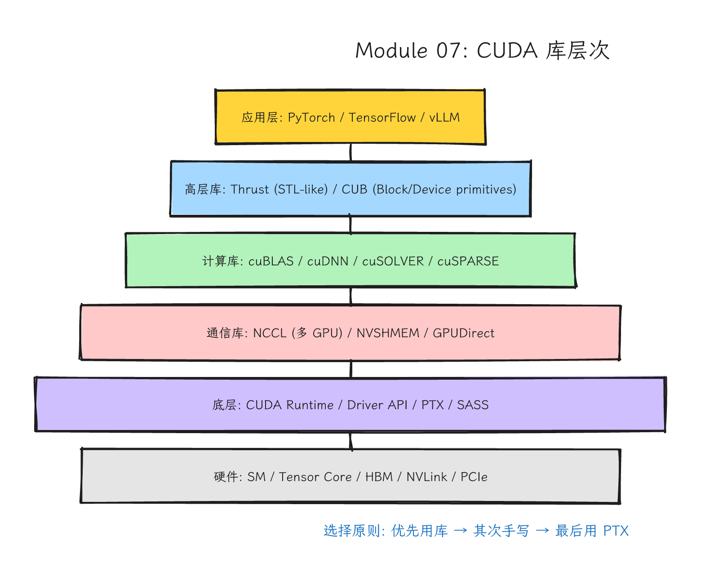
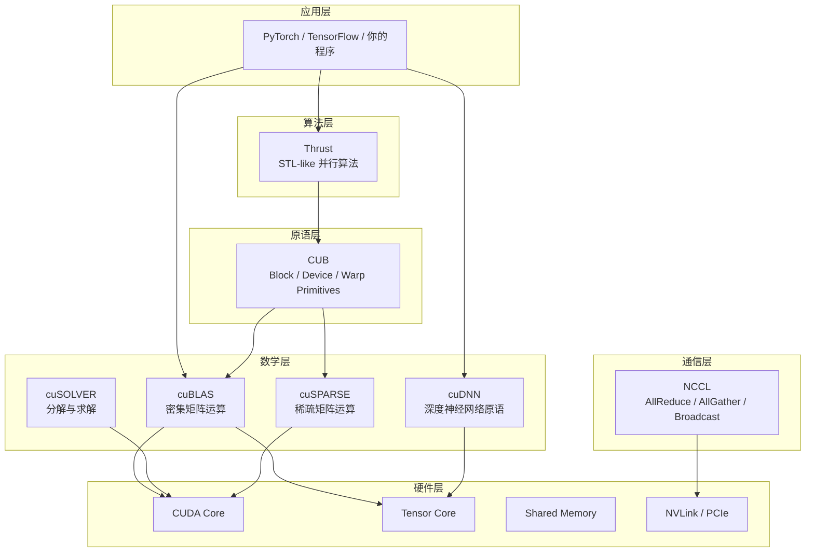
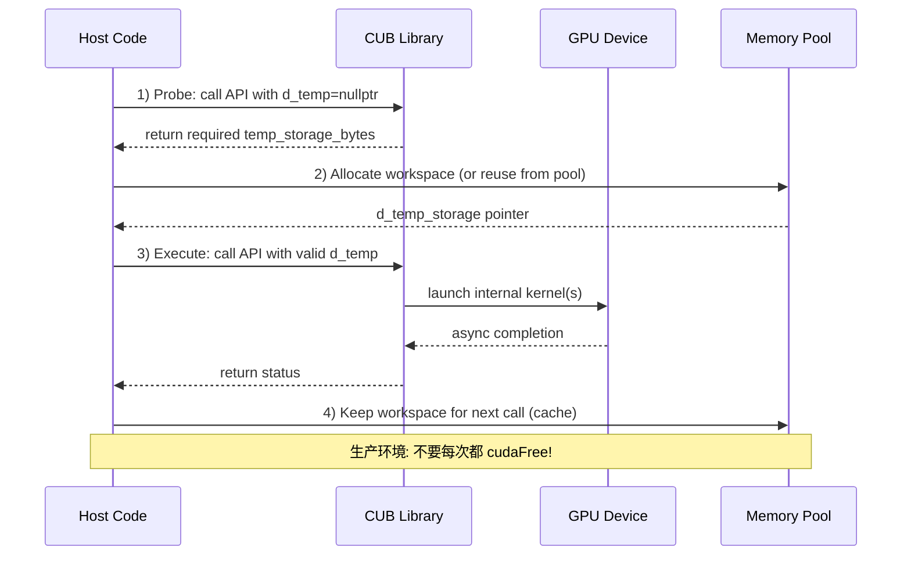

# Module 07: CUDA 库：Thrust、CUB、cuBLAS 与生态全景



*图 07-1：Thrust、CUB、cuBLAS、cuDNN、CUTLASS 等库在 CUDA 生态中的抽象层级。可编辑源图：[`module-07-cuda-libraries-hierarchy.excalidraw`](../diagrams/module-07-cuda-libraries-hierarchy.excalidraw)。*

> **Level**: Intermediate to Advanced
> **Estimated time**: 12–20 小时
> **Prerequisites**: Modules 00–06
> **Sources**: CCCL docs, cuBLAS docs, cuDNN docs, cuSOLVER docs, cuSPARSE docs, NCCL docs, CUDA Runtime API, PyTorch ATen source

---

## 本课学习目标

完成本模块后，你将能够：

1. **判断**：面对一个并行计算任务，判断该用 Thrust、CUB、cuBLAS 还是自己手写 kernel。
2. **使用**：正确写出带 `stream` 和 `workspace` 的 Thrust、CUB、cuBLAS 调用代码，避免 hidden sync 和 layout bug。
3. **理解**：解释 CUB 两阶段 API 的设计意图、cuBLAS handle 的线程安全模型、以及 column-major/row-major 的转换原理。
4. **对比**：对同一个 reduce 操作，设计并执行 Thrust vs CUB vs 手写 kernel 的公平 benchmark。
5. **连接**：在自己的 CUDA 代码中把 Thrust → CUB → cuBLAS 串联成 pipeline，并理解 PyTorch 如何通过 ATen dispatch 到这些库。

---

## 这一课的故事线

很多学习者把"会 CUDA"误解成"所有 kernel 都自己写"。这节课要纠正这个误区。真正的 CUDA 专家知道什么时候自己手写，什么时候用库。

Thrust、CUB、cuBLAS 代表三种抽象层次：高层算法、底层 primitives、专业数学库。你要学的不是背 API，而是建立判断：库能解决什么问题，库的边界在哪里，如何和自己的 kernel 接起来。

### Mental Model：三层工具箱

```
┌─────────────────────────────────────────────────────────────┐
│  应用层：PyTorch/TensorFlow/Caffe/你的程序                    │
├─────────────────────────────────────────────────────────────┤
│  算法层：Thrust — 像高级厨房电器，STL-like 数据并行            │
├─────────────────────────────────────────────────────────────┤
│  原语层：CUB — 像专业刀具和夹具，block/device/warp 级 primitives│
├─────────────────────────────────────────────────────────────┤
│  数学层：cuBLAS/cuDNN/cuSOLVER — 像工业级专业设备            │
├─────────────────────────────────────────────────────────────┤
│  通信层：NCCL — 多 GPU 之间的集体通信高速公路                  │
├─────────────────────────────────────────────────────────────┤
│  硬件层：SM / Warp / Shared Memory / Tensor Core / L2 Cache   │
└─────────────────────────────────────────────────────────────┘
```

一句话总结：Thrust 管流程，CUB 管部件，cuBLAS 管线代，cuDNN 管深度，NCCL 管互联。

---

## 从硬件视角看库为什么强

成熟 CUDA 库通常做了你暂时不会全部做好的事情：

- 根据 GPU architecture（SM 版本、shared memory 大小、warp size）选择不同 kernel 实现。
- 处理 memory coalescing、tiling、bank conflict、occupancy 优化。
- 对特殊尺寸（非 2 的幂、小矩阵、batch 变长）做分支和 padding。
- 利用 Tensor Cores（cuBLAS/cuDNN）或 warp shuffle（CUB）。
- 避免不必要的同步和临时分配；使用 caching allocator 复用 workspace。

这是长期工程积累的结果。你用库不是因为不懂底层，而是懂底层后知道维护一个高质量 kernel 的成本。

---

## Mermaid 图 1：CUDA 库抽象层次与调用关系



---

## 第一部分：Thrust — 高层算法抽象

### 1.1 定位与适用场景

Thrust 适合表达高层数据并行，用 C++ 泛型编程把"做什么"和"怎么做"分离。它提供了类似 STL 的 `device_vector`、算法（`transform`、`reduce`、`sort`、`scan`）和迭代器适配器。

适合场景：
- 快速原型（rapid prototyping）。
- 常见数据并行任务：prefix sum、sorting、reduction、element-wise transform。
- 对性能不是最极限但需要可靠、可维护代码的场景。

不适合场景：需要极致融合（fusion）的 pipeline、需要细粒度控制 shared memory 和 warp 协作的 kernel。

### 1.2 Execution Policy：控制代码跑在哪里

Thrust 通过 execution policy 决定算法在哪个设备/后端上执行。这是 Thrust 与 STL 最大的不同之一。

| Policy | 含义 | 示例 |
|--------|------|------|
| `thrust::seq` | 强制串行执行（host） | 调试、避免并行开销 |
| `thrust::host` | 使用 host 后端执行；是否多线程取决于 Thrust 配置和 host system | 数据在 host 内存 |
| `thrust::device` | 在默认 CUDA device 上执行 | 数据在 device 内存 |
| `thrust::cuda::par` | 显式指定 CUDA 后端并行 | 需要 `#include <thrust/system/cuda/execution_policy.h>` |
| `thrust::cpp::par` | 使用 C++17 并行算法后端 | CPU 多线程 |
| `thrust::omp::par` | 使用 OpenMP 后端 | CPU 多线程 |

Thrust 的默认推导规则：如果输入迭代器是 `device_vector` 的迭代器，则默认走 device 后端；如果是 `host_vector` 的迭代器，则默认走 host 后端。显式传入 policy 可以覆盖默认行为，也可以用于 raw device pointer 或自定义 allocator 的场景。

### 1.3 Custom Allocator：控制内存从哪来

Thrust 默认使用 `cudaMalloc`/`cudaFree` 来分配 `device_vector`。在生产环境中，最好使用自己的 memory pool（如 PyTorch 的 CUDACachingAllocator、NVIDIA 的 `cub::CachingDeviceAllocator`）。Thrust 允许通过 allocator 模板参数注入自定义分配器。

```cpp
// 简化的自定义 allocator 示例：用 cudaMalloc/cudaFree 但带日志
struct logging_allocator {
    using value_type = int;
    int* allocate(std::size_t n) {
        int* p = nullptr;
        cudaMalloc(&p, n * sizeof(int));
        std::printf("allocate %zu bytes at %p\n", n * sizeof(int), (void*)p);
        return p;
    }
    void deallocate(int* p, std::size_t n) {
        std::printf("deallocate %zu bytes at %p\n", n * sizeof(int), (void*)p);
        cudaFree(p);
    }
};

// 使用方式
thrust::device_vector<int, logging_allocator> vec(100);
```

更常见的做法是让 allocator 从一个预先分配的 pool 中切分内存，减少 `cudaMalloc` 的系统调用开销。

### 1.4 高级迭代器：zip_iterator 与 permutation_iterator

Thrust 提供了一组不分配新内存的迭代器适配器，它们只改变"如何访问数据"，不移动数据本身。

`zip_iterator`：把多个迭代器" zip "成 tuple，用于多列数据的并行操作。

```cpp
// 假设我们有三个等长数组，想同时做 a[i] = b[i] + c[i]
auto zipped = thrust::make_zip_iterator(
    thrust::make_tuple(a.begin(), b.begin(), c.begin()));
```

`permutation_iterator`：通过索引数组间接访问数据，相当于 gather/scatter 的迭代器抽象。

```cpp
// values = [10, 20, 30, 40], indices = [3, 1, 0, 2]
// permutation 迭代器产生序列：40, 20, 10, 30
auto perm = thrust::make_permutation_iterator(
    values.begin(), indices.begin());
```

`transform_iterator`：在遍历时对每个元素应用一元函数，避免显式的 `transform` 中间结果。

```cpp
// 读取时自动取平方，不写入额外内存
auto squared = thrust::make_transform_iterator(
    data.begin(), thrust::square<int>());
```

### 1.5 Thrust 与 STL 的异同

| 维度 | STL | Thrust |
|------|-----|--------|
| 执行位置 | 仅 CPU | CPU 或 GPU（多后端） |
| 执行策略 | 无（默认单线程） | `seq`/`host`/`device`/`cuda::par` 等 |
| 迭代器 | 只能访问 host 内存 | 可跨内存空间（host/device） |
| 内存分配 | `std::allocator` | 可自定义 allocator，支持 pool |
| 算法 | 串行或 C++17 并行 | 自动映射到 CUDA kernel |
| 融合能力 | 无特殊支持 | 可通过 fancy iterator 做轻量融合 |

Thrust 的算法通常不是直接调用 CUB kernel，而是经过自己的调度层。在新版 CCCL（CUDA C++ Core Libraries）中，Thrust 和 CUB 正在逐步统一底层实现，以减少重复维护。

### 1.6 Thrust 完整示例（transform + reduce + sort + custom functor）

```cpp
// filename: thrust_comprehensive.cu
// compile: nvcc -std=c++17 thrust_comprehensive.cu -o thrust_comprehensive

#include <thrust/device_vector.h>
#include <thrust/host_vector.h>
#include <thrust/transform.h>
#include <thrust/reduce.h>
#include <thrust/sort.h>
#include <thrust/iterator/zip_iterator.h>
#include <thrust/iterator/permutation_iterator.h>
#include <thrust/execution_policy.h>
#include <cuda_runtime.h>
#include <cstdio>
#include <cmath>

// ---------- 自定义 Functor：带参数的仿函数 ----------
struct saxpy_functor {
    float a;
    __host__ __device__
    saxpy_functor(float _a) : a(_a) {}

    __host__ __device__
    float operator()(const float& x, const float& y) const {
        return a * x + y;   // SAXPY: a*x + y
    }
};

// ---------- 自定义 Unary Functor：带条件的过滤 ----------
struct is_positive {
    __host__ __device__
    bool operator()(const float& x) const { return x > 0.0f; }
};

int main() {
    const int N = 1 << 20;  // 1M elements

    // 1) 初始化 host 数据并拷贝到 device
    thrust::host_vector<float> h_x(N), h_y(N);
    for (int i = 0; i < N; ++i) {
        h_x[i] = static_cast<float>(i % 100 - 50);  // -50 ~ 49
        h_y[i] = static_cast<float>(i) / 1000.0f;
    }
    thrust::device_vector<float> d_x = h_x;
    thrust::device_vector<float> d_y = h_y;
    thrust::device_vector<float> d_z(N);

    // 2) TRANSFORM: 使用自定义 functor 做 SAXPY
    //    thrust::transform 接受两个输入序列，一个输出序列，一个二元 functor
    thrust::transform(thrust::device,           // execution policy: 显式在 device 上执行
                      d_x.begin(), d_x.end(),   // 输入序列 1
                      d_y.begin(),              // 输入序列 2（起始位置）
                      d_z.begin(),              // 输出序列
                      saxpy_functor(2.0f));     // 二元 functor: 2.0f * x + y

    // 3) REDUCE: 计算 d_z 的平方和（使用 transform_iterator 避免中间内存）
    auto square_it = thrust::make_transform_iterator(
        d_z.begin(), thrust::square<float>());
    float sum_sq = thrust::reduce(thrust::device,
                                  square_it,
                                  square_it + N,
                                  0.0f,                    // 初始值
                                  thrust::plus<float>());  // 归约操作
    std::printf("Sum of squares after SAXPY: %.3f\n", sum_sq);

    // 4) SORT: 对 d_z 排序（默认升序）
    thrust::sort(thrust::device, d_z.begin(), d_z.end());

    // 5) 使用 permutation_iterator 做 gather：取排序后的前 10 个元素
    thrust::device_vector<int> d_idx(10);
    for (int i = 0; i < 10; ++i) d_idx[i] = i;
    auto perm = thrust::make_permutation_iterator(d_z.begin(), d_idx.begin());
    thrust::host_vector<float> h_top10(10);
    thrust::copy(thrust::device, perm, perm + 10, h_top10.begin());

    std::printf("Top 10 smallest after sort:\n");
    for (int i = 0; i < 10; ++i) {
        std::printf("  [%d] = %.3f\n", i, h_top10[i]);
    }

    // 6) ZIP ITERATOR: 同时遍历 x, y, z，统计满足 x>0 && z>0 的个数
    auto zip_begin = thrust::make_zip_iterator(
        thrust::make_tuple(d_x.begin(), d_z.begin()));
    auto zip_end = zip_begin + N;
    int count_pos = thrust::count_if(thrust::device, zip_begin, zip_end,
        []__host__ __device__(thrust::tuple<float,float> t) {
            return thrust::get<0>(t) > 0.0f && thrust::get<1>(t) > 0.0f;
        });
    std::printf("Count of (x>0 && z>0): %d\n", count_pos);

    return 0;
}
```

---

## 第二部分：CUB — 底层并行原语

### 2.1 定位：Thrust 的"底层引擎"

CUB（CUDA UnBound）是一个提供可配置 CUDA 并行原语的 C++ 模板库。它不追求像 Thrust 那样的"一行搞定"，而是提供三种粒度的 primitives：

| 层级 | 代表类/函数 | 使用场景 |
|------|-------------|----------|
| **Warp** | `cub::WarpReduce`, `cub::WarpScan` | 单个 warp 内的协作，无需 `__syncthreads()` |
| **Block** | `cub::BlockReduce`, `cub::BlockScan`, `cub::BlockRadixSort` | thread block 内的协作，需要 `__shared__` temp storage |
| **Device** | `cub::DeviceReduce`, `cub::DeviceScan`, `cub::DeviceRadixSort` | 跨 block 的全局操作，需要外部 workspace |

CUB 的设计哲学是 policy-based design：通过模板参数（如 `BLOCK_SIZE`、`ALGORITHM`、`ITEMS_PER_THREAD`）在编译期选择最优策略，避免运行期分支开销。

### 2.2 Block Primitives vs Device Primitives 的本质区别

这是 CUB 的核心概念，也是最容易混淆的部分。

| 维度 | Block Primitives | Device Primitives |
|------|------------------|-------------------|
| 调用位置 | 在 kernel 内部调用 | 在 host 端调用 |
| 线程范围 | 单个 thread block | 整个 grid（device-wide） |
| 临时空间 | `__shared__` 内存 | 外部分配的 `device` 内存（workspace） |
| 同步 | 使用 `__syncthreads()` | 库内部通过一个或多个 kernel、workspace 和算法特定协议完成 device-wide 协调；不要假设一定是全局原子或 grid sync |
| 典型用途 | 自定义 kernel 内部的 reduce/scan/sort | 作为独立库调用完成全局操作 |
| 示例 | `BlockReduce(temp_storage).Sum(val)` | `DeviceReduce::Sum(d_temp, temp_bytes, d_in, d_out, n)` |

Block primitives 是你在写 kernel 时用的工具；Device primitives 是你写 host 代码时直接调用的库函数，它们内部会启动自己的 CUDA kernel。

### 2.3 Temporary Storage 的生命周期管理

CUB 的 Device-level API 使用**两阶段模式**（dual-pass / two-phase）：

1. **Probe 阶段**：`d_temp_storage = nullptr`，调用一次 API，库只返回需要的 `temp_storage_bytes`。
2. **Execute 阶段**：分配 workspace，再次调用同一 API，真正执行计算。

为什么这样设计？
- 让调用者控制内存分配：库内部不偷偷 `cudaMalloc`，避免 hidden allocation overhead。
- 支持 workspace 缓存：你可以把 workspace 分配一次，反复用于同类型的多次调用（benchmark 时必须这样做）。
- 与 memory pool / caching allocator 集成：你可以在自定义 allocator 中复用已分配的块。

### 2.4 CachingDeviceAllocator：生产环境的标配

CUB 提供了 `cub::CachingDeviceAllocator`，它维护一个按 bin 大小组织的空闲内存池，减少 `cudaMalloc`/`cudaFree` 的系统调用开销。

```cpp
// 默认构造即可启用缓存复用；构造函数的 bool 参数是 skip_cleanup/debug 等控制项，
// 不是“cache hit 时跳过 cudaMalloc”的开关。具体签名以当前 CCCL/CUB 文档为准。
cub::CachingDeviceAllocator g_allocator;

// 使用方式
g_allocator.DeviceAllocate((void**)&d_ptr, bytes, stream);
// ... 使用 ...
g_allocator.DeviceFree(d_ptr);
```

`DeviceFree` 后，内存不会立即还给 OS，而是进入 allocator 的 free cache，供同 stream（或后续 stream 同步后）复用。这避免了 benchmark 时把内存分配时间误算成 kernel 时间。

### 2.5 CUB 与 Warp-level Primitives 的关系

CUB 的 Warp 级原语是对 CUDA warp-level intrinsic、shared memory 方案和算法策略的**安全封装**：
- 在支持 shuffle 的架构和对应 CCCL/CUB 实现中，许多 warp reduce/scan primitive 会使用 shuffle 等低开销路径。
- 具体路径取决于 CUB 版本、目标 SM、数据类型、operator 和 primitive；不要把它写死成某个单一 compute capability 判断。
- 你通常不需要手写 `__shfl_sync` 的 mask 逻辑，CUB 会在它支持的 primitive 语义内处理 active lane 和边界情况。

如果你已经在写 `__shfl_sync` 手写 reduce，可以问自己：用 CUB 的 `WarpReduce` 会不会更短、更安全、且性能一样？通常答案是 yes。

### 2.6 CUB DeviceReduce 完整示例（含 caching allocator）

```cpp
// filename: cub_reduce.cu
// compile: nvcc -std=c++17 cub_reduce.cu -o cub_reduce

#include <cub/cub.cuh>
#include <cuda_runtime.h>
#include <cstdlib>
#include <cstdio>
#include <vector>

#define CUDA_CHECK(call)                                                        \
    do {                                                                        \
        cudaError_t err = (call);                                               \
        if (err != cudaSuccess) {                                               \
            std::fprintf(stderr, "CUDA error %s at %s:%d\n",                    \
                         cudaGetErrorString(err), __FILE__, __LINE__);          \
            std::exit(EXIT_FAILURE);                                            \
        }                                                                       \
    } while (0)

// ---------- 全局 caching allocator（可选但推荐） ----------
// 如果在多个函数中使用 CUB 操作，可以定义一个全局 allocator，
// 或者封装一个类来管理 workspace 的生命周期。

struct CubReduceWorkspace {
    void* d_temp = nullptr;
    size_t temp_bytes = 0;
    size_t last_num_items = 0;

    ~CubReduceWorkspace() { if (d_temp) cudaFree(d_temp); }

    // 根据需要的元素数量，确保 workspace 足够大；按需重新分配
    void ensure(size_t required_temp_bytes, cudaStream_t stream) {
        if (required_temp_bytes > temp_bytes) {
            if (d_temp) CUDA_CHECK(cudaFree(d_temp));
            CUDA_CHECK(cudaMalloc(&d_temp, required_temp_bytes));
            temp_bytes = required_temp_bytes;
        }
    }
};

float run_cub_reduce(const float* d_in, float* d_out, int n,
                     cudaStream_t stream, CubReduceWorkspace& ws) {
    size_t required_temp_bytes = 0;

    // 第一次调用：probe 需要的临时空间大小
    CUDA_CHECK(cub::DeviceReduce::Sum(
        nullptr, required_temp_bytes,
        d_in, d_out, n, stream));

    // 确保 workspace 足够（生产代码中缓存这段空间，避免反复 malloc/free）
    ws.ensure(required_temp_bytes, stream);

    // 第二次调用：真正执行 reduction
    CUDA_CHECK(cub::DeviceReduce::Sum(
        ws.d_temp, ws.temp_bytes,
        d_in, d_out, n, stream));

    // h_out 是普通栈内存，不是 pinned memory。为了避免把 pageable host
    // memory 的 cudaMemcpyAsync 行为讲混，这里先同步 CUB 工作，再用同步拷贝读回标量。
    CUDA_CHECK(cudaStreamSynchronize(stream));
    float h_out = 0.0f;
    CUDA_CHECK(cudaMemcpy(&h_out, d_out, sizeof(float), cudaMemcpyDeviceToHost));
    return h_out;
}

int main() {
    const int N = 1 << 24;  // 16M elements
    float* d_in = nullptr;
    float* d_out = nullptr;
    CUDA_CHECK(cudaMalloc(&d_in, N * sizeof(float)));
    CUDA_CHECK(cudaMalloc(&d_out, sizeof(float)));

    cudaStream_t stream;
    CUDA_CHECK(cudaStreamCreate(&stream));

    // 填充数据：全部 1.0f，期望结果是 N。
    // 注意：cudaMemset 按“字节”填充，不能用来写入 float 的 1.0f bit pattern。
    std::vector<float> h_in(N, 1.0f);
    // h_in 是 pageable host memory。这里是一次性初始化，不用于演示 H2D/kernel overlap，
    // 因此使用同步 cudaMemcpy，避免把 pageable cudaMemcpyAsync 误读成可稳定重叠的异步传输。
    CUDA_CHECK(cudaMemcpy(d_in, h_in.data(), N * sizeof(float),
                          cudaMemcpyHostToDevice));

    CubReduceWorkspace ws;
    float result = run_cub_reduce(d_in, d_out, N, stream, ws);

    std::printf("CUB DeviceReduce::Sum result: %.1f (expected: %d)\n", result, N);

    CUDA_CHECK(cudaStreamDestroy(stream));
    CUDA_CHECK(cudaFree(d_in));
    CUDA_CHECK(cudaFree(d_out));
    return 0;
}
```

### 2.7 CUB DeviceScan 完整示例（含 Segmented Scan）

```cpp
// filename: cub_scan.cu
// compile: nvcc -std=c++17 cub_scan.cu -o cub_scan

#include <cub/cub.cuh>
#include <cuda_runtime.h>
#include <cstdlib>
#include <cstdio>
#include <vector>

#define CUDA_CHECK(call)                                                        \
    do {                                                                        \
        cudaError_t err = (call);                                               \
        if (err != cudaSuccess) {                                               \
            std::fprintf(stderr, "CUDA error %s at %s:%d\n",                    \
                         cudaGetErrorString(err), __FILE__, __LINE__);          \
            std::exit(EXIT_FAILURE);                                            \
        }                                                                       \
    } while (0)

int main() {
    // ---------- 示例数据：4 段独立的前缀和 ----------
    // 数据: [1, 2, 3, 4, 5, 6, 7, 8, 9, 10]
    // offsets: [0, 4, 6, 8, 10]
    // 段分别是 [1,2,3,4]、[5,6]、[7,8]、[9,10]
    // 段内 exclusive prefix sum 结果:
    //   [0, 1, 3, 6, 0, 5, 0, 7, 0, 9]

    std::vector<float> h_data = {1,2,3,4,5,6,7,8,9,10};
    std::vector<int>   h_offsets = {0,4,6,8,10};
    int N = static_cast<int>(h_data.size());
    int num_segments = static_cast<int>(h_offsets.size()) - 1;

    float* d_data = nullptr;
    int*   d_offsets = nullptr;
    float* d_out = nullptr;
    CUDA_CHECK(cudaMalloc(&d_data, N * sizeof(float)));
    CUDA_CHECK(cudaMalloc(&d_offsets, h_offsets.size() * sizeof(int)));
    CUDA_CHECK(cudaMalloc(&d_out, N * sizeof(float)));
    CUDA_CHECK(cudaMemcpy(d_data, h_data.data(), N * sizeof(float), cudaMemcpyHostToDevice));
    CUDA_CHECK(cudaMemcpy(d_offsets, h_offsets.data(), h_offsets.size() * sizeof(int), cudaMemcpyHostToDevice));

    // 1) 全局长度 Exclusive Scan（非 segmented）
    void* d_temp = nullptr;
    size_t temp_bytes = 0;
    CUDA_CHECK(cub::DeviceScan::ExclusiveSum(
        nullptr, temp_bytes, d_data, d_out, N));
    CUDA_CHECK(cudaMalloc(&d_temp, temp_bytes));
    CUDA_CHECK(cub::DeviceScan::ExclusiveSum(
        d_temp, temp_bytes, d_data, d_out, N));

    std::vector<float> h_exclusive(N);
    CUDA_CHECK(cudaMemcpy(h_exclusive.data(), d_out, N * sizeof(float), cudaMemcpyDeviceToHost));
    std::printf("ExclusiveSum: ");
    for (int i = 0; i < N; ++i) std::printf("%.0f ", h_exclusive[i]);
    std::printf("\n");

    // 2) Segmented Scan：每段内做 Exclusive Sum
    //    DeviceSegmentedScan 使用 begin/end offsets 指定每段边界。
    //    注意：DeviceScan::ExclusiveSumByKey 接收的是“连续相同 key 属于同一段”的 key 数组，
    //    不是 head-flag 数组；如果用 head flags 直接当 key，段会被错误切分。
    //    输出: [0, 1, 3, 6, 0, 5, 0, 7, 0, 9]
    //    （因为 exclusive，每段第一个元素输出为 0，然后累加）
    size_t seg_temp_bytes = 0;
    CUDA_CHECK(cub::DeviceSegmentedScan::ExclusiveSum(
        nullptr, seg_temp_bytes,
        d_data,             // 输入值
        d_out,              // 输出
        num_segments,       // 段数
        d_offsets,          // begin offsets
        d_offsets + 1));    // end offsets

    void* d_seg_temp = nullptr;
    CUDA_CHECK(cudaMalloc(&d_seg_temp, seg_temp_bytes));
    CUDA_CHECK(cub::DeviceSegmentedScan::ExclusiveSum(
        d_seg_temp, seg_temp_bytes,
        d_data, d_out, num_segments, d_offsets, d_offsets + 1));

    std::vector<float> h_segmented(N);
    CUDA_CHECK(cudaMemcpy(h_segmented.data(), d_out, N * sizeof(float), cudaMemcpyDeviceToHost));
    std::printf("Segmented ExclusiveSum: ");
    for (int i = 0; i < N; ++i) std::printf("%.0f ", h_segmented[i]);
    std::printf("\n");

    // 清理
    cudaFree(d_data); cudaFree(d_offsets); cudaFree(d_out);
    cudaFree(d_temp); cudaFree(d_seg_temp);
    return 0;
}
```

---

## Mermaid 图 2：CUB 两阶段工作流程与缓存策略



---

## 第三部分：cuBLAS — 密集矩阵运算的工业标准

### 3.1 cuBLAS 的定位与层次

cuBLAS 是 NVIDIA 对 BLAS（Basic Linear Algebra Subprograms）标准的 GPU 实现，分为两层：

- **cuBLAS Legacy API**：`cublasSgemm`, `cublasDgemm` 等传统函数，column-major 语义，直接接受 raw pointers。
- **cuBLASLt API**：NVIDIA Ampere 及更新架构推荐使用的**低层级、更灵活**接口，支持 auto-tuning、heuristic selection、mixed precision、自定义 epilogue 等。

### 3.2 cublasHandle：线程安全、Stream 绑定与 Workspace

`cublasHandle_t` 是一个**opaque context**，它封装了：
- 库内部状态（如 workspace 指针、算法缓存）。
- 关联的 CUDA stream（默认 stream 0）。
- 错误状态。

**关键规则**：
- `cublasCreate` 和 `cublasDestroy` 有开销，应在程序初始化/结束时做，**不要在热路径反复创建**。
- `cublasSetStream(handle, stream)` 绑定 stream。如果 handle 已经被多个 host 线程共享，需要加锁；**最佳实践是每个线程有自己的 handle**。
- cuBLAS 函数通常是**异步**的（除非涉及 host 内存的 scalar 结果），需要与 stream 同步配合使用。

### 3.3 矩阵布局：Row-Major vs Column-Major 与 Leading Dimension

这是 cuBLAS 最常见的 bug 来源之一。

BLAS 标准源自 Fortran，而 Fortran 数组是 column-major。C/C++ 是 row-major。因此，在 C 中存储的矩阵传入 cuBLAS 时，需要特别注意。

**Row-Major 索引（C/C++）**：`A[i][j] = A[i * lda + j]`，其中 `lda` 是列数（N）。
**Column-Major 索引（Fortran/cuBLAS）**：`A[i][j] = A[j * lda + i]`，其中 `lda` 是行数（M）。

数学恒等式：
```
C = A × B   (row-major)
  ≡ C^T = B^T × A^T   (column-major, as seen by cuBLAS)
```

这意味着：如果你的数据在 host 端是 row-major，想计算 `C = A×B`，可以不转置数据，而是在调用 `cublasSgemm` 时交换 A 和 B 的顺序，并正确设置 `lda`/`ldb`/`ldc`。

Leading Dimension（ld）：即使矩阵是 M×N，如果它是从一个更大的数组中切出来的子矩阵，ld 可能大于 M（column-major）或大于 N（row-major）。ld 是"在内存中跳到下一列/下一行的步长"。

### 3.4 数据类型全景：Sgemm、Dgemm、Hgemm、Cgemm、Zgemm

| 前缀 | 含义 | 数据类型 | 典型场景 |
|------|------|----------|----------|
| `S` | Single | `float` | 通用深度学习训练/推理 |
| `D` | Double | `double` | 科学计算、需要高精度 |
| `H` | Half | `__half` / `__half2` | 深度学习推理、AMP |
| `C` | Complex single | `cuComplex` | 信号处理 |
| `Z` | Complex double | `cuDoubleComplex` | 高精度科学计算 |

cuBLAS 还提供 `cublasGemmEx` 和 `cublasLtMatmul`，支持混合精度（如 FP16 输入 + FP32 累加）和 `CUBLAS_COMPUTE_32F` 等 compute type 参数。

### 3.5 Batch GEMM 与 Strided Batch GEMM

**Batch GEMM**：对一组矩阵执行相同维度的 GEMM。legacy cuBLAS 的 `cublas<t>gemmBatched` 接收的是 **device 端的指针数组**：host 代码通常先准备每个矩阵的 device pointer，再把 pointer array 拷到 GPU，最后把这个 device pointer array 传给 cuBLAS。适合矩阵地址不规则、但每个 GEMM 形状一致的场景。

**Strided Batch GEMM**：矩阵在内存中按固定 stride 连续排列，不需要 device pointer array。适合 Transformer 的 attention 中 Q/K/V 的批量投影。

### 3.6 cuBLASLt：Auto-Tuning 与 Heuristic Selection

cuBLASLt 引入了 matmul descriptor 和 matrix layout 对象，提供了更丰富的控制：

- **`cublasLtMatmulAlgoGetHeuristic`**：根据问题规模（M, N, K）和数据类型，返回一组候选算法。
- **Auto-Tuning**：遍历候选算法，在真实输入上运行并测时，选出最快的。这通常做一次后缓存结果。
- **Epilogue Fusion**：支持在 GEMM 后 fused 执行 ReLU、Bias、GELU 等操作，减少 global memory 写入。

在需要 epilogue fusion、heuristic selection、workspace/algorithm 控制或现代混合精度路径时，尤其是 Ampere 及更新 GPU 上的新代码，应优先评估 `cublasLtMatmul`；但 legacy `cublas<t>gemm` / `cublasGemmEx` 仍然是有效接口，是否替换要看功能需求、维护成本和 profiler 证据。

### 3.7 cuBLAS GEMM 完整示例（含 Row-Major 转换与 Batch GEMM）

```cpp
// filename: cublas_gemm.cu
// compile: nvcc -std=c++17 cublas_gemm.cu -lcublas -o cublas_gemm

#include <cublas_v2.h>
#include <cuda_runtime.h>
#include <cstdlib>
#include <cstdio>
#include <vector>

#define CUBLAS_CHECK(call)                                                      \
    do {                                                                        \
        cublasStatus_t status = (call);                                         \
        if (status != CUBLAS_STATUS_SUCCESS) {                                  \
            std::fprintf(stderr, "cuBLAS error %d at %s:%d\n",                  \
                         static_cast<int>(status), __FILE__, __LINE__);       \
            std::exit(EXIT_FAILURE);                                            \
        }                                                                       \
    } while (0)

#define CUDA_CHECK(call)                                                        \
    do {                                                                        \
        cudaError_t err = (call);                                               \
        if (err != cudaSuccess) {                                               \
            std::fprintf(stderr, "CUDA error %s at %s:%d\n",                    \
                         cudaGetErrorString(err), __FILE__, __LINE__);          \
            std::exit(EXIT_FAILURE);                                            \
        }                                                                       \
    } while (0)

// ---------- 单精度 GEMM：Row-Major 数据用 Column-Major API 计算 ----------
// 我们的 host 数据是 row-major: C = A * B, A:[M x K], B:[K x N], C:[M x N]
// 在内存中: A[row][col] = A[row * K + col]
// cuBLAS 期望 column-major: C^T = B^T * A^T
// 因此调用参数: (B, A) 交换顺序，且 leading dimension 按转置后设置
void sgemm_row_major_with_cublas(cublasHandle_t handle, cudaStream_t stream,
                                 int M, int N, int K,
                                 const float* d_A, const float* d_B, float* d_C) {
    CUBLAS_CHECK(cublasSetStream(handle, stream));

    const float alpha = 1.0f;
    const float beta = 0.0f;

    // A 是 M x K row-major，cuBLAS 看作 A^T (K x M, col-major)，ld = K
    // B 是 K x N row-major，cuBLAS 看作 B^T (N x K, col-major)，ld = N
    // C 是 M x N row-major，cuBLAS 看作 C^T (N x M, col-major)，ld = N
    // 注意：调用时交换了 A 和 B 的位置！
    CUBLAS_CHECK(cublasSgemm(handle,
                             CUBLAS_OP_N, CUBLAS_OP_N,   // 不额外转置（我们已经从数据布局角度处理了）
                             N, M, K,                     // m=N, n=M, k=K（因为计算的是 C^T）
                             &alpha,
                             d_B, N,                      // B^T 的 leading dim = N（原 B 的列数）
                             d_A, K,                      // A^T 的 leading dim = K（原 A 的列数）
                             &beta,
                             d_C, N));                    // C^T 的 leading dim = N（原 C 的列数）
}

// ---------- Batch GEMM：多个相同尺寸的 GEMM ----------
void sgemm_batched(cublasHandle_t handle, cudaStream_t stream,
                   int M, int N, int K, int batch_count,
                   const float* const* d_A_array,  // device 端的 device 指针数组
                   const float* const* d_B_array,
                   float* const* d_C_array) {
    CUBLAS_CHECK(cublasSetStream(handle, stream));

    const float alpha = 1.0f;
    const float beta = 0.0f;

    // 同样使用 row-major trick：交换 B 和 A，并调整 leading dimension
    CUBLAS_CHECK(cublasSgemmBatched(handle,
                                    CUBLAS_OP_N, CUBLAS_OP_N,
                                    N, M, K,
                                    &alpha,
                                    d_B_array, N,    // B^T
                                    d_A_array, K,    // A^T
                                    &beta,
                                    d_C_array, N,    // C^T
                                    batch_count));
}

// ---------- Strided Batch GEMM：内存连续排列 ----------
void sgemm_strided_batched(cublasHandle_t handle, cudaStream_t stream,
                           int M, int N, int K, int batch_count,
                           const float* d_A,  // [batch_count, M, K] row-major
                           const float* d_B,  // [batch_count, K, N] row-major
                           float* d_C) {      // [batch_count, M, N] row-major
    CUBLAS_CHECK(cublasSetStream(handle, stream));

    const float alpha = 1.0f;
    const float beta = 0.0f;
    const long long strideA = static_cast<long long>(M) * K;
    const long long strideB = static_cast<long long>(K) * N;
    const long long strideC = static_cast<long long>(M) * N;

    // stride 的单位是“元素数”，不是字节数；cuBLAS API 类型是 long long int。
    // 注意：虽然数据是 row-major，但我们在调用时交换了 B 和 A，
    // 因此计算的是 C^T = B^T * A^T，而 C 的 row-major 布局与 C^T 的 col-major 对应。
    CUBLAS_CHECK(cublasSgemmStridedBatched(handle,
                                           CUBLAS_OP_N, CUBLAS_OP_N,
                                           N, M, K,
                                           &alpha,
                                           d_B, N,           // ldb, strideB
                                           strideB,
                                           d_A, K,           // lda, strideA
                                           strideA,
                                           &beta,
                                           d_C, N,           // ldc, strideC
                                           strideC,
                                           batch_count));
}

int main() {
    const int M = 1024, N = 1024, K = 1024;
    const int batch = 4;

    // 为 strided batched GEMM 分配 batch 份矩阵；单矩阵 GEMM 使用第 0 份。
    const size_t elems_A = static_cast<size_t>(batch) * M * K;
    const size_t elems_B = static_cast<size_t>(batch) * K * N;
    const size_t elems_C = static_cast<size_t>(batch) * M * N;
    size_t bytes_A = elems_A * sizeof(float);
    size_t bytes_B = elems_B * sizeof(float);
    size_t bytes_C = elems_C * sizeof(float);

    float *d_A = nullptr, *d_B = nullptr, *d_C = nullptr;
    CUDA_CHECK(cudaMalloc(&d_A, bytes_A));
    CUDA_CHECK(cudaMalloc(&d_B, bytes_B));
    CUDA_CHECK(cudaMalloc(&d_C, bytes_C));

    cudaStream_t stream;
    CUDA_CHECK(cudaStreamCreate(&stream));

    // cudaMemset 按字节填充，不能用来把 float 数组初始化为 1.0f。
    // 这里用 host vector 明确写入数值，教学代码优先保证语义清楚。
    std::vector<float> h_A(elems_A, 1.0f);
    std::vector<float> h_B(elems_B, 1.0f);
    // h_A/h_B 是 pageable host memory。教学初始化用同步拷贝即可；
    // 真正要和 kernel 重叠时，应使用 cudaMallocHost/cudaHostAlloc 分配 pinned memory。
    CUDA_CHECK(cudaMemcpy(d_A, h_A.data(), bytes_A, cudaMemcpyHostToDevice));
    CUDA_CHECK(cudaMemcpy(d_B, h_B.data(), bytes_B, cudaMemcpyHostToDevice));
    CUDA_CHECK(cudaMemsetAsync(d_C, 0, bytes_C, stream));

    cublasHandle_t handle;
    CUBLAS_CHECK(cublasCreate(&handle));

    // 1) 单矩阵 GEMM
    sgemm_row_major_with_cublas(handle, stream, M, N, K, d_A, d_B, d_C);
    CUDA_CHECK(cudaStreamSynchronize(stream));
    std::printf("Single GEMM done.\n");

    // 2) Strided Batch GEMM
    sgemm_strided_batched(handle, stream, M, N, K, batch, d_A, d_B, d_C);
    CUDA_CHECK(cudaStreamSynchronize(stream));
    std::printf("Strided Batch GEMM done.\n");

    CUBLAS_CHECK(cublasDestroy(handle));
    CUDA_CHECK(cudaStreamDestroy(stream));
    CUDA_CHECK(cudaFree(d_A)); CUDA_CHECK(cudaFree(d_B)); CUDA_CHECK(cudaFree(d_C));
    return 0;
}
```

---

## Mermaid 图 3：cuBLAS 调用链与数据流

```mermaid
graph LR
    A[Host App] --> B[cublasHandle_t]
    B --> C[cublasSetStream]
    C --> D[Async GEMM Kernel]
    D --> E[GPU SM/Tensor Core]

    subgraph DataFlow["数据布局转换"]
        F[Host Row-Major A[M,K]]
        G[Host Row-Major B[K,N]]
        H[Device d_A, d_B]
        I[cuBLAS sees A^T(K,M), B^T(N,K)]
        J[Device d_C = B^T * A^T]
        K[Host reads C as Row-Major]
    end

    F --> H
    G --> H
    H --> I
    I --> D
    D --> J
    J --> K
```

---

## 第四部分：cuDNN、cuSOLVER/cuSPARSE、NCCL 简介

### 4.1 cuDNN：深度学习必备

cuDNN（CUDA Deep Neural Network library）提供深度学习中最常用的**高性能原语**：
- 卷积（Convolution）：forward、backward filter、backward data。
- 池化（Pooling）、激活（Activation）、Softmax、Batch Normalization，以及部分 normalization / attention / frontend graph 路径；具体 op 覆盖要以当前 cuDNN 版本文档为准。
- RNN/LSTM/GRU、Transformer / attention 相关功能在不同 cuDNN major 版本中的 API 形态变化较大，生产代码应优先查当前 support matrix。

cuDNN 是深度学习必备的原因：
- 卷积的优化极其复杂：需要选择 implicit GEMM、Winograd、FFT 等算法；需要根据输入尺寸、group、 dilation、stride 选择最优实现；需要处理 Tensor Core 的 alignment 要求。
- cuDNN 内部维护算法/engine 选择机制：旧版代码常见 `cudnnGetConvolutionForwardAlgorithm_v7` 这类 convolution algorithm API；cuDNN 8/9 还引入 backend / frontend graph API、operation graph、engine config 和 heuristic 路径。课程里读旧项目时要认识 legacy API，写新项目时要按当前 cuDNN 文档选择接口。

Tensor Descriptor 格式要求：许多 Tensor Core 友好的卷积路径偏好 `NHWC` / Channels-Last 这类布局，但这不是所有 cuDNN op、所有 dtype 和所有 GPU 的统一最优规则。从 PyTorch 的 `channels_last` 内存格式到 cuDNN 的 `CUDNN_TENSOR_NHWC`，需要确保数据排布一致；如果框架或 cuDNN 为了匹配 engine 做 implicit reorder，会带来额外开销，具体要用 profiler 验证。

### 4.2 cuSOLVER 与 cuSPARSE：什么时候用它们？

cuSOLVER 提供 LAPACK-like 功能，分为三个模块：
- `cuSolverDN`：密集矩阵分解（LU、QR、SVD、Cholesky、特征值求解）。
- `cuSolverSP`：稀疏矩阵的最小二乘和 QR 分解；不同 API 可能是 host 或 device 路径，性能和适用性取决于稀疏结构、规模和当前 cuSOLVER 版本，不能假设库会自动替你选择最佳 CPU/GPU fallback。
- `cuSolverRF`：对**具有相同稀疏模式、不同数值**的矩阵序列进行快速重新分解。适合电路仿真、CFD 等需要反复求解的场景。

cuSPARSE 专门处理稀疏矩阵的基本线性代数子例程（BLAS on sparse matrices）。
- 支持 CSR、CSC、COO、ELL、HYB 等多种稀疏格式。
- 提供 SpMV（Sparse Matrix-Vector）、SpMM（Sparse Matrix-Matrix）、稀疏矩阵转置、稀疏矩阵排序等。
- 稀疏矩阵是否更快取决于非零分布、格式转换成本、矩阵规模、batch、dtype 和 GPU。高稀疏度通常更有机会受益，但没有一个固定的“70% 以上必然快”阈值；如果矩阵不够稀疏或结构不友好，dense cuBLAS 可能更快。

什么时候用：
- 你的问题涉及稀疏矩阵 → cuSPARSE。
- 需要矩阵分解、求解线性方程组 → cuSOLVER。
- 深度学习反向传播中的 dense GEMM → cuBLAS。

### 4.3 NCCL：集体通信在库层面的位置

NCCL（NVIDIA Collective Communications Library）是**多 GPU 之间的数据交换层**。它提供的原语包括：
- `AllReduce`：所有 GPU 的梯度求和后分发给所有 GPU（分布式训练的核心）。
- `AllGather`：每个 GPU 有一块数据，收集完整数据到所有 GPU。
- `Broadcast`：根 GPU 的数据广播到所有 GPU。
- `Reduce` / `ReduceScatter`：归约后只发给根/分散结果。
- `Send`/`Recv`：点对点通信。

NCCL 会探测 GPU/NIC 拓扑并按算法、协议和 transport 做选择：单节点内可能走 NVLink/NVSwitch、PCIe P2P 或共享内存路径，跨节点常见 InfiniBand/RoCE/RDMA，也可能受 NCCL Net 插件、环境变量、容器权限和网络配置影响。PyTorch DDP、DeepSpeed、Megatron-LM 等训练栈通常把 NCCL 作为 CUDA 多 GPU collective 后端。

**在本模块中的位置**：NCCL 是"通信库"，不是"计算库"。它解决的是"多个 GPU 怎么高效地交换数据"，而不是"单个 GPU 上怎么算得快"。Module 16 会详细讲解分布式训练，但你需要现在建立这个层次概念：

```
单 GPU 计算: Thrust / CUB / cuBLAS / cuDNN
        ↓
多 GPU 通信: NCCL
        ↓
分布式框架: PyTorch DDP / DeepSpeed / Megatron
```

---

## 第五部分：性能对比方法论

### 5.1 同一个 Reduce：Thrust vs CUB vs 手写 Kernel

设计一个公平的 benchmark 需要控制变量：

| 变量 | 控制方法 |
|------|----------|
| 数据规模 | 固定 N，从 1K 到 100M，观察 scaling |
| 数据类型 | 统一用 `float` 或 `double` |
| 内存分配 | 所有实现预先分配 device 内存，不计入时间 |
| 临时空间 | Thrust/CUB 的 workspace 预先分配并缓存，不计入时间 |
| 同步 | 只计时 host 到 launch 到 `cudaStreamSynchronize` 的 wall-clock |
| 预热 | 执行一次 warm-up run，排除 CUDA context 初始化开销 |

预期结果趋势：
- 手写 naive reduce：O(N) 但内存带宽利用率低，通常最慢。
- Thrust reduce：性能优秀，但对小尺寸可能因调度开销略慢。
- CUB DeviceReduce：通常是很强的性能基线，因为 kernel 专门针对 GPU 架构做了 tile 和 warp 优化；是否最快仍要看输入规模、dtype、临时空间管理、CCCL/CUDA 版本和手写 kernel 质量。
- 手写 optimized reduce（使用 warp shuffle + shared memory + 多个元素 per thread）：可能接近 CUB，但代码量和维护成本高。

Thrust 的某些算法（如 `thrust::reduce_by_key`）在特定版本下可能比 CUB 的 `DeviceReduce::ReduceByKey` 更快或更慢，取决于底层实现是否已统一。查阅你使用的 CCCL 版本 release notes。

---

## 第六部分：真实系统落点

### 6.1 PyTorch 的 ATen 如何 Dispatch 到 cuBLAS/cuDNN

PyTorch 的计算引擎是 ATen（A Tensor Library）。调用 `torch.matmul(A, B)` 时的实际执行路径：

1. Python 层：`torch.matmul(a, b)` 被解析。
2. C++ Binding 层：调用 `at::matmul()`。
3. Dispatcher 层：ATen 的 dispatcher 根据 `DispatchKey`（如 `CUDA`、`Autograd`、`TF32`）路由到 `matmul_cuda`。
4. CUDA 实现层：`aten/src/ATen/native/cuda/Blas.cpp` 调用 `cublas_gemm()` 或 `cublaslt_matmul()`。
5. cuBLAS 层：内部按 dtype、shape、layout、compute type、workspace 和版本策略选择候选 kernel，异步提交到 GPU stream；是否全局最优只能通过目标环境 benchmark/profiler 判断。
6. GPU 执行：Tensor Core 或 CUDA Core 执行矩阵乘法。

这个路径在 `torch.compile` + `TorchInductor` 模式下会被进一步优化：计算图被捕获、融合、编译成 Triton kernel，但如果涉及 matmul 或 conv，通常还是会回退到 cuBLAS/cuDNN，因为手写 kernel 很难超越这些库。

### 6.2 PyTorch 的 Custom Op 如何调用 CUB

PyTorch 的 `torch.utils.cpp_extension` 允许你编写自定义 CUDA extension。在 custom CUDA kernel 中，你可以直接 `#include <cub/cub.cuh>`，然后在 kernel 内使用 `cub::BlockReduce` 或 `cub::WarpScan` 等 primitives。注意：
- PyTorch 的 CUDA extension 编译时会自动加入 CUDA include path，CUB 头文件已可用。
- 如果使用 `cub::DeviceReduce` 等 host 端调用，需要确保 workspace 的分配与 PyTorch 的 CUDACachingAllocator 兼容（通常直接用 `cudaMalloc` 也可以，但不要在 torch 管理的 tensor 上越界写）。
- 注意 CUB 和 Thrust 的 header 版本与 PyTorch 内置的 CCCL 版本一致，避免 symbol 冲突。

### 6.3 如何在自己的库中正确使用这些 CUDA 库

工程建议：

1. 不要依赖默认 stream：总是显式 `cublasSetStream(handle, stream)`，确保库调用与你的 kernel 在同一条依赖链上。
2. 缓存 workspace：CUB 和 cuBLASLt 的 workspace 只分配一次，复用。
3. 检查错误码：不要用裸调用，用 `CUDA_CHECK`、`CUBLAS_CHECK`、`CUDNN_CHECK` 宏。
4. 理解 memory layout：row-major vs column-major 是 cuBLAS bug 的头号来源。在接口层明确文档化你的矩阵存储方式。
5. 版本兼容性：不同 CUDA 版本的 cuBLASLt heuristic 行为可能不同。CI 中测试多个 CUDA 版本。
6. 混合使用：Thrust 做数据预处理 → CUB 做自定义 kernel 中的 block reduce → cuBLAS 做 matmul → cuDNN 做 conv，是完全合理的 pipeline。关键是减少 intermediate global memory 读写。

---

## Thrust → CUB → cuBLAS 串联 Pipeline

```cpp
// filename: pipeline_thrust_cub_cublas.cu
// compile: nvcc -std=c++17 pipeline_thrust_cub_cublas.cu -lcublas -o pipeline
// 描述：一个端到端示例：
//   1) Thrust 生成随机数据并做 element-wise transform
//   2) CUB 对数据做 exclusive scan（prefix sum）
//   3) cuBLAS 把结果作为矩阵与固定权重做 GEMM

#include <thrust/device_vector.h>
#include <thrust/transform.h>
#include <thrust/random.h>
#include <thrust/system/cuda/execution_policy.h>
#include <cub/cub.cuh>
#include <cublas_v2.h>
#include <cuda_runtime.h>
#include <cstdio>
#include <vector>

#define CUDA_CHECK(call)  /* 同上，省略 */
#define CUBLAS_CHECK(call)  /* 同上，省略 */

struct prg {
    unsigned seed;
    __host__ __device__
    prg(unsigned _seed) : seed(_seed) {}

    __host__ __device__
    float operator()(unsigned idx) const {
        thrust::default_random_engine rng(seed);
        thrust::uniform_real_distribution<float> dist(-1.0f, 1.0f);
        rng.discard(idx);
        return dist(rng);
    }
};

int main() {
    const int N = 1024;  // 向量长度
    const int M = 64;    // 矩阵行数

    cudaStream_t stream;
    CUDA_CHECK(cudaStreamCreateWithFlags(&stream, cudaStreamNonBlocking));
    auto exec = thrust::cuda::par.on(stream);

    // ====== Stage 1: Thrust 生成随机数据 ======
    thrust::device_vector<float> d_vec(N);
    thrust::transform(exec,
                      thrust::counting_iterator<unsigned>(0),
                      thrust::counting_iterator<unsigned>(N),
                      d_vec.begin(),
                      prg(1234u));

    // ====== Stage 2: CUB 做 Exclusive Sum（prefix sum） ======
    thrust::device_vector<float> d_scan(N);
    void* d_temp = nullptr;
    size_t temp_bytes = 0;
    float* d_vec_raw = thrust::raw_pointer_cast(d_vec.data());
    float* d_scan_raw = thrust::raw_pointer_cast(d_scan.data());

    CUDA_CHECK(cub::DeviceScan::ExclusiveSum(
        nullptr, temp_bytes, d_vec_raw, d_scan_raw, N, stream));
    CUDA_CHECK(cudaMalloc(&d_temp, temp_bytes));
    CUDA_CHECK(cub::DeviceScan::ExclusiveSum(
        d_temp, temp_bytes, d_vec_raw, d_scan_raw, N, stream));

    // ====== Stage 3: cuBLAS 做矩阵向量乘法（GEMV） ======
    // 把 d_scan 视为列向量 x，计算 y = W * x
    // W 是 [M x N] 的矩阵，x 是 [N x 1]，y 是 [M x 1]
    // 使用 cuBLAS Sgemm: y = W * x
    // 注意：W 是 row-major，但按之前 trick 处理
    std::vector<float> h_W(M * N, 0.01f);  // 固定权重
    float* d_W = nullptr;
    float* d_y = nullptr;
    CUDA_CHECK(cudaMalloc(&d_W, M * N * sizeof(float)));
    CUDA_CHECK(cudaMalloc(&d_y, M * sizeof(float)));
    CUDA_CHECK(cudaMemcpyAsync(d_W, h_W.data(), M * N * sizeof(float),
                               cudaMemcpyHostToDevice, stream));
    CUDA_CHECK(cudaMemsetAsync(d_y, 0, M * sizeof(float), stream));

    cublasHandle_t handle;
    CUBLAS_CHECK(cublasCreate(&handle));
    CUBLAS_CHECK(cublasSetStream(handle, stream));

    const float alpha = 1.0f;
    const float beta = 0.0f;
    // W: M x N row-major -> cuBLAS sees W^T: N x M col-major, ld = N
    // x: N x 1 row-major -> cuBLAS sees x^T: 1 x N col-major, ld = 1
    // y: M x 1 row-major -> cuBLAS sees y^T: 1 x M col-major, ld = 1
    // 计算 y^T = x^T * W^T  (即 y = W * x 的转置形式)
    // 参数顺序：op(B), op(A) 因为公式是 C = op(A) * op(B)
    // 这里 C^T = x^T * W^T -> 我们设 op(A)=x^T, op(B)=W^T
    // 调用: cublasSgemm(handle, N, N, 1, M, N, alpha, x, 1, W, N, beta, y, 1)
    // 但注意我们要算的是 y^T = x^T * W^T, 其中 x^T 是 1xN, W^T 是 NxM, y^T 是 1xM
    // 在 cuBLAS 中: C = A * B, C: 1xM, A: 1xN, B: NxM
    // 所以 m=1, n=M, k=N, A=x^T(1xN), B=W^T(NxM)
    // 因为数据是 row-major 用 trick，所以调用时：
    // A 是 x（row-major Nx1）被看作 x^T（col-major 1xN），lda = 1（因为 x^T 的行数是1）
    // B 是 W（row-major MxN）被看作 W^T（col-major NxM），ldb = N（因为 W^T 的行数是N）
    // C 是 y（row-major Mx1）被看作 y^T（col-major 1xM），ldc = 1
    CUBLAS_CHECK(cublasSgemm(handle, CUBLAS_OP_N, CUBLAS_OP_N,
                             1, M, N,
                             &alpha,
                             d_scan_raw, 1,    // A = x^T (1xN)
                             d_W, N,           // B = W^T (NxM)
                             &beta,
                             d_y, 1));         // C = y^T (1xM)

    CUDA_CHECK(cudaStreamSynchronize(stream));

    // 打印部分结果
    std::vector<float> h_y(M);
    CUDA_CHECK(cudaMemcpy(h_y.data(), d_y, M * sizeof(float), cudaMemcpyDeviceToHost));
    std::printf("Pipeline result (first 5 of y): ");
    for (int i = 0; i < 5 && i < M; ++i) std::printf("%.3f ", h_y[i]);
    std::printf("\n");

    // 清理
    CUBLAS_CHECK(cublasDestroy(handle));
    CUDA_CHECK(cudaStreamDestroy(stream));
    CUDA_CHECK(cudaFree(d_temp));
    CUDA_CHECK(cudaFree(d_W));
    CUDA_CHECK(cudaFree(d_y));
    return 0;
}
```

---

## Lab

### Lab 1：Custom vs Library — 公平的 Reduction Benchmark

**目标**：比较手写 naive reduce、Thrust `reduce`、CUB `DeviceReduce::Sum` 的性能，学习控制变量。

**步骤**：
1. 实现一个 naive reduce kernel（每个线程累加一部分，再 atomicAdd 到全局）。
2. 实现 Thrust 版本，注意预分配数据，不计入时间。
3. 实现 CUB 版本，使用 cached workspace。
4. 对 N = 1K, 64K, 1M, 16M, 128M 分别运行，记录 wall-clock 时间。
5. 用 Nsight Compute 观察 memory throughput 和 occupancy；`nvprof` 只作为旧 CUDA 环境中的 legacy 工具了解。

**记录格式**：

```markdown
Problem: Reduction of float array
Input sizes: 1K, 64K, 1M, 16M, 128M
Data type: float
Custom implementation: naive block-reduce + atomicAdd
Library implementation: Thrust reduce / CUB DeviceReduce::Sum
Correctness check: sum compared to CPU std::accumulate (float tolerance)
Timing: warm-up + 100 runs, median time
Profiler observation: memory throughput %, SM occupancy
Decision: At what size does library win? Why?
```

### Lab 2：cuBLAS Layout 调试 — 找出隐藏的转置 Bug

**目标**：深入理解 row-major 到 column-major 的映射。

**步骤**：
1. 在 host 端构造两个已知的小矩阵 A(2x3) 和 B(3x4)，元素为递增整数。
2. 用 NumPy 或手算得到正确的 `C = A * B`（row-major）。
3. 写 cuBLAS 版本，先故意写错参数（不交换 A/B，或 leading dimension 设错）。
4. 对比结果，解释为什么错。
5. 修正后得到正确结果，并解释每一个参数的含义。

**进阶**：用 cuBLASLt 的 `cublasLtMatmul` 再做一次，体会 descriptor-based API 的灵活性。

### Lab 3：CUB BlockReduce 嵌入自定义 Kernel — 手写 + 库混合

**目标**：学习在自定义 kernel 中调用 CUB Block primitives。

**步骤**：
1. 写一个 kernel，每个 block 处理 1024 个元素，内部用 `cub::BlockReduce` 求 block 和。
2. 用 `__shared__` 正确分配 `BlockReduce::TempStorage`。
3. 每个 block 的结果通过 `atomicAdd` 累加到全局结果。
4. 对比同一任务的 CUB `DeviceReduce::Sum` 性能，分析差距来源（warp shuffle vs shared memory、多个元素 per thread 等）。

**思考题**：什么情况下你会选择手写 BlockReduce 而不是直接用 DeviceReduce？（提示：需要与其他自定义计算融合时）

---

## 练习

### Level 1 — Recall
1. Thrust、CUB、cuBLAS 各自抽象层级是什么？分别举一个典型 API。
2. CUB 的 Block primitive 和 Device primitive 最根本的区别是什么？（调用位置、临时空间类型）
3. 为什么 cuBLAS 使用 column-major？C 程序员应该怎么处理？

### Level 2 — Trace
4. 一个 `cublasSgemm` 调用中，数据在 device 内存，handle 在 host 内存，stream 怎么设置？请画出调用链。
5. CUB `DeviceReduce::Sum` 第一次调用和第二次调用的参数有何不同？为什么要分两次？
6. 在 PyTorch 中调用 `torch.matmul`，数据从 Python 到 GPU kernel 经过了几层 dispatch？

### Level 3 — Modify
7. 将 Lab 1 中的 custom reduction 替换为 CUB，并加入 `cub::CachingDeviceAllocator` 缓存 workspace。
8. 修改 Thrust 示例，使用 `thrust::cuda::par` 显式 policy，并传入一个自定义 allocator。
9. 在 cuBLAS GEMM 示例中，把 `CUBLAS_OP_N` 改成 `CUBLAS_OP_T`，观察什么情况下需要真正的转置（物理 reorder），什么情况下只需要改参数。

### Level 4 — Implement
10. 实现一个 `Thrust → CUB → cuBLAS` 的完整 pipeline：生成数据 → 分段 prefix sum → 矩阵乘法。
11. 写一个 benchmark 脚本，对比 `cublasSgemm` 和 `cublasLtMatmul` 在同一问题上的性能，使用 `cublasLtMatmulAlgoGetHeuristic` 做 auto-tuning。

### Level 5 — Explain
12. 为什么 library baseline 是专业 CUDA 开发的习惯？从开发效率、性能、可维护性三个维度论证。
13. 在什么情况下你不应该使用 cuBLAS，而是自己写 GEMM kernel？（提示：非标准数据类型、融合 epilogue、特殊内存布局）
14. 分析 PyTorch 的 `aten::addmm` 到 cuBLAS 的 dispatch 路径，为什么有时候会用 `cublasGemmEx` 而不是 `cublasSgemm`？

---

## Checkpoint

提交以下文件或报告：

1. `lab1_benchmark.md`：自定义 reduce vs Thrust vs CUB 的对比表格，含时间和 profiler 指标。
2. `lab2_layout.cu`：row-major 到 column-major 的 cuBLAS 正确调用代码，含错误版本和正确版本。
3. `lab3_blockreduce.cu`：嵌入 CUB BlockReduce 的自定义 kernel，含性能分析。

结论可以是：
- 使用库。
- 保留 custom kernel。
- custom 只用于学习，生产用库。
- 需要 fusion 后再考虑 custom。

**关键是结论必须有证据。**

---

## 常见错误

| 错误 | 后果 | 正确做法 |
|------|------|----------|
| 认为使用库不算会 CUDA | 重复造轮子，性能差且维护成本高 | 库是工程能力的体现，理解库为什么快才是真会 CUDA |
| 不读 stream 和同步语义 | 库调用与自定义 kernel 竞态，结果随机 | 显式 `cublasSetStream`，合理放置同步点 |
| GEMM 布局弄错 | 结果数值全错，但程序不崩溃 | 用小矩阵手算验证，确认 row-major trick 参数 |
| 没有把临时分配计入成本 | benchmark 说 CUB 慢，实际是把 malloc 时间算进去了 | 预先分配并缓存 workspace |
| 拿 toy size 结论推广到 production size | 小尺寸下调度开销占主导，结论反转 | 在 1M~100M 级别做 benchmark |
| 忽略 `cublasHandle` 的线程安全 | 多线程共享 handle 导致 race condition | 每个线程一个 handle，或加锁保护 |
| 在 Device CUB 调用中混淆 `d_temp` 和 `temp_bytes` | 第一次传了分配好的指针，结果只返回了大小，没有执行 | 严格按 two-phase 模式：先 nullptr probe，再分配后执行 |
| 在 PyTorch extension 中混用不同版本的 CUB/Thrust header | 编译错误或运行时崩溃 | 使用 PyTorch 内置的 CCCL 版本路径 |

---

## 扩展阅读

1. **CUTLASS**：如果你需要理解 cuBLAS 内部 GEMM 的 tiling、pipeline、warp-level mma 是如何组织的，CUTLASS 是最好的学习材料。它是 NVIDIA 开源的"可配置 GEMM 模板库"，cuBLAS 本身基于 CUTLASS 的某些组件。  
   URL: https://github.com/NVIDIA/cutlass

2. **cuBLASLt Auto-Tuning 示例**：NVIDIA 官方 CUDALibrarySamples 中有 `LtSgemmSimpleAutoTuning` 完整代码。  
   URL: https://github.com/NVIDIA/CUDALibrarySamples/tree/master/cuBLASLt/LtSgemmSimpleAutoTuning

3. **PyTorch ATen Dispatcher**：Red Hat 的《Understanding ATen: PyTorch's tensor library》详细解释了 dispatch 机制。  
   URL: https://developers.redhat.com/articles/2026/02/19/understanding-aten-pytorchs-tensor-library

4. **NCCL 官方文档**：了解 Ring AllReduce、Tree AllReduce 和 SHARP 加速。  
   URL: https://docs.nvidia.com/deeplearning/nccl/

5. **CUB 官方文档与 GitHub**：了解 Block/Device/Warp 各模块的完整 API。  
   URL: https://nvidia.github.io/cccl/unstable/cub/api/

6. **Thrust 与 CUB 性能统一**：NVIDIA 开发者博客关于 Thrust 1.11 和 CUB 1.11 的性能改进。  
   URL: https://developer.nvidia.com/blog/thrust-cub-1-11/

7. **CUDA-L2 论文**：2025 年关于用 RL 优化 GEMM 并超越 cuBLAS 的研究，展示了库的天花板与突破方法。  
   URL: https://arxiv.org/abs/2512.02551

---

## 本课要记住的一句话

CUDA 专家不是少用库，而是知道库强在哪里、边界在哪里、何时该自己接管。

库不是黑箱，而是经过验证的工程契约。读懂契约（stream、layout、workspace、error code），才能把库用好；在契约之外的场景，才有足够的底层知识去手写 kernel 填补空白。

---

## 本课资料来源

- CCCL Thrust API documentation: https://nvidia.github.io/cccl/unstable/thrust/api/
- CCCL CUB API documentation: https://nvidia.github.io/cccl/unstable/cub/api/
- NVIDIA cuBLAS documentation: https://docs.nvidia.com/cuda/cublas/
- NVIDIA cuBLAS documentation, cuBLASLt API: https://docs.nvidia.com/cuda/cublas/#using-the-cublaslt-api
- NVIDIA cuDNN documentation: https://docs.nvidia.com/deeplearning/cudnn/
- NVIDIA cuSOLVER documentation: https://docs.nvidia.com/cuda/cusolver/
- NVIDIA cuSPARSE documentation: https://docs.nvidia.com/cuda/cusparse/
- NVIDIA NCCL documentation: https://docs.nvidia.com/deeplearning/nccl/
- CUDA Runtime API, streams and memory: https://docs.nvidia.com/cuda/cuda-runtime-api/index.html
- PyTorch ATen Dispatcher 介绍: https://developers.redhat.com/articles/2026/02/19/understanding-aten-pytorchs-tensor-library
- cuBLAS row-major/column-major layout guide: https://modal.com/gpu-glossary/host-software/cublas
- CUTLASS CuTe Layout 文档: https://docs.nvidia.com/cutlass/latest/media/docs/cpp/cute/01_layout.html
- CCCL source repository: https://github.com/NVIDIA/cccl
- CUDALibrarySamples cuBLASLt: https://github.com/NVIDIA/CUDALibrarySamples/tree/master/cuBLASLt
- CUDA-L2: Automated HGEMM Optimization (Emergent Mind): https://www.emergentmind.com/topics/cuda-l2
- NCCL Developer Guide (SoftwareOne): https://platform.softwareone.com/product/nvidia-collective-communications-library-nccl/PCP-0149-7091
- GPU Libraries Seminar (FZ Jülich): https://www.fz-juelich.de/en/jsc/news/events/seminars/msa-seminar/2020-02-18-gpu-libraries/@@download/file/2020-02-18-GPU-libraries.pdf

本课必须查库文档，库的调用约定不是凭直觉能猜对的。Thrust 的 execution policy、CUB 的 temporary storage、cuBLAS 的 handle/stream/layout/error code、cuDNN 的 tensor descriptor 都会影响正确性和性能。把库当黑箱，是另一个版本的"不懂底层"。
