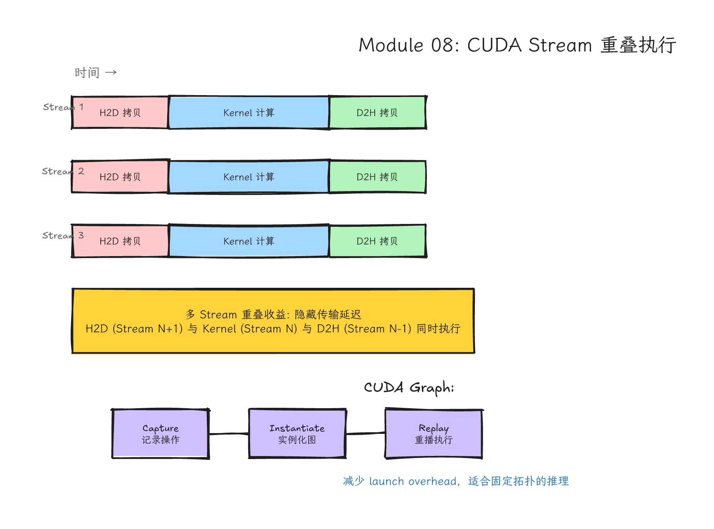
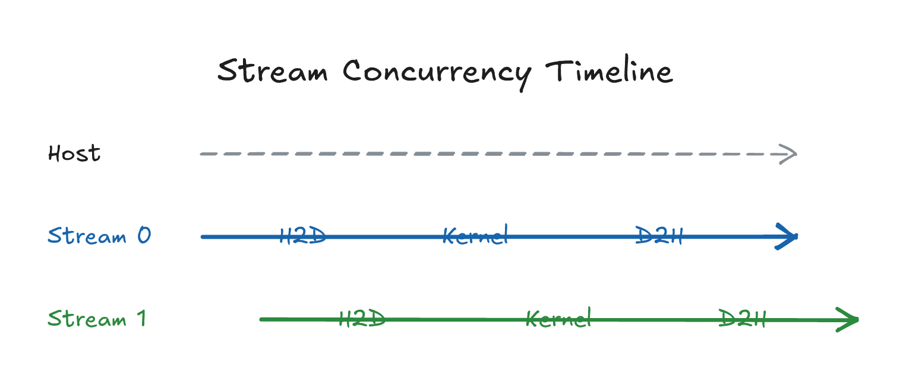
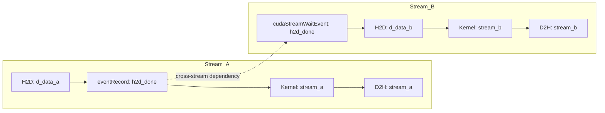
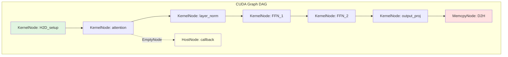
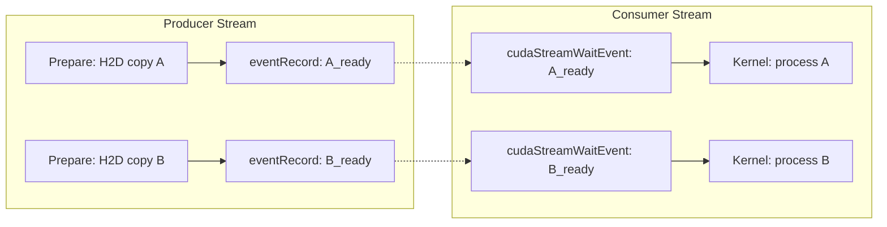

# Module 08: Streams、Events、Overlap 与 CUDA Graphs（精品讲义版）



*图 08-1：多 stream 中 H2D、kernel、D2H 与 event 的重叠时间线。可编辑源图：[`module-08-cuda-stream-overlap.excalidraw`](../diagrams/module-08-cuda-stream-overlap.excalidraw)。*

> **Level**: Advanced
> **Estimated time**: 12-18 小时
> **Prerequisites**: Modules 00-07
Last updated: 2026-06-28  

---

## 学习目标

完成本模块后，你将能够：

1. **解释** CUDA Stream 的 FIFO 语义、默认流（legacy vs per-thread）的行为差异、以及 `cudaStreamNonBlocking` 标志的作用。
2. **描述** GPU Copy Engine 的硬件架构：H2D/D2H/D2D 的 copy engine 数量、带宽、延迟，以及它们如何与 SM 计算 overlap。
3. **编写** 使用多 Stream 实现计算与传输 overlap 的 chunk pipeline 代码，并正确管理 pinned host memory。
4. **使用** CUDA Event 进行精确的 GPU 计时、建立跨 Stream 依赖关系、以及实现细粒度同步。
5. **区分** `cudaStreamSynchronize`、`cudaDeviceSynchronize`、`cudaEventSynchronize` 的语义和适用场景。
6. **捕获** 和 **回放** CUDA Graph，理解 graph 的三种构建方式（stream capture、explicit node API、graph cloning）、节点类型、以及 Runtime API `cudaGraphExecUpdate` / Driver API `cuGraphExecUpdate` 的更新机制。
7. **识别** CUDA Graph 的适用边界：哪些工作流适合 graph（小 kernel 高频调用、固定拓扑的 decode pipeline），哪些不适合（动态控制流、变 shape 的 prefill）。
8. **实现** 基于 Stream + Event 的 Producer-Consumer 并发模式。
9. **理解** Multi-GPU 环境下的 Stream 管理和 peer access 语义。
10. **分析** 真实系统（vLLM、PyTorch、TensorRT）中 CUDA Stream 和 CUDA Graph 的工程实践。

---

## Mental Model



*图 08-2：host enqueue、stream 0/1 的 H2D、kernel、D2H、event 与同步关系。可编辑源图：[`stream-concurrency-timeline.excalidraw`](../diagrams/stream-concurrency-timeline.excalidraw)。*

Stream 是队列，Event 是路标，Sync 是红灯。
Copy Engine 是专用搬运工，SM 是车间工人。两者各干各的，才可能 overlap。
CUDA Graph 是"录播"：先彩排一遍，之后反复播放，省去每次报幕的时间。
Legacy 默认流会和普通 blocking stream 隐式同步；per-thread 默认流更像普通 stream，但如果显式混用 legacy 默认流，仍要按 CUDA 文档处理同步关系。

---

## 5 层次结构总览

本模块按以下层次递进：

| 层次 | 核心问题 | 内容 |
|---|---|---|
| L1 问题背景 | 为什么需要 Stream？ | 单 stream 的串行瓶颈、CPU 空等、GPU 资源闲置 |
| L2 直觉类比 | Stream 是什么？ | 传送带、队列、路标、红绿灯 |
| L3 硬件机制 | 为什么能 overlap？ | Copy Engine、SM、Pinned Memory、PCIe/NVLink 带宽 |
| L4 代码路径 | 怎么写？ | 多 stream pipeline、event、graph capture、host function |
| L5 真实系统落点 | 工业界怎么用？ | vLLM CUDA Graph、PyTorch Stream、TensorRT Engine |

---

## L1: 问题背景

在 Module 00-07 中，你写的代码大概长这样：

```cpp
cudaMemcpy(d_x, h_x, bytes, cudaMemcpyHostToDevice);  // 阻塞 CPU
kernel<<<grid, block>>>(d_x, d_y, d_out);              // 异步启动，但 CPU 可能马上 sync
cudaMemcpy(h_out, d_out, bytes, cudaMemcpyDeviceToHost); // 再阻塞 CPU
```

这个模式的问题：

1. CPU 大量时间花在等待上：`cudaMemcpy`（无 Async 后缀）是同步的，CPU 在 memcpy 完成前什么都干不了。
2. GPU 资源利用率低：在 H2D 传输时，SM  idle；在 kernel 计算时，Copy Engine idle。没有"计算打着，传输搬着"的并发。
3. Latency 堆叠：如果处理 N 个 chunk，总时间 ≈ N × (H2D + kernel + D2H)，没有 pipeline 加速。

Stream 让 CPU 提前把任务"排好队"，然后 GPU hardware scheduler 按资源可用性最大化并行度。

能不能 overlap，取决于：
- 数据是否有依赖（下一个 kernel 的输入是否依赖上一个 kernel 的输出）
- Host memory 是否是 pinned（pageable memory 的 async copy 可能退化为同步）
- Copy engine 和 SM 是否有空闲资源
- Kernel 本身是否足够小，不至于占满所有 SM

Stream 给硬件表达并发机会，最终是否并发由硬件决定。验证唯一手段是 Nsight Systems timeline。

---

## L2: 直觉类比

### 单 Stream：一条传送带

```text
时间轴 →
[H2D copy]→[Kernel]→[D2H copy]→[H2D copy]→[Kernel]→[D2H copy]→ ...
```

所有任务按顺序排队。CPU 在每个同步点等。

### 多 Stream：多条传送带

```text
Stream 0: [H2D: chunk0]→[Kernel: chunk0]→[D2H: chunk0]
Stream 1:           [H2D: chunk1]→[Kernel: chunk1]→[D2H: chunk1]
Stream 2:                     [H2D: chunk2]→[Kernel: chunk2]→[D2H: chunk2]
```

如果硬件资源足够，三个阶段的任务可以交错执行：当 Stream 0 在 kernel 计算时，Stream 1 可以 H2D 拷贝，Stream 2 可以 D2H 拷贝。这就是 3-way concurrency。

### Event：路标与红绿灯

Event 是在 stream 中放置的"标记点"：
- 测量从 A 点到 B 点的时间（GPU 计时）
- 让一个 stream 等另一个 stream 的标记点到达（cross-stream dependency）
- 让 CPU 等某个 GPU 标记点到达（细粒度 host sync）

### Sync：红灯

- `cudaDeviceSynchronize()`：所有 stream 全部停下，CPU 等所有 GPU 工作完成。
- `cudaStreamSynchronize()`：CPU 只等某个 stream 完成。
- `cudaEventSynchronize()`：等某个路标到达，比 stream sync 更细。

---

## L3: 硬件机制

### 3.1 Copy Engine 详解

GPU 上有专门的 DMA Copy Engine（有时也叫 Copy Queue 或 DMA Engine），负责执行 host/device 之间的内存传输。Copy Engine 与 SM 是独立的硬件单元，这是计算与传输能够 overlap 的物理前提。

| 传输方向 | 典型硬件支持 | 带宽参考口径 | 是否可与 Kernel 重叠 |
|---|---|---|---|
| H2D (Host to Device) | 1-2 Copy Engines | ~32 GB/s | ✅ 是 |
| D2H (Device to Host) | 1-2 Copy Engines | ~32 GB/s | ✅ 是 |
| D2D (Device to Device，同一 GPU) | 内存控制器 | ~数百 GB/s（HBM 带宽） | ✅ 是 |
| P2P (Peer to Peer，GPU 间) | NVLink / PCIe | H100 NVLink 4 约 900 GB/s 每 GPU 双向聚合；PCIe 4.0 x16 约 32 GB/s 单向、64 GB/s 双向聚合 | ✅ 是 |

关键细节：
- 很多 GPU 只有 1 个 H2D 和 1 个 D2D copy engine（例如较早的 Tesla 系列）。同一方向的两个 async copy 不能 overlap，只能串行。但 H2D 和 D2H 可以双向并发（full-duplex PCIe）。
- 较新的 GPU（如 A100/H100）可能有更多 copy engine。你可以通过 `deviceQuery` 或 `cudaGetDeviceProperties` 的 `asyncEngineCount` 查看。
- 如果两个 H2D copy 同时提交到不同 stream，但只有 1 个 H2D copy engine，它们会在 copy engine 上串行执行，但各自与 SM 计算仍然可以 overlap。

Pinned Memory 的作用：
- `cudaMallocHost` / `cudaHostAlloc` 分配的 host memory 是 page-locked（pinned）的，OS 不会将其换出到磁盘。
- Pinned memory 允许 DMA 控制器直接访问 host physical memory，无需 CPU 介入做 page fault 或 staging buffer。
- `cudaMemcpyAsync` 配合 pinned memory 才能真正异步；如果 host memory 是 pageable，`cudaMemcpyAsync` 可能退化为同步（driver 需要先分配 pinned staging buffer，再同步拷贝）。

### 3.2 SM 与 Kernel 并发

即使 Copy Engine 空闲，两个 kernel 能否同时运行还取决于 SM 占用：
- 如果 kernel A 已经占满了所有 SM，kernel B 必须等待。
- 如果 kernel A 只用了 50% SM，kernel B 可以与之并发（concurrent kernels）。
- 从 Fermi 开始支持 concurrent kernels；Kepler 及以后大幅改进；现代 GPU（Ampere/Hopper）支持更多并发 kernel。

### 3.3 验证手段：Nsight Systems

不要"感觉快了"就断言 overlap 发生了。打开 Nsight Systems，观察 timeline：
- 是否看到不同 stream 的 kernel/copy 在时间上重叠？
- 是否有大量空白（idle gap）？
- 是否有因为 sync 导致的串行化？

```bash
nsys profile -o report ./my_program
# 然后打开 report.nsys-rep 查看 timeline
```

---

## L4: 代码路径

### 4.1 Stream 的创建与销毁开销

创建 stream 的开销通常很小（微秒级），但大量创建/销毁（如每帧新建一个 stream）仍有成本。推荐做法：
- 在程序初始化时创建一组 stream，重复使用。
- 使用 stream pool 模式，避免运行时的 `cudaStreamCreate`/`cudaStreamDestroy`。

```cpp
cudaStream_t streams[NUM_STREAMS];
for (int i = 0; i < NUM_STREAMS; ++i) {
    // 默认创建的是 blocking stream（会与 legacy 默认流同步）
    cudaStreamCreate(&streams[i]);
    
    // 如果需要与 legacy 默认流完全隔离，使用：
    // cudaStreamCreateWithFlags(&streams[i], cudaStreamNonBlocking);
}
```

### 4.2 默认流：Legacy vs Per-Thread

这是 CUDA 中常见且隐蔽的并发陷阱。

#### Legacy 默认流（NULL Stream / Stream 0）

- 每个设备有一个全局 legacy 默认流。
- 当 legacy 流中有操作时，它会先等待所有其他 blocking stream 完成；所有其他 blocking stream 也必须等 legacy 流完成。
- 这意味着如果你在普通 blocking stream 中有一系列操作，中间不小心在 legacy 默认流里发了 kernel，这些 blocking stream 会通过 legacy 默认流形成额外依赖；`cudaStreamNonBlocking` 创建的 stream 是例外。

```cpp
cudaStream_t s;
cudaStreamCreate(&s);  // blocking stream（默认）
kernel1<<<1, 1, 0, s>>>();   // 在 stream s
kernel2<<<1, 1>>>();          // 在 legacy 默认流！
kernel3<<<1, 1, 0, s>>>();   // 在 stream s
// 实际执行顺序：kernel1 → kernel2 → kernel3（全部串行！）
```

#### Per-Thread 默认流（CUDA 7+）

- 每个 host 线程有自己的默认流，不与其他线程的默认流同步。
- 行为类似于普通显式创建的 stream（不 blocking）。
- 启用方式：
  - 编译时：`nvcc --default-stream per-thread`
  - 或定义宏：`#define CUDA_API_PER_THREAD_DEFAULT_STREAM` 在包含 cuda_runtime.h 之前
  - 显式 handle：`cudaStreamPerThread`

```cpp
// 编译：nvcc --default-stream per-thread mycode.cu -o mycode
kernel1<<<1, 1, 0, cudaStreamPerThread>>>();
kernel2<<<1, 1, 0, cudaStreamPerThread>>>();  // 同一个线程内按序，但不阻塞其他流
```

对比表：

| 特性 | Legacy 默认流 | Per-Thread 默认流 | 显式创建的非阻塞流 |
|---|---|---|---|
| 与 blocking stream 同步 | ✅ 与 blocking stream 隐式同步 | ❌ 不同步 | ❌ 不同步 |
| 与 legacy 默认流同步 | 自身 | ✅ 同步 | ❌ 不同步（NonBlocking） |
| 多线程行为 | 所有线程共享同一流 | 每线程独立流 | 各线程独立 handle |
| 适用场景 | 简单程序、全局 sync | 多线程并发 | 精细控制 |

> ⚠️ **陷阱**：如果代码中混合使用 legacy 默认流和 per-thread 默认流，per-thread 默认流仍会与 legacy 默认流同步。这是最容易踩的坑。

### 4.3 Stream Priority

CUDA 允许为 stream 设置优先级，让某些任务优先获得调度：

```cpp
int least_priority, greatest_priority;
cudaDeviceGetStreamPriorityRange(&least_priority, &greatest_priority);
// CUDA 约定：数值越小，优先级越高。
// 常见情况下 least_priority = 0，greatest_priority = -1 或更小。
// 注意：具体范围因设备而异。
cudaStream_t stream_high;
cudaStreamCreateWithPriority(&stream_high, cudaStreamNonBlocking, greatest_priority);
```

限制：
- Priority 只在 kernel 抢占和调度队列排序中生效，不保证绝对优先级。
- 只有计算任务（kernel）受 priority 影响；memcpy 通常不受 stream priority 影响。
- 高 priority stream 中的 kernel 会优先调度尚未驻留到 SM 的 thread blocks；runtime 可能使用 preemption，但不保证已经在 SM 上运行的低优先级工作会被立即抢占。

---

### 4.4 代码 1：多 Stream 重叠 Chunk Pipeline（完整版）

下面的代码展示了把一个大数组拆分成多个 chunk，使用多个 stream 形成 **3-stage pipeline**（H2D → Kernel → D2H），并正确处理 pinned memory、stream 生命周期和 chunk 边界。

```cpp
// file: two_stream_pipeline.cu
// compile: nvcc -O2 two_stream_pipeline.cu -o two_stream_pipeline

#include <cuda_runtime.h>
#include <iostream>
#include <vector>
#include <cmath>
#include <algorithm>
#include <cstdlib>

#define CUDA_CHECK(call)                                                       \
    do {                                                                       \
        cudaError_t err = call;                                                \
        if (err != cudaSuccess) {                                              \
            std::cerr << "CUDA error at " << __FILE__ << ":" << __LINE__      \
                      << " code=" << err << " \"" << cudaGetErrorString(err)   \
                      << "\"" << std::endl;                                    \
            exit(1);                                                           \
        }                                                                      \
    } while (0)

// 简单 saxpy kernel: y = a * x + y
__global__ void saxpy_kernel(const float* x, const float* y, float* out,
                              float a, int n) {
    int idx = blockIdx.x * blockDim.x + threadIdx.x;
    if (idx < n) {
        out[idx] = a * x[idx] + y[idx];
    }
}

// 双 stream chunk pipeline，使用 pinned host memory
void run_two_stream_pipeline(const float* h_x, const float* h_y, float* h_out,
                             int total_n, int chunk_elems) {
    const int num_streams = 2;
    cudaStream_t streams[num_streams];
    
    // 1. 创建 stream（使用 NonBlocking 避免与 legacy 默认流隐式同步）
    for (int s = 0; s < num_streams; ++s) {
        CUDA_CHECK(cudaStreamCreateWithFlags(&streams[s], cudaStreamNonBlocking));
    }

    // 2. 为每个 stream 分配 device 缓冲区（ping-pong buffer）
    float *d_x[num_streams], *d_y[num_streams], *d_out[num_streams];
    size_t chunk_bytes = static_cast<size_t>(chunk_elems) * sizeof(float);
    for (int s = 0; s < num_streams; ++s) {
        CUDA_CHECK(cudaMalloc(&d_x[s], chunk_bytes));
        CUDA_CHECK(cudaMalloc(&d_y[s], chunk_bytes));
        CUDA_CHECK(cudaMalloc(&d_out[s], chunk_bytes));
    }

    const int block = 256;
    
    // 3. 主循环：按 chunk 提交任务到不同的 stream
    for (int offset = 0; offset < total_n; offset += chunk_elems) {
        int s = (offset / chunk_elems) % num_streams;  // 轮询选择 stream
        int this_chunk = std::min(chunk_elems, total_n - offset);
        size_t bytes = static_cast<size_t>(this_chunk) * sizeof(float);

        // 3a. H2D：把 host 数据拷贝到当前 stream 的 device buffer
        // 注意：h_x/h_y/h_out 必须是 pinned memory（cudaMallocHost）
        CUDA_CHECK(cudaMemcpyAsync(d_x[s], h_x + offset, bytes,
                                   cudaMemcpyHostToDevice, streams[s]));
        CUDA_CHECK(cudaMemcpyAsync(d_y[s], h_y + offset, bytes,
                                   cudaMemcpyHostToDevice, streams[s]));

        // 3b. Kernel：在当前 stream 中执行计算
        int grid = (this_chunk + block - 1) / block;
        saxpy_kernel<<<grid, block, 0, streams[s]>>>(
            d_x[s], d_y[s], d_out[s], 2.0f, this_chunk);
        CUDA_CHECK(cudaGetLastError());  // 检查 kernel 启动错误

        // 3c. D2H：把结果拷回 host
        CUDA_CHECK(cudaMemcpyAsync(h_out + offset, d_out[s], bytes,
                                   cudaMemcpyDeviceToHost, streams[s]));
    }

    // 4. 只在所有工作提交后同步。不要在每个 chunk 后 cudaDeviceSynchronize！
    for (int s = 0; s < num_streams; ++s) {
        CUDA_CHECK(cudaStreamSynchronize(streams[s]));
    }

    // 5. 清理资源
    for (int s = 0; s < num_streams; ++s) {
        CUDA_CHECK(cudaFree(d_x[s]));
        CUDA_CHECK(cudaFree(d_y[s]));
        CUDA_CHECK(cudaFree(d_out[s]));
        CUDA_CHECK(cudaStreamDestroy(streams[s]));
    }
}

int main() {
    const int N = 1 << 24;  // 16M elements
    const int CHUNK = 1 << 20; // 1M elements per chunk
    
    float *h_x, *h_y, *h_out;
    // 使用 pinned memory 确保 async copy 真正异步
    CUDA_CHECK(cudaMallocHost(&h_x, N * sizeof(float)));
    CUDA_CHECK(cudaMallocHost(&h_y, N * sizeof(float)));
    CUDA_CHECK(cudaMallocHost(&h_out, N * sizeof(float)));
    
    // 初始化数据
    for (int i = 0; i < N; ++i) {
        h_x[i] = 1.0f;
        h_y[i] = 2.0f;
    }
    
    run_two_stream_pipeline(h_x, h_y, h_out, N, CHUNK);
    
    // 验证
    float expected = 2.0f * 1.0f + 2.0f; // a*x + y = 4.0
    bool ok = true;
    for (int i = 0; i < N && ok; ++i) {
        if (std::fabs(h_out[i] - expected) > 1e-5f) ok = false;
    }
    std::cout << (ok ? "PASS" : "FAIL") << std::endl;
    
    CUDA_CHECK(cudaFreeHost(h_x));
    CUDA_CHECK(cudaFreeHost(h_y));
    CUDA_CHECK(cudaFreeHost(h_out));
    return 0;
}
```

关键设计点：
1. Pinned memory：`h_x/h_y/h_out` 必须是 `cudaMallocHost` 分配的，否则 `cudaMemcpyAsync` 可能退化为同步。
2. Non-blocking stream：`cudaStreamCreateWithFlags(..., cudaStreamNonBlocking)` 确保这些 stream 不会与 legacy 默认流隐式同步。
3. Chunk 大小：`CHUNK` 是调参点。太小则 launch overhead 占比高；太大则 overlap 机会少。推荐用 Nsight Systems 扫一组值。
4. 同步位置：只在所有任务提交后 `cudaStreamSynchronize`，不要在 loop 内部 sync。
5. Error checking：`cudaGetLastError()` 在 kernel 启动后立刻检查，确保异步 launch 没有参数错误。

---

### 4.5 单 Stream vs 多 Stream Timeline（Mermaid 图）

```mermaid
gantt
    title 单 Stream vs 双 Stream Pipeline 时间线对比
    dateFormat X
    axisFormat %s
    
    section 单 Stream（串行）
    H2D chunk0       :a1, 0, 2
    Kernel chunk0    :a2, after a1, 3
    D2H chunk0       :a3, after a2, 2
    H2D chunk1       :a4, after a3, 2
    Kernel chunk1    :a5, after a4, 3
    D2H chunk1       :a6, after a5, 2
    
    section 双 Stream（Overlap）
    H2D chunk0 (S0)  :b1, 0, 2
    Kernel chunk0(S0):b2, after b1, 3
    D2H chunk0 (S0)  :b3, after b2, 2
    
    H2D chunk1 (S1)  :b4, 2, 2
    Kernel chunk1(S1):b5, after b4, 3
    D2H chunk1 (S1)  :b6, after b5, 2
```



解读：在双 Stream 场景下，Stream 1 的 H2D 可以与 Stream 0 的 Kernel 在时间上重叠，形成 pipeline。理想情况下总时间会接近 (N_chunks × max(H2D, Kernel, D2H))，而非 N_chunks × (H2D + Kernel + D2H)。

---

### 4.6 代码 2：CUDA Event 用于跨 Stream 同步和计时

Event 是 CUDA 中最精细的同步原语。下面是完整示例：使用 event 计时 kernel 执行时间，并使用 `cudaStreamWaitEvent` 建立跨 stream 依赖。

```cpp
// file: event_sync_timing.cu
// compile: nvcc -O2 event_sync_timing.cu -o event_sync_timing

#include <cuda_runtime.h>
#include <iostream>
#include <vector>
#include <cmath>
#include <cstdlib>

#define CUDA_CHECK(call)                                                       \
    do {                                                                       \
        cudaError_t err = call;                                                \
        if (err != cudaSuccess) {                                              \
            std::cerr << "CUDA error at " << __FILE__ << ":" << __LINE__      \
                      << " code=" << err << " \"" << cudaGetErrorString(err)   \
                      << "\"" << std::endl;                                    \
            exit(1);                                                           \
        }                                                                      \
    } while (0)

__global__ void compute_kernel(float* data, int n, float scale) {
    int idx = blockIdx.x * blockDim.x + threadIdx.x;
    if (idx < n) {
        // 模拟一些计算
        float v = data[idx];
        for (int i = 0; i < 100; ++i) {
            v = v * scale + 1.0f;
        }
        data[idx] = v;
    }
}

int main() {
    const int N = 1 << 22; // 4M elements
    const size_t bytes = N * sizeof(float);
    
    // 创建两个 non-blocking stream
    cudaStream_t stream_a, stream_b;
    CUDA_CHECK(cudaStreamCreateWithFlags(&stream_a, cudaStreamNonBlocking));
    CUDA_CHECK(cudaStreamCreateWithFlags(&stream_b, cudaStreamNonBlocking));
    
    // 分配 pinned host 和 device 内存
    float *h_data, *d_data_a, *d_data_b;
    CUDA_CHECK(cudaMallocHost(&h_data, bytes));
    CUDA_CHECK(cudaMalloc(&d_data_a, bytes));
    CUDA_CHECK(cudaMalloc(&d_data_b, bytes));
    
    for (int i = 0; i < N; ++i) h_data[i] = static_cast<float>(i);
    
    // ========== 1. 使用 Event 进行 GPU 计时 ==========
    cudaEvent_t start, stop;
    CUDA_CHECK(cudaEventCreate(&start));
    CUDA_CHECK(cudaEventCreate(&stop));
    
    // 记录开始事件到 stream_a
    CUDA_CHECK(cudaEventRecord(start, stream_a));
    
    CUDA_CHECK(cudaMemcpyAsync(d_data_a, h_data, bytes, cudaMemcpyHostToDevice, stream_a));
    int block = 256;
    int grid = (N + block - 1) / block;
    compute_kernel<<<grid, block, 0, stream_a>>>(d_data_a, N, 0.99f);
    CUDA_CHECK(cudaGetLastError());
    CUDA_CHECK(cudaMemcpyAsync(h_data, d_data_a, bytes, cudaMemcpyDeviceToHost, stream_a));
    
    // 记录结束事件到 stream_a
    CUDA_CHECK(cudaEventRecord(stop, stream_a));
    
    // 同步事件（阻塞 CPU 直到 stop 事件到达）
    CUDA_CHECK(cudaEventSynchronize(stop));
    
    float elapsed_ms = 0.0f;
    CUDA_CHECK(cudaEventElapsedTime(&elapsed_ms, start, stop));
    std::cout << "GPU elapsed time (Event timing): " << elapsed_ms << " ms" << std::endl;
    
    // ========== 2. 使用 Event 建立跨 Stream 依赖 ==========
    // 场景：stream_b 必须等 stream_a 的 H2D 完成后才能开始自己的 H2D
    // 这通过 "在 stream_a 中记录事件，然后让 stream_b 等待该事件" 实现
    
    cudaEvent_t h2d_done_event;
    CUDA_CHECK(cudaEventCreateWithFlags(&h2d_done_event, cudaEventDisableTiming));
    // cudaEventDisableTiming：如果 event 只用于同步、不需要计时，设置此标志可提升性能
    
    // 重新初始化数据
    for (int i = 0; i < N; ++i) h_data[i] = static_cast<float>(i);
    
    // Stream A：H2D → kernel → D2H
    CUDA_CHECK(cudaMemcpyAsync(d_data_a, h_data, bytes, cudaMemcpyHostToDevice, stream_a));
    CUDA_CHECK(cudaEventRecord(h2d_done_event, stream_a));  // 标记 H2D 完成点
    compute_kernel<<<grid, block, 0, stream_a>>>(d_data_a, N, 0.99f);
    CUDA_CHECK(cudaGetLastError());
    CUDA_CHECK(cudaMemcpyAsync(h_data, d_data_a, bytes, cudaMemcpyDeviceToHost, stream_a));
    
    // Stream B：等待 stream_a 的 H2D 完成事件后，才开始 H2D
    // 注意：cudaStreamWaitEvent 只影响调用之后提交到 stream_b 的操作
    CUDA_CHECK(cudaStreamWaitEvent(stream_b, h2d_done_event, 0));
    
    // 现在 stream_b 的以下操作会排在 h2d_done_event 之后
    CUDA_CHECK(cudaMemcpyAsync(d_data_b, h_data, bytes, cudaMemcpyHostToDevice, stream_b));
    compute_kernel<<<grid, block, 0, stream_b>>>(d_data_b, N, 1.01f);
    CUDA_CHECK(cudaGetLastError());
    CUDA_CHECK(cudaMemcpyAsync(h_data, d_data_b, bytes, cudaMemcpyDeviceToHost, stream_b));
    
    // 同步两个 stream
    CUDA_CHECK(cudaStreamSynchronize(stream_a));
    CUDA_CHECK(cudaStreamSynchronize(stream_b));
    
    std::cout << "Cross-stream dependency via Event: DONE" << std::endl;
    
    // ========== 3. 使用 Event Query（非阻塞轮询）==========
    cudaEvent_t query_event;
    CUDA_CHECK(cudaEventCreate(&query_event));
    CUDA_CHECK(cudaEventRecord(query_event, stream_a));
    
    // 非阻塞检查事件是否完成
    int iter = 0;
    while (cudaEventQuery(query_event) == cudaErrorNotReady) {
        ++iter;
        // CPU 可以做其他轻量工作，而不是阻塞等待
    }
    std::cout << "Event polled " << iter << " times before ready" << std::endl;
    
    // 清理
    CUDA_CHECK(cudaEventDestroy(start));
    CUDA_CHECK(cudaEventDestroy(stop));
    CUDA_CHECK(cudaEventDestroy(h2d_done_event));
    CUDA_CHECK(cudaEventDestroy(query_event));
    CUDA_CHECK(cudaStreamDestroy(stream_a));
    CUDA_CHECK(cudaStreamDestroy(stream_b));
    CUDA_CHECK(cudaFree(d_data_a));
    CUDA_CHECK(cudaFree(d_data_b));
    CUDA_CHECK(cudaFreeHost(h_data));
    
    return 0;
}
```

Event 机制深入：
1. `cudaEventCreateWithFlags(..., cudaEventDisableTiming)`：如果 event 只用于同步、不需要计时，这个标志可以减少 event 的同步开销。计时 event 需要额外的硬件 counter，而 disable-timing 的 event 更轻量。
2. `cudaEventBlockingSync`：如果希望 `cudaEventSynchronize` 时不忙等（spin-wait），而是让出 CPU（block/yield），可以设置此标志。对 power-sensitive 应用有用，但可能增加 latency。
3. `cudaEventRecord(event, stream)`：将 event 放入 stream 队列。当 stream 执行到这个 event 时，标记为 occurred。
4. `cudaStreamWaitEvent(stream, event)`：让 stream 等待某个 event。注意：它只影响调用之后提交到该 stream 的操作。如果 stream 已经有操作在队列中，它们不受影响。
5. `cudaEventSynchronize(event)`：阻塞 CPU 线程直到 event occurred。比 `cudaStreamSynchronize` 更细粒度，可以只等某个时间点，而不是整个 stream。
6. `cudaEventQuery(event)`：非阻塞检查。返回 `cudaSuccess` 表示 event 已到达；`cudaErrorNotReady` 表示尚未到达。适合 CPU 做轮询或异步协作。

---

### 4.7 Event 依赖关系图（Mermaid）



解读：`h2d_done_event` 在 Stream A 中记录，在 Stream B 中等待。这建立了跨流依赖：Stream B 的 H2D 不会早于 Stream A 的 H2D 完成。但 Stream A 的 Kernel 和 Stream B 的后续操作在满足依赖的前提下仍可 overlap。

---

### 4.8 Stream 同步层次：三种 Sync 的语义对比

| API | 阻塞对象 | 粒度 | 适用场景 |
|---|---|---|---|
| `cudaDeviceSynchronize()` | 整个设备上的所有 stream | 最粗 | 调试、程序关键节点确认所有 GPU 工作完成 |
| `cudaStreamSynchronize(stream)` | 指定 stream | 中等 | 等待某个 pipeline 完成，不阻塞其他 stream |
| `cudaEventSynchronize(event)` | 指定 event | 最细 | 只等某个 checkpoint，stream 后续工作可能仍在跑 |

正确用法原则：
- 优先使用最细粒度的 sync。
- 如果你只想确认 chunk 0 的 H2D 完成，用 `cudaEventSynchronize` 而不是 `cudaDeviceSynchronize`。
- `cudaDeviceSynchronize` 是"核武器"，它会让整个 GPU 停下来，所有 stream 的并发机会全部归零。

---

### 4.9 CUDA Graphs 深入

#### 为什么需要 Graph？

当 CPU 发射大量小 kernel 时，launch overhead 可能成为瓶颈。例如：
- LLM decode 阶段每步发射几十个 kernel（attention、FFN、layer norm）。
- 每个 kernel 的计算量很小（batch_size × 1 token），但 launch overhead（10-30 μs）占比很高。
- 100 个 kernel × 15 μs = 1.5 ms overhead，可能比实际计算时间还长。

CUDA Graph 的解决思路是一次 capture，多次 replay。Capture 阶段记录所有 kernel launch、memcpy、memset 的参数和依赖关系；Replay 阶段直接提交已记录的工作流，省去重复的 driver/runtime 调度开销。

Graph 的适用场景：
1. 高频重复、拓扑固定的工作流（LLM decode、training step）
2. 小 kernel 多、launch overhead 占比高的场景
3. 需要最小化 CPU 介入的 autonomous GPU pipeline

Graph 的局限：
1. Stream capture 不能自动捕获任意 host 端动态控制流：普通 Python/C++ 的 if/else、while 循环在 capture 期间只会把本次实际执行到的 CUDA 操作录进 graph。Kernel 内部的 thread 级控制流不受影响；若要在 graph 本身表达条件分支，需要使用显式 graph API 的 conditional node，并受 Toolkit 版本和 API 限制约束。
2. Kernel 参数在 capture/instantiate 时会被记录；如果 replay 时 grid/block/smem、指针或 scalar 参数变化，需要用 graph update / node params update / pointer indirection，或重新 capture。不是“动态参数完全不能捕获”，而是不能假设 replay 会自动读取新的 host 侧启动参数。
3. 不能捕获同步 API：`cudaDeviceSynchronize`、`cudaStreamSynchronize` 在 capture 期间会报错。
4. 内存地址必须稳定：capture 时记录的指针地址在 replay 时必须是有效的。如果中间 tensor 被 free/realloc，地址变了，需要 update graph 或重新 capture。
5. Scalar 参数固化：capture 时 kernel 的 scalar 参数（如 `int n`）会被记录为常量。如果 replay 时该值变化，需要使用 update 机制或 pointer indirection。

---

### 4.10 Graph Capture 的三种方式

#### 方式一：Stream Capture（最常用）

在 stream 中标记 capture 开始和结束，runtime 自动记录期间所有 GPU 操作。

```cpp
cudaGraph_t graph;
CUDA_CHECK(cudaStreamBeginCapture(stream, cudaStreamCaptureModeGlobal));
// 或 cudaStreamCaptureModeThreadLocal / cudaStreamCaptureModeRelaxed

// ... 正常的 kernel launch、memcpy ...

CUDA_CHECK(cudaStreamEndCapture(stream, &graph));
```

Capture mode：
- `cudaStreamCaptureModeGlobal`：capture 期间，如果**任何 host thread** 调用了可能破坏 capture 安全性的 CUDA API，当前 capture 会被 invalidated。它控制的是 unsafe API 的检查范围，不是“把整个 context 的所有操作都录进 graph”。
- `cudaStreamCaptureModeThreadLocal`：只检查当前 host thread 的 unsafe API 调用；其他 host thread 的潜在不安全调用不会因此让本次 capture 失效。
- `cudaStreamCaptureModeRelaxed`：检查最宽松，允许更多 API 在 capture 期间出现；只有在你明确知道这些调用不会破坏 graph 依赖时才使用。

#### 方式二：Explicit Node API（最灵活）

手动构建 graph 节点，不依赖 stream capture。适合从其他框架（如 DNN 图）转换而来。

```cpp
cudaGraph_t graph;
CUDA_CHECK(cudaGraphCreate(&graph, 0));

cudaGraphNode_t kernelNode;
cudaKernelNodeParams kernelParams = {0};
kernelParams.func = (void*)my_kernel;
kernelParams.gridDim = dim3(grid, 1, 1);
kernelParams.blockDim = dim3(block, 1, 1);
kernelParams.sharedMemBytes = 0;
void* kernelArgs[] = {&d_data, &n};
kernelParams.kernelParams = kernelArgs;
kernelParams.extra = nullptr;

CUDA_CHECK(cudaGraphAddKernelNode(&kernelNode, graph, nullptr, 0, &kernelParams));
```

#### 方式三：Graph Cloning

对已有 graph 进行深拷贝，适合需要多个相似 graph 的场景。

```cpp
cudaGraph_t clonedGraph;
CUDA_CHECK(cudaGraphClone(&clonedGraph, originalGraph));
```

---

### 4.11 Graph 节点类型

| 节点类型 | API | 说明 |
|---|---|---|
| Kernel | `cudaGraphAddKernelNode` | 执行 CUDA kernel |
| Memcpy | `cudaGraphAddMemcpyNode` | 设备/主机间内存拷贝 |
| Memset | `cudaGraphAddMemsetNode` | 内存初始化 |
| Empty | `cudaGraphAddEmptyNode` | 空节点，用于依赖占位 |
| Conditional | `cudaGraphAddConditionalNode`（CUDA 12.4 提供 IF/WHILE conditional nodes；CUDA 12.8 增强 IF/ELSE 与 SWITCH） | 条件分支（设备端控制流） |
| Host | `cudaGraphAddHostNode` | 在 host 执行回调函数 |
| Child Graph | `cudaGraphAddChildGraphNode` | 嵌入另一个 graph |

---

### 4.12 Graph 的更新和 Replay

Capture 后需要 Instantiate（实例化）才能执行：

```cpp
cudaGraphExec_t graphExec;
CUDA_CHECK(cudaGraphInstantiate(&graphExec, graph, 0));

// 执行 graph（可重复调用）
CUDA_CHECK(cudaGraphLaunch(graphExec, stream));

// 销毁
CUDA_CHECK(cudaGraphExecDestroy(graphExec));
CUDA_CHECK(cudaGraphDestroy(graph));
```

Graph Update：
如果只有少量参数变化（如 kernel 参数中的指针或标量），可以使用 `cudaGraphExecUpdate` 避免重新 instantiate。注意下面代码使用的是 CUDA 12+ / 当前文档中的 `cudaGraphExecUpdateResultInfo` 签名；CUDA 11.x 旧工具链的参数签名不同，移植时要查本机 Runtime API 文档。

```cpp
cudaGraphExecUpdateResultInfo updateResult;
CUDA_CHECK(cudaGraphExecUpdate(graphExec, updatedGraph, &updateResult));
if (updateResult.result == cudaGraphExecUpdateSuccess) {
    // 更新成功，无需重新 instantiate
} else {
    // 更新失败，需要重新 instantiate
    cudaGraphExecDestroy(graphExec);
    CUDA_CHECK(cudaGraphInstantiate(&graphExec, updatedGraph, 0));
}
```

现代 CUDA Runtime 的 `cudaGraphInstantiate` 直接接受 `flags` 参数；旧资料中常见的 `cudaGraphInstantiate(&exec, graph, errorNode, logBuffer, bufferSize)` 是早期签名，复制到新 Toolkit 时可能不再匹配。需要更详细错误信息或上传控制时，再查当前文档中的 `cudaGraphInstantiateWithParams` / 相关 flags。

---

### 4.13 CUDA Graph 结构图（Mermaid）



---

### 4.14 代码 3：CUDA Graph Capture 和 Replay 完整示例

```cpp
// file: cuda_graph_capture.cu
// compile: nvcc -O2 cuda_graph_capture.cu -o cuda_graph_capture
// requires: CUDA 12+ for the cudaGraphInstantiate(&exec, graph, flags) signature below.
// CUDA 11.x examples often use the older errorNode/logBuffer signature; check your Runtime API docs.

#include <cuda_runtime.h>
#include <iostream>
#include <vector>
#include <cmath>
#include <cstdlib>

#define CUDA_CHECK(call)                                                       \
    do {                                                                       \
        cudaError_t err = call;                                                \
        if (err != cudaSuccess) {                                              \
            std::cerr << "CUDA error at " << __FILE__ << ":" << __LINE__      \
                      << " code=" << err << " \"" << cudaGetErrorString(err)   \
                      << "\"" << std::endl;                                    \
            exit(1);                                                           \
        }                                                                      \
    } while (0)

__global__ void add_kernel(const float* a, const float* b, float* c, int n) {
    int idx = blockIdx.x * blockDim.x + threadIdx.x;
    if (idx < n) {
        c[idx] = a[idx] + b[idx];
    }
}

__global__ void scale_kernel(float* data, int n, float scale) {
    int idx = blockIdx.x * blockDim.x + threadIdx.x;
    if (idx < n) {
        data[idx] *= scale;
    }
}

int main() {
    const int N = 1 << 20; // 1M elements
    const size_t bytes = N * sizeof(float);
    const int block = 256;
    const int grid = (N + block - 1) / block;
    
    // 分配 pinned host 和 device 内存
    float *h_a, *h_b, *h_c;
    float *d_a, *d_b, *d_c;
    CUDA_CHECK(cudaMallocHost(&h_a, bytes));
    CUDA_CHECK(cudaMallocHost(&h_b, bytes));
    CUDA_CHECK(cudaMallocHost(&h_c, bytes));
    CUDA_CHECK(cudaMalloc(&d_a, bytes));
    CUDA_CHECK(cudaMalloc(&d_b, bytes));
    CUDA_CHECK(cudaMalloc(&d_c, bytes));
    
    // 初始化数据
    for (int i = 0; i < N; ++i) {
        h_a[i] = 1.0f;
        h_b[i] = 2.0f;
    }
    
    // 创建 stream
    cudaStream_t stream;
    CUDA_CHECK(cudaStreamCreateWithFlags(&stream, cudaStreamNonBlocking));
    
    // ========== Warmup：先执行几次，确保 GPU 状态稳定 ==========
    for (int i = 0; i < 3; ++i) {
        CUDA_CHECK(cudaMemcpyAsync(d_a, h_a, bytes, cudaMemcpyHostToDevice, stream));
        CUDA_CHECK(cudaMemcpyAsync(d_b, h_b, bytes, cudaMemcpyHostToDevice, stream));
        add_kernel<<<grid, block, 0, stream>>>(d_a, d_b, d_c, N);
        scale_kernel<<<grid, block, 0, stream>>>(d_c, N, 0.5f);
        CUDA_CHECK(cudaMemcpyAsync(h_c, d_c, bytes, cudaMemcpyDeviceToHost, stream));
        CUDA_CHECK(cudaStreamSynchronize(stream));
    }
    
    // ========== Graph Capture ==========
    cudaGraph_t graph;
    CUDA_CHECK(cudaStreamBeginCapture(stream, cudaStreamCaptureModeGlobal));
    
    // 以下所有操作会被记录到 graph 中
    CUDA_CHECK(cudaMemcpyAsync(d_a, h_a, bytes, cudaMemcpyHostToDevice, stream));
    CUDA_CHECK(cudaMemcpyAsync(d_b, h_b, bytes, cudaMemcpyHostToDevice, stream));
    add_kernel<<<grid, block, 0, stream>>>(d_a, d_b, d_c, N);
    scale_kernel<<<grid, block, 0, stream>>>(d_c, N, 0.5f);
    CUDA_CHECK(cudaMemcpyAsync(h_c, d_c, bytes, cudaMemcpyDeviceToHost, stream));
    
    CUDA_CHECK(cudaStreamEndCapture(stream, &graph));
    
    // 实例化 graph（可执行对象）
    cudaGraphExec_t graphExec;
    CUDA_CHECK(cudaGraphInstantiate(&graphExec, graph, 0));
    
    // ========== 修改 host 数据，然后 Replay Graph ==========
    for (int i = 0; i < N; ++i) {
        h_a[i] = 10.0f;
        h_b[i] = 20.0f;
    }
    // 注意：h_a/h_b/h_c 的地址必须与 capture 时一致（pinned memory 地址稳定）
    
    // 执行 graph 10 次
    for (int iter = 0; iter < 10; ++iter) {
        CUDA_CHECK(cudaGraphLaunch(graphExec, stream));
    }
    CUDA_CHECK(cudaStreamSynchronize(stream));
    
    // 验证：c = (a + b) * 0.5 = (10 + 20) * 0.5 = 15.0
    bool ok = true;
    for (int i = 0; i < N && ok; ++i) {
        if (std::fabs(h_c[i] - 15.0f) > 1e-5f) ok = false;
    }
    std::cout << "Graph replay result: " << (ok ? "PASS" : "FAIL") << std::endl;
    
    // ========== 对比：Eager launch 10 次 ==========
    cudaEvent_t start_eager, stop_eager, start_graph, stop_graph;
    CUDA_CHECK(cudaEventCreate(&start_eager));
    CUDA_CHECK(cudaEventCreate(&stop_eager));
    CUDA_CHECK(cudaEventCreate(&start_graph));
    CUDA_CHECK(cudaEventCreate(&stop_graph));
    
    // Eager timing
    CUDA_CHECK(cudaEventRecord(start_eager, stream));
    for (int iter = 0; iter < 100; ++iter) {
        CUDA_CHECK(cudaMemcpyAsync(d_a, h_a, bytes, cudaMemcpyHostToDevice, stream));
        CUDA_CHECK(cudaMemcpyAsync(d_b, h_b, bytes, cudaMemcpyHostToDevice, stream));
        add_kernel<<<grid, block, 0, stream>>>(d_a, d_b, d_c, N);
        scale_kernel<<<grid, block, 0, stream>>>(d_c, N, 0.5f);
        CUDA_CHECK(cudaMemcpyAsync(h_c, d_c, bytes, cudaMemcpyDeviceToHost, stream));
    }
    CUDA_CHECK(cudaEventRecord(stop_eager, stream));
    CUDA_CHECK(cudaEventSynchronize(stop_eager));
    
    float eager_ms = 0;
    CUDA_CHECK(cudaEventElapsedTime(&eager_ms, start_eager, stop_eager));
    
    // Graph timing
    CUDA_CHECK(cudaEventRecord(start_graph, stream));
    for (int iter = 0; iter < 100; ++iter) {
        CUDA_CHECK(cudaGraphLaunch(graphExec, stream));
    }
    CUDA_CHECK(cudaEventRecord(stop_graph, stream));
    CUDA_CHECK(cudaEventSynchronize(stop_graph));
    
    float graph_ms = 0;
    CUDA_CHECK(cudaEventElapsedTime(&graph_ms, start_graph, stop_graph));
    
    std::cout << "Eager 100 iterations: " << eager_ms << " ms" << std::endl;
    std::cout << "Graph 100 iterations: " << graph_ms << " ms" << std::endl;
    std::cout << "Speedup: " << eager_ms / graph_ms << "x" << std::endl;
    
    // 清理
    CUDA_CHECK(cudaGraphExecDestroy(graphExec));
    CUDA_CHECK(cudaGraphDestroy(graph));
    CUDA_CHECK(cudaStreamDestroy(stream));
    CUDA_CHECK(cudaFree(d_a));
    CUDA_CHECK(cudaFree(d_b));
    CUDA_CHECK(cudaFree(d_c));
    CUDA_CHECK(cudaFreeHost(h_a));
    CUDA_CHECK(cudaFreeHost(h_b));
    CUDA_CHECK(cudaFreeHost(h_c));
    CUDA_CHECK(cudaEventDestroy(start_eager));
    CUDA_CHECK(cudaEventDestroy(stop_eager));
    CUDA_CHECK(cudaEventDestroy(start_graph));
    CUDA_CHECK(cudaEventDestroy(stop_graph));
    
    return 0;
}
```

关键设计点：
1. Warmup 必须充分：graph capture 前至少需要 1-3 次 warmup，确保 CUDA runtime 完成 lazy initialization、内存池分配等。
2. **静态地址**：capture 时记录的指针地址在 replay 时必须有效。这里使用 `cudaMallocHost` 和 `cudaMalloc`，地址不变。
3. 数据更新：通过直接修改 pinned memory 中的数据来更新输入；graph 中的 `cudaMemcpyAsync` 会在 replay 时把新数据拷贝到 device。
4. 同步 API 禁止：capture 期间不能调用 `cudaStreamSynchronize` 或 `cudaDeviceSynchronize`。

---

### 4.15 代码 4：Stream Host Function（cudaLaunchHostFunc）

Stream host function 允许在 stream 执行到某个点时，在 CPU 上调用一个函数。它是实现 CPU-GPU 协作 pipeline 的工具。旧接口 `cudaStreamAddCallback` 已不推荐作为新代码主路径；现代代码应优先使用 `cudaLaunchHostFunc`，或在 CUDA Graph 中使用 Host Node。

```cpp
// file: stream_host_func.cu
// compile: nvcc -O2 stream_host_func.cu -o stream_host_func

#include <cuda_runtime.h>
#include <iostream>
#include <chrono>
#include <thread>
#include <cmath>
#include <cstdlib>

#define CUDA_CHECK(call)                                                       \
    do {                                                                       \
        cudaError_t err = call;                                                \
        if (err != cudaSuccess) {                                              \
            std::cerr << "CUDA error at " << __FILE__ << ":" << __LINE__      \
                      << " code=" << err << " \"" << cudaGetErrorString(err)   \
                      << "\"" << std::endl;                                    \
            exit(1);                                                           \
        }                                                                      \
    } while (0)

// CUDA Host Function 函数签名
// 注意：host function 在 CUDA runtime 管理的 host 线程中执行，不是调用者的线程。
void CUDART_CB myHostFunction(void* userData) {
    int* chunkId = static_cast<int*>(userData);
    std::cout << "[HostFunc] Chunk " << *chunkId
              << " processing completed on GPU." << std::endl;
    
    // 这里可以执行轻量的 CPU 工作，例如：
    // - 通知生产者准备下一个 chunk
    // - 更新进度计数器
    // - 触发 CPU 侧的 I/O 操作
    
    // 警告：host function 中不能调用 CUDA API，且不能阻塞太久，
    // 否则会影响后续 stream 工作的调度。
    
    delete chunkId;  // 清理用户数据
}

__global__ void process_kernel(float* data, int n) {
    int idx = blockIdx.x * blockDim.x + threadIdx.x;
    if (idx < n) {
        data[idx] = data[idx] * 2.0f + 1.0f;
    }
}

int main() {
    const int N = 1 << 18; // 256K elements
    const size_t bytes = N * sizeof(float);
    
    float *h_data, *d_data;
    CUDA_CHECK(cudaMallocHost(&h_data, bytes));
    CUDA_CHECK(cudaMalloc(&d_data, bytes));
    
    for (int i = 0; i < N; ++i) h_data[i] = static_cast<float>(i);
    
    cudaStream_t stream;
    CUDA_CHECK(cudaStreamCreateWithFlags(&stream, cudaStreamNonBlocking));
    
    // 模拟 4 个 chunk 的 pipeline
    const int numChunks = 4;
    int chunkSize = N / numChunks;
    size_t chunkBytes = chunkSize * sizeof(float);
    
    for (int i = 0; i < numChunks; ++i) {
        float* h_chunk = h_data + i * chunkSize;
        float* d_chunk = d_data + i * chunkSize;
        
        // H2D
        CUDA_CHECK(cudaMemcpyAsync(d_chunk, h_chunk, chunkBytes,
                                   cudaMemcpyHostToDevice, stream));
        
        // Kernel
        int block = 256;
        int grid = (chunkSize + block - 1) / block;
        process_kernel<<<grid, block, 0, stream>>>(d_chunk, chunkSize);
        CUDA_CHECK(cudaGetLastError());
        
        // D2H
        CUDA_CHECK(cudaMemcpyAsync(h_chunk, d_chunk, chunkBytes,
                                   cudaMemcpyDeviceToHost, stream));
        
        // 在 stream 中插入 host function：当本 chunk 的 D2H 完成后触发
        int* userData = new int(i);  // 注意：host function 负责 delete
        CUDA_CHECK(cudaLaunchHostFunc(stream, myHostFunction, userData));
    }
    
    // 同步整个 stream
    CUDA_CHECK(cudaStreamSynchronize(stream));
    std::cout << "All chunks completed." << std::endl;
    
    // 验证
    bool ok = true;
    for (int i = 0; i < N && ok; ++i) {
        float expected = i * 2.0f + 1.0f;
        if (std::fabs(h_data[i] - expected) > 1e-5f) ok = false;
    }
    std::cout << (ok ? "PASS" : "FAIL") << std::endl;
    
    CUDA_CHECK(cudaStreamDestroy(stream));
    CUDA_CHECK(cudaFree(d_data));
    CUDA_CHECK(cudaFreeHost(h_data));
    return 0;
}
```

Stream Host Function 注意事项：
1. **线程安全**：host function 在 CUDA runtime 管理的 host 线程中执行，不是调用者的 host 线程。因此不能假设它与主线程的执行顺序，除非用自己的同步原语表达。
2. **CUDA API 限制**：host function 中不能调用 CUDA API；如果需要发起新的 CUDA 工作，应让普通 host 线程在收到通知后提交。
3. **阻塞时间**：host function 不应执行耗时操作，否则会阻塞后续 stream 工作的调度。
4. **User data 生命周期**：传给 host function 的 `userData` 指针必须保持有效直到函数执行。常见做法是用 `new` 分配，在 host function 内 `delete`。

---

### 4.16 Producer-Consumer 模式

Producer-Consumer 是 GPU 并发中实用的设计模式之一：
- Producer（通常是 CPU 或另一个 GPU stream）：生产数据，写入 buffer。
- Consumer（通常是 GPU kernel stream）：消费数据，从 buffer 读取。
- 同步机制：使用 Event 确保 Consumer 不会读取 Producer 尚未写完的数据。



---

### 4.17 代码 5：使用 CUDA Graph 的 Batch Inference Pipeline

这个示例模拟了 LLM decode 阶段的典型工作流：每次推理一个固定 batch 的 token，但不同迭代之间数据变化。使用 CUDA Graph 消除 launch overhead。

```cpp
// file: cuda_graph_batch_inference.cu
// compile: nvcc -O2 cuda_graph_batch_inference.cu -o cuda_graph_batch_inference
// 模拟一个简化的 batch inference pipeline（类似 LLM decode step）

#include <cuda_runtime.h>
#include <iostream>
#include <vector>
#include <random>
#include <cstdlib>
#include <cstring>

#define CUDA_CHECK(call)                                                       \
    do {                                                                       \
        cudaError_t err = call;                                                \
        if (err != cudaSuccess) {                                              \
            std::cerr << "CUDA error at " << __FILE__ << ":" << __LINE__      \
                      << " code=" << err << " \"" << cudaGetErrorString(err)   \
                      << "\"" << std::endl;                                    \
            exit(1);                                                           \
        }                                                                      \
    } while (0)

// 模拟 MLP 层：out = relu(in * W1) * W2
// 为简化，这里使用 element-wise 操作代替 matmul，但保留多 kernel 结构
__global__ void linear_act_kernel(const float* in, float* out, int n) {
    int idx = blockIdx.x * blockDim.x + threadIdx.x;
    if (idx < n) {
        out[idx] = in[idx] > 0 ? in[idx] : 0; // ReLU
    }
}

__global__ void add_bias_kernel(float* data, const float* bias, int n) {
    int idx = blockIdx.x * blockDim.x + threadIdx.x;
    if (idx < n) {
        data[idx] += bias[idx];
    }
}

__global__ void softmax_kernel(float* data, int n) {
    // 简化为 softmax 的一个 step：data[i] = exp(data[i]) / sum(exp)
    // 实际实现会用 shared memory 做 reduction，这里仅示意
    int idx = blockIdx.x * blockDim.x + threadIdx.x;
    if (idx < n) {
        data[idx] = expf(data[idx]); // 简化：不做归一化，仅示意 kernel 链
    }
}

class BatchInferenceGraph {
public:
    int batchSize;
    int hiddenDim;
    size_t bytes;
    
    float *d_input, *d_output, *d_intermediate, *d_bias;
    float *h_input;  // pinned input buffer
    
    cudaStream_t stream;
    cudaGraph_t graph;
    cudaGraphExec_t graphExec;
    
    BatchInferenceGraph(int batch, int hidden) 
        : batchSize(batch), hiddenDim(hidden) {
        bytes = static_cast<size_t>(batchSize * hiddenDim) * sizeof(float);
        
        CUDA_CHECK(cudaMallocHost(&h_input, bytes));
        CUDA_CHECK(cudaMalloc(&d_input, bytes));
        CUDA_CHECK(cudaMalloc(&d_output, bytes));
        CUDA_CHECK(cudaMalloc(&d_intermediate, bytes));
        CUDA_CHECK(cudaMalloc(&d_bias, bytes));
        
        CUDA_CHECK(cudaStreamCreateWithFlags(&stream, cudaStreamNonBlocking));
        
        // 初始化 bias（固定参数，capture 后不变）
        std::vector<float> bias(batchSize * hiddenDim, 0.1f);
        CUDA_CHECK(cudaMemcpy(d_bias, bias.data(), bytes, cudaMemcpyHostToDevice));
    }
    
    void capture() {
        int block = 256;
        int grid = (batchSize * hiddenDim + block - 1) / block;
        
        // Warmup
        for (int i = 0; i < 3; ++i) {
            CUDA_CHECK(cudaMemcpyAsync(d_input, h_input, bytes, cudaMemcpyHostToDevice, stream));
            linear_act_kernel<<<grid, block, 0, stream>>>(d_input, d_intermediate, batchSize * hiddenDim);
            add_bias_kernel<<<grid, block, 0, stream>>>(d_intermediate, d_bias, batchSize * hiddenDim);
            linear_act_kernel<<<grid, block, 0, stream>>>(d_intermediate, d_output, batchSize * hiddenDim);
            softmax_kernel<<<grid, block, 0, stream>>>(d_output, batchSize * hiddenDim);
            CUDA_CHECK(cudaStreamSynchronize(stream));
        }
        
        // Capture
        CUDA_CHECK(cudaStreamBeginCapture(stream, cudaStreamCaptureModeGlobal));
        
        CUDA_CHECK(cudaMemcpyAsync(d_input, h_input, bytes, cudaMemcpyHostToDevice, stream));
        linear_act_kernel<<<grid, block, 0, stream>>>(d_input, d_intermediate, batchSize * hiddenDim);
        add_bias_kernel<<<grid, block, 0, stream>>>(d_intermediate, d_bias, batchSize * hiddenDim);
        linear_act_kernel<<<grid, block, 0, stream>>>(d_intermediate, d_output, batchSize * hiddenDim);
        softmax_kernel<<<grid, block, 0, stream>>>(d_output, batchSize * hiddenDim);
        // 注意：这里不 capture D2H，因为输出可能在 GPU 上被下一层直接使用
        // 如果确实需要 D2H，可以在 capture 中包含 cudaMemcpyAsync
        
        CUDA_CHECK(cudaStreamEndCapture(stream, &graph));
        // CUDA 12+ 当前 Runtime API 签名；CUDA 11.x 旧示例可能使用 errorNode/logBuffer 参数。
        CUDA_CHECK(cudaGraphInstantiate(&graphExec, graph, 0));
    }
    
    void replay(const std::vector<float>& newInput) {
        // 更新输入数据（pinned memory，地址稳定）
        std::memcpy(h_input, newInput.data(), bytes);
        
        // Replay graph
        CUDA_CHECK(cudaGraphLaunch(graphExec, stream));
        CUDA_CHECK(cudaStreamSynchronize(stream));
        
        // 读取输出（如果输出在 device 上，需要 D2H）
        std::vector<float> output(batchSize * hiddenDim);
        CUDA_CHECK(cudaMemcpy(output.data(), d_output, bytes, cudaMemcpyDeviceToHost));
        
        // 这里可以消费 output（例如选择 next token）
        (void)output; // 示意
    }
    
    ~BatchInferenceGraph() {
        CUDA_CHECK(cudaGraphExecDestroy(graphExec));
        CUDA_CHECK(cudaGraphDestroy(graph));
        CUDA_CHECK(cudaStreamDestroy(stream));
        CUDA_CHECK(cudaFree(d_input));
        CUDA_CHECK(cudaFree(d_output));
        CUDA_CHECK(cudaFree(d_intermediate));
        CUDA_CHECK(cudaFree(d_bias));
        CUDA_CHECK(cudaFreeHost(h_input));
    }
};

int main() {
    const int BATCH = 8;
    const int HIDDEN = 4096;
    
    BatchInferenceGraph infer(BATCH, HIDDEN);
    infer.capture();
    
    // 模拟 10 个 decode step
    std::mt19937 rng(42);
    std::uniform_real_distribution<float> dist(0.0f, 1.0f);
    
    for (int step = 0; step < 10; ++step) {
        std::vector<float> input(BATCH * HIDDEN);
        for (auto& v : input) v = dist(rng);
        
        infer.replay(input);
        std::cout << "Step " << step << " replayed." << std::endl;
    }
    
    std::cout << "Batch inference pipeline with CUDA Graph: DONE" << std::endl;
    return 0;
}
```

**设计说明**：
1. **固定 shape**：`batchSize` 和 `hiddenDim` 在 capture 后不能变。这是 LLM decode 适合 CUDA Graph 的核心原因——每个 step 的 token 数固定为 batch_size。
2. **静态参数**：`d_bias` 是固定的模型参数，在 capture 时记录地址，replay 时不变。
3. **输入更新**：通过 `std::memcpy` 更新 `h_input`（pinned memory），graph 中的 `cudaMemcpyAsync` 在 replay 时把新数据搬到 device。
4. **无 D2H 在 capture 中**：如果输出直接在 GPU 上被下一层使用（如 KV cache update），graph 中可以不包含 D2H，进一步减少 CPU 介入。

---

## L5: 真实系统落点

### 5.1 vLLM 的 CUDA Graph 使用（Decode 阶段的固定 Shape Graph Capture）

vLLM 在 decode 阶段广泛使用 CUDA Graph 来消除 kernel launch overhead。

为什么 Decode 适合 CUDA Graph？
- 在 LLM 的 autoregressive decode 阶段，每个 step 每个序列只生成 1 个新 token。
- 因此输入 shape 固定：`[batch_size, 1]`（或按 vLLM 的 padding 策略是 `[batch_size, hidden_dim]`）。
- Attention 的 grid 维度只依赖 `batch_size` 和 `num_heads`，不依赖序列长度（序列长度通过 KV cache 的 offset 在 kernel 内部处理）。

vLLM 的 CUDA Graph 策略（来源：[vLLM CUDA Graphs 设计文档](https://docs.vllm.ai/en/latest/design/cuda_graphs/)）：
- vLLM 使用 `CUDAGraphWrapper` 封装推理调用，支持两种模式：
  - `FULL` 模式：capture 整个 model forward 为一个大 graph。
  - `PIECEWISE` 模式：与 `torch.compile` 配合，把非 attention 部分 capture 为小 graph，attention 部分保持 eager 执行。
- 对于每个支持的 batch size（从 1 到 max_batch_size），vLLM 会预先 capture 一个 graph。这导致内存占用增加，因为每个 graph 需要独立的静态 buffer。
- 由于 decode 的 shape 固定，graph 可以一次性 capture 并反复 replay，降低 CPU 侧的 launch overhead。

vLLM 的 CUDA Graph 限制（来源：[vLLM 多模态 CUDA Graph](https://docs.vllm.ai/en/latest/design/cuda_graphs_multimodal/)）：
- Prefill 阶段不适合 CUDA Graph：因为 prompt 长度不确定，导致 total token 数变化，进而 kernel grid 维度变化。
- Attention 的 split KV 限制：早期的 vLLM 在 graph capture 时要求 `disable_split_kv`，这会导致长序列场景下 SM 利用率不足。PIECEWISE 模式解决了这个问题。
- Encoder（ViT）CUDA Graph：vLLM 也支持 vision encoder 的 graph capture，但需要固定 image token budget。

vLLM 通过预分配静态 buffer 和按 batch size 缓存 graph 来解决 CUDA Graph 的地址稳定性问题。这是所有 production CUDA Graph 系统的共同模式。

---

### 5.2 PyTorch 的 CUDA Streams 管理

PyTorch 对 CUDA Stream 的封装让 Python 用户也能利用并发。

```python
import torch

# 创建新 stream（默认在当前设备）
s = torch.cuda.Stream()

# 在 stream 上执行操作
with torch.cuda.stream(s):
    x = torch.randn(1000, 1000, device='cuda')
    y = x @ x

# 默认 stream 等待 stream s 完成
torch.cuda.current_stream().wait_stream(s)

# 同步
s.synchronize()
torch.cuda.synchronize()  # 等所有 stream
```

PyTorch Stream 的要点（来源：[PyTorch CUDA Semantics](https://docs.pytorch.org/docs/stable/notes/cuda.html)）：
1. 默认/当前流：PyTorch 暴露 `torch.cuda.default_stream()` 和 `torch.cuda.current_stream()`；不要把 PyTorch 的流语义简单等同于你自己用 `nvcc` 编译 CUDA C++ 时的 legacy default stream。需要与自定义 CUDA extension 混用时，应显式获取当前 stream 并把它传给 kernel launcher。
2. Stream 创建与复用：PyTorch 可能复用底层 CUDA stream 或维护内部 stream pool，这是实现细节，不应作为稳定 API 契约。课程里只依赖 `torch.cuda.Stream`、`torch.cuda.stream(...)`、`wait_stream`、`record_stream` 这些公开语义。
3. Tensor 生命周期：`tensor.record_stream(stream)` 告诉 PyTorch："这个 tensor 正在被 stream 使用，不要在这个 stream 完成前释放或复用其底层内存"。这是多 stream 程序中最容易踩的内存错误。
4. CUDA Graph：PyTorch 提供 `torch.cuda.CUDAGraph` 和 `torch.cuda.make_graphed_callables` 等高层 API。使用方式见 [PyTorch CUDA Graphs Blog](https://pytorch.org/blog/accelerating-pytorch-with-cuda-graphs/) 和当前 PyTorch 文档。
5. 常见陷阱：
   - `with torch.cuda.stream(s)` 不会自动处理数据依赖。如果 `s` 中的操作依赖默认流中的 tensor，需要手动 `s.wait_stream(torch.cuda.default_stream())`。
   - `torch.cuda.synchronize()` 等价于 `cudaDeviceSynchronize()`，它会阻塞所有 stream，是性能杀手。

---

### 5.3 TensorRT 的 Engine 执行与 CUDA Graph 的关系

TensorRT 是 NVIDIA 的高性能推理优化器。它构建的 engine 本质上是一组优化后的 kernel 执行计划。TensorRT 与 CUDA Graph 的关系：

1. TensorRT Engine 本身不是 CUDA Graph：TensorRT 在 engine 构建阶段（build time）进行层融合、kernel auto-tuning、精度校准。运行时的 `engine.execute()` 是由 TensorRT runtime 管理的 kernel launch 序列，这些 launch 本身有 overhead。
2. ONNX Runtime TensorRT EP 支持 CUDA Graph：在 ONNX Runtime 中使用 TensorRT Execution Provider 时，可以开启 `cuda_graph_enable` 选项，让 TensorRT 的推理执行通过 CUDA Graph 捕获，进一步减少 CPU launch overhead（来源：[ONNX Runtime TensorRT EP](https://onnxruntime.ai/docs/execution-providers/TensorRT-ExecutionProvider.html)）。
3. TensorRT-LLM 的 CUDA Graph：TensorRT-LLM 在 `GenerationSession` 中支持 `enable_cuda_graph=True`，在 decode 阶段使用 CUDA Graph 加速（来源：[TensorRT-LLM Runtime](https://github.com/NVIDIA/TensorRT-LLM)）。
4. TensorRT 的 Dynamic Shape：TensorRT 通过 optimization profile 支持动态 shape，但 CUDA Graph 要求固定 shape。因此开启 CUDA Graph 时，通常需要在固定 shape 的 profile 范围内执行，或捕获多个 shape 的 graph。

TensorRT 解决的是"做什么 kernel"（通过图优化和 kernel fusion），CUDA Graph 解决的是"怎么发 kernel"（通过减少 launch overhead）。两者是正交优化，可以叠加使用。

---

## Multi-GPU 并发

在多 GPU 系统中，每个 GPU 有自己的 stream 集合。管理多 GPU 并发需要理解：

### `cudaSetDevice` 的语义

- `cudaSetDevice(deviceId)` 设置当前线程的 **当前设备**（current device）。
- 后续所有 CUDA API（包括 `cudaStreamCreate`、`cudaMalloc`、`kernel launch`）都隐式作用于该设备。
- **Stream 不能跨设备共享**：在 device 0 上创建的 stream，不能把 device 1 的工作发进去。

### Peer Access

GPU 之间可以直接通过 PCIe 或 NVLink 进行 P2P（Peer-to-Peer）内存访问：

```cpp
int canAccess;
cudaDeviceCanAccessPeer(&canAccess, 0, 1);  // device 0 能否访问 device 1 的内存？
if (canAccess) {
    cudaSetDevice(0);
    cudaDeviceEnablePeerAccess(1, 0);  // 从 device 0 的角度启用对 device 1 的访问
}
```

- 启用 peer access 后，device 0 可以直接 `cudaMemcpy` 到 device 1 的指针（D2D copy），无需经过 host memory。
- NVLink 的 P2P 带宽远高于 PCIe；以 H100/NVLink 4.0 为例，官方常用口径是每 GPU 约 900 GB/s 双向聚合带宽。比较时必须区分单向、双向聚合、per-link 和 per-GPU 口径。
- `cudaMemcpyPeerAsync(dst, dstDevice, src, srcDevice, bytes, stream)` 是跨设备异步拷贝的专用 API。

### Multi-GPU Stream 管理示例

```cpp
const int NGPU = 2;
cudaStream_t streams[NGPU];
for (int g = 0; g < NGPU; ++g) {
    cudaSetDevice(g);
    cudaStreamCreateWithFlags(&streams[g], cudaStreamNonBlocking);
}
// 现在每个 GPU 有自己的 stream，可以独立发射工作
// 跨 GPU 同步需要使用 Event：在一个 GPU 的 stream 中记录 event，
// 在另一个 GPU 的 stream 中 cudaStreamWaitEvent
```

---

## Lab

### Lab 1：从单 Stream Baseline 到多 Stream Overlap

**目标**：用 Nsight Systems 直观证明 overlap 的发生。

1. 写一个单 stream 版本：分配 pinned memory，执行 H2D → kernel → D2H，共 4 个 chunk。
2. 写一个双 stream 版本：同样的数据量，用 2 个 stream 做 chunk pipeline。
3. 用 Nsight Systems 分别 profile 两个版本：
   ```bash
   nsys profile -o single_stream ./single
   nsys profile -o multi_stream ./multi
   ```
4. 在 Nsight Systems GUI 中对比 timeline：
   - 单 stream：H2D/kernel/D2H 完全串行。
   - 双 stream：Stream 1 的 H2D 是否与 Stream 0 的 kernel 重叠？
5. 记录：
   ```markdown
   Chunk size:
   Number of streams:
   Host memory type (pinned/pageable):
   Timeline observation (是否 overlap):
   Wall time (single vs multi):
   Speedup:
   Conclusion:
   ```

### Lab 2：Chunk Size 扫描与 Overlap 效率

**目标**：理解 chunk size 对 overlap 的影响。

1. 固定总数据量（如 64M floats），stream 数量固定为 2。
2. 扫描 chunk size：从 1K 到 16M，按 2x 递增。
3. 对每个 chunk size，测量 wall time。
4. 绘制 "chunk size vs throughput" 曲线。
5. 回答：
   - 为什么 chunk 太小时性能下降？（launch overhead）
   - 为什么 chunk 太大时性能下降？（overlap 机会减少）
   - 你的 GPU 上"甜点"区间在哪里？

### Lab 3：CUDA Graph 的 Launch Overhead 对比

**目标**：量化 CUDA Graph 对 launch overhead 的优化效果。

1. 写一个包含 5-10 个小 kernel 的 sequence（每个 kernel grid 很小，计算量 < 1ms）。
2. 分别测量：
   - Eager launch：循环 100 次，每次手动 launch 所有 kernel。
   - Graph replay：capture 一次，replay 100 次。
3. 使用 CUDA Event 计时两种情况。
4. 计算 speedup。尝试改变 kernel 数量和大小，观察 speedup 变化趋势。
5. 记录：
   ```markdown
   Number of kernels in graph:
   Avg kernel execution time:
   Eager total time (100 iters):
   Graph total time (100 iters):
   Speedup:
   Graph capture time (amortized):
   Break-even iterations:
   ```

### Lab 4（Bonus）：Producer-Consumer 双 Buffer

**目标**：实现 CPU 和 GPU 双 buffer 交替工作的 pipeline。

1. 分配两个 pinned host buffer（buffer0, buffer1）和两个 device buffer。
2. 使用两个 stream：一个负责 H2D + kernel，一个负责 D2H。
3. 使用 Event 确保 Consumer 不会读未准备好的数据。
4. 测量：CPU 能否在 GPU 计算前一个 buffer 时，准备下一个 buffer 的数据？

---

## 练习

| # | 题目 | 难度 | 说明 |
|---|---|---|---|
| 1 | Recall | 易 | Stream、Event、Sync 各解决什么问题？写出它们的定义。 |
| 2 | Trace | 易 | 给定代码中 stream 0 和 stream 1 的操作顺序，画出 timeline 并标出依赖。 |
| 3 | Modify | 中 | 将双 stream pipeline 改为三 stream，chunk 轮转策略怎么变？ |
| 4 | Implement | 中 | 用 Event 实现跨 stream 的"前一个 chunk 的 D2H 完成后，下一个 chunk 的 H2D 才开始"。 |
| 5 | Optimize | 中 | 找到你的 GPU 上某个 kernel 的较优 chunk size 区间。 |
| 6 | Debug | 难 | 给定一段"看起来很并发"但 Nsight 显示完全串行的代码，找出原因。 |
| 7 | Explain | 难 | 为什么 CUDA Graph 不能捕获 dynamic shape 的 prefill，但可以捕获 decode？ |
| 8 | Design | 难 | 设计一个多 GPU 的 producer-consumer pipeline，使用 peer access 和 cross-device event。 |

---

## Checkpoint（提交 checklist）

完成本模块后，请提交以下材料：

- [ ] 单 stream baseline 代码 + Nsight Systems timeline 截图
- [ ] 多 stream pipeline 代码 + Nsight Systems timeline 截图
- [ ] 对上述 timeline 的**文字解释**（为什么重叠/为什么不重叠）
- [ ] 对未发生重叠的**原因分析**（至少列出 3 个可能原因）
- [ ] CUDA Event 计时代码（含跨 stream sync）
- [ ] CUDA Graph capture + replay 代码（含 speedup 对比数据）
- [ ] Stream host function 使用示例
- [ ] 3 个 lab 的实验报告

---

## 常见错误

| 现象 | 可能原因 | 排查方法 |
|---|---|---|
| 多 stream 但 timeline 完全串行 | 使用了 legacy 默认流；或 host memory 是 pageable | 检查所有 kernel/memcpy 的 stream 参数；检查内存分配方式 |
| H2D 和 kernel 不重叠 | 只有 1 个 copy engine 且方向冲突；或 kernel 占满 SM | 查看 Nsight 的 copy engine 利用率；检查 kernel 资源使用 |
| Event 计时为 0 | Event 没有正确 record 到 stream；或没有 synchronize | 确保 `cudaEventRecord` 和 `cudaEventSynchronize` 成对出现 |
| Graph capture 报错 | capture 期间调用了同步 API（如 cudaMalloc、cudaStreamSynchronize） | 检查 capture 区域内的所有 CUDA 调用，移除同步 API |
| Graph replay 结果错误 | 内存地址变化；scalar 参数变化 | 确保 replay 时指针地址与 capture 时一致；使用 `cudaGraphExecUpdate` 或 pointer indirection |
| 多 GPU 程序崩溃 | 在 device A 的 stream 中操作 device B 的指针 | 确保 `cudaSetDevice` 与指针所属设备一致；检查 peer access 是否启用 |

---

## 常见误区

- ❌ "用了两个 streams 就一定有 2x 加速"  
  ✅ Stream 只提供并发**机会**。实际加速取决于硬件资源、数据依赖、chunk size。Nsight 才是裁判。

- ❌ "cudaMemcpyAsync 总是异步的"  
  ✅ 只有当 host memory 是 pinned 时才是真正意义上的异步。Pageable memory 的 `cudaMemcpyAsync` 可能先同步拷贝到 staging buffer。

- ❌ "cudaDeviceSynchronize 是安全的，可以随便用"  
  ✅ 它是性能核弹。会阻塞整个设备的所有 stream。优先使用 `cudaStreamSynchronize` 或 `cudaEventSynchronize`。

- ❌ "CUDA Graph 能加速所有程序"  
  ✅ Graph 只减少 launch overhead。如果 kernel 本身很大（>10ms），launch overhead 占比微不足道，graph 收益很小。它对小 kernel、高频调用最有价值。

- ❌ "默认流（stream 0）和普通 stream 一样"  
  ✅ CUDA C++ 中的 legacy default stream 会和普通 blocking stream 发生隐式同步；`--default-stream per-thread` 或 `cudaStreamNonBlocking` 会改变这类同步关系。PyTorch 代码应以 `torch.cuda.current_stream()` / `default_stream()` 和显式 `wait_stream` 为准，不要靠隐式默认流语义写跨 stream 依赖。

- ❌ "Stream 是 CPU 线程"  
  ✅ Stream 是 GPU 上的工作队列，不是 CPU 线程。一个 CPU 线程可以向多个 stream 提交工作；多个 CPU 线程也可以向同一个 stream 提交。

---

## 扩展方向

1. **CUDA Graph Conditional Node**：在 CUDA 12.4+ 环境中尝试 IF/WHILE graph 条件节点（具体 API 与 sample 以本机 Toolkit 文档为准）；再阅读 CUDA 12.8 对 IF/ELSE 与 SWITCH 节点的增强。
2. **Multi-Process Service (MPS)**：当多个进程共享一个 GPU 时，MPS 可以让它们的 kernel 在 SM 上并发。研究 MPS 与 Stream 的关系。
3. **Stream Memory Advisor**：CUDA 11.2+ 引入的 `cudaStreamSetAttribute` 和 `cudaStreamGetAttribute`，可以提示 runtime 关于内存访问模式的信息。
4. **Green Contexts / Execution Contexts**：Green Contexts 先作为 Driver API 级能力出现；CUDA Runtime API 中的 execution context 抽象从 CUDA 13.1 起暴露相关路径。它面向多租户、资源隔离和并发场景，实验前必须查本机 Toolkit 的 Driver/Runtime API 文档。
5. **Graph 的参数更新优化（PyGraph/PyTorch 2.0+）**：研究 PyTorch 2.0 编译器如何自动处理 CUDA Graph 的参数更新和变长输入问题。

---

## 本课要记住的话

Streams 给硬件安排并发的机会，profiler 才能告诉你机会有没有变成事实。
Legacy 默认流会和普通 blocking stream 隐式同步；如果你不知道它的存在，它就在拖慢你的程序。
CUDA Graph 是"录播"：先彩排，后播放。适合固定剧本，不适合即兴演出。
Event 是细粒度同步的瑞士军刀：计时、跨流依赖、CPU 轮询，一刀多用。
Copy Engine 和 SM 是独立工人，只有当两者都有活干时，overlap 才会发生。

---

## 本课资料来源

1. NVIDIA CUDA C++ Programming Guide, Streams and Asynchronous Execution: https://docs.nvidia.com/cuda/cuda-c-programming-guide/index.html#asynchronous-execution
2. NVIDIA CUDA Runtime API, Stream Management: https://docs.nvidia.com/cuda/cuda-runtime-api/group__CUDART__STREAM.html
3. NVIDIA CUDA Runtime API, Event Management: https://docs.nvidia.com/cuda/cuda-runtime-api/group__CUDART__EVENT.html
4. NVIDIA CUDA Runtime API, Graph Management: https://docs.nvidia.com/cuda/cuda-runtime-api/group__CUDART__GRAPH.html
5. NVIDIA Nsight Systems: https://docs.nvidia.com/nsight-systems/
6. CUDA Default Stream 官方文档 (Legacy vs Per-Thread): https://docs.nvidia.com/cuda/cuda-runtime-api/stream-sync-behavior.html
7. CUDA Streams Best Practices and Common Pitfalls (NVIDIA, Justin Luitjens): https://www.hpcadmintech.com/wp-content/uploads/2016/03/Carlo_Nardone_presentation.pdf
8. CUDA Streams and Concurrency (NVIDIA, Steve Rennich): https://www.cse.iitd.ac.in/~rijurekha/col730_2022/cudastreams_aug25_aug29.pdf
9. GPU Programming with CUDA Streams and Events (FZ Jülich): https://juser.fz-juelich.de/record/915940/files/06-haghighi-CUDA_Streams_and_Events.pdf
10. CUDA Default Stream - Lei Mao's Log Book: https://leimao.github.io/blog/CUDA-Default-Stream/
11. CUDA C++ Programming Guide, Default Stream: https://docs.nvidia.com/cuda/cuda-c-programming-guide/index.html#default-stream
12. Per-thread Default Stream (CUDA 7 Blog): https://developer.nvidia.com/blog/gpu-pro-tip-cuda-7-streams-simplify-concurrency/
13. vLLM CUDA Graphs 设计文档: https://docs.vllm.ai/en/latest/design/cuda_graphs/
14. vLLM Vision Encoder CUDA Graphs: https://docs.vllm.ai/en/latest/design/cuda_graphs_multimodal/
15. PyTorch CUDA Graphs Blog: https://pytorch.org/blog/accelerating-pytorch-with-cuda-graphs/
16. PyTorch CUDA Semantics: https://docs.pytorch.org/docs/stable/notes/cuda.html
17. PyTorch CUDA Graph Capture - Lei Mao: https://leimao.github.io/blog/PyTorch-CUDA-Graph-Capture/
18. Robust Compiler Support for CUDA Graphs in PyTorch (arXiv): https://arxiv.org/html/2503.19779v2
19. CUDA Graphs in LLM Inference Deep Dive: https://dev.to/sfahad/cuda-graphs-in-llm-inference-deep-dive-36pb
20. ONNX Runtime TensorRT Execution Provider: https://onnxruntime.ai/docs/execution-providers/TensorRT-ExecutionProvider.html
21. TensorRT-LLM Runtime Execution: https://github.com/NVIDIA/TensorRT-LLM
22. Breaking Host–GPU Bandwidth Bottlenecks in LLM Serving (MMA, arXiv): https://arxiv.org/html/2512.16056v2
23. CUDA Graph Replay on New Stream (NVIDIA Developer Forums): https://forums.developer.nvidia.com/t/what-will-happen-when-i-replay-a-cuda-graph-with-two-streams-in-a-new-stream/293965

---

## CUDA Graph 学习顺序

Graph capture 不应该早于 stream pipeline。推荐顺序：

1. 写单 stream 正确版本。
2. 写多 stream pipeline，用 Nsight Systems 证明 overlap。
3. 加入 Event 进行细粒度同步和计时。
4. 固定执行结构、固定 shape、固定内存地址后，再考虑 graph capture。
5. 比较 graph replay 和普通 launch 的 overhead，评估是否值得。
6. 如果需要处理变参数，学习 `cudaGraphExecUpdate` 或 pointer indirection。
7. 在真实系统（如 LLM inference）中应用时，先理解框架（vLLM/PyTorch）的 graph 封装层，不要直接手写底层 graph API。

Graph 适合稳定的拓扑。LLM decode 中很多框架使用 CUDA Graph，就是因为每一步 decode 的 kernel 序列固定、shape 固定、内存地址固定。一旦 shape、内存地址、控制流不稳定，capture 就会变复杂。这个思想会在 vLLM/SGLang 课程里再次出现。
