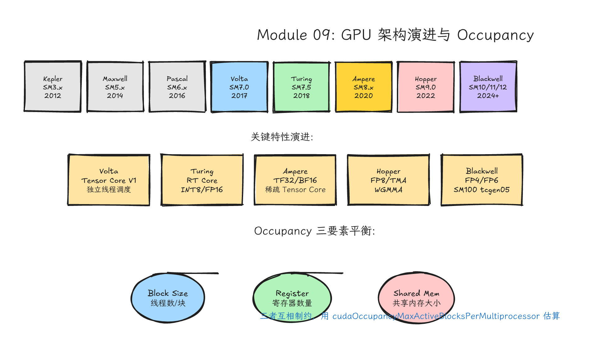
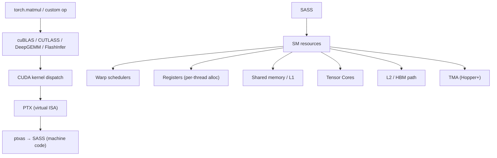
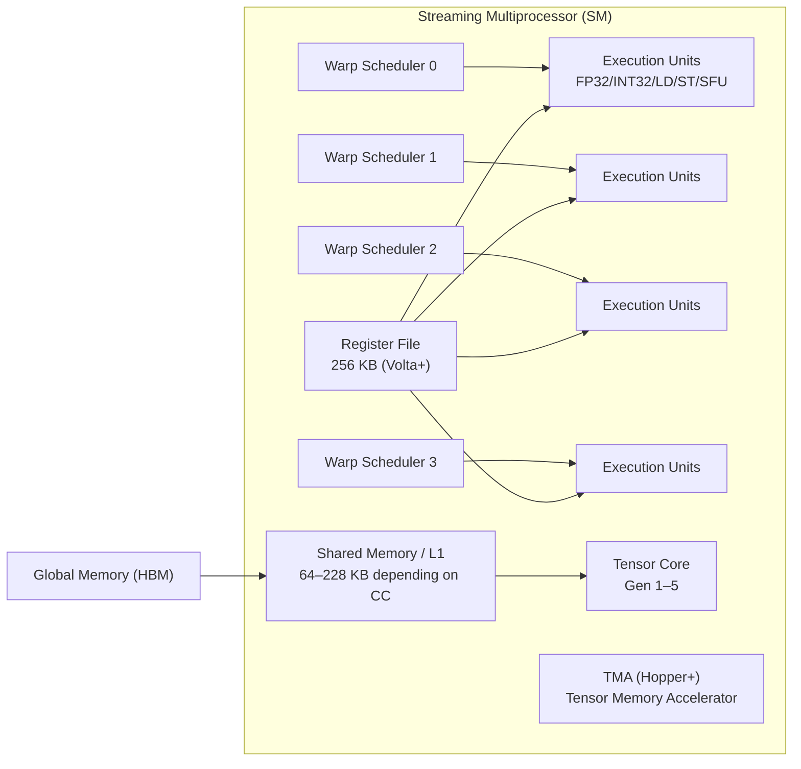
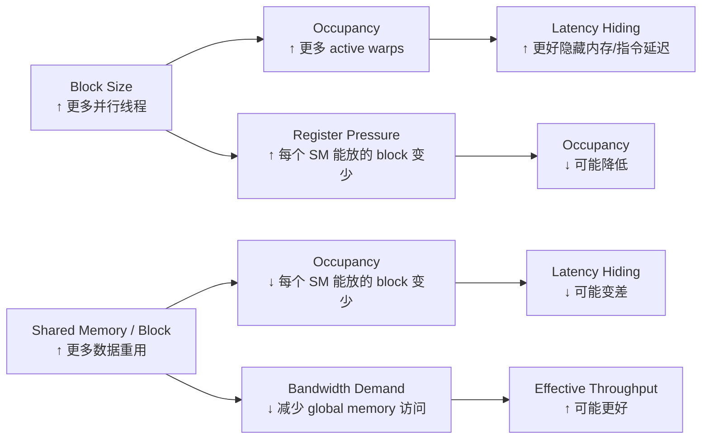
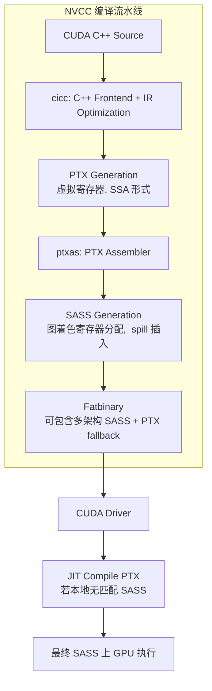
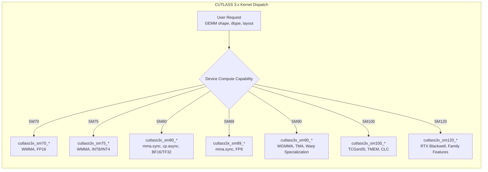

# Module 09: 架构感知优化（Architecture-Aware Optimization）



*图 09-1：SM 资源、occupancy、寄存器、shared memory 与吞吐之间的约束关系。可编辑源图：[`module-09-gpu-architecture-occupancy.excalidraw`](../diagrams/module-09-gpu-architecture-occupancy.excalidraw)。*

Level: Advanced  
Estimated time: 14–20 小时  
Prerequisites: Modules 00–08  
Sources: CUDA C++ Programming Guide, CUDA C++ Best Practices Guide, Nsight Compute, PTX ISA docs, CUTLASS, FlashAttention, vLLM

---

## 学习目标（Learning Objectives）

完成本模块后，你将能够：

1. **解释** NVIDIA GPU 从 Maxwell 到 Blackwell 的 SM 资源演进，并据此判断某张 GPU 是否适合特定优化路径。
2. **计算** 给定 kernel 的 theoretical occupancy，并使用 Nsight Compute 验证 achieved occupancy。
3. **诊断** register pressure 与 spill 问题，使用 `__launch_bounds__` 或 `-maxrregcount` 进行干预。
4. **比较** pre-Volta 的锁步 SIMT 与 Volta+ 的 independent thread scheduling，并写出 warp-divergence-safe 的代码。
5. **阅读** PTX 和 SASS 输出，识别关键指令模式（如 FMA、MMA、LD/ST、spill），并知道何时需要手写 PTX inline assembly。
6. **选择** 适合目标架构的 async copy 策略（Ampere 的 `cp.async` vs Hopper 的 TMA/WGMMA）。
7. **构建** 一个 architecture caveat / support matrix，用于生产环境中的 kernel dispatch 决策。

---

## 本课的故事线

你现在已经知道怎么写 CUDA、怎么测性能、怎么用库。接下来进入最容易让人误入歧途的领域：架构感知优化。这里充满诱惑：warp-level primitives、occupancy、register pressure、Tensor Cores、PTX/SASS、async copy。每个词都很高级，但每个词都可能被误用。

本课的主线不是“背技巧”，而是建立专家习惯：
- 知道硬件大概怎么工作（mental model）。
- 知道哪些结论依赖 architecture（caveat 思维）。
- 知道如何用 profiler 验证（证据驱动）。
- 知道什么时候该停手（ROI 判断）。


---

## 类比：调一台赛车（直觉层）

基础 CUDA 像学会开车。架构优化像调赛车：

- **Tire pressure** 类似 block size，不同赛道（不同 GPU）需要不同设置。
- **Engine tuning** 类似 instruction mix 和 Tensor Core 使用，决定极限马力。
- **Airflow & cooling** 类似 memory access pattern 和 cache 行为，决定持续输出能力。
- **Pit strategy** 类似 stream pipeline 和 async copy，决定计算与通信的重叠效率。
- **Telemetry** 类似 Nsight Compute / Nsight Systems，没有数据只听引擎声音，很可能调坏。

如果你连车速表都不看，只凭声音调发动机，很可能调得更慢。架构优化要和 profiler 绑定。

---

## 第一层：问题背景（Why Architecture Matters）

### 1.1 同一份代码，不同 GPU，不同故事

一个经过精心优化的 GEMM kernel，可能在 A100 上接近硬件上限，却在 H100 上明显落后，因为 H100 的 TMA/WGMMA 数据路径完全不同。反之，一个为 Hopper 写的 warp-specialized kernel，在 A100 上根本编译不过。

这是优化假设与硬件能力不匹配。架构感知优化的任务是建立“能力→假设→代码→验证”的闭环。

### 1.2 软件抽象如何落到硬件



高层 API 的一个调用会经过多层 dispatch 和编译。架构感知优化不只是改 kernel 代码，也可能是选择正确的库、dtype、shape padding、compilation target（`-arch=sm_90` vs `-arch=sm_100`）。

---

## 第二层：硬件机制（Hardware Mechanisms）

### 2.1 SM 架构深入：Maxwell → Blackwell

NVIDIA GPU 的核心执行单元是 Streaming Multiprocessor（SM）。每一代架构的 SM 内部资源分配决定了你能做什么、不能做什么。

#### 2.1.1 各代 SM 核心参数对比

| 架构 | SM 版本 | 代表 GPU | Warp Scheduler / SM | Register File / SM | Shared Memory / SM | L1 Data Cache | Tensor Core | 关键变化 |
|------|---------|----------|---------------------|--------------------|--------------------|---------------|-------------|----------|
| Maxwell | 5.x | GTX 980 | 4 | 64K 32-bit regs | 64/96 KB | 24 KB (unified with texture) | 无 | 基础 SIMT，无 FP16/INT8 加速 |
| Pascal | 6.x | P100, GTX 1080 | 2 (GP100) / 4 (GP104) | 64K 32-bit regs | 64 KB (GP100) / 96 KB (GP104) | 24/48 KB | 无 | 更强 FP64，NVLink 初代 |
| Volta | 7.0 | V100 | 4 | 64K 32-bit regs | 96 KB SMEM / 128 KB combined L1+SMEM | 与 Shared 统一 | 1st Gen (FP16) | 独立线程调度，Tensor Core 诞生，L0 I-cache |
| Turing | 7.5 | T4, RTX 2080 | 4 | 64K 32-bit regs | 64 KB SMEM / 96 KB combined L1+SMEM | 与 Shared 统一 | 2nd Gen (INT8/INT4) | RT Core，并发 FP32/INT32 |
| Ampere | 8.x | A100, RTX 3090 | 4 | 64K 32-bit regs | SM80: 164 KB/SM, 163 KB/block; SM86: 100 KB/SM, 99 KB/block | 与 Shared 统一 | 3rd Gen (TF32/BF16) | cp.async，MMA 指令，稀疏加速 |
| Ada | 8.9 | L40S, RTX 4090 | 4 | 64K 32-bit regs | 100 KB/SM, 99 KB/block; 128 KB combined L1+SMEM | 与 Shared 统一 | 4th Gen (FP8) | 光追升级，更大 L2 |
| Hopper | 9.0 | H100, H200 | 4 | 64K 32-bit regs | 228 KB/SM, 227 KB/block; 256 KB combined L1+SMEM | 与 Shared 统一 | 4th Gen (FP8/WGMMA) | TMA, WGMMA, Thread Block Cluster, Distributed Shared Memory |
| Blackwell | 多个 10.x/11.x/12.x 目标；本课示例 SM100/SM120 | B200/GB200/GB300, RTX 5090, GB10/Jetson Blackwell 等 | 4（按目标确认） | 64K 32-bit regs；SM100 另有 TMEM | 示例：CC10.0 228 KB SMEM/SM, 227 KB/block; CC12.0 128 KB SMEM/SM, 99 KB/block；10.3/11.0/12.1 等目标查 Blackwell Tuning Guide 和设备文档 | 与 Shared 统一 | 5th Gen (FP4/FP6/FP8) | SM100/SM10x: TMEM/tcgen05/NVLink 5 路径需按 SKU 确认；SM120: RTX Blackwell 路径，需单独编译和验证；完整目标以 NVIDIA compute capability 表和当前 `nvcc` 为准 |

*Sources:*
- NVIDIA Blackwell Architecture: https://www.nvidia.com/en-us/data-center/technologies/blackwell-architecture/
- CUDA Programming Guide, Compute Capability: https://docs.nvidia.com/cuda/cuda-c-programming-guide/index.html
- Dissecting the NVIDIA Blackwell Architecture with Microbenchmarks: https://arxiv.org/html/2507.10789v1

#### 2.1.2 SM 内部资源分配图



关键洞察：
- Warp Scheduler 数量决定了每个 cycle 能发射多少条独立指令。Volta 之后每个 processing block 一个 scheduler，单发射，但 4 个 block 并行可形成 4 条指令/cycle 的 issue 能力。
- Register File 大小是硬上限。每个寄存器 32 位（4 字节）。如果每个 thread 用 128 个寄存器，block size 为 256，则一个 block 需要 128 × 256 = 32768 个寄存器，即 128 KB。SM 的 register file 通常有 64K（65536）个 32 位寄存器（256 KB），因此最多同时驻留 2 个这样的 block。register 用量直接限制 occupancy。
- Shared Memory / L1 在 Volta 之后统一为同一块物理存储，通过 driver 或 API 配置比例。占用更多 shared memory 意味着 L1 cache 更少，可能影响 global memory 访问的 cache hit rate。
- TMA 从 Hopper 开始作为独立硬件单元，专门负责多维 tensor 的 global→shared memory 异步搬运，不占用 SM 内部的 LD/ST 单元和寄存器。

### 2.2 Warp 与 SIMT：从锁步到独立线程调度

CUDA 给你 thread 抽象，但硬件以 warp（32 threads）为单位执行。SIMT（Single Instruction, Multiple Threads）意味着：一组 threads 执行同一条指令流，每个 thread 有自己的数据和 predicate。

#### 2.2.1 Pre-Volta（< SM70）锁步模型

- 一个 warp 内所有 thread 共享一个 program counter（PC）。
- 分支 divergence 时，硬件使用 active mask 串行执行不同路径：先执行 path A（mask 开启 path A 的 threads），再执行 path B（mask 开启 path B 的 threads）。
- 路径执行完毕后，在 reconvergence point 恢复锁步。
- **陷阱**：不要把同步原语放进只有部分线程会到达的分支。`__syncthreads()` 是 block-wide barrier，要求同一个 block 内所有非退出线程一致到达；warp 内数据交换也不要依赖旧式 lock-step，应使用带 mask 的 `__syncwarp()` / shuffle 原语。

#### 2.2.2 Volta+（≥ SM70）Independent Thread Scheduling

- 每个 thread 有自己的 PC 和 call stack。
- Scheduler 可以在 sub-warp 粒度上选择哪些 thread 一起执行，允许不同路径的 thread 交错执行（interleaved execution）。
- 不再需要严格的 IPDom（Immediate Post-Dominator）reconvergence。
- **新的约束**：Volta+ 的 independent thread scheduling 让旧式“warp 内天然 lock-step”的假设不再可靠。只要 warp 内线程通过 shared memory、global memory 或寄存器交换建立依赖，就应显式使用 `__syncwarp(mask)` 或更合适的同步原语表达依赖，而不是依赖隐式收敛时机。


*Sources:*
- CUDA Programming Guide, SIMT Architecture: https://docs.nvidia.com/cuda/cuda-c-programming-guide/index.html#simt-architecture
- Control Flow Management in Modern GPUs (arXiv 2407.02944): https://arxiv.org/html/2407.02944v1
- CuLifter, Lifting GPU Binaries: https://arxiv.org/html/2604.27486v1

### 2.3 Occupancy 的完整数学

Occupancy 定义为 active warps 数量 / SM 支持的最大 warps 数量。它不是 KPI，而是诊断线索。

#### 2.3.1 Theoretical Occupancy 的计算公式

Theoretical occupancy 受三个资源约束，取其中最小值：

```
active_blocks = min(
    max_blocks_per_sm,                          // 硬件上限（如 32）
    floor(registers_per_sm / (registers_per_thread * threads_per_block)),
    floor(shared_mem_per_sm / shared_mem_per_block),
    floor(max_warps_per_sm / warps_per_block)
)

theoretical_occupancy = active_blocks * warps_per_block / max_warps_per_sm
```

不同 compute capability 的硬件限制：

| Compute Capability | Max Warps / SM | Max Blocks / SM | Registers / SM | Shared Memory |
|--------------------|----------------|-----------------|----------------|---------------|
| 5.x (Maxwell) | 64 | 32 | 64K 32-bit regs | 64/96 KB per SM |
| 6.x (Pascal) | 64 | 32 | 64K 32-bit regs | 64 KB (GP100) / 96 KB (GP104) per SM; 48 KB/block |
| 7.0 (Volta) | 64 | 32 | 64K 32-bit regs | 96 KB/SM, 96 KB/block |
| 7.5 (Turing) | 32 | 16 | 64K 32-bit regs | 64 KB/SM, 64 KB/block |
| 8.0 (Ampere GA100) | 64 | 32 | 64K 32-bit regs | 164 KB/SM, 163 KB/block |
| 8.6 (Ampere GA10x) | 48 | 16 | 64K 32-bit regs | 100 KB/SM, 99 KB/block |
| 8.9 (Ada) | 48 | 24 | 64K 32-bit regs | 100 KB/SM, 99 KB/block |
| 9.0 (Hopper) | 64 | 32 | 64K 32-bit regs | 228 KB/SM, 227 KB/block |
| 10.0 (Blackwell DC 示例) | 64 | 32 | 64K 32-bit regs | 228 KB/SM, 227 KB/block |
| 12.0 (Blackwell RTX 示例) | 48 | 32 | 64K 32-bit regs | 128 KB/SM capacity, 99 KB/block |

> Blackwell 的官方 compute capability 表和 `nvcc` 支持目标不止 10.0 和 12.0，还包括 10.3、11.0、12.1 等产品线。这些行用于对比课程中最常见的 SM100/SM120 路径。真正做 kernel 规格表时，用 NVIDIA compute capability 表、`nvcc --list-gpu-code` 和 Blackwell Tuning Guide 填目标 GPU 的实际资源。

#### 2.3.2 Register Allocation Granularity

Register 不是按单个 thread 连续、无损地分配到 SM 的，而是受 warp/block、寄存器分配粒度、block size 和 compute capability 共同约束。不要把 `registers_per_thread * threads_per_block` 当成唯一真相；block size 改动可能因为分配粒度改变而让实际 occupancy 跳变。

CUDA Best Practices Guide 说明：register allocation granularity 随 compute capability 变化，精确关系很难手算，建议使用 occupancy calculator 或 Nsight Compute。

#### 2.3.3 Occupancy 与 Register / Shared Memory 的 Tradeoff



核心结论：
- 高 occupancy 有帮助，但不是唯一目标。如果一个 kernel 已经是 compute-bound（如大量 FMA/TMA），增加 occupancy 对性能帮助不大。
- 盲目减少 register 可能适得其反。`__launch_bounds__` 或 `-maxrregcount` 强迫编译器减少 register 使用，可能导致 spill 到 local memory，反而更慢。
- Shared memory 和 L1 的统一配置（Volta+）意味着多用 shared memory 会减少 L1 cache，影响不规则访问模式的 cache 效率。

*Sources:*
- Nsight Compute Occupancy Calculator: https://docs.nvidia.com/nsight-compute/NsightCompute/index.html#occupancy-calculator
- CUDA C++ Best Practices Guide, Occupancy: https://docs.nvidia.com/cuda/cuda-c-best-practices-guide/index.html
- Finding Optimal GPU Occupancy: https://intro-to-cuda.readthedocs.io/en/latest/tutorial/occupancy.html

### 2.4 Register Pressure 分析

Register spill 发生在编译器无法将所有 live variables 放入物理寄存器时，被迫将数据存入 local memory（实际上是 off-chip DRAM，通过 L1/L2 cache，速度远低于寄存器）。

#### 2.4.1 检测 Spill

使用 `nvcc --ptxas-options=-v` 编译：

```bash
nvcc --ptxas-options=-v -arch=sm_80 kernel.cu
```

输出示例：
```
ptxas info    : Compiling entry function '_Z6kernelPf' for 'sm_80'
ptxas info    : Function properties for _Z6kernelPf
    0 bytes stack frame, 0 bytes spill stores, 0 bytes spill loads
ptxas info    : Used 32 registers, 1024 bytes smem
```

如果看到 `spill stores > 0` 或 `spill loads > 0`，说明发生了 register spill。注意：PTX 中的虚拟寄存器数量不等于最终 SASS 的物理寄存器数量，必须以 `ptxas -v` 或 SASS 输出为准。

#### 2.4.2 干预手段：__launch_bounds__ 与 -maxrregcount

`__launch_bounds__`（推荐，按 kernel 粒度控制）：

```cpp
__global__ void __launch_bounds__(maxThreadsPerBlock, minBlocksPerMultiprocessor)
myKernel(...) { ... }
```

- `maxThreadsPerBlock`：告诉编译器这个 kernel 最多用多少 threads/block。编译器据此计算每个 thread 的 register 上限。
- `minBlocksPerMultiprocessor`（可选）：告诉编译器你希望每个 SM 至少驻留多少个 block。编译器会据此推导每个 thread 可用的寄存器预算上限；如果默认寄存器用量太高，它可能通过重算（rematerialization）、减少展开或 spill 来压低寄存器数。这个参数不是“越大越快”，要用 `ptxas -v` 和 profiler 验证。

`-maxrregcount=N`（全局编译选项，影响所有 kernel）：

```bash
nvcc -maxrregcount=64 ...
```

- 简单粗暴地限制所有 kernel 的寄存器使用为 N。
- 缺点是全局生效，可能让不需要限制的 kernel 也受约束。
- 现代 nvcc 中，如果 PTX 中已有 `.maxntid` / `.minnctapersm` directive，可能需要 `-override-directive-values` 才能生效。

#### 2.4.3 Spill 不是绝对坏

一个 memory-bound kernel 可以承受少量 spill，因为内存带宽本来就有余量。一个 compute-bound kernel（如 GEMM）则应尽量避免 spill，因为每个 spill/load 都会增加指令数并竞争 LD/ST 单元。

*Sources:*
- Register Spilling Analysis: https://blog.melashri.net/posts/register-spilling-analysis/
- CUDA Memory Model Basics: https://education.molssi.org/gpu_programming_intermediate/02-cuda-memory-model/index.html
- maxrregcount discussion: https://forums.developer.nvidia.com/t/maxrregcount-silently-ignored/310514

### 2.5 Warp Divergence 深入与检测

#### 2.5.1 检测 Divergence

Nsight Compute 的分支/warp 指标名称会随版本和 GPU 架构变化，不要死背一个 metric 名。实践中先用 `ncu --query-metrics | rg -i 'branch|diverg|pred|thread|warp'` 查本机可用指标，再结合 Source View、Warp State Statistics、branch 相关计数、active threads / predicated-off threads 等信息判断。所谓 `warp_efficiency` 更适合作为心智模型（active lanes / 32），不是所有 Nsight Compute 版本都有这个精确名称。

#### 2.5.2 Warp 级同步原语

Volta 之后，`__syncwarp()` 是 warp 内同步的基础。更细粒度的协作使用：
- `__ballot_sync(mask, predicate)`：warp 内投票，返回 32-bit mask 表示哪些 thread 满足条件。
- `__all_sync(mask, predicate)`：warp 内所有 thread 满足条件时返回 true。
- `__any_sync(mask, predicate)`：任意一个 thread 满足条件时返回 true。

这些原语在写 warp-level reduction、scan、或条件聚合时有用。注意：`mask` 必须是参与同一条 `_sync` intrinsic 的线程集合，并且 mask 中所有未退出线程都要执行这条 intrinsic。整 warp 已收敛时可以用 `0xffffffff`；有条件分支时，通常应在分支前用 `__ballot_sync` 计算参与集合，而不是在分支内部随手用 `__activemask()` 掩盖 divergence。

*Sources:*
- Numbers Every CUDA Developer Should Know: https://www.wingedge777.com/en/article/548cec5dfba296d5
- CUDA Programming Guide, Warp Shuffle Functions: https://docs.nvidia.com/cuda/cuda-c-programming-guide/index.html#warp-shuffle-functions

### 2.6 Instruction Mix 优化

GPU 的执行单元不是单一的。一个 SM 内部有：
- ALU/INT32：整数运算、地址计算、位操作。
- FP32 Core：单精度浮点。
- FP64 Core：双精度浮点（数量通常只有 FP32 的 1/2 或 1/64）。
- SFU（Special Function Unit）：transcendental 函数（sin, cos, exp, log, rcp, sqrt）。
- Tensor Core：矩阵乘累加（MMA）。
- LD/ST Unit：内存加载/存储。

#### 2.6.1 指令延迟与吞吐量

| 指令类型 | 大致延迟 (cycles) | 吞吐量 (per cycle per SM) | 备注 |
|----------|-------------------|---------------------------|------|
| INT32 add/mul | 4 | 64 (Volta+) | 可与 FP32 并发 |
| FP32 add/mul | 4 | 64 (Volta+) | 与 INT32 并发 |
| FP32 FMA | 4 | 64 |  fused，精度更好 |
| FP64 FMA | 4-8 | 32 (V100) / 2 (RTX) | 架构差异巨大 |
| SFU | ~12 | 16 | 非 pipelined 时更高延迟 |
| LD/ST (shared) | ~20 | 128 bytes/cycle | 受 bank conflict 影响 |
| LD/ST (global) | ~200-400 | 受内存带宽限制 | 需要 coalescing |
| Tensor Core (MMA) | ~4-8 | 因 shape 而异 | 需足够数据重用才能打满 |

#### 2.6.2 编译器优化标志

| 标志 | 作用 | 风险 |
|------|------|------|
| `-O3` | 最高优化级别 | 默认应开启 |
| `-use_fast_math` | 将标准 math 函数替换为更快的 intrinsic（如 `__sinf`） | 精度降低，可能不满足数值要求 |
| `-fmad` / `-fno-fmad` | 启用/禁用 FMA 合并（默认启用） | `-fno-fmad` 可能降低性能但提高精度一致性 |
| `-maxrregcount=N` | 限制寄存器使用 | 可能导致 spill |
| `-Xptxas -v` | 输出寄存器/共享内存/spill 信息 | 无风险，建议常驻 |

`fma` 指令比分开的 `mul` + `add` 更快且更精确（只舍入一次），编译器默认会合并。如果你发现 SASS 中有很多 `MUL` + `ADD` 而不是 `FMA`，检查是否用了 `-fno-fmad` 或某些精度标志阻止了合并。

*Sources:*
- CUDA Math API and Performance: https://docs.nvidia.com/cuda/cuda-math-api/
- PTX ISA, Instruction Throughput: https://docs.nvidia.com/cuda/parallel-thread-execution/index.html

### 2.7 PTX 和 SASS 详解

PTX（Parallel Thread Execution）是 NVIDIA GPU 的虚拟汇编语言，SASS（Streaming ASSembly）是实际机器码。理解它们的角色是高级优化的重要环节。

#### 2.7.1 PTX 语法与常用指令



PTX 常用指令类别：
- **数据搬运**：`ld.global`, `ld.shared`, `st.global`, `st.shared`, `mov`
- **算术**：`add`, `sub`, `mul`, `mad`, `fma`
- **矩阵运算**：`mma.sync`（Volta+；Ampere/Ada 扩展了更多 dtype 和 tile 形态）, `wgmma.mma_async` (Hopper)
- **异步拷贝**：`cp.async` (Ampere+), `cp.async.bulk.tensor` (Hopper+ TMA)
- **同步**：`bar.sync`, `membar`, `fence`
- **原子**：`atom.global.add`, `atom.shared.exch`
- **位操作**：`shl`, `shr`, `and`, `or`
- **特殊**：`vote.ballot`, `shfl.sync`, `activemask`

PTX 指令使用 typed state space：`.reg`, `.global`, `.shared`, `.local`, `.const`, `.param`。

#### 2.7.2 从 nvcc 生成 PTX 和 SASS

```bash
# 生成 PTX 文本文件
nvcc -ptx -arch=sm_80 kernel.cu -o kernel.ptx

# 生成 CUBIN（包含 SASS 二进制）
nvcc -cubin -arch=sm_80 kernel.cu -o kernel.cubin

# 保留所有中间文件（包括 PTX 和 SASS 汇编文本）
nvcc -keep -arch=sm_80 kernel.cu

# 使用 cuobjdump 从 CUBIN 提取 SASS
cuobjdump -sass kernel.cubin > kernel.sass

# 使用 nvcc -Xptxas -v 查看资源使用
nvcc -Xptxas -v -arch=sm_80 kernel.cu
```

#### 2.7.3 阅读 PTX 和 SASS 的关键模式

阅读时带着具体问题：
- 我期待使用 Tensor Core，是否出现 `mma.sync` 或 `wgmma`？如果没有，可能数据类型或布局不匹配，编译器退回到 CUDA core。
- 我期待没有 local memory spill，是否出现 `ld.local` / `st.local`？如果有，说明 register pressure 过高。
- 关键循环是否被展开？检查是否有重复指令模式或 `BRA` 分支指令数量。
- 是否出现 `FMA` 而不是 `MUL` + `ADD`？如果没有，检查编译标志或数据类型是否阻止了融合。
- Hopper kernel 是否用了 `cp.async.bulk.tensor`？如果没有，可能 TMA 未被激活，数据搬运仍由线程自己完成。

#### 2.7.4 何时适合手写 PTX Inline Assembly

极少。现代 nvcc 优化器已经很强。适合手写 PTX 的场景：
- 需要特定指令而 CUDA C++ 没有对应 intrinsic（如某些 `atom` 变体、特定 `mma` 形状）。
- 需要精确控制寄存器分配或指令调度（如 CUTLASS 中的某些 micro-kernel）。
- 需要利用最新架构指令而 CUDA 标准库尚未暴露（如早期的 TMA/WGMMA 指令）。

**不适合**：
- 替代编译器做常规优化（编译器通常做得更好）。
- 初学阶段猜测性能（没有 profiler 验证，手写 PTX 很可能是负优化）。

*Sources:*
- PTX ISA 9.3 Documentation: https://docs.nvidia.com/cuda/parallel-thread-execution/index.html
- NVIDIA Floating Point and IEEE 754 Compliance for NVIDIA GPUs: https://docs.nvidia.com/cuda/floating-point/index.html
- Eunomia CUDA PTX Tutorial: https://eunomia.dev/others/cuda-tutorial/02-ptx-assembly/
- Stack Overflow, PTX vs CUBIN: https://stackoverflow.com/questions/7696230

### 2.8 Async Copy 详解

#### 2.8.1 Ampere：cp.async

在 Ampere 之前，global memory → shared memory 的数据搬运需要经过：
```
Global Memory → L2 → L1 → Register → Shared Memory
```

`cp.async`（copy async）允许绕过 L1 和寄存器，直接从 global memory 异步拷贝到 shared memory：
```
Global Memory → L2 → Shared Memory
```

PTX 语法示例：
```ptx
cp.async.ca.shared.global.L2::128B [dst], [src], 16;
```

- `.ca`：cache all levels（包括 L1）。`.cg`：cache global only（只到 L2）。
- `.L2::128B`：prefetch hint，提示硬件预取 128B。
- `cp-size`：只能是 4, 8, 16 bytes。
- 需要配合 `cp.async.commit_group` 和 `cp.async.wait_group<N>` 或 `cp.async.wait_all` 完成同步。

C++ 层面也可以使用 `cooperative_groups::memcpy_async` 或 `cuda::pipeline`。

#### 2.8.2 Hopper：TMA 与 WGMMA

**TMA（Tensor Memory Accelerator）**：
- 独立的硬件单元，挂在外部，不占用 SM 的 LD/ST 单元和寄存器。
- 通过 Tensor Map descriptor（由 host 初始化）描述多维 tensor 的形状、步长、swizzle 模式。
- 一个线程提交 `cp.async.bulk.tensor` 指令，TMA 硬件负责整个 tile 的地址计算和搬运。
- 支持 multicast：同一个 tile 可以同时搬到 cluster 内多个 block 的 shared memory。

**WGMMA（Warp Group MMA）**：
- 以 warp group（4 warps = 128 threads）为单位调用 Tensor Core。
- 支持直接从 shared memory 读取操作数（不再需要像 Ampere 那样先 `ldmatrix` 到寄存器）。
- 异步执行，通过 `wgmma.commit_group` + `wgmma.wait_group` 同步。
- 支持一组由 PTX ISA 定义的 tile shape；例如 FP16/BF16 WGMMA 常见 `m64n*k*` 形态，N/K 取值随 dtype、layout 和指令 variant 变化。课程只用这些 shape 建立直觉，写 kernel 时必须查当前 PTX ISA 或 CUTLASS atom。

#### 2.8.3 Blackwell：新能力

- 第五代 Tensor Core：原生支持 FP4、FP6，以及 block-scaled 格式（NVFP4、MXFP8），但数据中心 SM100 与 RTX SM120 的 ISA/库路径不能混用。
- SM100 数据中心路径包含 TMEM（Tensor Memory）和 TCGen05/UMMA：TMEM 是专用片上存储，用于 accumulator 的 ping-pong buffer，减少寄存器压力。
- SM100 的 2-SM MMA / CTA-pair 协作路径：某些 Blackwell 数据中心 MMA 路径可以让相邻 SM 协同，进一步放大矩阵计算粒度。RTX Blackwell 是否有等价路径要按 PTX、CUTLASS 和目标框架确认。
- Cluster Launch Control (CLC)：动态调度 thread block cluster，支持 persistent kernel 的更好负载均衡。

*Sources:*
- CUDA PTX ISA, cp.async: https://docs.nvidia.com/cuda/parallel-thread-execution/index.html#data-movement-and-conversion-instructions-cp-async
- NVIDIA Ampere Tuning Guide: https://docs.nvidia.com/cuda/ampere-tuning-guide/index.html
- NVIDIA Hopper Tuning Guide: https://docs.nvidia.com/cuda/hopper-tuning-guide/index.html
- Blackwell microbenchmarks: https://arxiv.org/html/2507.10789v1
- CUTLASS 3.8 Blackwell support: https://github.com/NVIDIA/cutlass/discussions/2125

---

## 第三层：代码路径（Code Paths）

### 3.1 精品代码 1：设备能力查询与 Occupancy 估算（扩展版）

这段代码不是优化本身，而是优化前的“体检”。它展示了如何查询 GPU 的 compute capability、SM 数量、warp size、shared memory 限制，并使用 CUDA Occupancy API 估算某个 kernel 的潜在 active blocks。

```cpp
// file: occupancy_check.cu
// compile: nvcc -o occupancy_check occupancy_check.cu

#include <cuda_runtime.h>
#include <cstdio>
#include <cstdlib>

#define CUDA_CHECK(expr)                                                       \
  do {                                                                         \
    cudaError_t err = (expr);                                                  \
    if (err != cudaSuccess) {                                                  \
      std::printf("CUDA error at %s:%d: %s\n", __FILE__, __LINE__,           \
                   cudaGetErrorString(err));                                    \
      std::exit(1);                                                            \
    }                                                                          \
  } while (0)

// 一个稍复杂的 dummy kernel，带有一定的 register 和 shared memory 使用
// 用于演示 occupancy API 的工作方式
__global__ void dummy_kernel(float* x, int n, float scale) {
  // 每个 thread 使用多个寄存器，增加 register pressure
  float a = x[threadIdx.x];    // 假设 block size <= n
  float b = a * scale;
  float c = b + 1.0f;
  float d = c * c;
  __shared__ float sdata[256];  // 256 floats = 1024 bytes shared memory
  sdata[threadIdx.x] = d;
  __syncthreads();
  x[threadIdx.x] = sdata[threadIdx.x];
}

void print_device_and_occupancy() {
  int device = 0;
  CUDA_CHECK(cudaGetDevice(&device));

  cudaDeviceProp prop{};
  CUDA_CHECK(cudaGetDeviceProperties(&prop, device));

  std::printf("=== GPU Device Info ===\n");
  std::printf("GPU: %s\n", prop.name);
  std::printf("Compute capability: %d.%d\n", prop.major, prop.minor);
  std::printf("SM count: %d\n", prop.multiProcessorCount);
  std::printf("Warp size: %d\n", prop.warpSize);
  std::printf("Shared memory per block: %zu bytes\n", prop.sharedMemPerBlock);
  std::printf("Shared memory per SM: %zu bytes\n", prop.sharedMemPerMultiprocessor);
  std::printf("Registers per block: %d\n", prop.regsPerBlock);
  std::printf("Registers per SM: %d\n", prop.regsPerMultiprocessor);
  std::printf("Max threads per block: %d\n", prop.maxThreadsPerBlock);
  std::printf("Max threads per SM: %d\n", prop.maxThreadsPerMultiProcessor);
  std::printf("Clock rate: %d MHz\n", prop.clockRate / 1000);

  // 使用 cudaOccupancyMaxActiveBlocksPerMultiprocessor 估算 active blocks
  int block_size = 256;
  int dynamic_smem = 0;  // dummy_kernel 使用静态 shared memory，动态为 0
  int active_blocks_per_sm = 0;

  CUDA_CHECK(cudaOccupancyMaxActiveBlocksPerMultiprocessor(
      &active_blocks_per_sm,
      dummy_kernel,
      block_size,
      dynamic_smem));

  int active_warps = active_blocks_per_sm * (block_size / prop.warpSize);
  int max_warps_per_sm = prop.maxThreadsPerMultiProcessor / prop.warpSize;
  float theoretical_occupancy = 100.0f * active_warps / max_warps_per_sm;

  std::printf("\n=== Occupancy Estimate ===\n");
  std::printf("Block size: %d\n", block_size);
  std::printf("Estimated active blocks/SM: %d\n", active_blocks_per_sm);
  std::printf("Estimated active warps/SM: %d / %d\n", active_warps, max_warps_per_sm);
  std::printf("Theoretical occupancy: %.1f%%\n", theoretical_occupancy);

  // 使用 cudaOccupancyMaxPotentialBlockSize 让 CUDA 自动推荐最佳配置
  int min_grid_size = 0, recommended_block_size = 0;
  CUDA_CHECK(cudaOccupancyMaxPotentialBlockSize(
      &min_grid_size,
      &recommended_block_size,
      dummy_kernel,
      dynamic_smem,
      0));  // 无最大 block size 限制

  std::printf("\n=== CUDA Recommended Config ===\n");
  std::printf("Min grid size to achieve best occupancy: %d\n", min_grid_size);
  std::printf("Recommended block size: %d\n", recommended_block_size);

  // 关键提醒：occupancy API 给的是资源约束下的理论估计，不是性能结论
  std::printf("\n[NOTE] High occupancy helps hide latency, but does not\n"
              "       guarantee higher performance. Always verify with\n"
              "       Nsight Compute for achieved occupancy and stall reasons.\n");
}

int main() {
  print_device_and_occupancy();
  return 0;
}
```

逐行解释：
- `cudaGetDeviceProperties`：获取设备全部属性，包括 compute capability、SM 数量、寄存器/共享内存上限。
- `cudaOccupancyMaxActiveBlocksPerMultiprocessor`：根据 kernel 的编译后资源使用（register count、static shared memory）和指定的 block size，返回每个 SM 最多能同时执行的 block 数。
- `cudaOccupancyMaxPotentialBlockSize`：让 runtime 自动推荐一个 block size，以最大化 occupancy。这在 auto-tuning 中有用。
- 关键提醒：理论 occupancy 只是资源上限，实际 achieved occupancy 还受 warp stall、内存延迟、调度器行为等因素影响。

### 3.2 精品代码 2：使用 __launch_bounds__ 控制 Register 和 Occupancy

```cpp
// file: launch_bounds_demo.cu
// compile: nvcc -Xptxas -v -arch=sm_80 launch_bounds_demo.cu

#include <cuda_runtime.h>
#include <cstdio>

// 版本 A：不加限制，编译器自由使用寄存器
__global__ void kernel_unbounded(const float* __restrict__ a,
                                 const float* __restrict__ b,
                                 float* __restrict__ c,
                                 int n) {
  int i = blockIdx.x * blockDim.x + threadIdx.x;
  if (i < n) {
    float x = a[i];
    float y = b[i];
    float t0 = x * y;
    float t1 = x + y;
    float t2 = t0 * t1;
    float t3 = t2 + x;
    c[i] = t3 * y;  // 故意制造较长的 live range
  }
}

// 版本 B：使用 __launch_bounds__ 限制，要求每个 SM 至少驻留 4 个 block
// 编译器会尽量在 256 threads/block * 4 blocks = 1024 threads/SM 的约束下分配寄存器
__global__ void __launch_bounds__(256, 4)
kernel_bounded(const float* __restrict__ a,
               const float* __restrict__ b,
               float* __restrict__ c,
               int n) {
  int i = blockIdx.x * blockDim.x + threadIdx.x;
  if (i < n) {
    float x = a[i];
    float y = b[i];
    float t0 = x * y;
    float t1 = x + y;
    float t2 = t0 * t1;
    float t3 = t2 + x;
    c[i] = t3 * y;
  }
}

int main() {
  std::printf("Compile with: nvcc -Xptxas -v -arch=sm_80 %s\n", __FILE__);
  std::printf("Compare register count and spill info for both kernels.\n");
  return 0;
}
```

逐行解释：
- `__launch_bounds__(256, 4)`：告诉编译器，这个 kernel 将以最多 256 threads/block 启动，且你希望在每个 SM 上至少有 4 个 resident blocks。
- 编译器据此计算：如果 SM 有 256 KB registers（65536 个 32-bit registers），1024 threads 分摊下来，每个 thread 最多约 64 registers。如果编译器默认使用更多，它会尝试通过增加指令数（rematerialization）或 spill 来减少寄存器使用。
- 对比 `kernel_unbounded` 和 `kernel_bounded` 的 `ptxas -v` 输出，观察 `Used X registers` 和 `spill stores/loads` 的变化。

### 3.3 精品代码 3：使用 __shfl_down_sync 的 Warp-Level Reduction

```cpp
// file: warp_shuffle_reduction.cu
// compile: nvcc -o warp_shuffle_reduction warp_shuffle_reduction.cu

#include <cuda_runtime.h>
#include <cstdio>
#include <cfloat>

// warp 内规约求和（tree-based reduction，使用 shuffle）
// 所有 32 个 thread 参与，最终结果存放在 lane 0
__inline__ __device__
float warp_reduce_sum(float val) {
  // 从 offset=16 开始，每次折半，将右侧 lane 的值加到当前 lane
  for (int offset = 16; offset > 0; offset /= 2) {
    val += __shfl_down_sync(0xffffffff, val, offset);
  }
  return val;  // lane 0 持有 warp 内总和
}

// warp 内规约求最大值
__inline__ __device__
float warp_reduce_max(float val) {
  for (int offset = 16; offset > 0; offset /= 2) {
    val = fmaxf(val, __shfl_down_sync(0xffffffff, val, offset));
  }
  return val;
}

// block-level reduction：每个 warp 先内部规约，结果写到 shared memory，
// 再由第一个 warp 对这些部分结果做二次规约
__global__ void block_reduce_sum(const float* __restrict__ input,
                                 float* __restrict__ output,
                                 int n) {
  extern __shared__ float sdata[];  // 动态分配，大小 = warps_per_block * sizeof(float)

  int tid = blockIdx.x * blockDim.x + threadIdx.x;
  int lane = threadIdx.x % 32;
  int warp_id = threadIdx.x / 32;

  // 读取全局内存，越界置 0
  float val = (tid < n) ? input[tid] : 0.0f;

  // Step 1: warp 内规约
  float warp_sum = warp_reduce_sum(val);

  // Step 2: 每个 warp 的 lane 0 把结果写到 shared memory
  if (lane == 0) {
    sdata[warp_id] = warp_sum;
  }
  __syncthreads();  // 等待所有 warp 写完

  // Step 3: 用第一个 warp 对 sdata 做二次规约
  if (threadIdx.x < 32) {
    float block_val = (threadIdx.x < (blockDim.x + 31) / 32) ? sdata[threadIdx.x] : 0.0f;
    float block_sum = warp_reduce_sum(block_val);
    if (threadIdx.x == 0) {
      output[blockIdx.x] = block_sum;  // 每个 block 输出一个部分和
    }
  }
}

int main() {
  const int N = 1024 * 1024;
  const int block_size = 256;
  const int grid_size = (N + block_size - 1) / block_size;
  const int warps_per_block = block_size / 32;

  float *h_in, *h_out, *d_in, *d_out;
  cudaMallocHost(&h_in, N * sizeof(float));
  cudaMallocHost(&h_out, grid_size * sizeof(float));
  for (int i = 0; i < N; ++i) h_in[i] = 1.0f;  // 期望总和 = N

  cudaMalloc(&d_in, N * sizeof(float));
  cudaMalloc(&d_out, grid_size * sizeof(float));
  cudaMemcpy(d_in, h_in, N * sizeof(float), cudaMemcpyHostToDevice);

  block_reduce_sum<<<grid_size, block_size, warps_per_block * sizeof(float)>>>(d_in, d_out, N);

  cudaMemcpy(h_out, d_out, grid_size * sizeof(float), cudaMemcpyDeviceToHost);

  float total = 0.0f;
  for (int i = 0; i < grid_size; ++i) total += h_out[i];
  std::printf("Total sum = %.1f (expected %d)\n", total, N);

  cudaFreeHost(h_in); cudaFreeHost(h_out);
  cudaFree(d_in); cudaFree(d_out);
  return 0;
}
```

逐行解释：
- `__shfl_down_sync(0xffffffff, val, offset)`：当前 lane 从 `lane + offset` 读取 `val`。在 `width=32` 的整 warp 规约里，超出当前 width 子组范围的 lane 会保持自己的 `val`；如果 source lane 在 mask 外或 inactive，结果未定义。
- `0xffffffff` mask：表示 warp 内所有 32 个 thread 都参与，前提是这 32 个 lane 都会执行同一条 shuffle。若只有部分 lane 参与，应使用在分支前计算好的一致 mask（常用 `__ballot_sync`），不要把 `__activemask()` 当作通用修复。
- `warp_reduce_sum` 在寄存器内完成，无需 shared memory，延迟极低。
- `__syncthreads()` 用于跨 warp 同步（shared memory 写完之后），不能省略。
- 二次规约时，只让第一个 warp（threadIdx.x < 32）参与，其余 thread 空闲。这是常见模式，因为 block 内的 warp 数通常不超过 32。

### 3.4 精品代码 4：PTX 内联汇编示例

```cpp
// file: ptx_inline_asm.cu
// compile: nvcc -ptx -arch=sm_80 ptx_inline_asm.cu -o ptx_inline_asm.ptx
//          nvcc -o ptx_inline_asm ptx_inline_asm.cu

#include <cuda_runtime.h>
#include <cstdio>

// 使用 PTX inline assembly 执行 FMA（fused multiply-add）
// 并展示如何读取 clock 计数器（用于微基准测试）
__global__ void ptx_demo(const float* __restrict__ a,
                         const float* __restrict__ b,
                         const float* __restrict__ c,
                         float* __restrict__ d,
                         int n) {
  int i = blockIdx.x * blockDim.x + threadIdx.x;
  if (i < n) {
    float ai = a[i];
    float bi = b[i];
    float ci = c[i];
    float result;

    // PTX inline assembly 语法：
    // asm("template" : output_operands : input_operands : clobbers);
    // %0 = output, %1,%2,%3 = inputs
    // "=f" 表示输出是 32-bit float register，"f" 表示输入是 32-bit float
    asm volatile("fma.rn.f32 %0, %1, %2, %3;"
                 : "=f"(result)
                 : "f"(ai), "f"(bi), "f"(ci));

    d[i] = result;

    // 读取 GPU clock 计数器（每 cycle 递增）
    unsigned int clock_val;
    asm volatile("mov.u32 %0, %%clock;"
                 : "=r"(clock_val));
    // 注：%%clock 是 PTX 特殊寄存器，需要用 %% 转义

    // 如果 i==0，打印 clock（仅用于演示，真实代码中不要在 device 端 printf）
    if (i == 0) {
      printf("Clock at start of block 0: %u\n", clock_val);
    }
  }
}

// 更复杂的例子：使用 PTX 实现原子操作（演示语法）
__device__ float atomic_add_float(float* addr, float val) {
  float old_val;
  // atom.global.add.f32 返回旧值；如果不需要旧值，可以用 red.global.add.f32。
  // 真实 CUDA C++ 代码通常优先使用 atomicAdd(addr, val)，让编译器处理 PTX/SASS 细节。
  asm volatile("atom.global.add.f32 %0, [%1], %2;"
               : "=f"(old_val)
               : "l"(addr), "f"(val)
               : "memory");
  return old_val;
}

// MMA 指令内联汇编示例（Ampere SM80, FP16；MMA 指令族从 Volta 开始演进）
// 注意：这需要特定的数据布局，仅展示语法
#ifdef __CUDA_ARCH__
#if __CUDA_ARCH__ >= 800
__device__ void mma_example() {
  // 演示语法用的占位寄存器。真实代码应由 ldmatrix / mov 等指令
  // 按 PTX ISA 规定的 fragment layout 填充这些寄存器。
  uint32_t a0 = 0, a1 = 0, a2 = 0, a3 = 0;  // A matrix registers
  uint32_t b0 = 0, b1 = 0;                  // B matrix registers
  uint32_t c0 = 0, c1 = 0;                  // C/D accumulator registers

  // 实际代码中需要先用 ldmatrix 从 shared memory 加载到寄存器
  asm volatile(
    "mma.sync.aligned.m16n8k16.row.col.f16.f16.f16.f16 "
    "{%0, %1}, {%2, %3, %4, %5}, {%6, %7}, {%0, %1};"
    : "+r"(c0), "+r"(c1)
    : "r"(a0), "r"(a1), "r"(a2), "r"(a3),
      "r"(b0), "r"(b1));
}
#endif
#endif

int main() {
  std::printf("PTX inline assembly demo compiled successfully.\n");
  std::printf("Use 'nvcc -ptx -arch=sm_80' to inspect generated PTX.\n");
  return 0;
}
```

逐行解释：
- `asm volatile(...)`：`volatile` 告诉编译器不要优化掉这条汇编，即使看起来结果未被使用。
- `fma.rn.f32`：`fma` = fused multiply-add，`rn` = round to nearest even，`f32` = 32-bit float。`result = ai * bi + ci`。
- `mov.u32 %0, %%clock`：`%%clock` 是 PTX 特殊寄存器，读取当前 GPU clock 计数。`%%` 是因为在 CUDA C++ 字符串中 `%` 需要转义。
- `atom.global.add.f32`：原子加法的 PTX 形式。`"l"` 表示 64-bit 地址（`unsigned long long`），`"memory"` 是 clobber 列表，告诉编译器这条指令会修改内存。
- `mma.sync.aligned.m16n8k16.row.col.f16.f16.f16.f16`：Ampere SM80 上常见的 FP16 Tensor Core MMA 指令形态。`mma.sync` 指令族从 Volta 开始演进；不同架构支持的 tile、dtype 和 accumulator 组合不同，不能把这个 SM80 示例照搬到所有 GPU。`sync` 表示 warp 级同步 MMA；`aligned` 表示 warp 内所有参与线程必须一致执行该 MMA 指令，而不是“地址对齐”的缩写；`row.col` 表示 A 行主序、B 列主序。输出 C 和 D（accumulator）都是 FP16。

### 3.5 精品代码 5：架构条件编译（使用 __CUDA_ARCH__ 宏）

```cpp
// file: arch_conditional.cu
// compile: nvcc -o arch_conditional -gencode arch=compute_80,code=sm_80 \
//                    -gencode arch=compute_90,code=sm_90 arch_conditional.cu
// Blackwell 目标（如 sm_100/sm_120）要按当前 nvcc --list-gpu-code 支持情况另加 -gencode。

#include <cuda_runtime.h>
#include <cstdio>

// 根据编译目标架构选择不同实现
// __CUDA_ARCH__ 在 host 编译时未定义，在 device 编译时等于 compute capability * 100
__global__ void arch_aware_kernel(float* data, int n) {
  int i = blockIdx.x * blockDim.x + threadIdx.x;
  if (i >= n) return;

#if defined(__CUDA_ARCH__) && __CUDA_ARCH__ >= 1300
  // 未来架构：不要自动套用 Blackwell 假设，先走保守路径并更新 support matrix。
  data[i] = data[i] * 2.0f + 0.0f;
#elif defined(__CUDA_ARCH__) && __CUDA_ARCH__ >= 1000
  // Blackwell 路径：真实代码要区分 SM100/SM120/family-specific 目标。
  // SM100 的 tcgen05/TMEM 路径不能直接当作 SM120 路径使用。
  data[i] = data[i] * 2.0f + 100.0f;  // 标记为 Blackwell-family path
#elif defined(__CUDA_ARCH__) && __CUDA_ARCH__ >= 900
  // Hopper (SM90) 路径：可使用 TMA/WGMMA/thread block cluster 等优化逻辑。
  // architecture-specific 特性通常需要 sm_90a 或对应库封装，不能只看 __CUDA_ARCH__。
  data[i] = data[i] * 2.0f + 90.0f;   // 标记为 Hopper path
#elif defined(__CUDA_ARCH__) && __CUDA_ARCH__ >= 800
  // Ampere (SM80+) 路径：使用 cp.async 或 BF16/TF32 Tensor Core
  data[i] = data[i] * 2.0f + 80.0f;   // 标记为 Ampere path
#elif defined(__CUDA_ARCH__) && __CUDA_ARCH__ >= 700
  // Volta/Turing (SM70+) 路径：使用基本 MMA 或 FP16 Tensor Core
  data[i] = data[i] * 2.0f + 70.0f;   // 标记为 Volta path
#else
  // 通用 fallback 路径：使用 CUDA core 计算
  data[i] = data[i] * 2.0f + 0.0f;    // 通用 path
#endif
}

// Host 端的 runtime 架构检查：决定调用哪个 kernel 变体或参数
bool supports_tensor_core_mma(int major, int minor) {
  return (major >= 7);  // Volta+
}

bool supports_cp_async(int major, int minor) {
  return (major >= 8);  // Ampere+
}

bool is_hopper_family(int major, int minor) {
  return (major == 9);  // Hopper SM90 family
}

bool is_blackwell_family(int major, int minor) {
  return (major >= 10 && major <= 12); // Current Blackwell-family targets in CUDA 13.x docs
}

bool is_fp4_tensor_core_candidate_family(int major, int minor) {
  // 只做粗筛：Blackwell family 中的低精度 Tensor Core 路径还要区分 SKU、
  // 编译目标（如 SM100 vs SM120）、CUDA/CUTLASS/cuBLAS/PyTorch 支持和具体 dtype/layout。
  // 生产代码不要只凭 major/minor 就承诺 FP4 kernel 可用。
  return is_blackwell_family(major, minor);
}

void dispatch_kernel(float* d_data, int n, const cudaDeviceProp& prop) {
  int block_size = 256;
  int grid_size = (n + block_size - 1) / block_size;

  // Runtime dispatch：根据 GPU 能力选择不同的启动配置或 kernel
  if (is_blackwell_family(prop.major, prop.minor)) {
    std::printf("Dispatching Blackwell-family path on %s; verify exact SM target and library support\n", prop.name);
    // 真实生产代码中，这里要继续区分 SM100/SM120/family-specific kernel。
    arch_aware_kernel<<<grid_size, block_size>>>(d_data, n);
  } else if (prop.major > 12) {
    std::printf("Dispatching unknown newer-architecture fallback on %s; update support matrix first\n", prop.name);
    arch_aware_kernel<<<grid_size, block_size>>>(d_data, n);
  } else if (is_hopper_family(prop.major, prop.minor)) {
    std::printf("Dispatching Hopper SM90 path on %s\n", prop.name);
    // 真实生产代码中，这里可能调用一个使用 TMA/WGMMA 的专门 kernel。
    arch_aware_kernel<<<grid_size, block_size>>>(d_data, n);
  } else if (supports_cp_async(prop.major, prop.minor)) {
    std::printf("Dispatching Ampere optimized path on %s\n", prop.name);
    arch_aware_kernel<<<grid_size, block_size>>>(d_data, n);
  } else {
    std::printf("Dispatching generic fallback path on %s\n", prop.name);
    arch_aware_kernel<<<grid_size, block_size>>>(d_data, n);
  }
}

int main() {
  int device = 0;
  cudaDeviceProp prop;
  cudaGetDeviceProperties(&prop, device);

  const int N = 1024;
  float *d_data;
  cudaMalloc(&d_data, N * sizeof(float));
  dispatch_kernel(d_data, N, prop);
  cudaFree(d_data);

  std::printf("\n=== Architecture Support Matrix ===\n");
  std::printf("GPU: %s (CC %d.%d)\n", prop.name, prop.major, prop.minor);
  std::printf("Tensor Core MMA: %s\n", supports_tensor_core_mma(prop.major, prop.minor) ? "YES" : "NO");
  std::printf("cp.async:        %s\n", supports_cp_async(prop.major, prop.minor) ? "YES" : "NO");
  std::printf("Hopper TMA/WGMMA path: %s\n", is_hopper_family(prop.major, prop.minor) ? "YES" : "NO");
  std::printf("Blackwell-family path: %s\n", is_blackwell_family(prop.major, prop.minor) ? "YES (exact SM/library check required)" : "NO");
  std::printf("FP4 Tensor Core path:  %s\n", is_fp4_tensor_core_candidate_family(prop.major, prop.minor) ? "candidate; verify SKU/toolchain/library" : "not expected");

  return 0;
}
```

逐行解释：
- `#if defined(__CUDA_ARCH__)`：在 host 编译阶段，`__CUDA_ARCH__` 未定义；在 device 编译阶段，它等于 `compute capability * 100`（如 SM80 = 800）。
- 这允许**同一个 .cu 文件**在不同编译目标下生成不同的 device 代码。
- Host 端的 `supports_*` 函数用于 **runtime dispatch**：根据 `cudaDeviceProp` 在运行时选择调用哪个 kernel 或哪种参数。
- **编译时 + 运行时双重检查**是生产代码的标准做法：编译时确保代码只在支持的架构上编译，运行时确保不会把 SM90 的 kernel 派发到 SM80 的 GPU 上。

---

## 第四层：真实系统落点（Real System Landing）

### 4.1 CUTLASS 的 Architecture-Specialized Kernel 结构

CUTLASS（CUDA Templates for Linear Algebra Subroutines and Solvers）是 NVIDIA 开源的高性能 GEMM 库，它的代码组织完美展示了“架构感知”的工程实践。



关键观察：
- 文件名即能力：`*_sm90.*` 只包含 Hopper 特有的 TMA/WGMMA 代码；`*_sm80.*` 包含 Ampere 的 `cp.async` 和 `mma.sync`。
- Collective Abstraction：CUTLASS 3.x 将 kernel 拆分为 `collective mainloop`（计算）和 `collective epilogue`（输出后处理），每个 collective 可以独立针对架构优化。
- Dispatch Policy：通过模板参数选择不同的调度策略（如 `KernelScheduleAuto`、`WarpSpecialized`、`Cooperative`），这些策略在 Hopper 上才真正有意义。
- Family Specific Architecture Features：CUDA/CUTLASS 工具链已经开始区分 Blackwell 家族内的数据中心与 RTX 路径。不要假设一个为 SM100/B200 调好的 cubin 可以无条件在 SM120/RTX 5090 上复用；实际编译目标、PTX fallback、JIT 策略和 wheel 打包方式都要按当前 `nvcc`、CUTLASS 和框架文档确认。

*Sources:*
- CUTLASS Library Organization: https://deepwiki.com/NVIDIA/cutlass/1.2-library-organization
- CUTLASS 3.8 Changelog: https://docs.nvidia.com/cutlass/4.3.0/CHANGELOG.html
- CUTLASS GitHub Discussions: https://github.com/NVIDIA/cutlass/discussions/2125

### 4.2 DeepGEMM 的 SM90/SM100 条件编译，以及 vLLM 集成里的 SM120 分支

DeepGEMM 是 DeepSeek 开源的现代 LLM Tensor Core kernel 库，当前公开版本覆盖 FP8/FP4/BF16 GEMM、Mega MoE、MQA 等路径。它展示了如何在真实生产代码中处理架构差异：

- **SM90（Hopper）**：使用 `wgmma.mma_async` + TMA，支持 block-wise scaling 的 FP8 GEMM。
- **SM100（Blackwell）**：进入 `tcgen05` / UMMA / TMEM 路径。它不是 Hopper WGMMA 的简单沿用，而是把 Tensor Core accumulator 放到 Tensor Memory，并配合 block-scaled 格式（如 NVFP4、MXFP8/UE8M0 scale）重新组织 pipeline。
- **Fallback**：对于不支持 FP8 Tensor Core 的架构（SM80 及以下），直接拒绝编译或 fallback 到更高精度路径。

DeepGEMM 上游 README 当前把独立安装路径写成 SM90/SM100；vLLM main 分支把 DeepGEMM vendored 进自己的 third-party 构建时，又在 CMake 和 Python wrapper 中加入 SM120/SM12x 相关分支。读码时必须把这两层分开：独立 `deep_gemm` 以 DeepGEMM 当前 commit 的 README/tests 为准，vLLM 集成则以 vLLM 固定的 DeepGEMM commit、`cmake/external_projects/deepgemm.cmake` 和 `vllm/utils/deep_gemm.py` 为准。

DeepGEMM 和集成框架的代码中大量使用架构条件、CMake arch intersection 和 runtime `cudaDeviceProp`/platform 检查，确保 kernel 只在验证过的硬件上运行。

### 4.3 vLLM 的 Architecture Support Matrix

vLLM 作为最流行的开源 LLM 推理引擎，其 kernel 选择逻辑是“架构感知”的典型案例：

```markdown
| 能力 | SM70/75 | SM80 | SM89 | SM90 | SM100 | SM120 |
|------|---------|------|------|------|-------|-------|
| Attention 后端 | 通用/FA2 类路径 | FA2/FA3 视版本 | FA2 类路径 | FA3/Hopper 路径 | FA4/Blackwell DC 路径 | SM120 专用或 fallback，按版本确认 |
| FP8 GEMM | 通常无原生 FP8 TC | 通常无原生 FP8 TC | 有硬件能力，框架路径需确认 | 有 | 有 | 有，但需 SM120 kernel |
| FP4 GEMM | 无 | 无 | 无 | 无 | 有 | 有，但需 SM120 kernel |
| TMA/WGMMA/tcgen05 | 无 | cp.async/mma.sync | Ada FP8 路径 | TMA/WGMMA | SM100 TMA/tcgen05/TMEM | 不套用 SM100，按 CUDA/CUTLASS 文档确认 |
| CUTLASS/框架分支 | 旧路径或 fallback | Ampere 路径 | Ada 路径 | SM90 路径 | SM100 路径 | SM120 路径或 fallback |
```

vLLM 的代码中（如 `csrc/quantization/w8a8/cutlass/scaled_mm_entry.cu`）有清晰的 runtime dispatch：

```cpp
void cutlass_scaled_mm(...) {
    int32_t sm = get_sm_version_num();
    if (sm >= 120)      cutlass_scaled_mm_sm120(...);  // RTX Blackwell
    else if (sm >= 100) cutlass_scaled_mm_sm100(...);  // Blackwell DC
    else if (sm >= 90)  cutlass_scaled_mm_sm90(...);   // Hopper
    else if (sm == 89)  cutlass_scaled_mm_sm89(...);   // Ada
    else if (sm >= 80)  cutlass_scaled_mm_sm80(...);   // Ampere
    else if (sm >= 75)  cutlass_scaled_mm_sm75(...);   // Turing
    // SM70 及以下不支持 CUTLASS 量化 GEMM
}
```

工程启示：
- **“Supported” 不等于 “runs your kernel at full speed”**。vLLM 能在 SM70 上运行，但 FP8 路径、TMA 路径、FlashAttention-3 路径都不存在。
- 每新增一代 GPU，代码复杂度增加：新的编译目标、新的 attention 后端、新的量化 kernel、新的 CI 测试矩阵。
- Upstream 的取舍：vLLM 主线聚焦主流硬件（Ampere+），旧架构的深度适配留给社区分支（如 1Cat-vLLM）。这是合理的工程权衡。

*Sources:*
- vLLM SM Architecture Adaptation: https://www.liaoweiming.org/blog/vllm-sm-architecture-adaptation
- vLLM GPU Compatibility: https://www.gmicloud.ai/en/blog/vllm-gpu-compatibility-quantization
- FlashInfer source repository: https://github.com/flashinfer-ai/flashinfer

---

## 架构感知的最佳实践：Architecture Caveat 模板

每一个架构相关的优化结论，都应附带 caveat。以下是生产级模板：

```markdown
Optimization: 使用 TMA 加载 Q/K/V tile 到 shared memory
Observed on: H100 SXM5 (SM90), CUDA 12.4
Depends on: TMA 硬件可用、tensor shape 能被 Tensor Map 描述、head_size <= 128 或 == 192
May fail when: 运行在非 Hopper GPU 上、TMA descriptor 初始化失败、swizzle 模式不匹配
Fallback: 使用 cp.async (Ampere) 或普通 ld.global (Volta/Turing)
Evidence: Nsight Compute 显示 TMA 指令出现，memory throughput 接近理论带宽 80%+
```

---

## Lab 1：架构代际读表（Architecture Literacy）

阅读 `GPU_ARCHITECTURE_MAP.md`（或本模块的 2.1.1 表格），为自己的机器或目标机器写一页笔记：

- GPU 型号与 compute capability。
- 支持的 Tensor Core dtype（FP16/TF32/BF16/FP8/FP4/INT8）。
- Shared memory / L1 配置上限。
- 是否应关注 `cp.async`（Ampere+）。
- 是否应关注 TMA / WGMMA（Hopper+）。
- 是否适合 FP8/FP4 实验。
- 你的项目中哪些 kernel 最依赖这张 GPU 的能力。

这个 lab 的目的不是追求完整硬件百科，而是训练“看见 GPU 型号就知道该问什么”的本能。

## Lab 2：一个 Kernel 的架构体检（Profiler Baseline）

选择 reduction、transpose 或 GEMM 小 kernel：

1. 用 Nsight Compute 获取 baseline，记录：
   - Achieved Occupancy / Launch Statistics section（或本机 `ncu --query-metrics` 中的 occupancy 相关 metric）
   - Warp State Statistics section（或 `smsp__warp_issue_stalled_*` 这类本机可用 stall reason metric）
   - Memory Workload Analysis section（或 `l1tex__t_sectors_pipe_lsu_mem_global_op_ld*` 这类本机可用 memory sector metric）
2. 记录 register usage、shared memory usage、active lanes / predication / branch 相关指标。
3. 改一个因素：block size（128→256→512）、unroll factor、shared memory tile size、warp primitive。
4. 复测，对比差异。
5. 为每个改动写 Architecture Caveat。

## Lab 3：PTX/SASS 阅读与对比

1. 写一个简单的 FMA-heavy kernel（如 saxpy）。
2. 用 `nvcc -ptx -arch=sm_80` 生成 PTX，找到 `fma` 指令（或 `mul` + `add`）。
3. 用 `nvcc -cubin -arch=sm_80` 生成 CUBIN，再用 `cuobjdump -sass` 提取 SASS。
4. 对比 `nvcc` 默认编译 和 加 `-use_fast_math` 后的 SASS 差异，观察 SFU 指令是否出现。
5. 写一段带有 `__launch_bounds__(128, 4)` 的 kernel，对比 SASS 中 `STL`/`LDL`（spill）的变化。

## Lab 4：Warp Divergence 检测与修复（可选）

1. 写一个 kernel，warp 内 thread 根据 `threadIdx.x % 2` 走不同分支。
2. 用 Nsight Compute 的 Source View、Warp State Statistics、branch/predication 相关指标记录 divergence 证据；具体 metric 名先用 `ncu --query-metrics` 查询。
3. 用 `__ballot_sync` 重构代码，将条件计算转换为 predicated execution，减少 divergence。
4. 复测并对比。

---

## 本课练习阶梯（Exercise Ladder）

1. **Recall**：SM、warp、register、shared memory 如何互相限制并发？用公式表达。
2. **Trace**：一个 warp 内一半 thread 走 if，一半走 else，在 pre-Volta 和 Volta+ 上分别会发生什么？
3. **Modify**：改 block size（64/128/256/512），观察 occupancy 和 kernel time 是否同向变化。解释原因。
4. **Implement**：写一个 warp-level reduction，然后扩展为 block-level reduction（使用 `__shfl_down_sync` + `__syncthreads`）。
5. **Optimize**：只针对一个 Nsight Compute 指标（如 `l1tex__t_sectors_pipe_lsu_mem_global_op_ld` 的 bank conflict）做修改，验证指标是否改善。
6. **Explain**：为什么 architecture-aware 不等于 architecture-locked？给出代码层面的证据（`__CUDA_ARCH__` 和 runtime dispatch 的结合）。
7. **Research**：阅读 CUTLASS 或 FlashAttention 源码中一个 `_sm90` 或 `_sm100` 的文件，列出其中 3 条“非该架构不可用”的指令或 API 调用。

---

## Checkpoint（通关检查点）

提交一份 `architecture-aware-optimization-note.md`，应包含：

1. **Profiler baseline**：Nsight Compute 截图或指标列表。
2. **一个硬件相关假设**：例如“我认为这个 kernel 被 global memory latency 限制，需要更高 occupancy”。
3. **一个改动**：例如“将 block size 从 512 改为 256，减少 register pressure”。
4. **复测结果**：改动后的 profiler 指标对比。
5. **Architecture Caveat**：使用本课模板，说明该优化在哪些 GPU 上有效、哪些无效、fallback 是什么。
6. **放弃该优化的理由**（如果测出来没变好）：说明为什么假设不成立，这比“成功”更有价值。

---

## 常见误区（Common Pitfalls）

- **把 occupancy 当作唯一目标**。高 occupancy 不保证高性能，compute-bound kernel 在中等 occupancy 下可能已足够。
- **没有 profiler 就读 PTX 猜性能**。指令存在不代表执行快，指令不存在可能是编译器选择了更好的路径。
- **认为 Tensor Cores 自动让所有矩阵运算变快**。Tensor Cores 对数据类型、布局、tile size 有严格要求，不满足条件时自动 fallback 到 CUDA core。
- **忽略 register spill**。`ptxas -v` 中的 `spill stores/loads` 是红色警报，需要排查。
- **把某张 GPU 的结论推广到所有 GPU**。A100 上最快的 block size 不一定在 H100 上最快，因为硬件资源上限和调度器行为不同。
- **误用 `-maxrregcount`**。全局限制可能影响所有 kernel，导致某些 kernel 无谓地变慢。优先使用 `__launch_bounds__`。
- **以为 independent thread scheduling = free divergence**。Volta 之后 divergence 代价有所降低，但 warp 内分支仍会导致效率损失，且需要显式 `__syncwarp()`。

---

## 本课要记住的一句话

> 架构知识让你提出更好的假设，但只有测量能决定这个假设值不值得保留。

---

## 本课资料来源与延伸阅读

### 官方文档
- NVIDIA CUDA C++ Programming Guide, Hardware Implementation: https://docs.nvidia.com/cuda/cuda-c-programming-guide/index.html
- NVIDIA CUDA C++ Best Practices Guide, Occupancy: https://docs.nvidia.com/cuda/cuda-c-best-practices-guide/index.html
- NVIDIA Nsight Compute Documentation: https://docs.nvidia.com/nsight-compute/
- NVIDIA PTX ISA 9.3: https://docs.nvidia.com/cuda/parallel-thread-execution/index.html
- Nsight Compute Occupancy Calculator: https://docs.nvidia.com/nsight-compute/NsightCompute/index.html#occupancy-calculator

### 架构白皮书与论文
- NVIDIA Blackwell Architecture: https://www.nvidia.com/en-us/data-center/technologies/blackwell-architecture/
- Dissecting the NVIDIA Blackwell Architecture with Microbenchmarks (arXiv 2507.10789): https://arxiv.org/html/2507.10789v1
- Control Flow Management in Modern GPUs (arXiv 2407.02944): https://arxiv.org/html/2407.02944v1
- CuLifter: Lifting GPU Binaries to Typed IR (arXiv 2604.27486): https://arxiv.org/html/2604.27486v1

### 深度技术博客与教程
- CUDA PTX Inline Assembly Tutorial (Eunomia): https://eunomia.dev/others/cuda-tutorial/02-ptx-assembly/
- NVIDIA Ampere Tuning Guide: https://docs.nvidia.com/cuda/ampere-tuning-guide/index.html
- NVIDIA Hopper Tuning Guide: https://docs.nvidia.com/cuda/hopper-tuning-guide/index.html
- NVIDIA PTX ISA, WGMMA instructions: https://docs.nvidia.com/cuda/parallel-thread-execution/index.html
- PTX ISA, warp-level and tensor instructions: https://docs.nvidia.com/cuda/parallel-thread-execution/index.html
- Register Spilling Analysis: https://blog.melashri.net/posts/register-spilling-analysis/
- Numbers Every CUDA Developer Should Know: https://www.wingedge777.com/en/article/548cec5dfba296d5

### 开源项目与代码参考
- NVIDIA CUTLASS: https://github.com/NVIDIA/cutlass
- vLLM Architecture Adaptation: https://www.liaoweiming.org/blog/vllm-sm-architecture-adaptation
- FlashInfer source repository: https://github.com/flashinfer-ai/flashinfer
- DeepGEMM (DeepSeek FP8 GEMM): https://github.com/deepseek-ai/DeepGEMM
- Kernel-set Quantization Dispatch Matrix: https://github.com/cklxx/kernel-set/blob/main/docs/QUANT_OPERATORS.md

---

## Extension（拓展方向）

1. **Advanced PTX**：阅读 PTX ISA 文档中关于 `wgmma` 和 `cp.async.bulk.tensor` 的章节，尝试写一个最小的 Hopper GEMM micro-kernel（参考 CUTLASS 的 `cute` 示例）。
2. **Auto-Tuning**：使用 CUDA Python（如 `triton` 或 `tilelang`）对 block size、tile size 做自动搜索，对比手工调优与自动搜索的 ROI。
3. **Multi-Architecture Binary**：研究 `nvcc -gencode` 的用法，为一个 kernel 同时生成 SM80、SM90、SM100 的 SASS，并理解 fat binary 的 JIT fallback 机制。
4. **Disassembler 工具链**：学习 `cuobjdump`、`nvdisasm` 和 `nvbit` 的使用，从 SASS 层面分析一个真实库（如 cuBLAS）的 kernel 实现。
5. **Energy-Aware Optimization**：研究 Blackwell 的 power efficiency 数据（arXiv 2507.10789），思考在功耗受限的数据中心场景中，precision（FP4 vs FP8）和 occupancy 的权衡。

---

*本模块由 CUDA 课程组编写，最后更新于 2026 年。代码示例用于说明架构感知优化的决策流程；实际编译和性能结论必须在目标 GPU、CUDA Toolkit、driver 与 profiler 环境下重新验证，并根据目标 GPU 调整 `-arch` 参数。*
