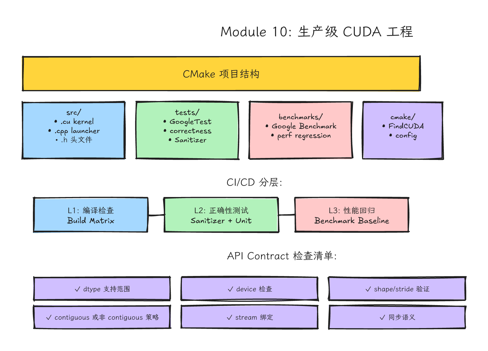
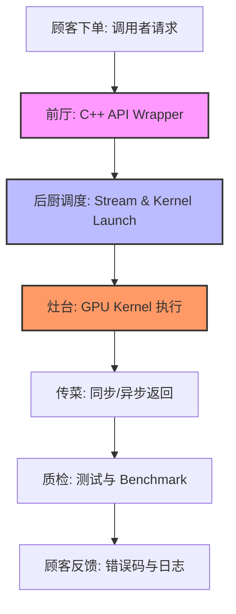
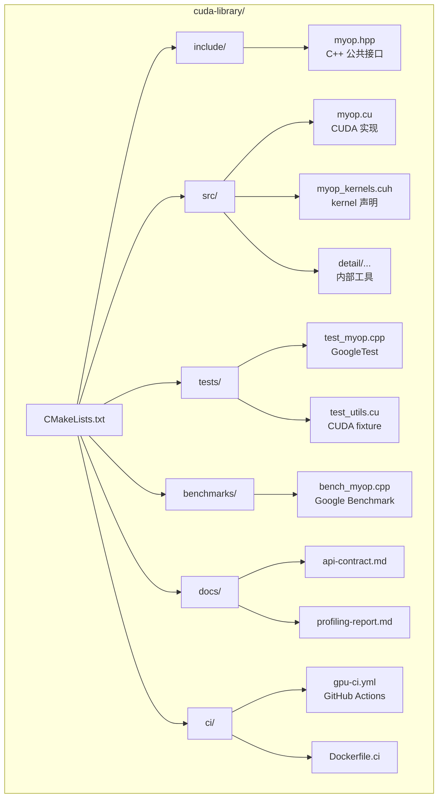
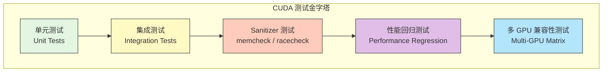
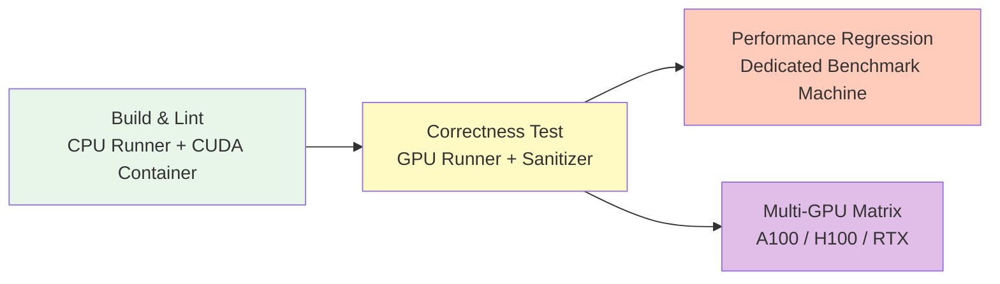
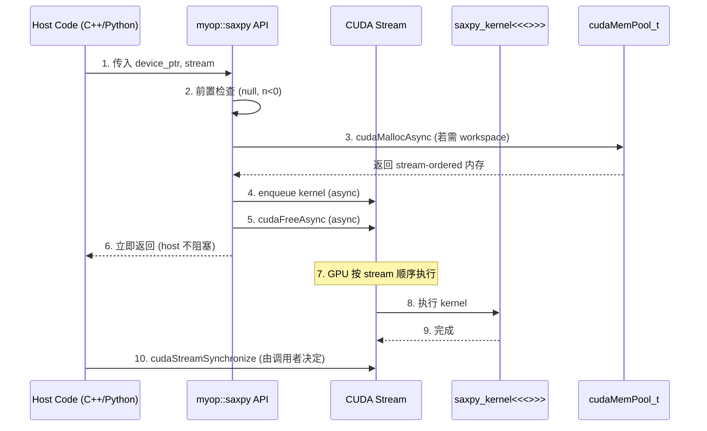

# Module 10: 生产级 CUDA 工程（Production CUDA Engineering）



*图 10-1：从 kernel 到构建、测试、benchmark、发布和回归监控的生产工程闭环。可编辑源图：[`module-10-cuda-production-engineering.excalidraw`](../diagrams/module-10-cuda-production-engineering.excalidraw)。*

> **Level**: Advanced
> **Estimated time**: 12–18 小时
> **Prerequisites**: Modules 00–09
> **Sources**: CUDA Runtime API, CMake CUDA docs, Compute Sanitizer, Nsight docs, PyTorch cpp_extension, vLLM/DeepGEMM build systems

---

## 学习目标

完成本模块后，你将能够：

1. **设计**一套现代 CMake 的 CUDA 多目标构建系统，支持 library、test、benchmark 的分离编译与架构自动探测。
2. **封装**生产级 C++ CUDA API，显式约定 memory ownership、stream semantics、synchronization、dtype/shape/alignment，并集成 NVTX 与 memory pool。
3. **搭建**基于 GoogleTest 的 CUDA 测试框架，覆盖 fixture、参数化测试、边界条件、错误路径，并在 CI 中自动运行 compute-sanitizer。
4. **实现**基于 Google Benchmark 的性能回归检测 harness，掌握 warmup、重复测量、统计显著性、跨 GPU 对比的方法论。
5. **配置**GPU CI/CD 流水线，包括 self-hosted runner、NVIDIA Container Toolkit Docker 环境、多 GPU 矩阵、分层测试（编译 / 正确性 / 性能回归）。
6. **复现**PyTorch CUDA extension、vLLM `csrc/`、DeepSeek DeepGEMM 的真实项目结构，理解从 kernel 源码到 wheel 发布的完整路径。

---

## 这一课的故事线

你已经能写 kernel、优化 kernel、用库、做 profiling。现在问题变成：**这些代码能不能交给别人维护？能不能半年后再跑？能不能在另一张 GPU 上给出合理 fallback？能不能自动测试？能不能解释 API 同步语义？**

生产级 CUDA 工程不是把最快 kernel 放进仓库，而是把一套**可重复、可验证、可维护**的 GPU 能力封装起来。很多 CUDA 项目失败，不是 kernel 写不快，而是 build、test、benchmark、API contract、版本记录做得太差。


---

## 第一层：问题背景（Why Production CUDA Is Hard）

CPU 工程的成熟工具链（CMake、Valgrind、Sanitizer、CI）在 GPU 上全部遇到新挑战：

| 维度 | CPU 工程 | CUDA 工程 |
|---|---|---|
| **构建** | 单架构即可 | 需指定 `sm_70/sm_80/sm_90` 多架构，且支持 separable compilation |
| **测试** | 随处可跑 | 需要物理 GPU，结果因 GPU 型号而异；内存越界在 CPU 上可能不 crash |
| **性能** | 相对稳定 | GPU boost clock、thermal throttling、多卡拓扑、stream 交织，导致 variance 大 |
| **调试** | GDB、ASan | `cuda-gdb`、`compute-sanitizer`、Nsight，且 kernel 内无法 printf 调试 |
| **部署** | 静态链接即可 | 需固定 CUDA user-space 库、cuDNN、cuBLAS/NCCL 等依赖；NVIDIA driver 来自宿主机，Docker 需 NVIDIA Container Toolkit 暴露 GPU |
| **API 契约** | 只需内存、线程 | 需要约定 pointer location (host/device/managed)、stream、synchronization、alignment |

生产 CUDA 工程的挑战在于硬件异构性与软件可复现性之间的冲突。本模块用系统化的方法解决这个冲突。

---

## 第二层：直觉类比（From Experimental Kitchen to Chain Restaurant）

实验厨房里，一个高手可以靠经验做出好菜。连锁餐厅需要：

- 标准菜谱：API contract。每道菜（函数）的输入、输出、温度（stream）、等待时间（sync）要精确记录。
- 质检流程：tests。不仅尝味道（correctness），还要测出餐时间（benchmark），查卫生死角（sanitizer）。
- 供应链记录：版本、硬件、依赖。今天用澳洲牛肉（sm_80），明天换日本和牛（sm_90），菜谱要说明替换规则。
- 异常处理：error handling。食材缺货（OOM）、设备故障（kernel launch failed）不能导致整个餐厅停摆。
- 培训手册：documentation。新员工（新同事）不需要拜访农场（读 kernel），只需按手册操作。

CUDA 生产工程也是这样。你不能指望未来维护者读完所有 kernel 才知道怎么调用。连锁餐厅比喻的精髓在于：**将隐性的专家经验显性化为可复制的系统能力**。



> Mental Model：生产级 CUDA 代码 = 硬件感知 + 接口契约 + 可测可证 + 持续集成。

---

## 第三层：硬件机制（What the API Must Respect）

CUDA API 设计需要暴露或隐藏以下硬件事实，这些事实直接决定接口形态：

1. **Pointer Location**：输入数据在 host、device 还是 managed/unified memory？这决定了是否需要 `cudaMemcpy` 或 `cudaMallocAsync`。
2. **Synchronization Semantics**：函数是同步（blocking）还是异步（non-blocking, stream-ordered）？生产级库应把同步权交给调用者，避免内部调用 `cudaDeviceSynchronize()`。
3. **Stream Identity**：使用默认流（legacy default stream）还是显式 `cudaStream_t`？legacy default stream 会和普通 blocking stream 发生隐式同步，容易破坏上层并发；现代 API 应暴露 stream 参数，必要时创建 `cudaStreamNonBlocking`。
4. **Temporary Allocation**：是否分配临时 device memory？如果分配，是在函数内部 `cudaMalloc`（性能陷阱），还是由调用者提供 workspace（如 cuBLAS 的 `workspace` 参数）？
5. **Alignment & Shape**：是否要求输入是 128-bit 对齐？是否要求 tensor 是 contiguous？是否支持 arbitrary shape（如非 2 的幂次）？
6. **Compute Capability**：是否依赖 `sm_80+` 的 `cp.async` 或 `sm_90` 的 TMA？如果不支持，fallback 是 CPU 路径还是抛出错误？
7. **Memory Pool & Reuse**：CUDA 11.2+ 的 `cudaMemPool_t` 和 `cudaMallocAsync`/`cudaFreeAsync` 允许流序内存复用，减少昂贵的分配/释放开销。生产级代码应利用 memory pool 管理临时内存。

一个糟糕接口可能让用户以为函数已经完成，实际只是 enqueue 到 stream。也可能每次调用都偷偷 `cudaMalloc`，让性能在小输入下崩掉。

---

## 第四层：代码路径（Code Paths）

### 4.1 项目结构：推荐布局

生产级 CUDA 项目不是 `.cu` 文件堆砌，而是清晰的分层结构：



- `include/`：只暴露 C++ 接口（`.hpp`），不暴露 `.cuh` 或 kernel 实现。调用者不需要 nvcc 编译你的头文件。
- `src/`：CUDA 实现、kernel 定义、内部工具。
- `tests/`：GoogleTest 或 Catch2，覆盖正确性、边界、错误路径。
- `benchmarks/`：Google Benchmark，独立 executable，避免测试与 benchmark 耦合。
- `docs/`：API contract、性能报告、设计决策记录（ADR）。
- `ci/`：CI/CD 配置、Dockerfile、self-hosted runner 脚本。

---

### 4.2 精品代码 1：完整的现代 CMake 项目配置

CMake 很早就提供了原生 CUDA language support；现代项目应使用 `project(... LANGUAGES CUDA)`、`CUDA_ARCHITECTURES` 和 `find_package(CUDAToolkit)`，不要继续依赖遗留的 `FindCUDA` / `find_package(CUDA)` 模式。以下配置展示 multi-target、separable compilation、架构自动探测、外部库链接（cuBLAS、CUB、Thrust）。

```cmake
# =============================================================================
# CMakeLists.txt — 现代 CUDA 生产级构建配置
# 要求：CMake >= 3.25, CUDA Toolkit >= 11.8, C++17
# =============================================================================
cmake_minimum_required(VERSION 3.25)

# -------------------------------------------------------------------------
# 1. 项目声明：显式声明 CUDA 为一种语言，CMake 会自动查找 nvcc
# -------------------------------------------------------------------------
project(my_cuda_lib
    VERSION 1.0.0
    LANGUAGES CXX CUDA
    DESCRIPTION "Production-grade CUDA operator library"
)

# -------------------------------------------------------------------------
# 2. 全局编译标准：使用 C++17，CUDA 标准同步
# -------------------------------------------------------------------------
set(CMAKE_CXX_STANDARD 17)
set(CMAKE_CXX_STANDARD_REQUIRED ON)
set(CMAKE_CUDA_STANDARD 17)
set(CMAKE_CUDA_STANDARD_REQUIRED ON)

# -------------------------------------------------------------------------
# 3. CUDA 架构策略：
#    CUDA_ARCHITECTURES 属性从 CMake 3.18 起可用；
#    "all"/"all-major" 和 "native" 这类特殊值依赖较新的 CMake 版本。
#    - "native"：只编译当前机器 GPU 的架构（开发最快）
#    - "all" / "all-major"：发布 wheel 时覆盖所有支持架构
#    - 显式列表：如 70;80;90 对应 V100, A100, H100
# -------------------------------------------------------------------------
# 开发阶段用 native，CI/CD 发布时用显式列表或 all-major
set(CMAKE_CUDA_ARCHITECTURES "native" CACHE STRING "CUDA arch flags")

# -------------------------------------------------------------------------
# 4. 可选项：启用 CUDA 分离编译（Relocatable Device Code, RDC）
#    当设备函数跨编译单元调用（如 template kernel 在 .cu 中实例化，
#    在另一个 .cu 中调用）时，需要启用 RDC。
#    注意：RDC 会略微增加 link 时间，并可能限制某些 inline 优化。
# -------------------------------------------------------------------------
option(ENABLE_RDC "Enable relocatable device code (separable compilation)" OFF)

# -------------------------------------------------------------------------
# 5. 使用 CMake 的 CUDAToolkit 模块查找 CUDA 库
#    替代遗留的 find_package(CUDA) / FindCUDA。
#    提供 CUDA::cudart, CUDA::cublas, CUDA::cublasLt 等 IMPORTED target。
# -------------------------------------------------------------------------
find_package(CUDAToolkit REQUIRED)

# 查找 Thrust / CUB：CUDA 11+ 自带，通常通过 CUDA 工具链包含路径
# 若需要独立版本，可用 find_package(Thrust) 或 FetchContent
# 这里演示显式添加 include 路径，确保 CUB 头文件可见
find_package(Thrust CONFIG QUIET PATHS ${CUDAToolkit_LIBRARY_ROOT})
if(NOT Thrust_FOUND)
    message(STATUS "Using bundled CUB/Thrust from CUDA toolkit")
endif()

# -------------------------------------------------------------------------
# 6. 主库 target：静态库，封装所有 CUDA 内核
# -------------------------------------------------------------------------
add_library(myop STATIC
    src/myop.cu
    src/myop_kernels.cuh
    src/detail/cuda_check.cuh
    src/detail/memory_pool.cpp
)

# 公共头文件目录：调用者只需 include <myop.hpp>
target_include_directories(myop
    PUBLIC
        $<BUILD_INTERFACE:${CMAKE_CURRENT_SOURCE_DIR}/include>
        $<INSTALL_INTERFACE:include>
    PRIVATE
        ${CMAKE_CURRENT_SOURCE_DIR}/src
)

# 链接 CUDA 运行时与 cuBLAS：使用 modern CMake 的 IMPORTED target
target_link_libraries(myop
    PUBLIC
        CUDA::cudart
    PRIVATE
        CUDA::cublas
)

# 若启用 RDC，设置库属性；注意只对 CUDA 源文件生效
if(ENABLE_RDC)
    set_target_properties(myop PROPERTIES
        CUDA_SEPARABLE_COMPILATION ON
    )
endif()

# 编译选项：启用快速数学（可选，需评估精度影响）
# target_compile_options(myop PRIVATE $<$<COMPILE_LANGUAGE:CUDA>:--use_fast_math>)

# -------------------------------------------------------------------------
# 7. 可执行文件 target：示例程序，链接上面的库
# -------------------------------------------------------------------------
add_executable(myop_example examples/example_saxpy.cpp)
target_link_libraries(myop_example PRIVATE myop)

# -------------------------------------------------------------------------
# 8. 测试 target：基于 GoogleTest，编译为独立 executable
# -------------------------------------------------------------------------
include(FetchContent)
FetchContent_Declare(
    googletest
    URL https://github.com/google/googletest/archive/refs/tags/v1.14.0.zip
)
# 避免污染主项目的编译选项
set(gtest_force_shared_crt ON CACHE BOOL "" FORCE)
FetchContent_MakeAvailable(googletest)

enable_testing()

add_executable(myop_test
    tests/test_myop.cpp
    tests/test_utils.cu
)
target_link_libraries(myop_test PRIVATE myop GTest::gtest_main)

# 若测试用到 device 函数，可能需要 RDC
if(ENABLE_RDC)
    set_target_properties(myop_test PROPERTIES CUDA_SEPARABLE_COMPILATION ON)
endif()

include(GoogleTest)
gtest_discover_tests(myop_test)

# -------------------------------------------------------------------------
# 9. Benchmark target：基于 Google Benchmark，独立 executable
# -------------------------------------------------------------------------
FetchContent_Declare(
    benchmark
    URL https://codeload.github.com/google/benchmark/tar.gz/refs/tags/v1.8.3
)
FetchContent_MakeAvailable(benchmark)

add_executable(myop_bench benchmarks/bench_myop.cpp)
target_link_libraries(myop_bench PRIVATE myop benchmark::benchmark)

# -------------------------------------------------------------------------
# 10. 安装规则：支持 `cmake --install` 发布头文件与库
# -------------------------------------------------------------------------
include(GNUInstallDirs)
install(TARGETS myop myop_example
    EXPORT myop-targets
    LIBRARY DESTINATION ${CMAKE_INSTALL_LIBDIR}
    ARCHIVE DESTINATION ${CMAKE_INSTALL_LIBDIR}
    RUNTIME DESTINATION ${CMAKE_INSTALL_BINDIR}
    INCLUDES DESTINATION ${CMAKE_INSTALL_INCLUDEDIR}
)
install(DIRECTORY include/ DESTINATION ${CMAKE_INSTALL_INCLUDEDIR})

# -------------------------------------------------------------------------
# 11. 导出 CMake 配置，供其他项目通过 find_package(myop) 使用
# -------------------------------------------------------------------------
install(EXPORT myop-targets
    FILE myop-targets.cmake
    NAMESPACE myop::
    DESTINATION ${CMAKE_INSTALL_LIBDIR}/cmake/myop
)
```

**关键 CMake 概念**：

- **`LANGUAGES CXX CUDA`**：使用 CMake 原生 CUDA language support，让 CMake 自动处理 `.cu` 文件的编译、链接和架构 flags。
- **`CUDA_ARCHITECTURES`**：替代了手动写 `-gencode arch=compute_80,code=sm_80`。发布二进制包时，建议用显式列表（如 `80;86;89;90;100`）或经验证的 `all-major`，避免把不需要或不支持的架构也塞进 wheel。
- **`CUDA_SEPARABLE_COMPILATION`**：启用 relocatable device code（RDC），允许设备代码跨 `.cu` 文件调用。代价是 link 阶段需要 `device-link` 步骤，增加编译时间。
- **`find_package(CUDAToolkit REQUIRED)`**：提供 `CUDA::cudart`、`CUDA::cublas` 等 imported targets，现代 CMake 推荐做法。旧式 `FindCUDA` 早已被弃用，并在较新的 CMake policy 下可能不可用。

---

### 4.3 精品代码 2：生产级 CUDA 库的 C++ 接口包装（Stream-Aware + Memory Pool + NVTX）

以下示例在原有 `my_saxpy_device` 基础上，扩展为**支持模板 dtype、显式 workspace 分配、NVTX 标注、CUDA Memory Pool** 的完整生产级包装。

```cpp
// =============================================================================
// include/myop.hpp — 生产级 CUDA API 公共接口
// 设计理念：
//   1. 异步：所有函数只 enqueue，不 device synchronize。
//   2. 显式：stream、workspace、alignment 由调用者传入或约定。
//   3. 安全：空指针、非法尺寸、dtype 不匹配在 launch 前检查。
//   4. 可观测：集成 NVTX range，可在 Nsight Systems 中追踪。
// =============================================================================
#pragma once

#include <algorithm>
#include <cuda_runtime.h>
#include <cstdint>
#include <stdexcept>
#include <string>
#include <type_traits>

// ---------------------------------------------------------------------------
// 可选：NVTX 轻量包装（若环境无 NVTX 可条件编译）
// ---------------------------------------------------------------------------
#ifdef MYOP_ENABLE_NVTX
  #include <nvtx3/nvtxToolsExt.h>
  #define MYOP_NVTX_RANGE(name) nvtxRangePushA(name);
  #define MYOP_NVTX_RANGE_END() nvtxRangePop();
#else
  #define MYOP_NVTX_RANGE(name)
  #define MYOP_NVTX_RANGE_END()
#endif

namespace myop {

// ---------------------------------------------------------------------------
// 错误码策略：本库使用异常（C++ 风格），但提供对应的 C 兼容错误码枚举。
// 替代方案：返回 cudaError_t（适合 C 接口）或 std::expected（C++23）。
// ---------------------------------------------------------------------------
enum class Status : int {
    OK = 0,
    InvalidArgument = 1,
    OutOfMemory = 2,
    CUDAError = 3,
    NotImplemented = 4,
};

// ---------------------------------------------------------------------------
// 设备指针别名：语义上标记这是 device pointer，不拥有内存。
// ---------------------------------------------------------------------------
template <typename T>
using DevicePtr = T*;

// ---------------------------------------------------------------------------
// Workspace 描述符：由调用者管理，避免库内部偷偷 cudaMalloc。
//   - ptr: device pointer，至少 size 字节。
//   - size: 字节数。
//   - pool: 可选的 cudaMemPool_t，用于 async alloc/free。
// ---------------------------------------------------------------------------
struct Workspace {
    void* ptr = nullptr;
    size_t size = 0;
    cudaMemPool_t pool = nullptr; // nullptr 表示使用默认 pool
};

// ---------------------------------------------------------------------------
// API Contract（以 saxpy 为例）：
//   - x, y, out: 应是有效的 device pointer，由调用者保证生命周期。
//   - n: 元素个数，允许为 0（空操作）。
//   - alpha: 标量乘数。
//   - stream: 执行流，函数仅 enqueue kernel，不 synchronize。
//   - workspace: 若内部需要临时内存（本例不需要），优先使用此 workspace。
//   - 同步语义：函数返回后，kernel 在 stream 上排队完成；调用者需自行同步。
//   - 支持的 dtype：float, double；half/bfloat16 需要单独显式实例化、精度策略和测试。
//   - Alignment：输入输出应至少 128-bit 对齐以获得最佳内存吞吐。
// ---------------------------------------------------------------------------
template <typename T>
void saxpy(DevicePtr<const T> x,
           DevicePtr<const T> y,
           DevicePtr<T> out,
           T alpha,
           int n,
           cudaStream_t stream,
           const Workspace& workspace = {});

// ---------------------------------------------------------------------------
// 显式实例化声明：在 .cu 中实例化，避免编译时间膨胀。
// ---------------------------------------------------------------------------
extern template void saxpy<float>(DevicePtr<const float>, DevicePtr<const float>,
                                  DevicePtr<float>, float, int, cudaStream_t, const Workspace&);
extern template void saxpy<double>(DevicePtr<const double>, DevicePtr<const double>,
                                   DevicePtr<double>, double, int, cudaStream_t, const Workspace&);

// ---------------------------------------------------------------------------
// 同步辅助：提供可选的 host-side 同步工具，但**不**在核心 API 内部调用。
// ---------------------------------------------------------------------------
inline void stream_synchronize(cudaStream_t stream) {
    cudaError_t err = cudaStreamSynchronize(stream);
    if (err != cudaSuccess) {
        throw std::runtime_error(std::string("cudaStreamSynchronize failed: ") +
                                 cudaGetErrorString(err));
    }
}

} // namespace myop
```

```cpp
// =============================================================================
// src/myop.cu — 生产级实现：kernel + launch wrapper + 模板实例化
// =============================================================================
#include "myop.hpp"
#include "detail/cuda_check.cuh"
#include "detail/memory_pool.hpp"
#include <algorithm>

namespace myop {

// ---------------------------------------------------------------------------
// Kernel 定义：保留在 anonymous namespace 中，防止外部链接符号污染。
// ---------------------------------------------------------------------------
namespace {

template <typename T>
__global__ void saxpy_kernel(const T* __restrict__ x,
                              const T* __restrict__ y,
                              T* __restrict__ out,
                              T alpha,
                              int n) {
    // grid-stride loop：支持任意 n，不受单 grid 维度限制
    int idx = blockIdx.x * blockDim.x + threadIdx.x;
    int stride = blockDim.x * gridDim.x;
    for (int i = idx; i < n; i += stride) {
        out[i] = alpha * x[i] + y[i];
    }
}

} // anonymous namespace

// ---------------------------------------------------------------------------
// Launch wrapper：包含所有生产级检查、NVTX 标注、memory pool 管理。
// ---------------------------------------------------------------------------
template <typename T>
void saxpy(DevicePtr<const T> x,
           DevicePtr<const T> y,
           DevicePtr<T> out,
           T alpha,
           int n,
           cudaStream_t stream,
           const Workspace& workspace) {
    // 1. 前置条件检查：空指针、负尺寸。生产代码应在 launch 前检查输入。
    if (n < 0) {
        throw std::invalid_argument("saxpy: n must be non-negative");
    }
    if (n == 0) {
        return; // 空操作是合法调用，直接返回
    }
    if (x == nullptr || y == nullptr || out == nullptr) {
        throw std::invalid_argument("saxpy: device pointers must not be null");
    }

    // 2. NVTX 标注：在 Nsight Systems 时间线上标记此 region，方便定位瓶颈。
    MYOP_NVTX_RANGE("myop::saxpy");

    // 3. 若需要临时内存（本例无），优先使用 workspace.pool 做 async alloc。
    //    此处演示 memory pool 的规范用法：
    void* temp_ptr = nullptr;
    if (workspace.size > 0 && workspace.ptr == nullptr) {
        // 调用者未提供 ptr，但指定了 size，说明需要内部分配。
        // 使用 stream-ordered 分配，避免同步开销。
        cudaMemPool_t pool = (workspace.pool != nullptr) ? workspace.pool
                                                         : detail::get_default_pool();
        CUDA_CHECK(cudaMallocFromPoolAsync(&temp_ptr, workspace.size, pool, stream));
    }

    // 4. 计算 launch configuration：
    //    - block size = 256 是通用起点（经验值，兼顾占用率与寄存器）。
    //    - grid size 用最小值约束，避免小输入启动过多 block。
    const int block_size = 256;
    const int grid_size = std::min((n + block_size - 1) / block_size, 65535);

    // 5. 启动 kernel：显式传入 stream，保持异步语义。
    saxpy_kernel<<<grid_size, block_size, 0, stream>>>(x, y, out, alpha, n);

    // 6. 只检查 launch 错误（异步错误由后续 synchronize 或 stream query 捕获）。
    CUDA_CHECK(cudaGetLastError());

    // 7. 清理临时内存（stream-ordered free，不阻塞）。
    if (temp_ptr != nullptr) {
        CUDA_CHECK(cudaFreeAsync(temp_ptr, stream));
    }

    MYOP_NVTX_RANGE_END();
}

// ---------------------------------------------------------------------------
// 模板显式实例化：控制编译单元，避免重复实例化导致编译膨胀。
// ---------------------------------------------------------------------------
template void saxpy<float>(DevicePtr<const float>, DevicePtr<const float>,
                           DevicePtr<float>, float, int, cudaStream_t, const Workspace&);
template void saxpy<double>(DevicePtr<const double>, DevicePtr<const double>,
                            DevicePtr<double>, double, int, cudaStream_t, const Workspace&);

} // namespace myop
```

```cpp
// =============================================================================
// src/detail/cuda_check.cuh — CUDA 错误检查宏（标准做法）
// =============================================================================
#pragma once

#include <cuda_runtime.h>
#include <stdexcept>
#include <string>

#define CUDA_CHECK(expr)                                                      \
    do {                                                                      \
        cudaError_t __err = (expr);                                           \
        if (__err != cudaSuccess) {                                           \
            throw std::runtime_error(                                         \
                std::string("CUDA error at ") + __FILE__ + ":" +             \
                std::to_string(__LINE__) + " - " + cudaGetErrorString(__err)); \
        }                                                                     \
    } while (0)
```

设计要点：

- **异步语义**：`saxpy` 返回后仅保证 kernel 已 enqueue，不保证执行完成。调用者（如 PyTorch autograd）可以自行决定同步时机，或与其他 kernel 组成 CUDA Graph。
- **Workspace 模式**：不内部 `cudaMalloc`（会触发系统调用，阻塞 CPU），而是要求调用者预分配或通过 `cudaMallocAsync` 从 pool 分配。
- **NVTX 标注**：`MYOP_NVTX_RANGE` 和 `MYOP_NVTX_RANGE_END` 在 Nsight Systems 时间线上生成可视化区间，是性能工程的关键工具。
- **模板显式实例化**：在 `.cu` 中显式实例化常用类型（float, double, half），避免头文件包含导致所有编译单元重复实例化，显著减少编译时间。

---

### 4.4 精品代码 3：使用 GoogleTest 的 CUDA 测试框架（Fixture + 参数化 + Sanitizer）

CUDA 测试的挑战在于：需要管理 device memory、处理 numerical tolerance、支持不同输入尺寸和数据类型。以下是完整的测试框架示例。

```cpp
// =============================================================================
// tests/test_myop.cpp — GoogleTest CUDA 测试框架示例
// 包含：Fixture、参数化测试、TYPED_TEST（多 dtype）、边界条件、错误路径。
// =============================================================================
#include <gtest/gtest.h>
#include <cuda_runtime.h>
#include <vector>
#include <cmath>
#include "myop.hpp"
#include "detail/cuda_check.cuh"

using namespace myop;

// ---------------------------------------------------------------------------
// 1. 测试夹具（Fixture）：CudaTest
//    每个测试用例共享的 setup/teardown：
//    - 创建 non-blocking stream（避免默认流的隐式同步）。
//    - 测试结束后自动 device synchronize，确保 kernel 错误被捕获。
// ---------------------------------------------------------------------------
class CudaTest : public ::testing::Test {
protected:
    cudaStream_t stream_ = nullptr;

    void SetUp() override {
        // 创建非阻塞流，防止默认流隐式同步干扰并发测试
        CUDA_CHECK(cudaStreamCreateWithFlags(&stream_, cudaStreamNonBlocking));
    }

    void TearDown() override {
        // 强制同步，确保所有 GPU 操作完成后再检查错误
        if (stream_) {
            CUDA_CHECK(cudaStreamSynchronize(stream_));
            CUDA_CHECK(cudaStreamDestroy(stream_));
        }
    }
};

// ---------------------------------------------------------------------------
// 2. 辅助函数：分配并填充 device 内存，返回 device vector（RAII 管理）
// ---------------------------------------------------------------------------
template <typename T>
class DeviceBuffer {
public:
    explicit DeviceBuffer(size_t n, T init_val = T(0)) : n_(n) {
        if (n_ == 0) {
            return;
        }
        CUDA_CHECK(cudaMalloc(&d_ptr_, n * sizeof(T)));
        std::vector<T> h_vec(n, init_val);
        CUDA_CHECK(cudaMemcpy(d_ptr_, h_vec.data(), n * sizeof(T), cudaMemcpyHostToDevice));
    }
    ~DeviceBuffer() { cudaFree(d_ptr_); }
    T* ptr() const { return d_ptr_; }
    size_t size() const { return n_; }
    // 拷贝回 host 用于验证
    std::vector<T> to_host() const {
        std::vector<T> h_vec(n_);
        if (n_ == 0) {
            return h_vec;
        }
        CUDA_CHECK(cudaMemcpy(h_vec.data(), d_ptr_, n_ * sizeof(T), cudaMemcpyDeviceToHost));
        return h_vec;
    }
private:
    T* d_ptr_ = nullptr;
    size_t n_ = 0;
};

// ---------------------------------------------------------------------------
// 3. 基本正确性测试：使用 Fixture
// ---------------------------------------------------------------------------
TEST_F(CudaTest, SaxpyFloatCorrectness) {
    const int n = 1024;
    const float alpha = 2.0f;
    DeviceBuffer<float> x(n, 1.0f);   // x[i] = 1.0
    DeviceBuffer<float> y(n, 3.0f);   // y[i] = 3.0
    DeviceBuffer<float> out(n, 0.0f); // out[i] = 0.0

    // 调用被测函数：异步执行
    saxpy(x.ptr(), y.ptr(), out.ptr(), alpha, n, stream_);

    // 同步并验证
    CUDA_CHECK(cudaStreamSynchronize(stream_));
    auto h_out = out.to_host();
    for (int i = 0; i < n; ++i) {
        // 浮点比较使用相对容差，而非 bitwise identical
        EXPECT_NEAR(h_out[i], alpha * 1.0f + 3.0f, 1e-5f)
            << "Mismatch at index " << i;
    }
}

// ---------------------------------------------------------------------------
// 4. 边界条件测试：空输入、单元素、非对齐尺寸
// ---------------------------------------------------------------------------
TEST_F(CudaTest, SaxpyEmptyInput) {
    // n = 0 时不应崩溃，也不应操作内存
    DeviceBuffer<float> x(1, 0.0f);
    DeviceBuffer<float> y(1, 0.0f);
    DeviceBuffer<float> out(1, 0.0f);
    EXPECT_NO_THROW(saxpy(x.ptr(), y.ptr(), out.ptr(), 1.0f, 0, stream_));
    CUDA_CHECK(cudaStreamSynchronize(stream_));
}

TEST_F(CudaTest, SaxpySingleElement) {
    DeviceBuffer<float> x(1, 2.0f);
    DeviceBuffer<float> y(1, 3.0f);
    DeviceBuffer<float> out(1, 0.0f);
    saxpy(x.ptr(), y.ptr(), out.ptr(), 1.5f, 1, stream_);
    CUDA_CHECK(cudaStreamSynchronize(stream_));
    EXPECT_NEAR(out.to_host()[0], 1.5f * 2.0f + 3.0f, 1e-5f);
}

TEST_F(CudaTest, SaxpyOddSize) {
    // 尺寸不是 block size (256) 的整数倍，测试 grid-stride loop 的尾部处理
    const int n = 17;
    DeviceBuffer<float> x(n, 1.0f);
    DeviceBuffer<float> y(n, 2.0f);
    DeviceBuffer<float> out(n, 0.0f);
    saxpy(x.ptr(), y.ptr(), out.ptr(), 1.0f, n, stream_);
    CUDA_CHECK(cudaStreamSynchronize(stream_));
    auto h = out.to_host();
    for (int i = 0; i < n; ++i) {
        EXPECT_NEAR(h[i], 3.0f, 1e-5f);
    }
}

// ---------------------------------------------------------------------------
// 5. 参数化测试：不同输入规模（小规模、中规模、大规模）
// ---------------------------------------------------------------------------
class SaxpySizeParamTest : public CudaTest,
                           public ::testing::WithParamInterface<int> {};

TEST_P(SaxpySizeParamTest, RunWithSize) {
    const int n = GetParam();
    DeviceBuffer<float> x(n, 1.0f);
    DeviceBuffer<float> y(n, 2.0f);
    DeviceBuffer<float> out(n, 0.0f);
    saxpy(x.ptr(), y.ptr(), out.ptr(), 3.0f, n, stream_);
    CUDA_CHECK(cudaStreamSynchronize(stream_));
    auto h = out.to_host();
    for (int i = 0; i < n; ++i) {
        EXPECT_NEAR(h[i], 5.0f, 1e-4f) << "Failed at size=" << n << " index=" << i;
    }
}

// 测试矩阵：0, 1, 17, 255, 256, 1024, 65535, 1048576
INSTANTIATE_TEST_SUITE_P(
    Sizes,
    SaxpySizeParamTest,
    ::testing::Values(0, 1, 17, 255, 256, 1024, 65535, 1 << 20)
);

// ---------------------------------------------------------------------------
// 6. 错误路径测试：非法输入应抛出异常，而不是返回错误码或崩溃
// ---------------------------------------------------------------------------
TEST_F(CudaTest, SaxpyNullPointerThrows) {
    float* null_ptr = nullptr;
    float* valid_ptr = nullptr;
    CUDA_CHECK(cudaMalloc(&valid_ptr, sizeof(float)));
    // x 为 null 应抛异常
    EXPECT_THROW(saxpy(null_ptr, valid_ptr, valid_ptr, 1.0f, 1, stream_), std::invalid_argument);
    cudaFree(valid_ptr);
}

TEST_F(CudaTest, SaxpyNegativeSizeThrows) {
    DeviceBuffer<float> x(1, 0.0f);
    DeviceBuffer<float> y(1, 0.0f);
    DeviceBuffer<float> out(1, 0.0f);
    EXPECT_THROW(saxpy(x.ptr(), y.ptr(), out.ptr(), 1.0f, -1, stream_), std::invalid_argument);
}

// ---------------------------------------------------------------------------
// 7. 多 Stream 测试：验证 API 不偷偷同步其他流
// ---------------------------------------------------------------------------
TEST_F(CudaTest, SaxpyMultipleStreams) {
    const int n = 4096;
    DeviceBuffer<float> x(n, 1.0f);
    DeviceBuffer<float> y(n, 2.0f);
    DeviceBuffer<float> out(n, 0.0f);

    cudaStream_t stream2;
    CUDA_CHECK(cudaStreamCreate(&stream2));

    // 在 stream 上启动 saxpy
    saxpy(x.ptr(), y.ptr(), out.ptr(), 1.0f, n, stream_);

    // 立即在 stream2 上启动另一个 kernel（如果 saxpy 内部偷偷 synchronize，stream2 会延迟）
    // 此处简化：仅验证两个流都能正常完成
    CUDA_CHECK(cudaStreamSynchronize(stream_));
    CUDA_CHECK(cudaStreamSynchronize(stream2));
    CUDA_CHECK(cudaStreamDestroy(stream2));

    auto h = out.to_host();
    EXPECT_NEAR(h[0], 3.0f, 1e-5f);
}

// ---------------------------------------------------------------------------
// 8. 数值容差测试：float 不要求 bitwise identical，但需要文档化 tolerance。
//    对于 reduction 类 kernel，顺序不同会导致微小差异，需设置合理阈值。
// ---------------------------------------------------------------------------
TEST_F(CudaTest, NumericalTolerance) {
    const int n = 100000;
    DeviceBuffer<float> x(n, 1.0f / 3.0f);
    DeviceBuffer<float> y(n, 1.0f / 6.0f);
    DeviceBuffer<float> out(n, 0.0f);
    saxpy(x.ptr(), y.ptr(), out.ptr(), 1.0f, n, stream_);
    CUDA_CHECK(cudaStreamSynchronize(stream_));
    auto h = out.to_host();
    EXPECT_NEAR(h[0], 0.5f, 1e-5f);
}
```

测试框架设计要点：

- **Fixture 封装**：`SetUp` 创建 non-blocking stream，`TearDown` 强制同步并销毁。这保证测试之间无状态泄漏，且不依赖默认流的隐式同步。
- **参数化测试**：`SaxpySizeParamTest` 用 `INSTANTIATE_TEST_SUITE_P` 自动生成多尺寸测试，覆盖空输入、block 边界、非对齐、大规模。
- **DeviceBuffer RAII**：避免裸 `cudaMalloc`/`cudaFree`，用 RAII 管理设备内存，确保测试失败时无内存泄漏。
- Sanitizer 集成：在 CI 中运行 `compute-sanitizer --tool memcheck ./myop_test` 可检测越界访问；`--tool racecheck` 检测 shared memory data race。GoogleTest 的 `EXPECT_*` 宏与 sanitizer 兼容（sanitizer 发现错误时进程退出，gtest 报告失败）。



---

### 4.5 精品代码 4：使用 Google Benchmark 的 CUDA Benchmark 框架

Benchmark 不是简单的“跑一遍看时间”。生产级 benchmark 需要 warmup、重复测量、统计显著性、记录环境元数据。

```cpp
// =============================================================================
// benchmarks/bench_myop.cpp — Google Benchmark CUDA 性能测试框架
// 设计原则：
//   1. 分离 warmup（排除 JIT/内存分配/clock boost 噪声）。
//   2. 使用 CUDA Event 计时（精确到微秒，排除 CPU 调度噪声）。
//   3. 统计重复次数，取 median / mean / stddev。
//   4. 记录 GPU 型号、Driver、CUDA 版本、编译 flags。
//   5. 输出 Markdown table 或 JSON，便于 CI 比较。
// =============================================================================
#include <benchmark/benchmark.h>
#include <cuda_runtime.h>
#include <iostream>
#include <vector>
#include <string>
#include "myop.hpp"
#include "detail/cuda_check.cuh"

using namespace myop;

// ---------------------------------------------------------------------------
// 1. 全局环境元数据：在 main 开始或第一个 benchmark 前打印。
// ---------------------------------------------------------------------------
struct BenchmarkEnv {
    std::string gpu_name;
    std::string driver_version;
    std::string cuda_version;
    int sm_major = 0, sm_minor = 0;

    BenchmarkEnv() {
        int device = 0;
        cudaDeviceProp prop;
        CUDA_CHECK(cudaGetDeviceProperties(&prop, device));
        gpu_name = prop.name;
        sm_major = prop.major;
        sm_minor = prop.minor;

        int driver_version = 0;
        CUDA_CHECK(cudaDriverGetVersion(&driver_version));
        this->driver_version = std::to_string(driver_version);

        int runtime_version = 0;
        CUDA_CHECK(cudaRuntimeGetVersion(&runtime_version));
        cuda_version = std::to_string(runtime_version);
    }
};

static const BenchmarkEnv& get_env() {
    static BenchmarkEnv env;
    return env;
}

// ---------------------------------------------------------------------------
// 2. Benchmark 夹具：管理 device 内存、stream、CUDA event
// ---------------------------------------------------------------------------
class CudaBenchmark : public benchmark::Fixture {
public:
    cudaStream_t stream = nullptr;
    cudaEvent_t start_event = nullptr;
    cudaEvent_t stop_event = nullptr;

    void SetUp(const ::benchmark::State& state) override {
        CUDA_CHECK(cudaStreamCreate(&stream));
        CUDA_CHECK(cudaEventCreate(&start_event));
        CUDA_CHECK(cudaEventCreate(&stop_event));
    }

    void TearDown(const ::benchmark::State& state) override {
        CUDA_CHECK(cudaEventDestroy(start_event));
        CUDA_CHECK(cudaEventDestroy(stop_event));
        CUDA_CHECK(cudaStreamDestroy(stream));
    }
};

// ---------------------------------------------------------------------------
// 3. 辅助：为给定尺寸分配设备内存并填充随机数据
// ---------------------------------------------------------------------------
template <typename T>
void alloc_and_fill(T** d_ptr, size_t n, T val) {
    CUDA_CHECK(cudaMalloc(d_ptr, n * sizeof(T)));
    std::vector<T> h_vec(n, val);
    CUDA_CHECK(cudaMemcpy(*d_ptr, h_vec.data(), n * sizeof(T), cudaMemcpyHostToDevice));
}

// ---------------------------------------------------------------------------
// 4. Benchmark 函数：saxpy 在不同输入规模下的吞吐（GB/s）与 latency（us）。
//    参数 range_multiplier=2 表示每次迭代 n 翻倍。
// ---------------------------------------------------------------------------
BENCHMARK_DEFINE_F(CudaBenchmark, SaxpyLatency)(benchmark::State& state) {
    const int n = static_cast<int>(state.range(0));
    float *x = nullptr, *y = nullptr, *out = nullptr;
    alloc_and_fill(&x, n, 1.0f);
    alloc_and_fill(&y, n, 2.0f);
    alloc_and_fill(&out, n, 0.0f);

    // Warmup：排除首次 kernel launch 的额外开销（如 driver JIT、内存迁移）
    for (int i = 0; i < 3; ++i) {
        saxpy(x, y, out, 1.0f, n, stream);
    }
    CUDA_CHECK(cudaStreamSynchronize(stream));

    // 正式测量：每轮 benchmark 使用 CUDA Event 计时
    for (auto _ : state) {
        CUDA_CHECK(cudaEventRecord(start_event, stream));
        saxpy(x, y, out, 1.0f, n, stream);
        CUDA_CHECK(cudaEventRecord(stop_event, stream));
        CUDA_CHECK(cudaEventSynchronize(stop_event));

        float milliseconds = 0.0f;
        CUDA_CHECK(cudaEventElapsedTime(&milliseconds, start_event, stop_event));
        // benchmark 内部自动统计重复次数，这里将 ms 转为 us 作为 iteration time
        state.SetIterationTime(milliseconds / 1000.0); // benchmark::SetIterationTime 接收秒
    }

    // 计算吞吐：读 x + 读 y + 写 out = 3 * n * sizeof(float) bytes
    const double bytes_processed = 3.0 * static_cast<double>(n) * sizeof(float);
    state.SetBytesProcessed(static_cast<int64_t>(bytes_processed * state.iterations()));

    cudaFree(x); cudaFree(y); cudaFree(out);
}

// 注册 benchmark：从 256 到 2^24，每轮翻倍
BENCHMARK_REGISTER_F(CudaBenchmark, SaxpyLatency)
    ->RangeMultiplier(2)
    ->Range(256, 1 << 24)
    ->UseManualTime()                    // 使用手动计时（CUDA Event）
    ->MinWarmUpTime(0.1)               // 至少 warmup 0.1 秒
    ->Repetitions(5)                    // 重复 5 次，取统计值
    ->ReportAggregatesOnly(false);     // 也报告单次结果

// ---------------------------------------------------------------------------
// 5. 性能回归检测：将当前结果与基线 JSON 比较（可选扩展）。
//    运行命令：
//    ./myop_bench --benchmark_out=result.json --benchmark_out_format=json
//    然后用 python 脚本比较 result.json 与 baseline.json 的 P95 latency。
// ---------------------------------------------------------------------------

// ---------------------------------------------------------------------------
// 6. 主函数：打印环境信息后启动 benchmark
// ---------------------------------------------------------------------------
int main(int argc, char** argv) {
    const auto& env = get_env();
    std::cout << "# Benchmark Environment\n";
    std::cout << "| Key | Value |\n|---|---|\n";
    std::cout << "| GPU | " << env.gpu_name << " (sm_" << env.sm_major << env.sm_minor << ") |\n";
    std::cout << "| Driver | " << env.driver_version << " |\n";
    std::cout << "| CUDA Runtime | " << env.cuda_version << " |\n";
    std::cout << "| Build Flags | " << CMAKE_BUILD_TYPE << " |\n"; // 若通过 CMake 定义
    std::cout << "\n";

    ::benchmark::Initialize(&argc, argv);
    if (::benchmark::ReportUnrecognizedArguments(argc, argv)) return 1;
    ::benchmark::RunSpecifiedBenchmarks();
    ::benchmark::Shutdown();
    return 0;
}
```

Benchmark 设计原则：

- **Warmup**：GPU 的 boost clock 和 cache 状态需要预热，前几次运行通常慢 10%–50%。示例中固定 3 次 warmup，更严格的做法是 `MinWarmUpTime` 或直到 variance 稳定。
- **CUDA Event 计时**：`cudaEventRecord` 在 stream 上标记时间戳，精度 ~0.5 µs，比 `std::chrono` 或 `gettimeofday` 精确得多，因为它排除了 CPU 调度延迟。
- **统计重复**：`Repetitions(5)` 让 Google Benchmark 自动计算 mean、median、stddev，并报告 aggregate。避免只测一次就下结论。
- **吞吐计算**：`SetBytesProcessed` 让 benchmark 自动计算 bandwidth（GB/s），便于与理论峰值比较。
- **性能回归**：通过 `--benchmark_out=result.json` 导出结构化数据，CI 脚本可对比当前 PR 与 `main` 分支的 latency 中位数，若退化 >5% 则标记失败。

---

### 4.6 精品代码 5：GitHub Actions GPU CI 配置（Self-Hosted Runner + Docker）

GPU correctness / profiling CI 无法使用 GitHub 的免费 runner（无 GPU），需要配置 **self-hosted runner**。但 CUDA 编译本身可以在没有 GPU 的 CUDA devel 容器里完成：容器固定 Toolkit、编译器和 user-space CUDA 库；宿主机 driver 只在真正运行 GPU 程序时参与，且必须满足该 Toolkit / 容器镜像的兼容要求。

```yaml
# =============================================================================
# .github/workflows/gpu-ci.yml — GPU CI/CD 分层流水线
# 触发条件：PR / push 到 main，且修改了 .cu/.cpp/.hpp/CMakeLists.txt 文件。
# 环境要求：self-hosted runner 已安装 NVIDIA driver + Docker + nvidia-container-toolkit。
# =============================================================================
name: GPU CI/CD Pipeline

on:
  push:
    branches: [main]
    paths:
      - '**.cu'
      - '**.cpp'
      - '**.hpp'
      - '**.cmake'
      - 'CMakeLists.txt'
  pull_request:
    paths:
      - '**.cu'
      - '**.cpp'
      - '**.hpp'
      - '**.cmake'
      - 'CMakeLists.txt'

# ---------------------------------------------------------------------------
# 全局变量：CUDA 版本、基础镜像、编译选项。
# ---------------------------------------------------------------------------
env:
  CUDA_VERSION: "12.2.0"
  BASE_IMAGE: "nvidia/cuda:12.2.0-devel-ubuntu22.04"
  BUILD_TYPE: Release

jobs:
  # =========================================================================
  # 第一层：编译检查（Build & Lint）
  #   可以在 GitHub-hosted CPU runner 上运行，但要使用 CUDA devel container，
  #   因为 CUDA CMake configure/compile 仍需要 nvcc 和 CUDA headers/libs。
  #   这一层只编译，不运行 GPU 程序。
  # =========================================================================
  build-check:
    runs-on: ubuntu-latest
    container:
      image: nvidia/cuda:12.2.0-devel-ubuntu22.04
    steps:
      - uses: actions/checkout@v4

      - name: Install dependencies
        run: |
          apt-get update
          apt-get install -y cmake ninja-build clang-tidy

      - name: Configure CMake (syntax check only)
        run: |
          cmake -B build \
            -G Ninja \
            -DCMAKE_BUILD_TYPE=${{ env.BUILD_TYPE }} \
            -DCMAKE_CUDA_ARCHITECTURES="70;80;90" \
            -DCMAKE_EXPORT_COMPILE_COMMANDS=ON

      - name: Run clang-tidy (静态分析)
        run: |
          find src -type f \( -name '*.cu' -o -name '*.cpp' \) -print0 \
            | xargs -0 -r clang-tidy -p build -- -Iinclude -Isrc

  # =========================================================================
  # 第二层：正确性测试（Correctness & Sanitizer）
  #   需要在带 GPU 的 self-hosted runner 上运行。
  #   Docker/container 固定 CUDA Toolkit 与 user-space 库；
  #   NVIDIA driver 仍来自宿主机，必须与容器中的 CUDA runtime/toolkit 兼容。
  # =========================================================================
  correctness-test:
    needs: build-check
    # self-hosted runner 标签：需提前在仓库 Settings -> Actions -> Runners 中注册
    runs-on: [self-hosted, gpu, cuda]
    container:
      image: nvidia/cuda:12.2.0-devel-ubuntu22.04
      # 关键：通过 NVIDIA Container Toolkit 将 GPU 设备暴露给容器
      options: --gpus all
    steps:
      - uses: actions/checkout@v4

      - name: Install build deps inside container
        run: |
          apt-get update
          apt-get install -y cmake ninja-build git

      - name: Build with tests
        run: |
          cmake -B build -G Ninja \
            -DCMAKE_BUILD_TYPE=Release \
            -DCMAKE_CUDA_ARCHITECTURES="native" \
            -DENABLE_RDC=ON
          cmake --build build --target myop_test

      - name: Run unit tests
        run: |
          ./build/tests/myop_test --gtest_output=xml:test-results.xml

      - name: Upload test results
        if: always()
        uses: actions/upload-artifact@v4
        with:
          name: test-results
          path: test-results.xml

      # ------------------------------------------------------------------
      # Sanitizer 阶段：自动运行 compute-sanitizer
      # ------------------------------------------------------------------
      - name: Run compute-sanitizer (memcheck)
        run: |
          compute-sanitizer --tool memcheck \
            ./build/tests/myop_test

      - name: Run compute-sanitizer (racecheck)
        run: |
          compute-sanitizer --tool racecheck \
            ./build/tests/myop_test

  # =========================================================================
  # 第三层：性能回归测试（Performance Regression）
  #   只在 main 分支 push 时运行，或在 PR 带有特定标签时触发。
  #   需要一台专用的 benchmark 机器（负载隔离，无其他 GPU 任务）。
  # =========================================================================
  performance-regression:
    needs: correctness-test
    # 专用标签：benchmark machine 可能只有一台，避免并发
    runs-on: [self-hosted, gpu, benchmark]
    if: github.event_name == 'push' && github.ref == 'refs/heads/main'
    container:
      image: nvidia/cuda:12.2.0-devel-ubuntu22.04
      options: --gpus all
    steps:
      - uses: actions/checkout@v4

      - name: Build benchmark
        run: |
          cmake -B build -G Ninja -DCMAKE_BUILD_TYPE=Release
          cmake --build build --target myop_bench

      - name: Run benchmark and export JSON
        run: |
          ./build/benchmarks/myop_bench \
            --benchmark_out=benchmark_result.json \
            --benchmark_out_format=json

      - name: Download baseline
        run: |
          # 从 main 分支的 artifacts 或外部存储下载 baseline JSON
          curl -L -o baseline.json \
            "${BENCHMARK_BASELINE_URL}" || true

      - name: Compare with baseline (Python script)
        run: |
          python3 ci/compare_benchmark.py \
            --baseline baseline.json \
            --current benchmark_result.json \
            --threshold 1.05

      - name: Upload benchmark results
        uses: actions/upload-artifact@v4
        with:
          name: benchmark-result
          path: benchmark_result.json

  # =========================================================================
  # 第四层：多 GPU 型号矩阵（Multi-GPU Matrix）
  #   若组织拥有不同型号 GPU（如 A100, H100, RTX4090），
  #   可并行运行，验证 kernel 在不同架构上的表现。
  # =========================================================================
  multi-gpu-matrix:
    needs: build-check
    runs-on: [self-hosted, gpu, cuda]
    strategy:
      matrix:
        gpu: [a100, h100, rtx4090]
      fail-fast: false
    steps:
      - uses: actions/checkout@v4
      - name: Detect GPU
        run: nvidia-smi --query-gpu=name --format=csv,noheader
      - name: Build & Test
        run: |
          cmake -B build -G Ninja -DCMAKE_CUDA_ARCHITECTURES="native"
          cmake --build build --target myop_test
          ./build/tests/myop_test
```

GPU CI 分层策略：



- 分层 1（Build & Lint）：在 `ubuntu-latest`（GitHub-hosted）的 CUDA devel 容器中运行，无需 GPU，但仍需要 `nvcc`、CUDA headers 和 CMake CUDA language support。做 CMake 配置、编译语法检查、静态分析；不要误以为普通 `ubuntu-latest` 裸环境一定能配置 CUDA 项目。
- 分层 2（Correctness）：在 `self-hosted, gpu, cuda` runner 运行。runner 是一台带 NVIDIA driver 的物理机/云主机，安装 GitHub Actions runner agent。Docker 容器通过 `--gpus all` 访问 GPU。
- Sanitizer 集成：`compute-sanitizer` 是 NVIDIA 官方工具，检测越界（memcheck）、shared memory access hazard（racecheck）、未初始化访问（initcheck）和同步错误（synccheck）。CI 中默认应让 sanitizer 失败阻断流水线；如果某些 racecheck 测试过慢或作为非阻断诊断运行，必须在 workflow 名称和 PR 检查策略里明确标注。不要把 racecheck 通过理解成所有 global memory 数据竞争都已被证明不存在。
- 分层 3（Performance Regression）：benchmark 对机器负载极度敏感，需要在**专用机器**、**无其他 GPU 任务**时运行。只在 `main` 分支或特定 label 触发，避免 PR 流水线拥堵。
- 多 GPU 矩阵：通过 `strategy: matrix` 在多台不同 GPU 型号上并行运行。标签 `a100`、`h100` 由 runner 注册时指定。验证 `native` 架构编译是否正确，以及性能数值的合理性。

Self-Hosted Runner 配置要点：

1. 准备一台带 NVIDIA GPU 的 Ubuntu 机器，安装 driver（>= 525）和 Docker。
2. 安装 NVIDIA Container Toolkit，确保 Docker 容器能访问 GPU：
   ```bash
   sudo nvidia-ctk runtime configure --runtime=docker
   sudo systemctl restart docker
   ```
3. 安装 GitHub Actions runner（从仓库 Settings -> Actions -> Runners 下载配置脚本）。
4. 启动 runner 时添加自定义标签：`./config.sh --labels gpu,cuda,a100`。
5. 安全建议：self-hosted runner 只能用于私有仓库或受信任的 PR，因为恶意代码可直接访问 GPU 和宿主机资源。

---

## 第五层：真实系统落点（Real-World Systems）

### 5.1 PyTorch CUDA Extension 的构建与发布

PyTorch 的 C++/CUDA 扩展是连接研究 kernel 与生产部署的桥梁。现代推荐做法是用 `torch.utils.cpp_extension` 的 `CppExtension` / `CUDAExtension` 构建扩展，用 `TORCH_LIBRARY` 注册 custom op。若扩展不直接依赖 Python C API/pybind 暴露对象，可以进一步使用 `py_limited_api` 构建 **CPython agnostic wheel**（一个 wheel 支持多个 Python 版本）。

```python
# =============================================================================
# setup.py — PyTorch CUDA Extension 构建配置（支持 CPython Agnostic Wheel）
# 目标：将 C++ 包装器 + CUDA kernel 编译为可被 torch dispatcher 调用的 .so。
# 重要：如果启用 py_limited_api，C++ 侧不要包含 torch/extension.h，
#      也不要写 PYBIND11_MODULE；应使用 torch/library.h、ATen/cuda 等 dispatcher 路径。
# =============================================================================
import os
from setuptools import setup, Extension
from torch.utils import cpp_extension

# 发布多架构 wheel 时，用 TORCH_CUDA_ARCH_LIST 或显式 -gencode 控制架构。
# 不要在 nvcc 参数里堆多个 -arch=sm_xx；nvcc 的 -arch 只表示一个默认目标。
os.environ.setdefault("TORCH_CUDA_ARCH_LIST", "7.0;8.0;9.0")

setup(
    name="my_cuda_extension",
    version="1.0.0",
    ext_modules=[
        cpp_extension.CUDAExtension(
            name="my_cuda_extension._C",
            sources=[
                "csrc/myop.cpp",      # C++ 包装器：检查 tensor、调 kernel、TORCH_LIBRARY 注册
                "csrc/myop_kernel.cu" # CUDA kernel 实现
            ],
            # 编译参数：启用 C++17；Py_LIMITED_API 只约束 CPython ABI。
            # 代码本身应通过 TORCH_LIBRARY dispatcher 注册 op，避免 pybind/Python C API。
            extra_compile_args={
                "cxx": [
                    "-std=c++17",
                    "-DPy_LIMITED_API=0x03090000",        # Python 3.9+ Stable ABI
                ],
                "nvcc": [
                    "--use_fast_math",  # 可选：评估精度影响后决定是否启用
                    "-std=c++17",
                ],
            },
            # py_limited_api 支持 CPython 无关 wheel（减少多 Python 版本维护负担）
            py_limited_api=True,
        )
    ],
    # 使用 PyTorch 提供的 build_ext 命令，自动处理 nvcc 调用、arch flags、ABI 兼容
    cmdclass={"build_ext": cpp_extension.BuildExtension},
    # 生成 wheel 时标记为 CPython 无关
    options={"bdist_wheel": {"py_limited_api": "cp39"}},
    python_requires=">=3.9",
    install_requires=["torch>=2.4.0"],
)
```

PyTorch CUDA Extension 的关键概念：

- **`CUDAExtension`**：封装了 `setuptools.Extension`，自动处理 `nvcc` 调用、CUDA 头文件路径、PyTorch 的 `libtorch` 链接。你只需写 C++ 和 `.cu` 文件。
- **`TORCH_LIBRARY` 替代 pybind 暴露算子**：PyTorch 推荐通过 dispatcher 注册 custom op，而不是把算子直接作为 pybind Python 函数导出。这样更容易配合 `torch.compile`、FakeTensor、autograd 和 `py_limited_api`。启用 `py_limited_api` 时，C++ 侧应避免 `torch/extension.h` 和 `PYBIND11_MODULE`，改用 `torch/library.h`、ATen/c10 头文件和 dispatcher 注册。
- **CPython Agnostic Wheel**：指定 `py_limited_api=True` 和 `Py_LIMITED_API` 编译参数后，生成的 wheel 文件名不绑定单个 Python 小版本（如 `cp39-abi3`）。前提是扩展代码不要调用非 stable ABI 的 Python C API，也不要依赖 pybind 的 Python 对象绑定。
- **Wheel 构建与发布**：
  ```bash
  python setup.py bdist_wheel  # 生成 .whl
  auditwheel repair dist/*.whl # Linux 平台修复动态库依赖（manylinux 标准）
  twine upload dist/*          # 发布到 PyPI
  ```

### 5.2 vLLM 的 CUDA Kernel 项目结构

vLLM 是生产级 LLM 推理框架，其 CUDA kernel 组织方式代表了大型 Python/C++ 混合项目的最佳实践：

```text
vllm/
  setup.py                     # 入口：定义 CMakeExtension，调用 CMake 构建 csrc/
  CMakeLists.txt               # 根 CMake：检测 CUDA、架构、子目录
  cmake/
    utils.cmake                # 工具宏：如 resolve_path、编译选项
    external_projects/         # 外部依赖：cutlass, flash-attn, deepgemm
      vllm_flash_attn.cmake
      deepgemm.cmake
  csrc/                        # 所有 CUDA/C++ 源码
    attention/                 # 注意力 kernel（PagedAttention, FlashAttention 包装）
    cache/                     # KV cache 管理 kernel
    cutlass_extensions/        # CUTLASS 模板扩展
    moe/                       # Mixture-of-Experts kernel
    quantization/              # AWQ, GPTQ, FP8 量化 kernel
    cuda_utils_kernels.cu      # 通用工具 kernel（如 copy, reshape）
  tests/kernels/               # Python 层测试：调用 custom op，验证输出
  benchmarks/kernels/          # Python 层 benchmark：测 throughput
```

vLLM 构建系统解析：

- **`setup.py` 驱动 CMake**：vLLM 的 `setup.py` 不是简单编译，而是定义 `CMakeExtension`，让 setuptools 在构建 wheel 时执行 `cmake -B build && cmake --build build`。这允许同时处理 C++ 扩展和 Python 包。
- **增量编译**：开发者可通过 `CMakeUserPresets.json` 配置本地开发环境，用 `cmake --build --preset release --target install` 只编译修改过的 `.cu` 文件，极大缩短迭代时间。
- **架构列表与 kernel 分支**：vLLM 的 CMake 会从 CUDA/CMake 架构标志中提取目标架构，并用一组 helper（如 `cuda_archs_loose_intersection`、`cuda_archs_sm90plus`）为不同 kernel 家族求交。当前源码中可以看到 `9.0a`、`10.0f/11.0f/12.0f`、`10.3a/12.1a` 等 architecture/family-specific 分支；不要把它简化成一份固定 `SM100/SM120` 列表。
- **外部依赖管理**：FlashAttention、DeepGEMM 等通过 `FetchContent` 或 git submodule 引入，由 `cmake/external_projects/*.cmake` 封装，保证版本锁定。

### 5.3 DeepSeek DeepGEMM 的构建与工程结构

DeepGEMM 是 DeepSeek 开源的现代 LLM Tensor Core kernel 库，当前公开版本覆盖 FP8/FP4/BF16 GEMM、Mega MoE、MQA 等路径，其工程结构展示了**研究代码产品化**的典型路径：

```text
DeepGEMM/
  setup.py                     # 构建入口：AOT 编译 + JIT 编译混合
  CMakeLists.txt               # 主要用于 IDE 索引（CLion, VS Code），非实际构建
  develop.sh                   # 开发脚本：symlink 依赖头文件，快速迭代
  install.sh                   # 生产脚本：clean build + wheel 安装
  deep_gemm/
    __init__.py                # Python API：暴露 gemm_fp8_fp8_bf16_nt 等
    include/                   # 运行时 JIT 编译需要的头文件（CUTLASS, cute）
  csrc/
    apis/                      # C++ 接口层：声明 FP8 GEMM 函数
    jit/                       # JIT 编译器：运行时生成并编译 CUDA 代码
    indexing/                  # IDE 索引用的 dummy target
  third-party/
    cutlass/                   # 模板化的 CUDA GEMM 库
```

DeepGEMM 的工程特色：

- **JIT vs AOT 混合**：DeepGEMM 的 kernel 是**运行时 JIT 编译**的。首次调用某 shape / dtype / layout / SM 组合时，JIT 模块会生成对应 CUDA 代码，并通过当前支持的编译路径（README 主线以 NVCC 为默认；NVRTC 状态随 commit 变化）生成并加载 kernel。这避免了为所有可能组合预编译导致的体积爆炸。
- **JIT 依赖头文件**：`setup.py` 的 `prepare_includes` 阶段会将 `third-party/cutlass/include` 拷贝到 `deep_gemm/include/`，确保运行时 `nvcc` 能找到模板头文件。这是 JIT 系统的关键路径。
- **CMake 的 IDE 角色**：`CMakeLists.txt` 不用于实际编译 kernel（因为 kernel 是 JIT 的），而是定义 `deep_gemm_indexing_cuda` 目标，让 CLion/VS Code 能解析 CUDA 语法、跳转符号、提供 autocomplete。
- **版本与兼容性**：DeepGEMM 当前 README 要求 SM90/SM100 级 GPU、匹配 CUDA Toolkit、C++20 编译器、PyTorch、CUTLASS 和 `{fmt}`；SM90 与 SM100 的 CUDA 版本和 scale factor 格式不同。vLLM 这类框架可能在 vendored DeepGEMM 集成中额外维护 SM120/SM12x 编译分支，但这属于框架固定 commit 的支持矩阵，不能直接外推到独立安装的 upstream DeepGEMM。接入上层框架时应把 DeepGEMM 作为版本敏感依赖处理，而不是假设任意 CUDA 环境都能启用。



---

## 深入专题：API 契约、版本与错误处理

### 6.1 完整的 API Contract 模板

API contract 是生产库与调用者之间的约定。以下模板应作为每个 public function 的配套文档：

```markdown
# API Contract: myop::saxpy

## Function
`template <typename T> void saxpy(DevicePtr<const T> x, DevicePtr<const T> y, DevicePtr<T> out, T alpha, int n, cudaStream_t stream, const Workspace& workspace = {});`

## Preconditions (Caller Must Guarantee)
- `x`, `y`, `out` 指向已分配的 device memory，生命周期至少覆盖到 stream 上所有操作完成。
- `n >= 0`。若 `n == 0`，函数为空操作，不访问 pointer。
- `stream` 为有效的 cudaStream_t。允许 `stream == nullptr`（legacy default stream），但**不推荐**。
- `out` 的内存区域与 `x`, `y` 不重叠（除非重叠行为被显式定义并测试）。
- 输入输出应 128-bit 对齐以获得最佳内存性能。

## Postconditions (Library Guarantees)
- 函数返回后，kernel 已在 `stream` 上 enqueue。不保证执行完成。
- 若 `workspace.ptr != nullptr`，库不会分配额外 device memory；否则可能通过 `workspace.pool` 或 default pool 做 async alloc。
- 若参数非法，抛出 `std::invalid_argument`（host 端检查），不会 enqueue 无效 kernel。

## Memory Ownership
- **输入**: Borrowed (device pointer)。库不释放 `x`, `y`。
- **输出**: Borrowed (device pointer)。库不释放 `out`。
- **临时**: 若 `workspace` 不足，内部通过 `cudaMallocAsync` 分配，stream-ordered 释放。

## Stream Semantics
- Non-blocking, stream-ordered。函数内部不调用 `cudaStreamSynchronize` 或 `cudaDeviceSynchronize`。
- 允许与其他 stream 上的 kernel 并发；同一个 stream 内部仍按 enqueue 顺序执行。

## Synchronization Behavior
- 调用者负责在需要结果时 synchronize stream。
- 异步错误（如 kernel 内越界）会在调用者下次 synchronize 或 `cudaStreamQuery` 时暴露为 `cudaError_t`。

## Supported Dtypes & Shapes
- `T` 支持 `float`, `double`。`half` 和 `bf16` 支持正在开发（v1.1 计划）。
- Shape: 1-D array of length `n`。不支持 stride 或高维 tensor（需通过 wrapper 展平）。

## Numerical Tolerance
- 浮点结果与顺序执行的理论值的绝对误差 `<= 1e-5`（float）和 `<= 1e-10`（double）。
- 由于 fused multiply-add 的硬件行为，不同 GPU 架构（sm_80 vs sm_90）的误差可能略有差异，但仍在容差内。

## Architecture Assumptions
- 本示例只使用普通 global memory 读写和 FMA，不依赖 Tensor Core、`cp.async` 或 TMA；课程主线以 `sm_70+` 为最低教学目标。
- 如果未来加入 `cp.async` 优化路径，应把该路径单独声明为 `sm_80+`，并保留普通 fallback。
- 若 GPU compute capability 低于 `sm_70`，函数将抛出 `std::runtime_error`（NotImplemented）。

## Errors & Exceptions
| 错误条件 | 行为 | 类型 |
|---|---|---|
| `n < 0` | 抛出异常 | `std::invalid_argument` |
| `x == nullptr` | 抛出异常 | `std::invalid_argument` |
| GPU OOM | 抛出异常 | `std::runtime_error` (OutOfMemory) |
| Kernel launch failure | 抛出异常 | `std::runtime_error` (CUDAError) |
| Compute capability too low | 抛出异常 | `std::runtime_error` (NotImplemented) |
```

### 6.2 版本管理与向后兼容性

生产库应遵循 **Semantic Versioning (SemVer)**：

- **MAJOR**：不兼容的 API 修改（如删除函数、改变默认同步语义）。
- **MINOR**：向后兼容的功能添加（如新增 `half` 支持、新增 `Workspace` 重载）。
- **PATCH**：向后兼容的 bug 修复（如修复越界检查）。

**CUDA 特有的兼容性挑战**：

- **CUDA Toolkit 版本**：库编译时用的 CUDA 版本决定了 PTX 版本。通常可向前兼容（新 driver 跑旧 binary），但新 CUDA 特性（如 `cudaMallocAsync`）需要 driver >= 某个版本。应在文档中声明 `Minimum CUDA Driver Version`。
- **ABI 兼容性**：C++ 模板库的 ABI 极不稳定。PyTorch 扩展要区分两个兼容轴：`py_limited_api=True` / `Py_LIMITED_API` 解决的是 CPython 版本无关 wheel；LibTorch Stable ABI 还要求使用 `torch::stable::*` / `STABLE_TORCH_LIBRARY_IMPL` 等 stable API，并定义 `TORCH_TARGET_VERSION`。当前 PyTorch C++ stable API 文档里不同符号的最低兼容版本可能是 2.9 或 2.10，官方 custom op 教程示例把 `TORCH_TARGET_VERSION` 设为 2.10；实际发布时应按你用到的 stable API 符号逐项确认。只用 `TORCH_LIBRARY` 和普通 ATen API 不能自动获得跨 PyTorch 版本 ABI 稳定性。
- **GPU 架构兼容性**：发布的 binary 应包含目标用户常见架构的 SASS 代码（如 `sm_70`, `sm_80`, `sm_90`，以及你实际支持的 Blackwell 目标），并按需嵌入 PTX fallback。H100/H200 是 Compute Capability 9.0 设备；若 kernel 依赖 Hopper architecture-specific 特性，应明确编译和发布对应的 `sm_90a` 代码，而不是指望普通 PTX fallback 自动获得这些特性。

### 6.3 错误处理策略：异常 vs 错误码 vs 返回值

CUDA 项目有三种主流错误处理策略：

| 策略 | 优点 | 缺点 | 适用场景 |
|---|---|---|---|
| **异常（C++）** | 代码路径清晰，强制处理错误 | 跨 DLL 边界复杂，无栈 unwind 性能开销 | 纯 C++ 库，内部使用 |
| **错误码（C 风格）** | 可跨语言，兼容 C/Python | 调用者容易忽略检查，代码冗余 | C API、PyTorch 底层 |
| **返回值 + 状态（如 `std::expected`）** | 显式、无异常开销 | C++23 才标准，生态不成熟 | 未来方向，现代 C++ |

**推荐实践**：
- 内部 C++ 实现用异常（配合 `CUDA_CHECK` 宏）。
- 暴露给 Python 的 C API 用 `cudaError_t` 返回，Python 层包装为 `RuntimeError`。
- 关键路径（如 kernel launch 后的 `cudaGetLastError()`）**不**抛出异常，而是记录日志并返回状态，避免在 GPU 回调中 throw。

### 6.4 NVTX 与日志/Tracing

性能工程的第一步是知道时间花在哪里。NVTX（NVIDIA Tools Extension）允许在 CPU 代码中插入时间区间和标记，在 Nsight Systems 中可视化。

```cpp
// NVTX 轻量封装（推荐用 nvtx3 头文件库，无需链接 libnvToolsExt）
#include <nvtx3/nvtxToolsExt.h>

void my_pipeline(...) {
    nvtxRangePushA("DataLoader::copy_to_device");  // 标记 CPU 区间开始
    cudaMemcpyAsync(..., stream);
    nvtxRangePop();                                 // 区间结束

    nvtxRangePushA("Model::forward");
    myop::saxpy(x, y, out, alpha, n, stream);
    nvtxRangePop();

    // 瞬时标记：记录事件点，如 iteration 边界
    nvtxMarkA("Iteration 42 complete");
}
```

在 Nsight Systems CLI 中收集 trace：
```bash
nsys profile --trace=nvtx,cuda,osrt -o report.qdrep ./my_app
```

打开报告后，你会看到 `DataLoader::copy_to_device` 和 `Model::forward` 的彩色区间，与 CUDA kernel 的 GPU timeline 对齐，立刻发现是 CPU 瓶颈还是 GPU 瓶颈。

---

## 深入专题：CUDA Memory Pool 管理

CUDA 11.2 引入的 **Stream-Ordered Memory Allocator**（`cudaMallocAsync`/`cudaFreeAsync` + `cudaMemPool_t`）是生产级内存管理的重要工具。

### 7.1 为什么需要 Memory Pool？

传统的 `cudaMalloc`/`cudaFree` 是同步的：每次调用都会陷入 driver，可能触发 OS 页表操作，latency 可达 **10–100 µs**。在循环中频繁分配/释放小内存会彻底摧毁性能。

`cudaMallocAsync` 是异步的、stream-ordered 的：当 pool 中已有可复用内存块时，它可以避开传统 `cudaMalloc`/`cudaFree` 的全局同步和大量系统分配开销；如果 pool 需要扩容，仍可能触发更重的 driver/OS 分配路径。复用由 driver 自动管理，通过 stream 的依赖关系保证安全。

### 7.2 代码示例：Memory Pool 的显式管理

```cpp
// =============================================================================
// src/detail/memory_pool.cpp — CUDA Memory Pool 管理封装
// =============================================================================
#include "detail/memory_pool.hpp"
#include "detail/cuda_check.cuh"

namespace myop::detail {

// 获取当前设备的默认 memory pool
cudaMemPool_t get_default_pool() {
    int device = 0;
    CUDA_CHECK(cudaGetDevice(&device));
    cudaMemPool_t pool = nullptr;
    CUDA_CHECK(cudaDeviceGetDefaultMemPool(&pool, device));
    return pool;
}

// 设置 pool 的 release threshold：保留多少内存不还给 OS
// 设置为 UINT64_MAX 表示永不释放，适合反复分配相同大小内存的场景
void set_pool_release_threshold(cudaMemPool_t pool, size_t bytes) {
    cuuint64_t threshold = static_cast<cuuint64_t>(bytes);
    CUDA_CHECK(cudaMemPoolSetAttribute(pool, cudaMemPoolAttrReleaseThreshold, &threshold));
}

// 创建专用 pool（用于多设备共享或特殊配置）
cudaMemPool_t create_device_pool(int device) {
    cudaMemPoolProps pool_props = {};
    pool_props.allocType = cudaMemAllocationTypePinned;
    pool_props.location.type = cudaMemLocationTypeDevice;
    pool_props.location.id = device;
    pool_props.handleTypes = cudaMemHandleTypeNone; // 不支持 IPC；若需要改此为 PosixFileDescriptor

    cudaMemPool_t pool = nullptr;
    CUDA_CHECK(cudaMemPoolCreate(&pool, &pool_props));
    return pool;
}

} // namespace myop::detail
```

### 7.3 Memory Pool 复用策略

Driver 提供三种复用策略，可通过 `cudaMemPoolSetAttribute` 调整：

1. **`cudaMemPoolReuseFollowEventDependencies`**：允许 pool 复用通过 CUDA Event 建立依赖的其他 stream 中释放的内存。默认开启，跨 stream 安全复用。
2. **`cudaMemPoolReuseAllowOpportunistic`**：允许 pool 在无任何显式依赖的情况下， opportunistically 复用已完成的 free 内存。默认开启，可能引入非确定性调度。
3. **`cudaMemPoolReuseAllowInternalDependencies`**：当 pool 内存不足时，driver 可自动插入 stream 依赖以复用 pending 内存。默认开启，但可能意外串行化工作。

**性能调优建议**：
- 对于**确定性推理**（如 LLM serving），建议关闭 `Opportunistic` 和 `InternalDependencies`，避免 driver 的隐式调度导致 latency variance。
- 对于**训练**，保持默认开启，最大化内存复用和吞吐。
- 在循环中反复分配/释放相同大小内存时，设置 `ReleaseThreshold` 为较大值（如 `UINT64_MAX`），避免每次 synchronize 后内存还给 OS 又重新分配。

---

## Lab 实验

### Lab 1：封装一个完整的 CUDA 小库（基础）

选择前面课程做过的一个 kernel（如 vector transform、reduction wrapper、transpose）。完成：

1. `include/` 暴露 C++ API（模板化 dtype，支持 float/double）。
2. `src/` 放 CUDA 实现，使用 grid-stride loop 支持任意尺寸。
3. `CMakeLists.txt` 配置 multi-target（library, test, benchmark），`CUDA_ARCHITECTURES` 设为 `native`。
4. `tests/` 覆盖边界：`n=0`, `n=1`, `n=17`, `n=1024*1024+1`。
5. `benchmarks/` 输出 latency (us) 与 bandwidth (GB/s)。
6. `docs/api-contract.md` 写清同步语义、memory ownership、alignment。
7. `docs/profiling-report.md` 放一次 Nsight Systems 截图与 NVTX 标注结果。

### Lab 2：集成 compute-sanitizer 与性能回归检测（进阶）

1. 在本地运行 `compute-sanitizer --tool memcheck ./myop_test`，故意写一个越界 kernel，观察 sanitizer 输出。
2. 在 benchmark 中加入 `--benchmark_out=baseline.json` 导出 JSON。
3. 修改 kernel 引入一个微小的性能退化（如多余的 `__syncthreads()`），重新运行 benchmark，用 Python 脚本比较 median latency 差异。
4. 撰写一份简短的报告：说明如何检测和防止此类回归。

### Lab 3：PyTorch CUDA Extension 实战（真实落点）

1. 将 Lab 1 的 kernel 包装为 PyTorch custom op（使用 `TORCH_LIBRARY`）。
2. 编写 `setup.py`，使用 `CUDAExtension` 构建 CPython agnostic wheel。
3. 在 Python 中调用 `torch.ops.my_op.saxpy(a, b, alpha)`，并与 PyTorch 原生 `a * alpha + b` 对比结果与性能。
4. 尝试在 GitHub Actions 的 self-hosted runner 上编译并运行此扩展。

---

## 本课练习（Exercise Ladder）

1. **Recall**：API contract 应说明哪些 CUDA 特有语义？（至少列出 5 个）
2. **Trace**：一个函数内部调用 `cudaMemcpyAsync` 后立即返回，调用者会误解什么？为什么这会导致 PyTorch CUDA Graph 捕获失败？
3. **Modify**：将 starter code 拆成 `add_library` + `add_executable`，并启用 `CUDA_SEPARABLE_COMPILATION`。观察编译时间变化。
4. **Implement**：一个 benchmark 输出 Markdown table，包含 `size`, `latency_us`, `bandwidth_GB/s`, `speedup_vs_cpu`。
5. **Optimize**：避免重复 allocation：将 `cudaMalloc`/`cudaFree` 改为 `cudaMallocAsync`/`cudaFreeAsync` + memory pool，benchmark 对比小尺寸（n=256）下的 latency 变化。
6. **Explain**：为什么测试和 benchmark 应分开？如果 benchmark 中做正确性验证，会带来什么问题？
7. **Design**：为 `myop::saxpy` 设计一个支持 `half` 和 `bf16` 的接口。需要解决哪些 alignment 和 numerical tolerance 问题？
8. **Debug**：你的 CI 在 `compute-sanitizer` 阶段挂死。列出 3 种可能原因和排查方法。

---

## Checkpoint（通关检查）

提交一个完整的 `cuda-library` 仓库骨架，满足：

- [ ] 可构建：`cmake -B build && cmake --build build` 成功编译 library + test + benchmark。
- [ ] 有测试：`ctest` 或 `./myop_test` 通过，覆盖空输入、边界、错误路径。
- [ ] 有 benchmark：`./myop_bench` 输出 latency 和 bandwidth，含 warmup 和重复。
- [ ] 有 API contract：`docs/api-contract.md` 完整说明 pointer location、stream、sync、memory ownership、dtype、alignment、error。
- [ ] 有版本记录：`CMakeLists.txt` 中定义 `project(VERSION 1.0.0)`，并在 README 中声明最低 CUDA 版本和 GPU 架构。
- [ ] 有一段说明：这个库的用户**不需要**知道哪些底层细节（如 block size、grid size、具体的 CUDA intrinsic），**应**知道哪些细节（如 stream 语义、device pointer 要求、workspace 管理）。
- [ ] （可选）有 CI 配置：`.github/workflows/gpu-ci.yml`，含 build、test、sanitizer 阶段。
- [ ] （可选）有 NVTX 标注：在 Nsight Systems 中可见 `myop::saxpy` 区间。

---

## 常见误区（Common Pitfalls）

| 误区 | 后果 | 正确做法 |
|---|---|---|
| API 不说明 pointer 在 host 还是 device | 调用者传入 host pointer，kernel 访问非法地址，segfault | 在类型系统和文档中显式标记 `DevicePtr<T>` |
| API 不说明同步语义 | 调用者以为已完成，实际还在 stream 上排队；导致数据竞争 | 函数名加后缀（`_sync` / `_async`），文档明确说明 |
| 每次调用偷偷 `cudaMalloc` | 小输入 latency 飙升到 ms 级；CUDA Graph 捕获失败 | 使用 `Workspace` 参数或 memory pool 预分配 |
| Benchmark 混入一次性初始化 | 测出的时间包含编译、boost、内存分配，无法反映稳态性能 | 严格分离 warmup（排除）和 measurement（统计） |
| 把性能测试放在不稳定 CI 上当硬门槛 | GPU 负载波动导致 PR 随机失败，开发者对 CI 失去信任 | 专用 benchmark 机器、多次重复取 median、阈值宽容（如退化 >10% 才失败） |
| 用默认流（legacy）开发库 | legacy 默认流会和普通 blocking stream 隐式同步，可能导致上层 pipeline 性能崩溃 | 所有 public API 暴露 `cudaStream_t` 参数，必要时使用 non-blocking stream |
| 忽略 `CUDA_ARCHITECTURES` | 编译出的 binary 只支持当前 GPU，换机器报 `no kernel image is available` | 发布时用 `all-major` 或显式列表 `70;80;90` |
| 测试只覆盖 `n=1024` | 尾部处理（grid-stride loop 的边界）有 bug，只在非对齐尺寸暴露 | 测试矩阵包含 `0, 1, 17, 255, 256, 1024, 1M+1` |
| 发布时不声明最低 driver 版本 | 用户旧 driver 跑不了你用较新 Toolkit 编译的 binary | 文档中声明目标 Toolkit 对应的最低 driver，例如 CUDA 12.0 GA 是 `525.60.13`，CUDA 12.9 GA 是 `575.51.03` |
| 用 `pybind11` 绑定 PyTorch custom op | 导致 `.so` 绑定特定 Python 版本，无法构建 CPython agnostic wheel | 用 dispatcher 注册 op；若目标是 CPython agnostic wheel，启用 `py_limited_api`；若还要跨 PyTorch 版本 ABI 稳定，使用 LibTorch Stable ABI，并按所用 stable API 符号确认最低 PyTorch 版本 |

---

## 本课要记住的一句话

> 生产级 CUDA 的价值不只是快，而是快得可测、对得可证、错了可查、以后可改。

---

## 本课资料来源

- CMake CUDA architectures property: https://cmake.org/cmake/help/latest/prop_tgt/CUDA_ARCHITECTURES.html
- CMake `CUDA_ARCHITECTURES`: https://cmake.org/cmake/help/latest/prop_tgt/CUDA_ARCHITECTURES.html
- CMake `CUDA_SEPARABLE_COMPILATION`: https://cmake.org/cmake/help/latest/prop_tgt/CUDA_SEPARABLE_COMPILATION.html
- NVIDIA CUDA Runtime API — Memory Pools: https://docs.nvidia.com/cuda/cuda-runtime-api/group__CUDART__MEMORY__POOLS.html
- CUDA Programming Guide — Stream-Ordered Memory Allocator: https://docs.nvidia.com/cuda/cuda-programming-guide/04-special-topics/stream-ordered-memory-allocation.html
- NVIDIA Compute Sanitizer: https://docs.nvidia.com/compute-sanitizer/ComputeSanitizer/index.html
- NVIDIA Nsight Systems / Nsight Compute: https://docs.nvidia.com/nsight-systems/ , https://docs.nvidia.com/nsight-compute/
- NVTX Profiling API: https://docs.nvidia.com/nsight-systems/UserGuide/index.html#nvtx
- GoogleTest Parameterized Tests: https://google.github.io/googletest/advanced.html#value-parameterized-tests
- Google Benchmark User Guide: https://github.com/google/benchmark/blob/main/docs/user_guide.md
- GitHub Actions — Self-hosted runners: https://docs.github.com/en/actions/hosting-your-own-runners
- NVIDIA Container Toolkit: https://docs.nvidia.com/datacenter/cloud-native/container-toolkit/latest/
- PyTorch Custom C++ and CUDA Operators: https://docs.pytorch.org/tutorials/advanced/cpp_custom_ops.html
- PyTorch `torch.utils.cpp_extension`: https://pytorch.org/docs/stable/cpp_extension.html
- vLLM Incremental Build (CMake): https://docs.vllm.ai/en/v0.11.0/contributing/incremental_build.html
- DeepGEMM GitHub (build system): https://github.com/deepseek-ai/DeepGEMM
- vLLM setup.py + CMake integration (source): https://github.com/vllm-project/vllm/blob/main/setup.py

生产工程课要查构建系统、Runtime API、sanitizer、profiler、内存池、CI/CD 工具链，而不是只查 kernel 写法。因为生产问题往往发生在边界：编译架构没设对、stream 语义没写清、benchmark 把初始化混进去了、CI 没有 GPU、sanitizer 没跑到边界尺寸、memory pool 导致内存不释放。掌握这些边界，你的 CUDA 代码才能真正从实验走向产品。
