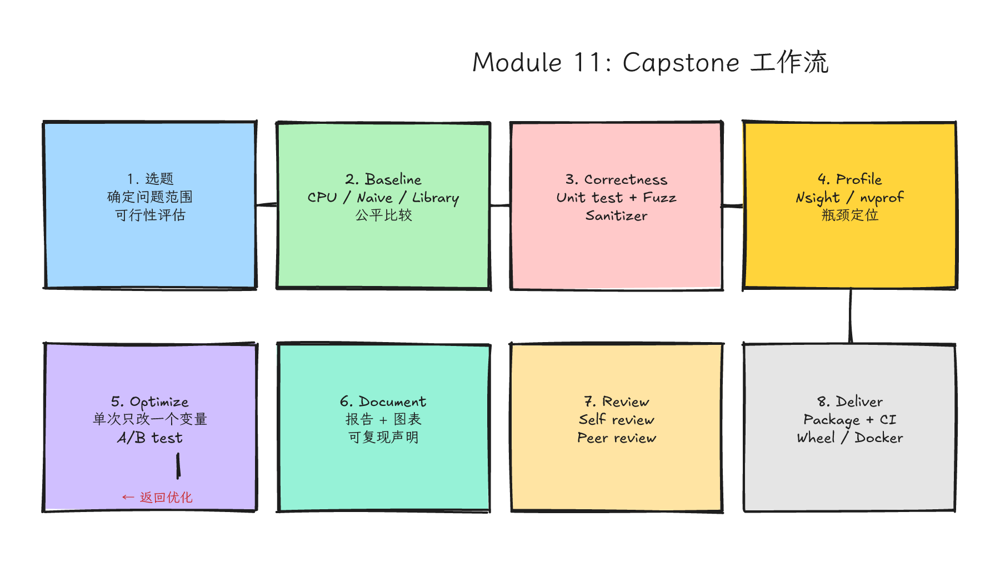
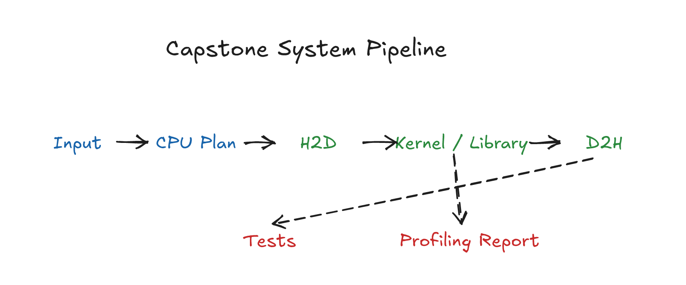
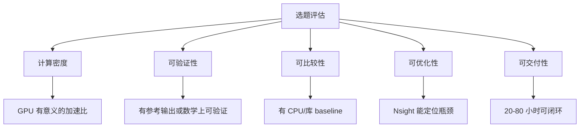
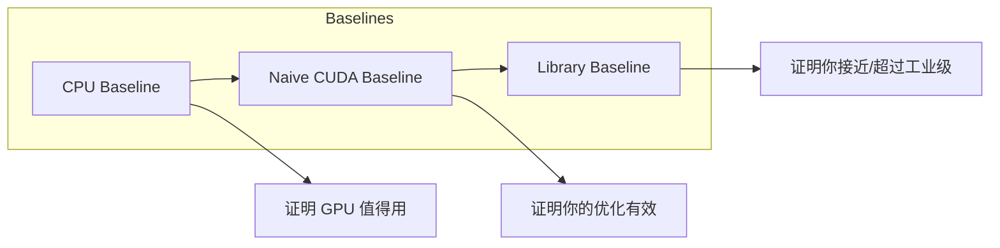
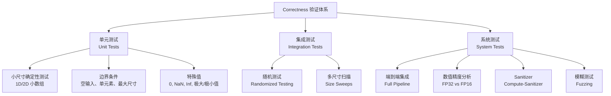
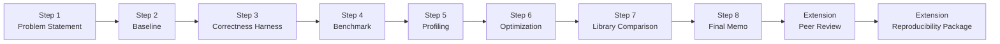
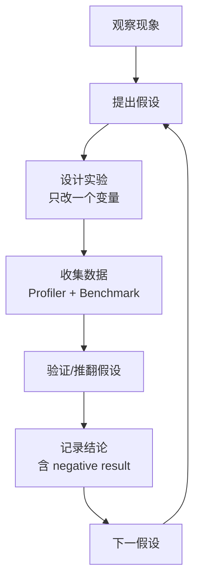
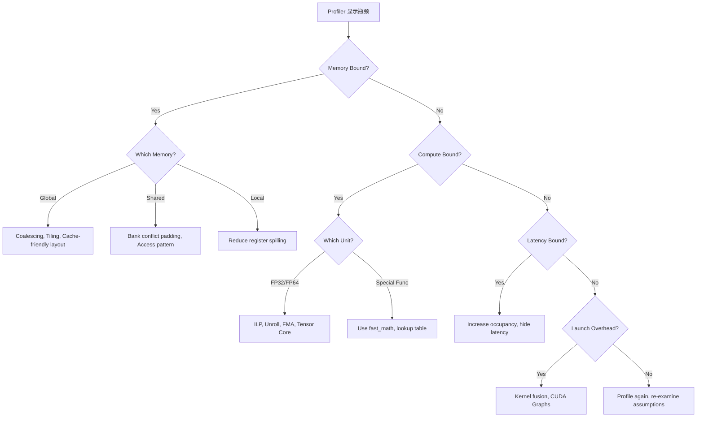

# Module 11: Expert Capstone Studio



*图 11-1：专家级 capstone 从问题定义、实现、profiling 到报告交付的工作流。可编辑源图：[`module-11-capstone-workflow.excalidraw`](../diagrams/module-11-capstone-workflow.excalidraw)。*

Level: Expert  
Estimated time: 20–40 小时（基础闭环）/ 40–80 小时（精品交付）  
Prerequisites: Modules 00–10  
Sources: 按项目主题选择 CUDA、Nsight、CCCL、cuBLAS、CUTLASS、DeepGEMM、FlashAttention 或其他官方资料

---

## 学习目标

完成本模块后，你将能够：

1. **系统评估**一个 CUDA 选题的可行性，控制 scope 在可闭环范围内。
2. **建立多维度 baseline**（CPU / naive CUDA / 工业库），并确保公平比较。
3. **构建 correctness 验证体系**，从单元测试到模糊测试，覆盖数值精度和 sanitizer。
4. **执行 profiling 证据链**，从假设到数据到结论，形成可审计的 bottleneck 报告。
5. **遵循 A/B testing 原则**进行单次变量优化，使用 decision tree 判断优化方向。
6. **撰写符合学术/工业标准**的技术报告，包含可复现性声明和性能图表规范。
7. **完成自我评审和同行评审**，使用结构化 rubric 检查 CUDA 特有风险。
8. **将 capstone 成果转化为**可维护的开源项目或论文级实验。

---

## 这一课的故事线



*图 11-2：从输入数据、CPU orchestration、H2D、custom kernels/library calls、D2H 到测试、benchmark、profiling report 的 capstone 系统数据流。可编辑源图：[`capstone-system-pipeline.excalidraw`](../diagrams/capstone-system-pipeline.excalidraw)。*

你已经走过了 CUDA 学习的主线：环境可信、kernel 正确、内存清楚、协作安全、profiling 有证据、库会选择、streams 会验证、架构优化有 caveat、工程能维护。最后一课不是再学一个技巧，而是把这些能力**组织成一次完整交付**。

Capstone 的目标不是"写一个看起来很厉害的 kernel"，而是证明你能像 CUDA 工程师一样工作：定义问题，建立 baseline，写正确实现，测量瓶颈，做有限优化，比较库，写 caveat，让别人复现。

---

## 类比：毕业不是做一道菜，而是开一次完整服务

前面的课像练刀工、火候、摆盘、采购。Capstone 像真正接待一桌客人：

- **菜单是什么**：problem statement（你要解决什么问题）。
- 食材限制是什么：constraints（GPU 型号、内存上限、时间预算、精度要求）。
- 原始做法是什么：baseline（没有对比就没有优化）。
- 为什么慢：profiling evidence（不是猜测，是测量）。
- 改了什么：optimization attempts（包括失败的尝试）。
- 客人能否吃到同样味道：reproducibility（别人能复现）。
- 下次如何改进：retrospective（negative result 也是结果）。


### 从"做菜"到"餐厅运营"

| 做菜阶段 | 餐厅运营对应 | CUDA Capstone 对应 |
|---------|-----------|------------------|
| 买菜 | 供应链评估 | 选题可行性分析 |
| 备菜 | 食材预处理 | Baseline 建立 |
| 试吃 | 内部品鉴 | Correctness 验证 |
| 烹饪计时 | 厨房动线分析 | Profiling 瓶颈定位 |
| 调整火候 | 标准作业程序 | A/B 优化迭代 |
| 成本核算 | 财务报表 | Benchmark 报告 |
| 顾客反馈 | 满意度调查 | 同行评审 |
| 菜单存档 | 知识库沉淀 | 开源/论文转化 |

---

## 五层认知结构

本模块所有内容按以下五层递进组织：

```
Layer 1: 问题背景（Why）—— 为什么这个问题值得用 GPU？
Layer 2: 直觉类比（What）—— 用日常经验建立 mental model
Layer 3: 硬件机制（How-GPU）—— GPU 的物理限制和机会
Layer 4: 代码路径（How-Code）—— 具体实现、工具和脚本
Layer 5: 真实系统落点（Where）—— 工业界和学术界的实际案例
```

---

## Capstone 选题的完整指南

### 问题背景：为什么选题决定成败？


Capstone 常见失败：
- **Scope 过大**：想写完整 FlashAttention，但 40 小时只够写完 naive attention
- **没有 baseline**：选一个 GPU 不比 CPU 快的问题，优化后发现自己只是在追赶 CPU
- **无法验证正确性**：选一个随机性输出或没有 reference 的问题，永远不知道对不对
- **无法测量**：选一个受系统噪音完全支配的问题（如 tiny kernel 的 launch overhead），profiler 无法给出稳定结论

### 选题评估的 5 维度模型

每个选题应满足以下 5 个维度，否则需要缩小 scope 或更换题目：



### 推荐 10 个具体选题

| # | 选题 | 难度 | 硬件要求 | 预期产出 | 核心硬件概念 |
|---|------|------|---------|---------|-------------|
| 1 | **Fused Elementwise + Reduction** | ★★☆ | 任意 GTX/RTX | 减少 2-4x global memory traffic | memory bandwidth, fusion |
| 2 | **Tiled GEMM 渐进优化** | ★★★ | 任意 RTX | 理解从 naive → tiled → cuBLAS 的 gap | shared memory, arithmetic intensity |
| 3 | **Multi-stream Pipeline (Copy-Compute Overlap)** | ★★☆ | 需要 pinned memory 支持 | 隐藏 H2D/D2H 延迟 | copy engine, async |
| 4 | **Histogram / Sparse-like Workload** | ★★★ | 需要 atomics | 处理 irregular workload | atomics, divergence |
| 5 | **RMSNorm + Quantize Fused Op** | ★★★ | Tensor Core 推荐 | 推理前处理 fused kernel | fp16/bf16, vectorized load |
| 6 | **FlashAttention 简化版 (Tiled Softmax)** | ★★★★ | 8GB+ VRAM | 理解 online softmax + tiling | SRAM/HBM 层级, online algorithm |
| 7 | **DeepGEMM-style FP8 GEMM 研究** | ★★★★★ | Hopper (H100/H800) | 理解 FP8 精度、JIT、grouped GEMM | Tensor Core, TMA, fine-grained scaling |
| 8 | **Paged KV Cache 模拟** | ★★★ | 6GB+ VRAM | 理解 memory budget 和调度 | virtual memory, fragmentation |
| 9 | **MoE Token Routing + Grouped GEMM** | ★★★★ | 多 GPU 推荐 | 理解 dispatch/combine 和通信 | NVLink, all-to-all, load balancing |
| 10 | **CUDA/Triton/TileLang 同一算子对照** | ★★★ | 任意 | 比较 DSL 和手写 CUDA 的 trade-off | abstraction cost, compiler codegen |

### 选题自我评估表（Checklist）

在开始前，用以下 checklist 自我评估。任何一项回答"否"，都需要调整选题：

| 检查项 | 是 | 否 | 备注 |
|--------|----|----|------|
| 我能用一句话说清楚这个 kernel 的输入和输出吗？ | ☐ | ☐ | |
| 我能在 CPU 上写出（或找到）一个正确的 reference 实现吗？ | ☐ | ☐ | |
| 这个 workload 在目标输入规模下，GPU 理论加速比 > 5x 吗？ | ☐ | ☐ | 计算密集型或内存密集型 |
| 我能列出至少 3 个可能的优化方向吗？ | ☐ | ☐ | |
| 我能在 8 小时内完成 naive CUDA 实现 + correctness 验证吗？ | ☐ | ☐ | 控制 scope |
| 我能在 40 小时内完成 profiling + 至少两轮优化 + 报告吗？ | ☐ | ☐ | |
| 我有足够的硬件资源（VRAM、带宽）跑目标输入规模吗？ | ☐ | ☐ | |
| 这个项目不需要我同时学习 3 个以上的新领域知识吧？ | ☐ | ☐ | 避免并行学习 |
| 我的结果可以用 Nsight Compute/Systems 解释清楚吗？ | ☐ | ☐ | |
| 我能向一个不懂 CUDA 的人解释清楚为什么这个优化有效吗？ | ☐ | ☐ | 沟通测试 |

### 如何控制 Scope："皮匠法则"


Scope 控制方法：

1. **单一变量法则**：一次只优化一个 bottleneck。不要同时改 memory pattern、thread layout、数据类型。
2. **固定输入规模**：先选一个代表性规模（如 4096×4096），把它做透，再扩展。
3. **功能子集**：先做 forward pass，backward pass 是 extension。
4. **精度降级**：先做 FP32，FP16/BF16/FP8 是 extension。
5. **单 GPU**：multi-GPU 是 extension，单 GPU 先闭环。
6. **单算子**：不要把整个模型搬进来，一个 kernel 就是一个 capstone。

---

## Baseline 建立方法论

### 问题背景：为什么 baseline 是评估的坐标系


Baseline 不是"故意写慢"，而是**真实反映问题的起点**。专家级项目的 baseline 应经得起审计：如果有人质疑你的 speedup，你能指着 baseline 说"这是当时用 -O3 编译的标准算法，耗时 X，我的版本耗时 Y"。

### 为什么需要多个 baseline



| Baseline 类型 | 目的 | 常见陷阱 |
|-------------|------|---------|
| **CPU Baseline** | 证明 GPU 对这个问题是值得的 | 用单线程 CPU 而不是多线程 OpenMP/AVX2 |
| **Naive CUDA Baseline** | 提供优化起点，验证基本并行化 | 忘记检查内存是否 coalesced，导致 baseline 异常慢 |
| **Library Baseline** | 证明工业级库在这个问题上的表现 | 用不同精度、不同布局、不同输入规模比较 |

### Baseline 的质量标准

一个合格的 baseline 应满足：

1. **使用编译器优化**：CPU 代码用 `-O3 -march=native`，CUDA 代码用 `-O3`。
2. **使用标准算法**：不要用 bubble sort 当 baseline 来衬托你的 quick sort。
3. **数据布局一致**：如果 CUDA 用 SoA（Structure of Arrays），CPU 也用 SoA，否则比较的是数据转换时间。
4. **相同输入、相同数据类型、相同精度**：
   - 不要拿 FP32 CUDA 和 FP16 library 比速度。
   - 不要拿 warmup 后的 CUDA 和冷启动 CPU 比。
5. **记录完整环境**：CPU 型号、GPU 型号、CUDA Toolkit 版本、驱动版本、编译器版本。

### 如何公平比较

公平比较的原则：**除了被测变量，其他全部固定**。

| 维度 | 必须固定的条件 |
|------|------------|
| 输入 | 相同的随机种子、相同的数据分布、相同的规模 |
| 数据类型 | FP32 vs FP32，FP16 vs FP16 |
| 精度 | 相同的数学等价性（如允许 fused multiply-add 的精度差异） |
| 计时范围 | 统一只计 kernel 时间，或统一计端到端时间（H2D + kernel + D2H） |
| Warmup | 都 warmup 3-5 次，避免 cold cache |
| 重复次数 | 至少 10 次，取中位数或 trimmed mean |
| 环境锁定 | GPU 独占模式，关闭 GPU 显示输出，禁用动态频率调整 |

---

## Correctness 验证体系

### 直觉类比：质检不是看一眼，而是体系化检测

工厂质检不是"老板拿一个样品看看"，而是：来料检验 → 过程巡检 → 成品抽检 → 出货全检。CUDA 的 correctness 验证也一样：

### 测试金字塔



### 单元测试（Unit Tests）

每个 kernel 应有至少 3 个单元测试：

1. **Small deterministic test**：人工构造的 4×4、8×8 小矩阵，手算 reference。
2. **Edge case test**：N=0, N=1, N=1023（非 2 的幂次）, N=1024（2 的幂次，warp boundary）。
3. **Special value test**：全 0、全 1、含 NaN、含 Inf（如果业务允许）。

### 数值精度分析

```cpp
// 相对误差 vs 绝对误差的选择
#include <cmath>  // fabsf

float rel_error = fabsf(cpu_ref - gpu_out) / (fabsf(cpu_ref) + 1e-7f);
float abs_error = fabsf(cpu_ref - gpu_out);

// 规则：
// 1. 当参考值接近 0 时，用绝对误差（避免除以接近 0 的数）
// 2. 当参考值很大时，用相对误差（允许与数值量级匹配的误差）
// 3. 混合使用：err = max(abs_error, rel_error * scale)
```

| 数据类型 | 典型误差阈值 | 来源 |
|---------|------------|------|
| FP32 | 1e-4 ~ 1e-5 | 单精度累积误差 |
| FP16/BF16 | 1e-2 ~ 1e-3 | 低精度舍入，尤其在大 reduction 后 |
| FP8 | 1e-1 ~ 5e-2 | 仅用于特定场景，需要 per-tensor/per-block scaling |
| INT8/INT4 | 量化误差，需看 SNR/PSNR | 深度学习推理 |

注意：FP32 CUDA 和 FP32 CPU 也可能有差异，因为：
- FMA (fused multiply-add) 在 CPU 和 GPU 的指令序列可能不同
- Reduction 顺序不同导致浮点舍入差异
- 编译器优化改变运算顺序

### 随机测试和模糊测试（Fuzzing）

随机测试不是"随便生成数据"，而是**系统性地探索输入空间**：

```cpp
// 伪代码：随机测试生成器
void randomized_test(int num_trials) {
    for (int t = 0; t < num_trials; ++t) {
        int N = random_int(1, 1 << 20);     // 1 到 1M
        int seed = random_int(0, INT_MAX);
        float* input = random_uniform(N, seed, -1.0f, 1.0f);
        // 也测试：normal distribution, 稀疏分布, 集群分布
        float* gpu_out = your_kernel(input, N);
        float* cpu_ref = cpu_reference(input, N);
        assert_max_rel_error(cpu_ref, gpu_out, N, 1e-4f);
    }
}
```

模糊测试（Fuzzing）更进一步：使用 libFuzzer 或类似工具，让程序自动生成和变异输入，寻找崩溃或数值异常。

### Sanitizer 的系统性使用

```bash
# 1. 内存越界检查
compute-sanitizer --tool memcheck ./your_program

# 2. 数据竞争检测
compute-sanitizer --tool racecheck ./your_program

# 3. 未初始化内存读取
compute-sanitizer --tool initcheck ./your_program

# 4. 同步错误检测
compute-sanitizer --tool synccheck ./your_program

# 完整运行（CI 环境）：--tool 一次只接受一个工具名
for tool in memcheck racecheck initcheck synccheck; do
  compute-sanitizer --tool "$tool" ./your_program
done
```

> 纪律：每次提交前都跑一遍 sanitizer。不要等"出问题了再跑"，那时候你已经不知道是哪次改动引入的。注意 `racecheck` 主要覆盖 shared memory access hazard，不应把"不报 race"当成所有 global memory 数据竞争都不存在的证明。

---

## Capstone 工作流：8 步交付

保留并深化原有的 8 步工作流，每一步加入更具体的操作指南和检查点。



### Step 1: Problem Statement（问题定义）

写清以下字段，不清晰的字段说明 scope 需要调整：

```markdown
Input:
Output:
Correctness definition:
Target input sizes:
Hardware:
Non-goals:
Time budget:
Success criteria:
```

**Non-goals 示例**：
- "本次不做 backward pass"
- "本次不做 multi-GPU"
- "本次不追求超过 cuBLAS 的峰值性能，只验证 tiled 优化的有效性"
- "本次不处理非 2 的幂次尺寸"

### Step 2: Baseline（建立坐标系）

至少一个 baseline，推荐三个都有：

- **CPU reference**：用 `-O3 -march=native` + OpenMP（如果适用），记录线程数。
- **CUDA naive baseline**：最直接的 CUDA 实现，不做优化，验证基本并行化是否正确。
- **Library baseline**：cuBLAS / CUB / Thrust / CUTLASS，用官方 example 改。

Baseline 不是低级版本，而是**评估坐标系**。没有 baseline，就没有优化。

### Step 3: Correctness Harness（正确性验证）

包括：

- small deterministic tests（手算验证）
- random tests（随机输入覆盖）
- edge sizes（边界尺寸）
- numerical tolerance（相对/绝对误差阈值）
- sanitizer run（memcheck + racecheck）

如果 correctness 不稳，停止优化。不要在沙地上盖楼。

### Step 4: Benchmark（测量框架）

记录：

- warmup（至少 3-5 次）
- repeat（至少 10 次，推荐 30-100 次）
- input sizes（小、中、大至少三个点）
- H2D/kernel/D2H 是否分开计时
- total wall time 是否另记
- build flags（-O3, -arch, -use_fast_math 等）
- GPU 是否独占，是否关闭 ECC（如果适用）

### Step 5: Profiling（瓶颈定位）

先用 **Nsight Systems** 看系统时间线（H2D、kernel、D2H 的 overlap 情况），再用 **Nsight Compute** 深挖关键 kernel。写出一个**瓶颈假设**，避免列一堆指标却没有结论。

### Step 6: Optimization Attempts（优化尝试）

每次只改一个主要因素。记录失败尝试。失败尝试有价值，因为它说明你不是事后编故事。

### Step 7: Library or Reference Comparison（库对比）

如果有相关库，需要比较。即使最终 custom 更适合，也要解释为什么：

- library 解决的是更通用问题？
- custom 做了 fusion？
- 数据布局特殊？
- 输入规模太小或太特殊？

### Step 8: Final Memo（最终报告）

最终报告使用结构化模板，见下方"文档和报告写作"章节。

---

## Profiling 证据链

### 问题背景：从猜测到证据

新手 profiling 的常见错误：
- 打开 Nsight Compute，看到一堆指标，把最红的那个当成瓶颈
- 改了代码，发现快了，但不知道哪个改动生效
- 没有记录 profiler 截图或数字，一个月后无法复现分析

专家 profiling 是**假设驱动的科学实验**：



### 如何形成完整的 Profiling 报告

一份完整的 profiling 报告至少包含：

| 章节 | 内容 | 工具 |
|------|------|------|
| 假设 | "我认为当前瓶颈是 global memory bandwidth" | 你的推理 |
| 证据 | memory throughput 仅占 peak `<百分比>` | Nsight Compute → Memory Workload Analysis |
| 对比 | 理论带宽 = `<peak>`，实测 = `<measured>` | 计算 |
| 实验 | 将 access pattern 改为 coalesced，重新测量 | 代码改动 |
| 结果 | bandwidth 从 `<before>` 提升到 `<after>`，kernel 时间从 `<before>` 降到 `<after>` | Benchmark |
| 结论 | 瓶颈确实是 memory access pattern，已验证 | 记录 |

### 常见瓶颈模式识别清单

| 现象 | 可能瓶颈 | Nsight Compute 指标 | 验证方法 |
|------|---------|-------------------|---------|
| Kernel 时间很长，但 occupancy 低 | 寄存器/共享内存限制 | Achieved Occupancy, Registers Per Thread | 减少寄存器使用或 block size |
| Memory throughput 低，但 utilization 高 | 非合并访问、bank conflict | Memory Throughput, L2 Cache Hit Rate | 检查 coalescing、SMEM padding |
| Compute throughput 低 | 指令序列依赖、低 ILP | Instruction Per Clock, SOL | 检查指令依赖链、展开循环 |
| Launch overhead 占主导 | Kernel 太小、grid 太小 | API Trace Timeline | Nsight Systems 看 host API 时间 |
| D2H 时间很长 | PCIe 带宽瓶颈 | CUDA API Timeline | 使用 pinned memory、异步传输 |
| 小输入性能波动大 | 计时精度不足、系统噪音 | 多次运行 stddev | 增加重复次数、锁定 GPU 频率 |

### 记录失败实验（Negative Result）的价值

```markdown
## Negative Result Log

### 尝试 1: 增加 shared memory tile size
- 假设：更大的 tile 能减少 global memory 访问次数
- 实验：将 tile 从 32×32 改为 64×64
- 结果：性能下降 20%，Nsight 显示 occupancy 从 75% 降到 25%
- 结论：共享内存限制导致 block 数减少，掩盖了 memory traffic 的收益
- 后续：尝试 32×64 的矩形 tile 平衡两者
```

> 注意：Negative result 不是"失败"，而是**排除了一个错误方向**。它让你的最终结论更有说服力。读者知道你不是"恰好试对了"。

---

## Optimization 方法论

### 单次只改一个变量的原则（A/B Testing 思想）

这是性能工程中最容易被违反的规则。同时改 tile size 和 use_fast_math，快了。哪个生效？不知道。慢了。哪个有害？也不知道。

A/B Testing 在 CUDA 中的实践：

1. 建立基线版本 A（编译为 `kernel_v1.cu`）
2. 只改一个变量得到版本 B（编译为 `kernel_v2.cu`）
3. 用相同的 benchmark harness 跑 A 和 B
4. 如果 B 更快，B 成为新的 A；否则记录 negative result，回退到 A
5. 重复

```bash
# 版本管理脚本示例
versions/
├── v1_naive.cu
├── v2_coalesced.cu
├── v3_shared_memory.cu
├── v4_loop_unroll.cu
├── v5_tensor_core.cu
```

每个版本都有独立的编译目标，可以直接 `make v3` 然后跑 benchmark。

### Optimization Decision Tree



### 何时停止优化（Diminishing Returns）

```cpp
// 性能收益递减的判断标准
// 如果你连续 3 个优化迭代，每个投入 4 小时，收益都 < 5%：停止。
// 如果你的 kernel 已经达到理论峰值的 70% 以上：停止（除非你是库作者）。
// 如果你的项目总时间预算只剩 20%：停止写新优化，转向文档和报告。
// 如果优化引入的代码复杂度使 correctness 验证成本翻倍：停止并评估。
```

**停止优化的具体信号**：

1. **收益递减曲线变平**：最近三次优化的 speedup 分别为 2.0x、1.3x、1.05x。
2. **接近理论上限**：如果 Roofline 显示你的 kernel 已经贴近 memory roof 或 compute roof，继续优化的空间有限。
3. **瓶颈转移**：上次优化解决了 memory bound，现在变成了 compute bound，需要完全不同的技术栈。
4. **时间成本超过收益**：如果优化这个 kernel 节省的时间 < 你投入的时间 × 你的时薪，停止。
5. **库已经更好**：如果 cuBLAS/CUTLASS 在这个尺寸上明显更快，考虑是否值得继续。

---

## 文档和报告写作

### 技术报告的标准结构

一份合格的 capstone 技术报告应包含以下结构：

```markdown
# [Project Name] Capstone Report

## Abstract（摘要，200字以内）
- 问题是什么
- 方法是什么（naive → optimized）
- 结果（speedup、效率百分比）
- 主要结论

## 1. Background & Motivation（背景）
- 为什么这个问题重要
- 为什么 GPU 适合
- 相关工作（FlashAttention、DeepGEMM 等）

## 2. Problem Statement（问题定义）
- Input/Output
- Constraints
- Non-goals

## 3. Methodology（方法）
### 3.1 Baseline Implementations
### 3.2 Correctness Verification
### 3.3 Optimization Strategy
### 3.4 Benchmarking Setup

## 4. Results（结果）
### 4.1 Performance Overview
### 4.2 Profiling Analysis
### 4.3 Comparison with Libraries
### 4.4 Ablation Study（如适用）

## 5. Discussion（讨论）
- 哪些结果稳定，哪些依赖特定硬件
- 失败尝试和学到的教训
- 与预期不符的现象

## 6. Conclusion（结论）
- 贡献
- 局限性
- 未来工作

## 7. Reproducibility Statement（可复现性声明）

## References
## Appendix（代码、配置文件、完整 benchmark 数据）
```

### 性能图表的绘制规范

| 图表类型 | 用途 | 最佳实践 |
|---------|------|---------|
| **Speedup Plot** | 展示优化效果 | 横轴：输入规模；纵轴：speedup vs baseline；多线：不同优化版本 |
| **Roofline Model** | 判断瓶颈类型 | 横轴：arithmetic intensity (FLOP/Byte)；纵轴：GFLOP/s；画 memory roof 和 compute roof |
| **Timeline Plot** | 展示系统级行为 | Nsight Systems 导出；标注 H2D、kernel、D2H、stream overlap |
| **Bar Chart** | 对比多个实现 | 用标准化误差条（stddev 或置信区间）；按输入规模分组 |
| **Heatmap** | 展示参数搜索空间 | 横轴：tile size M；纵轴：tile size N；颜色：performance |

**性能图表黄金法则**：
1. 每个图必须有标题和坐标轴标签（含单位）。
2. 错误条不是可选的，是需要的。
3. 不要截断 y 轴来夸大效果。
4. 在图注中说明硬件、软件版本、数据类型。

### 可复现性声明（Reproducibility Statement）

```markdown
## Reproducibility Statement

- **Hardware**: NVIDIA RTX 4090 (24GB VRAM), Driver 535.104.05
- **Software**: CUDA Toolkit 12.2, GCC 11.4, CMake 3.27
- **Build**: `cmake -B build -DCMAKE_BUILD_TYPE=Release && cmake --build build -j`
- **Run**: `cd build && ./benchmark_all > results.json`
- **Random Seed**: 42 (for all stochastic inputs)
- **GPU Lock**: `sudo nvidia-smi -pm 1` (persistence mode), `nvidia-smi -lgc 2505` (lock GPU clock)
- **Raw Data**: 见 `data/benchmark_2024_01_15.json`
- **Code Version**: Git commit `a1b2c3d`
```

---

## 评审和反馈

### 自我评审 Checklist

提交 capstone 前，用以下 checklist 自我审查：

| # | 检查项 | 通过 |
|---|--------|------|
| 1 | 代码能在干净的机器上（clone → build → run）跑通吗？ | ☐ |
| 2 | 是否所有测试都通过（包括 sanitizer）？ | ☐ |
| 3 | Benchmark 是否记录了 warmup、重复次数、误差范围？ | ☐ |
| 4 | 是否有至少一个 negative result 被记录？ | ☐ |
| 5 | 报告中是否明确区分了 kernel 时间和端到端时间？ | ☐ |
| 6 | 是否比较了至少一个 library baseline？ | ☐ |
| 7 | 是否说明了哪些结论不能泛化到其他 GPU？ | ☐ |
| 8 | 图表是否有错误条和完整标注？ | ☐ |
| 9 | 是否包含可复现性声明？ | ☐ |
| 10 | 是否能在 10 分钟内口头讲清楚 8 个 checkpoint 问题？ | ☐ |

### 同行评审指南（Peer Review Rubric）

互相评审 capstone 时，使用以下 rubric：

| 维度 | 权重 | 优秀 (4) | 合格 (3) | 待改进 (2) | 缺失 (1) |
|------|------|---------|---------|-----------|---------|
| **Problem Clarity** | 15% | 输入输出、约束、非目标清晰 | 基本清晰 | 有模糊地带 | 说不清楚 |
| **Baseline Quality** | 15% | 多 baseline，公平比较，环境记录完整 | 至少两个 baseline | 只有一个 baseline 或对比不公平 | 没有 baseline |
| **Correctness** | 20% | 测试金字塔完整，sanitizer 通过，精度分析到位 | 有单元测试和基本验证 | 测试薄弱 | 没有 correctness 验证 |
| **Profiling Evidence** | 20% | 假设-证据-结论链条完整，negative results 记录 | 有 profiler 数据但链条不完整 | 只有指标堆砌 | 没有 profiling |
| **Optimization Logic** | 15% | A/B 原则，decision tree 合理，停止时机恰当 | 基本遵循单次变量原则 | 多变量同时改 | 没有优化逻辑 |
| **Report Quality** | 15% | 结构规范，图表标准，可复现声明完整 | 基本完整 | 缺少关键部分 | 没有报告 |

### 代码评审 Checklist（CUDA 特有风险）

| 风险类别 | 检查项 | 工具/方法 |
|---------|--------|----------|
| **内存安全** | 所有 `cudaMalloc` 都有对应的 `cudaFree` | 代码审查 + memcheck |
| **内存安全** | 没有越界访问（尤其 threadIdx > N 时） | 边界条件测试 + memcheck |
| **同步** | `__syncthreads()` 不在 divergent path 中 | 静态分析 + synccheck |
| **同步** | 共享内存写后读前有 sync | 代码审查 |
| **数值** | 原子操作不会导致溢出（尤其 `atomicAdd` 到 int） | 边界测试 |
| **数值** | 浮点精度变化在预期范围内 | 精度分析测试 |
| **性能** | 没有隐式 D2H/H2D 同步（如 `cudaMemcpy` 后立刻用数据） | Nsight Systems |
| **性能** | Grid size 是 warp size 的倍数（32 的倍数） | 代码审查 |
| **可移植** | 没有 hardcode 特定 GPU 的 block size | 在至少两种尺寸上测试 |
| **可维护** | 复杂 kernel 有 inline 注释说明 tile 映射关系 | 代码审查 |

---

## 真实系统落点

### 知名 CUDA 项目的 Capstone 案例研究

#### 案例 1：FlashAttention 的演进（2022–2026）

FlashAttention 是理解 capstone 如何从"课程项目"进化为"工业标准"的最佳案例：

| 版本 | 年份 | 核心突破 | 硬件对应 | 启示 |
|------|------|---------|---------|------|
| FA1 | 2022 | IO-aware tiling + online softmax | A100/V100 | 从算法层面重新思考 memory traffic |
| FA2 | 2023 | 更好的 work partitioning，并行度提升 | A100 | 优化不仅是 kernel，还有 thread block 调度 |
| FA3 | 2024 | Hopper async（WGMMA + TMA），FP8 | H100 | 硬件代际变化需要重新设计算法 |
| FA4 | 2026 | Blackwell 不对称计算优化，pipeline co-design | B200 | 算法和硬件需要 co-design |
| VFA | 2026 | 向量单元瓶颈优化 | 多种架构 | 永远有新的瓶颈等待发现 |

FlashAttention 的 Capstone 启示：
1. 每个版本都解决了上一代创造的瓶颈（FA1 解决 HBM，FA2 解决 occupancy，FA3 解决 async）。
2. 每篇论文都包含完整的 Roofline 分析和理论带宽计算。
3. 每个版本都向后兼容，不破坏 API，展示工程纪律。

来源：[FlashAttention Paper](https://arxiv.org/abs/2205.14135), [FlashAttention-2](https://arxiv.org/abs/2307.08691), [FlashAttention-4](https://arxiv.org/abs/2603.05451)

#### 案例 2：DeepGEMM 的工程哲学（DeepSeek, 2025）

DeepGEMM 是 DeepSeek 开源的现代 LLM Tensor Core kernel 库，当前公开版本覆盖 FP8/FP4/BF16 GEMM、Mega MoE、MQA 等路径。它的 capstone 级价值在于展示了**如何把一组专用 kernel 做成工业级产品**：

1. **运行时 JIT 编译**：不用预编译所有 kernel，根据 shape 和架构动态生成。这解决了 capstone 中"如何支持多种尺寸"的问题。
2. 极简核心代码：kernel 仅约 300 行，但性能匹配或超过专家调优库。说明**代码质量 > 代码数量**。
3. 处理硬件差异：SM90 和 SM100 的 scaling factor 格式不同，直接在接口层暴露差异，而不是假装它们一样。
4. **Mega MoE**：把通信和计算融合到同一个视角，展示系统级思维。

来源：[DeepGEMM GitHub](https://github.com/deepseek-ai/DeepGEMM)

### 如何将自己的 Capstone 转化为开源项目

1. **提取通用接口**：从特定问题中抽象出通用 API（如 `my_gemm(M, N, K, A, B, C)`）。
2. **添加测试矩阵**：在 CI 中测试多种 GPU 架构（GitHub Actions + self-hosted runner）。
3. **文档驱动**：README 先写，说明这是什么、不是什么、如何 build、如何 benchmark。
4. **版本和发布**：用 Git tag 标记可复现版本，提供 benchmark 结果作为 release asset。
5. **社区反馈**：发布到 Hacker News / Reddit / CUDA 社区，接受 peer review。

### 学术论文中 GPU 性能实验的写作规范

| 要素 | 要求 | 示例 |
|------|------|------|
| **硬件披露** | 精确到 GPU 型号、数量、互联 | "NVIDIA A100-SXM4-40GB × 8, NVLink 3.0" |
| **软件环境** | CUDA 版本、驱动、编译器、库版本 | "CUDA 12.2, Driver 535.104, GCC 11.4, cuBLAS 12.2.5" |
| **计时方法** | CUDA Events 还是 wall clock？是否包含 H2D？ | "Device-only time measured via CUDA events, excluding H2D/D2H" |
| **重复次数** | 多少次运行？如何汇总？ | "Median of 100 runs after 10 warmups" |
| **数据类型** | 不要只说"float"，要说 FP32/FP16/BF16 | "FP16 with loss scaling" |
| **统计指标** | 报告标准差或置信区间 | "1.23 ± 0.05 ms" |
| **对比对象** | 至少一个 strong baseline | "cuBLAS 12.2 baseline, same data layout" |
| **可复现性** | 代码是否开源？配置是否提供？ | "Code available at [anonymous URL]" |

---

## 精品代码讲解

### 代码 1：完整的 Benchmark 报告生成器（Markdown 表格输出）

```cpp
// benchmark_reporter.hpp
// 用途：统一、可审计的 benchmark 结果记录和 Markdown 输出
// 设计原则：强制记录所有必要字段，防止"漏记"导致结果不可比

#pragma once
#include <vector>
#include <string>
#include <cstdio>
#include <numeric>
#include <algorithm>
#include <cmath>

struct BenchmarkEntry {
    std::string name;           // 测试名称，如 "v2_tiled_smem"
    int n;                      // 问题规模
    float kernel_ms;            // 纯 kernel 时间（ms）
    float h2d_ms;               // Host to Device 传输时间
    float d2h_ms;               // Device to Host 传输时间
    float e2e_ms;               // 端到端时间（可选）
    float max_abs_error;        // 最大绝对误差（vs CPU ref）
    float max_rel_error;        // 最大相对误差
    float gflops;               // 计算吞吐量（如果适用）
    float gbytes;               // 内存带宽（如果适用）
    std::string build_flags;    // 编译标志
    std::string gpu_name;       // GPU 型号
    std::string notes;          // 额外备注，如 "warmup=5, repeat=30"
};

class BenchmarkReporter {
    std::vector<BenchmarkEntry> entries_;

public:
    void add(const BenchmarkEntry& e) { entries_.push_back(e); }

    // 输出 Markdown 表格，可直接贴进报告
    void printMarkdownTable() const {
        std::printf("\n### Benchmark Results\n\n");
        std::printf("| Kernel | N | Kernel(ms) | H2D(ms) | D2H(ms) | ");
        std::printf("Max Abs Err | Max Rel Err | GFLOP/s | GB/s | Notes |\n");
        std::printf("|--------|---:|-----------:|--------:|--------:|");
        std::printf("------------:|------------:|--------:|-----:|-------|\n");

        for (const auto& e : entries_) {
            std::printf("| %s | %d | %.4f | %.4f | %.4f | "
                        "%.6g | %.6g | %.2f | %.2f | %s |\n",
                        e.name.c_str(), e.n, e.kernel_ms, e.h2d_ms, e.d2h_ms,
                        e.max_abs_error, e.max_rel_error,
                        e.gflops, e.gbytes, e.notes.c_str());
        }
    }

    // 生成 Speedup 对比表（每个版本 vs 第一个 baseline）
    void printSpeedupTable() const {
        if (entries_.empty()) return;
        const auto& baseline = entries_[0];
        std::printf("\n### Speedup Comparison (vs %s)\n\n", baseline.name.c_str());
        std::printf("| Kernel | Kernel Speedup | E2E Speedup | Accuracy Loss |\n");
        std::printf("|--------|---------------:|------------:|--------------:|\n");

        for (const auto& e : entries_) {
            float kernel_speedup = baseline.kernel_ms / e.kernel_ms;
            float e2e_speedup = (baseline.h2d_ms + baseline.kernel_ms + baseline.d2h_ms) /
                                (e.h2d_ms + e.kernel_ms + e.d2h_ms);
            std::printf("| %s | %.2fx | %.2fx | %.6g |\n",
                        e.name.c_str(), kernel_speedup, e2e_speedup, e.max_rel_error);
        }
    }

    // 保存为 CSV，便于后续用 Python pandas 分析
    void saveCSV(const char* filename) const {
        FILE* fp = std::fopen(filename, "w");
        if (!fp) return;
        std::fprintf(fp, "name,n,kernel_ms,h2d_ms,d2h_ms,"
                        "max_abs_error,max_rel_error,gflops,gbytes,notes\n");
        for (const auto& e : entries_) {
            std::fprintf(fp, "%s,%d,%.6f,%.6f,%.6f,%.10g,%.10g,%.4f,%.4f,%s\n",
                        e.name.c_str(), e.n, e.kernel_ms, e.h2d_ms, e.d2h_ms,
                        e.max_abs_error, e.max_rel_error, e.gflops, e.gbytes,
                        e.notes.c_str());
        }
        std::fclose(fp);
    }
};

// 使用示例：
// BenchmarkReporter reporter;
// reporter.add({"cpu_ref", 4096, 120.0f, 0.0f, 0.0f, 0.0f, 0.0f, 0.0f, 0.0f, 0.0f, "-O3", "RTX4090", "OpenMP 8 threads"});
// reporter.add({"cuda_naive", 4096, 15.0f, 2.0f, 1.0f, 0.0f, 1e-6f, 1e-5f, 150.0f, 450.0f, "-O3 -arch=sm_89", "RTX4090", "warmup=5, repeat=30"});
// reporter.printMarkdownTable();
// reporter.printSpeedupTable();
// reporter.saveCSV("results.csv");
```

这个代码展示工程纪律：
- 强制字段：如果不填 `max_rel_error`，编译器会报错（struct 初始化）。
- 自动计算：speedup 不是手动算，而是由代码根据同一组 raw data 自动生成。
- 多格式输出：Markdown 给人看，CSV 给工具分析，消除重复劳动。

---

### 代码 2：性能回归检测脚本（比较前后版本结果）

```python
#!/usr/bin/env python3
"""
regression_detector.py
用途：自动比较两个 benchmark 结果文件，检测性能回归或精度退化
来源：受 Facebook AI Performance Evaluation Platform (FAI-PEP) 的 A/B testing 方法论启发
https://github.com/sjoerdapp/FAI-PEP

使用：
    python3 regression_detector.py --baseline results_v1.csv --current results_v2.csv
"""

import argparse
import csv
import sys
from dataclasses import dataclass
from typing import List, Dict

@dataclass
class PerfResult:
    name: str
    n: int
    kernel_ms: float
    max_rel_error: float

THRESHOLD_REGRESSION = 0.05      # 性能下降 > 5% 视为回归
THRESHOLD_IMPROVEMENT = 0.05     # 性能提升 > 5% 视为显著改进
THRESHOLD_PRECISION_LOSS = 1e-4  # 相对误差增加 > 1e-4 视为精度退化

def load_csv(path: str) -> Dict[str, PerfResult]:
    """加载 CSV，返回 name -> PerfResult 的映射"""
    results = {}
    with open(path, newline='') as f:
        reader = csv.DictReader(f)
        for row in reader:
            key = f"{row['name']}_{row['n']}"
            results[key] = PerfResult(
                name=row['name'],
                n=int(row['n']),
                kernel_ms=float(row['kernel_ms']),
                max_rel_error=float(row['max_rel_error'])
            )
    return results

def compare(baseline: Dict[str, PerfResult], current: Dict[str, PerfResult]):
    """对比两个版本，输出回归报告"""
    print("\n# Performance Regression Report\n")
    print("| Test Case | Baseline(ms) | Current(ms) | Change | Verdict |")
    print("|-----------|------------:|------------:|-------:|--------|");

    regressions = 0
    improvements = 0
    precision_issues = 0

    for key in sorted(baseline.keys()):
        if key not in current:
            print(f"| {key} | {baseline[key].kernel_ms:.4f} | MISSING | - | ⚠️ MISSING |")
            regressions += 1
            continue

        b = baseline[key]
        c = current[key]
        ratio = c.kernel_ms / b.kernel_ms  # < 1 means faster, > 1 means slower
        change_pct = (ratio - 1.0) * 100.0

        # 判断 verdict
        if ratio > (1 + THRESHOLD_REGRESSION):
            verdict = "🔴 REGRESSION"
            regressions += 1
        elif ratio < (1 - THRESHOLD_IMPROVEMENT):
            verdict = "🟢 IMPROVEMENT"
            improvements += 1
        else:
            verdict = "🟢 NEUTRAL"

        # 精度检查
        if c.max_rel_error > b.max_rel_error + THRESHOLD_PRECISION_LOSS:
            verdict += " ⚠️ PRECISION LOSS"
            precision_issues += 1

        print(f"| {key} | {b.kernel_ms:.4f} | {c.kernel_ms:.4f} | "
              f"{change_pct:+.1f}% | {verdict} |")

    print(f"\nSummary: {regressions} regressions, {improvements} improvements, "
          f"{precision_issues} precision issues out of {len(baseline)} tests.")

    if regressions > 0 or precision_issues > 0:
        print("\n❌ FAIL: Performance or precision regression detected.")
        sys.exit(1)
    else:
        print("\n✅ PASS: No significant regression detected.")
        sys.exit(0)

def main():
    parser = argparse.ArgumentParser(description="Detect performance regression")
    parser.add_argument("--baseline", required=True, help="Baseline CSV file")
    parser.add_argument("--current", required=True, help="Current version CSV file")
    args = parser.parse_args()

    baseline = load_csv(args.baseline)
    current = load_csv(args.current)
    compare(baseline, current)

if __name__ == "__main__":
    main()
```

回归检测的思想：
- 不是比较"绝对时间"，而是比较**相对变化**（受后台进程影响小）。
- 两个版本在同一台机器上**交替运行**或**同时运行**（A/B testing），消除环境差异。
- 阈值应预先设定，不能事后调整（避免 p-hacking）。

---

### 代码 3：项目脚手架生成脚本（自动生成 CMake、测试、Benchmark 框架）

```python
#!/usr/bin/env python3
"""
scaffold_cuda_project.py
用途：生成一个标准化的 CUDA Capstone 项目结构
包含：CMakeLists.txt、目录结构、示例 kernel、GoogleTest 框架、Benchmark harness

来源：受 CMakeCatchTemplate (https://github.com/MattClarkson/CMakeCatchTemplate) 
和 NVIDIA "Building CUDA Applications with CMake" 启发
https://developer.nvidia.com/blog/building-cuda-applications-cmake/

使用：
    python3 scaffold_cuda_project.py --name MyCapstone --path ./my_capstone
"""

import argparse
import os

CMAKELists_TEMPLATE = """cmake_minimum_required(VERSION 3.20)
project({PROJECT_NAME} LANGUAGES CXX CUDA)

set(CMAKE_CXX_STANDARD 17)
set(CMAKE_CUDA_STANDARD 17)
set(CMAKE_CUDA_ARCHITECTURES 80 89 90)  # Ampere, Ada, Hopper; 按需修改

# 全局编译选项
add_compile_options($<$<COMPILE_LANGUAGE:CUDA>:-O3>)
add_compile_options($<$<COMPILE_LANGUAGE:CUDA>:--use_fast_math>)
add_compile_options($<$<COMPILE_LANGUAGE:CUDA>:-Xcompiler=-Wall,-Wextra>)

# 可选：GoogleTest
include(FetchContent)
FetchContent_Declare(
    googletest
    URL https://github.com/google/googletest/archive/refs/tags/release-1.12.1.zip
)
FetchContent_MakeAvailable(googletest)

# 核心库
add_library({PROJECT_NAME}_lib STATIC
    src/kernel_naive.cu
    src/kernel_optimized.cu
    src/benchmark.cu
    src/correctness.cpp
)
target_include_directories({PROJECT_NAME}_lib PUBLIC include)

# 可执行文件：benchmark
add_executable(benchmark_{PROJECT_NAME} apps/benchmark_main.cpp)
target_link_libraries(benchmark_{PROJECT_NAME} {PROJECT_NAME}_lib)

# 测试
enable_testing()
add_executable(test_{PROJECT_NAME} tests/test_correctness.cpp)
target_link_libraries(test_{PROJECT_NAME} {PROJECT_NAME}_lib gtest_main)
add_test(NAME {PROJECT_NAME}_correctness COMMAND test_{PROJECT_NAME})
"""

KERNEL_NAIVE_TEMPLATE = """#include "kernels.hpp"

// Naive baseline kernel: 直接映射，不做优化
// 目的：验证基本并行化正确，作为后续优化的起点
__global__ void kernel_naive(const float* __restrict__ in, float* __restrict__ out, int N) {{
    int idx = blockIdx.x * blockDim.x + threadIdx.x;
    if (idx < N) {{
        out[idx] = in[idx] * 2.0f;  // 示例：替换为你的实际计算
    }}
}}

void launch_naive(const float* in, float* out, int N, cudaStream_t stream) {{
    int threads = 256;
    int blocks = (N + threads - 1) / threads;
    kernel_naive<<<blocks, threads, 0, stream>>>(in, out, N);
}}
"""

HEADER_TEMPLATE = """#pragma once
#include <cuda_runtime.h>

// 所有 kernel 的统一接口
void launch_naive(const float* in, float* out, int N, cudaStream_t stream = 0);
void launch_optimized(const float* in, float* out, int N, cudaStream_t stream = 0);

// CPU reference
void cpu_reference(const float* in, float* out, int N);

// Correctness check
bool check_correctness(const float* ref, const float* out, int N, float tol = 1e-4f);

// Benchmark harness
struct BenchResult {{
    float kernel_ms = 0;
    float h2d_ms = 0;
    float d2h_ms = 0;
    float max_rel_error = 0;
}};
BenchResult benchmark_naive(int N, int warmup = 5, int repeats = 30);
BenchResult benchmark_optimized(int N, int warmup = 5, int repeats = 30);
"""

TEST_TEMPLATE = """#include <gtest/gtest.h>
#include "kernels.hpp"
#include <vector>
#include <cuda_runtime.h>

TEST(Correctness, SmallDeterministic) {{
    const int N = 1024;
    std::vector<float> h_in(N), h_out(N), h_ref(N);
    for (int i = 0; i < N; ++i) h_in[i] = float(i) * 0.01f;

    float *d_in, *d_out;
    cudaMalloc(&d_in, N * sizeof(float));
    cudaMalloc(&d_out, N * sizeof(float));
    cudaMemcpy(d_in, h_in.data(), N * sizeof(float), cudaMemcpyHostToDevice);

    launch_naive(d_in, d_out, N);
    cudaMemcpy(h_out.data(), d_out, N * sizeof(float), cudaMemcpyDeviceToHost);

    cpu_reference(h_in.data(), h_ref.data(), N);
    EXPECT_TRUE(check_correctness(h_ref.data(), h_out.data(), N));

    cudaFree(d_in); cudaFree(d_out);
}}

TEST(Correctness, EdgeCases) {{
    // N=1
    // N=255 (non-power-of-2)
    // N=1024 (warp boundary)
    // 请在此添加更多边界测试
}}

TEST(Correctness, Randomized) {{
    // 请在此添加随机测试，运行 100 次不同输入
}}
"""

BENCH_MAIN_TEMPLATE = """#include "kernels.hpp"
#include <cstdio>

int main() {{
    std::printf("# Benchmark: {PROJECT_NAME}\\n\\n");
    for (int N : {{1024, 4096, 65536, 1048576}}) {{
        auto r_naive = benchmark_naive(N);
        auto r_opt = benchmark_optimized(N);
        std::printf("| N=%d | naive=%.4f ms | opt=%.4f ms | speedup=%.2fx |\\n",
                    N, r_naive.kernel_ms, r_opt.kernel_ms,
                    r_naive.kernel_ms / r_opt.kernel_ms);
    }}
    return 0;
}}
"""

def scaffold(project_name: str, path: str):
    dirs = ["src", "include", "apps", "tests", "scripts", "data", "docs"]
    for d in dirs:
        os.makedirs(os.path.join(path, d), exist_ok=True)

    # CMakeLists.txt
    with open(os.path.join(path, "CMakeLists.txt"), "w") as f:
        f.write(CMAKELists_TEMPLATE.replace("{PROJECT_NAME}", project_name))

    # Header
    with open(os.path.join(path, "include", "kernels.hpp"), "w") as f:
        f.write(HEADER_TEMPLATE)

    # Source files
    with open(os.path.join(path, "src", "kernel_naive.cu"), "w") as f:
        f.write(KERNEL_NAIVE_TEMPLATE)

    with open(os.path.join(path, "src", "kernel_optimized.cu"), "w") as f:
        f.write("// TODO: 你的优化版本\n#include \"kernels.hpp\"\n")

    with open(os.path.join(path, "src", "benchmark.cu"), "w") as f:
        f.write("// TODO: benchmark 实现\n#include \"kernels.hpp\"\n")

    with open(os.path.join(path, "src", "correctness.cpp"), "w") as f:
        f.write("// TODO: CPU reference 和 correctness check\n#include \"kernels.hpp\"\n")

    # Tests
    with open(os.path.join(path, "tests", "test_correctness.cpp"), "w") as f:
        f.write(TEST_TEMPLATE)

    # Benchmark main
    with open(os.path.join(path, "apps", "benchmark_main.cpp"), "w") as f:
        f.write(BENCH_MAIN_TEMPLATE.replace("{PROJECT_NAME}", project_name))

    # README
    readme = f"""# {project_name}

## Build
~~~bash
cmake -B build -DCMAKE_BUILD_TYPE=Release
cmake --build build -j
~~~

## Test
~~~bash
cd build && ctest --output-on-failure
~~~

## Benchmark
~~~bash
./build/benchmark_{project_name}
~~~

## Profiling
~~~bash
nsys profile -o report ./build/benchmark_{project_name}
ncu -o report.ncu-rep ./build/benchmark_{project_name}
~~~

## Reproducibility
- GPU: [填写]
- CUDA: [填写]
- Driver: [填写]
- Commit: [填写]
"""
    with open(os.path.join(path, "README.md"), "w") as f:
        f.write(readme)

    print(f"Scaffolded project '{project_name}' at {path}")
    print("Next steps:")
    print(f"  1. cd {path}")
    print("  2. Edit include/kernels.hpp 定义你的接口")
    print("  3. Edit src/kernel_naive.cu 写 baseline")
    print("  4. Edit src/kernel_optimized.cu 写优化版本")
    print("  5. Edit src/correctness.cpp 写 CPU reference")
    print("  6. Edit tests/test_correctness.cpp 添加边界测试和随机测试")

def main():
    parser = argparse.ArgumentParser()
    parser.add_argument("--name", required=True, help="Project name")
    parser.add_argument("--path", default=".", help="Target directory")
    args = parser.parse_args()
    scaffold(args.name, args.path)

if __name__ == "__main__":
    main()
```

---

### 代码 4：Capstone 评审检查清单（自动化检查脚本）

```python
#!/usr/bin/env python3
"""
capstone_review_checklist.py
用途：自动化检查一个 CUDA Capstone 项目是否符合工程标准
运行后会输出评分和改进建议

使用：
    python3 capstone_review_checklist.py --project-dir ./my_capstone
"""

import argparse
import os
import re
import subprocess
from dataclasses import dataclass, field
from typing import List

@dataclass
class ReviewResult:
    category: str
    score: int           # 0-100
    max_score: int
    passed: bool
    details: List[str] = field(default_factory=list)

def check_file_exists(path: str, desc: str) -> (bool, str):
    if os.path.exists(path):
        return True, f"✅ {desc} found"
    return False, f"❌ {desc} missing: {path}"

def check_cmakeLists(project_dir: str) -> ReviewResult:
    """检查 CMakeLists.txt 的完整性"""
    path = os.path.join(project_dir, "CMakeLists.txt")
    score, details = 0, []
    exists, msg = check_file_exists(path, "CMakeLists.txt")
    details.append(msg)
    if not exists:
        return ReviewResult("Build System", 0, 20, False, details)

    with open(path) as f:
        content = f.read()

    checks = [
        ("cmake_minimum_required", "CMake minimum version"),
        ("project(", "Project declaration"),
        ("CUDA", "CUDA language support"),
        ("CMAKE_CUDA_ARCHITECTURES", "CUDA architecture specification"),
    ]
    for pattern, desc in checks:
        if pattern in content:
            score += 5
            details.append(f"✅ {desc}")
        else:
            details.append(f"⚠️ {desc} not found")

    return ReviewResult("Build System", score, 20, score >= 15, details)

def check_tests(project_dir: str) -> ReviewResult:
    """检查测试体系"""
    score, details = 0, []
    test_dir = os.path.join(project_dir, "tests")
    exists, msg = check_file_exists(test_dir, "tests/ directory")
    details.append(msg)
    if not exists:
        return ReviewResult("Testing", 0, 25, False, details)

    # 检查是否有测试文件
    test_files = [f for f in os.listdir(test_dir) if f.endswith('.cpp') or f.endswith('.cu')]
    if test_files:
        score += 10
        details.append(f"✅ Test files found: {test_files}")
    else:
        details.append("❌ No test files in tests/")

    # 检查是否包含边界测试的关键词
    has_edge = any('Edge' in f or 'edge' in f or 'boundary' in f for f in test_files)
    if has_edge:
        score += 5
        details.append("✅ Edge case tests suggested")
    else:
        details.append("⚠️ No explicit edge case tests found")

    # 检查是否有随机测试
    has_random = any('random' in f.lower() or 'fuzz' in f.lower() for f in test_files)
    if has_random:
        score += 5
        details.append("✅ Random/fuzz tests found")
    else:
        details.append("⚠️ No random tests found")

    # 检查 sanitizer 脚本
    has_sanitizer = os.path.exists(os.path.join(project_dir, "scripts", "run_sanitizer.sh"))
    if has_sanitizer:
        score += 5
        details.append("✅ Sanitizer script found")
    else:
        details.append("⚠️ Consider adding scripts/run_sanitizer.sh")

    return ReviewResult("Testing", score, 25, score >= 20, details)

def check_benchmark(project_dir: str) -> ReviewResult:
    """检查 benchmark 框架"""
    score, details = 0, []
    bench_files = []
    for root, _, files in os.walk(project_dir):
        for f in files:
            if 'benchmark' in f.lower() or 'bench' in f.lower():
                bench_files.append(os.path.join(root, f))

    if bench_files:
        score += 10
        details.append(f"✅ Benchmark files found: {[os.path.basename(f) for f in bench_files]}")
    else:
        details.append("❌ No benchmark files found")

    # 检查是否有 CSV/JSON 输出
    has_structured_output = False
    for f in bench_files:
        if f.endswith('.cpp') or f.endswith('.cu'):
            try:
                with open(f) as file:
                    content = file.read()
                    if '.csv' in content or '.json' in content or 'print_markdown' in content:
                        has_structured_output = True
            except:
                pass
    if has_structured_output:
        score += 10
        details.append("✅ Structured output (CSV/JSON/Markdown) found")
    else:
        details.append("⚠️ Consider outputting structured results for reproducibility")

    # 检查是否有 README 中的 repro 说明
    readme_path = os.path.join(project_dir, "README.md")
    if os.path.exists(readme_path):
        with open(readme_path) as f:
            readme = f.read().lower()
        if 'repro' in readme or 'benchmark' in readme:
            score += 5
            details.append("✅ README mentions reproducibility/benchmark")
        else:
            details.append("⚠️ README should document how to run benchmark")
    else:
        details.append("❌ No README.md")

    return ReviewResult("Benchmark", score, 25, score >= 20, details)

def check_documentation(project_dir: str) -> ReviewResult:
    """检查文档和报告"""
    score, details = 0, []
    readme_path = os.path.join(project_dir, "README.md")
    exists, msg = check_file_exists(readme_path, "README.md")
    details.append(msg)
    if not exists:
        return ReviewResult("Documentation", 0, 15, False, details)

    with open(readme_path) as f:
        readme = f.read().lower()

    checks = [
        ("build", "Build instructions"),
        ("test", "Test instructions"),
        ("gpu", "Hardware mention"),
        ("cuda", "CUDA version mention"),
    ]
    for pattern, desc in checks:
        if pattern in readme:
            score += 3
            details.append(f"✅ README includes {desc}")
        else:
            details.append(f"⚠️ README missing {desc}")

    # 检查是否有报告文档
    has_report = any(f.endswith('.md') and 'report' in f.lower()
                     for _, _, files in os.walk(project_dir) for f in files)
    if has_report:
        score += 3
        details.append("✅ Report document found")
    else:
        details.append("⚠️ Consider adding a REPORT.md or capstone report")

    return ReviewResult("Documentation", score, 15, score >= 10, details)

def check_code_quality(project_dir: str) -> ReviewResult:
    """检查代码中的 CUDA 特有风险"""
    score, details = 0, []
    cuda_files = []
    for root, _, files in os.walk(project_dir):
        for f in files:
            if f.endswith('.cu') or f.endswith('.cuh'):
                cuda_files.append(os.path.join(root, f))

    if not cuda_files:
        return ReviewResult("CUDA Code", 0, 15, False, ["❌ No .cu files found"])

    details.append(f"✅ CUDA files found: {len(cuda_files)}")
    score += 5

    # 检查是否包含关键风险点
    total_checks = 0
    passed_checks = 0
    for f in cuda_files:
        with open(f) as file:
            content = file.read()
        # 检查 cudaMalloc 是否有 cudaFree
        if 'cudaMalloc' in content:
            total_checks += 1
            if 'cudaFree' in content:
                passed_checks += 1
        # 检查 __syncthreads 是否在 divergent path
        if '__syncthreads' in content:
            total_checks += 1
            # 简化检查：是否有 if 包围 syncthreads（不精确但有效）
            lines = content.split('\n')
            for i, line in enumerate(lines):
                if '__syncthreads' in line:
                    # 检查前面几行是否有未匹配的 if
                    context = ''.join(lines[max(0,i-5):i])
                    if 'if (' in context and '{' in context:
                        details.append(f"⚠️ {f}:{i+1} __syncthreads may be in divergent path")
                    else:
                        passed_checks += 1

    if total_checks > 0:
        ratio = passed_checks / total_checks
        score += int(10 * ratio)
        details.append(f"{'✅' if ratio > 0.8 else '⚠️'} CUDA safety checks: {passed_checks}/{total_checks}")
    else:
        score += 5
        details.append("ℹ️ No obvious CUDA safety patterns to check")

    return ReviewResult("CUDA Code", score, 15, score >= 10, details)

def run_review(project_dir: str):
    print(f"\n{'='*60}")
    print(f"Capstone Review: {project_dir}")
    print(f"{'='*60}\n")

    results = [
        check_cmakeLists(project_dir),
        check_tests(project_dir),
        check_benchmark(project_dir),
        check_documentation(project_dir),
        check_code_quality(project_dir),
    ]

    total_score = 0
    total_max = 0
    for r in results:
        total_score += r.score
        total_max += r.max_score
        status = "PASS" if r.passed else "FAIL"
        print(f"## {r.category} [{r.score}/{r.max_score}] {status}")
        for d in r.details:
            print(f"  {d}")
        print()

    percentage = (total_score / total_max) * 100 if total_max > 0 else 0
    print(f"{'='*60}")
    print(f"Total Score: {total_score}/{total_max} ({percentage:.1f}%)")
    if percentage >= 80:
        print("Grade: 🟢 EXCELLENT - Ready for submission")
    elif percentage >= 60:
        print("Grade: 🟡 ACCEPTABLE - Minor improvements needed")
    else:
        print("Grade: 🔴 NEEDS WORK - Major gaps to address")
    print(f"{'='*60}\n")

def main():
    parser = argparse.ArgumentParser(description="Automated Capstone Review")
    parser.add_argument("--project-dir", required=True, help="Path to capstone project")
    args = parser.parse_args()
    run_review(args.project_dir)

if __name__ == "__main__":
    main()
```

---

## 深入一点：什么叫专家级结论

新手结论：

> 优化后快了 3 倍。

专家结论（格式示例，数字应替换为你自己的实验日志）：

> 在 `<GPU 型号>`、CUDA Toolkit `<版本>`、输入规模 `<shape>`、`<dtype>` 数据、warmup `<次数>`、重复 `<次数>`、GPU 频率/功耗状态 `<锁频或默认>` 的条件下，`<优化版本>` 将 `<关键指标>` 从 `<baseline>` 提升到 `<optimized>`，kernel 时间从 `<baseline ms>` 降至 `<optimized ms>`，speedup `<x>`。Nsight Compute 显示 `<瓶颈指标>` 从 `<before>` 变为 `<after>`，occupancy / bandwidth / Tensor Core utilization 与预期一致。对于较小输入，launch overhead 占主导，收益下降。该结果只对上述硬件、输入和软件栈成立，跨架构需要重测。

专家把结论放回证据边界内。

---

## 本课练习

### 练习阶梯

| # | 类型 | 题目 | 难度 |
|---|------|------|------|
| 1 | Recall | 列出 capstone 必须包含的 5 个 artifact，并说明每个的审计价值 | ★☆☆ |
| 2 | Trace | 选择一个你之前写的 kernel，画出从"假设→实验→证据→结论"的完整证据链 | ★★☆ |
| 3 | Modify | 将 Module 05 或 06 的一个项目升级为 capstone scope：补充 baseline、测试金字塔、benchmark harness | ★★☆ |
| 4 | Implement | 使用上面的 scaffold 脚本创建一个新项目，完成 naive + correctness + benchmark 三步 | ★★☆ |
| 5 | Optimize | 基于 Nsight Systems + Compute 做两轮独立优化，每轮只改一个变量，记录 negative result | ★★★ |
| 6 | Explain | 哪些结果依赖你的 GPU 型号？哪些更可能跨架构稳定？用 Roofline 模型解释 | ★★★ |
| 7 | Report | 撰写一份符合标准结构的技术报告，包含图表和可复现性声明 | ★★★ |
| 8 | Review | 用 peer review rubric 评审另一位同学的 capstone，提出至少 3 条具体改进建议 | ★★☆ |

### Lab 详细选题 Guide

#### Lab A: Fused Elementwise + Reduction（推荐入门）

**目标**：将多个 elementwise kernel 和 reduction 融合，减少 global memory traffic。

**硬件主线**：
- Memory bandwidth bound
- Intermediate write/read 的消除
- Reduction 的 warp shuffle 优化
- CUB 作为 library baseline

**成功标准**：
- 融合版本比分离版本减少至少 2x global memory traffic（Nsight Compute 验证）
- 与 CUB 的 DeviceReduce 对比，差距在 2x 以内

#### Lab B: Tiled GEMM 工程研究（推荐进阶）

**目标**：从 naive GEMM 出发，逐步添加 tiled + shared memory + loop unrolling，与 cuBLAS/CUTLASS 对比。

**硬件主线**：
- Shared memory reuse（tile 能读几次？）
- Arithmetic intensity 计算和 Roofline 定位
- Tensor Core 的 caveat（如果硬件支持）
- Tile size 的系统性搜索

**成功标准**：
-  tiled 版本达到 cuBLAS 的 30-50% 性能（对于学生项目已是优秀）
-  能解释为什么与 cuBLAS 有差距（如 lack of double buffering、lack of register blocking）

#### Lab C: FlashAttention 简化版（推荐挑战）

**目标**：实现一个简化版 FlashAttention forward pass，理解 online softmax + tiling 的内存优化。

**硬件主线**：
- HBM vs SRAM 的层级意识
- Online softmax 的数学推导
- Tiling 策略（Q-tile, KV-tile）
- 与 PyTorch 标准 attention 的内存和速度对比

**成功标准**：
- 在长序列（8K+）时，内存使用为 O(N) 而非 O(N²)
- 速度比标准 attention 快（在 GPU 内存快满时）
- 数值误差在 FP32 下 < 1e-4

**参考来源**：
- Dao et al., "FlashAttention: Fast and Memory-Efficient Exact Attention with IO-Awareness", NeurIPS 2022, https://arxiv.org/abs/2205.14135
- Dao, "FlashAttention-2: Faster Attention with Better Parallelism and Work Partitioning", ICLR 2024, https://arxiv.org/abs/2307.08691

#### Lab D: Multi-stream Pipeline（推荐系统思维）

**目标**：将大数据分块，让 H2D、kernel、D2H 在多个 stream 中 overlap。

**硬件主线**：
- Copy engine 的独立带宽
- Pinned memory 的必要性
- Stream 依赖和 event 同步
- Nsight Systems 的 timeline 解读

**成功标准**：
- Pipeline 版本的端到端时间比顺序版本减少 30%+
- Nsight Systems timeline 清晰显示 overlap

---

## Checkpoint

你完成 capstone 后，应该能在 10 分钟内讲清以下 8 个问题：

1. 这个问题为什么适合 GPU？
2. Baseline 是什么？为什么选它？
3. Correctness 如何证明？误差范围是多少？
4. Profiler 看到什么瓶颈？你的假设是什么？
5. 你改了什么？只改了一个变量吗？
6. 为什么这个改动有效或无效？（用 profiler 数据解释）
7. 和库相比如何？差距的原因是什么？
8. 哪些结论不能泛化？（硬件、规模、数据类型）

**Capstone 评审 Rubric（完整版）**

| 维度 | 权重 | 描述 | 评分标准 |
|------|------|------|---------|
| **问题定义** | 10% | 输入输出、约束、非目标清晰 | 4: 全部清晰；3: 基本清晰；2: 有模糊；1: 缺失 |
| **Baseline 质量** | 15% | 多 baseline、公平比较、环境记录 | 4: 3+ baseline，完整记录；3: 2 baseline；2: 1 baseline；1: 无 |
| **Correctness** | 20% | 测试金字塔、sanitizer、精度分析 | 4: 完整；3: 基本测试+sanitizer；2: 测试薄弱；1: 无 |
| **Profiling** | 20% | 假设-证据-结论链条、negative results | 4: 完整链条；3: 有数据但链条弱；2: 指标堆砌；1: 无 |
| **Optimization** | 15% | A/B 原则、decision tree、停止时机 | 4: 严谨；3: 基本遵循；2: 多变量；1: 无逻辑 |
| **Library 对比** | 10% | 与工业库对比，解释差距 | 4: 深入分析；3: 有对比；2: 表面比较；1: 无 |
| **报告质量** | 10% | 结构、图表、可复现声明 | 4: 专业；3: 完整；2: 有缺；1: 无 |

**总分换算**：
- 28-32: A+ (优秀)
- 24-27: A (优秀)
- 20-23: B (良好)
- 16-19: C (合格)
- < 16: 需要重做

---

## 常见误区

| 误区 | 为什么错 | 正确做法 |
|------|---------|---------|
| 没有 baseline | 无法证明"优化"真的优化了 | 至少 CPU + naive CUDA |
| 没有 correctness 就报 speedup | 可能算的是错误结果 | 先 correctness，再 benchmark |
| Profiler 指标堆很多，但没有瓶颈假设 | 数据不是信息，信息不是洞察 | 先假设，再测，再结论 |
| 只展示成功优化，隐藏失败实验 | 读者会怀疑你是"事后诸葛亮" | 明确记录 negative results |
| 把 single-GPU 结论说成普适真理 | A100 和 RTX 4090 的瓶颈不同 | 明确标注硬件和环境 |
| 项目范围太大，无法闭环 | 80% 的 capstone 失败因为 scope | 用"皮匠法则"控制 |
| 同时改多个变量 | 不知道哪个有效 | 严格的 A/B testing |
| 忽略编译器优化 flag | `-O0` 的 baseline 不公平 | 都用 `-O3` |
| 只测一个输入规模 | 小输入和大输入的瓶颈不同 | 小、中、大至少三个点 |
| 没有记录 GPU 频率 | 动态频率使结果不可复现 | 锁定频率或报告频率范围 |
| 忽略 memory layout | AoS vs SoA 可能差 10x | 明确说明并保持一致 |
| 精度类型混用 | FP16 和 FP32 的速度不可比 | 分开展示，或统一类型 |

---

## Extension

1. **Multi-GPU 扩展**：在单 GPU 闭环后，尝试 NCCL 或 peer-to-peer 通信。
2. **CUDA Graphs**：如果 launch overhead 是瓶颈，用 CUDA Graphs 消除 CPU 开销。
3. **Triton / TileLang 对比**：用 DSL 写同一算子，比较开发效率和性能天花板。
4. **论文发表**：将 capstone 整理成 workshop 论文或技术博客。
5. **开源发布**：清理代码、添加 CI、写 README，发布到 GitHub 接受社区 review。
6. **Backward Pass**：如果 forward 已经闭环，尝试推导和实现 backward。
7. **精度降级**：从 FP32 → BF16 → FP8，研究每一级的速度和精度 trade-off。
8. **Auto-tuning**：用简单的 grid search 或 Bayesian Optimization 自动搜索 tile size。

---

## 本课要记住的一句话

**CUDA 专家不是写出一个神秘的快 kernel，而是交付一条别人能复现、能质疑、能维护的性能证据链。**

---

## 本课资料来源

### 官方文档
- NVIDIA CUDA C++ Best Practices Guide: https://docs.nvidia.com/cuda/cuda-c-best-practices-guide/index.html
- NVIDIA Nsight Systems: https://docs.nvidia.com/nsight-systems/
- NVIDIA Nsight Compute: https://docs.nvidia.com/nsight-compute/
- CCCL/CUB and cuBLAS official docs: https://github.com/NVIDIA/cccl and https://docs.nvidia.com/cuda/cublas/
- PyTorch custom operator tutorial: https://docs.pytorch.org/tutorials/advanced/cpp_custom_ops.html

### 项目案例与开源参考
- FlashAttention Paper (NeurIPS 2022): https://arxiv.org/abs/2205.14135
- FlashAttention-2 (ICLR 2024): https://arxiv.org/abs/2307.08691
- FlashAttention-4 (Blackwell 优化): https://arxiv.org/abs/2603.05451
- DeepGEMM GitHub (DeepSeek FP8 GEMM): https://github.com/deepseek-ai/DeepGEMM
- FAI-PEP (Facebook AI Performance Evaluation Platform): https://github.com/sjoerdapp/FAI-PEP
- CUDA Matrix Operations 教学项目: https://github.com/Kamlesh364/CUDA_MatOps
- CMake CUDA Template: https://github.com/Ahdhn/CUDATemplate
- CMakeCatchTemplate (PMC 论文): https://github.com/MattClarkson/CMakeCatchTemplate
- Building CUDA Applications with CMake (NVIDIA Blog): https://developer.nvidia.com/blog/building-cuda-applications-cmake/

### 学术参考
- PyTorch `torch.compile` and compiler stack: https://docs.pytorch.org/docs/stable/torch.compiler.html
- "Improving CUDA Optimization via Contrastive Reinforcement Learning" (arXiv 2025): https://arxiv.org/abs/2507.14111
- "FlashAttention and the Co-Evolution of Algorithms and Hardware" (IJAIBDCMS 2026): https://ijaibdcms.org/index.php/ijaibdcms/article/view/598
- "TritonForge: Profiling-Guided Framework for Automated Triton Kernel Optimization" (arXiv 2025): https://arxiv.org/abs/2512.09196

Capstone 的资料源应覆盖方法论和 baseline。Best Practices Guide 给优化和测量原则，Nsight 给证据，CUB/cuBLAS 给库基线，FlashAttention/DeepGEMM 给真实案例，PyTorch custom op 文档帮助你把单独 kernel 推到现实框架接口。
