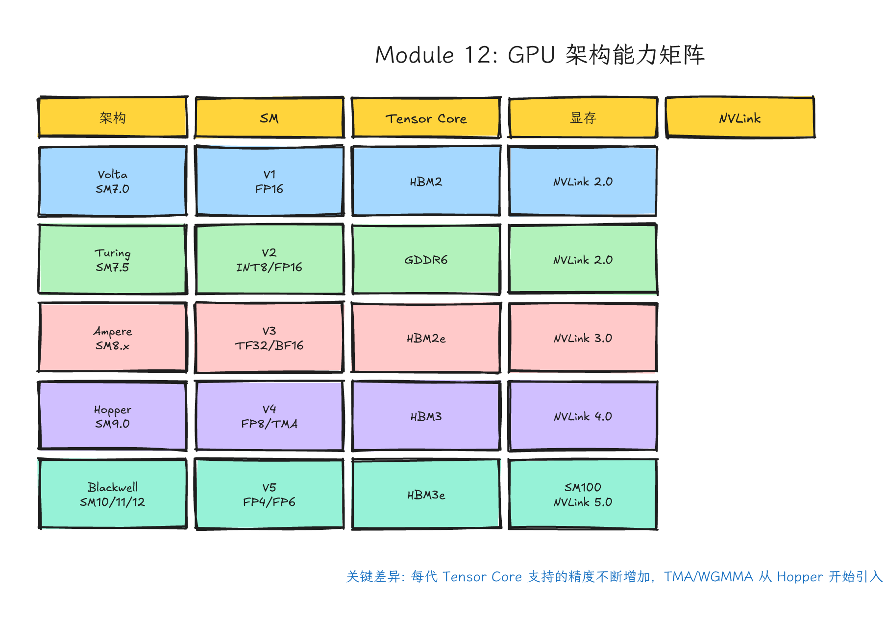
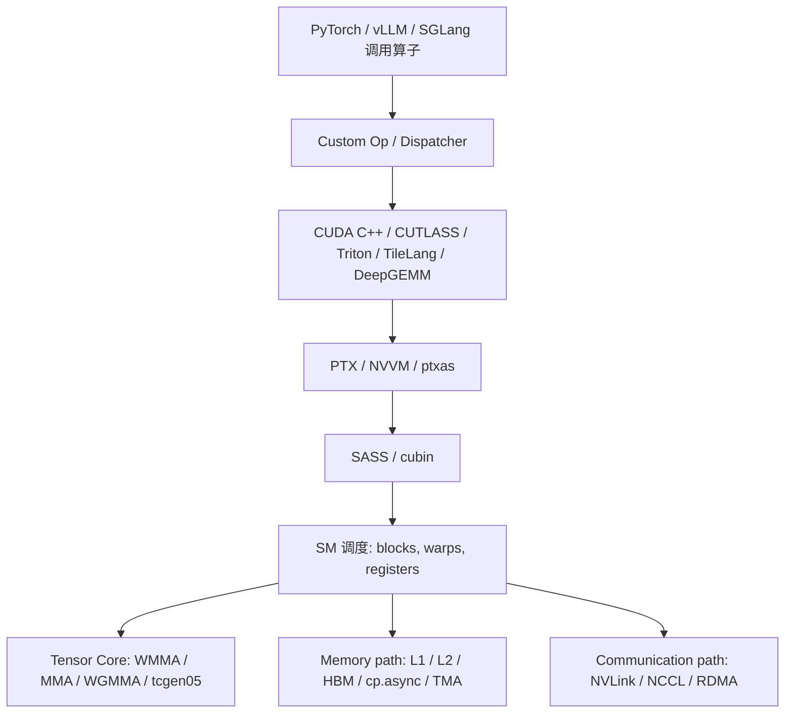
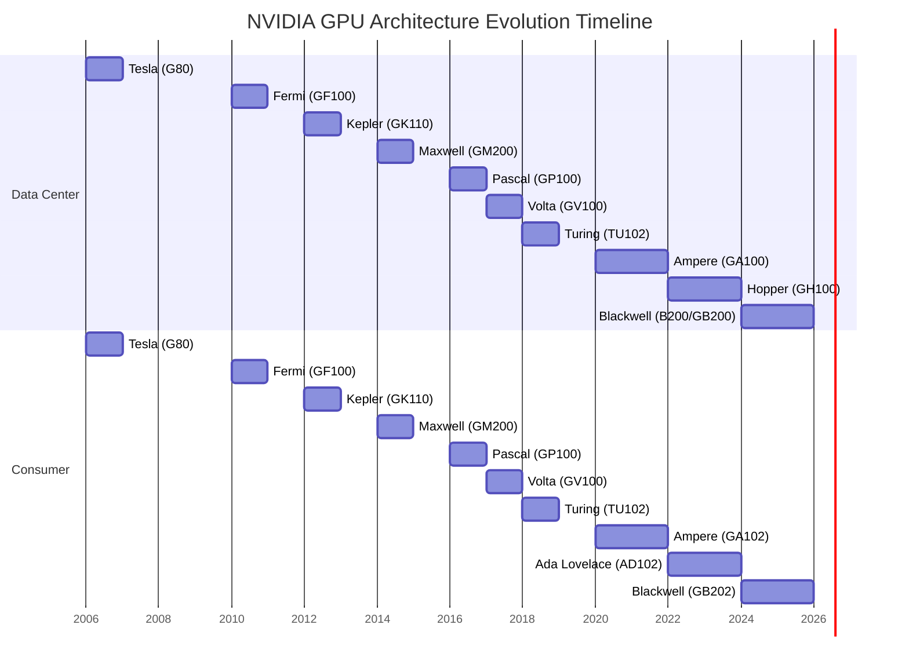
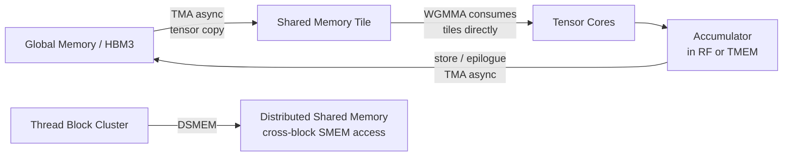

# Module 12: GPU 架构演进：从 Tesla 到 Blackwell



*图 12-1：从 Volta、Turing、Ampere、Hopper 到 Blackwell 的架构演进主线。可编辑源图：[`module-12-gpu-architecture-matrix.excalidraw`](../diagrams/module-12-gpu-architecture-matrix.excalidraw)。*

> **Level**: Advanced
> **Estimated time**: 14–20 小时
> **Prerequisites**: Modules 00–09
> **Sources**: NVIDIA Ampere/Hopper/Blackwell Tuning Guides, CUDA C++ Programming Guide, PTX ISA, Microbenchmarking Literature (Jarmusch et al., 2025), CUTLASS/vLLM/DeepGEMM Source Code

---

## 学习目标（Learning Objectives）

完成本模块后，你应该能够：

1. **说出每一代 NVIDIA GPU 架构的软件能力差异**，而不是只背诵市场名称。
2. **理解 Compute Capability 的精确含义**，能在代码中查询并据此选择编译路径。
3. **解释 Tensor Core 从 WMMA → MMA → WGMMA → UMMA/tcgen05 的演进逻辑**，以及每代支持的精度、tile 形状和吞吐量。
4. **分析 SM 内部资源（warp scheduler、register file、shared memory/L1）的代际变化**，并解释这些变化对 kernel 设计的影响。
5. **理解内存系统（HBM2→HBM3e）和通信系统（NVLink 1→5）的演进**，以及它们对多 GPU 编程模型的约束。
6. **阅读真实框架（vLLM、DeepGEMM、CUTLASS）的架构分发代码**，解释为什么同样的算子在不同 GPU 上有不同实现路径。
7. **设计一个带 fallback 的跨架构 kernel dispatch 系统**，理解 CUDA 向后兼容性的具体机制。

---

## 这一课的故事线

前面的课程一直强调：CUDA 编程模型稳定，但性能路径会随硬件改变。现在我们正式把“GPU 代际”摆到桌面上。你不再只问“这个 kernel 写得对不对”，而要问：这个 kernel 是写给哪代硬件的？它利用了哪代硬件的新能力？如果换一张卡，哪些假设会失效？

这节课不是硬件百科，而是高性能 CUDA 工程师的路线图。你会看到 Volta、Turing、Ampere、Hopper、Blackwell 不是一串市场名词，而是一条软件能力演进线：Tensor Core、异步拷贝、WGMMA、TMA、thread block cluster、distributed shared memory、NVLink、FP8/FP4，一层层改变 kernel 的写法。

核心观点：语法看 CUDA，性能看代际。

---

## 第 1 层：问题背景（Why This Matters）

### 为什么现代 CUDA 工程师必须懂架构代际？

在 2016 年以前，写一个 CUDA kernel 大致是“写一次，到处跑”。Pascal 时代的优化技巧（coalesced memory access、shared memory tiling、occupancy 调优）在 Maxwell 和 Kepler 上基本通用。但从 Volta 引入 Tensor Core 开始，情况发生了根本性变化：

- **Volta (2017)**：Tensor Core 让矩阵乘有了专门硬件路径，但你需要用 WMMA API 或 PTX `mma` 指令来调用。传统 tiled GEMM 在 V100 上被 cuBLAS 甩开一个数量级，因为 cuBLAS 用了 Tensor Core 而你的代码没用。
- **Ampere (2020)**：`cp.async` 和 split barrier 让 global-to-shared 的异步流水线成为可能。不会用 `cp.async` 的 kernel，在 A100 上性能会明显落后。
- **Hopper (2022)**：TMA 和 WGMMA 把数据搬运和矩阵乘的协作粒度从 warp 提升到 warpgroup (128 threads)。thread block cluster 让多个 block 能共享 distributed shared memory。这些不是“编译器自动优化”能解决的，它们改变了你写 kernel 的思维方式。
- **Blackwell (2024–2025)**：FP4/FP6/FP8 的 scaling factor layout 让推理系统的 kernel 和通信路径进一步硬件相关。数据中心 SM100 路径还引入 TMEM (Tensor Memory) 与 `tcgen05`/UMMA；RTX Blackwell（SM120）需要单独的编译目标和框架支持，不能直接复用 SM100 kernel。

### 一个真实案例：同一个 PyTorch 模型，在 A100 vs H100 vs B200 上的性能差异

假设你用 `torch.nn.Linear` 跑一个 4096×4096 的矩阵乘：

- **A100 (Ampere)**：cuBLAS/cuBLASLt 或 PyTorch matmul 通常会在 FP32 输入下使用 TF32 Tensor Core（除非禁用 TF32），在 FP16/BF16 输入下走对应 Tensor Core 路径。禁用 TF32 后常会明显变慢，但具体倍数取决于 shape、库版本和精度设置。
- **H100 (Hopper)**：如果模型、框架和库都提供 FP8 数据路径，H100 可以使用 FP8 Tensor Core/Transformer Engine 相关 kernel；这不是普通 FP16/FP32 输入自动发生的事情，必须有 FP8 数据布局、scaling 和 accumulator 策略配合。
- **B200 (Blackwell)**：如果框架支持，Blackwell 数据中心路径可以启用 FP4/FP6/FP8 与 microscaling/block-scaling 相关 kernel。峰值吞吐必须按产品 SKU、dense/sparse、dtype 和库路径查表，不能把 FP4 相对 FP8 的优势写成固定倍数。

同一个 Python 调用，背后走了三条完全不同的硬件路径。 理解这些路径，是现代 CUDA 工程师和“只会调 API 的开发者”之间的分界点。

---

## 第 2 层：直觉类比（Mental Model）

### 类比：同一座城市的不同年代交通系统

CUDA 编程模型像城市地图：街道、路口、公交站的基本概念多年不变。GPU 架构像交通工具升级。

- **Fermi/Kepler/Maxwell/Pascal**：马车和早期汽车时代。CUDA core 是通用道路，没有专用高速通道。你的代码主要和“如何让更多车同时上路”打交道，即 occupancy、memory coalescing、bank conflict。
- **Volta (SM70)**：城市开始通地铁。Tensor Core 让矩阵乘进入专用高速通道，但你需要把数据切成地铁愿意拉的形状（tile），并且学会坐地铁（WMMA API）。
- **Turing (SM75)**：地铁增加了货运车厢（INT8/INT4 推理优化），同时城市增加了专门的快递分拣中心（RT Core 用于光线追踪，但和 AI 关系不大）。
- **Ampere (SM80/SM86)**：有了自动传送带。`cp.async` 让 global memory 到 shared memory 的搬运可以和计算重叠，不再需要线程把数据“搬到车上再运到仓库”。
- **Hopper (SM90)**：有了货运专线和分区仓库。TMA 是全自动叉车，WGMMA 是 4 节车厢联挂的货运列车，thread block cluster 让多个仓库可以共享临时货架（distributed shared memory）。
- **Blackwell (SM100/SM120)**：城市进一步扩容。更强地铁（第五代 Tensor Core）、更精细的货运单位（FP4/FP6）。SM100 数据中心城市还有新的专用仓储区（TMEM）和更宽的城间高速公路（NVLink 5）；SM120 RTX 城市则更像消费级/工作站分支，资源上限和库路径都要单独看。

### 先看一张软硬件对应图



这张图的意思是：你在 Python 里写的 `torch.ops.my_ext.foo(x)`，最终会落到某个 GPU architecture 的 SM、Tensor Core、内存系统和通信系统上。课程后半段所有高级内容都沿着这张图展开。

---

## 第 3 层：硬件机制（The Hardware Story）

### 3.1 GPU 架构历史完整回顾：从 Tesla 到 Blackwell

NVIDIA 的 GPU 架构命名经历了从科学家/数学家（Tesla、Fermi、Kepler、Maxwell、Pascal、Volta、Turing、Ampere、Hopper、Ada Lovelace、Blackwell）到官方路线图中的后续平台（如 Rubin）的演进。对于 CUDA 开发者，真正重要的不是名字，而是 Compute Capability（CC）和对应的软件能力。



> 注：Mermaid gantt 图对年份标注支持有限，上方时间线主要展示相对顺序。更精确的时间线见下方表格。

| CC       | 架构名          | 代表 GPU            | 年份       | 关键软件能力                                                                                                                                                                     |
| :------- | :-------------- | :------------------ | :--------- | :------------------------------------------------------------------------------------------------------------------------------------------------------------------------------- |
| 1.0–1.3 | Tesla           | G80/G92             | 2006–2008 | CUDA 诞生，基础并行模型                                                                                                                                                          |
| 2.0–2.1 | Fermi           | GTX 480             | 2010       | 可配置 L1/Shared Memory、printf、FMA                                                                                                                                             |
| 3.0–3.7 | Kepler          | K40/K80             | 2012–2014 | Hyper-Q、Dynamic Parallelism、GPUDirect                                                                                                                                          |
| 5.0–5.3 | Maxwell         | GTX 980             | 2014–2015 | 统一内存改进、SASS 可见 atomic                                                                                                                                                   |
| 6.0–6.2 | Pascal          | P100                | 2016       | NVLink 1.0、HBM2、Pascal 指令原子化                                                                                                                                              |
| 7.0      | Volta           | V100                | 2017       | **第一代 Tensor Core**、独立线程调度、HBM2、NVLink 2.0                                                                                                                     |
| 7.2      | Volta (Xavier)  | Jetson AGX          | 2018       | 嵌入式，DLA + Tensor Core                                                                                                                                                        |
| 7.5      | Turing          | T4 / RTX 2080       | 2018       | **RT Core**、**第二代 Tensor Core**、INT8/INT4、GDDR6                                                                                                                |
| 8.0      | Ampere (GA100)  | A100                | 2020       | **第三代 Tensor Core**、TF32/BF16、sparse、**cp.async**、更大 L2/SMEM、MIG                                                                                           |
| 8.6      | Ampere (GA102)  | RTX 3090            | 2020       | 消费级 Ampere，GDDR6X                                                                                                                                                            |
| 8.7      | Ampere (Orin)   | Jetson Orin         | 2022       | 嵌入式 Ampere                                                                                                                                                                    |
| 8.9      | Ada Lovelace    | L40S / RTX 4090     | 2022       | **FP8 Tensor Core**、DLSS 3、光流加速器、GDDR6X                                                                                                                            |
| 9.0      | Hopper          | H100 / H200         | 2022–2023 | **第四代 Tensor Core**、**TMA**、**WGMMA**、**thread block clusters**、**distributed shared memory**、**FP8 Transformer Engine**、NVLink 4.0 |
| 10.0     | Blackwell (DC, 课程主线示例)  | B200 / GB200 | 2024–2025 | **第五代 Tensor Core**、**FP4/FP6/FP8**、**tcgen05**、**TMEM**、更大上下文窗口、NVLink 5.0                                                               |
| 10.3     | Blackwell (DC 后续目标示例) | B300 / GB300 | 2025+ | Blackwell 数据中心后续 compute capability；资源、NVLink 和库路径按官方文档与目标 Toolkit 确认 |
| 11.0     | Blackwell (Jetson 示例) | Jetson T4000/T5000 系列 | 2025+ | 嵌入式 Blackwell 目标；功耗、内存系统和可用库路径不能套用 B200/GB200 |
| 12.0     | Blackwell (RTX, 课程主线示例) | RTX 5090            | 2025       | RTX Blackwell，GDDR7，第五代 Tensor Core；FP4/FP8 可用性取决于产品、驱动和框架路径                                                                                               |
| 12.1     | Blackwell (GB10 示例) | GB10 / DGX Spark 类产品 | 2025+ | GB10 目标；应按 NVIDIA compute capability 表、Toolkit 和框架 wheel 支持确认 |

> 来源：NVIDIA CUDA / nvcc 文档和 GPU 产品资料。注意：这张表只列课程中常用的 Blackwell 示例目标，不是 `nvcc` 支持目标全集；当前 `nvcc --list-gpu-arch` / `--list-gpu-code` 还会列出 `compute_103`、`compute_110`、`compute_121` 及相应 `sm_*`/`sm_*f`/`sm_*a` 目标。写生产编译脚本时必须查本机 Toolkit 输出。

---

### 3.2 Compute Capability 详解：每个 CC 对应的具体能力

Compute Capability（CC）是一个版本号（major.minor），不是简单的“性能指标”。它决定了一个 GPU 能执行哪些指令、支持哪些 PTX 特性、以及 CUDA runtime 暴露哪些功能。

#### CC 的 major 版本：架构家族

- **Major 7**：Volta 家族。引入 Tensor Core（第一代）、独立线程调度（Independent Thread Scheduling）。
- **Major 8**：Ampere 家族。引入第三代 Tensor Core、TF32、BF16、`cp.async`、更大 L2/SMEM。
- **Major 9**：Hopper 家族。引入 TMA、WGMMA、thread block cluster、FP8 Transformer Engine。
- **Major 10/11/12（Blackwell 相关目标）**：当前 `nvcc` 文档已经把多组 `sm_10x`、`sm_11x`、`sm_12x` 目标都列入 Blackwell support。课程重点使用 **SM100**（数据中心 B200/GB200 路径）和 **SM120**（RTX Blackwell 示例路径）讲解，因为现代库中这两类分支最常见；不要把它们当成 Blackwell 的完整目标全集。

#### CC 的 minor 版本：同代内的差异

Minor 版本通常表示同代架构内的不同定位：

- **7.0** (V100)：完整 Volta，HBM2，NVLink 2.0。
- **7.2** (Xavier)：嵌入式 Volta，没有 NVLink，有 DLA。
- **7.5** (T4/RTX 2080)：Turing，GDDR6，RT Core，INT8 Tensor Core。
- **8.0** (A100)：完整 Ampere，HBM2e，MIG，最大 SM/L2/SMEM 配置。
- **8.6** (RTX 3090)：消费级 Ampere，GDDR6X，SM 数量更多但每 SM 资源略少于 GA100。
- **8.7** (Orin)：嵌入式 Ampere。
- **8.9** (L40S/RTX 4090)：Ada Lovelace，FP8 支持，GDDR6X，光流加速器。
- **9.0** (H100/H200)：Hopper，完整 HBM3/TMA/WGMMA/cluster。
- **10.0** (B200/GB200 示例)：Blackwell 数据中心主线，HBM3e，FP4/FP6，第五代 NVLink。
- **10.3** (B300/GB300 示例)：Blackwell 数据中心后续目标；不要默认与 10.0 拥有完全相同的资源限制或库实例。
- **11.0** (Jetson Blackwell 示例)：嵌入式目标，功耗和内存系统与数据中心/RTX 路径不同。
- **12.0** (RTX 5090 示例)：Blackwell RTX 路径，GDDR7，第五代 Tensor Core 消费级实现；与 SM100 是不同编译目标。
- **12.1** (GB10 示例)：GB10/DGX Spark 类目标，软件栈和预编译 wheel 覆盖要单独确认。
- **其他 Blackwell 目标**：当前 `nvcc` 文档和 NVIDIA compute capability 表还会随产品线扩展。除非课程明确给出产品和文档依据，否则不要把 10.0/12.0 当成穷尽列表。

#### 为什么 minor 版本会跳号？

NVIDIA 在 Ampere 之后把不同产品线和功能目标拆得更细。数据中心 Ampere 是 8.0，消费级是 8.6；Hopper 是 9.0；Blackwell 时代 `nvcc` 中同时出现 `sm_100`、`sm_103`、`sm_110`、`sm_120`、`sm_121` 以及带 `f/a` 后缀的目标。这里的关键不是死记某个跳号，而是记住：**编译目标必须和实际库路径、GPU SKU、Toolkit 版本匹配**。例如：

- `sm_100` 的 kernel 不能跑在 `sm_120` 上，反之亦然。
- CUTLASS 需要为 SM100 和 SM120 分别编译不同的 kernel 实例。
- vLLM 的 CMake 中你能看到 `SM100`、`SM120` 被当作独立的编译分支处理。

> 来源：NVIDIA `nvcc` 文档和 NVIDIA/cutlass CMake 配置；https://docs.nvidia.com/cuda/cuda-compiler-driver-nvcc/index.html

---

### 3.3 SM 内部架构对比：资源代际变化

Streaming Multiprocessor（SM）是 GPU 执行的核心单元。理解 SM 内部资源的变化，有助于设计高性能 kernel。

```mermaid
flowchart LR
    subgraph SM_Volta["SM70 (Volta)"]
        V_WS["4 Warp Schedulers"]
        V_FP32["64 FP32 CUDA cores"]
        V_TC["1st Gen Tensor Core<br/>m4n4k4 tile"]
        V_RF["256 KB Register File"]
        V_SM["128 KB L1/SMEM<br/>max 96 KB SMEM"]
    end
    subgraph SM_Ampere["SM80 (Ampere GA100)"]
        A_WS["4 Warp Schedulers"]
        A_FP32["64 FP32 CUDA cores"]
        A_TC["3rd Gen Tensor Core<br/>m8n4k8 tile"]
        A_RF["256 KB Register File"]
        A_SM["192 KB L1/SMEM pool<br/>164 KB SMEM per SM<br/>163 KB per block"]
        A_ASYNC["cp.async"]
    end
    subgraph SM_Hopper["SM90 (Hopper)"]
        H_WS["4 Warp Schedulers"]
        H_FP32["128 FP32 CUDA cores"]
        H_TC["4th Gen Tensor Core<br/>m8n4k16 tile"]
        H_RF["256 KB Register File"]
        H_SM["256 KB L1/SMEM<br/>max 228 KB SMEM"]
        H_TMA["TMA"]
        H_WGMMA["WGMMA"]
    end
    subgraph SM_Blackwell["SM100 (Blackwell DC)"]
        B_WS["4 Warp Schedulers"]
        B_FP32["128 FP32 CUDA cores<br/>Unified INT32/FP32"]
        B_TC["5th Gen Tensor Core<br/>tcgen05 / TMEM path"]
        B_RF["64K 32-bit registers<br/>+ 256 KB TMEM"]
        B_SM["256 KB L1/Texture/SMEM pool<br/>228 KB SMEM per SM<br/>227 KB per block"]
        B_TMA["TMA Enhanced"]
        B_UMMA["UMMA / tcgen05"]
    end

    SM_Volta -->|"代际演进"| SM_Ampere
    SM_Ampere -->|"代际演进"| SM_Hopper
    SM_Hopper -->|"代际演进"| SM_Blackwell
```



#### SM 资源对比表

| 资源                           | SM70 (Volta)                  | SM75 (Turing)                 | SM80 (Ampere GA100)           | SM86 (Ampere GA102)           | SM89 (Ada)                    | SM90 (Hopper)                 | SM100 (Blackwell DC)               | SM120 (Blackwell RTX)              |
| :----------------------------- | :---------------------------- | :---------------------------- | :---------------------------- | :---------------------------- | :---------------------------- | :---------------------------- | :--------------------------------- | :--------------------------------- |
| **Warp Schedulers**      | 4                             | 4                             | 4                             | 4                             | 4                             | 4                             | 4                                  | 4                                  |
| **FP32 CUDA Cores / SM** | 64                            | 64                            | 64                            | 128                           | 128                           | 128                           | 128                                | 128                                |
| **Tensor Core / SM**     | 8 (Gen1)                      | 8 (Gen2)                      | 4 (Gen3)                      | 4 (Gen3)                      | 4 (Gen4-ish)                  | 4 (Gen4)                      | 4 (Gen5)                           | 4 (Gen5)                           |
| **Register File**        | 64K 32-bit registers (256 KB) | 64K 32-bit registers (256 KB) | 64K 32-bit registers (256 KB) | 64K 32-bit registers (256 KB) | 64K 32-bit registers (256 KB) | 64K 32-bit registers (256 KB) | 64K 32-bit registers + 256 KB TMEM | 64K 32-bit registers；TMEM/TCGen05 路径需按 SM120 文档和库支持确认 |
| **L1/SMEM 总计**         | 128 KB                        | 128 KB                        | 192 KB                        | 128 KB                        | 128 KB                        | 256 KB                        | 256 KB combined L1/Texture/SMEM; 228 KB SMEM carveout | 128 KB SMEM capacity              |
| **Max SMEM / block**     | 96 KB                         | 96 KB                         | 163 KB                        | 99 KB                         | 99 KB                         | 227 KB                        | 227 KB                             | 99 KB                              |
| **INT32/FP32 执行路径**  | 分离                          | 分离                          | 分离                          | 分离                          | 分离                          | 分离                          | **Unified**                  | **Unified**                  |
| **示例 tile / ISA 路径（非穷尽）** | m4n4k4                        | m8n8k4                        | m8n4k8                        | m8n4k8                        | m8n4k8                        | WGMMA `m64n*k*` 系列（shape 取决于 dtype） | SM100: tcgen05/UMMA variants；按 PTX/CUTLASS 查具体 shape | SM120: RTX Blackwell 专用路径；按当前 CUDA/CUTLASS 查具体 shape |

> 来源：NVIDIA CUDA Programming Guide、各代 NVIDIA Tuning Guide / Architecture Whitepaper 与产品资料。社区文章只能作为阅读辅助；SM 资源、shared memory 上限和 compute capability 以 NVIDIA 官方文档为准。

#### 关键变化解读

1. **Volta → Ampere：GA100 可用 SMEM 大增**
   SM80/GA100 的 L1/SMEM 统一池增大到 192 KB；按 CUDA compute capability 表，可编程 shared memory capacity 是 164 KB/SM，单 block 上限约 163 KB。这允许 kernel 使用更大的 tile，也是 `cp.async` 流水线更有价值的条件之一。注意消费级 SM86 的 shared memory 上限较小，不能把 GA100 数字外推到所有 Ampere。
2. **Ampere → Hopper：FP32 CUDA Core 翻倍 + SMEM 再增**
   SM90 每 SM 的 FP32 CUDA core 从 64 增加到 128，同时 SMEM 上限达到 228 KB。这使得 Hopper 在非 Tensor Core 工作负载（如索引计算、attention 的 softmax 逻辑）上也有显著提升。
3. **Hopper → Blackwell：必须按具体 CC/SKU 查资源**
   NVIDIA Blackwell Tuning Guide 对不同 Blackwell CC 分别给出限制。例如 CC 10.0（如 B200）combined L1/Texture/SMEM 容量仍为 256 KB，SMEM carveout 可到 228 KB per SM，单 block 可用 227 KB；CC 12.0 的 shared memory capacity per SM 是 128 KB，单 block 可用 99 KB。当前 `nvcc` 还列出更多 Blackwell 目标，因此不要把“数据中心 Blackwell”和“RTX Blackwell”混成两行固定规格，更不能把 SM100 的 tile/SMEM 假设直接套到其他 Blackwell 目标。
4. **Blackwell：Unified INT32/FP32 执行单元**
   Blackwell 将原本分离的 INT32 和 FP32 流水线合并为 unified execution unit。每个周期，一个单元可以做 INT32 或 FP32，但不能同时做。这对混合工作负载（如推理中的量化反量化 + 矩阵乘）的调度有微妙影响。
5. **Blackwell DC：TMEM (Tensor Memory)**
   SM100 数据中心 Blackwell 引入了独立于 register file 和 shared memory 的 Tensor Memory (TMEM)。这是为 `tcgen05`（UMMA）服务的专用存储区，让 Tensor Core 的累加器可以脱离寄存器文件，进一步解耦计算和存储。SM120/RTX Blackwell 不应默认按 SM100 TMEM 设计。

---

### 3.4 Tensor Core 演进史：精度、Tile 形状与吞吐量

Tensor Core 是 NVIDIA GPU 架构演进中关键的硬件执行单元，由 CUDA/PTX、WMMA/MMA/WGMMA、CUTLASS/cuBLAS 等软件接口暴露出来。从 Volta 到 Blackwell，它经历了五代演进：

| 代际            | 架构                    | 核心指令                         | 支持精度                                            | 原生 Tile                                         | 吞吐量特征                          |
| :-------------- | :---------------------- | :------------------------------- | :-------------------------------------------------- | :------------------------------------------------ | :---------------------------------- |
| **Gen 1** | Volta (SM70)            | `mma.sync` (HMMA)              | FP16→FP32                                          | m4n4k4                                            | 512 FMA ops/cycle/SM                |
| **Gen 2** | Turing (SM75)           | `mma.sync` (HMMA/IMMA)         | FP16, INT8, INT4, Binary                            | m8n8k4 (FP16), m8n8k16 (INT8)                     | INT8 2× FP16 吞吐                  |
| **Gen 3** | Ampere (SM80/SM86/SM87) | `mma.sync` (HMMA/IMMA)         | FP16, BF16, TF32, INT8, 2:4 sparse；FP64 Tensor Core 属于 GA100 等数据中心路径，不能外推到所有 Ampere | m8n4k8 (FP16/BF16), m8n4k16 (TF32)；FP64 shape 按 SM80 文档 | TF32/FP16/BF16/sparse 吞吐按具体 SKU 查询 |
| **Gen 4** | Hopper (SM90)           | `wgmma.mma_async` (HGMMA/GMMA)，并保留架构支持的 `mma.sync` 路径 | FP16, BF16, TF32, FP64, FP8 (E4M3/E5M2), INT8       | WGMMA 常见 `m64n*k*` 系列；具体 M/N/K 由 dtype、layout 与 PTX variant 决定 | FP8 2× FP16 吞吐                   |
| **Gen 5** | Blackwell (SM100/SM120) | SM100: `tcgen05.mma` (UMMA)；SM120: RTX Blackwell 路径需单独查文档 | FP16, BF16, TF32, FP8, FP6, FP4, block-scaled；FP64 Tensor Core 需区分数据中心 SKU | SM100 支持 UMMA、TMEM 与 2-SM 协作；SM120 不应直接套用 SM100 tile/descriptor 假设 | 低精度吞吐按 dtype、稀疏模式和具体 SKU 查询 |

> 来源：NVIDIA PTX ISA、NVIDIA 架构 Tuning Guide、CUTLASS 文档。社区文章适合辅助理解演进脉络，但不要作为精度支持和吞吐量数字的唯一依据。

#### 每代 Tensor Core 的关键变化

**Gen 1 (Volta, SM70)**：

- 仅支持 FP16 输入、FP32 累加。
- tile 形状很小（m4n4k4），意味着软件需要把很多小 tile 组合成更大的计算。
- 使用 `mma.sync` 同步指令，warp 内 32 线程必须全部参与。

**Gen 2 (Turing, SM75)**：

- 增加 INT8 和 INT4 支持，为推理量化优化。
- 引入 `ldmatrix` 指令，优化 shared memory → register file 的加载路径。
- Turing 仍可按每 SM 8 个 Tensor Core 来建立直觉；相对 Volta 的主要变化不是数量简单增加，而是 INT8/INT4/Binary 等推理精度和数据加载路径扩展。

**Gen 3 (Ampere, SM80/SM86/SM87)**：

- 引入 **TF32**（1 位符号 + 8 位指数 + 10 位尾数，FP32 格式但只算 19 位）。无需改代码，通过 `cublasLtMatmul` 或 `torch.backends.cuda.matmul.allow_tf32 = True` 自动加速。
- 引入 **BF16**（1-8-7 格式，与 FP32 相同指数范围）。
- **GA100/A100 数据中心路径**引入 FP64 Tensor Core，解决 HPC 用户的双精度需求；SM86/SM87 等同代产品不应默认具备同样 FP64 Tensor Core 路径。
- 引入 **2:4 结构化稀疏性**：每 4 个元素中允许 2 个为零，理论吞吐翻倍。
- tile 形状增大到 m8n4k8（FP16）和 m8n4k16（TF32）。

**Gen 4 (Hopper, SM90)**：

- 引入 **FP8**（E4M3 和 E5M2 两种格式），配合 Transformer Engine 自动管理 scaling factor。
- 引入 **WGMMA**（WarpGroup MMA）：协作粒度从 1 warp (32 threads) 提升到 4 warps (128 threads)。
- WGMMA 支持直接从 shared memory 取操作数，常见 Hopper GEMM mainloop 会让至少一个操作数从 SMEM descriptor 读取，从而减轻 register file 压力；具体 operand 来源和约束按 PTX 指令 variant / CUTLASS atom 判断。
- 使用 `wgmma.mma_async` 异步指令，warpgroup 发射后可以继续执行其他工作，通过 `mbarrier` 同步。
- 支持极大的 tile 形状，如 `m64n8k16` 到 `m64n256k16`。

**Gen 5 (Blackwell, SM100/SM120)**：

- 引入 **FP4 和 FP6**，以及 **microscaling / block-scaling** 量化格式。
- 在 **SM100 数据中心路径** 引入 **TMEM (Tensor Memory)**：累加器可以放入 TMEM 而不是 register file，解耦 Tensor Core 和寄存器压力。
- 在 **SM100 数据中心路径** 引入 **UMMA / tcgen05**：这是不同于 Hopper WGMMA 的 Blackwell 专用 Tensor Core 指令族，围绕 TMEM descriptor、TMA/CTA 协作和新的等待/提交协议组织。不要把它简化成“普通 warpgroup MMA 的换名版本”，也不要把 SM100 的写法外推到 SM120。
- **SM100** 支持 2-SM 协作：两个相邻 SM 的 Tensor Core 可以协同执行更大矩阵乘。SM120/RTX Blackwell 需要按 CUDA Toolkit、CUTLASS 和目标框架确认可用 kernel。
- 第五代 Tensor Core 的官方峰值通常按 dtype、稀疏模式和 SKU 分开给出。例如 B200 级数据中心产品在低精度 Tensor Core 上可达到 multi-PFLOP/s 级别，FP4/FP8 稀疏峰值高于 dense 峰值；写性能分析时必须标注 dense/sparse、精度、SXM/PCIe/GB200 等产品形态，不能只写一个“Blackwell 峰值”。

> 来源：NVIDIA PTX ISA、NVIDIA Blackwell/Hopper Tuning Guide、NVIDIA 数据中心 GPU 产品资料。第三方文章可以辅助理解趋势，但峰值表述应以 NVIDIA 产品资料为准。

---

### 3.5 每代架构详细分析

#### Volta (SM70, 2017)：Tensor Core 进入主线

Volta 的标志性创新是第一代 Tensor Core 和独立线程调度（Independent Thread Scheduling）。

在 Volta 之前，warp 内 32 线程以 lockstep 执行，遇到分支 divergence 时，不同分支的线程被串行化。Volta 引入独立线程调度后，每个线程有自己的 PC（Program Counter）和调用栈，允许 warp 内的线程以 finer granularity 执行。这改善了 irregular 控制流（如稀疏计算、图遍历）的性能，但也意味着开发者需要更小心地处理 warp 级同步（`__syncwarp` 成为必要）。

从软件角度，Volta 引入：

- **WMMA API**：`nvcuda::wmma` 命名空间下的 warp 级矩阵乘抽象。开发者用 `wmma::load_matrix_sync`、`wmma::mma_sync`、`wmma::store_matrix_sync` 操作固定大小的 fragment（如 16×16×16）。
- **FP16 混合精度**：输入 FP16，累加 FP32。这是深度学习训练的基础。
- **NVLink 2.0**：单链路单向约 25 GB/s，V100 支持 6 条链路，总双向带宽约 300 GB/s。

硬件心智模型：普通 CUDA core 像通用工位，Tensor Core 像专门做矩阵小块乘加的机器。你必须把数据切成它愿意吃的形状。

#### Turing (SM75, 2018)：RT Core 与 INT8 推理优化

Turing 是 Volta 的“消费级扩展”，主要变化：

- **RT Core（光线追踪核心）**：对 AI 计算无直接影响，但代表 NVIDIA 开始为特定任务引入专用硬件单元。
- **第二代 Tensor Core**：支持 INT8 和 INT4 精度。INT8 的 peak throughput 是 FP16 的 2×，INT4 是 4×。这直接催生了 INT8 量化推理在 T4 上的广泛应用。
- **GDDR6**：替代 HBM2，降低成本，适合推理卡（T4）。
- `ldmatrix` 指令：优化 shared memory 到 register file 的矩阵加载。

Turing 的 Tensor Core tile 形状：m8n8k4（FP16）和 m8n8k16（INT8）。比 Volta 更大，但仍需 warp 级同步。

#### Ampere (SM80/SM86, 2020)：异步拷贝与 TF32/BF16

Ampere 是深度学习基础设施的“分界点”架构，几个主题重要影响写法：

1. **`cp.async`**：硬件加速的 global memory → shared memory 异步拷贝。
   传统 tiled kernel 中，thread 把数据从 global memory 读到 register，再写到 shared memory，消耗 register 和指令槽。`cp.async` 让你把“搬货”和“计算”做成更清晰的流水线。

   ```cpp
   // Ampere 之前：同步搬运，消耗寄存器
   float tmp = A[global_idx];   // 从 global 读到 register
   sA[shared_idx] = tmp;      // 从 register 写到 shared

   // Ampere 及以后：异步拷贝，绕过 register
   cp.async.cg.shared.global [sA_ptr], [A_ptr], 16;
   ```
2. **Split arrive/wait barrier (`mbarrier`)**：更细粒度的 producer-consumer 控制。`cp.async` 可以与 `mbarrier` 配合实现多阶段 pipeline。
3. **第三代 Tensor Core**：

- TF32：格式与 FP32 相同，但 Tensor Core 只处理 19 位有效位。对训练来说，TF32 通常不损失收敛性，但速度接近 FP16。
- BF16：与 FP32 相同指数范围（8 位），但尾数只有 7 位。比 FP16 更稳定，是很多大模型训练的默认格式。
- **FP64 Tensor Core（GA100 数据中心路径）**：A100/GA100 面向 HPC 引入 FP64 Tensor Core；消费级 GA10x 和嵌入式 Orin 不能只因为同属 Ampere 就默认具备相同 FP64 Tensor Core 能力。
- 2:4 结构化稀疏：稀疏矩阵乘的硬件加速。

4. **更大的 L2 和 SMEM**：GA100 的 L2 达到 40 MB，shared memory capacity 为 164 KB/SM、单 block 约 163 KB。允许更大的 tile 和更复杂的 fusion；SM86/SM87 的上限不同，做 occupancy 和 tile 设计时要按目标 CC 填表。
5. **MIG (Multi-Instance GPU)**：允许把 A100 物理划分为最多 7 个独立 GPU 实例。对云计算和推理服务很重要，但对 CUDA kernel 编程本身无直接影响。

#### Hopper (SM90, 2022–2023)：TMA、WGMMA、Cluster

Hopper 引入了以下关键能力。

1. **Tensor Memory Accelerator (TMA)**：
   TMA 是一个异步 DMA 引擎，可以按 tensor 描述符（1D 到 5D）在 global memory 和 shared memory 间搬运数据。开发者不需要手动计算地址、stride 和边界，TMA 描述符封装了所有信息。
   关键特性：TMA 是异步的，一个线程配置好描述符后，其他线程可以并行发射多个 TMA 拷贝，同时 warpgroup 继续计算。
2. **WGMMA (WarpGroup MMA)**：
   协作粒度从单 warp（32 threads）扩展到 warpgroup（4 warps = 128 threads）。WGMMA 指令由 warpgroup 内的线程协作发射，典型 GEMM mainloop 可让操作数从 shared memory descriptor 读取。
   这能减轻 register file 压力：传统 MMA 需要把操作数先加载到 register，WGMMA 路径可以把更多数据留在 SMEM/TMA pipeline 中。具体哪些 operand 来自寄存器或 SMEM，要看 PTX variant 与 CUTLASS atom。
3. **Thread Block Clusters**：
   在 CUDA 的 block 和 grid 之间加入 cluster 层级。一个 cluster 包含最多 8 个 thread blocks（在 Hopper 上），这些 blocks 被保证同时调度到一组 SM 上，并且可以通过 distributed shared memory (DSMEM) 访问彼此的 shared memory。
   这改变了 mental model：以前你想的是“一个 block 负责一个 tile，block 内 threads 协作”。Hopper 后，你还要想：多个 blocks 能否组成 cluster，一起服务更大的 tile 或更复杂的数据流？
4. **FP8 Transformer Engine**：
   Hopper 原生支持 FP8（E4M3 和 E5M2 两种格式）。Transformer Engine 在框架层自动管理 per-tensor scaling factor，让 FP8 训练达到接近 FP16 的收敛质量。
5. **NVLink 4.0**：单链路单向约 25 GB/s，但链路数从 12 增加到 18，总双向带宽约 900 GB/s。



#### Ada Lovelace (SM89, 2022)：消费级的推理优化

Ada Lovelace 是 Ampere 消费级的演进，主要面向游戏和本地推理。

- **FP8 Tensor Core**：数据中心 Hopper 的 FP8 能力下放到消费级（L40S、RTX 4090）。
- **DLSS 3**：光流加速器 + AI 帧生成，与 CUDA 编程无直接关系。
- **GDDR6X**：高带宽显存，但容量和带宽仍远低于 HBM3。
- **RT Core 改进**：第二代光线追踪，对 AI 无直接影响。

Ada 对 CUDA 开发者的意义：如果你想在本地 RTX 4090 上跑 FP8 推理，SM89 支持。但 Ada 没有 TMA、WGMMA 或 cluster，这些是 Hopper 独有的。

#### Blackwell (SM100/SM120, 2024–2025)：FP4/FP6、系统级推理，以及 SM100 专属的 TMEM/UMMA 路径

Blackwell 继续保留 CUDA 编程模型，但现代推理框架已经开始暴露它的差异。你在 vLLM 本地源码里能看到 `SM100`、`SM120`、`FP4`、`FP8`、`CUTLASS` kernel 分支。这说明：写高性能推理算子时，架构选择已经不是“编译 flag 细节”，而是代码路径设计的一部分。

Blackwell 的关键创新。

1. **第五代 Tensor Core**：

- 支持 FP4、FP6、FP8、FP16、BF16、TF32；FP64 Tensor Core 需要区分数据中心 SKU，不能默认套到 RTX Blackwell。
- FP4 使用 **microscaling / block-scaling** 格式：每个 block 有一个 scaling factor，比 per-tensor scaling 更精细，精度损失更小。
- 峰值吞吐必须按产品、dense/sparse、dtype 和框架路径查表。B200/GB200 的 FP4/FP8 稀疏峰值可以达到 multi-PFLOP/s 级别，但 RTX Blackwell 不是同一个口径。

2. **TMEM (Tensor Memory)**：
   SM100 数据中心路径有专用 Tensor Memory，用于 Tensor Core 的累加器和操作数缓冲。TMEM 独立于 register file 和 shared memory，让 `tcgen05` 可以减少对 warp 寄存器资源的压力。SM120/RTX Blackwell 不应默认按 SM100 TMEM 组织 kernel。
3. **UMMA / tcgen05**：
   SM100 Blackwell 引入 `tcgen05.mma` 指令，改变了 Tensor Core 的驱动方式。与 Hopper `wgmma` 的 warpgroup 发射模型不同，`tcgen05` 在 PTX 层面暴露为面向 TMEM descriptor 的 Blackwell 专用 MMA 指令族；实际发射、等待、TMEM 分配和 CTA/CTA-pair 协作细节应以 PTX ISA 与 CUTLASS 封装为准。课程里只把它理解为“不同于 Hopper WGMMA 的新 Tensor Core 编程模型”，不要把一条描述简化成所有 Blackwell kernel 的通用实现。
4. **2-SM 协作**：
   Blackwell 的某些 MMA 指令可以横跨两个 SM 执行。这要求两个 SM 在 cluster 内协调数据移动，进一步扩大了有效计算粒度。
5. **Unified INT32/FP32 执行单元**：
   每个 execution unit 可以做 INT32 或 FP32，但一个周期内不能同时做。这对混合工作负载的调度更灵活，但增加了指令级 hazard。
6. **第五代 NVLink**：数据中心 Blackwell（如 B200/GB200 系列）引入第五代 NVLink，产品形态不同，链路数量和总双向带宽也不同；写课程或配置拓扑时应查对应 SKU，而不是把 RTX 与数据中心 NVLink 混写。
7. **L2 与 SMEM 的取舍**：Blackwell 的 L2 和 SMEM 配置随 CC/SKU 变化。CC10.0 保留 256 KB combined L1/Texture/SMEM pool 和 228 KB SMEM carveout；CC12.0 的 shared memory capacity per SM 是 128 KB，但单 block 上限仍是 99 KB。重 shared memory 的 kernel 要按目标 CC 重新评估 tile。

> 来源：NVIDIA Blackwell Tuning Guide、PTX ISA、CUTLASS Blackwell 文档与 NVIDIA 产品资料。第三方文章只用于辅助理解趋势，不作为规格数字依据。

---

### 3.6 内存系统演进：HBM2 → HBM3e

GPU 的内存系统决定了你能处理多大的模型，以及数据搬运是否能满足计算单元的需求。

| 内存类型 | 首次使用 | 代表 GPU      | 每引脚速率     | 单栈带宽        | 单栈容量  | 特点                          |
| :------- | :------- | :------------ | :------------- | :-------------- | :-------- | :---------------------------- |
| HBM2     | 2016     | P100 / V100   | 1.2–2.0 Gbps  | 256–410 GB/s   | 8–16 GB  | 高带宽、高成本、与 GPU 同封装 |
| HBM2e    | 2020     | A100          | 2.8–3.2 Gbps  | 307–461 GB/s   | 16–24 GB | HBM2 增强版，速度提升         |
| HBM3     | 2022     | H100          | 3.2–6.4 Gbps  | ~819 GB/s       | 16–24 GB | 1024-bit 接口，16 通道        |
| HBM3e    | 2024     | H200 / B200   | 8.0–9.6 Gbps  | ~1.2 TB/s       | 24–36 GB | 引脚速率大幅提升，功耗优化    |
| HBM4     | 后续平台 | Rubin 等路线图平台 | 以产品资料为准 | 以产品资料为准 | 以产品资料为准 | HBM4/HBM4e 参数仍应按 JEDEC 与目标 GPU 产品资料核对 |
| GDDR6    | 2018     | T4 / RTX 2080 | 14–16 Gbps    | ~336–672 GB/s  | 8–16 GB  | 成本低，适合推理卡            |
| GDDR6X   | 2020     | RTX 3090      | 19–21 Gbps    | ~736–1008 GB/s | 12–24 GB | 消费级高带宽方案              |
| GDDR7    | 2025     | RTX 5090      | ~28 Gbps 级别  | ~1.8 TB/s 级别  | 32 GB    | 消费级 Blackwell 高带宽显存   |

#### GDDR vs HBM 的取舍

- **HBM**：通过 3D 堆叠（TSV）和宽总线（1024-bit）实现超高带宽，但成本极高、容量受限、与 GPU 同封装。适合训练和数据中心推理。
- **GDDR**：通过高频率和适中位宽（256–384-bit）实现较高带宽，成本低，可更换。适合消费级游戏、本地推理、边缘部署。

#### 关键数据点

- **A100 (HBM2e)**：40/80 GB，总带宽 1.6–2.0 TB/s（5 或 6 个 stack）。
- **H100 (HBM3)**：80 GB，总带宽 3.35 TB/s。
- **H200 (HBM3e)**：141 GB，总带宽 4.8 TB/s（6 个 24 GB stack）。
- **B200 (HBM3e)**：192 GB，总带宽 8 TB/s（8 个 24 GB stack）。
- **GB200 (Superchip)**：384 GB（2×B200），总带宽 16 TB/s。
- **RTX 4090 (GDDR6X)**：24 GB，总带宽 ~1 TB/s。
- **RTX 5090 (GDDR7)**：32 GB，总带宽约 1.8 TB/s 级别；具体以 NVIDIA GeForce 产品页和板卡规格为准。

> 来源：NVIDIA 产品资料、JEDEC/HBM 厂商资料与公开显存规格。HBM4/HBM4e 属于平台路线图和供应链规格，写具体 GPU 课程时应以最终产品资料为准。

---

### 3.7 NVLink 演进：带宽、拓扑与多 GPU 编程

NVLink 是 NVIDIA 的专有多 GPU 高速互联技术，决定了多 GPU 训练/推理的可扩展性。

| 代际       | 年份  | 代表 GPU | 链路数 | 单链路单向速率 | 总双向带宽         | 关键特性                       |
| :--------- | :---- | :------- | :----- | :------------- | :----------------- | :----------------------------- |
| NVLink 1.0 | 2016  | P100     | 4      | 20 GB/s        | 160 GB/s           | 首次替代 PCIe 用于 GPU-GPU     |
| NVLink 2.0 | 2017  | V100     | 6      | 25 GB/s        | 300 GB/s           | 与 IBM Power CPU 互联          |
| NVLink 3.0 | 2020  | A100     | 12     | 25 GB/s        | 600 GB/s           | NVSwitch 2.0，全连接拓扑       |
| NVLink 4.0 | 2022  | H100     | 18     | 25 GB/s        | 900 GB/s           | NVSwitch 3.0，SHARP 网络内聚合 |
| NVLink 5.0 | 2024+ | B200/GB200 系列 | SKU-specific | 约 50 GB/s（B200 级别） | 最高约 1.8 TB/s / GPU（B200/GB200 级别） | 第四代 NVSwitch，GB200 NVL 系统拓扑 |

> 来源：NVIDIA Hopper Tuning Guide、NVIDIA Blackwell Tuning Guide、NVIDIA 数据中心 GPU 产品资料。不同 SKU 的链路数量和系统拓扑不同，做容量规划时必须查目标机器。

#### NVLink 对多 GPU 编程的影响

1. **Tensor Parallelism**：Megatron-LM 的 tensor parallelism 假设 NVLink 级带宽。在 PCIe 上，all-reduce 开销会抵消多 GPU 的计算收益。
2. **KV Cache 共享**：在多 GPU 推理中，长上下文请求的 KV cache 可以分布在同节点 GPU 上。NVLink 允许直接访问另一 GPU 的 KV cache，而不需要经过 CPU 内存。
3. **All-Reduce 吞吐量**：数据并行训练每步都需要 all-reduce。按理想带宽下界粗算，8 GPU ring all-reduce 一个 70B BF16 梯度张量的每 GPU 通信量约为 `2*(8-1)/8*70B*2 bytes`，在 900 GB/s 双向聚合口径下是数百毫秒量级，在 PCIe Gen5 x16 约 128 GB/s 双向聚合口径下会更长。真实时间还取决于 NCCL 算法、拓扑、chunking、协议开销和 overlap。
4. **NVSwitch 与拓扑**：NVSwitch 是为 NVLink fabric 设计的交换 ASIC，在 DGX/NVL 这类系统里提供接近全互联的节点内 GPU-GPU 拓扑。DGX-2（V100）用第一代 NVSwitch 连接 16 GPU；DGX A100 用第二代 NVSwitch；DGX H100 用第三代 NVSwitch（支持 SHARP 网络内聚合）；GB200 NVL72 使用第四代 NVSwitch，把 72 个 Blackwell GPU 和 36 个 Grace CPU 组织进一个 rack 级系统。更大规模的 576 GPU 口径属于 NVIDIA GB200 NVL/ SuperPOD 系统级资料，不能简单理解成单台服务器内的 576 GPU crossbar。
5. **NVLink-C2C**：Grace Hopper/Grace Blackwell Superchip 用 NVLink-C2C 连接 Grace CPU 和 GPU，官方常用口径是最高约 900 GB/s coherent CPU-GPU bandwidth。不要把 GPU-GPU NVLink 5/6 的 1.8 TB/s 或 3.6 TB/s per-GPU 双向聚合带宽混写成 CPU-GPU C2C 带宽。

---

## 第 4 层：代码路径（Code in Action）

### 4.1 精品代码 1：生成本机架构报告的完整代码（扩展版）

下面代码把本机 GPU 信息打印成可以放进 `architecture-matrix.md` 的格式。它扩展了原版，增加了 Tensor Core 候选能力查询、CUDA peer access 粗略拓扑提示、以及 CUDA driver/runtime 版本信息。注意：peer access 不是 NVLink 检测；要确认 PCIe/NVLink/NVSwitch 拓扑，应结合 `nvidia-smi topo -m`、NVML 或厂商系统资料。

```cpp
// device_arch_report.cu
// Compile: nvcc -o device_arch_report device_arch_report.cu
// Run: ./device_arch_report

#include <cuda_runtime.h>
#include <cstdio>
#include <cstring>
#include <string>
#include <cstdlib>

#define CUDA_CHECK(expr)                                                       \
  do {                                                                         \
    cudaError_t err = (expr);                                                  \
    if (err != cudaSuccess) {                                                  \
      std::fprintf(stderr, "CUDA error at %s:%d: %s\n", __FILE__, __LINE__,   \
                    cudaGetErrorString(err));                                   \
      std::exit(1);                                                            \
    }                                                                          \
  } while (0)

// 根据 CC major 返回该代架构的 Tensor Core 支持描述
std::string get_tensor_core_desc(int major, int minor) {
  if (major < 7) return "无 Tensor Core";
  if (major == 7 && minor == 0) return "Gen1: FP16→FP32";
  if (major == 7 && minor == 5) return "Gen2: FP16/INT8/INT4";
  if (major == 8) {
    if (minor == 0)
      return "Gen3: FP16/BF16/TF32/FP64/INT8 + sparse (GA100 datacenter)";
    if (minor == 6 || minor == 7)
      return "Gen3: FP16/BF16/TF32/INT8 + sparse; FP64 Tensor Core not assumed";
    if (minor == 9) return "Gen4-ish: +FP8 (E4M3/E5M2)";
  }
  if (major == 9) return "Gen4: FP8/FP16/BF16/TF32 + WGMMA/TMA";
  if (major == 10) return "Gen5 Blackwell CC10.x datacenter-family: FP4/FP6/FP8; exact SM path required";
  if (major == 11) return "Gen5 Blackwell CC11.x: FP4/FP6/FP8; verify exact product path";
  if (major == 12) return "Gen5 Blackwell CC12.x / RTX-family: FP4/FP6/FP8; use exact SM-specific kernels";
  return "未知";
}

// 查询当前设备能通过 CUDA peer access 直接访问多少其他 GPU。
// peer access 只能说明 CUDA P2P 路径可用，不等价于 NVLink；同一结果可能来自 NVLink、PCIe P2P
// 或平台特定拓扑。生产环境应再用 nvidia-smi topo -m、NVML 或集群拓扑配置确认链路类型。
int query_peer_access_count(int dev, int device_count) {
  int peer_count = 0;
  for (int other = 0; other < device_count; ++other) {
    if (other == dev) continue;
    int can_access = 0;
    cudaError_t err = cudaDeviceCanAccessPeer(&can_access, dev, other);
    if (err == cudaSuccess && can_access) {
      ++peer_count;
    }
  }
  return peer_count;
}

int main() {
  int count = 0;
  CUDA_CHECK(cudaGetDeviceCount(&count));
  
  // 查询 CUDA driver 和 runtime 版本
  int driverVersion = 0, runtimeVersion = 0;
  cudaDriverGetVersion(&driverVersion);
  cudaRuntimeGetVersion(&runtimeVersion);
  
  std::printf("# Local GPU Architecture Report\n\n");
  std::printf("Generated: 2026-06-28 (by device_arch_report.cu)\n\n");
  std::printf("CUDA Driver Version: %d.%d\n", driverVersion / 1000, 
              (driverVersion % 1000) / 10);
  std::printf("CUDA Runtime Version: %d.%d\n\n", runtimeVersion / 1000,
              (runtimeVersion % 1000) / 10);
  std::printf("Detected GPU count: %d\n\n", count);

  for (int dev = 0; dev < count; ++dev) {
    cudaDeviceProp p{};
    CUDA_CHECK(cudaGetDeviceProperties(&p, dev));
  
    // 计算 capability 作为整数（如 7.0 → 70）
    int cc = p.major * 10 + p.minor;

    std::printf("## Device %d\n", dev);
    std::printf("- Name: %s\n", p.name);
    std::printf("- Compute capability: %d.%d (CC %d)\n", p.major, p.minor, cc);
    std::printf("- SM count: %d\n", p.multiProcessorCount);
    std::printf("- Warp size: %d\n", p.warpSize);
    std::printf("- Max threads per block: %d\n", p.maxThreadsPerBlock);
    std::printf("- Global memory: %.2f GiB\n",
                static_cast<double>(p.totalGlobalMem) / (1024.0 * 1024.0 * 1024.0));
    std::printf("- Shared memory per block: %zu bytes\n", p.sharedMemPerBlock);
    std::printf("- Registers per block: %d\n", p.regsPerBlock);
    std::printf("- L2 cache size: %d bytes\n", p.l2CacheSize);
    std::printf("- Memory bus width: %d bits\n", p.memoryBusWidth);
    std::printf("- Memory clock rate: %.0f MHz\n", p.memoryClockRate / 1000.0f);
    std::printf("- Peak memory bandwidth: %.2f GB/s\n",
                2.0 * p.memoryClockRate * (p.memoryBusWidth / 8) / 1.0e6);
    std::printf("- Tensor Core: %s\n", get_tensor_core_desc(p.major, p.minor).c_str());
    std::printf("- Single-to-double performance ratio: %d\n", p.singleToDoublePrecisionPerfRatio);
    std::printf("- CUDA peer-accessible GPU count: %d (not an NVLink link count)\n",
                query_peer_access_count(dev, count));
  
    // 检查异步引擎属性
    std::printf("- Concurrent kernels: %s\n", p.concurrentKernels ? "Yes" : "No");
    std::printf("- Async engine count: %d\n", p.asyncEngineCount);

    // 课程级建议
    std::printf("\n### Course Notes\n");
    if (p.major == 10 && p.minor == 0) {
      std::printf("- Blackwell SM100 data-center path; study FP4/FP6, tcgen05, TMEM, NVLink 5.\n");
      std::printf("- Can run: SM100-specific CUTLASS/vLLM/DeepGEMM paths when the installed stack provides them.\n");
      std::printf("- Limit: Blackwell support normally needs a recent CUDA/driver stack; check CUDA, PyTorch, CUTLASS and vLLM release notes for exact versions.\n");
    } else if (p.major >= 10 && p.major <= 12) {
      std::printf("- Blackwell-family path; study FP4/FP6/FP8 availability, exact SM resource limits, and framework fallback behavior.\n");
      std::printf("- Can run: SM-specific kernels only when compiled and shipped by the library/framework for this exact target.\n");
      std::printf("- Limit: do not assume SM100 TMEM/tcgen05 kernels or B200 NVLink paths apply to every Blackwell-family GPU.\n");
    } else if (p.major > 12) {
      std::printf("- Newer-than-current documented path; update the course support matrix before assuming Blackwell behavior.\n");
      std::printf("- Can run: only generic CUDA-compatible fallback until Toolkit, driver, and framework support are confirmed.\n");
      std::printf("- Limit: do not infer FP4/TMA/tcgen05/NVLink capabilities from older Blackwell notes.\n");
    } else if (p.major >= 9) {
      std::printf("- Hopper path; study TMA/WGMMA/thread block clusters.\n");
      std::printf("- Can run: CUTLASS 3.x SM90 kernels, FP8 Transformer Engine.\n");
      std::printf("- Limit: no FP4/FP6, no tcgen05.\n");
    } else if (p.major >= 8) {
      std::printf("- Ampere-family path; study cp.async, BF16/TF32, modern Tensor Cores.\n");
      std::printf("- Can run: CUTLASS 2.x SM80 kernels, standard FP8 if SM89.\n");
      std::printf("- Limit: no TMA/WGMMA, no thread block clusters.\n");
    } else if (p.major >= 7) {
      std::printf("- Volta/Turing-family path; study WMMA and Tensor Core basics.\n");
      std::printf("- Can run: basic WMMA GEMM, INT8 inference if SM75.\n");
      std::printf("- Limit: no cp.async, no TMA, no WGMMA, no FP8.\n");
    } else {
      std::printf("- Pre-Volta; focus on core CUDA, memory coalescing, occupancy.\n");
      std::printf("- Limit: no Tensor Core, no async copy, no mixed precision.\n");
    }
    std::printf("\n---\n\n");
  }
  return 0;
}
```

这段代码的局限也很重要：compute capability 只能告诉你硬件大类，不能单独证明某个库路径已经启用。比如 FP8/FP4、TMA、WGMMA、tcgen05 是否可用，还取决于 Toolkit、driver、编译目标、库版本和框架分发逻辑。课程要求你把 runtime 查询、官方文档和源码分支一起看。

---

### 4.2 精品代码 2：查询设备 Tensor Core 能力的代码

下面的代码演示如何在运行时生成一份 **Tensor Core 候选能力报告**。注意：CUDA runtime API 没有直接的 "queryTensorCore(dtype)" 函数；compute capability 只能给出架构下界，不能替代具体 GPU SKU、CUDA Toolkit、cuBLAS/CUTLASS/PyTorch kernel availability 和产品资料。

```cpp
// tensor_core_query.cu
// Compile: nvcc -o tensor_core_query tensor_core_query.cu -lcuda
// Run: ./tensor_core_query

#include <cuda_runtime.h>
#include <cuda.h>
#include <cstdio>
#include <vector>
#include <string>

struct TensorCoreCapability {
  std::string precision;
  bool supported;
  std::string notes;
};

// 根据 CC 返回 Tensor Core 候选能力矩阵。
// supported=true 表示“从公开架构资料看可能支持或值得进一步检查”，不是生产代码的最终开关。
std::vector<TensorCoreCapability> getTensorCoreCaps(int major, int minor) {
  std::vector<TensorCoreCapability> caps;
  int cc = major * 10 + minor;
  
  // FP16 (Tensor Core 的基准精度)
  caps.push_back({"FP16 Tensor -> FP32 Acc", cc >= 70,
                  "Volta 起的 Tensor Core 基线能力；仍需确认具体 GPU 和库路径"});
  
  // FP64 Tensor Core 不能只靠 compute capability 判断；消费级同代 GPU 可能没有。
  bool likely_datacenter = cc == 80 || cc == 90 || cc == 100;
  caps.push_back({"FP64 Tensor", likely_datacenter,
                  "A100/H100/B200 等数据中心 GPU 路径支持；消费级/嵌入式同代 GPU 不能只靠 CC 判断"});
  
  // TF32 (Ampere 起)
  caps.push_back({"TF32 Tensor", cc >= 80,
                  "Ampere 起常见；是否被框架默认启用取决于 matmul 设置和库版本"});
  
  // BF16 (Ampere 起)
  caps.push_back({"BF16 Tensor", cc >= 80,
                  "Ampere 起常见；具体吞吐和 kernel availability 按 SKU/库确认"});
  
  // INT8 (Turing 起)
  caps.push_back({"INT8 Tensor", cc >= 75, 
                  "Gen2+; Turing 起，峰值 2× FP16"});
  
  // INT4 (Turing 起)
  caps.push_back({"INT4 Tensor", cc >= 75, 
                  "Gen2+; 峰值 4× FP16"});
  
  // Sparse 2:4 (Ampere 起)
  caps.push_back({"2:4 Structured Sparse", cc >= 80, 
                  "Gen3; Ampere 起，理论峰值 2× dense"});
  
  // FP8 (Ada/Hopper/Blackwell)
  caps.push_back({"FP8 Tensor (E4M3/E5M2)", cc >= 89,
                  "Ada/Hopper/Blackwell 相关路径；峰值和可用 kernel 必须按 SKU、dtype、框架和库确认"});
  
  // FP8 Transformer Engine: Ada 有硬件能力，但框架自动 scaling 路径常按数据中心 GPU 区分。
  caps.push_back({"FP8 Transformer Engine / scaling path", cc >= 89,
                  "硬件格式支持、Transformer Engine 和框架自动 scaling 不是同一件事；按产品线和软件栈确认"});
  
  // FP6/FP4 (Blackwell 起)
  caps.push_back({"FP6/FP4 Tensor", cc >= 100,
                  "Blackwell 相关能力；SM100 数据中心与 SM120 RTX 需要不同 kernel/编译目标，不能混用"});
  
  return caps;
}

int main() {
  int count = 0;
  cudaGetDeviceCount(&count);
  
  std::printf("=== Tensor Core Capability Report ===\n\n");
  
  for (int dev = 0; dev < count; ++dev) {
    cudaDeviceProp prop;
    cudaGetDeviceProperties(&prop, dev);
  
    std::printf("Device %d: %s (CC %d.%d)\n", dev, prop.name, 
                prop.major, prop.minor);
    std::printf("----------------------------------------\n");
  
    auto caps = getTensorCoreCaps(prop.major, prop.minor);
    for (const auto& cap : caps) {
      std::printf("  %-28s [%s]  %s\n", 
                  cap.precision.c_str(),
                  cap.supported ? "YES" : "NO ",
                  cap.notes.c_str());
    }
    std::printf("\n");
  }
  
  std::printf("=== Additional Notes ===\n");
  std::printf("1. 'Supported' here means hardware capability.\n");
  std::printf("2. Actual availability depends on CUDA Toolkit, driver, nvcc target,\n");
  std::printf("   library/framework build flags, and the exact GPU SKU.\n");
  std::printf("3. Library support (cuBLAS, CUTLASS, PyTorch/vLLM) may lag behind hardware.\n");
  std::printf("4. PTX compatibility can provide a fallback path, but it does not unlock\n");
  std::printf("   architecture-specific features. Compile native SASS for target features.\n");
  
  return 0;
}
```

---

### 4.3 精品代码 3：使用 `__CUDA_ARCH__` 的条件编译示例

`__CUDA_ARCH__` 是一个仅在 device 代码中定义的宏，值为 `major * 100 + minor * 10`。例如 `sm_80` 对应 `__CUDA_ARCH__ == 800`。这是实现同一源码跨架构编译的核心工具。

```cpp
// arch_conditional_kernel.cu
// Compile: 
//   nvcc -gencode arch=compute_80,code=sm_80 \
//        -gencode arch=compute_90,code=sm_90 \
//        -gencode arch=compute_100,code=sm_100 \
//        -o arch_conditional_kernel arch_conditional_kernel.cu
// Run: ./arch_conditional_kernel

#include <cuda_runtime.h>
#include <cstdio>

// ------------------------------------------------------------------
// 一个跨架构的矩阵加载函数：在 Hopper/Blackwell-family 上评估 TMA，
// 在 Ampere/Ada 上用 cp.async，在更早架构上用同步拷贝。
// ------------------------------------------------------------------

template <typename T>
__device__ inline void load_matrix_a(
    T* __restrict__ smem, 
    const T* __restrict__ gmem,
    int m, int k, int K, int tid) {
  
#if defined(__CUDA_ARCH__) && __CUDA_ARCH__ >= 1300
    // 未来架构：不要自动套用 Hopper/Blackwell TMA 假设，先走保守 fallback。
    smem[tid] = gmem[tid];
#elif defined(__CUDA_ARCH__) && __CUDA_ARCH__ >= 900
    // Hopper/Blackwell-family: TMA 路径（简化示意）
    // Hopper SM90 需要按 TMA descriptor/mbarrier 协议编程；
    // Blackwell-family 还要按 exact SM target 区分 SM100/SM120/其他目标。
    // 这里展示条件编译结构，真实代码优先通过 CUTLASS/CuTe 或 cuda::ptx 封装。
    smem[tid] = gmem[tid]; // 简化 fallback
  
#elif defined(__CUDA_ARCH__) && __CUDA_ARCH__ >= 800
    // Ampere+: 使用 cp.async 进行异步拷贝
    // 注意：cp.async 需要 .global → .shared 的异步拷贝能力
    // 实际使用需要正确的 PTX inline assembly 或 cooperative_groups
    // 这里为教学目的展示条件编译结构
  
    // 示例：假设每次拷贝 16 字节（4 个 float）
    asm volatile (
        "cp.async.cg.shared.global [%0], [%1], %2;"
        ::
        "r"(__cvta_generic_to_shared(smem + tid * 4)),
        "l"(gmem + tid * 4),
        "n"(16)
    );
#else
    // Pre-Ampere: 同步拷贝
    smem[tid] = gmem[tid];
#endif
}

// ------------------------------------------------------------------
// 一个跨架构的 GEMM 核心函数：使用不同代的 Tensor Core
// ------------------------------------------------------------------

template <typename T>
__device__ inline void tensor_core_mma(
    T* __restrict__ acc, 
    const T* __restrict__ a,
    const T* __restrict__ b) {
  
#if defined(__CUDA_ARCH__) && __CUDA_ARCH__ >= 1300
    // 未来架构：先走保守 fallback，直到官方文档和库路径确认。
    *acc += a[0] * b[0];  // 简化示意

#elif defined(__CUDA_ARCH__) && __CUDA_ARCH__ >= 1200
    // Blackwell CC12.x / RTX-family：不能假设 SM100 的 TMEM/tcgen05 路径可用。
    // 真实代码应使用为 exact SM target 编译的库/kernel。
    *acc += a[0] * b[0];  // 简化示意
  
#elif defined(__CUDA_ARCH__) && __CUDA_ARCH__ >= 1000
    // Blackwell CC10.x/11.x：SM100 DC 可走 tcgen05 / UMMA / TMEM，
    // 但 10.3、11.0 等目标必须按产品和工具链确认。
    // 注：真实 tcgen05 代码需要 PTX 内联汇编或 CUTLASS 封装。
    // asm volatile ("tcgen05.mma ...");
    *acc += a[0] * b[0];  // 简化示意
  
#elif defined(__CUDA_ARCH__) && __CUDA_ARCH__ >= 900
    // Hopper: WGMMA
    // 4-warps (128 threads) 协作，异步执行
    // 注：真实 WGMMA 代码需要 wgmma.mma_async PTX
    *acc += a[0] * b[0];  // 简化示意
  
#elif defined(__CUDA_ARCH__) && __CUDA_ARCH__ >= 700
    // Volta/Ampere: WMMA / mma.sync
    // warp 级同步执行
    // 注：真实代码使用 nvcuda::wmma 或 mma.sync PTX
    *acc += a[0] * b[0];  // 简化示意
  
#else
    // Pre-Volta: 纯 CUDA core 计算
    *acc += a[0] * b[0];
#endif
}

// ------------------------------------------------------------------
// Kernel：展示条件编译在实际中的应用
// ------------------------------------------------------------------

template <typename T>
__global__ void cross_arch_gemm_kernel(
    T* __restrict__ C,
    const T* __restrict__ A,
    const T* __restrict__ B,
    int M, int N, int K) {
  
    // 每个线程处理一个元素（极度简化）
    int idx = blockIdx.x * blockDim.x + threadIdx.x;
    if (idx >= M * N) return;
  
    int row = idx / N;
    int col = idx % N;
  
    T acc = 0;
    for (int k = 0; k < K; ++k) {
        T a = A[row * K + k];
        T b = B[k * N + col];
      
        // 根据架构选择最佳计算路径
        tensor_core_mma(&acc, &a, &b);
    }
    C[idx] = acc;
}

// ------------------------------------------------------------------
// 主机端：运行时选择 kernel（可选扩展）
// ------------------------------------------------------------------

template <typename T>
void launch_cross_arch_gemm(T* C, const T* A, const T* B, int M, int N, int K) {
    cudaDeviceProp prop;
    cudaGetDeviceProperties(&prop, 0);
  
    // 运行时根据 CC 选择 tile 大小和 launch config
    int cc = prop.major * 10 + prop.minor;
    dim3 block, grid;
  
    if (cc >= 90) {
        // Hopper/Blackwell-family: 使用更大的 warpgroup/cluster 友好配置
        block = dim3(128);  // 4 warps
        grid = dim3((M * N + 127) / 128);
        std::printf("Launching Hopper/Blackwell-family config (block=128)\n");
    } else if (cc >= 80) {
        // Ampere: 标准 warp 配置
        block = dim3(32);
        grid = dim3((M * N + 31) / 32);
        std::printf("Launching Ampere config (block=32)\n");
    } else {
        block = dim3(256);
        grid = dim3((M * N + 255) / 256);
        std::printf("Launching generic config (block=256)\n");
    }
  
    cross_arch_gemm_kernel<<<grid, block>>>(C, A, B, M, N, K);
    cudaDeviceSynchronize();
}

int main() {
    cudaDeviceProp prop;
    cudaGetDeviceProperties(&prop, 0);
    std::printf("Device: %s (CC %d.%d)\n", prop.name, prop.major, prop.minor);
    std::printf("__CUDA_ARCH__ at compile time: ");
  
#if defined(__CUDA_ARCH__)
    std::printf("%d\n", __CUDA_ARCH__);
#else
    std::printf("undefined (host code)\n");
#endif
  
    std::printf("\nNote: __CUDA_ARCH__ is only defined in device code.\n");
    std::printf("Host code must use cudaGetDeviceProperties for runtime dispatch.\n");
  
    return 0;
}
```

#### `__CUDA_ARCH__` 的关键规则

1. **仅定义在 device 代码中**：host 代码中未定义。host 端必须用 `cudaGetDeviceProperties` 做运行时分发。
2. **值 = major × 100 + minor × 10**：`sm_80` → 800，`sm_90` → 900，`sm_100` → 1000。
3. **条件编译**：`#if __CUDA_ARCH__ >= 800` 是常见模式，用于在 Ampere+ 上启用 `cp.async` 等特性。
4. **多架构编译**：用 `-gencode` 为多个架构同时编译，nvcc 会生成多个 SASS 版本 + 一个 PTX 版本。Runtime 自动选择最匹配的版本。

> 来源：NVIDIA CUDA C++ Programming Guide, Section 6.1.4 Application Compatibility；https://docs.nvidia.com/cuda/cuda-c-programming-guide/index.html

---

### 4.4 精品代码 4：架构能力矩阵生成脚本（Python）

这个脚本生成一个 Markdown 表格，汇总每代架构的硬件能力。你可以把它输出直接放进 `architecture-matrix.md`。

```python
#!/usr/bin/env python3
# gen_arch_matrix.py
# Run: python gen_arch_matrix.py > architecture-matrix.md

from dataclasses import dataclass
from typing import List, Optional

@dataclass
class ArchInfo:
    name: str
    cc: str
    sm: str
    year: int
    tensor_core_gen: str
    tensor_core_precisions: List[str]
    async_copy: str
    tma: str
    wgmma: str
    tcgen05: str
    fp8: str
    fp4: str
    nvlink_gen: str
    nvlink_bw_gbs: str
    memory_type: str
    max_smem_kb: int
    l2_cache_mb: str
    notes: str

ARCHITECTURES = [
    ArchInfo(
        name="Volta", cc="7.0", sm="SM70", year=2017,
        tensor_core_gen="Gen 1", 
        tensor_core_precisions=["FP16"],
        async_copy="No", tma="No", wgmma="No", tcgen05="No",
        fp8="No", fp4="No",
        nvlink_gen="NVLink 2.0", nvlink_bw_gbs="300",
        memory_type="HBM2", max_smem_kb=96, l2_cache_mb="6",
        notes="首个 Tensor Core，独立线程调度"
    ),
    ArchInfo(
        name="Turing", cc="7.5", sm="SM75", year=2018,
        tensor_core_gen="Gen 2",
        tensor_core_precisions=["FP16", "INT8", "INT4"],
        async_copy="No", tma="No", wgmma="No", tcgen05="No",
        fp8="No", fp4="No",
        nvlink_gen="NVLink 2.0", nvlink_bw_gbs="300",
        memory_type="GDDR6", max_smem_kb=96, l2_cache_mb="6",
        notes="RT Core，INT8/INT4 推理优化"
    ),
    ArchInfo(
        name="Ampere (GA100)", cc="8.0", sm="SM80", year=2020,
        tensor_core_gen="Gen 3",
        tensor_core_precisions=["FP16", "BF16", "TF32", "FP64", "INT8"],
        async_copy="cp.async", tma="No", wgmma="No", tcgen05="No",
        fp8="No", fp4="No",
        nvlink_gen="NVLink 3.0", nvlink_bw_gbs="600",
        memory_type="HBM2e", max_smem_kb=163, l2_cache_mb="40",
        notes="TF32/BF16，sparse，MIG，更大 SMEM"
    ),
    ArchInfo(
        name="Ampere (GA102)", cc="8.6", sm="SM86", year=2020,
        tensor_core_gen="Gen 3",
        tensor_core_precisions=["FP16", "BF16", "TF32", "INT8"],
        async_copy="cp.async", tma="No", wgmma="No", tcgen05="No",
        fp8="No", fp4="No",
        nvlink_gen="Product-specific; consumer RTX often none", nvlink_bw_gbs="N/A",
        memory_type="GDDR6X", max_smem_kb=99, l2_cache_mb="6",
        notes="消费级 Ampere，RTX 3090"
    ),
    ArchInfo(
        name="Ada Lovelace", cc="8.9", sm="SM89", year=2022,
        tensor_core_gen="Gen 4-ish",
        tensor_core_precisions=["FP16", "BF16", "TF32", "FP8", "INT8"],
        async_copy="cp.async", tma="No", wgmma="No", tcgen05="No",
        fp8="Yes (E4M3/E5M2)", fp4="No",
        nvlink_gen="Product-specific; consumer RTX often none", nvlink_bw_gbs="N/A",
        memory_type="GDDR6X", max_smem_kb=99, l2_cache_mb="72",
        notes="消费级 FP8，DLSS 3，光流加速器"
    ),
    ArchInfo(
        name="Hopper", cc="9.0", sm="SM90", year=2022,
        tensor_core_gen="Gen 4",
        tensor_core_precisions=["FP16", "BF16", "TF32", "FP64", "FP8", "INT8"],
        async_copy="cp.async + TMA", tma="Yes", wgmma="Yes", tcgen05="No",
        fp8="Yes (E4M3/E5M2 + Transformer Engine)", fp4="No",
        nvlink_gen="NVLink 4.0", nvlink_bw_gbs="900",
        memory_type="HBM3", max_smem_kb=227, l2_cache_mb="50",
        notes="TMA, WGMMA, thread block clusters, DSMEM"
    ),
    ArchInfo(
        name="Blackwell (DC)", cc="10.0", sm="SM100", year=2024,
        tensor_core_gen="Gen 5",
        tensor_core_precisions=["FP16", "BF16", "TF32", "FP64", "FP8", "FP6", "FP4"],
        async_copy="TMA Enhanced", tma="Yes", wgmma="Compatibility path; primary path is tcgen05", tcgen05="Yes",
        fp8="Yes (Blackwell TE path; framework-dependent)", fp4="Yes (microscaling)",
        nvlink_gen="NVLink 5.0", nvlink_bw_gbs="1800",
        memory_type="HBM3e", max_smem_kb=227, l2_cache_mb="product-specific",
        notes="FP4/FP6, TMEM, tcgen05, 2-SM MMA, unified INT32/FP32"
    ),
    ArchInfo(
        name="Blackwell (RTX)", cc="12.0", sm="SM120", year=2025,
        tensor_core_gen="Gen 5",
        tensor_core_precisions=["FP16", "BF16", "TF32", "FP8", "FP6", "FP4"],
        async_copy="SM120-specific / framework-dependent", tma="Check current CUDA/CUTLASS docs", wgmma="No SM100 binary compatibility", tcgen05="Do not assume SM100 path",
        fp8="Yes where SM120 kernels are shipped", fp4="Yes where SM120 kernels are shipped",
        nvlink_gen="Product-specific / often unavailable on consumer RTX", nvlink_bw_gbs="N/A",
        memory_type="GDDR7", max_smem_kb=99, l2_cache_mb="product-specific",
        notes="消费级 Blackwell，RTX 5090，GDDR7；SMEM 上限不同于 SM100"
    ),
]

def gen_markdown_table(archs: List[ArchInfo]) -> str:
    lines = []
    lines.append("# GPU Architecture Capability Matrix\n")
    lines.append("Generated by gen_arch_matrix.py\n")
    lines.append("| Feature | " + " | ".join(a.name for a in archs) + " |")
    lines.append("|" + "---|" * (len(archs) + 1))
  
    rows = [
        ("Compute Capability", [a.cc for a in archs]),
        ("SM Version", [a.sm for a in archs]),
        ("Year", [str(a.year) for a in archs]),
        ("Tensor Core Gen", [a.tensor_core_gen for a in archs]),
        ("Tensor Core Precisions", [", ".join(a.tensor_core_precisions) for a in archs]),
        ("Async Copy", [a.async_copy for a in archs]),
        ("TMA", [a.tma for a in archs]),
        ("WGMMA", [a.wgmma for a in archs]),
        ("tcgen05", [a.tcgen05 for a in archs]),
        ("FP8 Support", [a.fp8 for a in archs]),
        ("FP4 Support", [a.fp4 for a in archs]),
        ("NVLink Gen", [a.nvlink_gen for a in archs]),
        ("NVLink BW (GB/s)", [a.nvlink_bw_gbs for a in archs]),
        ("Memory Type", [a.memory_type for a in archs]),
        ("Max SMEM / block (KB)", [str(a.max_smem_kb) for a in archs]),
        ("L2 Cache (MB)", [a.l2_cache_mb for a in archs]),
        ("Notes", [a.notes for a in archs]),
    ]
  
    for label, values in rows:
        lines.append(f"| {label} | " + " | ".join(values) + " |")
  
    lines.append("\n")
    lines.append("## Sources\n")
    lines.append("- NVIDIA CUDA C++ Programming Guide: https://docs.nvidia.com/cuda/cuda-c-programming-guide/index.html")
    lines.append("- NVIDIA Ampere Tuning Guide: https://docs.nvidia.com/cuda/ampere-tuning-guide/index.html")
    lines.append("- NVIDIA Hopper Tuning Guide: https://docs.nvidia.com/cuda/hopper-tuning-guide/index.html")
    lines.append("- NVIDIA Blackwell Tuning Guide: https://docs.nvidia.com/cuda/blackwell-tuning-guide/index.html")
    lines.append("- NVIDIA Tensor Core Documentation: https://www.nvidia.com/en-in/data-center/tensor-cores/")
    lines.append("- SemiAnalysis Tensor Core Evolution: https://newsletter.semianalysis.com/p/nvidia-tensor-core-evolution-from-volta-to-blackwell")
    lines.append("- arXiv:2409.09874 GPU-Centric Communication: https://www.arxiv.org/pdf/2409.09874v2")
    lines.append("- CUTLASS CMake Config: https://deepwiki.com/NVIDIA/cutlass/8.1-cmake-configuration")
  
    return "\n".join(lines)

if __name__ == "__main__":
    print(gen_markdown_table(ARCHITECTURES))
```

---

## 第 5 层：真实系统落点（Real-World Integration）

### 5.1 vLLM/DeepGEMM 的架构分支策略详解

vLLM 是一个生产级 LLM 推理引擎，它的性能很大程度上取决于能否为不同 GPU、dtype、shape 和后端选择合适的高性能 kernel。阅读 vLLM 的编译系统和源码，你会发现架构分发无处不在。

#### CUTLASS 量化 GEMM 的 SM 版本分发

这是 vLLM 中很典型的架构适配模式。注意下面是**概念性伪代码**，真实源码通常不是一个手写 `if/else` 文件，而是在 CMake 阶段用 `cuda_archs_loose_intersection(...)` 选择要编译的源文件，并在 Python/C++ binding 层只暴露已编译的 op。

```cpp
// 概念性伪代码，基于 vLLM CMakeLists.txt 中的 scaled_mm / FP4 / MoE 源文件分组。
// 本地源码示例：/Users/bowenyuchi/Documents/vllm_dev/vllm/CMakeLists.txt

void cutlass_scaled_mm(torch::Tensor& c, ...) {
    int32_t version_num = get_sm_version_num();  // 运行时查询

    if (version_num >= 120)      cutlass_scaled_mm_sm120(...);  // Blackwell SM12x / RTX 路径
    else if (version_num >= 100) cutlass_scaled_mm_sm100(...);  // Blackwell SM10x/11x 数据中心路径
    else if (version_num >= 90)  cutlass_scaled_mm_sm90(...);   // Hopper
    else if (version_num == 89)  cutlass_scaled_mm_sm89(...);   // Ada Lovelace
    else if (version_num >= 80)  cutlass_scaled_mm_sm80(...);   // Ampere
    else if (version_num >= 75)  cutlass_scaled_mm_sm75(...);   // Turing
    // SM70 及以下: 不支持 CUTLASS 量化 GEMM，fallback 到 CUDA core
}
```

**每个 SM 版本使用不同的 CUTLASS 代际和特性**：

| SM    | CUTLASS 版本 | Tensor Core 指令         | 特有调度策略                                   |
| :---- | :----------- | :----------------------- | :--------------------------------------------- |
| SM75  | 2.x          | WMMA (INT8)              | 基础流水线                                     |
| SM80  | 2.x          | `mma.sync` (INT8/FP16) | `cp.async`, 多级流水线, SplitK               |
| SM89  | 2.x          | `mma.sync` (FP8)       | 同 SM80 + FP8 支持                             |
| SM90  | 3.x          | WGMMA (FP8/INT8)         | TMA, Warp Specialization, Pingpong/Cooperative |
| SM100 | 3.x          | 5th Gen TC               | KernelScheduleAuto, 更大 Cluster               |
| SM120 | 3.x          | RTX Blackwell TC         | 独立编译目标，与 SM100 不共享 kernel           |

> 本地 vLLM 源码可观察到：SM90 scaled_mm 需要 CUDA 12.0+；SM120/SM100 scaled_mm 需要 CUDA 12.8+；FP4 的 SM120 与 SM10x/11x 源文件也分开编译，部分 MXFP4 路径还要求更高 CUDA 编译器版本。具体版本门槛以当前 vLLM commit 的 CMake 为准。

#### 为什么 FP8 在某些架构上可用，在另一些上不可用？

FP8 的硬件支持不是二元的“有/无”：

- **SM75 (Turing)**：有 INT8 Tensor Core，但没有 FP8 格式。FP8 量化的模型在 Turing 上必须反量化为 FP16 或 INT8 才能跑。
- **SM80 (Ampere GA100)**：没有 FP8 Tensor Core。但你可以用 `torch.compile` 或自定义 kernel 在 CUDA core 上模拟 FP8 计算，这很慢。
- **SM89 (Ada Lovelace)**：部分 Ada GPU 暴露 FP8 Tensor Core 能力，但框架路径、产品定位和自动 scaling 支持与数据中心 Hopper 不完全相同，写生产代码时仍要按框架、GPU SKU 和 kernel availability 做 capability check。
- **SM90 (Hopper)**：有 FP8 Tensor Core + Transformer Engine；当模型 dtype、量化配置、库版本和已编译 kernel 都匹配时，框架才会走 FP8 路径。
- **SM100 (Blackwell DC)**：有 Blackwell 低精度 Tensor Core、FP8/FP4/FP6、SM100 专属的 TMEM/tcgen05 路径。
- **SM120 (Blackwell RTX)**：有第五代 Tensor Core 和 FP4/FP8 相关能力，但需要 SM120 专用 kernel；不要把 SM100 的 TMEM/tcgen05/CUTLASS `sm100` 路径直接套用。

vLLM 的 CMake 和 Python dispatch 必须同时考虑。

1. 编译时：是否为该 SM 编译了 CUTLASS kernel 实例？
2. 运行时：当前 GPU 的 CC 是否支持该精度？
3. 框架层：量化配置是否要求该精度？

#### 为什么 grouped GEMM / MoE kernel 要按 architecture 编译？

MoE（Mixture of Experts）模型需要大量的分组 GEMM（grouped GEMM）。不同架构的 Tensor Core 支持不同 tile 形状、不同精度和不同异步机制。

- **Ampere**：用 `cp.async` + `mma.sync` 实现多级流水线，tile 形状通常是 m16n8k16。
- **Hopper**：用 TMA + WGMMA 实现 warpgroup 级流水线，tile 可以是 m64n8k16 或更大。
- **Blackwell DC (SM100)**：用 `tcgen05` + TMEM 组织新的 Blackwell MMA pipeline，数据布局需要 block-scaling。Blackwell RTX (SM120) 需要 SM120 专用 kernel 或 fallback，不能照搬 SM100 的 tcgen05/TMEM 路径。

这些 kernel 的数据布局、同步原语、寄存器分配都不同，通常不能用同一个二进制覆盖所有 SM。因此 vLLM 的 CMake 会为匹配的 SM family 编译对应源文件，并通过编译宏、op 注册和运行时 capability check 共同决定可用路径；不要把它简化成“Python 层一个 `get_sm_version_num()` 就能选择所有 kernel”。

#### 阅读任务：本地 vLLM 源码

用下面命令阅读本地源码：

```bash
# 搜索架构相关的编译和分发代码
rg -n "SM90|SM100|SM120|CUDA_ARCH|fp8|fp4|cutlass|deep_gemm|moe" \
  /Users/bowenyuchi/Documents/vllm_dev/vllm/CMakeLists.txt \
  /Users/bowenyuchi/Documents/vllm_dev/vllm/vllm \
  /Users/bowenyuchi/Documents/vllm_dev/vllm/csrc
```

你的报告要区分三种证据：

- **官方文档**说硬件支持什么。
- **编译系统**选择构建什么。
- **Python/framework dispatch** 在运行时选择什么。

只有三者合在一起，才能说明“某个高级路径真的能在你的系统里跑”。

---

### 5.2 如何设计一个跨架构的 kernel dispatch 系统

设计一个生产级的跨架构 kernel dispatch 系统，需要解决多个层面的问题：

#### 层面 1：编译时多目标生成

```bash
# 为多个架构同时编译；实际目标要以当前 CUDA Toolkit 支持列表为准。
nvcc my_kernel.cu \
  -gencode arch=compute_80,code=sm_80 \
  -gencode arch=compute_86,code=sm_86 \
  -gencode arch=compute_89,code=sm_89 \
  -gencode arch=compute_90,code=sm_90 \
  -gencode arch=compute_100,code=sm_100 \
  -gencode arch=compute_120,code=sm_120 \
  -gencode arch=compute_120,code=compute_120
```

- 每个 `-gencode` 为对应架构生成原生 SASS（最快）。
- 最后一个 `code=compute_120` 生成 PTX，用于缺少匹配 SASS 时的 JIT fallback。若你的 Toolkit 还不支持 `compute_120`，应改成当前支持的最高普通 `compute_XY`。
- PTX forward compatibility 是有条件的：驱动必须支持该 PTX 版本，目标 GPU 必须满足 compatibility 规则，且不能把普通 PTX 与 `compute_90a` / family-specific 目标混为一谈。它能提供可运行路径，但不保证性能，未来架构的新特性也不会凭空出现。

#### 层面 2：运行时架构检测与分发

```cpp
// 典型的生产级 dispatch 模式（来自 CUTLASS / vLLM 风格）

class KernelDispatcher {
public:
    int sm_version_;
  
    KernelDispatcher() {
        cudaDeviceProp prop;
        cudaGetDeviceProperties(&prop, 0);
        sm_version_ = prop.major * 10 + prop.minor;
    }
  
    void dispatch_gemm(const void* A, const void* B, void* C, 
                       int M, int N, int K, cudaStream_t stream) {
        if (sm_version_ >= 120) {
            // Blackwell RTX: 使用 SM120 专用 FP4/FP8 或 fallback 路径
            gemm_sm120(A, B, C, M, N, K, stream);
        } else if (sm_version_ >= 100) {
            // Blackwell DC: 使用 tcgen05 + TMEM
            gemm_sm100(A, B, C, M, N, K, stream);
        } else if (sm_version_ >= 90) {
            // Hopper: 使用 TMA + WGMMA
            gemm_sm90(A, B, C, M, N, K, stream);
        } else if (sm_version_ >= 80) {
            // Ampere: 使用 cp.async + mma.sync
            gemm_sm80(A, B, C, M, N, K, stream);
        } else if (sm_version_ >= 75) {
            // Turing: 使用 WMMA + INT8 优化
            gemm_sm75(A, B, C, M, N, K, stream);
        } else if (sm_version_ >= 70) {
            // Volta: 使用 WMMA FP16
            gemm_sm70(A, B, C, M, N, K, stream);
        } else {
            // Pre-Volta: fallback 到 CUDA core
            gemm_fallback(A, B, C, M, N, K, stream);
        }
    }
  
    // 更精细的分发：根据 dtype 进一步选择
    void dispatch_quantized_gemm(const void* A, const void* B, void* C,
                                   int M, int N, int K, 
                                   const std::string& dtype,
                                   cudaStream_t stream) {
        if (dtype == "fp4" && sm_version_ >= 120) {
            gemm_fp4_sm120(A, B, C, M, N, K, stream);  // RTX Blackwell 专用或 fallback
        } else if (dtype == "fp4" && sm_version_ >= 100) {
            gemm_fp4_sm100(A, B, C, M, N, K, stream);
        } else if (dtype == "fp8" && sm_version_ >= 120) {
            gemm_fp8_sm120(A, B, C, M, N, K, stream);
        } else if (dtype == "fp8" && sm_version_ >= 90) {
            gemm_fp8_sm90(A, B, C, M, N, K, stream);  // 更好的 WGMMA 实现
        } else if (dtype == "fp8" && sm_version_ >= 89) {
            gemm_fp8_sm89(A, B, C, M, N, K, stream);
        } else if (dtype == "int8" && sm_version_ >= 75) {
            gemm_int8_sm75(A, B, C, M, N, K, stream);
        } else if (dtype == "fp16" && sm_version_ >= 70) {
            gemm_fp16_sm70(A, B, C, M, N, K, stream);
        } else {
            // Dequantize to FP16 and run generic path
            gemm_dequantized_fallback(A, B, C, M, N, K, dtype, stream);
        }
    }
};
```

#### 层面 3：条件编译与模板特化（CUTLASS 风格）

CUTLASS 使用 C++ 模板和 SFINAE 实现编译时架构分发：

```cpp
// CUTLASS 风格：模板参数包含 ArchTag
// 只有匹配的架构才会实例化对应的 kernel

template <typename ArchTag>  // Sm80, Sm90, Sm100 等
struct DefaultGemmConfiguration;

// Ampere 特化
template <>
struct DefaultGemmConfiguration<cutlass::arch::Sm80> {
    using MmaCore = ...;     // 使用 mma.sync
    using CopyA = ...;       // 使用 cp.async
    using ThreadBlockShape = Shape<_128, _256, _32>;
};

// Hopper 特化
template <>
struct DefaultGemmConfiguration<cutlass::arch::Sm90> {
    using MmaCore = ...;     // 使用 WGMMA
    using CopyA = ...;       // 使用 TMA
    using ThreadBlockShape = Shape<_256, _256, _64>;
    using ClusterShape = Shape<_2, _1, _1>;  // 2-block cluster
};

// Blackwell 特化
template <>
struct DefaultGemmConfiguration<cutlass::arch::Sm100> {
    using MmaCore = ...;     // 使用 tcgen05
    using CopyA = ...;       // 使用 TMA + TMEM
    using ThreadBlockShape = Shape<_256, _512, _64>;
};
```

> 来源：CUTLASS 源码组织结构；https://deepwiki.com/NVIDIA/cutlass/1.2-library-organization

---

### 5.3 CUDA 向后兼容性保证的具体机制

CUDA 的兼容性分为多个层次：binary compatibility、PTX compatibility、和 driver/runtime compatibility。

#### Binary Compatibility（SASS 级）

- 对普通、非 architecture-specific 的 SASS，NVIDIA 通常提供同 major 版本内“低 minor 到高 minor”的二进制兼容。例如 `sm_80` 的普通 SASS 可以跑在 `sm_86` 上，但反过来不行；带 `a`/`f` 这类 architecture-specific 或 family-specific 目标时要单独按当前 nvcc 文档确认。
- 跨 major 版本不兼容。`sm_80` 的 SASS 不能在 `sm_90` 上运行。
- 实际影响：编译时如果只为 `sm_80` 生成二进制，在 H100（sm_90）上会报错或 fallback 到 PTX JIT。

#### PTX Compatibility（中间表示级）

- PTX 是虚拟 ISA。编译时加入 `-gencode arch=compute_80,code=compute_80` 会生成普通 `compute_80` PTX。
- 普通 PTX 通常可以被 **JIT 编译**到满足兼容规则的同等或更高 compute capability。也就是说，`compute_80` PTX 可以作为 `sm_90` 或 `sm_100` 上的 fallback，但前提是驱动支持该 PTX 版本，且代码没有依赖 `compute_90a` 这类 architecture-specific 目标。
- PTX 的局限：PTX 为旧架构生成，不会包含新架构的指令（如 `sm_80` 的 PTX 不含 `wgmma` 或 `tcgen05`）。所以 JIT 编译的代码能跑，但无法利用新硬件特性。

#### Architecture-Specific vs Family-Specific 目标

CUDA 12.9+ 引入了更细粒度的目标：

- `sm_90a` / `compute_90a`：Architecture-specific。用于 Hopper architecture-specific features，不应当作普通 `sm_90` fallback。
- `sm_*f` / `compute_*f`：Family-specific。Blackwell 目标中可以看到 `compute_100f`、`compute_103f`、`compute_110f`、`compute_120f`、`compute_121f` 等；兼容范围和可用 feature 必须以当前 `nvcc --list-gpu-arch`、`nvcc --list-gpu-code` 和官方文档为准，不能只凭后缀推断。

> 来源：NVIDIA CUDA `nvcc` 文档；https://docs.nvidia.com/cuda/cuda-compiler-driver-nvcc/index.html

#### Driver / Runtime Compatibility

- Driver 向后兼容：新 driver 可以运行旧 CUDA Toolkit 编译的应用。驱动版本 550 可以运行 CUDA 11.x 的应用。
- Driver 不向前兼容：旧 driver 不能运行需要新 driver 特性（如新 PTX 指令）的应用。
- CUDA Runtime 链接方式：`nvcc`/构建系统可以选择 static 或 shared `cudart`，不同平台和工程模板的默认值可能不同。写插件、Python extension 或多 `.so` 服务时，要明确记录 `--cudart=static/shared`、wheel/容器中实际加载的 `libcudart` 和 driver 版本；不要把“能链接成功”直接等同于跨插件 ABI/版本组合安全。
- Forward Compatibility Package：数据中心的特殊机制。允许在新 CUDA Toolkit 编译的应用在旧 driver 上运行（需要安装 compat 包）。

#### 实际建议：如何编译一个“跑遍三代 GPU”的应用

```bash
# 推荐的多架构编译命令（覆盖 Ampere → Hopper → Blackwell；按你的 CUDA Toolkit 支持情况删减）
nvcc my_app.cu \
  -gencode arch=compute_80,code=sm_80 \
  -gencode arch=compute_90,code=sm_90 \
  -gencode arch=compute_100,code=sm_100 \
  -gencode arch=compute_120,code=sm_120 \
  -gencode arch=compute_120,code=compute_120
```

- 这样生成的 fatbinary 包含 `sm_80`、`sm_90`、`sm_100`、`sm_120` 的 SASS，以及 `compute_120` 的 PTX。
- Runtime 自动选择最佳匹配：A100 跑 `sm_80` 代码，H100/H200 跑 `sm_90` 代码，B200 这类 SM100 设备跑 `sm_100` 代码，RTX Blackwell 示例设备跑 `sm_120` 代码；如果没有匹配 SASS，且嵌入 PTX 与目标 GPU/driver 满足兼容规则，才会尝试 PTX JIT。
- 代价：binary 体积增大（每多一份 SASS 增加约 10-30% 体积）。

> 来源：NVIDIA CUDA Compatibility Guide、CUDA Toolkit Release Notes 与 CUDA Installation Guide。第三方兼容性博客可帮助理解，但实际部署必须查目标 Toolkit 的官方 release notes。

---

## Lab：动手实验

### Lab 1：填写本机架构能力矩阵

运行上面的 `device_arch_report.cu` 和 `tensor_core_query.cu`，记录输出。然后创建 `architecture-matrix.md`，填写：

| Feature              | 你的 GPU | Volta | Turing | Ampere    | Hopper | Blackwell |
| -------------------- | -------- | ----- | ------ | --------- | ------ | --------- |
| CC                   |          | 7.0   | 7.5    | 8.0/8.6   | 9.0    | 课程示例：10.0/12.0；官方表还列出 10.3/11.0/12.1 等，完整目标看 NVIDIA compute capability 表和当前 `nvcc --list-gpu-code` |
| Tensor Core Gen      |          | Gen1  | Gen2   | Gen3      | Gen4   | Gen5      |
| FP16→FP32           |          | ✓    | ✓     | ✓        | ✓     | ✓        |
| BF16/TF32            |          | ✗    | ✗     | ✓        | ✓     | ✓        |
| FP8                  |          | ✗    | ✗     | SM89 only | ✓     | ✓        |
| FP4/FP6              |          | ✗    | ✗     | ✗        | ✗     | ✓        |
| INT8 Tensor          |          | ✗    | ✓     | ✓        | ✓     | ✓        |
| `cp.async`         |          | ✗    | ✗     | ✓        | ✓     | ✓        |
| TMA                  |          | ✗    | ✗     | ✗        | ✓     | SM100: ✓；SM120: 按文档和库确认 |
| WGMMA                |          | ✗    | ✗     | ✗        | ✓     | SM100: 走 Blackwell 专用路径；SM120: 按文档和库确认 |
| tcgen05              |          | ✗    | ✗     | ✗        | ✗     | SM100: ✓；SM120: 不默认假设 |
| Thread Block Cluster |          | ✗    | ✗     | ✗        | ✓     | ✓        |
| Distributed SMEM     |          | ✗    | ✗     | ✗        | ✓     | ✓        |
| NVLink Gen           |          | 2.0   | 2.0    | 3.0       | 4.0    | SM100 数据中心路径可到 NVLink 5；RTX Blackwell 不默认假设 |
| Max SMEM / block     |          | 96 KB | 96 KB  | 163 KB    | 227 KB | 示例：227 KB (CC10.0) / 99 KB (CC12.0)；其他 Blackwell CC 按文档填写 |

每个格子必须给出官方文档或源码依据。不要凭记忆填。

### Lab 2：编译跨架构条件内核

编译并运行 `arch_conditional_kernel.cu`，使用不同的 `-gencode` 组合：

```bash
# 只编译 Ampere
nvcc -gencode arch=compute_80,code=sm_80 -o arch_test_sm80 arch_conditional_kernel.cu

# 编译 Ampere + Hopper
nvcc -gencode arch=compute_80,code=sm_80 \
             -gencode arch=compute_90,code=sm_90 \
             -o arch_test_sm80_90 arch_conditional_kernel.cu

# 用 cuobjdump 检查 fatbinary 内容
cuobjdump -l arch_test_sm80_90
```

观察：

1. 多架构编译的 binary 体积变化。
2. `cuobjdump` 输出的 SASS 和 PTX 段落。
3. 在不同 GPU 上运行时，`__CUDA_ARCH__` 的实际值。

### Lab 3：阅读 vLLM 架构分支源码

执行以下搜索任务，并写一份 1 页报告：

```bash
# 1. 查找 CMake 中的架构编译选项
grep -n "CUDA_ARCHITECTURES\|SM90\|SM100\|SM120" \
  /Users/bowenyuchi/Documents/vllm_dev/vllm/CMakeLists.txt

# 2. 查找 Python 层的 SM 检测和分发
grep -rn "get_sm_version_num\|cuda_device_capability\|torch.cuda.get_device_capability" \
  /Users/bowenyuchi/Documents/vllm_dev/vllm/vllm/

# 3. 查找 csrc 中的条件编译
grep -rn "__CUDA_ARCH__\|ifdef SM90\|ifdef SM100" \
  /Users/bowenyuchi/Documents/vllm_dev/vllm/csrc/

# 4. 查找 FP8/FP4 相关的分发逻辑
grep -rn "fp8\|fp4\|e4m3\|e5m2" \
  /Users/bowenyuchi/Documents/vllm_dev/vllm/csrc/quantization/
```

报告要求：

- 列出 vLLM 支持哪些 SM 版本。
- 指出哪些 feature 是编译时决定、哪些是运行时决定。
- 解释为什么 SM100 和 SM120 需要不同的 kernel 编译目标。

---

## 深入追问（Discussion Questions）

1. 为什么 CUDA 编程模型能跨代稳定，而性能优化不能跨代照抄？
2. 为什么 Ampere 的 `cp.async` 和 Hopper 的 TMA 不是同一个层级的东西？
3. WGMMA 为什么要扩大到 warpgroup，而不是继续只让单个 warp 做矩阵乘？
4. 为什么 Blackwell 的 FP4/FP8 支持会影响 vLLM/DeepGEMM 的代码组织？
5. 如何设计一个 kernel，让它在不支持新特性的 GPU 上有 fallback？
6. 如果目标从 SM100 切到 SM120，per-SM shared memory capacity 和 per-block 上限变化会让哪些已有 kernel 设计需要重新评估？
7. PTX forward compatibility 和 binary backward compatibility 在工程实践中分别适用于什么场景？
8. 为什么某些 CUTLASS 3.x 的 Hopper/Blackwell collective、TMA 或 pipeline 示例只能在 SM90+ 上运行，而普通 SM80 GEMM 仍然有 CUTLASS 支持？

---

## Checkpoint

提交五份 artifact：

1. `architecture-matrix.md`：填写完整的架构能力矩阵，带文档引用。
2. `device_arch_report.txt`：运行 `device_arch_report.cu` 的输出。
3. `arch_conditional_test.md`：记录跨架构编译实验的过程和结果。
4. `vllm_dispatch_analysis.md`：阅读 vLLM 源码后的架构分发分析报告（1 页）。
5. `my_gpu_roadmap.md`：一页说明，你当前机器适合跑课程中哪些高级实验，不适合跑哪些实验；如果你要升级 GPU，你会选哪一代，为什么。

---

## 常见误区（Common Pitfalls）

- **把 GPU 代际当成营销名词**，不映射到具体指令、内存和通信能力。Volta 不只是“老卡”，它是第一代 Tensor Core，决定了你能否用 WMMA。
- **以为 CUDA 源码一样，性能就应该一样**。在 A100 上最优的 tile 大小和流水线深度，在 H100 上可能不是最优的，因为 TMA 和 WGMMA 改变了数据流。
- **把 PTX 支持、driver 支持、硬件支持混为一谈**。即使驱动能运行某个 CUDA Toolkit 产物，你的 GPU 如果是 SM80，也永远跑不了 SM100 的 `tcgen05`。反之，SM100 GPU 如果驱动和 Toolkit 太旧，也无法启用新架构功能。
- **只看 compute capability，不看库和框架是否真的启用对应路径**。SM90 支持 FP8，但如果你的 PyTorch 是旧版本、或 cuBLAS 没有对应 kernel 实例，FP8 路径不会被触发。
- **以为 forward compatibility 是免费的**。用 `compute_80` 的 PTX 在 B200 上 JIT 编译可能能跑，但它不会自动使用第五代 Tensor Core、TMEM 或 `tcgen05`。性能差距必须在目标 workload 上用 profiler 证明，不能提前写成固定倍数。
- **忽略 minor 版本的差异**。SM80 和 SM86 的 per-SM SMEM 不同，SM89 有 FP8 但 SM80 没有。SM100 和 SM120 是不同的编译目标。

---

## Extension：进阶方向

- **阅读 CUTLASS 3.x 源码**：重点看 `include/cutlass/gemm/collective/sm90_*` 和 `sm100_*`，理解 collective mainloop 如何封装 TMA/WGMMA/tcgen05。
- **微基准测试**：用 Lei Mao 的 CuTe MMA benchmark 在你本机上测量不同精度的 peak throughput。https://leimao.github.io/blog/Benchmarking-NVIDIA-Tensor-Core-MMA-Peak-Performances/
- **DeepGEMM 源码阅读**：DeepGEMM 是 DeepSeek 开源的现代 LLM Tensor Core kernel 库，当前公开版本覆盖 SM90/SM100 相关 FP8/FP4/BF16、Mega MoE、MQA 等路径。阅读它如何在 Hopper 使用 TMA/WGMMA，并在 Blackwell 路径处理 scale packing、tcgen05/TMEM 等差异。
- **NVLink 拓扑感知编程**：学习 `nvidia-smi topo -m` 输出，理解你的多 GPU 系统物理拓扑如何影响 `cudaMemcpyPeer` 和 NCCL 的 ring/tree 选择。
- **Blackwell 微架构论文**：阅读 Jarmusch et al. (2025) 的 Blackwell 微基准论文，结合 NVIDIA 官方文档理解 TMEM、cache 行为和 CTA-pair / cluster 协作在实测中的表现。

---

## 本课要记住的一句话

现代 CUDA 的专家能力，是把 Python 算子一路追到具体 GPU 代际的执行路径。

---

## 本课资料来源

- NVIDIA CUDA C++ Programming Guide: https://docs.nvidia.com/cuda/cuda-c-programming-guide/index.html
- NVIDIA Ampere Tuning Guide: https://docs.nvidia.com/cuda/ampere-tuning-guide/index.html
- NVIDIA Hopper Tuning Guide: https://docs.nvidia.com/cuda/hopper-tuning-guide/index.html
- NVIDIA Blackwell Tuning Guide: https://docs.nvidia.com/cuda/blackwell-tuning-guide/index.html
- NVIDIA PTX ISA: https://docs.nvidia.com/cuda/parallel-thread-execution/index.html
- NVIDIA Tensor Cores: https://www.nvidia.com/en-in/data-center/tensor-cores/
- SemiAnalysis, NVIDIA Tensor Core Evolution: https://newsletter.semianalysis.com/p/nvidia-tensor-core-evolution-from-volta-to-blackwell
- Intuition Labs, Blackwell vs Hopper: https://intuitionlabs.ai/articles/blackwell-vs-hopper-gpu-architecture-comparison
- Emergent Mind, Blackwell GPU Architecture: https://www.emergentmind.com/topics/blackwell-gpu-architecture
- Lei Mao, CUDA Compatibility: https://leimao.github.io/blog/CUDA-Compatibility/
- Lei Mao, CuTe MMA Benchmark: https://leimao.github.io/blog/Benchmarking-NVIDIA-Tensor-Core-MMA-Peak-Performances/
- arXiv:2409.09874, The Landscape of GPU-Centric Communication: https://www.arxiv.org/pdf/2409.09874v2
- NVIDIA NVLink: https://www.nvidia.com/en-us/data-center/nvlink/
- Introl, NVLink Scale-up: https://introl.com/blog/nvlink-scale-up-networking-gpu-interconnect-infrastructure-2025
- NVIDIA H200 product page: https://www.nvidia.com/en-us/data-center/h200/
- Siemens, HBM3e/HBM4: https://blogs.sw.siemens.com/semiconductor-packaging/2026/04/24/hbm3e-hbm4-ic-design-guide/
- CUTLASS DeepWiki, CMake Config: https://deepwiki.com/NVIDIA/cutlass/8.1-cmake-configuration
- CUTLASS DeepWiki, Library Organization: https://deepwiki.com/NVIDIA/cutlass/1.2-library-organization
- vLLM SM Architecture Adaptation: https://www.liaoweiming.org/blog/vllm-sm-architecture-adaptation
- NVIDIA PTX ISA, MMA/WGMMA/tcgen05 instructions: https://docs.nvidia.com/cuda/parallel-thread-execution/index.html
- NVIDIA CUDA C++ Programming Guide, compute capability tables: https://docs.nvidia.com/cuda/cuda-c-programming-guide/index.html
- NVIDIA CUDA GPUs compute capability table: https://developer.nvidia.com/cuda/gpus
- vLLM local source: `/Users/bowenyuchi/Documents/vllm_dev/vllm`

---

> 版权与引用：本模块中的架构数据、带宽数字和特性描述来源于 NVIDIA 官方文档、白皮书、以及公开发表的微基准论文（Jarmusch et al., 2025）。在工程决策中，请始终以你当前安装的 CUDA Toolkit 和驱动版本对应的官方文档为准。硬件规格可能随产品更新而变化。
