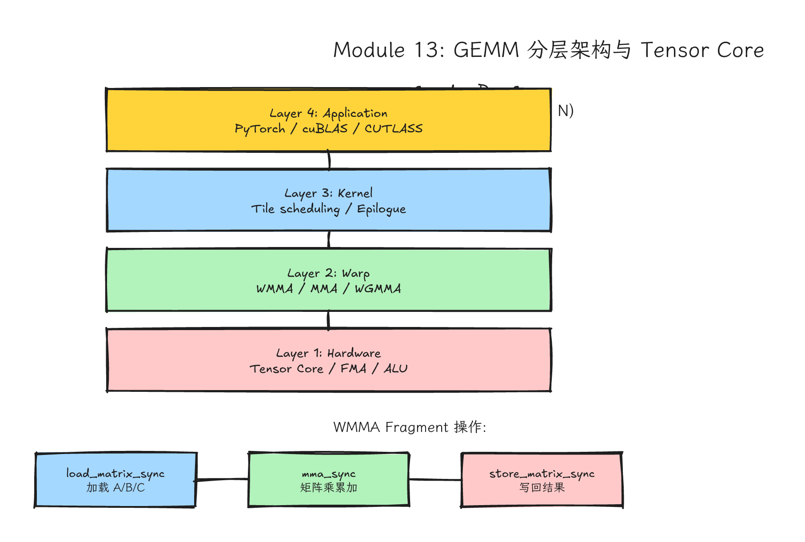
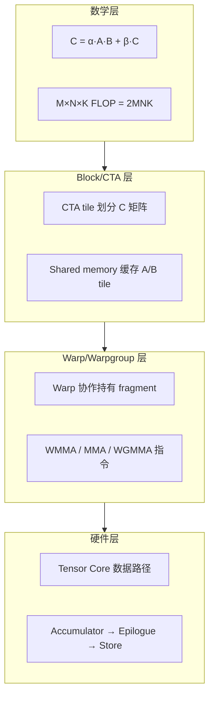
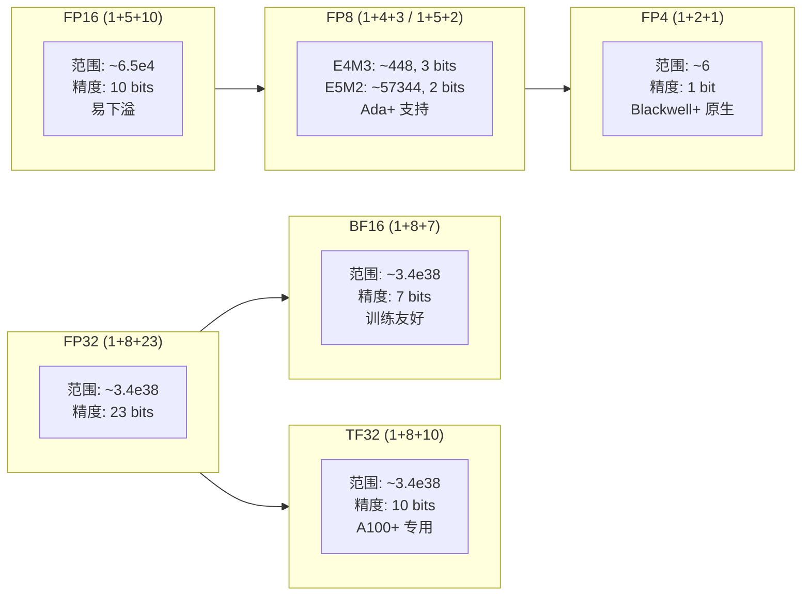
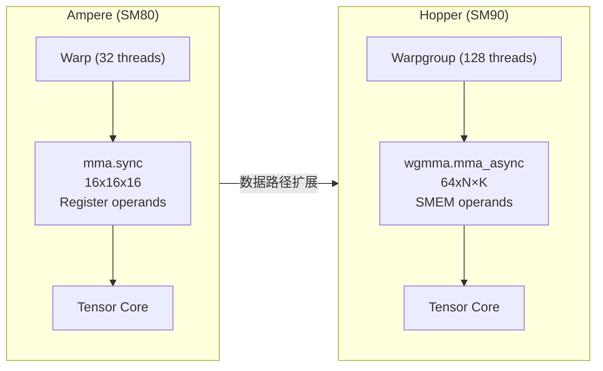
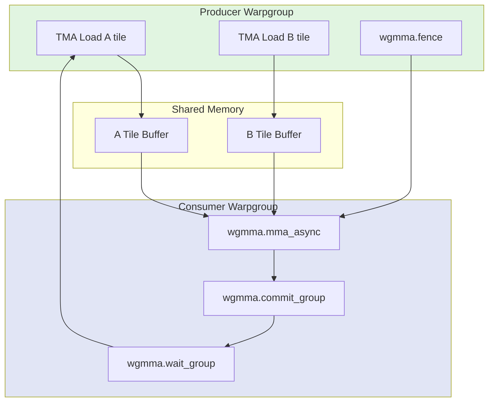
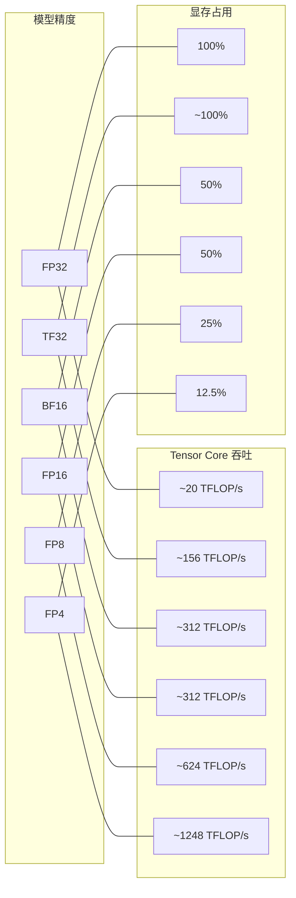

# Module 13: Tensor Core、WMMA、MMA 与 GEMM 分层



*图 13-1：从 PyTorch matmul 到 CTA tile、warp tile、MMA/WGMMA 与 Tensor Core 的分层路径。可编辑源图：[`module-13-gemm-tensor-core.excalidraw`](../diagrams/module-13-gemm-tensor-core.excalidraw)。*

> **Level**: Advanced
> **Estimated time**: 16–28 小时
> **Prerequisites**: Modules 03, 05, 07, 09, 12
> **Sources**: CUDA C++ Programming Guide, PTX ISA, cuBLAS, CUTLASS, DeepGEMM, Colfax Research, arXiv:2501.12084

---

## 学习目标

完成本模块后，你将能够：

1. **理解 GEMM 的数学本质**：从 FLOP 计数、arithmetic intensity、roofline 模型角度量化 GEMM 为什么是现代 GPU 上最重要也最复杂的计算模式。
2. **解释 Tensor Core 的硬件差异**：从 Volta 到 Blackwell，每代 Tensor Core 支持的 M×N×K tile 形状、精度格式、accumulator 类型，以及为什么 BF16/TF32/FP8/FP4 不是简单替换。
3. **手写并调试 WMMA 和 MMA 代码**：从 naive GEMM 到 tiled GEMM 到 WMMA fragment，理解 fragment 的内存布局、load/store 的 alignment 约束、mma_sync 的同步语义。
4. **阅读 PTX 级 WGMMA 指令**：在 Hopper/Blackwell 上理解 `wgmma.mma_async` 的 warpgroup 协作模型、异步 fence/commit/wait 机制、与 TMA 的协同流水线。
5. **分析低精度 GEMM 的 scaling 机制**：为什么 FP8/FP4 不是“精度换速度”，而是需要 per-tensor/per-channel/per-block scaling factor；为什么 DeepGEMM 需要两级累加。
6. **理解 epilogue 融合的价值**：为什么 bias + activation + scaling + quantization 的融合是减少内存带宽的关键；CUTLASS 的 Epilogue Visitor Tree（EVT）如何工作。
7. **定位真实系统**：PyTorch 的 `torch.matmul` 如何选择 cuBLAS vs CUTLASS 后端；vLLM 中 GEMM 的调用链；如何 benchmark 不同 GEMM 实现的精度与性能。

---

## 一、问题背景：为什么 GEMM 是现代 GPU 的终极考题

### 1.1 GEMM 是什么

General Matrix Multiplication（GEMM）是两个稠密矩阵的乘法。标准 BLAS 接口定义为：

$$C = \alpha \cdot A \times B + \beta \cdot C$$

其中 $A \in \mathbb{R}^{M \times K}$，$B \in \mathbb{R}^{K \times N}$，$C \in \mathbb{R}^{M \times N}$。深度学习中几乎所有核心算子，Linear/FC、Convolution（im2col 后）、Attention 的 $QK^T$ 和 $PV$ 都最终归结为 GEMM。

### 1.2 算法复杂度与 FLOP

GEMM 的经典三层循环需要 $M \times N \times K$ 次乘法和 $M \times N \times K$ 次加法，总计：

$$\text{FLOPs} = 2 \times M \times N \times K$$

这解释了为什么 GEMM 往往占据 Transformer 类模型的大部分算术 FLOP。具体比例取决于模型结构、序列长度、batch、MoE 路由、attention 实现和采样路径；写报告时应按目标模型重新统计，而不要把某个闭源或公开模型的经验比例当作通用常数。优化 GEMM 通常就是优化整体性能的核心入口之一。

### 1.3 Arithmetic Intensity 与 Roofline 分析

GEMM 的 arithmetic intensity（AI）定义为每字节数据搬运所执行的 FLOP：

$$AI = \frac{2 \cdot M \cdot N \cdot K}{dtype\_bytes \cdot (M\cdot K + K\cdot N + M\cdot N)}$$

对于 FP16（2 字节），分母约为 $2 \cdot (MK + KN + MN)$；对于 FP32（4 字节），分母约为 $4 \cdot (MK + KN + MN)$。实际分母还受 beta 系数、cache 命中和重复访问的影响，上述公式给出的是理论下限。

当 $M,N,K$ 都很大时（如 8192），AI 极高，属于 compute-bound；当 $M$ 或 $N$ 很小（如 batch=1 的解码推理），AI 降低，可能落入 memory-bound。这是 GEMM 优化的核心挑战：同样的硬件对不同 shape 可能处于不同瓶颈区。

```mermaid
---
title: "GEMM Roofline 模型示意"
---
xychart-beta
    title "Arithmetic Intensity vs Performance (FP16, A100)"
    x-axis "Arithmetic Intensity (FLOP/byte)" [1, 2, 4, 8, 16, 32, 64, 128, 256, 512]
    y-axis "Performance (TFLOP/s)" 0 --> 312
    line "Memory Bandwidth (2 TB/s)" [2, 4, 8, 16, 32, 64, 128, 256, 312, 312]
    line "Compute Peak (312 TFLOP/s)" [312, 312, 312, 312, 312, 312, 312, 312, 312, 312]
    scatter "Small M (M=1, N=4096, K=4096)" [[2], [4]]
    scatter "Large M (M=4096, N=4096, K=4096)" [[512], [312]]
```

- **小 M 推理**：位于 memory-bound 区域，性能由 HBM 带宽限制，Tensor Core 无法饱和。
- **大 M 训练**：位于 compute-bound 区域，Tensor Core 吞吐决定性能，对 TMA/pipeline 敏感。

### 1.4 从普通 CUDA Core 到 Tensor Core 的演进

普通 CUDA Core（如 Ampere 的 FP32 ALU）每秒执行的 FMA 指令数受限于 SM 数量和指令发射率。A100 的 FP32 peak 为 19.5 TFLOP/s，但 Tensor Core 的 FP16 dense peak 为 312 TFLOP/s，差一个数量级。这不是简单的“并行度增加”，而是 Tensor Core 对小矩阵 tile 做了批量化乘加的专用数据路径。

---

## 二、直觉类比：从手算到印刷机

### 2.1 三层印刷机比喻

理解 Tensor Core 的难点不在于“乘加更快”，而在于 数据必须裁成固定形状、按固定方向喂入。我们用一个印刷机比喻：

- **Naive GEMM**：像手算乘法表。每个 thread 拿一个 A 元素和一个 B 元素，做一次乘加。CUDA Core 够用，但内存读取效率极低。
- **Tiled GEMM**：像手工排版。block 把 A/B 的小块搬到 shared memory，threads 在 SMEM 内复用。CUDA Core 还是逐元素乘加，但减少了 global memory 读取。
- **Tensor Core GEMM**：像印刷机。你必须把纸裁成指定尺寸（16×16、8×8×4 等），按指定方向（row-major/col-major）放入，机器才能批量高速印刷。wmma、mma、wgmma 是“放纸”和“取纸”的协议。

### 2.2 四层抽象的重要性



你读 CUTLASS、DeepGEMM、vLLM kernel 时，要能把代码放回这张图里。

---

## 三、GEMM 的数学基础与 Roofline 深度分析

### 3.1 矩阵乘的缓存与局部性

经典三层循环的伪代码：

```cpp
for (int i = 0; i < M; ++i)
  for (int j = 0; j < N; ++j)
    for (int k = 0; k < K; ++k)
      C[i][j] += A[i][k] * B[k][j];
```

问题分析：
- **A 的读取模式**：按行遍历，连续读取。如果 K 很大，A 的每行被重复读取 N 次。
- **B 的读取模式**：按列遍历（跨行），不连续。如果 B 是 row-major，cache miss 极高。
- **C 的写入模式**：每个元素被累加 K 次，但每个 thread 只算一个 C 元素，arithmetic intensity 低。

### 3.2 Tiling 的数学原理

Tiling 的本质是 将循环重排为 block 级别的局部计算。假设 block tile 大小为 $BM \times BN$，每个 block 沿 K 维度迭代 $BK$ 大小：

```cpp
for (int k0 = 0; k0 < K; k0 += BK) {
  // 从 global 加载 A 的 BM×BK tile 到 SMEM
  // 从 global 加载 B 的 BK×BN tile 到 SMEM
  // 每个 thread 在 SMEM 内做 BK 步乘加
}
```

SMEM 容量限制：每个 block 的 SMEM 使用量 = $BM \cdot BK + BK \cdot BN$ 个元素。A100 的 shared memory capacity 是 164 KB/SM，单个 thread block 可寻址的动态 shared memory 上限约为 163 KB（需要 opt-in）。如果数据类型为 FP16（2 bytes），则：

$$2 \times (BM \cdot BK + BK \cdot BN) \leq 164 \times 1024$$

常见配置如 $BM=128, BN=128, BK=32$：
- A SMEM: $128 \times 32 \times 2 = 8$ KB
- B SMEM: $32 \times 128 \times 2 = 8$ KB
- 合计 16 KB，远低于限制，允许多 warps 和 double buffering。

### 3.3 为什么还需要 Tensor Core？

Tiling 解决了内存带宽问题，但没解决指令吞吐量问题。即使数据在 SMEM，每个 thread 仍需逐元素做乘加。Tensor Core 的创新在于：
- 一个 warp 的 32 threads 协作持有一个小矩阵 fragment。
- Tensor Core 的 **硬件数据路径** 一次吞吐整个 fragment 的乘加，相当于把 $M \times N \times K$ 个 scalar FMA 压缩成一条 **tensor instruction**。

以 A100 为例：一个 FP16 16×16×16 WMMA 操作对应 $16 \times 16 \times 16 \times 2 = 8192$ FLOP，但它走的是 Tensor Core 专用矩阵数据路径，而不是把 8192 次 scalar FMA 逐条派发到 FP32/FP16 CUDA core。具体延迟、issue rate 和每周期吞吐取决于指令形态、SM 架构、clock、tile 排布和 pipeline，不应简单理解成“一条指令一个 cycle 完成全部 FLOP”。性能差距的来源，是专用矩阵流水线、warp/warpgroup 协作和更高的数据复用共同作用。

---

## 四、Tensor Core 硬件机制

### 4.1 每代 Tensor Core 的演进

| 架构 | SM | Tensor Core 代 | 支持精度 | 典型 M×N×K | Accumulator |
|------|-----|---------------|----------|------------|-------------|
| Volta (V100) | sm70 | 1st | FP16 | 16×16×16 | FP32 |
| Turing (RTX 2080Ti) | sm75 | 2nd | FP16, INT8, INT4, INT1 | 16×16×16 / 8×8×32 | FP32 / INT32 |
| Ampere (A100) | sm80 | 3rd | FP16, BF16, TF32, INT8 | 16×16×16 / 8×8×16 | FP32 / FP32 |
| Ada (RTX 4090) | sm89 | 4th | FP16, BF16, TF32, FP8 | 16×16×16 / 8×8×16 | FP32 / FP32 |
| Hopper (H100) | sm90 | 4th | FP16, BF16, TF32, FP8 | 16×16×16 / WGMMA 64×N×K | FP32 / FP32 |
| Blackwell (B200) | sm100 | 5th | FP16, BF16, TF32, FP8, FP4 | `tcgen05` / UMMA；tile 形状由 PTX/CUTLASS kernel 决定，部分路径支持 2-SM 协作 | FP32 / TMEM-backed accumulator 路径 |

> 来源：NVIDIA CUDA C++ Programming Guide, Tensor Core 章节。https://docs.nvidia.com/cuda/cuda-c-programming-guide/index.html

### 4.2 精度格式的数值范围和精度差异



- **FP16 vs BF16**：FP16 精度高但范围小（65504 max），训练容易梯度下溢；BF16 用 FP32 的指数范围（8 bits），精度稍低（7 bits），但训练稳定。
- **TF32**：A100 引入，内部做 FP32 乘加，但输入只保留 10 bits 尾数。对程序员透明，适合不想改代码但想加速的场景。
- **FP8**：两种变体 E4M3（4 bits 指数，3 bits 尾数，最大约 448）和 E5M2（5 bits 指数，2 bits 尾数，最大约 57344）。Hopper 数据中心路径明确面向 FP8 Transformer Engine；Ada/RTX 与后续 Blackwell 的可用性还要看具体产品、driver、CUDA 库和框架 kernel。吞吐量通常高于 BF16，但具体倍数必须按目标 SKU 和 dense/sparse 口径查表。
- **FP4**：Blackwell 引入更低精度矩阵路径，常见格式如 E2M1，并且必须配合 microscaling / block scaling。它主要服务推理量化；能否直接使用取决于 SM100/SM120 目标、CUTLASS/cuBLAS/PyTorch/vLLM 是否提供对应 kernel。

### 4.3 Accumulator 精度的选择

Tensor Core 的 accumulator 选择取决于指令形态、dtype、架构和库实现。训练和高精度验证通常希望使用 FP32 或更高精度累加；推理低精度 kernel 可能为了吞吐、寄存器压力或硬件路径选择 FP16/FP32/TMEM-backed accumulator 等不同方案。重要规则：

| 输入 A/B | 支持 Accumulator | 推荐场景 |
|----------|-----------------|----------|
| FP16 | FP32, FP16 | 训练通常用 FP32 accum；推理可按精度/吞吐权衡 |
| BF16 | FP32 | 训练推荐 FP32 accum |
| TF32 | FP32 | 默认 FP32 accum |
| FP8 | FP16 或 FP32 等，取决于 PTX/库路径 | 通常需要高精度 promotion 或 scale-aware accumulation 才能保持误差可控 |
| FP4 | kernel-specific；常配合 block/micro scaling | 必须结合 scaling、accumulation 和 epilogue 一起验证 |

> 一些 DeepGEMM FP8 kernel 使用 promotion / 两级累加思想：Tensor Core 完成低精度矩阵乘后，再用更高精度路径补偿长 K 维累加误差。具体是否这样做、scale 如何打包、输出 dtype 是什么，要看当前 DeepGEMM kernel 家族和目标 SM。

---

## 五、Naive GEMM 与 Tiled GEMM 完整实现

### 5.1 Naive GEMM：教学基准

下面的 naive kernel 每个 thread 计算一个 C 元素。它慢、不 cache-friendly，但绝对正确，是后续优化的参照物。

```cpp
// naive_gemm.cu
// nvcc -arch=sm_80 -O3 naive_gemm.cu -o naive_gemm

#include <cuda_runtime.h>
#include <stdio.h>
#include <stdlib.h>
#include <math.h>

// Kernel: 每个 thread 负责一个 C 元素
// grid: (N/16, M/16), block: (16, 16)
__global__ void naive_gemm_kernel(const float* A, const float* B, float* C,
                                   int M, int N, int K) {
    // 1. 计算当前 thread 负责的全局坐标
    int row = blockIdx.y * blockDim.y + threadIdx.y;  // 0..M-1
    int col = blockIdx.x * blockDim.x + threadIdx.x;  // 0..N-1

    // 2. 边界检查：非矩形矩阵必须处理
    if (row >= M || col >= N) return;

    // 3. 沿 K 维度累加
    float acc = 0.0f;
    for (int k = 0; k < K; ++k) {
        // A: row-major, leading dim = K
        // B: row-major, leading dim = N
        float a = A[row * K + k];
        float b = B[k * N + col];
        acc += a * b;
    }

    // 4. 写回 C
    C[row * N + col] = acc;
}

// Host 调用封装
void naive_gemm(const float* d_A, const float* d_B, float* d_C,
                int M, int N, int K) {
    dim3 block(16, 16);  // 256 threads per block
    dim3 grid((N + 15) / 16, (M + 15) / 16);
    naive_gemm_kernel<<<grid, block>>>(d_A, d_B, d_C, M, N, K);
}
```

问题诊断：
- **A 的读取**：同一 block 的 threads 读取同一行 A，但不同 row 的 threads 读取不同行。Thread (0,0) 读取 A[0*K+0]，Thread (1,0) 读取 A[1*K+0]。连续 thread 在 col 方向连续，但 A 是按 row 变化。这导致 **A 读取不 coalesced**。
- **B 的读取**：Thread (0,0) 读取 B[0*N+0]，Thread (0,1) 读取 B[0*N+1]。B 的读取是 coalesced 的（同一 k 下连续 thread 读取连续 B 元素）。
- **C 的写入**：连续 thread 写入连续 C 元素，是 coalesced 的。
- **arithmetic intensity**：每个 thread 做 K 次乘加，但读取 2K 个元素（A 和 B 各 K 个）。每个 element 来自 global memory，没有复用。

### 5.2 Shared-Memory Tiled GEMM：解决带宽瓶颈

```cpp
// tiled_gemm.cu
// 假设 BLOCK_SIZE = 32，tile 大小为 32×32

#define BLOCK_SIZE 32

__global__ void tiled_gemm_kernel(const float* A, const float* B, float* C,
                                     int M, int N, int K) {
    // 1. Shared memory 声明：tile A 和 tile B
    // 注意：__shared__ 的内存大小在编译时指定，或在 kernel 启动时动态分配
    __shared__ float s_A[BLOCK_SIZE][BLOCK_SIZE];
    __shared__ float s_B[BLOCK_SIZE][BLOCK_SIZE];

    // 2. 当前 thread 在 block 内的局部坐标
    int tx = threadIdx.x;
    int ty = threadIdx.y;

    // 3. 当前 block 负责的 C tile 的左上角全局坐标
    int row = blockIdx.y * BLOCK_SIZE + ty;
    int col = blockIdx.x * BLOCK_SIZE + tx;

    float acc = 0.0f;

    // 4. 沿 K 维度迭代，每次加载一个 K-tile
    for (int k0 = 0; k0 < K; k0 += BLOCK_SIZE) {
        // 4a. 协作加载 A tile 到 SMEM
        // A 的行是 row，列是 k0 + tx
        // 注意：如果 K 不是 BLOCK_SIZE 的倍数，最后几列需要边界检查
        if (row < M && (k0 + tx) < K) {
            s_A[ty][tx] = A[row * K + (k0 + tx)];
        } else {
            s_A[ty][tx] = 0.0f;  // 填充 0，避免越界影响正确性
        }

        // 4b. 协作加载 B tile 到 SMEM
        // B 的行是 k0 + ty，列是 col
        if ((k0 + ty) < K && col < N) {
            s_B[ty][tx] = B[(k0 + ty) * N + col];
        } else {
            s_B[ty][tx] = 0.0f;
        }

        // 4c. 必须等整个 block 的 threads 都完成加载，才能使用 SMEM
        __syncthreads();

        // 4d. 在当前 SMEM tile 内做乘加
        // 每个 thread 计算它负责的 C 元素在这个 tile 内的局部累加
        for (int k = 0; k < BLOCK_SIZE; ++k) {
            // 如果 k0 + k >= K，s_A 和 s_B 已被填充为 0，不影响结果
            acc += s_A[ty][k] * s_B[k][tx];
        }

        // 4e. 下一次迭代前同步，确保所有 threads 用完 SMEM 后再加载新 tile
        __syncthreads();
    }

    // 5. 写回 C，注意边界检查
    if (row < M && col < N) {
        C[row * N + col] = acc;
    }
}

// Host 调用
void tiled_gemm(const float* d_A, const float* d_B, float* d_C,
                int M, int N, int K) {
    dim3 block(BLOCK_SIZE, BLOCK_SIZE);
    dim3 grid((N + BLOCK_SIZE - 1) / BLOCK_SIZE,
              (M + BLOCK_SIZE - 1) / BLOCK_SIZE);
    tiled_gemm_kernel<<<grid, block>>>(d_A, d_B, d_C, M, N, K);
}
```

关键改进点：
- **A 的复用**：block 内所有 threads 共享同一个 A tile。原来每个 thread 读取 K 个 A 元素；现在整个 block 协作加载一次，每个 thread 复用 SMEM 中的 A 值。
- **B 的复用**：同理，B tile 被 block 内所有 threads 复用。
- **Coalescing**：加载 A tile 时，block 内同一行的 threads（tx 连续）读取 A 的连续列元素。如果 A 是 row-major，并且 tx 对应 K 维度，这些元素在内存中就是连续的；如果 warp 线程排布跨越多行，或让 ty 主导连续变化，访问就会变成跨 stride，合并效果变差。更好的做法是让 warp 内相邻 lane 尽量映射到连续的 K 维度元素，并用 Nsight Compute 的 global load efficiency / sector 指标验证。
- **Bank Conflict**：shared memory 的 bank conflict 取决于数组布局、元素大小、bank 宽度、warp 内线程映射和访问方向。这个教学 kernel 的 `s_A[ty][k]` / `s_B[k][tx]` 在常见 thread 映射下通常不是最严重的冲突来源，但不能只凭公式断言冲突已经消失。专家做法是用 Nsight Compute 的 shared-memory bank conflict 指标验证，并在必要时通过 padding、转置加载或 swizzle 调整布局。

---

## 六、WMMA：Warp 级矩阵乘加 API

### 6.1 WMMA 的核心概念

WMMA（Warp Matrix Multiply Accumulate）是 CUDA C++ 中暴露 Tensor Core 的高层级 API。它位于 `<mma.h>` 中，命名空间 `nvcuda::wmma`。

核心概念：
- **fragment**：一个 warp 的 32 threads 协作持有的矩阵片段。fragment 存在于寄存器中，但具体的 thread→element 映射是 **opaque**（不透明的），程序员不能假设哪个 thread 持哪个元素。
- **load_matrix_sync**：从 global/shared memory 加载矩阵 tile 到 fragment。
- **mma_sync**：在 fragment 上执行矩阵乘加，映射到 Tensor Core 的 MMA 指令。
- **store_matrix_sync**：将 accumulator fragment 写回 memory。

### 6.2 Fragment 的内存布局与类型

```cpp
// 三种 fragment 类型
wmma::fragment<wmma::matrix_a, M, N, K, half, wmma::row_major> a_frag;
wmma::fragment<wmma::matrix_b, M, N, K, half, wmma::col_major> b_frag;
wmma::fragment<wmma::accumulator, M, N, K, float> acc_frag;
```

模板参数解析：
- 第 1 个参数：fragment 角色（`matrix_a`, `matrix_b`, `accumulator`）
- 第 2–4 个参数：M, N, K tile 尺寸。支持的组合取决于架构和精度。例如 FP16 通常支持 16×16×16。
- 第 5 个参数：数据类型（`half`, `float`, `__nv_bfloat16` 等）
- 第 6 个参数（仅 matrix_a/matrix_b）：输入 tile 在内存中的布局（`row_major` 或 `col_major`）。**注意**：它不会暴露 fragment 在各个 lane 寄存器里的内部映射；内部映射仍是 opaque。它的作用是告诉 WMMA 如何按 `mptr + row * ldm + col` 或 `mptr + col * ldm + row` 解释输入矩阵。

### 6.3 load_matrix_sync 的 alignment 要求

`load_matrix_sync` 对内存对齐和 leading dimension 有硬性要求。按 CUDA C++ Programming Guide 的 WMMA 口径：
- `mptr` 必须 **256-bit 对齐**，也就是 32 bytes 对齐。
- `ldm` 以元素数计，不是字节数。对 `__half`/`half` 输入，`ldm` 必须是 8 个元素的倍数（16 bytes）；对 `float` 输入，`ldm` 必须是 4 个元素的倍数（16 bytes）。
- 对 row-major，`ldm` 是相邻两行的元素跨度；对 col-major，`ldm` 是相邻两列的元素跨度。

本课的 FP16 16×16×16 教学 kernel 进一步要求 M/N/K 是 16 的倍数，是为了让每个 warp tile 恰好覆盖完整边界；这是示例算法的边界处理约束，不是 `load_matrix_sync` API 本身唯一的 stride 规则。真实矩阵若不是 tile 倍数，通常需要 padding、masked epilogue 或单独 edge kernel。

### 6.4 mma_sync 的同步语义

`mma_sync` 是 **warp 内同步**的。它的语义是：
- 整个 warp 的 32 threads 必须执行到 `mma_sync`，且 fragment 参数必须一致。
- Tensor Core 执行 $D = A \times B + C$（或 $D = A \times B + D$）。
- 指令是同步的：warp 内所有 threads 等待 MMA 完成才能继续。

### 6.5 store_matrix_sync 的边界条件

store 时，需要指定输出矩阵的 leading dimension 和存储布局：
```cpp
wmma::store_matrix_sync(C_ptr, acc_frag, ldc, wmma::mem_row_major);
```
- `ldc` 是 C 的 leading dimension（row-major 下是 N，col-major 下是 M）。
- accumulator store 同样要遵守 WMMA 对 `mptr` 和 `ldm` 的对齐/跨度要求；如果 C 的指针或 leading dimension 不满足要求，结果未定义或性能明显下降。
- 对于非 16 倍数边界的矩阵，需要 mask 或 padding 处理。

### 6.6 完整 WMMA GEMM 实现（含边界处理）

```cpp
// wmma_gemm.cu
// nvcc -arch=sm_80 -O3 wmma_gemm.cu -o wmma_gemm

#include <cuda_runtime.h>
#include <cuda_fp16.h>
#include <mma.h>
#include <stdio.h>

using namespace nvcuda;

// WMMA 约束：FP16 16x16x16 要求 M,N,K 为 16 的倍数
// 对于非 16 倍数的情况，需要 padding 到 16 的倍数
// 这里为了教学清晰，先假设输入已经是 16 的倍数
// 生产代码应添加 padding 或 mask 逻辑

#define WMMA_M 16
#define WMMA_N 16
#define WMMA_K 16

// Kernel: 每个 warp 负责一个 16x16 的 C tile
// block 内有多个 warps，每个 warp 计算一个 tile
__global__ void wmma_gemm_fp16_kernel(const half* __restrict__ A,
                                       const half* __restrict__ B,
                                       float* __restrict__ C,
                                       int M, int N, int K) {
    // 1. 确定当前 warp 在 grid 中的位置
    // 假设 block 的维度是 (32, 4) => 4 warps per block (因为 warp 大小是 32)
    // blockDim.x = 32, blockDim.y = warps_per_block
    int warpId = threadIdx.y;  // 0..warps_per_block-1
    int warpsPerBlock = blockDim.y;
    int warpsPerRow = N / WMMA_N;  // M,N 已在 host 侧检查为 16 的倍数

    // 当前 warp 负责的全局 tile 坐标
    int globalWarpId = blockIdx.x * warpsPerBlock + warpId;
    int warp_m = globalWarpId / warpsPerRow;
    int warp_n = globalWarpId % warpsPerRow;

    int row = warp_m * WMMA_M;
    int col = warp_n * WMMA_N;

    // 2. 边界检查：如果 tile 超出矩阵范围，提前返回
    if (row >= M || col >= N) return;

    // 3. 声明 fragment
    // matrix_a: 16x16x16, FP16, row_major
    // matrix_b: 16x16x16, FP16, row_major
    // accumulator: 16x16x16, FP32
    wmma::fragment<wmma::matrix_a, WMMA_M, WMMA_N, WMMA_K, half, wmma::row_major> a_frag;
    wmma::fragment<wmma::matrix_b, WMMA_M, WMMA_N, WMMA_K, half, wmma::row_major> b_frag;
    wmma::fragment<wmma::accumulator, WMMA_M, WMMA_N, WMMA_K, float> acc_frag;

    // 4. 初始化 accumulator 为 0
    wmma::fill_fragment(acc_frag, 0.0f);

    // 5. 沿 K 维度迭代，每次加载 16x16 的 A/B tile
    for (int k0 = 0; k0 < K; k0 += WMMA_K) {
        // A tile 的左上角：A[row:row+16, k0:k0+16]
        // B tile 的左上角：B[k0:k0+16, col:col+16]
        const half* tile_a = A + row * K + k0;
        const half* tile_b = B + k0 * N + col;

        // 6. 加载 fragment
        // load_matrix_sync 的第三个参数是 leading dimension（stride）
        // A 的 row-major: 相邻行偏移 K 个元素
        // B 的 row-major: 相邻行偏移 N 个元素
        wmma::load_matrix_sync(a_frag, tile_a, K);
        wmma::load_matrix_sync(b_frag, tile_b, N);

        // 7. 执行 MMA: acc = a * b + acc
        // mma_sync 是 warp 级同步操作，32 threads 协作完成
        wmma::mma_sync(acc_frag, a_frag, b_frag, acc_frag);
    }

    // 8. 将结果写回 C
    // C 的左上角：C[row:row+16, col:col+16]
    float* tile_c = C + row * N + col;
    wmma::store_matrix_sync(tile_c, acc_frag, N, wmma::mem_row_major);
}

// Host 调用封装
// 注意：M, N, K 需要是 16 的倍数，否则需要 padding 处理
void wmma_gemm_fp16(const half* d_A, const half* d_B, float* d_C,
                    int M, int N, int K) {
    if (M % WMMA_M != 0 || N % WMMA_N != 0 || K % WMMA_K != 0) {
        fprintf(stderr,
                "wmma_gemm_fp16 expects M, N, K to be multiples of 16; "
                "pad inputs or use a masked/padded kernel for edge tiles.\n");
        return;
    }

    // 每个 block 4 warps (128 threads), 每个 warp 1 tile
    dim3 block(32, 4);  // x=32 threads per warp, y=4 warps
    int tilesM = M / WMMA_M;
    int tilesN = N / WMMA_N;
    int totalTiles = tilesM * tilesN;
    int blocks = (totalTiles + block.y - 1) / block.y;  // 每个 block 处理 block.y 个 warp tile
    dim3 grid(blocks);
    wmma_gemm_fp16_kernel<<<grid, block>>>(d_A, d_B, d_C, M, N, K);
}
```

**代码解析**：
- `warpId = threadIdx.y`：block 的 y 维度用于区分不同 warp。每个 warp 32 threads 在 x 维度上。
- `load_matrix_sync(a_frag, tile_a, K)`：告诉 WMMA A 的 leading dimension 是 K。WMMA 内部知道 tile 是 16×16，所以会按 row-major 读取 16 行，每行 stride = K。
- `mma_sync`：这是 warp 级指令，要求参与该 WMMA 操作的 warp lanes 按一致控制流到达；它本身不需要 block-wide `__syncthreads()`。但如果 A/B tile 先由某些线程或 warp 写入 shared memory，再由另一些 warp 调用 `load_matrix_sync`/`mma_sync` 消费，就必须用合适的 block barrier 或 pipeline barrier 保证 shared memory 数据已经写完且可见。
- 这个 kernel 没有使用 shared memory staging，直接从 global memory 加载。这是教学版本。生产版本应先将 A/B tile 加载到 SMEM，再从 SMEM 加载到 fragment，以减少 global memory 读取次数。

---

## 七、MMA PTX 指令：更接近硬件的层级

### 7.1 mma.sync 的完整语法解析

PTX（Parallel Thread Execution）是 NVIDIA GPU 的汇编级中间语言。MMA PTX 指令暴露更细粒度的控制：

```
mma.sync.aligned.m16n8k16.row.col.f32.f16.f16.f32
  d, a, b, c;
```

语法解析：
- `mma.sync`：同步执行，warp 级。
- `.aligned`：要求 warp 内所有参与线程以一致方式执行同一条 MMA 指令；如果 warp 内线程分歧导致只有部分 lane 执行，行为未定义。注意，矩阵数据本身的地址、leading dimension 和 fragment layout 仍然有各自的对齐要求，但那不是 `.aligned` 这个修饰符本身的含义。
- `.m16n8k16`：tile 形状为 M=16, N=8, K=16。
- `.row.col`：A 是 row-major，B 是 col-major。
- `.f32.f16.f16.f32`：类型后缀顺序是 **D/A/B/C**，表示输出 D 为 FP32，A/B 为 FP16，输入 accumulator C 为 FP32。不要把它误读成 A/B/C/D。
- `d, a, b, c`：寄存器操作数。

### 7.2 不同 shape 和精度的指令变体

| 指令 | M×N×K | A 类型 | B 类型 | C 类型 | D 类型 | 架构 |
|------|--------|--------|--------|--------|--------|------|
| `mma.sync.aligned.m16n8k16.row.col.f32.f16.f16.f32` | 16×8×16 | FP16 | FP16 | FP32 | FP32 | sm80+ 常见路径 |
| `mma.sync.aligned.m16n8k8.row.col.f32.tf32.tf32.f32` | 16×8×8 | TF32 | TF32 | FP32 | FP32 | sm80+ |
| `mma.sync.aligned.m16n8k16.row.col.f16.f16.f16.f16` | 16×8×16 | FP16 | FP16 | FP16 | FP16 | sm80+ 常见路径 |
| `mma.sync.aligned.m16n8k32.row.col.s32.s8.s8.s32` | 16×8×32 | INT8 | INT8 | INT32 | INT32 | sm80+ 常见路径 |
| `mma.sync.aligned.m16n8k64.row.col.s32.s4.s4.s32` | 16×8×64 | INT4 | INT4 | INT32 | INT32 | sm80+ 常见路径 |

> 来源：NVIDIA PTX ISA, MMA 指令章节。https://docs.nvidia.com/cuda/parallel-thread-execution/index.html

### 7.3 在 CUDA 中内联 PTX MMA

```cpp
// 内联 PTX MMA 示例：FP16 m16n8k16，FP32 accumulator
// 使用 asm volatile 嵌入 PTX

// 声明寄存器变量
uint32_t a_frag[4];     // A operand: 4 个 32-bit 寄存器，每个通常打包 2 个 FP16
uint32_t b_frag[2];     // B operand: 2 个 32-bit 寄存器
float acc_frag[4];      // 当前 thread 持有的 FP32 accumulator fragment 片段

// 加载 A/B fragment（通常从 SMEM 或寄存器加载）
// 这里假设已经通过某种方式填充了 a_frag 和 b_frag

// 执行 MMA PTX 指令
// 注意：PTX 级别的 mma.sync 要求精确的寄存器映射和形状
// 以下是一个示意性的 PTX 调用，真实代码需要更精确的寄存器管理
asm volatile(
    "mma.sync.aligned.m16n8k16.row.col.f32.f16.f16.f32 "
    "{%0,%1,%2,%3}, "   // d = acc_frag[0..3]
    "{%4,%5,%6,%7}, "   // a = a_frag[0..3]
    "{%8,%9}, "         // b = b_frag[0..1]
    "{%0,%1,%2,%3};"    // c = acc_frag[0..3]，与 d 原地累加
    : "+f"(acc_frag[0]), "+f"(acc_frag[1]), "+f"(acc_frag[2]), "+f"(acc_frag[3])
    : "r"(a_frag[0]), "r"(a_frag[1]), "r"(a_frag[2]), "r"(a_frag[3]),
      "r"(b_frag[0]), "r"(b_frag[1])
);
```

> **注意**：手写 PTX MMA 极其复杂。需要精确管理寄存器分配、fragment 布局、指令发射顺序。通常只有 CUTLASS 这类库的作者需要深入这个层级。对于应用开发者，使用 WMMA 或 cuBLAS/CUTLASS 是更实际的选择。

---

## 八、WGMMA：Hopper 的 Warpgroup 异步 MMA

### 8.1 为什么需要 WGMMA

从 Ampere 到 Hopper，Tensor Core 的数据路径变大。单个 warp（32 threads）的 `mma.sync` 无法充分利用更大的吞吐单元。Hopper 引入 warpgroup（4 warps = 128 threads） 协作执行更大 tile 的 MMA。



### 8.2 wgmma.mma_async 的语法与协作模型

WGMMA 的核心指令：
```
wgmma.mma_async.sync.aligned.m64n128k16.f32.f16.f16
  d, desc_a, desc_b, scale-d, imm-scale-a, imm-scale-b, imm-trans-a, imm-trans-b;
```

关键差异：
- **Warpgroup 协作**：128 threads 集体执行。参与 warpgroup 的所有 warp 必须按一致控制流到达 WGMMA 指令；不要把它理解成“只有 warp 0 发出指令，其他 warp 被动旁观”。
- 异步执行：`wgmma.mma_async` 发射后不等同于立即消费结果；warpgroup 可以在最终 `wait_group` 前安排不依赖该结果的工作，并通过 `wgmma.commit_group` / `wgmma.wait_group` 管理生命周期。`wait_group` 本身仍是等待点。
- SMEM 操作数：Hopper WGMMA 常见 `SS` 路径让 A/B 都来自 shared memory descriptor，也存在 A 从寄存器、B 从 SMEM descriptor 的 `RS` 路径；具体 operand 来源取决于 PTX 指令 variant / CUTLASS atom。
- Accumulator 在寄存器：C/D 仍保存在 warpgroup 的寄存器中。

### 8.3 同步原语：fence, commit, wait

```cpp
// WGMMA 同步模式（示意）
// 步骤 1: 确保 SMEM 数据就绪
wgmma.fence.sync.aligned;  // 或 cute::warpgroup_arrive()

// 步骤 2: 发射异步 MMA
wgmma.mma_async.sync.aligned.m64n128k16.f32.f16.f16 ...;

// 步骤 3: 将本次 MMA 提交到一个 group
wgmma.commit_group.sync.aligned;

// 步骤 4: 等待 group 完成（可以指定等待多少未完成 group）
wgmma.wait_group.sync.aligned 0;  // 等待所有未完成的 group；等待指令本身会停在等待点
```

CUTLASS 3.x 的封装（CuTe 风格）：
```cpp
using namespace cute;

// 构造 TiledMMA
auto tiled_mma = make_tiled_mma(
    SM90_64x128x16_F16F16F32_SS{},  // Hopper warpgroup MMA, SMEM-SMEM
    Layout<Shape<_2,_1,_1>>{},       // 2 warpgroups in M, 1 in N, 1 in K
    Layout<Shape<_1,_2,_1>>{}        // 1 warp in M, 2 in N, 1 in K
);

// 同步
cute::warpgroup_arrive();
cute::gemm(tiled_mma, tCrA, tCrB, tCrC);  // 内部发射 wgmma
// 对于多 stage pipeline，可以 gemm 多次后再同步
cute::warpgroup_commit_batch();
cute::warpgroup_wait<0>();
```

> 来源：CUTLASS Tutorial: WGMMA on Hopper。https://research.colfax-intl.com/cutlass-tutorial-wgmma-hopper/

### 8.4 与 TMA 的协同流水线



在 Hopper 上，最高效的 GEMM 使用 warp-specialized cooperative kernel：
- 一个 warpgroup（或一个 warp）作为 producer，负责 TMA 从 global memory 加载 A/B 到 SMEM。
- 另一个 warpgroup 作为 consumer，从 SMEM 读取并执行 `wgmma.mma_async`。
- 通过 async barrier 和 pipeline stage 实现 double/triple buffering，让 TMA 加载和 WGMMA 计算尽量重叠。实际重叠程度取决于 tile shape、stage 数、SMEM/register 预算和实际延迟。

---

## 九、cuBLAS GEMM 完整示例

### 9.1 cuBLAS 的接口与精度控制

cuBLAS 是 NVIDIA 的闭源 BLAS 库，对 GEMM 做了高度优化。关键 API：`cublasGemmEx` 和 `cublasLtMatmul`。

```cpp
// cublas_gemm.cu
// nvcc -arch=sm_80 -O3 cublas_gemm.cu -lcublas -o cublas_gemm

#include <cuda_runtime.h>
#include <cuda_fp16.h>
#include <cuda_bf16.h>
#include <cublas_v2.h>
#include <stdio.h>
#include <stdlib.h>

// 错误检查宏
#define CHECK_CUBLAS(call)                                                     \
    do {                                                                       \
        cublasStatus_t status = call;                                          \
        if (status != CUBLAS_STATUS_SUCCESS) {                                 \
            fprintf(stderr, "CUBLAS error at %s:%d: %d\n",                   \
                    __FILE__, __LINE__, status);                             \
            exit(1);                                                           \
        }                                                                      \
    } while (0)

// 示例：使用 cublasGemmEx 支持多种数据类型
void cublas_gemm_ex(cublasHandle_t handle,
                     const void* A, const void* B, void* C,
                     int M, int N, int K,
                     cudaDataType_t aType, cudaDataType_t bType,
                     cudaDataType_t cType, cublasComputeType_t computeType) {
    // cublasGemmEx 的接口是 C = alpha * op(A) * op(B) + beta * C
    float alpha = 1.0f;
    float beta = 0.0f;

    // 注意：cuBLAS 默认是 column-major！
    // 如果输入是 row-major，需要转置或交换参数
    // 这里为了教学，我们假设输入是 row-major，通过设置 trans 来适配

    CHECK_CUBLAS(cublasGemmEx(
        handle,
        CUBLAS_OP_N, CUBLAS_OP_N,  // A, B 不转置
        N, M, K,                   // 注意：cuBLAS 是 column-major，所以 M,N 交换
        &alpha,
        B, bType, N,               // B 是 K×N，leading dim = N
        A, aType, K,               // A 是 M×K，leading dim = K
        &beta,
        C, cType, N,               // C 是 M×N，leading dim = N
        computeType,
        CUBLAS_GEMM_DEFAULT_TENSOR_OP  // 允许/请求 Tensor Core 路径；最终选择由 cuBLAS、shape、dtype 和 math mode 决定
    ));
}

// 不同精度的 wrapper
void run_fp16_gemm(cublasHandle_t handle,
                   const half* d_A, const half* d_B, float* d_C,
                   int M, int N, int K) {
    cublas_gemm_ex(handle, d_A, d_B, d_C, M, N, K,
                   CUDA_R_16F, CUDA_R_16F, CUDA_R_32F,
                   CUBLAS_COMPUTE_32F_FAST_16F);  // FP16 输入，FP32 累加
}

void run_bf16_gemm(cublasHandle_t handle,
                   const __nv_bfloat16* d_A, const __nv_bfloat16* d_B, float* d_C,
                   int M, int N, int K) {
    cublas_gemm_ex(handle, d_A, d_B, d_C, M, N, K,
                   CUDA_R_16BF, CUDA_R_16BF, CUDA_R_32F,
                   CUBLAS_COMPUTE_32F_FAST_16BF);  // BF16 输入，FP32 累加
}

void run_fp32_gemm(cublasHandle_t handle,
                   const float* d_A, const float* d_B, float* d_C,
                   int M, int N, int K) {
    cublas_gemm_ex(handle, d_A, d_B, d_C, M, N, K,
                   CUDA_R_32F, CUDA_R_32F, CUDA_R_32F,
                   CUBLAS_COMPUTE_32F);  // FP32 输入，FP32 累加
}

// 完整调用示例
int main() {
    int M = 4096, N = 4096, K = 4096;

    // 分配 host memory
    float* h_A = (float*)malloc(M * K * sizeof(float));
    float* h_B = (float*)malloc(K * N * sizeof(float));
    float* h_C = (float*)malloc(M * N * sizeof(float));
    // ... 初始化 h_A, h_B ...

    // 分配 device memory
    float *d_A, *d_B, *d_C;
    cudaMalloc(&d_A, M * K * sizeof(float));
    cudaMalloc(&d_B, K * N * sizeof(float));
    cudaMalloc(&d_C, M * N * sizeof(float));
    cudaMemcpy(d_A, h_A, M * K * sizeof(float), cudaMemcpyHostToDevice);
    cudaMemcpy(d_B, h_B, K * N * sizeof(float), cudaMemcpyHostToDevice);

    // 创建 cuBLAS handle
    cublasHandle_t handle;
    cublasCreate(&handle);

    // 运行 FP32 GEMM
    run_fp32_gemm(handle, d_A, d_B, d_C, M, N, K);

    // 回传结果
    cudaMemcpy(h_C, d_C, M * N * sizeof(float), cudaMemcpyDeviceToHost);

    // 清理
    cublasDestroy(handle);
    cudaFree(d_A); cudaFree(d_B); cudaFree(d_C);
    free(h_A); free(h_B); free(h_C);
    return 0;
}
```

**关键说明**：
- `CUBLAS_GEMM_DEFAULT_TENSOR_OP`：在 legacy `cublasGemmEx` API 中请求 Tensor Core 友好的算法路径；它不是“保证一定使用 Tensor Core”的证明。是否实际使用 Tensor Core，要看 dtype、alignment、shape、compute type、cuBLAS 版本和 profiler/SASS 证据。新代码也可以优先评估 `cublasLtMatmul`。
- `CUBLAS_COMPUTE_32F_FAST_16F`：表示以 FP32 compute type 为语义基线，但允许 cuBLAS 使用针对 FP16 输入优化的快速路径；具体内部指令选择以当前 cuBLAS 文档和 profiling 为准。
- **Column-major 陷阱**：cuBLAS 的 legacy 接口是 column-major。如果输入是 row-major，最简单的方法是将 `C = A * B` 转换为 `C^T = B^T * A^T`，即交换 M/N 和 A/B 参数。

---

## 十、CUTLASS GEMM 调用示例

### 10.1 CUTLASS 的定位

CUTLASS 是 NVIDIA 开源的 CUDA C++ 模板库，目标是接近 cuBLAS 的性能，同时提供可定制性。它使用 CuTe 张量代数库来表达布局、tile 和 pipeline。

### 10.2 使用 CUTLASS 3.x CollectiveBuilder 的伪代码

由于 CUTLASS 的模板参数极其复杂，下面给出 Hopper 上调用 FP16 GEMM 的 **核心结构**（非完整可编译代码）：

```cpp
// cutlass_gemm_example.cu
// 需要 CUTLASS 3.x 和对应 SM 架构支持

#include <cute/tensor.hpp>
#include <cutlass/gemm/collective/collective_builder.hpp>
#include <cutlass/gemm/kernel/gemm_universal.hpp>
#include <cutlass/epilogue/collective/collective_builder.hpp>

using namespace cute;

// 定义数据类型
using ElementA = half_t;
using ElementB = half_t;
using ElementC = float;
using ElementD = float;
using ElementAccumulator = float;

// 定义 Tile 形状（MMA 指令级）
using MMA_Tile = Shape<_64, _128, _16>;  // 64x128x16 WGMMA tile

// 使用 CollectiveBuilder 构造 mainloop（WGMMA + TMA）
using MainloopBuilder = cutlass::gemm::collective::CollectiveBuilder<
    cutlass::arch::Sm90,                    // 目标架构
    cutlass::arch::OpClassTensorOp,         // Tensor Core
    ElementA,                               // A 类型
    Layout<Shape<_1, _1, _1>, Stride<_1, _0, _0>>,  // A layout (示例)
    ElementB,                               // B 类型
    Layout<Shape<_1, _1, _1>, Stride<_0, _1, _0>>,  // B layout (示例)
    ElementAccumulator,                     // Accumulator 类型
    MMA_Tile,                               // MMA tile 形状
    _2,                                     // Pipeline stages
    cutlass::gemm::collective::StageCarveoutAuto
>;

using CollectiveMainloop = typename MainloopBuilder::CollectiveOp;

// 使用 CollectiveBuilder 构造 epilogue（含 bias + activation）
using EpilogueBuilder = cutlass::epilogue::collective::CollectiveBuilder<
    cutlass::arch::Sm90,
    cutlass::arch::OpClassTensorOp,
    MMA_Tile,
    _1,  // epilogue warps
    ElementAccumulator,
    ElementAccumulator,
    ElementC, ElementC,  // C 输入
    ElementD, ElementD,  // D 输出
    cutlass::epilogue::collective::EpilogueVisitorAuto
>;

using CollectiveEpilogue = typename EpilogueBuilder::CollectiveOp;

// 定义 Kernel
using GemmKernel = cutlass::gemm::kernel::GemmUniversal<
    Shape<int, int, int, int>,  // Problem shape (M, N, K, batch)
    CollectiveMainloop,
    CollectiveEpilogue,
    cutlass::gemm::kernel::GemmScheduler::PersistentMultistage
>;

using Gemm = cutlass::gemm::device::GemmUniversalAdapter<GemmKernel>;

// 调用
int main() {
    int M = 4096, N = 4096, K = 4096;

    // 分配和初始化 A, B, C, D ...
    // 构造 Arguments
    typename Gemm::Arguments arguments{
        cutlass::gemm::GemmUniversalMode::kGemm,  // 模式
        {M, N, K},                                // problem shape
        nullptr, nullptr, nullptr, nullptr,      // A, B, C, D 指针
        0, 0, 0, 0,                               // leading dims
        0, 0, 0, 0, 0                            // batch strides
    };

    Gemm gemm_op;
    size_t workspace_size = Gemm::get_workspace_size(arguments);
    void* workspace = nullptr;
    cudaMalloc(&workspace, workspace_size);

    cutlass::Status status = gemm_op.initialize(arguments, workspace);
    if (status != cutlass::Status::kSuccess) {
        printf("CUTLASS init failed\n");
        return 1;
    }

    status = gemm_op.run();
    if (status != cutlass::Status::kSuccess) {
        printf("CUTLASS run failed\n");
        return 1;
    }

    cudaFree(workspace);
    return 0;
}
```

> 注意：CUTLASS 的模板元编程非常深。上面的代码展示的是核心结构。实际可编译代码需要更完整的 layout、stride、epilogue 配置。建议参考 CUTLASS 官方示例：`examples/49_hopper_gemm_with_collective_builder/`。

### 10.3 CUTLASS 的 Epilogue Visitor Tree（EVT）

CUTLASS 3.x 引入了 EVT 机制，允许将任意后处理（bias、activation、scaling、quantization）融合到 GEMM 的 epilogue 中，避免额外 kernel launch：

```cpp
// EVT 伪代码：D = activation(alpha * A * B + beta * C + bias)
// 使用 Colfax Research 的示例结构

using EVT = cutlass::epilogue::fusion::Sm90EVT<
    cutlass::epilogue::fusion::Sm90ScalarBroadcast<...>,  // alpha
    cutlass::epilogue::fusion::Sm90SrcFetch<...>,        // C
    cutlass::epilogue::fusion::Sm90ScalarBroadcast<...>,  // beta
    cutlass::epilogue::fusion::Sm90ColumnBroadcast<...>,   // bias
    cutlass::epilogue::fusion::Sm90Activation<...>        // ReLU/SiLU/etc
>;
```

EVT 的每个节点是树中的一个操作，从叶子（load/broadcast）到根（store）依次执行。CUTLASS 编译器将这些节点展开为单个 fused epilogue kernel。

> 来源：Epilogue Fusion in CUTLASS with Epilogue Visitor Trees。https://research.colfax-intl.com/epilogue_visitor_tree/

---

## 十一、FP8/FP4 低精度 GEMM 与 Scaling 机制

### 11.1 为什么低精度需要 Scaling

FP8（E4M3）的动态范围只有约 ±448，FP4 只有约 ±6。深度学习中的权重和激活值分布通常包含离群值（outliers），直接截断到 FP8/FP4 会导致严重误差。

Scaling 的核心思想：将浮点数 $x$ 缩放为 $x_{scaled} = x / s$，其中 $s$ 是 scaling factor。计算完成后，结果再乘以 $s$ 还原：

$$C = (A / s_a) \times (B / s_b) \times s_a \times s_b = A \times B$$

但 scaling factor 的粒度不同，精度-开销 tradeoff 不同：

| Scaling 粒度 | 描述 | 精度 | 开销 | 适用场景 |
|-------------|------|------|------|----------|
| Per-tensor | 整个张量一个 scale | 最低 | 最小 | 权重静态量化 |
| Per-channel | 每行/每列一个 scale | 中等 | 中等 | 激活动态量化 |
| Per-block | 每个 tile/block 一个 scale | 最高 | 较大 | 高精度推理（DeepSeek-V3） |
| Per-token | 每个 token 一个 scale | 高 | 较大 | LLM 解码 |

### 11.2 DeepGEMM 的 FP8 实现分析

DeepGEMM 的 FP8 不是简单的 FP8 输入 + FP8 累加。公开实现和文档强调细粒度 scaling、架构相关 scale layout，以及在部分 kernel 中使用 promotion / 两级累加思想：

```cpp
// DeepGEMM 核心思想示意（非真实代码，简化自 README）
// 1. 输入 A_fp8, B_fp8 各自带有 scale factor 矩阵
// 2. Tensor Core 执行 FP8 MMA；accumulator 可能是 FP16、FP32 或架构/库特定路径
// 3. 某些 kernel 会再用更高精度路径做 promotion / 分块补偿累加
// 4. 最后乘以 (scale_a * scale_b) 得到正确量级的结果

// 为什么两级累加？
// FP8 的精度极低，如果 accumulator 也是 FP8，K 维度的累加误差会快速放大。
// Tensor Core 的 FP8 MMA accumulator 和输出路径由 PTX variant、架构和库实现决定。
// DeepGEMM 的公开文档强调 promotion / 两级累加思想；具体在哪个 kernel、
// 哪个 K 分块、哪个 SM 路径中使用，要以当前 commit 的 README、tests 和 SASS 为准。
```

DeepGEMM 的 scaling 要按当前 API/tests 精确理解，不能简化成“A/B 都是 128×128 的 FP32 scale tile”：

- **Fine-grained block scaling**：公开 README 和测试代码围绕 DeepSeek-V3 的细粒度 scaling 组织。常见 FP8 GEMM 路径会沿 K 维使用 128 元素左右的 block；例如 NT 路径中，A/LHS scale 常见逻辑形状接近 `(M, ceil(K/128))`，B/RHS scale 常见逻辑形状接近 `(ceil(N/128), ceil(K/128))`。真实内存布局还要经过 TMA-aligned / transposed / packed 转换。
- **SM90 与 SM100 scale 格式不同**：SM90 路径使用 FP32 scaling factors；SM100 路径使用 packed UE8M0 等 Blackwell block-scaling 相关格式。课程代码必须通过 DeepGEMM 提供的 layout/scale helper 准备输入，而不是自己假设一个普通 dense scale 矩阵。
- **Grouped/MoE GEMM 的 scale 还受 expert 分组和 layout 约束**：每个 expert、每个 token block、每个 K block 的 scale 如何组织，要以当前 DeepGEMM README、`tests/` 和 `deep_gemm/utils/` 为准。

### 11.3 不同精度 GEMM 的精度-性能 Tradeoff



> 注意：上图是跨代精度层级的概念图，不是一张 A100 实测表。A100 没有原生 FP8/FP4 Tensor Core；FP8 主要从 Ada/Hopper 及后续架构讨论，FP4/FP6 主要面向 Blackwell 路径。实际峰值必须按具体 GPU SKU、dense/sparse 口径、dtype、shape、pipeline 和 epilogue 查表并实测。

---

## 十二、Epilogue 融合：为什么减少一次内存读写就是胜利

### 12.1 分离式 vs 融合式 epilogue

传统流程：
```
GEMM -> C (GMEM)
         ↓
    单独 kernel: bias + ReLU -> D (GMEM)
```
问题：C 从 GMEM 写入再读出，带宽翻倍。

融合式 epilogue：
```
GEMM accumulator (registers)
         ↓
    在同一 kernel 内: +bias, +ReLU, scale, quantize
         ↓
    D (GMEM) 直接写入
```
价值：C 不需要写回 GMEM，省掉一次完整内存读写。对于 compute-bound 的 GEMM，epilogue 融合的提升可能只有 5-10%；但对于 memory-bound 的小 batch 推理，epilogue 融合可能带来 20-30% 的提升。

### 12.2 cuBLAS 的 epilogue 限制

cuBLAS 的 `cublasGemmEx` 只支持线性缩放 $D = \alpha \cdot A \cdot B + \beta \cdot C$。如果你需要 bias、activation 或 quantization，通常需要额外 kernel。cuBLASLt 的 `cublasLtMatmul` 支持更多 epilogue 选项（如 `CUBLASLT_EPILOGUE_RELU`），但灵活性仍有限。

### 12.3 CUTLASS 的 epilogue 定制机制

CUTLASS 通过 EVT 实现了 任意可融合 epilogue。例如：
- **Linear + Bias + GELU**：`D = GELU(alpha * A * B + beta * C + bias)`
- **Scale + Quantize to FP8**：`D_fp8 = quantize(alpha * A * B / scale_d)`
- **Softmax reduction in grouped GEMM**：ByteTransformer 论文中展示了如何在 grouped GEMM 的 epilogue 中做 partial softmax reduction。

> 来源：ByteTransformer, arXiv:2210.03052。https://arxiv.org/pdf/2210.03052v1

---

## 十三、真实系统落点

### 13.1 PyTorch 的 torch.matmul 如何选择 backend

PyTorch 的 `torch.matmul` 并不是简单地调用 cuBLAS。在编译时（`torch.compile`）或运行时，它会根据 shape、dtype、设备、是否允许 TF32 等因素选择 backend。

```python
import torch

# 检查当前环境支持的 matmul backend
print(torch.backends.cuda.matmul.allow_tf32)  # True/False
print(torch.backends.cuda.matmul.allow_bf16_reduced_precision_reduction)

# 显式选择 backend（仅对某些版本有效）
a = torch.randn(4096, 4096, device='cuda', dtype=torch.float16)
b = torch.randn(4096, 4096, device='cuda', dtype=torch.float16)
c = torch.matmul(a, b)  # 内部可能选择 cuBLAS, cuBLASLt, 或 CUTLASS
```

`torch.compile` 的决策流程（TorchInductor）：
1. 查询当前版本启用的 backend（如 Triton、CUTLASS/CuteDSL、ATen/cuBLAS 路径）是否支持当前 shape/layout/dtype。
2. 生成或选择候选 kernel / library call；候选集合受 PyTorch 版本、Inductor 配置、autotune 开关、dtype、shape 和目标 GPU 影响。
3. 在 autotune 启用且该 op 支持 autotune 时，才会在目标硬件上 benchmark 候选并缓存选择；否则可能直接使用 heuristic、template 默认配置或 library heuristic。
4. 缓存编译产物和部分选择结果，避免重复编译/重复搜索。调优报告必须记录 PyTorch 版本和 Inductor 配置，不能把一次选择当成所有版本的固定行为。

> 来源：Generating State-of-the-Art GEMMs with TorchInductor's CuteDSL backend。https://pytorch.org/blog/gemms-torchinductor-cutedsl-backend/

### 13.2 vLLM 中 GEMM 的调用链

vLLM 是一个 LLM 推理服务框架。它的 GEMM 调用链如下：

```
Python: model.forward()
  → Python: torch.nn.Linear (或自定义 layer)
    → C++: at::native::matmul (PyTorch ATen)
      → C++: cublasGemmEx / cublasLtMatmul (cuBLAS)
        → CUDA: cuBLAS/cuBLASLt 根据 heuristic、preference 和 workspace 选择库内 kernel
          → SASS: Tensor Core MMA / WGMMA 指令
```

对于 FP8 量化模型，vLLM 可能通过 `torch._scaled_mm` 调用 CUTLASS 或 DeepGEMM 的 FP8 kernel。DeepGEMM 在 vLLM 中的集成路径：
```
vLLM Python layer
  → custom op: scaled_fp8_mm
    → DeepGEMM JIT-compiled CUDA kernel
      → wgmma.mma_async + per-tile scaling
```

### 13.3 如何 benchmark 和比较不同 GEMM 的精度

```python
import torch
import numpy as np

def benchmark_gemm(M, N, K, dtype=torch.float16, device='cuda'):
    a = torch.randn(M, K, device=device, dtype=dtype)
    b = torch.randn(K, N, device=device, dtype=dtype)

    # Warmup
    for _ in range(10):
        c = torch.matmul(a, b)
    torch.cuda.synchronize()

    # Benchmark
    import time
    start = time.time()
    for _ in range(100):
        c = torch.matmul(a, b)
    torch.cuda.synchronize()
    elapsed = time.time() - start
    return elapsed / 100

def compare_precision():
    # 用 FP32 作为 ground truth
    a = torch.randn(1024, 1024, device='cuda')
    b = torch.randn(1024, 1024, device='cuda')
    c_fp32 = torch.matmul(a, b)

    # FP16
    a_fp16 = a.half()
    b_fp16 = b.half()
    c_fp16 = torch.matmul(a_fp16, b_fp16).float()
    max_err_fp16 = (c_fp32 - c_fp16).abs().max().item()
    rmse_fp16 = torch.sqrt((c_fp32 - c_fp16).pow(2).mean()).item()

    print(f"FP16 max error: {max_err_fp16:.4f}, RMSE: {rmse_fp16:.4f}")
    return max_err_fp16, rmse_fp16

# 运行
compare_precision()
```

精度 benchmark 的注意事项：
- Ground truth：通常用 FP32 或 FP64 作为基准。低精度 GEMM 的误差是 rounding error 和 accumulator precision 的函数。
- Shape 敏感：小 K（如 64）的误差通常比大 K（如 4096）小，因为累加次数少。
- Scaling 影响：FP8 的误差不仅取决于精度，还取决于 scaling factor 的粒度。per-block scaling 通常比 per-tensor 更精确。

---

## 十四、Lab 实验

### Lab A: GEMM 分层性能实验（必修）

实现或复现以下四层，在 A100/H100 上 benchmark：

1. **CPU reference GEMM**：用 OpenBLAS 或 naive 三重循环实现。作为正确性基准。
2. **Naive CUDA GEMM**：Module 中的 naive kernel。记录其带宽和 compute utilization。
3. **Shared-memory Tiled GEMM**：Module 中的 tiled kernel。尝试不同 BLOCK_SIZE（16/32/64），观察对性能的影响。
4. **cuBLAS GEMM**：使用 `cublasGemmEx`，记录 baseline。

每层记录表格。下面是填写模板，不是标准性能答案；`Kernel time` 和 `Profiler SM util` 必须由学生在目标 GPU、目标 CUDA/cuBLAS 版本、固定矩阵尺寸和固定测量脚本下实测：

| Layer | Data type | Layout | Tile shape | Correctness tolerance | Kernel time (ms) | Profiler SM util | Why this layer exists |
|-------|-----------|--------|------------|----------------------|------------------|------------------|----------------------|
| CPU ref | FP32 | Row | N/A | 1e-6 | 实测 wall time | - | 正确性基准 |
| Naive CUDA | FP32 | Row | 1×1 | 1e-5 | 实测 | 实测 | 展示低复用 GEMM 的瓶颈 |
| Tiled CUDA | FP32 | Row | 32×32 | 1e-5 | 实测 | 实测 | 展示 SMEM 缓存价值 |
| Tiled CUDA | FP16 | Row | 32×32 | 1e-3 | 实测 | 实测 | 展示数据精度影响 |
| cuBLAS | FP16 | Row | Auto | 1e-3 | 实测 | 实测 | 生产库 baseline |
| WMMA | FP16 | Row | 16×16 | 1e-3 | 实测 | 实测 | 展示 Tensor Core 基本用法 |

### Lab B: 精度与性能对齐（必修）

在 PyTorch 中比较：

```python
import torch

for dtype in [torch.float32, torch.float16, torch.bfloat16]:
    a = torch.randn(4096, 4096, device='cuda').to(dtype)
    b = torch.randn(4096, 4096, device='cuda').to(dtype)
    c = torch.matmul(a, b)
    # 用 FP32 作为 ground truth 计算误差
```

必须回答：
- 输出 dtype 是什么？
- accumulator dtype 是什么？（PyTorch 默认 FP32 累加）
- 不同 shape（M=1, N=4096, K=4096 vs M=4096, N=4096, K=4096）的误差是否不同？
- 为什么小 M 的误差通常更小？

### Lab C: WMMA 边界处理与 Padding（进阶）

实现一个支持 **任意 M,N,K**（不限于 16 的倍数）的 WMMA GEMM。思路：
- 将 M 向上 pad 到 `ceil(M/16)*16`。
- 将 N 向上 pad 到 `ceil(N/16)*16`。
- 将 K 向上 pad 到 `ceil(K/16)*16`。
- 在 store 阶段，只将非 padding 区域写回 C。

### Lab D: DeepGEMM FP8 调用（高阶，需 Hopper/Blackwell）

如果你有 H100/B200 环境：
1. 克隆 DeepGEMM：`git clone --recursive https://github.com/deepseek-ai/DeepGEMM`
2. 运行 `python tests/test_fp8.py`，观察 JIT 编译过程。
3. 修改 `test_fp8.py` 中的 shape，benchmark 不同 M,N,K 的吞吐。
4. 用 `nsys` 或 `ncu` 分析：TMA 利用率、wgmma 发射率、SM 占用率。

### Lab E: CUTLASS Epilogue 定制（高阶）

参考 CUTLASS 的 `49_hopper_gemm_with_collective_builder` 示例，尝试：
1. 修改 epilogue 为 `ReLU + Bias`。
2. 对比融合 epilogue vs 分离 kernel（先 GEMM 再做 ReLU）的带宽和性能差异。

---

## 十五、练习阶梯

1. **基础**：理解 naive GEMM 的瓶颈，解释为什么 arithmetic intensity 低。
2. **中级**：手绘 tiled GEMM 的 A/B SMEM 加载过程，解释为什么 `__syncthreads()` 放在两次加载之间。
3. **中级**：修改 WMMA 代码，使其支持 col_major B 输入（即 $C = A \times B^T$）。
4. **高级**：解释为什么 WGMMA 的 B 操作数必须来自 SMEM，而 A 可以来自 RMEM。
5. **高级**：分析 DeepGEMM 的 `test_fp8.py`，找出 per-tile scaling factor 的内存布局。
6. **专家**：用 ncu 比较 cuBLAS 和 naive GEMM 的 L2 cache hit rate 和 memory throughput。

---

## 十六、Checkpoint

提交：

- 一张 GEMM 四层架构图（Mermaid）。
- naive / tiled / cuBLAS 的 correctness 和 benchmark 表格（至少 3 个 shape）。
- 一份 Tensor Core 读书笔记：WMMA vs MMA vs WGMMA 的区别（>500 字）。
- 如果环境支持，提交 WMMA 或 cuBLAS 的 `nsys` 或 `ncu` profile 截图。
- 如果有 Hopper/Blackwell，提交 DeepGEMM 或 CUTLASS 的读码报告（>500 字）。

---

## 十七、常见错误与陷阱

| 错误 | 现象 | 原因 | 修复 |
|------|------|------|------|
| Tensor Core 没有启用 | 性能只有理论峰值 10% | 没有使用 `CUBLAS_GEMM_DEFAULT_TENSOR_OP` 或 WMMA 没有正确配置 | 显式启用 Tensor Core 路径 |
| 只看 TFLOPS 不看 shape | 小 M 推理慢但无法解释 | 小 M 是 memory-bound，TFLOPS 不是瓶颈指标 | 用 roofline 分析 AI |
| 把 WMMA 教学代码当生产 | 非 16 倍数时结果错误 | WMMA 教学代码没有 padding/边界处理 | 使用 cuBLAS/CUTLASS 或添加 mask |
| 忽略 epilogue | 多一次 GMEM 读写 | bias/activation 做了单独 kernel | 用 CUTLASS EVT 或 cuBLASLt epilogue |
| 不拿 cuBLAS 当 baseline | 手写 kernel 慢但不知道差多少 | 没有生产级对照 | 所有手写 kernel 必须对比 cuBLAS |
| FP8 忘记 scaling | 模型输出完全错误 | FP8 需要 per-tensor/channel/block scale | 使用 DeepGEMM 或 torch._scaled_mm |
| WGMMA 不同步 | 随机错误结果 | 缺少 `wgmma.fence` 或 `wait_group` | 严格遵循 PTX 同步协议 |
| Column-major 混淆 | cuBLAS 结果与预期不一致 | cuBLAS 默认 column-major，PyTorch 是 row-major | 转置参数或预处理矩阵 |

---

## 十八、Extension 阅读

1. **NVIDIA CUDA C++ Programming Guide, WMMA**：官方教学文档，必看。https://docs.nvidia.com/cuda/cuda-c-programming-guide/index.html
2. **NVIDIA PTX ISA, MMA/WGMMA 指令**：指令级参考。https://docs.nvidia.com/cuda/parallel-thread-execution/index.html
3. **CUTLASS 3.x WGMMA Tutorial**：Colfax Research 的 Hopper GEMM 教程。https://research.colfax-intl.com/cutlass-tutorial-wgmma-hopper/
4. **DeepGEMM 指南**：DeepSeek 的 FP8 GEMM 实现分析。https://agentpedia.codes/zh/blog/deepgemm-guide
5. **ByteTransformer**：Grouped GEMM epilogue fusion 论文。https://arxiv.org/pdf/2210.03052v1
6. **TorchInductor CuteDSL**：PyTorch 的 GEMM 自动调优后端。https://pytorch.org/blog/gemms-torchinductor-cutedsl-backend/
7. **Dissecting the NVIDIA Hopper Architecture**：Hopper 微架构分析。https://arxiv.org/html/2501.12084v2

---

## 十九、本课要记住的话

> Tensor Core 优化的本质，是把矩阵乘拆成硬件能高速吞吐的 tile、layout、pipeline 和 epilogue。

这句话概括了 Module 13 的全部：
- Tile：数据必须裁成 Tensor Core 支持的 M×N×K。
- Layout：row-major vs col-major 决定了 load/store 效率。
- Pipeline：TMA + WGMMA + double buffering 的异步流水线。
- Epilogue：融合后处理，减少内存带宽。

---

## 二十、资料来源

- NVIDIA CUDA C++ Programming Guide, WMMA and Tensor Cores: https://docs.nvidia.com/cuda/cuda-c-programming-guide/index.html
- NVIDIA PTX ISA, MMA/WGMMA instructions: https://docs.nvidia.com/cuda/parallel-thread-execution/index.html
- NVIDIA cuBLAS documentation: https://docs.nvidia.com/cuda/cublas/
- NVIDIA CUTLASS: https://github.com/NVIDIA/cutlass
- DeepGEMM: https://github.com/deepseek-ai/DeepGEMM
- CUTLASS WGMMA Tutorial (Colfax Research): https://research.colfax-intl.com/cutlass-tutorial-wgmma-hopper/
- CUTLASS Epilogue Visitor Tree (Colfax Research): https://research.colfax-intl.com/epilogue_visitor_tree/
- ByteTransformer, arXiv:2210.03052: https://arxiv.org/pdf/2210.03052v1
- TorchInductor CuteDSL Backend: https://pytorch.org/blog/gemms-torchinductor-cutedsl-backend/
- Dissecting the NVIDIA Hopper Architecture, arXiv:2501.12084: https://arxiv.org/html/2501.12084v2
- VRLA Tech FP4/FP8/FP16 Comparison: https://vrlatech.com/fp4-vs-fp8-vs-fp16-for-llm-inference-which-precision-should-you-use/
- NVIDIA Floating Point and IEEE 754 Compliance for NVIDIA GPUs: https://docs.nvidia.com/cuda/floating-point/index.html
