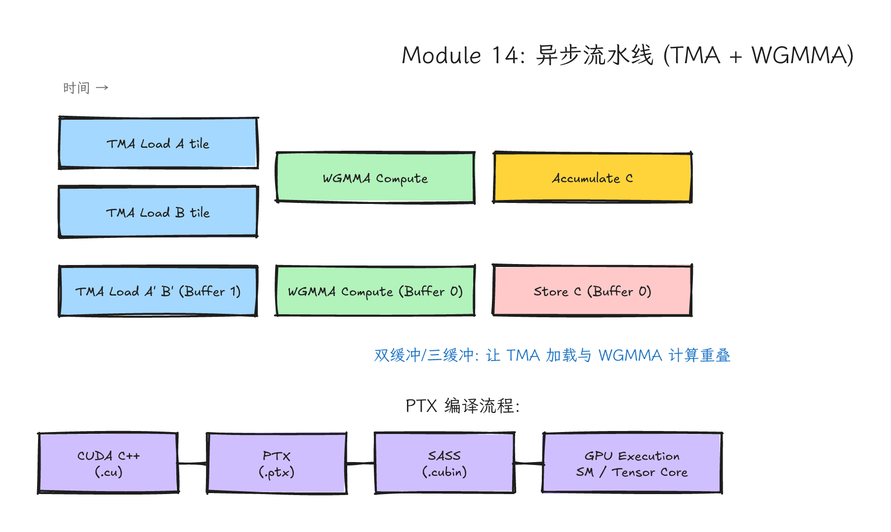
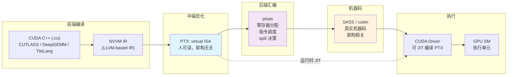
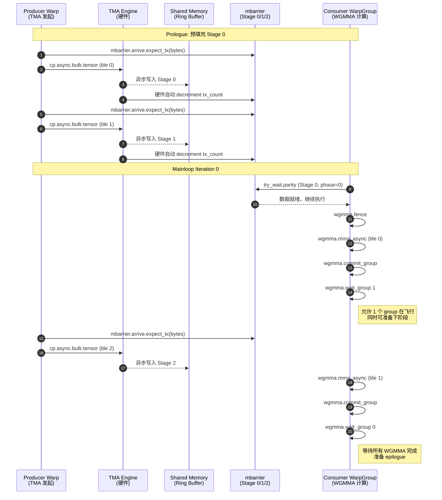
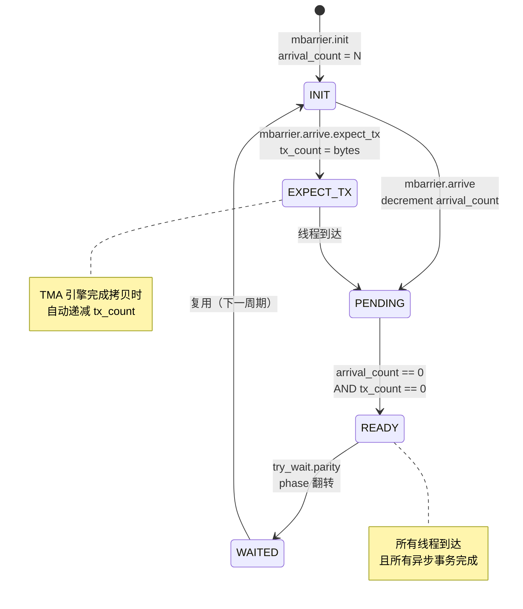
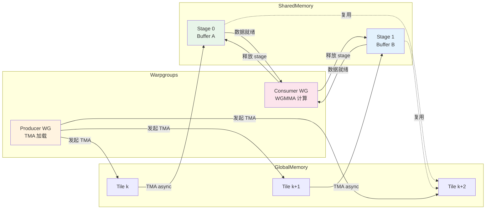

# Module 14: PTX、SASS、WGMMA、TMA 与异步流水线



*图 14-1：global memory、TMA、shared memory、mbarrier、WGMMA 与 epilogue 组成的异步流水线。可编辑源图：[`module-14-async-pipeline-ptx.excalidraw`](../diagrams/module-14-async-pipeline-ptx.excalidraw)。*

> **Level**: Expert
> **Estimated time**: 18–28 小时
> **Prerequisites**: Modules 05, 09, 12, 13
> **Sources**: Current NVIDIA PTX ISA（CUDA 13.x 文档线，PTX ISA 9.x）、Hopper Tuning Guide、Blackwell Tuning Guide、CUDA C++ Programming Guide、CUDA Binary Utilities、Nsight Compute

---

## 学习目标

完成本模块后，你应该能够：

1. 阅读并理解 nvcc 生成的 PTX 输出，识别关键指令族、寄存器分配和内存访问模式。
2. 使用 `cuobjdump` / `nvdisasm` 提取并分析 SASS，判断编译器是否生成了期望的 Tensor Core 指令路径。
3. 理解 `cp.async` 的异步语义，区分 `ca`/`cg` cache 策略、`wait_all`/`wait_group` 的同步差异。
4. 解释 TMA（Tensor Memory Accelerator）的 descriptor 结构、box/tile 概念、swizzle 模式，以及它如何在 cluster 内 multicast。
5. 理解 WGMMA 的 `commit_group` / `wait_group` 异步生命周期，以及 accumulator register 管理对 occupancy 的影响。
6. 使用 mbarrier 构建 producer-consumer 异步流水线，区分 `init`、`arrive.expect_tx`、`try_wait.parity` 的语义。
7. 在真实代码库（CUTLASS 3.x、DeepGEMM、FlashAttention-3）中定位 TMA/WGMMA/mbarrier 的使用模式。
8. 用 Nsight Compute 验证 kernel 是否实际走了 TMA/WGMMA 硬件路径。

---

## 1. 问题背景：为什么必须读懂这一层？

你已经知道 Tensor Core 是高速矩阵乘加单元，也知道 GEMM 高性能来自 tiling 和 pipeline。但到了 Hopper/Blackwell 时代，光靠 CUDA C++ 层面的 `__shared__` + `__syncthreads()` 已经不够了。现代 kernel 工程出现了三个新现实。

版本提示：PTX、SASS mnemonic、Nsight Compute metric 名称和 `cuda::ptx` C++ wrapper 签名都随 CUDA Toolkit、ptxas/nvdisasm 版本和 GPU compute capability 演进。本模块中的 PTX 片段默认是“读码地图”和“语义示意”，只有明确标注为可编译的 C++ 示例才应按源码直接编译；做课程实验时要记录 `nvcc --version`、GPU 型号、`-arch/-code` 目标和库 commit。

- 数据搬运与计算解耦：TMA 让硬件引擎替你搬运多维 tensor tile，你不需要用 128 个线程逐元素做地址计算和加载。
- 计算粒度扩大：WGMMA 以 warpgroup（128 线程）为协作单位，单个 warp 的 `mma.sync` 已无法喂饱 Hopper 的第四代 Tensor Core。
- 同步粒度细化：`__syncthreads()` 是"大锤"，会让整个 block 停下；mbarrier 支持 split arrive/wait，让 producer 和 consumer 在交接点精准同步，其余时间各自工作。

这一课的目标不是让你成为手写 PTX 的专家，而是让你能读懂现代 kernel 的流水线：谁负责搬数据，谁负责等数据，谁负责喂 Tensor Core，谁负责把结果写回。当你需要读 CUTLASS 3.x 的 `collective mainloop`、DeepGEMM 的 JIT kernel、vLLM Blackwell kernel、或 FlashAttention-3 的 Hopper 实现时，这一层知识是必备通行证。

---

## 2. 直觉类比：港口自动化（Port Automation）

传统 tiled GEMM 像工人用手推车把货从码头（global memory）搬到仓库（shared memory），再送去工厂（Tensor Core）加工。每个工人都得自己找路、自己推车、自己卸货，这就是 per-thread `ld.global` / `st.shared` 的模式。

`cp.async`（Ampere+）像有了自动传送带：工人把货放上传送带就可以继续干别的，不用等货到达终点。但传送带仍然是一条一条运，需要工人自己把货整理好放上去。

TMA（Hopper+）更像港口里的大型自动吊装系统：一个调度员（单线程）发出指令，专门的吊装引擎（TMA hardware）把一整集装箱（多维 tensor tile）直接搬进仓库。工人们不需要搬运，只需要在仓库门口等吊装完成通知（mbarrier），然后立即取货加工。

WGMMA 则像多条生产线同时吃这批货。单个 warp（32 人小组）不够大，warpgroup（128 人大队）才能匹配更大的工厂机器。生产线上的工人可以边等下一批货边加工当前这批，因为吊装和加工是异步的。

mbarrier 是交接秩序系统：不是让整个工厂停下来等一辆车到，而是让需要这批货的生产线在指定交接口等，其他生产线继续工作。当吊装完成，mbarrier 自动发通知，等待的生产线立即开工。

---

## 3. 硬件机制

### 3.1 PTX ISA 详解

PTX（Parallel Thread Execution）是 NVIDIA GPU 的虚拟 ISA，定位在高级 CUDA C++ 与真实机器码 SASS 之间。理解 PTX 是阅读编译器输出、手写内联优化、以及使用最新硬件特性（如 TMA、WGMMA）的必经之路。

#### 3.1.1 PTX 语法基础

PTX 采用三地址码格式，每条指令可带类型限定符和修饰符：

```ptx
instruction.modifier.type  dest, src1, src2, src3;
```

- **寄存器**：虚拟寄存器以 `%` 开头，如 `%r1`（32-bit 通用）、`%f1`（32-bit float）、`%p1`（1-bit predicate）、`%rd1`（64-bit 通用）。
- **谓词执行（Predicated Execution）**：PTX 支持用 predicate 寄存器条件执行指令，`@!%p1` 表示 predicate 为 false 时执行。
- **内存空间**：`.global`、`.shared`、`.local`、`.const` 修饰地址空间。
- **向量操作**：`.v2`、`.v4` 表示一次操作多个同类型元素，如 `ld.global.v4.f32`。

**PTX 与 SASS 的区别**：PTX 是虚拟的、架构无关的中间表示；SASS 是 ptxas 针对特定架构生成的真实机器码。PTX 中的虚拟寄存器在 SASS 中被映射到物理寄存器（R0–R255 等），并可能引入 reuse/cache 标记。PTX 中的 `mad` 在 SASS 中可能被展开为 `FFMA` 或调度到 Tensor Core。

#### 3.1.2 常用指令族

| 指令族 | 示例 | 含义 |
|---|---|---|
| 加载/存储 | `ld.global.f32 %f1, [%rd1];` | 从 global memory 加载 float |
| 移动 | `mov.u32 %r1, %r2;` | 寄存器间移动 |
| 算术 | `add.f32 %f1, %f2, %f3;` | 浮点加 |
| 乘加 | `mad.lo.s32 %r1, %r2, %r3, %r4;` | 整数低 32-bit 乘加 |
| FMA | `fma.rn.f32 %f1, %f2, %f3, %f4;` | 浮点 fused multiply-add（只舍入一次） |
| 除法/根号 | `div.rn.f32 %f1, %f2, %f3;` | 浮点除 |
| 三角函数 | `sin.approx.f32 %f1, %f2;` | 快速近似正弦 |
| MMA | `mma.sync.aligned.m16n8k16.row.col.f32.f16.f16.f32 ...` | warp 同步矩阵乘加 |
| 异步拷贝 | `cp.async.ca.shared.global [%rd1], [%rd2], 16;` | Ampere 异步 global→shared |
| mbarrier | `mbarrier.init.shared.b64 [%rd1], 1;` | 初始化 shared memory barrier |

#### 3.1.3 如何从 nvcc 生成 PTX

```bash
# 生成 PTX 文件
nvcc -ptx -o kernel.ptx kernel.cu

# 编译时保留 PTX 到可执行文件中
nvcc -arch=sm_90 -o kernel kernel.cu

# 同时查看 ptxas 的详细输出（寄存器使用、spill 信息）
nvcc -arch=sm_90a --ptxas-options=-v -o kernel kernel.cu

# 从已有可执行文件中提取 PTX
cuobjdump -ptx kernel
```

`--ptxas-options=-v` 会在编译日志中输出每个 kernel 的寄存器用量、shared memory 用量、local memory spill 情况。例如：

```
ptxas info    : 0 bytes gmem
ptxas info    : Compiling entry function 'gemm_kernel' for 'sm_90'
ptxas info    : Function properties for gemm_kernel
    0 bytes stack frame, 0 bytes spill stores, 0 bytes spill loads
ptxas info    : Used 128 registers, 232448 bytes smem, 400 bytes cmem[0]
```

0 bytes spill 是很好的目标，但不要把它机械理解成唯一正确答案。非零 spill 说明编译器把部分寄存器压力转移到了 local memory；local memory 位于每个线程的地址空间，物理上通常经由 L1/L2 访问全局内存层次，延迟和带宽都远不如寄存器。对 Tensor Core kernel 来说，spill 是高优先级红旗：先用 `ptxas -v`、SASS 和 Nsight Compute 量化它，再判断是否已经成为瓶颈。

#### 3.1.4 如何阅读 PTX 输出

拿到 PTX 后，专家按以下顺序扫读：

1. **Kernel 入口**：`.entry` 指令后的参数列表和寄存器声明。
2. **内存访问模式**：找 `ld.global`、`ld.shared`、`st.global`、`st.shared`，看用了多少向量加载（`.v4`、`.v2`）。
3. **算术指令**：找 `fma`、`mad`、`mul`、`add`，看是否生成了 fused multiply-add。
4. **Tensor Core 指令**：找 `mma.sync`（Volta+；Ampere/Ada 常见形态更多）或 `wgmma.mma_async`（Hopper+）。注意：看到 `mma` 不代表性能一定好，还要看数据是否提前到位。
5. **同步指令**：找 `bar.sync`、`membar`、`cp.async`、`mbarrier`。
6. **控制流**：找 `bra`（branch）、`setp`（set predicate）、`call`（函数调用），判断 loop unroll 程度和分支发散情况。

> 关键洞察：PTX 里看到 `mma` 或 `wgmma` 只说明编译器"试图"用 Tensor Core。如果 global-to-shared 搬运跟不上、shared memory layout 不匹配、register pressure 太高、epilogue 写回很差，整体仍然可能慢。PTX 回答"编译成什么"，profiler 回答"运行时瓶颈是什么"。

---

### 3.2 SASS 详解

#### 3.2.1 SASS 与 PTX 的关系

PTX 是虚拟 ISA，SASS（Shader Assembly）是真实机器码。`ptxas`（PTX assembler）负责把 PTX 翻译为 SASS，同时进行大量优化：寄存器分配、指令调度、指令选择、loop unroll、spill 决策。PTX 中一条看似简单的 `mad.f32` 在 SASS 中可能被拆分为 `FFMA`（如果架构支持），或被调度到不同执行单元。

ptxas 的优化作用很关键。同一份 PTX，不同版本的 ptxas 或不同的 `-O` 级别，可能生成截然不同的 SASS。因此，性能调优时"看 PTX 猜性能"不够，必须 dump SASS 确认最终指令。

#### 3.2.2 如何 Dump SASS

```bash
# 从可执行文件提取 SASS
cuobjdump --dump-sass kernel > kernel.sass

# 或者直接看某个 cubin 文件
cuobjdump -sass kernel.cubin

# 使用 nvdisasm（只能处理 cubin，不能处理 host binary）
nvdisasm -g kernel.cubin > kernel.sass

# 提取特定 kernel 的 SASS
cuobjdump -sass -fun gemm_kernel kernel
```

`nvdisasm` 比 `cuobjdump` 提供更多控制流分析（control flow）选项，但只能处理纯 cubin 文件。`cuobjdump` 可以直接处理包含 embedded cubin 的 host 可执行文件。

#### 3.2.3 SASS 指令的基本结构

SASS 指令更接近硬件，每条指令有固定的编码长度（如 8 bytes 或 16 bytes），包含 opcode、predicate、目标寄存器、源寄存器、立即数和 modifier。例如：

```sass
/*0008*/                   IMAD.WIDE.U32 R4, R0, R2, R4;
/*0010*/                   IADD3 R6, P0, R6, R0, RZ;
/*0018*/                   LDGSTS.128 [R10], [R2.64], P0;
```

- `IMAD.WIDE.U32`：整数 wide multiply-add，结果 64-bit。
- `LDGSTS`：Ampere/Hopper 的 global-to-shared 异步加载指令。
- `HMMA.16816`：Ampere FP16 Tensor Core 指令（`mma.sync.m16n8k16` 的 SASS 形式）。
- `QGMMA` / `HGMMA` 等：Hopper WGMMA 路径上常见的 SASS mnemonic，具体名称会随数据类型、指令形态和工具链版本变化。

#### 3.2.4 如何识别 Memory Spill、Loop Unroll、Instruction Scheduling

- Memory Spill：在 SASS 中搜索 `STL`（store to local）或 `LDL`（load from local），或查看 PTX 中的 `.local` 访问。如果能看到大量 `LDL`/`STL` 集中在 loop 内，说明寄存器压力过高。
- Loop Unroll：在 SASS 中如果看到某段代码被物理重复多次，而不是 `BRA` 跳转回 loop header，说明编译器做了 full unroll。检查 unroll 是否过度导致 register bloat。
- Instruction Scheduling：看 SASS 中是否相邻指令之间存在依赖延迟（如一条写寄存器，下一条立刻读同一寄存器）。优秀的 ptxas 会在独立指令之间插入延迟隐藏，通过调度无关指令填充 bubble。如果看到大量 `NOP` 或依赖链很长，说明调度有优化空间。
- Tensor Core 确认：搜索 `HMMA`（Ampere/Ada MMA）、`HGMMA` / `QGMMA` / `IGMMA` / `BGMMA` 等 Hopper WGMMA 相关模式，以及 Blackwell 数据中心路径中的 `tcgen05` / `UMMA` / TMEM 相关模式。SASS mnemonic 不是稳定编程接口，只能作为本机 `nvdisasm` 版本下的证据；如果没看到预期模式，说明编译器可能因数据类型、对齐、目标架构或代码路径限制回退到别的实现。

---

### 3.3 cp.async 深入

`cp.async` 是 Ampere（SM80）引入的异步拷贝指令族，核心思想是：一个线程发起 global-to-shared 拷贝后，不需要在原地等待，可以继续执行后续指令，硬件单元异步完成内存传输。

#### 3.3.1 cp.async.ca / cp.async.cg 的 Cache 策略

```ptx
cp.async.ca.shared.global [%smem_ptr], [%gmem_ptr], 16;  // 缓存到 L2 + L1
cp.async.cg.shared.global [%smem_ptr], [%gmem_ptr], 16;  // 只缓存到 L2
```

- `.ca`（cache all）：数据会进入 L1 cache 和 L2 cache，适合后续还会重复访问的数据。
- `.cg`（cache global）：绕过 L1，只缓存到 L2，适合 streaming 数据（如 GEMM 的 A/B tile 通常只读一次）。

#### 3.3.2 cp.async.bulk 的批量异步拷贝

Hopper 扩展了 bulk async copy family。这里要区分两类入口：

- `cp.async.bulk.shared.global`：非 tensor-map 形式，表达较大粒度的 shared/global 异步搬运，可与 mbarrier 或 async group completion 配合。
- `cp.async.bulk.tensor.*`：tensor-map 形式，是 TMA 的典型 PTX 入口。它通过 `CUtensorMap` 描述多维 tensor、stride、box、swizzle 和越界策略，让硬件完成多维地址生成与 shared memory 排布。

所以不要把 `cp.async.bulk` 简单理解成“TMA 的简化版”。更准确地说，它们同属 Hopper 的 bulk asynchronous copy 体系；是否是 TMA，关键看是否使用 `tensor` 形式和 tensor map descriptor。

#### 3.3.3 cp.async.wait_all / cp.async.wait_group 的同步语义

```ptx
cp.async.commit_group;        // 将之前所有 cp.async 打包成一个 group
cp.async.wait_group 0;        // 等待所有 group 完成（N=0）
cp.async.wait_group 1;        // 允许最多 1 个 group 仍在飞行，等待其余完成
cp.async.wait_all;            // 等待所有未完成的 cp.async
```

- `commit_group` 是"关门"：把此前发出的所有 `cp.async` 打包成一个逻辑组。
- `wait_group N` 是"等待"：当前线程会等待，直到它此前提交但尚未完成的 async-copy group 数量 ≤ N。`wait_group` 指令本身不是“边等边算”的窗口；overlap 来自更早发出多个 copy group，在真正消费某个 tile 前安排不依赖该 tile 的计算，并通过 `N>0` 允许更新的 group 继续在后台飞行。

#### 3.3.4 与 __syncthreads() 的对比

| 特性 | `cp.async` + `wait_group` | `__syncthreads()` |
|---|---|---|
| 粒度 | 异步拷贝组 | 整个 block 所有线程 |
| 阻塞范围 | 等待当前线程提交的 async group；跨线程消费仍需额外 block/warp/pipeline 同步 | 所有线程必须到达同一点 |
| overlap | 在 wait 之前和不同 stage 之间安排计算；wait 指令执行期间当前线程会停在等待点 | 线程空转等待 |
| 适用场景 | 预取数据、流水线 stage | 数据全部就绪后的阶段同步 |

`cp.async` 的精髓不是"异步"本身，而是在必须等待之前把有用工作排进去。如果发起 `cp.async` 后立刻 `wait_all`，那就和同步加载没有区别。另一个容易漏掉的细节是：`cp.async.wait_*` 只保证发起线程观察到自己的异步拷贝完成；如果一个线程写入的 shared memory 要被其他线程消费，还必须用 `__syncthreads()`、`cuda::pipeline`、cooperative groups 或更细粒度 barrier 建立跨线程可见性和生命周期约束。

---

### 3.4 TMA 深入

TMA（Tensor Memory Accelerator）是 Hopper（SM90）引入的专用硬件引擎，用于在 global memory 和 shared memory 之间异步搬运多维 tensor tile。与 `cp.async` 相比，TMA 更进一步：一个线程发出指令，硬件引擎完成全部地址计算、跨步（stride）处理、边界检查、swizzle 写入。

#### 3.4.1 TMA 的 Descriptor 结构（Tensor Map）

TMA 的核心数据结构是 `CUtensorMap`（tensor map / descriptor），一个 128-byte 的 opaque 结构，在 host 端通过 CUDA driver API 创建。

```cpp
cuTensorMapEncodeTiled(
    &tensor_map,                // 输出 descriptor
    data_type,                  // 数据类型（如 CU_TENSOR_MAP_DATA_TYPE_FLOAT16）
    rank,                       // 维度数（1D 到 5D）
    global_address,             // global memory 基地址
    global_dimensions,          // 每维总大小（元素数）
    global_strides,             // 每维字节跨步（stride）
    box_dimensions,             // 每次拷贝的 tile 大小（元素数）
    element_strides,            // 元素间步长（通常全 1）
    interleave,                 // 交织模式（通常 NONE）
    swizzle,                    // swizzle 模式（NONE/32B/64B/128B）
    l2_promotion,               // L2 提升策略
    float_oob_fill              // 越界填充策略
);
```

- rank：TMA 支持 1D 到 5D tensor。GEMM 通常用 2D（M×K, N×K）。
- box_dimensions：即 tile size，每次 TMA 拷贝的数据块。这个大小必须与 shared memory buffer 匹配，且 shared memory 目的地必须 **128-byte 对齐**。
- swizzle：决定数据在 shared memory 中的排布方式。`SWIZZLE_128B` 是常见模式之一，它通过 XOR 重排 bank 地址，帮助匹配特定 2D tile 访问模式，减少或避免 shared memory bank conflict。

#### 3.4.2 TMA 的 Box 和 Tile 概念

- Global tensor：原始的多维数组，尺寸由 `global_dimensions` 描述。
- Box：每次 TMA 搬运的目标数据块，尺寸由 `box_dimensions` 描述。一个 box 可以小于 global tensor 的对应维度。
- Tile：在 kernel 语境中，tile 通常指被加载到 shared memory 中供计算使用的数据块。一个 tile 对应一个 TMA box 的拷贝结果。
- Coordinate：发起 TMA 时传递的坐标（`c0, c1, ...`）是全局 tensor 中的起始索引，不是 tile 索引。例如，若 box 宽度为 128，加载第二个 tile 应传坐标 `128`，不是 `1`。

#### 3.4.3 TMA 与 Shared Memory 的交互

TMA 直接把数据写入 shared memory，不需要线程显式 `st.shared`。这意味着：

1. 目的地 shared memory 必须 128-byte 对齐。
2. 如果启用了 swizzle，TMA 会按 swizzle 模式重排 shared memory 地址。它能为匹配的后续读取模式减少或避免 bank conflict，但不保证任意 warp 访问都无冲突。
3. TMA 完成写入后，通过 mbarrier 通知等待中的线程。

#### 3.4.4 TMA 在 Cluster 内的使用（Distributed Shared Memory）

Hopper 支持 thread block cluster，同一个 cluster 内的多个 block 可以访问彼此的 shared memory（distributed shared memory）。TMA 支持 multicast：一次 TMA 加载可以把同一份数据同时写入 cluster 内多个 block 的 shared memory，减少冗余全局内存读取。

```cpp
// multicast 掩码：指定目标 CTA
cp_async_bulk_tensor_2d_g2s_multicast(
    dst, desc, x, y, bar_ptr, cta_mask
);
```

这在 GEMM 中非常有用：如果多个 block 都需要同一份 A（或 B）tile，一个 TMA multicast 就能服务全部，而不是每个 block 各读一次。

---

### 3.5 WGMMA 深入

WGMMA（WarpGroup Matrix Multiply Accumulate）是 Hopper 的 warpgroup 级 Tensor Core 指令。与 Ampere 的 `mma.sync`（warp 级，32 线程同步执行）相比，WGMMA 有三项根本变化。

1. 协作单位扩大：由 1 个 warp（32 线程）扩大到 1 个 warpgroup（4 个连续 warp，128 线程）。
2. 操作数来源：WGMMA 支持不同 operand 来源模式；Hopper GEMM 常见路径是 `SS` 模式（A/B 都从 SMEM descriptor 读取），也有 `RS` 等变体。把 operand 放在 SMEM descriptor 中可以显著降低 register pressure，但具体可用形态取决于数据类型、tile shape 和 PTX 语法版本。
3. 异步执行：WGMMA 通过 `commit_group` / `wait_group` 管理异步生命周期，不需要 warpgroup 内所有线程在每次 MMA 后同步等待。

#### 3.5.1 wgmma.mma_async 的完整语法

```ptx
wgmma.mma_async.sync.aligned.m64n128k16.f32.f16.f16
    {accum_d0, accum_d1, ...},        // D accumulator registers
    desc_a,                           // A operand descriptor (SMEM)
    desc_b,                           // B operand descriptor (SMEM)
    scale_d,                          // 1 = accumulate, 0 = overwrite
    scale_a, scale_b;                // 缩放因子（某些数据类型需要）
```

- `m64n128k16`：一种常见指令级 tile shape，M=64, N=128, K=16；精确可用 shape、`.row/.col` layout qualifier、scale operand 和 descriptor 要求以当前 PTX ISA 为准。
- `f32.f16.f16`：accumulator D 是 f32，A 和 B 是 f16。
- `desc_a` / `desc_b`：shared memory descriptor，不是普通指针。它编码了 SMEM 地址、swizzle 模式、leading dimension 等。
- `sync.aligned`：要求 warpgroup 内参与线程按 PTX ISA 约定一致执行该 WGMMA 指令；不要把这里的 `aligned` 误读成普通内存地址对齐。

#### 3.5.2 wgmma.commit_group 和 wgmma.wait_group 的使用

```ptx
wgmma.mma_async ...;          // 第 1 条异步 MMA
wgmma.mma_async ...;          // 第 2 条异步 MMA
wgmma.commit_group.sync.aligned;  // 关门：把上面所有未提交的 wgmma 打包成一个 group

// 此时 warpgroup 可以去做别的事（如准备下一批数据）

wgmma.wait_group.sync.aligned 1;   // 等待，直到最多只剩 1 个 group 在飞行
wgmma.wait_group.sync.aligned 0;   // 等待当前所有 group 完成
```

- `commit_group` 不阻塞，只是给硬件一个"可以跟踪这组指令"的信号。
- `wait_group N` 允许最多 N 个 group 仍在飞行。和 `cp.async.wait_group` 一样，wait 指令本身是等待点；流水线收益来自在最终等待前保持若干 WGMMA group 在飞行，并在这些等待点之间安排不依赖结果的工作，例如下一阶段数据准备或 softmax 统计。

#### 3.5.3 Accumulator 的 Register 管理

WGMMA 的 accumulator 逻辑上由 warpgroup 共同持有。对于 `m64n128k16.f32`，输出 tile 有 `64*128` 个 f32，即 8192 个逻辑元素，但这些元素会按照 PTX 定义的 fragment 映射分布到 128 个线程的寄存器中；不要把 8192 个 float 直接理解成单线程或单个寄存器数组。工程上真正重要的是：consumer warpgroup 的每线程 accumulator fragment 很大，会显著抬高 register pressure。这直接影响 occupancy：

- Hopper 每个 SM 有 64K 32-bit 寄存器（即 256KB）。
- 若一个 warpgroup 用 200 个寄存器/线程，128 线程就是 25,600 个寄存器。
- 若一个 block 有 2 个 warpgroup，加上 producer warp，总寄存器需求可能逼近 SM 上限，导致低 occupancy。

CUTLASS 3.x 的解决方案是 `warpgroup_reg_alloc<N>()` / `warpgroup_reg_dealloc<M>()`（PTX: `setmaxnreg`），让 producer warpgroup 减少寄存器分配，consumer warpgroup 增加寄存器分配，动态平衡资源。

#### 3.5.4 WGMMA 与 Shared Memory Descriptor 的配合

WGMMA 从 SMEM 读取 operand 时，需要 SMEM 数据的 layout 与 WGMMA 的硬件期望匹配。这个 layout 通常由 TMA swizzle、CuTe/CUTLASS layout algebra、`ldmatrix`/store helper 或普通线程写入共同决定；不要把它简化成“只要用了某条 store 指令就正确”。CuTe（CUTLASS 的 layout 库）中通过 `make_tma_copy` 和 `make_tiled_mma` 自动计算 compatible layout。

关键公式：WGMMA 的 SMEM descriptor 不只是地址，还包含 `leading_byte_offset`、`swizzle_mode`、`swizzle_key` 等元数据。理解这一点是阅读 Hopper GEMM kernel 的核心门槛。

---

### 3.6 mbarrier 深入

mbarrier（memory barrier）是存储在 shared memory 中的硬件同步对象。Ampere 已经提供硬件加速的 split arrive/wait barrier；Hopper 进一步把 mbarrier 与 TMA、`cp.async.bulk` 和 transaction count 深度绑定。与 CUDA C++ 的 `__syncthreads()` 和 PTX 的 `bar.sync`（named barrier）相比，它的核心优势是拆分 arrive 和 wait，并能精确跟踪异步事务完成。

#### 3.6.1 mbarrier 指令的核心语义

下面的 PTX 片段用于说明语义，不是保证可直接复制的完整签名。`mbarrier.try_wait.parity`、`test_wait`、`arrive.expect_tx` 的精确 operand、predicate 输出和 scope qualifier 会随 PTX 版本与使用形态变化，手写时必须对照当前 PTX ISA 或 `cuda::ptx` wrapper。

```ptx
// 初始化：mbarrier 对象在 smem 中，arrival_count 指定需要到达的线程数
mbarrier.init.shared.b64 [%smem_bar], arrival_count;

// 到达并设置期望事务字节数（配合 TMA 使用）
mbarrier.arrive.expect_tx.shared::cta.b64 [%smem_bar], transaction_bytes;

// 普通到达（不带事务计数）
mbarrier.arrive.shared::cta.b64 [%smem_bar];

// 等待或测试 mbarrier 状态翻转（phase parity；常见于 SM90+ 路径）
mbarrier.try_wait.parity.shared::cta.b64 [%smem_bar], phase_bit;

// 非阻塞测试
mbarrier.test_wait.parity.shared.b64 predicate, [%smem_bar], phase_bit;
```

- arrival_count：初始化时指定。当到达计数从 arrival_count 降到 0，且事务计数（tx_count）也降到 0 时，mbarrier 满足，等待的线程可以继续。
- expect_tx：Producer 在发起 TMA 前调用，告诉 mbarrier"我期望有 X 字节的数据通过 TMA 到达"。TMA 引擎每完成一部分传输，自动递减 tx_count。当 tx_count 归零，说明数据全部到位。
- phase_bit：mbarrier 通过 parity（相位翻转）机制实现复用。初始 phase 为 0，满足后翻转为 1，下次再用时传 1，满足后翻回 0。这样同一个 mbarrier 对象可以在 ring-buffer pipeline 中循环使用。

#### 3.6.2 mbarrier 在 Producer-Consumer 模式中的使用

```
Producer（TMA 发起线程）:           Consumer（WGMMA warpgroup）:
  arrive.expect_tx(bar, bytes)         wait(bar, phase)
  cp.async.bulk.tensor(...)            // 数据就绪，开始计算
  // TMA 引擎自动 decrement tx_count
  // 当 pending==0 && tx==0，bar 满足
```

Producer 不需要等待 TMA 完成，它在发起 TMA 后立即去做别的（如准备下一个 descriptor）。Consumer 在需要数据时 wait on mbarrier。如果数据还没到，Consumer 睡眠，硬件调度器切换去做其他 warpgroup。一旦 TMA 完成，硬件唤醒等待的 Consumer。

#### 3.6.3 mbarrier 与 Async Copy 的结合

mbarrier 不仅用于 TMA，也可用于 `cp.async.bulk`：

```ptx
mbarrier.arrive.expect_tx.shared::cta.b64 [%bar], 4096;
cp.async.bulk.shared.global [%smem], [%gmem], 4096, [%bar];
// 所有线程等待
mbarrier.try_wait.parity.shared::cta.b64 [%bar], 0;
```

`cp.async.bulk` 自带 mbarrier completion 机制，比 `cp.async` + `wait_group` 更精细，因为 mbarrier 可以区分"事务是否完成"和"线程是否到达"。

---

### 3.7 异步流水线设计

#### 3.7.1 双缓冲（Double Buffering）与三缓冲（Triple Buffering）

在多 stage pipeline 中，shared memory 被划分为多个 buffer（stage）。每个 stage 在一个时刻要么被 producer 填充，要么被 consumer 读取，不会同时读写。

- Double buffering（2 stages）：最简单。Producer 填充 stage 1 时，Consumer 读取 stage 0。每轮交换。要求：TMA 延迟 ≤ 计算时间，否则 Consumer 会 starvation。
- Triple buffering（3 stages）：更鲁棒。允许 Producer 领先 Consumer 最多 2 个 stage。即使某次 TMA 稍慢，Consumer 仍有备用数据。代价是占用更多 shared memory。

Hopper SM90 的 shared memory/L1 资源需要区分口径：H100 上每个 SM 的 combined L1/shared pool 为 256KB，其中 CUDA 可编程 shared memory 上限为 228KB/SM，单个 thread block 最多约 227KB。通常能容纳 2-3 个 SMEM stage；CUTLASS 3.x 的默认是 2-4 stage，取决于 tile size、cluster 配置和 epilogue 需求。

#### 3.7.2 Pipeline 的 Stage 设计原则

1. Shared memory 预算：每个 stage = tile_A 大小 + tile_B 大小 + swizzle padding。总 SMEM ≤ 限制（如 228KB）。
2. Stage 数 = 延迟隐藏能力：Stage 越多，Producer 可以领先越远，越能容忍 TMA 延迟抖动。但 stage 数受 SMEM 和寄存器预算限制。
3. Producer 和 Consumer 的速度平衡：
- 若 TMA 慢于 compute：Consumer 经常等待，pipeline 利用率低。应增大 tile size（让每次 TMA 搬运更多数据）或增加 stage 数。
- 若 TMA 快于 compute：Producer 会迅速填满所有 stage，然后等待 Consumer 释放。此时瓶颈在 compute，应优化 WGMMA 效率或增大 K tile 让 compute 更饱满。

#### 3.7.3 现代 Kernel 的 Pipeline 角色分工

现代 Hopper GEMM 通常采用 warp specialization：

- Producer warpgroup（或单个 warp）：负责 TMA 加载 A/B、epilogue 加载 C。
- Consumer warpgroup（1 个或 2 个）：负责 WGMMA 计算和 epilogue 写回 D。
- Scheduler warp：负责分配工作 tile（如 group scheduler 或 persistent kernel 的 tile 轮询）。

Producer 和 Consumer 通过 `MainloopPipeline` 协调，每个 stage 有自己的 mbarrier。CUTLASS 3.x 的 `PipelineTmaAsync` 和 `PipelineAsync` 是这一模式的高度抽象封装。

---

## 4. 代码路径

### 4.1 PTX 内联汇编基础示例

下面展示三个常用场景：读取时钟、FMA、原子加。这些代码以教学理解和阅读为主，不鼓励初学者直接在生产 kernel 中手写复杂 PTX。

```cpp
// ============================================
// 示例 1：读取 GPU 时钟（用于微基准测试）
// ============================================
__device__ inline uint64_t read_clock() {
    uint64_t clock;
    // %0 = 输出时钟值，约束 "l" = 64-bit 寄存器
    asm volatile("mov.u64 %0, %clock;" : "=l"(clock));
    return clock;
}

// 使用方式：测量某段代码的周期数
__global__ void benchmark_kernel(float* out) {
    uint64_t t0 = read_clock();
    // ... 被测代码 ...
    float sum = 0.0f;
    for (int i = 0; i < 100; ++i) sum += i * 0.1f;
    out[threadIdx.x] = sum;
    uint64_t t1 = read_clock();
    if (threadIdx.x == 0) printf("cycles: %lu\n", t1 - t0);
}

// ============================================
// 示例 2：显式 FMA（观察编译器是否已生成）
// ============================================
__device__ inline float fma_inline(float a, float b, float c) {
    float result;
    // fma.rn.f32：round-to-nearest-even 的 fused multiply-add
    // 约束 "f" = 32-bit float 寄存器
    asm volatile("fma.rn.f32 %0, %1, %2, %3;"
                 : "=f"(result)
                 : "f"(a), "f"(b), "f"(c));
    return result;
}

// 注意：现代 nvcc 对 a*b+c 已经会自动生成 FMA，
// 手写 PTX 的主要场景是：控制 rounding mode、
// 使用非默认的 compiler flags、或编译器没有识别的模式。

// ============================================
// 示例 3：原子加（global memory）
// ============================================
__device__ inline void red_add_float(float* addr, float val) {
    // red.global.add.f32 是 reduction 操作，不返回旧值。
    // 适合只需要累加、不需要 atomicAdd 返回值的场景。
    asm volatile("red.global.add.f32 [%0], %1;"
                 :
                 : "l"(addr), "f"(val)   // "l" = 64-bit 地址寄存器
                 : "memory");
}

// 如果需要返回旧值，使用 atom.global.add。
__device__ inline float atomic_add_float(float* addr, float val) {
    float old;
    asm volatile("atom.global.add.f32 %0, [%1], %2;"
                 : "=f"(old)
                 : "l"(addr), "f"(val)
                 : "memory");
    return old;
}
```

**PTX 内联汇编语法要点**：
- `asm volatile("..." : outputs : inputs : clobbers);`
- 输出约束：`"=r"`（通用寄存器，写）、`"=f"`（float 寄存器）、`"=l"`（64-bit 寄存器）。
- 输入约束：`"r"`、`"f"`、`"l"`，不带 `=`。
- `%0, %1, %2` 按操作数列表顺序引用。
- `volatile` 防止编译器删除或重排这段汇编。

### 4.2 cp.async 的完整使用示例（Ampere+）

```cpp
#include <cuda_runtime.h>
#include <cuda/pipeline>
#include <cooperative_groups.h>

// 演示：使用 cuda::pipeline + cuda::memcpy_async 实现 block-level
// global→shared 异步加载，配合双缓冲计算。
// 架构要求：SM80+ (Ampere, Ada, Hopper)
// 教学简化：N 必须是 TILE 的倍数；生产代码应把尾部交给单独 tail path
// 或使用显式边界填充，避免 group-level memcpy_async 越界。

template <int TILE = 128, int STAGES = 2, int TILES_PER_BLOCK = 8>
__global__ void cp_async_pipeline_kernel(
    const float* __restrict__ gmem_in,
    float* __restrict__ gmem_out,
    int N)
{
    // 每个线程处理 1 个 float，block 大小 = TILE
    const int tid = threadIdx.x;
    if (N % TILE != 0) return;

    const int total_tiles = N / TILE;
    const int block_tile_begin = blockIdx.x * TILES_PER_BLOCK;
    if (block_tile_begin >= total_tiles) return;

    int local_tiles = total_tiles - block_tile_begin;
    if (local_tiles > TILES_PER_BLOCK) local_tiles = TILES_PER_BLOCK;

    // 双缓冲共享内存：STAGES * TILE floats。
    // alignas(16) 与 TILE*sizeof(float) 的 16-byte 倍数关系共同满足
    // cuda::aligned_size_t<16> 对 base pointer 和 copy size 的承诺。
    __shared__ alignas(16) float smem_buffer[STAGES][TILE];

    // 创建 block-scope 的异步 pipeline
    namespace cg = cooperative_groups;
    using pipeline = cuda::pipeline<cuda::thread_scope_block>;
    __shared__ cuda::pipeline_shared_state<cuda::thread_scope_block, STAGES> shared_state;
    auto block = cg::this_thread_block();
    pipeline pipe = cuda::make_pipeline(block, &shared_state);

    auto prefetch_tile = [&](int local_tile, int stage) {
        // 这是 block-scope pipeline：所有参与线程必须以相同顺序
        // acquire -> memcpy_async -> commit。memcpy_async 的参数对整个
        // block 一致，表示这个 block 协作搬运一段连续 tile。
        pipe.producer_acquire();
        const int global_base = (block_tile_begin + local_tile) * TILE;
        cuda::memcpy_async(
            block,
            smem_buffer[stage],
            gmem_in + global_base,
            cuda::aligned_size_t<16>(TILE * sizeof(float)),
            pipe
        );
        pipe.producer_commit();
    };

    // ========== Prologue: 填充前 STAGES 个 tile ==========
    #pragma unroll
    for (int s = 0; s < STAGES; ++s) {
        if (s < local_tiles) {
            prefetch_tile(s, s);
        }
    }

    // ========== Mainloop：计算当前 tile，同时预取下一个 tile ==========
    int stage = 0;
    for (int local_tile = 0; local_tile < local_tiles; ++local_tile) {
        int fetch_tile = local_tile + STAGES;

        // ---- Consumer：等待当前 stage 的数据就绪 ----
        pipe.consumer_wait();
        __syncthreads();  // 确保所有线程都看到完整 tile

        // ---- 计算：这里做简单变换（真实场景是 WGMMA）----
        float val = smem_buffer[stage][tid];
        float result = val * 2.0f + 1.0f;  // 示例计算
        __syncthreads();  // 计算完成后，确保没有线程还在读 smem

        // 释放当前 stage，供 producer 复用
        pipe.consumer_release();

        // ---- Producer：预取未来 tile ----
        if (fetch_tile < local_tiles) {
            prefetch_tile(fetch_tile, stage);
        }

        // 写回 global（同步操作，简化示例）
        int out_idx = (block_tile_begin + local_tile) * TILE + tid;
        if (out_idx < N) {
            gmem_out[out_idx] = result;
        }

        // 推进 stage 索引（环形缓冲）
        stage = (stage + 1) % STAGES;
    }
}

// 编译与运行提示：
// nvcc -arch=sm_80 -std=c++17 cp_async_example.cu -o cp_async_example
// launch: grid = ceil_div(N / TILE, TILES_PER_BLOCK), block = TILE
// prerequisite: N % TILE == 0
```

**关键点解析**：
- `cuda::pipeline` 是 C++ 封装，底层对应 `cp.async` + `commit_group` + `wait_group`。
- `producer_acquire` 会等待有空闲 stage（如果 pipeline 满了会阻塞）。
- `consumer_wait` 等待最旧的 stage 完成拷贝。
- `consumer_wait` 表示对应 stage 的异步拷贝已经完成，随后可以读取该 stage 的 shared memory。示例里的 `__syncthreads()` 是为了让整个 block 在消费和复用 ring-buffer stage 前重新对齐；如果 producer/consumer 角色被拆分到不同 warp 或使用更细粒度 barrier，所需同步方式也会不同。

### 4.3 TMA 的 Descriptor 创建和使用（Hopper+，概念骨架）

```cpp
// 这段代码用于解释 TMA descriptor、坐标、mbarrier 和 cp.async.bulk.tensor
// 之间的关系，不是完整可编译程序。真实工程建议从 CUDA Samples、
// CUTLASS/CuTe 的 TMA 示例或当前 CUDA Toolkit 文档中的 cuda::ptx API 签名开始。

#include <cuda.h>
#include <cuda_runtime_api.h>
#include <cuda/ptx>
#include <cuda/barrier>
#include <cassert>
#include <cstdint>
#include <cstdio>

// ============================================
// Host 端：创建 TMA descriptor（2D 示例）
// ============================================
CUtensorMap create_tma_desc_2d(
    float* d_tensor,          // global memory 基地址（device ptr）
    uint64_t gmem_height,     // 全局 tensor 高度
    uint64_t gmem_width,      // 全局 tensor 宽度
    uint32_t smem_height,     // 每次拷贝的 tile 高度（box 高度）
    uint32_t smem_width       // 每次拷贝的 tile 宽度（box 宽度）
)
{
    CUtensorMap tensor_map{};
    constexpr uint32_t rank = 2;

    // global dimensions：注意最快变化维度在前（width, height）
    uint64_t global_size[rank] = {gmem_width, gmem_height};

    // stride：从一行首到下一行首的字节数（注意是 rank-1 个）
    uint64_t global_stride[rank - 1] = {gmem_width * sizeof(float)};

    // box dimensions：每次拷贝的 tile 大小（元素数）
    uint32_t box_size[rank] = {smem_width, smem_height};

    // element stride：每维元素间距（通常全 1）
    uint32_t elem_stride[rank] = {1, 1};

    // 获取 driver API 函数指针（CUDA 12.0+ 推荐方式）
    cudaDriverEntryPointQueryResult driver_status;
    void* fn_ptr = nullptr;
    cudaGetDriverEntryPointByVersion(
        "cuTensorMapEncodeTiled",
        &fn_ptr,
        12000,                      // CUDA 版本 12.0
        cudaEnableDefault,
        &driver_status
    );
    assert(driver_status == cudaDriverEntryPointSuccess);
    auto cuTensorMapEncodeTiled =
        reinterpret_cast<PFN_cuTensorMapEncodeTiled_v12000>(fn_ptr);

    CUresult res = cuTensorMapEncodeTiled(
        &tensor_map,
        CU_TENSOR_MAP_DATA_TYPE_FLOAT32,
        rank,
        d_tensor,
        global_size,
        global_stride,
        box_size,
        elem_stride,
        CU_TENSOR_MAP_INTERLEAVE_NONE,
        CU_TENSOR_MAP_SWIZZLE_NONE,  // 简单起见先用 NONE
        CU_TENSOR_MAP_L2_PROMOTION_NONE,
        CU_TENSOR_MAP_FLOAT_OOB_FILL_NONE
    );
    assert(res == CUDA_SUCCESS);
    return tensor_map;
}

// ============================================
// Device 端：使用 TMA 加载（简化版，展示核心逻辑）
// ============================================
__global__ void tma_load_kernel(
    const __grid_constant__ CUtensorMap tensor_map,  // 推荐传递方式
    float* __restrict__ gmem_out,
    int num_tiles_x,
    int num_tiles_y
)
{
    namespace ptx = cuda::ptx;
    const int tid = threadIdx.x;

    // 128-byte 对齐的 shared memory buffer
    __shared__ alignas(128) float smem_buffer[64][64];  // 示例 tile 64x64

    // mbarrier 在 shared memory 中。这里用 raw storage 表达概念；
    // 真实代码应使用 CUDA C++ transaction-barrier API、cuda::ptx 包装，
    // 或 CUTLASS/CuTe 封装来完成初始化和地址转换。
    __shared__ uint64_t mbar[1];

    // 初始化 mbarrier（仅 thread 0）
    if (tid == 0) {
        // 概念：真实代码会对 shared-memory mbarrier 对象执行初始化，
        // 例如通过 CUDA C++ barrier primitive 或 mbarrier.init PTX。
        // 不要把局部变量上的 cuda::barrier 当成可被 TMA 通知的 shared mbarrier。
    }
    __syncthreads();

    // 使用 CuTe/CUTLASS 时，这些细节被封装；
    // 手写 PTX 时需要直接调用：
    //   mbarrier.arrive.expect_tx
    //   ptx::cp_async_bulk_tensor
    //   mbarrier.try_wait.parity

    // 简化：这里只展示一次 tile 加载的逻辑
    if (tid == 0) {
        int tile_x = blockIdx.x * 64;  // 全局坐标，不是 tile 索引
        int tile_y = blockIdx.y * 64;
        int32_t coords[2] = {tile_x, tile_y};

        // 1. 到达并设置期望事务字节数
        // 底层 PTX: mbarrier.arrive.expect_tx.shared::cta.b64
        uint64_t transaction_bytes = 64 * 64 * sizeof(float);
        // ... 实际调用 CUDA C++ 包装或内联 PTX

        // 2. 发起 TMA 拷贝（2D global → shared）
        // 底层 PTX: cp.async.bulk.tensor.2d.shared::cta.global::tile
        ptx::cp_async_bulk_tensor(
            ptx::space_shared,      // 目的地空间
            ptx::space_global,      // 源空间
            &smem_buffer[0][0],    // smem 目的地
            &tensor_map,           // tensor map descriptor
            coords,                // 全局 tensor 起始坐标
            mbar                   // 完成时通知的 mbarrier
        );
    }

    // 3. 所有线程等待 TMA 完成
    __syncthreads();
    // 实际应使用 mbarrier.try_wait.parity，这里简化

    // 4. 使用数据（示例：写回 global）
    int local_row = tid / 64;
    int local_col = tid % 64;
    if (local_row < 64) {
        gmem_out[blockIdx.y * 64 * num_tiles_x * 64 +
                 blockIdx.x * 64 + local_row * num_tiles_x * 64 + local_col]
            = smem_buffer[local_row][local_col];
    }
}

// 说明：这是 TMA descriptor、mbarrier 和 cp.async.bulk.tensor 关系的概念骨架，
// 不是可直接编译的完整程序。可编译实现请从 CUDA Samples、CUTLASS/CuTe
// TMA 示例或当前 CUDA Toolkit 的 cuda::ptx API 签名开始。
```

**TMA 使用要点**：
- `__grid_constant__` 是推荐传递 tensor map 的方式，编译器确保它是只读且 uniform 的。
- `sm_90a` 中的 `a` 代表 architecture-specific。直接使用某些 Hopper 专属 PTX 指令、CUTLASS kernel 实例或内联汇编路径时，可能需要面向 `sm_90a` 编译；普通 `sm_90` 代码不应默认假设可以访问所有 architecture-specific 指令。实验中应以当前 nvcc、CUTLASS/CuTe 代码路径和官方 target-architecture 说明为准。
- Shared memory 目的地必须 **128-byte 对齐**，否则 TMA 行为未定义。
- 坐标是**全局索引**，不是 tile 编号。例如 tile 宽度为 64，第 2 个 tile 的 x 坐标是 64，不是 1。

### 4.4 WGMMA 的伪代码/概念代码（展示 commit/wait 模式）

```cpp
// ============================================
// WGMMA 概念代码：展示 warpgroup 级 MMA 的异步生命周期
// 这不是可编译代码，而是结构化理解现代 GEMM 的骨架。
// 真实代码需使用 CuTe/CUTLASS 的封装，或手写 PTX。
// ============================================

// 假设：
//   - 1 个 Producer warpgroup（加载 A/B tile）
//   - 1 个 Consumer warpgroup（执行 WGMMA）
//   - Shared memory 已按 TMA swizzle 模式排布好 A/B tile
//   - WGMMA 使用 SS 模式（A from SMEM, B from SMEM）

template <int NUM_STAGES = 2>
__global__ void wgmma_concept_kernel(
    // ... 参数省略
)
{
    // ---------- 阶段 1：初始化 ----------
    // 每个 warpgroup 知道自己的角色
    int warp_group_idx = threadIdx.x / 128;  // 0=producer, 1=consumer
    int lane_idx = threadIdx.x % 128;

    // Consumer 申请更多寄存器用于 accumulator
    if (warp_group_idx == 1) {
        // PTX: setmaxnreg 的 CUTLASS 包装
        // 底层：alloc 256 registers per thread for accumulator
        cutlass::arch::warpgroup_reg_alloc<256>();
    } else {
        // Producer 不需要太多寄存器
        cutlass::arch::warpgroup_reg_dealloc<40>();
    }

    // Shared memory 环形缓冲：A tile[NUM_STAGES], B tile[NUM_STAGES]
    // mbarrier 数组：mbar[NUM_STAGES]
    // 初始化由 producer 的 thread 0 完成

    // ---------- 阶段 2：Prologue（预填充）----------
    if (warp_group_idx == 0) {  // Producer
        for (int s = 0; s < NUM_STAGES; ++s) {
            // 1. 等待 stage s 为空（producer_acquire）
            // 2. arrive.expect_tx(mbar[s], bytes)
            // 3. TMA 加载 A/B tile 到 smem_stage[s]
            // 4. 推进 producer state
        }
    }

    // ---------- 阶段 3：Mainloop（重叠流水线）----------
    int num_k_tiles = K / TILE_K;
    for (int k_tile = 0; k_tile < num_k_tiles; ++k_tile) {
        int consume_stage = k_tile % NUM_STAGES;
        int produce_stage = (k_tile + NUM_STAGES) % NUM_STAGES;

        if (warp_group_idx == 1) {  // Consumer
            // ---- 等待数据就绪 ----
            // mbarrier.try_wait.parity(mbar[consume_stage], phase)
            // 底层：consumer_wait

            // ---- WGMMA fence：确保 warpgroup 的寄存器/SMEM 可见 ----
            // cute::warpgroup_arrive() -> wgmma.fence.sync.aligned
            cute::warpgroup_arrive();

            // ---- 发射一系列 wgmma.mma_async 指令 ----
            // 注意：这里不需要每个 thread 都发，而是 warpgroup 协作
            // CuTe 的 tiled_mma 会帮你分发到正确的 thread
            for (int k_block = 0; k_block < K_BLOCKS; ++k_block) {
                cute::gemm(tiled_mma,
                           tCrA(_,_,_,consume_stage),
                           tCrB(_,_,_,consume_stage),
                           accumulators);
            }

            // ---- 提交 WGMMA group ----
            // cute::warpgroup_commit_batch() -> wgmma.commit_group.sync.aligned
            cute::warpgroup_commit_batch();

            // ---- 等待之前的 WGMMA group 完成（保留 1 个在飞行）----
            // cute::warpgroup_wait<1>() -> wgmma.wait_group.sync.aligned 1
            cute::warpgroup_wait<1>();

            // ---- 释放 stage（consumer_release）----
            // 通知 producer：这个 stage 可以复用了
        }

        if (warp_group_idx == 0) {  // Producer
            // ---- 预取下一个 K tile ----
            // 1. producer_acquire(produce_stage)
            // 2. arrive.expect_tx(mbar[produce_stage], bytes)
            // 3. TMA 加载 A/B tile 到 smem_stage[produce_stage]
            // 4. producer_commit(produce_stage)
        }
    }

    // ---------- 阶段 4：Drain（排空剩余 WGMMA）----------
    if (warp_group_idx == 1) {
        cute::warpgroup_wait<0>();  // 等待所有 group 完成
    }

    // ---------- 阶段 5：Epilogue（写回 D）----------
    if (warp_group_idx == 1) {
            // 1. 将 accumulator 从 registers 通过库封装/线程 store 写入 SMEM 或直接写回
        // 2. TMA store 从 SMEM 写回 global memory
        // 3. 可能包含 scale/bias/activation/quantize
    }
}

// 真实代码中，CuTe 的 cute::warpgroup_arrive / commit_batch / wait
// 对应 PTX 的：
//   wgmma.fence.sync.aligned
//   wgmma.mma_async.sync.aligned.m64n128k16...
//   wgmma.commit_group.sync.aligned
//   wgmma.wait_group.sync.aligned N
```

**WGMMA 关键理解**：
- `wgmma.fence` 确保之前对寄存器/SMEM 的写入对 WGMMA 可见。还要区分 PTX 的 generic proxy 与 async proxy：`cp.async.bulk` / TMA 完成并被 mbarrier 或 async group wait 观察到之后，结果会对 generic proxy 可见；但如果 shared memory 先由普通 thread store 写入、随后要被 TMA store 或 WGMMA 这类 async-proxy 操作读取，通常需要 `fence.proxy.async` 把 generic-proxy 写入发布给 async proxy。
- `commit_group` 不等待，只是标记。真正的等待由 `wait_group` 完成。
- `wait_group 1` 是性能关键：它允许 1 个 group 仍在飞行。正确理解是“在最终需要结果之前，让旧 group 继续飞行，同时安排不依赖它的指令”，例如 FlashAttention-3 中把 softmax online statistics 与 WGMMA 生命周期交错，而不是认为 wait 指令自身会一边等待一边执行任意代码。

### 4.5 mbarrier 的初始化和使用（arrive/wait）

```cpp
#include <cuda_runtime.h>
#include <cuda/barrier>
#include <cuda/std/utility>
#include <cooperative_groups.h>

// ============================================
// cuda::barrier 使用示例：split arrive/wait
// 说明：cuda::barrier 是 CUDA C++ 对底层 mbarrier 的高级封装。
// 架构要求：SM80+ 可使用 asynchronous barrier；
//         SM90+ 在此基础上增加 transaction-count/TMA 相关能力。
// ============================================

template <int BLOCK_SIZE = 256>
__global__ void barrier_arrive_wait_kernel(
    const float* __restrict__ in,
    float* __restrict__ out,
    int n)
{
    namespace cg = cooperative_groups;
    auto block = cg::this_thread_block();
    const int tid = threadIdx.x;
    const int idx = blockIdx.x * blockDim.x + tid;

    __shared__ cuda::barrier<cuda::thread_scope_block> bar;
    __shared__ float smem[BLOCK_SIZE];

    // 初始化必须发生在任何线程参与 barrier 之前。
    if (tid == 0) {
        init(&bar, block.size());
    }
    block.sync();  // 也可以写成 __syncthreads()

    if (idx < n) {
        smem[tid] = in[idx];
    } else {
        smem[tid] = 0.0f;
    }

    // arrive() 只声明“我已经到达本 phase”，不会阻塞线程。
    // 返回的 token 绑定当前 phase，随后必须传给 wait()。
    auto token = bar.arrive();

    // arrive 与 wait 之间可以插入不依赖 smem 完整性的独立工作，
    // 用来隐藏部分同步延迟。不要在 wait 之前读其它线程刚写入的 smem。
    float local = (idx < n) ? in[idx] * 0.5f : 0.0f;

    // wait() 等待本 phase 的 arrival count 归零。
    bar.wait(cuda::std::move(token));

    // 到这里以后，本 block 内所有线程在 arrive 前完成的写入都可见。
    float left = (tid > 0) ? smem[tid - 1] : 0.0f;
    if (idx < n) {
        out[idx] = smem[tid] + left + local;
    }
}
```

**mbarrier 核心语义总结**：
- `init`：设置需要到达的线程数（arrival count）。
- `arrive.expect_tx`：Producer 到达，同时声明"我期望有 X 字节异步事务到达"；CUDA C++ 中应使用 `cuda::device::barrier_arrive_tx()` 或 `cuda::device::barrier_expect_tx()` 这类 transaction-barrier API，不是 `cuda::barrier` 的普通成员函数。
- `arrive`（不带 expect_tx）：普通线程到达，仅递减 arrival count。
- `try_wait`：用于等待或探测（取决于具体 PTX 形态和包装 API）直到（arrival count == 0）且（tx_count == 0）。PTX/C primitive 路径需要显式传入并维护 parity bit；循环复用 mbarrier 时不能把 parity 固定写死。若只想做纯非阻塞轮询，应优先确认 `test_wait` 语义和返回 predicate。
- `test_wait`：非阻塞测试，返回 predicate 指示是否已满足。

---

## 5. 真实系统落点

### 5.1 CUTLASS 3.x 的 TMA/WGMMA Pipeline 实现分析

CUTLASS 3.x 是 NVIDIA 官方高性能线性代数库，其 Hopper GEMM kernel 是现代异步流水线的标杆实现。核心文件结构：

- `include/cutlass/gemm/collective/sm90_mma_array_tma_gmma_ss_warpspecialized.hpp`：CollectiveMma 主循环。
- `include/cutlass/gemm/kernel/sm90_gemm_tma_warpspecialized_pingpong.hpp`：Pingpong 调度 kernel。
- `include/cutlass/pipeline/pipeline_tma_async.hpp`：PipelineTmaAsync 封装。

关键实现模式：

1. Warp Specialization：Producer warpgroup（warp_group_idx == 0）负责 TMA 加载 A/B tile；Consumer warpgroups（1 和 2）负责 WGMMA。Epilogue 也归 Consumer。
2. Register Balancing：Producer 调用 `warpgroup_reg_dealloc<40>()` 减少寄存器占用；Consumer 调用 `warpgroup_reg_alloc<256>()` 增加 accumulator 空间。这通过 PTX `setmaxnreg` 实现。
3. Pipeline 状态机：`PipelineState` 跟踪 `count`（逻辑 tile 索引）和 `index`（ring-buffer 物理索引），`phase` 自动翻转。
4. 多 Pipeline 架构：MainloopPipeline（TMA A/B）、TileSchedulerPipeline（分配工作 tile）、EpiLoadPipeline（加载 C）、EpiStorePipeline（TMA store D）。

阅读 CUTLASS 3.x 的代码时，建议从 `kernel` 文件入手，先理解 warpgroup 角色分工，再深入 `collective` 文件看 `load()` 和 `mma()` 的实现。不要被模板参数淹没，抓住"谁在调用 TMA、谁在调用 WGMMA、谁在 wait mbarrier"这三条主线即可。

### 5.2 DeepGEMM 的 JIT + PTX/SASS Dump 机制

DeepGEMM 是 DeepSeek 开源的现代 LLM Tensor Core kernel 库，当前公开版本覆盖 FP8/FP4/BF16 GEMM、Mega MoE、MQA 等路径，并以简洁、高性能、运行时 JIT 编译著称。其核心工程实践：

- JIT 编译：不预编译所有 (M, N, K, layout, dtype) 组合，而是在首次调用时根据 shape 和设备架构动态生成并编译 kernel 代码。缓存目录默认在 `$HOME/.deep_gemm`。
- 编译器后端：当前 DeepGEMM README 将 NVCC 作为默认 JIT 编译路径；NVRTC 支持在不同 commit 中经历过启用、禁用和重新规划，README 的历史 news 与环境变量列表也可能同时出现。课程实验必须记录 DeepGEMM commit，并以当前代码实际支持的 backend 为准，不要把 `DG_JIT_USE_NVRTC=1` 当成稳定可用路径。
- PTX/SASS Dump：通过环境变量控制：
- `DG_JIT_DUMP_SASS=1`：dump SASS 到文件。
- `DG_JIT_DUMP_ASM=1`：dump PTX 和 SASS。
- `DG_JIT_PTXAS_CHECK=1`：检查 local memory spill。FP8/FP4 Tensor Core kernel 通常对 spill 非常敏感，因为额外的 local load/store 会占用 LD/ST 路径并拉低有效吞吐；影响程度仍要结合 shape、occupancy 和 profiler 判断。
- 后编译优化：DeepGEMM 曾使用 post-compilation SASS pass 重排 FFMA 指令以提升指令级并行；当前 README news 说明 NVCC 12.9 已支持类似 FFMA interleaving，并且 post optimization 不再是主线支持路径。课程实验应记录 `nvcc --version` 和 DeepGEMM commit。

调试 DeepGEMM 的推荐流程：

```bash
DG_JIT_DEBUG=1 \
DG_PRINT_CONFIGS=1 \
DG_JIT_PRINT_COMPILER_COMMAND=1 \
DG_JIT_PTXAS_CHECK=1 \
DG_JIT_DUMP_SASS=1 \
python -c "import deep_gemm; deep_gemm.fp8_gemm_nt(a_pair, b_pair, c)"
```

### 5.3 FlashAttention 的 TMA 使用（Hopper 版本）

FlashAttention-3（Hopper 版本）和 FlashAttention-4（Blackwell 版本）重度依赖 TMA、WGMMA 和 mbarrier。其架构特点：

- CTA 内分工：1 个 Producer warpgroup（加载 Q/K/V tile），2 个 Consumer warpgroups（执行 QK^T 和 PV 的 WGMMA）。
- TMA 加载 Q/K/V：通过 TMA 把 attention 的 Q、K、V 矩阵 tile 从 HBM 异步加载到 SMEM。
- mbarrier 同步：K 和 V 的加载通过独立的 mbarrier stage 管理。Consumer 在 `mbarrier.try_wait` 处等待对应的 K/V tile 就绪。
- WGMMA overlap：FlashAttention-3 使用 `wgmma.wait_group 1` 让 softmax 计算与 WGMMA 重叠。具体来说，在 Consumer warpgroup 等待前一个 QK WGMMA 完成时，CUDA cores 可以并行计算 softmax 的 online statistics。
- FlashAttention-4 / Blackwell DC（SM100）路径：公开材料和 CUTLASS/Blackwell 文档显示，数据中心 Blackwell 引入 TMEM（Tensor Memory）相关编程模型来承载 MMA accumulator，进一步减轻 register pressure，使得更大 tile 和更深 pipeline 成为可能。`tcgen05` 相关指令属于 SM100 Blackwell 的新 Tensor Core/TMEM 路径；它不是 Hopper `wgmma` 的简单放大版，具体 proxy、等待和 accumulator 生命周期要以当前 PTX ISA、CUTLASS 和目标 GPU 为准。RTX Blackwell（如 SM120）是否有同等 kernel 支持，需要按框架和库版本单独确认。

阅读 FlashAttention-3 kernel 源码时，关注 `flash_attn_hopper_kernel` 中的 `mainloop` 和 `softmax` 阶段，看 TMA 加载和 WGMMA 提交如何被 mbarrier 穿插组织。

### 5.4 如何用 Nsight Compute 验证 TMA/WGMMA 路径

Nsight Compute（ncu）是验证 kernel 是否实际走预期硬件路径的工具。

```bash
# 基础采集
ncu --set full -o report ./kernel

# 只关注特定 kernel
ncu --kernel-name gemm_kernel --set full -o report ./kernel

# 查看 TMA 相关指标；metric 名称会随 Nsight Compute 版本和 GPU 架构变化，
# 先用 ncu --query-metrics | rg 'tma|wgmma|tensor' 确认本机可用名称。
ncu --metrics "sm__tma_op_g2s_bulk_tensor.sum,sm__tma_op_s2g_bulk_tensor.sum,sm__wgmma_mma_async_ops_realtime.sum,sm__pipe_tensor_cycles_active.sum,sm__inst_executed_pipe_tensor.sum" \
  ./kernel
```

关键指标解读：

- `sm__tma_op_g2s_bulk_tensor`：TMA global-to-shared 操作数。如果为 0，说明 TMA 没有被触发，可能回退到了 per-thread loads。
- `sm__wgmma_mma_async_ops_realtime`：WGMMA 指令执行次数。如果为 0，说明 warpgroup 没有走 WGMMA 路径，可能回退到了 `mma.sync` 或 CUDA core。
- `sm__pipe_tensor_cycles_active`：Tensor Core pipeline 活跃周期。高值说明 Tensor Core 被充分利用。
- `sm__inst_executed_pipe_tensor`：Tensor Core 指令发射数。对比 CUDA core 指令数，可以判断计算是否以 Tensor Core 为主。
- Memory spill 检查：`launch__registers_per_thread`、`launch__local_mem_bytes_per_thread`、`ptxas -v` 以及 SASS 中的 local load/store 需要一起看。local memory 非零可能来自 spill、线程私有数组或栈帧，不能只靠单个指标下结论。

验证 checklist：

1. 编译时用 `--ptxas-options=-v` 确认 0 spill。
2. PTX/SASS dump 中搜索 `cp.async.bulk.tensor` 和 `wgmma.mma_async`。
3. Nsight Compute 确认 TMA 和 WGMMA 计数器非零。
4. 如果 TMA 计数器为 0，检查目标架构是否匹配当前代码路径（例如某些 Hopper 专属库实例需要 `sm_90a`）、shared memory 是否 128-byte 对齐、descriptor 是否正确初始化，以及 profiler metric 名称是否适用于本机 Nsight Compute 版本。

---

## 6. Lab 实验

### Lab 1：读 PTX，不急着手写

选择一个简单 kernel（如 saxpy、矩阵转置）：

1. 编译时保留 PTX：`nvcc -ptx -o kernel.ptx kernel.cu`。
2. 查找 `ld.global`、`st.global`、`bar.sync`、`mma`、`cp.async` 等指令。
3. 改一个代码结构，例如增加局部数组或 `#pragma unroll`，观察 PTX 是否变化。
4. 用 `--ptxas-options=-v` 对比寄存器用量和 spill 变化。
5. 如果使用 DeepGEMM，开启 `DG_JIT_DUMP_SASS=1` 和 `DG_JIT_PTXAS_CHECK=1` 做读码练习。

**记录模板**：

```markdown
Kernel: ________________________________
Build command: ________________________________
PTX/SASS dump method: ________________________________
Instruction families observed: ________________________________
Unexpected local memory: ________________________________
Connection to profiler (Nsight Compute metric): ________________________________
Architecture: ________________________________
```

### Lab 2：异步流水线纸上推演

不用先写 TMA kernel。先画一个 3-stage pipeline：

- Stage 0: TMA 加载 A/B tile k+2。
- Stage 1: WGMMA 计算 tile k+1。
- Stage 2: Epilogue / store tile k。

回答以下问题：

1. Shared memory 需要几个 buffer？每个 buffer 多大？总 SMEM 占用是否超出限制？
2. mbarrier 在哪里初始化、arrive、wait？phase bit 如何翻转？
3. 如果 TMA 慢于 compute，会发生什么？Consumer 会 starvation 吗？如何缓解？
4. 如果 compute 慢于 TMA，会发生什么？Producer 会 stall 吗？如何缓解？
5. Accumulator 占用 200 个寄存器/线程，一个 warpgroup 需要多少？一个 block 有 2 个 consumer warpgroups，总寄存器需求是多少？Hopper 一个 SM 有 256KB 寄存器文件，这种配置下 occupancy 是多少？

### Lab 3：Nsight Compute 验证

编写或借用一个小型 GEMM kernel（可用 CUTLASS 的 example 或 DeepGEMM 的 example）：

1. 在 Hopper GPU（H100/H800）上运行。
2. 用 Nsight Compute 采集 `sm__tma_op_g2s_bulk_tensor` 和 `sm__wgmma_mma_async_ops_realtime`。
3. 如果 TMA 计数器为 0，分析原因：目标架构是否覆盖所选代码路径需要的 Hopper 特性？shared memory 是否 128-byte 对齐？descriptor 的 `box_dimensions` 是否匹配？Nsight Compute metric 名称是否在本机存在？
4. 对比 `cp.async`（Ampere 风格）和 TMA（Hopper 风格）在同一 shape 下的带宽差异。

---

## 7. 练习阶梯

| 难度 | 练习 | 目标 |
|---|---|---|
| ⭐ | 编译一个简单 kernel 并提取 PTX，识别 `ld`、`st`、`add`、`fma` 指令。 | 熟悉 PTX 阅读流程。 |
| ⭐⭐ | 用 `cuobjdump -sass` 提取 SASS，搜索 `LDGSTS`（Ampere）或 Hopper WGMMA 对应的 `HGMMA`/`QGMMA`/`IGMMA`（取决于 dtype）。 | 建立 PTX→SASS 的映射直觉。 |
| ⭐⭐⭐ | 手写 `cp.async` 双缓冲 kernel，测量有无 pipeline 的性能差异。 | 理解异步拷贝的 overlap 效果。 |
| ⭐⭐⭐⭐ | 在 Hopper 上跑 CUTLASS 3.x 的 `cutlass_gemm` example，修改 `num_stages` 参数，观察性能变化。 | 感受 stage 数对 latency hiding 的影响。 |
| ⭐⭐⭐⭐⭐ | 阅读 DeepGEMM 的 JIT 编译代码，尝试 dump 一个你生成的 shape 的 SASS，并对比 CUTLASS 同 shape 的 SASS。 | 建立真实工程中的代码阅读与对比能力。 |
| ⭐⭐⭐⭐⭐ | 阅读 FlashAttention-3 的 kernel 源码，定位 `tma_load` 和 `wgmma_mma_async` 的调用点，画出 pipeline 时序图。 | 理解生产级 kernel 的复杂流水线。 |

---

## 8. Checkpoint

提交以下内容：

1. **一份 PTX/SASS reading note**：至少包含一个你分析的 kernel 的编译流程、观察到的指令族、以及一个让你意外的发现（如某处预期是 FMA 实际是 ADD+MUL，或预期无 spill 实际有 spill）。
2. **一张 TMA/WGMMA pipeline 图**：可以是手绘或 Mermaid 图，展示 producer、consumer、mbarrier、WGMMA commit/wait 的交互时序。
3. **一个 profiler 指标与 PTX 观察的对应解释**：例如"Nsight Compute 显示本机可用的 TMA 计数器为 0，我在 PTX 中搜索 `cp.async.bulk.tensor` 也发现不存在，原因可能是我选中的 CUTLASS kernel 没走 TMA 路径，或编译目标架构/库实例没有覆盖该 Hopper 特性"。
4. **一段 caveat**：明确说明你的观察适用于哪代 GPU（如"本实验在 H100 SM90 上完成，在 A100 SM80 上 TMA 和 WGMMA 均不可用"）。

---

## 9. 常见错误与误区

| 误区 | 真相 |
|---|---|
| 把 PTX 当成最终机器码。 | PTX 是虚拟 ISA，ptxas 还会做大量优化、寄存器分配、指令调度。关键性能问题必须 dump SASS 确认。 |
| 只看指令名，不看数据 layout 和同步。 | 看到 `wgmma` 不代表性能一定好。如果 SMEM layout 不匹配，WGMMA 可能走 fallback 路径或产生错误结果。 |
| 看到 async 就以为一定 overlap。 | 如果发起 async copy 后立刻 `wait_all`，和同步拷贝没有区别。Overlap 需要 commit/wait 的流水线设计。 |
| 忽略 register pressure 和 shared memory 占用。 | WGMMA accumulator 占大量寄存器，导致低 occupancy。Producer 和 Consumer 需要 `setmaxnreg` 动态平衡。 |
| 在不支持相关硬件的 GPU 上硬套 TMA/WGMMA 教程。 | TMA 和 WGMMA 是 Hopper（SM90）引入的。Ampere 只能用 `cp.async` 和 `mma.sync`。某些 Hopper architecture-specific 路径需要 `sm_90a`，但不要把“所有 Hopper 代码都必须 `sm_90a`”当成无条件规则；以当前代码路径、CUDA 文档和库说明为准。 |
| 认为 TMA 一定比手动加载快。 | TMA 的核心优势是**线程利用率**（一个线程发起，其余线程计算），而不是绝对带宽。在带宽已饱和的场景，手动 vectorized loads 也能接近峰值。 |
| 混淆 coordinate 和 tile index。 | TMA 的坐标是**全局索引**（如 `128`），不是 tile 编号（如 `1`）。传错坐标会导致数据错位或越界。 |
| 忘记 shared memory 的 128-byte 对齐。 | TMA 目的地必须 128-byte 对齐。未对齐会导致静默错误或未定义行为。 |
| 把 `wgmma.commit_group` 当成同步指令。 | `commit_group` 只是"关门标记"，不等待。真正的等待靠 `wait_group`。 |
| 在 distributed setup 中忽视 DeepGEMM JIT cache 的 race condition。 | 多进程同时编译同一个 kernel 并写入共享文件系统会触发 race。安全模式是 rank 0 预热 cache，barrier 后再 fan out。 |

---

## 10. Extension 与进阶

1. Blackwell DC（SM100）新指令：`tcgen05` / TMEM 路径是 SM100 数据中心 Blackwell 的重要变化之一，公开资料将其描述为更异步、更强调 TMEM accumulator 生命周期的 Tensor Core 编程模型。阅读 Blackwell Tuning Guide、PTX ISA 和 FlashAttention-4/CUTLASS 材料，理解它如何改变 pipeline 设计；不要把这部分泛化到所有 Blackwell SKU。
2. CUDA Core 与 Tensor Core 混合编程：现代 kernel 不仅在 WGMMA 和 TMA 之间做 pipeline，还在 WGMMA 间隙用 CUDA core 跑 softmax、activation、element-wise 计算。理解 `wait_group 1` 如何允许这种 overlap。
3. Triton 编译器后端：Triton 的 Hopper backend 也在生成 TMA 和 WGMMA。对比 Triton 生成的 PTX 与手写 CUTLASS 的 PTX，观察编译器自动优化与手工调度的差异。
4. SASS 级优化：CuAsmRL 等项目使用深度强化学习在 SASS 级别做指令调度优化。了解 ptxas 的调度局限，以及何时需要 SASS 级干预。
5. Warp Specialization 的调度策略：CUTLASS 3.x 有 `cooperative` 和 `pingpong` 两种模式。Cooperative 让两个 consumer warpgroups 协作计算同一个 tile；Pingpong 让它们交替计算不同 tile。理解各自的适用场景。
6. Cluster 内 TMA Multicast：在 MoE（Mixture of Experts）的 grouped GEMM 中，多个专家可能共享相同的 weight tile。TMA multicast 可以显著减少 HBM 读取带宽。

---

## 11. Mermaid 图集

### 图 1：PTX/SASS 编译流程（完整版）



### 图 2：TMA/WGMMA 流水线时序（3-Stage）



### 图 3：mbarrier 状态机



### 图 4：Producer-Consumer 双缓冲（Ring Buffer）



---

## 12. 本课要记住的一句话

现代 Tensor Core kernel 的核心不是一条 MMA 指令，而是数据搬运、同步、计算和写回组成的异步流水线。

PTX 让你看到编译器的意图，SASS 让你看到硬件的真实执行，TMA 让你把数据搬运从线程中解放出来，WGMMA 让你把计算粒度扩大到 warpgroup，mbarrier 让你用精确的交接协议替代粗放的 block 级同步。读懂它们，你就读懂了 Hopper/Blackwell 时代高性能计算的本质。

---

## 13. 本课资料来源

- NVIDIA PTX ISA Reference: https://docs.nvidia.com/cuda/parallel-thread-execution/index.html
- NVIDIA Inline PTX Assembly Guide: https://docs.nvidia.com/cuda/inline-ptx-assembly/index.html
- CUDA C++ Programming Guide — Async Copies: https://docs.nvidia.com/cuda/cuda-programming-guide/04-special-topics/async-copies.html
- NVIDIA Hopper Tuning Guide: https://docs.nvidia.com/cuda/hopper-tuning-guide/index.html
- NVIDIA Blackwell Tuning Guide: https://docs.nvidia.com/cuda/blackwell-tuning-guide/index.html
- CUTLASS 3.x Documentation & Source: https://github.com/NVIDIA/cutlass
- CUTLASS Tutorial: TMA + WGMMA Hopper GEMM: https://research.colfax-intl.com/cutlass-tutorial-wgmma-hopper/
- CUTLASS Tutorial: Pipeline Design: https://research.colfax-intl.com/cutlass-tutorial-design-of-a-gemm-kernel/
- DeepGEMM GitHub: https://github.com/deepseek-ai/DeepGEMM
- DeepGEMM Guide (JIT, SASS, PTX): https://agentpedia.codes/blog/deepgemm-guide
- NVIDIA Hopper Tuning Guide, Tensor Memory Accelerator: https://docs.nvidia.com/cuda/hopper-tuning-guide/index.html
- Tensor Memory Accelerator (cuda-oxide): https://nvlabs.github.io/cuda-oxide/advanced/tensor-memory-accelerator.html
- Hopper TMA Tutorial (Colfax): https://research.colfax-intl.com/tutorial-hopper-tma/
- WGMMA Part 2 (CUDA Course H100): https://cudacourseh100.github.io/pages/lesson-7.html
- FlashAttention-4 Blog (Together AI): https://www.together.ai/blog/flashattention-4
- Sim-FA: FlashAttention-3 Simulator (arXiv): https://arxiv.org/html/2605.00555v2
- AsyncSparse: Hopper Architecture Overview (arXiv): https://arxiv.org/html/2604.17834v1
- PTX/SASS Tutorial (eunomia.dev): https://eunomia.dev/others/cuda-tutorial/02-ptx-assembly/
- CUDA Binary Utilities (cuobjdump, nvdisasm): https://docs.nvidia.com/cuda/cuda-binary-utilities/index.html
- CuTeDSL Hopper Pipelining: https://veitner.bearblog.dev/cutedsl-on-hopper-pipelining/
- DeepGEMM source repository and README: https://github.com/deepseek-ai/DeepGEMM
- 大模型基础设施工程 — CUDA 编译链: https://quant67.com/post/llm-infra/03-cuda-stack/03-cuda-stack.html

---

**免责声明与教学立场**：本讲义中的 PTX 代码和概念代码以教学理解和阅读为主，用于建立对现代 GPU 流水线的心智模型。生产环境中，强烈建议优先使用 CUTLASS 3.x、CuTe、DeepGEMM 等经过充分验证的库，或在高级 CUDA C++ 封装（如 `cuda::ptx` namespace、`cuda::barrier`、`cuda::pipeline`）基础上编程。直接手写复杂 PTX 生产 kernel 需要承担架构绑定、编译器版本依赖和可维护性风险。本模块的目标是"读懂"而非"徒手建造"。
