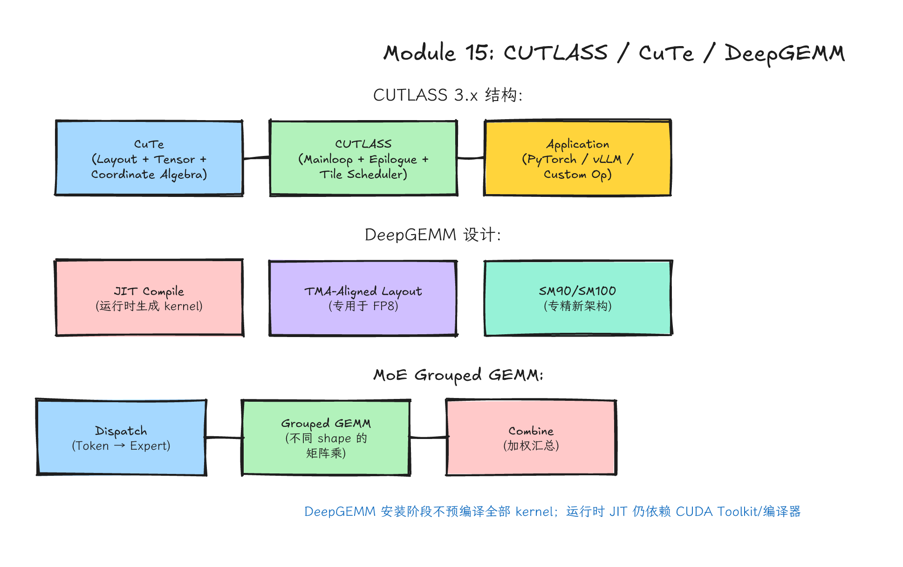
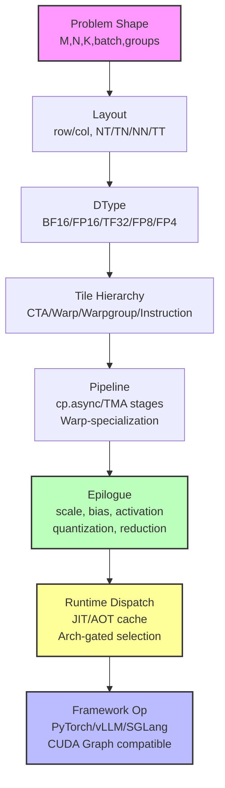
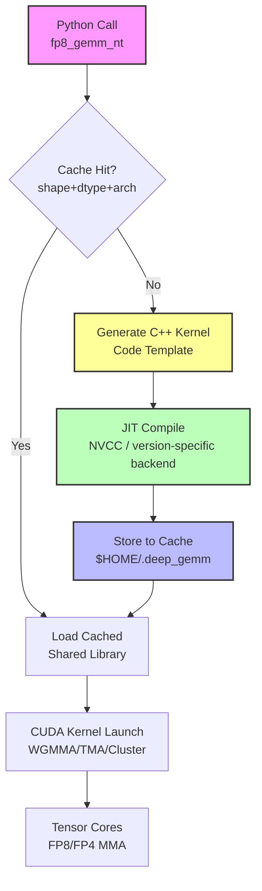

# Module 15: CUTLASS、CuTe、DeepGEMM 与现代 GEMM 工程



*图 15-1：CUTLASS、CuTe、DeepGEMM 与现代 GEMM 工程之间的分工关系。可编辑源图：[`module-15-cutlass-deepgemm.excalidraw`](../diagrams/module-15-cutlass-deepgemm.excalidraw)。*

> **Level**: Expert
> **Estimated time**: 16–24 小时
> **Prerequisites**: Modules 13–14（PTX、TMA、WGMMA、Tensor Core 微架构）
> **Sources**: CUTLASS 4.x, CuTe, DeepGEMM, vLLM/SGLang source, NVIDIA PTX ISA, Hopper/Blackwell Tuning Guide

---

## 学习目标

完成本模块后，你应该能够：

1. **理解现代 GEMM 工程的完整分层**：从 problem shape 到 runtime dispatch，能拆解任何现代 GEMM 库的设计。
2. **读懂 CUTLASS 3.x 的核心代码**：包括 `CollectiveMainloop`、`CollectiveEpilogue`、`CuTe Layout` 和 `Epilogue Visitor Tree`。
3. **掌握 CuTe 的 layout algebra**：用 `Shape`、`Stride`、`Layout`、`Tensor` 描述和变换内存布局，而非手写索引公式。
4. **理解 DeepGEMM 的 JIT 哲学**：知道它为什么轻量、为什么 FP8/FP4 专注、为什么运行时编译比预编译更适合 LLM 场景。
5. **处理 FP8/FP4 低精度 GEMM 的复杂性**：包括 E4M3/E5M2 选择、scaling factor 的多种粒度、精度验证方法。
6. **理解 MoE Grouped GEMM 的特殊需求**：知道 `dispatch` / `combine` 与 `grouped GEMM` 如何协同，为什么不能用普通 batched GEMM 替代。
7. **在真实推理框架中落地 GEMM kernel**：能阅读 vLLM/SGLang 的 CMake 编译和 Python dispatch 逻辑，知道如何接入新 kernel。

---

## 这一课的故事线

上一课你从底层看到了 PTX、TMA、WGMMA。现在问题变成：**真实工程里谁来管理这些复杂性？** 答案通常不是你从零手写所有模板，也不是只调用一个黑箱 `cublasGemmEx`，而是理解现代 GEMM 工程库的分层。

- **CUTLASS/CuTe**：像一套可组合发动机零件库，能定制燃烧室、进气、传动。它教你"怎么造"。
- **DeepGEMM**：像为某类赛车调好的轻量发动机，目标明确，少而精。它展示"怎么专精"。
- **vLLM/SGLang**：像整车平台，决定什么时候装哪台发动机，以及如何和油路、电控、散热配合。它告诉你"怎么落地"。


---

## 类比：造发动机 vs 调发动机 vs 装进整车

| 层级 | 角色 | 核心能力 | 学习重点 |
|------|------|----------|----------|
| **CUTLASS/CuTe** | 零件库 + 图纸 | 可组合的模板化 kernel 构建 | Layout algebra、Tile hierarchy、Collective API |
| **DeepGEMM** | 专精发动机 | 为 LLM 关键 shape 手工优化 | JIT 编译、FP8/FP4、TMA-aligned layout、MoE grouping |
| **vLLM/SGLang** | 整车平台 | 按 architecture/dtype/shape 分发 kernel | CMake 编译、Python dispatch、fallback 策略、CUDA Graph 兼容 |

---

## 1. 问题背景：为什么现代 GEMM 工程如此复杂

### 1.1 从 cuBLAS 到定制化：一条性能鸿沟

`cublasGemmEx` 是黑箱，功能全但不可定制。真实 LLM 推理中有大量非标准需求：

- **低精度**：FP8/FP4 不是"把 float 改成 uint8"，需要 scaling factor、特殊 accumulation、requantization。
- **MoE**：每个 expert 处理不同数量 token，dense GEMM 的规整矩阵假设被打破。
- **Epilogue 融合**：GEMM 后紧跟 bias、GELU/SwiGLU、residual add、LayerNorm。如果不融合，GMEM 读写翻倍。
- **架构演进**：SM80 (Ampere) 主要围绕 `mma.sync` 与 `cp.async`，SM90 (Hopper) 引入 `wgmma` + TMA，SM100 数据中心 Blackwell 则进入 `tcgen05`/UMMA、TMEM 与 FP4/FP6/block-scaled 数据路径。同一份工程要支持多代硬件，但不能把这些路径混成一个通用 kernel。
- **Shape 多变**：LLM 推理中 M (batch×seq_len) 从 1 到几万动态变化，K/N 由模型维度固定。预编译 kernel 无法覆盖所有 shape。

这些需求叠加，使得"调用一个 GEMM 库"变成了"设计一个 GEMM 工程系统"。

### 1.2 现代 GEMM 工程的分层（Mermaid 图 1）



读任何现代 GEMM 库（CUTLASS、DeepGEMM、FlashInfer、TRT-LLM），都可以按这张图拆解。每一层决定性能、精度和可维护性。

---

## 2. 第一层：CUTLASS 详解 —— 可组合发动机零件库

### 2.1 CUTLASS 的历史和版本演进

CUTLASS（CUDA Templates for Linear Algebra Subroutines and Solvers）是 NVIDIA 开源的 GEMM 模板库。它的演进和 GPU 架构同步：

**CUTLASS 1.x (2017–2019)**：
- 面向 Volta (SM70) 和 Turing (SM75)。
- 核心概念：`GemmKernel` = `MmaCore` + `Epilogue`。
- 使用传统的 `tile_iterator` 和 `warp-level matrix multiply`。
- 代码相对简单，但灵活性有限，自定义 layout 需要手写大量索引逻辑。

**CUTLASS 2.x (2019–2022)**：
- 面向 Ampere (SM80) 和早期 Hopper。
- 引入 `TensorOp` 和 `Implicit GEMM`。
- 更复杂的 `MmaMultistage` pipeline，支持 `cp.async` 预取。
- 增加了大量 `Epilogue` 选项，但配置方式仍偏命令式。
- 问题：模板嵌套过深，一个完整 kernel 可能涉及 20+ 个模板参数，编译时间长，可读性差。

**CUTLASS 3.x (2022–至今)**：
- 面向 Hopper (SM90) 和 Blackwell (SM100)。
- **引入 CuTe**。用 `Layout` / `Tensor` / `Shape` / `Stride` 的声明式代数替代手写的迭代器逻辑。
- 新架构：`CollectiveMainloop` + `CollectiveEpilogue` + `GemmUniversal`。
- 支持 `TMA` (Tensor Memory Accelerator)、`Warp-specialization`、Cluster、WGMMA。
- 代码更简洁。例如，修改 tile shape 只需改一个 `Shape<_128,_256,_64>`，不用重写索引逻辑。
- 在官方示例或充分调优的特定 GEMM shape 上，CUTLASS 3.x/4.x 可以接近硬件上限；但利用率数字必须绑定 GPU SKU、dtype、layout、tile、epilogue、batch/shape 和测量方法，不能把某个 benchmark 的 90%+ 结果当作所有场景的默认结论。

**CUTLASS 4.x (2024–至今)**：
- 引入 **CuTe DSL**，一个 Python 层的领域特定语言，允许在 Python 中描述 kernel 并用 JIT 编译到 CUDA。
- 目标是降低 GPU kernel 开发门槛。
- 目前（2026 年中）处于 public beta。

### 2.2 CUTLASS 3.x 的代码结构（Mermaid 图 2）

```mermaid
flowchart TD
    subgraph Host[Host Side]
        H1[Problem Shape<br/>M,N,K,L] --> H2[CollectiveBuilder<br/>Mainloop + Epilogue]
        H2 --> H3[GemmUniversal<br/>Kernel Template]
        H3 --> H4[DeviceGemm<br/>Launch + Workspace]
    end
    
    subgraph Device[Device Side - Kernel]
        D1[GemmUniversal::operator()] --> D2[TileScheduler<br/>分配 CTA tile]
        D2 --> D3[CollectiveMainloop<br/>TMA load A/B<br/>WGMMA compute<br/>Pipeline stages]
        D3 --> D4[CollectiveEpilogue<br/>EVT fusion<br/>TMA store C/D]
    end
    
    H4 --> D1
    
    subgraph CuTe[CuTe Abstraction Layer]
        C1[Layout<br/>Shape + Stride] --> C2[Tensor<br/>Pointer + Layout]
        C2 --> C3[Tiling<br/>tile_to_shape, zipped_divide]
        C3 --> C4[Partitioning<br/>分配给 Threads/CTA]
    end
    
    C4 -.-> D3
    C4 -.-> D4
    
    style D3 fill:#f9f,stroke:#333,stroke-width:2px
    style D4 fill:#bfb,stroke:#333,stroke-width:2px
    style H2 fill:#ff9,stroke:#333,stroke-width:2px
```

### 2.3 CUTLASS 的 kernel 结构：mainloop、epilogue、problem shape、tile shape

不要一上来就钻模板细节。读 CUTLASS 3.x 代码时，先问这六个问题：

1. **Problem shape 是什么？** `cute::Shape<int,int,int,int>` = (M, N, K, L)。L 是 batch 或 group 数。
2. **CTA tile、warp tile、instruction tile 分别多大？** 例如 `Shape<_128,_256,_64>` 是 CTA tile，内部再分到 warpgroup 和 `wgmma.m64n8k16` 这样的指令粒度。
3. **A/B/C 的 layout 是什么？** Row-major (N) 还是 Column-major (T)？`LayoutA = RowMajor` vs `LayoutB = ColumnMajor`。
4. **Mainloop 如何搬运 A/B？** 用 `cp.async` (Ampere) 还是 `TMA` (Hopper/Blackwell)？几 stage pipeline？
5. **Epilogue 做了什么？** 只是 `D = alpha * AB + beta * C`？还是融合了 GELU、bias、residual、quantization？
6. **Target architecture 是什么？** `Sm80`、`Sm90`、`Sm100` 的 `CollectiveBuilder` 和 dispatch policy 完全不同。

### 2.4 CUTLASS 的编译和配置：如何根据 architecture 选择 kernel

CUTLASS 是 header-only 库，但编译时通过模板特化生成不同 kernel。典型 CMake 配置：

```cmake
# 根据 CUDA ARCH 选择编译目标
set(CUDA_ARCH_LIST "80;90;100")

# 编译时生成大量模板实例，所以编译时间很长
# 一个完整的 CUTLASS 库编译可能需要 30+ 分钟
set(CMAKE_CUDA_FLAGS "${CMAKE_CUDA_FLAGS} -Xcompiler=-Wno-deprecated-declarations")

# 使用 CUTLASS 3.x 的 CollectiveBuilder 需要 C++17
set(CMAKE_CXX_STANDARD 17)
```

在 vLLM 等框架中，通常不是编译整个 CUTLASS，而是只编译需要的几个 kernel 实例：

```cmake
# vLLM 的 CMakeLists.txt 节选风格
if(CUDA_ARCH_LIST MATCHES "90")
    list(APPEND CUTLASS_KERNELS 
        scaled_mm_sm90_fp8.cu
        grouped_mm_c3x_sm90.cu
    )
endif()

if(CUDA_ARCH_LIST MATCHES "100")
    list(APPEND CUTLASS_KERNELS
        scaled_mm_sm100_fp8.cu
        scaled_mm_sm100_fp4.cu
    )
endif()
```

### 2.5 精品代码 1：CUTLASS 3.x GEMM 调用示例（简单但完整）

下面是一个教学用的 CUTLASS 3.x GEMM 调用示例。注意：真实代码需要完整 CUTLASS 环境，这里以阅读和理解为主。

```cpp
// ============================================================
// 教学示例：CUTLASS 3.x 的 FP16 GEMM 调用（Host 侧）
// 编译：需要与该 CUTLASS 版本兼容的 CUDA Toolkit + C++17
// 目的：展示 CollectiveBuilder 的配置方式，无需手写 kernel
// ============================================================

#include <cute/tensor.hpp>          // CuTe 核心
#include <cutlass/gemm/collective/collective_builder.hpp>
#include <cutlass/epilogue/collective/collective_builder.hpp>
#include <cutlass/gemm/kernel/gemm_universal.hpp>
#include <cutlass/gemm/device/gemm_universal_adapter.h>

// 1. 定义数据类型和 problem shape
using ElementA = cutlass::half_t;     // FP16
using ElementB = cutlass::half_t;
using ElementC = cutlass::half_t;
using ElementD = cutlass::half_t;
using ElementAccumulator = float;     // 累加用 FP32，精度更高
using ElementCompute = float;         // 计算用 FP32

// 2. 定义 Layout（Row-major vs Column-major）
using LayoutA = cutlass::layout::RowMajor;
using LayoutB = cutlass::layout::ColumnMajor;  // B 常为 Column-major，即 K-major
using LayoutC = cutlass::layout::RowMajor;
using LayoutD = cutlass::layout::RowMajor;

// 3. 定义 Tile Shape（CTA 级别）
//    这个例子用 128×128×64 的 CTA tile
using TileShape = cute::Shape<cute::_128, cute::_128, cute::_64>;

// 4. 定义 Cluster Shape（Hopper/Blackwell 支持 CTA cluster）
using ClusterShape = cute::Shape<cute::_1, cute::_1, cute::_1>;  // 单 CTA

// 5. 用 CollectiveBuilder 构建 Mainloop
using CollectiveMainloop = typename cutlass::gemm::collective::CollectiveBuilder<
    cutlass::arch::Sm90,               // 目标架构：Hopper
    cutlass::arch::OpClassTensorOp,    // 使用 Tensor Core
    ElementA, LayoutA, 128,            // A 的类型、layout、alignment
    ElementB, LayoutB, 128,            // B 的类型、layout、alignment
    ElementAccumulator,                // 累加器类型
    TileShape, ClusterShape,           // Tile 和 cluster
    cutlass::gemm::collective::StageCountAuto,  // 自动选择 pipeline stage
    cutlass::gemm::KernelTmaWarpSpecializedCooperative  // TMA + Warp-specialized
>::CollectiveOp;

// 6. 用 CollectiveBuilder 构建 Epilogue（默认线性组合）
using CollectiveEpilogue = typename cutlass::epilogue::collective::CollectiveBuilder<
    cutlass::arch::Sm90,
    cutlass::arch::OpClassTensorOp,
    TileShape, ClusterShape,
    cutlass::epilogue::collective::EpilogueTileAuto,  // 自动选择 epilogue tile
    ElementAccumulator, ElementCompute,
    ElementC, LayoutC, 128,           // C 的输入
    ElementD, LayoutD, 128,           // D 的输出
    cutlass::epilogue::TmaWarpSpecialized,           // Epilogue 也用 TMA
    cutlass::epilogue::fusion::LinearCombination<     // D = alpha * AB + beta * C
        ElementD, 128, ElementCompute, ElementAccumulator>
>::CollectiveOp;

// 7. 组装 Kernel
using GemmKernel = cutlass::gemm::kernel::GemmUniversal<
    cute::Shape<int, int, int, int>,   // ProblemShape [M, N, K, L]
    CollectiveMainloop,
    CollectiveEpilogue
>;

// 8. 用 DeviceGemm 封装启动逻辑
using Gemm = cutlass::gemm::device::GemmUniversalAdapter<GemmKernel>;

// 9. Host 侧调用（简化版）
void run_gemm(
    ElementA* a_ptr, ElementB* b_ptr,
    ElementC* c_ptr, ElementD* d_ptr,
    int M, int N, int K,
    float alpha, float beta
) {
    // 构造 stride（以元素为单位的步长）
    auto stride_A = cutlass::make_cute_packed_stride(
        LayoutA{}, cute::make_shape(M, K));
    auto stride_B = cutlass::make_cute_packed_stride(
        LayoutB{}, cute::make_shape(N, K));
    auto stride_C = cutlass::make_cute_packed_stride(
        LayoutC{}, cute::make_shape(M, N));
    auto stride_D = cutlass::make_cute_packed_stride(
        LayoutD{}, cute::make_shape(M, N));
    
    typename Gemm::Arguments arguments {
        cutlass::gemm::GemmUniversalMode::kGemm,  // 普通 GEMM 模式
        cute::make_shape(M, N, K, 1),             // Problem shape
        // Mainloop 参数
        {a_ptr, stride_A, b_ptr, stride_B},
        // Epilogue 参数
        {{alpha, beta}, c_ptr, stride_C, d_ptr, stride_D},
        // 硬件信息
        cutlass::KernelHardwareInfo::DeviceHwInfo{}
    };
    
    Gemm gemm_op;
    size_t workspace_size = Gemm::get_workspace_size(arguments);
    void* workspace = nullptr;  // 实际使用需分配 workspace
    
    gemm_op.initialize(arguments, workspace);
    gemm_op.run();  // 或 gemm_op(arguments, workspace, nullptr);
}
```

**要点**：
- `StageCountAuto`：CUTLASS 根据 smem 大小和 tile shape 自动选择 pipeline stage 数（通常 3-5 阶段）。
- `KernelTmaWarpSpecializedCooperative`：Hopper 的 warp-specialized kernel，一部分 warp 做 TMA load，另一部分做 WGMMA compute。
- `EpilogueTileAuto`：让 epilogue 根据 collective / schedule 选择合适的 tile 划分，通常在 mainloop tile 基础上进一步划分；它是库内启发式/模板决策，不等于对所有 shape 都全局最优。
- `GemmUniversal`：支持 kGemm、kBatched、kGrouped 等模式，同一模板处理不同场景。
- `alignment`（128 = 128 bits = 8 个 FP16）：指定内存对齐要求，TMA 需要 128-bit 对齐以获得最佳性能。

---

## 3. 第二层：CuTe 详解 —— Layout 代数与 Tensor 抽象

### 3.1 为什么需要 CuTe？从 CUTLASS 2.x 的痛点说起

CUTLASS 2.x 中，每种数据访问方式都需要手写索引映射：

```cpp
// CUTLASS 2.x 风格：手动计算索引
int idx = row * ldc + col;  // row-major
// 如果要支持 interleaved、swizzled、blocked 布局，索引公式完全不同
```

CuTe 的核心思想是：**把索引映射变成可组合的数学对象**。你只需要声明 "这个 tensor 是什么 shape、什么 stride"，CuTe 自动处理坐标到内存索引的转换。

> CuTe 的 `Layout` 是从逻辑坐标到物理内存索引的映射函数。`Tensor` = 数据指针 + `Layout`。

### 3.2 CuTe 的 Layout Algebra：如何描述 Tensor 的内存布局

**Layout 的定义**：`Layout = Shape : Stride`

- `Shape`：逻辑坐标的范围，如 `(4, 8)` 表示 4 行 8 列。
- `Stride`：沿每个维度走一步的内存偏移，如 `(8, 1)` 表示 row-major。
- `crd2idx(coord)`：计算 `dot(coord, stride)`，即坐标和 stride 的内积。

CuTe 的 `Shape` 和 `Stride` 可以是**递归的**（hierarchical），例如 `((2, 3), 4)` 表示外层 2×3，内层 4。这可以描述 Tensor Core 的 swizzled shared memory 等复杂硬件布局。

常见布局：

| 布局 | Shape | Stride | 说明 |
|------|-------|--------|------|
| Row-major (M,N) | (M, N) | (N, 1) | C/C++ 标准 |
| Column-major (M,N) | (M, N) | (1, M) | Fortran 标准 |
| Interleaved | (M, N) | (N×Vec, 1) | 向量化访问 |
| Swizzled/Swizzle | 复杂 | 复杂 | 避免 shared memory bank conflict |

### 3.3 CuTe 的核心类型：Shape、Stride、Layout、Tensor、Coord

```cpp
// 3.1 Shape：可以是静态编译期常数，也可以是运行时动态值
using StaticShape = cute::Shape<cute::_4, cute::_8>;  // 编译期已知
cute::Shape<int, int> dynamic_shape(4, 8);           // 运行时决定

// 3.2 Stride：同样支持静态和动态
cute::Stride<cute::_8, cute::_1> static_stride;       // Row-major stride
cute::Stride<int, int> dynamic_stride(8, 1);

// 3.3 Layout：Shape + Stride
auto layout = cute::make_layout(
    cute::make_shape(4, 8),    // Shape
    cute::make_stride(8, 1)    // Stride -> Row-major
);

// 也可以用 declarative 语法：
auto layout2 = cute::Layout<cute::Shape<cute::_4, cute::_8>,
                               cute::Stride<cute::_8, cute::_1>>{};

// 3.4 Tensor：Pointer + Layout
float data[32];
auto tensor = cute::make_tensor(data, layout);

// 访问：tensor(i, j) 会自动计算 layout(i, j) 并索引到 data
float val = tensor(1, 2);  // 等价于 data[1*8 + 2] = data[10]
```

### 3.4 Layout 的组合与变换：tiling、partitioning、composition

CuTe 最强大的能力是 layout 的组合：

```cpp
// 4.1 Tiling：把一个大 tensor 切成小 tile
auto big_layout = cute::make_layout(cute::make_shape(128, 256));
auto tile_shape = cute::Shape<cute::_32, cute::_64>{};
auto tiled = cute::zipped_divide(big_layout, tile_shape);  // 分成 4×4 个 tile

// 4.2 Partitioning：把 tile 分配给 threads 或 warps
auto thr_layout = cute::Layout<cute::Shape<cute::_8, cute::_4>,
                                cute::Stride<cute::_4, cute::_1>>{};
// 表示 32 个 threads (8×4) 如何覆盖一个 tile

// 4.3 Composition：组合两个 layout
auto layout_a = cute::make_layout(cute::make_shape(4, 8), cute::make_stride(8, 1));
auto layout_b = cute::make_layout(cute::make_shape(2, 2), cute::make_stride(2, 1));
auto composed = cute::composition(layout_a, layout_b);
// composed 的逻辑：先应用 layout_b，再应用 layout_a
```

### 3.5 精品代码 2：CuTe 的 Layout 和 Tensor 操作示例（教学用）

```cpp
// ============================================================
// 教学示例：CuTe Layout Algebra 实践
// 编译：需要 CUDA + CUTLASS 3.x 头文件
// 目的：掌握 Shape、Stride、Layout、Tensor 的基本操作
// ============================================================

#include <cute/tensor.hpp>
#include <cute/layout.hpp>
#include <cute/swizzle.hpp>
#include <iostream>

__host__ void cute_layout_tutorial() {
    using namespace cute;
    
    // ========== 1. 基础 Layout 创建与索引 ==========
    
    // 1.1 创建一个 4×8 的 row-major layout
    auto layout_rm = make_layout(make_shape(4, 8), make_stride(8, 1));
    std::cout << "Row-major layout: " << layout_rm << std::endl;
    // 输出：Layout(4,8):(8,1)  -> 表示 Shape(4,8):Stride(8,1)
    
    // 1.2 坐标到索引的映射
    auto coord = make_coord(2, 3);  // 第 2 行，第 3 列（0-based）
    int idx = layout_rm(coord);      // 或 layout_rm(2, 3)
    std::cout << "coord(2,3) -> index " << idx << std::endl;  // 2*8 + 3 = 19
    
    // 1.3 Column-major layout
    auto layout_cm = make_layout(make_shape(4, 8), make_stride(1, 4));
    std::cout << "Col-major layout: " << layout_cm << std::endl;
    std::cout << "coord(2,3) -> index " << layout_cm(2, 3) << std::endl;  // 2 + 3*4 = 14
    
    // ========== 2. Tensor 的创建与访问 ==========
    
    // 2.1 从主机内存创建 Tensor
    float host_data[32];
    for (int i = 0; i < 32; ++i) host_data[i] = float(i);
    
    auto tensor_a = make_tensor(host_data, layout_rm);
    std::cout << "tensor_a(2,3) = " << tensor_a(2, 3) << std::endl;  // 19.0
    
    // 2.2 Tensor 的切片（Sub-tensor）
    auto tile = cute::local_tile(tensor_a, make_shape(2, 4), make_coord(0, 0));
    // tile 是 tensor_a 的 (0:2, 0:4) 子视图，不拷贝数据
    std::cout << "tile(1,2) = " << tile(1, 2) << std::endl;  // 指向原始 tensor_a(1,2) = 10.0
    
    // ========== 3. Hierarchical Layout（递归 Shape） ==========
    
    // 3.1 描述一个 2×3 的 block，每个 block 内部是 4×4
    // Shape = ((2,3), (4,4))  -> 外层 2×3 个 block，内层每个 block 4×4
    auto hier_shape = make_shape(make_shape(2, 3), make_shape(4, 4));
    auto hier_stride = make_stride(make_stride(12, 4), make_stride(1, 48));
    auto layout_hier = make_layout(hier_shape, hier_stride);
    std::cout << "Hierarchical: " << layout_hier << std::endl;
    
    // 这种 hierarchical layout 用于描述 Tensor Core 的 swizzled memory：
    // 外层描述 tile 在 shared memory 中的排列，内层描述一个 tile 内部的 bank 分布
    
    // ========== 4. Tiling 和 Partitioning ==========
    
    // 4.1 把 128×256 的矩阵切成 32×64 的 tile
    auto big_shape = make_shape(128, 256);
    auto tile_shape = make_shape(32, 64);
    auto tiled_layout = cute::zipped_divide(
        make_layout(big_shape, make_stride(256, 1)),
        tile_shape
    );
    // 结果：有 (128/32) × (256/64) = 4 × 4 = 16 个 tile
    
    // 4.2 把 tile 分配给 32 个 threads (8×4 布局)
    auto thr_layout = make_layout(make_shape(8, 4), make_stride(4, 1));
    auto partitioned = cute::flat_divide(tiled_layout, thr_layout);
    // flat_divide 将 tile 进一步划分给每个 thread，生成每个 thread 负责的坐标集合
    
    // ========== 5. Swizzle（防 bank conflict） ==========
    
    // 5.1 创建 bank-swizzled layout，用于 shared memory
    // B = 3 位 XOR, M = 1, S = 2 -> 经典的 Swizzle<3,1,2>
    auto swizzle = cute::Swizzle<3, 1, 2>{};
    auto layout_swizzled = make_layout(
        make_shape(8, 8),
        make_stride(8, 1),
        swizzle
    );
    // 这个 layout 在访问 column 时通过 XOR 变换地址，避免同一 warp 内 threads
    // 访问同一 shared memory bank
    
    std::cout << "Swizzle layout: " << layout_swizzled << std::endl;
    
    // ========== 6. 与 CUTLASS 3 的集成点 ==========
    
    // 6.1 在 CUTLASS 3 中，SmemLayout 直接用 CuTe Layout 描述
    // 例如：SmemLayoutA = decltype(tile_to_shape(
    //     SmemLayoutAtomA{},
    //     make_shape(shape<0>(TileShape{}), shape<2>(TileShape{}), Int<Stages>{}),
    //     Step<_2, _1, _3>{}));
    
    // 6.2 TMA descriptor 的创建也依赖 CuTe Layout 描述全局内存布局
    // 这样 TMA 才知道如何按特定 pattern 从 GMEM 搬运到 SMEM
}

// 运行：直接在主机端调用（CuTe 大部分是 constexpr/主机端可运行）
int main() {
    cute_layout_tutorial();
    return 0;
}
```

**学习要点**：
- `make_layout` 是 CuTe 的入口。它把 `Shape` 和 `Stride` 打包成一个可调用对象。
- `Tensor` 是零拷贝的 view。`local_tile`、`flat_divide` 等操作都是生成新的 view，不移动数据。
- `Swizzle` 是 shared memory 优化的关键。没有 swizzle，同一 warp 的相邻 threads 可能访问同一 bank，导致串行化。
- Hierarchical shape 是描述复杂硬件布局的利器。例如 `(Warps, Threads_per_warp, Values_per_thread)` 这种三层结构。

---

## 4. 第三层：DeepGEMM 详解 —— 专精赛车的轻量发动机

### 4.1 DeepGEMM 的设计哲学

DeepGEMM 是 DeepSeek 开源的 CUDA kernel library。当前公开版本已经不只是一个 FP8 GEMM demo，而是把 FP8/FP4/BF16 GEMM、grouped GEMM、attention/MQA、Mega MoE 等 kernel 放进同一套运行时 JIT 框架。它代表了与 CUTLASS 截然不同的设计哲学：

| 维度 | CUTLASS | DeepGEMM |
|------|---------|----------|
| 目标 | 通用、可组合 | 专精、高性能 |
| 代码量 | 数十万行模板 | 核心几百行，JIT 生成其余 |
| 编译 | AOT（编译期模板展开） | JIT（运行时编译缓存） |
| 覆盖范围 | 覆盖很多 dtype、layout、shape 和架构，但不是字面意义的“所有” | 重点覆盖 DeepSeek/LLM 关键路径需要的 kernel 家族 |
| 学习曲线 | 陡峭（模板+CuTe） | 平缓（Python API，核心逻辑清晰） |
| 依赖 | 需要完整 CUDA 编译环境 | 安装阶段避免预编译所有 CUDA kernel，但运行时 JIT 仍需要匹配的 CUDA Toolkit、C++20 编译器、PyTorch、CUTLASS/fmt 子模块和目标 GPU。上游 README 当前写的是 SM90/SM100；vLLM vendored 集成路径另有 SM120/SM12x 分支，不能混为同一个支持矩阵 |

DeepGEMM README 的关键点要同时读完整：它强调 kernel 在运行时 JIT 编译、安装阶段不预编译所有 CUDA kernel；但 requirements 仍列出 SM90/SM100 GPU、CUDA Toolkit、C++20 编译器、PyTorch、CUTLASS 和 `{fmt}`。所以“安装轻量”不等于“没有 CUDA 编译环境也能跑”。截至 2026-06-28，README 还说明 SM90 和 SM100 的 scale 格式不同，SM90 使用 FP32 scaling factors，SM100 使用 packed UE8M0 scaling factors。

还有一个容易出错的版本边界：vLLM main 分支把 DeepGEMM 作为 vendored third-party 组件接入，并在 CMake 中为 SM120/SM12x 添加了 CUDA 12.8+/CUDA 13 family-specific 的编译分支；`vllm.utils.deep_gemm` 里也把 SM100/SM120 都纳入 Blackwell scale format 逻辑。教学时应把这件事写成“vLLM 集成路径的支持范围”，而不是反过来说“DeepGEMM 上游 README 已经要求或承诺 SM120”。如果学生独立安装 `deep_gemm`，先以 DeepGEMM 仓库 README 和当前 commit 为准；如果学生在 vLLM 中读码或打包，则以 vLLM 固定的 DeepGEMM commit、CMake 和 wrapper 为准。

### 4.2 DeepGEMM 的 JIT 编译机制：运行时生成和编译 kernel（Mermaid 图 3）



**JIT 为什么适合 LLM kernel？**

1. **Shape 多变**：LLM 推理中 M (batch×seq_len) 从 1 到几万动态变化。预编译 kernel 只能覆盖有限的 shape 组合，JIT 可以为遇到的 shape 生成更专门化的代码；是否最优仍要靠 benchmark 和 profiler 证明。
2. **安装阶段轻量**：DeepGEMM 不在安装阶段预编译所有 GEMM shape，但当前公开 README 仍要求匹配的 CUDA Toolkit、PyTorch、编译器和目标 GPU；有预编译 wheel 时安装更轻，否则会构建 C++ 扩展。
3. **缓存机制**：第一次调用某个 shape 时可能触发 JIT 编译，后续从 `~/.deep_gemm` 加载缓存。编译开销取决于 NVCC/当前 JIT backend、shape、文件系统和缓存命中状态，不应写成固定常数。
4. **调试友好**：支持 `DG_JIT_DUMP_PTX=1`、`DG_JIT_DUMP_SASS=1`、`DG_JIT_DUMP_ASM=1`、`DG_JIT_DEBUG=1`、`DG_JIT_PRINT_COMPILER_COMMAND=1`、`DG_JIT_PTXAS_CHECK=1` 等 JIT/反汇编相关开关。`DG_JIT_USE_NVRTC` 在不同 DeepGEMM commit 中状态变化较大：README 的历史 news 提到过 NVRTC 支持，但后续重构又说明 NVRTC 和 post-compilation SASS optimization 被禁用/不再支持；课程实验应以当前 commit 的 README、代码和环境变量实际行为为准。

### 4.3 DeepGEMM 的 TMA-aligned Layout 要求

DeepGEMM 对输入布局和 scaling factor 布局有严格要求，这是为了最大化 TMA/Tensor Core 效率：

- **数据矩阵 layout**：README 以 `D = C + A @ B` 和 `fp8_gemm_{nt, nn, tn, tt}` 命名解释 layout。SM90 实现主要围绕 NT memory layout（A non-transposed、B transposed）优化；SM100 路径支持 NT/TN/NN/TT，但具体可用 kernel、性能和 alias 行为要以当前版本的 tests 与 `csrc/apis/gemm.hpp` 为准。
- **Scale 矩阵**：scale 不是一个随便广播的标量。DeepGEMM 要求 LHS scaling factor 采用 TMA-aligned 且 transposed 的布局；SM90 需要 FP32 scale，SM100 需要 packed UE8M0 scale。公开工具函数如 `transform_sf_into_required_layout`、`per_token_cast_to_fp8`、`per_block_cast_to_fp8` 等用于把 scale 转成 kernel 需要的布局。
- **对齐与分组**：grouped GEMM 只在 M 轴分组，N/K 通常保持固定；contiguous layout 还要求每个 expert segment 对齐到 GEMM M block size。相关对齐应查询 `get_mk_alignment_for_contiguous_layout()` / `get_theoretical_mk_alignment_for_contiguous_layout()`。
- **SM90 vs SM100 不同**：Hopper (SM90) 和 Blackwell (SM100) 的 TMA descriptor、scale packing、cluster/UMMA 路径不同。DeepGEMM 在 JIT 时根据设备架构和 scale dtype 选择不同代码路径。

> DeepGEMM 把许多 layout 和 scale 约束放在用户接口或前置转换工具里，而不是在 GEMM 主 kernel 内部做昂贵转换。CUTLASS 通过模板和 collective 组合覆盖更宽的通用空间；DeepGEMM 则把公开 API 组织成少量高价值 kernel 家族，并让测试代码清楚展示每种 layout/scale 的准备方式。

### 4.4 DeepGEMM 的 PTX/SASS Dump 和调试机制

DeepGEMM 提供了比大多数库更丰富的调试接口：

```bash
# 环境变量控制调试输出
export DG_JIT_DEBUG=1                  # 显示 JIT 调试信息
export DG_JIT_PRINT_COMPILER_COMMAND=1 # 打印 JIT 编译命令
export DG_JIT_DUMP_PTX=1               # dump PTX
export DG_JIT_DUMP_SASS=1              # dump SASS
export DG_JIT_DUMP_ASM=1               # 同时 dump PTX/SASS
export DG_JIT_PTXAS_CHECK=1            # 检查 ptxas 输出中的 local memory / spill 风险
# 不要默认假设 NVRTC 可用；DG_JIT_USE_NVRTC 的行为随 DeepGEMM commit 变化，
# 若要测试它，先查当前 README / JIT 源码并记录 commit hash。
```

这些调试工具适合教学：可以看到从 Python 调用到 SASS 的完整链条，理解每一层抽象如何落地。

### 4.5 DeepGEMM 的安装和使用（版本敏感）

```bash
# 推荐先阅读当前 README；DeepGEMM 的架构、CUDA 和 PyTorch 要求变化较快。
git clone --recursive https://github.com/deepseek-ai/DeepGEMM.git
cd DeepGEMM

# 截至 2026-06-28，当前 README 的要求包括；未来版本请以仓库 README 为准：
# - SM90 或 SM100 GPU
# - SM90: CUDA 12.3+，推荐 CUDA 12.9+
# - SM100: CUDA 12.9+
# - PyTorch 2.1+，以及 C++ 编译器/子模块依赖
# - Mega MoE 示例还依赖 multi-process launch 和 symmetric memory；当前 README 标注需 PyTorch >= 2.9
#
# vLLM 的 vendored DeepGEMM 集成可能在自己的 CMake 中额外处理 SM120/SM12x；
# 这属于 vLLM 集成支持矩阵，不应直接外推到独立安装的 upstream DeepGEMM。
./install.sh
```

```python
import torch
import deep_gemm

# 检查是否安装成功
print(deep_gemm.__version__)

# 核对当前 Python 绑定暴露了哪些函数。DeepGEMM API 仍在快速演进，
# 教学代码应先以当前 README、tests/*.py、csrc/apis/*.hpp 和 dir(deep_gemm) 为准。
print([name for name in dir(deep_gemm) if "gemm" in name.lower()])
```

### 4.6 精品代码 3：DeepGEMM 的 FP8 GEMM 调用示例（Python）

```python
# ============================================================
# 教学示例：DeepGEMM FP8 GEMM 调用骨架
# 环境：DeepGEMM upstream README 当前要求 SM90/SM100、匹配 CUDA Toolkit 与 PyTorch；
#      vLLM vendored 集成路径可能额外包含 SM120/SM12x，需按 vLLM 固定 commit 验证。
# 目的：展示当前 Python 绑定的核心形态：输入 pair + 显式输出 tensor。
# 注意：这不是脱离 DeepGEMM 测试工具即可复制运行的最小例子；
# 真正可运行代码需要按当前 tests/generators.py 构造 layout 与 scale。
# ============================================================

import torch
import deep_gemm


def quantize_for_teaching_only(x: torch.Tensor):
    """
    只用于讲解 FP8 量化概念，不满足 DeepGEMM 对 TMA-aligned scale layout 的要求。
    真实 DeepGEMM 示例应复用仓库 tests/generators.py 和 deep_gemm.utils 中的 cast/layout 工具。
    """
    max_e4m3 = 448.0
    scale = x.float().abs().max().clamp_min(1e-12) / max_e4m3
    x_fp8 = (x.float() / scale).clamp(-max_e4m3, max_e4m3).to(torch.float8_e4m3fn)
    return x_fp8, scale.reshape(1).to(torch.float32)


def call_deepgemm_fp8_nt(a_fp8, a_scale, b_fp8, b_scale, out):
    """
    DeepGEMM 当前公开绑定的核心形态是：
      fp8_gemm_* / fp8_fp4_gemm_*(a_pair, b_pair, d, c=None, recipe=..., ...)
    其中 a_pair / b_pair 是 (tensor, scale_tensor)，d 是预分配输出。

    注意：实际 scale layout 可能需要 DeepGEMM 提供的 layout utility 转换；
    不同版本的 recipe / compiled_dims 默认值也可能变化，所以生产代码必须先查
    当前安装版本的 README、tests/*.py、csrc/apis/gemm.hpp 和 dir(deep_gemm)。
    """
    if a_scale.numel() == 1 or b_scale.numel() == 1:
        raise RuntimeError(
            "This teaching tensor uses scalar scale and is not a valid DeepGEMM input. "
            "Construct real inputs with DeepGEMM tests/generators.py or deep_gemm.utils "
            "so the scale tensors match the required TMA-aligned layout."
        )

    # 真实调用示意。不同 DeepGEMM 版本的 recipe / recipe_a / recipe_b /
    # disable_ue8m0_cast 默认值可能变化，生产代码必须跟当前 tests 保持一致。
    deep_gemm.fp8_gemm_nt((a_fp8, a_scale), (b_fp8, b_scale), out)
    return out


def demo_fp8_gemm():
    capability = torch.cuda.get_device_capability()
    print(f"Device capability: {capability}")

    if capability[0] not in (9, 10, 12):
        raise RuntimeError(
            "Standalone DeepGEMM README currently targets SM90/SM100; "
            "vLLM vendored DeepGEMM may add SM120/SM12x support. "
            "Check the exact DeepGEMM commit and integration CMake before running."
        )
    if capability[0] == 12:
        raise RuntimeError(
            "This teaching snippet follows the standalone DeepGEMM README path. "
            "For SM120/SM12x, inspect the vLLM-vendored DeepGEMM CMake/wrapper "
            "and copy the matching tests instead of reusing this simplified example."
        )

    M, N, K = 1024, 4096, 4096
    a_src = torch.randn(M, K, dtype=torch.bfloat16, device="cuda")
    b_src = torch.randn(N, K, dtype=torch.bfloat16, device="cuda")

    a_fp8, a_scale = quantize_for_teaching_only(a_src)
    b_fp8, b_scale = quantize_for_teaching_only(b_src)
    out = torch.empty((M, N), dtype=torch.bfloat16, device="cuda")

    print("Teaching-only quantization created; do not feed this scalar-scale pair into DeepGEMM.")
    print("For a real run, copy the layout/scale construction from the current DeepGEMM tests.")
    return


def grouped_gemm_signature_note():
    """
    Grouped GEMM 的当前公开绑定不是 weights list + out_dtype 形式。
    典型签名形态是：
      m_grouped_fp8_gemm_nt_contiguous(a_pair, b_pair, d, grouped_layout, ...)

    其中：
    - a_pair: packed token 输入及其 scale，例如 (a_fp8, a_scale)
    - b_pair: grouped weights 及其 scale，例如 (w_fp8, w_scale)
    - d: 预分配输出 tensor
    - grouped_layout: int tensor，描述每个 group/expert 的 M 维分布

    grouped_layout、scale packing、M/K alignment 必须按照当前 DeepGEMM README、
    tests/test_*.py 和 csrc/apis/gemm.hpp 的要求构造。教学项目应要求学生先读源码，
    再写一层稳定 wrapper，而不是直接假设一个简化 Python API。
    """
    pass


if __name__ == "__main__":
    demo_fp8_gemm()
    grouped_gemm_signature_note()
```

**教学要点**：
- `fp8_gemm_nt` 的 `nt` 表示 A-Normal (row-major), B-Transposed (col-major)。这是 Tensor Core WGMMA 的偏好布局。
- `scale` 可以是标量（per-tensor）、1D（per-token）、或 2D（per-block）。粒度越细，精度越高，但 kernel 越复杂。
- 第一次调用触发 JIT 编译是 DeepGEMM 的标志性特征。教学时可以故意清理 `~/.deep_gemm` 让学生观察这个过程。
- 性能比较时，注意排除量化/反量化开销。`torch._scaled_mm` 是 PyTorch 暴露给内部/低层路径使用的版本敏感接口，可在匹配版本上作为 baseline；生产代码要以当前 PyTorch 文档、源码和实际签名为准。

---

## 5. 第四层：FP8/FP4 低精度 GEMM 工程 —— 精度不是免费的

### 5.1 为什么 FP8 需要 E4M3 和 E5M2 两种格式

FP8 不是单一格式，而是两种互补格式的家族：

| 格式 | 指数位 | 尾数位 | 最大可表示值 | 精度 | 适用场景 |
|------|--------|--------|-------------|------|----------|
| **E4M3** | 4 | 3 | ~448 | 较高 | 前向传播：weights, activations |
| **E5M2** | 5 | 2 | ~57,344 | 较低 | 反向传播：gradients（需要大动态范围） |

**E4M3** 的精度更高（3 位尾数），但动态范围小。适合 weights 和 activations，因为 LLM 中这些值分布相对集中。  
**E5M2** 的动态范围是 E4M3 的 128 倍，但精度更低。适合 gradients，因为反向传播中梯度可能出现极大的 outlier（如 attention 的某些 head）。

> DeepGEMM 当前公开示例/API 主要围绕 FP8 E4M3 输入、显式 scaling factor、以及 BF16/FP16 等输出路径组织；具体 accumulator、promotion、scale packing 和输出 dtype 要看目标 kernel（SM90/SM100、FP8 GEMM、FP8xFP4 Mega MoE、MQA 等）和当前 README/tests。

### 5.2 Scaling Factor 的存储和传递方式

FP8 最大只能表示约 448，必须用 scaling factor 映射真实数值：

```
FP8_value = round(Original_value / scale)
Original_value ≈ FP8_value * scale
```

Scaling factor 的存储方式直接影响 kernel 的内存带宽和复杂度：

**Per-tensor scaling**：一个 tensor 一个 scale 标量。
- 存储：1 个 float32。
- 开销：几乎为零。
- 精度：最差。如果 tensor 内部分布不均，outlier 会压缩大部分值的精度。

**Per-channel / per-token scaling**：每行或每列一个 scale。
- 存储：M 个或 N 个 float32。
- 开销：较小，scale 读取可以合并到 TMA 传输中。
- 精度：较好。DeepGEMM 支持 per-token scaling（对 activation 特别有效）。

**Per-block (blockwise / tilewise) scaling**：每 128×128 或 1×128 的 block 一个 scale。
- 存储：与矩阵大小成正比，但 block 越小存储越多。
- 开销：需要额外的 TMA 传输来读取 scale block。
- 精度：最好。DeepGEMM 的 fine-grained scaling 就是指这个。

**MXFP8 (Microscaling FP8, Blackwell)**：通常按小 block（常见为 32 个元素）共享一个 E8M0/UE8M0 类 scale。Blackwell 数据中心路径对这类 block-scaled 低精度格式提供硬件/库支持；RTX Blackwell 或具体框架 kernel 是否暴露同等能力，需要查当前 CUDA、CUTLASS、cuBLAS/PyTorch/vLLM 文档。
- 存储：每个 scale 是 E8M0 格式（8 位纯指数），非常紧凑。
- 开销：在支持 microscaling 的硬件/库路径里，scale 解码和矩阵指令配合更紧密，软件侧通常不需要像普通 per-block FP8 那样显式处理完整 FP32 scale；实际开销仍取决于 scale packing、layout 转换和 epilogue。
- 精度：接近 per-channel，但硬件效率更高。

### 5.3 Per-tensor vs Per-channel vs Per-block Scaling 的取舍

```
精度：     Per-tensor 通常最低；Per-channel / Per-token / Per-block 更好；MXFP8/MXFP4 要结合 block size、scale 格式和模型分布评估
速度：     普通软件组织下，scale 粒度越细通常越贵；microscaling 在 Blackwell 支持路径中可能更快，但不应脱离具体 kernel 排序
存储：     scale 粒度越细，metadata 越多；E8M0/UE8M0 这类 8-bit scale 能显著降低 metadata，但是否更省要按 block size 计算
硬件支持：  Per-tensor / per-channel / per-block 可由软件组织；MXFP8/MXFP4 这类 microscaling 路径依赖 Blackwell 低精度硬件与库支持，SM100/SM120 要分别确认
```

DeepGEMM 的推荐策略：
- **Weights**：用 per-channel（或 per-block）scaling，因为 weights 是静态的，可以离线计算最优 scale。
- **Activations**：用 per-token scaling，因为不同 token 的数值分布差异大。
- **Blackwell**：优先评估 MXFP8/MXFP4 或 block-scaled 路径，因为新硬件和库开始为这些格式提供专门支持；但 SM100 数据中心和 SM120 RTX 是不同编译目标，是否采用仍要由精度、kernel availability、框架支持和端到端吞吐决定。

### 5.4 FP8 GEMM 的精度验证方法

精度验证不是简单的 `torch.allclose`。FP8 本身有量化误差，需要：

1. **定义 reference**：用 FP32 或 BF16 计算 `matmul(A_dequant, B_dequant)` 作为 gold standard。
2. **定义 tolerance**：
   - 绝对误差：`|out - ref| < threshold`（对接近零的值有效）。
   - 相对误差：`|out - ref| / |ref| < threshold`（对大值有效）。
   - 混合：`|out - ref| < atol + rtol * |ref|`（PyTorch 的 `allclose` 默认公式）。
3. **考虑量化误差**：如果 FP8 量化本身引入的误差是 1%，那么 GEMM kernel 的误差应该 < 0.1% 才合格。
4. **统计检验**：计算 `max_abs_error`、`mean_abs_error`、`rel_error_95th_percentile`。

### 5.5 FP4 的进一步压缩和精度挑战

FP4 只有 4 位，通常用 E2M1（2 位指数，1 位尾数）格式：
- 动态范围更小，精度更粗糙。
- 在 Blackwell 数据中心 SKU 的理论峰值口径下，FP4 Tensor Core 路径通常高于 FP8，但具体倍数必须按 SKU、dense/sparse 口径和库路径查表；实际 kernel 速度还会受 scale 加载、layout 转换、epilogue、访存和调度影响。
- 但 FP4 几乎**必须**用 fine-grained scaling（per-block 或 MXFP4），否则精度无法收敛。
- DeepGEMM 当前 README 已把 FP8、FP4、BF16 GEMM 以及 `fp8_fp4_mega_moe` 等 fused kernel 放在同一套 JIT 库中；FP4 是独立 GEMM 还是 fused MoE 路径可用，要按具体函数名、GPU 架构和 tests 确认。

### 5.6 精品代码 5：低精度 GEMM 的精度验证代码（含 Scaling Factor 处理）

```python
# ============================================================
# 教学示例：FP8 GEMM 精度验证框架
# 目的：展示如何科学地验证低精度 GEMM 的数值正确性
# 适用：DeepGEMM、CUTLASS FP8、PyTorch _scaled_mm 等
# ============================================================

import torch
import numpy as np
from typing import Tuple, Optional

class FP8GemmValidator:
    """
    FP8 GEMM 的精度验证器。
    
    核心思想：
    1. 生成已知分布的随机数据，避免极端 outlier（那是量化器的责任，不是 GEMM 的）
    2. 用 FP32 计算 reference
    3. 考虑 scaling factor 的数值恢复过程
    4. 使用多种统计指标评估误差
    """
    
    def __init__(self, seed: int = 42, device: str = "cuda"):
        torch.manual_seed(seed)
        self.device = device
        
    def generate_test_data(
        self, M: int, N: int, K: int,
        a_distribution: str = "normal",
        b_distribution: str = "normal",
        scale_granularity: str = "per-tensor"
    ) -> Tuple[torch.Tensor, torch.Tensor, torch.Tensor, torch.Tensor, torch.Tensor]:
        """
        生成测试数据，包括 FP8 输入和对应的 scale。
        
        Args:
            scale_granularity: "per-tensor", "per-token", "per-channel"
        
        Returns:
            a_fp8, a_scale, b_fp8, b_scale, reference_fp32
        """
        # 1. 生成 FP32 原始数据（控制分布，避免极端值）
        if a_distribution == "normal":
            a_f32 = torch.randn(M, K, device=self.device) * 0.5
        elif a_distribution == "uniform":
            a_f32 = (torch.rand(M, K, device=self.device) - 0.5) * 2.0
        else:
            raise ValueError(f"Unknown distribution: {a_distribution}")
            
        if b_distribution == "normal":
            b_f32 = torch.randn(N, K, device=self.device) * 0.5
        elif b_distribution == "uniform":
            b_f32 = (torch.rand(N, K, device=self.device) - 0.5) * 2.0
        else:
            raise ValueError(f"Unknown distribution: {b_distribution}")
        
        # 2. 根据粒度计算 scale 并量化到 FP8
        a_fp8, a_scale = self._quantize_to_fp8(a_f32, scale_granularity, dim="a")
        b_fp8, b_scale = self._quantize_to_fp8(b_f32, scale_granularity, dim="b")
        
        # 3. 计算 FP32 reference（注意：用 dequantized 值，而不是原始值）
        #    因为 FP8 量化本身有误差，reference 应该基于量化后的数据
        a_dequant = a_fp8.float() * a_scale
        b_dequant = b_fp8.float() * b_scale
        reference = torch.matmul(a_dequant, b_dequant.t())
        
        return a_fp8, a_scale, b_fp8, b_scale, reference
    
    def _quantize_to_fp8(
        self, x: torch.Tensor, granularity: str, dim: str
    ) -> Tuple[torch.Tensor, torch.Tensor]:
        """
        将 FP32 tensor 量化到 E4M3 FP8，返回 FP8 tensor 和 scale tensor。
        """
        E4M3_MAX = 448.0  # E4M3 可表示的最大值
        
        if granularity == "per-tensor":
            scale = x.abs().max() / E4M3_MAX
            scale = scale.clamp(min=1e-12)  # 避免除零
            x_fp8 = (x / scale).clamp(-E4M3_MAX, E4M3_MAX).round().to(torch.float8_e4m3fn)
            scale_tensor = scale.view(1)  # 标量但保持 tensor 形式
            
        elif granularity == "per-token":
            # A 的 per-token = 每行一个 scale；B 的 per-token 不太常见，这里简化
            if dim == "a":
                # x: [M, K]，每行一个 scale
                scale = x.abs().max(dim=1, keepdim=True)[0] / E4M3_MAX
            else:
                # b: [N, K]，对 weight 做 per-channel（每列一个 scale）
                scale = x.abs().max(dim=0, keepdim=True)[0] / E4M3_MAX
            scale = scale.clamp(min=1e-12)
            x_fp8 = (x / scale).clamp(-E4M3_MAX, E4M3_MAX).round().to(torch.float8_e4m3fn)
            # 保留 [M,1] 或 [1,K] 形状，保证 dequantize 时能按预期广播。
            scale_tensor = scale
            
        elif granularity == "per-channel":
            # 对 A 做 per-column，对 B 做 per-column（沿 K 维）
            scale = x.abs().max(dim=0, keepdim=True)[0] / E4M3_MAX
            scale = scale.clamp(min=1e-12)
            x_fp8 = (x / scale).clamp(-E4M3_MAX, E4M3_MAX).round().to(torch.float8_e4m3fn)
            # 保留 [1,K] 形状，避免 [K] 在不同 layout 下被误广播。
            scale_tensor = scale
            
        else:
            raise ValueError(f"Unknown granularity: {granularity}")
        
        return x_fp8, scale_tensor
    
    def validate(
        self, 
        result: torch.Tensor, 
        reference: torch.Tensor,
        verbose: bool = True
    ) -> dict:
        """
        计算多种误差指标。
        """
        result_f32 = result.float()
        ref_f32 = reference.float()
        
        # 绝对误差
        abs_error = (result_f32 - ref_f32).abs()
        max_abs_error = abs_error.max().item()
        mean_abs_error = abs_error.mean().item()
        
        # 相对误差（避免除零）
        rel_error = abs_error / (ref_f32.abs() + 1e-12)
        max_rel_error = rel_error.max().item()
        mean_rel_error = rel_error.mean().item()
        
        # 95 分位相对误差
        rel_error_flat = rel_error.flatten().cpu().numpy()
        p95_rel_error = np.percentile(rel_error_flat, 95)
        
        # 与 PyTorch 默认 tolerance 比较
        # PyTorch 的 allclose: |a - b| <= atol + rtol * |b|
        atol, rtol = 1e-2, 1e-2  # FP8 的宽松 tolerance
        close = torch.allclose(result_f32, ref_f32, atol=atol, rtol=rtol)
        
        # cosine similarity（衡量方向一致性，对 LLM 很重要）
        cos_sim = torch.nn.functional.cosine_similarity(
            result_f32.flatten(), ref_f32.flatten(), dim=0
        ).item()
        
        metrics = {
            "max_abs_error": max_abs_error,
            "mean_abs_error": mean_abs_error,
            "max_rel_error": max_rel_error,
            "mean_rel_error": mean_rel_error,
            "p95_rel_error": p95_rel_error,
            "allclose_atol_rtol": (atol, rtol, close),
            "cosine_similarity": cos_sim,
        }
        
        if verbose:
            print("=" * 50)
            print("FP8 GEMM Validation Report")
            print("=" * 50)
            print(f"Max absolute error:      {max_abs_error:.6e}")
            print(f"Mean absolute error:     {mean_abs_error:.6e}")
            print(f"Max relative error:      {max_rel_error:.6f}")
            print(f"Mean relative error:     {mean_rel_error:.6f}")
            print(f"95th percentile rel err: {p95_rel_error:.6f}")
            print(f"allclose (atol={atol}, rtol={rtol}): {close}")
            print(f"Cosine similarity:       {cos_sim:.6f}")
            print("=" * 50)
        
        return metrics


def demo_validation():
    """完整演示：生成数据 -> 运行 GEMM -> 验证精度"""
    validator = FP8GemmValidator(seed=42)
    
    M, N, K = 512, 2048, 2048
    
    # 1. 生成数据
    a_fp8, a_scale, b_fp8, b_scale, reference = validator.generate_test_data(
        M, N, K,
        scale_granularity="per-tensor"
    )
    
    # 2. 用 PyTorch _scaled_mm 作为待测 kernel（可用 DeepGEMM 替换）。
    #    注意：torch._scaled_mm 是版本敏感接口，签名和 scale layout 要以当前 PyTorch 为准。
    try:
        result = torch._scaled_mm(
            a_fp8, b_fp8.t(),
            scale_a=a_scale, scale_b=b_scale,
            out_dtype=torch.bfloat16
        )
    except Exception as e:
        print(f"torch._scaled_mm failed: {e}")
        # Fallback：用模拟的 FP8 GEMM（仅用于演示验证框架）
        a_dequant = a_fp8.float() * a_scale
        b_dequant = b_fp8.float() * b_scale
        result = torch.matmul(a_dequant, b_dequant.t()).to(torch.bfloat16)
    
    # 3. 验证
    metrics = validator.validate(result, reference)
    
    # 4. 不同 scale granularity 的对比
    print("\n--- Comparison across scaling granularities ---")
    for gran in ["per-tensor", "per-token", "per-channel"]:
        a_fp8_g, a_scale_g, b_fp8_g, b_scale_g, ref_g = validator.generate_test_data(
            M, N, K, scale_granularity=gran
        )
        try:
            result_g = torch._scaled_mm(
                a_fp8_g, b_fp8_g.t(),
                scale_a=a_scale_g, scale_b=b_scale_g,
                out_dtype=torch.bfloat16
            )
        except Exception:
            a_dequant_g = a_fp8_g.float() * a_scale_g
            b_dequant_g = b_fp8_g.float() * b_scale_g
            result_g = torch.matmul(a_dequant_g, b_dequant_g.t()).to(torch.bfloat16)
        m = validator.validate(result_g, ref_g, verbose=False)
        print(f"{gran:15s}: mean_rel={m['mean_rel_error']:.6f}, "
              f"p95_rel={m['p95_rel_error']:.6f}, cos_sim={m['cosine_similarity']:.6f}")

if __name__ == "__main__":
    demo_validation()
```

**教学要点**：
- `FP8GemmValidator` 体现测试驱动开发：先定义 reference 和 tolerance，再验证 kernel。
- `cosine_similarity` 对 LLM 验证很有用，因为它能捕捉 logits 向量方向是否接近；但 next-token 结果还受 top-k 边界、温度、采样策略和局部 logit 差距影响，不能只用一个 cosine 阈值替代端到端分布验证。
- 不同 scale granularity 的对比：per-token/per-block 往往比 per-tensor 更能适应 outlier，但收益随模型、shape、校准数据和 dtype 变化；存储、带宽和 layout 代价也必须一起测。

---

## 6. 第五层：MoE Grouped GEMM —— 不规则中的规则

### 6.1 MoE 架构中 Token 路由的基本原理

Mixture-of-Experts (MoE) 是 LLM 扩展参数量的关键技术。核心思想：

- 一个 `router` 网络决定每个 token 应该被送到哪些 expert。
- 通常使用 `top-k` 路由：每个 token 送到 k 个专家（k=1 或 2）。
- 每个 expert 是一个标准的 FFN（通常是 SwiGLU 结构）。

这带来的问题是每个 expert 处理的 token 数量不同，取决于路由结果。

### 6.2 Grouped GEMM vs Batched GEMM 的根本区别

```
Batched GEMM：     所有 batch 的 M 相同，N/K 相同，矩阵整齐排列。
                  [B, M, K] @ [B, K, N] -> [B, M, N]
                  
Grouped GEMM：     每个 group 的 M 不同，但 N/K 相同。
                  例如 8 个 expert：
                  Expert 0: M=128, N=4096, K=4096
                  Expert 1: M=256, N=4096, K=4096
                  Expert 2: M=64,  N=4096, K=4096
                  ...
                  
Variable-length GEMM：M 和 K 都可能不同（MoE backward 中的 dW 计算）。
```

为什么 Batched GEMM 不适合 MoE？

1. **Padding 浪费**：如果用 batched GEMM，需要把所有 expert 的 token 数 pad 到最大 M。如果 expert 0 有 128 tokens，expert 7 有 512 tokens，pad 后大量计算浪费在零上。
2. **Load imbalance**：MoE 中 token 分布通常不均匀，某些 expert 会收到更多 token（"hot expert"）。Batched GEMM 无法处理这种 imbalance。
3. **CUDA Graph 不友好**：推理框架常用 CUDA Graph 消除 kernel launch overhead。如果每个 step 的 token 分布不同（M 不同），batched GEMM 的 shape 在变，无法 capture graph。

### 6.3 DeepGEMM 的 Grouped GEMM 实现

DeepGEMM 提供两种 grouped GEMM 布局：

**Contiguous layout**：所有 expert 的 token 在内存中连续拼接。
```
Input: [total_tokens, K]  (total_tokens = sum(tokens_per_expert))
Weight: 每个 expert 一个 [N, K] 矩阵
Output: [total_tokens, N]
```
- 优点：内存连续，TMA 效率高。
- 缺点：需要预先知道每个 expert 的 token 数，需要 `gather` 或 `pack` 的前置 kernel。
- 适用：训练前向、推理 prefill（batch 内所有 token 同时处理）。

**Masked layout**：用一个 mask 指定哪些位置有效。
```
Input: [num_experts, max_tokens_per_expert, K]
Mask:  [num_experts, max_tokens_per_expert]  bool
```
- 优点：shape 固定，不需要前置 gather，可以直接 CUDA Graph capture。
- 缺点：有 padding 浪费，如果 token 分布极不均匀。
- 适用：推理 decode（单个 token 路由，但 CPU 不知道下一步每个 expert 的实时 token 数）。

### 6.4 MoE Dispatch/Combine 与 GEMM 的协同设计（Mermaid 图 4）


**关键洞察**：Dispatch 和 Combine 不是 GEMM 的一部分，但它们决定了 GEMM 的输入/输出布局。工程上必须把它们看作一个整体：

- **通信层**（DeepEP）：把 token 送到 expert 所在 GPU。DeepEP V1 资料常以 NVSHMEM 解释实现；当前 V2 主线切到 NCCL Gin + `ElasticBuffer`，并根据拓扑组合节点内 NVLink/NVSwitch 与跨节点 RDMA/NCCL 路径。
- **布局层**（Dispatch）：决定 token 在内存中的排列，产生 `tokens_per_expert` 数组。
- **计算层**（DeepGEMM）：执行 grouped GEMM。
- **后处理层**（Combine）：按 router weight 加权求和，把结果 scatter 回原始位置。

DeepGEMM 的 `Mega MoE` 把这几层融合成一个 mega-kernel，让 NVLink 通信和 Tensor Core 计算尽量 overlap，从而隐藏通信延迟。这个路径不是普通单进程 GEMM API 的直接扩展；当前 README 的示例要求 multi-process launch、symmetric memory，并标注 PyTorch >= 2.9。

### 6.5 精品代码 4：MoE Grouped GEMM 的概念代码（展示 Dispatch/Combine 与 GEMM 的关系）

```python
# ============================================================
# 教学示例：MoE Grouped GEMM 概念代码
# 目的：展示 dispatch -> grouped GEMM -> combine 的完整数据流
# 注意：这是概念代码，真实系统使用 DeepEP + DeepGEMM
# ============================================================

import torch
import torch.nn.functional as F
from typing import List, Tuple

class MoELayerConceptual:
    """
    MoE 层的概念实现，展示 Grouped GEMM 在整个 MoE pipeline 中的位置。
    
    真实系统（DeepSeek-V3）中：
    - Router 是轻量线性层 + softmax
    - Dispatch 由 DeepEP 处理（节点内 NVLink/NVSwitch、跨节点 RDMA/NCCL Gin，具体取决于拓扑和 DeepEP 版本）
    - Grouped GEMM 由 DeepGEMM 处理（contiguous 或 masked）
    - Combine 也由 DeepEP 处理
    - SwiGLU 可能融合到 GEMM epilogue 中
    """
    
    def __init__(self, num_experts: int, d_model: int, d_ff: int, top_k: int = 2):
        self.num_experts = num_experts
        self.d_model = d_model      # 输入/输出维度
        self.d_ff = d_ff            # Expert 中间层维度（通常为 4×d_model 或 8×d_model）
        self.top_k = top_k
        
        # 每个 expert 有两组权重：up-projection (d_model -> d_ff) 和 down-projection (d_ff -> d_model)
        # 真实模型使用 SwiGLU：实际上有 gate 和 up 两个 projection，再 elementwise 乘
        self.w_up = torch.nn.ParameterList([
            torch.randn(d_ff, d_model) * 0.02 for _ in range(num_experts)
        ])
        self.w_down = torch.nn.ParameterList([
            torch.randn(d_model, d_ff) * 0.02 for _ in range(num_experts)
        ])
        
        # Router：将 token 映射到 expert 选择
        self.router = torch.nn.Linear(d_model, num_experts, bias=False)
    
    def dispatch(self, x: torch.Tensor) -> Tuple[List[torch.Tensor], List[int], torch.Tensor]:
        """
        Dispatch：将 token 路由到 expert。
        
        Args:
            x: [num_tokens, d_model] 输入 tokens
            
        Returns:
            expert_inputs: 每个 expert 分到的 tokens 列表
            tokens_per_expert: 每个 expert 的 token 数
            routing_weights: [num_tokens, top_k] 路由权重
        """
        num_tokens = x.shape[0]
        
        # 1. Router 计算 logits
        router_logits = self.router(x)  # [num_tokens, num_experts]
        
        # 2. Top-k 选择
        topk_weights, topk_indices = torch.topk(
            F.softmax(router_logits, dim=-1), 
            k=self.top_k, 
            dim=-1
        )  # topk_weights: [num_tokens, top_k], topk_indices: [num_tokens, top_k]
        
        # 3. 归一化权重（DeepSeek 使用 shared expert + routed expert 的混合）
        topk_weights = topk_weights / topk_weights.sum(dim=-1, keepdim=True)
        
        # 4. 按 expert 分组（概念实现：真实系统用 DeepEP）
        expert_inputs = []
        tokens_per_expert = []
        
        for e in range(self.num_experts):
            # 找到所有被路由到 expert e 的 token
            mask = (topk_indices == e).any(dim=-1)  # [num_tokens]
            tokens_for_expert = x[mask]  # [num_tokens_for_e, d_model]
            expert_inputs.append(tokens_for_expert)
            tokens_per_expert.append(tokens_for_expert.shape[0])
        
        return expert_inputs, tokens_per_expert, topk_weights, topk_indices
    
    def grouped_gemm_conceptual(
        self, 
        expert_inputs: List[torch.Tensor],
        weights: List[torch.Tensor]
    ) -> List[torch.Tensor]:
        """
        Grouped GEMM：每个 expert 独立执行 matmul。
        
        在真实系统中：
        - 如果 tokens_per_expert 已知且连续：用 DeepGEMM contiguous grouped GEMM
        - 如果 shape 固定但 CPU 不知道分布：用 DeepGEMM masked grouped GEMM
        - 如果 expert 在不同 GPU 上：用 DeepEP + 本地 grouped GEMM
        """
        outputs = []
        for tokens, w in zip(expert_inputs, weights):
            if tokens.shape[0] == 0:
                # 零 token 的 expert 输出空 tensor
                outputs.append(torch.zeros(0, w.shape[0], device=tokens.device))
            else:
                # 标准 matmul: [M, K] @ [K, N] -> [M, N]
                # tokens: [M, d_model], w: [d_ff, d_model] -> need w.t()
                out = torch.matmul(tokens, w.t())
                outputs.append(out)
        return outputs
    
    def combine(
        self,
        expert_outputs: List[torch.Tensor],
        topk_indices: torch.Tensor,
        topk_weights: torch.Tensor,
        num_tokens: int
    ) -> torch.Tensor:
        """
        Combine：按路由权重加权求和，把 expert 输出合并回原始 token 顺序。
        
        真实系统中 DeepEP 使用 all-to-all 把结果从 expert GPU 返回到 token 所在 GPU。
        """
        output = torch.zeros(num_tokens, self.d_model, device=expert_outputs[0].device)
        
        # 记录每个 expert 的当前输出索引
        expert_offsets = [0] * self.num_experts
        
        for i in range(num_tokens):
            for j in range(self.top_k):
                expert_id = topk_indices[i, j].item()
                weight = topk_weights[i, j]
                
                # 获取该 expert 对应此 token 的输出
                out_idx = expert_offsets[expert_id]
                output[i] += weight * expert_outputs[expert_id][out_idx]
                expert_offsets[expert_id] += 1
        
        return output
    
    def forward(self, x: torch.Tensor) -> torch.Tensor:
        """完整 MoE 层前向传播"""
        num_tokens = x.shape[0]
        
        # Step 1: Dispatch
        expert_inputs, tokens_per_expert, topk_weights, topk_indices = self.dispatch(x)
        print(f"Dispatch: tokens_per_expert = {tokens_per_expert}")
        
        # Step 2: Grouped GEMM（up-projection）
        up_proj = self.grouped_gemm_conceptual(expert_inputs, 
                                                [w for w in self.w_up])
        
        # Step 3: SwiGLU 激活（概念：真实系统常融合到 GEMM epilogue）
        # SwiGLU(x) = Swish(xW_gate) * (xW_up) 的简化版
        # 这里简化：直接 pass through
        activated = [F.gelu(out) for out in up_proj]
        
        # Step 4: Grouped GEMM（down-projection）
        down_proj = self.grouped_gemm_conceptual(activated, 
                                                  [w for w in self.w_down])
        
        # Step 5: Combine
        output = self.combine(down_proj, topk_indices, topk_weights, num_tokens)
        
        return output


def demo_moe_grouped_gemm():
    """演示 MoE grouped GEMM 的完整流程"""
    
    # 模拟 DeepSeek-V3 规模的 MoE 层（缩小版）
    num_experts = 8
    d_model = 512   # 真实模型是 7168
    d_ff = 2048     # 真实模型是 4×d_model 或更大
    num_tokens = 256
    
    moe = MoELayerConceptual(num_experts, d_model, d_ff, top_k=2)
    moe = moe.cuda()
    
    # 随机输入
    x = torch.randn(num_tokens, d_model, device="cuda")
    
    # 前向
    output = moe(x)
    print(f"Input shape:  {x.shape}")
    print(f"Output shape: {output.shape}")
    
    # 关键洞察：
    # 1. grouped GEMM 的每个 expert 的 M 不同（token 数不同）
    # 2. 这导致无法直接用标准 batched GEMM
    # 3. DeepGEMM 的 grouped kernel 用 "同一个 kernel 处理不同 M" 的方式解决
    # 4. 在推理中，decode 阶段 token 数极少，通常 M=1 或很小，这进一步挑战 kernel 效率

if __name__ == "__main__":
    demo_moe_grouped_gemm()
```

**教学要点**：
- `dispatch` 和 `combine` 不是数学运算，而是**数据移动**。分布式 MoE 中，它们占 10-20% 的 step 时间。
- DeepEP 的核心优化是把 dispatch/combine 和 grouped GEMM 的 compute overlap，用 NVLink 带宽隐藏延迟。
- `contiguous` vs `masked` 是推理框架的关键决策：vLLM 在 prefill 用 contiguous，在 decode 可能用 masked 以支持 CUDA Graph。
- 零 token 的 expert（`tokens_per_expert[e] == 0`）是真实问题，kernel 必须优雅处理。

---

## 7. Epilogue 定制 —— 为什么融合决定生死

### 7.1 CUTLASS 的 Epilogue 融合机制

在标准 GEMM 中，`mainloop` 计算 `C = A @ B`，然后 `epilogue` 把 C 写回 GMEM。如果 epilogue 只是简单存储，那没什么可说。但 AI 工作负载通常需要：

```
D = GELU(alpha * C + beta * bias + residual) * scale_out
```

如果不融合，这个计算需要：
1. 一个 kernel 算 `C = A @ B`，写 GMEM。
2. 另一个 kernel 读 C，算 `alpha * C + beta * bias`，写 GMEM。
3. 再一个 kernel 读结果，算 GELU，写 GMEM。
4. 再一个 kernel 读结果，加 residual，写 GMEM。

GMEM 读写量是 4 倍矩阵大小。decode 阶段 memory-bound，这很糟糕。

### 7.2 CUTLASS 的 Epilogue Visitor Tree (EVT)

CUTLASS 3.x 用 **Epilogue Visitor Tree (EVT)** 解决：

```
        Store(D)
            |
        GELU
          / \
    Multiply  Add(residual)
        /      
     Add(bias)
        /
    Scale(alpha)
        |
       C (from mainloop)
```

每个节点是一个 "visitor"，它接收子节点的输出，执行自己的操作，然后传递给父节点。CUTLASS 在编译期把这些 visitors 组合成单个 fused kernel，不需要额外的 GMEM 读写。

在 CUTLASS 3.x 中，EVT 通过 `CollectiveBuilder` 的 `FusionOpOrCallbacks` 参数配置：

```cpp
// 使用内置的 LinCombEltAct（Linear Combination + Elementwise Activation）
using EVTOp = cutlass::epilogue::fusion::LinCombEltAct<
    cutlass::epilogue::thread::GELU,  // 激活函数
    ElementD, ElementCompute, ElementC, ElementScalar>;

// 或使用更复杂的自定义 EVT
using CustomEVT = cutlass::epilogue::fusion::Sm90EVT<
    Sm90ScalarBroadcast,     // 子节点 1：广播 alpha
    Sm90SrcFetch,            // 子节点 2：读取 C 矩阵
    Sm90BinaryOpMultiply,    // 节点操作：alpha * C
    ...
>;
```

### 7.3 常见的 Epilogue 操作

| 操作 | 用途 | 是否常见 |
|------|------|----------|
| `LinearCombination` | `D = alpha * AB + beta * C` | 最基础 |
| `BiasAdd` | 加 bias | 非常常见 |
| `GELU/ReLU/SwiGLU` | 激活函数 | 必须融合 |
| `ResidualAdd` | 残差连接 | Transformer 核心 |
| `LayerNorm/RMSNorm` | 归一化 | 越来越多被融合 |
| `Quantization` | 输出量化到 FP8/INT8 | 低精度推理必须 |
| `Scale` | 输出缩放 | 低精度需要 |

### 7.4 为什么 Epilogue 融合对性能至关重要

量化数据：在 decode 阶段（batch=1, seq=1），一个 4096×4096 的 GEMM 只有约 134 GFLOP。H100 的 Tensor Core 峰值会随 TF32、FP16/BF16、FP8 选择而变化，但 decode 小 M 场景通常无法把 Tensor Core 喂满，瓶颈常常转向 **memory bandwidth**、launch overhead 和 epilogue 读写。

- 不融合：GEMM 后读+写 GMEM 各一次 = 2 × 4096 × 4096 × 2 bytes ≈ 64 MB。
- 融合：GEMM 结果从 accumulator 直接经 epilogue 写到 GMEM，只写一次 = 32 MB。
- 加上 bias、activation、residual：不融合需要 4-5 次 GMEM 读写，融合后只需 1 次。

memory-bound 场景下，epilogue 融合可能显著降低 end-to-end 延迟；公开经验里 30-50% 的收益并不少见，但它必须绑定具体 shape、dtype、GPU、baseline 和 fusion 内容，不能写成固定规律。

---

## 8. 真实系统落点 —— 从库到产品

### 8.1 vLLM 的 GEMM Kernel 选择逻辑

vLLM 是开源 LLM 推理框架，需要在不同 GPU 上选择不同 GEMM kernel：

**CMake 编译阶段**：
```cmake
# vLLM CMakeLists.txt 风格（读码摘要，不是可直接复制的完整 CMake）

# Hopper scaled_mm: SM90a, CUTLASS 3.x, CUDA 12.0+
cuda_archs_loose_intersection(SCALED_MM_ARCHS "9.0a" "${CUDA_ARCHS}")
if(${CMAKE_CUDA_COMPILER_VERSION} VERSION_GREATER_EQUAL 12.0 AND SCALED_MM_ARCHS)
  list(APPEND VLLM_STABLE_EXT_SRC
    "csrc/libtorch_stable/quantization/w8a8/cutlass/scaled_mm_c3x_sm90.cu"
    "csrc/libtorch_stable/quantization/w8a8/cutlass/c3x/scaled_mm_sm90_fp8.cu")
  list(APPEND VLLM_GPU_FLAGS "-DENABLE_SCALED_MM_SM90=1")
endif()

# Blackwell SM12x scaled_mm: CUDA 12.8+；CUDA 13+ 使用 family-specific 目标形式。
if(${CMAKE_CUDA_COMPILER_VERSION} VERSION_GREATER_EQUAL 13.0)
  cuda_archs_loose_intersection(SCALED_MM_ARCHS "12.0f" "${CUDA_ARCHS}")
else()
  cuda_archs_loose_intersection(SCALED_MM_ARCHS "12.0a;12.1a" "${CUDA_ARCHS}")
endif()
if(${CMAKE_CUDA_COMPILER_VERSION} VERSION_GREATER_EQUAL 12.8 AND SCALED_MM_ARCHS)
  list(APPEND VLLM_STABLE_EXT_SRC
    "csrc/libtorch_stable/quantization/w8a8/cutlass/scaled_mm_c3x_sm120.cu"
    "csrc/libtorch_stable/quantization/w8a8/cutlass/c3x/scaled_mm_sm120_fp8.cu")
  list(APPEND VLLM_GPU_FLAGS "-DENABLE_SCALED_MM_SM120=1")
endif()

# Blackwell SM10x/11x scaled_mm 与 FP4/MXFP4 路径单独分组，不能与 SM12x 混用。
```

**Python Dispatch 阶段**：
```python
# vLLM wrapper/dispatch 风格（概念伪代码；真实签名以当前 _custom_ops.py / torch_bindings.cpp 为准）
import torch

def cutlass_scaled_mm(
    a: torch.Tensor, b: torch.Tensor,
    scale_a: torch.Tensor, scale_b: torch.Tensor,
    out_dtype: torch.dtype
) -> torch.Tensor:
    """
    vLLM Python 侧通常调用一个统一注册的 torch op；SM90/SM100/SM120 的分发
    在 C++ entry 中根据 get_sm_version_num()、编译宏和已编译源文件完成。
    """
    capability = torch.cuda.get_device_capability()
    version_num = capability[0] * 10 + capability[1]

    out = torch.empty((a.shape[0], b.shape[1]), device=a.device, dtype=out_dtype)

    if version_num >= 120:
        # Blackwell SM12x：C++ entry 内部走 cutlass_scaled_mm_sm120(...) 或报 unsupported。
        pass
    elif version_num >= 100:
        # Blackwell SM10x/11x：C++ entry 内部走 cutlass_scaled_mm_sm100(...)。
        pass
    elif version_num == 90:
        # Hopper：C++ entry 内部走 cutlass_scaled_mm_sm90(...)。
        pass
    else:
        # Ampere/Ada 或更早：走已编译的 c2x kernel、torch._scaled_mm 或 FP16/BF16 fallback。
        # torch._scaled_mm 是版本敏感接口，真实调用要查当前 PyTorch 签名。
        return torch._scaled_mm(a, b, scale_a, scale_b, out_dtype=out_dtype)

    # 真实 vLLM 当前注册的是统一 op 名 cutlass_scaled_mm(out, a, b, a_scales, b_scales, bias)，
    # 不是 Python 层的 cutlass_scaled_mm_sm120 / sm100 / sm90 三个公开 op。
    torch.ops._C.cutlass_scaled_mm(out, a, b, scale_a, scale_b, None)
    return out
```

**vLLM 读码任务清单**：
1. 哪些 kernel 是编译期按 architecture 选择？（查看 CMakeLists.txt 中的 `if(CUDA_ARCHS MATCHES ...)`）
2. 哪些 op 是 Python wrapper 调 `torch.ops`？（查看 `_custom_ops.py`）
3. 哪些 fake registration 只做 shape/dtype 推导？（查看 `torch.library` 的 `fake_impl`）
4. 哪些 FP4/FP8 scale layout 直接服务 Tensor Core？（查看 `scaled_mm_*_dispatch.cuh`）
5. 如果某张 GPU 不支持特定路径，fallback 在哪里？（查看 Python dispatch 的 else 分支）

### 8.2 SGLang 的 Kernel 管理策略

SGLang 是另一个高性能 LLM 推理框架，kernel 管理策略和 vLLM 不同：

SGLang 有独立的 `sgl-kernel`/CUDA kernel 生态，许多性能关键自定义算子会通过 `torch.ops.sgl_kernel.*` 或类似注册路径暴露给 Python 层；但不要把它写成“所有 kernel 都必然在同一个命名空间里”。真实接入应以当前 SGLang 版本的 `sgl-kernel`、backend 目录和 server 参数为准。

```python
# SGLang 的 custom_op 注册示例
from sglang.srt.utils.custom_op import register_custom_op

@register_custom_op(mutates_args=["output_q", "output_s"])
def per_token_group_quant_8bit(
    input: torch.Tensor,
    output_q: torch.Tensor,
    output_s: torch.Tensor,
) -> None:
    """每个 token 的 group-wise FP8 量化"""
    ...
```

**Piecewise CUDA Graph (PCG)** 是 SGLang 的标志性优化。标准 CUDA Graph 只能 capture 固定 shape 的 kernel，但 prefill 的 token 数会变。PCG 的做法：

1. 用 `torch.compile` 的 custom backend 把模型 forward 切成多个 "piece"。
2. 每个 piece 在多个预定义 size（如 4, 8, 16, 32, 64, 128, ...）上 capture CUDA Graph。
3. 运行时 pad 到最近的 capture size，replay graph。

这对 GEMM kernel 的影响：
- **Graph 边界必须可控**：如果希望 kernel 稳定参与 `torch.compile` / CUDA Graph / PCG 路径，通常需要通过框架认可的 custom op、backend hook 或可追踪包装暴露清晰的 schema、fake/meta 信息和 mutation 语义；不能只靠任意 Python 函数调用。
- **Shape 必须可预测**：PCG 需要预定义 capture size 或清晰的 padding/分桶策略，所以 grouped GEMM 的 M 变化必须被限制在可捕获的集合中。
- **Masked layout 常更适合 graph 捕获**：因为 masked layout 的外部 shape 可以固定，只是 mask 内容变；但是否优于 contiguous layout 仍取决于 token 分布、padding 浪费、kernel 支持和调度策略。

### 8.3 如何在推理框架中集成新的 GEMM Kernel

在 vLLM 或 SGLang 中集成新 GEMM kernel 的步骤：

1. **C++ 实现**：编写 `.cu` 文件，实现 kernel 逻辑。如果是 CUTLASS 3.x，用 `CollectiveBuilder` 组装；如果是手写，用 TMA/WGMMA 原语。

2. **PyTorch 绑定**：用 `TORCH_LIBRARY` 注册 C++ 函数到 `torch.ops`。

3. **Python Wrapper**：在 `_custom_ops.py` 或 `ops/` 目录下提供用户友好的 Python API，处理 dispatch 和 fallback。

4. **CMake 集成**：在 `CMakeLists.txt` 中：
   - 添加 `.cu` 到编译源文件列表。
   - 根据 `CUDA_ARCHS` 条件编译（不同 arch 用不同 kernel）。
   - 链接 CUTLASS 头文件（如果依赖）。

5. **Fake Implementation**：为 `torch.compile` 提供 `fake_impl`，告诉 compiler 输出 shape/dtype，而不实际执行。

6. **精度验证**：接入框架的精度测试 pipeline（通常是 `pytest` + 参考模型输出比较）。

7. **性能回归测试**：添加 microbenchmark，确保新 kernel 在目标 shape 上比 baseline 快。

### 8.4 性能回归测试和精度验证的自动化

生产级推理框架需要自动化的测试：

```python
# 概念：自动化测试 pipeline
class GemmKernelTestSuite:
    """
    每次提交前必须通过的测试。
    """
    
    def test_correctness(self):
        """精度验证：所有支持 shape 的相对误差 < threshold"""
        shapes = [(1, 4096, 4096), (16, 4096, 4096), (128, 14336, 4096), ...]
        for M, N, K in shapes:
            ref = self.reference_fp32_gemm(M, N, K)
            out = self.kernel_under_test(M, N, K)
            assert relative_error(out, ref) < 1e-3
    
    def test_no_regression(self):
        """性能回归：所有 shape 不低于 baseline 的 95%"""
        for M, N, K in shapes:
            t_new = benchmark(self.kernel_under_test, M, N, K)
            t_base = benchmark(self.baseline_kernel, M, N, K)
            assert t_new < t_base * 1.05  # 允许 5% 回归
    
    def test_memory_safety(self):
        """内存安全：compute-sanitizer --tool memcheck 无 illegal memory access"""
        ...
    
    def test_cuda_graph_compatibility(self):
        """CUDA Graph：能 capture 且 replay 结果正确"""
        ...
```

---

## 9. Lab 实践任务

### Lab 1：读 vLLM 的 GEMM 架构分发

阅读本地文件（或 GitHub 源码）：
- `vllm/CMakeLists.txt`
- `vllm/vllm/_custom_ops.py`
- `vllm/csrc/quantization/cutlass_w8a8/` 目录

完成报告：
```markdown
Architecture-gated kernels:
  - 文件路径：
  - 编译条件：
  - 目标 SM：

SM90 / SM100 / SM120 mapping:
  - SM90:
  - SM100:
  - SM120:

FP8 / FP4 dispatch files:
  - 文件路径：
  - dtype / scale layout：
  - fallback：

MoE / grouped GEMM files:
  - 文件路径：
  - grouped layout：
  - expert routing dependency：

Project implication:
  - 如果要添加一个新的 SM120 FP8 kernel，需要改动的 CMake、dispatch、kernel registration、Python wrapper 和测试文件：
```

### Lab 2：DeepGEMM 读码与 JIT 观察

如果环境支持 GPU (SM90+)：
1. 按当前 README 安装 DeepGEMM；优先使用 `git clone --recursive` 后运行项目脚本，并确认 CUDA Toolkit 与目标 GPU 匹配。
2. 运行 `test_fp8.py` 或自己写一个 FP8 GEMM 脚本。
3. 第一次运行时，观察 `~/.deep_gemm` 目录中生成的缓存文件。
4. 设置 `DG_JIT_DEBUG=1 DG_JIT_DUMP_PTX=1 DG_JIT_DUMP_SASS=1` 重新运行，阅读生成的 PTX/SASS，找到 SM90 的 WGMMA 或 SM100 的 `tcgen05` 路径。
5. 查当前 DeepGEMM commit 是否仍支持 NVRTC；若支持，再清理缓存并对比 NVCC/NVRTC 编译速度。若当前版本已禁用 NVRTC，则把这个观察写进读码笔记，而不是强行运行。
6. 与 `torch._scaled_mm` 或 `torch.matmul` 做精度和性能对比。

如果环境不支持 GPU：
1. 阅读 DeepGEMM README 的 "Architecture" 部分。
2. 画出 JIT 编译流程图（从 Python 调用到 kernel 执行的完整链条）。
3. 列出 DeepGEMM 支持的所有 kernel 类型（dense, grouped, Mega MoE, MQA logits）。
4. 写出每个 kernel 的输入/输出 tensor 列表和 layout 要求。

### Lab 3：CuTe Layout 实验

下载 CUTLASS 3.x 源码，编译并运行：
```bash
cd cutlass/build
make cute_unit_test
./test/unit/cute_layout_test
```

然后修改以下代码，观察输出变化：
1. 把 `Shape<(4,8)>` 改成 `Shape<(8,4)>`，记录 `crd2idx` 的变化。
2. 把 `Stride<(8,1)>` 改成 `Stride<(1,8)>`，验证 column-major 的索引公式。
3. 尝试用 `zipped_divide` 把一个大 layout 切成 4 个 tile，验证每个 tile 的坐标范围。
4. 编写一个 `Swizzle<3,1,2>` 的 layout，用多个 threads 访问同一列，验证 bank conflict 是否消除。

### Lab 4：FP8 精度对比实验

使用上面的 `FP8GemmValidator` 代码：
1. 对比 `per-tensor`、`per-token`、`per-channel` 三种 scaling 在相同随机数据下的 `mean_rel_error`。
2. 故意构造一个"有 outlier"的数据分布（例如 99% 的值在 [-1,1]，1% 的值在 [100, 200]），观察 per-tensor 的精度崩塌。
3. 验证 `cosine_similarity` 指标：即使 `rel_error` 达到 5%，cosine similarity 是否仍 > 0.99？
4. 用不同 `M` 值（1, 8, 32, 128, 512）测试，观察 `p95_rel_error` 是否随 M 增加而下降（大矩阵的量化误差有平均效应）。

---

## 10. 练习阶梯

| 难度 | 任务 | 目标 |
|------|------|------|
| **Level 1** | 阅读本讲义，画出 5 层 GEMM 工程结构图 | 建立 mental model |
| **Level 2** | 运行 DeepGEMM 安装和 FP8 GEMM 示例 | 理解 JIT 和接口复杂性 |
| **Level 3** | 修改 CUTLASS 3.x 示例的 tile shape | 理解 tile hierarchy 对性能的影响 |
| **Level 4** | 用 CuTe 写一个自定义 layout（如 diagonal） | 掌握 layout algebra |
| **Level 5** | 在 vLLM/SGLang 源码中找到 FP8 dispatch 逻辑 | 理解真实系统落点 |
| **Level 6** | 为新的 GPU 架构（如 SM120）添加一个 kernel fallback | 端到端工程能力 |
| **Level 7** | 设计一个支持 per-block scaling 的 FP8 GEMM 验证框架 | 原创工程能力 |

---

## 11. Checkpoint

提交以下内容：

1. **一张现代 GEMM 工程分层图**：包含你理解的所有层级（problem shape -> layout -> dtype -> tile -> pipeline -> epilogue -> dispatch -> framework）。
2. **一份 vLLM GEMM/CUTLASS/FP8/FP4 读码笔记**：至少包含 3 个 kernel 文件的分析。
3. **一个 DeepGEMM 或 CUTLASS case study**：记录你运行/修改过的代码，包含性能数字和精度数字。
4. **一份精度/性能对齐计划**：如果你要为一个新模型部署 FP8 推理，列出需要验证的 shape 集合、tolerance 标准和 fallback 策略。

---

## 12. 常见误区与错误

| 误区 | 真相 | 如何避免 |
|------|------|----------|
| "GEMM 库是黑箱，我只需要调用" | 现代 GEMM 的 dtype/layout/epilogue 选择直接影响性能和精度 | 学会用本讲义的 5 层图拆解任何 GEMM 调用 |
| "FP8/FP4 只是更小的 dtype" | 低精度需要 scaling、特殊 accumulation、requantization | 总是同时考虑数值范围和精度验证 |
| "MoE grouped GEMM 可以用 batched GEMM 替代" | Batched GEMM 要求所有 batch 的 M 相同，MoE 的 M 不同 | 使用 grouped GEMM 或 masked GEMM，理解 dispatch/combine 的 overhead |
| "用 toy shape 评估真实 LLM kernel" | 小矩阵的瓶颈是 launch overhead，大矩阵的瓶颈是 compute | 始终用真实模型 shape 评估（如 M=1..32768, N=4096, K=4096/14336） |
| "只比较速度，不比较精度" | 低精度 kernel 可能在某些 shape 上快但精度不合格 | 建立 `FP8GemmValidator` 类的自动化测试 |
| "JIT 编译总是慢" | DeepGEMM 的 JIT 会缓存已编译 kernel；cache 命中后通常避开重新编译，但仍有模块加载、查表和调用路径开销 | 区分第一次编译开销、cache 命中开销和稳态 kernel 时间 |
| "CUTLASS 比手写 kernel 慢" | 在合适 shape 和充分调参时，CUTLASS 常能接近硬件上限；但不同 dtype、layout、epilogue 和 batch 模式差异很大 | 如果你手写 kernel 慢，通常先检查 tile/pipeline/epilogue，再用同一 shape、同一精度口径和同一 profiler 指标比较 |
| "Epilogue 融合不重要" | 在 memory-bound 的 decode 或小 batch 阶段，epilogue 融合可能显著减少 GMEM 读写；收益取决于融合内容、dtype、shape 和下游是否还能复用中间结果 | 用 Nsight Compute 分析 GMEM 读写量 |

---

## 13. 深入追问（思考题）

1. **CUTLASS 的灵活性和 DeepGEMM 的轻量专精各适合什么场景？**
   - 提示：思考 "research prototype" vs "production inference" 的需求差异。

2. **JIT 为什么适合 shape 多变的 LLM kernel？**
   - 提示：对比 AOT 编译的模板展开数量与 LLM 推理中 M 的变化范围。

3. **FP8/FP4 的 scaling factor 为什么可能成为 kernel layout 的一部分？**
   - 提示：如果 scale 是 per-block 的，它的读取模式是否与 A/B 矩阵的 TMA 读取模式需要协同？

4. **MoE grouped GEMM 和普通 batched GEMM 有什么根本区别？**
   - 提示：从 CUDA Graph、load balance、padding 三个角度分析。

5. **为什么 vLLM 需要按 architecture 编译或选择不同 kernel？**
   - 提示：SM90 的 WGMMA 和 SM100 的 FP4 指令是否兼容？TMA descriptor 格式是否相同？

6. **如果你要在 SGLang 中接入一个新的 DeepGEMM kernel，需要修改哪些文件？**
   - 提示：从 C++ kernel -> PyTorch binding -> Python wrapper -> CMake -> fake_impl -> test 的完整链条思考。

---

## 14. Extension 与进阶方向

| 方向 | 资源 | 预期产出 |
|------|------|----------|
| **CUTLASS 自定义 kernel** | `examples/cute/0x_gemm_tutorial.md` | 写一个支持自定义 epilogue（如 RMSNorm）的 GEMM |
| **CuTe DSL 实验** | CUTLASS 4.x CuTe DSL 文档 | 用 Python DSL 写 kernel 原型 |
| **DeepGEMM 源码阅读** | `deep_gemm/jit/` 目录 | 理解 JIT 代码生成模板，尝试添加新 shape 支持 |
| **FP8 训练支持** | Megatron-LM FP8 代码 | 对比训练（current scaling）和推理（static scaling）的差异 |
| **MoE 通信优化** | DeepEP 源码 | 分析 dispatch/combine 的 all-to-all 如何与 GEMM overlap |
| **SGLang PCG 集成** | `piecewise_cuda_graph_runner.py` | 让新 kernel 支持 CUDA Graph capture |
| **多 GPU 量化** | NVFP4 / MXFP8 Blackwell 文档 | 在 B200 上验证 MXFP8 的 end-to-end 精度 |

---

## 15. 本课要记住的一句话

现代 GEMM 工程是 shape、dtype、layout、architecture、pipeline、epilogue 和 framework dispatch 的共同设计。不是调一个函数，而是调一个系统。

---

## 16. 本课资料来源

- **NVIDIA CUTLASS**: https://github.com/NVIDIA/cutlass
- **CUTLASS 3.x GEMM API**: https://docs.nvidia.com/cutlass/latest/media/docs/cpp/gemm_api_3x.html
- **CUTLASS 3.x Blog (Collective API)**: https://developer.nvidia.com/blog/cutlass-3-x-orthogonal-reusable-and-composable-abstractions-for-gemm-kernel-design/
- **CuTe Layout Docs**: https://docs.nvidia.com/cutlass/latest/media/docs/cpp/cute/01_layout.html
- **CuTe Quickstart**: https://docs.nvidia.com/cutlass/latest/media/docs/cpp/cute/00_quickstart.html
- **CuTe Layout Docs**: https://docs.nvidia.com/cutlass/latest/media/docs/cpp/cute/01_layout.html
- **CUTLASS EVT Tutorial (Colfax)**: https://research.colfax-intl.com/epilogue_visitor_tree/
- **DeepGEMM**: https://github.com/deepseek-ai/DeepGEMM
- **DeepGEMM 指南 (中文)**: https://antigravity.codes/zh/blog/deepgemm-guide
- **DeepGEMM Guide (English)**: https://pyshine.com/DeepGEMM-Efficient-FP8-GEMM-Kernels/
- **NVIDIA PTX ISA**: https://docs.nvidia.com/cuda/parallel-thread-execution/index.html
- **NVIDIA Hopper Tuning Guide**: https://docs.nvidia.com/cuda/hopper-tuning-guide/index.html
- **Megatron-Core FP8/FP4 Training**: https://arxiv.org/html/2603.07685
- **FP8 Formats for Deep Learning (NVIDIA)**: arXiv paper
- **SonicMoE (Grouped GEMM optimization)**: https://arxiv.org/html/2512.14080
- **vLLM FP8 Blog**: https://developers.redhat.com/articles/2024/07/15/vllm-brings-fp8-inference-open-source-community
- **vLLM source**: https://github.com/vllm-project/vllm
- **SGLang source**: https://github.com/sgl-project/sglang
- **SGLang CUDA Graph docs**: https://sgl-project-sglang-93.mintlify.app/optimization/cuda-graph
- **SGLang Kernel Fusion RFC**: https://github.com/sgl-project/sglang/issues/10118
- **MXFP8 Performance Discussion (SGLang)**: https://github.com/sgl-project/sglang/issues/23194
- **DeepEP**: https://github.com/deepseek-ai/DeepEP
- **DeepGEMM**: https://github.com/deepseek-ai/DeepGEMM
- **CUTLASS 2.x/3.x Build Guide**: https://leimao.github.io/blog/Build-Develop-CUTLASS-CUDA-Kernels/
- **CUTLASS Python DSL**: https://docs.nvidia.com/cutlass/latest/media/docs/pythonDSL/cute_dsl_api/cute.html

---

## 附录：精品代码讲解 —— FP8/FP4 GEMM 的接口为什么不干净

下面是教学用伪代码，展示低精度 GEMM 接口为什么比 `C = A @ B` 复杂。真实 DeepGEMM API 请以仓库当前 README 和源码为准。

```python
def fp8_gemm_teaching_shape(a_fp8, b_fp8, a_scale, b_scale, out_dtype, bias=None,
                            epilogue_activation=None, epilogue_residual=None):
    """
    教学伪代码：展示低精度 GEMM 的完整接口复杂性。
    
    参数说明：
    a_fp8:      低精度 A 矩阵，不一定是普通 contiguous row-major。
                可能是 TN layout 的特定排列，服务于 TMA 读取。
    b_fp8:      低精度 B 矩阵，通常需要是 K-major（column-major）。
                FP8 WGMMA 要求 B 的 layout 匹配硬件预期。
    a_scale:    A 的 scaling factor。粒度可能是：
                - per-tensor: 标量
                - per-token:  [M] 向量
                - per-block:  [M/128, K/128] 矩阵
    b_scale:    B 的 scaling factor。layout 可能服务于 Tensor Core/TMA 访问。
                对于 weights，通常 per-channel 最合理。
    out_dtype:  输出可能是 bf16/fp16/fp32 或再次量化到 fp8。
    bias:       可选的 bias 向量，常在 epilogue 中融合。
    epilogue_activation:  如 "gelu", "swiglu", "relu"，融合到 kernel 中。
    epilogue_residual:    可选的残差连接，也在 epilogue 中融合。
    """

    # 1. 检查 shape 是否能映射到目标 Tensor Core tile。
    #    下面的倍数是某类教学/DeepGEMM-style FP8 kernel variant 的常见约束，
    #    不是所有 WGMMA 或所有 CUTLASS kernel 的通用 API 规则。
    assert a_fp8.shape[-1] == b_fp8.shape[-1]  # K 匹配（B 是 K-major）
    assert a_fp8.shape[0] % 64 == 0, "M must match this kernel variant's tile multiple"
    
    # 2. 检查 layout 是否满足 TMA 对齐要求（128-byte boundary）
    check_tma_alignment(a_fp8, b_fp8)

    # 3. scaling factor 不是附属品，它参与数值恢复和 kernel layout。
    #    如果 scale layout 不适合硬件访问，GEMM 主体再快也会被拖慢。
    check_scale_layout(a_scale, b_scale, a_fp8.shape, b_fp8.shape)

    # 4. 根据 epilogue 需求选择 kernel variant。
    #    不同的 epilogue（bias + gelu + residual）需要不同的 kernel 实例。
    epilogue_config = EpilogueConfig(
        activation=epilogue_activation,
        residual=epilogue_residual,
        bias=(bias is not None)
    )

    # 5. dispatch 根据 GPU architecture 选择不同 kernel。
    #    SM90、SM100、SM120 可能分别走 WGMMA/TMA、SM100 tcgen05/TMEM/FP4、
    #    以及框架提供的 RTX Blackwell/fallback 路径，不能把三者当作同一 ISA。
    kernel = select_kernel(
        arch=get_device_capability(),
        dtype="fp8",
        shape=a_fp8.shape,
        out_dtype=out_dtype,
        epilogue=epilogue_config,
        scale_granularity=infer_scale_granularity(a_scale)
    )

    # 6. 如果 kernel 不在缓存中，触发 JIT 编译（DeepGEMM）或模板实例化（CUTLASS）
    if not kernel.is_cached():
        kernel.compile()

    # 7. benchmark 必须同时比较精度和性能。
    #    速度提升 2x 但精度下降导致模型输出质量崩塌，是负优化。
    return kernel(a_fp8, b_fp8, a_scale, b_scale, bias=bias)
```

低精度 GEMM 的难点不只是数值范围小，scale、layout、architecture、epilogue 和 framework 约束都进入接口。DeepGEMM 把这些问题直接暴露出来，适合高级课程。

---

*本讲义基于 NVIDIA CUTLASS 4.x / CuTe、DeepGEMM 最新公开版本、vLLM/SGLang 开源代码以及 NVIDIA Hopper/Blackwell 架构文档编写。代码以教学理解和阅读为主，生产部署请以各项目官方文档为准。*
