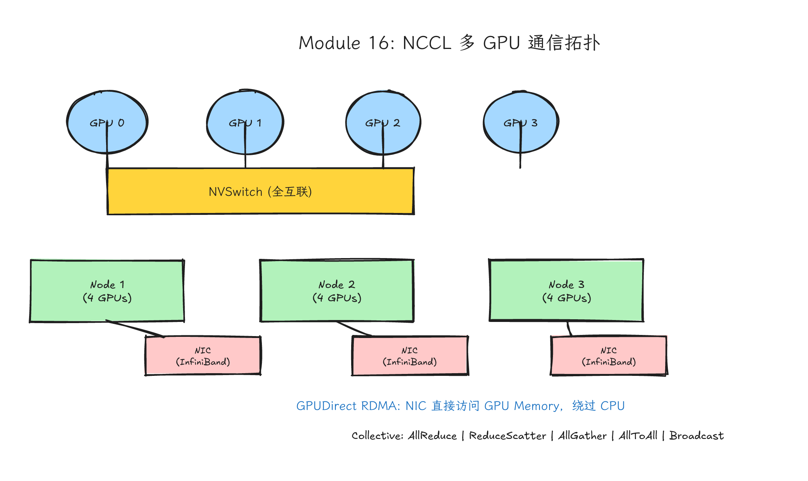
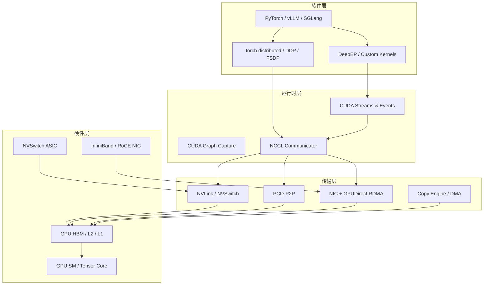
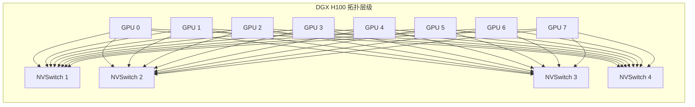
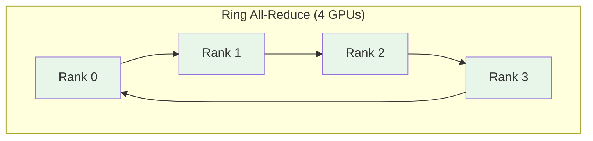
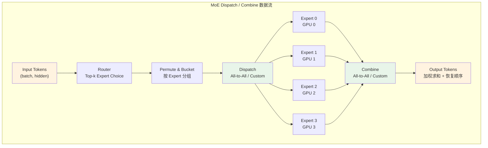
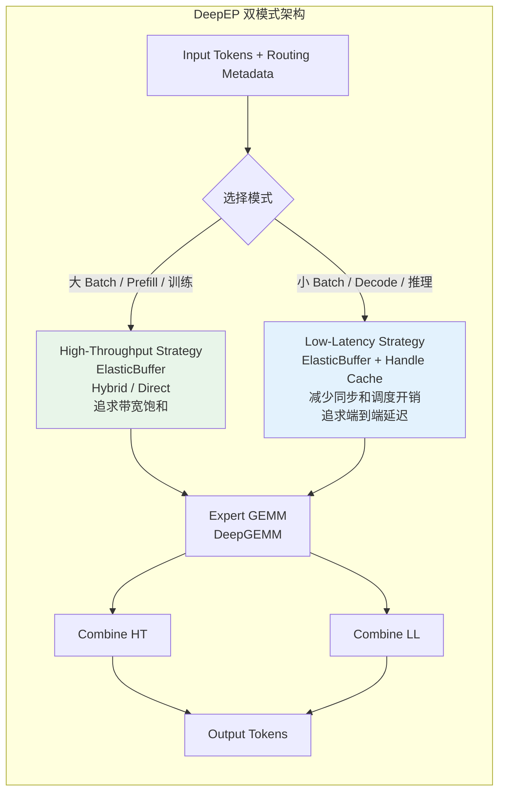

# Module 16: NCCL、NVLink、GPUDirect RDMA 与 DeepEP



*图 16-1：NCCL collectives、NVLink、PCIe、RDMA 与 MoE 通信路径的系统拓扑。可编辑源图：[`module-16-nccl-communication-topology.excalidraw`](../diagrams/module-16-nccl-communication-topology.excalidraw)。*

> **Level**: Expert
> **Estimated time**: 20-30 小时
> **Prerequisites**: Modules 8, 10, 12, 15
> **Sources**: NVIDIA NCCL documentation, NVIDIA GPUDirect RDMA documentation, NVIDIA NVLink/NVSwitch documentation, DeepEP README, vLLM/SGLang distributed inference source and docs, Megatron-LM documentation, DeepSeek-V3 technical report, arXiv papers on NCCL algorithms and MoE EP.

---

## 学习目标

完成本模块后，你应该能够：

1. 画出从 PyTorch 到 HBM 再到网卡的完整软件-硬件链路，并指出每一层的关键优化点。
2. 解释当前 NCCL host API 中常见 collective（all-reduce、reduce、broadcast、all-gather、reduce-scatter、all-to-all、gather、scatter）以及 point-to-point `send/recv` 的语义、数据形状、算法复杂度和典型应用场景。
3. 描述 NCCL ring 算法和 tree 算法的区别，说明为什么大消息常偏向带宽高效路径、小消息/延迟敏感场景常偏向低延迟路径，并知道实际选择还取决于 NCCL 版本、拓扑、协议、channel 和环境变量。
4. 解释 NVLink 的物理层演进，对比 PCIe 和 NVLink 的带宽/延迟差异，说明 NVSwitch 的全互联架构。
5. 判断 GPU 间是否支持 P2P，启用 Peer Memory Access，并理解 UVA 的作用。
6. 解释 GPUDirect RDMA 的内存注册机制（pinning、registration cache），区分 legacy nvidia-peermem 和 modern DMA-BUF 路径。
7. 写出 MPI + NCCL 的完整可编译代码，理解 communicator、rank、group、stream 语义。
8. 解释 MoE 的 dispatch/combine 数据流，画出 token 从输入到 expert 再到输出的路径。
9. 描述 DeepEP V2 如何用 `ElasticBuffer` 统一高吞吐与低延迟 EP API，并说明为什么 decode 和 prefill 仍需要不同通信策略。
10. 分析 vLLM 的 tensor parallel 和 pipeline parallel 的通信模式，选择正确的并行策略。

---

## 这一课的故事线

前面已经能写单 GPU kernel，也知道现代 GEMM 如何用 Tensor Core。现在看 LLM 推理场景：模型太大，expert 太多，batch 来得太快，一张 GPU 不够。多 GPU 系统里，算力经常不是唯一瓶颈，甚至不是第一瓶颈。token 从哪里来，经过哪张网卡，走 PCIe 还是 NVLink，什么时候跨节点，什么时候同步，都会改变最终吞吐和延迟。

这节课把通信当成 GPU 编程的一部分。NCCL 解决 GPU 之间高性能 collective 和 point-to-point 通信；NVLink/NVSwitch 解决节点内 GPU 间高速互联；GPUDirect RDMA 解决网卡和 GPU memory 之间尽量少绕 CPU 的跨节点路径；DeepEP 把这些能力落到 MoE expert parallel 的 dispatch/combine 上。

只学 CUDA kernel 时，问题可能是"kernel occupancy 够不够"。学到这一课，要问"token 搬运路径是不是把 GPU 算子饿住了？"

---

## 类比：城市里的货运系统

每张 GPU 是工厂，HBM 是仓库，SM 是生产线。单 GPU 优化是工厂内部优化；多 GPU 推理是多个工厂之间调货。

- **PCIe** 像城市普通道路，所有车辆都走这条路，会拥堵。
- **NVLink** 像工厂园区里的专用高速路，点对点直达，限速高。
- **NVSwitch** 像高速路立交，让多座工厂互相直连。从任何工厂到任何工厂都是同样高速距离。
- **RDMA** 像给跨城货运开专线，货车直接把货送到目标仓库附近，不需要先卸到城市物流中心（CPU memory）。
- **NCCL** 像调度系统，知道不同货运模式怎么排路线、编车队、在多个工厂间同步卸货。
- **DeepEP** 像给 MoE 餐厅设计的送餐系统：先把 token 送到对应 expert，算完再组合回来。它知道 decode 订单急、prefill 订单量大，用不同配送策略。


---

## 五层学习结构

本模块按以下五层递进：

1. **问题背景** — 为什么多 GPU 通信成为瓶颈？MoE 如何放大问题？
2. **直觉类比** — 货运系统、城市高速路、物流中心。
3. **硬件机制** — NVLink、NVSwitch、PCIe、GPUDirect RDMA、P2P、UVA。
4. **代码路径** — NCCL API、MPI+CUDA、PyTorch distributed、DeepEP kernel、stream/event overlap。
5. **真实系统落点** — vLLM、Megatron-LM、DeepSeek EP、性能调试工具。

---

## 第一层：问题背景 — 为什么通信成为瓶颈

### 算力增长 vs 带宽增长的不对称

NVIDIA GPU 的 Tensor Core 低精度算力从 V100 的百 TFLOP/s 级增长到 H100 的 PFLOP/s 级，再到 Blackwell 的多 PFLOP/s 级（具体数值取决于 dtype、稀疏性和 SXM/PCIe 产品形态）。但 GPU 间互联带宽的增长慢得多：

- PCIe 3.0 x16: ~32 GB/s (双向)
- PCIe 4.0 x16: ~64 GB/s (双向)
- PCIe 5.0 x16: ~128 GB/s (双向)
- NVLink 4.0 (H100): 900 GB/s (双向)
- NVLink 5.0 (B200): 1800 GB/s (双向)

即使是最快的 NVLink 5.0，带宽/算力比仍在下降。通信越来越容易成为瓶颈。

### 大模型推理的通信热点

| 场景 | 通信类型 | 数据量 | 延迟敏感度 |
|---|---|---|---|
| Dense 模型 TP | all-reduce | 每层激活 | 高 |
| Dense 模型 PP | send/recv | 阶段边界激活 | 中 |
| MoE dispatch | all-to-all / custom | token x hidden x top-k | 高 |
| MoE combine | all-to-all / custom | token x hidden x top-k | 高 |
| 梯度同步 (训练) | all-reduce | 全模型梯度 | 中 |
| KV cache 迁移 | send/recv | 长序列 cache | 中 |

MoE 的 dispatch/combine 最棘手：消息大小随 batch 和 top-k 动态变化，不同 expert 负载极不均衡，而且每个 MoE 层都要执行两次。

---

## 第二层：直觉类比 — 城市货运系统（已在上文给出）

---

## 第三层：硬件机制

### 3.1 软件到硬件链路图



很多初学者把 communication library 当成 CPU 侧 API，但真实路径会穿过 CUDA stream、GPU memory、PCIe/NVLink、网卡、拓扑发现、buffer registration、kernel launch 甚至 CUDA graph。调性能时要知道自己卡在哪一层。

---

### 3.2 NVLink 详解：从物理层到 NVSwitch

#### NVLink 代际演进

| Generation | GPU Architecture | 官方每 GPU 双向聚合带宽 | 每 GPU 最大链路数 | 关键特性 |
|---|---|---:|---:|---|
| NVLink 1.0 | Pascal P100 (2016) | 160 GB/s | 4 | 首次 GPU-GPU 直连 |
| NVLink 2.0 | Volta V100 (2017) | 300 GB/s | 6 | NVSwitch 服务器拓扑开始出现 |
| NVLink 3.0 | Ampere A100 (2020) | 600 GB/s | 12 | 第二代 NVSwitch，DGX A100 全互联 |
| NVLink 4.0 | Hopper H100 (2022) | 900 GB/s | 18 | NVLink Network，跨节点 NVLink fabric |
| NVLink 5.0 | Blackwell B200/GB200 (2024) | 1.8 TB/s | 18 | GB200 NVL72，rack 级 72 GPU；更大 576 GPU 口径属于系统级 fabric 资料 |
| NVLink 6.0 | Rubin Platform | 3.6 TB/s | 36 | NVIDIA 官方页面已列 preliminary specs，平台参数可能随产品落地调整 |

*来源: NVIDIA NVLink official specs；NVIDIA Hopper Architecture In-Depth；NVIDIA GB200/NVL72 官方材料。注意不同文档会使用“per-link”“单向”“双向聚合”“per-GPU”不同口径，比较前必须统一单位。*

PCIe 5.0 x16 的双向聚合带宽约 128 GB/s；H100 的 NVLink 4 官方每 GPU 双向聚合带宽是 900 GB/s，B200/GB200 的 NVLink 5 是 1.8 TB/s。NVLink 是 GPU 间高速直连或交换式 fabric，避免把所有 GPU-GPU 流量都压到 CPU/PCIe 根复合体上。

#### NVSwitch 的架构和作用

NVSwitch 是专用交换 ASIC，类似网络交换机，但专门为 NVLink 设计。它让多 GPU 之间形成全互联。

- **DGX-1 (P100)**：NVLink hypercube mesh，8 GPU 不需要 NVSwitch，通过点对点连接。
- **DGX-2 (V100)**：6 个第一代 NVSwitch 连接 16 GPU，全互联。
- **DGX A100 (A100)**：6 个第二代 NVSwitch 连接 8 GPU，每个 GPU 12 条 NVLink。
- **DGX H100 (H100)**：4 个第三代 NVSwitch 连接 8 GPU，每个 GPU 18 条 NVLink；官方资料常用 3.6 TB/s bisection bandwidth 作为 DGX H100 节点内互联口径。
- **GB200 NVL72 (Blackwell)**：72 个 Blackwell GPU + 36 个 Grace CPU 在一个 rack 内，官方资料给出 130 TB/s 级 GPU-GPU 通信带宽；576 GPU 是 GB200 NVL / SuperPOD 级系统扩展口径，不是单台 NVL72 里的 GPU 数。



在同一个 NVSwitch domain 内，GPU-GPU 路径通常比 PCIe 树形拓扑更接近均匀带宽/延迟，这也是它适合 tensor parallel all-reduce 的原因。但真实系统仍可能受 NVSwitch 代际、domain 边界、链路故障、MIG/partition、NCCL 拓扑选择和其他流量影响；不要把“有 NVSwitch”简化成所有 GPU 对完全等价。没有 NVSwitch 的系统（比如 PCIe 直连 GPU），GPU 0 到 GPU 1 可能走 PCIe switch，GPU 0 到 GPU 4 可能跨 CPU socket，带宽和延迟差异更明显。

#### PCIe vs NVLink 对比

| 特性 | PCIe 5.0 x16 | NVLink 4.0 | NVLink 5.0 |
|---|---|---|---|
| 每 GPU 双向聚合带宽口径 | ~128 GB/s | H100 级别约 900 GB/s | B200/GB200 级别约 1.8 TB/s |
| 拓扑 | 树形，共享 CPU root | 点对点 / 全交换 | 点对点 / 全交换 |
| 延迟 | 较高（可能经过 root complex / PCIe switch） | 较低（直连或 NVSwitch） | 较低（直连或 NVSwitch） |
| 缓存/内存一致性 | 依赖平台和协议；CUDA 程序仍需显式同步 | GPU-GPU 与 CPU-GPU C2C 语义不同，不能简单写成全局一致 | 同左，按目标系统文档确认 |
| 统一虚拟地址 | UVA 是 CUDA/runtime 能力，不由 NVLink 单独决定 | 与 UVA/P2P/驱动支持共同决定 | 与 UVA/P2P/驱动支持共同决定 |
| 能耗效率 | 较低 | 高 | 更高 |
| 成本 | 通用，低 | 专有，高 | 专有，高 |

#### 如何判断 GPU 间是否支持 P2P：cudaDeviceCanAccessPeer

CUDA 提供 `cudaDeviceCanAccessPeer` 检查两个 GPU 是否可以直接访问对方内存。这是硬件拓扑决定：如果两个 GPU 通过同一个 PCIe switch 或 NVLink 连接，通常返回 true；跨 CPU socket 或不同 PCIe root complex，可能返回 false。

```cpp
// 精品代码 1：GPU 拓扑检测和 P2P 访问分析
// compile: nvcc -o topo_detect topo_detect.cu
#include <cuda_runtime.h>
#include <stdio.h>
#include <vector>

int main() {
    int nDevices;
    cudaGetDeviceCount(&nDevices);
    printf("=== GPU 拓扑检测报告 ===\n");
    printf("检测到 %d 个 GPU\n\n", nDevices);

    // 查询每个 GPU 的属性
    for (int i = 0; i < nDevices; ++i) {
        cudaDeviceProp prop;
        cudaGetDeviceProperties(&prop, i);
        printf("GPU %d: %s\n", i, prop.name);
        printf("  Compute Capability: %d.%d\n", prop.major, prop.minor);
        printf("  Total Global Memory: %.2f GB\n", prop.totalGlobalMem / (1024.0 * 1024.0 * 1024.0));
        printf("  PCIe Bus ID: %04x:%02x:%02x.0\n", prop.pciDomainID, prop.pciBusID, prop.pciDeviceID);
        printf("  Note: CUDA runtime does not expose a simple nvlinkSupported field; use P2P attributes, NVML, or nvidia-smi topo -m for link details.\n");
        printf("\n");
    }

    // P2P 访问矩阵
    printf("=== P2P 访问能力矩阵 (cudaDeviceCanAccessPeer) ===\n");
    printf("     ");
    for (int j = 0; j < nDevices; ++j) printf("GPU%-2d ", j);
    printf("\n");

    for (int i = 0; i < nDevices; ++i) {
        printf("GPU%-2d ", i);
        for (int j = 0; j < nDevices; ++j) {
            if (i == j) {
                printf("  -   ");
            } else {
                int canAccess;
                cudaDeviceCanAccessPeer(&canAccess, i, j);
                printf(" %d    ", canAccess);
            }
        }
        printf("\n");
    }

    // 启用 P2P 并测试带宽
    printf("\n=== P2P 内存访问测试 ===\n");
    const size_t testSize = 256 * 1024 * 1024; // 256 MB
    for (int i = 0; i < nDevices; ++i) {
        for (int j = i + 1; j < nDevices; ++j) {
            int canAccess;
            cudaDeviceCanAccessPeer(&canAccess, i, j);
            if (!canAccess) continue;

            cudaSetDevice(i);
            cudaDeviceEnablePeerAccess(j, 0);
            cudaSetDevice(j);
            cudaDeviceEnablePeerAccess(i, 0);

            float *src, *dst;
            cudaSetDevice(i);
            cudaMalloc(&src, testSize);
            cudaSetDevice(j);
            cudaMalloc(&dst, testSize);

            cudaEvent_t start, stop;
            cudaEventCreate(&start);
            cudaEventCreate(&stop);
            cudaStream_t copy_stream;
            cudaStreamCreate(&copy_stream);

            // warm-up：在 destination device 的 stream 上提交 peer copy
            cudaMemcpyPeerAsync(dst, j, src, i, testSize, copy_stream);
            cudaStreamSynchronize(copy_stream);

            cudaEventRecord(start, copy_stream);
            cudaMemcpyPeerAsync(dst, j, src, i, testSize, copy_stream);
            cudaEventRecord(stop, copy_stream);
            cudaEventSynchronize(stop);

            float ms;
            cudaEventElapsedTime(&ms, start, stop);
            double bw = (testSize / (1024.0 * 1024.0 * 1024.0)) / (ms / 1000.0);
            printf("GPU%d <-> GPU%d: %.3f ms, %.2f GB/s\n", i, j, ms, bw);

            cudaFree(src);
            cudaFree(dst);
            cudaStreamDestroy(copy_stream);
            cudaEventDestroy(start);
            cudaEventDestroy(stop);

            cudaSetDevice(i);
            cudaDeviceDisablePeerAccess(j);
            cudaSetDevice(j);
            cudaDeviceDisablePeerAccess(i);
        }
    }
    return 0;
}
```

**说明**：
- `cudaGetDeviceCount`：获取系统中 CUDA 设备数量。
- `cudaGetDeviceProperties`：获取每个 GPU 的基本属性和 PCI bus id。注意 CUDA runtime 没有通用的 `nvlinkSupported` 字段；NVLink 细节通常用 NVML、`nvidia-smi topo -m`、`nvidia-smi nvlink` 或 driver P2P attribute 辅助确认。
- `cudaDeviceCanAccessPeer`：查询 GPU i 是否能直接访问 GPU j 的内存。这是拓扑检测的核心 API。
- `cudaDeviceEnablePeerAccess`：启用 P2P 访问。注意，这会为所有现有和未来在 peer GPU 上的分配增加开销。
- `cudaMemcpyPeer`：在支持 P2P 的 GPU 间直接复制，不经过 CPU 内存。
- 通过 `cudaEvent` 测量带宽，可以实际验证 NVLink 和 PCIe 的速度差异。

#### Unified Virtual Addressing (UVA) 和 Peer Memory Access

UVA 是 CUDA 4.0 引入的特性，要求 64-bit 操作系统、Fermi 及以上架构。在 UVA 下，CPU 和所有 GPU 内存共享同一个虚拟地址空间。这意味着：

- 从指针值就能判断数据位于哪个设备（CUDA driver 内部维护映射）。
- `cudaMemcpy` 可以用 `cudaMemcpyDefault` 自动推断传输方向。
- P2P 访问时，kernel 可以直接解引用另一个 GPU 的指针，就像访问本地内存一样。

P2P 访问的实际性能取决于物理路径。两个 GPU 只通过 PCIe 连接时，kernel 直接访问 remote GPU 内存可能比显式 `cudaMemcpyPeer` 更慢，因为 PCIe 延迟对随机访问不友好。NVLink 带宽高、延迟低，更适合 P2P kernel 访问。

---

### 3.3 GPUDirect RDMA 详解

#### RDMA 基本概念：InfiniBand、RoCE、以太网 RDMA

RDMA（Remote Direct Memory Access）允许一台机器的网卡直接读写另一台机器内存，无需 CPU 参与。三种实现：

- **InfiniBand (IB)**：专用网络，低延迟、高带宽，常用于 HPC。不同 ConnectX 代际和端口配置差异很大：ConnectX-6 Dx 常见到 200 Gb/s，ConnectX-7 可到 400 Gb/s，ConnectX-8 SuperNIC 才进入 800 Gb/s 口径；课程实验必须按实际 NIC、端口数、PCIe 通道和链路模式记录带宽。
- **RoCE (RDMA over Converged Ethernet)**：在以太网上实现 RDMA，需要无损以太网（PFC/ECN）配置。分 RoCEv1（L2）和 RoCEv2（L3/UDP）。
- **iWARP / NVMe-oF / etc.**：其他 RDMA 实现，在 AI 集群中较少见。

传统跨节点通信路径：
```
GPU memory -> CPU memory -> NIC -> 网络 -> NIC -> CPU memory -> GPU memory
```
GPUDirect RDMA 路径：
```
GPU memory -> (PCIe) -> NIC -> 网络 -> NIC -> (PCIe) -> GPU memory
```

节省了两次 CPU memory 拷贝，并把 CPU 从数据搬运路径中移开。CPU 仍然负责提交通信、注册内存、建立队列和处理控制面逻辑；性能收益来自避免 host staging copy，而不是完全没有 CPU 参与。

#### GPUDirect RDMA 的注册机制（Memory Registration、Pinning）

RDMA 需要知道设备可访问的 DMA/BAR 映射才能编程 DMA。但 GPU device memory 是 GPU driver 管理的虚拟地址空间，底层物理页和 BAR 映射不能由 NIC 驱动直接假设；如果是 Unified Memory，还可能涉及迁移和一致性问题。所以需要注册或锁定：

1. `nvidia_p2p_get_pages()`：NVIDIA driver 的 P2P API，将 GPU 虚拟地址范围对应的物理页锁定，并返回页表（page table）。
2. 网卡驱动使用这些页表编程 DMA 描述符，使 NIC 可以直接读写 GPU 物理内存。
3. 注册完成后，用户态通过 `ibv_reg_mr()` 或 `ibv_reg_dmabuf_mr()` 将 GPU buffer 注册为 Memory Region (MR)。

**Legacy 路径：nvidia-peermem**

`nvidia-peermem`（曾用名 `nv_peer_mem`）是一个内核模块，通过 MLNX_OFED 的 `ib_register_peer_memory_client()` API 将 NVIDIA GPU 注册为 InfiniBand 的 peer memory client。这样 `ibv_reg_mr` 在遇到 GPU 内存时，会调用 `nvidia-peermem` 来完成 pinning。

这个模块需要针对每个内核版本和 MOFED 版本重新编译，版本不匹配会产生 `Invalid argument` 错误。Ubuntu 的 inbox `rdma-core` 没有这个 API，模块无法加载。

**Modern 路径：DMA-BUF（推荐）**

在支持 DMA-BUF 的新内核、NVIDIA 驱动和 RDMA/NIC 软件栈上，可以使用 DMA-BUF 路径：
- GPU 内存通过 `nvidia-drm` 导出为 DMA-BUF file descriptor。
- 使用 `ibv_reg_dmabuf_mr()` 直接将 DMA-BUF 注册为 RDMA Memory Region。
- 在满足条件的环境中可以不走 legacy `nvidia-peermem` 路径；但是否需要 MLNX_OFED / DOCA-OFED / inbox rdma-core、具体版本要求和容器权限，取决于 NIC、发行版、driver 和集群镜像。生产部署应按 NVIDIA GPUDirect RDMA、NCCL 和网卡厂商文档逐项验证。

启用 DMA-BUF 的常见关键条件之一是 `nvidia-drm modeset=1`；还要确认内核、NVIDIA driver、rdma-core/libibverbs 和 NIC driver 支持 `ibv_reg_dmabuf_mr()`。

```bash
# 检查是否启用
sudo modprobe nvidia-drm modeset=1
# 在 /etc/modprobe.d/nvidia.conf 中设置：
# options nvidia-drm modeset=1
```

#### GPUDirect P2P（同节点 GPU 间直接访问）

GPUDirect P2P 允许同一节点内 GPU 直接访问彼此内存，不经过 CPU 内存。依赖 PCIe 或 NVLink 的 P2P 能力。注意：

- P2P 和 RDMA 是不同概念。P2P 是节点内 GPU-GPU，RDMA 是跨节点。
- 在 NVSwitch 系统上，P2P 通过 NVLink 实现，带宽极高。
- 在某些系统上，P2P 可能通过 PCIe 实现，但带宽受限于 PCIe。
- IOMMU（Input-Output Memory Management Unit）可能阻止 P2P，因为虚拟化地址转换会让设备无法直接看到物理地址。需要在 BIOS/UEFI 中配置或禁用 IOMMU。

#### GPUDirect Storage（GPU 直接访问存储）

GPUDirect Storage 允许 GPU 直接从 NVMe SSD 读取数据到 GPU memory，不经过 CPU memory。对数据加载繁重的训练场景（如视频、大规模图像数据集）有价值。但本模块不深入。

#### 注册缓存（Registration Cache）的重要性

Memory registration 有开销：
- `nvidia_p2p_get_pages` 需要遍历页表，锁定物理页。
- 频繁分配和释放 GPU buffer 会导致频繁的注册/反注册。
- 在高性能通信库（NCCL、DeepEP）中，通常使用**注册缓存（registration cache）**来避免重复注册。

注册缓存的工作原理：
1. 第一次遇到某个 buffer 时，注册并缓存其页表和 buffer ID。
2. 后续使用同一个 buffer 时，直接命中缓存，跳过注册。
3. 需要机制检测 buffer 是否被释放（通过 CUDA buffer ID tag 或分配/释放 API hook）。

NCCL 内部有 registration cache。DeepEP 的 buffer management 也要考虑注册开销，尤其使用 RDMA 时。

---

## 第四层：NCCL 详解与代码路径

### 4.1 NCCL 的 API 和概念

NCCL（NVIDIA Collective Communications Library）是面向 NVIDIA GPU 的高性能通信库。核心概念：

- **Communicator**：通信器，代表一组参与通信的 GPU。所有 collective 操作都在某个 communicator 上执行。通过 `ncclCommInitRank` 初始化。
- **Rank**：在 communicator 中的唯一标识，从 0 到 `nRanks-1`。每个 rank 对应一个 GPU。
- **World**：所有参与分布式计算的进程/GPU 的总称。通常 `world_size = nRanks`。
- **Group**：NCCL 的 group 操作（`ncclGroupStart` / `ncclGroupEnd`）允许将多个 P2P 操作（send/recv）打包成原子组，避免死锁并提高并行度。
- **Operation**：规约操作类型，如 `ncclSum`、`ncclMax`、`ncclMin`、`ncclProd`。

### 4.2 所有 Collective 的完整语义和数学定义

#### Broadcast
- **输入**：root rank 持有完整数据 `X`，大小为 `S`。
- **输出**：所有 rank 都收到 `X`。
- **通信量**：每个非 root rank 接收 `S`。
- **复杂度**：O(S)。
- **用途**：将模型权重或配置从 root 广播到所有 worker。

#### Reduce
- **输入**：每个 rank 持有 `X_i`，大小为 `S`。
- **输出**：root rank 收到 `X_0 op X_1 op ... op X_{n-1}`。
- **通信量**：每个非 root rank 跨网络发送 `S`，root 跨网络接收 `(n-1)*S` 并与本地 `S` 一起规约。
- **用途**：将分散的梯度规约到 root（不常用，多用 all-reduce）。

#### All-Reduce
- **输入**：每个 rank 持有 `X_i`，大小为 `S`。
- **输出**：每个 rank 都收到 `X_0 op X_1 op ... op X_{n-1}`。
- **通信量**：每个 rank 发送和接收约 `2*(n-1)*S/n`（ring 算法）。
- **算法**：ring（大消息时常接近带宽下界）、tree（延迟对数级）、CollNet/NVLS 等拓扑相关路径；实际选择由 NCCL 版本、消息大小、拓扑和环境变量决定。
- **用途**：梯度同步（训练中最常用）。

#### All-Gather
- **输入**：每个 rank 持有 `X_i`，大小为 `S/n`（分片）。
- **输出**：每个 rank 收到 `[X_0, X_1, ..., X_{n-1}]`，大小为 `S`。
- **通信量**：典型 ring all-gather 中，每个 rank 跨网络发送和接收约 `(n-1)*S/n`。
- **用途**：张量并行中收集激活值。

#### Reduce-Scatter
- **输入**：每个 rank 持有 `X_i`，大小为 `S`。
- **输出**：每个 rank 收到 `X_0 op X_1 op ... op X_{n-1}` 的一个分片，大小为 `S/n`。
- **通信量**：典型 ring reduce-scatter 中，每个 rank 跨网络发送和接收约 `(n-1)*S/n`，最终只保留大小为 `S/n` 的分片。
- **用途**：先规约再分片，常与 all-gather 组合实现 all-reduce。

#### All-to-All
- **输入**：每个 rank 有 `n` 个数据块，要发给每个 rank 一个块。
- **输出**：每个 rank 从所有其他 rank 各收一个块。
- **通信量**：若 `S` 表示该 rank 的全部逻辑输入（包含本地留给自己的 chunk），则跨网络发送/接收量约为 `S*(n-1)/n`；若 `S` 已定义为“要发给其他 rank 的数据量”，则网络发送/接收量就是 `S`。写报告时必须先固定口径。
- **难点**：消息可能极度不均匀（尤其 MoE 路由后）。
- **用途**：MoE dispatch/combine、数据重排。
- **API 名称注意**：NCCL C API 的函数名是 `ncclAlltoAll`（`to` 小写），不是 `ncclAllToAll`。当前 NCCL 还提供 `ncclGather` 和 `ncclScatter`；旧资料里常见用 `ncclSend`/`ncclRecv` group calls 手写这些模式。

#### Send / Receive（Point-to-Point）
- **输入**：send rank 持有 `X`，大小为 `S`。
- **输出**：recv rank 收到 `X`。
- **语义**：`ncclSend` 和 `ncclRecv` 必须成对使用，或在 `ncclGroupStart/End` 中批量调用。
- **用途**：pipeline parallel 的阶段边界传输、自定义通信模式。

### 4.3 NCCL 的 Ring 算法和 Tree 算法

#### Ring All-Reduce

在理想同质链路和大消息模型下，Ring all-reduce 的通信量接近带宽下界，因此常被称为带宽高效算法。NCCL 在真实拓扑中会结合 ring、tree、CollNet/NVLS、协议和 channel 做选择。Ring 的基本流程是将 `n` 个 rank 排成环，数据分为 `n` 个 chunk，分两个阶段：

1. **Reduce-Scatter 阶段（ring phase）**：每个 rank 将 chunk 发给下家，收到上家的 chunk 后做规约，再转发。经过 `n-1` 步后，每个 rank 持有一个完整规约的 chunk。
2. **All-Gather 阶段（ring phase）**：每个 rank 将自己持有的完整 chunk 发给下家，收到上家的 chunk 后直接转发。经过 `n-1` 步后，所有 rank 都有完整结果。



**Step 1-3 (Reduce-Scatter)**：
- Step 1: R0 sends chunk0 to R1; R1 sends chunk1 to R2; R2 sends chunk2 to R3; R3 sends chunk3 to R0. Each receiver does `recvReduceSend`.
- Step 2: 继续传递规约后的 chunk。
- Step 3: 最后一个 chunk 到达其最终 rank，做 `recvReduceCopy`（写入 output buffer）。

**Step 4-6 (All-Gather)**：
- Step 4: R0 sends chunk3 (已规约) to R1; R1 sends chunk0 to R2; ... Each receiver does `recvCopySend`.
- Step 5-6: 继续传递直到所有 rank 收齐所有 chunk。

通信量：每个 rank 发送和接收 `2*(n-1)*S/n`。大数据量下接近带宽最优下界。

#### Tree All-Reduce

Tree 算法（NCCL 2.4+）使用双二叉树（double binary tree）结构，将延迟从 O(n) 降到 O(log n)。

- **Reduce 阶段**：叶子节点 send 数据向上，中间节点 `recvReduceSend`，根节点 `recvReduceCopy`。
- **Broadcast 阶段**：根节点 send 结果向下，中间节点 `recvCopySend`，叶子节点 `recvCopy`。

| 算法 | 延迟 | 带宽效率 | 适用场景 |
|---|---|---|---|
| Ring | O(n) | 大消息下常接近理论带宽 | 大消息、高带宽同质链路 |
| Tree | O(log n) | 小消息延迟更友好，带宽口径依实现而定 | 小消息、大规模 rank |
| CollNet | O(log n) | 依赖网络内规约/拓扑支持 | 支持相应 NCCL CollNet/SHARP 路径的网络 |
| NVLS / NVLink SHARP | 节点内延迟可显著低于普通 ring/tree；不应机械写成固定 O(1) | 依赖 NVSwitch/NVLink SHARP 代际、消息大小和 NCCL 算法选择 | 支持相应 NVLS 路径的 NVSwitch 系统，intra-node |

*来源: Demystifying NCCL: An In-depth Analysis of GPU Communication Protocols and Algorithms (arXiv:2507.04786), Monitoring Collective Communication Among GPUs (arXiv:2110.10401)*

### 4.4 NCCL 的 In-Place vs Out-of-Place

- **In-Place**：`sendbuf` 和 `recvbuf` 指向同一个地址。NCCL 文档没有定义类似 MPI 的特殊 in-place sentinel，而是优化这种“两个指针实际相同”的调用形式。
- **Out-of-Place**：`sendbuf` 和 `recvbuf` 不同。更安全，适合需要保留原始数据的场景。

NCCL 的 in-place 语义：`sendbuf` 可以是 `recvbuf` 地址，但要求数据类型和对齐满足条件。all-reduce 的 in-place 最常见：
```cpp
ncclAllReduce(sendbuff, sendbuff, count, ncclFloat, ncclSum, comm, stream);
```

### 4.5 NCCL 的 Datatype 和 Operation

NCCL 支持的数据类型包括：`ncclInt8`/`ncclChar`, `ncclUint8`, `ncclInt32`/`ncclInt`, `ncclUint32`, `ncclInt64`, `ncclUint64`, `ncclFloat16`/`ncclHalf` (FP16), `ncclFloat32`/`ncclFloat`, `ncclFloat64`/`ncclDouble`, `ncclBfloat16`, `ncclFloat8e4m3`, `ncclFloat8e5m2`。FP8 类型在当前文档中标注为 CUDA 11.8+ 且 SM90+ 条件；具体可用性仍应以当前 NCCL 版本、CUDA Toolkit 和目标 GPU 为准。

NCCL 支持的操作：`ncclSum`, `ncclProd`, `ncclMax`, `ncclMin`, `ncclAvg`（average，即 sum 后除以 rank 数；旧版本资料可能没有这一项）。

在深度学习中，最常用的是 `ncclFloat`/`ncclHalf` + `ncclSum`（梯度求和），或者 `ncclBfloat16`。

### 4.6 NCCL 的 Stream 语义和异步执行

NCCL 操作是异步的，它们被 enqueue 到 CUDA stream，和 kernel 一样遵守 stream ordering。这意味着：

- `ncclAllReduce` 返回时，操作可能还没开始执行。
- 你需要 `cudaStreamSynchronize` 或 `cudaEventSynchronize` 来确保完成。
- 同一个 stream 上的 NCCL 操作和 kernel 按顺序执行。
- 不同 stream 上的操作可以并行（前提是没有显式依赖）。

NCCL 内部也使用 CUDA stream。可以在 NCCL 调用中传入 stream，让通信和计算在同一个 stream 上串行，或在不同 stream 上并行。

### 4.7 精品代码 2：NCCL 完整示例（MPI + NCCL）

```cpp
// 精品代码 2：MPI + NCCL 完整 All-Reduce 示例
// compile: nvcc -ccbin mpicxx -o nccl_allreduce nccl_allreduce.cu -lnccl
//          某些集群还需要显式添加 MPI/NCCL/CUDA 的 -I 和 -L 路径。
// run: mpirun -np 4 ./nccl_allreduce
#include <mpi.h>
#include <nccl.h>
#include <cuda_runtime.h>
#include <stdio.h>
#include <stdlib.h>

#define CHECK_CUDA(call)                                                       \
    do {                                                                        \
        cudaError_t err = call;                                                 \
        if (err != cudaSuccess) {                                               \
            fprintf(stderr, "CUDA error at %s:%d: %s\n", __FILE__, __LINE__,   \
                    cudaGetErrorString(err));                                   \
            exit(EXIT_FAILURE);                                                 \
        }                                                                       \
    } while (0)

#define CHECK_NCCL(call)                                                       \
    do {                                                                        \
        ncclResult_t res = call;                                                \
        if (res != ncclSuccess) {                                               \
            fprintf(stderr, "NCCL error at %s:%d: %s\n", __FILE__, __LINE__,  \
                    ncclGetErrorString(res));                                   \
            exit(EXIT_FAILURE);                                                 \
        }                                                                       \
    } while (0)

int main(int argc, char* argv[]) {
    // 1. 初始化 MPI
    MPI_Init(&argc, &argv);
    int world_size, rank;
    MPI_Comm_size(MPI_COMM_WORLD, &world_size);
    MPI_Comm_rank(MPI_COMM_WORLD, &rank);

    // 2. 每个 MPI rank 绑定一个本节点内的 GPU
    int nDevices;
    CHECK_CUDA(cudaGetDeviceCount(&nDevices));

    MPI_Comm localComm;
    MPI_Comm_split_type(MPI_COMM_WORLD, MPI_COMM_TYPE_SHARED, rank,
                        MPI_INFO_NULL, &localComm);
    int localRank;
    MPI_Comm_rank(localComm, &localRank);
    MPI_Comm_free(&localComm);

    if (localRank >= nDevices) {
        fprintf(stderr, "Rank %d localRank %d exceeds visible GPU count %d\n",
                rank, localRank, nDevices);
        MPI_Abort(MPI_COMM_WORLD, EXIT_FAILURE);
    }
    CHECK_CUDA(cudaSetDevice(localRank));

    // 3. 获取 NCCL unique ID（由 rank 0 生成，广播给所有 rank）
    ncclUniqueId ncclId;
    if (rank == 0) {
        CHECK_NCCL(ncclGetUniqueId(&ncclId));
    }
    MPI_Bcast(&ncclId, sizeof(ncclUniqueId), MPI_BYTE, 0, MPI_COMM_WORLD);

    // 4. 初始化 NCCL communicator
    ncclComm_t comm;
    CHECK_NCCL(ncclCommInitRank(&comm, world_size, ncclId, rank));

    // 5. 分配 GPU buffer
    const size_t count = 1024 * 1024;  // 1M elements
    const size_t bytes = count * sizeof(float);
    float *sendbuf, *recvbuf;
    CHECK_CUDA(cudaMalloc(&sendbuf, bytes));
    CHECK_CUDA(cudaMalloc(&recvbuf, bytes));

    // 初始化数据：每个 rank 的 sendbuf 填上自己的 rank 值
    float* hostbuf = (float*)malloc(bytes);
    for (size_t i = 0; i < count; ++i) hostbuf[i] = (float)rank;
    CHECK_CUDA(cudaMemcpy(sendbuf, hostbuf, bytes, cudaMemcpyHostToDevice));
    CHECK_CUDA(cudaMemset(recvbuf, 0, bytes));

    // 6. 创建 CUDA stream
    cudaStream_t stream;
    CHECK_CUDA(cudaStreamCreate(&stream));

    // 7. 执行 NCCL All-Reduce（in-place: sendbuf 和 recvbuf 可以是同一地址）
    //    ncclSum: 所有 rank 的对应元素相加，结果放到 recvbuf
    CHECK_NCCL(ncclAllReduce((const void*)sendbuf, (void*)recvbuf, count,
                             ncclFloat, ncclSum, comm, stream));

    // 8. 同步 stream 确保通信完成
    CHECK_CUDA(cudaStreamSynchronize(stream));

    // 9. 验证结果：recvbuf 的每个元素应该是 0 + 1 + ... + (world_size-1)
    float* result = (float*)malloc(bytes);
    CHECK_CUDA(cudaMemcpy(result, recvbuf, bytes, cudaMemcpyDeviceToHost));
    float expected = (float)(world_size * (world_size - 1) / 2);
    int correct = 1;
    for (size_t i = 0; i < count; ++i) {
        if (result[i] != expected) {
            correct = 0;
            break;
        }
    }
    printf("Rank %d: All-Reduce %s\n", rank, correct ? "PASSED" : "FAILED");

    // 10. 清理
    free(hostbuf);
    free(result);
    CHECK_CUDA(cudaFree(sendbuf));
    CHECK_CUDA(cudaFree(recvbuf));
    CHECK_CUDA(cudaStreamDestroy(stream));
    CHECK_NCCL(ncclCommDestroy(comm));
    MPI_Finalize();
    return 0;
}
```

**说明**：
- `MPI_Init` / `MPI_Comm_rank` / `MPI_Comm_size`：标准 MPI 初始化，获取全局 rank 和 world size。
- `cudaSetDevice(localRank)`：将每个 MPI rank 绑定到一个 GPU。在生产环境中，通常通过 `CUDA_VISIBLE_DEVICES` 或 `OMPI_COMM_WORLD_LOCAL_RANK` 来更精确地控制 GPU 分配。
- `ncclGetUniqueId` / `MPI_Bcast`：NCCL 需要一个唯一的 ID 来初始化 communicator。rank 0 生成，通过 MPI 广播给所有进程。
- `ncclCommInitRank`：每个 rank 用这个 unique ID 初始化 NCCL communicator，加入同一个通信组。
- `ncclAllReduce`：核心 collective。参数顺序：sendbuf, recvbuf, count, datatype, op, comm, stream。注意这里传入 `stream`，通信是异步的。
- `cudaStreamSynchronize`：等待 stream 上所有操作完成。这是验证结果前的必要同步。
- 验证逻辑：如果 4 个 rank 分别填 0,1,2,3，ncclSum 后结果应该是 0+1+2+3=6。

### 4.8 精品代码 3：使用 CUDA Event 和 Stream 的通信-计算 Overlap 示例

```cpp
// 精品代码 3：CUDA Stream + Event 实现通信-计算 Overlap
// compile: nvcc -ccbin mpicxx -o overlap_comm_compute overlap_comm_compute.cu -lnccl
// run: mpirun -np 2 ./overlap_comm_compute
#include <nccl.h>
#include <cuda_runtime.h>
#include <stdio.h>
#include <stdlib.h>
#include <mpi.h>

#define CHECK_CUDA(call)                                                       \
    do { cudaError_t err = call; if (err != cudaSuccess) {                   \
        printf("CUDA error %s\n", cudaGetErrorString(err)); exit(1); } } while(0)
#define CHECK_NCCL(call)                                                       \
    do { ncclResult_t res = call; if (res != ncclSuccess) {                    \
        printf("NCCL error %s\n", ncclGetErrorString(res)); exit(1); } } while(0)

// 简单的计算 kernel：对数组每个元素做多次乘加
__global__ void compute_kernel(float* data, int n, int iterations) {
    int idx = blockIdx.x * blockDim.x + threadIdx.x;
    if (idx < n) {
        float val = data[idx];
        for (int i = 0; i < iterations; ++i) {
            val = val * 1.0001f + 0.0001f;
        }
        data[idx] = val;
    }
}

int main(int argc, char** argv) {
    MPI_Init(&argc, &argv);
    int rank, size;
    MPI_Comm_rank(MPI_COMM_WORLD, &rank);
    MPI_Comm_size(MPI_COMM_WORLD, &size);

    int nDevices;
    CHECK_CUDA(cudaGetDeviceCount(&nDevices));
    MPI_Comm localComm;
    MPI_Comm_split_type(MPI_COMM_WORLD, MPI_COMM_TYPE_SHARED, rank,
                        MPI_INFO_NULL, &localComm);
    int localRank;
    MPI_Comm_rank(localComm, &localRank);
    MPI_Comm_free(&localComm);
    if (localRank >= nDevices) {
        fprintf(stderr, "Rank %d localRank %d exceeds visible GPU count %d\n",
                rank, localRank, nDevices);
        MPI_Abort(MPI_COMM_WORLD, 1);
    }
    CHECK_CUDA(cudaSetDevice(localRank));

    ncclUniqueId id;
    if (rank == 0) CHECK_NCCL(ncclGetUniqueId(&id));
    MPI_Bcast(&id, sizeof(id), MPI_BYTE, 0, MPI_COMM_WORLD);

    ncclComm_t comm;
    CHECK_NCCL(ncclCommInitRank(&comm, size, id, rank));

    const int N = 4 * 1024 * 1024;  // 4M floats ~ 16MB
    size_t bytes = N * sizeof(float);
    float *d_compute, *d_send, *d_recv;
    CHECK_CUDA(cudaMalloc(&d_compute, bytes));
    CHECK_CUDA(cudaMalloc(&d_send, bytes));
    CHECK_CUDA(cudaMalloc(&d_recv, bytes));

    // 初始化数据
    CHECK_CUDA(cudaMemset(d_compute, 0, bytes));
    CHECK_CUDA(cudaMemset(d_send, 1, bytes));  // 字节模式 0x01；不是 float 1.0，通信示例只需要非零 payload
    CHECK_CUDA(cudaMemset(d_recv, 0, bytes));

    cudaStream_t compute_stream, comm_stream;
    CHECK_CUDA(cudaStreamCreate(&compute_stream));
    CHECK_CUDA(cudaStreamCreate(&comm_stream));

    cudaEvent_t compute_done, recv_done;
    CHECK_CUDA(cudaEventCreate(&compute_done));
    CHECK_CUDA(cudaEventCreate(&recv_done));

    // ======== 方案 A：串行（baseline） ========
    // 1. 计算 kernel 在 compute_stream
    compute_kernel<<<(N + 255) / 256, 256, 0, compute_stream>>>(d_compute, N, 1000);
    CHECK_CUDA(cudaGetLastError());
    CHECK_CUDA(cudaEventRecord(compute_done, compute_stream));
    CHECK_CUDA(cudaStreamSynchronize(compute_stream));

    // 2. 通信在默认 stream（这里模拟成 comm_stream 但等 compute_done）
    CHECK_CUDA(cudaStreamWaitEvent(comm_stream, compute_done, 0));
    CHECK_NCCL(ncclAllReduce(d_send, d_recv, N, ncclFloat, ncclSum, comm, comm_stream));
    CHECK_CUDA(cudaStreamSynchronize(comm_stream));

    // ======== 方案 B：Overlap（高级） ========
    // 核心思路：compute_stream 上的计算和 comm_stream 上的通信同时进行
    // 但要注意：通信用的 sendbuf 必须在发送前准备好

    // 重新初始化
    CHECK_CUDA(cudaMemset(d_send, 1, bytes));  // 字节模式 0x01；不是 float 1.0
    CHECK_CUDA(cudaMemset(d_recv, 0, bytes));
    CHECK_CUDA(cudaMemset(d_compute, 0, bytes));

    // 在 compute_stream 上启动长时间计算
    compute_kernel<<<(N + 255) / 256, 256, 0, compute_stream>>>(d_compute, N, 1000);
    CHECK_CUDA(cudaGetLastError());
    CHECK_CUDA(cudaEventRecord(compute_done, compute_stream));

    // 同时，在 comm_stream 上启动通信。这里 d_send 已经在通信前准备好，
    // 因此不要等待 compute_done；否则示例会退化回串行执行。
    // 如果 d_send 是 compute_stream 里的 kernel 产生的，则应改为等待对应的 send_ready 事件。
    CHECK_NCCL(ncclAllReduce(d_send, d_recv, N, ncclFloat, ncclSum, comm, comm_stream));
    CHECK_CUDA(cudaEventRecord(recv_done, comm_stream));

    // 计算 stream 可以在这里继续执行不依赖 recv_done 的 kernel
    // 如果下一个计算需要 all-reduce 结果，则要等 recv_done
    CHECK_CUDA(cudaStreamWaitEvent(compute_stream, recv_done, 0));
    // 接下来 compute_stream 上的 kernel 可以安全使用 d_recv

    // 同步两个 stream
    CHECK_CUDA(cudaStreamSynchronize(compute_stream));
    CHECK_CUDA(cudaStreamSynchronize(comm_stream));

    printf("Rank %d: overlap demo completed\n", rank);

    // 清理
    cudaFree(d_compute); cudaFree(d_send); cudaFree(d_recv);
    cudaStreamDestroy(compute_stream); cudaStreamDestroy(comm_stream);
    cudaEventDestroy(compute_done); cudaEventDestroy(recv_done);
    ncclCommDestroy(comm);
    MPI_Finalize();
    return 0;
}
```

**说明**：
- `compute_stream` 和 `comm_stream` 是两个独立的 CUDA stream。GPU 的 copy engine 和 SM 可以在一定程度上并行工作。
- `cudaEventRecord` 在 `compute_stream` 上记录事件 `compute_done`。
- overlap 版本中，通信不等待 `compute_done`，因为 `d_send` 已经提前准备好；这样计算 kernel 和 NCCL all-reduce 才有机会并行。若通信输入由前一个 kernel 产生，应记录一个 `send_ready` 事件并只等待那个真正的数据依赖。
- `cudaStreamWaitEvent(compute_stream, recv_done, 0)`：反过来，让计算等待通信完成。这确保了后续计算不会读到未完成的 recv buffer。
- **关键点**：overlap 的增益取决于硬件是否真的有独立的资源执行通信和计算。在 NVLink 系统上，通信和计算可以很好并行；在 PCIe 系统上，如果通信和计算都要争用 PCIe 带宽，overlap 效果可能有限。

---

## 第五层：真实系统落点

### 5.1 MoE 为什么把通信问题放大

Dense Transformer 每层是规整矩阵乘法和 attention。MoE 层不同：每个 token 会被 router 分到一个或多个 expert。expert 分布在多张 GPU 上时，token 要先 dispatch 到对应 GPU，expert 算完后再 combine 回原来的 token 顺序。



这个过程有三个难点：

1. **token 分布不均匀**。热门 expert 会收到更多 token，导致某些 GPU 更忙。这就是负载均衡问题。
2. **message size 不稳定**。decode 阶段 batch 小，延迟敏感；prefill 阶段 batch 大，吞吐敏感。同一段代码要同时满足两种极端。
3. **通信和计算要 overlap**。只要 dispatch/combine 把 expert GEMM 饿住，Tensor Core 再强也没用。DeepEP 和类似系统（如 MegaMoE、COMET）的核心目标就是把通信 latency 藏到计算后面。

### 5.2 DeepEP 详解

DeepEP 是 DeepSeek 开源的面向 MoE expert parallelism 的通信库。它解决的核心问题：通用 NCCL all-to-all 对 MoE 的稀疏、动态、不均衡通信模式不够优化。

#### DeepEP 的设计目标和架构

- **目标**：为 MoE 的 dispatch 和 combine 提供高吞吐、低延迟的 all-to-all GPU kernel，同时支持 FP8 等低精度通信路径。
- **后端演进**：V1 基于 NVSHMEM；V2 切换到 NCCL Gin（更轻量、header-only，并可复用已有 NCCL communicator）。
- **核心抽象**：`ElasticBuffer`（V2），把 high-throughput 与 low-latency EP API 统一到同一个接口，并用解析方式计算合适的 SM/QP 数量。
- **JIT 编译**：kernel 在运行时通过轻量级 JIT 模块编译，安装阶段不预编译 CUDA kernel；但环境仍需要 CUDA Toolkit、PyTorch、NCCL 等依赖。
- **版本注意**：当前 README 明确写到 0-SM RDMA low-latency EP 不再支持；0-SM Engram/PP/CP 属于其他实验性 primitive，不能把它们等同于 low-latency EP。

截至 2026-06-28，DeepEP README 的 quick start 明确列出 Python 3.8+、CUDA 12.3+、PyTorch 2.10+、NCCL 2.30.4+，并要求 Hopper (SM90) GPU，或至少具备 SM90 PTX ISA 兼容能力的目标架构。课程实验不要把 DeepEP 当成“任意 CUDA + 任意 NCCL 环境可跑”的库；先记录 DeepEP commit、CUDA/NCCL/PyTorch 版本、GPU 架构、IB/RoCE 配置和是否启用 NCCL Gin。V2 的 README 还提示可用 `EP_NCCL_ROOT_DIR` 指向 NCCL 安装目录，并提供 `EP_DISABLE_GIN`、`EP_JIT_*` 等调试/回退环境变量；这些变量的默认行为应以当前 README 和源码为准。

#### DeepEP 的两类通信策略



##### 高吞吐策略（High-Throughput / Prefill / Training）

适合 prefill、大 batch、token 多、通信量大。目标是把链路吃满，让每次通信有足够大的 payload。像高速货运，装满一车再发，单位成本低。

**Normal Dispatch 完整流程**：
1. 每个 GPU 上的 router 产生 routing metadata：每个 token 要去哪个 expert（top-k）。
2. 在本地做 permute/bucket：按目标 expert 重新排列 token，形成连续的 send buffer。
3. 使用多个通信资源并行发送数据，具体 channel、QP、SM 数由 DeepEP V2 根据拓扑和 MoE 设置解析计算，也可由调用者覆盖。
4. 跨节点时通常要组合节点内 NVLink/NVSwitch 与节点间 RDMA。DeepEP V2 保留 hybrid/direct 模式；具体是否需要节点内转发、如何转发，要以当前 README、分支和 benchmark 为准。
5. 接收方将 token 写入连续的 recv buffer，供后续 expert GEMM 使用。

**Normal Combine 完整流程**：
1. 每个 expert 计算完输出（可能是 FP8/BF16）。
2. 按 token 来源 rank 重新排列输出，形成 send buffer。
3. 同样通过 NVLink/RDMA 混合路径发回源 rank。
4. 源 rank 按原始 token 顺序 weighted sum，恢复输出。

观察点：
- 每个 rank 发送和接收多少 token。
- dispatch buffer 是否连续（对后续 GEMM 的 memory access pattern 很关键）。
- 是否使用 NVLink 或 RDMA 的高带宽路径。
- combine 是否能和后续计算 overlap。
- GEMM 的 grouped shape 是否和 dispatch 后布局匹配。

##### 低延迟策略（Low-Latency / Decode）

适合 decode、小 batch、每步生成少量 token。目标是减少每步等待时间，不一定追求链路峰值带宽。像急件配送，车不一定装满，但必须快。

**Low-Latency Dispatch 完整流程（概念化）**：
1. 使用与高吞吐路径相同的 `ElasticBuffer` 接口，但更重视 handle 缓存、稳定 routing metadata、减少 CPU 同步和调度开销。
2. 对跨节点流量仍会依赖 RDMA/NCCL Gin；对节点内流量是否走 NVLink、direct 或 hybrid 路径，要看当前 DeepEP 配置、拓扑和分支能力。
3. 通过 `EventOverlap` 等接口把通信依赖显式交给 compute stream，尽量隐藏 dispatch/combine 延迟。
4. SM/QP 数量由 V2 解析计算，也允许在 dispatch/combine 调用中传 `num_sms` 覆盖；不能把低延迟路径简单理解成“完全不占 SM”。

**Low-Latency Combine 完整流程**：
1. 复用 dispatch 得到的 `handle` 和 buffer layout，把 expert 输出按原 token/rank 关系组合回去。
2. 在接收端通过轻量 kernel 或库路径做 weighted reduction 和顺序恢复，具体实现取决于当前 DeepEP 版本。
3. 目标是让 dispatch + expert + combine 的总延迟小于一个 decode step 的预算。

观察点：
- 小消息延迟（microsecond 级别，但必须在目标集群上实测）。
- kernel launch 和通信调度开销。
- CUDA graph capture 是否可行（固定 shape 下可以）。
- 是否能减少 SM 占用和 CPU 同步。注意当前 V2 README 说 0-SM RDMA low-latency EP 不再支持，0-SM Engram/PP/CP 是实验性方向。
- metadata 处理是否成为 CPU 瓶颈。

#### DeepEP 的 Buffer 管理和内存分配

DeepEP 的核心数据结构在 V2 中是 `ElasticBuffer`。老资料里常见的 `Buffer`、`num_nvl_bytes`、`num_rdma_bytes` 属于 V1/legacy 语境；V2 通过 MoE 设置和 `ElasticBuffer.get_buffer_size_hint(...)` 估算 buffer，并在创建 buffer 后解析计算通信 kernel 的 SM/QP 数。

Buffer 的分配策略：
- 预分配大 buffer，避免运行时 `cudaMalloc` 的延迟。
- 使用 circular buffer 或 slab allocator 管理不同大小的消息。
- 当前 README 提醒 V2 的 buffer size consumption 比 V1 更大；预分配、复用和避免频繁分配仍然是性能关键。

#### DeepEP 与 DeepGEMM 的协同（MoE 的完整路径）

DeepGEMM 是 DeepSeek 的现代 LLM Tensor Core kernel 库，当前公开版本覆盖 FP8/FP4/BF16 GEMM、Mega MoE、MQA 等路径。DeepEP 的 buffer layout 需要和 DeepGEMM 的 grouped GEMM / MoE 接口匹配：
- dispatch 后，每个 expert 收到的 token 需要是连续、对齐的。
- DeepEP 的 output buffer 可以直接作为 DeepGEMM 的 input，避免额外 copy。
- combine 后，weighted sum 的结果可以原地写回，减少内存带宽。

系统级优化的核心思想：通信的 buffer layout 是为后续计算服务的。

### 5.3 精品代码 4：DeepEP dispatch/combine 的伪代码/概念代码

```python
# 精品代码 4：DeepEP 风格的 MoE Dispatch / Combine 概念代码（Python 伪代码）
# 这不是可运行代码，而是展示 DeepEP 的核心逻辑和数据流
# 真实 DeepEP 是 C++/CUDA 实现，并支持 FP8、JIT、异步等

import torch
import torch.distributed as dist
from typing import List, Tuple

def deep_ep_dispatch(
    tokens: torch.Tensor,           # (num_tokens, hidden_size)
    router_probs: torch.Tensor,     # (num_tokens, num_experts) 的 top-k 权重
    router_indices: torch.Tensor,     # (num_tokens, top_k) 的 expert 索引
    expert_ranks: List[int],          # 每个 expert 所在的 GPU rank
    num_local_experts: int,
    elastic_buffer,                 # V2 中的 ElasticBuffer；这里用 Any 避免绑定具体版本 API
    mode: str = "high_throughput"   # "high_throughput" 或 "low_latency" 策略
) -> Tuple[torch.Tensor, torch.Tensor, dict]:
    """
    DeepEP 风格的 dispatch 逻辑。

    参数:
        tokens: 输入 token 的 hidden states。
        router_probs: router 输出的权重。
        router_indices: 每个 token 选中的 top-k expert 索引。
        expert_ranks: expert 到 GPU rank 的映射。
        elastic_buffer: DeepEP V2 的统一通信 buffer，内部处理所需 workspace 和拓扑相关资源。
        mode: 高吞吐策略偏向带宽饱和；低延迟策略偏向 handle 缓存、减少同步和控制调度开销。

    返回:
        dispatched_tokens: 按 expert 重新排列后的 token，供 expert GEMM 使用。
        num_recv_tokens_per_expert: 每个 expert 收到的 token 数。
        handle: 异步操作句柄，用于后续 wait/overlap。
    """
    num_tokens, hidden = tokens.shape
    top_k = router_indices.shape[1]

    # Step 1: 本地 permute —— 按 (target_rank, expert_id) 分组
    # 这是 CPU 侧可以做的 metadata 计算，但真实 DeepEP 通常用 GPU kernel 做
    send_counts = torch.zeros((dist.get_world_size(), num_local_experts), dtype=torch.int32)
    for t in range(num_tokens):
        for k in range(top_k):
            expert_id = router_indices[t, k].item()
            target_rank = expert_ranks[expert_id]
            send_counts[target_rank, expert_id % num_local_experts] += 1

    # Step 2: 计算发送偏移（cumulative sum）
    send_offsets = torch.cumsum(send_counts.view(-1), dim=0) - send_counts.view(-1)

    # Step 3: 将 token 写入连续的 send buffer（GPU kernel 做）
    # 真实实现中，这里是一个 CUDA kernel，将 tokens 按目标 rank 连续排列
    send_buffer = torch.empty(
        (send_counts.sum().item(), hidden),
        dtype=tokens.dtype, device=tokens.device
    )
    # _permute_tokens_kernel<<<...>>>(tokens, router_indices, send_buffer, send_offsets)

    # Step 4: 根据策略选择通信参数。真实 V2 通常仍通过 ElasticBuffer.dispatch/combine。
    if mode == "high_throughput":
        # 偏向更高 num_sms / 更多通信资源，尽量打满 NVLink/RDMA 组合带宽。
        # 具体是 hybrid 还是 direct，要由当前 DeepEP 配置和拓扑决定。
        recv_buffer = torch.empty_like(send_buffer)
        # 调用 NCCL/自定义 all-to-all 或 grouped send/recv
        # elastic_buffer.dispatch(..., num_sms=num_comm_sms, async_with_compute_stream=True)
    else:  # low_latency
        # 偏向复用 cached handle、减少 CPU 同步和启动/调度开销。
        # 不要假设当前 V2 low-latency EP 是 pure RDMA 或 zero-SM。
        recv_buffer = torch.empty_like(send_buffer)
        # elastic_buffer.dispatch(..., handle=cached_handle, async_with_compute_stream=True)

    # Step 5: 计算每个 expert 的接收数量（用于后续 grouped GEMM）
    num_recv_tokens_per_expert = torch.zeros(num_local_experts, dtype=torch.int32)
    # ... 从通信结果填充

    # 返回 handle 允许异步 wait
    handle = {"mode": mode, "recv_buffer": recv_buffer}
    return recv_buffer, num_recv_tokens_per_expert, handle


def deep_ep_combine(
    expert_outputs: torch.Tensor,     # (total_expert_tokens, hidden_size) 来自 expert GEMM
    num_recv_tokens_per_expert: torch.Tensor,
    router_probs: torch.Tensor,
    router_indices: torch.Tensor,
    handle: dict,                     # dispatch 返回的 handle
    elastic_buffer,
    comm_config: dict,
) -> torch.Tensor:
    """
    DeepEP 风格的 combine 逻辑。
    将 expert 输出按 token 来源发回，并做 weighted sum。

    elastic_buffer 是 DeepEP V2 风格的统一通信 buffer；comm_config 表示拓扑、
    mode、num_sms、QP 等运行时配置。这里不绑定具体版本 API。
    """
    # Step 1: 按来源 rank 排列 expert_outputs
    # 类似 dispatch，但方向相反
    send_buffer = torch.empty_like(expert_outputs)
    # _permute_for_combine_kernel<<<...>>>(expert_outputs, send_buffer, ...)

    # Step 2: 通信（路径和 dispatch 对称）
    recv_buffer = torch.empty(
        (router_probs.shape[0], expert_outputs.shape[1]),
        dtype=expert_outputs.dtype, device=expert_outputs.device
    )
    if handle["mode"] == "high_throughput":
        # _hybrid_all_to_all(send_buffer, recv_buffer, ...)
        pass
    else:
        # 低延迟路径仍应通过当前 DeepEP/NCCL Gin/ElasticBuffer 能力选择通信方式；
        # 不要写死成 pure RDMA 或 zero-SM direct write。
        # elastic_buffer.combine(..., handle=handle, **comm_config)
        pass

    # Step 3: 本地 weighted sum + 恢复 token 顺序（GPU kernel）
    # _combine_and_restore_kernel<<<...>>>(recv_buffer, router_probs, router_indices, output)
    output = torch.zeros_like(recv_buffer)
    # 每个 token 的 top-k 输出按权重相加
    return output


# 使用示例（概念性）
if __name__ == "__main__":
    # 假设 8 GPUs, 64 experts, top-2, hidden=7168
    num_tokens = 256
    hidden = 7168
    top_k = 2
    num_experts = 64
    world_size = 8
    num_local_experts = num_experts // world_size

    tokens = torch.randn(num_tokens, hidden, dtype=torch.float16, device="cuda")
    router_probs = torch.randn(num_tokens, num_experts).softmax(dim=-1)
    _, router_indices = torch.topk(router_probs, top_k, dim=-1)

    # dispatch
    dispatched, counts, handle = deep_ep_dispatch(
        tokens, router_probs, router_indices,
        # 每张 GPU 连续放 8 个 expert：expert 0-7 -> rank 0，8-15 -> rank 1，...
        # 真实系统还要考虑 expert placement、负载均衡和 tensor/expert parallel 组合。
        expert_ranks=[expert_id // num_local_experts for expert_id in range(num_experts)],
        num_local_experts=num_local_experts,
        elastic_buffer=object(),  # 教学占位；真实代码使用 deep_ep.ElasticBuffer
        mode="high_throughput",
    )

    # 这里插入 expert GEMM（如 DeepGEMM）
    # expert_outputs = deep_gemm(dispatched, expert_weights)

    # combine
    # output = deep_ep_combine(expert_outputs, counts, router_probs, router_indices, handle, ...)
```

**说明**：
- `send_counts` 和 `send_offsets`：计算每个目标 rank 要发多少 token，以及它们在 send buffer 中的偏移。这是 all-to-all 的核心 metadata。
- `_permute_tokens_kernel`：真实 DeepEP 中这是一个高度优化的 CUDA kernel，负责将不连续的 token 按目标 rank 连续排列。这个 permute 的内存访问 pattern 对性能影响很大。
- `high_throughput` 策略：通常使用节点内 NVLink/NVSwitch 与节点间 RDMA 的组合。DeepEP V1 使用 NVSHMEM；V2 使用 NCCL Gin，并通过 `ElasticBuffer` 统一接口。
- `low_latency` 策略：重点是 handle 缓存、减少 CPU 同步、降低调度开销和控制 SM/QP 数。不要把当前 V2 简化为“纯 RDMA 且 zero-SM EP”；README 明确说 0-SM RDMA low-latency EP 不再支持。
- `num_recv_tokens_per_expert`：这是后续 grouped GEMM（如 DeepGEMM）的关键输入。不同 expert 收到的 token 数不同， grouped GEMM 需要这个信息来设置不同的 M 维度。
- Combine 的 `_combine_and_restore_kernel`：不只是搬运数据，还要做 weighted sum（`router_probs` 作为权重），并恢复原始 token 顺序。

### 5.4 多 GPU 编程模型

#### MPI + CUDA 的混合编程

MPI 是跨节点分布式的标准。MPI + CUDA 的常见模式：

- **1 MPI rank per GPU**：最常用。每个 MPI 进程控制一个 GPU，通过 MPI 传输数据，通过 NCCL 做 GPU 间 collective。
- **CUDA-Aware MPI**：OpenMPI、MVAPICH 等支持 CUDA-Aware MPI，即 `MPI_Send`/`MPI_Recv` 可以直接接收 GPU pointer。但这不保证走 GPUDirect RDMA，取决于 MPI 实现。
- **MPI + NCCL**：生产环境的主流。MPI 负责启动和管理进程，NCCL 负责 GPU 间 collective。两者通过 `MPI_COMM_WORLD` 和 `ncclComm_t` 共存。

关键注意事项：
- NUMA affinity：确保 MPI rank 绑定的 CPU core 和它控制的 GPU 在同一个 NUMA node。
- GPU affinity：通过 `OMPI_COMM_WORLD_LOCAL_RANK` 或 `SLURM_LOCALID` 设置 `cudaSetDevice`。
- 避免 MPI 和 NCCL 的 buffer 生命周期冲突。

#### torch.distributed 的 NCCL backend

PyTorch 的 `torch.distributed` 在 CUDA 多 GPU 训练/推理中通常显式使用 `backend="nccl"`；不同 PyTorch 版本和初始化方式可能自动选择 backend，但生产代码应明确声明并记录。关键概念：

- `init_process_group(backend='nccl', ...)`：初始化 NCCL backend。
- `ProcessGroup`：代表一个通信组。可以创建多个 process group（如 TP group、PP group、DP group）。
- `all_reduce` / `all_gather` / `reduce_scatter` / `all_to_all`：PyTorch 封装了 NCCL 的对应操作。
- `dist.barrier()`：全局同步。

PyTorch 的 NCCL backend 自动处理：
- 设备选择（通过 `torch.cuda.set_device(local_rank)`）。
- buffer 的 contiguous 检查（如果不连续会先 copy）。
- 异步执行（操作 enqueue 到 CUDA stream）。

#### torch.nn.parallel.DistributedDataParallel 的通信模式

DDP 的核心：每个 rank 独立计算梯度，然后用 `all_reduce` 同步并平均梯度。

DDP 的优化：
- **Gradient Bucketing**：将多个参数的梯度打包成 bucket，减少 all-reduce 的调用次数。
- **Overlap**：DDP 的 backward hook 在计算梯度时就开始对已经完成的 bucket 做 all-reduce，实现通信和计算的 overlap。
- **NCCL 异步**：NCCL collective 会被 enqueue 到 CUDA stream；是否能和 backward 计算重叠，取决于 DDP bucket 划分、stream 依赖、`async_op`/同步点、算子顺序和计算/通信时间比例。不要简单理解为“所有通信都不会阻塞 backward”。

#### 张量并行（Tensor Parallelism）和流水线并行（Pipeline Parallelism）的通信模式

**Tensor Parallelism (TP)**：
- 将每一层的权重按列或行切分到多个 GPU。
- Column Parallel：输入相同，输出分片，最后 all-gather 或 concat。
- Row Parallel：输入分片，输出部分结果，最后 all-reduce 求和。
- **通信热点**：每层都有 1-2 次 all-reduce/all-gather，通信量与激活大小成正比。
- **硬件要求**：需要高带宽互联（NVLink），否则通信开销会抵消并行收益。
- **vLLM/Megatron 实现**：使用 `torch.distributed` 的 `all_reduce` 和 `all_gather`。

**Pipeline Parallelism (PP)**：
- 将模型按层切分到多个 GPU。
- 每个 stage 计算完自己的层，将激活传给下一个 stage。
- **通信热点**：stage 边界处的 `send`/`recv`，通信量与 `(batch, seq_len, hidden_size)` 成正比。
- **硬件要求**：带宽要求低于 TP，可以容忍跨节点链路（InfiniBand、以太网）。
- **vLLM 实现**：使用 NCCL 的 `send`/`recv` 或 `isend`/`irecv`。

**组合策略**
- **TP within node**：NVLink/NVSwitch 通常让 tensor-parallel all-reduce 更容易被计算 overlap 隐藏，但是否成为瓶颈仍取决于 hidden size、batch/seq、NCCL 算法、并发流量和拓扑。
- **PP across nodes**：因为跨节点带宽低，而 PP 的通信量小（只是 stage 边界激活）。
- **EP for MoE**：在 TP 和 PP 之外，单独对 MoE 层做 expert parallelism，使用 all-to-all dispatch/combine。

```
典型 8-node 部署（每 node 8 GPU）:
- TP = 8（node 内）
- PP = 8（跨 node）
- EP = 8（node 内或跨 node，取决于 expert 数量）
- 总 GPU = 64
```

### 5.5 精品代码 5：MoE 通信预算计算器（扩展版）

```python
# 精品代码 5：MoE 通信预算计算器（扩展版）
# 支持 prefill/decode 分别估算、负载不均衡分析、overlap 收益估算

from dataclasses import dataclass
from typing import List, Tuple


@dataclass
class MoEConfig:
    """MoE 模型配置"""
    num_experts: int          # 总 expert 数
    top_k: int              # 每个 token 选中几个 expert
    hidden_size: int        # hidden dimension
    num_layers: int         # MoE 层数
    bytes_per_elem: float   # 2 for FP16/BF16, 1 for FP8, 4 for FP32
    seq_len: int            # 序列长度（prefill 时用）
    batch_size: int         # batch size（decode 时 = 生成步数并行数）
    num_gpus: int           # 总 GPU 数
    experts_per_gpu: int    # 每个 GPU 上放几个 expert
    interleave_size: int = 1  # expert 交错放置（影响通信 locality）


@dataclass
class TopologyConfig:
    """硬件拓扑配置"""
    nvl_bw_GBps: float      # NVLink/NVSwitch 有效带宽（GB/s, bytes not bits）
    rdma_bw_GBps: float     # RDMA 有效带宽（GB/s, bytes not bits）
    num_nodes: int          # 节点数
    gpus_per_node: int      # 每节点 GPU 数
    p2p_enabled: bool = True


def moe_dispatch_budget(cfg: MoEConfig) -> Tuple[float, float, str]:
    """
    估算单次 MoE 层的 dispatch + combine 通信量。

    返回:
        dispatch_mb: 估算跨 GPU dispatch 数据量（MiB）
        combine_mb: 估算跨 GPU combine 数据量（MiB）
        analysis: 分析文字
    """
    num_tokens = cfg.batch_size * cfg.seq_len
    # 每个 token 激活 top_k 个 expert，所以逻辑 payload 放大 top_k 倍。
    # 如果 expert 均匀分布且路由近似均匀，本地 expert 不需要跨 GPU 发送；
    # remote_fraction 是一个粗略跨 GPU payload 估算，不替代真实 send_counts 统计。
    logical_dispatch_bytes = num_tokens * cfg.hidden_size * cfg.top_k * cfg.bytes_per_elem
    local_expert_fraction = min(1.0, cfg.experts_per_gpu / max(cfg.num_experts, 1))
    remote_fraction = 1.0 - local_expert_fraction
    dispatch_bytes = logical_dispatch_bytes * remote_fraction
    # combine 通常搬回同等大小的远端 expert 输出；最终 weighted sum 发生在接收端。
    combine_bytes = logical_dispatch_bytes * remote_fraction

    dispatch_mb = dispatch_bytes / (1024.0 * 1024.0)
    combine_mb = combine_bytes / (1024.0 * 1024.0)
    logical_mb = logical_dispatch_bytes / (1024.0 * 1024.0)

    analysis = f"""
    配置: {cfg.num_experts} experts, top-{cfg.top_k}, hidden={cfg.hidden_size}, dtype={cfg.bytes_per_elem} bytes
    Token 数: {num_tokens} (batch={cfg.batch_size}, seq_len={cfg.seq_len})
    理论 Payload（MiB）:
      - 每个 token 需要发送 top_k={cfg.top_k} 份 hidden vector
      - 单向逻辑 payload: {num_tokens} x {cfg.hidden_size} x {cfg.top_k} x {cfg.bytes_per_elem} B = {logical_mb:.2f} MiB
      - 估算远端比例: {remote_fraction:.3f}（均匀路由近似；真实值看 send_counts）
      - Dispatch 跨 GPU: {dispatch_mb:.2f} MiB
      - Combine  跨 GPU: {combine_mb:.2f} MiB
      - 单 MoE 层双向跨 GPU 通信: {dispatch_mb + combine_mb:.2f} MiB
      - {cfg.num_layers} 层跨 GPU 通信: {(dispatch_mb + combine_mb) * cfg.num_layers:.2f} MiB
    """
    return dispatch_mb, combine_mb, analysis


def estimate_latency(dispatch_mb: float, combine_mb: float, topo: TopologyConfig, imbalance_factor: float = 1.0) -> str:
    """
    基于带宽和负载不均衡估算通信时间。

    imbalance_factor: 1.0 = 完美均衡, 2.0 = 某些 GPU 收到 2 倍 token
    """
    total_mib = (dispatch_mb + combine_mb) * imbalance_factor
    total_gb = total_mib * 1024.0 * 1024.0 / 1.0e9
    # 假设节点内走 NVLink，节点间走 RDMA
    # 简化：按有效带宽 = min(nvl_bw, rdma_bw * some_ratio) 估算
    effective_bw_GBps = min(topo.nvl_bw_GBps, topo.rdma_bw_GBps * 2.0)
    time_ms = (total_gb / effective_bw_GBps) * 1000.0

    analysis = f"""
    拓扑: {topo.num_nodes} nodes x {topo.gpus_per_node} GPUs
    NVLink 带宽: {topo.nvl_bw_GBps} GB/s, RDMA 带宽: {topo.rdma_bw_GBps} GB/s
    负载不均衡因子: {imbalance_factor}
    有效估算带宽: {effective_bw_GBps:.2f} GB/s
    参与估算的数据量: {total_mib:.2f} MiB ({total_gb:.4f} GB)
    估算通信时间: {time_ms:.3f} ms

    关键洞察:
    - 如果专家负载极不均衡 (imbalance_factor=2.0+)，通信时间线性增加。
    - 小消息 decode 更容易受固定延迟、CPU/GPU 调度、handle 缓存和同步点影响。
    - 大消息 prefill 通信量高，带宽利用率与 overlap 设计更重要。
    - 如果 combine 可以和下一层 attention 的 Linear 计算 overlap，则有效延迟 = max(通信, 计算)。
    """
    return analysis


def compare_prefill_vs_decode():
    """对比 prefill 和 decode 的通信特征"""
    # Prefill 场景: 大 batch，长序列
    prefill_cfg = MoEConfig(
        num_experts=64, top_k=2, hidden_size=7168, num_layers=1,
        bytes_per_elem=2, seq_len=4096, batch_size=8, num_gpus=8, experts_per_gpu=8
    )
    # Decode 场景: 小 batch，seq_len=1（生成单 token）
    decode_cfg = MoEConfig(
        num_experts=64, top_k=2, hidden_size=7168, num_layers=1,
        bytes_per_elem=2, seq_len=1, batch_size=256, num_gpus=8, experts_per_gpu=8
    )
    topo = TopologyConfig(nvl_bw_GBps=400, rdma_bw_GBps=50, num_nodes=2, gpus_per_node=8)

    print("=" * 60)
    print("PREFILL 分析")
    prefill_d, prefill_c, prefill_a = moe_dispatch_budget(prefill_cfg)
    print(prefill_a)
    print(estimate_latency(prefill_d, prefill_c, topo, imbalance_factor=1.2))

    print("=" * 60)
    print("DECODE 分析")
    decode_d, decode_c, decode_a = moe_dispatch_budget(decode_cfg)
    print(decode_a)
    print(estimate_latency(decode_d, decode_c, topo, imbalance_factor=1.5))

    print("=" * 60)
    print("OVERLAP 收益估算")
    # 假设 expert GEMM 计算时间。Prefill token 多，GEMM 时间通常远大于单步 decode；
    # 这里选的数字只是为了说明 overlap 口径，真实值必须用目标模型和 GPU 实测。
    prefill_compute_ms = 40.0
    decode_compute_ms = 0.05
    prefill_comm_ms = float(estimate_latency(prefill_d, prefill_c, topo, 1.2).split("估算通信时间: ")[1].split(" ms")[0])
    decode_comm_ms = float(estimate_latency(decode_d, decode_c, topo, 1.5).split("估算通信时间: ")[1].split(" ms")[0])
    print(f"Prefill: 计算={prefill_compute_ms}ms, 通信={prefill_comm_ms:.3f}ms, 重叠后={max(prefill_compute_ms, prefill_comm_ms):.3f}ms")
    print(f"Decode:  计算={decode_compute_ms}ms, 通信={decode_comm_ms:.3f}ms, 重叠后={max(decode_compute_ms, decode_comm_ms):.3f}ms")
    print("结论: decode 的通信延迟占比远高于 prefill，因此低延迟路径对 decode 更重要。")


if __name__ == "__main__":
    compare_prefill_vs_decode()
```

**说明**：
- `MoEConfig` 和 `TopologyConfig`：将模型参数和硬件参数分离，方便做 sensitivity analysis。
- `moe_dispatch_budget`：计算单次 MoE 层的 dispatch + combine 通信量。注意 top-k 直接放大 payload k 倍。
- `estimate_latency`：考虑负载不均衡因子。真实 MoE 中，某些 expert 会被更多 token 选中，导致 hotspot。DeepSeek 的 EPLB（Expert Parallelism Load Balancer）就是为了缓解这个问题。
- `compare_prefill_vs_decode`：对比两种场景。Prefill 的通信量大，但计算时间也长，通信更容易被 overlap 隐藏。Decode 的计算量小，通信延迟占主导，因此低延迟策略至关重要。这解释了为什么 DeepEP V2 虽然统一了 `ElasticBuffer` API，仍然要区分不同调用策略、handle 缓存和通信参数。

### 5.6 真实系统落点：vLLM、Megatron-LM、DeepSeek

#### vLLM 的分布式推理架构

vLLM 支持三种并行：

1. **Tensor Parallel (TP)**：使用 Megatron-LM 的 tensor parallel 算法。Column parallel 和 row parallel 的 all-reduce 在每个 transformer 层执行。vLLM 的 `parallel_state.py` 管理 TP 的 process group。
2. **Pipeline Parallel (PP)**：将模型层分配到多个 pipeline stage。stage 间用 NCCL `send`/`recv` 传输激活。vLLM 支持 micro-batch 调度来减少 pipeline bubble。
3. **Expert Parallel (EP)**：对 MoE 模型，vLLM 支持 DeepEP 的集成。`deepep_ht.py` 和 `deepep_ll.py` 分别对应高吞吐和低延迟路径。

vLLM 的分布式关键设计：
- **CUDA Graph**：对于固定 shape 的 decode，使用 CUDA graph  capture 减少 kernel launch 开销。但 graph 内的 collective 必须固定 shape，这对动态 batch 的 MoE 是挑战。
- **Ray / multiprocessing**：vLLM 可以用 Ray 或 multiprocessing 组织 worker；具体选择取决于部署方式、版本和命令行配置。每个 GPU worker 通常是独立进程，并持有自己的 CUDA context 与通信 group。
- **Custom All-Reduce**：vLLM 有 `custom_all_reduce` 路径，在部分张量并行场景用 P2P/IPC 等机制减少 NCCL overhead；是否启用、是否更快都要按拓扑、shape 和版本验证。

#### Megatron-LM 的通信模式

Megatron-LM 是 NVIDIA 开源的大规模 Transformer 训练框架，定义了标准的 tensor parallel 和 pipeline parallel 算法。

- **Tensor Parallel**：
  - MLP 的 `f = dropout(GeLU(XA))B` 拆分为 Column Parallel（A）和 Row Parallel（B）。
  - Column Parallel 输出分片，Row Parallel 后 all-reduce。
  - Attention 的 Q/K/V 投影也是 Column Parallel，输出 all-reduce。
- **Pipeline Parallel**：
  - 1F1B（One-Forward-One-Backward）调度，减少激活缓存。
  - 使用 NCCL send/recv 传输 stage 边界激活。
- **Sequence Parallel**：在 TP 基础上，将序列维度也切分，减少 activation 的冗余存储。

#### DeepSeek 的 EP（Expert Parallelism）设计

DeepSeek-V3 的 671B 参数模型用 256 个 experts，top-8 路由。EP 设计特点：

- **跨节点 EP**：因为 256 个 experts 太多，无法放在单节点内，EP 必须跨节点。这迫使 dispatch/combine 走 RDMA 路径。
- **Dual-Batch Overlap**：将 batch 分成两个 micro-batch，一个做通信时另一个做计算，最大化 overlap。
- **Group-Limited Gating**：限制每个 token 只能访问部分 expert group，减少通信量。
- **EPLB（Expert Parallelism Load Balancer）**：动态重分配 expert 到 GPU，平衡负载。
- **DeepEP + DeepGEMM**：通信和计算紧密协同，buffer layout 为 FP8 grouped GEMM 优化。

#### 多 GPU 性能调试工具

| 工具 | 用途 | 关键指标 |
|---|---|---|
| `nvidia-smi topo -m` | 查看 GPU 拓扑 | NVLink/PIX/PXB/PHB/SYS 关系 |
| `nvidia-smi nvlink --help`；常见为 `nvidia-smi nvlink -s` / `--status` | 查看本机驱动支持的 NVLink 子命令 | 链路状态、错误/计数项需按驱动版本确认 |
| `nsys profile` / `ncu` | 内核和通信分析 | kernel 时间、NCCL 操作时间、SM 利用率 |
| `NCCL_DEBUG=INFO` | NCCL 运行时日志 | 选择的算法、协议、channel 数、拓扑 |
| `NCCL_DEBUG_SUBSYS=GRAPH` | NCCL 拓扑图 | 内部构建的 ring/tree 结构 |
| `ib_write_bw` / `ib_read_bw` | InfiniBand 带宽测试 | 网卡实际带宽 |
| `perf top` / `bpftrace` | 系统级分析 | 内核模块行为、中断处理 |

**NCCL 调试关键环境变量**
- `NCCL_DEBUG=INFO`：打印详细日志，显示算法选择（ring/tree）、协议（Simple/LL/LL128）、通道数。
- `NCCL_IB_DISABLE=1`：禁用 InfiniBand，强制使用 socket（用于排查 RDMA 问题）。
- `NCCL_P2P_DISABLE=1`：禁用 P2P，强制通过 CPU 中转（用于排查 P2P 问题）。
- `NCCL_NET_GDR_LEVEL`：控制 GPU Direct RDMA 在多远的拓扑距离上启用。当前 NCCL 文档使用 `NCCL_NET_GDR_LEVEL`（旧名 `NCCL_IB_GDR_LEVEL`），并同时保留 legacy integer values；生产配置建议按文档使用 `LOC` / `PIX` / `PXB` / `PHB` / `SYS` 等语义化级别，而不是机械套用旧整数。
- `NCCL_ALGO=RING` / `NCCL_ALGO=TREE`：强制选择算法。

---

## 练习阶梯

### 练习 1：拓扑侦探（基础）

在有多 GPU 的环境中运行 `nvidia-smi topo -m`，回答：
- 哪些 GPU 对是 NVLink 直连？
- 哪些 GPU 对只通过 PCIe switch（PIX）？
- 哪些跨 CPU socket（SYS）？
- 如果要做 TP=4，选哪 4 张 GPU？
- 如果要做 PP=2，怎么分组？

如果没有多 GPU 环境，使用 NVIDIA DGX H100 公开拓扑文档，照样完成分析。

### 练习 2：NCCL 形状分析（基础）

完成下表，并补充数学公式：

| Operation | Input per rank | Output per rank | 通信量 per rank | 典型使用 | 风险 |
|---|---|---|---|---|---|
| broadcast | S | S | S | 权重初始化 | root 单点瓶颈 |
| reduce | S | S (root only) | (n-1)*S | 梯度收集 | root 内存和带宽 |
| all-reduce | S | S | 2(n-1)S/n | 梯度同步 | rank 多时 step/latency 和拓扑压力增加 |
| reduce-scatter | S | S/n | (n-1)S/n | 张量并行 | shard layout 要匹配后续算子 |
| all-gather | S/n | S | (n-1)S/n | 激活收集 | 输出 buffer 大 |
| all-to-all | 变长 | 变长 | `sum(send_counts_to_other_ranks)`；等分且含本地 chunk 时约 `S*(n-1)/n` | MoE dispatch | 消息不均匀、metadata 复杂 |
| send/recv | S | S | S | 流水线并行 | 需要成对调用 |

然后选一个 LLM 推理场景，说明它更像哪种 collective。

### 练习 3：DeepEP 读码任务（进阶）

阅读 DeepEP README 和 vLLM 的 `deepep_ht.py` / `deepep_ll.py`，完成：
1. 画出 normal dispatch/combine 的数据流（GPU memory -> NVLink/RDMA -> GPU memory）。
2. 画出 low-latency dispatch/combine 的数据流。
3. 标出哪些 buffer 在 GPU memory，哪些 metadata 来自 CPU。
4. 说明 NVLink-only、RDMA-only、NVLink+RDMA 混合场景的差异。
5. 解释 DeepEP 为什么关心 SM occupation（V2 从 24 SM 降到 4-6 SM）。
6. 对比 vLLM 使用 DeepEP 的 path 和纯 NCCL all-to-all 的 path，各有什么 trade-off。

### 练习 4：MoE 通信预算（进阶）

给定配置：
- 8 GPUs per node, 2 nodes
- 每层 64 experts, top-2 routing
- 每步 decode 256 tokens
- hidden size 7168, FP16 activation
- NVLink 400 GB/s, RDMA 50 GB/s
- 负载不均衡因子 1.5（某些 GPU 收到 1.5 倍 token）

估算：
1. 单次 MoE 层 dispatch + combine 的总通信量（MB）。
2. 如果 NVLink 和 RDMA 都跑满，理论通信时间是多少？
3. 如果 expert GEMM 计算时间是 0.8 ms，overlap 后有效延迟是多少？
4. 如果 top-k 从 2 变 8，通信量如何变化？
5. 如果改用 FP8，通信量减半，但引入了 scale 处理，延迟会线性减半吗？为什么？

### 练习 5：通信-计算 overlap 实验（高级）

修改"精品代码 3"，实现以下实验：
1. 测量纯串行（计算后通信）的总时间。
2. 测量 overlap 版本的总时间。
3. 改变计算迭代次数（模拟不同计算负载），观察 overlap 收益的变化。
4. 在 PCIe 系统 vs NVLink 系统上（如果有条件）对比 overlap 收益。
5. 用 `nsys profile` 捕获 timeline，标出通信和计算的重叠区域。

### 练习 6：自定义 collective 设计（高级）

假设你有一个特殊场景：4 个 GPU 做 all-reduce，但 GPU 0 和 GPU 1 是 NVLink 直连，GPU 2 和 GPU 3 也是 NVLink 直连，但两组之间只有 PCIe。设计一个两阶段 all-reduce：
1. 先在 NVLink 组内 reduce。
2. 然后跨组 all-reduce。
3. 最后组内 broadcast。

分析你的自定义算法比标准 ring all-reduce 的带宽优势在什么条件下成立。用 NCCL 的 group 或 send/recv 实现原型。

---

## 常见错误与误区

- **把 NCCL 当成和 CUDA stream 无关的后台魔法**。NCCL 操作是异步的，enqueue 到 CUDA stream，遵守 stream ordering。假设它们"立即完成"会导致数据竞争。
- **只看 GPU 数量，不看拓扑**。8 张 GPU 通过 NVSwitch 全互联和 8 张 GPU 通过 PCIe 树形连接，all-reduce 性能可能出现数量级差异；具体差距必须用目标系统上的 NCCL tests 或应用 benchmark 验证。
- **以为 RDMA 开启后性能自然变好，忽略 buffer registration 和 NUMA**。RDMA 需要 memory registration，频繁分配释放导致注册开销。NUMA 不对齐导致跨 socket 内存访问。
- **用训练 all-reduce 的经验直接套 MoE all-to-all**。All-reduce 消息大小固定、负载均匀；all-to-all 消息大小动态、可能极不均匀。需要不同的优化策略。
- **只优化 expert GEMM，不测 dispatch/combine**。MoE 中 dispatch/combine 可能成为 layer latency 的主要部分；占比随 top-k、batch、expert 分布、拓扑和 overlap 设计变化，必须单独测量。
- **忽略 decode 与 prefill 的延迟/吞吐差异**。用 prefill 高吞吐路径做 decode，小消息延迟过高；用 decode 低延迟路径做 prefill，带宽利用率不足。
- **在 CUDA graph 里使用动态 shape 的 collective**。CUDA graph 要求固定 launch 参数。MoE 的 all-to-all 消息大小随 batch 变化时，graph capture 会失败或需要 padding 到最大 size。
- **混淆 P2P 和 RDMA**。P2P 是节点内 GPU-GPU 直接访问；RDMA 是跨节点网卡直接访问。两者都绕过 CPU，但硬件路径和编程接口不同。
- **忽视 IOMMU 对 GPUDirect 的影响**。虚拟化环境（KVM、VMware）中，IOMMU 可能阻止设备直接访问 GPU 内存。需要配置 VT-d 或禁用 IOMMU。
- **认为 DMA-BUF 和 nvidia-peermem 一样**。DMA-BUF 是 Linux 内核标准机制，目标是避免 legacy `nvidia-peermem` peer-memory-client 路径；但它仍要求 `nvidia-drm`、NVIDIA driver、rdma-core/libibverbs、NIC driver、容器权限和内核能力匹配。`nvidia-peermem` 仍可能是某些旧集群的实际路径，不能只凭“新/旧”判断。

---

## 深入追问

1. 为什么单 GPU kernel 再快，也可能被 MoE dispatch/combine 限制整体性能？
2. all-reduce 和 all-to-all 的性能风险为什么不同？在什么硬件拓扑下 all-to-all 比 all-reduce 更难优化？
3. GPUDirect RDMA 减少了哪些 copy，又引入了哪些工程复杂度（注册、缓存、虚拟化兼容性）？
4. 为什么低延迟 decode 和高吞吐 prefill 可能需要不同通信路径？DeepEP 是如何在 API 层面暴露这种差异的？
5. CUDA stream 上的 NCCL 操作如何和 compute kernel 建立正确的依赖？画图说明 event 的依赖链。
6. 为什么 topology-aware placement 是推理框架的核心能力？vLLM 的 `parallel_state.py` 是如何利用拓扑信息的？
7. NCCL 的 ring 算法为什么是带宽最优的？tree 算法在什么条件下比 ring 更快？
8. DeepEP V2 为什么要从 NVSHMEM 切换到 NCCL Gin？这种切换对性能、可移植性、维护性各有什么影响？
9. 如果 IOMMU 开启，GPUDirect RDMA 可能会失败。解释 IOMMU 的地址转换如何影响设备 DMA。
10. 在 DGX H100 的 NVSwitch 拓扑中，8 GPU 的 all-reduce 和 16 GPU 的 all-reduce（跨两个 NVSwitch domain）性能曲线有什么不同？为什么？

---

## Checkpoint

提交以下内容以证明你掌握了本模块：

1. **一张节点内和跨节点通信路径图**：从 PyTorch 到 HBM，标注每一层的关键组件（NCCL、CUDA stream、NVLink、NVSwitch、PCIe、NIC、GPUDirect RDMA）。
2. **一份 NCCL 通信形状分析表**：包含常见 collectives（broadcast, reduce, all-reduce, reduce-scatter, all-gather, all-to-all, gather, scatter）和 P2P send/recv 的输入/输出/通信量/复杂度/典型用途。
3. **一份 DeepEP dispatch/combine 读码笔记**：包含数据流图、buffer 标注、NVLink/RDMA 路径差异、SM occupation 分析。
4. **一个 MoE 通信预算推导**：给定具体模型和硬件参数，推导出 dispatch + combine 的通信量、理论延迟、overlap 后的有效延迟。
5. **一段可编译代码**：MPI + NCCL 的 all-reduce 或 all-to-all 示例，包含错误检查、stream 同步、验证逻辑。
6. **一段说明**：如果你要把一个 MoE kernel 接入 vLLM/SGLang，你会怎样安排通信（DeepEP/NCCL）、GEMM（DeepGEMM/cuBLAS）和 combine 的依赖关系？画图说明。

---

## 本课要记住的一句话

多 GPU CUDA 工程的关键不是"把数据发出去"，而是让正确的数据在正确时间沿正确硬件路径到达正确 kernel。

---

## 本课资料来源

- NVIDIA NCCL documentation: https://docs.nvidia.com/deeplearning/nccl/
- NVIDIA GPUDirect RDMA documentation: https://docs.nvidia.com/cuda/gpudirect-rdma/index.html
- NVIDIA CUDA Runtime API, streams and events: https://docs.nvidia.com/cuda/cuda-runtime-api/index.html
- NVIDIA NVLink & NVSwitch specifications: https://www.nvidia.com/en-us/data-center/nvlink/
- NVIDIA NVSwitch Technical Blog: https://developer.nvidia.com/blog/upgrading-multi-gpu-interconnectivity-with-the-third-generation-nvidia-nvswitch/
- DeepEP: https://github.com/deepseek-ai/DeepEP
- DeepEP official site: https://deepep.org/
- DeepGEMM: https://github.com/deepseek-ai/DeepGEMM
- vLLM distributed inference documentation: https://docs.vllm.ai/en/stable/serving/parallelism_scaling/
- vLLM distributed inference blog: https://vllm.ai/blog/2025-02-17-distributed-inference
- Megatron-LM: https://github.com/NVIDIA/Megatron-LM
- DeepSeek-V3 technical report: https://arxiv.org/abs/2412.19437
- Demystifying NCCL (arXiv:2507.04786): https://arxiv.org/abs/2507.04786
- Monitoring Collective Communication Among GPUs (arXiv:2110.10401): https://arxiv.org/abs/2110.10401
- Collective Communication for 100k+ GPUs (arXiv:2510.20171): https://arxiv.org/abs/2510.20171
- GPU-GPU Communication — CUDA IPC and P2P: https://cppcheatsheet.com/notes/cuda/cuda_ipc.html
- CUDA Multi-GPU Programming Guide: https://docs.nvidia.com/cuda/cuda-programming-guide/03-advanced/multi-gpu-systems.html
- PyTorch Distributed Overview: https://pytorch.org/tutorials/beginner/dist_overview.html
- ParaSMoE / MoE serving papers: https://arxiv.org/html/2606.26607v1, https://arxiv.org/html/2606.15177
- DisagMoE / COMET / MegaMoE: https://arxiv.org/html/2605.11005v1, https://arxiv.org/html/2605.05607v1, https://arxiv.org/html/2606.19348
- DeepEP V2 README performance tables and version notes: https://github.com/deepseek-ai/DeepEP
- NVIDIA GPUDirect RDMA documentation, memory registration concepts: https://docs.nvidia.com/cuda/gpudirect-rdma/index.html
- Kubernetes GPUDirect RDMA recipes: https://kubernetes.recipes/recipes/ai/nvidia-peermem-gpu-direct-rdma-module/
- DMA-BUF GPUDirect RDMA migration: https://kubernetes.recipes/recipes/networking/switch-gpudirect-rdma-dma-buf/
- NVLink explained (Intuition Labs): https://intuitionlabs.ai/articles/nvidia-nvlink-gpu-interconnect
- vLLM inference clusters analysis: https://kentino.com/pages/inference-clusters-vllm-tensor-parallel-pipeline-parallel-and-what-each-one-actually-costs-you
- vLLM scaling blog (Jarvis Labs): https://jarvislabs.ai/blog/scaling-llm-inference-dp-pp-tp
- Distributed inference with vLLM (Red Hat): https://developers.redhat.com/articles/2025/02/06/distributed-inference-with-vllm
- PyTorch DDP internals: https://wentao.site/overview_of_distribution_training/
- NVIDIA NCCL documentation, MPI examples and communicator setup: https://docs.nvidia.com/deeplearning/nccl/
- Switching GPUDirect RDMA from nvidia-peermem to DMA-BUF: https://kubernetes.recipes/recipes/networking/switch-gpudirect-rdma-dma-buf/
- DeepEP V2 README performance tables and version notes: https://github.com/deepseek-ai/DeepEP
- DeepEP code reading (Cnblogs): https://www.cnblogs.com/CQzhangyu/p/18741625
- NVSHMEM + DeepEP case study: https://arxiv.org/html/2606.05951v1
- MegaMoE / DeepSeek-V4: https://arxiv.org/html/2606.19348

---

*本模块基于 NVIDIA 官方文档、DeepEP 开源代码、vLLM/Megatron 源码及 arXiv 论文整理。代码示例假设标准 CUDA + NCCL + MPI 环境。*
