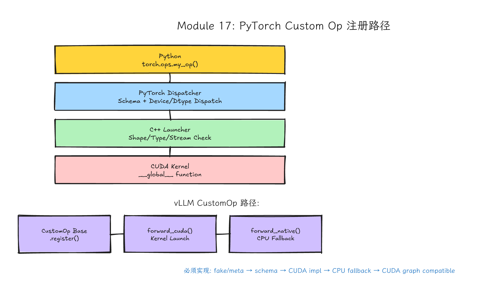
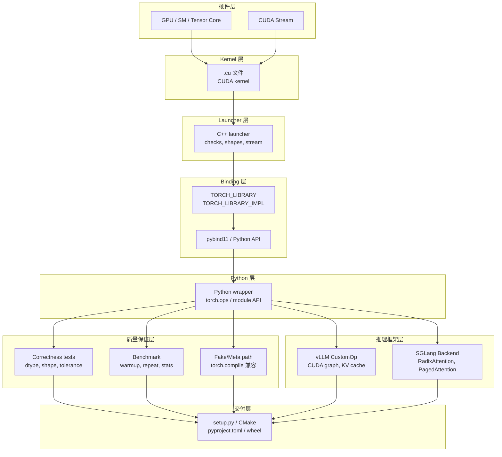
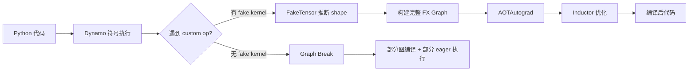
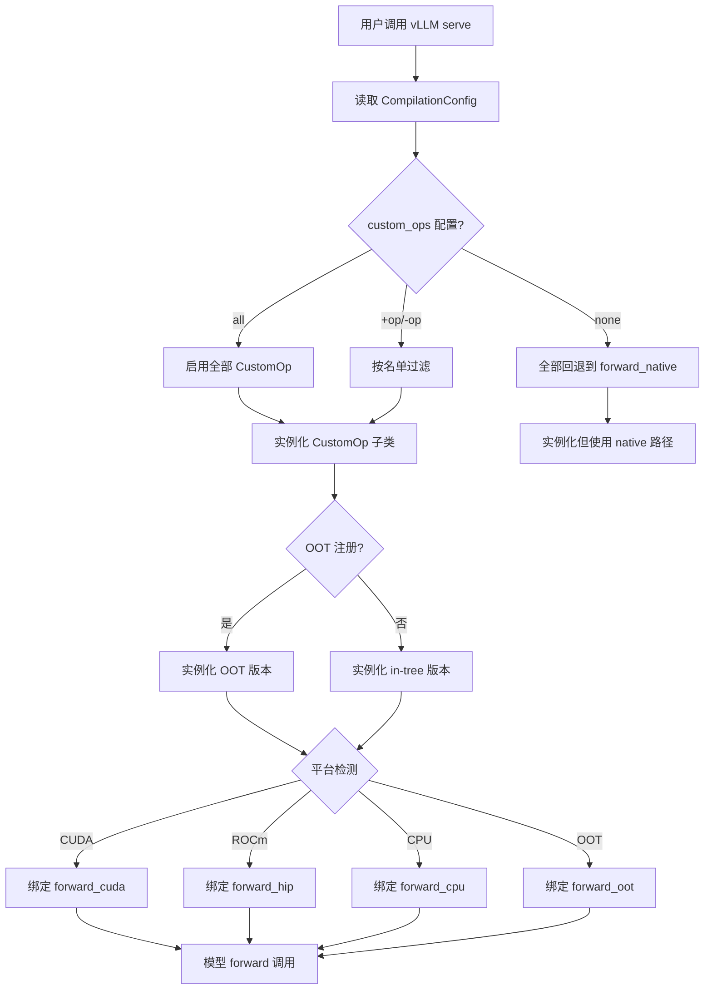
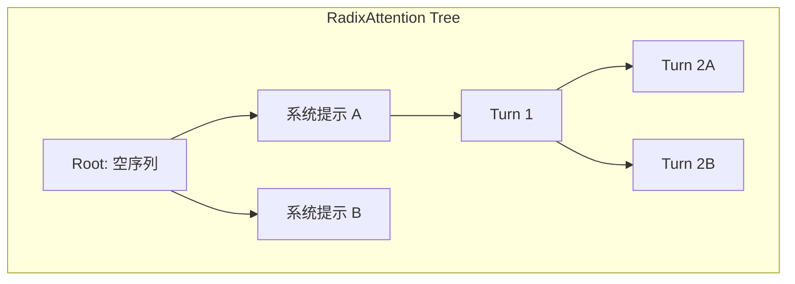

# Module 17: PyTorch Custom Ops 到 vLLM / SGLang 注册路径 — 精品讲义



*图 17-1：CUDA kernel 经 C++ launcher、`TORCH_LIBRARY`、`torch.ops` 到 vLLM/SGLang 的集成路径。可编辑源图：[`module-17-pytorch-custom-op.excalidraw`](../diagrams/module-17-pytorch-custom-op.excalidraw)。*

> **Level**: Expert
> **Estimated time**: 25–35 小时
> **Prerequisites**: Modules 0–10, 13–16
> **Sources**: PyTorch custom C++/CUDA operator tutorial (https://docs.pytorch.org/tutorials/advanced/cpp_custom_ops.html), PyTorch custom Python operators tutorial (https://docs.pytorch.org/tutorials/advanced/python_custom_ops.html), current PyTorch `torch.library` docs, vLLM CustomOp documentation (https://docs.vllm.ai/en/stable/api/vllm/model_executor/custom_op/), SGLang docs (https://docs.sglang.ai/), NVIDIA PhysicsNeMo torch.compile guide (https://docs.nvidia.com/physicsnemo/latest/user-guide/performance_docs/torch_compile_support.html), PyTorch Developer Mailing List — Custom Ops Under torch.compile (https://dev-discuss.pytorch.org/t/custom-ops-under-torch-compile-autograd-function-vs-torch-library-custom-op/3338/4)

## 学习目标

完成本模块后，你将能够：

1. 用 `TORCH_LIBRARY` / `TORCH_LIBRARY_IMPL` 和 `torch.library.custom_op` 两种方式注册 PyTorch custom operator，并解释它们各自的适用场景。
2. 为 custom op 编写符合 `torch.compile` 要求的 `fake` / `meta` implementation，理解 Dynamo tracing 为什么需要形状信息而不需要真实数据。
3. 使用 `torch.utils.cpp_extension` 的 JIT 路径（`load_inline`、`load`）和 AOT 路径（`setup.py` / `CMake` / `pyproject.toml`）构建 CUDA extension。
4. 在 vLLM 的 `CustomOp` 基类上继承、注册、实现 `forward_cuda` / `forward_native`，并理解 OOT (out-of-tree) plugin 的替换机制。
5. 理解 SGLang 的 `RadixAttention` 缓存体系与 custom backend 的集成点，比较它与 vLLM 在 custom op 层面的差异。
6. 设计一套覆盖 FP32 / FP16 / BF16 / FP8 的精度验证体系，使用 `torch.testing.assert_close` 设置合理的 tolerance，并编写包含 warmup、repeat、统计、报告的 benchmark 脚本。
7. 诊断 custom op 与 `torch.compile` / `torch.export` / CUDA graph / 多 GPU 环境的交互问题，并给出修复策略。

---

## 这一课的故事线

很多 CUDA 课程停在"写一个 `.cu` 文件，跑出正确结果"。真实 AI 工程不会停在这里。现在写 CUDA 算子，通常要注册到 PyTorch，和 eager mode、`torch.compile`、fake tensor、autograd、dtype dispatch、device dispatch、benchmark、CI、wheel packaging 打交道。进入 vLLM / SGLang 这类推理框架后，还要考虑 custom op 生命周期、CUDA graph、模型配置、KV cache、调度器和 fallback path。

这节课把你从"会写 kernel"推到"能交付框架算子"。同一个 CUDA kernel，只有被框架正确调用、测试、测量、打包、降级，才算工程完成。

---

## 类比：发动机装车以后才算产品

单独跑通 kernel，像发动机在台架上能转。PyTorch custom op 是把发动机装进车，让油门、仪表盘、刹车、冷却都能工作。vLLM / SGLang 集成则是把车放进车队调度系统，要求它在高峰期、不同路线、不同司机手里都稳定。


---

## 从 CUDA kernel 到 PyTorch op 的分层心智模型



每一层都有自己的失败模式。kernel 正确不代表 launcher 正确；launcher 正确不代表 PyTorch dispatch 正确；PyTorch op 正确不代表能被 vLLM scheduler 安全调用。production-ready 的 custom op 必须打通所有层。

---

## PyTorch Custom Op 的两种注册范式

PyTorch 提供两条互补的注册路径：

| 路径 | 入口 API | 适合场景 | 主要缺点 |
|------|---------|---------|---------|
| C++ 原生注册 | `TORCH_LIBRARY` / `TORCH_LIBRARY_IMPL` | 性能敏感、需要和现有 C++ 库集成 | 需要编译 C++ 扩展 |
| Python 原生注册 | `torch.library.custom_op`（当前官方教程按 PyTorch 2.4+ 讲解；具体可用 API 以安装版本为准） | 快速原型、Python-centric workflow | 额外 Python 开销 |

### 3.1 TORCH_LIBRARY 的 Schema 定义语法

`TORCH_LIBRARY` 定义 operator schema，它是 PyTorch dispatcher 的契约接口。Schema 规定 op 名字、参数类型、返回值、是否就地修改 (mutates)。

Schema 语法规则：

```cpp
// 基础函数
m.def("scale_add(Tensor x, Tensor y, float alpha) -> Tensor");

// 就地操作（in-place），Tensor 后缀加 !
m.def("scale_add_(Tensor(a!) x, Tensor y, float alpha) -> Tensor(a!)");

// 多返回值
m.def("my_op(Tensor x) -> (Tensor, Tensor)");

// 可选参数
m.def("my_op(Tensor x, float alpha=1.0) -> Tensor");

// 只定义 schema；具体后端或 Composite 实现放到 TORCH_LIBRARY_IMPL 中注册。
// 如果需要保守别名分析，应按当前 PyTorch C++ API 使用 schema / alias analysis 相关重载，
// 不要把 DispatchKey 当作 m.def 的别名分析参数。
m.def("my_op(Tensor x) -> Tensor");
```

关键字段说明：
- `Tensor(a!)`：表示 in-place 操作，参数 `a` 会被修改。
- `-> (Tensor, Tensor)`：返回多个 tensor，Python 侧收到 tuple。
- `float alpha=1.0`：提供默认值，Python 侧可省略。
- `alias_analysis`：现代 PyTorch 通常从 schema 的 alias annotation（如 `Tensor(a!)`）推断别名和 mutation 关系；只有在旧代码或特殊扩展中才会显式走 conservative alias analysis。不要把 `CompositeExplicitAutograd` 这类 dispatch key 写进 schema 定义里。

### 3.2 TORCH_LIBRARY_IMPL 的 Dispatch 机制

PyTorch 的 dispatcher 维护一张从 `DispatchKey` 到 kernel 的映射表。常见 key 包括：

| DispatchKey | 含义 | 典型用法 |
|-------------|------|---------|
| `CPU` | CPU 后端实现 | `TORCH_LIBRARY_IMPL(mylib, CPU, m)` |
| `CUDA` | CUDA 后端实现 | `TORCH_LIBRARY_IMPL(mylib, CUDA, m)` |
| `Meta` | Meta / Fake 路径 | shape/dtype 推导，不访问 data pointer |
| `CompositeExplicitAutograd` | 显式组合实现 | 用现有 ATen 操作组合新 op，不自动推导 backward |
| `CompositeImplicitAutograd` | 隐式组合实现 | 同上，但自动推导 backward |
| `Autograd` | 统一 autograd 实现 | 为所有后端提供单一 backward |
| `AutogradCUDA` | CUDA 专用 autograd | 覆盖 CUDA 后端的 backward |

简化调度直觉：
1. 后端/功能特化实现（如 `CUDA`, `CPU`, `SparseCPU`, `QuantizedCUDA`）优先处理对应 tensor。
2. Autograd 相关 key 会参与包装和 backward 处理，具体顺序不是一张简单线性表。
3. 若没有后端特化，才可能落到 `CompositeImplicitAutograd` / `CompositeExplicitAutograd` 这类组合实现。

生产排查时不要凭这三条猜测 dispatch 结果，应使用 `torch._C._dispatch_dump_table("namespace::op")` 或 PyTorch dispatcher 日志查看当前安装版本的真实注册表。

```cpp
// 示例：为同一 op 注册 CUDA 和 Meta 实现
TORCH_LIBRARY(my_ops, m) {
    m.def("scale_add(Tensor x, Tensor y, float alpha) -> Tensor");
}

TORCH_LIBRARY_IMPL(my_ops, CUDA, m) {
    m.impl("scale_add", &scale_add_cuda);
}

TORCH_LIBRARY_IMPL(my_ops, Meta, m) {
    m.impl("scale_add", &scale_add_meta);
}

TORCH_LIBRARY_IMPL(my_ops, CompositeExplicitAutograd, m) {
    m.impl("scale_add", &scale_add_composite);
}
```

> Dispatcher 像电话交换机。Schema 是电话号码簿，`TORCH_LIBRARY_IMPL` 是接线员把某个号码接到具体办公室。告诉交换机你的号码，来电自动转到正确办公室。

### 3.3 使用 torch.library.custom_op（现代 PyTorch API）

当前 PyTorch 官方 custom Python operator 教程按 PyTorch 2.4+ 讲解 `torch.library.custom_op`、`register_fake`、`register_autograd` 和 `opcheck` 工作流。不同 PyTorch minor 版本在参数、检查工具和 export/compile 集成上可能有差异，课程实验必须记录 `torch.__version__`，并以本机文档/源码为准。

```python
import torch
from torch.library import custom_op

@custom_op("mylib::fused_softmax_scale", mutates_args=())
def fused_softmax_scale(x: torch.Tensor, scale: float) -> torch.Tensor:
    # 自定义 op 的 eager 实现。
    # 这里可以是 Python 逻辑，也可以调用外部 C++ / CUDA kernel。
    # 实际生产中可以调用 pybind 暴露的 C++ kernel
    return torch.softmax(x * scale, dim=-1)

@fused_softmax_scale.register_fake
def _(x: torch.Tensor, scale: float) -> torch.Tensor:
    # Fake / Meta 实现：只返回 shape/dtype 正确的空 tensor，
    # 不执行任何真实计算。这是 torch.compile 兼容的关键。
    return torch.empty_like(x)
```

`custom_op` 的关键参数：
- `mutates_args`：列出哪些输入参数会被就地修改。PyTorch 需要知道这一点以正确做内存规划和 aliasing 分析。
- `register_fake`：如果希望 custom op 稳定参与 `torch.compile`、FakeTensor shape 推导或 export 流程，通常必须提供；等价的 C++ Meta kernel 也可以承担这个角色。没有 fake/meta 实现时，编译器往往只能 graph break 或把 op 当成不透明边界处理。

---

## 4. Launcher 是第一道工程边界

一个好的 launcher 至少做这些事：

1. 检查所有 tensor 在 CUDA device 上（`TORCH_CHECK(x.is_cuda())`）。
2. 检查 dtype 是否支持（`TORCH_CHECK(x.scalar_type() == at::kFloat)`）。
3. 检查 shape 是否一致（`TORCH_CHECK(x.sizes() == y.sizes())`）。
4. 处理 non-contiguous tensor：明确要求 contiguous 或支持 stride 计算。
5. 分配输出 tensor（`torch::empty_like(x)`）。
6. 用 `c10::cuda::CUDAGuard` 切到输入 tensor 所在 device，再获取当前 CUDA stream（`at::cuda::getCurrentCUDAStream()`）。
7. 根据 shape 选择 grid / block。
8. launch kernel 后做错误检查（`C10_CUDA_KERNEL_LAUNCH_CHECK()`）。
9. 不偷偷 `cudaDeviceSynchronize()` — 那会破坏 overlap。

错误示例 vs 正确示例：

```cpp
// ========== BAD ==========
my_kernel<<<grid, block>>>(x.data_ptr<float>(), y.data_ptr<float>(), n);
// 问题：没有检查 dtype、device、shape、contiguity、stream、同步点

// ========== GOOD ==========
torch::Tensor scale_add_cuda(torch::Tensor x, torch::Tensor y, double alpha) {
    TORCH_CHECK(x.is_cuda(), "x must be a CUDA tensor");
    TORCH_CHECK(y.is_cuda(), "y must be a CUDA tensor");
    TORCH_CHECK(x.device() == y.device(), "x and y must be on the same device");
    TORCH_CHECK(x.scalar_type() == torch::kFloat32, "x must be float32");
    TORCH_CHECK(y.scalar_type() == torch::kFloat32, "y must be float32");
    TORCH_CHECK(x.sizes() == y.sizes(), "x and y must have the same shape");
    TORCH_CHECK(x.is_contiguous(), "x must be contiguous");
    TORCH_CHECK(y.is_contiguous(), "y must be contiguous");

    c10::cuda::CUDAGuard device_guard(x.device());
    auto out = torch::empty_like(x);
    int64_t n = x.numel();
    if (n == 0) { return out; }

    int block = 256;
    int grid = static_cast<int>((n + block - 1) / block);

    cudaStream_t stream = at::cuda::getCurrentCUDAStream();
    scale_add_kernel<<<grid, block, 0, stream>>>(
        x.data_ptr<float>(),
        y.data_ptr<float>(),
        out.data_ptr<float>(),
        static_cast<float>(alpha),
        n);

    C10_CUDA_KERNEL_LAUNCH_CHECK();
    return out;
}
```

课程里不要鼓励学生直接复制这段，而是理解每个检查为什么存在。`TORCH_CHECK` 定义了 op 支持什么、不支持什么。`CUDAGuard` 把当前 CUDA device 切到输入 tensor 所在设备，current stream 决定 op 能否正确嵌入 PyTorch 的异步执行和框架调度。

---

## 精品代码 1：PyTorch custom op 完整注册骨架（支持多 dtype、多 device）

下面代码展示 C++/CUDA extension 的核心结构，支持 float32、float16 和 bfloat16，并显式处理 current stream 和 launch check。这是从 kernel 到框架算子的完整模板。

```cpp
// scale_add_kernel.cu
#include <torch/extension.h>
#include <ATen/cuda/CUDAContext.h>
#include <c10/cuda/CUDAGuard.h>

// ========== CUDA Kernel ==========
template <typename T>
__global__ void scale_add_kernel(const T* x,
                                   const T* y,
                                   T* out,
                                   float alpha,
                                   int64_t n) {
    int64_t i = static_cast<int64_t>(blockIdx.x) * blockDim.x + threadIdx.x;
    if (i < n) {
        out[i] = x[i] + static_cast<T>(alpha) * y[i];
    }
}

// ========== C++ Launcher with dtype dispatch ==========
torch::Tensor scale_add_cuda(torch::Tensor x,
                             torch::Tensor y,
                             double alpha) {
    // 1. Device check
    TORCH_CHECK(x.is_cuda(), "x must be a CUDA tensor");
    TORCH_CHECK(y.is_cuda(), "y must be a CUDA tensor");
    TORCH_CHECK(x.device() == y.device(), "x and y must be on the same device");
    c10::cuda::CUDAGuard device_guard(x.device());

    // 2. Dtype check & dispatch
    TORCH_CHECK(x.scalar_type() == y.scalar_type(),
                "x and y must have the same dtype");
    TORCH_CHECK(x.scalar_type() == torch::kFloat32 ||
                x.scalar_type() == torch::kFloat16 ||
                x.scalar_type() == torch::kBFloat16,
                "Only float32, float16, and bfloat16 are supported");

    // 3. Shape check
    TORCH_CHECK(x.sizes() == y.sizes(),
                "x and y must have the same shape");

    // 4. Contiguity check (教学示例：要求 contiguous)
    TORCH_CHECK(x.is_contiguous(), "x must be contiguous");
    TORCH_CHECK(y.is_contiguous(), "y must be contiguous");

    // 5. Allocate output
    auto out = torch::empty_like(x);
    int64_t n = x.numel();
    if (n == 0) { return out; }

    // 6. Grid / block configuration
    int block = 256;
    int grid = static_cast<int>((n + block - 1) / block);

    // 7. Get current CUDA stream from PyTorch context
    cudaStream_t stream = at::cuda::getCurrentCUDAStream();

    // 8. Dtype dispatch to kernel template
    AT_DISPATCH_FLOATING_TYPES_AND2(
        at::ScalarType::Half, at::ScalarType::BFloat16,
        x.scalar_type(), "scale_add_cuda", [&] {
            scale_add_kernel<scalar_t><<<grid, block, 0, stream>>>(
                x.data_ptr<scalar_t>(),
                y.data_ptr<scalar_t>(),
                out.data_ptr<scalar_t>(),
                static_cast<float>(alpha),
                n);
        });

    // 9. Kernel launch check
    C10_CUDA_KERNEL_LAUNCH_CHECK();
    return out;
}

// ========== Schema & Registration ==========
TORCH_LIBRARY(my_ops, m) {
    // schema 是框架契约。它让 PyTorch dispatcher 知道 op 名字、参数和返回值。
    m.def("scale_add(Tensor x, Tensor y, float alpha) -> Tensor");
}

TORCH_LIBRARY_IMPL(my_ops, CUDA, m) {
    m.impl("scale_add", &scale_add_cuda);
}
```

**逐行教学要点**：
1. `AT_DISPATCH_FLOATING_TYPES_AND2` 是 PyTorch 提供的 dtype dispatch 宏。它会在编译期为所有支持的 dtype 生成 switch case，运行时根据输入 dtype 调用对应模板实例。
2. `c10::cuda::CUDAGuard` 必须在多 GPU 代码里显式使用：device 一致性检查只能拒绝跨卡输入，guard 才会把当前 CUDA device 和随后取得的 current stream 对齐到 `x.device()`。
3. `at::cuda::getCurrentCUDAStream()` 获取的是当前 CUDA device 上的 PyTorch current stream，而不是默认 stream。这保证 custom op 和 PyTorch 的异步调度（如 `cudaStreamSynchronize` 链）正确配合。
4. `C10_CUDA_KERNEL_LAUNCH_CHECK()` 检查 kernel 启动本身是否失败（如非法 grid 配置），不检查 kernel 内部计算错误。

---

## 精品代码 2：PyTorch 的 fake / meta implementation 完整示例

`torch.compile` 和 `torch.export` 在 tracing 阶段使用 `FakeTensor`（或 `MetaTensor`）来推断计算图的形状，而不分配真实 GPU 内存。如果你的 custom op 没有注册 fake / meta kernel，Dynamo 会在这个位置 **graph break**，导致无法完整编译。

```python
# fake_meta_impl.py
import torch
from torch.library import custom_op

# 方式 1：用 C++ 注册 Meta kernel（推荐用于性能敏感路径）
# 在 C++ 中：
# TORCH_LIBRARY_IMPL(my_ops, Meta, m) {
#     m.impl("scale_add", &scale_add_meta);
# }
# 
# torch::Tensor scale_add_meta(torch::Tensor x, torch::Tensor y, double alpha) {
#     // 不访问 data_ptr，只推导输出形状和 dtype
#     TORCH_CHECK(x.sizes() == y.sizes(), "shape mismatch");
#     return torch::empty_like(x);
# }

# 方式 2：用 Python 注册 fake kernel（适合 torch.library.custom_op 路径）
@custom_op("mylib::scale_add_py", mutates_args=())
def scale_add_py(x: torch.Tensor, y: torch.Tensor, alpha: float) -> torch.Tensor:
    # eager 实现：可以调用 C++ 扩展或纯 Python
    return x + alpha * y

@scale_add_py.register_fake
def _(x: torch.Tensor, y: torch.Tensor, alpha: float) -> torch.Tensor:
    # Fake 实现三原则：
    # 1. 不访问任何 tensor 的 data_ptr()
    # 2. 只根据输入 shape / dtype / device 推导输出
    # 3. 返回一个同 shape / dtype / device 的空 tensor（empty / empty_like）
    TORCH_CHECK = torch._check
    TORCH_CHECK(x.shape == y.shape, lambda: "x and y must have the same shape")
    TORCH_CHECK(x.dtype == y.dtype, lambda: "x and y must have the same dtype")
    TORCH_CHECK(x.device == y.device, lambda: "x and y must be on the same device")
    return torch.empty_like(x)

# 验证 fake kernel 是否被正确注册
if __name__ == "__main__":
    from torch._subclasses.fake_tensor import FakeTensorMode
    
    with FakeTensorMode():
        a = torch.randn(3, 4, device="cuda")
        b = torch.randn(3, 4, device="cuda")
        c = torch.ops.mylib.scale_add_py(a, b, 0.5)
        print(c.shape)   # torch.Size([3, 4])
        print(c.dtype)   # torch.float32
        print(c.device)  # cuda:0
```

Fake kernel 不是近似计算，而是形状推断。Dynamo 需要知道 `output.shape`、`output.dtype`、`output.device`，才能构建正确的 FX graph。Fake kernel 不分配真实内存，不执行真实计算，但必须在逻辑上等价于真实 forward 的 shape 推导。

---

## 5. Autograd 支持：如何为 custom op 写 backward

如果你的 custom op 需要在训练中使用，必须提供 backward 路径。有三种方式：

| 方式 | 适用场景 | 复杂度 |
|------|---------|--------|
| `CompositeImplicitAutograd` | 用现有 ATen 操作组合 | 低，但性能不一定最优 |
| `torch.autograd.Function` | Python 自定义 backward | 中，和 `torch.compile` 交互需要小心 |
| `torch.library.custom_op` + `register_autograd` | 推荐现代做法 | 中，最干净 |

### 方式一：CompositeImplicitAutograd（最简单，但性能受限）

```cpp
// 如果 scale_add 可以用现有 ATen 操作实现：
torch::Tensor scale_add_composite(torch::Tensor x, torch::Tensor y, double alpha) {
    return x + alpha * y;  // 自动获得 backward
}
TORCH_LIBRARY_IMPL(my_ops, CompositeImplicitAutograd, m) {
    m.impl("scale_add", &scale_add_composite);
}
```

### 方式二：torch.library.custom_op + register_autograd（现代推荐）

```python
import torch
from torch.library import custom_op

@custom_op("mylib::fused_scale_add", mutates_args=())
def fused_scale_add(x: torch.Tensor, y: torch.Tensor, alpha: float) -> torch.Tensor:
    # 这里可以调用 C++/CUDA kernel，也可以纯 Python
    return x + alpha * y

@fused_scale_add.register_fake
def _(x, y, alpha):
    return torch.empty_like(x)

# 定义 backward
# 注意：setup_context 在 forward 后立刻执行，接收完整的 inputs 和 outputs
def setup_context(ctx, inputs, output):
    x, y, alpha = inputs
    ctx.save_for_backward(x, y)
    ctx.alpha = alpha

def backward(ctx, grad_out):
    x, y = ctx.saved_tensors
    alpha = ctx.alpha
    # dL/dx = grad_out * 1
    # dL/dy = grad_out * alpha
    # dL/dalpha = sum(grad_out * y)
    grad_x = grad_out
    grad_y = grad_out * alpha
    grad_alpha = None  # alpha 不是 tensor，返回 None
    return grad_x, grad_y, grad_alpha

fused_scale_add.register_autograd(backward, setup_context=setup_context)
```

为什么 `register_autograd` 是现代推荐做法？
- `torch.compile` 把 custom op 当作 graph 中的 opaque 节点，不需要 trace 到 backward 内部。
- `setup_context` 和 `backward` 分离，使得 compiler 可以在 forward 和 backward 之间正确插入节点。
- 对比 `torch.autograd.Function`：Dynamo 会尝试 trace 进 `forward()` 方法体，里面有 opaque kernel 调用时就会 graph break。

---

## 6. torch.compile 兼容性：如何写 fake / meta implementation

`torch.compile`（Dynamo + AOTAutograd + Inductor）编译时需要遍历整个计算图。遇到 custom op 但不知道输出形状时，Dynamo 会 graph break，导致：

1. 该 op 及之前的代码变成 eager 执行。
2. 无法参与 Inductor 的 kernel fusion。
3. 可能产生大量 recompile（因为 graph 被切碎了）。

修复方法：确保 custom op 有 `register_fake`（或 C++ 的 Meta kernel）。

```python
import torch
from torch.library import custom_op

@custom_op("mylib::my_fused_op", mutates_args=())
def my_fused_op(x: torch.Tensor, scale: float) -> torch.Tensor:
    # 真实 eager 实现
    return x * scale + 1.0

@my_fused_op.register_fake
def _(x: torch.Tensor, scale: float) -> torch.Tensor:
    # 必须和 eager 实现输出完全相同的 shape / dtype / device
    return torch.empty_like(x)
```

Dynamo tracing 的工作流程：



### torch.library.opcheck 的使用

现代 PyTorch 提供 `torch.library.opcheck` 来验证 custom op 的 contract 是否正确；当前官方教程将它放在 PyTorch 2.4+ 的 custom op 工作流中讲解，包括：

- 是否能在 fake tensor 上正确运行。
- 是否返回正确的形状和 dtype。
- 是否对不合法输入抛出正确异常。

```python
from torch.library import opcheck

# 测试一次 op 调用的 dispatcher / fake / autograd contract
args = (
    torch.randn(3, 4, device="cuda"),
    torch.randn(3, 4, device="cuda"),
    0.5,
)
opcheck(torch.ops.my_ops.scale_add.default, args)
```

### torch.export 和 custom op 的交互

`torch.export.export` 需要捕获一个完整的、可序列化的计算图。如果 graph 中有 custom op：

1. 通常需要 `register_fake` 或 C++ Meta kernel，才能在 fake tensor / export 路径上推导 shape、dtype 和 aliasing。
2. 如果 custom op 是 opaque 的（即 compiler 看不到内部），`torch.export` 会把它当作 graph 中的一个节点保留。
3. 自定义 op 的 schema 必须稳定，因为导出的 graph 会硬编码这个 schema。

```python
import torch

class MyModel(torch.nn.Module):
    def forward(self, x):
        return torch.ops.my_ops.scale_add(x, x, 0.5)

model = MyModel()
# 需要 strict=False 如果 custom op 不被 Dynamo 完全支持
try:
    exported = torch.export.export(model, (torch.randn(2, 3, device="cuda"),))
    print(exported.graph)
except Exception as e:
    print(f"Export failed: {e}")
```

---

## 7. PyTorch Extension 构建详解

从源码到可导入的 Python 模块，有多条构建路径。选择哪条取决于迭代速度需求和部署环境。

### 7.1 torch.utils.cpp_extension 的 JIT 编译（load_inline、load）

JIT 编译通常是本地实验里迭代最快的原型路径之一。把 C++/CUDA 代码以字符串形式传给 Python，PyTorch 在第一次导入时自动编译、缓存 `.so` 文件；但它不适合所有发布场景，因为首次编译时间、编译器可用性和缓存路径都要纳入部署设计。

```python
# jit_compile_example.py
import torch
from torch.utils.cpp_extension import load_inline

# 定义 C++ / CUDA 源码（实际项目中应放在单独文件里）
cuda_source = '''
#include <torch/extension.h>
#include <ATen/cuda/CUDAContext.h>
#include <c10/cuda/CUDAGuard.h>

template <typename T>
__global__ void add_one_kernel(const T* x, T* out, int64_t n) {
    int64_t i = blockIdx.x * blockDim.x + threadIdx.x;
    if (i < n) {
        out[i] = x[i] + T(1);
    }
}

torch::Tensor add_one_cuda(torch::Tensor x) {
    TORCH_CHECK(x.is_cuda(), "x must be CUDA");
    TORCH_CHECK(x.is_contiguous(), "x must be contiguous");
    c10::cuda::CUDAGuard device_guard(x.device());
    auto out = torch::empty_like(x);
    int64_t n = x.numel();
    if (n == 0) return out;
    int block = 256;
    int grid = (n + block - 1) / block;
    cudaStream_t stream = at::cuda::getCurrentCUDAStream();
    AT_DISPATCH_FLOATING_TYPES(x.scalar_type(), "add_one_cuda", [&] {
        add_one_kernel<scalar_t><<<grid, block, 0, stream>>>(
            x.data_ptr<scalar_t>(), out.data_ptr<scalar_t>(), n);
    });
    C10_CUDA_KERNEL_LAUNCH_CHECK();
    return out;
}

TORCH_LIBRARY(my_jit_ops, m) {
    m.def("add_one(Tensor x) -> Tensor");
}
TORCH_LIBRARY_IMPL(my_jit_ops, CUDA, m) {
    m.impl("add_one", &add_one_cuda);
}
'''

# 编译并加载（首次运行会编译，之后从缓存加载）
# extra_cuda_cflags 可传递 nvcc 编译选项
jit_module = load_inline(
    name="add_one_cuda",
    cpp_sources="",  # 如果有纯 C++ 代码放这里
    cuda_sources=cuda_source,
    # 这里使用 TORCH_LIBRARY 注册 dispatcher op，而不是暴露 pybind 函数。
    # 因此不要传 functions=["add_one"]，否则 load_inline 会尝试生成一个
    # 名为 add_one 的 Python binding，但源码里并没有这个 C++ 函数。
    is_python_module=False,
    extra_cuda_cflags=["-O2"],
    verbose=True,
)

# 使用
x = torch.randn(1000, device="cuda")
y = torch.ops.my_jit_ops.add_one(x)
print((y - x).abs().max())  # 应接近 1.0
```

`load_inline` 参数说明：
- `name`：模块名，编译后的 `.so` 文件名前缀。
- `cpp_sources` / `cuda_sources`：源码字符串。
- `is_python_module=False`：把编译产物作为 dispatcher 扩展库加载，只依赖 `TORCH_LIBRARY` 的注册副作用；如果要生成 Python module binding，才使用 `functions=[...]`。
- `extra_cuda_cflags`：传给 `nvcc` 的额外标志，如 `-O3`, `-use_fast_math`。
- `verbose=True`：打印编译命令，方便调试。

**注意**：JIT 编译的缓存路径在 `~/.cache/torch_extensions/` 下。如果修改了源码，需要手动删除缓存或更改 `name` 来触发重新编译。

### 7.2 setup.py 的完整配置（含 CUDA 扩展）

AOT 编译是 production 的标准路径。需要写 `setup.py`（或 `pyproject.toml`），定义 `CUDAExtension` 和 `BuildExtension`。

```python
# setup.py
from setuptools import setup, find_packages
from torch.utils.cpp_extension import BuildExtension, CUDAExtension
import os

_src_path = os.path.dirname(os.path.abspath(__file__))

ext_modules = [
    CUDAExtension(
        name="my_ops._cuda",  # Python 导入路径
        sources=[
            os.path.join(_src_path, "csrc", "scale_add.cpp"),
            os.path.join(_src_path, "csrc", "scale_add_kernel.cu"),
        ],
        extra_compile_args={
            "cxx": ["-O3", "-std=c++17"],
            "nvcc": [
                "-O3",
                "-std=c++17",
                "--use_fast_math",
                # 解除 half 操作限制（PyTorch 旧版本需要）
                "-U__CUDA_NO_HALF_OPERATORS__",
                "-U__CUDA_NO_HALF_CONVERSIONS__",
            ],
        },
        include_dirs=[
            os.path.join(_src_path, "csrc"),
        ],
    ),
]

setup(
    name="my_ops",
    version="0.1.0",
    packages=find_packages(),
    ext_modules=ext_modules,
    cmdclass={
        "build_ext": BuildExtension,
    },
    install_requires=["torch>=2.0"],
    python_requires=">=3.8",
)
```

构建命令：

```bash
# 开发模式（editable install），修改 C++ 代码后重新编译
python setup.py build_ext --inplace

# 或现代方式
pip install -e .

# 指定 GPU 架构（避免编译所有架构浪费时间）
TORCH_CUDA_ARCH_LIST="8.0 8.6 9.0+PTX" pip install -e .
```

`TORCH_CUDA_ARCH_LIST` 是关键环境变量。不设置时，PyTorch 会为所有检测到的 GPU 以及 PTX 编译，编译时间可能极长。生产环境应显式指定目标架构。

### 7.3 CMake 与 PyTorch 的集成（find_package(Torch)）

如果需要把 PyTorch extension 集成到更大的 C++ 项目（如一个既有 C++ 库又想暴露 PyTorch tensor 接口），CMake 是更灵活的选择。

```cmake
# CMakeLists.txt
cmake_minimum_required(VERSION 3.18)
project(my_torch_extension LANGUAGES CXX CUDA)

set(CMAKE_CXX_STANDARD 17)
set(CMAKE_CUDA_STANDARD 17)

# 找到 PyTorch
find_package(Torch REQUIRED)

# 找到 CUDA Toolkit。不要使用遗留的 find_package(CUDA) / FindCUDA。
find_package(CUDAToolkit REQUIRED)

add_library(my_torch_ops SHARED
    csrc/scale_add.cpp
    csrc/scale_add_kernel.cu
)

# 链接 PyTorch 库
target_link_libraries(my_torch_ops
    "${TORCH_LIBRARIES}"
    CUDA::cudart
)

# 包含 PyTorch 头文件
target_include_directories(my_torch_ops PRIVATE
    "${TORCH_INCLUDE_DIRS}"
)

# 设置 CUDA 属性
set_target_properties(my_torch_ops PROPERTIES
    CUDA_SEPARABLE_COMPILATION ON
    CUDA_ARCHITECTURES "80;86;90"
)
```

CMake 路径适合：
- 需要链接其他第三方 C++ 库（如 cuDNN、CUTLASS、FlashInfer）。
- 需要更细粒度的编译控制（如 device link、static library 混合）。
- 需要跨平台支持（Windows、Linux 统一构建）。

### 7.4 Python wheel 的打包和发布

```toml
# pyproject.toml（现代 Python 打包标准）
[build-system]
requires = ["setuptools", "wheel", "torch"]
build-backend = "setuptools.build_meta"

[project]
name = "my_ops"
version = "0.1.0"
description = "PyTorch custom CUDA ops for my project"
requires-python = ">=3.8"
dependencies = ["torch>=2.0"]

[project.optional-dependencies]
dev = ["pytest", "black", "mypy"]
```

打包命令：

```bash
# 构建 wheel
python -m build --wheel

# 上传到私有 PyPI
python -m twine upload --repository-url "$PRIVATE_PYPI_URL" dist/*.whl
```

CUDA extension 的 wheel 通常绑定平台、Python/PyTorch ABI、CUDA Toolkit/runtime 组合和目标 GPU 架构。发布时需要在 CI 中构建目标矩阵 wheel，或用 JIT 路径避免分发二进制。

---

## 8. vLLM CustomOp 详解

vLLM 的 custom op 不是普通 PyTorch extension 的简单包装。它处在推理系统里，需要按 platform、backend、dtype、模型结构选择不同实现。vLLM 提供 `CustomOp` 基类和 `@CustomOp.register` 装饰器来统一管理多态分发。下面是教学化简版；真实源码还包含 `compile_native`、`forward_tpu`、`forward_oot`、`dynamic_arg_dims`、全局 `op_registry` / `op_registry_oot` 等细节。

### 8.1 vLLM 的 CustomOp 基类和注册机制

```python
# vllm/model_executor/custom_op.py 的简化心智模型
from typing import Optional, Dict, Type
import torch.nn as nn

class CustomOp(nn.Module):
    op_registry: Dict[str, Type['CustomOp']] = {}
    op_registry_oot: Dict[str, Type['CustomOp']] = {}

    def __new__(cls, *args, **kwargs):
        # 关键：如果 OOT 注册了这个 op 名，实例化 OOT 版本
        op_name = cls.__name__
        if op_name in cls.op_registry_oot:
            op_cls_to_instantiate = cls.op_registry_oot[op_name]
        else:
            op_cls_to_instantiate = cls
        return super().__new__(op_cls_to_instantiate)

    def __init__(self):
        super().__init__()
        # dispatch_forward 根据当前平台选择 forward 方法
        self._forward_method = self.dispatch_forward(compile_native=False)

    def forward(self, *args, **kwargs):
        return self._forward_method(*args, **kwargs)

    def forward_native(self, *args, **kwargs):
        raise NotImplementedError

    def forward_cuda(self, *args, **kwargs):
        raise NotImplementedError

    def forward_hip(self, *args, **kwargs):
        return self.forward_cuda(*args, **kwargs)

    def forward_cpu(self, *args, **kwargs):
        return self.forward_native(*args, **kwargs)

    def forward_xpu(self, *args, **kwargs):
        return self.forward_native(*args, **kwargs)

    def forward_tpu(self, *args, **kwargs):
        return self.forward_native(*args, **kwargs)

    def forward_oot(self, *args, **kwargs):
        return self.forward_native(*args, **kwargs)

    @classmethod
    def enabled(cls) -> bool:
        # 真实 vLLM 会读取 CompilationConfig.custom_ops，支持 "all"/"none"/"+op"/"-op"。
        return True

    def dispatch_forward(self, compile_native: bool):
        # 根据 compilation_config 和当前平台选择实现
        if not self.enabled():
            return self.forward_native
        if current_platform.is_rocm():
            return self.forward_hip
        elif current_platform.is_cpu():
            return self.forward_cpu
        elif current_platform.is_xpu():
            return self.forward_xpu
        elif current_platform.is_tpu():
            return self.forward_tpu
        elif current_platform.is_out_of_tree():
            return self.forward_oot
        else:
            return self.forward_cuda

    @classmethod
    def register(cls, name: str):
        def decorator(op_cls):
            assert name not in cls.op_registry
            op_cls.name = name
            cls.op_registry[name] = op_cls
            return op_cls
        return decorator

    @classmethod
    def register_oot(cls, _decorated_op_cls=None, name: Optional[str] = None):
        # Out-of-tree plugin 注册
        def decorator(op_cls):
            reg_name = name if name is not None else cls.__name__
            cls.op_registry_oot[reg_name] = op_cls
            op_cls.name = reg_name
            return op_cls
        return decorator
```

### 8.2 forward_xxx() 的实现模式

```python
# vLLM CustomOp 完整示例：FusedRMSNorm
from vllm.model_executor.custom_op import CustomOp
import torch
import torch.nn as nn

@CustomOp.register("fused_rms_norm")
class FusedRMSNorm(CustomOp):
    def __init__(self, hidden_size, eps=1e-6):
        super().__init__()
        self.weight = nn.Parameter(torch.ones(hidden_size))
        self.variance_epsilon = eps

    def forward_native(self, x: torch.Tensor) -> torch.Tensor:
        # PyTorch 原生实现，用于：
        # 1. CPU fallback
        # 2. torch.compile 兼容（如果 forward_native 可被编译）
        # 3. 测试 baseline
        variance = x.pow(2).mean(dim=-1, keepdim=True)
        x = x * torch.rsqrt(variance + self.variance_epsilon)
        return x * self.weight

    def forward_cuda(self, x: torch.Tensor) -> torch.Tensor:
        # 调用 C++/CUDA kernel（通过 torch.ops 或 pybind）
        # 这里假设我们有一个 C++ 扩展注册了 vllm::rms_norm
        return torch.ops.vllm.rms_norm(x, self.weight, self.variance_epsilon)

    def forward_hip(self, x: torch.Tensor) -> torch.Tensor:
        # ROCm 默认调用 CUDA 实现，但如果需要特定优化可以覆盖
        return self.forward_cuda(x)
```

### 8.3 out-of-tree device plugin 的注册

vLLM 支持 out-of-tree (OOT) 设备插件。假设你是一家加速器厂商，想让 vLLM 跑在你的硬件上：

```python
# 在你的 OOT 包中：
from vllm.model_executor.custom_op import CustomOp
# 真实项目里应从 vLLM 对应模块导入要替换的 in-tree 类。
# 这里沿用上文教学类名，表达“继承被替换类，复用其 __init__ / 参数 / buffer”。
from my_vllm_layers import FusedRMSNorm

@CustomOp.register_oot(name="FusedRMSNorm")
class MyAcceleratorRMSNorm(FusedRMSNorm):
    def forward_oot(self, x):
        # 你的硬件特定实现。self.weight / self.variance_epsilon 来自
        # FusedRMSNorm.__init__，因此 OOT 类应继承 in-tree 类或完整复刻其初始化。
        return my_accelerator_ops.rms_norm(x, self.weight, self.variance_epsilon)
```

`__new__` 的魔力：vLLM 内部实例化 `FusedRMSNorm` 时，如果 `op_registry_oot` 中有同名 OOT 类，实际实例化的是 OOT 版本。注意这里的 OOT key 要匹配 in-tree 类名（例如 `FusedRMSNorm`），不是一定匹配 `@CustomOp.register("fused_rms_norm")` 里的 op 名。OOT 类还必须兼容 in-tree 类的构造函数、参数、buffer 和 forward contract；最稳妥的方式通常是继承被替换类，只覆盖硬件特定的 `forward_oot` / `forward_cuda`。这实现运行时替换，无需修改 vLLM 源码。

### 8.4 vLLM 的 CUDA graph 兼容性要求

推理框架经常用 CUDA graph 减少 launch overhead。CUDA graph 要求：

1. **固定的 shape**：如果每次 forward 的输入 shape 不同，graph capture 会失败或需要重新 capture。
2. **固定的内存地址**：如果 op 内部动态分配临时 buffer（如 `torch::empty`），graph 可能捕获到非法地址。
3. **无 CPU 同步**：graph 内不能有 `cudaDeviceSynchronize()` 或 `cudaStreamSynchronize()`。
4. **稳定的 kernel 调用序列**：不能有条件分支导致某些迭代调用 kernel A、另一些迭代调用 kernel B。

vLLM 的 `CustomOp` 如何应对：
- 在 `__init__` 中预分配所有临时 buffer（如工作空间）。
- 使用 `forward_native` 作为 graph 捕获时的 fallback（因为某些 custom CUDA kernel 不支持 graph）。
- `compilation_config` 控制是否启用 custom op，如果用户开启 graph 编译且 op 不兼容，可以自动回退到 `forward_native`。

### 8.5 vLLM 的 platform / backend 抽象

vLLM 通过 `current_platform` 对象封装硬件差异：

```python
# vllm/platform 的简化心智模型
class Platform:
    @classmethod
    def is_rocm(cls): return False
    @classmethod
    def is_cpu(cls): return False
    @classmethod
    def is_cuda(cls): return True
    @classmethod
    def is_out_of_tree(cls): return False

# dispatch_forward 中使用：
def dispatch_forward(self):
    if current_platform.is_rocm():
        return self.forward_hip
    if current_platform.is_out_of_tree():
        return self.forward_oot
    return self.forward_cuda
```

### 8.6 vLLM 的 model_config 与 op 的交互

vLLM 的 `CompilationConfig` 决定哪些 custom op 启用、哪些禁用：

```python
# vllm/config/compilation_config.py 的简化逻辑
from collections import Counter

class CompilationConfig:
    custom_ops: List[str]  # 格式：["+op_name", "-op_name", "all", "none"]
    enabled_custom_ops: Counter[str]
    disabled_custom_ops: Counter[str]
```

用户可以通过启动参数控制。当前 vLLM 同时支持 `--compilation-config` / `-cc` 的 JSON 形式，以及文档中出现的 `--compilation_config.custom_ops` 点语法；教学和脚本里更推荐 JSON 形式，因为它和源码里的 `CompilationConfig(custom_ops=[...])` 结构一一对应：

```bash
# 启用所有 custom ops
vllm serve meta-llama/Llama-3-8B \
  --compilation-config '{"custom_ops": ["all"]}'

# 禁用全部 custom ops，通常回退到 forward_native / torch.compile 路径
vllm serve meta-llama/Llama-3-8B \
  --compilation-config '{"custom_ops": ["none"]}'

# 启用所有 custom ops，但禁用某个 op
# 注意把 rms_norm 替换成你在 CustomOp.register(...) 中注册的真实 op 名。
vllm serve meta-llama/Llama-3-8B \
  --compilation-config '{"custom_ops": ["all", "-rms_norm"]}'

# 默认禁用，只启用少数 op
vllm serve meta-llama/Llama-3-8B \
  --compilation-config '{"custom_ops": ["none", "+rms_norm", "+gelu"]}'
```

`CustomOp.enabled()` 方法读取这个配置，决定当前 op 是否被激活。`all` 与 `none` 不能同时出现；`+op` 表示强制启用某个 op，`-op` 表示强制禁用某个 op。注意要区分两层语法：vLLM 的点语法 CLI 追加形式（如 `-cc.custom_ops+=+silu_mul,-rms_norm`）会在 argparse 层把逗号拆成多个 list 元素；但如果你直接传 JSON 或直接构造 `CompilationConfig(custom_ops=[...])`，源码会按 **list 中每个字符串元素** 校验，`"all,-rms_norm"` 这种逗号拼接的单字符串不会被 `CompilationConfig` 自动拆成 `["all", "-rms_norm"]`。若禁用，vLLM 会回退到 `forward_native`，即使硬件支持 CUDA。当前 vLLM 还会根据 `CompilationConfig.backend` 与 `CompilationConfig.mode` 在默认配置里追加 `all` 或 `none`，因此调试自定义算子时最好显式打印或记录最终的 `custom_ops` 配置。

### 8.7 vLLM 的 op 注册路径（Mermaid 图）



---

## 9. SGLang 详解

SGLang 和 vLLM 一样面向高性能 LLM serving，但调度、后端、kernel 组织方式不同。本节聚焦 SGLang 的 custom backend 和 attention 机制，帮助理解 custom op 在 SGLang 中的落点。

### 9.1 SGLang 的 RadixAttention 和 PagedAttention 的集成

SGLang 的核心创新是 `RadixAttention`：它把所有已计算过的 token 序列组织成一棵 radix tree（压缩前缀树），树的每条边对应一段 token 序列，值是对应的 KV cache 张量句柄。



新请求到达时，SGLang 在 radix tree 中做最长前缀匹配：
1. 命中的前缀直接复用其 KV cache（零计算）。
2. 剩余 token 做预填充计算。
3. 新生成的序列增量插回 radix tree，供后续请求复用。

这与 vLLM 的 `PagedAttention` 对比：

| 特性 | vLLM PagedAttention | SGLang RadixAttention |
|------|-------------------|---------------------|
| 缓存结构 | 固定大小 block；本地 vLLM `CacheConfig.DEFAULT_BLOCK_SIZE` 当前为 16，但平台/backend 可通过 preferred block size 调整 | Radix tree prefix cache（边可压缩变长前缀片段，底层仍要映射到 KV cache/page 管理） |
| 前缀匹配 | Prefix caching / APC，是否启用取决于模型能力和配置 | Radix tree 最长前缀匹配 |
| 配置需求 | 当前 vLLM 会按模型能力设置 prefix caching 默认值，也可用 `--enable-prefix-caching` 显式控制 | RadixAttention prefix cache 默认开启，可用 `--disable-radix-cache` 关闭 |
| 多轮对话 | 可复用 block/hash 命中的前缀，但粒度和命中率取决于 block/hash 策略 | 适合复用共享前缀；是否“精确”还取决于 tokenizer、prefix 边界、KV page 管理和调度策略 |
| 最佳场景 | 大 batch、独立请求 | 多轮对话、RAG、few-shot |

对 custom op 开发者的启示：
- SGLang 的 attention 相关 op 必须和 `RadixAttention` 的 KV cache layout 兼容。
- KV cache 不是简单的 `(B, H, S, D)` 张量，而是分散在 radix tree 的各节点中，通过 page table 间接索引。
- 如果你要为 SGLang 写 custom attention kernel，必须理解 `page_size` 和 `token_to_kv_pool` 的映射。

### 9.2 SGLang 的 custom backend 机制

SGLang 支持通过 backend 插件接入自定义 attention / sampling / 量化算子。与 vLLM 的 `CustomOp` 不同，SGLang 的 backend 更偏向子图替换：

```python
# SGLang backend 的简化概念（非真实 API，用于教学）
class CustomBackend:
    def __init__(self):
        self.attn_backend = MyCustomAttention()  # 替换默认 attention
    
    def forward_attention(self, q, k, v, kv_cache, attn_metadata):
        # 使用自定义 kernel
        return self.attn_backend.forward(q, k, v, kv_cache, attn_metadata)
```

SGLang 的 backend 抽象允许：
- 替换整个 attention 子图（如用 FlashInfer、xFormers、或你自己的 Triton kernel）。
- 自定义 sampling 逻辑（如自定义 temperature scaling、top-p、repetition penalty）。
- 自定义量化/反量化 kernel（如 FP8、INT8、INT4）。

### 9.3 SGLang 与 vLLM 的差异点

| 维度 | vLLM | SGLang |
|------|------|--------|
| Custom op 注册 | `CustomOp` 基类 + `@register` | Backend 插件 + 子图替换 |
| 调度粒度 | Op-level dispatch（forward_cuda / forward_native） | Backend-level dispatch（整个 attention / mlp） |
| OOT 支持 | `register_oot` 运行时替换 | 通过 `__init__.py` 动态加载 backend 模块 |
| CUDA graph | 支持，需固定 shape | 支持，需兼容 radix tree 动态页面分配 |
| 编译栈 | `torch.compile` piecewise / compilation config 控制 | `torch.compile` 是可选实验路径，当前 SGLang server 参数通过 `--enable-torch-compile` 启用，默认关闭 |
| Prefix cache | APC / prefix caching，是否默认启用取决于模型能力和配置 | RadixAttention 默认启用；它是 radix-tree prefix cache，不等同于每个 token 一个独立节点 |

课程不要求背框架内部机制，而是训练迁移能力：任何推理框架里 custom kernel 最终都要回答四个问题。

1. 这个算子被谁调用？
2. 输入 layout 是谁保证的？
3. 输出会喂给哪个下游算子？
4. 硬件、dtype、shape 不支持时，fallback 是什么？

问清楚这四个问题，比记住某个版本的文件名更重要。

---

## 10. 精度验证体系

精度验证不是 `torch.allclose` 一句。不同 kernel 的数值误差来自：

- reduction 顺序不同。
- Tensor Core accumulation dtype 不同（TF32 vs FP32）。
- FP16 / BF16 / TF32 / FP8 量化误差。
- fused epilogue 改变舍入位置。
- atomic 顺序不确定。
- fast math 近似。

### 10.1 不同精度模式下的误差分析

| 精度 | 动态范围 | 精度（相对 FP32） | 典型误差来源 |
|------|---------|----------------|------------|
| FP32 | ~1e38 | 基准 | 无（作为 reference） |
| FP16 | ~65504 | ~1/2048 | 大数累加时溢出 |
| BF16 | ~3e38 | ~1/256 | 小数累加时精度损失 |
| FP8 (E4M3) | ~448 | ~1/16 | 量化和反量化误差 |
| FP8 (E5M2) | ~57344 | ~1/64 | 同上，范围更大 |

### 10.2 torch.testing.assert_close 的 tolerance 设置

```python
import torch

def test_op_tolerance():
    # 获取参考输出（FP32 在 CPU 上高精度计算）
    x_fp32 = torch.randn(1024, 1024, device="cpu")
    y_fp32 = torch.randn(1024, 1024, device="cpu")
    ref = x_fp32 + 0.5 * y_fp32  # 假设这是参考实现
    
    # 测试 FP16 CUDA kernel
    x_fp16 = x_fp32.half().cuda()
    y_fp16 = y_fp32.half().cuda()
    out_fp16 = torch.ops.my_ops.scale_add(x_fp16, y_fp16, 0.5)
    
    # FP16 的合理 tolerance：rtol ~1e-3, atol ~1e-5
    torch.testing.assert_close(
        out_fp16.cpu().float(),
        ref.float(),
        rtol=1e-3,
        atol=1e-5,
        msg="FP16 output mismatch"
    )
    
    # 测试 BF16
    x_bf16 = x_fp32.bfloat16().cuda()
    y_bf16 = y_fp32.bfloat16().cuda()
    out_bf16 = torch.ops.my_ops.scale_add(x_bf16, y_bf16, 0.5)
    
    # BF16 精度更低：rtol ~1e-2, atol ~1e-4
    torch.testing.assert_close(
        out_bf16.cpu().float(),
        ref.float(),
        rtol=1e-2,
        atol=1e-4,
        msg="BF16 output mismatch"
    )
```

### 10.3 数值稳定性测试（adversarial values、extreme values）

```python
def test_adversarial_values():
    test_cases = [
        ("large_values", 1e4, 1e-4),
        ("small_values", 1e-8, 1e-8),
        ("mixed_sign", -1.0, 1.0),
        ("near_zero", 1e-10, 1e-10),
        ("inf", float('inf'), 1.0),
        ("nan", float('nan'), 1.0),
    ]
    
    for name, vx, vy in test_cases:
        x = torch.full((1024,), vx, device="cuda", dtype=torch.float32)
        y = torch.full((1024,), vy, device="cuda", dtype=torch.float32)
        out = torch.ops.my_ops.scale_add(x, y, 0.5)
        
        # 检查 NaN 传播
        if torch.isnan(x).any() or torch.isnan(y).any():
            assert torch.isnan(out).any(), f"NaN not propagated in {name}"
        
        # 检查 Inf 传播
        if torch.isinf(x).any() or torch.isinf(y).any():
            assert torch.isinf(out).any(), f"Inf not propagated in {name}"
```

### 10.4 性能 benchmark 的完整设计

```python
import torch
import time
import statistics
from typing import List, Tuple

class OpBenchmark:
    def __init__(self, warmup=10, repeat=100, device="cuda"):
        self.warmup = warmup
        self.repeat = repeat
        self.device = device
    
    def run(self, fn, *args, **kwargs) -> dict:
        # 1. Warmup：触发 JIT 编译、allocator 缓存、CUDA context
        for _ in range(self.warmup):
            fn(*args, **kwargs)
        torch.cuda.synchronize(self.device)
        
        # 2. Timing loop
        timings: List[float] = []
        for _ in range(self.repeat):
            # 清空 L2 cache 以模拟真实负载（可选）
            # torch.cuda.empty_cache()
            
            start = torch.cuda.Event(enable_timing=True)
            end = torch.cuda.Event(enable_timing=True)
            
            start.record()
            fn(*args, **kwargs)
            end.record()
            
            torch.cuda.synchronize(self.device)
            timings.append(start.elapsed_time(end))  # 毫秒
        
        # 3. 统计
        timings.sort()
        return {
            "mean_ms": statistics.mean(timings),
            "median_ms": statistics.median(timings),
            "p50_ms": timings[int(self.repeat * 0.50)],
            "p90_ms": timings[int(self.repeat * 0.90)],
            "p99_ms": timings[int(self.repeat * 0.99)],
            "std_ms": statistics.stdev(timings) if self.repeat > 1 else 0.0,
            "min_ms": min(timings),
            "max_ms": max(timings),
        }
    
    def compare(self, fn_custom, fn_baseline, *args, **kwargs) -> dict:
        result_custom = self.run(fn_custom, *args, **kwargs)
        result_baseline = self.run(fn_baseline, *args, **kwargs)
        
        speedup = result_baseline["median_ms"] / result_custom["median_ms"]
        
        return {
            "custom": result_custom,
            "baseline": result_baseline,
            "speedup": speedup,
        }

# 使用示例
if __name__ == "__main__":
    x = torch.randn(4096, 4096, device="cuda", dtype=torch.float16)
    y = torch.randn(4096, 4096, device="cuda", dtype=torch.float16)
    
    bench = OpBenchmark(warmup=10, repeat=100)
    
    # 自定义 op
    def custom_op():
        return torch.ops.my_ops.scale_add(x, y, 0.5)
    
    # PyTorch baseline
    def baseline():
        return x + 0.5 * y
    
    report = bench.compare(custom_op, baseline)
    print(f"Speedup: {report['speedup']:.2f}x")
    print(f"Custom median: {report['custom']['median_ms']:.3f} ms")
    print(f"Baseline median: {report['baseline']['median_ms']:.3f} ms")
```

推荐报告格式：

```markdown
Hardware: NVIDIA H100 SXM5 80GB
Driver/CUDA/PyTorch: 535.104.05 / CUDA 12.2 / PyTorch 2.3.0
GPU architecture: SM90
Operator: my_ops.scale_add
Shapes: [(4096, 4096), (8192, 8192), (16384, 16384)]
DTypes: [float16, bfloat16]
Baseline: PyTorch eager (x + alpha * y)
Warmup: 10
Iterations: 100
Timing method: CUDA events (torch.cuda.Event)
Correctness tolerance: rtol=1e-3, atol=1e-5 (FP16)
Throughput/latency: see table below
Profiler notes: No NVprof used; pure event timing
Conclusion: Custom op matches baseline within 2% on H100; 
            no speedup observed because elementwise op is memory-bound.
```

---

## 11. 真实系统落点

### 11.1 PyTorch 的 Inductor 和 custom op 的融合

`torch.compile` 使用 Inductor 作为默认 backend，它会尝试将相邻的 pointwise 操作融合成一个 kernel。如果 custom op 被标记为 opaque（Inductor 看不到内部），它就像一个黑盒子，Inductor 无法跨越它做 fusion。

优化策略：
- 如果 custom op 是简单的 elementwise 操作，考虑用 `torch.library.custom_op` 注册并暴露其语义，而不是写 C++ 扩展。Inductor 可能能把它和周围的操作融合。
- 如果 custom op 是复杂的 fused kernel（如 fused attention），保持 opaque 可能更符合工程目标，因为你是在保护一段已经手工调优、带有专用 layout/同步策略的实现；是否优于 Inductor 生成代码仍要用目标 workload benchmark。

### 11.2 torch.compile 对 custom op 的优化

```python
import torch

# 编译包含 custom op 的模型
class MyModel(torch.nn.Module):
    def forward(self, x):
        x = torch.nn.functional.relu(x)
        x = torch.ops.my_ops.scale_add(x, x, 0.5)
        x = torch.nn.functional.softmax(x, dim=-1)
        return x

model = MyModel().cuda()
compiled = torch.compile(model, mode="reduce-overhead")

x = torch.randn(1, 4096, 4096, device="cuda")
# 第一次调用会编译（包含 custom op 的图）
out = compiled(x)
```

Dynamo 对 custom op 的处理：
1. 如果 custom op 有 `register_fake`，Dynamo 会把它当作一个节点加入 FX graph。
2. AOTAutograd 会跟踪这个节点的梯度需求。
3. Inductor 尝试将 custom op 和周围节点融合（如果语义允许）。
4. 最终生成的 Triton / C++ kernel 中，custom op 可能以函数调用形式出现，而不是内联展开。

### 11.3 推理框架中的 op 调度（prefill vs decode 的不同路径）

LLM 推理有两个阶段：

| 阶段 | 计算特征 | 对 custom op 的要求 |
|------|---------|-------------------|
| **Prefill** | 处理完整 prompt，计算量大，GEMM 密集 | 支持大 batch、长序列、PagedAttention / RadixAttention 索引 |
| **Decode** | 每次生成一个 token，memory-bound | 支持增量 KV cache、低 launch overhead、CUDA graph 友好 |

vLLM 的 `CustomOp` 在 prefill 和 decode 中可能调用不同实现：

```python
class MyAttentionOp(CustomOp):
    def forward_cuda(self, query, key, value, attn_metadata):
        if attn_metadata.is_prompt:  # prefill 阶段
            return flash_attn_varlen_func(query, key, value, ...)
        else:  # decode 阶段
            return flash_attn_decode_func(query, key, value, ...)
```

### 11.4 多 GPU 环境下的 custom op 分发

在多 GPU 环境下（Data Parallel / Tensor Parallel / Pipeline Parallel），custom op 必须正确处理：

1. **Device placement**：`TORCH_CHECK(x.device() == y.device())`。
2. **CUDA context**：先用 `c10::cuda::CUDAGuard` 对齐当前 device，再用 `at::cuda::getCurrentCUDAStream()` 获取当前线程在该 device 上的 stream。
3. **Tensor Parallel**：如果 custom op 是 collective（如 all-reduce、all-gather），需要和 PyTorch distributed 的 NCCL backend 配合。
4. **PyTorch DTensor**：如果模型使用 `torch.distributed._tensor`（DTensor），custom op 的 fake implementation 需要返回正确 `device_mesh` 和 `placements` 的空 tensor。

```cpp
// 多 GPU 下的 launcher 检查示例
torch::Tensor my_op_cuda(torch::Tensor x, torch::Tensor y) {
    TORCH_CHECK(x.is_cuda(), "x must be CUDA");
    TORCH_CHECK(y.is_cuda(), "y must be CUDA");
    TORCH_CHECK(x.get_device() == y.get_device(), 
                "x and y must be on the same GPU");
    
    c10::cuda::CUDAGuard device_guard(x.device());
    cudaStream_t stream = at::cuda::getCurrentCUDAStream();
    
    // 使用对应设备的 stream 启动 kernel
    my_kernel<<<grid, block, 0, stream>>>(...);
}
```

---

## 精品代码 3：使用 pybind11 的 Python-C++ 绑定示例

除了 `TORCH_LIBRARY`，也可以用 pybind11 直接暴露 C++ 函数到 Python。这种方式更灵活，适合暴露复杂 C++ 类或非 tensor 接口的场景。

注意：pybind11 绑定依赖 Python C API，不适合和 `py_limited_api=True` / `Py_LIMITED_API` 的 CPython agnostic wheel 目标混用。如果目标是可被 `torch.compile`、FakeTensor 和后端 dispatcher 稳定识别的 tensor 算子，优先用 `TORCH_LIBRARY` 注册 op；pybind 更适合非 tensor 对象、调试入口或小工具接口。

```cpp
// bindings.cpp
#include <torch/extension.h>  // 包含 pybind11 和 torch C++ API
#include <vector>

class MyCppClass {
public:
    explicit MyCppClass(int value) : value(value) {}

    int compute(int scale) const {
        return value * scale;
    }

    int value;
};

// 假设我们有一个 C++ 函数，参数和返回值不是标准 tensor
torch::Tensor process_with_config(torch::Tensor x,
                                   int repeat,
                                   const std::string& mode) {
    TORCH_CHECK(x.is_cuda(), "x must be CUDA");
    TORCH_CHECK(repeat > 0, "repeat must be positive");
    
    auto out = x.clone();
    for (int i = 0; i < repeat; ++i) {
        if (mode == "add") {
            out = out + 1.0;
        } else if (mode == "mul") {
            out = out * 2.0;
        } else {
            TORCH_CHECK(false, "Unknown mode: ", mode);
        }
    }
    return out;
}

// 暴露到 Python 的模块名由 setup.py 中的 name 参数决定
PYBIND11_MODULE(TORCH_EXTENSION_NAME, m) {
    // TORCH_EXTENSION_NAME 是 PyTorch 定义的宏，替换为模块名
    m.def("process_with_config", &process_with_config,
          "Process tensor with repeat and mode",
          py::arg("x"),
          py::arg("repeat") = 1,
          py::arg("mode") = "add");
    
    // 也可以暴露 C++ 类
    py::class_<MyCppClass>(m, "MyCppClass")
        .def(py::init<int>())
        .def("compute", &MyCppClass::compute)
        .def_readwrite("value", &MyCppClass::value);
}
```

```python
# setup.py 对应配置
CUDAExtension(
    name="my_bindings",  # 模块名
    sources=["bindings.cpp", "my_kernel.cu"],
    # pybind11 会自动包含
)
```

```python
# Python 使用
import my_bindings
result = my_bindings.process_with_config(x, repeat=3, mode="mul")
```

pybind11 vs TORCH_LIBRARY 的选择：
- 如果你只需要暴露标准的 tensor-in-tensor-out 算子，用 `TORCH_LIBRARY` + `TORCH_LIBRARY_IMPL`，它与 PyTorch dispatcher 深度集成，支持 autograd、dispatch、torch.compile。
- 如果你需要暴露非标准接口（如自定义 C++ 类、配置对象、字符串参数），用 pybind11。
- 两者可以共存：同一个 C++ 扩展文件里既写 `TORCH_LIBRARY` 又写 `PYBIND11_MODULE`。但一旦写了 pybind/Python C API，这个扩展就不应再声明为 `py_limited_api`/abi3 wheel；要把 dispatcher op 和 pybind 工具入口分成不同扩展，或放弃 CPython agnostic 发布目标。

---

## 精品代码 4：vLLM CustomOp 的完整注册示例（继承 CustomOp、register、forward）

```python
# my_vllm_ops.py
from vllm.model_executor.custom_op import CustomOp
import torch
import torch.nn as nn

# 假设我们有一个 C++ 扩展注册了 vllm::my_fused_mlp
# TORCH_LIBRARY(vllm, m) {
#     m.def("my_fused_mlp(Tensor x, Tensor w1, Tensor w2, float alpha) -> Tensor");
# }
# TORCH_LIBRARY_IMPL(vllm, CUDA, m) {
#     m.impl("my_fused_mlp", &my_fused_mlp_cuda);
# }

@CustomOp.register("my_fused_mlp")
class MyFusedMLP(CustomOp):
    def __init__(self, hidden_size: int, intermediate_size: int):
        super().__init__()
        self.w1 = nn.Parameter(torch.randn(intermediate_size, hidden_size))
        self.w2 = nn.Parameter(torch.randn(hidden_size, intermediate_size))
        self.alpha = hidden_size ** -0.5
    
    def forward_native(self, x: torch.Tensor) -> torch.Tensor:
        # PyTorch native fallback，用于：
        # 1. CPU 推理
        # 2. torch.compile / 禁用 custom op 时的 fallback 路径
        # 3. 测试 baseline
        h = torch.nn.functional.silu(torch.nn.functional.linear(x, self.w1))
        return torch.nn.functional.linear(h, self.w2) * self.alpha
    
    def forward_cuda(self, x: torch.Tensor) -> torch.Tensor:
        # 调用 C++/CUDA 优化实现
        # 使用 torch.ops.vllm.my_fused_mlp 访问注册到 dispatcher 的 kernel
        return torch.ops.vllm.my_fused_mlp(x, self.w1, self.w2, self.alpha)
    
    def forward_hip(self, x: torch.Tensor) -> torch.Tensor:
        # ROCm 默认调用 CUDA 路径，但如果需要可以覆盖
        return self.forward_cuda(x)

# 使用方式：和普通 nn.Module 一样
def test_my_fused_mlp():
    mlp = MyFusedMLP(hidden_size=4096, intermediate_size=11008).cuda()
    x = torch.randn(2, 4096, device="cuda")
    
    # 在 CUDA 上自动调用 forward_cuda
    out_cuda = mlp(x)
    
    # 强制使用 native fallback（例如用于测试）
    # 使用同一个 module 的权重，避免新建 CPU module 导致 device/weight 不一致。
    out_native = mlp.forward_native(x)
    
    torch.testing.assert_close(out_cuda, out_native, rtol=1e-3, atol=1e-5)
    print("vLLM CustomOp test passed!")
```

**关键点**
- `@CustomOp.register("my_fused_mlp")` 把类名注册到全局 `op_registry`。
- `forward_native` 在 vLLM API 层面是 optional（基类默认抛 `NotImplementedError`），但生产 op 强烈建议实现：它是测试 baseline、禁用 custom op、部分编译路径或非 CUDA 平台的 fallback。
- `forward_cuda` 调用 `torch.ops.vllm.my_fused_mlp`，C++ 扩展必须在 `vllm` 命名空间下注册了这个 op。
- `__new__` 的 OOT 替换机制允许第三方硬件厂商不修改 vLLM 源码就替换这个 op。

---

## Lab 1: 从零写一个 PyTorch CUDA op

目标：实现 `scale_add(x, y, alpha)`，输出 `x + alpha * y`。

要求：
1. C++ launcher 检查 dtype、device、shape。
2. CUDA kernel 支持 float32 和 float16。
3. Python wrapper 调用 `torch.ops`。
4. pytest 覆盖小 shape、随机 shape、non-contiguous 输入处理策略。
5. benchmark 对比 `x + alpha * y` 的 PyTorch baseline。
6. 报告中解释为什么这个 op 不一定比 PyTorch 快。

这个任务故意简单，重点是工程路径，不是 kernel 花活。

### 参考实现结构

```
my_scale_add/
├── csrc/
│   ├── scale_add.cpp       # launcher + TORCH_LIBRARY
│   └── scale_add_kernel.cu # CUDA kernel
├── tests/
│   └── test_scale_add.py   # pytest
├── benchmarks/
│   └── bench_scale_add.py  # benchmark
├── setup.py                # CUDAExtension 配置
└── pyproject.toml
```

---

## Lab 2: 注册 fake / meta implementation

目标：让 op 能在 fake tensor 或 compile 相关路径下完成 shape propagation。

任务：
- 写出 output shape 和 dtype 推导。
- 不访问真实 data pointer。
- 用 PyTorch 提供的检查工具验证 schema 和 fake path。
- 说明 fake implementation 为什么不能调用 CUDA kernel。

### 验证步骤

```python
import torch
from torch._subclasses.fake_tensor import FakeTensorMode

# 1. 注册 fake kernel
# 2. 在 FakeTensorMode 下调用 op
# 3. 验证输出 shape / dtype / device 正确
# 4. 使用 torch.library.opcheck 做 contract 验证

with FakeTensorMode():
    x = torch.randn(3, 4, device="cuda")
    y = torch.randn(3, 4, device="cuda")
    out = torch.ops.my_ops.scale_add(x, y, 0.5)
    assert out.shape == (3, 4)
    assert out.dtype == torch.float32
    assert out.device == torch.device("cuda:0")
```

---

## Lab 3: 为 custom op 添加 autograd backward

目标：让 `scale_add` 支持梯度回传。

任务：
- 使用 `torch.library.custom_op` + `register_autograd` 注册 backward。
- 验证 `torch.autograd.gradcheck` 通过。
- 在 `torch.compile(fullgraph=True)` 下测试是否成功编译（无 graph break）。

```python
from torch.autograd import gradcheck

# 假设你在本 Lab 中注册的新 op 名为 my_autograd_ops::scale_add，
# 并且它支持 float64 + register_autograd。
# 前文 C++ 示例 my_ops::scale_add 只声明支持 fp32/fp16/bf16，不能直接拿来跑 gradcheck。
op = torch.ops.my_autograd_ops.scale_add.default

x = torch.randn(10, 10, device="cuda", dtype=torch.float64, requires_grad=True)
y = torch.randn(10, 10, device="cuda", dtype=torch.float64, requires_grad=True)

# 验证梯度正确
assert gradcheck(op, (x, y, 0.5))

# 验证 torch.compile 兼容
compiled = torch.compile(op, fullgraph=True)
out = compiled(x, y, 0.5)
loss = out.sum()
loss.backward()
```

---

## Lab 4: vLLM 读码任务

阅读本地 vLLM（或 GitHub 源码）：

```bash
rg -n "TORCH_LIBRARY|torch\.ops|CustomOp|register_fake|paged_attention|fp8|fp4|SM90|SM100"     vllm/ csrc/
```

写一份笔记：
- 哪些 op 在 C++ 里注册？
- Python 层 `_custom_ops.py` 如何包装？
- 哪些 op 和 attention / KV cache 相关？
- 哪些 op 和 FP8 / FP4 量化相关？
- 哪些编译分支和 GPU architecture 相关？
- 你会如何把自己的 op 放进类似结构？

---

## Lab 5: 接入推理框架的设计文档

为假想 `fused_rmsnorm_quant` op 写设计文档：

```markdown
Operator schema:
Inputs and outputs:
Supported dtypes:
Supported architectures:
Memory layout requirements:
CUDA graph compatibility:
PyTorch eager fallback:
vLLM/SGLang integration point:
Correctness reference:
Benchmark shapes:
Failure modes:
```

---

## Checkpoint

提交：
- 一个可构建的 PyTorch CUDA extension。
- pytest correctness report。
- benchmark report。
- vLLM 或 SGLang custom op 读码笔记。
- 一个推理框架接入设计文档。

---

## 常见误区

- 只写 kernel，不写 shape / dtype / device contract。
- benchmark 只测 Python enqueue 时间，不测 kernel 实际执行时间。
- 用 `cudaDeviceSynchronize()` 掩盖 stream 依赖问题。
- 没有 fake / meta path，却期待和现代 PyTorch 编译栈兼容。
- 认为接入 vLLM / SGLang 只是改一个 Python wrapper。
- 没有 fallback，导致不支持的 GPU 上直接崩溃。
- 在 multi-GPU 环境下假设所有 tensor 都在 device 0。
- 忽略 `torch.compile` 的 graph break 问题，导致性能不升反降。
- benchmark 不 warmup，测到的是 JIT 编译时间而非真实性能。
- 对 FP16 / BF16 使用 FP32 的 tolerance，导致误报或漏报。

---

## 深入追问

1. 为什么 PyTorch custom op 需要 schema，而不是只暴露一个 Python 函数？
2. 为什么 launcher 不应该随便同步？
3. fake tensor / meta implementation 解决的是什么问题？
4. 为什么 vLLM / SGLang 中的 custom op 要关心 scheduler 和 KV cache？
5. 如果某个 op 只在 SM90 上快，你会怎么写 fallback？
6. benchmark 如何同时覆盖单 op 性能和端到端 serving 性能？
7. `torch.compile` 如何处理 custom op 的 backward？
8. 多 GPU 环境下，custom op 如何确保 tensor 和 stream 在正确的 device 上？
9. 为什么 vLLM 的 `CustomOp` 使用 `__new__` 而不是简单的工厂函数？
10. SGLang 的 RadixAttention 对 custom attention kernel 的接口设计有什么约束？

---

## 本课要记住的一句话

一个 CUDA 算子只有完成 framework contract、correctness、benchmark、fallback 和 packaging，才从实验代码变成工程组件。

---

## 本课资料来源

- PyTorch Custom C++ and CUDA Operators: https://docs.pytorch.org/tutorials/advanced/cpp_custom_ops.html
- PyTorch custom Python operators and `opcheck`: https://docs.pytorch.org/tutorials/advanced/python_custom_ops.html
- PyTorch Custom Operation Blog (Lei Mao): https://leimao.github.io/blog/PyTorch-Custom-Operation/
- PyTorch Developer Mailing List — Custom Ops Under torch.compile: https://dev-discuss.pytorch.org/t/custom-ops-under-torch-compile-autograd-function-vs-torch-library-custom-op/3338/4
- PyTorch Custom C++ Classes for torch.compile: https://docs.pytorch.org/tutorials/advanced/custom_class_pt2.html
- NVIDIA PhysicsNeMo — Torch Compile Support: https://docs.nvidia.com/physicsnemo/latest/user-guide/performance_docs/torch_compile_support.html
- vLLM CustomOp documentation: https://docs.vllm.ai/en/stable/api/vllm/model_executor/custom_op/
- vLLM RFC — Triton Operator Dispatch: https://github.com/vllm-project/vllm/issues/31467
- SGLang documentation: https://docs.sglang.ai/
- SGLang RadixAttention Explained: https://rajatpandit.com/ai-engineering/radixattention-vs-pagedattention
- vLLM documentation: https://docs.vllm.ai/
- SGLang documentation: https://docs.sglang.ai/
- PyTorch cpp_extension tutorial: https://runebook.dev/en/articles/pytorch/cpp_extension
- PyTorch native_functions.yaml dispatch guide: https://github.com/pytorch/pytorch/blob/master/aten/src/ATen/native/README.md

本课以 PyTorch 官方 custom op 教程和 vLLM CustomOp 文档为主。现代算子工程的难点不只是 CUDA kernel，而是 schema、dispatch、fake/meta implementation、current stream、benchmark、fallback，以及推理框架如何调用这个 op。
