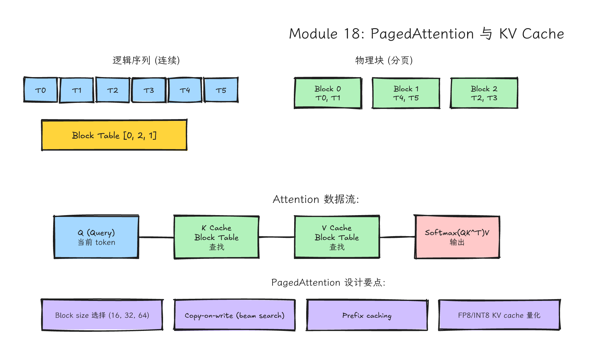
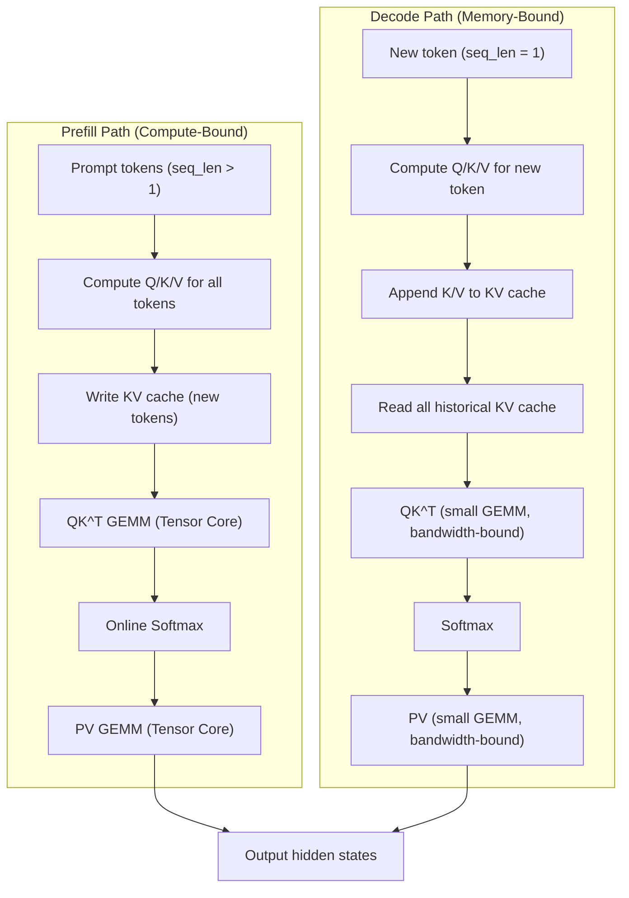
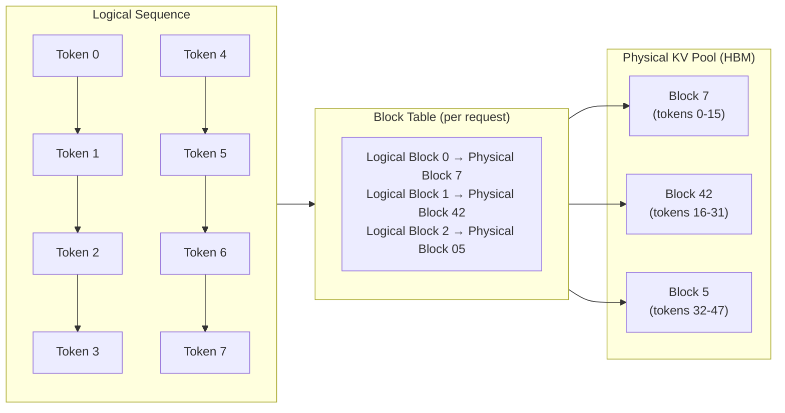
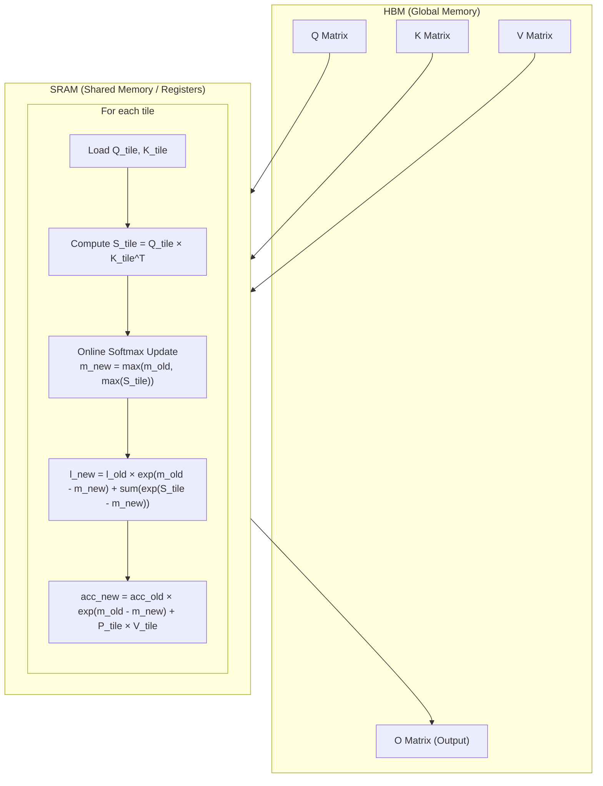
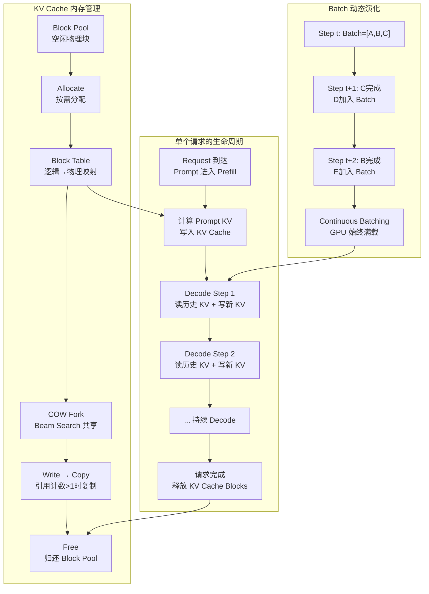

# Module 18: Attention、KV Cache、PagedAttention、MLA 与推理算子



*图 18-1：逻辑 token、block table、物理 KV cache page 与 decode attention kernel 的间接寻址关系。可编辑源图：[`module-18-pagedattention-kv-cache.excalidraw`](../diagrams/module-18-pagedattention-kv-cache.excalidraw)。*

> **Level**: Expert
> **Estimated time**: 28-40 小时
> **Prerequisites**: Modules 3, 5, 8, 13-17
> **Sources**: vLLM documentation and source, SGLang documentation, FlashAttention papers/code, NVIDIA CUDA and PTX documentation, DeepGEMM/DeepEP for adjacent GEMM and MoE paths, DeepSeek-V2/V3/R1 technical reports

---

## 学习目标

完成本模块后，你将能够：

1. 从数学层面完整推导 Self-Attention、Multi-Head Attention（MHA）、Grouped-Query Attention（GQA）、Multi-Query Attention（MQA）的公式关系，并计算各变体的 KV cache 内存占用。
2. 从直觉层面用"图书馆借阅系统"类比理解推理 attention 的核心难点：不是公式，而是动态请求的 KV cache 被高效、正确、可调度地读取。
3. 从硬件层面分析 decode attention 为什么是 memory-bound（带宽计算），理解 FlashAttention 的 tiling + online softmax 如何减少 HBM 读写，以及 Hopper 架构的 TMA/WGMMA/FP8 对 FlashAttention-3 的加速原理。
4. 从代码层面读懂 PagedAttention 的 block table、slot mapping、copy-on-write 机制；理解 FlashAttention 的 CUDA 实现要点（分块、softmax 稳定、register 管理）；能写出教学级的 decode attention kernel 骨架和 MLA 压缩概念代码。
5. 从系统层面对比 vLLM（PagedAttention）、SGLang（RadixAttention）、TensorRT-LLM（Multiblock Attention）的 attention 后端选择，理解 continuous batching 和 speculative decoding 对 attention kernel 的影响。

---

## 这一课的故事线

如果 GEMM 是 LLM 的发动机，attention 就是发动机、油路和导航系统绑在一起的复杂总成。训练时的 attention 经常是大矩阵、规整 batch、长序列；推理时的问题变了：prefill 要处理 prompt，decode 每步追加一个 token，KV cache 越来越大，请求长度参差不齐，batch scheduler 不停改变队列。你写的 attention kernel 不再只是 `QK^T softmax V`，而是必须理解 KV cache layout、page/block table、sequence metadata、mask、position encoding、quantized cache 和 framework scheduler。

这节课的目标不是从零复刻 vLLM 或 SGLang 的 attention，而是建立读懂和设计推理 attention kernel 的能力。我们将按照五个层次展开：

- **问题背景**：为什么推理 attention 和训练 attention 是两类问题？
- **直觉类比**：图书馆借阅系统如何帮你建立心智模型？
- **硬件机制**：GPU 内存层次、Tensor Core、带宽瓶颈如何决定 kernel 设计？
- **代码路径**：从 PyTorch reference 到 PagedAttention 模拟，再到 FlashAttention 伪代码和 CUDA kernel 骨架。
- **真实系统落点**：vLLM、SGLang、TensorRT-LLM 如何选择和优化 attention backend？

---

## 类比：图书馆的借阅系统

把 KV cache 想成大型图书馆：

- 每个请求是一位读者。读者进入图书馆时，会借一系列书（生成一系列 token）。
- 每个 token 的 K/V 是读者已经借过的书。这些书必须被妥善保存，因为读者随时可能回来查阅。
- decode 时新 token 只带一个新问题，但要查之前所有书。也就是说，每生成一个 token，都要把历史上所有 K/V 读一遍。
- PagedAttention 像把书放在固定大小书架格子里，用目录表找到它们。逻辑上书是连续排列的，但物理上散落在不同书架。
- scheduler 像图书管理员，不断把读者合并到同一批处理，有的读者刚借完书就离开，有的继续借新书。
- MLA 像压缩索引系统，不直接保存所有展开后的 K/V，而是保存更紧凑的中间表示（latent vector），需要时再解压。
- KV cache 量化像把书缩印成更小的版本，节省书架空间，但阅读时需要放大镜（dequantization）。
- Prefix caching 像多个人读同一套教材，图书馆只需要买一套，大家共享。

推理 attention 的难点不是公式，而是 cache 组织和动态批处理。

---

## 第一部分：Attention 的数学基础

### 1.1 Self-Attention 的完整公式推导

Transformer 的核心是 Scaled Dot-Product Attention。给定 Query 矩阵 `Q`、Key 矩阵 `K`、Value 矩阵 `V`， attention 的输出定义为：

$$\text{Attention}(Q, K, V) = \text{softmax}\left(\frac{QK^T}{\sqrt{d_k}}\right)V$$

其中：
- `Q` 的 shape 为 `[seq_len_q, d_k]`，表示当前要查询的 token 序列。
- `K` 和 `V` 的 shape 为 `[seq_len_kv, d_k]` 和 `[seq_len_kv, d_v]`，表示被查询的历史 token 序列。
- `d_k` 是 head dimension，缩放因子 `1/√d_k` 防止 softmax 输入过大导致梯度消失。

在 **Self-Attention** 中，Q、K、V 都来自同一个输入序列，通过三个不同的线性投影得到：

$$Q = XW_Q, \quad K = XW_K, \quad V = XW_V$$

其中 `X` 是输入 embedding `[seq_len, hidden_dim]`，`W_Q`、`W_K`、`W_V` 是可学习的投影矩阵。

**Causal Mask** 是 decoder-only 模型（如 GPT、Llama）的关键。对于位置 `i` 的 query，只能看到位置 `≤ i` 的 key。数学上通过一个下三角 mask 实现：

$$M_{ij} = \begin{cases} 0 & \text{if } j \leq i \\ -\infty & \text{if } j > i \end{cases}$$

$$\text{Attention}(Q, K, V) = \text{softmax}\left(\frac{QK^T}{\sqrt{d_k}} + M\right)V$$

### 1.2 Multi-Head Attention（MHA）的结构

MHA 将 Q、K、V 投影到 `h` 个不同的子空间，每个子空间独立做 attention，然后拼接：

$$\text{MultiHead}(Q, K, V) = \text{Concat}(\text{head}_1, ..., \text{head}_h)W_O$$

$$\text{head}_i = \text{Attention}(QW_Q^i, KW_K^i, VW_V^i)$$

每个 head 的维度是 `d_k = hidden_dim / h`。MHA 的优点是：
- 不同 head 可以学习不同的注意力模式（局部、全局、语法、语义等）。
- 并行度高，每个 head 的计算完全独立。

MHA 的 KV cache 内存占用最大。每层每个 token 需要缓存 `h` 个 K 和 `h` 个 V。每个 token 的 KV cache 大小为：

$$\text{KV cache per token} = 2 \times \text{num_layers} \times \text{num_heads} \times \text{head_dim} \times \text{bytes_per_element}$$

先看一个 70B 量级的 **MHA baseline**（80 层，64 个 KV heads，128 head_dim，FP16）：

$$2 \times 80 \times 64 \times 128 \times 2 \text{ bytes} = 2,621,440 \text{ bytes} \approx 2.5 \text{ MB/token}$$

在 4K 上下文下，单个请求的 KV cache 就需要约 10 GB。这解释了为什么大模型推理很快会撞上显存墙。注意：Llama 2 70B / Llama 3 70B 这类真实模型通常使用 GQA，KV heads 少于 query heads，实际 KV cache 会按 `num_kv_heads / num_q_heads` 缩小；不要把上面的 MHA baseline 直接当作这些模型的真实占用。

### 1.3 Multi-Query Attention（MQA）和 Grouped-Query Attention（GQA）

#### MQA

MQA（Shazeer, 2019）将所有 query head 共享同一个 K 和 V 头。也就是说，不管有多少 query heads，KV cache 只存 1 套 K 和 1 套 V。

$$\text{KV cache reduction} = \frac{1}{\text{num_query_heads}}$$

对于 64 个 query heads 的模型，MQA 可以将 KV cache 压缩 64 倍。但代价是模型表达能力下降，因为所有 query 必须共享同一个 key/value 表示，可能导致质量下降和训练不稳定。

#### GQA

GQA（Ainslie et al., 2023）是 MHA 和 MQA 之间的折中。Query heads 被分成 `G` 个组，每组共享一个 K 和一个 V 头。

- GQA-1 = MQA（1 个组，1 个 KV head）
- GQA-H = MHA（H 个组，每个 query head 有自己的 KV head）
- GQA-G = 中间状态（G 个组，G 个 KV heads）

Llama 2 70B 使用 GQA-8（64 个 query heads，8 个 KV heads），KV cache 压缩 8 倍。Llama 3 70B 同样使用 GQA-8。

| 变体 | KV heads | KV cache 大小 | 质量 | 推理速度 | 代表模型 |
|------|----------|---------------|------|----------|----------|
| MHA | `num_q_heads` | 最大（1x baseline） | 表达能力强，常作质量基线 | KV 读写最多，decode 通常最吃带宽 | Llama 2 7B/13B |
| GQA | `G` 组 | 减小（H/G 倍） | 常能接近 MHA，但取决于训练配方 | 通常改善 decode 带宽压力 | Llama 3, Mistral 7B |
| MQA | 1 | 最小（1/H 倍） | 可能下降 | KV 读写最少，但端到端速度还受 scheduler/kernel 影响 | PaLM, Falcon |

GQA 为什么能减少 KV cache 读取？因为 decode 时，每步需要从 HBM 读取的 KV cache 数据量正比于 `num_kv_heads`。GQA 将 KV heads 从 H 减少到 G，直接成比例减少内存带宽消耗。

### 1.4 Rotary Position Embedding（RoPE）的原理和实现

Transformer 本身不具备序列顺序感知能力，需要位置编码。RoPE（Rotary Position Embedding，Su et al., 2021）是 LLaMA、DeepSeek 等模型广泛采用的位置编码方式。

#### RoPE 的思想

RoPE 不采用传统的"加性"位置编码（如正弦位置编码），而是将位置信息编码到旋转矩阵中。具体来说，对于 query/key 向量 `x` 在位置 `m`，RoPE 将其每两个维度组成一个 2D 子空间，进行旋转：

对于维度 `i`（成对维度 `2i` 和 `2i+1`），旋转角度为 `m·θ_i`，其中：

$$\theta_i = 10000^{-2i/d}$$

旋转后的向量：

$$\begin{aligned}
X_{m,2i} &= X_{m,2i} \cos(m\theta_i) - X_{m,2i+1} \sin(m\theta_i) \\
X_{m,2i+1} &= X_{m,2i} \sin(m\theta_i) + X_{m,2i+1} \cos(m\theta_i)
\end{aligned}$$

用复数形式更简洁：将 `x` 的每两个维度看作一个复数 `z = x_{2i} + j·x_{2i+1}`，则 RoPE 等价于乘以复数 `e^{j·m·θ_i}`。

#### RoPE 的优点

1. **内积天然编码相对位置**：`RoPE(q, m)·RoPE(k, n)` 只依赖于 `m - n`（相对距离），而不是绝对位置。这使得模型对长度外推更鲁棒。
2. **无需额外参数**：RoPE 是确定性的，不需要学习位置嵌入参数。
3. **与 attention 融合**：RoPE 可以在 attention kernel 内部 fuse 计算，减少内存读写。

#### 推理时的 RoPE

在 decode 阶段，新 token 的位置是 `seq_len`，需要计算 `RoPE(q, seq_len)`。但 KV cache 中存储的 K 已经带有各自位置（0 到 seq_len-1）的 RoPE。因此，当应用 RoPE 时，不能简单地对缓存的 K 重新应用旋转（因为每个 K 已经旋转了它自己的角度）。解决方案是：
- **预计算缓存**：离线计算好每个位置的 cos/sin 表，推理时直接查表。
- **动态计算**：在 kernel 内实时计算 `sin(mθ)` 和 `cos(mθ)`，fuse 到 attention 计算中。
- **在 KV cache 中存 pre-RoPE 的 K**：这样不需要为每个新位置重新处理历史 K，只需在 attention 计算时动态应用 RoPE。但这需要将 RoPE  fuse 到 attention kernel 中，增加复杂度。

### 1.5 ALiBi 位置编码简介

ALiBi（Attention with Linear Biases，Press et al., 2021）是另一种位置编码方案，被 BLOOM、MPT 等模型采用。与 RoPE 不同，ALiBi 不在输入向量上加位置信息，而是在 attention score 上直接加一个与距离成线性负相关的 bias：

$$\text{score}_{ij} = \frac{q_i \cdot k_j}{\sqrt{d_k}} - m \cdot |i - j|$$

其中 `m` 是每个 head 的固定斜率（通常前几个 head 用较大的斜率，后几个用较小的）。

ALiBi 的优点：
- 实现简单，不需要额外的位置嵌入计算。
- 长度外推性能较好（因为 bias 是线性的，不依赖周期函数）。
- 可以在 attention kernel 中直接 fuse 为 mask 的一部分。

缺点：
- 不像 RoPE 那样可以 fuse 到 Q/K 的生成中，需要在 attention score 计算后额外加 bias。
- 超长序列外推效果强依赖训练长度、数据配方、模型结构和推理时的外推方案。实践中 RoPE 配合 NTK-aware scaling、YaRN 等方案很常见，但不能简单写成“ALiBi 在 >8K 一定不如 RoPE”；正确做法是在同一模型族和同一评测任务上比较。


## 第二部分：Attention 的三种工作负载与数据流

### 2.1 Prefill

Prefill 处理 prompt（输入序列）。它通常有较长 sequence length（如 512-32K tokens），计算密集，接近训练 attention 的形态，但 batch 可能 ragged（每个请求长度不同）。优化重点是：

- **吞吐**：GEMM 效率越高越好，充分利用 Tensor Core。
- **Memory bandwidth**：虽然 compute-bound 居多，但长序列时 KV cache 写入量不可忽略。
- **Softmax 稳定性**：长序列下 `exp` 容易溢出。
- **大块矩阵访问**：prefill 的 Q/K/V 是大矩阵，适合 tiling 和 Tensor Core。

Prefill 阶段会一次性计算所有 prompt tokens 的 KV，并将它们写入 KV cache。这是推理中唯一一次需要写大量 KV 的时刻。

### 2.2 Decode

Decode 每步为每个活跃请求生成一个 token。Query length 通常很小（每个请求 1 个 token），但要读取历史 KV cache（可能长达 4K、32K 甚至 128K）。

Decode 的特征：
- **Arithmetic intensity 极低**：每步只做 `q_len=1` 的 attention，计算量相对读 HBM 的量很小。
- **Memory-bound**：瓶颈在读取 KV cache 的内存带宽，而不是 Tensor Core 算力。
- **对 launch overhead 敏感**：小 batch 时 kernel launch 时间可能占主导。
- **Cache layout 敏感**：KV cache 是否连续、是否被分页、是否量化，直接影响带宽。

### 2.3 Chunked prefill / mixed batch

真实 serving 中 prefill 和 decode 可能混合。为了提高吞吐，框架会把长 prompt 分块（chunked prefill），和 decode 请求一起调度。此时 attention kernel 要处理：
- 不同请求有不同的 query length（有的 prefill chunk 有 128 tokens，有的 decode 有 1 token）。
- 更复杂的 sequence metadata（每个请求的 context length 不同）。
- 需要统一的 attention kernel 来处理混合 query length，或者分成 prefill/decode 两条路径。



*图 1：Attention 的 Prefill 与 Decode 数据流对比。Prefill 是计算密集，Tensor Core 主导；Decode 是内存带宽密集，HBM 读取主导。*

---

## 第三部分：KV Cache 深入——推理的核心瓶颈

### 3.1 KV cache 的内存占用计算

KV cache 是推理中最大的内存消费者之一。其大小精确公式为：

$$\text{KV Cache Size} = 2 \times \text{batch_size} \times \text{num_layers} \times \text{seq_len} \times \text{num_kv_heads} \times \text{head_dim} \times \text{bytes_per_element}$$

其中 `2` 是因为每个 token 存一个 K 和一个 V。

**示例：Llama 3 70B 的 KV cache 计算**
- 80 layers, 64 query heads, 8 KV heads (GQA), 128 head_dim, FP16 (2 bytes)
- batch_size = 1, seq_len = 4096

$$2 \times 1 \times 80 \times 4096 \times 8 \times 128 \times 2 = 1,342,177,280 \text{ bytes} \approx 1.25 \text{ GB}$$

- batch_size = 64, seq_len = 4096

$$2 \times 64 \times 80 \times 4096 \times 8 \times 128 \times 2 = 85,899,345,920 \text{ bytes} \approx 80 \text{ GB}$$

这已经超过了 H100 80GB 的显存容量。这就是为什么 batch size 在长上下文下急剧收缩的原因。

### 3.2 不同 attention 变体的 KV cache 大小对比

| 变体 | num_kv_heads | KV cache 相对大小 | 代表模型 |
|------|-------------|-------------------|----------|
| MHA | H（例如 Llama 2 7B 为 32） | 1.0x (baseline) | Llama 2 7B 等传统 MHA 模型 |
| GQA（64Q/8KV） | 8 | 0.125x (8x 压缩) | Llama 2/3 70B |
| MQA | 1 | 1/H（H 倍压缩） | PaLM, Falcon |
| MLA | latent rank + RoPE dim | 模型依赖，通常是数倍到十余倍量级压缩 | DeepSeek-V2/V3 |

GQA 的压缩比由 `num_q_heads / num_kv_heads` 决定。Llama 3 70B 是 64/8 = 8x 压缩；Mistral 7B 这类 32Q/8KV 配置则是 4x 压缩。MQA 是 `num_q_heads` 倍压缩，但质量可能受损。MLA 的压缩比由 `kv_lora_rank`、RoPE 维度、head 配置和 dtype 共同决定；DeepSeek 系列模型报告了很好的质量/效率权衡，但不能把“接近或超过 MHA”当作所有模型的通用定律。

### 3.3 KV cache 的量化（FP8、INT8）

KV cache 量化是降低内存占用的直接手段。主流方案：

#### FP8 KV Cache（E4M3 / E5M2）

- **E4M3**：4 位指数，3 位尾数。NVIDIA 推理栈常见的 E4M3FN 变体最大有限值约为 448；具体范围要以框架 dtype（如 `float8_e4m3fn`、`fp8_e4m3`）定义为准。它比 E5M2 精度更高，常用于 K/V cache。
- **E5M2**：5 位指数，2 位尾数，动态范围更大，但精度较低，通常用于梯度等。
- **每 tensor 量化**：整个 K 或 V tensor 使用一个 FP32 scale。
- **更细粒度 scale**：一些框架支持 per-head、per-token-head 或类似粒度的 KV cache scale，精度通常好于单个 tensor scale，但会增加 scale 存储和 kernel 复杂度。本地 vLLM 源码可见 `fp8_per_token_head`、`int8_per_token_head`、`int4_per_token_head` 等模式；具体可用 backend、校准流程和模型支持要以当前 vLLM 文档/源码为准，不要把它当作所有 attention backend 都支持的通用 FP8 KV cache 模式。

FP8 量化的效果：
- 内存占用减半（FP16 → FP8）。
- 在 Hopper 上，FP8 Tensor Core 峰值通常约为 FP16/BF16 Tensor Core 的 2 倍；具体数字要按 H100/H200 的 SXM/PCIe 型号和是否使用稀疏模式查官方规格。
- 但 attention score 计算通常需要 dequantize 到 FP16/BF16，除非使用 FlashAttention-3 的 FP8 路径。

vLLM 的 FP8 KV cache 配置：
```python
# 最佳精度通常来自离线数据集校准得到的 scale；
# calculate_kv_scales=True 会在运行/预热路径中动态计算或更新 KV scale，
# 适合快速试验；正式精度评估仍应使用目标数据校准并记录 vLLM 版本与 backend。
kv_cache_dtype="fp8_e4m3"
calculate_kv_scales=True
```

TensorRT-LLM 的部分版本支持 FP8/INT8 KV cache，并为 context FMHA / attention 低精度路径提供过类似 `use_fp8_context_fmha` 的构建或运行选项。具体 flag 名、适用 GPU、是否支持 FP8 attention 计算以及和 KV cache dtype 的关系变化很快，课程实验应以当前 TensorRT-LLM 文档、engine build 日志和 profiler 结果为准。

#### INT8 KV Cache

- 对称量化：`q = round(x / scale)`，scale 是 per-channel 或 per-tensor。
- 非对称量化：`q = round((x - zero_point) / scale)`。
- 通常使用 per-channel（per-head-dim）scale，因为不同维度值域差异大。

INT8 量化的重建误差不能用一个固定数字概括。误差取决于 scale 粒度（per-tensor、per-head、per-channel、per-token-head）、校准数据、head_dim、上下文长度、模型激活分布和 attention backend 的 dequantize/累加精度。写课程代码时应该报告 `max_abs_error`、`relative_error`、logits 差异、困惑度或任务指标，而不是预设“attention score 误差一定小于某个阈值”。

### 3.4 KV cache 的驱逐和压缩策略

除了量化，还有其他 KV cache 压缩策略：

- **H2O（Heavy Hitter Oracle）**：基于累计 attention score / token importance 识别 heavy-hitter tokens，保留"重要"的 KV，驱逐"不重要"的。具体保留比例和质量影响取决于模型、任务、上下文长度和实现，不应简化成单一 L2 norm 规则。
- **StreamingLLM**：保留最近的 token 和最前面的几个"sink" token，丢弃中间部分。适合流式生成，但会丢失中间信息。
- **SnapKV**：基于注意力集中度，选择关键 token 保留。
- **LISA（Learnable Sharing Attention）**：跨层共享 attention weights，减少重复计算。
- **Layer-wise 压缩**：不同层使用不同的 KV cache 压缩策略（高层更压缩，低层更保留细节）。

这些策略的共同点：近似压缩，会改变模型输出。与 PagedAttention（内存管理优化，不改变输出）不同；GQA 和 MLA 属于模型结构设计，输出与标准 MHA 有差异。

---

## 第四部分：PagedAttention 深入——vLLM 的灵魂

### 4.1 vLLM 的 PagedAttention 完整实现分析

PagedAttention（Kwon et al., 2023）的思想类似操作系统分页。逻辑上的 sequence 是连续 token，但物理 KV cache 被切成固定大小的 block/page。每个请求有一个 **block table**，告诉 kernel 逻辑 token 对应哪个物理 cache block。



*图 2：PagedAttention 的映射关系。逻辑序列是连续的，但物理块散落在 HBM 中，block table 负责翻译。*

### 4.2 Block table 的内存布局

vLLM 的 KV cache 不是一个所有 backend 都共享的固定四维布局。以当前 V1 attention backend API 为准，标准 FlashAttention / FlashInfer / Triton 路径常见的 logical shape 是：

```text
[num_blocks, 2, block_size, num_kv_heads, head_size]
```

这里第 1 维的 `2` 区分 K 和 V。backend 还可以通过 `get_kv_cache_stride_order()` 改变物理内存顺序，例如把 head 维提前以匹配 kernel 的访存模式。某些 MLA / sparse backend 的 KV cache shape 又可能是 `[num_blocks, block_size, head_size]` 这类 latent layout。因此，真实工程里应读取当前 backend 的 `get_kv_cache_shape(...)` 和 stride order，而不是硬编码某个形状。

- `num_blocks`：总物理块数，由可用于 KV cache 的显存预算、block size、dtype、并行策略和框架 allocator 共同决定。
- `2`：常规 K/V cache 中区分 K 和 V 的维度；教学代码有时会把它拆成两个单独 tensor。
- `block_size`：每个块容纳的 token 数。当前本地 vLLM `CacheConfig.DEFAULT_BLOCK_SIZE` 为 16，但平台/backend 可以根据 attention backend 的 preferred block size 调整；生产分析要读最终 `cache_config.block_size`。
- `num_kv_heads`：GQA 下的 KV head 数。
- `head_size`：head dimension。

Block table 是一个 `int32` 数组，每个请求持有自己的 block table。`block_table[i]` 表示逻辑块 `i` 映射到哪个物理块。

### 4.3 Slot mapping 的生成和使用

Slot mapping 是 CPU 调度器和 GPU kernel 之间的地址翻译协议。它是一个一维 `int32` 张量，长度 = 本 step 要计算的 token 总数。

`slot_mapping[j]` 表示第 `j` 个 token 的 K/V 应该写到物理 KV pool 的哪个 slot（slot = physical_block_id * block_size + offset_in_block）。

**Prefill 路径**（chunked prefill）：
```python
for seq in seqs:
    start = seq.num_cached_tokens  # 本 step 开始处理的 token 起点
    end = start + seq.num_scheduled_tokens
    start_block = start // block_size
    end_block = (end + block_size - 1) // block_size
    
    for i in range(start_block, end_block):
        slot_start = seq.block_table[i] * block_size
        if i == start_block:
            slot_start += start % block_size  # 首块跳过已 cache 的部分
        if i != end_block - 1:
            slot_end = seq.block_table[i] * block_size + block_size
        else:
            slot_end = seq.block_table[i] * block_size + end - i * block_size
        
        slot_mapping.extend(range(slot_start, slot_end))
```

**Decode 路径**：每个 seq 只生成 1 个 token，slot mapping 简单直接：
```python
for seq in seqs:
    slot_mapping.append(
        seq.block_table[-1] * block_size + seq.last_block_num_tokens - 1
    )
```

### 4.4 Copy-on-write 的块共享机制

vLLM 支持 beam search 和并行采样（parallel sampling），这些场景需要复制请求。如果直接复制 KV cache，内存开销巨大。PagedAttention 使用 **copy-on-write（COW）**：

1. 新请求（如 beam 子候选）开始时共享父请求的 block table（不复制物理块）。
2. 当某个请求需要修改某个块（如生成新 token 写入该块）时，检查该块的引用计数。
3. 如果引用计数 > 1，先复制该块到新的物理块，再修改，并更新 block table。
4. 如果引用计数 = 1，直接修改。

这让 beam search 的内存开销从 `O(beam_width × seq_len)` 降低到 `O(seq_len + beam_width)`。

### 4.5 Prefix caching 的实现

vLLM 的 Automatic Prefix Caching（APC）缓存共享前缀的 KV block。当多个请求有相同的系统 prompt 或文档前缀时，只需要计算一次 KV cache，后续请求复用。

SGLang 的 **RadixAttention** 更进一步，使用 radix tree 组织缓存：
- 每个节点代表一个 token 序列前缀。
- 新请求来时，沿 radix tree 匹配最长公共前缀，命中部分直接复用。
- 特别适合多轮对话（每轮对话的历史是前缀，新增内容是分支）。

vLLM 的 APC 是 flat 的（按 block hash 匹配），适合固定前缀（如系统 prompt）。SGLang 的 RadixAttention 是 tree 的，适合分支结构（如多轮对话、工具调用）。

---

## 第五部分：FlashAttention 深入——IO-Aware 的精确 Attention

### 5.1 FlashAttention 的算法原理

FlashAttention（Dao et al., 2022）的核心洞察：标准 attention 的瓶颈不是计算，而是 HBM 读写。

标准 attention 的计算步骤：
1. `S = QK^T` → 写 HBM：`[batch, heads, q_len, kv_len]`
2. `P = softmax(S)` → 读 HBM + 写 HBM：`[batch, heads, q_len, kv_len]`
3. `O = PV` → 读 HBM + 写 HBM：`[batch, heads, q_len, head_dim]`

当 `seq_len = 8192` 时，S 和 P 矩阵的大小是 `8192 × 8192 = 67M` 元素 per head。FP16 下就是 134 MB per head。多层多头下，HBM 读写量爆炸。

FlashAttention 的解决方案：
1. **Tiling**：将 Q、K、V 分块成可以放入 SRAM（shared memory）的小 tile。
2. **Online softmax**：不 materialize 完整的 S 和 P，而是 streaming 计算 softmax。
3. **Kernel fusion**：将整个 attention 融合为一个 CUDA kernel，避免中间结果写 HBM。



*图 3：FlashAttention 的分块计算与 Online Softmax。思想：Q/K/V 分块加载到 SRAM，在线计算 softmax，避免将 S 和 P 写回 HBM。*

### 5.2 FlashAttention 1 vs 2 vs 3 的演进

| 版本 | 年份 | 核心创新 | 论文/公开报告中的相对加速口径 |
|------|------|----------|----------|
| FA-1 | 2022 | IO-aware tiling, online softmax | 论文/报告中常见 2-4x vs naive，取决于 shape 和 baseline |
| FA-2 | 2023 | 更好的并行度（seq 和 head 维度），减少 non-matmul ops | 论文/报告中常见约 2x vs FA-1，非固定收益 |
| FA-3 | 2024 | Hopper TMA + WGMMA + warp specialization + FP8 | 论文报告 H100 上约 1.5-2x vs FA-2，限定 Hopper/shape/baseline |
| FA-4 | 2026 论文/实现演进 | 面向 Blackwell 的异步流水、低精度 attention 和 Blackwell Tensor Memory / 新 MMA 路径优化 | 进一步减少 softmax、数据搬运和同步开销；具体收益必须绑定论文实现、GPU、dtype 和 shape |

FA-1 到 FA-2 的改进：
- FA-1 在每个 tile 内做 online softmax，但 output 的 rescale 仍然在内循环中。FA-2 将 rescale 推迟到最后，减少不必要的除法。
- FA-2 更好的 warp 分工和 shared memory 使用，减少通信。
- FA-2 支持单个 head 在多个 thread block 上并行，提高 occupancy。

FA-2 到 FA-3 的改进（Hopper 专属）：
- **TMA（Tensor Memory Accelerator）**：专用硬件 DMA 将数据从 HBM 搬到 shared memory，不需要 SM 线程参与地址计算。SM 线程可以专注计算，与数据搬运 overlap。
- **WGMMA（Warp Group MMA）**：128 线程（4 warp）一起调用 Tensor Core，做更大粒度的矩阵乘。Hopper 的 Tensor Core 比 Ampere 强很多，但只有通过 WGMMA 才能发挥出来。
- **FP8 原生支持**：Hopper 的 FP8 Tensor Core 路径通常比 BF16/FP16 Tensor Core 路径有更高峰值吞吐；具体倍数要按 H100/H200 SKU、dense/sparse 口径和 kernel 实现确认。FA-3 支持 FP8 Q/K/V 与低精度计算路径，同时通过更高精度累加和缩放保持数值稳定性。
- **Warp Specialization**：producer warp 负责 TMA 搬运数据，consumer warp 负责 WGMMA 计算，流水线深度 overlap。

### 5.3 FlashAttention 的内存访问分析

为什么 FlashAttention 能减少 HBM 读写？量化分析：

- **标准 attention**：显式 materialize `S = QK^T` 和 `P = softmax(S)` 时，需要把 `N × N` 的中间矩阵写入再读出，主导开销是 `O(N^2)`。
- **FlashAttention**：不把 `S` 和 `P` 写回 HBM，而是在片上 SRAM/register 中分块完成 online softmax 和 `PV` 累加。注意这不等价于“Q/K/V 各只从 HBM 读一次”：在 tiled 实现中，K/V tile 往往会被不同 Q block 多次流式读取；实际 IO 复杂度取决于 tile 大小、SRAM 容量、head_dim 和实现策略。

具体计算：对于 seq_len = N，head_dim = d，block_size = B：
- 标准方法需要读写 `N × N` 的 S 和 P 矩阵，共 `2 × N^2 × sizeof(dtype)` 字节。
- FlashAttention 至少需要读写 Q、K、V、O 这些 `N × d` 级别的张量，同时还会有按 tile 重读 K/V 的流式 IO；它节省的关键是删掉 `S/P` 这两张 `N × N` 中间矩阵的 HBM traffic。

当 `N = 8192, d = 128`：
- 标准方法：`2 × 8192^2 × 2 = 268.4 MB` per head per layer（仅 attention 矩阵）。
- Q/K/V/O 的体量下界：`4 × 8192 × 128 × 2 = 8.4 MB` per head per layer；真实 FlashAttention kernel 还要加上 K/V tile 的重读和 metadata/边界处理。

所以这里不能把 268.4 MB 与 8.4 MB 机械相除后宣称“固定 32 倍减少”。正确理解是：FlashAttention 把最大的 `N × N` 中间矩阵 IO 从 HBM 路径中移走，剩余开销主要由 Q/K/V/O 流式访问、tile 重读、片上存储容量和 kernel pipeline 决定。这也是它在长序列 prefill 上通常显著更快的根本原因。

### 5.4 FlashAttention 的 CUDA 实现要点

FlashAttention 的 CUDA kernel 实现要点：

1. **Tile 大小选择**：Q tile 和 KV tile 的大小要平衡。太小则 Tensor Core 利用率低；太大则 shared memory 装不下。典型选择：Q tile = 64-128，KV tile = 64-128。
2. **Softmax 数值稳定**：每个 tile 内先计算 `m = max(scores)`，然后 `exp(score - m)`。跨 tile 时更新全局 `m` 和 `l`（denominator）。
3. **Register 管理**：online softmax 的 `m`、`l`、`acc` 需要放在 register 中，避免频繁读写 shared memory。
4. **Shared memory bank conflict**：K 和 V 的加载 layout 要设计好，避免 bank conflict。
5. **Split-K（FlashDecoding）**：对于 decode 阶段（q_len=1），FlashAttention 的并行度不够。FlashDecoding 将 KV 序列在 seq 维度上 split 到多个 thread block，每个 block 处理一段 KV，最后 reduce 合并。

### 5.5 FlashAttention-3 的 TMA/WGMMA 使用（Hopper 优化）

在 Hopper 上，FlashAttention-3 使用以下模式：

```
Producer Warp（1-2 warp）:
  - TMA 异步加载 Q_tile / K_tile / V_tile 到 shared memory
  - 设置 mbarrier 通知 consumer

Consumer Warp（2-4 warp in warp group）:
  - 等待 mbarrier
  - WGMMA 做 Q_tile × K_tile^T 和 P_tile × V_tile
  - 在 register 中维护 online softmax 的 m/l/acc
  - 结果写回 shared memory 或直接累加到 register
```

这种 producer-consumer warp specialization 的目标是让数据搬运和计算尽量 overlap。FA-3 论文和实现报告中，部分 Hopper 配置可以获得很高的 Tensor Core 利用率；课程实验必须用 Nsight Compute 在目标 shape 上验证，而不是直接套用固定百分比。

**FA-3 的 FP8 路径**：
- Q/K 以 FP8 存储，加载到 shared memory 后 dequantize（或直接用 FP8 Tensor Core）。
- Hopper/Blackwell 的矩阵指令支持 FP8 输入和更高精度累加路径；具体累加类型、输出类型和是否需要显式 scale/dequant，要以当前 PTX/CUTLASS/FlashAttention 实现为准。
- Softmax 概率矩阵 `P` 通常不会 materialize 成完整 tensor；kernel 只在片上维护 online-softmax 所需的统计量和累加器。输出 `O` 的 dtype 通常跟框架/实现的输出约定走（常见 FP16/BF16），不是“softmax 结果保持 BF16”这种独立结论。

---

## 第六部分：Online Softmax——为什么不能天真存完整 scores

Attention scores 的大小是 `query_len × key_len`。长上下文时，完整 materialize scores 会非常浪费。FlashAttention 类方法的做法是分块计算并做 online softmax：边读 K/V tile，边维护当前最大值和归一化因子，避免把完整 scores 写回 HBM。

### 数学推导

标准 softmax：

$$\text{softmax}(x_i) = \frac{e^{x_i}}{\sum_j e^{x_j}}$$

数值稳定版本（safe softmax）：

$$\text{softmax}(x_i) = \frac{e^{x_i - m}}{\sum_j e^{x_j - m}}, \quad m = \max_j x_j$$

**Online Softmax**（1-pass）：假设我们按 tile 处理 key，维护三个变量：
- `m`: 当前看到的最大 score（全局）。
- `l`: 当前 softmax denominator 的累计值（全局）。
- `acc`: 当前加权 V 的累计值（全局）。

处理新 tile `x_new` 时：

1. 计算当前 tile 的最大值：`m_tile = max(x_new)`
2. 更新全局最大值：`m_new = max(m, m_tile)`
3. 计算 rescale 因子：`α = exp(m - m_new)`
4. 更新 denominator：`l_new = l × α + sum(exp(x_new - m_new))`
5. 更新输出累加器：`acc_new = acc × α + softmax(x_new) × V_tile`

最后归一化：`O = acc / l`


### 从 2-pass 到 1-pass FlashAttention

最早 FlashAttention 是 2-pass 的：
- Pass 1：遍历所有 tile，只收集 `m` 和 `l`（不计算输出）。
- Pass 2：再次遍历所有 tile，用已知的 `m` 和 `l` 计算输出。

后来改进为 1-pass：通过同时维护 `m`、`l`、`acc`，在一个 pass 内完成。但 `acc` 需要在每次 `m` 更新时 rescale，这引入了串行依赖。

FA-2 的优化：将 rescale 推迟，改为在 register 中维护未归一化的累加值，最后统一除以 `l`。这减少了每 tile 的 rescale 操作。

FA-3 更进一步：利用 Hopper 的异步流水，将 rescale 和 WGMMA 计算 overlap。


## 第七部分：Decode Attention 优化——为什么 Decode 是 Memory-Bound

### 7.1 带宽计算：为什么 decode 是 memory-bound

Decode 时，每个请求只有一个 query token（`q_len = 1`），但要读取历史 KV cache（`kv_len = context_length`）。

**Arithmetic Intensity（计算强度）** = FLOPS / Bytes HBM accessed。

对于 decode attention（假设 GQA，num_q_heads = H，num_kv_heads = G）：
- **FLOPs**：`2 × H × kv_len × head_dim`（QK^T） + `2 × H × kv_len × head_dim`（PV） = `4 × H × kv_len × head_dim`
- **理想下界 HBM reads**：如果一个 kernel 能让同组 query heads 充分复用共享的 K/V 读取，那么 K/V 主体读取量下界接近 `2 × G × kv_len × head_dim × bytes_per_element`。这是乐观下界，不是所有实现的实测 DRAM bytes。
- **重复读取上界**：如果实现几乎按 query head 独立扫描 KV，K/V 读取可能接近 `2 × H × kv_len × head_dim × bytes_per_element`。真实值通常还受 L2 命中、block table、vectorized load、split-K 和调度方式影响。
- **Arithmetic Intensity 上界**：按理想 K/V 复用下界估算，`AI_max ≈ (4 × H × kv_len × d) / (2 × G × kv_len × d × bytes_per_element) = 2H / (G × bytes_per_element)`。如果按 query head 重复读取，则 AI 可能接近 `2 / bytes_per_element`。

以 Llama 3 70B 为例（H=64, G=8, FP16=2 bytes）：
- 理想 K/V 复用下 `AI_max ≈ 2×64 / (8×2) = 8 FLOPs/byte`；若 K/V 按 query head 重复读，则约 `1 FLOP/byte`。真实 profiler 坐标要用 Nsight Compute 的 DRAM/L2 byte counter 重算。

A100 的 HBM 带宽约 2 TB/s，Tensor Core 峰值 312 TFLOPS。Roofline 模型的转折点是 312 / 2 = 156 FLOPs/byte。即使采用上面的乐观 `AI_max`，也远低于转折点，按 roofline 判断主要受内存带宽限制。

**即使用 H100 的 FP8 Tensor Core roofline 做估算，FP8 下的乐观 AI 也只是十几 FLOPs/byte量级，仍远低于对应 ridge point。精确 ridge point 应按目标 H100/H200 型号、FP8 dense/sparse 峰值和实测 HBM 带宽重新计算。**

这意味着：在 roofline 视角下，典型 GQA decode attention 明显落在 memory-bound 区域。实际端到端速度还会受 block table 间接寻址、L2 命中率、split-K reduction、launch overhead、scheduler、CUDA Graph 和 dequantization 影响，所以更严谨的表述是：**decode attention 的上限通常由有效 HBM 带宽和每 token 需要读取的 KV cache 字节数共同决定**。优化 decode 的核心就是减少 KV cache 读取量、改善 cache layout 或提高有效带宽。

### 7.2 FlashDecoding 与 Split-K

FlashAttention 是为 prefill（长 q_len）设计的。对于 decode（q_len=1），FlashAttention 的并行度不够，因为：
- 按 q_len 切分的并行度只有 1。
- 按 head 切分的并行度有限（num_heads 通常 32-128）。
- 现代 GPU 有 100+ SMs，但 decode 可能只用 32-128 个 thread blocks，大量 SM 空闲。

**FlashDecoding**（Dao, 2024）的解决方案：在 **KV 序列维度**上做 split-K。将 KV cache 分成 `S` 个段，每段由一个 thread block 处理，独立计算局部 softmax，最后 reduce 合并。

- 并行度从 `num_heads` 提升到 `num_heads × S`。
- 原论文/实现报告在长 KV cache 场景下相对 naive decode attention 有显著加速；具体倍数取决于 KV 长度、heads、batch、GPU、实现和是否需要额外 reduction。
- 代价：需要额外的 reduction kernel（合并各段的局部 softmax 结果）。

**FlashDecoding++**（Hong et al., 2024）进一步优化：
- 异步 softmax：不等所有段计算完，提前统一 max。
- FlatGEMM：优化 decode 阶段小矩阵乘的内存访问模式。
- 公开资料主要提供论文和实现思路；可直接复用的生产实现、许可证和框架集成状态要按当前项目仓库确认。

### 7.3 Speculative Decoding 的 Attention 优化

Speculative Decoding（Leviathan et al., 2023）用一个小 draft model 快速生成多个候选 token，然后由大 target model 一次性验证。

Attention 层面的影响：
- 验证阶段，query length = num_draft_tokens + 1（不是 1）。
- 这看起来更像 prefill（q_len > 1），所以很多推理引擎对 speculative decode 的请求使用 **prefill-style attention kernel**。
- 但其他普通 decode 请求仍使用 decode-style kernel。这导致 batch 分裂：一批请求中有的走 prefill kernel，有的走 decode kernel，效率降低。

**Unified Attention**（BubbleSpec 等）的解决方案：设计一个统一的 attention kernel，能同时处理 q_len=1 和 q_len>1（但小范围），避免 batch 分裂。实现上：
- 统一用 Tensor Core 处理，即使 q_len=1 也用小的 tile。
- 在 kernel 内部处理不同长度的 query，不需要外部 split。

### 7.4 Continuous Batching 对 Attention Kernel 的影响

Continuous batching（Orca, 2022）让 scheduler 在每个 decode step 动态替换已完成的请求，加入新请求。这对 attention kernel 的影响：

1. **Batch 中的请求有不同 seq_len**：有的请求刚加入（seq_len=1），有的已经生成了 4K tokens（seq_len=4096）。
2. **Attention kernel 需要处理 ragged batch**：不是整齐划一的 `[batch, seq_len]`，而是每个请求有自己的 seq_len。
3. **Variable-length attention**：需要 `seq_start` 和 `seq_len` 数组来告诉 kernel 每个请求在 batch 中的位置。
4. **PagedAttention 的 block table 也是 per-request**：每个请求有自己的 block table，需要统一传入 kernel。

真实推理框架通常会把这件事拆成多条路径：prefill / chunked prefill 可以使用 FlashAttention 的变长接口（例如传入 `cu_seqlens` 的 varlen attention）处理 ragged batch；decode 或 paged decode 则通常需要 block table、slot mapping、sequence length metadata 和 backend 专用 kernel 配合。也就是说，`flash_attn_varlen_func` 是理解 variable-length prefill 的好入口，但不能代表完整的 PagedAttention decode 路径。

---

## 第八部分：MLA 深入——DeepSeek 的 KV Cache 革命

### 8.1 DeepSeek MLA 的数学原理

Multi-Head Latent Attention（MLA，Liu et al., 2024）是 DeepSeek-V2 引入的 attention 变体。它不像 GQA 那样减少 KV heads，而是压缩每个 KV 的维度。

#### 思想：低秩压缩

标准 MHA 中，每个 token 的 K 和 V 维度都是 `hidden_dim`。MLA 将 K 和 V 通过一个低秩 bottleneck 压缩：

$$c^{KV} = W_{KV}^{down} \cdot h \in \mathbb{R}^{d_c}$$

其中 `h` 是 hidden state（`hidden_dim`），`W_{KV}^{down}` 是下投影矩阵（`d_c × hidden_dim`，`d_c << hidden_dim`）。推理时只缓存 `c^{KV}`（压缩 latent），而不是完整的 K 和 V。

当需要计算 attention 时，将 latent 解压：

$$K = W_K^{up} \cdot c^{KV}, \quad V = W_V^{up} \cdot c^{KV}$$

#### 压缩比分析

MHA 的 KV cache per token = `2 × num_layers × num_heads × head_dim`。

MLA 的 KV cache per token = `num_layers × d_c`（一个压缩 latent），再加上一个小的 decoupled RoPE key（通常 64 维）。

DeepSeek-V2 论文给出的核心 MLA 参数包括：`d_c = 512`，`hidden_dim = 5120`，`num_heads = 128`，每个 head 的 no-position/content 维度为 128，decoupled RoPE 维度为 64，V head dim 为 128。注意这里的 `head_dim` 在不同代码库中可能被拆成 `qk_nope_head_dim + qk_rope_head_dim`，不要只看一个字段名。

- MHA KV cache 元素数：`2 × 128 × 128 = 32,768` elements per token per layer；如果用 BF16 存储，还要再乘以 2 bytes。
- MLA KV cache 元素数：`512 + 64 ≈ 576` elements per token per layer（decoupled RoPE key 单独存）。
- 按这个简化公式，元素数量级压缩约 `32768 / 576 ≈ 57x`。

DeepSeek 论文和不同模型配置中常见的“KV cache 降低百分比”会因为 baseline（MHA/GQA/MQA）、是否计入 RoPE/scale/metadata、dtype 和层配置不同而变化。写 benchmark 时不要只引用一个百分比，要列出上面的维度和单位。

还有一个实现层面的关键点：上面的 `K = W_K^{up} c^{KV}`、`V = W_V^{up} c^{KV}` 是数学解释，不等价于生产 kernel 一定先把完整 K/V 展开成普通 MHA 形态。高性能 MLA 实现常把 `W_K^{up}` 吸收到 query 侧，先把 query content 投影到 latent/content 空间，与缓存的 `c^{KV}` 做 attention；得到 latent-space attention 输出后，再做 V up-projection。这也是为什么 MLA 需要专门 kernel，而不是简单在 decode 前展开 K/V。

### 8.2 MLA 的 RoPE 处理：Decoupled RoPE Key

RoPE 的问题：如果先压缩 K 再做 RoPE，无法在推理时恢复（因为 RoPE 是位置相关的，不能从 latent 中分离）。

MLA 的解决方案：**Decoupled RoPE Key**。
- K 被拆成两部分：content 部分（来自压缩 latent，无位置信息）和 position 部分（独立的 RoPE key，带位置信息）。
- 推理时缓存两部分：`c^{KV}`（latent，无位置）和 `k_{RoPE}`（小向量，带位置）。
- Attention score = `Q_content · K_content + Q_position · k_{RoPE}`。

Q 也被拆成 content 和 position 两部分，但它不是从缓存的 KV latent 反推出来的。DeepSeek-V2/V3 类实现里，Q 有自己的投影/低秩路径（常见配置字段是 `q_lora_rank`）：hidden state 先得到 query latent，再上投影成各个 head 的 query；其中 content/no-position 部分会被进一步映射到与 KV latent 兼容的空间，position 部分与 `k_{RoPE}` 一起应用 RoPE。直觉上是：KV cache 存“压缩书目 + 位置书签”，Q 这边自己生成“检索问题”，再投影到能查这个压缩书目的坐标系。

### 8.3 MLA 与 GQA/MQA 的对比

| 维度 | MHA | GQA | MQA | MLA |
|------|-----|-----|-----|-----|
| KV cache 压缩方式 | 无 | 减少 KV heads | 减少 KV heads 到 1 | 低秩压缩 latent |
| 压缩维度 | - | 每个 token 的 KV head 数（多个 query heads 共享一组 K/V） | 每个 token 的 KV head 数降到 1 | 特征维度（hidden dim / latent dim） |
| 模型质量 | 强基线 | 通常接近 MHA，取决于分组数和训练 | 可能下降 | 取决于模型设计和训练，DeepSeek 系报告了较好的质量/效率权衡 |
| 解码计算量 | 正常 | 正常 | 正常 | 增加（需要解压） |
| 推理框架支持 | 普遍 | 普遍 | 普遍 | 需要专门 kernel |

MLA 的代价：decode 时需要额外计算 `W_K^{up} × c^{KV}` 和 `W_V^{up} × c^{KV}`。这是额外的 matrix-vector 乘法。由于 MLA 显著减少 KV cache 读取，decode 的瓶颈可能从纯内存带宽转向计算、调度或混合瓶颈；这部分额外计算能否被隐藏，要看 latent dim、batch、seq_len、kernel fusion 和 GPU roofline。

### 8.4 FlashMLA 的实现分析

FlashMLA 是 DeepSeek 开源的 MLA 优化 kernel，公开仓库最初主要面向 Hopper/H800/H100 级 GPU。放到 vLLM 这样的框架里时，FlashMLA、FlashInfer MLA sparse、FlashAttention MLA sparse 等路径会按模型、GPU compute capability、KV cache dtype、是否 sparse MLA 和 backend registry 分流；不能把“FlashMLA”当作所有 DeepSeek MLA 模型在所有 NVIDIA GPU 上唯一的固定路径。

FlashMLA 的优化：
- **压缩/量化 KV cache**：FlashMLA 相关路径通常围绕压缩 latent + decoupled RoPE key 设计，并可结合 FP8/packed layout 降低读取量。但“latent 和 RoPE key 全部以 FP8 存储”不是通用事实：例如当前 vLLM 的 DeepSeek-V4 `fp8_ds_mla` 路径使用专门 packed layout，源码注释中 main MLA 是 584B/token（448 NoPE + 128 RoPE + 8 FP8 scale），另一些 FlashInfer MLA sparse 路径则有 656B/token（512 NoPE + 16 scales + 128 RoPE）的布局。课程和 benchmark 必须写清具体 backend 与 cache dtype。
- **tile/block 参数由 backend 决定**：公开实现里会出现不同的 block size、top-k 宽度、alignment 和调度参数；不要把 `BLOCK_SIZE_M = 64` 当作所有 MLA kernel 的固定常数。真实分析应读取当前 kernel 的 launch 参数、backend `get_supported_kernel_block_sizes()` / `get_kv_cache_shape()` 和 profiler 结果。
- **Split-K / dynamic scheduling / reduction**：对长序列 decode，将 KV 序列分块并行处理，再做局部 softmax 统计量与输出的归约合并。具体实现可能使用单独 combine kernel、workspace reduction 或 backend 自己的调度元数据，不应笼统假设只有一种原子加法合并方案。
- **带宽目标**：FlashMLA 的目标是在 H800/H100 级硬件上尽量接近有效 HBM 带宽上限；公开报告中的具体 GB/s 要绑定 GPU、shape、dtype 和 measurement method。

**FlashMLA 的 Arithmetic Intensity**：
由于 MLA 的 KV cache 读取量极小，decode 的 arithmetic intensity 可能大幅提高。某些 DeepSeek 系配置可以从明显的 memory-bound 区域推向更接近 compute-bound 的区域，但最终瓶颈仍取决于 hidden size、latent dim、batch、seq_len、dtype、kernel fusion 和 GPU roofline，需要用目标 shape 重新计算。

不要直接背“某个 MLA 配置的 AI 一定是多少”这种脱离模型配置的数字。更可靠的做法是写出可复算模板：

```text
standard_decode_bytes_per_token_per_layer
  ≈ 2 * num_kv_heads * kv_len * head_dim * bytes_per_elem

mla_decode_cache_bytes_per_token_per_layer
  ≈ kv_len * (kv_lora_rank + qk_rope_head_dim) * bytes_per_elem
     + scale/metadata bytes

mla_attention_flops
  ≈ latent-space QK/AV flops
     + Q-side absorbed projection
     + V up-projection / output projection
     + dequantize / scale / reduction overhead
```

如果以 DeepSeek-V2 的简化维度 `kv_lora_rank=512`、`qk_rope_head_dim=64` 估算，cache 元素数从 MHA 的 `2 * 128 * 128 = 32768` 降到 `512 + 64 = 576`，读 cache 的元素数量级大约少 `57x`。但 AI 是否真的进入 compute-bound，要把上投影、sparse/top-k、dtype、packed scale、split-K 合并和目标 GPU 的 roofline 一起算。

---

## 第九部分：真实系统落点

### 9.1 vLLM 的 Attention 后端选择

vLLM 支持多个 attention backend。默认选择不是一个永远稳定的事实，而是由 vLLM 版本、GPU、模型结构、`attention_config` / `VLLM_ATTENTION_BACKEND`、KV cache dtype、是否 MLA/GQA/sliding-window、以及已安装依赖共同决定。本地 vLLM 源码也显示它同时携带 FlashAttention、FlashInfer、TRTLLM-GEN、FlashMLA、Triton 等路径。

| Backend | 特点 | 适用场景 |
|---------|------|----------|
| FlashAttention / FlashAttention-2/3 | prefill 和部分 decode/paged 场景常用，Hopper 上可走 FA3 | 长序列 prefill、标准 MHA/GQA，具体支持看 head_dim、dtype、mask 和 GPU |
| FlashInfer | vLLM 依赖中常见的 decode/paged/MLA 相关高性能后端，带 autotune 和 cubin 路径 | decode、paged KV cache、部分 MLA/Blackwell 路径；是否最佳必须 benchmark |
| TRTLLM-GEN / TensorRT-LLM kernels | NVIDIA 推理栈相关优化路径 | 特定部署栈、特定 GPU 和模型配置 |
| XFormers | 兼容性和 fallback 价值高 | 其他高性能 backend 不支持某些 shape/dtype/mask 时 |
| Triton / vLLM native paged kernels | 易于集成和 fallback，能处理 block table / slot mapping | 教学、fallback、特定自定义路径 |

读 vLLM 默认路径时应直接看当前源码：
- `attention_config.backend` 或环境变量显式指定时，优先按配置走。
- 未指定时，registry 会根据平台和模型能力选择后端；同一模型在 CUDA、ROCm、CPU、XPU 上路径不同。
- FP8/NVFP4 KV cache、MLA、sliding window、chunked prefill、CUDA graph 等都会改变可选 backend 和 fallback。

### 9.2 SGLang 的 RadixAttention vs PagedAttention

SGLang（Zheng et al., 2024）在 vLLM 的 PagedAttention 基础上增加了 **RadixAttention**：

- **RadixAttention = PagedAttention + Radix Tree Prefix Caching**。
- 用 radix tree 组织 KV cache blocks，自动检测和复用共享前缀。
- 适合多轮对话、工具调用、RAG 等 prefix-heavy 场景。

**vLLM vs SGLang 对比**：

| 场景 | vLLM (PagedAttention) | SGLang (RadixAttention) |
|------|----------------------|------------------------|
| 唯一 prompt 吞吐 | 取决于 attention backend、scheduler 和 batch | 取决于 backend、prefix cache 命中和调度 |
| 共享前缀高 | 支持 automatic prefix caching 等路径 | RadixAttention 专门面向前缀复用 |
| 多轮对话 | 可通过 prefix caching 复用 | radix tree 使前缀复用成为核心路径 |
| 系统 prompt 复用 | 支持，需看配置和 workload | 支持，需看 radix cache 命中率 |
| Blackwell 支持 | 取决于当前 vLLM、FlashAttention/FlashInfer/TRTLLM-GEN/CUTLASS 版本 | 取决于当前 SGLang 与其 backend 版本 |

### 9.3 TensorRT-LLM 的 Attention 优化

TensorRT-LLM 是 NVIDIA 的推理栈，包含开源框架代码和 NVIDIA 优化 kernel/插件路径；具体 kernel 实现、可用 dtype 和加速幅度要看当前版本、GPU 和 engine 配置。

- **Multiblock Attention**：将长序列 decode 的 KV cache 读取分散到多个 SM，提高并行度。长序列下可能显著改善吞吐，但收益必须按模型、seq_len、batch、GPU 实测。
- **In-flight Batching**：类似 continuous batching，但集成到 engine 中。
- **Paged KV Cache**：与 vLLM 类似，但集成到 TensorRT 的 graph 优化中。
- **FP8/FP4 量化**：部分路径支持权重、KV cache 或 attention 相关低精度；是否能“全链路”启用取决于模型、engine build、GPU 架构和当前 TensorRT-LLM 版本。
- **Speculative Decoding**：EAGLE-3、Medusa、N-gram 等多种 draft 方案。
- **Chunked Prefill**：长 prompt 分块，与 decode 混合调度。

TensorRT-LLM 的局限：
- 模型需要编译为 TensorRT engine，cold start 时间长（分钟级）。
- 新模型支持需要 NVIDIA 更新或手动写 plugin。
- 框架代码开源，但某些高性能路径可能依赖预编译库、plugin 或不完全透明的底层实现；能否深度定制要看具体 op 和版本。

### 9.4 不同 Attention 变体的 Benchmark 对比

下面表格是实验记录模板，不是官方排行榜。请在同一硬件、同一模型、同一 batch/sequence 分布下填写：

| 配置 | GPU / dtype / seq 分布 | 吞吐 (tok/s) | 延迟 p50/p99 (ms) | 适用场景 |
|------|------------------------|--------------|-------------------|----------|
| vLLM + FlashInfer, GQA | 待填写 | 待测 | 待测 | 通用 serving |
| SGLang + RadixAttention, prefix-heavy | 待填写 | 待测 | 待测 | 多轮对话, RAG |
| TensorRT-LLM + IFB / multiblock | 待填写 | 待测 | 待测 | 极致吞吐 |
| vLLM + FA3, FP8 KV cache | 待填写 | 待测 | 待测 | 长序列 prefill |
| DeepSeek 系模型 + FlashMLA, MLA | 待填写 | 待测 | 待测 | MLA 模型 |

注意：不同框架默认 scheduler、prefix cache、CUDA Graph、KV cache dtype 和 tokenizer/采样设置都可能不同。没有统一实验协议时，tok/s 和 latency 数字不能横向比较。

---

## 第十部分：与 vLLM/SGLang 的连接

读 vLLM 或 SGLang attention 相关代码时，建议按以下路线：

1. **Python 层模型 forward**：调到哪个 attention module（如 `vllm.attention`）。
2. **Scheduler 传入哪些 metadata**：`seq_lens`, `slot_mapping`, `block_tables`, `max_seqlen`。
3. **KV cache tensor 的 shape、stride order 和 dtype**：先看当前 attention backend 的 `get_kv_cache_shape(...)` / `get_kv_cache_stride_order(...)`，不要默认固定为 `[num_blocks, block_size, num_kv_heads, head_size]`。
4. **Block table 或 slot mapping 如何传给 kernel**：`block_table` 是给 decode 读的，`slot_mapping` 是给 prefill/decode 写新 KV 的。
5. **Prefill 和 decode 是否走同一 backend**：同一框架版本里也可能同时存在 prefill、decode、chunked prefill、MLA、sliding-window、speculative decode 等不同路径；以当前 backend registry 和模型配置为准。
6. **CUDA graph capture 对 shape 的要求**：graph 要求固定 shape，但 continuous batching 导致 batch 变化。解决方案：padding 到固定 bucket size，或 shape-keyed graph pool。
7. **Fallback attention 在哪里**：当 FlashAttention 不支持某个配置（如特定 head_dim、特定 seq_len 组合）时，fallback 到 xFormers 或 naive PyTorch attention。
8. **对特殊模型（MLA、GQA、sliding window）有哪些分支**：MLA 模型需要不同的 KV cache layout 和 attention kernel。

不要试图第一次就读懂所有 kernel。先把数据流画出来，再读一个最小路径。


## 第十一部分：精品代码讲解

### 代码 1：PyTorch Attention Reference（完整版）

下面 reference 故意写得清楚而不是快。它用于生成 correctness baseline。任何 CUDA/Triton/TileLang attention kernel 都应该先和这样的 reference 对齐，再谈性能。

```python
import torch
import torch.nn.functional as F
import math


def attention_reference(
    q: torch.Tensor,
    k: torch.Tensor,
    v: torch.Tensor,
    causal: bool = True,
    scale: float | None = None,
    gqa_group_size: int | None = None,
    query_start_pos: int | None = None,
):
    """
    教学级 PyTorch Attention Reference，支持 MHA / GQA / MQA / Causal Mask。

    Args:
        q: [batch, q_heads, q_len, head_dim]
        k: [batch, kv_heads, kv_len, head_dim]
        v: [batch, kv_heads, kv_len, head_dim]
        causal: 是否应用 causal mask（decoder-only 模型必须 True）
        scale: attention score 缩放因子，默认 1/sqrt(head_dim)
        gqa_group_size: 如果提供，强制按此组大小做 GQA。否则从 q_heads/kv_heads 推断。
        query_start_pos: 当前 q[0] 在完整 KV 序列中的位置。若为 None，则假设 q
            是 KV 序列末尾的 q_len 个 token；这能同时覆盖完整 prefill
            (q_len == kv_len) 和常见 decode (q_len == 1, kv_len 为历史长度)。

    Returns:
        out: [batch, q_heads, q_len, head_dim]
    """
    b, q_heads, q_len, d = q.shape
    _, kv_heads, kv_len, _ = k.shape

    # 推断 GQA 分组
    if gqa_group_size is None:
        assert q_heads % kv_heads == 0, f"q_heads({q_heads}) must be divisible by kv_heads({kv_heads})"
        gqa_group_size = q_heads // kv_heads
    else:
        assert q_heads == kv_heads * gqa_group_size

    # 缩放因子
    if scale is None:
        scale = d ** -0.5

    # 将 KV 在 head 维度重复以匹配 query heads
    if gqa_group_size > 1:
        k_expanded = k.repeat_interleave(gqa_group_size, dim=1)  # [b, q_heads, kv_len, d]
        v_expanded = v.repeat_interleave(gqa_group_size, dim=1)  # [b, q_heads, kv_len, d]
    else:
        k_expanded, v_expanded = k, v

    # 计算 attention scores: Q @ K^T * scale
    # [b, q_heads, q_len, d] @ [b, q_heads, d, kv_len] -> [b, q_heads, q_len, kv_len]
    scores = torch.matmul(q, k_expanded.transpose(-1, -2)) * scale

    # Causal mask
    if causal:
        # 对 decode q_len=1、kv_len 很长的场景，query 的逻辑位置通常是
        # kv_len - 1，而不是 0。普通 torch.triu(q_len, kv_len, diagonal=1)
        # 会错误地只允许 query 看第 0 个 key。这里按绝对 token 位置构造 mask。
        if query_start_pos is None:
            query_start_pos = max(kv_len - q_len, 0)
        q_positions = query_start_pos + torch.arange(q_len, device=q.device)
        kv_positions = torch.arange(kv_len, device=q.device)
        mask = kv_positions.unsqueeze(0) > q_positions.unsqueeze(1)
        scores = scores.masked_fill(mask, float("-inf"))

    # Softmax 归一化，dim=-1 对应 kv_len 维度
    prob = F.softmax(scores, dim=-1)

    # 加权求和: P @ V
    # [b, q_heads, q_len, kv_len] @ [b, q_heads, kv_len, d] -> [b, q_heads, q_len, d]
    out = torch.matmul(prob, v_expanded)
    return out


def compute_kv_cache_memory(
    num_layers: int,
    num_kv_heads: int,
    head_dim: int,
    seq_len: int,
    batch_size: int = 1,
    dtype_bytes: int = 2,  # FP16=2, FP32=4, FP8=1
) -> int:
    """
    计算 KV cache 的内存占用（字节）。
    
    公式: 2 * batch * layers * seq_len * kv_heads * head_dim * bytes_per_element
    """
    return 2 * batch_size * num_layers * seq_len * num_kv_heads * head_dim * dtype_bytes


# === 使用示例 ===
if __name__ == "__main__":
    B, H, D = 1, 64, 128
    # MHA 场景
    q = torch.randn(B, H, 1, D)
    k = torch.randn(B, H, 4096, D)
    v = torch.randn(B, H, 4096, D)
    out_mha = attention_reference(q, k, v, causal=True)
    print(f"MHA output shape: {out_mha.shape}")  # [1, 64, 1, 128]

    # GQA 场景: 64 query heads, 8 kv heads
    k_gqa = torch.randn(B, 8, 4096, D)
    v_gqa = torch.randn(B, 8, 4096, D)
    out_gqa = attention_reference(q, k_gqa, v_gqa, causal=True)
    print(f"GQA output shape: {out_gqa.shape}")  # [1, 64, 1, 128]

    # 内存占用对比
    mem_mha = compute_kv_cache_memory(80, 64, 128, 4096, 1, 2)
    mem_gqa = compute_kv_cache_memory(80, 8, 128, 4096, 1, 2)
    print(f"MHA KV cache: {mem_mha / 1e9:.2f} GB")
    print(f"GQA KV cache: {mem_gqa / 1e9:.2f} GB (compression: {mem_mha/mem_gqa:.1f}x)")
```

这段 reference 的价值：
1. **明确 shape contract**：`q_heads` 必须能被 `kv_heads` 整除，GQA 的重复逻辑必须清晰。
2. **KV cache 读取量由 KV heads 决定**：decode attention 的性能预算要按这个关系算。
3. **Memory 计算函数**：让你直接对比 MHA/GQA/MQA 的内存差异。

### 代码 2：Paged KV Cache 模拟（完整版）

下面代码模拟逻辑 token 到物理 block 的映射。它不是高性能实现，但能帮你理解 PagedAttention 为什么像操作系统分页。

```python
from typing import Dict, List, Optional, Tuple
import math


class PagedKVCacheManager:
    """
    模拟 vLLM 的 PagedAttention KV cache 管理机制。
    
    支持：
    - 按需分配物理块（类似 OS 的 on-demand paging）
    - block table 维护（每个请求的逻辑到物理映射）
    - 请求结束时释放块
    - 新请求复用释放的块
    - Copy-on-write 的块引用计数（用于 beam search / parallel sampling）
    """

    def __init__(self, num_blocks: int, block_size: int, num_kv_heads: int, head_dim: int):
        self.block_size = block_size
        self.num_kv_heads = num_kv_heads
        self.head_dim = head_dim
        
        # 物理块池：block_id -> {ref_count, data}
        self.free_blocks = list(range(num_blocks))
        self.block_ref_count: Dict[int, int] = {}  # block_id -> ref_count
        
        # 每个请求的 block table：request_id -> list[physical_block_id]
        self.block_tables: Dict[str, List[int]] = {}
        
        # 每个请求的当前 token 数
        self.seq_lens: Dict[str, int] = {}

    def _allocate_block(self) -> int:
        """从空闲池分配一个物理块。"""
        if not self.free_blocks:
            raise RuntimeError("KV cache full: no free physical blocks available")
        block_id = self.free_blocks.pop(0)
        self.block_ref_count[block_id] = 1
        return block_id

    def _release_block(self, block_id: int):
        """释放/减少引用一个物理块。"""
        if block_id not in self.block_ref_count:
            return
        self.block_ref_count[block_id] -= 1
        if self.block_ref_count[block_id] == 0:
            del self.block_ref_count[block_id]
            self.free_blocks.append(block_id)
            self.free_blocks.sort()  # 保持有序，简化分配策略

    def register_sequence(self, request_id: str, prompt_len: int) -> bool:
        """
        为新请求注册，分配初始物理块。
        
        vLLM 不会预分配 max_seq_len 的空间，而是按需分配。
        """
        if request_id in self.block_tables:
            raise ValueError(f"Request {request_id} already registered")
        
        needed_blocks = math.ceil(prompt_len / self.block_size)
        if len(self.free_blocks) < needed_blocks:
            print(f"[WARN] Not enough free blocks. Need {needed_blocks}, have {len(self.free_blocks)}")
            return False
        
        allocated = []
        for _ in range(needed_blocks):
            allocated.append(self._allocate_block())
        
        self.block_tables[request_id] = allocated
        self.seq_lens[request_id] = prompt_len
        print(f"[REG] {request_id}: prompt_len={prompt_len}, blocks={allocated}")
        return True

    def append_tokens(self, request_id: str, num_new_tokens: int = 1):
        """
        为请求追加新 token。如果当前最后一个 block 已满，分配新 block。
        
        这是 decode 阶段的核心操作：每步生成 1 个 token，追加到 KV cache。
        """
        if request_id not in self.block_tables:
            raise ValueError(f"Request {request_id} not registered")
        
        table = self.block_tables[request_id]
        current_len = self.seq_lens[request_id]
        new_total = current_len + num_new_tokens
        needed_blocks = math.ceil(new_total / self.block_size)
        
        # 分配新块直到满足需求
        while len(table) < needed_blocks:
            new_block = self._allocate_block()
            table.append(new_block)
        
        self.seq_lens[request_id] = new_total
        print(f"[APPEND] {request_id}: +{num_new_tokens} tokens, total={new_total}, blocks={table}")

    def free_sequence(self, request_id: str):
        """请求结束，释放所有占用的物理块。"""
        if request_id not in self.block_tables:
            return
        
        table = self.block_tables.pop(request_id)
        self.seq_lens.pop(request_id)
        
        for block_id in table:
            self._release_block(block_id)
        print(f"[FREE] {request_id}: released {len(table)} blocks. Free pool: {len(self.free_blocks)}")

    def copy_on_write_fork(self, parent_id: str, child_id: str) -> bool:
        """
        Copy-on-write 分叉：用于 beam search / parallel sampling。
        子请求共享父请求的 block table，不复制物理数据。
        """
        if parent_id not in self.block_tables:
            return False
        if child_id in self.block_tables:
            raise ValueError(f"Child {child_id} already exists")
        
        parent_table = self.block_tables[parent_id]
        for block_id in parent_table:
            self.block_ref_count[block_id] += 1
        
        self.block_tables[child_id] = parent_table.copy()
        self.seq_lens[child_id] = self.seq_lens[parent_id]
        print(f"[FORK] {parent_id} -> {child_id}: shared {len(parent_table)} blocks")
        return True

    def write_to_block(self, request_id: str, block_index: int) -> Optional[int]:
        """
        COW 写操作：当需要修改共享块时，检查引用计数，>1 则复制。
        
        返回新的 block_id（如果发生了复制）或原 block_id。
        """
        table = self.block_tables[request_id]
        old_block_id = table[block_index]
        
        if self.block_ref_count[old_block_id] > 1:
            # 需要复制
            new_block_id = self._allocate_block()
            self._release_block(old_block_id)
            table[block_index] = new_block_id
            print(f"[COW] {request_id}: block[{block_index}] {old_block_id} -> {new_block_id}")
            return new_block_id
        return old_block_id

    def get_slot_mapping(self, request_id: str) -> List[int]:
        """
        生成 slot mapping（用于 GPU kernel 写入新 token 的 K/V）。
        
        返回：每个 token 对应的物理 slot 索引列表。
        slot = block_id * block_size + offset_in_block
        """
        if request_id not in self.block_tables:
            return []
        
        table = self.block_tables[request_id]
        seq_len = self.seq_lens[request_id]
        slots = []
        
        for pos in range(seq_len):
            block_idx = pos // self.block_size
            offset = pos % self.block_size
            physical_block = table[block_idx]
            slots.append(physical_block * self.block_size + offset)
        
        return slots

    def physical_location(self, request_id: str, logical_token: int) -> Tuple[int, int]:
        """
        查询逻辑 token 对应的物理位置。
        
        Returns: (physical_block_id, offset_in_block)
        """
        if request_id not in self.block_tables:
            raise ValueError(f"Request {request_id} not found")
        if logical_token >= self.seq_lens[request_id]:
            raise ValueError(f"Token {logical_token} out of range")
        
        table = self.block_tables[request_id]
        block_index = logical_token // self.block_size
        offset = logical_token % self.block_size
        return table[block_index], offset


# === 使用示例 ===
if __name__ == "__main__":
    # 初始化：100 个物理块，每块 16 tokens，8 KV heads，128 head_dim
    manager = PagedKVCacheManager(
        num_blocks=100, block_size=16, num_kv_heads=8, head_dim=128
    )
    
    # 注册两个请求
    manager.register_sequence("req_001", prompt_len=24)  # 需要 2 个块
    manager.register_sequence("req_002", prompt_len=35)  # 需要 3 个块
    
    # 查询物理位置
    loc = manager.physical_location("req_001", 20)
    print(f"Token 20 of req_001 -> Physical block {loc[0]}, offset {loc[1]}")
    
    # 模拟 decode 阶段追加 token
    for _ in range(10):
        manager.append_tokens("req_001")
    
    # 查看 slot mapping
    slots = manager.get_slot_mapping("req_001")
    print(f"Slot mapping (first 20): {slots[:20]}")
    
    # 模拟 COW fork（beam search）
    manager.copy_on_write_fork("req_001", "req_001_beam_1")
    
    # 修改子请求的第一个块，触发 COW
    manager.write_to_block("req_001_beam_1", 0)
    
    # 清理
    manager.free_sequence("req_001")
    manager.free_sequence("req_001_beam_1")
    manager.free_sequence("req_002")
    print(f"Final free blocks: {len(manager.free_blocks)}")
```

真实 vLLM/SGLang 里还会有 block table tensor、slot mapping、cache dtype、layer/head layout、scheduler metadata 和 CUDA graph 约束。这个模拟的目的，是让你在读源码前先明白"逻辑连续"和"物理连续"不是一回事。

### 代码 3：FlashAttention 的 Online Softmax 伪代码

这段伪代码展示 FlashAttention 的核心算法：分块 + 1-pass online softmax。它不是真实 CUDA 代码，但包含所有关键数学步骤。

```python
def flash_attention_online_softmax_pseudo_code(Q, K, V, block_size):
    """
    FlashAttention 1-pass 前向传播的伪代码（教学版）。
    
    Args:
        Q: [seq_len_q, head_dim]
        K: [seq_len_kv, head_dim]
        V: [seq_len_kv, head_dim]
        block_size: KV tile 的大小
    
    Returns:
        O: [seq_len_q, head_dim]
    """
    import math
    import numpy as np
    
    seq_len_q, d = Q.shape
    seq_len_kv, _ = K.shape
    scale = 1.0 / math.sqrt(d)
    
    # 输出初始化
    O = np.zeros((seq_len_q, d))
    
    # 对每个 query tile（通常 64-128 行）
    q_tile_size = 64  # 典型配置
    for q_start in range(0, seq_len_q, q_tile_size):
        q_end = min(q_start + q_tile_size, seq_len_q)
        Q_tile = Q[q_start:q_end]  # [q_tile, d]
        
        # 每个 query tile 维护自己的 softmax 状态
        m = np.full((q_tile,), -np.inf)   # 当前看到的最大 score
        l = np.zeros((q_tile,))            # softmax denominator 累计值
        acc = np.zeros((q_tile, d))        # 加权 V 的累计值
        
        # 遍历 KV tiles
        for kv_start in range(0, seq_len_kv, block_size):
            kv_end = min(kv_start + block_size, seq_len_kv)
            K_tile = K[kv_start:kv_end]    # [kv_tile, d]
            V_tile = V[kv_start:kv_end]    # [kv_tile, d]
            
            # Step 1: 计算 S_tile = Q_tile @ K_tile^T * scale
            # [q_tile, d] @ [d, kv_tile] -> [q_tile, kv_tile]
            S_tile = np.dot(Q_tile, K_tile.T) * scale
            
            # Step 2: 计算当前 tile 的 row max（每行一个最大值）
            m_tile = np.max(S_tile, axis=1)  # [q_tile,]
            
            # Step 3: 更新全局 max
            m_new = np.maximum(m, m_tile)    # [q_tile,]
            
            # Step 4: 计算 rescale 因子
            # alpha = exp(m_old - m_new)，用于 rescale 之前的 l 和 acc
            alpha = np.exp(m - m_new)        # [q_tile,]
            
            # Step 5: 计算当前 tile 的 unnormalized softmax
            P_tile = np.exp(S_tile - m_new[:, np.newaxis])  # [q_tile, kv_tile]
            
            # Step 6: 更新 denominator
            l = l * alpha + np.sum(P_tile, axis=1)          # [q_tile,]
            
            # Step 7: 更新 weighted V 累加值
            # acc = acc * alpha + P_tile @ V_tile
            # [q_tile, d] = [q_tile, d] * [q_tile, 1] + [q_tile, kv_tile] @ [kv_tile, d]
            acc = acc * alpha[:, np.newaxis] + np.dot(P_tile, V_tile)
            
            # Step 8: 更新全局 max 为下一轮做准备
            m = m_new
        
        # Step 9: 最终归一化
        O[q_start:q_end] = acc / l[:, np.newaxis]
    
    return O
```

关键教学点：
1. `m` 和 `l` 是按行（每个 query）维护的，不是标量。
2. `alpha = exp(m_old - m_new)` 是 online softmax 的 magic sauce：当发现新的更大 score 时，之前的所有累加值都需要 rescale。
3. 不需要 materialize `S` 或 `P` 的完整矩阵，每个 tile 计算完后直接丢弃。
4. HBM 节省来自不写 `S/P` 这两张 `N × N` 中间矩阵；真实 tiled kernel 仍可能为不同 Q block 多次流式读取 K/V tile。

### 代码 4：简单的 CUDA Decode Attention Kernel（教学骨架）

这是 decode attention 的简化 CUDA kernel 骨架。为了保证代码语义正确，下面版本是**单线程标量参考 kernel**：每个 block 只让 `threadIdx.x == 0` 处理一个 query head。真实生产 kernel（如 FlashInfer）会让一个 warp 或多个 warps 协作处理一个 query head，并用 shuffle/shared memory/vectorized load 并行化 score、softmax 和 V 累加。为了把地址计算讲清楚，下面把 K/V 拆成两个教学 tensor：`k_cache` 和 `v_cache`，各自布局为 `[num_blocks, block_size, num_kv_heads, head_dim]`。这不是 vLLM 所有 backend 的真实物理布局。

```cuda
// 教学用 decode attention kernel 骨架
// 注意：这不是生产代码；它保留 online softmax 的数值稳定公式，
// 但省略了 warp/block 并行化、vectorized load、split-K、量化 KV 和生产级错误报告。
#include <math_constants.h>  // CUDART_INF_F

template <typename T, int HEAD_DIM>
__global__ void paged_decode_attention_kernel(
    const T* __restrict__ q,              // [num_seqs, num_q_heads, head_dim]
    const T* __restrict__ k_cache,        // [num_blocks, block_size, num_kv_heads, head_dim]
    const T* __restrict__ v_cache,        // [num_blocks, block_size, num_kv_heads, head_dim]
    T* __restrict__ out,                  // [num_seqs, num_q_heads, head_dim]
    const int* __restrict__ block_table,  // [num_seqs, max_num_blocks] 物理块索引
    const int* __restrict__ seq_lens,     // [num_seqs] 每个序列的当前长度
    const int num_seqs,
    const int num_q_heads,
    const int num_kv_heads,
    const int num_blocks_per_seq,        // 每个序列的 block table 最大长度
    const int block_size,
    const float scale
) {
    // grid: (num_seqs, num_q_heads)
    // block: 教学参考版本只使用 threadIdx.x == 0；
    // 生产版本会让一个 warp 或多个 warps 协作处理一个 query head
    if (threadIdx.x != 0) {
        return;
    }
    
    const int seq_idx = blockIdx.x;      // 当前处理哪个请求
    const int q_head = blockIdx.y;       // 当前处理哪个 query head
    if (seq_idx >= num_seqs || q_head >= num_q_heads) {
        return;
    }
    if (num_kv_heads <= 0 || num_q_heads % num_kv_heads != 0) {
        return;
    }
    
    const int group_size = num_q_heads / num_kv_heads;
    const int kv_head = q_head / group_size;  // GQA 映射
    const int seq_len = seq_lens[seq_idx];
    const int out_offset = (seq_idx * num_q_heads + q_head) * HEAD_DIM;
    if (seq_len <= 0) {
        #pragma unroll
        for (int d = 0; d < HEAD_DIM; ++d) {
            out[out_offset + d] = T(0.0f);
        }
        return;
    }
    if (seq_len > num_blocks_per_seq * block_size) {
        return;
    }
    
    // 当前 query 向量
    const int q_offset = (seq_idx * num_q_heads + q_head) * HEAD_DIM;
    float q_vec[HEAD_DIM];  // 寄存器存储 query（假设 HEAD_DIM <= 128）
    #pragma unroll
    for (int d = 0; d < HEAD_DIM; ++d) {
        q_vec[d] = float(q[q_offset + d]);
    }
    
    // 单线程参考版本维护自己的 softmax 状态和输出累加。
    // 生产版本通常由一个 warp / warp group 协作维护这些状态。
    float max_score = -CUDART_INF_F;
    float exp_sum = 0.0f;
    float acc[HEAD_DIM] = {0.0f};
    
    // 遍历该序列的所有 KV tokens（通过 block table 读取）
    // 注意：真实 kernel 会把 KV 分成 tiles，用 shared memory 缓存
    for (int pos = 0; pos < seq_len; ++pos) {
        // 1. 查 block table 获取物理块位置
        int block_idx = pos / block_size;           // 逻辑块索引
        int offset = pos % block_size;                // 块内偏移
        int physical_block = block_table[seq_idx * num_blocks_per_seq + block_idx];
        
        // 2. 计算 KV cache 物理地址
        // 教学 layout: K/V 已拆成两个 tensor，
        // 每个 tensor 的 layout 为 [num_blocks, block_size, num_kv_heads, head_dim]
        int kv_base = ((physical_block * block_size + offset) * num_kv_heads + kv_head) * HEAD_DIM;
        
        // 3. 读取 K 向量（真实 kernel 用 vectorized load 如 float4）
        float k_vec[HEAD_DIM];
        #pragma unroll
        for (int d = 0; d < HEAD_DIM; ++d) {
            k_vec[d] = float(k_cache[kv_base + d]);
        }
        
        // 4. 计算 attention score: q · k * scale
        float score = 0.0f;
        #pragma unroll
        for (int d = 0; d < HEAD_DIM; ++d) {
            score += q_vec[d] * k_vec[d];
        }
        score *= scale;
        
        // 5. Online softmax update
        // 维护 max_score 和 exp_sum，用 rescale 保证数值稳定
        float new_max = fmaxf(max_score, score);
        float exp_scale = expf(max_score - new_max);  // rescale 旧值
        float exp_val = expf(score - new_max);       // 新值的 exp
        
        exp_sum = exp_sum * exp_scale + exp_val;
        max_score = new_max;
        
        // 6. 读取 V 并按 online softmax 权重累加。
        // 对单个 score 流式处理时，exp_val 已经是基于 new_max 的未归一化权重；
        // tiled 生产 kernel 会把这套 rescale 逻辑推广到一整个 score tile。
        float v_vec[HEAD_DIM];
        #pragma unroll
        for (int d = 0; d < HEAD_DIM; ++d) {
            v_vec[d] = float(v_cache[kv_base + d]);
        }
        
        // 7. 累加 weighted V：acc 保存未归一化的 sum(exp(score - max) * V)
        #pragma unroll
        for (int d = 0; d < HEAD_DIM; ++d) {
            acc[d] = acc[d] * exp_scale + v_vec[d] * exp_val;
        }
    }
    
    // 8. 最终归一化并写回
    #pragma unroll
    for (int d = 0; d < HEAD_DIM; ++d) {
        acc[d] /= exp_sum;
    }
    
    #pragma unroll
    for (int d = 0; d < HEAD_DIM; ++d) {
        out[out_offset + d] = T(acc[d]);
    }
}
```

**教学要点**：
1. **Block table indirection**：`physical_block = block_table[...]` 是 PagedAttention 的核心代价，每个 KV 读取都多一次查表。
2. **GQA head mapping**：`kv_head = q_head / group_size`，一个 KV head 服务多个 query heads。
3. **Online softmax in register**：`max_score`、`exp_sum`、`acc` 都在 register 中，不返回到 HBM。
4. **Vectorized load**：真实 kernel 用 `float4`/`__half2` 等加载 K/V，利用 memory coalescing。
5. **Shared memory tile**：真实 kernel 会把 K_tile 和 V_tile 加载到 shared memory，被同一个 warp 的多个线程共享。

### 代码 5：MLA 的 KV Cache 压缩概念代码

这段代码展示 MLA 的思想：缓存压缩 latent 和 decoupled RoPE key，并把 content score 与 position score 分开计算。它仍然是教学版，不是 FlashMLA/vLLM 的高性能实现；为了让数据流清楚，代码显式 materialize 了 `K_content` 和 `V`，而真实 kernel 常把 `W_k_up` 吸收到 query 侧，并把 V up-projection、dequantization、split-K reduction 等步骤融合或重排。

```python
import torch
import torch.nn as nn
import math


class MultiHeadLatentAttention(nn.Module):
    """
    MLA (Multi-Head Latent Attention) 的概念实现。
    
    思想：
    - 不缓存完整的 K/V，而是缓存压缩的 latent c^{KV}
    - 教学版显式用 up-projection 得到 K_content 和 V
    - 真实高性能实现通常不会先 materialize 完整 K/V
    - 额外缓存一个 decoupled RoPE key 处理位置信息
    - Q 有自己的投影路径，不能理解为由缓存的 KV latent 反向生成
    
    参考：DeepSeek-V2 paper (Liu et al., 2024)
    """
    
    def __init__(self, hidden_dim: int, num_heads: int, head_dim: int, kv_latent_dim: int):
        super().__init__()
        self.hidden_dim = hidden_dim
        self.num_heads = num_heads
        self.head_dim = head_dim
        self.kv_latent_dim = kv_latent_dim  # 压缩后的维度，如 512
        
        # 下投影：将 hidden state 压缩到 latent
        self.W_kv_down = nn.Linear(hidden_dim, kv_latent_dim, bias=False)
        
        # 上投影：教学版显式 materialize K_content 和 V。
        # 真实 kernel 常把 W_k_up 吸收到 query 侧，避免把完整 K 写回/读回。
        self.W_k_up = nn.Linear(kv_latent_dim, num_heads * head_dim, bias=False)
        self.W_v_up = nn.Linear(kv_latent_dim, num_heads * head_dim, bias=False)
        
        # Q content 投影。DeepSeek-V2/V3 类模型中常见 q_lora_rank 两段式路径；
        # 这里用单层 Linear 表示“Q 自己生成 content 查询”，不是由缓存的 KV latent 反向生成。
        self.W_q_content = nn.Linear(hidden_dim, num_heads * head_dim, bias=False)
        
        # Decoupled RoPE key 的投影
        # RoPE 不能和 latent 压缩混合，因为位置信息依赖于 token 位置
        self.rope_dim = 64  # 通常是一个小维度，如 64
        self.W_k_rope = nn.Linear(hidden_dim, self.rope_dim, bias=False)
        self.W_q_rope = nn.Linear(hidden_dim, self.rope_dim, bias=False)
        
        # 输出投影
        self.W_o = nn.Linear(num_heads * head_dim, hidden_dim, bias=False)
    
    def forward(
        self,
        hidden_states: torch.Tensor,      # [batch, seq_len, hidden_dim]
        kv_cache_latent: torch.Tensor | None,  # [batch, cache_len, kv_latent_dim]
        kv_cache_rope: torch.Tensor | None,    # [batch, cache_len, rope_dim]
        positions: torch.Tensor,               # [batch, seq_len] - 当前 token 位置
    ):
        """
        推理时的 forward：
        - 对新输入 token 计算压缩 latent 和 RoPE key
        - 将新 latent 追加到 kv_cache
        - 用 content score + position score 计算 attention
        """
        batch, seq_len, _ = hidden_states.shape
        # 教学版没有真正应用 RoPE 旋转，因此 positions 只作为接口占位。
        _ = positions
        
        # === 1. 计算新 token 的压缩 latent ===
        c_kv_new = self.W_kv_down(hidden_states)  # [batch, seq_len, kv_latent_dim]
        
        # === 2. 计算新 token 的 decoupled RoPE key ===
        k_rope_new = self.W_k_rope(hidden_states)   # [batch, seq_len, rope_dim]
        
        # === 3. 将新 KV 追加到 cache ===
        if kv_cache_latent is not None and kv_cache_latent.shape[1] > 0:
            assert kv_cache_rope is not None
            c_kv_full = torch.cat([kv_cache_latent, c_kv_new], dim=1)
            k_rope_full = torch.cat([kv_cache_rope, k_rope_new], dim=1)
        else:
            c_kv_full = c_kv_new
            k_rope_full = k_rope_new
        
        cache_len = c_kv_full.shape[1]
        
        # === 4. 计算 Q content ===
        q_content = self.W_q_content(hidden_states)  # [batch, seq_len, num_heads * head_dim]
        q_content = q_content.view(batch, seq_len, self.num_heads, self.head_dim)
        
        # === 5. 计算 Q 的 RoPE 部分 ===
        q_rope = self.W_q_rope(hidden_states)  # [batch, seq_len, rope_dim]
        
        # === 6. 教学版显式得到 K_content 和 V ===
        # 真实 FlashMLA/vLLM MLA 路径会尽量避免把完整 K_content materialize 到 HBM。
        # K_content: [batch, cache_len, num_heads * head_dim]
        k_content = self.W_k_up(c_kv_full)
        k_content = k_content.view(batch, cache_len, self.num_heads, self.head_dim)
        
        v = self.W_v_up(c_kv_full)
        v = v.view(batch, cache_len, self.num_heads, self.head_dim)
        
        # === 7. Attention 计算：content score + position score ===
        # 为了聚焦数据流，这里没有实现真正的 RoPE 旋转；假设 q_rope/k_rope 已经处于
        # 可直接点积的 position 子空间。真实实现需要对 q_rope/k_rope 应用 RoPE。
        q_content = q_content.transpose(1, 2)   # [batch, num_heads, seq_len, head_dim]
        k_content = k_content.transpose(1, 2)  # [batch, num_heads, cache_len, head_dim]
        v = v.transpose(1, 2)     # [batch, num_heads, cache_len, head_dim]
        
        content_scores = torch.matmul(
            q_content,
            k_content.transpose(-1, -2),
        )  # [batch, num_heads, seq_len, cache_len]
        position_scores = torch.einsum(
            "bsr,bcr->bsc",
            q_rope,
            k_rope_full,
        ).unsqueeze(1)  # [batch, 1, seq_len, cache_len], broadcast over heads
        scores = (content_scores + position_scores) / math.sqrt(self.head_dim + self.rope_dim)
        prob = torch.softmax(scores, dim=-1)
        out = torch.matmul(prob, v)  # [batch, num_heads, seq_len, head_dim]
        
        out = out.transpose(1, 2).contiguous().view(batch, seq_len, -1)
        out = self.W_o(out)
        
        return out, c_kv_full, k_rope_full
    
    def get_kv_cache_size(self, seq_len: int, batch_size: int = 1) -> int:
        """计算 MLA 的 KV cache 内存占用（字节）。"""
        bytes_per_element = 2  # 假设 FP16
        # c_kv: [batch, seq_len, kv_latent_dim]
        # k_rope: [batch, seq_len, rope_dim]
        c_kv_size = batch_size * seq_len * self.kv_latent_dim * bytes_per_element
        k_rope_size = batch_size * seq_len * self.rope_dim * bytes_per_element
        return c_kv_size + k_rope_size


# === 对比 MHA 和 MLA 的 KV cache 大小 ===
if __name__ == "__main__":
    hidden_dim, num_heads, head_dim = 4096, 32, 128
    kv_latent_dim = 512
    rope_dim = 64
    seq_len = 8192
    
    # MHA KV cache
    mha_size = 2 * seq_len * num_heads * head_dim * 2  # 2 bytes for FP16
    
    # MLA KV cache
    mla = MultiHeadLatentAttention(hidden_dim, num_heads, head_dim, kv_latent_dim)
    mla_size = mla.get_kv_cache_size(seq_len)
    
    print(f"MHA KV cache: {mha_size / 1e6:.2f} MB")
    print(f"MLA KV cache: {mla_size / 1e6:.2f} MB")
    print(f"Compression ratio: {mha_size / mla_size:.1f}x")
    
    # 模拟推理
    batch, seq = 1, 1
    hidden = torch.randn(batch, seq, hidden_dim)
    cache_latent = torch.randn(batch, 100, kv_latent_dim)
    cache_rope = torch.randn(batch, 100, rope_dim)
    positions = torch.tensor([[100]])
    
    out, new_cache_latent, new_cache_rope = mla(hidden, cache_latent, cache_rope, positions)
    print(f"Output shape: {out.shape}")
    print(f"New cache size: {new_cache_latent.shape[1]} tokens")
```

**MLA 的教学要点**：
1. **低秩压缩**：`W_kv_down` 将 `hidden_dim` 压缩到 `kv_latent_dim`（如 4096 → 512）。
2. **Decoupled RoPE**：RoPE 不能和压缩 latent 混合，因为位置信息是独立的。需要单独缓存 `k_rope`。
3. **投影/融合代价**：教学版显式做 `W_k_up` 和 `W_v_up`；真实 kernel 往往把 `W_k_up` 吸收到 query 侧，并把 V up-projection 与输出路径融合或重排。MLA 显著降低 KV cache 读带宽，但整体是否从 memory-bound 变为 compute-bound 需要按目标 shape 和 GPU roofline 计算。
4. **压缩比**：粗略可用 `hidden_dim / (kv_latent_dim + rope_dim)` 建立直觉；真实 KV cache 占用还取决于 head 配置、dtype、是否缓存解压后的中间量和框架布局。


## 第十二部分：Lab 实践

### Lab 1: 手写 Attention Reference（扩展版）

在 PyTorch 中实现一个完整的 attention reference，要求：

1. 支持 batch、heads、sequence length。
2. 支持 causal mask（三角 mask）。
3. 支持 GQA，即 Q heads 多于 KV heads。
4. 支持不同 scale（如使用 `1/sqrt(d)` 或自定义）。
5. 用 float32 reference 对比 FP16/BF16 输出的 numerical error。
6. 记录不同 sequence length（512, 2048, 8192, 32768）下的 memory footprint 和 latency。

**进阶**：在 `flash_attn` 库中找一个真实实现，对比其输出和你的 reference，分析误差来源（FP16 round-off、softmax 的 max rescale 等）。

### Lab 2: KV Cache Block Table 模拟（扩展版）

不用写 CUDA，先用 Python 模拟 PagedAttention：

1. 把每个 sequence 切成固定 page size（如 16 tokens/block）。
2. 建一个 block table，支持 copy-on-write fork。
3. 模拟请求结束后释放 block。
4. 模拟新请求复用 block。
5. 输出逻辑 token 到物理 block 的映射。
6. **新增**：实现 prefix caching 的模拟。多个请求共享相同前缀，测试 block 复用率。

然后回答：
- page size 太小会怎样？（block table 管理开销大，coalescing 差）
- page size 太大会怎样？（内存碎片大，最后一个 block 利用率低）
- 哪些访问可以 coalesce？（同一 warp 读取同一 block 的连续 slot）
- block table 放在什么 dtype/布局更合理？（int32 数组， contiguous 在 HBM）
- COW 如何减少 beam search 的内存？（共享直到写入才复制）

### Lab 3: 读 vLLM / SGLang Attention 路径

在本地 vLLM 中搜索：

```bash
rg -n "paged_attention|kv_cache|block_table|slot_mapping|decode|prefill|MLA|flash" \
  /Users/bowenyuchi/Documents/vllm_dev/vllm/vllm \
  /Users/bowenyuchi/Documents/vllm_dev/vllm/csrc
```

写一份路径图：
- 从模型 forward 到 attention backend。
- 从 attention backend 到 custom op。
- 从 custom op 到 CUDA/C++ binding。
- KV cache metadata 的传递路径（slot_mapping、block_table、seq_lens）。
- 哪些路径和模型类型相关（MHA vs GQA vs MLA）。
- **新增**：对比 SGLang 的 RadixAttention 路径，画出 radix tree 的缓存命中流程。

### Lab 4: Decode Attention 性能预算

选择一个模型假设：
- hidden size: 4096
- Q heads: 32
- KV heads: 8 (GQA)
- head dim: 128
- context length: 8192
- KV dtype: FP16
- GPU: H100 (HBM bandwidth ~3 TB/s)

计算：
1. 每个 decode token 至少要读多少 KV cache 字节？
2. 理论最大 decode throughput（tokens/s）受带宽限制是多少？
3. 如果 KV cache 改 FP8，带宽压力如何变化？
4. 如果改用 MLA（latent dim=512, rope_dim=64），KV cache 读取量和 throughput 如何变化？
5. **新增**：如果 batch_size=64，decode throughput 的理论上限是多少？

### Lab 5: 设计一个 Attention Kernel 接口

为 `paged_decode_attention` 写接口设计：

```markdown
Inputs:
- query: [num_seqs, num_q_heads, head_dim] (T)
- k_cache: [num_blocks, block_size, num_kv_heads, head_dim] (T)
- v_cache: [num_blocks, block_size, num_kv_heads, head_dim] (T)
- block_table: [num_seqs, max_num_blocks] (int32)
- seq_lens: [num_seqs] (int32)
- max_seqlen: int (max across all sequences)

Outputs:
- out: [num_seqs, num_q_heads, head_dim] (T)

Metadata tensors:
- alibi_slopes: [num_q_heads] (float) — 可选，ALiBi 斜率
- rotary_cos/sin: [max_seqlen, head_dim//2] (T) — 可选，RoPE 表

Supported head_dim: 64, 128 (256 需要额外验证)
Supported dtype: FP16, BF16；FP8/NVFP4 等低精度 KV cache 需按 backend、GPU 架构和当前框架版本单独声明
Supported page size: 16, 32 (2 的幂次，影响 coalescing)

Prefill/decode split:
- q_len == 1 → decode kernel (memory-bound, optimized for bandwidth)
- q_len > 1 → prefill kernel (compute-bound, optimized for Tensor Core)
- mixed: 1 kernel with variable q_len, or split to 2 kernels

CUDA graph assumptions:
- Fixed batch size (padded to bucket size)
- Fixed block_table shape (max_num_blocks)
- Fixed seq_len (padded to max_seqlen)
- OR: shape-keyed graph pool with dynamic lookup

Reference implementation: PyTorch reference (Lab 1)
Benchmark shapes: 
- (num_seqs=1, q_len=1, kv_len=32768, heads=64) — single decode
- (num_seqs=64, q_len=1, kv_len=4096, heads=64) — batch decode
- (num_seqs=8, q_len=1024, kv_len=1024, heads=64) — prefill

Numerical tolerance: 
- vs FP32 reference: max abs diff < 0.01 (FP16), < 0.005 (BF16)
- vs FlashAttention: max abs diff < 0.001 (same dtype)

Fallback path:
- Unsupported head_dim / dtype → PyTorch native attention
- Unsupported seq_len / page_size → naive custom kernel
- OOM → reduce batch size or page_size
```

### Lab 6: 连续批处理与 Mixed Batch 模拟

**新增 Lab**：模拟一个 serving 场景，请求以不同速率到达。

1. 模拟 10 个请求，prompt 长度随机（256-2048），output 长度随机（50-500）。
2. 实现一个 simple continuous batching scheduler：每个 step 处理所有活跃请求。
3. 比较三种调度策略：
   - Static batching（等所有请求完成才加入新请求）
   - Continuous batching（每个 step 可以加入新请求）
   - Chunked prefill + continuous batching（长 prompt 分块，与 decode 混合）
4. 计算每种策略的：平均 latency、throughput、GPU 利用率。

**思考**：mixed batch 中，如果一条请求的 q_len=128（prefill chunk），另一条 q_len=1（decode），统一 attention kernel 的 tile 大小应该怎么选？

### Lab 7: FlashAttention Online Softmax 数值分析

**新增 Lab**：

1. 实现一个标准 3-pass softmax（先算 max，再算 exp sum，最后归一化）。
2. 实现 online 1-pass softmax（如代码 3 所示）。
3. 在极端输入下（如一个值极大，其他值极小）对比两者的数值稳定性。
4. 分析 FlashAttention 的 rescale 操作是否引入误差，量化为 max absolute difference。
5. 讨论：为什么 FlashAttention 用 `exp2` 而不是 `exp`（Hint: `exp2` 在 GPU 上有更快指令）？

---

## 第十三部分：深入追问

1. **为什么 decode attention 和 prefill attention 的优化目标不同？**
   - Prefill 是 compute-bound，优化 Tensor Core 利用率；decode 是 memory-bound，优化 HBM 带宽和 KV cache 读取量。

2. **PagedAttention 像操作系统分页，但它和 CPU 虚拟内存有什么关键不同？**
   - GPU 有虚拟地址转换、TLB 和 page fault 等硬件/驱动机制；但 PagedAttention 的 block table 不是 CUDA 硬件页表，逻辑 token 到物理 KV block 的翻译发生在 attention kernel 的软件逻辑里。
   - PagedAttention 的 block size 直接影响内存碎片、metadata 开销和 memory coalescing（warp 内线程读取是否连续），而 CPU 虚拟内存页大小主要影响页表/TLB 覆盖和操作系统内存管理粒度。
   - GPU 没有 swap 到 disk 的概念（除非用 CPU offloading），内存满了就是 OOM 或请求被驱逐。

3. **Online softmax 如何避免 materialize 巨大 scores？**
   - 通过维护 running max 和 running sum，边读 KV tile 边计算，不需要把完整的 `QK^T` 或 `softmax(QK^T)` 写回 HBM。

4. **GQA 为什么能减少 KV cache memory bandwidth？**
   - KV cache 读取量正比于 `num_kv_heads`。GQA 将 `num_kv_heads` 从 `num_q_heads` 减少到 `num_q_heads / group_size`，直接成比例减少读取。

5. **MLA 为什么会改变 attention kernel 的接口边界？**
   - MLA 的 KV cache 不是 `K` 和 `V` 矩阵，而是压缩的 `c^{KV}` latent 和 `k_{RoPE}`。
   - Attention kernel 不再只是读取完整 K/V 做 `QK^T` 和 `PV`：它需要处理 latent-space score、decoupled RoPE、可能被吸收到 query 侧的 `W_k_up`、V up-projection、packed/quantized cache layout 和 split-K 合并。
   - FlashMLA、FlashInfer MLA sparse 等后端就是为这些接口和融合边界设计的；标准 FlashAttention 不能直接替代完整 MLA 推理路径。

6. **推理框架的 scheduler 为什么会影响 kernel 设计？**
   - Continuous batching 导致 batch 中请求的 seq_len 不同，需要 ragged attention / variable-length kernel。
   - Chunked prefill 要求 kernel 同时处理 q_len>1 和 q_len=1 的混合情况。
   - Scheduler 决定 block table 的分配策略，影响 memory coalescing 和 cache hit rate。

---

## 第十四部分：Checkpoint

提交以下内容：

1. **PyTorch attention reference**：包含 MHA/GQA/causal/scale 支持，附带与 `flash_attn` 的数值对比。
2. **KV cache paging 模拟**：包含 COW fork、prefix caching 模拟、slot mapping 生成。
3. **vLLM 或 SGLang attention 路径图**：从 forward 到 CUDA kernel 的完整数据流。
4. **Decode attention memory budget**：对 MHA/GQA/MLA 三种变体的带宽和 throughput 计算。
5. **Paged attention kernel 接口设计**：包含输入输出、metadata、CUDA graph 假设、fallback 路径。
6. **Continuous batching 模拟**：对比 static/continuous/chunked-prefill 三种策略的吞吐和延迟。
7. **Online softmax 数值分析**：3-pass vs 1-pass 的数值稳定性对比。

---

## 第十五部分：常见误区

- **把推理 attention 当成训练 attention 的小 batch 版本。**
  训练 attention 是 compute-bound，重点是 GEMM 效率；推理 decode 是 memory-bound，重点是 KV cache 管理和带宽。

- **忽略 KV cache 的内存生命周期。**
  KV cache 不是静态张量，它随请求创建、增长、共享、释放。不理解生命周期就无法优化内存。

- **只看公式，不看 block table 和 slot mapping。**
  PagedAttention 的 indirection 是真实性能开销的来源。理解逻辑到物理的映射是 kernel 调优的基础。

- **用一个固定长序列 benchmark 代表 serving 负载。**
  真实 serving 是混合的：短 prompt + 长 prompt，prefill + decode，不同 batch size。单点 benchmark 不反映真实性能。

- **忽略 prefill/decode/mixed batch 的差异。**
  不同阶段的优化策略完全不同。一个为 prefill 优化的 kernel 在 decode 时可能很差，反之亦然。

- **认为 Tensor Core 一定是 attention decode 的瓶颈答案。**
  Decode 的 arithmetic intensity 太低，Tensor Core 大部分时间空闲。瓶颈在内存带宽和 kernel launch overhead。

- **混淆 attention 变体的内存压缩比。**
  GQA 压缩的是 KV heads（head 数），MLA 压缩的是 hidden dim（特征维度）。两者的计算和内存特征不同，不能混用优化策略。

- **忽略量化对 attention 数值精度的影响。**
  FP8 KV cache 的 scale 选择、per-tensor vs per-head 量化，都会影响 attention score 的精度。需要在 benchmark 中验证模型输出质量。

---

## 第十六部分：本课要记住的一句话

推理 attention 的核心不是把公式写出来，而是让动态请求的 KV cache 被高效、正确、可调度地读取。

---

## 第十七部分：Extension（延伸学习）

### 延伸 1：FlashInfer 源码阅读
FlashInfer 是推理框架中常见的高性能 decode/paged attention 相关实现之一。阅读其 `batch_decode` 和 `append_kv_cache` 的 CUDA 实现，并在目标模型上 benchmark，理解：
- 如何用 `Split-K` 并行化长序列 decode。
- 如何处理 PagedAttention 的 block table（非连续内存访问）。
- 如何 fuse RoPE 到 decode attention 中。

### 延伸 2：TensorRT-LLM 的 In-flight Batching 和 Multiblock Attention
TensorRT-LLM 的 engine、plugin 和 kernel 路径做了大量生产级优化。阅读其文档和 sample，理解：
- Multiblock Attention 如何将 decode 的 KV 读取分散到多个 SM。
- In-flight Batching 如何在 TensorRT engine 内实现。
- FP8 KV cache + FP8 attention 的全链路优化。

### 延伸 3：DeepSeek FlashMLA 源码
FlashMLA 公开实现主要面向 Hopper/H800/H100 级 MLA decode 场景；在 vLLM/SGLang 等框架中还可能按 GPU 和模型分流到 FlashInfer MLA sparse 或其他 backend。阅读相关源码时重点理解：
- 如何处理 MLA 的 `c^{KV}` latent + decoupled RoPE key。
- FP8/packed layout 在 KV cache 和 attention 计算中到底用于哪一段、scale 如何存储。
- Seesaw 或 backend 自己的调度策略如何重叠 CUDA Core、Tensor Core、数据搬运和 reduction。

### 延伸 4：Triton Attention Kernel 编写
使用 Triton 写一个简化版 FlashAttention，从头实现：
- Tiling Q/K/V 到 shared memory。
- Online softmax 的 1-pass 实现。
- 与 `torch.compile` 或 `triton` 的 benchmark 对比。

### 延伸 5：HBM 带宽 Roofline 分析
对不同的 attention 配置（MHA/GQA/MLA，不同 seq_len，不同 batch size），用 roofline 模型分析：
- 当前配置是 compute-bound 还是 memory-bound？
- 如果要提升性能，应该优化带宽还是计算？
- 量化（FP8/INT8）对 roofline 位置的影响。

---

## 第十八部分：Mermaid 图汇总

### 图 4：KV Cache 生命周期



*图 4：KV Cache 的生命周期与内存管理。展示了请求从 prefill 到 decode 到释放的完整流程，以及 continuous batching 下的动态 batch 演化。*

---

## 本课资料来源

1. vLLM PagedAttention documentation: https://docs.vllm.ai/en/latest/design/paged_attention/
2. vLLM local source: `/Users/bowenyuchi/Documents/vllm_dev/vllm`
3. SGLang documentation: https://docs.sglang.ai/
4. FlashAttention papers: Dao et al., 2022 (FA1); Dao, 2023 (FA2); Shah et al., 2024 (FA3)
5. NVIDIA CUDA C++ Programming Guide: https://docs.nvidia.com/cuda/cuda-c-programming-guide/index.html
6. Triton documentation: https://triton-lang.org/main/
7. DeepSeek-V2 paper (Liu et al., 2024): Multi-Head Latent Attention: https://arxiv.org/abs/2405.04434
8. DeepSeek FlashMLA: https://github.com/deepseek-ai/FlashMLA
9. FlashInfer: https://github.com/flashinfer-ai/flashinfer
10. GQA paper (Ainslie et al., 2023): https://arxiv.org/abs/2305.13245
11. MQA paper (Shazeer, 2019): https://arxiv.org/abs/1911.02150
12. RoPE paper (Su et al., 2021): https://arxiv.org/abs/2104.09864
13. FlashDecoding (Dao, 2024): https://princeton-nlp.github.io/flash-decoding/
14. FlashDecoding++ (Hong et al., 2024): https://arxiv.org/abs/2311.01282
15. TensorRT-LLM documentation: https://nvidia.github.io/TensorRT-LLM/
16. vLLM documentation: https://docs.vllm.ai/
17. SGLang documentation: https://docs.sglang.ai/
18. KV cache quantization analysis: https://blog.squeezebits.com/vllm-vs-tensorrtllm-8-kv-cache-quantization-35079
19. vLLM FP8 KV cache docs: https://docs.vllm.ai/en/stable/features/quantization/quantized_kvcache/
20. NVIDIA Hopper Tuning Guide, TMA/WGMMA background: https://docs.nvidia.com/cuda/hopper-tuning-guide/index.html
21. FlashAttention guide (2026): https://localaimaster.com/blog/flash-attention-guide

本课要把公式、缓存和框架源码放在一起读。vLLM 的 PagedAttention 文档解释 paged KV cache 的思想，本地源码展示 block table、slot mapping、custom op 如何进入真实推理路径，CUDA 文档帮助你把这些结构映射到 HBM、L2、warp、coalescing 和 kernel launch。FlashAttention 的论文和博客帮你理解 tiling 和 online softmax 的数学原理，而 FlashMLA 和 TensorRT-LLM 的文档展示了真实系统中这些技术如何落地。

---

*本模块最后更新：2026-06-28*
