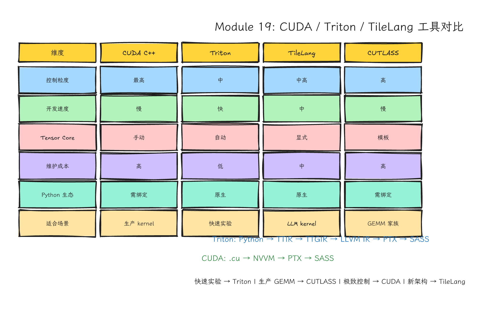
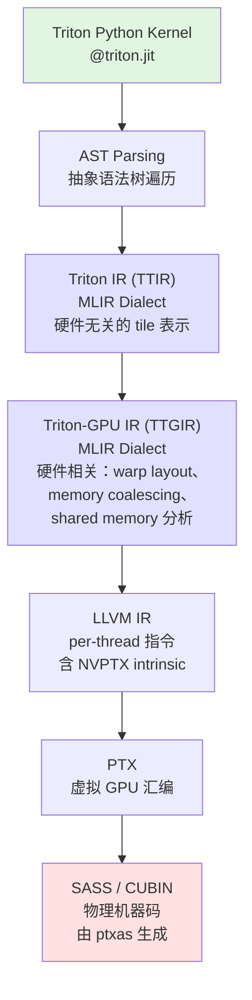
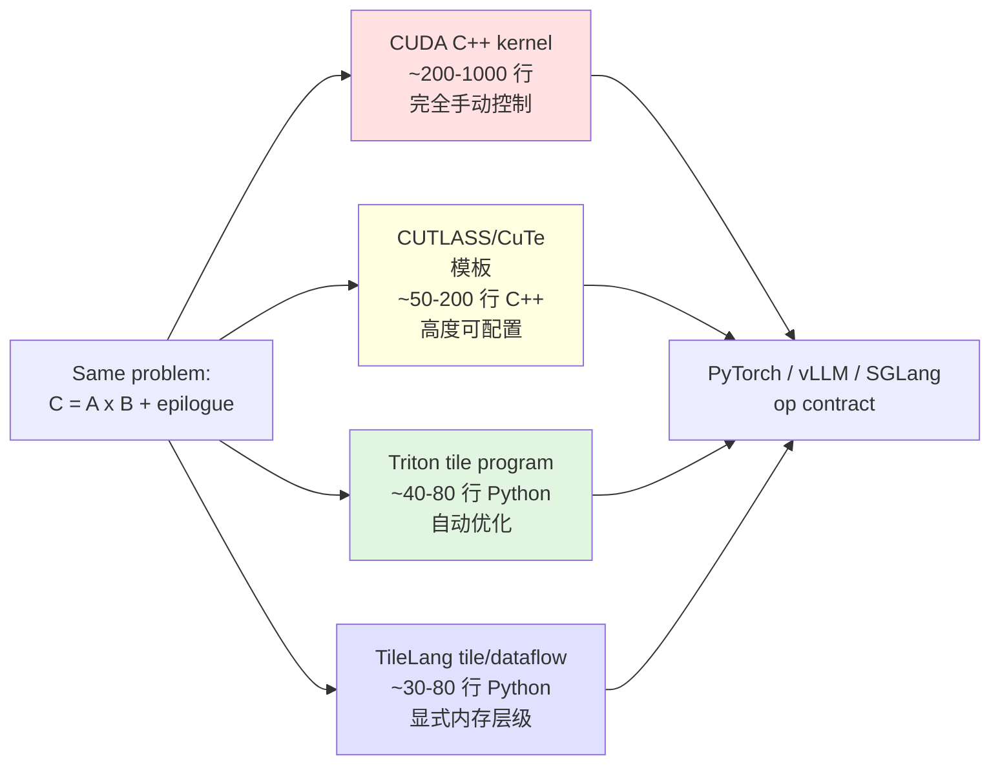
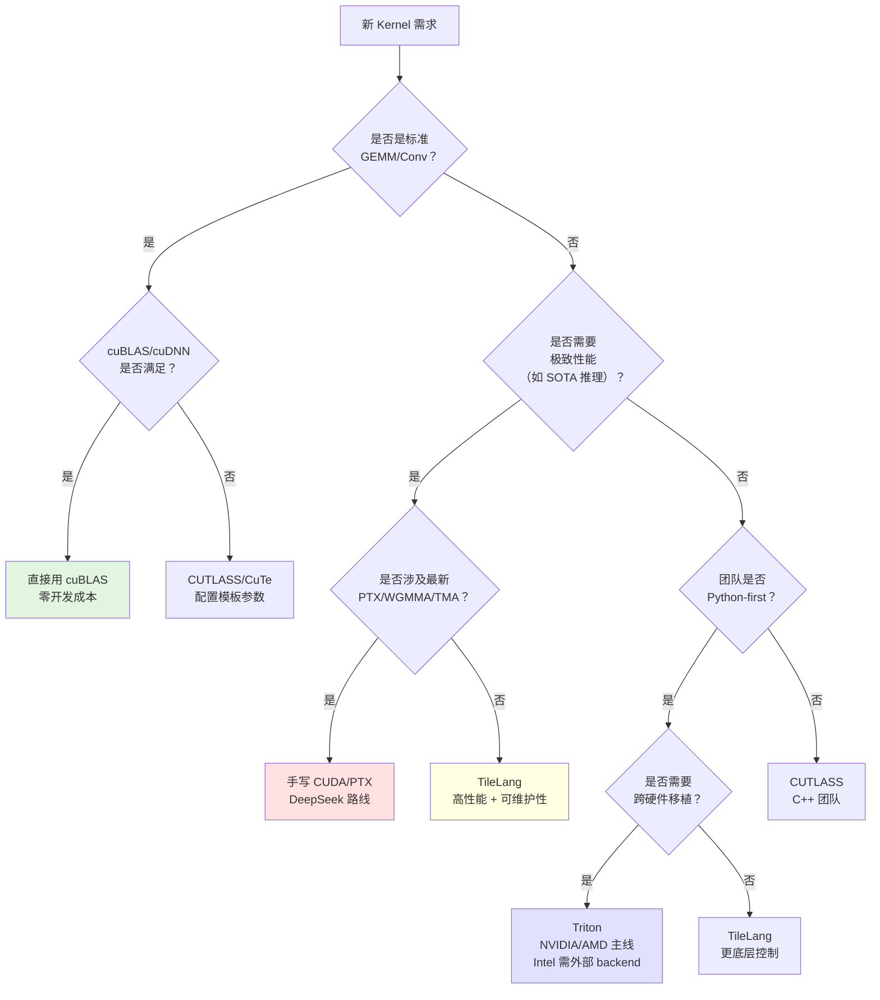
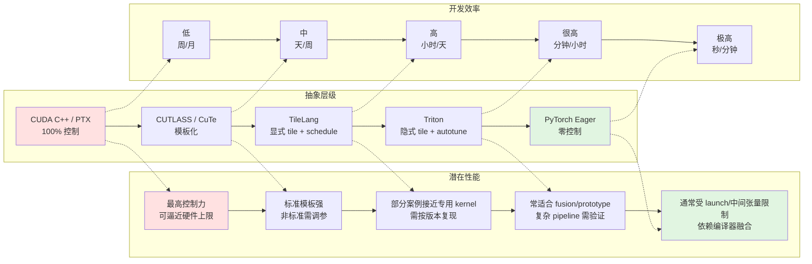

# Module 19: Triton、TileLang 与 CUDA/CUTLASS 对比——从手工车床到自动化机床的抽象抉择



*图 19-1：CUDA C++、CUTLASS/CuTe、Triton、TileLang 在控制力、开发速度、可移植性和调试成本上的对比。可编辑源图：[`module-19-cuda-triton-tilelang-comparison.excalidraw`](../diagrams/module-19-cuda-triton-tilelang-comparison.excalidraw)。*

> **Level**: Expert
> **Estimated time**: 20–32 小时
> **Prerequisites**: Modules 3, 5, 10, 13–18
> **Sources**: Triton official documentation, TileLang documentation, NVIDIA CUDA/PTX documentation, CUTLASS/CuTe documentation, PyTorch custom op tutorial, vLLM/SGLang source and docs, arXiv papers, PyTorch blog posts

---

## 学习目标

完成本模块后，你应该能够：

1. 解释 Triton 的编译流程（Python → Triton IR → Triton-GPU IR → LLVM IR → PTX → SASS），并能在实际中 dump 和阅读中间表示。
2. 描述 Triton 的 program instance / tile 抽象与 CUDA thread/block 的心智模型差异，并说明 memory coalescing 和 shared memory 由谁管理。
3. 实现一个完整的 Triton matmul kernel（含 block pointer、Tensor Core `tl.dot`、masking、accumulator dtype 转换），并为其配置 `triton.autotune`。
4. 解释 TileLang 的设计哲学（tile 作为一等公民、显式 schedule、暴露底层 primitive），并能阅读和分析 TileLang 的 matmul / FlashAttention / MLA 示例。
5. 对比同一个算子（matmul / attention）在 CUDA C++、CUTLASS/CuTe、Triton、TileLang 四种实现下的代码量、性能、可维护性、调试难度。
6. 评估 DSL 抽象的代价：编译时间/JIT 开销、性能天花板、调试可观测性、与现有 C++ 代码库的集成难度。
7. 选择在真实系统（PyTorch 2.0+ `torch.compile`、vLLM/SGLang、公开 OpenAI/Triton 生态材料与 DeepSeek 开源项目）中，何时手写 CUDA、何时用 Triton、何时用 TileLang、何时用 CUTLASS。

---

## 这一课的故事线

你已经学过 CUDA C++、Tensor Core、PTX/TMA/WGMMA、CUTLASS/DeepGEMM、通信和推理框架。现在的问题是：现代 kernel 一定要手写 CUDA 吗？ Triton、TileLang、CUTLASS、CuTe、DeepGEMM 这些工具各自解决什么问题？什么时候用 DSL 更快交付，什么时候必须回到 CUDA/PTX？

这节课的目标不是站队，而是建立选择能力。专家不是“只会一种工具的人”，而是知道抽象的价格在哪里。

---

## 1. 问题背景：为什么我们需要在 CUDA 之外寻找工具？

手写 CUDA C++  kernel 的痛点是明确的：

- **开发慢**：一个高性能的 FP8 GEMM 可能需要数千行 CUDA，涵盖 mainloop、epilogue、pipeline、TMA/WGMMA 指令调度。
- **调参累**：block size、tile size、warp 排布、shared memory layout、bank conflict 规避，每个维度都影响性能。
- **移植难**：从 Ampere 到 Hopper 到 Blackwell，Tensor Core 指令、异步 copy、warp specialization 都在变化，代码要重写。
- **融合受限**：PyTorch eager 模式下，elementwise + reduction + matmul 往往变成多个 kernel launch，内存带宽被中间结果浪费。

业界对“更高层、更快速、更易移植的 GPU kernel 编程方式”的需求催生了三层解决方案：

1. **编译器自动生成**（PyTorch 2.0 `torch.compile` + Inductor → Triton）
2. **Python DSL 手写**（Triton、TileLang）
3. **C++ 模板库**（CUTLASS/CuTe、DeepGEMM）

本模块要回答：在你的下一个项目中，这三种方案该选哪一种？

---

## 2. 直觉类比：从手工车床到自动化机床

理解这些工具，可以把它们放进同一个工业隐喻中。

| 工具 | 工业类比 | 核心特征 | 你的角色 |
|---|---|---|---|
| **CUDA C++** | 手工车床 | 你能直接控制每一个切削动作 | 工匠：决定进给速度、刀具角度、冷却液流量 |
| **PTX/SASS** | 数控系统底层参数 | 接近机器指令，能力最强，维护成本最高 | 极客：重写伺服电机控制逻辑 |
| **CUTLASS/CuTe** | 专业可配置机床 | 复杂 GEMM 家族的高性能模板，可组合、架构覆盖强 | 工程师：配置模板参数，组合 mainloop + epilogue |
| **DeepGEMM** | 为某类工作负载特调的轻量生产线 | 专精 LLM FP8/FP4/MoE GEMM，JIT 编译 | 调度员：把特定工件送入专用线 |
| **Triton** | 可编程数控机床 | 用 Python 表达 tile-based kernel，由编译器推导 lane/thread 映射、内存访问和 shared staging | 技师：设计 tile 策略，机床自动执行 |
| **TileLang** | 更强调 tile/dataflow 和 Tensor Core primitive 的 DSL | 把 tile 作为一等公民，显式表达内存层级和 schedule | 工艺师：用更高级的数据流描述，控制底层 primitive |

抽象不是免费的。它是在控制力、开发速度、可移植性、可调试性之间做交易。


---

## 3. 硬件机制：为什么这些抽象能工作？

### 3.1 GPU 内存层次与 tile 策略的物理基础

在深入 DSL 之前，先回顾硬件现实。任何 GPU kernel 的性能最终受限于：

1. **HBM 带宽**：A100 约 2 TB/s，H100 约 3.35 TB/s。如果一个 kernel 的 arithmetic intensity 太低，它就是 memory-bound。
2. **Shared Memory 带宽**：约 10–20 TB/s，是 HBM 的 5–10 倍。把数据搬到 shared memory 再计算，是 tiling 的物理动机。
3. **Tensor Core 峰值**：H100 SXM 的 FP16/BF16 Tensor Core dense 峰值约 1 PFLOP，启用结构化稀疏的营销口径可接近 2 PFLOPS；做 roofline 时必须写清 dense/sparse、SXM/PCIe/NVL 和 dtype 口径。要接近这些峰值，需要数据以正确的 layout 进入寄存器/共享内存路径，并调用 `wgmma.mma_async` 或 `mma.sync` 等矩阵指令。
4. **L2 Cache / TMA**：Hopper 引入 TMA（Tensor Memory Accelerator），让硬件以张量描述符为单位异步搬运 global memory 与 shared memory 之间的 1D 到 5D tile。它的价值不是“神奇绕开 L2”，而是把多维地址计算和大块搬运从普通 CUDA thread 指令中剥离出来，并让 producer/consumer pipeline 更容易和计算重叠。

DSL 的价值，就是让你在更高层描述“把哪块数据搬到哪一层内存”，而不必手写每个 `cp.async`、`mma.sync`、`sts` 指令。

### 3.2 Triton 的编译流程：从 Python 到 SASS



各阶段解析：

- **Triton IR (TTIR)**：基于 MLIR 的硬件无关中间表示。此时 kernel 仍以 tile 级别描述，例如 `tt.load`、`tt.dot`、`tt.store`。
- **Triton-GPU IR (TTGIR)**：将通用 tensor layout 转换为硬件特定的 layout。例如把 `tt.load` 展开为 per-thread 的 vector load，把 `tt.dot` 映射为 Tensor Core `mma` 指令。此时引入 `triton_gpu.compute_capability` 等硬件属性。
- **LLVM IR**：进一步 lower 为 per-thread 的指令，包含 `nvvm.annotations`、`llvm.nvvm.read.ptx.sreg.tid.x()` 等 NVIDIA 特定 intrinsic。tensor 抽象基本消失，替换为每个 thread 的内存访问和同步原语。
- **PTX**：由 LLVM NVPTX backend 生成。这是人类可读的“最底层”中间表示。你可以看到 `ld.global.f32`、`mma.sync.aligned` 等指令。
- **SASS**：是实际在 GPU 上执行的机器码。离线编译时通常由 CUDA Toolkit 中的 `ptxas` 从 PTX 生成；运行时 fallback 场景下，CUDA driver 的 JIT 编译器也可以把嵌入的 PTX 编译成目标 GPU 的机器码。`ptxas` 不是“驱动编译器”。

> 这个流程之所以重要，是因为当你调试性能时，问题可能出在任何一个阶段。例如 Triton 的 memory coalescing 优化在 TTGIR 阶段完成；如果生成的 PTX 有 bank conflict，你需要检查 TTGIR 中的 shared memory layout。

**资料来源：**
- Triton Kernel Compilation Stages: https://pytorch.org/blog/triton-kernel-compilation-stages/
- Deep Dive into Triton Internals: https://kapilsh.github.io/posts/deep-dive-into-triton-internals/
- Triton documentation: https://triton-lang.org/main/

### 3.3 Triton 的 program instance 和 tile 抽象

Triton 的编程模型不是“每个 CUDA thread 做一件事”，而是“每个 program instance 处理一个 tile”。

```
CUDA 心智模型：
  threadIdx.x / blockIdx.x -> 一个 thread 处理一个元素（或一个向量）
  你需要手动管理 block、warp、thread 的映射

Triton 心智模型：
  program_id(0) / program_id(1) -> 一个 program 处理一个 BLOCK_SIZE_M x BLOCK_SIZE_N 的 tile
  编译器自动把 tile 拆分为 warp/thread 的工作，自动管理 shared memory
```

这带来三个后果：

1. **内存合并由编译器 lowering 负责**：编译器分析 tile 的访问模式，尽量生成向量化、sector-efficient 的 global memory load。现代 NVIDIA GPU 的观测口径通常要看 32B sector、L1/L2 request 和 replay 指标，而不是简单说“一定是 128-byte transaction”。
2. **Shared memory 隐式管理**：你不需要显式分配 `__shared__` 数组，Triton 根据 `tl.load`/`tl.dot`/`tl.store` 推导 staging buffer。
3. **Warp 映射不可见**：你无法直接控制哪个 warp 处理哪个子 tile，这在某些需要 warp specialization 的场景是限制。

### 3.4 TileLang 的 tile abstraction 与显式 schedule

TileLang 的核心设计：tile 是一等公民（first-class citizen）。

在 TileLang 中，你写：

```python
A_shared = T.alloc_shared((block_M, block_K), dtype)
C_local = T.alloc_fragment((block_M, block_N), accum_dtype)
```

这些不是裸指针，而是带有内存层级语义的 tile：
- `alloc_shared` = shared memory tile
- `alloc_fragment` = register tile（直接参与 Tensor Core 计算）
- `T.copy(A[...], A_shared)` = 显式数据搬运，编译器可在合适 target / shape / pipeline pass 下优化为异步 copy 或 TMA 路径
- `T.gemm(A_shared, B_shared, C_local)` = tile-level GEMM，NVIDIA 后端可能 lowering 到 `mma.sync`、`wgmma.mma_async` 或更新的矩阵指令，最终以生成代码和 profiler 为准

TileLang 与 Triton 的关键差异：

| 维度 | Triton | TileLang |
|---|---|---|
| 核心抽象 | program instance（处理一个 tile） | tile 本身（一等公民） |
| 内存管理 | 隐式，编译器推导 | 显式，程序员声明 shared/reg tile |
| schedule | 隐式，通过 block pointer 暗示 | 显式，通过 `T.Pipelined`、`T.Parallel` 表达 |
| 底层 primitive | 暴露有限 | 暴露 `ptx_mma`、`cp.async`、`TMA` 等 |
| 编译器后端 | 自研 MLIR -> LLVM -> PTX | TVM 基础设施 -> CUDA C++/HIP |
| 硬件覆盖 | NVIDIA/AMD 是主线；Intel XPU 依赖 Intel 的 out-of-tree backend 与 PyTorch/XPU 栈，不能按 Triton 主仓同等成熟度理解 | NVIDIA/AMD/CPU 是主线；Metal/WebGPU/Ascend 等路径在快速演进中，需按具体 release、backend 和示例确认 |

**资料来源：**
- TileLang 论文: https://arxiv.org/abs/2504.17577
- TileLang 官方文档: https://tilelang.com/
- TileLang GitHub: https://github.com/tile-ai/tilelang

---

## 4. 代码路径：Triton 详解与精品代码

### 4.1 代码 1：Triton elementwise fusion（教学版，扩展版）

```python
import torch
import triton
import triton.language as tl


@triton.jit
def fused_bias_gelu_kernel(
    x_ptr, bias_ptr, y_ptr, n_elements,
    scale: tl.constexpr,
    BLOCK_SIZE: tl.constexpr
):
    """
    融合 kernel: y = GELU(x * scale + bias)
    每个 program instance 处理一个 BLOCK_SIZE 的 tile。
    """
    # pid 是 Triton 的 tile 编号，类似"第几个程序实例"。
    pid = tl.program_id(axis=0)
    
    # offsets: 这个 tile 覆盖的元素索引 [0, BLOCK_SIZE-1]
    offsets = pid * BLOCK_SIZE + tl.arange(0, BLOCK_SIZE)
    
    # mask: 防止最后一个 tile 越界。最后一个 tile 可能不满 BLOCK_SIZE。
    mask = offsets < n_elements
    
    # tl.load 从 global memory 读取 tile。mask 保证越界位置读 0.0。
    x = tl.load(x_ptr + offsets, mask=mask, other=0.0)
    b = tl.load(bias_ptr + offsets, mask=mask, other=0.0)
    
    # 计算在 SRAM 中完成，不涉及额外的 HBM 读写。
    z = x * scale + b
    
    # tanh 近似 GELU。真实项目要和 PyTorch reference 对齐 tolerance。
    # GELU(x) ~ 0.5 * x * (1 + tanh(sqrt(2/pi) * (x + 0.044715 * x^3)))
    gelu = 0.5 * z * (1.0 + tl.tanh(0.79788456 * (z + 0.044715 * z * z * z)))
    
    # tl.store 写回 global memory。mask 保证不越界写入。
    tl.store(y_ptr + offsets, gelu, mask=mask)


def fused_bias_gelu(x: torch.Tensor, bias: torch.Tensor, scale: float):
    """Host-side launcher，负责分配输出、计算 grid、启动 kernel。"""
    assert x.is_cuda and bias.is_cuda
    assert x.numel() == bias.numel()
    
    y = torch.empty_like(x)
    block = 1024
    # grid: 需要多少个 program instance 覆盖所有元素。
    grid = (triton.cdiv(x.numel(), block),)
    
    fused_bias_gelu_kernel[grid](
        x, bias, y, x.numel(),
        scale=scale,
        BLOCK_SIZE=block
    )
    return y
```

逐行教学要点：
- `@triton.jit`：告诉 Triton 编译器这个函数需要 JIT 编译到 GPU。
- `tl.constexpr`：编译时常量，会作为编译 cache key 的一部分。不同 `BLOCK_SIZE` 会生成不同的 kernel。
- `tl.program_id(0)`：一维 grid 中当前 program 的 ID。如果 grid 是 `(16,)`，则 pid 在 [0, 15]。
- `tl.arange(0, BLOCK_SIZE)`：生成 `[0, 1, ..., BLOCK_SIZE-1]`，用于构造 tile 内的偏移。
- `mask`：最后一个 tile 通常不满，mask 防止越界。
- `tl.load` / `tl.store`：唯一的 HBM 访问。中间的 `*`、`+`、`tl.tanh` 全部在 SRAM/registers 中执行。

性能评估不能只停在这里。 你还要问：生成的 PTX/SASS 怎样？小 shape 下 JIT/launch 成本如何？是否方便打包进 vLLM/SGLang？如果要用最新 TMA/WGMMA 指令，Triton 当前版本是否能表达？

### 4.2 代码 2：Triton matmul 完整实现（官方 tutorial 风格）

```python
import torch
import triton
import triton.language as tl


@triton.jit
def matmul_kernel(
    a_ptr, b_ptr, c_ptr,
    M, N, K,
    stride_am, stride_ak,
    stride_bk, stride_bn,
    stride_cm, stride_cn,
    BLOCK_SIZE_M: tl.constexpr,
    BLOCK_SIZE_N: tl.constexpr,
    BLOCK_SIZE_K: tl.constexpr,
    GROUP_SIZE_M: tl.constexpr,
):
    """
    每个 program instance 计算 C 的一个 BLOCK_SIZE_M x BLOCK_SIZE_N tile。
    使用 GROUP_SIZE_M 优化 L2 cache locality（类似 swizzle）。
    """
    # 当前 program 是一维 flattened tile id。GROUP_SIZE_M 重排公式
    # 必须基于一维 pid；如果 grid 写成二维再套这个公式，会重复/漏算 tile。
    pid = tl.program_id(axis=0)

    # L2 cache 优化: 把 program 按组重排，增加相邻 tile 对 A/B 的复用
    num_pid_m = tl.cdiv(M, BLOCK_SIZE_M)
    num_pid_n = tl.cdiv(N, BLOCK_SIZE_N)
    num_pid_in_group = GROUP_SIZE_M * num_pid_n
    group_id = pid // num_pid_in_group
    first_pid_m = group_id * GROUP_SIZE_M
    group_size_m = min(num_pid_m - first_pid_m, GROUP_SIZE_M)
    pid_in_group = pid % num_pid_in_group
    pid_m = first_pid_m + (pid_in_group % group_size_m)
    pid_n = pid_in_group // group_size_m
    
    # 当前 tile 在 A、B、C 中的偏移
    offs_am = pid_m * BLOCK_SIZE_M + tl.arange(0, BLOCK_SIZE_M)
    offs_bn = pid_n * BLOCK_SIZE_N + tl.arange(0, BLOCK_SIZE_N)
    offs_k = tl.arange(0, BLOCK_SIZE_K)
    
    # 构造 A tile 和 B tile 的指针（2D block）
    a_ptrs = a_ptr + (offs_am[:, None] * stride_am + offs_k[None, :] * stride_ak)
    b_ptrs = b_ptr + (offs_k[:, None] * stride_bk + offs_bn[None, :] * stride_bn)
    
    # accumulator 用 fp32 累加，避免 fp16 累加误差
    accumulator = tl.zeros((BLOCK_SIZE_M, BLOCK_SIZE_N), dtype=tl.float32)
    
    # 沿 K 维度循环，每次加载 A 和 B 的 tile，做 Tensor Core dot
    for k in range(0, tl.cdiv(K, BLOCK_SIZE_K)):
        # 加载 A tile 和 B tile。mask 必须同时保护 M/N 边界和 K 边界：
        # C 的 store mask 不能保护这里的 load，最后一个 M/N tile 仍可能越界读取。
        k_mask = offs_k < K - k * BLOCK_SIZE_K
        a = tl.load(
            a_ptrs,
            mask=(offs_am[:, None] < M) & k_mask[None, :],
            other=0.0,
        )
        b = tl.load(
            b_ptrs,
            mask=k_mask[:, None] & (offs_bn[None, :] < N),
            other=0.0,
        )
        
        # tl.dot 映射到 Tensor Core mma 指令。这是关键性能点。
        accumulator += tl.dot(a, b)
        
        # 指针前进到下一个 K tile
        a_ptrs += BLOCK_SIZE_K * stride_ak
        b_ptrs += BLOCK_SIZE_K * stride_bk
    
    # 保留 fp32 accumulator；tl.store 会根据 c_ptr 的元素 dtype
    # 写回到 FP16/BF16/FP32 输出。不要在这里无条件转 FP16。
    c = accumulator
    
    # 写回 C tile
    offs_cm = pid_m * BLOCK_SIZE_M + tl.arange(0, BLOCK_SIZE_M)
    offs_cn = pid_n * BLOCK_SIZE_N + tl.arange(0, BLOCK_SIZE_N)
    c_ptrs = c_ptr + stride_cm * offs_cm[:, None] + stride_cn * offs_cn[None, :]
    c_mask = (offs_cm[:, None] < M) & (offs_cn[None, :] < N)
    tl.store(c_ptrs, c, mask=c_mask)


def matmul(a: torch.Tensor, b: torch.Tensor):
    """Host launcher for Triton matmul."""
    assert a.shape[1] == b.shape[0], "Incompatible dimensions"
    assert a.is_cuda and b.is_cuda
    assert a.is_contiguous() and b.is_contiguous()
    assert a.dtype == b.dtype
    M, K = a.shape
    K2, N = b.shape
    assert K == K2
    
    c = torch.empty((M, N), device=a.device, dtype=a.dtype)
    # 1D grid: 每个 program 处理一个输出 tile；kernel 内部用 GROUP_SIZE_M 重排 pid
    grid = lambda META: (
        triton.cdiv(M, META['BLOCK_SIZE_M']) * triton.cdiv(N, META['BLOCK_SIZE_N']),
    )
    
    matmul_kernel[grid](
        a, b, c,
        M, N, K,
        a.stride(0), a.stride(1),
        b.stride(0), b.stride(1),
        c.stride(0), c.stride(1),
        BLOCK_SIZE_M=64,
        BLOCK_SIZE_N=64,
        BLOCK_SIZE_K=32,
        GROUP_SIZE_M=8,
    )
    return c
```

关键教学点：
- `tl.dot(a, b)`：这是 Triton 的矩阵乘抽象。对于 fp16/bf16/低精度输入、合适的 tile 形状、目标 GPU 和 Triton 版本，它通常会映射到 Tensor Core 路径；最终是 `mma.sync`、`wgmma`、其他矩阵指令还是 fallback 路径，需要看 TTGIR/PTX/SASS，而不能只凭源码判断。
- `GROUP_SIZE_M`：一个关键的性能优化。默认按行优先调度 program 时，相邻 program 访问的 A 行可能相差很远，导致 L2 cache miss。通过分组重排 pid，让同一个 group 内的 program 先处理相近的行，提升 L2 命中率。
- `accumulator` 用 `float32`：这是教学 matmul 的常见精度选择。工业级 GEMM 的 accumulator dtype 取决于输入 dtype、硬件指令、训练/推理精度目标和库实现；FP16/BF16 训练常用 FP32 accum，低精度推理路径还会结合 scaling、promotion 或架构特定 accumulator。
- Masking 的双重作用：K 维度循环的 mask 防止读取越界；C 写回的 mask 防止写入越界。

Memory coalescing 分析：
- `offs_am[:, None] * stride_am + offs_k[None, :] * stride_ak` 生成一个 `[BLOCK_SIZE_M, BLOCK_SIZE_K]` 的指针矩阵。
- 这些偏移表达的是 tile 内元素的逻辑地址，不是 CUDA thread 到元素的直接映射。Triton 会在 TTGIR / backend lowering 阶段决定哪些元素由哪些 lanes/warps 访问。
- 当 `stride_ak == 1`、`stride_bn == 1` 且 tile shape 合理时，地址矩阵给了编译器生成 coalesced/vectorized global load 的机会；最终是否真的合并为理想访问，要看 TTGIR/PTX/SASS 和 Nsight Compute 的 sector/request、memory throughput 指标。

### 4.3 代码 3：Triton autotune 配置示例

```python
import torch
import triton
import triton.language as tl


# autotune 定义: 搜索不同 tile size、warp 数、pipeline stage 的组合
@triton.autotune(
    configs=[
        # 小 tile + 少 warp: 适合小 shape 或内存密集型 kernel
        triton.Config(
            {'BLOCK_SIZE_M': 64, 'BLOCK_SIZE_N': 64, 'BLOCK_SIZE_K': 32},
            num_warps=4, num_stages=2
        ),
        # 中等 tile + 中等 warp: 通用配置
        triton.Config(
            {'BLOCK_SIZE_M': 128, 'BLOCK_SIZE_N': 128, 'BLOCK_SIZE_K': 32},
            num_warps=8, num_stages=3
        ),
        # 大 tile + 多 warp: 适合大 shape，更高 Tensor Core 利用率
        triton.Config(
            {'BLOCK_SIZE_M': 256, 'BLOCK_SIZE_N': 128, 'BLOCK_SIZE_K': 64},
            num_warps=16, num_stages=4
        ),
        # 非方形 tile: 适合 M >> N 或 N >> M 的矩形矩阵
        triton.Config(
            {'BLOCK_SIZE_M': 128, 'BLOCK_SIZE_N': 64, 'BLOCK_SIZE_K': 64},
            num_warps=8, num_stages=3
        ),
    ],
    key=['M', 'N', 'K'],  # 当 M/N/K 变化时重新 tuning
)
@triton.jit
def autotuned_matmul_kernel(
    a_ptr, b_ptr, c_ptr,
    M, N, K,
    stride_am, stride_ak,
    stride_bk, stride_bn,
    stride_cm, stride_cn,
    BLOCK_SIZE_M: tl.constexpr,
    BLOCK_SIZE_N: tl.constexpr,
    BLOCK_SIZE_K: tl.constexpr,
):
    """与上面的 matmul_kernel 相同，但 tile 参数由 autotune 决定。"""
    pid_m = tl.program_id(axis=0)
    pid_n = tl.program_id(axis=1)
    
    # autotune 示例保留二维 grid，不做 GROUP_SIZE_M 重排。
    # 如果要加入 GROUP_SIZE_M，应改成上一个 kernel 那样的一维 flattened pid。
    
    offs_am = pid_m * BLOCK_SIZE_M + tl.arange(0, BLOCK_SIZE_M)
    offs_bn = pid_n * BLOCK_SIZE_N + tl.arange(0, BLOCK_SIZE_N)
    offs_k = tl.arange(0, BLOCK_SIZE_K)
    
    a_ptrs = a_ptr + (offs_am[:, None] * stride_am + offs_k[None, :] * stride_ak)
    b_ptrs = b_ptr + (offs_k[:, None] * stride_bk + offs_bn[None, :] * stride_bn)
    
    accumulator = tl.zeros((BLOCK_SIZE_M, BLOCK_SIZE_N), dtype=tl.float32)
    
    for k in range(0, tl.cdiv(K, BLOCK_SIZE_K)):
        k_mask = offs_k < K - k * BLOCK_SIZE_K
        a = tl.load(
            a_ptrs,
            mask=(offs_am[:, None] < M) & k_mask[None, :],
            other=0.0,
        )
        b = tl.load(
            b_ptrs,
            mask=k_mask[:, None] & (offs_bn[None, :] < N),
            other=0.0,
        )
        accumulator += tl.dot(a, b)
        a_ptrs += BLOCK_SIZE_K * stride_ak
        b_ptrs += BLOCK_SIZE_K * stride_bk
    
    # 保留 fp32 accumulator，由 tl.store 按输出 tensor dtype 转换。
    c = accumulator
    offs_cm = pid_m * BLOCK_SIZE_M + tl.arange(0, BLOCK_SIZE_M)
    offs_cn = pid_n * BLOCK_SIZE_N + tl.arange(0, BLOCK_SIZE_N)
    c_ptrs = c_ptr + stride_cm * offs_cm[:, None] + stride_cn * offs_cn[None, :]
    c_mask = (offs_cm[:, None] < M) & (offs_cn[None, :] < N)
    tl.store(c_ptrs, c, mask=c_mask)


def autotuned_matmul(a, b):
    M, K = a.shape
    K2, N = b.shape
    assert K == K2
    assert a.is_cuda and b.is_cuda
    assert a.is_contiguous() and b.is_contiguous()
    assert a.dtype == b.dtype
    c = torch.empty((M, N), device=a.device, dtype=a.dtype)
    grid = lambda META: (
        triton.cdiv(M, META['BLOCK_SIZE_M']),
        triton.cdiv(N, META['BLOCK_SIZE_N']),
    )
    # 第一次调用会编译所有 config 并 benchmark，选择最快的
    autotuned_matmul_kernel[grid](
        a, b, c, M, N, K,
        a.stride(0), a.stride(1),
        b.stride(0), b.stride(1),
        c.stride(0), c.stride(1),
    )
    return c
```

autotune 机制：

- **配置空间**：`triton.Config` 中的字典是编译时常量。每个 config 会生成一个独立的 kernel binary。
- **num_warps**：一个 block 中的 warp 数。H100 每个 SM 支持 64 warps，太少则 occupancy 低，太多则 register 压力大。
- **num_stages**：software pipeline 的深度。`num_stages=4` 表示同时有 4 个 K tile 的 load 和 compute 在重叠执行（需要更多 shared memory）。
- **key=['M', 'N', 'K']**：tuning cache 的 key。如果输入 shape 变化，autotune 会重新搜索。如果 shape 固定，第二次调用直接命中缓存。
- **开销**：第一次调用时，autotune 需要编译所有 candidate configs 并在 GPU 上 benchmark。这可能花费几秒到几十秒。IBM 的 `triton-dejavu` 项目用 Bayesian Optimization 减少这个开销。

> autotune 不总是万能： 因为配置空间由用户手动定义。如果用户没包含最优配置，autotune 找不到它。autotune 的 benchmark 是 kernel-level 的，不是 end-to-end 的，有时 kernel 快不代表总延迟快（如 shared memory 太大导致 occupancy 降，其他 kernel 排队）。

**资料来源：**
- Characterizing Autotuning Costs in Triton: https://www.cs.rochester.edu/u/sree/courses/csc-290-571/fall-2024/static/final-reports/ML_Sys_Project_Report_RH.pdf
- Triton-dejavu: https://github.com/IBM/triton-dejavu
- Autotuning in PyTorch & Triton: https://ianbarber.blog/2025/05/04/autotuning-in-pytorch-triton/

### 4.4 代码 4：使用 Triton 编译器生成 PTX 的查看方法

```python
import torch
import triton
import triton.language as tl


@triton.jit
def vec_add_kernel(x_ptr, y_ptr, out_ptr, n_elements, BLOCK_SIZE: tl.constexpr):
    pid = tl.program_id(0)
    offsets = pid * BLOCK_SIZE + tl.arange(0, BLOCK_SIZE)
    mask = offsets < n_elements
    x = tl.load(x_ptr + offsets, mask=mask, other=0.0)
    y = tl.load(y_ptr + offsets, mask=mask, other=0.0)
    tl.store(out_ptr + offsets, x + y, mask=mask)


def vec_add(x, y):
    out = torch.empty_like(x)
    n = x.numel()
    grid = (triton.cdiv(n, 1024),)
    # Triton 的普通 kernel launch 通常只负责入队执行；要稳定查看 IR/PTX，
    # 使用官方 tutorial 中的 warmup 路径先拿到 compiled kernel。
    compiled = vec_add_kernel.warmup(
        x, y, out, n,
        BLOCK_SIZE=1024,
        grid=grid,
    )
    compiled._init_handles()
    
    # 保存各阶段 IR 到文件，便于调试和学习
    with open('triton_ttir.mlir', 'w') as f:
        f.write(compiled.asm['ttir'])
    with open('triton_ttgir.mlir', 'w') as f:
        f.write(compiled.asm['ttgir'])
    with open('triton_llir.ll', 'w') as f:
        f.write(compiled.asm['llir'])
    with open('triton_ptx.ptx', 'w') as f:
        f.write(compiled.asm['ptx'])
    with open('triton_cubin.bin', 'wb') as f:
        f.write(compiled.asm['cubin'])

    # 真正执行 kernel。课程里故意把“编译检查”和“运行”分开，
    # 避免让读者以为 launch 的返回值一定就是 compiled kernel。
    vec_add_kernel[grid](x, y, out, n, BLOCK_SIZE=1024)
    
    # 如果你想看 SASS（人类可读的机器码），需要额外工具:
    # 1. cuobjdump --dump-sass triton_cubin.bin
    # 2. 或 TritonParse 的 SASS source mapping: https://github.com/meta-pytorch/tritonparse
    
    # 环境变量也可以 dump 所有编译阶段:
    # export TRITON_KERNEL_DUMP=1
    # export TRITON_DUMP_DIR=/tmp/triton_dumps
    
    return out
```

**调试和 profiling Triton kernel 的完整工具链：**

1. **IR 级调试**：用 `compiled = kernel.warmup(..., grid=...)` 得到 compiled kernel 后读取 `compiled.asm['ttir']` / `ttgir` / `llir` / `ptx` / `cubin`。检查编译器是否按预期优化了 memory coalescing、shared memory layout、loop unrolling。
2. **环境变量**：`TRITON_KERNEL_DUMP=1` 会在运行时自动 dump 所有编译阶段到指定目录。`TRITON_ALWAYS_COMPILE=1` 禁用缓存，强制重新编译。
3. **Nsight Compute / Nsight Systems**：Triton 生成的 kernel 在 Nsight 中可见，但函数名是 hash 过的，需要搜索 `triton_` 前缀。
4. **TritonParse**：Meta 开源的 Triton 分析工具，支持 SASS source mapping、block pingpong 检测、IR 可视化。https://github.com/meta-pytorch/tritonparse
5. **Profiler 指标**：特别关注 Memory Workload Analysis、Occupancy、Warp State、Speed of Light / Tensor Core 相关 section。Nsight Compute 的底层 metric 名称随版本变化；常见可查方向包括 `dram__bytes.sum.per_second`、occupancy 相关 metric、tensor pipe / MMA 指令计数。不要把 `memory_throughput`、`achieved_occupancy`、`tensor_core_utilization` 当成所有版本都存在的精确字段名。如果 DRAM 带宽接近目标 GPU 峰值而 tensor pipe 利用率低，通常说明 kernel 偏 memory-bound，需要更多 fusion 或更好的 tiling。

**资料来源：**
- PyTorch Blog - Triton Kernel Compilation Stages: https://pytorch.org/blog/triton-kernel-compilation-stages/
- TritonParse: https://github.com/meta-pytorch/tritonparse

---

## 5. 代码路径：TileLang 详解与精品代码

### 5.1 TileLang 的设计哲学与目标

TileLang 由北京大学团队开发，动机是：现有 DSL（Triton、TVM）无法同时满足“高开发效率”和“对底层硬件的精确控制”。

痛点：
- Triton 的 warp-level 映射是隐式的，无法手动做 warp specialization。
- TVM 的 schedule-driven 方式对 FlashAttention、MLA 这类复杂 kernel 的表达能力不足。
- CUTLASS 性能强，但 C++ 模板的学习曲线和代码量令人望而生畏。

TileLang 的做法：tile 作为一等公民，显式内存层级，显式 schedule，编译器自动推导地址计算和 pipeline 编排。

### 5.2 代码 5：TileLang matmul 示例（带注释）

```python
import torch
import tilelang
import tilelang.language as T


def matmul_relu(M, N, K, block_M=128, block_N=128, block_K=32,
                dtype="float16", accum_dtype="float"):
    """
    TileLang GEMM + ReLU 示例，采用当前官方文档的 Level-2 风格：
    Python 外层函数捕获 shape / tile 参数，内部返回一个 @T.prim_func。
    教学简化：示例假设 M/N/K 都能被 block_M/block_N/block_K 整除；
    非整块 shape 需要按当前 TileLang API 添加边界 mask、padding 或专门 tail path。
    """
    @T.prim_func
    def main(
        A: T.Tensor((M, K), dtype),
        B: T.Tensor((K, N), dtype),
        C: T.Tensor((M, N), dtype),
    ):
        # T.Kernel 定义 CUDA grid: 每个 thread block 处理一个输出 tile
        # threads=128 表示每个 block 128 个 thread（4 warps）
        with T.Kernel(T.ceildiv(N, block_N), T.ceildiv(M, block_M), threads=128) as (bx, by):
            A_shared = T.alloc_shared((block_M, block_K), dtype)
            B_shared = T.alloc_shared((block_K, block_N), dtype)
            C_local = T.alloc_fragment((block_M, block_N), accum_dtype)

            # 可选: L2 cache swizzling / MMA swizzle layout，需按目标 GPU 和 TileLang 版本确认
            # T.use_swizzle(panel_size=10, enable=True)

            T.clear(C_local)

            # Pipelined 循环: 软件流水，overlap memory copy 和 compute
            for ko in T.Pipelined(T.ceildiv(K, block_K), num_stages=3):
                # T.copy 把 global memory tile 搬到 shared memory。
                # 是否生成 cp.async / TMA 取决于 target、shape、pipeline pass 和 TileLang 版本。
                T.copy(A[by * block_M, ko * block_K], A_shared)
                T.copy(B[ko * block_K, bx * block_N], B_shared)

                # T.gemm 执行 tile-level GEMM；NVIDIA 目标通常 lowering 到 MMA/WGMMA 类路径，
                # 但最终后端指令必须通过生成代码和 profiler 验证。
                T.gemm(A_shared, B_shared, C_local)

            # ReLU epilogue: 在 register fragment 上做 elementwise 操作
            for i, j in T.Parallel(block_M, block_N):
                C_local[i, j] = T.max(C_local[i, j], 0.0)

            T.copy(C_local, C[by * block_M, bx * block_N])

    return main


# 使用示例
M, N, K = 1024, 1024, 1024
func = matmul_relu(M, N, K)
kernel = tilelang.compile(func, out_idx=[2], target="cuda")

a = torch.randn(M, K, device="cuda", dtype=torch.float16)
b = torch.randn(K, N, device="cuda", dtype=torch.float16)
c = kernel(a, b)
c_ref = torch.relu(a @ b)
torch.testing.assert_close(c, c_ref, rtol=1e-2, atol=1e-2)

print(kernel.get_kernel_source())
latency = kernel.get_profiler().do_bench()
print(f"Latency: {latency:.4f} ms")
```

TileLang 关键教学点：
- `T.Kernel(...)`：显式定义 CUDA grid 维度。`bx` 和 `by` 对应 `blockIdx.x` 和 `blockIdx.y`。
- `T.alloc_shared` / `T.alloc_fragment`：显式内存层级声明。`shared` 对应 `__shared__`，`fragment` 对应 register。
- `T.Pipelined(..., num_stages=3)`：显式软件流水。编译器会尝试根据 target、内存层级和 pass 配置生成异步 copy / wait pipeline；不要不经验证就断言一定出现 `cp.async` 或 TMA。
- `T.gemm(...)`：tile-level GEMM 原语。编译器根据 target 硬件选择后端矩阵指令或库路径；NVIDIA 上通常关注 MMA/WGMMA，AMD 上关注 MFMA/MatrixCore 类路径，具体以生成代码为准。
- `T.copy(...)`：高层数据搬运。编译器会做合法化、coalescing 和 vectorization 相关 lowering；是否变成 async copy / TMA 路径要结合 target、buffer shape、pipeline pass 和生成代码确认。

### 5.3 代码 6：TileLang FlashAttention/MLA 概念伪代码

下面这段不是可直接运行的 TileLang 程序，而是把 FlashAttention/MLA 的数据流写成接近 TileLang 的伪代码。原因很现实：不同 TileLang 版本对 shape 参数、`T.gemm` policy、warpgroup 分配、mask、TMA descriptor 的 API 都在快速演进；课程这里要保证算法事实正确，而不是伪造一个看起来能复制粘贴的 API。

```text
for each output tile q_tile = Q[batch, head, q_start : q_start + BLOCK_M, :]:
    # shared/register buffers
    Q_s   <- copy q_tile to shared memory
    O_acc <- zeros([BLOCK_M, VALUE_DIM], fp32)

    # 正确的 online softmax 初值：
    # m 表示当前已经看过的 key tile 中每一行 logits 的最大值；
    # l 表示以 m 为基准缩放后的 exp 和。
    # 初始状态必须是 m=-inf, l=0, O=0，不能写成 m=0, l=1。
    m <- fill([BLOCK_M], -inf)
    l <- fill([BLOCK_M], 0.0)

    for each kv_tile in pipelined loop over K/V:
        K_s <- copy K[kv_tile] to shared memory
        V_s <- copy V[kv_tile] to shared memory

        S <- Q_s @ transpose(K_s)              # T.gemm(..., transpose_B=True) 的概念
        S <- apply causal / padding mask       # 被 mask 的位置必须写成 -inf
        S <- S * softmax_scale

        m_new <- max(m, rowmax(S))
        p     <- exp(S - m_new[:, None])
        alpha <- exp(m - m_new)
        l_new <- alpha * l + rowsum(p)

        # 注意这里先维护未除以 l_new 的分子 accumulator。
        # 这样每个 KV tile 只需要按比例缩放旧 accumulator，再加上当前 p @ V。
        O_acc <- O_acc * alpha[:, None] + p @ V_s
        m     <- m_new
        l     <- l_new

    O <- O_acc / l[:, None]
    store O to Output[batch, head, q_start : q_start + BLOCK_M, :]
```

- **TileLang FlashAttention/MLA 的教学要点：**
- **Split-KV / warpgroup 分区**：DeepSeek MLA 类工作负载的 value/query 维度较大，直接把完整 accumulator 放进一个 warpgroup 可能造成很高的寄存器压力甚至 spill。TileLang 示例展示了沿 dim 维度拆分、让不同 warpgroup 负责不同输出片段的思路；具体 tile 大小和拆分方式必须按模型配置、GPU 架构和 profiler 选择。
- **Online Softmax**：FlashAttention 的核心算法创新。TileLang 的显式 tile 抽象使得在 register 中维护 `m`（row max）和 `l`（row sum）变得自然。
- **Pipeline**：`T.Pipelined` 让 K/V tile 的加载和 Q@K^T 的计算重叠。在 H100 上，合适的 TileLang 版本和 target 配置可能把这类流水 lowering 到 `cp.async`/TMA 与 `wgmma.mma_async` 相关路径；课程练习必须要求学生查看生成代码或 profiler，而不是凭 DSL 源码下结论。
- **代码量对比**：TileLang README / 论文把 FlashMLA decoding 作为旗舰案例，公开报告中给出“约 80 行 Python、在 H100 上接近 FlashMLA”的口径。这里应理解为特定实现、shape 和硬件下的公开 benchmark，不应泛化成 TileLang 总是优于 Triton、FlashInfer 或手写 CUDA。

**资料来源：**
- TileLang FlashMLA 示例: https://github.com/tile-ai/tilelang/blob/main/examples/deepseek_mla/README.md
- TileLang 论文: https://openreview.net/forum?id=e851ad3eaca44bc18d67d753b03b3664ca2b9e9c
- TileLang DeepSeek MLA example: https://github.com/tile-ai/tilelang/blob/main/examples/deepseek_mla/README.md

---

## 6. 代码路径：CUDA C++ 对应实现（与 Triton 对比）

### 6.1 同一个 matmul 的 CUDA C++ 骨架

```cpp
// CUDA C++ 的 tiled matmul（简化版，无 epilogue）
// 对比 Triton 代码，理解"手动管理" vs "自动推导"

#include <cuda_runtime.h>
#include <cuda_fp16.h>

#define BLOCK_M 64
#define BLOCK_N 64
#define BLOCK_K 32

__global__ void matmul_kernel_fp16(
    const __half* __restrict__ A,
    const __half* __restrict__ B,
    __half* __restrict__ C,
    int M, int N, int K
) {
    // 当前 block 处理的 tile 坐标
    int bx = blockIdx.x;  // N 维度
    int by = blockIdx.y;  // M 维度
    
    // 当前 thread 在 block 中的坐标
    int tx = threadIdx.x;
    int ty = threadIdx.y;
    
    // 显式 shared memory 分配（Triton 是隐式的）
    __shared__ __half As[BLOCK_M][BLOCK_K];
    __shared__ __half Bs[BLOCK_K][BLOCK_N];
    
    // 显式 register accumulator
    float acc[BLOCK_M / 16][BLOCK_N / 16] = {0};  // 假设每个 thread 处理 16x16 子 tile
    
    // 沿 K 维度循环
    for (int k = 0; k < K; k += BLOCK_K) {
        // 手动加载 A tile 到 shared memory（需要保证 coalesced）
        // 每个 thread 加载多个元素
        int a_row = ty + (tx / (BLOCK_K / 4)) * 4;  // 复杂的手动索引计算
        int a_col = (tx % (BLOCK_K / 4)) * 4 + k;
        // ... 实际代码需要处理边界、vector load、async copy
        
        // 手动加载 B tile
        // ...
        
        __syncthreads();  // 显式同步
        
        // 手动调用 Tensor Core: wmma::load_a / load_b / mma_sync
        // 或使用 mma.sync PTX 指令
        // ...
        
        __syncthreads();  // 再次同步
    }
    
    // 写回 C tile，需要处理 dtype 转换（fp32 -> fp16）
    // ...
}
```

CUDA C++ vs Triton 的 matmul 对比：

| 维度 | Triton（~40 行 Python） | CUDA C++（~200+ 行） |
|---|---|---|
| **Grid/Block 定义** | `grid = lambda META: (...)` | `<<<grid, block>>>`，手动计算 dim3 |
| **Shared memory** | 编译器自动推导 | 显式 `__shared__` 数组，手动处理 bank conflict |
| **Memory coalescing** | 编译器分析 tile 访问并生成 lane/thread 映射，效果需用 IR/SASS 和 profiler 验证 | 手动设计 thread->element 映射 |
| **Tensor Core** | `tl.dot()` 在合适 dtype/shape/target 下可生成矩阵指令 | 手动 `wmma::mma_sync` 或 `wgmma.mma_async` PTX |
| **Pipeline** | `num_stages` 参数控制 | 手动 `cp.async` + `mbarrier` + `wgmma.mma_async` 编排 |
| **Masking** | `tl.load(..., mask=...)` | 手动边界检查，可能引入分支发散 |
| **调试** | 可 dump IR/PTX，但 warp 映射不可见 | Nsight Compute 直接可见每条指令，完全可控 |
| **性能天花板** | 可能从明显低于到接近手写 CUDA；取决于 shape、dtype、Triton 版本、autotune 空间和生成代码 | 理论控制力最高，但只有在实现、调参和验证都到位时才成立 |

**资料来源：**
- CUDA C++ Programming Guide: https://docs.nvidia.com/cuda/cuda-c-programming-guide/index.html
- Triton vs CUDA Performance: https://pytorch.org/blog/cuda-free-inference-for-llms/

---

## 7. CUDA vs Triton vs TileLang vs CUTLASS 的详细对比

### 7.1 四层对照：同一个问题的四种解法



### 7.2 同一个 matmul 的四种实现对比

| 维度 | CUDA C++ (手工) | CUTLASS/CuTe | Triton | TileLang |
|---|---|---|---|---|
| **代码行数** | 200-1000 | 50-200（模板参数多） | 40-80 | 30-80 |
| **开发时间** | 1-2 周 | 3-5 天（熟悉模板后） | 2-4 小时 | 2-4 小时 |
| **Tensor Core 使用** | 手动 PTX / WMMA | 模板/collective 生成，需选对架构路径 | `tl.dot` 可生成矩阵指令，需看版本和 SASS 验证 | `T.gemm` / backend dispatch，需看目标 backend |
| **TMA/WGMMA 支持** | 完全手动 | CuTe/CUTLASS 的 Hopper/Blackwell 路径较完整 | 支持状态随 Triton 版本和 backend 演进，需查 release notes | TileLang README 宣称 H100 Auto TMA/WGMMA；具体支持随版本/backend 变化 |
| **多架构覆盖** | 需为每代重写 | NVIDIA GPU 生态最强 | NVIDIA/AMD 等后端持续演进；Intel XPU 主要看外部 backend 与 PyTorch/XPU 集成，feature parity 不保证 | NVIDIA/AMD/CPU 是主线；Ascend/WebGPU/Metal 等支持在演进中，需按版本查文档 |
| **Autotune** | 无，手工调参 | 无，编译期确定 | 内置 `triton.autotune` | 内置 `@autotune` |
| **调试难度** | 高（完全可控） | 高（模板错误信息难读） | 中（IR 可 dump） | 中（可查看生成 CUDA） |
| **与 PyTorch 集成** | 需写 C++ extension | 需包装为 PyTorch op | 直接调用 | 直接调用 |
| **典型性能** | 可作为手写上限参考，但实现质量差异极大 | 标准 GEMM 常很强，非标准 epilogue/布局要实测 | elementwise/reduction/fusion 常很有竞争力；复杂 Tensor Core pipeline 要看版本和 SASS | 公开案例在部分 attention/MLA/GEMM shape 上很强；不能泛化到所有 workload |

### 7.3 同一个 attention kernel 的四种实现对比

| 维度 | CUDA C++ / PTX (FA3/专用 kernel) | CUTLASS/CuTe 风格 kernel | Triton (FlexAttention/自定义 Triton) | TileLang (FlashMLA 风格示例) |
|---|---|---|---|---|
| **代码行数** | 1200+ | 800+ | 200+ | 80 |
| **开发时间** | 数月 | 数周 | 数天 | 数天 |
| **Pipeline 控制** | 完全手动 | 模板化 | 自动 | 显式 `T.Pipelined` |
| **Warp Specialization** | 手动控制最强 | CUTLASS/CuTe 在 Hopper GEMM 等路径可表达，attention 需看具体实现 | 支持状态随 Triton backend 演进；复杂 producer/consumer 分工通常不如手写可控 | 通过显式 schedule 表达，公开示例覆盖部分 warpgroup 分工 |
| **Online Softmax** | 手动实现 | 手动实现 | `tl.softmax` / 手动 | 显式 tile-level |
| **Causal Masking** | 手动 | 手动 | `tl.where` / mask | 显式条件 |
| **H100 性能** | 公开论文/项目常作为强基线，但必须绑定 shape、dtype、mask、seq 分布和版本 | 标准 GEMM/attention building block 很强，端到端 attention 需实测 | FlexAttention/自定义 Triton 的收益取决于 mask、layout、dynamic shape 和编译器版本 | TileLang FlashMLA 公开 benchmark 是特定 shape/H100/实现口径，不是通用排名 |
| **MLA 支持** | 可做，但通常需要专门 kernel 和底层调度 | 需要自定义组合或专用库路径 | 可以原型化，复杂 layout/调度的维护成本要评估 | 公开示例把 MLA/FlashMLA 作为重点案例之一 |

### 7.4 不同 workload 下的选型决策树



---

## 8. DSL 的代价分析：抽象不是免费的

### 8.1 抽象带来的性能损失



DSL 生成的代码不如手写 CUDA 的情况：

1. **最新硬件指令**：Hopper 的 `wgmma.mma_async`、Blackwell DC SM100 的 `tcgen05`、TMA 的某些新模式，通常先在 NVIDIA 官方工具链、CUTLASS 或专用库路径中暴露；Triton/TileLang 是否支持、何时支持，要查对应版本的 release notes，不能按固定月份估计。
2. **非标准数据流**：DeepSeek 的 custom PTX 通过手动控制 `mbarrier` 和 `cp.async` 的 chunk size，显著减少了 L2 cache 干扰。这种极度定制化的流水线，DSL 难以自动推导。
3. **微架构特定优化**：如 warp specialization、register prefetching、自定义 shared memory layout（避免 bank conflict 的奇技淫巧），手写 CUDA 可以精确控制。
4. **极小规模 kernel**：当一个 kernel 只运行几微秒时，DSL 的 JIT 编译开销可能占主导。

实测性能差距：
- PyTorch 博客的 CUDA-Free Inference 实验给过 Triton 与 CUDA/SDPA 的特定 benchmark 对比；这些数字只对文中的模型、shape、硬件、软件栈和实现版本成立。
- TileLang 论文/README 给出 H100 FlashMLA/FlashAttention 等特定案例的公开 benchmark；要按论文配置复现实验，不能直接迁移到任意 attention 或任意 GPU。
- Triton 在 elementwise/reduction/fusion 场景常能接近手写 CUDA，但最终性能取决于内存访问、tile 形状、compiler 版本、autotune 搜索空间和端到端调度。

### 8.2 编译时间 / JIT 开销的影响

下面的时间是教学用的经验量级，不是 Triton 或 PyTorch 的稳定规格。实际时间取决于 kernel 复杂度、Triton/PyTorch/CUDA 版本、GPU、CPU、文件系统、cache 状态、autotune 配置数量和是否复用编译产物。

| 场景 | Triton JIT 时间 | 影响 |
|---|---|---|
| 首次调用（cold cache） | 可能从亚秒到数十秒 | 服务端需要 warmup |
| 新 shape / 新 dtype | 可能重新编译 | 动态 shape 场景下可能频繁触发 |
| autotune（8-32 configs） | 通常显著高于单次编译 | 只应在可接受的 warmup/tuning 阶段运行 |
| cached 调用 | 通常远低于 cold compile，但仍有 lookup/launch 开销 | 稳态性能要单独测 |

缓解策略：
- 对服务端路径，可以用 warmup、Inductor/Triton cache、`torch.export` + AOTInductor 等方式减少或搬移运行时编译开销；普通 `torch.compile` 本身仍是按图捕获、编译和缓存的运行时编译路径，不能直接等同于 AOTInductor。
- `triton-dejavu` 用 Bayesian Optimization 减少 autotune 搜索空间。
- 在推理服务中，提前 warmup 所有可能的 shape，让编译在请求到达前完成。

### 8.3 调试和可观测性的对比

| 维度 | CUDA C++ | Triton | TileLang |
|---|---|---|---|
| **Source-level debug** | CUDA-GDB, `printf` | 无原生 debugger，靠 IR dump | 可查看生成 CUDA，可 `T.print` |
| **Profiler 可见性** | Nsight Compute 完整 | kernel 名是 hash，需搜索 | 生成的 CUDA kernel 可被 Nsight 分析 |
| **IR 可 dump** | 无（直接编译到 SASS） | `kernel.asm['ttir/ttgir/llir/ptx']` | `kernel.get_kernel_source()` |
| **错误信息** | 编译器清晰 | 可能显示 MLIR 错误，难读 | TVM 编译错误，有时冗长 |
| **性能分析** | 直接指令级 | 需要理解编译器生成的代码 | 可通过生成 CUDA 分析 |

### 8.4 与现有 C++ 代码库的集成难度

- **CUDA C++**：最自然，直接 `#include` 和 `torch.utils.cpp_extension.load`。
- **Triton**：通常通过 Python launcher、`torch.autograd.Function`、`torch.library.custom_op` 或 `torch.compile` 集成。它不是像 CUDA/CUTLASS 那样天然嵌入 C++ runtime；如果要与 C++ memory pool、custom allocator 或服务端 runtime 深度集成，需要额外胶水代码或预编译/封装策略。
- **TileLang**：类似 Triton，常见入口仍是 Python。TileLang 底层基于 TVM，可查看或生成目标后端代码，但把它稳定嵌入 C++ 服务端需要处理编译产物、ABI、依赖和版本兼容，不能简单理解为“生成 CUDA 源码就无缝集成”。
- **CUTLASS**：纯 C++，与现有 C++ 代码库无缝集成。但依赖大量模板头文件，编译时间很长。

---

## 9. 真实系统落点

### 9.1 Triton 在 PyTorch 2.0+ 中的位置：torch.compile 的 Inductor backend

PyTorch 2.0 引入的 `torch.compile` 通常使用 **Inductor** backend（除非用户指定其他 backend 或遇到 fallback），GPU 路径的核心工作流可概括为：

```
PyTorch Eager Code
    -> TorchDynamo (graph capture)
    -> FX Graph (intermediate representation)
    -> Inductor (op fusion + scheduler)
    -> Triton/C++/library call 等后端代码
    -> JIT Compile -> GPU Execution
```

关键事实：
- 在 CUDA GPU 上，Inductor 常为 elementwise、reduction、部分 matmul/fusion 生成 Triton kernel，但也会保留 ATen/cuBLAS/cuDNN 等库调用或走 C++/外部 backend。不要把 `torch.compile` 简化成“全部变成 Triton”。
- `torch.compile(mode="max-autotune")` 会启用更激进的候选搜索/调优，编译时间更长；运行时是否更快取决于 shape、backend、cache 命中和调优空间。
- 要查看生成代码，优先使用 PyTorch 官方文档中的 `TORCH_COMPILE_DEBUG=1`，或结合 `TORCH_LOGS` / `TORCHINDUCTOR_CACHE_DIR` 观察 Inductor 生成文件；具体日志 key 随 PyTorch 版本会变化。
- PyTorch 2.3+ 官方教程支持把用户手写 Triton kernel 放进 `torch.compile` 路径；更可组合的正式包装方式是 `torch.library.triton_op` 搭配 `torch.library.wrap_triton`，而不是依赖内部 wrapper 名称。

使用案例：
```python
import torch

# 简单函数被编译为 Triton kernel
@torch.compile(backend="inductor", mode="max-autotune")
def my_model(x):
    return torch.sin(x) + torch.cos(x)

# 查看生成的 Triton 代码
# TORCH_COMPILE_DEBUG=1 python script.py
```

**资料来源：**
- PyTorch torch.compile docs: https://docs.pytorch.org/docs/stable/torch.compiler.html
- PyTorch tutorial, user-defined Triton kernels with torch.compile: https://docs.pytorch.org/tutorials/recipes/torch_compile_user_defined_triton_kernel_tutorial.html
- GPU MODE Lecture 6: https://christianjmills.com/posts/cuda-mode-notes/lecture-006/
- PyTorch Blog - CUDA-Free Inference: https://pytorch.org/blog/cuda-free-inference-for-llms/

### 9.2 Triton 在 OpenAI 的使用案例：FusedAdam 与自定义推理 kernel

OpenAI 是 Triton 最初公开发布方之一；公开可确认的 Triton 价值主要集中在快速编写高性能 GPU kernel、融合实验和编译器生态：

1. **Fused optimizer / elementwise fusion**：Triton 公开材料和生态项目经常把 activation、normalization、sampling、optimizer-like update 等小算子融合当作典型用例，用来减少 HBM 往返和 Python/CUDA launch 开销。不要把某个公开示例自动推断成某家公司所有生产 optimizer kernel 的固定实现。
2. **Attention 和推理变体原型**：FlashAttention-3 这类顶级实现核心仍可能是 CUDA/CUTLASS/PTX，但 Triton 常用于快速实验 attention bias、mask、layout、quantization、routing 等变体。
3. **torch.compile / Inductor**：在 PyTorch 生态中，许多 GPU fusion kernel 由 Inductor 生成 Triton 代码；这是一条公开、可检查的 Triton 生产路径。
4. **Triton-distributed / overlapping kernels**：公开研究正在探索用 Triton 表达跨 GPU 的 communication-compute overlap，但生产可用性和性能要按具体项目确认。

更稳妥的理解是：Triton 的公开价值在于缩短 kernel 原型和融合实验周期；当某个 kernel 被 profiler 证明是系统瓶颈，且 Triton 无法达到目标性能、可观测性或部署约束时，再投入手写 CUDA/CUTLASS/PTX。不要从单个公开案例反推出某家公司所有生产 kernel 的技术路线。

### 9.3 TileLang 的 DeepSeek MLA 案例

TileLang 项目把 DeepSeek MLA/FlashMLA decoding 作为核心案例之一：

- **DeepSeek-V3 / DeepSeek-R1 风格的 MLA**：Multi-Head Latent Attention 需要高效 decoding kernel。TileLang README/示例报告称其 FlashMLA decoding 示例用较少 Python 代码在 H100 上接近 FlashMLA 性能；这个结论要绑定公开示例、shape、dtype 和 GPU。
- **DeepGEMM**：DeepSeek 开源的现代 LLM Tensor Core kernel 库，当前公开版本覆盖 FP8/FP4/BF16 GEMM、Mega MoE、MQA 等路径。虽然核心性能路径会使用自定义 CUDA/PTX/SASS 技术，但 TileLang 这类 DSL 适合快速原型和验证新的 tiling 策略。
- **华为昇腾适配**：TileLang README/news 提到 AscendC / Ascend NPU IR backend 预览与相关分支；具体算子覆盖、性能和可用性要按当前 tilelang-ascend 仓库确认。

这些案例说明：对 LLM kernel，DSL 很适合快速验证 tile/dataflow 想法；当某个 kernel 被 profiler 证明是全系统瓶颈，且 DSL 无法达到目标性能或集成要求时，再投入手写 CUDA/PTX/CUTLASS 更合理。

**资料来源：**
- TileLang DeepSeek MLA example: https://github.com/tile-ai/tilelang/blob/main/examples/deepseek_mla/README.md
- TileLang FlashMLA: https://github.com/tile-ai/tilelang/blob/main/examples/deepseek_mla/README.md
- TileLang 论文性能数据: https://openreview.net/forum?id=e851ad3eaca44bc18d67d753b03b3664ca2b9e9c

### 9.4 如何在 vLLM / SGLang 中集成 Triton / TileLang kernel

**vLLM 的集成方式：**

vLLM 使用自定义 CUDA kernel 加速 attention（PagedAttention）和 sampling。如果你想集成 Triton kernel：

1. **Python 层原型调用**：最简单，把 Triton kernel 写成 Python 函数，在模型 forward 或执行路径附近调用。课程不要写死 `vllm/worker/model_runner.py` 这类路径，因为 vLLM 目录结构和执行入口会随版本变化。
2. **PyTorch op 包装**：优先参考 PyTorch 当前的 custom op / `torch.library.triton_op` / `wrap_triton` 方式，把 Triton kernel 包装成框架可追踪、可注册、可写 meta function 的 op。vLLM 官方贡献指南也要求新增或修改 kernel 遵循 PyTorch custom op 注册规则。
3. **预热与预编译**：对固定 shape 的服务端路径，可以结合 warmup、Inductor/Triton cache、`torch.export` + AOTInductor 等方式减少运行时 JIT；是否能导出为 `.so` 取决于模型图、op 包装方式和当前 PyTorch 版本。

**SGLang 的集成方式：**

SGLang 的许多执行路径在 Python 层组织，对 Triton 原型实验相对友好；但生产集成仍要考虑框架自己的 kernel 包、编译缓存、CUDA Graph、动态 shape 和发布流程，不能笼统说“无需 C++ 胶水代码”。

**TileLang 的集成方式：**

TileLang 目前主要通过 Python 层使用。要集成到 vLLM/SGLang：
1. 用 TileLang 编写 kernel，并查看生成的后端代码确认目标指令和内存路径。
2. 选择 Python 调用、PyTorch op 包装或编译产物封装其中一种集成路线。
3. 为目标框架补齐 meta function / shape check / dtype check / fallback / benchmark，而不是只把生成代码塞进 `.so`。

### 9.5 现代 kernel 工程的工具链选择：决策矩阵

| 场景 | 推荐工具 | 理由 |
|---|---|---|
| 标准 GEMM（FP16/BF16/FP8） | cuBLAS / DeepGEMM | 已高度优化，无需重复造轮子 |
| 自定义 GEMM（非标准 epilogue） | CUTLASS / TileLang | 可配置 epilogue，代码量可控 |
| 快速实验新 attention 变体 | Triton | 数小时即可验证想法 |
| 前沿 attention / MLA 推理路径 | FlashAttention-3、FlashInfer、TileLang FlashMLA、CUTLASS/自定义 CUDA | 性能优先，代码量次要；具体选择按 GPU、shape、dtype、框架集成和 benchmark 决定 |
| 极致性能，最新硬件 | 手写 CUDA / PTX | DeepSeek 路线，人力密集 |
| 跨硬件移植（NVIDIA+AMD） | Triton / TileLang | 单一 DSL 可以降低迁移成本，但后端 feature parity、性能和可用算子必须逐版本验证 |
| 与 C++ runtime 深度集成 | CUDA / CUTLASS | 无 Python 依赖，直接链接 |
| 自动融合 PyTorch 算子 | torch.compile + Inductor | 无需手写 kernel，自动 Triton 生成 |
| 推理 warmup + 预编译 | AOTInductor / Triton cache | 避免运行时 JIT 延迟 |

---

## 10. 评估一个 DSL 的清单

不要只看 benchmark headline。评估 Triton/TileLang/CUDA/CUTLASS 时要写清：

1. GPU 型号和 compute capability（如 H100 sm_90）。
2. CUDA driver/toolkit 版本（如 CUDA 12.4）。
3. DSL/compiler 版本（例如记录为“本机 `triton.__version__` / `tilelang.__version__` 的实际输出”），不要在报告模板里写死某个示例版本。
4. 输入 shape 分布，而不是单一 shape（如 M=1024, 2048, 4096, 8192）。
5. dtype 和 accumulation dtype（如 FP16 with FP32 acc）。
6. 是否包含 compile/JIT 时间（第一次调用 vs cached 调用）。
7. warmup 次数和 benchmark 方法（`triton.testing.do_bench` vs `torch.cuda.Event`）。
8. correctness tolerance（`rtol=1e-2` vs `rtol=1e-5`）。
9. profiler 指标（用 Nsight Compute section 或本机 `ncu --query-metrics` 查到的 memory throughput、occupancy、tensor/MMA 指标）。
10. 失败 shape 和 fallback 路径（当 shape 不合法时是否崩溃）。

---

## 11. Lab 实验

### Lab 1: 同一个 elementwise fusion 写三遍

实现：`y = gelu(x * scale + bias)`

版本：
- PyTorch eager baseline。
- CUDA C++ custom op（使用 `torch.utils.cpp_extension`）。
- Triton kernel（使用上面的教学代码）。

比较：
- 代码量。
- correctness（与 PyTorch reference 的 max diff）。
- latency for small/medium/large tensors（如 [256], [4096], [1M]）。
- memory bandwidth（优先用 Nsight Compute 的 Memory Workload Analysis / Speed of Light section；若需要底层 metric，先用 `ncu --query-metrics | rg -i 'dram.*bytes|throughput'` 确认可用名称，常见口径是 `dram__bytes.sum.per_second`）。
- 接入 PyTorch 的复杂度（C++ extension vs Python Triton）。

### Lab 2: Matmul tile 心智模型对照

不用追求打败 cuBLAS。目标是理解抽象差异。

版本：
- naive CUDA matmul（无 shared memory）。
- shared-memory tiled CUDA matmul（手动 `__shared__` + `__syncthreads`）。
- Triton matmul（上面的教学代码）。
- TileLang matmul（上面的教学代码）。
- （可选）CUTLASS 或 DeepGEMM case study。

报告：
- 每个版本的 tile 是什么（block tile、warp tile、thread tile）。
- A/B/C 的 global memory 访问模式（是否 coalesced）。
- shared memory 或 compiler-managed cache 的角色。
- Tensor Core 使用情况（`mma.sync` vs `tl.dot` vs `T.gemm`）。
- Nsight Compute 中的主要瓶颈（memory-bound vs compute-bound）。

### Lab 3: Triton autotune 实验

选择一个 matmul 或 layernorm kernel：
1. 定义至少 8 个 candidate configs（不同 block size、num_warps、num_stages）。
2. 设置 `TRITON_PRINT_AUTOTUNING=1` 观察 tuning 过程。
3. 记录每个 config 的编译时间和运行时间。
4. 解释为什么某些配置慢（如 shared memory 太大导致 occupancy 降）。
5. 对比 Nsight Compute 的 Occupancy / Launch Statistics section 和 Shared Memory / Memory Workload Analysis section；具体 metric 名先用 `ncu --query-metrics` 确认。
6. 使用 `triton-dejavu` 的 Bayesian Optimization 对比 exhaustive search。

重点是把 autotune 结果解释出来，而不是只挑最快配置。

### Lab 4: TileLang 读文档和案例

阅读 TileLang 文档中的 matmul、FlashAttention 或 MLA 示例，完成：
- 它如何表达 tile（`T.alloc_shared`、`T.alloc_fragment`）。
- 它如何表达 shared memory 或 memory movement（`T.copy`）。
- 它是否显式使用 Tensor Core primitive（`T.gemm` 底层是什么）。
- 它和 Triton 写法的主要差异（隐式 vs 显式 tile、warp 控制）。
- 哪些概念只有学过 PTX/Tensor Core 后才看得懂（如 `wgmma.mma_async`、`cp.async`）。
- 用 `kernel.get_kernel_source()` 查看生成的 CUDA 代码，找出对应的 `mma` 指令。

### Lab 5: 给 vLLM/SGLang 选择实现路线

为一个假想 `fused_topk_softmax` op 选择实现路线：

```markdown
Problem shape: [batch, vocab_size] -> topk + softmax
Latency or throughput target: < 100us for batch=64, vocab=128k
DType: FP16
Target GPU: H100
Need CUDA graph: Yes
Need dynamic shape: Yes (vocab_size 固定，batch 可变)

Candidate 1: CUDA C++
  - 预估代码量:
  - 预估开发时间:
  - 预估性能:
  - 集成难度:

Candidate 2: Triton
  - 预估代码量:
  - 预估开发时间:
  - 预估性能:
  - 集成难度:

Candidate 3: TileLang
  - 预估代码量:
  - 预估开发时间:
  - 预估性能:
  - 集成难度:

Candidate 4: CUTLASS/CuTe if applicable
  - 预估代码量:
  - 预估开发时间:
  - 预估性能:
  - 集成难度:

Final choice:
Reason:
Fallback:
Benchmark plan:
```

---

## 12. 练习阶梯

### Level 1: 理解（2 小时）
- 阅读 Triton 和 TileLang 的官方文档，理解 program instance vs tile 抽象。
- 画出 Triton 编译流程的 6 个阶段，标注每个阶段的输出格式。
- 解释为什么 Triton 的 `tl.dot` 比手写 `mma.sync` 开发快，但可能性能略低。

### Level 2: 应用（4 小时）
- 完成 Lab 1（elementwise fusion 三版本对比）。
- 完成 Lab 2（matmul 心智模型对照），提交 Nsight Compute 截图。
- 修改 Triton matmul 的 `GROUP_SIZE_M`，观察 L2 cache hit rate 变化。

### Level 3: 分析（6 小时）
- 完成 Lab 3（autotune 实验），提交 tuning 报告（Pareto frontier 分析）。
- dump Triton kernel 的 PTX 和 TTGIR，找到 `mma` 指令和 shared memory layout。
- 用 `triton.testing.do_bench` 绘制不同 block size 的 roofline 图。

### Level 4: 综合（8 小时）
- 完成 Lab 4（TileLang 案例分析），阅读生成的 CUDA 源码。
- 完成 Lab 5（实现路线决策），与同学 peer review。
- 在真实模型（如 LLaMA-7B）的某一层上，尝试用 Triton 替换 PyTorch eager，测量端到端 speedup。

### Level 5: 扩展（12+ 小时）
- 为 Triton 或 TileLang 的某个开源项目提交一个 PR（如优化某个 kernel）。
- 阅读 FlashAttention-3 的 CUDA 源码，对比 TileLang 的 FlashMLA 实现，列出性能差异的 3 个来源。
- 写一个博客/技术分享，总结“何时用 Triton、何时用 TileLang、何时手写 CUDA”的决策框架。

---

## 13. Checkpoint

提交：
- 一个 elementwise fusion 的 PyTorch/CUDA/Triton 对比报告（含代码、latency、bandwidth）。
- 一个 matmul tile 心智模型报告（含 4 种实现的对比表格和 Nsight 截图）。
- 一个 Triton autotune 结果解释（含 Pareto frontier、config 分析、为什么某些配置慢）。
- 一份 TileLang 案例读书笔记（含生成 CUDA 源码的关键片段）。
- 一个面向 vLLM/SGLang 的实现路线决策文档（含 fallback 方案）。

---

## 14. 常见错误与误区

- 把工具选择变成信仰问题：“Triton 是最好的”、“CUDA 才是王道”。正确做法：根据 workload、团队、时间约束做理性选择。
- 只比较 peak latency，不比较工程成本。一个手写 CUDA kernel 可能需要 2 周，Triton 版需要 2 小时。如果两者差距只有 5%，Triton 是更经济的选择。
- 认为 Triton 代码短就一定适合生产。Triton 的 JIT 编译、缓存管理、动态 shape 重编译在推理服务中可能引入不可预测的延迟。
- 认为 CUDA C++ 代码长就一定过时。在需要极致性能、确定性延迟、C++ 深度集成的场景，CUDA 仍是不可替代的。
- 在不了解 Tensor Core 和 memory hierarchy 的情况下学习 DSL。如果你不知道 `mma.sync` 和 `cp.async` 是什么，你只是在调 block size 参数，不是在做工程选型。
- 不看生成代码和 profiler，就解释性能差异。Triton 的编译器可能做了你没意识到的优化，也可能引入了隐藏的开销。IR dump 是必需的。
- 忽略 autotune 开销。在生产环境中，第一次请求的 JIT 延迟可能让用户体验崩溃。要有 warmup 策略或 AOT 编译。
- 忽略跨架构移植。如果你的代码需要在 NVIDIA 和 AMD 上运行，Triton 或 TileLang 可能是比 CUDA 更好的选择。

---

## 15. Extension: 深入追问

1. Triton 的 program instance 和 CUDA thread/block 心智模型有什么根本差异？这种差异在什么 workload 下是优势，什么情况下是限制？
2. CUTLASS 为什么强大但难学？它的模板元编程解决了什么问题，又引入了什么代价？
3. TileLang 暴露底层 primitive（`cp.async`、`wgmma.mma_async`）的意义是什么？为什么 Triton 选择隐藏这些细节？
4. 什么情况下 DSL 的“开发效率比峰值性能”更重要？什么情况下反过来？
5. 如果 NVIDIA 下一代 GPU 推出全新的 Tensor Core 指令，Triton、TileLang、CUTLASS 哪个最快能支持？哪个最慢？
6. 如果同一个 op，Triton 快 5% 但 CUDA 更容易部署、调试和长期维护，你会怎么选？
7. PyTorch 的 `torch.compile` 已经能自动生成 Triton kernel，为什么还有人手写 Triton？手写 Triton 的 value proposition 是什么？
8. DeepSeek 为什么选择在某些 kernel 上写 custom PTX，而不是用 Triton 或 TileLang？这种“反潮流”选择的 engineering rationale 是什么？
9. 在 vLLM 的 PagedAttention 中，memory layout 是自定义的（block table）。Triton 和 TileLang 谁更容易处理这种非标准布局？
10. 如果你要设计一个“下一代 GPU kernel DSL”，你会从 Triton 和 TileLang 各吸取什么教训？你会避免什么设计？

---

## 16. 本课要记住的一句话

现代 CUDA 专家不只会写 CUDA，还能判断什么时候该写 CUDA，什么时候该用 CUTLASS、Triton、TileLang 或专用库。

抽象的价格在调试时间、维护成本、团队学习曲线和架构演进灵活性里。专家的价值是看清这些隐性成本，然后做出理性的 trade-off。

---

## 17. 本课资料来源与延伸阅读

- Triton official documentation: https://triton-lang.org/main/
- Triton matrix multiplication tutorial: https://triton-lang.org/main/getting-started/tutorials/03-matrix-multiplication.html
- Triton Kernel Compilation Stages (PyTorch Blog): https://pytorch.org/blog/triton-kernel-compilation-stages/
- Deep Dive into Triton Internals: https://kapilsh.github.io/posts/deep-dive-into-triton-internals/
- Triton documentation: https://triton-lang.org/main/
- GPU Compiler Architecture (CUDA, Triton, DeepSeek): https://qsysarch.com/posts/cuda-compiler-architecture/
- TileLang documentation: https://tilelang.com/
- TileLang GitHub: https://github.com/tile-ai/tilelang
- TileLang 论文 (arXiv): https://arxiv.org/abs/2504.17577
- TileLang OpenReview: https://openreview.net/forum?id=e851ad3eaca44bc18d67d753b03b3664ca2b9e9c
- TileLang FlashMLA example: https://github.com/tile-ai/tilelang/blob/main/examples/deepseek_mla/README.md
- TileLang DeepSeek MLA example: https://github.com/tile-ai/tilelang/blob/main/examples/deepseek_mla/README.md
- NVIDIA CUTLASS: https://github.com/NVIDIA/cutlass
- NVIDIA CUDA C++ Programming Guide: https://docs.nvidia.com/cuda/cuda-c-programming-guide/index.html
- PyTorch torch.compile docs: https://docs.pytorch.org/docs/stable/torch.compiler.html
- PyTorch tutorial, user-defined Triton kernels with torch.compile: https://docs.pytorch.org/tutorials/recipes/torch_compile_user_defined_triton_kernel_tutorial.html
- PyTorch Blog - CUDA-Free Inference: https://pytorch.org/blog/cuda-free-inference-for-llms/
- GPU MODE Lecture 6: https://christianjmills.com/posts/cuda-mode-notes/lecture-006/
- Triton-dejavu (autotune optimization): https://github.com/IBM/triton-dejavu
- Autotuning in PyTorch & Triton: https://ianbarber.blog/2025/05/04/autotuning-in-pytorch-triton/
- Characterizing Autotuning Costs: https://www.cs.rochester.edu/u/sree/courses/csc-290-571/fall-2024/static/final-reports/ML_Sys_Project_Report_RH.pdf
- TritonParse (Meta): https://github.com/meta-pytorch/tritonparse
- Triton vs CUDA Performance: https://oneinfer.ai/blogs/triton-vs-cuda-kernels-which-should-you-optimize-for
- CuTile Evaluation (CUDA Tile vs Triton): https://arxiv.org/html/2604.23466v1
- Triton GPU Kernel Programming Guide: https://www.rightnowai.co/guides/frameworks/triton
- Triton distributed (overlapping kernels): https://arxiv.org/html/2504.19442v2
- Triton kernels for LLM inference: https://github.com/bassrehab/triton-kernels
- Triton source repository: https://github.com/triton-lang/triton
- TileLang 源码分析: https://www.cnblogs.com/devin-peng/articles/19366895
- TileLang 学习笔记: https://www.cnblogs.com/mysterious-llama/articles/20227715
- TileLang DeepSeek MLA example: https://github.com/tile-ai/tilelang/blob/main/examples/deepseek_mla/README.md
- Triton source repository: https://github.com/triton-lang/triton
- NVIDIA CUDA Toolkit Release Notes: https://docs.nvidia.com/cuda/cuda-toolkit-release-notes/index.html
- PyTorch 2.0 torch.compile 解析: https://juejin.cn/post/7587325326045675529
- PyTorch custom C++ and CUDA operators: https://docs.pytorch.org/tutorials/advanced/cpp_custom_ops.html

---

本课要同时读 DSL 文档和 CUDA/CUTLASS 资料。Triton 和 TileLang 的价值只有在你已经理解 memory hierarchy、tiling、Tensor Core、PTX/TMA/WGMMA 后才清楚。否则你只是在改 block size 参数，不是在做工程选型。

**作业 deadline: 本模块的 5 个 Lab + 1 份决策文档，建议在 2 周内完成。**
